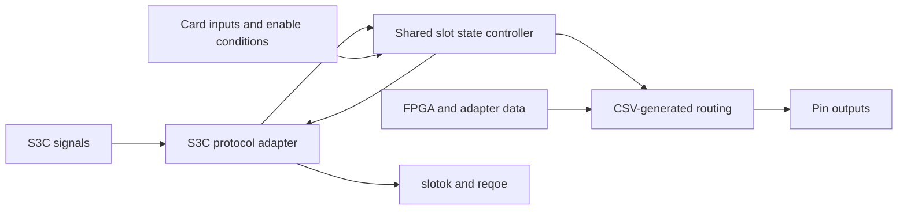

# Codex conversation

## User

Check this repo and the state of the s3c s3c_power_on_debounce program that is migrated from the archive. Is s3c_power_on_debaunce matching the existing archive program? in the archive, how are all the different .vhdl files interacting with each other?

## Assistant

I’ll locate the archived and migrated versions, compare their behavior, then trace how the archived VHDL files connect through their entities and port mappings.

## Activity

    $ git status --short && rg -n -i 's3c_power_on_debaunce|s3c_power_on_debounce' .
    bwrap: No permissions to create a new namespace, likely because the kernel does not allow non-privileged user namespaces. On e.g. debian this can be enabled with 'sysctl kernel.unprivileged_userns_clone=1'.
    ✗ (1) • 0ms

## Activity

    $ pwd && rg --files -g 'AGENTS.md' -g '*.vhdl' -g '*.vhd' -g '*s3c*' -g '*archive*'
    bwrap: No permissions to create a new namespace, likely because the kernel does not allow non-privileged user namespaces. On e.g. debian this can be enabled with 'sysctl kernel.unprivileged_userns_clone=1'.
    ✗ (1) • 0ms

## Activity

    $ pwd && rg --files -g 'AGENTS.md' -g '*.vhdl' -g '*.vhd' -g '*s3c*' -g '*archive*'
    /workspaces/uz_cpld
    archive/MACHXO2/S3C_CPLD_LCMXO2-4000HC-4TG144C/s3c_programmer.xcf
    archive/MACHXO2/S3C_CPLD_LCMXO2-4000HC-4TG144C/i2c_state/_math_real.vhd
    archive/MACHXO2/S3C_CPLD_LCMXO2-4000HC-4TG144C/i2c_state/uz_rev05_s3c_i2c_state_trce.asd
    archive/MACHXO2/S3C_CPLD_LCMXO2-4000HC-4TG144C/Power_on_debounce.vhd
    archive/MACHXO2/S3C_CPLD_LCMXO2-4000HC-4TG144C/efb_vhdl_tmpl.vhd
    programs/tx26_w_enable/tx26_w_enable.vhdl
    programs/uz_d_resolver_d4_4inverter_sdifix/uz_d_resolver_d4_4inverter_sdifix.vhdl
    archive/MACHXO2/D_Slot_CPLD_LCMXO2-2000HC-4TG100C/uz_d_slots/test_tmpl.vhd
    programs/s3c_toolchain_test_program/s3c_toolchain_test_program.vhdl
    archive/MACHXO2/S3C_CPLD_LCMXO2-4000HC-4TG144C/_math_real.vhd
    programs/s3c_toolchain_test_program/s3c_toolchain_test_program_constraints.lpf
    programs/s3c_toolchain_test_program/s3c_toolchain_test_program_tb.py
    programs/s3c_toolchain_test_program/s3c_toolchain_test_program.toml
    programs/rx30/rx30.vhdl
    programs/uz_d_resolver_d5_4inverter_sdifix/uz_d_resolver_d5_4inverter_sdifix.vhdl
    archive/MACHXO2/D_Slot_CPLD_LCMXO2-2000HC-4TG100C/uz_d_slots/tx30.vhdl
    programs/s3c_power_on_debounce/s3c_power_on_debounce.toml
    programs/s3c_power_on_debounce/s3c_power_on_debounce_foss_constraints.lpf
    programs/s3c_power_on_debounce/s3c_power_on_debounce_tb.py
    programs/s3c_power_on_debounce/s3c_power_on_debounce_constraints.lpf
    programs/s3c_power_on_debounce/s3c_power_on_debounce.vhdl
    archive/MACHXO2/S3C_CPLD_LCMXO2-4000HC-4TG144C/S3C_171224/source/Power_on_debounce.vhd
    archive/MACHXO2/S3C_CPLD_LCMXO2-4000HC-4TG144C/S3C_171224/source/POWER_ON.vhd
    archive/MACHXO2/S3C_CPLD_LCMXO2-4000HC-4TG144C/S3C_171224/_math_real.vhd
    archive/MACHXO2/S3C_CPLD_LCMXO2-4000HC-4TG144C/S3C_171224/uz_rev05_s3c_s3c_171224_trce.asd
    archive/MACHXO2/S3C_CPLD_LCMXO2-4000HC-4TG144C/POWER_ON.vhd
    archive/MACHXO2/S3C_CPLD_LCMXO2-4000HC-4TG144C/efb_vhdl.vhd
    archive/MACHXO2/S3C_CPLD_LCMXO2-4000HC-4TG144C/uz_rev05_s3c_impl_0_trce.asd
    archive/MACHXO2/D_Slot_CPLD_LCMXO2-2000HC-4TG100C/uz_d_slots/uz_d_resolver_d1_to_d4/source/uz_d_resolver_d1_to_d4.vhdl
    archive/MACHXO2/D_Slot_CPLD_LCMXO2-2000HC-4TG100C/uz_d_slots/uz_d_resolver_d1_to_d4/_math_real.vhd
    archive/MACHXO2/D_Slot_CPLD_LCMXO2-2000HC-4TG100C/uz_d_slots/template_dslots/source/template_w_enable.vhdl
    archive/MACHXO2/D_Slot_CPLD_LCMXO2-2000HC-4TG100C/uz_d_slots/template_dslots/_math_real.vhd
    archive/MACHXO2/D_Slot_CPLD_LCMXO2-2000HC-4TG100C/uz_d_slots/tx26_w_enable.vhdl
    archive/MACHXO2/D_Slot_CPLD_LCMXO2-2000HC-4TG100C/uz_d_slots/uz_d_resolver_d5/source/uz_d_resolver_d5.vhdl
    archive/MACHXO2/D_Slot_CPLD_LCMXO2-2000HC-4TG100C/uz_d_slots/uz_d_resolver_d5/_math_real.vhd
    archive/MACHXO2/D_Slot_CPLD_LCMXO2-2000HC-4TG100C/uz_d_slots/tx16_14rx/source/tx16_14rx.vhdl
    archive/MACHXO2/D_Slot_CPLD_LCMXO2-2000HC-4TG100C/uz_d_slots/tx16_14rx/_math_real.vhd
    archive/MACHXO2/D_Slot_CPLD_LCMXO2-2000HC-4TG100C/uz_d_slots/tx20_10rx/source/tx20_10rx.vhdl
    archive/MACHXO2/D_Slot_CPLD_LCMXO2-2000HC-4TG100C/uz_d_slots/tx20_10rx/_math_real.vhd
    archive/MACHXO2/D_Slot_CPLD_LCMXO2-2000HC-4TG100C/uz_d_slots/uz_d_resolver_d4_4inverter/source/uz_d_resolver_d4_4inverter.vhdl
    archive/MACHXO2/D_Slot_CPLD_LCMXO2-2000HC-4TG100C/uz_d_slots/uz_d_resolver_d4_4inverter/_math_real.vhd
    archive/MACHXO2/S2C_CPLD_LCMXO2-2000HC-4TG100C/S2C_150625/source/V01_0725.vhd
    programs/tx30/tx30.vhdl
    archive/MACHXO2/D_Slot_CPLD_LCMXO2-2000HC-4TG100C/uz_d_slots/uz_d_voltage_003_5V_tx30/_math_real.vhd
    archive/MACHXO2/D_Slot_CPLD_LCMXO2-2000HC-4TG100C/uz_d_slots/uz_d_voltage_013_tx30/_math_real.vhd
    archive/MACHXO2/D_Slot_CPLD_LCMXO2-2000HC-4TG100C/uz_d_slots/uz_d_abs_encoder/source/uz_d_abs_encoder.vhdl
    archive/MACHXO2/D_Slot_CPLD_LCMXO2-2000HC-4TG100C/uz_d_slots/uz_d_abs_encoder/_math_real.vhd
    archive/MACHXO2/D_Slot_CPLD_LCMXO2-2000HC-4TG100C/uz_d_slots/uz_d_resolve_d5.vhdl
    archive/MACHXO2/D_Slot_CPLD_LCMXO2-2000HC-4TG100C/uz_d_slots/old_implementations/tx26_w_enable/_math_real.vhd
    archive/MACHXO2/S2C_CPLD_LCMXO2-2000HC-4TG100C/S2C_150625/source/ipexpress/xo2/efb_vhdl_tmpl.vhd
    archive/MACHXO2/S2C_CPLD_LCMXO2-2000HC-4TG100C/S2C_150625/source/ipexpress/xo2/_math_real.vhd
    archive/MACHXO2/S2C_CPLD_LCMXO2-2000HC-4TG100C/S2C_150625/source/ipexpress/xo2/efb_vhdl.vhd
    archive/MACHXO2/S2C_CPLD_LCMXO2-2000HC-4TG100C/S2C_150625/_math_real.vhd
    archive/MACHXO2/S2C_CPLD_LCMXO2-2000HC-4TG100C/efb_tmpl.vhd
    archive/MACHXO2/S2C_CPLD_LCMXO2-2000HC-4TG100C/efb.vhd
    archive/MACHXO2/S2C_CPLD_LCMXO2-2000HC-4TG100C/_math_real.vhd
    archive/MACHXO2/D_Slot_CPLD_LCMXO2-2000HC-4TG100C/uz_d_slots/test_i2cuser_tmpl.vhd
    archive/MACHXO2/D_Slot_CPLD_LCMXO2-2000HC-4TG100C/uz_d_slots/uz_d_voltage_003_5V_tx30/source/tx30.vhdl
    archive/MACHXO2/D_Slot_CPLD_LCMXO2-2000HC-4TG100C/uz_d_slots/old_implementations/tx30/_math_real.vhd
    archive/MACHXO2/D_Slot_CPLD_LCMXO2-2000HC-4TG100C/uz_d_slots/optical_14tx_4rx/source/optical_14tx_4rx.vhdl
    archive/MACHXO2/D_Slot_CPLD_LCMXO2-2000HC-4TG100C/uz_d_slots/optical_14tx_4rx/_math_real.vhd
    archive/MACHXO2/D_Slot_CPLD_LCMXO2-2000HC-4TG100C/uz_d_slots/_math_real.vhd
    archive/MACHXO2/D_Slot_CPLD_LCMXO2-2000HC-4TG100C/uz_d_slots/i2c/_math_real.vhd
    archive/MACHXO2/D_Slot_CPLD_LCMXO2-2000HC-4TG100C/uz_d_slots/tx26_w_enable/source/tx26_w_enable.vhdl
    archive/MACHXO2/D_Slot_CPLD_LCMXO2-2000HC-4TG100C/uz_d_slots/uz_d_voltage_013_tx30/source/tx30.vhdl
    archive/MACHXO2/D_Slot_CPLD_LCMXO2-2000HC-4TG100C/uz_d_slots/tx26_w_enable/_math_real.vhd
    archive/MACHXO2/D_Slot_CPLD_LCMXO2-2000HC-4TG100C/uz_d_slots/i2c/i2c_gpio.vhd
    archive/MACHXO2/D_Slot_CPLD_LCMXO2-2000HC-4TG100C/uz_d_slots/i2c/test_i2c_dslot.vhd
    archive/MACHXO2/D_Slot_CPLD_LCMXO2-2000HC-4TG100C/uz_d_slots/uz_d_temperature_ltc2983/source/uz_d_temperature_ltc2983.vhdl
    archive/MACHXO2/D_Slot_CPLD_LCMXO2-2000HC-4TG100C/uz_d_slots/uz_d_temperature_ltc2983/_math_real.vhd
    archive/MACHXO2/D_Slot_CPLD_LCMXO2-2000HC-4TG100C/uz_d_slots/i2c/source/test_i2c_dslot.vhd
    archive/MACHXO2/D_Slot_CPLD_LCMXO2-2000HC-4TG100C/uz_d_slots/i2c/source/_math_real.vhd
    archive/MACHXO2/D_Slot_CPLD_LCMXO2-2000HC-4TG100C/uz_d_slots/i2c/source/i2c_gpio.vhd
    archive/ispMACH/LA4128V/archive/USACH/2.-I2C Master CPLD/main.vhd
    archive/ispMACH/LA4128V/archive/USACH/2.-I2C Master CPLD/i2c_master.vhd
    archive/MACHXO2/D_Slot_CPLD_LCMXO2-2000HC-4TG100C/uz_d_slots/tx30/source/tx30.vhdl
    archive/MACHXO2/D_Slot_CPLD_LCMXO2-2000HC-4TG100C/uz_d_slots/tx30/_math_real.vhd
    archive/ispMACH/LA4128V/uz_d_temperature_ltc2983/uz_tempcard_cpld_schematic.vhd
    archive/MACHXO2/D_Slot_CPLD_LCMXO2-2000HC-4TG100C/uz_d_slots/test_i2cuser.vhd
    archive/MACHXO2/D_Slot_CPLD_LCMXO2-2000HC-4TG100C/uz_d_slots/i2c/ipexpress/xo2/efb_vhdl.vhd
    archive/ispMACH/LA4128V/archive/USACH/3.-SPI Master CPLD/spi_master.vhd
    archive/ispMACH/LA4128V/EvalBoard/i2c_test/i2c_slave.vhd
    archive/MACHXO2/D_Slot_CPLD_LCMXO2-2000HC-4TG100C/uz_d_slots/uz_d_resolver_d5_4inverter/source/uz_d_resolver_d5_4inverter.vhdl
    archive/MACHXO2/D_Slot_CPLD_LCMXO2-2000HC-4TG100C/uz_d_slots/uz_d_resolver_d5_4inverter/_math_real.vhd
    archive/MACHXO2/D_Slot_CPLD_LCMXO2-2000HC-4TG100C/uz_d_slots/uz_d_3ph_inverter/_math_real.vhd
    archive/MACHXO2/D_Slot_CPLD_LCMXO2-2000HC-4TG100C/uz_d_slots/uz_d_3ph_inverter/source/uz_d_3ph_inverter.vhdl
    archive/ispMACH/LA4128V/archive/USACH/3.-SPI Master CPLD/main.vhd
    archive/ispMACH/LA4128V/archive/USACH/1.-I2C Slave CPLD/main.vhd
    archive/ispMACH/LA4128V/archive/USACH/1.-I2C Slave CPLD/I2C_slave.vhd
    archive/MACHXO2/D_Slot_CPLD_LCMXO2-2000HC-4TG100C/uz_d_slots/rx30/source/rx30.vhdl
    archive/MACHXO2/D_Slot_CPLD_LCMXO2-2000HC-4TG100C/uz_d_slots/rx30/_math_real.vhd
    ✓ • 1.34s

## Activity

    $ git status --short && rg -n -i 's3c_power_on_debaunce|s3c_power_on_debounce' .
     M .devcontainer/devcontainer.json
     M .devcontainer/diamond/devcontainer.json
     M docs/environments.rst
    ?? adapter_card_cpld_mapping.csv
    ./toolchain/tests/test_buildsystem.py:95:        diamond = load_build(self.root, 's3c_power_on_debounce', backend='diamond')
    ./toolchain/tests/test_buildsystem.py:98:            load_build(self.root, 's3c_power_on_debounce', backend='foss')
    ./toolchain/tests/test_buildsystem.py:114:                                    ('s3c_power_on_debounce', 'uz_s3c_xo2')])
    ./docs/validation.rst:14:``s3c_power_on_debounce`` is currently Diamond-only; FOSS ``build-all`` skips it while its mapped sequential equivalence remains unproven.
    ./docs/foss.rst:73:The S3C toolchain test program exercises the second device and package but does not implement the carrier's operating state machine. ``s3c_power_on_debounce`` extracts the archived ``S3C_171224`` controller for Diamond and simulation. Its FOSS firmware backend is disabled because mapped sequential equivalence remains unproven. A prepared FOSS LPF omits ``JTAG_PORT=DISABLE``, which Trellis cannot reproduce, corrects two bank-2 ``IO_TYPE`` declarations to 1.8 V, and translates one-based VHDL vector indices to zero-based Verilog indices. These differences and the archive's incomplete safety outputs require review before hardware use. Other archived S3C variants use ``MCCLK_FREQ=7``, which this FOSS flow still rejects.
    ./docs/simulation.rst:24:``s3c_power_on_debounce`` drives the archived controller's internal clock and checks its initial safe-state request, disabled slot outputs, and carrier power request. It does not cover the ready or shutdown transitions.
    ./docs/index.rst:5:The supported catalog contains five D-slot programs, the ``s3c_toolchain_test_program`` S3C build example, and the extracted ``s3c_power_on_debounce`` controller.
    ./programs/catalog.toml:1:programs = ["tx30", "rx30", "tx26_w_enable", "uz_d_resolver_d4_4inverter_sdifix", "uz_d_resolver_d5_4inverter_sdifix", "s3c_toolchain_test_program", "s3c_power_on_debounce"]
    ./programs/s3c_power_on_debounce/s3c_power_on_debounce.toml:1:name = "s3c_power_on_debounce"
    ./programs/s3c_power_on_debounce/s3c_power_on_debounce.toml:6:constraints = ["s3c_power_on_debounce_constraints.lpf"]
    ./programs/s3c_power_on_debounce/s3c_power_on_debounce.toml:7:foss_constraints = ["s3c_power_on_debounce_foss_constraints.lpf"]
    ./programs/s3c_power_on_debounce/s3c_power_on_debounce.toml:8:sources = [{path = "s3c_power_on_debounce.vhdl", library = "work"}]
    ./programs/s3c_power_on_debounce/s3c_power_on_debounce.toml:9:testbench = "s3c_power_on_debounce_tb.py"
    ✓ • 0ms

## Assistant

I found the migrated controller and two archived copies of the S3C controller, plus a second archived `POWER_ON` design and an EFB wrapper. I’m checking which files were actually part of the archived project and whether the migrated code preserves their connections and timing.

## Activity

    $ rg --files archive/MACHXO2/S3C_CPLD_LCMXO2-4000HC-4TG144C | sort
    archive/MACHXO2/S3C_CPLD_LCMXO2-4000HC-4TG144C/ButtonDebounce_lse.twr
    archive/MACHXO2/S3C_CPLD_LCMXO2-4000HC-4TG144C/ButtonDebounce_prim.v
    archive/MACHXO2/S3C_CPLD_LCMXO2-4000HC-4TG144C/POWER_ON.vhd
    archive/MACHXO2/S3C_CPLD_LCMXO2-4000HC-4TG144C/PowerControl_lse.twr
    archive/MACHXO2/S3C_CPLD_LCMXO2-4000HC-4TG144C/PowerControl_prim.v
    archive/MACHXO2/S3C_CPLD_LCMXO2-4000HC-4TG144C/Power_on_debounce.vhd
    archive/MACHXO2/S3C_CPLD_LCMXO2-4000HC-4TG144C/Powerup_V0_lse.twr
    archive/MACHXO2/S3C_CPLD_LCMXO2-4000HC-4TG144C/Powerup_V0_prim.v
    archive/MACHXO2/S3C_CPLD_LCMXO2-4000HC-4TG144C/S3C_171224/UZ_Rev05_S3C_S3C_171224.alt
    archive/MACHXO2/S3C_CPLD_LCMXO2-4000HC-4TG144C/S3C_171224/UZ_Rev05_S3C_S3C_171224.arearep
    archive/MACHXO2/S3C_CPLD_LCMXO2-4000HC-4TG144C/S3C_171224/UZ_Rev05_S3C_S3C_171224.bgn
    archive/MACHXO2/S3C_CPLD_LCMXO2-4000HC-4TG144C/S3C_171224/UZ_Rev05_S3C_S3C_171224.bit
    archive/MACHXO2/S3C_CPLD_LCMXO2-4000HC-4TG144C/S3C_171224/UZ_Rev05_S3C_S3C_171224.drc
    archive/MACHXO2/S3C_CPLD_LCMXO2-4000HC-4TG144C/S3C_171224/UZ_Rev05_S3C_S3C_171224.jed
    archive/MACHXO2/S3C_CPLD_LCMXO2-4000HC-4TG144C/S3C_171224/UZ_Rev05_S3C_S3C_171224.lpf
    archive/MACHXO2/S3C_CPLD_LCMXO2-4000HC-4TG144C/S3C_171224/UZ_Rev05_S3C_S3C_171224.lsedata
    archive/MACHXO2/S3C_CPLD_LCMXO2-4000HC-4TG144C/S3C_171224/UZ_Rev05_S3C_S3C_171224.mrp
    archive/MACHXO2/S3C_CPLD_LCMXO2-4000HC-4TG144C/S3C_171224/UZ_Rev05_S3C_S3C_171224.ncd
    archive/MACHXO2/S3C_CPLD_LCMXO2-4000HC-4TG144C/S3C_171224/UZ_Rev05_S3C_S3C_171224.ngd
    archive/MACHXO2/S3C_CPLD_LCMXO2-4000HC-4TG144C/S3C_171224/UZ_Rev05_S3C_S3C_171224.p2t
    archive/MACHXO2/S3C_CPLD_LCMXO2-4000HC-4TG144C/S3C_171224/UZ_Rev05_S3C_S3C_171224.p3t
    archive/MACHXO2/S3C_CPLD_LCMXO2-4000HC-4TG144C/S3C_171224/UZ_Rev05_S3C_S3C_171224.pad
    archive/MACHXO2/S3C_CPLD_LCMXO2-4000HC-4TG144C/S3C_171224/UZ_Rev05_S3C_S3C_171224.par
    archive/MACHXO2/S3C_CPLD_LCMXO2-4000HC-4TG144C/S3C_171224/UZ_Rev05_S3C_S3C_171224.prf
    archive/MACHXO2/S3C_CPLD_LCMXO2-4000HC-4TG144C/S3C_171224/UZ_Rev05_S3C_S3C_171224.pt
    archive/MACHXO2/S3C_CPLD_LCMXO2-4000HC-4TG144C/S3C_171224/UZ_Rev05_S3C_S3C_171224.t2b
    archive/MACHXO2/S3C_CPLD_LCMXO2-4000HC-4TG144C/S3C_171224/UZ_Rev05_S3C_S3C_171224.twr
    archive/MACHXO2/S3C_CPLD_LCMXO2-4000HC-4TG144C/S3C_171224/UZ_Rev05_S3C_S3C_171224_lattice.synproj
    archive/MACHXO2/S3C_CPLD_LCMXO2-4000HC-4TG144C/S3C_171224/UZ_Rev05_S3C_S3C_171224_map.asd
    archive/MACHXO2/S3C_CPLD_LCMXO2-4000HC-4TG144C/S3C_171224/UZ_Rev05_S3C_S3C_171224_map.cam
    archive/MACHXO2/S3C_CPLD_LCMXO2-4000HC-4TG144C/S3C_171224/UZ_Rev05_S3C_S3C_171224_map.hrr
    archive/MACHXO2/S3C_CPLD_LCMXO2-4000HC-4TG144C/S3C_171224/UZ_Rev05_S3C_S3C_171224_map.ncd
    archive/MACHXO2/S3C_CPLD_LCMXO2-4000HC-4TG144C/S3C_171224/Waiting_for_Powerbutton_pressed_V0_lse.twr
    archive/MACHXO2/S3C_CPLD_LCMXO2-4000HC-4TG144C/S3C_171224/Waiting_for_Powerbutton_pressed_V0_prim.v
    archive/MACHXO2/S3C_CPLD_LCMXO2-4000HC-4TG144C/S3C_171224/_math_real.vhd
    archive/MACHXO2/S3C_CPLD_LCMXO2-4000HC-4TG144C/S3C_171224/impl_0.xcf
    archive/MACHXO2/S3C_CPLD_LCMXO2-4000HC-4TG144C/S3C_171224/source/POWER_ON.vhd
    archive/MACHXO2/S3C_CPLD_LCMXO2-4000HC-4TG144C/S3C_171224/source/Power_on_debounce.vhd
    archive/MACHXO2/S3C_CPLD_LCMXO2-4000HC-4TG144C/S3C_171224/source/UZ_Rev05_S3C.lpf
    archive/MACHXO2/S3C_CPLD_LCMXO2-4000HC-4TG144C/S3C_171224/uz_rev05_s3c_s3c_171224_trce.asd
    archive/MACHXO2/S3C_CPLD_LCMXO2-4000HC-4TG144C/S3C_171224/xxx_lse_cp_file_list
    archive/MACHXO2/S3C_CPLD_LCMXO2-4000HC-4TG144C/S3C_171224/xxx_lse_sign_file
    archive/MACHXO2/S3C_CPLD_LCMXO2-4000HC-4TG144C/UZ_Rev05_S3C.ldf
    archive/MACHXO2/S3C_CPLD_LCMXO2-4000HC-4TG144C/UZ_Rev05_S3C.lpf
    archive/MACHXO2/S3C_CPLD_LCMXO2-4000HC-4TG144C/UZ_Rev05_S3C_impl_0.alt
    archive/MACHXO2/S3C_CPLD_LCMXO2-4000HC-4TG144C/UZ_Rev05_S3C_impl_0.arearep
    archive/MACHXO2/S3C_CPLD_LCMXO2-4000HC-4TG144C/UZ_Rev05_S3C_impl_0.bgn
    archive/MACHXO2/S3C_CPLD_LCMXO2-4000HC-4TG144C/UZ_Rev05_S3C_impl_0.bit
    archive/MACHXO2/S3C_CPLD_LCMXO2-4000HC-4TG144C/UZ_Rev05_S3C_impl_0.drc
    archive/MACHXO2/S3C_CPLD_LCMXO2-4000HC-4TG144C/UZ_Rev05_S3C_impl_0.lpf
    archive/MACHXO2/S3C_CPLD_LCMXO2-4000HC-4TG144C/UZ_Rev05_S3C_impl_0.lsedata
    archive/MACHXO2/S3C_CPLD_LCMXO2-4000HC-4TG144C/UZ_Rev05_S3C_impl_0.mrp
    archive/MACHXO2/S3C_CPLD_LCMXO2-4000HC-4TG144C/UZ_Rev05_S3C_impl_0.ncd
    archive/MACHXO2/S3C_CPLD_LCMXO2-4000HC-4TG144C/UZ_Rev05_S3C_impl_0.ngd
    archive/MACHXO2/S3C_CPLD_LCMXO2-4000HC-4TG144C/UZ_Rev05_S3C_impl_0.p2t
    archive/MACHXO2/S3C_CPLD_LCMXO2-4000HC-4TG144C/UZ_Rev05_S3C_impl_0.p3t
    archive/MACHXO2/S3C_CPLD_LCMXO2-4000HC-4TG144C/UZ_Rev05_S3C_impl_0.pad
    archive/MACHXO2/S3C_CPLD_LCMXO2-4000HC-4TG144C/UZ_Rev05_S3C_impl_0.par
    archive/MACHXO2/S3C_CPLD_LCMXO2-4000HC-4TG144C/UZ_Rev05_S3C_impl_0.prf
    archive/MACHXO2/S3C_CPLD_LCMXO2-4000HC-4TG144C/UZ_Rev05_S3C_impl_0.pt
    archive/MACHXO2/S3C_CPLD_LCMXO2-4000HC-4TG144C/UZ_Rev05_S3C_impl_0.t2b
    archive/MACHXO2/S3C_CPLD_LCMXO2-4000HC-4TG144C/UZ_Rev05_S3C_impl_0.twr
    archive/MACHXO2/S3C_CPLD_LCMXO2-4000HC-4TG144C/UZ_Rev05_S3C_impl_0_lattice.synproj
    archive/MACHXO2/S3C_CPLD_LCMXO2-4000HC-4TG144C/UZ_Rev05_S3C_impl_0_lse.twr
    archive/MACHXO2/S3C_CPLD_LCMXO2-4000HC-4TG144C/UZ_Rev05_S3C_impl_0_map.asd
    archive/MACHXO2/S3C_CPLD_LCMXO2-4000HC-4TG144C/UZ_Rev05_S3C_impl_0_map.cam
    archive/MACHXO2/S3C_CPLD_LCMXO2-4000HC-4TG144C/UZ_Rev05_S3C_impl_0_map.hrr
    archive/MACHXO2/S3C_CPLD_LCMXO2-4000HC-4TG144C/UZ_Rev05_S3C_impl_0_map.ncd
    archive/MACHXO2/S3C_CPLD_LCMXO2-4000HC-4TG144C/UZ_Rev05_S3C_old.jed
    archive/MACHXO2/S3C_CPLD_LCMXO2-4000HC-4TG144C/_math_real.vhd
    archive/MACHXO2/S3C_CPLD_LCMXO2-4000HC-4TG144C/archive/pre_heartbeat_master_ef7bac2/S3C_171224/UZ_Rev05_S3C_S3C_171224.jed
    archive/MACHXO2/S3C_CPLD_LCMXO2-4000HC-4TG144C/archive/pre_heartbeat_master_ef7bac2/S3C_Rev06_beta/UZ_Rev05_S3C_S3C_Rev06_beta.jed
    archive/MACHXO2/S3C_CPLD_LCMXO2-4000HC-4TG144C/efb_vhdl.edn
    archive/MACHXO2/S3C_CPLD_LCMXO2-4000HC-4TG144C/efb_vhdl.ipx
    archive/MACHXO2/S3C_CPLD_LCMXO2-4000HC-4TG144C/efb_vhdl.lpc
    archive/MACHXO2/S3C_CPLD_LCMXO2-4000HC-4TG144C/efb_vhdl.sort
    archive/MACHXO2/S3C_CPLD_LCMXO2-4000HC-4TG144C/efb_vhdl.vhd
    archive/MACHXO2/S3C_CPLD_LCMXO2-4000HC-4TG144C/efb_vhdl_tmpl.vhd
    archive/MACHXO2/S3C_CPLD_LCMXO2-4000HC-4TG144C/i2c_state/UZ_Rev05_S3C_i2c_state.alt
    archive/MACHXO2/S3C_CPLD_LCMXO2-4000HC-4TG144C/i2c_state/UZ_Rev05_S3C_i2c_state.arearep
    archive/MACHXO2/S3C_CPLD_LCMXO2-4000HC-4TG144C/i2c_state/UZ_Rev05_S3C_i2c_state.bgn
    archive/MACHXO2/S3C_CPLD_LCMXO2-4000HC-4TG144C/i2c_state/UZ_Rev05_S3C_i2c_state.bit
    archive/MACHXO2/S3C_CPLD_LCMXO2-4000HC-4TG144C/i2c_state/UZ_Rev05_S3C_i2c_state.drc
    archive/MACHXO2/S3C_CPLD_LCMXO2-4000HC-4TG144C/i2c_state/UZ_Rev05_S3C_i2c_state.jed
    archive/MACHXO2/S3C_CPLD_LCMXO2-4000HC-4TG144C/i2c_state/UZ_Rev05_S3C_i2c_state.lpf
    archive/MACHXO2/S3C_CPLD_LCMXO2-4000HC-4TG144C/i2c_state/UZ_Rev05_S3C_i2c_state.lsedata
    archive/MACHXO2/S3C_CPLD_LCMXO2-4000HC-4TG144C/i2c_state/UZ_Rev05_S3C_i2c_state.mrp
    archive/MACHXO2/S3C_CPLD_LCMXO2-4000HC-4TG144C/i2c_state/UZ_Rev05_S3C_i2c_state.ncd
    archive/MACHXO2/S3C_CPLD_LCMXO2-4000HC-4TG144C/i2c_state/UZ_Rev05_S3C_i2c_state.ngd
    archive/MACHXO2/S3C_CPLD_LCMXO2-4000HC-4TG144C/i2c_state/UZ_Rev05_S3C_i2c_state.p2t
    archive/MACHXO2/S3C_CPLD_LCMXO2-4000HC-4TG144C/i2c_state/UZ_Rev05_S3C_i2c_state.p3t
    archive/MACHXO2/S3C_CPLD_LCMXO2-4000HC-4TG144C/i2c_state/UZ_Rev05_S3C_i2c_state.pad
    archive/MACHXO2/S3C_CPLD_LCMXO2-4000HC-4TG144C/i2c_state/UZ_Rev05_S3C_i2c_state.par
    archive/MACHXO2/S3C_CPLD_LCMXO2-4000HC-4TG144C/i2c_state/UZ_Rev05_S3C_i2c_state.prf
    archive/MACHXO2/S3C_CPLD_LCMXO2-4000HC-4TG144C/i2c_state/UZ_Rev05_S3C_i2c_state.pt
    archive/MACHXO2/S3C_CPLD_LCMXO2-4000HC-4TG144C/i2c_state/UZ_Rev05_S3C_i2c_state.t2b
    archive/MACHXO2/S3C_CPLD_LCMXO2-4000HC-4TG144C/i2c_state/UZ_Rev05_S3C_i2c_state.twr
    archive/MACHXO2/S3C_CPLD_LCMXO2-4000HC-4TG144C/i2c_state/UZ_Rev05_S3C_i2c_state_lattice.synproj
    archive/MACHXO2/S3C_CPLD_LCMXO2-4000HC-4TG144C/i2c_state/UZ_Rev05_S3C_i2c_state_map.asd
    archive/MACHXO2/S3C_CPLD_LCMXO2-4000HC-4TG144C/i2c_state/UZ_Rev05_S3C_i2c_state_map.cam
    archive/MACHXO2/S3C_CPLD_LCMXO2-4000HC-4TG144C/i2c_state/UZ_Rev05_S3C_i2c_state_map.hrr
    archive/MACHXO2/S3C_CPLD_LCMXO2-4000HC-4TG144C/i2c_state/UZ_Rev05_S3C_i2c_state_map.ncd
    archive/MACHXO2/S3C_CPLD_LCMXO2-4000HC-4TG144C/i2c_state/Waiting_for_Powerbutton_pressed_V0_lse.twr
    archive/MACHXO2/S3C_CPLD_LCMXO2-4000HC-4TG144C/i2c_state/Waiting_for_Powerbutton_pressed_V0_prim.v
    archive/MACHXO2/S3C_CPLD_LCMXO2-4000HC-4TG144C/i2c_state/_math_real.vhd
    archive/MACHXO2/S3C_CPLD_LCMXO2-4000HC-4TG144C/i2c_state/uz_rev05_s3c_i2c_state_trce.asd
    archive/MACHXO2/S3C_CPLD_LCMXO2-4000HC-4TG144C/i2c_state/xxx_lse_cp_file_list
    archive/MACHXO2/S3C_CPLD_LCMXO2-4000HC-4TG144C/i2c_state/xxx_lse_sign_file
    archive/MACHXO2/S3C_CPLD_LCMXO2-4000HC-4TG144C/impl_0.xcf
    archive/MACHXO2/S3C_CPLD_LCMXO2-4000HC-4TG144C/impl_0_syn.prj
    archive/MACHXO2/S3C_CPLD_LCMXO2-4000HC-4TG144C/s3c_programmer.xcf
    archive/MACHXO2/S3C_CPLD_LCMXO2-4000HC-4TG144C/uz_rev05_s3c_impl_0_trce.asd
    archive/MACHXO2/S3C_CPLD_LCMXO2-4000HC-4TG144C/xxx_lse_cp_file_list
    archive/MACHXO2/S3C_CPLD_LCMXO2-4000HC-4TG144C/xxx_lse_sign_file
    ✓ • 2.08s

## Activity

    $ cat archive/MACHXO2/S3C_CPLD_LCMXO2-4000HC-4TG144C/Power_on_debounce.vhd && cat archive/MACHXO2/S3C_CPLD_LCMXO2-4000HC-4TG144C/POWER_ON.vhd
    library IEEE;
    library machxo2;
    use machxo2.all;
    use IEEE.STD_LOGIC_1164.ALL;
    use IEEE.STD_LOGIC_ARITH.ALL;
    use IEEE.STD_LOGIC_UNSIGNED.ALL;
    entity Waiting_for_Powerbutton_pressed_V0 is
    
        Port (
            -- Mapping nach B�nken
            --i2c
            SCL      : inout std_logic; -- PIN 126, CLK
            SDA      : inout std_logic; -- PIN 125, DATA
            RST_N    : in std_logic; -- RST; stop Taster PIN 122
            --- Bank 0, 3.3V
            FP_SysLEDg        : out STD_LOGIC; -- LED gr�n Power, PIN 141
            FP_SysLEDr        : out STD_LOGIC; -- LED rot Power, PIN 142
            FP_SysLEDb        : out STD_LOGIC;  -- Power, PIN 143
            Carrier_PG_3V3    : out STD_LOGIC := 'Z';  -- Powergood 3.3V, PIN 115
            FPIO_FlexMIO52     : out STD_LOGIC; -- wird in ps invertiert, FlexMIOs52_PCIe durchgeroutet, PIN 109
            FPIO_ExternalStop    : in  STD_LOGIC; -- FP Externer Stop taster, PIN 114
            FPIO_isoCtrlRSTn    : out  STD_LOGIC; -- FP IO PIN 119
            -- Tastersignale FP
            SysSW_Pwr_NC     :         in  STD_LOGIC;    -- Eingang durch Powerbutton, PIN 121
            FP_UsrSW1        :        in  STD_LOGIC;     -- Eingang SW1 Enable System, PIN 128
            FP_UsrSW2        :        in  STD_LOGIC;     -- Eingang SW2 Enable Control, PIN 127
            FP_UsrSW3        :        in  STD_LOGIC;     -- Eingang SW3 STOP, PIN 122
            --- Bank 1, 1.8V
            FP_UsrLED1        : out STD_LOGIC; -- LED 1 Ready, PIN 95
            FP_UsrLED2        : out STD_LOGIC; -- LED 2 Running, PIN 96
            FP_UsrLED3        : out STD_LOGIC; -- LED 3 Error, PIN 97
            FP_UsrLED4        : out STD_LOGIC; -- LED 4 User, PIN 98
            FP_SysLEDs        : out STD_LOGIC; -- LED rot STOP, PIN 104
            Carrier_PG_1V8    : out STD_LOGIC := 'Z';  -- ResetN Port, Powergood 1.8V PIN 107
            SD0_CD            : in STD_LOGIC;  -- PIN 100
            SD1_CD            : in STD_LOGIC;  -- PIN 103
            DIGS3C_Shared_CarrierReady : out STD_LOGIC;  -- PIN 94
            DIGS3C_Shared_ReqSafeState : out STD_LOGIC;  -- PIN 93
    
            DIGS3C_SlotD1_ReqOE : in STD_LOGIC;  -- PIN 92
            DIGS3C_SlotD1_SlotOK : in STD_LOGIC;  -- PIN 91
    
            DIGS3C_SlotD2_ReqOE : in STD_LOGIC;  -- PIN 89
            DIGS3C_SlotD2_SlotOK : in STD_LOGIC;  -- PIN 87
    
            DIGS3C_SlotD3_ReqOE : in STD_LOGIC;  -- PIN 86
            DIGS3C_SlotD3_SlotOK : in STD_LOGIC;  -- PIN 85
    
            DIGS3C_SlotD4_ReqOE : in STD_LOGIC;  -- PIN 84
            DIGS3C_SlotD4_SlotOK : in STD_LOGIC;  -- PIN 83
    
            DIGS3C_SlotD5_ReqOE : in STD_LOGIC;  -- PIN 82
            DIGS3C_SlotD5_SlotOK : in STD_LOGIC;  -- PIN 81
    
            --- Bank 2, 1.8V
            SD_SEL        : out STD_LOGIC := '0'; -- Signal, dass auf 0 getrieben werden soll, PIN 41
            FlexMIOs52_PCIe    : in  STD_LOGIC; -- Durchrouten zu FrontpanelIO.FlexMIO52_PCIe-R�S�T�, invertierung in PS PIN 47
            FlexMio61ExternalStop     : out STD_LOGIC; -- ExternalStop durchgeroutet, PIN 50
            FlexMIOs53_GPIO_PowerDown:out  STD_LOGIC; -- GPIO perform SoM Shutdown Signal, PIN 48
    
            --- Bank 3, 1.8V
    
            --- Bank 4, 3.3V
            ANL_S3C_SlotOK1 : in STD_LOGIC;  -- PIN 23
            ANL_S3C_SlotOK2 : in STD_LOGIC;  -- PIN 22
            ANL_S3C_SlotOK3 : in STD_LOGIC;  -- PIN 21
            ANL_S3C_CarrierReady: out STD_LOGIC;  -- PIN 24
            ANL_S3C_P54_Legacy    : out STD_LOGIC;  -- PIN 13
    
            DIGS3C_SlotD1_SlotOE : out STD_LOGIC;  -- PIN 20
            DIGS3C_SlotD2_SlotOE : out STD_LOGIC;  -- PIN 19
            DIGS3C_SlotD3_SlotOE : out STD_LOGIC;  -- PIN 17
            DIGS3C_SlotD4_SlotOE : out STD_LOGIC;  -- PIN 15
            DIGS3C_SlotD5_SlotOE : out STD_LOGIC;  -- PIN 14
    
    
            --- Bank 5, 3.3V
            Carrier_PwrOn     : out STD_LOGIC;       -- PIN 1
            PG_VIN            : in STD_LOGIC;        -- PIN 2
            PPn_VIN            : in STD_LOGIC;        -- PIN 3
            PG_Module         : in STD_LOGIC        -- PIN 9
        );
    
    end Waiting_for_Powerbutton_pressed_V0;
    
    architecture behavior of Waiting_for_Powerbutton_pressed_V0 is
        signal clk    :    STD_LOGIC;
        signal counter : integer range 0 to 4160000 := 0;     -- Z�hler
        signal count_done_100ms : boolean := false;             -- Flag f�r 100ms Ende
        signal reset_triggered : boolean := false; -- Flag, um zu tracken, dass resetn auf '0' gesetzt wurde
    
        -- Definition der Zust�nde der State Machine
        type state_type is (Waiting_for_Powerbutton_pressed,Waiting_for_Powerbutton_released,Wait_State, EthernetPhy_Reset,SoftPowerOff, Ready_State, Warning, Error, PowerOff);
        signal next_state : state_type:= Waiting_for_Powerbutton_pressed;
    
        -- Entprell-Zeitkonstante
        constant debounce_limit : integer := 20800; -- 10ms, bei 2.08MhZ
    
        -- Entprell-Z�hler und stabile Zust�nde der Taster
        type debounce_array is array (0 to 3) of integer;
        signal debounce_counters : debounce_array := (others => 0);
        signal button_inputs  : STD_LOGIC_VECTOR(3 downto 0);  -- Tastereing�nge
        signal button_inputs_asyn1  : STD_LOGIC_VECTOR(3 downto 0) := (others => '1');  -- Tastereing�nge nach 1. flip flop
        signal button_inputs_asyn2  : STD_LOGIC_VECTOR(3 downto 0) := (others => '1'); -- Tastereing�nge nach 2. flip flop
        signal pushed : STD_LOGIC_VECTOR(3 downto 0) := (others => '0');
        signal buttons_debounced_syn   : STD_LOGIC_VECTOR(3 downto 0) := (others => '1');
    
        -- Dslot
        signal dig_slot_alive :    STD_LOGIC;
        -- internen oszillator definieren
        COMPONENT OSCH
        -- synthesis translate_off
        GENERIC (NOM_FREQ: string := "7");
        -- synthesis translate_on
        PORT (
            STDBY    :    IN    std_logic;
            OSC        :    OUT    std_logic;
            SEDSTDBY:    OUT    std_logic);
        END COMPONENT;
        attribute NOM_FREQ     : string;
        attribute NOM_FREQ of OSCinst0 : label is "7";
        attribute HGROUP     : string;
    
    begin
        OSCInst0: OSCH
        -- synthesis translate_off
        GENERIC MAP( NOM_FREQ => "7" )
        -- synthesis translate_on
        PORT MAP (STDBY=> '0',
        OSC => clk,
        SEDSTDBY => open
        );
    
    -- Ports default setzen + durchrouten
    SD_SEL <= '0';
    FPIO_FlexMIO52 <= FlexMIOs52_PCIe;
    FlexMio61ExternalStop <= FPIO_ExternalStop;
    
    -- DSlot�berwachung
    dig_slot_alive <= DIGS3C_SlotD1_SlotOK AND DIGS3C_SlotD2_SlotOK AND DIGS3C_SlotD3_SlotOK AND DIGS3C_SlotD4_SlotOK AND DIGS3C_SlotD5_SlotOK;
    -- Mapping der Taster zu einem Vektor f�r einfachere Handhabung
    button_inputs(0) <= SysSW_Pwr_NC;
    button_inputs(1) <= FPIO_ExternalStop;
    button_inputs(2) <= FP_UsrSW3;
    button_inputs(3) <= FP_UsrSW1;
    -- Achtung!!! Signal muss noch durch twoStageSynchronizer!!
    -- siehe https://www.digikey.com/en/articles/how-to-debounce-a-button-input-using-programmable-logic
    -- realisiert 18.11. und getestet
    -- 2FF Synchronizer von https://vhdlwhiz.com/snippets/fork-and-join/
    
    process(clk)
        begin
            if rising_edge(clk) then
                --2FF
                button_inputs_asyn1 <= button_inputs;
                button_inputs_asyn2 <= button_inputs_asyn1;
                -- button_inputs_asyn2 ist safe, keine metastabilit�t probleme
    
                -- Entprellung f�r jedes Signal im Vektor
                for i in 0 to 3 loop
                    if button_inputs_asyn2(i) = '0' then  -- Taster gedr�ckt (LOW)
                        if debounce_counters(i) < debounce_limit then
                            debounce_counters(i) <= debounce_counters(i) + 1;
                        else
                            pushed(i) <= '1';  -- Taster gedr�ckt = True
                        end if;
                    else  -- Taster losgelassen (HIGH)
                        debounce_counters(i) <= 0;
                        pushed(i) <= '0';
                    end if;
                    -- Ausgabe negiert
                    if pushed(i) = '1' then
                        buttons_debounced_syn(i) <= '0';
                    else
                        buttons_debounced_syn(i) <= '1';
                    end if;
                end loop;
            end if;
    end process;
    
    -- Taster debouncen
    --process(clk)
        --begin
            --if rising_edge(clk) then
                 --Entprellung f�r jedes Signal im Vektor
                --for i in 0 to 2 loop
                    --if button_inputs_asyn1(i) = '0' then  -- Taster gedr�ckt (LOW)
                        --if debounce_counters(i) < debounce_limit then
                            --debounce_counters(i) <= debounce_counters(i) + 1;
                        --else
                            --pushed(i) <= '1';  -- Taster bleibt gedr�ckt
                        --end if;
                    --else  -- Taster losgelassen (HIGH)
                        --debounce_counters(i) <= 0;
                        --pushed(i) <= '0';
                    --end if;
                     --Ausgabe negiert
                    --if pushed(i) = '1' then
                        --buttons_debounced_syn(i) <= '0';
                    --else
                        --buttons_debounced_syn(i) <= '1';
                    --end if;
                --end loop;
            --end if;
    --end process;
    
    FP_UsrLED1 <=  buttons_debounced_syn(0);
    FP_UsrLED2 <= buttons_debounced_syn(1);
    FP_UsrLED3 <= buttons_debounced_syn(2);
    FP_UsrLED4 <= buttons_debounced_syn(3);
    -- State machine
    process(clk)
        begin
        if rising_edge(clk) then
            case next_state is
                when Waiting_for_Powerbutton_pressed =>
                FlexMIOs53_GPIO_PowerDown <= '0';
                FP_SysLEDr <= '1';
                FP_SysLEDb <= '0';
                FP_SysLEDg <= '0';
                if buttons_debounced_syn(0) = '0' then
                    next_state <= Waiting_for_Powerbutton_released;
                else
                    Carrier_PwrOn <= '0';  -- Alle Rails aus, nur Systemcpld lebt
                    Carrier_PG_3V3 <= '0';
                    FPIO_isoCtrlRSTn <= '0'; -- Reset IsoIO einschalten
                    Carrier_PG_1V8 <= 'Z';  -- Hochohmig, solange System aus
                end if;
    
                when Waiting_for_Powerbutton_released =>
                FP_SysLEDr <= '1';
                FP_SysLEDb <= '0';
                FP_SysLEDg <= '1';
                if buttons_debounced_syn(0) = '1' then
                    Carrier_PwrOn <= '1';  -- Alle Rails enablen
                    Carrier_PG_3V3 <= '1'; -- Hack IsoIo ein wenn PwrOn
                    counter <= 2080000;
                    -- neuer Zustand wenn button ausgelassen
                    next_state <= Wait_State;
                end if;
    
                when Wait_State =>
                FP_SysLEDr <= '1';
                FP_SysLEDb <= '1';
                FP_SysLEDg <= '0';
                if counter > 0 then
                    counter <= counter - 1;
                else
                    counter <= 104000;
                    Carrier_PG_1V8 <= '0';  -- resetn f�r 50ms auf '0' setzen
                    next_state <= EthernetPhy_Reset;
                end if;
    
                when EthernetPhy_Reset =>
                --�bergang in den Ready_State nach Ethernet Reset
                FP_SysLEDr <= '0';
                FP_SysLEDb <= '1';
                FP_SysLEDg <= '0';
                if counter > 0 then
                    counter <= counter - 1;
                else
                    Carrier_PG_1V8 <= 'Z';  -- Nach 50ms wieder auf 'Z' setzen
                    FPIO_isoCtrlRSTn <= '1'; -- Reset IsoIO ausschalten
                    next_state <= Ready_State;
                end if;
    
                when Ready_State =>
                    FP_SysLEDr <= '0';
                    FP_SysLEDb <= '0';
                    FP_SysLEDg <= '1';
                    FP_SysLEDs <= '1';
                    -- wenn externer Stop gedr�ckt dann in Shutdown springen
                    if buttons_debounced_syn(1) = '0' then  -- Externer STOP-Taster gedr�ckt
                        next_state <= Error;
                    -- TODO auf 1s auf den Powertaster dr�cken erweitern
                    elsif buttons_debounced_syn(0) = '0' then  -- Power Taster gedr�ckt
                        counter <= 4160000;
                        next_state <= SoftPowerOff;
                    end if;
                when Warning =>
                    FP_SysLEDr <= '1';
                    FP_SysLEDb <= '0';
                    FP_SysLEDg <= '0';
                    FP_SysLEDs <= '0';
                    -- Von Warning geht es direkt in PowerOff
     --               next_state <= PowerOff;
                when Error =>
                    FP_SysLEDr <= '1';
                    FP_SysLEDb <= '1';
                    FP_SysLEDg <= '1';
                    FP_SysLEDs <= '0';
                    Carrier_PwrOn <= '0';  -- Alle Rails aus, nur Systemcpld lebt
                    Carrier_PG_3V3 <= '0';
                    FPIO_isoCtrlRSTn <= '0'; -- Reset IsoIO einschalten
                    -- Von Error wechselt das System zu PowerOff
    --                next_state <= PowerOff;
                when SoftPowerOff =>
                    FlexMIOs53_GPIO_PowerDown <= '1';
                    if counter > 0 then
                        counter <= counter - 1;
                    else
                        if buttons_debounced_syn(0) = '0' then
                            FlexMIOs53_GPIO_PowerDown <= '0';
                            next_state <= PowerOff;
                        end if;
                    end if;
                    if buttons_debounced_syn(0) = '1' then
                        FlexMIOs53_GPIO_PowerDown <= '0';
                        next_state <= Ready_State;
                    end if;
                when PowerOff =>
                    FP_SysLEDr <= '1';
                    FP_SysLEDb <= '0';
                    FP_SysLEDg <= '1';
                    FP_SysLEDs <= '0';
                    -- Endzustand; das System bleibt hier
                    Carrier_PwrOn <= '0';   -- Alle Rails aus, nur Systemcpld lebt
                    Carrier_PG_3V3 <= '0';
                    FPIO_isoCtrlRSTn <= '0'; -- Reset IsoIO einschalten
                    if buttons_debounced_syn(0) = '1' then
                        next_state <= Waiting_for_Powerbutton_pressed;
                    end if;
                when others =>
                    next_state <= Waiting_for_Powerbutton_pressed;
            end case;
        end if;
    end process;
    end behavior;library IEEE;
    library machxo2;
    use machxo2.all;
    use IEEE.STD_LOGIC_1164.ALL;
    use IEEE.STD_LOGIC_ARITH.ALL;
    use IEEE.STD_LOGIC_UNSIGNED.ALL;
    
    entity Powerup_V0 is
        Port (
            SysSW_Pwr_NC     :         in  STD_LOGIC;  -- Eingang durch Powerbutton
            Carrier_PwrOn     : out STD_LOGIC;   -- Ausgang (schalte alle Rails an)
            Carrier_PG_1V8            : out STD_LOGIC := 'Z';  -- ResetN Port, Powergood 1.8V
            SD_Select         : out STD_LOGIC := '0'; -- Signal, dass auf 0 getrieben werden soll
            FlexMIOs52_PCIe    : in  STD_LOGIC; -- Durchrouten zu FrontpanelIO.FlexMIO52_PCIe-R�S�T�, invertierung in PS
            FPIO_FlexMIO52     : out STD_LOGIC; -- wird in ps invertiert, FlexMIOs52_PCIe durchgeroutet
            FPIO_ExternalStop    : in  STD_LOGIC; -- FP Externer Stop taster
            FlexMio61ExternalStop     : out STD_LOGIC; -- ExternalStop durchgeroutet
            FP_UsrLED1        : out STD_LOGIC; -- LED 1 FP
            FP_UsrLED2        : out STD_LOGIC; -- LED 2 FP
            FP_UsrLED3        : out STD_LOGIC; -- LED 3 FP
            FP_UsrLED4        : out STD_LOGIC; -- LED 4 FP
            FP_SysLEDg        : out STD_LOGIC; -- LED gr�n Powertaster
            FP_SysLEDr        : out STD_LOGIC; -- LED rot Powertaster
            FP_SysLEDb        : out STD_LOGIC  -- LED blau Powertaster
        );
    
    end Powerup_V0;
    
    
    architecture behavior of Powerup_V0 is
    signal clk    :    STD_LOGIC;
    signal count_100ms : integer range 0 to 256000 := 0;     -- Z�hler f�r 100ms -> Powergood 1.8V ist high
    signal count_50ms  : integer range 0 to 128000 := 0;     -- Z�hler f�r 50ms -> Powergood 1,8V ist low
    signal count_done_100ms : boolean := false;             -- Flag f�r 100ms Ende
    signal reset_triggered : boolean := false; -- Flag, um zu tracken, dass resetn auf '0' gesetzt wurde
    
        -- internen oszillator definieren
        COMPONENT OSCH
        -- synthesis translate_off
        GENERIC (NOM_FREQ: string := "2.08");
        -- synthesis translate_on
        PORT (
            STDBY    :    IN    std_logic;
            OSC        :    OUT    std_logic;
            SEDSTDBY:    OUT    std_logic);
        END COMPONENT;
    attribute NOM_FREQ : string;
    attribute NOM_FREQ of OSCinst0 : label is "2.08";
    
    
    begin
        OSCInst0: OSCH
        -- synthesis translate_off
        GENERIC MAP( NOM_FREQ => "2.08" )
        -- synthesis translate_on
        PORT MAP (STDBY=> '0',
        OSC => clk,
        SEDSTDBY => open
        );
    -- Ports default auf einen Wert zu setzen oder einfach durchzurouten
    SD_Select <= '0';
    FPIO_FlexMIO52 <= FlexMIOs52_PCIe;
    FlexMio61ExternalStop <= FPIO_ExternalStop;
    
    -- Prozess f�r Power: Wenn Taster nicht gedr�ckt(NC=>1), ist UZ an
        process(SysSW_Pwr_NC)
        begin
            if SysSW_Pwr_NC = '1' then
                Carrier_PwrOn <= '1';  -- Alle Rails enablen
            else
                Carrier_PwrOn <= '0';  -- Alle Rails aus, nur Systemcpld lebt
            end if;
        end process;
    
    -- Prozess f�r Z�hler und Powergood/Ethernetphyreset-Steuerung
        process(clk)
        begin
            if rising_edge(clk) then
                if not count_done_100ms then
                    -- Z�hle zuerst 100ms
                    if count_100ms < 256000 then
                        count_100ms <= count_100ms + 1;
                    else
                        count_done_100ms <= true;  -- 100ms abgelaufen, Z�hler f�r 50ms starten
                        Carrier_PG_1V8 <= '0';  -- resetn f�r 50ms auf '0' setzen
                        FP_UsrLED1 <= '1'; -- led an wenn reset
                    end if;
                elsif count_done_100ms and not reset_triggered then
                    -- Z�hle 50ms, nachdem 100ms abgelaufen sind
                    if count_50ms < 128000 then
                        count_50ms <= count_50ms + 1;
                    else
                        Carrier_PG_1V8 <= 'Z';  -- Nach 50ms wieder auf 'Z' setzen
                        reset_triggered <= true;  -- Markiere, dass resetn auf 'Z' gesetzt wurde
                        FP_UsrLED1 <= '0';
                    end if;
                end if;
            end if;
        end process;
    end behavior;
    ✓ • 1.31s

## Activity

    $ cat archive/MACHXO2/S3C_CPLD_LCMXO2-4000HC-4TG144C/S3C_171224/source/Power_on_debounce.vhd && cat archive/MACHXO2/S3C_CPLD_LCMXO2-4000HC-4TG144C/S3C_171224/source/POWER_ON.vhd
    library IEEE;
    library machxo2;
    use machxo2.all;
    use IEEE.STD_LOGIC_1164.ALL;
    use IEEE.STD_LOGIC_ARITH.ALL;
    use IEEE.STD_LOGIC_UNSIGNED.ALL;
    entity Waiting_for_Powerbutton_pressed_V0 is
    
        Port (
            -- Mapping according to banks
            --- Bank 0, 3.3V
            FP_SysLEDg        : out STD_LOGIC; -- led green Power, pin 141
            FP_SysLEDr        : out STD_LOGIC; -- led red Power, pin 142
            FP_SysLEDb        : out STD_LOGIC;  --led blue Power, pin 143
            FlexIO05 : out STD_LOGIC; --drive 0
            FlexIO04 : in STD_LOGIC; -- pulldown
            FlexIO03 : in STD_LOGIC;-- pulldown
            FlexIO02 : out STD_LOGIC;--drive 0
            FlexIO01 : out STD_LOGIC;--drive 0
            FP_UsrSW1        :        in  STD_LOGIC;     -- button Enable System, pin 128
            FP_UsrSW2        :        in  STD_LOGIC;     -- button SW2 Enable Control, pin 127
            --i2c
            SCL      : inout std_logic; -- pin 126, i2c CLK
            SDA      : inout std_logic; -- pin 125, i2c DATA
            FP_UsrSW3        :        in  STD_LOGIC;     -- button SW3 STOP, pin 122
            SysSW_Pwr_NC     :         in  STD_LOGIC;    -- button Power, pin 121
            FPIO_isoCtrlRSTn    :     out STD_LOGIC;    -- Z  off, 1 on, none
            FPIO_iosCtrlINTn    :     in  STD_LOGIC;
            Carrier_PG_3V3    : out STD_LOGIC := 'Z';  -- Powergood 3.3V, pin 115
            FPIO_ExternalStop: in  STD_LOGIC; -- button external stop, pin 114
            FPIO_FlexMIO28     : inout STD_LOGIC:= 'Z'; --Z
            FPIO_FlexMIO27     : inout STD_LOGIC:= 'Z';
            FPIO_FlexMIO30     : inout STD_LOGIC:= 'Z';
            FPIO_FlexMIO29     : inout STD_LOGIC:= 'Z';
            FPIO_FlexMIO52     : out STD_LOGIC; -- is converted in ps, pin 109, Z
            --- Bank 1, 1.8V
            Carrier_PG_1V8    : out STD_LOGIC := 'Z';  -- ResetN Port, Powergood 1.8V pin 107
            S3CsI2C_SDA        : inout STD_LOGIC;
            S3CsI2C_SCL        : inout STD_LOGIC;
            FP_SysLEDs        : out STD_LOGIC; -- led red SW3, pin 104
            SD1_CD            : in STD_LOGIC;  -- pin 103
            SD0_CD            : in STD_LOGIC;  -- pin 100
            SPI_S3C_nCS_USR : in STD_LOGIC;
            FP_UsrLED         : out STD_LOGIC_VECTOR (4 downto 1);
            DIGS3C_Shared_CarrierReady : out STD_LOGIC;  -- pin 94
            DIGS3C_Shared_ReqSafeState : out STD_LOGIC;  -- pin 93
            DIGS3C_SlotD_ReqOE : in STD_LOGIC_VECTOR (5 downto 1); -- pin 92,89,86,84,82
            DIGS3C_SlotD_SlotOK : in STD_LOGIC_VECTOR (5 downto 1); -- pin 91,87,85,83,81
            FlexLIO         : inout STD_LOGIC_VECTOR (5 downto 0)  := (others => 'Z');
            --- Bank 2, 1.8V
            DIG5S3C26    : inout STD_LOGIC; --bidir,Z
            DIG5S3C25    : inout STD_LOGIC; --bidir,Z
            DIG5S3C24    : inout STD_LOGIC; --bidir,Z
            SD_SEL        : out STD_LOGIC := '0'; -- signal, that is driven to 0, pin 41
            -- Flex MIos
            FlexMIOs52_PCIe    : in  STD_LOGIC; -- routing through to FrontpanelIO.FlexMIO52_PCIe-R�S�T�, inversion in PS pin 47
            FlexMIOs53_GPIO_PowerDown:out  STD_LOGIC; -- gpio perform SoM Shutdown, pin 48
            FlexMIOs54    : inout STD_LOGIC; --bidir,Z
            FlexMio61ExternalStop     : out STD_LOGIC; -- external stop routed through, pin 50
            FlexMIOs62    : inout STD_LOGIC; --bidir,Z
            FlexMIOs63    : inout STD_LOGIC; --bidir,Z
            FlexMIOs31    : inout STD_LOGIC; --bidir,Z
            FlexMIOs30    : inout STD_LOGIC; --bidir,Z
            FlexMIOs29    : inout STD_LOGIC; --bidir,Z
            FlexMIOs28    : inout STD_LOGIC; --bidir,Z
            FlexMIOs27    : inout STD_LOGIC; --bidir,Z
            FlexMIOs26    : inout STD_LOGIC; --bidir,Z
            FlexMIOs45    : inout STD_LOGIC; --bidir,Z
            FlexMIOs37    : inout STD_LOGIC; --bidir,Z
            FlexMIOs36    : inout STD_LOGIC; --bidir,Z
            FlexMIOs35    : inout STD_LOGIC; --bidir,Z
            FlexMIOs34    : inout STD_LOGIC; --bidir,Z
            FlexMIOs33    : inout STD_LOGIC; --bidir,Z
            FlexMIOs32    : inout STD_LOGIC; --bidir,Z
            --- Bank 3, 1.8V
            DIG5S3C03    : inout STD_LOGIC; --bidir,Z
            DIG5S3C04    : inout STD_LOGIC; --bidir,Z
            DIG5S3C05    : inout STD_LOGIC; --bidir,Z
            DIG5S3C00    : inout STD_LOGIC; --bidir,Z
            DIG5S3C02    : inout STD_LOGIC; --bidir,Z
            DIG5S3C01    : inout STD_LOGIC; --bidir,Z
            DIG5S3C29    : inout STD_LOGIC; --bidir,Z
            DIG5S3C28    : inout STD_LOGIC; --bidir,Z
            DIG5S3C27    : inout STD_LOGIC; --bidir,Z
    
            --- Bank 4, 3.3V
            ANL_S3C_SLOTOK : in STD_LOGIC_VECTOR (3 downto 1); -- pin 23,22,21
            ANL_S3C_CarrierReady: out STD_LOGIC;  -- pin 24
            ANL_S3C_P54_Legacy    : inout STD_LOGIC;--bidir,Z,pin 13
            DIGS3C_SlotD_SlotOE : OUT STD_LOGIC_VECTOR (5 downto 1); -- pin 20,19,17,15,14
    
            --- Bank 5, 3.3V
            Carrier_PwrOn     : out STD_LOGIC;       -- pin 1
            PG_VIN            : in STD_LOGIC;        -- pin 2, none
            PPn_VIN            : in STD_LOGIC;        -- pin 3, none
            PG_Module         : in STD_LOGIC;        -- pin 9, none
            TDnSHDN            : in STD_LOGIC;        -- pin 4, none
            TDnFFnFS        : inout STD_LOGIC;    -- pin 5, none
            TDnALERT         : in STD_LOGIC;        -- pin 6, none
            S3C_S1             : in STD_LOGIC        -- pin 10, pulldown
        );
    
    end Waiting_for_Powerbutton_pressed_V0;
    
    architecture behavior of Waiting_for_Powerbutton_pressed_V0 is
        signal clk    :    STD_LOGIC;
        signal counter : integer range 0 to 31200000 := 0;     -- counter
        signal count_done_100ms : boolean := false;             -- flag for 100ms end
        signal reset_triggered : boolean := false; -- flag, to track resetn is zero
    
        -- states in statemachine
        type state_type is (Waiting_for_Powerbutton_pressed,Waiting_for_Powerbutton_released,Wait_State, EthernetPhy_Reset,Waiting_for_Powerbutton_pressed_2sec , Ready_State, Warning_State, Harderror,Softerror, sleep_for_dslot_down,Acknowledge_error ,Waiting_for_Powerbutton_released_after_2sec2 );
        signal next_state : state_type:= Waiting_for_Powerbutton_pressed;
    
        -- debounceconstant
        constant debounce_limit : integer := 20800; -- 10ms, at 2.08MhZ
    
        -- debounce counter and vectors for debouncing
        type debounce_array is array (1 to 6) of integer;
        signal debounce_counters : debounce_array := (others => 0);
        signal debounce_inputs  : STD_LOGIC_VECTOR(6 downto 1) ;  -- inputs
        signal debounce_inputs_asyn1  : STD_LOGIC_VECTOR(6 downto 1)  := (others => '1');  -- inputs after 1.flip flop
        signal debounce_inputs_asyn2  : STD_LOGIC_VECTOR(6 downto 1)  := (others => '1'); -- inputs after 2. flip flop
        signal pushed : STD_LOGIC_VECTOR(6 downto 1)  := (others => '0');
        signal signals_debounced_syn   : STD_LOGIC_VECTOR(6 downto 1)  := (others => '1');
        -- debounced signal
        signal power    :    STD_LOGIC;
        signal stopextern    :    STD_LOGIC;
        signal stop    :    STD_LOGIC;
        signal enable    :    STD_LOGIC;
        signal pg10v    :    STD_LOGIC;
        signal ppn6v    :    STD_LOGIC;
        signal warning     :     STD_LOGIC;
    
        -- detect external stop edge
        signal externstop_falling:     STD_LOGIC;
        signal externstop_last:     STD_LOGIC;
        signal extern_connected:     STD_LOGIC := '0';
        -- Tristate
        signal tristate_signals : std_logic_vector(30 downto 0);
        -- Dslot
        signal forceoutputdisable :        STD_LOGIC;
        -- define internal clock
        COMPONENT OSCH
        -- synthesis translate_off
        GENERIC (NOM_FREQ: string := "2.08");
        -- synthesis translate_on
        PORT (
            STDBY    :    IN    std_logic;
            OSC        :    OUT    std_logic;
            SEDSTDBY:    OUT    std_logic);
        END COMPONENT;
        attribute NOM_FREQ     : string;
        attribute NOM_FREQ of OSCinst0 : label is "2.08";
        attribute HGROUP     : string;
        signal dummy_signal : std_logic;
        attribute syn_keep : boolean;
        attribute noclip   : string;
        attribute noclip of dummy_signal  : signal is "on";
        attribute syn_keep of dummy_signal : signal is true;
    
    begin
        OSCInst0: OSCH
        -- synthesis translate_off
        GENERIC MAP( NOM_FREQ => "2.08" )
        -- synthesis translate_on
        PORT MAP (STDBY=> '0',
        OSC => clk,
        SEDSTDBY => open
        );
    --Dummy
    dummy_signal <= TDnALERT AND TDnFFnFS AND TDnSHDN AND PG_VIN and ANL_S3C_P54_Legacy AND ANL_S3C_SLOTOK(1) AND ANL_S3C_SLOTOK(2) AND ANL_S3C_SLOTOK(3)
    AND DIGS3C_SlotD_SlotOK(1) AND DIGS3C_SlotD_SlotOK(2) AND DIGS3C_SlotD_SlotOK(3) AND DIGS3C_SlotD_SlotOK(4) AND DIGS3C_SlotD_SlotOK(5)
    AND DIG5S3C00 AND DIG5S3C01 AND DIG5S3C02 AND DIG5S3C03 AND DIG5S3C04 AND DIG5S3C05
    AND DIG5S3C24 AND DIG5S3C25 AND DIG5S3C26 AND DIG5S3C27 AND DIG5S3C28 AND DIG5S3C29
    AND FPIO_FlexMIO27 AND FPIO_FlexMIO28 AND FPIO_FlexMIO29 AND FPIO_FlexMIO30
    AND FPIO_iosCtrlINTn AND FP_UsrSW2 AND FlexIO03 and FlexIO04
    AND FLexLIO(0) AND FLexLIO(1) AND FLexLIO(2) AND FLexLIO(3) AND FLexLIO(4) AND FLexLIO(5)
    AND FlexMIOs26 AND FlexMIOs27 AND FlexMIOs28 AND FlexMIOs29 AND FlexMIOs30 AND FlexMIOs31
    AND FlexMIOs32 AND FlexMIOs33 AND FlexMIOs34 AND FlexMIOs35 AND FlexMIOs36 AND FlexMIOs37
    AND FlexMIOs45 AND FlexMIOs54 AND FlexMIOs62 AND FlexMIOs63 AND PG_Module
    AND S3C_S1 AND S3CsI2C_SCL AND S3CsI2C_SDA
    AND SCL AND SD0_CD AND SD1_CD AND SDA AND SPI_S3C_nCS_USR;
    
    tristate_signals <= DIG5S3C00 & DIG5S3C01 & DIG5S3C02 & DIG5S3C03 & DIG5S3C04  & DIG5S3C05
    & DIG5S3C24 & DIG5S3C25 & DIG5S3C26 & DIG5S3C27 & DIG5S3C28 & DIG5S3C29
    & FlexMIOs26 & FlexMIOs27 & FlexMIOs28 & FlexMIOs29 & FlexMIOs30 & FlexMIOs31
    & FlexMIOs32 & FlexMIOs33 & FlexMIOs34 & FlexMIOs35 & FlexMIOs36 & FlexMIOs37
    & FlexMIOs54 & FlexMIOs62 & FlexMIOs63 & FPIO_FlexMIO27 & FPIO_FlexMIO28 & FPIO_FlexMIO29 & FPIO_FlexMIO30;
    -- Assign 'Z' to all unused signal
    tristate_signals <= (others => 'Z');
    -- Ports default + routing through
    SD_SEL <= '0';
    FPIO_FlexMIO52 <= FlexMIOs52_PCIe;
    FlexMio61ExternalStop <= FPIO_ExternalStop;
    warning <= '0'; -- hardcoded 0 = never warning
    -- Mapping buttons
    debounce_inputs(1) <= SysSW_Pwr_NC;
    debounce_inputs(2) <= FPIO_ExternalStop;
    debounce_inputs(3) <= FP_UsrSW3;
    debounce_inputs(4) <= FP_UsrSW1;
    debounce_inputs(5) <= PG_VIN;
    debounce_inputs(6) <= PPn_VIN;
    -- Conditional passthrough for OE
    DIGS3C_SlotD_SlotOE <= DIGS3C_SlotD_ReqOE and (DIGS3C_SlotD_SlotOE'Range => NOT forceoutputdisable);
    process(clk)
        begin
            if rising_edge(clk) then
                debounce_inputs_asyn1 <= debounce_inputs;
                debounce_inputs_asyn2 <= debounce_inputs_asyn1;
    
            -- debouncing for all signals
                for i in 1 to 6 loop
                    if debounce_inputs_asyn2(i) = '0' then  -- button pressed (low)
                        if debounce_counters(i) < debounce_limit then
                            debounce_counters(i) <= debounce_counters(i) + 1;
                        else
                            pushed(i) <= '1';  -- button pressed = true
                        end if;
                    else  -- button high
                        debounce_counters(i) <= 0;
                        pushed(i) <= '0';
                    end if;
                    -- result inverted
                    if pushed(i) = '1' then
                        signals_debounced_syn(i) <= '0';
                    else
                        signals_debounced_syn(i) <= '1';
                    end if;
                end loop;
                -- detect falling edge in external stop
                externstop_falling <= externstop_last and NOT signals_debounced_syn(2);
                externstop_last  <= signals_debounced_syn(2);
            end if;
    end process;
    -- Decode buttons for better readability, 1 => user press the buttons
    power<=NOT signals_debounced_syn(1);
    stopextern<=NOT signals_debounced_syn(2);
    stop<=NOT signals_debounced_syn(3);
    enable<=NOT signals_debounced_syn(4);
    pg10v<=signals_debounced_syn(5);
    ppn6v<=signals_debounced_syn(6);
    -- State machine
    process(clk)
        begin
        if rising_edge(clk) then
            case next_state is
                when Waiting_for_Powerbutton_pressed =>
                    forceoutputdisable <= '1';
                    DIGS3C_Shared_ReqSafeState <= '1'; -- not working because bank 1 1.8vper not supplied
                    FlexMIOs53_GPIO_PowerDown <= '0';
                    FP_SysLEDr <= '0';
                    FP_SysLEDb <= '1';
                    FP_SysLEDg <= '0';
                    if power = '1' then
                        next_state <= Waiting_for_Powerbutton_released;
                    else
                        Carrier_PwrOn <= '0';  -- all rails down, only s3c alive
                        Carrier_PG_3V3 <= '0';
                        FPIO_isoCtrlRSTn <= '0'; -- reset IsoIO enable
                        Carrier_PG_1V8 <= 'Z';  -- tristate as long as system is down
                    end if;
                when Waiting_for_Powerbutton_released =>
                    forceoutputdisable <= '1';
                    DIGS3C_Shared_ReqSafeState <= '1'; -- not working because bank 1 1.8vper not supplied
                    FP_SysLEDr <= '0';
                    FP_SysLEDb <= '1';
                    FP_SysLEDg <= '1';
                    if power = '1' then
                        Carrier_PwrOn <= '1';  -- enables all rails
                        Carrier_PG_3V3 <= '1'; -- Hack IsoIo on, if power on
                        counter <= 2080000;
                        next_state <= Wait_State;
                    end if;
    
                when Wait_State =>
                    forceoutputdisable <= '1';
                    DIGS3C_Shared_ReqSafeState <= '1'; -- not working because bank 1 1.8vper not supplied
                    FP_SysLEDr <= '1';
                    FP_SysLEDb <= '1';
                    FP_SysLEDg <= '0';
                    if counter > 0 then
                        counter <= counter - 1;
                    else
                        counter <= 104000;
                        Carrier_PG_1V8 <= '0';  -- resetn for 50ms to zero
                        next_state <= EthernetPhy_Reset;
                    end if;
    
                when EthernetPhy_Reset =>
                    forceoutputdisable <= '1';
                    DIGS3C_Shared_ReqSafeState <= '1'; -- not working because bank 1 1.8vper not supplied
                    FP_SysLEDr <= '1';
                    FP_SysLEDb <= '1';
                    FP_SysLEDg <= '1';
                    if counter > 0 then
                        counter <= counter - 1;
                    else
                        if  extern_connected='1' AND stopextern = '1' then
                            next_state <= Harderror;
                        else
                            Carrier_PG_1V8 <= 'Z';  -- after 50 ms tristate
                            FPIO_isoCtrlRSTn <= '1'; -- reset IsoIO off
                            next_state <= Ready_State;
                        end if;
                    end if;
                when ready_state =>
                    forceoutputdisable <= NOT PPn_VIN;
                    DIGS3C_Shared_ReqSafeState <= '0';
                    FP_SysLEDr <= '0';
                    FP_SysLEDb <= '0';
                    FP_SysLEDg <= '1';
                    FP_SysLEDs <= '1';
                    if externstop_falling = '1' then
                        counter <= 31200000;
                        next_state <= Harderror;
                    elsif stop = '1' then
                        next_state <= Softerror;
                    elsif warning = '1' then
                        next_state <= Warning_State;
                    elsif power = '1' then
                        counter <= 4160000;
                        next_state <= Waiting_for_Powerbutton_pressed_2sec ;
                    end if;
                when warning_state =>
                    forceoutputdisable <= NOT PPn_VIN;
                    DIGS3C_Shared_ReqSafeState <= '0';
                    FP_SysLEDr <= '0';
                    FP_SysLEDb <= '1';
                    FP_SysLEDg <= '0';
                    FP_SysLEDs <= '0';
                    -- skip external stop
                    if externstop_falling = '1' then
                        counter <= 31200000;
                        next_state <= Harderror;
                    elsif stop = '1' then
                        next_state <= Softerror;
                    elsif power = '1' then
                        counter <= 4160000;
                        next_state <= Waiting_for_Powerbutton_pressed_2sec;
                    end if;
                when Harderror =>
                    --Request safe state to dslots
                    forceoutputdisable <= NOT PPn_VIN;
                    DIGS3C_Shared_ReqSafeState <= '1';
                    FlexMIOs53_GPIO_PowerDown <= '1';  -- info to som, power linux down;
                    FP_SysLEDr <= '1';
                    FP_SysLEDb <= '0';
                    FP_SysLEDg <= '0';
                    FP_SysLEDs <= '1';
                    Carrier_PwrOn <= '0';  -- all rails down, only s3c alive
                    Carrier_PG_3V3 <= '0';
                    FPIO_isoCtrlRSTn <= '0'; -- reset IsoIO on
                    if counter > 0 then
                        counter <= counter - 1;
                    else
                        -- bit to check if external stop was connected
                        extern_connected <= '1';
                        next_state <= Acknowledge_error;
                    end if;
                when Acknowledge_error =>
                    FP_SysLEDr <= '1';
                    FP_SysLEDb <= '1';
                    FP_SysLEDg <= '0';
                    if power = '1' then
                        next_state <= Waiting_for_Powerbutton_released_after_2sec2;
                    end if;
                when Softerror =>
                    --Request safe state to dslots
                    forceoutputdisable <= NOT PPn_VIN;
                    DIGS3C_Shared_ReqSafeState <= '1';
                    FP_SysLEDr <= '1';
                    FP_SysLEDb <= '1';
                    FP_SysLEDg <= '1';
                    FP_SysLEDs <= '1';
                    if power = '1' then
                        counter <= 4160000;
                        next_state <= Waiting_for_Powerbutton_pressed_2sec ;
                    elsif externstop_falling = '1' then
                        counter <= 31200000;
                        next_state <= Harderror;
                    elsif enable = '1' then
                        next_state <= Ready_State;
                    end if;
                when Waiting_for_Powerbutton_pressed_2sec  =>
                    forceoutputdisable <= NOT PPn_VIN;
                    DIGS3C_Shared_ReqSafeState <= '0';
                    FlexMIOs53_GPIO_PowerDown <= '1';  -- info to som, power linux down;
                    if counter > 0 then
                        counter <= counter - 1;
                    else
                        if power = '1' then -- override mode activated
                            FlexMIOs53_GPIO_PowerDown <= '0'; -- end info to som
                            DIGS3C_Shared_ReqSafeState <= '1'; -- info to dcplds
                            counter <= 2080000;
                            next_state <= sleep_for_dslot_down;
                        end if;
                    end if;
                    if power = '0' then
                        FlexMIOs53_GPIO_PowerDown <= '0';
                        next_state <= Ready_State;
                    end if;
                when sleep_for_dslot_down =>
                    if counter > 0 then
                        counter <= counter - 1;
                    else
                        next_state <= Waiting_for_Powerbutton_released_after_2sec2 ;
                    end if;
                when Waiting_for_Powerbutton_released_after_2sec2  =>
                    forceoutputdisable <= '1';
                    FP_SysLEDr <= '1';
                    FP_SysLEDb <= '0';
                    FP_SysLEDg <= '1';
                    FP_SysLEDs <= '0';
                    Carrier_PwrOn <= '0'; -- all rails down, only s3c alive
                    Carrier_PG_3V3 <= '0';
                    FPIO_isoCtrlRSTn <= '0'; -- reset IsoIO on
                    if power = '0' then
                        next_state <= Waiting_for_Powerbutton_pressed;
                    end if;
                when others =>
                    next_state <= Waiting_for_Powerbutton_pressed;
            end case;
        end if;
    end process;
    end behavior;library IEEE;
    library machxo2;
    use machxo2.all;
    use IEEE.STD_LOGIC_1164.ALL;
    use IEEE.STD_LOGIC_ARITH.ALL;
    use IEEE.STD_LOGIC_UNSIGNED.ALL;
    
    entity Powerup_V0 is
        Port (
            SysSW_Pwr_NC     :         in  STD_LOGIC;  -- Eingang durch Powerbutton
            Carrier_PwrOn     : out STD_LOGIC;   -- Ausgang (schalte alle Rails an)
            Carrier_PG_1V8            : out STD_LOGIC := 'Z';  -- ResetN Port, Powergood 1.8V
            SD_Select         : out STD_LOGIC := '0'; -- Signal, dass auf 0 getrieben werden soll
            FlexMIOs52_PCIe    : in  STD_LOGIC; -- Durchrouten zu FrontpanelIO.FlexMIO52_PCIe-R�S�T�, invertierung in PS
            FPIO_FlexMIO52     : out STD_LOGIC; -- wird in ps invertiert, FlexMIOs52_PCIe durchgeroutet
            FPIO_ExternalStop    : in  STD_LOGIC; -- FP Externer Stop taster
            FlexMio61ExternalStop     : out STD_LOGIC; -- ExternalStop durchgeroutet
            FP_UsrLED1        : out STD_LOGIC; -- LED 1 FP
            FP_UsrLED2        : out STD_LOGIC; -- LED 2 FP
            FP_UsrLED3        : out STD_LOGIC; -- LED 3 FP
            FP_UsrLED4        : out STD_LOGIC; -- LED 4 FP
            FP_SysLEDg        : out STD_LOGIC; -- LED gr�n Powertaster
            FP_SysLEDr        : out STD_LOGIC; -- LED rot Powertaster
            FP_SysLEDb        : out STD_LOGIC  -- LED blau Powertaster
        );
    
    end Powerup_V0;
    
    
    architecture behavior of Powerup_V0 is
    signal clk    :    STD_LOGIC;
    signal count_100ms : integer range 0 to 256000 := 0;     -- Z�hler f�r 100ms -> Powergood 1.8V ist high
    signal count_50ms  : integer range 0 to 128000 := 0;     -- Z�hler f�r 50ms -> Powergood 1,8V ist low
    signal count_done_100ms : boolean := false;             -- Flag f�r 100ms Ende
    signal reset_triggered : boolean := false; -- Flag, um zu tracken, dass resetn auf '0' gesetzt wurde
    
        -- internen oszillator definieren
        COMPONENT OSCH
        -- synthesis translate_off
        GENERIC (NOM_FREQ: string := "2.08");
        -- synthesis translate_on
        PORT (
            STDBY    :    IN    std_logic;
            OSC        :    OUT    std_logic;
            SEDSTDBY:    OUT    std_logic);
        END COMPONENT;
    attribute NOM_FREQ : string;
    attribute NOM_FREQ of OSCinst0 : label is "2.08";
    
    
    begin
        OSCInst0: OSCH
        -- synthesis translate_off
        GENERIC MAP( NOM_FREQ => "2.08" )
        -- synthesis translate_on
        PORT MAP (STDBY=> '0',
        OSC => clk,
        SEDSTDBY => open
        );
    -- Ports default auf einen Wert zu setzen oder einfach durchzurouten
    SD_Select <= '0';
    FPIO_FlexMIO52 <= FlexMIOs52_PCIe;
    FlexMio61ExternalStop <= FPIO_ExternalStop;
    
    -- Prozess f�r Power: Wenn Taster nicht gedr�ckt(NC=>1), ist UZ an
        process(SysSW_Pwr_NC)
        begin
            if SysSW_Pwr_NC = '1' then
                Carrier_PwrOn <= '1';  -- Alle Rails enablen
            else
                Carrier_PwrOn <= '0';  -- Alle Rails aus, nur Systemcpld lebt
            end if;
        end process;
    
    -- Prozess f�r Z�hler und Powergood/Ethernetphyreset-Steuerung
        process(clk)
        begin
            if rising_edge(clk) then
                if not count_done_100ms then
                    -- Z�hle zuerst 100ms
                    if count_100ms < 256000 then
                        count_100ms <= count_100ms + 1;
                    else
                        count_done_100ms <= true;  -- 100ms abgelaufen, Z�hler f�r 50ms starten
                        Carrier_PG_1V8 <= '0';  -- resetn f�r 50ms auf '0' setzen
                        FP_UsrLED1 <= '1'; -- led an wenn reset
                    end if;
                elsif count_done_100ms and not reset_triggered then
                    -- Z�hle 50ms, nachdem 100ms abgelaufen sind
                    if count_50ms < 128000 then
                        count_50ms <= count_50ms + 1;
                    else
                        Carrier_PG_1V8 <= 'Z';  -- Nach 50ms wieder auf 'Z' setzen
                        reset_triggered <= true;  -- Markiere, dass resetn auf 'Z' gesetzt wurde
                        FP_UsrLED1 <= '0';
                    end if;
                end if;
            end if;
        end process;
    end behavior;
    ✓ • 609ms

## Activity

    $ cat programs/s3c_power_on_debounce/s3c_power_on_debounce.vhdl && cat programs/s3c_power_on_debounce/s3c_power_on_debounce.toml && cat programs/s3c_power_on_debounce/s3c_power_on_debounce_tb.py
    -- Ported from archive/MACHXO2/S3C_CPLD_LCMXO2-4000HC-4TG144C/S3C_171224/source/Power_on_debounce.vhd
    -- Removed unused duplicate-driven tristate_signals and nonstandard unused imports.
    
    library IEEE;
    use IEEE.STD_LOGIC_1164.ALL;
    entity Waiting_for_Powerbutton_pressed_V0 is
    
        Port (
            -- Mapping according to banks
            --- Bank 0, 3.3V
            FP_SysLEDg        : out STD_LOGIC; -- led green Power, pin 141
            FP_SysLEDr        : out STD_LOGIC; -- led red Power, pin 142
            FP_SysLEDb        : out STD_LOGIC;  --led blue Power, pin 143
            FlexIO05 : out STD_LOGIC; --drive 0
            FlexIO04 : in STD_LOGIC; -- pulldown
            FlexIO03 : in STD_LOGIC;-- pulldown
            FlexIO02 : out STD_LOGIC;--drive 0
            FlexIO01 : out STD_LOGIC;--drive 0
            FP_UsrSW1        :        in  STD_LOGIC;     -- button Enable System, pin 128
            FP_UsrSW2        :        in  STD_LOGIC;     -- button SW2 Enable Control, pin 127
            --i2c
            SCL      : inout std_logic; -- pin 126, i2c CLK
            SDA      : inout std_logic; -- pin 125, i2c DATA
            FP_UsrSW3        :        in  STD_LOGIC;     -- button SW3 STOP, pin 122
            SysSW_Pwr_NC     :         in  STD_LOGIC;    -- button Power, pin 121
            FPIO_isoCtrlRSTn    :     out STD_LOGIC;    -- Z  off, 1 on, none
            FPIO_iosCtrlINTn    :     in  STD_LOGIC;
            Carrier_PG_3V3    : out STD_LOGIC := 'Z';  -- Powergood 3.3V, pin 115
            FPIO_ExternalStop: in  STD_LOGIC; -- button external stop, pin 114
            FPIO_FlexMIO28     : inout STD_LOGIC:= 'Z'; --Z
            FPIO_FlexMIO27     : inout STD_LOGIC:= 'Z';
            FPIO_FlexMIO30     : inout STD_LOGIC:= 'Z';
            FPIO_FlexMIO29     : inout STD_LOGIC:= 'Z';
            FPIO_FlexMIO52     : out STD_LOGIC; -- is converted in ps, pin 109, Z
            --- Bank 1, 1.8V
            Carrier_PG_1V8    : out STD_LOGIC := 'Z';  -- ResetN Port, Powergood 1.8V pin 107
            S3CsI2C_SDA        : inout STD_LOGIC;
            S3CsI2C_SCL        : inout STD_LOGIC;
            FP_SysLEDs        : out STD_LOGIC; -- led red SW3, pin 104
            SD1_CD            : in STD_LOGIC;  -- pin 103
            SD0_CD            : in STD_LOGIC;  -- pin 100
            SPI_S3C_nCS_USR : in STD_LOGIC;
            FP_UsrLED         : out STD_LOGIC_VECTOR (4 downto 1);
            DIGS3C_Shared_CarrierReady : out STD_LOGIC;  -- pin 94
            DIGS3C_Shared_ReqSafeState : out STD_LOGIC;  -- pin 93
            DIGS3C_SlotD_ReqOE : in STD_LOGIC_VECTOR (5 downto 1); -- pin 92,89,86,84,82
            DIGS3C_SlotD_SlotOK : in STD_LOGIC_VECTOR (5 downto 1); -- pin 91,87,85,83,81
            FlexLIO         : inout STD_LOGIC_VECTOR (5 downto 0)  := (others => 'Z');
            --- Bank 2, 1.8V
            DIG5S3C26    : inout STD_LOGIC; --bidir,Z
            DIG5S3C25    : inout STD_LOGIC; --bidir,Z
            DIG5S3C24    : inout STD_LOGIC; --bidir,Z
            SD_SEL        : out STD_LOGIC := '0'; -- signal, that is driven to 0, pin 41
            -- Flex MIos
            FlexMIOs52_PCIe    : in  STD_LOGIC; -- routing through to FrontpanelIO.FlexMIO52_PCIe-R¯S¯T¯, inversion in PS pin 47
            FlexMIOs53_GPIO_PowerDown:out  STD_LOGIC; -- gpio perform SoM Shutdown, pin 48
            FlexMIOs54    : inout STD_LOGIC; --bidir,Z
            FlexMio61ExternalStop     : out STD_LOGIC; -- external stop routed through, pin 50
            FlexMIOs62    : inout STD_LOGIC; --bidir,Z
            FlexMIOs63    : inout STD_LOGIC; --bidir,Z
            FlexMIOs31    : inout STD_LOGIC; --bidir,Z
            FlexMIOs30    : inout STD_LOGIC; --bidir,Z
            FlexMIOs29    : inout STD_LOGIC; --bidir,Z
            FlexMIOs28    : inout STD_LOGIC; --bidir,Z
            FlexMIOs27    : inout STD_LOGIC; --bidir,Z
            FlexMIOs26    : inout STD_LOGIC; --bidir,Z
            FlexMIOs45    : inout STD_LOGIC; --bidir,Z
            FlexMIOs37    : inout STD_LOGIC; --bidir,Z
            FlexMIOs36    : inout STD_LOGIC; --bidir,Z
            FlexMIOs35    : inout STD_LOGIC; --bidir,Z
            FlexMIOs34    : inout STD_LOGIC; --bidir,Z
            FlexMIOs33    : inout STD_LOGIC; --bidir,Z
            FlexMIOs32    : inout STD_LOGIC; --bidir,Z
            --- Bank 3, 1.8V
            DIG5S3C03    : inout STD_LOGIC; --bidir,Z
            DIG5S3C04    : inout STD_LOGIC; --bidir,Z
            DIG5S3C05    : inout STD_LOGIC; --bidir,Z
            DIG5S3C00    : inout STD_LOGIC; --bidir,Z
            DIG5S3C02    : inout STD_LOGIC; --bidir,Z
            DIG5S3C01    : inout STD_LOGIC; --bidir,Z
            DIG5S3C29    : inout STD_LOGIC; --bidir,Z
            DIG5S3C28    : inout STD_LOGIC; --bidir,Z
            DIG5S3C27    : inout STD_LOGIC; --bidir,Z
    
            --- Bank 4, 3.3V
            ANL_S3C_SLOTOK : in STD_LOGIC_VECTOR (3 downto 1); -- pin 23,22,21
            ANL_S3C_CarrierReady: out STD_LOGIC;  -- pin 24
            ANL_S3C_P54_Legacy    : inout STD_LOGIC;--bidir,Z,pin 13
            DIGS3C_SlotD_SlotOE : OUT STD_LOGIC_VECTOR (5 downto 1); -- pin 20,19,17,15,14
    
            --- Bank 5, 3.3V
            Carrier_PwrOn     : out STD_LOGIC;       -- pin 1
            PG_VIN            : in STD_LOGIC;        -- pin 2, none
            PPn_VIN            : in STD_LOGIC;        -- pin 3, none
            PG_Module         : in STD_LOGIC;        -- pin 9, none
            TDnSHDN            : in STD_LOGIC;        -- pin 4, none
            TDnFFnFS        : inout STD_LOGIC;    -- pin 5, none
            TDnALERT         : in STD_LOGIC;        -- pin 6, none
            S3C_S1             : in STD_LOGIC        -- pin 10, pulldown
        );
    
    end Waiting_for_Powerbutton_pressed_V0;
    
    architecture behavior of Waiting_for_Powerbutton_pressed_V0 is
        signal clk    :    STD_LOGIC;
        signal counter : integer range 0 to 31200000 := 0;     -- counter
        signal count_done_100ms : boolean := false;             -- flag for 100ms end
        signal reset_triggered : boolean := false; -- flag, to track resetn is zero
    
        -- states in statemachine
        type state_type is (Waiting_for_Powerbutton_pressed,Waiting_for_Powerbutton_released,Wait_State, EthernetPhy_Reset,Waiting_for_Powerbutton_pressed_2sec , Ready_State, Warning_State, Harderror,Softerror, sleep_for_dslot_down,Acknowledge_error ,Waiting_for_Powerbutton_released_after_2sec2 );
        signal next_state : state_type:= Waiting_for_Powerbutton_pressed;
    
        -- debounceconstant
        constant debounce_limit : integer := 20800; -- 10ms, at 2.08MhZ
    
        -- debounce counter and vectors for debouncing
        type debounce_array is array (1 to 6) of integer;
        signal debounce_counters : debounce_array := (others => 0);
        signal debounce_inputs  : STD_LOGIC_VECTOR(6 downto 1) ;  -- inputs
        signal debounce_inputs_asyn1  : STD_LOGIC_VECTOR(6 downto 1)  := (others => '1');  -- inputs after 1.flip flop
        signal debounce_inputs_asyn2  : STD_LOGIC_VECTOR(6 downto 1)  := (others => '1'); -- inputs after 2. flip flop
        signal pushed : STD_LOGIC_VECTOR(6 downto 1)  := (others => '0');
        signal signals_debounced_syn   : STD_LOGIC_VECTOR(6 downto 1)  := (others => '1');
        -- debounced signal
        signal power    :    STD_LOGIC;
        signal stopextern    :    STD_LOGIC;
        signal stop    :    STD_LOGIC;
        signal enable    :    STD_LOGIC;
        signal pg10v    :    STD_LOGIC;
        signal ppn6v    :    STD_LOGIC;
        signal warning     :     STD_LOGIC;
    
        -- detect external stop edge
        signal externstop_falling:     STD_LOGIC;
        signal externstop_last:     STD_LOGIC;
        signal extern_connected:     STD_LOGIC := '0';
        -- Tristate
        -- Dslot
        signal forceoutputdisable :        STD_LOGIC;
        -- define internal clock
        COMPONENT OSCH
        GENERIC (NOM_FREQ: string := "2.08");
        PORT (
            STDBY    :    IN    std_logic;
            OSC        :    OUT    std_logic;
            SEDSTDBY:    OUT    std_logic);
        END COMPONENT;
        attribute NOM_FREQ     : string;
        attribute NOM_FREQ of OSCinst0 : label is "2.08";
        attribute HGROUP     : string;
        signal dummy_signal : std_logic;
        attribute syn_keep : boolean;
        attribute noclip   : string;
        attribute noclip of dummy_signal  : signal is "on";
        attribute syn_keep of dummy_signal : signal is true;
    
    begin
        OSCInst0: OSCH
        GENERIC MAP( NOM_FREQ => "2.08" )
        PORT MAP (STDBY=> '0',
        OSC => clk,
        SEDSTDBY => open
        );
    --Dummy
    dummy_signal <= TDnALERT AND TDnFFnFS AND TDnSHDN AND PG_VIN and ANL_S3C_P54_Legacy AND ANL_S3C_SLOTOK(1) AND ANL_S3C_SLOTOK(2) AND ANL_S3C_SLOTOK(3)
    AND DIGS3C_SlotD_SlotOK(1) AND DIGS3C_SlotD_SlotOK(2) AND DIGS3C_SlotD_SlotOK(3) AND DIGS3C_SlotD_SlotOK(4) AND DIGS3C_SlotD_SlotOK(5)
    AND DIG5S3C00 AND DIG5S3C01 AND DIG5S3C02 AND DIG5S3C03 AND DIG5S3C04 AND DIG5S3C05
    AND DIG5S3C24 AND DIG5S3C25 AND DIG5S3C26 AND DIG5S3C27 AND DIG5S3C28 AND DIG5S3C29
    AND FPIO_FlexMIO27 AND FPIO_FlexMIO28 AND FPIO_FlexMIO29 AND FPIO_FlexMIO30
    AND FPIO_iosCtrlINTn AND FP_UsrSW2 AND FlexIO03 and FlexIO04
    AND FLexLIO(0) AND FLexLIO(1) AND FLexLIO(2) AND FLexLIO(3) AND FLexLIO(4) AND FLexLIO(5)
    AND FlexMIOs26 AND FlexMIOs27 AND FlexMIOs28 AND FlexMIOs29 AND FlexMIOs30 AND FlexMIOs31
    AND FlexMIOs32 AND FlexMIOs33 AND FlexMIOs34 AND FlexMIOs35 AND FlexMIOs36 AND FlexMIOs37
    AND FlexMIOs45 AND FlexMIOs54 AND FlexMIOs62 AND FlexMIOs63 AND PG_Module
    AND S3C_S1 AND S3CsI2C_SCL AND S3CsI2C_SDA
    AND SCL AND SD0_CD AND SD1_CD AND SDA AND SPI_S3C_nCS_USR;
    
    -- Ports default + routing through
    SD_SEL <= '0';
    FPIO_FlexMIO52 <= FlexMIOs52_PCIe;
    FlexMio61ExternalStop <= FPIO_ExternalStop;
    warning <= '0'; -- hardcoded 0 = never warning
    -- Mapping buttons
    debounce_inputs(1) <= SysSW_Pwr_NC;
    debounce_inputs(2) <= FPIO_ExternalStop;
    debounce_inputs(3) <= FP_UsrSW3;
    debounce_inputs(4) <= FP_UsrSW1;
    debounce_inputs(5) <= PG_VIN;
    debounce_inputs(6) <= PPn_VIN;
    -- Conditional passthrough for OE
    DIGS3C_SlotD_SlotOE <= DIGS3C_SlotD_ReqOE and (DIGS3C_SlotD_SlotOE'Range => NOT forceoutputdisable);
    process(clk)
        begin
            if rising_edge(clk) then
                debounce_inputs_asyn1 <= debounce_inputs;
                debounce_inputs_asyn2 <= debounce_inputs_asyn1;
    
            -- debouncing for all signals
                for i in 1 to 6 loop
                    if debounce_inputs_asyn2(i) = '0' then  -- button pressed (low)
                        if debounce_counters(i) < debounce_limit then
                            debounce_counters(i) <= debounce_counters(i) + 1;
                        else
                            pushed(i) <= '1';  -- button pressed = true
                        end if;
                    else  -- button high
                        debounce_counters(i) <= 0;
                        pushed(i) <= '0';
                    end if;
                    -- result inverted
                    if pushed(i) = '1' then
                        signals_debounced_syn(i) <= '0';
                    else
                        signals_debounced_syn(i) <= '1';
                    end if;
                end loop;
                -- detect falling edge in external stop
                externstop_falling <= externstop_last and NOT signals_debounced_syn(2);
                externstop_last  <= signals_debounced_syn(2);
            end if;
    end process;
    -- Decode buttons for better readability, 1 => user press the buttons
    power<=NOT signals_debounced_syn(1);
    stopextern<=NOT signals_debounced_syn(2);
    stop<=NOT signals_debounced_syn(3);
    enable<=NOT signals_debounced_syn(4);
    pg10v<=signals_debounced_syn(5);
    ppn6v<=signals_debounced_syn(6);
    -- State machine
    process(clk)
        begin
        if rising_edge(clk) then
            case next_state is
                when Waiting_for_Powerbutton_pressed =>
                    forceoutputdisable <= '1';
                    DIGS3C_Shared_ReqSafeState <= '1'; -- not working because bank 1 1.8vper not supplied
                    FlexMIOs53_GPIO_PowerDown <= '0';
                    FP_SysLEDr <= '0';
                    FP_SysLEDb <= '1';
                    FP_SysLEDg <= '0';
                    if power = '1' then
                        next_state <= Waiting_for_Powerbutton_released;
                    else
                        Carrier_PwrOn <= '0';  -- all rails down, only s3c alive
                        Carrier_PG_3V3 <= '0';
                        FPIO_isoCtrlRSTn <= '0'; -- reset IsoIO enable
                        Carrier_PG_1V8 <= 'Z';  -- tristate as long as system is down
                    end if;
                when Waiting_for_Powerbutton_released =>
                    forceoutputdisable <= '1';
                    DIGS3C_Shared_ReqSafeState <= '1'; -- not working because bank 1 1.8vper not supplied
                    FP_SysLEDr <= '0';
                    FP_SysLEDb <= '1';
                    FP_SysLEDg <= '1';
                    if power = '1' then
                        Carrier_PwrOn <= '1';  -- enables all rails
                        Carrier_PG_3V3 <= '1'; -- Hack IsoIo on, if power on
                        counter <= 2080000;
                        next_state <= Wait_State;
                    end if;
    
                when Wait_State =>
                    forceoutputdisable <= '1';
                    DIGS3C_Shared_ReqSafeState <= '1'; -- not working because bank 1 1.8vper not supplied
                    FP_SysLEDr <= '1';
                    FP_SysLEDb <= '1';
                    FP_SysLEDg <= '0';
                    if counter > 0 then
                        counter <= counter - 1;
                    else
                        counter <= 104000;
                        Carrier_PG_1V8 <= '0';  -- resetn for 50ms to zero
                        next_state <= EthernetPhy_Reset;
                    end if;
    
                when EthernetPhy_Reset =>
                    forceoutputdisable <= '1';
                    DIGS3C_Shared_ReqSafeState <= '1'; -- not working because bank 1 1.8vper not supplied
                    FP_SysLEDr <= '1';
                    FP_SysLEDb <= '1';
                    FP_SysLEDg <= '1';
                    if counter > 0 then
                        counter <= counter - 1;
                    else
                        if  extern_connected='1' AND stopextern = '1' then
                            next_state <= Harderror;
                        else
                            Carrier_PG_1V8 <= 'Z';  -- after 50 ms tristate
                            FPIO_isoCtrlRSTn <= '1'; -- reset IsoIO off
                            next_state <= Ready_State;
                        end if;
                    end if;
                when ready_state =>
                    forceoutputdisable <= NOT PPn_VIN;
                    DIGS3C_Shared_ReqSafeState <= '0';
                    FP_SysLEDr <= '0';
                    FP_SysLEDb <= '0';
                    FP_SysLEDg <= '1';
                    FP_SysLEDs <= '1';
                    if externstop_falling = '1' then
                        counter <= 31200000;
                        next_state <= Harderror;
                    elsif stop = '1' then
                        next_state <= Softerror;
                    elsif warning = '1' then
                        next_state <= Warning_State;
                    elsif power = '1' then
                        counter <= 4160000;
                        next_state <= Waiting_for_Powerbutton_pressed_2sec ;
                    end if;
                when warning_state =>
                    forceoutputdisable <= NOT PPn_VIN;
                    DIGS3C_Shared_ReqSafeState <= '0';
                    FP_SysLEDr <= '0';
                    FP_SysLEDb <= '1';
                    FP_SysLEDg <= '0';
                    FP_SysLEDs <= '0';
                    -- skip external stop
                    if externstop_falling = '1' then
                        counter <= 31200000;
                        next_state <= Harderror;
                    elsif stop = '1' then
                        next_state <= Softerror;
                    elsif power = '1' then
                        counter <= 4160000;
                        next_state <= Waiting_for_Powerbutton_pressed_2sec;
                    end if;
                when Harderror =>
                    --Request safe state to dslots
                    forceoutputdisable <= NOT PPn_VIN;
                    DIGS3C_Shared_ReqSafeState <= '1';
                    FlexMIOs53_GPIO_PowerDown <= '1';  -- info to som, power linux down;
                    FP_SysLEDr <= '1';
                    FP_SysLEDb <= '0';
                    FP_SysLEDg <= '0';
                    FP_SysLEDs <= '1';
                    Carrier_PwrOn <= '0';  -- all rails down, only s3c alive
                    Carrier_PG_3V3 <= '0';
                    FPIO_isoCtrlRSTn <= '0'; -- reset IsoIO on
                    if counter > 0 then
                        counter <= counter - 1;
                    else
                        -- bit to check if external stop was connected
                        extern_connected <= '1';
                        next_state <= Acknowledge_error;
                    end if;
                when Acknowledge_error =>
                    FP_SysLEDr <= '1';
                    FP_SysLEDb <= '1';
                    FP_SysLEDg <= '0';
                    if power = '1' then
                        next_state <= Waiting_for_Powerbutton_released_after_2sec2;
                    end if;
                when Softerror =>
                    --Request safe state to dslots
                    forceoutputdisable <= NOT PPn_VIN;
                    DIGS3C_Shared_ReqSafeState <= '1';
                    FP_SysLEDr <= '1';
                    FP_SysLEDb <= '1';
                    FP_SysLEDg <= '1';
                    FP_SysLEDs <= '1';
                    if power = '1' then
                        counter <= 4160000;
                        next_state <= Waiting_for_Powerbutton_pressed_2sec ;
                    elsif externstop_falling = '1' then
                        counter <= 31200000;
                        next_state <= Harderror;
                    elsif enable = '1' then
                        next_state <= Ready_State;
                    end if;
                when Waiting_for_Powerbutton_pressed_2sec  =>
                    forceoutputdisable <= NOT PPn_VIN;
                    DIGS3C_Shared_ReqSafeState <= '0';
                    FlexMIOs53_GPIO_PowerDown <= '1';  -- info to som, power linux down;
                    if counter > 0 then
                        counter <= counter - 1;
                    else
                        if power = '1' then -- override mode activated
                            FlexMIOs53_GPIO_PowerDown <= '0'; -- end info to som
                            DIGS3C_Shared_ReqSafeState <= '1'; -- info to dcplds
                            counter <= 2080000;
                            next_state <= sleep_for_dslot_down;
                        end if;
                    end if;
                    if power = '0' then
                        FlexMIOs53_GPIO_PowerDown <= '0';
                        next_state <= Ready_State;
                    end if;
                when sleep_for_dslot_down =>
                    if counter > 0 then
                        counter <= counter - 1;
                    else
                        next_state <= Waiting_for_Powerbutton_released_after_2sec2 ;
                    end if;
                when Waiting_for_Powerbutton_released_after_2sec2  =>
                    forceoutputdisable <= '1';
                    FP_SysLEDr <= '1';
                    FP_SysLEDb <= '0';
                    FP_SysLEDg <= '1';
                    FP_SysLEDs <= '0';
                    Carrier_PwrOn <= '0'; -- all rails down, only s3c alive
                    Carrier_PG_3V3 <= '0';
                    FPIO_isoCtrlRSTn <= '0'; -- reset IsoIO on
                    if power = '0' then
                        next_state <= Waiting_for_Powerbutton_pressed;
                    end if;
                when others =>
                    next_state <= Waiting_for_Powerbutton_pressed;
            end case;
        end if;
    end process;
    end behavior;
    name = "s3c_power_on_debounce"
    top = "Waiting_for_Powerbutton_pressed_V0"
    standard = "1993"
    targets = ["uz_s3c_xo2"]
    backends = ["diamond"]
    constraints = ["s3c_power_on_debounce_constraints.lpf"]
    foss_constraints = ["s3c_power_on_debounce_foss_constraints.lpf"]
    sources = [{path = "s3c_power_on_debounce.vhdl", library = "work"}]
    testbench = "s3c_power_on_debounce_tb.py"
    """Check the archived S3C controller's initial safe-state behavior."""
    import cocotb
    from cocotb.triggers import Timer
    
    
    @cocotb.test()
    async def startup_requests_safe_state(dut):
        dut.syssw_pwr_nc.value = 1
        dut.fpio_externalstop.value = 1
        dut.fp_usrsw1.value = 1
        dut.fp_usrsw2.value = 1
        dut.fp_usrsw3.value = 1
        dut.pg_vin.value = 1
        dut.ppn_vin.value = 1
        dut.digs3c_slotd_reqoe.value = 0b11111
        dut.flexmios52_pcie.value = 1
        dut.clk.value = 0
    
        await Timer(1, unit="ns")
        dut.clk.value = 1
        await Timer(1, unit="ns")
    
        assert int(dut.carrier_pwron.value) == 0
        assert int(dut.digs3c_shared_reqsafestate.value) == 1
        assert int(dut.digs3c_slotd_slotoe.value) == 0
        assert int(dut.sd_sel.value) == 0
        assert int(dut.fpio_flexmio52.value) == 1
        assert int(dut.flexmio61externalstop.value) == 1
    ✓ • 0ms

## Activity

    $ rg -n '^(entity|architecture|component|\s*[A-Za-z0-9_]+\s*:\s*(entity|[A-Za-z0-9_]+)|\s*attribute|\s*signal|\s*type state_type|\s*when |\s*process|\s*end process|\s*.*<=)' archive/MACHXO2/S3C_CPLD_LCMXO2-4000HC-4TG144C/S3C_171224/source/Power_on_debounce.vhd
    7:entity Waiting_for_Powerbutton_pressed_V0 is
    12:        FP_SysLEDg        : out STD_LOGIC; -- led green Power, pin 141
    13:        FP_SysLEDr        : out STD_LOGIC; -- led red Power, pin 142
    14:        FP_SysLEDb        : out STD_LOGIC;  --led blue Power, pin 143
    15:        FlexIO05 : out STD_LOGIC; --drive 0
    16:        FlexIO04 : in STD_LOGIC; -- pulldown
    17:        FlexIO03 : in STD_LOGIC;-- pulldown
    18:        FlexIO02 : out STD_LOGIC;--drive 0
    19:        FlexIO01 : out STD_LOGIC;--drive 0
    20:        FP_UsrSW1        :        in  STD_LOGIC;     -- button Enable System, pin 128
    21:        FP_UsrSW2        :        in  STD_LOGIC;     -- button SW2 Enable Control, pin 127
    23:        SCL      : inout std_logic; -- pin 126, i2c CLK
    24:        SDA      : inout std_logic; -- pin 125, i2c DATA
    25:        FP_UsrSW3        :        in  STD_LOGIC;     -- button SW3 STOP, pin 122
    26:        SysSW_Pwr_NC     :         in  STD_LOGIC;    -- button Power, pin 121
    27:        FPIO_isoCtrlRSTn    :     out STD_LOGIC;    -- Z  off, 1 on, none
    28:        FPIO_iosCtrlINTn    :     in  STD_LOGIC;
    29:        Carrier_PG_3V3    : out STD_LOGIC := 'Z';  -- Powergood 3.3V, pin 115
    30:        FPIO_ExternalStop: in  STD_LOGIC; -- button external stop, pin 114
    31:        FPIO_FlexMIO28     : inout STD_LOGIC:= 'Z'; --Z
    32:        FPIO_FlexMIO27     : inout STD_LOGIC:= 'Z';
    33:        FPIO_FlexMIO30     : inout STD_LOGIC:= 'Z';
    34:        FPIO_FlexMIO29     : inout STD_LOGIC:= 'Z';
    35:        FPIO_FlexMIO52     : out STD_LOGIC; -- is converted in ps, pin 109, Z
    37:        Carrier_PG_1V8    : out STD_LOGIC := 'Z';  -- ResetN Port, Powergood 1.8V pin 107
    38:        S3CsI2C_SDA        : inout STD_LOGIC;
    39:        S3CsI2C_SCL        : inout STD_LOGIC;
    40:        FP_SysLEDs        : out STD_LOGIC; -- led red SW3, pin 104
    41:        SD1_CD            : in STD_LOGIC;  -- pin 103
    42:        SD0_CD            : in STD_LOGIC;  -- pin 100
    43:        SPI_S3C_nCS_USR : in STD_LOGIC;
    44:        FP_UsrLED         : out STD_LOGIC_VECTOR (4 downto 1);
    45:        DIGS3C_Shared_CarrierReady : out STD_LOGIC;  -- pin 94
    46:        DIGS3C_Shared_ReqSafeState : out STD_LOGIC;  -- pin 93
    47:        DIGS3C_SlotD_ReqOE : in STD_LOGIC_VECTOR (5 downto 1); -- pin 92,89,86,84,82
    48:        DIGS3C_SlotD_SlotOK : in STD_LOGIC_VECTOR (5 downto 1); -- pin 91,87,85,83,81
    49:        FlexLIO         : inout STD_LOGIC_VECTOR (5 downto 0)  := (others => 'Z');
    51:        DIG5S3C26    : inout STD_LOGIC; --bidir,Z
    52:        DIG5S3C25    : inout STD_LOGIC; --bidir,Z
    53:        DIG5S3C24    : inout STD_LOGIC; --bidir,Z
    54:        SD_SEL        : out STD_LOGIC := '0'; -- signal, that is driven to 0, pin 41
    56:        FlexMIOs52_PCIe    : in  STD_LOGIC; -- routing through to FrontpanelIO.FlexMIO52_PCIe-R�S�T�, inversion in PS pin 47
    57:        FlexMIOs53_GPIO_PowerDown:out  STD_LOGIC; -- gpio perform SoM Shutdown, pin 48
    58:        FlexMIOs54    : inout STD_LOGIC; --bidir,Z
    59:        FlexMio61ExternalStop     : out STD_LOGIC; -- external stop routed through, pin 50
    60:        FlexMIOs62    : inout STD_LOGIC; --bidir,Z
    61:        FlexMIOs63    : inout STD_LOGIC; --bidir,Z
    62:        FlexMIOs31    : inout STD_LOGIC; --bidir,Z
    63:        FlexMIOs30    : inout STD_LOGIC; --bidir,Z
    64:        FlexMIOs29    : inout STD_LOGIC; --bidir,Z
    65:        FlexMIOs28    : inout STD_LOGIC; --bidir,Z
    66:        FlexMIOs27    : inout STD_LOGIC; --bidir,Z
    67:        FlexMIOs26    : inout STD_LOGIC; --bidir,Z
    68:        FlexMIOs45    : inout STD_LOGIC; --bidir,Z
    69:        FlexMIOs37    : inout STD_LOGIC; --bidir,Z
    70:        FlexMIOs36    : inout STD_LOGIC; --bidir,Z
    71:        FlexMIOs35    : inout STD_LOGIC; --bidir,Z
    72:        FlexMIOs34    : inout STD_LOGIC; --bidir,Z
    73:        FlexMIOs33    : inout STD_LOGIC; --bidir,Z
    74:        FlexMIOs32    : inout STD_LOGIC; --bidir,Z
    76:        DIG5S3C03    : inout STD_LOGIC; --bidir,Z
    77:        DIG5S3C04    : inout STD_LOGIC; --bidir,Z
    78:        DIG5S3C05    : inout STD_LOGIC; --bidir,Z
    79:        DIG5S3C00    : inout STD_LOGIC; --bidir,Z
    80:        DIG5S3C02    : inout STD_LOGIC; --bidir,Z
    81:        DIG5S3C01    : inout STD_LOGIC; --bidir,Z
    82:        DIG5S3C29    : inout STD_LOGIC; --bidir,Z
    83:        DIG5S3C28    : inout STD_LOGIC; --bidir,Z
    84:        DIG5S3C27    : inout STD_LOGIC; --bidir,Z
    87:        ANL_S3C_SLOTOK : in STD_LOGIC_VECTOR (3 downto 1); -- pin 23,22,21
    88:        ANL_S3C_CarrierReady: out STD_LOGIC;  -- pin 24
    89:        ANL_S3C_P54_Legacy    : inout STD_LOGIC;--bidir,Z,pin 13
    90:        DIGS3C_SlotD_SlotOE : OUT STD_LOGIC_VECTOR (5 downto 1); -- pin 20,19,17,15,14
    93:        Carrier_PwrOn     : out STD_LOGIC;       -- pin 1
    94:        PG_VIN            : in STD_LOGIC;        -- pin 2, none
    95:        PPn_VIN            : in STD_LOGIC;        -- pin 3, none
    96:        PG_Module         : in STD_LOGIC;        -- pin 9, none
    97:        TDnSHDN            : in STD_LOGIC;        -- pin 4, none
    98:        TDnFFnFS        : inout STD_LOGIC;    -- pin 5, none
    99:        TDnALERT         : in STD_LOGIC;        -- pin 6, none
    100:        S3C_S1             : in STD_LOGIC        -- pin 10, pulldown
    105:architecture behavior of Waiting_for_Powerbutton_pressed_V0 is
    106:    signal clk    :    STD_LOGIC;
    107:    signal counter : integer range 0 to 31200000 := 0;     -- counter
    108:    signal count_done_100ms : boolean := false;             -- flag for 100ms end
    109:    signal reset_triggered : boolean := false; -- flag, to track resetn is zero
    112:    type state_type is (Waiting_for_Powerbutton_pressed,Waiting_for_Powerbutton_released,Wait_State, EthernetPhy_Reset,Waiting_for_Powerbutton_pressed_2sec , Ready_State, Warning_State, Harderror,Softerror, sleep_for_dslot_down,Acknowledge_error ,Waiting_for_Powerbutton_released_after_2sec2 );
    113:    signal next_state : state_type:= Waiting_for_Powerbutton_pressed;
    120:    signal debounce_counters : debounce_array := (others => 0);
    121:    signal debounce_inputs  : STD_LOGIC_VECTOR(6 downto 1) ;  -- inputs
    122:    signal debounce_inputs_asyn1  : STD_LOGIC_VECTOR(6 downto 1)  := (others => '1');  -- inputs after 1.flip flop
    123:    signal debounce_inputs_asyn2  : STD_LOGIC_VECTOR(6 downto 1)  := (others => '1'); -- inputs after 2. flip flop
    124:    signal pushed : STD_LOGIC_VECTOR(6 downto 1)  := (others => '0');
    125:    signal signals_debounced_syn   : STD_LOGIC_VECTOR(6 downto 1)  := (others => '1');
    127:    signal power    :    STD_LOGIC;
    128:    signal stopextern    :    STD_LOGIC;
    129:    signal stop    :    STD_LOGIC;
    130:    signal enable    :    STD_LOGIC;
    131:    signal pg10v    :    STD_LOGIC;
    132:    signal ppn6v    :    STD_LOGIC;
    133:    signal warning     :     STD_LOGIC;
    136:    signal externstop_falling:     STD_LOGIC;
    137:    signal externstop_last:     STD_LOGIC;
    138:    signal extern_connected:     STD_LOGIC := '0';
    140:    signal tristate_signals : std_logic_vector(30 downto 0);
    142:    signal forceoutputdisable :        STD_LOGIC;
    149:        STDBY    :    IN    std_logic;
    150:        OSC        :    OUT    std_logic;
    151:        SEDSTDBY:    OUT    std_logic);
    153:    attribute NOM_FREQ     : string;
    154:    attribute NOM_FREQ of OSCinst0 : label is "2.08";
    155:    attribute HGROUP     : string;
    156:    signal dummy_signal : std_logic;
    157:    attribute syn_keep : boolean;
    158:    attribute noclip   : string;
    159:    attribute noclip of dummy_signal  : signal is "on";
    160:    attribute syn_keep of dummy_signal : signal is true;
    163:    OSCInst0: OSCH
    172:dummy_signal <= TDnALERT AND TDnFFnFS AND TDnSHDN AND PG_VIN and ANL_S3C_P54_Legacy AND ANL_S3C_SLOTOK(1) AND ANL_S3C_SLOTOK(2) AND ANL_S3C_SLOTOK(3)
    185:tristate_signals <= DIG5S3C00 & DIG5S3C01 & DIG5S3C02 & DIG5S3C03 & DIG5S3C04  & DIG5S3C05
    191:tristate_signals <= (others => 'Z');
    193:SD_SEL <= '0';
    194:FPIO_FlexMIO52 <= FlexMIOs52_PCIe;
    195:FlexMio61ExternalStop <= FPIO_ExternalStop;
    196:warning <= '0'; -- hardcoded 0 = never warning
    198:debounce_inputs(1) <= SysSW_Pwr_NC;
    199:debounce_inputs(2) <= FPIO_ExternalStop;
    200:debounce_inputs(3) <= FP_UsrSW3;
    201:debounce_inputs(4) <= FP_UsrSW1;
    202:debounce_inputs(5) <= PG_VIN;
    203:debounce_inputs(6) <= PPn_VIN;
    205:DIGS3C_SlotD_SlotOE <= DIGS3C_SlotD_ReqOE and (DIGS3C_SlotD_SlotOE'Range => NOT forceoutputdisable);
    206:process(clk)
    209:            debounce_inputs_asyn1 <= debounce_inputs;
    210:            debounce_inputs_asyn2 <= debounce_inputs_asyn1;
    216:                        debounce_counters(i) <= debounce_counters(i) + 1;
    218:                        pushed(i) <= '1';  -- button pressed = true
    221:                    debounce_counters(i) <= 0;
    222:                    pushed(i) <= '0';
    226:                    signals_debounced_syn(i) <= '0';
    228:                    signals_debounced_syn(i) <= '1';
    232:            externstop_falling <= externstop_last and NOT signals_debounced_syn(2);
    233:            externstop_last  <= signals_debounced_syn(2);
    235:end process;
    237:power<=NOT signals_debounced_syn(1);
    238:stopextern<=NOT signals_debounced_syn(2);
    239:stop<=NOT signals_debounced_syn(3);
    240:enable<=NOT signals_debounced_syn(4);
    241:pg10v<=signals_debounced_syn(5);
    242:ppn6v<=signals_debounced_syn(6);
    244:process(clk)
    248:            when Waiting_for_Powerbutton_pressed =>
    249:                forceoutputdisable <= '1';
    250:                DIGS3C_Shared_ReqSafeState <= '1'; -- not working because bank 1 1.8vper not supplied
    251:                FlexMIOs53_GPIO_PowerDown <= '0';
    252:                FP_SysLEDr <= '0';
    253:                FP_SysLEDb <= '1';
    254:                FP_SysLEDg <= '0';
    256:                    next_state <= Waiting_for_Powerbutton_released;
    258:                    Carrier_PwrOn <= '0';  -- all rails down, only s3c alive
    259:                    Carrier_PG_3V3 <= '0';
    260:                    FPIO_isoCtrlRSTn <= '0'; -- reset IsoIO enable
    261:                    Carrier_PG_1V8 <= 'Z';  -- tristate as long as system is down
    263:            when Waiting_for_Powerbutton_released =>
    264:                forceoutputdisable <= '1';
    265:                DIGS3C_Shared_ReqSafeState <= '1'; -- not working because bank 1 1.8vper not supplied
    266:                FP_SysLEDr <= '0';
    267:                FP_SysLEDb <= '1';
    268:                FP_SysLEDg <= '1';
    270:                    Carrier_PwrOn <= '1';  -- enables all rails
    271:                    Carrier_PG_3V3 <= '1'; -- Hack IsoIo on, if power on
    272:                    counter <= 2080000;
    273:                    next_state <= Wait_State;
    276:            when Wait_State =>
    277:                forceoutputdisable <= '1';
    278:                DIGS3C_Shared_ReqSafeState <= '1'; -- not working because bank 1 1.8vper not supplied
    279:                FP_SysLEDr <= '1';
    280:                FP_SysLEDb <= '1';
    281:                FP_SysLEDg <= '0';
    283:                    counter <= counter - 1;
    285:                    counter <= 104000;
    286:                    Carrier_PG_1V8 <= '0';  -- resetn for 50ms to zero
    287:                    next_state <= EthernetPhy_Reset;
    290:            when EthernetPhy_Reset =>
    291:                forceoutputdisable <= '1';
    292:                DIGS3C_Shared_ReqSafeState <= '1'; -- not working because bank 1 1.8vper not supplied
    293:                FP_SysLEDr <= '1';
    294:                FP_SysLEDb <= '1';
    295:                FP_SysLEDg <= '1';
    297:                    counter <= counter - 1;
    300:                        next_state <= Harderror;
    302:                        Carrier_PG_1V8 <= 'Z';  -- after 50 ms tristate
    303:                        FPIO_isoCtrlRSTn <= '1'; -- reset IsoIO off
    304:                        next_state <= Ready_State;
    307:            when ready_state =>
    308:                forceoutputdisable <= NOT PPn_VIN;
    309:                DIGS3C_Shared_ReqSafeState <= '0';
    310:                FP_SysLEDr <= '0';
    311:                FP_SysLEDb <= '0';
    312:                FP_SysLEDg <= '1';
    313:                FP_SysLEDs <= '1';
    315:                    counter <= 31200000;
    316:                    next_state <= Harderror;
    318:                    next_state <= Softerror;
    320:                    next_state <= Warning_State;
    322:                    counter <= 4160000;
    323:                    next_state <= Waiting_for_Powerbutton_pressed_2sec ;
    325:            when warning_state =>
    326:                forceoutputdisable <= NOT PPn_VIN;
    327:                DIGS3C_Shared_ReqSafeState <= '0';
    328:                FP_SysLEDr <= '0';
    329:                FP_SysLEDb <= '1';
    330:                FP_SysLEDg <= '0';
    331:                FP_SysLEDs <= '0';
    334:                    counter <= 31200000;
    335:                    next_state <= Harderror;
    337:                    next_state <= Softerror;
    339:                    counter <= 4160000;
    340:                    next_state <= Waiting_for_Powerbutton_pressed_2sec;
    342:            when Harderror =>
    344:                forceoutputdisable <= NOT PPn_VIN;
    345:                DIGS3C_Shared_ReqSafeState <= '1';
    346:                FlexMIOs53_GPIO_PowerDown <= '1';  -- info to som, power linux down;
    347:                FP_SysLEDr <= '1';
    348:                FP_SysLEDb <= '0';
    349:                FP_SysLEDg <= '0';
    350:                FP_SysLEDs <= '1';
    351:                Carrier_PwrOn <= '0';  -- all rails down, only s3c alive
    352:                Carrier_PG_3V3 <= '0';
    353:                FPIO_isoCtrlRSTn <= '0'; -- reset IsoIO on
    355:                    counter <= counter - 1;
    358:                    extern_connected <= '1';
    359:                    next_state <= Acknowledge_error;
    361:            when Acknowledge_error =>
    362:                FP_SysLEDr <= '1';
    363:                FP_SysLEDb <= '1';
    364:                FP_SysLEDg <= '0';
    366:                    next_state <= Waiting_for_Powerbutton_released_after_2sec2;
    368:            when Softerror =>
    370:                forceoutputdisable <= NOT PPn_VIN;
    371:                DIGS3C_Shared_ReqSafeState <= '1';
    372:                FP_SysLEDr <= '1';
    373:                FP_SysLEDb <= '1';
    374:                FP_SysLEDg <= '1';
    375:                FP_SysLEDs <= '1';
    377:                    counter <= 4160000;
    378:                    next_state <= Waiting_for_Powerbutton_pressed_2sec ;
    380:                    counter <= 31200000;
    381:                    next_state <= Harderror;
    383:                    next_state <= Ready_State;
    385:            when Waiting_for_Powerbutton_pressed_2sec  =>
    386:                forceoutputdisable <= NOT PPn_VIN;
    387:                DIGS3C_Shared_ReqSafeState <= '0';
    388:                FlexMIOs53_GPIO_PowerDown <= '1';  -- info to som, power linux down;
    390:                    counter <= counter - 1;
    393:                        FlexMIOs53_GPIO_PowerDown <= '0'; -- end info to som
    394:                        DIGS3C_Shared_ReqSafeState <= '1'; -- info to dcplds
    395:                        counter <= 2080000;
    396:                        next_state <= sleep_for_dslot_down;
    400:                    FlexMIOs53_GPIO_PowerDown <= '0';
    401:                    next_state <= Ready_State;
    403:            when sleep_for_dslot_down =>
    405:                    counter <= counter - 1;
    407:                    next_state <= Waiting_for_Powerbutton_released_after_2sec2 ;
    409:            when Waiting_for_Powerbutton_released_after_2sec2  =>
    410:                forceoutputdisable <= '1';
    411:                FP_SysLEDr <= '1';
    412:                FP_SysLEDb <= '0';
    413:                FP_SysLEDg <= '1';
    414:                FP_SysLEDs <= '0';
    415:                Carrier_PwrOn <= '0'; -- all rails down, only s3c alive
    416:                Carrier_PG_3V3 <= '0';
    417:                FPIO_isoCtrlRSTn <= '0'; -- reset IsoIO on
    419:                    next_state <= Waiting_for_Powerbutton_pressed;
    421:            when others =>
    422:                next_state <= Waiting_for_Powerbutton_pressed;
    425:end process;
    ✓ • 628ms

## Activity

    $ diff -u archive/MACHXO2/S3C_CPLD_LCMXO2-4000HC-4TG144C/S3C_171224/source/Power_on_debounce.vhd programs/s3c_power_on_debounce/s3c_power_on_debounce.vhdl
    --- archive/MACHXO2/S3C_CPLD_LCMXO2-4000HC-4TG144C/S3C_171224/source/Power_on_debounce.vhd    2026-09-17 10:59:53.544687392 +0000
    +++ programs/s3c_power_on_debounce/s3c_power_on_debounce.vhdl    2026-09-24 13:25:13.090783140 +0000
    @@ -1,214 +1,201 @@
    +-- Ported from archive/MACHXO2/S3C_CPLD_LCMXO2-4000HC-4TG144C/S3C_171224/source/Power_on_debounce.vhd
    +-- Removed unused duplicate-driven tristate_signals and nonstandard unused imports.
    +
     library IEEE;
    -library machxo2;
    -use machxo2.all;
     use IEEE.STD_LOGIC_1164.ALL;
    -use IEEE.STD_LOGIC_ARITH.ALL;
    -use IEEE.STD_LOGIC_UNSIGNED.ALL;
    -entity Waiting_for_Powerbutton_pressed_V0 is
    +entity Waiting_for_Powerbutton_pressed_V0 is
    
    -    Port (
    -        -- Mapping according to banks
    +    Port (
    +        -- Mapping according to banks
             --- Bank 0, 3.3V
             FP_SysLEDg        : out STD_LOGIC; -- led green Power, pin 141
             FP_SysLEDr        : out STD_LOGIC; -- led red Power, pin 142
    -        FP_SysLEDb        : out STD_LOGIC;  --led blue Power, pin 143
    -        FlexIO05 : out STD_LOGIC; --drive 0
    -        FlexIO04 : in STD_LOGIC; -- pulldown
    -        FlexIO03 : in STD_LOGIC;-- pulldown
    -        FlexIO02 : out STD_LOGIC;--drive 0
    -        FlexIO01 : out STD_LOGIC;--drive 0
    +        FP_SysLEDb        : out STD_LOGIC;  --led blue Power, pin 143
    +        FlexIO05 : out STD_LOGIC; --drive 0
    +        FlexIO04 : in STD_LOGIC; -- pulldown
    +        FlexIO03 : in STD_LOGIC;-- pulldown
    +        FlexIO02 : out STD_LOGIC;--drive 0
    +        FlexIO01 : out STD_LOGIC;--drive 0
             FP_UsrSW1        :        in  STD_LOGIC;     -- button Enable System, pin 128
             FP_UsrSW2        :        in  STD_LOGIC;     -- button SW2 Enable Control, pin 127
             --i2c
             SCL      : inout std_logic; -- pin 126, i2c CLK
    -        SDA      : inout std_logic; -- pin 125, i2c DATA
    -        FP_UsrSW3        :        in  STD_LOGIC;     -- button SW3 STOP, pin 122
    -        SysSW_Pwr_NC     :         in  STD_LOGIC;    -- button Power, pin 121
    -        FPIO_isoCtrlRSTn    :     out STD_LOGIC;    -- Z  off, 1 on, none
    -        FPIO_iosCtrlINTn    :     in  STD_LOGIC;
    -        Carrier_PG_3V3    : out STD_LOGIC := 'Z';  -- Powergood 3.3V, pin 115
    -        FPIO_ExternalStop: in  STD_LOGIC; -- button external stop, pin 114
    -        FPIO_FlexMIO28     : inout STD_LOGIC:= 'Z'; --Z
    -        FPIO_FlexMIO27     : inout STD_LOGIC:= 'Z';
    -        FPIO_FlexMIO30     : inout STD_LOGIC:= 'Z';
    -        FPIO_FlexMIO29     : inout STD_LOGIC:= 'Z';
    -        FPIO_FlexMIO52     : out STD_LOGIC; -- is converted in ps, pin 109, Z
    -        --- Bank 1, 1.8V
    +        SDA      : inout std_logic; -- pin 125, i2c DATA
    +        FP_UsrSW3        :        in  STD_LOGIC;     -- button SW3 STOP, pin 122
    +        SysSW_Pwr_NC     :         in  STD_LOGIC;    -- button Power, pin 121
    +        FPIO_isoCtrlRSTn    :     out STD_LOGIC;    -- Z  off, 1 on, none
    +        FPIO_iosCtrlINTn    :     in  STD_LOGIC;
    +        Carrier_PG_3V3    : out STD_LOGIC := 'Z';  -- Powergood 3.3V, pin 115
    +        FPIO_ExternalStop: in  STD_LOGIC; -- button external stop, pin 114
    +        FPIO_FlexMIO28     : inout STD_LOGIC:= 'Z'; --Z
    +        FPIO_FlexMIO27     : inout STD_LOGIC:= 'Z';
    +        FPIO_FlexMIO30     : inout STD_LOGIC:= 'Z';
    +        FPIO_FlexMIO29     : inout STD_LOGIC:= 'Z';
    +        FPIO_FlexMIO52     : out STD_LOGIC; -- is converted in ps, pin 109, Z
    +        --- Bank 1, 1.8V
             Carrier_PG_1V8    : out STD_LOGIC := 'Z';  -- ResetN Port, Powergood 1.8V pin 107
    -        S3CsI2C_SDA        : inout STD_LOGIC;
    -        S3CsI2C_SCL        : inout STD_LOGIC;
    -        FP_SysLEDs        : out STD_LOGIC; -- led red SW3, pin 104
    -        SD1_CD            : in STD_LOGIC;  -- pin 103
    -        SD0_CD            : in STD_LOGIC;  -- pin 100
    -        SPI_S3C_nCS_USR : in STD_LOGIC;
    -        FP_UsrLED         : out STD_LOGIC_VECTOR (4 downto 1);
    -        DIGS3C_Shared_CarrierReady : out STD_LOGIC;  -- pin 94
    -        DIGS3C_Shared_ReqSafeState : out STD_LOGIC;  -- pin 93
    -        DIGS3C_SlotD_ReqOE : in STD_LOGIC_VECTOR (5 downto 1); -- pin 92,89,86,84,82
    -        DIGS3C_SlotD_SlotOK : in STD_LOGIC_VECTOR (5 downto 1); -- pin 91,87,85,83,81
    -        FlexLIO         : inout STD_LOGIC_VECTOR (5 downto 0)  := (others => 'Z');
    -        --- Bank 2, 1.8V
    -        DIG5S3C26    : inout STD_LOGIC; --bidir,Z
    -        DIG5S3C25    : inout STD_LOGIC; --bidir,Z
    -        DIG5S3C24    : inout STD_LOGIC; --bidir,Z
    -        SD_SEL        : out STD_LOGIC := '0'; -- signal, that is driven to 0, pin 41
    -        -- Flex MIos
    -        FlexMIOs52_PCIe    : in  STD_LOGIC; -- routing through to FrontpanelIO.FlexMIO52_PCIe-R�S�T�, inversion in PS pin 47
    +        S3CsI2C_SDA        : inout STD_LOGIC;
    +        S3CsI2C_SCL        : inout STD_LOGIC;
    +        FP_SysLEDs        : out STD_LOGIC; -- led red SW3, pin 104
    +        SD1_CD            : in STD_LOGIC;  -- pin 103
    +        SD0_CD            : in STD_LOGIC;  -- pin 100
    +        SPI_S3C_nCS_USR : in STD_LOGIC;
    +        FP_UsrLED         : out STD_LOGIC_VECTOR (4 downto 1);
    +        DIGS3C_Shared_CarrierReady : out STD_LOGIC;  -- pin 94
    +        DIGS3C_Shared_ReqSafeState : out STD_LOGIC;  -- pin 93
    +        DIGS3C_SlotD_ReqOE : in STD_LOGIC_VECTOR (5 downto 1); -- pin 92,89,86,84,82
    +        DIGS3C_SlotD_SlotOK : in STD_LOGIC_VECTOR (5 downto 1); -- pin 91,87,85,83,81
    +        FlexLIO         : inout STD_LOGIC_VECTOR (5 downto 0)  := (others => 'Z');
    +        --- Bank 2, 1.8V
    +        DIG5S3C26    : inout STD_LOGIC; --bidir,Z
    +        DIG5S3C25    : inout STD_LOGIC; --bidir,Z
    +        DIG5S3C24    : inout STD_LOGIC; --bidir,Z
    +        SD_SEL        : out STD_LOGIC := '0'; -- signal, that is driven to 0, pin 41
    +        -- Flex MIos
    +        FlexMIOs52_PCIe    : in  STD_LOGIC; -- routing through to FrontpanelIO.FlexMIO52_PCIe-R¯S¯T¯, inversion in PS pin 47
             FlexMIOs53_GPIO_PowerDown:out  STD_LOGIC; -- gpio perform SoM Shutdown, pin 48
    -        FlexMIOs54    : inout STD_LOGIC; --bidir,Z
    -        FlexMio61ExternalStop     : out STD_LOGIC; -- external stop routed through, pin 50
    -        FlexMIOs62    : inout STD_LOGIC; --bidir,Z
    -        FlexMIOs63    : inout STD_LOGIC; --bidir,Z
    -        FlexMIOs31    : inout STD_LOGIC; --bidir,Z
    -        FlexMIOs30    : inout STD_LOGIC; --bidir,Z
    -        FlexMIOs29    : inout STD_LOGIC; --bidir,Z
    +        FlexMIOs54    : inout STD_LOGIC; --bidir,Z
    +        FlexMio61ExternalStop     : out STD_LOGIC; -- external stop routed through, pin 50
    +        FlexMIOs62    : inout STD_LOGIC; --bidir,Z
    +        FlexMIOs63    : inout STD_LOGIC; --bidir,Z
    +        FlexMIOs31    : inout STD_LOGIC; --bidir,Z
    +        FlexMIOs30    : inout STD_LOGIC; --bidir,Z
    +        FlexMIOs29    : inout STD_LOGIC; --bidir,Z
             FlexMIOs28    : inout STD_LOGIC; --bidir,Z
             FlexMIOs27    : inout STD_LOGIC; --bidir,Z
             FlexMIOs26    : inout STD_LOGIC; --bidir,Z
             FlexMIOs45    : inout STD_LOGIC; --bidir,Z
    -        FlexMIOs37    : inout STD_LOGIC; --bidir,Z
    -        FlexMIOs36    : inout STD_LOGIC; --bidir,Z
    -        FlexMIOs35    : inout STD_LOGIC; --bidir,Z
    -        FlexMIOs34    : inout STD_LOGIC; --bidir,Z
    -        FlexMIOs33    : inout STD_LOGIC; --bidir,Z
    -        FlexMIOs32    : inout STD_LOGIC; --bidir,Z
    -        --- Bank 3, 1.8V
    +        FlexMIOs37    : inout STD_LOGIC; --bidir,Z
    +        FlexMIOs36    : inout STD_LOGIC; --bidir,Z
    +        FlexMIOs35    : inout STD_LOGIC; --bidir,Z
    +        FlexMIOs34    : inout STD_LOGIC; --bidir,Z
    +        FlexMIOs33    : inout STD_LOGIC; --bidir,Z
    +        FlexMIOs32    : inout STD_LOGIC; --bidir,Z
    +        --- Bank 3, 1.8V
             DIG5S3C03    : inout STD_LOGIC; --bidir,Z
             DIG5S3C04    : inout STD_LOGIC; --bidir,Z
             DIG5S3C05    : inout STD_LOGIC; --bidir,Z
    -        DIG5S3C00    : inout STD_LOGIC; --bidir,Z
    -        DIG5S3C02    : inout STD_LOGIC; --bidir,Z
    +        DIG5S3C00    : inout STD_LOGIC; --bidir,Z
    +        DIG5S3C02    : inout STD_LOGIC; --bidir,Z
             DIG5S3C01    : inout STD_LOGIC; --bidir,Z
             DIG5S3C29    : inout STD_LOGIC; --bidir,Z
             DIG5S3C28    : inout STD_LOGIC; --bidir,Z
             DIG5S3C27    : inout STD_LOGIC; --bidir,Z
    -
    -        --- Bank 4, 3.3V
    -        ANL_S3C_SLOTOK : in STD_LOGIC_VECTOR (3 downto 1); -- pin 23,22,21
    -        ANL_S3C_CarrierReady: out STD_LOGIC;  -- pin 24
    -        ANL_S3C_P54_Legacy    : inout STD_LOGIC;--bidir,Z,pin 13
    -        DIGS3C_SlotD_SlotOE : OUT STD_LOGIC_VECTOR (5 downto 1); -- pin 20,19,17,15,14
    -
    -        --- Bank 5, 3.3V
    -        Carrier_PwrOn     : out STD_LOGIC;       -- pin 1
    -        PG_VIN            : in STD_LOGIC;        -- pin 2, none
    -        PPn_VIN            : in STD_LOGIC;        -- pin 3, none
    -        PG_Module         : in STD_LOGIC;        -- pin 9, none
    -        TDnSHDN            : in STD_LOGIC;        -- pin 4, none
    -        TDnFFnFS        : inout STD_LOGIC;    -- pin 5, none
    -        TDnALERT         : in STD_LOGIC;        -- pin 6, none
    +
    +        --- Bank 4, 3.3V
    +        ANL_S3C_SLOTOK : in STD_LOGIC_VECTOR (3 downto 1); -- pin 23,22,21
    +        ANL_S3C_CarrierReady: out STD_LOGIC;  -- pin 24
    +        ANL_S3C_P54_Legacy    : inout STD_LOGIC;--bidir,Z,pin 13
    +        DIGS3C_SlotD_SlotOE : OUT STD_LOGIC_VECTOR (5 downto 1); -- pin 20,19,17,15,14
    +
    +        --- Bank 5, 3.3V
    +        Carrier_PwrOn     : out STD_LOGIC;       -- pin 1
    +        PG_VIN            : in STD_LOGIC;        -- pin 2, none
    +        PPn_VIN            : in STD_LOGIC;        -- pin 3, none
    +        PG_Module         : in STD_LOGIC;        -- pin 9, none
    +        TDnSHDN            : in STD_LOGIC;        -- pin 4, none
    +        TDnFFnFS        : inout STD_LOGIC;    -- pin 5, none
    +        TDnALERT         : in STD_LOGIC;        -- pin 6, none
             S3C_S1             : in STD_LOGIC        -- pin 10, pulldown
         );
    -
    +
     end Waiting_for_Powerbutton_pressed_V0;
    
     architecture behavior of Waiting_for_Powerbutton_pressed_V0 is
         signal clk    :    STD_LOGIC;
    -    signal counter : integer range 0 to 31200000 := 0;     -- counter
    -    signal count_done_100ms : boolean := false;             -- flag for 100ms end
    -    signal reset_triggered : boolean := false; -- flag, to track resetn is zero
    +    signal counter : integer range 0 to 31200000 := 0;     -- counter
    +    signal count_done_100ms : boolean := false;             -- flag for 100ms end
    +    signal reset_triggered : boolean := false; -- flag, to track resetn is zero
    
         -- states in statemachine
         type state_type is (Waiting_for_Powerbutton_pressed,Waiting_for_Powerbutton_released,Wait_State, EthernetPhy_Reset,Waiting_for_Powerbutton_pressed_2sec , Ready_State, Warning_State, Harderror,Softerror, sleep_for_dslot_down,Acknowledge_error ,Waiting_for_Powerbutton_released_after_2sec2 );
    -    signal next_state : state_type:= Waiting_for_Powerbutton_pressed;
    -
    +    signal next_state : state_type:= Waiting_for_Powerbutton_pressed;
    +
         -- debounceconstant
         constant debounce_limit : integer := 20800; -- 10ms, at 2.08MhZ
    
         -- debounce counter and vectors for debouncing
         type debounce_array is array (1 to 6) of integer;
    -    signal debounce_counters : debounce_array := (others => 0);
    +    signal debounce_counters : debounce_array := (others => 0);
         signal debounce_inputs  : STD_LOGIC_VECTOR(6 downto 1) ;  -- inputs
         signal debounce_inputs_asyn1  : STD_LOGIC_VECTOR(6 downto 1)  := (others => '1');  -- inputs after 1.flip flop
    -    signal debounce_inputs_asyn2  : STD_LOGIC_VECTOR(6 downto 1)  := (others => '1'); -- inputs after 2. flip flop
    +    signal debounce_inputs_asyn2  : STD_LOGIC_VECTOR(6 downto 1)  := (others => '1'); -- inputs after 2. flip flop
         signal pushed : STD_LOGIC_VECTOR(6 downto 1)  := (others => '0');
         signal signals_debounced_syn   : STD_LOGIC_VECTOR(6 downto 1)  := (others => '1');
    -    -- debounced signal
    -    signal power    :    STD_LOGIC;
    -    signal stopextern    :    STD_LOGIC;
    -    signal stop    :    STD_LOGIC;
    +    -- debounced signal
    +    signal power    :    STD_LOGIC;
    +    signal stopextern    :    STD_LOGIC;
    +    signal stop    :    STD_LOGIC;
         signal enable    :    STD_LOGIC;
         signal pg10v    :    STD_LOGIC;
    -    signal ppn6v    :    STD_LOGIC;
    +    signal ppn6v    :    STD_LOGIC;
         signal warning     :     STD_LOGIC;
    -
    -    -- detect external stop edge
    -    signal externstop_falling:     STD_LOGIC;
    -    signal externstop_last:     STD_LOGIC;
    -    signal extern_connected:     STD_LOGIC := '0';
    -    -- Tristate
    -    signal tristate_signals : std_logic_vector(30 downto 0);
    -    -- Dslot
    +
    +    -- detect external stop edge
    +    signal externstop_falling:     STD_LOGIC;
    +    signal externstop_last:     STD_LOGIC;
    +    signal extern_connected:     STD_LOGIC := '0';
    +    -- Tristate
    +    -- Dslot
         signal forceoutputdisable :        STD_LOGIC;
         -- define internal clock
         COMPONENT OSCH
    -    -- synthesis translate_off
         GENERIC (NOM_FREQ: string := "2.08");
    -    -- synthesis translate_on
         PORT (
             STDBY    :    IN    std_logic;
             OSC        :    OUT    std_logic;
             SEDSTDBY:    OUT    std_logic);
    -    END COMPONENT;
    +    END COMPONENT;
         attribute NOM_FREQ     : string;
         attribute NOM_FREQ of OSCinst0 : label is "2.08";
    -    attribute HGROUP     : string;
    -    signal dummy_signal : std_logic;
    -    attribute syn_keep : boolean;
    -    attribute noclip   : string;
    -    attribute noclip of dummy_signal  : signal is "on";
    -    attribute syn_keep of dummy_signal : signal is true;
    -
    +    attribute HGROUP     : string;
    +    signal dummy_signal : std_logic;
    +    attribute syn_keep : boolean;
    +    attribute noclip   : string;
    +    attribute noclip of dummy_signal  : signal is "on";
    +    attribute syn_keep of dummy_signal : signal is true;
    +
     begin
         OSCInst0: OSCH
    -    -- synthesis translate_off
         GENERIC MAP( NOM_FREQ => "2.08" )
    -    -- synthesis translate_on
         PORT MAP (STDBY=> '0',
         OSC => clk,
         SEDSTDBY => open
    -    );
    ---Dummy
    -dummy_signal <= TDnALERT AND TDnFFnFS AND TDnSHDN AND PG_VIN and ANL_S3C_P54_Legacy AND ANL_S3C_SLOTOK(1) AND ANL_S3C_SLOTOK(2) AND ANL_S3C_SLOTOK(3)
    -AND DIGS3C_SlotD_SlotOK(1) AND DIGS3C_SlotD_SlotOK(2) AND DIGS3C_SlotD_SlotOK(3) AND DIGS3C_SlotD_SlotOK(4) AND DIGS3C_SlotD_SlotOK(5)
    -AND DIG5S3C00 AND DIG5S3C01 AND DIG5S3C02 AND DIG5S3C03 AND DIG5S3C04 AND DIG5S3C05
    -AND DIG5S3C24 AND DIG5S3C25 AND DIG5S3C26 AND DIG5S3C27 AND DIG5S3C28 AND DIG5S3C29
    -AND FPIO_FlexMIO27 AND FPIO_FlexMIO28 AND FPIO_FlexMIO29 AND FPIO_FlexMIO30
    -AND FPIO_iosCtrlINTn AND FP_UsrSW2 AND FlexIO03 and FlexIO04
    -AND FLexLIO(0) AND FLexLIO(1) AND FLexLIO(2) AND FLexLIO(3) AND FLexLIO(4) AND FLexLIO(5)
    -AND FlexMIOs26 AND FlexMIOs27 AND FlexMIOs28 AND FlexMIOs29 AND FlexMIOs30 AND FlexMIOs31
    -AND FlexMIOs32 AND FlexMIOs33 AND FlexMIOs34 AND FlexMIOs35 AND FlexMIOs36 AND FlexMIOs37
    -AND FlexMIOs45 AND FlexMIOs54 AND FlexMIOs62 AND FlexMIOs63 AND PG_Module
    -AND S3C_S1 AND S3CsI2C_SCL AND S3CsI2C_SDA
    +    );
    +--Dummy
    +dummy_signal <= TDnALERT AND TDnFFnFS AND TDnSHDN AND PG_VIN and ANL_S3C_P54_Legacy AND ANL_S3C_SLOTOK(1) AND ANL_S3C_SLOTOK(2) AND ANL_S3C_SLOTOK(3)
    +AND DIGS3C_SlotD_SlotOK(1) AND DIGS3C_SlotD_SlotOK(2) AND DIGS3C_SlotD_SlotOK(3) AND DIGS3C_SlotD_SlotOK(4) AND DIGS3C_SlotD_SlotOK(5)
    +AND DIG5S3C00 AND DIG5S3C01 AND DIG5S3C02 AND DIG5S3C03 AND DIG5S3C04 AND DIG5S3C05
    +AND DIG5S3C24 AND DIG5S3C25 AND DIG5S3C26 AND DIG5S3C27 AND DIG5S3C28 AND DIG5S3C29
    +AND FPIO_FlexMIO27 AND FPIO_FlexMIO28 AND FPIO_FlexMIO29 AND FPIO_FlexMIO30
    +AND FPIO_iosCtrlINTn AND FP_UsrSW2 AND FlexIO03 and FlexIO04
    +AND FLexLIO(0) AND FLexLIO(1) AND FLexLIO(2) AND FLexLIO(3) AND FLexLIO(4) AND FLexLIO(5)
    +AND FlexMIOs26 AND FlexMIOs27 AND FlexMIOs28 AND FlexMIOs29 AND FlexMIOs30 AND FlexMIOs31
    +AND FlexMIOs32 AND FlexMIOs33 AND FlexMIOs34 AND FlexMIOs35 AND FlexMIOs36 AND FlexMIOs37
    +AND FlexMIOs45 AND FlexMIOs54 AND FlexMIOs62 AND FlexMIOs63 AND PG_Module
    +AND S3C_S1 AND S3CsI2C_SCL AND S3CsI2C_SDA
     AND SCL AND SD0_CD AND SD1_CD AND SDA AND SPI_S3C_nCS_USR;
    -
    -tristate_signals <= DIG5S3C00 & DIG5S3C01 & DIG5S3C02 & DIG5S3C03 & DIG5S3C04  & DIG5S3C05
    -& DIG5S3C24 & DIG5S3C25 & DIG5S3C26 & DIG5S3C27 & DIG5S3C28 & DIG5S3C29
    -& FlexMIOs26 & FlexMIOs27 & FlexMIOs28 & FlexMIOs29 & FlexMIOs30 & FlexMIOs31
    -& FlexMIOs32 & FlexMIOs33 & FlexMIOs34 & FlexMIOs35 & FlexMIOs36 & FlexMIOs37
    -& FlexMIOs54 & FlexMIOs62 & FlexMIOs63 & FPIO_FlexMIO27 & FPIO_FlexMIO28 & FPIO_FlexMIO29 & FPIO_FlexMIO30;
    --- Assign 'Z' to all unused signal
    -tristate_signals <= (others => 'Z');
    --- Ports default + routing through
    +
    +-- Ports default + routing through
     SD_SEL <= '0';
     FPIO_FlexMIO52 <= FlexMIOs52_PCIe;
    -FlexMio61ExternalStop <= FPIO_ExternalStop;
    +FlexMio61ExternalStop <= FPIO_ExternalStop;
     warning <= '0'; -- hardcoded 0 = never warning
     -- Mapping buttons
    -debounce_inputs(1) <= SysSW_Pwr_NC;
    +debounce_inputs(1) <= SysSW_Pwr_NC;
     debounce_inputs(2) <= FPIO_ExternalStop;
    -debounce_inputs(3) <= FP_UsrSW3;
    -debounce_inputs(4) <= FP_UsrSW1;
    -debounce_inputs(5) <= PG_VIN;
    -debounce_inputs(6) <= PPn_VIN;
    --- Conditional passthrough for OE
    +debounce_inputs(3) <= FP_UsrSW3;
    +debounce_inputs(4) <= FP_UsrSW1;
    +debounce_inputs(5) <= PG_VIN;
    +debounce_inputs(6) <= PPn_VIN;
    +-- Conditional passthrough for OE
     DIGS3C_SlotD_SlotOE <= DIGS3C_SlotD_ReqOE and (DIGS3C_SlotD_SlotOE'Range => NOT forceoutputdisable);
     process(clk)
         begin
    -        if rising_edge(clk) then
    +        if rising_edge(clk) then
                 debounce_inputs_asyn1 <= debounce_inputs;
    -            debounce_inputs_asyn2 <= debounce_inputs_asyn1;
    -
    +            debounce_inputs_asyn2 <= debounce_inputs_asyn1;
    +
             -- debouncing for all signals
                 for i in 1 to 6 loop
                     if debounce_inputs_asyn2(i) = '0' then  -- button pressed (low)
    @@ -227,200 +214,200 @@
                     else
                         signals_debounced_syn(i) <= '1';
                     end if;
    -            end loop;
    -            -- detect falling edge in external stop
    +            end loop;
    +            -- detect falling edge in external stop
                 externstop_falling <= externstop_last and NOT signals_debounced_syn(2);
    -            externstop_last  <= signals_debounced_syn(2);
    +            externstop_last  <= signals_debounced_syn(2);
             end if;
    -end process;
    --- Decode buttons for better readability, 1 => user press the buttons
    -power<=NOT signals_debounced_syn(1);
    -stopextern<=NOT signals_debounced_syn(2);
    -stop<=NOT signals_debounced_syn(3);
    -enable<=NOT signals_debounced_syn(4);
    -pg10v<=signals_debounced_syn(5);
    +end process;
    +-- Decode buttons for better readability, 1 => user press the buttons
    +power<=NOT signals_debounced_syn(1);
    +stopextern<=NOT signals_debounced_syn(2);
    +stop<=NOT signals_debounced_syn(3);
    +enable<=NOT signals_debounced_syn(4);
    +pg10v<=signals_debounced_syn(5);
     ppn6v<=signals_debounced_syn(6);
     -- State machine
    -process(clk)
    -    begin
    +process(clk)
    +    begin
         if rising_edge(clk) then
             case next_state is
    -            when Waiting_for_Powerbutton_pressed =>
    -                forceoutputdisable <= '1';
    -                DIGS3C_Shared_ReqSafeState <= '1'; -- not working because bank 1 1.8vper not supplied
    -                FlexMIOs53_GPIO_PowerDown <= '0';
    -                FP_SysLEDr <= '0';
    -                FP_SysLEDb <= '1';
    -                FP_SysLEDg <= '0';
    -                if power = '1' then
    -                    next_state <= Waiting_for_Powerbutton_released;
    +            when Waiting_for_Powerbutton_pressed =>
    +                forceoutputdisable <= '1';
    +                DIGS3C_Shared_ReqSafeState <= '1'; -- not working because bank 1 1.8vper not supplied
    +                FlexMIOs53_GPIO_PowerDown <= '0';
    +                FP_SysLEDr <= '0';
    +                FP_SysLEDb <= '1';
    +                FP_SysLEDg <= '0';
    +                if power = '1' then
    +                    next_state <= Waiting_for_Powerbutton_released;
                     else
    -                    Carrier_PwrOn <= '0';  -- all rails down, only s3c alive
    -                    Carrier_PG_3V3 <= '0';
    +                    Carrier_PwrOn <= '0';  -- all rails down, only s3c alive
    +                    Carrier_PG_3V3 <= '0';
                         FPIO_isoCtrlRSTn <= '0'; -- reset IsoIO enable
    -                    Carrier_PG_1V8 <= 'Z';  -- tristate as long as system is down
    -                end if;
    +                    Carrier_PG_1V8 <= 'Z';  -- tristate as long as system is down
    +                end if;
                 when Waiting_for_Powerbutton_released =>
    -                forceoutputdisable <= '1';
    -                DIGS3C_Shared_ReqSafeState <= '1'; -- not working because bank 1 1.8vper not supplied
    -                FP_SysLEDr <= '0';
    -                FP_SysLEDb <= '1';
    -                FP_SysLEDg <= '1';
    -                if power = '1' then
    -                    Carrier_PwrOn <= '1';  -- enables all rails
    -                    Carrier_PG_3V3 <= '1'; -- Hack IsoIo on, if power on
    -                    counter <= 2080000;
    +                forceoutputdisable <= '1';
    +                DIGS3C_Shared_ReqSafeState <= '1'; -- not working because bank 1 1.8vper not supplied
    +                FP_SysLEDr <= '0';
    +                FP_SysLEDb <= '1';
    +                FP_SysLEDg <= '1';
    +                if power = '1' then
    +                    Carrier_PwrOn <= '1';  -- enables all rails
    +                    Carrier_PG_3V3 <= '1'; -- Hack IsoIo on, if power on
    +                    counter <= 2080000;
                         next_state <= Wait_State;
    -                end if;
    -
    +                end if;
    +
                 when Wait_State =>
    -                forceoutputdisable <= '1';
    +                forceoutputdisable <= '1';
                     DIGS3C_Shared_ReqSafeState <= '1'; -- not working because bank 1 1.8vper not supplied
    -                FP_SysLEDr <= '1';
    -                FP_SysLEDb <= '1';
    +                FP_SysLEDr <= '1';
    +                FP_SysLEDb <= '1';
                     FP_SysLEDg <= '0';
                     if counter > 0 then
                         counter <= counter - 1;
    -                else
    -                    counter <= 104000;
    +                else
    +                    counter <= 104000;
                         Carrier_PG_1V8 <= '0';  -- resetn for 50ms to zero
                         next_state <= EthernetPhy_Reset;
    -                end if;
    -
    +                end if;
    +
                 when EthernetPhy_Reset =>
    -                forceoutputdisable <= '1';
    +                forceoutputdisable <= '1';
                     DIGS3C_Shared_ReqSafeState <= '1'; -- not working because bank 1 1.8vper not supplied
    -                FP_SysLEDr <= '1';
    -                FP_SysLEDb <= '1';
    +                FP_SysLEDr <= '1';
    +                FP_SysLEDb <= '1';
                     FP_SysLEDg <= '1';
                     if counter > 0 then
                         counter <= counter - 1;
    -                else
    -                    if  extern_connected='1' AND stopextern = '1' then
    -                        next_state <= Harderror;
    -                    else
    +                else
    +                    if  extern_connected='1' AND stopextern = '1' then
    +                        next_state <= Harderror;
    +                    else
                             Carrier_PG_1V8 <= 'Z';  -- after 50 ms tristate
                             FPIO_isoCtrlRSTn <= '1'; -- reset IsoIO off
    -                        next_state <= Ready_State;
    +                        next_state <= Ready_State;
                         end if;
                     end if;
    -            when ready_state =>
    -                forceoutputdisable <= NOT PPn_VIN;
    -                DIGS3C_Shared_ReqSafeState <= '0';
    -                FP_SysLEDr <= '0';
    -                FP_SysLEDb <= '0';
    -                FP_SysLEDg <= '1';
    +            when ready_state =>
    +                forceoutputdisable <= NOT PPn_VIN;
    +                DIGS3C_Shared_ReqSafeState <= '0';
    +                FP_SysLEDr <= '0';
    +                FP_SysLEDb <= '0';
    +                FP_SysLEDg <= '1';
                     FP_SysLEDs <= '1';
    -                if externstop_falling = '1' then
    +                if externstop_falling = '1' then
                         counter <= 31200000;
    -                    next_state <= Harderror;
    -                elsif stop = '1' then
    -                    next_state <= Softerror;
    -                elsif warning = '1' then
    +                    next_state <= Harderror;
    +                elsif stop = '1' then
    +                    next_state <= Softerror;
    +                elsif warning = '1' then
                         next_state <= Warning_State;
    -                elsif power = '1' then
    +                elsif power = '1' then
                         counter <= 4160000;
    -                    next_state <= Waiting_for_Powerbutton_pressed_2sec ;
    +                    next_state <= Waiting_for_Powerbutton_pressed_2sec ;
                     end if;
    -            when warning_state =>
    -                forceoutputdisable <= NOT PPn_VIN;
    +            when warning_state =>
    +                forceoutputdisable <= NOT PPn_VIN;
                     DIGS3C_Shared_ReqSafeState <= '0';
    -                FP_SysLEDr <= '0';
    -                FP_SysLEDb <= '1';
    +                FP_SysLEDr <= '0';
    +                FP_SysLEDb <= '1';
                     FP_SysLEDg <= '0';
                     FP_SysLEDs <= '0';
                     -- skip external stop
    -                if externstop_falling = '1' then
    +                if externstop_falling = '1' then
                         counter <= 31200000;
                         next_state <= Harderror;
    -                elsif stop = '1' then
    +                elsif stop = '1' then
                         next_state <= Softerror;
    -                elsif power = '1' then
    +                elsif power = '1' then
                         counter <= 4160000;
                         next_state <= Waiting_for_Powerbutton_pressed_2sec;
                     end if;
    -            when Harderror =>
    -                --Request safe state to dslots
    -                forceoutputdisable <= NOT PPn_VIN;
    -                DIGS3C_Shared_ReqSafeState <= '1';
    -                FlexMIOs53_GPIO_PowerDown <= '1';  -- info to som, power linux down;
    -                FP_SysLEDr <= '1';
    -                FP_SysLEDb <= '0';
    +            when Harderror =>
    +                --Request safe state to dslots
    +                forceoutputdisable <= NOT PPn_VIN;
    +                DIGS3C_Shared_ReqSafeState <= '1';
    +                FlexMIOs53_GPIO_PowerDown <= '1';  -- info to som, power linux down;
    +                FP_SysLEDr <= '1';
    +                FP_SysLEDb <= '0';
                     FP_SysLEDg <= '0';
    -                FP_SysLEDs <= '1';
    -                Carrier_PwrOn <= '0';  -- all rails down, only s3c alive
    -                Carrier_PG_3V3 <= '0';
    -                FPIO_isoCtrlRSTn <= '0'; -- reset IsoIO on
    +                FP_SysLEDs <= '1';
    +                Carrier_PwrOn <= '0';  -- all rails down, only s3c alive
    +                Carrier_PG_3V3 <= '0';
    +                FPIO_isoCtrlRSTn <= '0'; -- reset IsoIO on
                     if counter > 0 then
                         counter <= counter - 1;
    -                else
    +                else
                         -- bit to check if external stop was connected
    -                    extern_connected <= '1';
    -                    next_state <= Acknowledge_error;
    -                end if;
    -            when Acknowledge_error =>
    -                FP_SysLEDr <= '1';
    -                FP_SysLEDb <= '1';
    -                FP_SysLEDg <= '0';
    -                if power = '1' then
    -                    next_state <= Waiting_for_Powerbutton_released_after_2sec2;
    -                end if;
    +                    extern_connected <= '1';
    +                    next_state <= Acknowledge_error;
    +                end if;
    +            when Acknowledge_error =>
    +                FP_SysLEDr <= '1';
    +                FP_SysLEDb <= '1';
    +                FP_SysLEDg <= '0';
    +                if power = '1' then
    +                    next_state <= Waiting_for_Powerbutton_released_after_2sec2;
    +                end if;
                 when Softerror =>
                     --Request safe state to dslots
    -                forceoutputdisable <= NOT PPn_VIN;
    +                forceoutputdisable <= NOT PPn_VIN;
                     DIGS3C_Shared_ReqSafeState <= '1';
    -                FP_SysLEDr <= '1';
    -                FP_SysLEDb <= '1';
    +                FP_SysLEDr <= '1';
    +                FP_SysLEDb <= '1';
                     FP_SysLEDg <= '1';
    -                FP_SysLEDs <= '1';
    -                if power = '1' then
    +                FP_SysLEDs <= '1';
    +                if power = '1' then
                         counter <= 4160000;
    -                    next_state <= Waiting_for_Powerbutton_pressed_2sec ;
    -                elsif externstop_falling = '1' then
    +                    next_state <= Waiting_for_Powerbutton_pressed_2sec ;
    +                elsif externstop_falling = '1' then
                         counter <= 31200000;
    -                    next_state <= Harderror;
    -                elsif enable = '1' then
    -                    next_state <= Ready_State;
    -                end if;
    -            when Waiting_for_Powerbutton_pressed_2sec  =>
    -                forceoutputdisable <= NOT PPn_VIN;
    -                DIGS3C_Shared_ReqSafeState <= '0';
    -                FlexMIOs53_GPIO_PowerDown <= '1';  -- info to som, power linux down;
    +                    next_state <= Harderror;
    +                elsif enable = '1' then
    +                    next_state <= Ready_State;
    +                end if;
    +            when Waiting_for_Powerbutton_pressed_2sec  =>
    +                forceoutputdisable <= NOT PPn_VIN;
    +                DIGS3C_Shared_ReqSafeState <= '0';
    +                FlexMIOs53_GPIO_PowerDown <= '1';  -- info to som, power linux down;
                     if counter > 0 then
    -                    counter <= counter - 1;
    -                else
    -                    if power = '1' then -- override mode activated
    -                        FlexMIOs53_GPIO_PowerDown <= '0'; -- end info to som
    -                        DIGS3C_Shared_ReqSafeState <= '1'; -- info to dcplds
    -                        counter <= 2080000;
    -                        next_state <= sleep_for_dslot_down;
    -                    end if;
    -                end if;
    -                if power = '0' then
    +                    counter <= counter - 1;
    +                else
    +                    if power = '1' then -- override mode activated
    +                        FlexMIOs53_GPIO_PowerDown <= '0'; -- end info to som
    +                        DIGS3C_Shared_ReqSafeState <= '1'; -- info to dcplds
    +                        counter <= 2080000;
    +                        next_state <= sleep_for_dslot_down;
    +                    end if;
    +                end if;
    +                if power = '0' then
                         FlexMIOs53_GPIO_PowerDown <= '0';
    -                    next_state <= Ready_State;
    -                end if;
    -            when sleep_for_dslot_down =>
    +                    next_state <= Ready_State;
    +                end if;
    +            when sleep_for_dslot_down =>
                     if counter > 0 then
    -                    counter <= counter - 1;
    +                    counter <= counter - 1;
                     else
    -                    next_state <= Waiting_for_Powerbutton_released_after_2sec2 ;
    -                end if;
    -            when Waiting_for_Powerbutton_released_after_2sec2  =>
    -                forceoutputdisable <= '1';
    -                FP_SysLEDr <= '1';
    -                FP_SysLEDb <= '0';
    +                    next_state <= Waiting_for_Powerbutton_released_after_2sec2 ;
    +                end if;
    +            when Waiting_for_Powerbutton_released_after_2sec2  =>
    +                forceoutputdisable <= '1';
    +                FP_SysLEDr <= '1';
    +                FP_SysLEDb <= '0';
                     FP_SysLEDg <= '1';
    -                FP_SysLEDs <= '0';
    -                Carrier_PwrOn <= '0'; -- all rails down, only s3c alive
    -                Carrier_PG_3V3 <= '0';
    -                FPIO_isoCtrlRSTn <= '0'; -- reset IsoIO on
    +                FP_SysLEDs <= '0';
    +                Carrier_PwrOn <= '0'; -- all rails down, only s3c alive
    +                Carrier_PG_3V3 <= '0';
    +                FPIO_isoCtrlRSTn <= '0'; -- reset IsoIO on
                     if power = '0' then
    -                    next_state <= Waiting_for_Powerbutton_pressed;
    +                    next_state <= Waiting_for_Powerbutton_pressed;
                     end if;
                 when others =>
                     next_state <= Waiting_for_Powerbutton_pressed;
    -        end case;
    +        end case;
         end if;
    -end process;
    -end behavior;
    \ No newline at end of file
    +end process;
    +end behavior;
    ✗ (1) • 2.78s

## Activity

    $ cat docs/foss.rst && cat docs/simulation.rst && cat docs/validation.rst && cat programs/s3c_power_on_debounce/s3c_power_on_debounce_tb.py
    FOSS firmware pipeline
    ======================
    
    ::
    
       make doctor backend=foss
       make build program=tx30 backend=foss
       make build-all backend=foss
       make clean program=tx30 backend=foss
    
    ``backend`` defaults to ``diamond``; ``backend=foss`` selects the same program HDL, authored LPF and board target through the open-source pipeline.
    On the host, FOSS compilation and tool checks run in the toolchain container; inside the Dev Container they use installed tools.
    The Python CLI accepts ``--backend foss`` for native use.
    Make variables use lowercase names; ``backend`` selects the firmware flow.
    Simulation and generic RTL documentation use the shared GHDL flow independently of the firmware backend.
    
    Tools and installation
    ----------------------
    
    The container installs checksum-pinned OSS CAD Suite 2026-09-16 for Yosys, Project Trellis and openFPGALoader, alongside GHDL 4.1.0.
    The stock nextpnr binary omits the two board devices, so the ``foss-builder`` Docker stage builds a pinned nextpnr revision with XO2-2000 and XO2-4000 support.
    That stage builds the Trellis Python module to generate the device database, links Boost statically into nextpnr and excludes its GUI/Python integration.
    Compiler dependencies remain in the builder stage; the single runtime image receives the resulting tools.
    ``FOSS_BUILD_JOBS`` controls build parallelism and defaults to 2.
    The bundle is large and the first image build includes C++ compilation; subsequent image builds reuse Docker layers.
    
    For native Linux amd64 setup, install GHDL and the shared Python requirements, then install the source-build prerequisites::
    
       sudo apt-get install build-essential python3-dev libboost-filesystem-dev libboost-program-options-dev libboost-iostreams-dev libboost-thread-dev libeigen3-dev pybind11-dev curl
       python3 -m pip install cmake==3.31.6
       python3 toolchain/foss/install.py --prefix /your/writable/path/oss-cad-suite
       python3 toolchain/foss/build_nextpnr.py --suite /your/writable/path/oss-cad-suite
       export FOSS_ROOT=/your/writable/path/oss-cad-suite
       python3 -m toolchain.buildsystem doctor --backend foss
       python3 -m toolchain.buildsystem build --program tx30 --backend foss
    
    The installers refuse existing destinations and verify archive checksums before extraction.
    Release and source pins are in ``toolchain/foss/toolchain.json`` and ``toolchain/foss/sources.json``.
    ``FOSS_ROOT`` defaults to ``/opt/oss-cad-suite``; tools are selected by absolute paths without replacing the system Python environment.
    Native nextpnr resides in ``$FOSS_ROOT/native/``, while the bundle's other executables reside in ``$FOSS_ROOT/bin/``.
    
    Build stages and outputs
    ------------------------
    
    GHDL elaborates VHDL to Verilog, Yosys maps logic with ``synth_lattice -family xo2``, nextpnr places/routes the selected device, and Trellis packs the configuration into a bitstream.
    Yosys proves the mapped logic equivalent to the GHDL-generated Verilog before routing, and Trellis unpacks the resulting bitstream as a format/CRC check.
    The equivalence check covers synthesis, not place-and-route or hardware behavior.
    Unknown RTL values remain unspecified for synthesis and do not establish physical output levels.
    
    Outputs live under ``programs/<name>/build/<target>_foss/`` with ``<name>_<target>_foss.bit``, ``reports/``, ``metadata/``, project files and logs under the same directory.
    The FOSS build plan and generated JSON reports live in ``metadata/``.
    Reports include synthesized/routed JSON, timing, completed/unpacked configuration, equivalence evidence, tool versions/hashes and the constraint translation record.
    ``project backend=foss`` prepares scripts and a build plan; ``gui`` requires ``backend=diamond``.
    Cleanup affects only the selected backend, so Diamond and FOSS results can coexist.
    The FOSS backend exports ``.bit``; JEDEC export remains available through Diamond.
    
    Constraints and limits
    ----------------------
    
    Diamond PIO names such as ``PT22A`` are translated through the selected XO2-2000 TQFP100 or XO2-4000 TQFP144 package database. Numeric package pins are accepted for either target.
    For the S3C target, the LPF must declare the Rev05 board's six bank voltages. The FOSS flow checks each assigned pin's ``IO_TYPE`` against its bank and writes the three 1.8 V bank enums using locations decoded from the archived Diamond S3C image.
    Unloaded input ports are removed before routing; remaining IO must have explicit pin constraints, with automatic unconstrained placement disabled.
    Constraints for absent ports are listed in the report, including the inherited ``CPLD_DIGOUT_01`` entries.
    IO type, slew, pull mode and drive directives pass through; unsupported LPF commands or attributes fail the build.
    
    ``SDM_PORT``, ``SLAVE_SPI_PORT`` and ``I2C_PORT`` are applied as database-validated CFG tile enums before packing.
    ``MCCLK_FREQ=2.08`` uses the default MachXO2 encoding checked against a Diamond reference; other values, including the archived S3C LPF's ``7``, need a device-specific comparison before support is added. ``USERCODE HEX`` is passed to the packer.
    ``TRACEID`` is retained in provenance but is not encoded by this backend.
    The LPF reset/asynchronous-path exclusions are recorded without establishing a timing acceptance budget.
    
    Upstream MachXO2 support is experimental.
    Successful exports and synthesis equivalence do not establish matching Diamond bitstreams, electrical defaults, timing closure or hardware qualification.
    The S3C toolchain test program exercises the second device and package but does not implement the carrier's operating state machine. ``s3c_power_on_debounce`` extracts the archived ``S3C_171224`` controller for Diamond and simulation. Its FOSS firmware backend is disabled because mapped sequential equivalence remains unproven. A prepared FOSS LPF omits ``JTAG_PORT=DISABLE``, which Trellis cannot reproduce, corrects two bank-2 ``IO_TYPE`` declarations to 1.8 V, and translates one-based VHDL vector indices to zero-based Verilog indices. These differences and the archive's incomplete safety outputs require review before hardware use. Other archived S3C variants use ``MCCLK_FREQ=7``, which this FOSS flow still rejects.
    
    Programming and CI
    ------------------
    
    openFPGALoader is installed, but firmware builds do not access a device or select a cable, JTAG chain or programming mode.
    The CI workflow builds all catalog programs with ``backend=foss`` and retains their artifacts alongside simulation and documentation diagnostics.
    GitHub Pages publishes documentation after successful checks; firmware is retained as a workflow artifact rather than published to Pages.
    
    References
    ----------
    
    * `nextpnr MachXO2 implementation <https://github.com/YosysHQ/nextpnr/tree/main/machxo2>`_
    * `Project Trellis <https://github.com/YosysHQ/prjtrellis>`_
    * `OSS CAD Suite releases <https://github.com/YosysHQ/oss-cad-suite-build/releases>`_
    * `openFPGALoader <https://github.com/trabucayre/openFPGALoader>`_
    Simulation and tests
    ====================
    
    ::
    
       make test-container
       make sim
       make sim program=tx26_w_enable seed=42
       make sim program=tx30 wave_format=ghw
       make sim program=rx30 wave_format=fst
    
    ``make test`` runs Python tooling regressions, including mocked vendor failures and VCD interpretation; it does not establish synthesis success.
    ``make sim`` runs the catalog, or the single selected program, using the actual manifest HDL and its cocotb testbench.
    The runner selects each program's declared target and accepts ``work`` sources; Make target/backend overrides are not simulation parameters.
    A missing program or failed assertion produces a failing command.
    
    Behavior
    --------
    
    The ``tx30`` test drives all inputs low and high, then raises and lowers each input separately while checking every route.
    It requests safe state with all inputs high and checks that all outputs fall low and recover afterward.
    The other D-slot testbenches apply all-zero, all-one, walking-one and walking-zero data patterns with safe-state transitions ``0 → 1 → 0``.
    ``s3c_toolchain_test_program`` checks its fixed safe-state outputs.
    ``s3c_power_on_debounce`` drives the archived controller's internal clock and checks its initial safe-state request, disabled slot outputs, and carrier power request. It does not cover the ready or shutdown transitions.
    ``tx26_w_enable`` additionally tests all 16 combinations of its four enable pins.
    The D4 and D5 resolver tests check their adapter routes, physical wire-swap compensation and safe-state status without gating data.
    Pilot, carrier-ready and I2C inputs are held low; exhaustive auxiliary-input combinations and randomized stimulus are excluded.
    The tests are deterministic, while ``seed`` is recorded for programs that use random stimulus.
    
    Cocotb drives inputs and checks outputs while GHDL executes the VHDL.
    ``await Timer(1, unit="ns")`` advances simulated time by 1 ns; the test ends when its coroutine completes or an assertion fails.
    The simulated duration of each run is recorded in ``metadata/run.json``.
    These waits allow combinational logic to settle and are not device timing requirements.
    
    Results
    -------
    
    ``programs/<name>/build/simulation/`` contains compiler/simulation logs, cocotb result XML and ``waves.vcd``; ``metadata/run.json`` records provenance.
    VCD is a portable text waveform; optional GHW preserves GHDL/VHDL type information and optional FST is more compact.
    Selecting GHW or FST emits that file alongside VCD.
    ``toolchain/build/simulation/junit.xml`` is the aggregate pytest report.
    Reruns replace program results, and concurrent managed operations on the same program/target are rejected.
    
    Open VCD with GTKWave or use the interactive :doc:`program pages <program-documentation>`::
    
       gtkwave programs/tx26_w_enable/build/simulation/waves.vcd
    Verification and limits
    =======================
    
    Run the tooling tests, HDL simulations, FOSS firmware builds and documentation checks from the repository root::
    
       make test-container
       make sim
       make build-all backend=foss
       make docs
    
    ``make test`` runs the Python tooling tests with installed dependencies.
    Catalog-wide commands now include the D-slot programs and both S3C programs;
    ``target=uz_dslot_xo2`` or ``target=uz_s3c_xo2`` filters firmware builds.
    ``s3c_power_on_debounce`` is currently Diamond-only; FOSS ``build-all`` skips it while its mapped sequential equivalence remains unproven.
    ``make check program=tx30`` validates a manifest and its input files, while ``make doctor backend=foss`` checks the FOSS tool installation.
    For Diamond, run ``make doctor backend=diamond`` and ``make build-all backend=diamond`` in a licensed environment.
    Generated firmware provenance, tool identity, input hashes and output hashes are in each backend directory's ``metadata/build.json``; simulation provenance is in ``build/simulation/metadata/run.json``.
    A passing simulation checks the behavior exercised by its testbench.
    A successful firmware build verifies fresh exports and unchanged authored inputs; the FOSS build also checks synthesis equivalence and bitstream format.
    Neither command establishes hardware behavior or a timing acceptance limit.
    The authored LPFs contain no timing budget, so inspect the reports and board-specific electrical settings before using firmware on hardware.
    """Check the archived S3C controller's initial safe-state behavior."""
    import cocotb
    from cocotb.triggers import Timer
    
    
    @cocotb.test()
    async def startup_requests_safe_state(dut):
        dut.syssw_pwr_nc.value = 1
        dut.fpio_externalstop.value = 1
        dut.fp_usrsw1.value = 1
        dut.fp_usrsw2.value = 1
        dut.fp_usrsw3.value = 1
        dut.pg_vin.value = 1
        dut.ppn_vin.value = 1
        dut.digs3c_slotd_reqoe.value = 0b11111
        dut.flexmios52_pcie.value = 1
        dut.clk.value = 0
    
        await Timer(1, unit="ns")
        dut.clk.value = 1
        await Timer(1, unit="ns")
    
        assert int(dut.carrier_pwron.value) == 0
        assert int(dut.digs3c_shared_reqsafestate.value) == 1
        assert int(dut.digs3c_slotd_slotoe.value) == 0
        assert int(dut.sd_sel.value) == 0
        assert int(dut.fpio_flexmio52.value) == 1
        assert int(dut.flexmio61externalstop.value) == 1
    ✓ • 1.56s

## Activity

    $ cat archive/MACHXO2/S3C_CPLD_LCMXO2-4000HC-4TG144C/UZ_Rev05_S3C.ldf && cat archive/MACHXO2/S3C_CPLD_LCMXO2-4000HC-4TG144C/S3C_171224/impl_0.xcf && cat programs/s3c_power_on_debounce/s3c_power_on_debounce.toml
    <?xml version="1.0" encoding="UTF-8"?>
    <BaliProject version="3.2" title="UZ_Rev05_S3C" device="LCMXO2-4000HC-4TG144C" default_implementation="S3C_171224">
        <Options/>
        <Implementation title="S3C_171224" dir="S3C_171224" description="S3C_171224" synthesis="lse" default_strategy="Strategy1">
            <Options def_top="Waiting_for_Powerbutton_pressed_V0"/>
            <Source name="S3C_171224/source/POWER_ON.vhd" type="VHDL" type_short="VHDL" excluded="TRUE">
                <Options/>
            </Source>
            <Source name="S3C_171224/source/Power_on_debounce.vhd" type="VHDL" type_short="VHDL">
                <Options top_module="Waiting_for_Powerbutton_pressed_V0"/>
            </Source>
            <Source name="S3C_171224/impl_0.xcf" type="Programming Project File" type_short="Programming">
                <Options/>
            </Source>
            <Source name="S3C_171224/source/UZ_Rev05_S3C.lpf" type="Logic Preference" type_short="LPF">
                <Options/>
            </Source>
        </Implementation>
        <Implementation title="impl_0" dir="impl_0" description="impl_0" synthesis="lse" default_strategy="Strategy1">
            <Options def_top="Waiting_for_Powerbutton_pressed_V0"/>
            <Source name="POWER_ON.vhd" type="VHDL" type_short="VHDL" excluded="TRUE">
                <Options/>
            </Source>
            <Source name="Power_on_debounce.vhd" type="VHDL" type_short="VHDL">
                <Options top_module="Waiting_for_Powerbutton_pressed_V0"/>
            </Source>
            <Source name="impl_0/impl_0.xcf" type="Programming Project File" type_short="Programming">
                <Options/>
            </Source>
            <Source name="UZ_Rev05_S3C.lpf" type="Logic Preference" type_short="LPF">
                <Options/>
            </Source>
        </Implementation>
        <Strategy name="Strategy1" file="UZ_Rev05_S3C1.sty"/>
    </BaliProject>
    <?xml version='1.0' encoding='utf-8' ?>
    <!DOCTYPE        ispXCF    SYSTEM    "IspXCF.dtd" >
    <ispXCF version="3.12">
        <Comment></Comment>
        <Chain>
            <Comm>JTAG</Comm>
            <Device>
                <SelectedProg value="TRUE"/>
                <Pos>1</Pos>
                <Vendor>Lattice</Vendor>
                <Family>MachXO2</Family>
                <Name>LCMXO2-4000HC</Name>
                <IDCode>0x012bc043</IDCode>
                <Package>All</Package>
                <PON>LCMXO2-4000HC</PON>
                <Bypass>
                    <InstrLen>8</InstrLen>
                    <InstrVal>11111111</InstrVal>
                    <BScanLen>1</BScanLen>
                    <BScanVal>0</BScanVal>
                </Bypass>
                <File>C:/lscc/diamond/3.13/bin/nt64/impl_0/UZ_Rev05_S3C_impl_0.jed</File>
                <FileTime>10/24/24 13:13:11</FileTime>
                <JedecChecksum>0x4F85</JedecChecksum>
                <Operation>FLASH Erase,Program,Verify</Operation>
                <Option>
                    <SVFVendor>JTAG STANDARD</SVFVendor>
                    <IOState>HighZ</IOState>
                    <PreloadLength>552</PreloadLength>
                    <IOVectorData>0xFFFFFFFFFFFFFFFFFFFFFFFFFFFFFFFFFFFFFFFFFFFFFFFFFFFFFFFFFFFFFFFFFFFFFFFFFFFFFFFFFFFFFFFFFFFFFFFFFFFFFFFFFFFFFFFFFFFFFFFFFFFFFFFFFFFFFFFFFF</IOVectorData>
                    <Usercode>0xBADEAFFE</Usercode>
                    <AccessMode>FLASH</AccessMode>
                </Option>
            </Device>
        </Chain>
        <ProjectOptions>
            <Program>SEQUENTIAL</Program>
            <Process>ENTIRED CHAIN</Process>
            <OperationOverride>No Override</OperationOverride>
            <StartTAP>TLR</StartTAP>
            <EndTAP>TLR</EndTAP>
            <VerifyUsercode value="FALSE"/>
            <TCKDelay>3</TCKDelay>
        </ProjectOptions>
        <CableOptions>
            <CableName>USB2</CableName>
            <PortAdd>FTUSB-0</PortAdd>
            <USBID>Quad RS232-HS A Location 0000 Serial A</USBID>
        </CableOptions>
    </ispXCF>
    name = "s3c_power_on_debounce"
    top = "Waiting_for_Powerbutton_pressed_V0"
    standard = "1993"
    targets = ["uz_s3c_xo2"]
    backends = ["diamond"]
    constraints = ["s3c_power_on_debounce_constraints.lpf"]
    foss_constraints = ["s3c_power_on_debounce_foss_constraints.lpf"]
    sources = [{path = "s3c_power_on_debounce.vhdl", library = "work"}]
    testbench = "s3c_power_on_debounce_tb.py"
    ✓ • 0ms

## Assistant

The migrated VHDL appears to preserve the `S3C_171224` state machine. The main edits so far are removing unused imports and a duplicate-driven, unused tristate signal. I’m verifying that there are no behavioral changes hidden by line-ending and formatting differences, and checking the archive project manifest to explain which older files are separate revisions.

## Activity

    $ cat programs/s3c_power_on_debounce/s3c_power_on_debounce.toml && rg -n 'FOSS|foss|Diamond|diamond|status' programs/s3c_power_on_debounce/s3c_power_on_debounce.toml toolchain/buildsystem.py toolchain/tests/test_buildsystem.py
    name = "s3c_power_on_debounce"
    top = "Waiting_for_Powerbutton_pressed_V0"
    standard = "1993"
    targets = ["uz_s3c_xo2"]
    backends = ["diamond"]
    constraints = ["s3c_power_on_debounce_constraints.lpf"]
    foss_constraints = ["s3c_power_on_debounce_foss_constraints.lpf"]
    sources = [{path = "s3c_power_on_debounce.vhdl", library = "work"}]
    testbench = "s3c_power_on_debounce_tb.py"
    rg: toolchain/buildsystem.py: No such file or directory (os error 2)
    toolchain/tests/test_buildsystem.py:14:from toolchain.buildsystem.backends.diamond import DiamondBackend, tcl
    toolchain/tests/test_buildsystem.py:37:        log.write_text('Diamond 3.14.0.75.2')
    toolchain/tests/test_buildsystem.py:41:        with patch('toolchain.buildsystem.workflow.DiamondBackend.prepare', side_effect=self.fake_prepare), \
    toolchain/tests/test_buildsystem.py:42:             patch('toolchain.buildsystem.workflow.DiamondBackend.build', side_effect=action or self.fake_build), \
    toolchain/tests/test_buildsystem.py:69:        diamond = load_build(self.root, 's3c_toolchain_test_program')
    toolchain/tests/test_buildsystem.py:70:        foss = load_build(self.root, 's3c_toolchain_test_program', backend='foss')
    toolchain/tests/test_buildsystem.py:71:        self.assertEqual(diamond.target, 'uz_s3c_xo2')
    toolchain/tests/test_buildsystem.py:72:        self.assertEqual(diamond.device, 'LCMXO2-4000HC-4TG144C')
    toolchain/tests/test_buildsystem.py:73:        self.assertEqual(foss.device, diamond.device)
    toolchain/tests/test_buildsystem.py:74:        self.assertNotEqual(foss.directory, diamond.directory)
    toolchain/tests/test_buildsystem.py:80:    def test_diamond_s3c_project_requests_4000hc(self):
    toolchain/tests/test_buildsystem.py:82:        project = self.root / 'diamond_s3c_project'
    toolchain/tests/test_buildsystem.py:86:        with patch('toolchain.buildsystem.backends.diamond.run', side_effect=fake_run):
    toolchain/tests/test_buildsystem.py:87:            DiamondBackend().prepare(build, project, project / 'prepare.log')
    toolchain/tests/test_buildsystem.py:95:        diamond = load_build(self.root, 's3c_power_on_debounce', backend='diamond')
    toolchain/tests/test_buildsystem.py:96:        self.assertIn('JTAG_PORT=DISABLE', diamond.constraint.read_text())
    toolchain/tests/test_buildsystem.py:97:        with self.assertRaisesRegex(BuildError, 'does not support the foss firmware backend'):
    toolchain/tests/test_buildsystem.py:98:            load_build(self.root, 's3c_power_on_debounce', backend='foss')
    toolchain/tests/test_buildsystem.py:99:        self.assertEqual(diamond.target, 'uz_s3c_xo2')
    toolchain/tests/test_buildsystem.py:117:            self.assertEqual(cli_main(['build-all', '--root', str(self.root), '--target', 'uz_s3c_xo2', '--backend', 'foss']), 0)
    toolchain/tests/test_buildsystem.py:173:        self.assertEqual(record['status'], 'success')
    toolchain/tests/test_buildsystem.py:175:        self.assertEqual(directory.name, 'uz_dslot_xo2_diamond')
    toolchain/tests/test_buildsystem.py:202:        self.assertEqual(json.loads((self.build.directory / 'metadata/status.json').read_text())['status'], 'failed')
    toolchain/tests/test_buildsystem.py:225:            return 'Diamond 3.13'
    toolchain/tests/test_buildsystem.py:226:        with self.assertRaisesRegex(BuildError, 'Expected Diamond'):
    programs/s3c_power_on_debounce/s3c_power_on_debounce.toml:5:backends = ["diamond"]
    programs/s3c_power_on_debounce/s3c_power_on_debounce.toml:7:foss_constraints = ["s3c_power_on_debounce_foss_constraints.lpf"]
    ✗ (2) • 1.20s

## Activity

    $ rg -n -i '^(entity|architecture)|component|port map|generic map|osch|power_on|waiting_for|efb|i2c' archive/MACHXO2/S3C_CPLD_LCMXO2-4000HC-4TG144C/POWER_ON.vhd archive/MACHXO2/S3C_CPLD_LCMXO2-4000HC-4TG144C/S3C_171224/source/POWER_ON.vhd archive/MACHXO2/S3C_CPLD_LCMXO2-4000HC-4TG144C/efb_vhdl.vhd archive/MACHXO2/S3C_CPLD_LCMXO2-4000HC-4TG144C/efb_vhdl_tmpl.vhd archive/MACHXO2/S3C_CPLD_LCMXO2-4000HC-4TG144C/_math_real.vhd
    archive/MACHXO2/S3C_CPLD_LCMXO2-4000HC-4TG144C/efb_vhdl_tmpl.vhd:5:-- parameterized module component declaration
    archive/MACHXO2/S3C_CPLD_LCMXO2-4000HC-4TG144C/efb_vhdl_tmpl.vhd:6:component efb_vhdl
    archive/MACHXO2/S3C_CPLD_LCMXO2-4000HC-4TG144C/efb_vhdl_tmpl.vhd:7:    port (wb_clk_i: in  std_logic; i2c1_scl: inout  std_logic;
    archive/MACHXO2/S3C_CPLD_LCMXO2-4000HC-4TG144C/efb_vhdl_tmpl.vhd:8:        i2c1_sda: inout  std_logic; i2c1_irqo: out  std_logic);
    archive/MACHXO2/S3C_CPLD_LCMXO2-4000HC-4TG144C/efb_vhdl_tmpl.vhd:9:end component;
    archive/MACHXO2/S3C_CPLD_LCMXO2-4000HC-4TG144C/efb_vhdl_tmpl.vhd:11:-- parameterized module component instance
    archive/MACHXO2/S3C_CPLD_LCMXO2-4000HC-4TG144C/efb_vhdl_tmpl.vhd:12:__ : efb_vhdl
    archive/MACHXO2/S3C_CPLD_LCMXO2-4000HC-4TG144C/efb_vhdl_tmpl.vhd:13:    port map (wb_clk_i=>__, i2c1_scl=>__, i2c1_sda=>__, i2c1_irqo=>__);
    archive/MACHXO2/S3C_CPLD_LCMXO2-4000HC-4TG144C/POWER_ON.vhd:8:entity Powerup_V0 is
    archive/MACHXO2/S3C_CPLD_LCMXO2-4000HC-4TG144C/POWER_ON.vhd:30:architecture behavior of Powerup_V0 is
    archive/MACHXO2/S3C_CPLD_LCMXO2-4000HC-4TG144C/POWER_ON.vhd:38:    COMPONENT OSCH
    archive/MACHXO2/S3C_CPLD_LCMXO2-4000HC-4TG144C/POWER_ON.vhd:46:    END COMPONENT;
    archive/MACHXO2/S3C_CPLD_LCMXO2-4000HC-4TG144C/POWER_ON.vhd:52:    OSCInst0: OSCH
    archive/MACHXO2/S3C_CPLD_LCMXO2-4000HC-4TG144C/POWER_ON.vhd:54:    GENERIC MAP( NOM_FREQ => "2.08" )
    archive/MACHXO2/S3C_CPLD_LCMXO2-4000HC-4TG144C/POWER_ON.vhd:56:    PORT MAP (STDBY=> '0',
    archive/MACHXO2/S3C_CPLD_LCMXO2-4000HC-4TG144C/efb_vhdl.vhd:3:--C:\lscc\diamond\3.13\ispfpga\bin\nt64\scuba.exe -w -n efb_vhdl -lang vhdl -synth lse -bus_exp 7 -bb -type efb -arch xo2c00 -freq 50 -i2c1config -i2c1_freq 400 -i2c1_sa 1010101 -i2c1_addr 7 -dev 4000
    archive/MACHXO2/S3C_CPLD_LCMXO2-4000HC-4TG144C/efb_vhdl.vhd:11:use MACHXO2.components.all;
    archive/MACHXO2/S3C_CPLD_LCMXO2-4000HC-4TG144C/efb_vhdl.vhd:14:entity efb_vhdl is
    archive/MACHXO2/S3C_CPLD_LCMXO2-4000HC-4TG144C/efb_vhdl.vhd:17:        i2c1_scl: inout  std_logic;
    archive/MACHXO2/S3C_CPLD_LCMXO2-4000HC-4TG144C/efb_vhdl.vhd:18:        i2c1_sda: inout  std_logic;
    archive/MACHXO2/S3C_CPLD_LCMXO2-4000HC-4TG144C/efb_vhdl.vhd:19:        i2c1_irqo: out  std_logic);
    archive/MACHXO2/S3C_CPLD_LCMXO2-4000HC-4TG144C/efb_vhdl.vhd:20:end efb_vhdl;
    archive/MACHXO2/S3C_CPLD_LCMXO2-4000HC-4TG144C/efb_vhdl.vhd:22:architecture Structure of efb_vhdl is
    archive/MACHXO2/S3C_CPLD_LCMXO2-4000HC-4TG144C/efb_vhdl.vhd:26:    signal i2c1_sdaoen: std_logic;
    archive/MACHXO2/S3C_CPLD_LCMXO2-4000HC-4TG144C/efb_vhdl.vhd:27:    signal i2c1_sdao: std_logic;
    archive/MACHXO2/S3C_CPLD_LCMXO2-4000HC-4TG144C/efb_vhdl.vhd:28:    signal i2c1_scloen: std_logic;
    archive/MACHXO2/S3C_CPLD_LCMXO2-4000HC-4TG144C/efb_vhdl.vhd:29:    signal i2c1_sclo: std_logic;
    archive/MACHXO2/S3C_CPLD_LCMXO2-4000HC-4TG144C/efb_vhdl.vhd:30:    signal i2c1_sdai: std_logic;
    archive/MACHXO2/S3C_CPLD_LCMXO2-4000HC-4TG144C/efb_vhdl.vhd:31:    signal i2c1_scli: std_logic;
    archive/MACHXO2/S3C_CPLD_LCMXO2-4000HC-4TG144C/efb_vhdl.vhd:34:    -- local component declarations
    archive/MACHXO2/S3C_CPLD_LCMXO2-4000HC-4TG144C/efb_vhdl.vhd:35:    component VHI
    archive/MACHXO2/S3C_CPLD_LCMXO2-4000HC-4TG144C/efb_vhdl.vhd:37:    end component;
    archive/MACHXO2/S3C_CPLD_LCMXO2-4000HC-4TG144C/efb_vhdl.vhd:38:    component VLO
    archive/MACHXO2/S3C_CPLD_LCMXO2-4000HC-4TG144C/efb_vhdl.vhd:40:    end component;
    archive/MACHXO2/S3C_CPLD_LCMXO2-4000HC-4TG144C/efb_vhdl.vhd:41:    component BB
    archive/MACHXO2/S3C_CPLD_LCMXO2-4000HC-4TG144C/efb_vhdl.vhd:44:    end component;
    archive/MACHXO2/S3C_CPLD_LCMXO2-4000HC-4TG144C/efb_vhdl.vhd:45:    component EFB
    archive/MACHXO2/S3C_CPLD_LCMXO2-4000HC-4TG144C/efb_vhdl.vhd:46:        generic (EFB_I2C1 : in String; EFB_I2C2 : in String;
    archive/MACHXO2/S3C_CPLD_LCMXO2-4000HC-4TG144C/efb_vhdl.vhd:47:                EFB_SPI : in String; EFB_TC : in String;
    archive/MACHXO2/S3C_CPLD_LCMXO2-4000HC-4TG144C/efb_vhdl.vhd:48:                EFB_TC_PORTMODE : in String; EFB_UFM : in String;
    archive/MACHXO2/S3C_CPLD_LCMXO2-4000HC-4TG144C/efb_vhdl.vhd:49:                EFB_WB_CLK_FREQ : in String; DEV_DENSITY : in String;
    archive/MACHXO2/S3C_CPLD_LCMXO2-4000HC-4TG144C/efb_vhdl.vhd:55:                I2C1_ADDRESSING : in String; I2C2_ADDRESSING : in String;
    archive/MACHXO2/S3C_CPLD_LCMXO2-4000HC-4TG144C/efb_vhdl.vhd:56:                I2C1_SLAVE_ADDR : in String; I2C2_SLAVE_ADDR : in String;
    archive/MACHXO2/S3C_CPLD_LCMXO2-4000HC-4TG144C/efb_vhdl.vhd:57:                I2C1_BUS_PERF : in String; I2C2_BUS_PERF : in String;
    archive/MACHXO2/S3C_CPLD_LCMXO2-4000HC-4TG144C/efb_vhdl.vhd:58:                I2C1_CLK_DIVIDER : in Integer;
    archive/MACHXO2/S3C_CPLD_LCMXO2-4000HC-4TG144C/efb_vhdl.vhd:59:                I2C2_CLK_DIVIDER : in Integer; I2C1_GEN_CALL : in String;
    archive/MACHXO2/S3C_CPLD_LCMXO2-4000HC-4TG144C/efb_vhdl.vhd:60:                I2C2_GEN_CALL : in String; I2C1_WAKEUP : in String;
    archive/MACHXO2/S3C_CPLD_LCMXO2-4000HC-4TG144C/efb_vhdl.vhd:61:                I2C2_WAKEUP : in String; SPI_MODE : in String;
    archive/MACHXO2/S3C_CPLD_LCMXO2-4000HC-4TG144C/efb_vhdl.vhd:94:            PLL1ACKI: in  std_logic; I2C1SCLI: in  std_logic;
    archive/MACHXO2/S3C_CPLD_LCMXO2-4000HC-4TG144C/efb_vhdl.vhd:95:            I2C1SDAI: in  std_logic; I2C2SCLI: in  std_logic;
    archive/MACHXO2/S3C_CPLD_LCMXO2-4000HC-4TG144C/efb_vhdl.vhd:96:            I2C2SDAI: in  std_logic; SPISCKI: in  std_logic;
    archive/MACHXO2/S3C_CPLD_LCMXO2-4000HC-4TG144C/efb_vhdl.vhd:114:            I2C1SCLO: out  std_logic; I2C1SCLOEN: out  std_logic;
    archive/MACHXO2/S3C_CPLD_LCMXO2-4000HC-4TG144C/efb_vhdl.vhd:115:            I2C1SDAO: out  std_logic; I2C1SDAOEN: out  std_logic;
    archive/MACHXO2/S3C_CPLD_LCMXO2-4000HC-4TG144C/efb_vhdl.vhd:116:            I2C2SCLO: out  std_logic; I2C2SCLOEN: out  std_logic;
    archive/MACHXO2/S3C_CPLD_LCMXO2-4000HC-4TG144C/efb_vhdl.vhd:117:            I2C2SDAO: out  std_logic; I2C2SDAOEN: out  std_logic;
    archive/MACHXO2/S3C_CPLD_LCMXO2-4000HC-4TG144C/efb_vhdl.vhd:118:            I2C1IRQO: out  std_logic; I2C2IRQO: out  std_logic;
    archive/MACHXO2/S3C_CPLD_LCMXO2-4000HC-4TG144C/efb_vhdl.vhd:130:    end component;
    archive/MACHXO2/S3C_CPLD_LCMXO2-4000HC-4TG144C/efb_vhdl.vhd:135:    -- component instantiation statements
    archive/MACHXO2/S3C_CPLD_LCMXO2-4000HC-4TG144C/efb_vhdl.vhd:137:        port map (Z=>scuba_vhi);
    archive/MACHXO2/S3C_CPLD_LCMXO2-4000HC-4TG144C/efb_vhdl.vhd:140:        port map (I=>i2c1_sdao, T=>i2c1_sdaoen, O=>i2c1_sdai,
    archive/MACHXO2/S3C_CPLD_LCMXO2-4000HC-4TG144C/efb_vhdl.vhd:141:            B=>i2c1_sda);
    archive/MACHXO2/S3C_CPLD_LCMXO2-4000HC-4TG144C/efb_vhdl.vhd:144:        port map (I=>i2c1_sclo, T=>i2c1_scloen, O=>i2c1_scli,
    archive/MACHXO2/S3C_CPLD_LCMXO2-4000HC-4TG144C/efb_vhdl.vhd:145:            B=>i2c1_scl);
    archive/MACHXO2/S3C_CPLD_LCMXO2-4000HC-4TG144C/efb_vhdl.vhd:148:        port map (Z=>scuba_vlo);
    archive/MACHXO2/S3C_CPLD_LCMXO2-4000HC-4TG144C/efb_vhdl.vhd:150:    EFBInst_0: EFB
    archive/MACHXO2/S3C_CPLD_LCMXO2-4000HC-4TG144C/efb_vhdl.vhd:151:        generic map (UFM_INIT_FILE_FORMAT=> "HEX", UFM_INIT_FILE_NAME=> "NONE",
    archive/MACHXO2/S3C_CPLD_LCMXO2-4000HC-4TG144C/efb_vhdl.vhd:153:        UFM_INIT_PAGES=>  0, DEV_DENSITY=> "4000L", EFB_UFM=> "DISABLED",
    archive/MACHXO2/S3C_CPLD_LCMXO2-4000HC-4TG144C/efb_vhdl.vhd:158:        TC_SCLK_SEL=> "PCLOCK", EFB_TC_PORTMODE=> "WB", EFB_TC=> "DISABLED",
    archive/MACHXO2/S3C_CPLD_LCMXO2-4000HC-4TG144C/efb_vhdl.vhd:164:        EFB_SPI=> "DISABLED", I2C2_WAKEUP=> "DISABLED", I2C2_GEN_CALL=> "DISABLED",
    archive/MACHXO2/S3C_CPLD_LCMXO2-4000HC-4TG144C/efb_vhdl.vhd:165:        I2C2_CLK_DIVIDER=>  1, I2C2_BUS_PERF=> "100kHz", I2C2_SLAVE_ADDR=> "0b1010101",
    archive/MACHXO2/S3C_CPLD_LCMXO2-4000HC-4TG144C/efb_vhdl.vhd:166:        I2C2_ADDRESSING=> "7BIT", EFB_I2C2=> "DISABLED", I2C1_WAKEUP=> "DISABLED",
    archive/MACHXO2/S3C_CPLD_LCMXO2-4000HC-4TG144C/efb_vhdl.vhd:167:        I2C1_GEN_CALL=> "DISABLED", I2C1_CLK_DIVIDER=>  32,
    archive/MACHXO2/S3C_CPLD_LCMXO2-4000HC-4TG144C/efb_vhdl.vhd:168:        I2C1_BUS_PERF=> "400kHz", I2C1_SLAVE_ADDR=> "0b1010101",
    archive/MACHXO2/S3C_CPLD_LCMXO2-4000HC-4TG144C/efb_vhdl.vhd:169:        I2C1_ADDRESSING=> "7BIT", EFB_I2C1=> "ENABLED", EFB_WB_CLK_FREQ=> "50.0")
    archive/MACHXO2/S3C_CPLD_LCMXO2-4000HC-4TG144C/efb_vhdl.vhd:170:        port map (WBCLKI=>wb_clk_i, WBRSTI=>scuba_vlo, WBCYCI=>scuba_vlo,
    archive/MACHXO2/S3C_CPLD_LCMXO2-4000HC-4TG144C/efb_vhdl.vhd:186:            I2C1SCLI=>i2c1_scli, I2C1SDAI=>i2c1_sdai,
    archive/MACHXO2/S3C_CPLD_LCMXO2-4000HC-4TG144C/efb_vhdl.vhd:187:            I2C2SCLI=>scuba_vlo, I2C2SDAI=>scuba_vlo, SPISCKI=>scuba_vlo,
    archive/MACHXO2/S3C_CPLD_LCMXO2-4000HC-4TG144C/efb_vhdl.vhd:198:            PLLDATO0=>open, I2C1SCLO=>i2c1_sclo, I2C1SCLOEN=>i2c1_scloen,
    archive/MACHXO2/S3C_CPLD_LCMXO2-4000HC-4TG144C/efb_vhdl.vhd:199:            I2C1SDAO=>i2c1_sdao, I2C1SDAOEN=>i2c1_sdaoen, I2C2SCLO=>open,
    archive/MACHXO2/S3C_CPLD_LCMXO2-4000HC-4TG144C/efb_vhdl.vhd:200:            I2C2SCLOEN=>open, I2C2SDAO=>open, I2C2SDAOEN=>open,
    archive/MACHXO2/S3C_CPLD_LCMXO2-4000HC-4TG144C/efb_vhdl.vhd:201:            I2C1IRQO=>i2c1_irqo, I2C2IRQO=>open, SPISCKO=>open,
    archive/MACHXO2/S3C_CPLD_LCMXO2-4000HC-4TG144C/S3C_171224/source/POWER_ON.vhd:8:entity Powerup_V0 is
    archive/MACHXO2/S3C_CPLD_LCMXO2-4000HC-4TG144C/S3C_171224/source/POWER_ON.vhd:30:architecture behavior of Powerup_V0 is
    archive/MACHXO2/S3C_CPLD_LCMXO2-4000HC-4TG144C/S3C_171224/source/POWER_ON.vhd:38:    COMPONENT OSCH
    archive/MACHXO2/S3C_CPLD_LCMXO2-4000HC-4TG144C/S3C_171224/source/POWER_ON.vhd:46:    END COMPONENT;
    archive/MACHXO2/S3C_CPLD_LCMXO2-4000HC-4TG144C/S3C_171224/source/POWER_ON.vhd:52:    OSCInst0: OSCH
    archive/MACHXO2/S3C_CPLD_LCMXO2-4000HC-4TG144C/S3C_171224/source/POWER_ON.vhd:54:    GENERIC MAP( NOM_FREQ => "2.08" )
    archive/MACHXO2/S3C_CPLD_LCMXO2-4000HC-4TG144C/S3C_171224/source/POWER_ON.vhd:56:    PORT MAP (STDBY=> '0',
    ✓ • 558ms

## Activity

    $ python3 -c 'from pathlib import Path; import difflib,re; a=Path("archive/MACHXO2/S3C_CPLD_LCMXO2-4000HC-4TG144C/S3C_171224/source/Power_on_debounce.vhd").read_text(encoding="latin-1").splitlines(); b=Path("programs/s3c_power_on_debounce/s3c_power_on_debounce.vhdl").read_text().splitlines(); norm=lambda xs:[re.sub(r"\s+","",x.split("--")[0]).lower() for x in xs if x.split("--")[0].strip()]; print("\n".join(difflib.unified_diff(norm(a),norm(b),fromfile="archive",tofile="migration",lineterm="")))'
    --- archive
    +++ migration
    @@ -1,9 +1,5 @@
     libraryieee;
    -librarymachxo2;
    -usemachxo2.all;
     useieee.std_logic_1164.all;
    -useieee.std_logic_arith.all;
    -useieee.std_logic_unsigned.all;
     entitywaiting_for_powerbutton_pressed_v0is
     port(
     fp_sysledg:outstd_logic;
    @@ -113,7 +109,6 @@
     signalexternstop_falling:std_logic;
     signalexternstop_last:std_logic;
     signalextern_connected:std_logic:='0';
    -signaltristate_signals:std_logic_vector(30downto0);
     signalforceoutputdisable:std_logic;
     componentosch
     generic(nom_freq:string:="2.08");
    @@ -149,12 +144,6 @@
     andflexmios45andflexmios54andflexmios62andflexmios63andpg_module
     ands3c_s1ands3csi2c_sclands3csi2c_sda
     andsclandsd0_cdandsd1_cdandsdaandspi_s3c_ncs_usr;
    -tristate_signals<=dig5s3c00&dig5s3c01&dig5s3c02&dig5s3c03&dig5s3c04&dig5s3c05
    -&dig5s3c24&dig5s3c25&dig5s3c26&dig5s3c27&dig5s3c28&dig5s3c29
    -&flexmios26&flexmios27&flexmios28&flexmios29&flexmios30&flexmios31
    -&flexmios32&flexmios33&flexmios34&flexmios35&flexmios36&flexmios37
    -&flexmios54&flexmios62&flexmios63&fpio_flexmio27&fpio_flexmio28&fpio_flexmio29&fpio_flexmio30;
    -tristate_signals<=(others=>'z');
     sd_sel<='0';
     fpio_flexmio52<=flexmios52_pcie;
     flexmio61externalstop<=fpio_externalstop;
    ✓ • 1.87s

## Activity

    $ rg -n -i 'source|top|module|vhdl|vhd|impl|active|synthesis' archive/MACHXO2/S3C_CPLD_LCMXO2-4000HC-4TG144C/UZ_Rev05_S3C.ldf archive/MACHXO2/S3C_CPLD_LCMXO2-4000HC-4TG144C/S3C_171224/UZ_Rev05_S3C_S3C_171224_lattice.synproj archive/MACHXO2/S3C_CPLD_LCMXO2-4000HC-4TG144C/impl_0_syn.prj archive/MACHXO2/S3C_CPLD_LCMXO2-4000HC-4TG144C/S3C_171224/xxx_lse_cp_file_list
    archive/MACHXO2/S3C_CPLD_LCMXO2-4000HC-4TG144C/impl_0_syn.prj:3:#--  Project file C:\lscc\diamond\3.13\bin\nt64\impl_0\impl_0_syn.prj
    archive/MACHXO2/S3C_CPLD_LCMXO2-4000HC-4TG144C/impl_0_syn.prj:8:add_file -vhdl -lib work "C:/lscc/diamond/3.13/bin/nt64/POWER_ON.vhd"
    archive/MACHXO2/S3C_CPLD_LCMXO2-4000HC-4TG144C/impl_0_syn.prj:12:#implementation: "impl_0"
    archive/MACHXO2/S3C_CPLD_LCMXO2-4000HC-4TG144C/impl_0_syn.prj:13:impl -add impl_0 -type fpga
    archive/MACHXO2/S3C_CPLD_LCMXO2-4000HC-4TG144C/impl_0_syn.prj:16:#implementation attributes
    archive/MACHXO2/S3C_CPLD_LCMXO2-4000HC-4TG144C/impl_0_syn.prj:30:set_option -top_module "PowerControl"
    archive/MACHXO2/S3C_CPLD_LCMXO2-4000HC-4TG144C/impl_0_syn.prj:38:set_option -use_module_idb 1
    archive/MACHXO2/S3C_CPLD_LCMXO2-4000HC-4TG144C/impl_0_syn.prj:47:set_option -write_vhdl 0
    archive/MACHXO2/S3C_CPLD_LCMXO2-4000HC-4TG144C/impl_0_syn.prj:78:set_option -resource_sharing 1
    archive/MACHXO2/S3C_CPLD_LCMXO2-4000HC-4TG144C/impl_0_syn.prj:88:project -result_file "./impl_0.edi"
    archive/MACHXO2/S3C_CPLD_LCMXO2-4000HC-4TG144C/impl_0_syn.prj:89:impl -active "impl_0"
    archive/MACHXO2/S3C_CPLD_LCMXO2-4000HC-4TG144C/S3C_171224/UZ_Rev05_S3C_S3C_171224_lattice.synproj:15:-resource_sharing 1
    archive/MACHXO2/S3C_CPLD_LCMXO2-4000HC-4TG144C/S3C_171224/UZ_Rev05_S3C_S3C_171224_lattice.synproj:34:-lib "work" -vhd "C:/cpld/cpld_lattice/MACHXO2/S3C_CPLD_LCMXO2-4000HC-4TG144C/S3C_171224/source/Power_on_debounce.vhd"
    archive/MACHXO2/S3C_CPLD_LCMXO2-4000HC-4TG144C/S3C_171224/UZ_Rev05_S3C_S3C_171224_lattice.synproj:35:-top Waiting_for_Powerbutton_pressed_V0
    archive/MACHXO2/S3C_CPLD_LCMXO2-4000HC-4TG144C/S3C_171224/xxx_lse_cp_file_list:1:20     c:/cpld/cpld_lattice/machxo2/s3c_cpld_lcmxo2-4000hc-4tg144c/s3c_171224/source/power_on_debounce.vhd
    archive/MACHXO2/S3C_CPLD_LCMXO2-4000HC-4TG144C/S3C_171224/xxx_lse_cp_file_list:2:20     c:/cpld/cpld_lattice/machxo2/s3c_cpld_lcmxo2-4000hc-4tg144c/s3c_171224/source/power_on_debounce.vhd
    archive/MACHXO2/S3C_CPLD_LCMXO2-4000HC-4TG144C/S3C_171224/xxx_lse_cp_file_list:3:20     c:/cpld/cpld_lattice/machxo2/s3c_cpld_lcmxo2-4000hc-4tg144c/s3c_171224/source/power_on_debounce.vhd
    archive/MACHXO2/S3C_CPLD_LCMXO2-4000HC-4TG144C/S3C_171224/xxx_lse_cp_file_list:4:20     c:/cpld/cpld_lattice/machxo2/s3c_cpld_lcmxo2-4000hc-4tg144c/s3c_171224/source/power_on_debounce.vhd
    archive/MACHXO2/S3C_CPLD_LCMXO2-4000HC-4TG144C/S3C_171224/xxx_lse_cp_file_list:5:20     c:/cpld/cpld_lattice/machxo2/s3c_cpld_lcmxo2-4000hc-4tg144c/s3c_171224/source/power_on_debounce.vhd
    archive/MACHXO2/S3C_CPLD_LCMXO2-4000HC-4TG144C/S3C_171224/xxx_lse_cp_file_list:6:20     c:/cpld/cpld_lattice/machxo2/s3c_cpld_lcmxo2-4000hc-4tg144c/s3c_171224/source/power_on_debounce.vhd
    archive/MACHXO2/S3C_CPLD_LCMXO2-4000HC-4TG144C/S3C_171224/xxx_lse_cp_file_list:7:20     c:/cpld/cpld_lattice/machxo2/s3c_cpld_lcmxo2-4000hc-4tg144c/s3c_171224/source/power_on_debounce.vhd
    archive/MACHXO2/S3C_CPLD_LCMXO2-4000HC-4TG144C/S3C_171224/xxx_lse_cp_file_list:8:20     c:/cpld/cpld_lattice/machxo2/s3c_cpld_lcmxo2-4000hc-4tg144c/s3c_171224/source/power_on_debounce.vhd
    archive/MACHXO2/S3C_CPLD_LCMXO2-4000HC-4TG144C/S3C_171224/xxx_lse_cp_file_list:9:20     c:/cpld/cpld_lattice/machxo2/s3c_cpld_lcmxo2-4000hc-4tg144c/s3c_171224/source/power_on_debounce.vhd
    archive/MACHXO2/S3C_CPLD_LCMXO2-4000HC-4TG144C/S3C_171224/xxx_lse_cp_file_list:10:20     c:/cpld/cpld_lattice/machxo2/s3c_cpld_lcmxo2-4000hc-4tg144c/s3c_171224/source/power_on_debounce.vhd
    archive/MACHXO2/S3C_CPLD_LCMXO2-4000HC-4TG144C/S3C_171224/xxx_lse_cp_file_list:11:20     c:/cpld/cpld_lattice/machxo2/s3c_cpld_lcmxo2-4000hc-4tg144c/s3c_171224/source/power_on_debounce.vhd
    archive/MACHXO2/S3C_CPLD_LCMXO2-4000HC-4TG144C/S3C_171224/xxx_lse_cp_file_list:12:20     c:/cpld/cpld_lattice/machxo2/s3c_cpld_lcmxo2-4000hc-4tg144c/s3c_171224/source/power_on_debounce.vhd
    archive/MACHXO2/S3C_CPLD_LCMXO2-4000HC-4TG144C/S3C_171224/xxx_lse_cp_file_list:13:20     c:/cpld/cpld_lattice/machxo2/s3c_cpld_lcmxo2-4000hc-4tg144c/s3c_171224/source/power_on_debounce.vhd
    archive/MACHXO2/S3C_CPLD_LCMXO2-4000HC-4TG144C/S3C_171224/xxx_lse_cp_file_list:14:20     c:/cpld/cpld_lattice/machxo2/s3c_cpld_lcmxo2-4000hc-4tg144c/s3c_171224/source/power_on_debounce.vhd
    archive/MACHXO2/S3C_CPLD_LCMXO2-4000HC-4TG144C/S3C_171224/xxx_lse_cp_file_list:15:20     c:/cpld/cpld_lattice/machxo2/s3c_cpld_lcmxo2-4000hc-4tg144c/s3c_171224/source/power_on_debounce.vhd
    archive/MACHXO2/S3C_CPLD_LCMXO2-4000HC-4TG144C/S3C_171224/xxx_lse_cp_file_list:16:20     c:/cpld/cpld_lattice/machxo2/s3c_cpld_lcmxo2-4000hc-4tg144c/s3c_171224/source/power_on_debounce.vhd
    archive/MACHXO2/S3C_CPLD_LCMXO2-4000HC-4TG144C/S3C_171224/xxx_lse_cp_file_list:17:20     c:/cpld/cpld_lattice/machxo2/s3c_cpld_lcmxo2-4000hc-4tg144c/s3c_171224/source/power_on_debounce.vhd
    archive/MACHXO2/S3C_CPLD_LCMXO2-4000HC-4TG144C/S3C_171224/xxx_lse_cp_file_list:18:20     c:/cpld/cpld_lattice/machxo2/s3c_cpld_lcmxo2-4000hc-4tg144c/s3c_171224/source/power_on_debounce.vhd
    archive/MACHXO2/S3C_CPLD_LCMXO2-4000HC-4TG144C/S3C_171224/xxx_lse_cp_file_list:19:20     c:/cpld/cpld_lattice/machxo2/s3c_cpld_lcmxo2-4000hc-4tg144c/s3c_171224/source/power_on_debounce.vhd
    archive/MACHXO2/S3C_CPLD_LCMXO2-4000HC-4TG144C/S3C_171224/xxx_lse_cp_file_list:20:20     c:/cpld/cpld_lattice/machxo2/s3c_cpld_lcmxo2-4000hc-4tg144c/s3c_171224/source/power_on_debounce.vhd
    archive/MACHXO2/S3C_CPLD_LCMXO2-4000HC-4TG144C/S3C_171224/xxx_lse_cp_file_list:21:20     c:/cpld/cpld_lattice/machxo2/s3c_cpld_lcmxo2-4000hc-4tg144c/s3c_171224/source/power_on_debounce.vhd
    archive/MACHXO2/S3C_CPLD_LCMXO2-4000HC-4TG144C/S3C_171224/xxx_lse_cp_file_list:22:20     c:/cpld/cpld_lattice/machxo2/s3c_cpld_lcmxo2-4000hc-4tg144c/s3c_171224/source/power_on_debounce.vhd
    archive/MACHXO2/S3C_CPLD_LCMXO2-4000HC-4TG144C/S3C_171224/xxx_lse_cp_file_list:23:20     c:/cpld/cpld_lattice/machxo2/s3c_cpld_lcmxo2-4000hc-4tg144c/s3c_171224/source/power_on_debounce.vhd
    archive/MACHXO2/S3C_CPLD_LCMXO2-4000HC-4TG144C/S3C_171224/xxx_lse_cp_file_list:24:20     c:/cpld/cpld_lattice/machxo2/s3c_cpld_lcmxo2-4000hc-4tg144c/s3c_171224/source/power_on_debounce.vhd
    archive/MACHXO2/S3C_CPLD_LCMXO2-4000HC-4TG144C/S3C_171224/xxx_lse_cp_file_list:25:20     c:/cpld/cpld_lattice/machxo2/s3c_cpld_lcmxo2-4000hc-4tg144c/s3c_171224/source/power_on_debounce.vhd
    archive/MACHXO2/S3C_CPLD_LCMXO2-4000HC-4TG144C/S3C_171224/xxx_lse_cp_file_list:26:20     c:/cpld/cpld_lattice/machxo2/s3c_cpld_lcmxo2-4000hc-4tg144c/s3c_171224/source/power_on_debounce.vhd
    archive/MACHXO2/S3C_CPLD_LCMXO2-4000HC-4TG144C/S3C_171224/xxx_lse_cp_file_list:27:20     c:/cpld/cpld_lattice/machxo2/s3c_cpld_lcmxo2-4000hc-4tg144c/s3c_171224/source/power_on_debounce.vhd
    archive/MACHXO2/S3C_CPLD_LCMXO2-4000HC-4TG144C/S3C_171224/xxx_lse_cp_file_list:28:20     c:/cpld/cpld_lattice/machxo2/s3c_cpld_lcmxo2-4000hc-4tg144c/s3c_171224/source/power_on_debounce.vhd
    archive/MACHXO2/S3C_CPLD_LCMXO2-4000HC-4TG144C/S3C_171224/xxx_lse_cp_file_list:29:20     c:/cpld/cpld_lattice/machxo2/s3c_cpld_lcmxo2-4000hc-4tg144c/s3c_171224/source/power_on_debounce.vhd
    archive/MACHXO2/S3C_CPLD_LCMXO2-4000HC-4TG144C/S3C_171224/xxx_lse_cp_file_list:30:20     c:/cpld/cpld_lattice/machxo2/s3c_cpld_lcmxo2-4000hc-4tg144c/s3c_171224/source/power_on_debounce.vhd
    archive/MACHXO2/S3C_CPLD_LCMXO2-4000HC-4TG144C/S3C_171224/xxx_lse_cp_file_list:31:20     c:/cpld/cpld_lattice/machxo2/s3c_cpld_lcmxo2-4000hc-4tg144c/s3c_171224/source/power_on_debounce.vhd
    archive/MACHXO2/S3C_CPLD_LCMXO2-4000HC-4TG144C/S3C_171224/xxx_lse_cp_file_list:32:20     c:/cpld/cpld_lattice/machxo2/s3c_cpld_lcmxo2-4000hc-4tg144c/s3c_171224/source/power_on_debounce.vhd
    archive/MACHXO2/S3C_CPLD_LCMXO2-4000HC-4TG144C/S3C_171224/xxx_lse_cp_file_list:33:20     c:/cpld/cpld_lattice/machxo2/s3c_cpld_lcmxo2-4000hc-4tg144c/s3c_171224/source/power_on_debounce.vhd
    archive/MACHXO2/S3C_CPLD_LCMXO2-4000HC-4TG144C/S3C_171224/xxx_lse_cp_file_list:34:20     c:/cpld/cpld_lattice/machxo2/s3c_cpld_lcmxo2-4000hc-4tg144c/s3c_171224/source/power_on_debounce.vhd
    archive/MACHXO2/S3C_CPLD_LCMXO2-4000HC-4TG144C/S3C_171224/xxx_lse_cp_file_list:35:20     c:/cpld/cpld_lattice/machxo2/s3c_cpld_lcmxo2-4000hc-4tg144c/s3c_171224/source/power_on_debounce.vhd
    archive/MACHXO2/S3C_CPLD_LCMXO2-4000HC-4TG144C/S3C_171224/xxx_lse_cp_file_list:36:20     c:/cpld/cpld_lattice/machxo2/s3c_cpld_lcmxo2-4000hc-4tg144c/s3c_171224/source/power_on_debounce.vhd
    archive/MACHXO2/S3C_CPLD_LCMXO2-4000HC-4TG144C/S3C_171224/xxx_lse_cp_file_list:37:20     c:/cpld/cpld_lattice/machxo2/s3c_cpld_lcmxo2-4000hc-4tg144c/s3c_171224/source/power_on_debounce.vhd
    archive/MACHXO2/S3C_CPLD_LCMXO2-4000HC-4TG144C/S3C_171224/xxx_lse_cp_file_list:38:20     c:/cpld/cpld_lattice/machxo2/s3c_cpld_lcmxo2-4000hc-4tg144c/s3c_171224/source/power_on_debounce.vhd
    archive/MACHXO2/S3C_CPLD_LCMXO2-4000HC-4TG144C/S3C_171224/xxx_lse_cp_file_list:39:20     c:/cpld/cpld_lattice/machxo2/s3c_cpld_lcmxo2-4000hc-4tg144c/s3c_171224/source/power_on_debounce.vhd
    archive/MACHXO2/S3C_CPLD_LCMXO2-4000HC-4TG144C/S3C_171224/xxx_lse_cp_file_list:40:20     c:/cpld/cpld_lattice/machxo2/s3c_cpld_lcmxo2-4000hc-4tg144c/s3c_171224/source/power_on_debounce.vhd
    archive/MACHXO2/S3C_CPLD_LCMXO2-4000HC-4TG144C/S3C_171224/xxx_lse_cp_file_list:41:20     c:/cpld/cpld_lattice/machxo2/s3c_cpld_lcmxo2-4000hc-4tg144c/s3c_171224/source/power_on_debounce.vhd
    archive/MACHXO2/S3C_CPLD_LCMXO2-4000HC-4TG144C/S3C_171224/xxx_lse_cp_file_list:42:20     c:/cpld/cpld_lattice/machxo2/s3c_cpld_lcmxo2-4000hc-4tg144c/s3c_171224/source/power_on_debounce.vhd
    archive/MACHXO2/S3C_CPLD_LCMXO2-4000HC-4TG144C/S3C_171224/xxx_lse_cp_file_list:43:20     c:/cpld/cpld_lattice/machxo2/s3c_cpld_lcmxo2-4000hc-4tg144c/s3c_171224/source/power_on_debounce.vhd
    archive/MACHXO2/S3C_CPLD_LCMXO2-4000HC-4TG144C/S3C_171224/xxx_lse_cp_file_list:44:20     c:/cpld/cpld_lattice/machxo2/s3c_cpld_lcmxo2-4000hc-4tg144c/s3c_171224/source/power_on_debounce.vhd
    archive/MACHXO2/S3C_CPLD_LCMXO2-4000HC-4TG144C/S3C_171224/xxx_lse_cp_file_list:45:20     c:/cpld/cpld_lattice/machxo2/s3c_cpld_lcmxo2-4000hc-4tg144c/s3c_171224/source/power_on_debounce.vhd
    archive/MACHXO2/S3C_CPLD_LCMXO2-4000HC-4TG144C/S3C_171224/xxx_lse_cp_file_list:46:20     c:/cpld/cpld_lattice/machxo2/s3c_cpld_lcmxo2-4000hc-4tg144c/s3c_171224/source/power_on_debounce.vhd
    archive/MACHXO2/S3C_CPLD_LCMXO2-4000HC-4TG144C/S3C_171224/xxx_lse_cp_file_list:47:20     c:/cpld/cpld_lattice/machxo2/s3c_cpld_lcmxo2-4000hc-4tg144c/s3c_171224/source/power_on_debounce.vhd
    archive/MACHXO2/S3C_CPLD_LCMXO2-4000HC-4TG144C/S3C_171224/xxx_lse_cp_file_list:48:20     c:/cpld/cpld_lattice/machxo2/s3c_cpld_lcmxo2-4000hc-4tg144c/s3c_171224/source/power_on_debounce.vhd
    archive/MACHXO2/S3C_CPLD_LCMXO2-4000HC-4TG144C/S3C_171224/xxx_lse_cp_file_list:49:20     c:/cpld/cpld_lattice/machxo2/s3c_cpld_lcmxo2-4000hc-4tg144c/s3c_171224/source/power_on_debounce.vhd
    archive/MACHXO2/S3C_CPLD_LCMXO2-4000HC-4TG144C/S3C_171224/xxx_lse_cp_file_list:50:20     c:/cpld/cpld_lattice/machxo2/s3c_cpld_lcmxo2-4000hc-4tg144c/s3c_171224/source/power_on_debounce.vhd
    archive/MACHXO2/S3C_CPLD_LCMXO2-4000HC-4TG144C/S3C_171224/xxx_lse_cp_file_list:51:20     c:/cpld/cpld_lattice/machxo2/s3c_cpld_lcmxo2-4000hc-4tg144c/s3c_171224/source/power_on_debounce.vhd
    archive/MACHXO2/S3C_CPLD_LCMXO2-4000HC-4TG144C/S3C_171224/xxx_lse_cp_file_list:52:20     c:/cpld/cpld_lattice/machxo2/s3c_cpld_lcmxo2-4000hc-4tg144c/s3c_171224/source/power_on_debounce.vhd
    archive/MACHXO2/S3C_CPLD_LCMXO2-4000HC-4TG144C/S3C_171224/xxx_lse_cp_file_list:53:20     c:/cpld/cpld_lattice/machxo2/s3c_cpld_lcmxo2-4000hc-4tg144c/s3c_171224/source/power_on_debounce.vhd
    archive/MACHXO2/S3C_CPLD_LCMXO2-4000HC-4TG144C/S3C_171224/xxx_lse_cp_file_list:54:20     c:/cpld/cpld_lattice/machxo2/s3c_cpld_lcmxo2-4000hc-4tg144c/s3c_171224/source/power_on_debounce.vhd
    archive/MACHXO2/S3C_CPLD_LCMXO2-4000HC-4TG144C/S3C_171224/xxx_lse_cp_file_list:55:20     c:/cpld/cpld_lattice/machxo2/s3c_cpld_lcmxo2-4000hc-4tg144c/s3c_171224/source/power_on_debounce.vhd
    archive/MACHXO2/S3C_CPLD_LCMXO2-4000HC-4TG144C/S3C_171224/xxx_lse_cp_file_list:56:20     c:/cpld/cpld_lattice/machxo2/s3c_cpld_lcmxo2-4000hc-4tg144c/s3c_171224/source/power_on_debounce.vhd
    archive/MACHXO2/S3C_CPLD_LCMXO2-4000HC-4TG144C/S3C_171224/xxx_lse_cp_file_list:57:20     c:/cpld/cpld_lattice/machxo2/s3c_cpld_lcmxo2-4000hc-4tg144c/s3c_171224/source/power_on_debounce.vhd
    archive/MACHXO2/S3C_CPLD_LCMXO2-4000HC-4TG144C/S3C_171224/xxx_lse_cp_file_list:58:20     c:/cpld/cpld_lattice/machxo2/s3c_cpld_lcmxo2-4000hc-4tg144c/s3c_171224/source/power_on_debounce.vhd
    archive/MACHXO2/S3C_CPLD_LCMXO2-4000HC-4TG144C/S3C_171224/xxx_lse_cp_file_list:59:20     c:/cpld/cpld_lattice/machxo2/s3c_cpld_lcmxo2-4000hc-4tg144c/s3c_171224/source/power_on_debounce.vhd
    archive/MACHXO2/S3C_CPLD_LCMXO2-4000HC-4TG144C/S3C_171224/xxx_lse_cp_file_list:60:20     c:/cpld/cpld_lattice/machxo2/s3c_cpld_lcmxo2-4000hc-4tg144c/s3c_171224/source/power_on_debounce.vhd
    archive/MACHXO2/S3C_CPLD_LCMXO2-4000HC-4TG144C/S3C_171224/xxx_lse_cp_file_list:61:20     c:/cpld/cpld_lattice/machxo2/s3c_cpld_lcmxo2-4000hc-4tg144c/s3c_171224/source/power_on_debounce.vhd
    archive/MACHXO2/S3C_CPLD_LCMXO2-4000HC-4TG144C/S3C_171224/xxx_lse_cp_file_list:62:20     c:/cpld/cpld_lattice/machxo2/s3c_cpld_lcmxo2-4000hc-4tg144c/s3c_171224/source/power_on_debounce.vhd
    archive/MACHXO2/S3C_CPLD_LCMXO2-4000HC-4TG144C/S3C_171224/xxx_lse_cp_file_list:63:20     c:/cpld/cpld_lattice/machxo2/s3c_cpld_lcmxo2-4000hc-4tg144c/s3c_171224/source/power_on_debounce.vhd
    archive/MACHXO2/S3C_CPLD_LCMXO2-4000HC-4TG144C/S3C_171224/xxx_lse_cp_file_list:64:20     c:/cpld/cpld_lattice/machxo2/s3c_cpld_lcmxo2-4000hc-4tg144c/s3c_171224/source/power_on_debounce.vhd
    archive/MACHXO2/S3C_CPLD_LCMXO2-4000HC-4TG144C/S3C_171224/xxx_lse_cp_file_list:65:20     c:/cpld/cpld_lattice/machxo2/s3c_cpld_lcmxo2-4000hc-4tg144c/s3c_171224/source/power_on_debounce.vhd
    archive/MACHXO2/S3C_CPLD_LCMXO2-4000HC-4TG144C/S3C_171224/xxx_lse_cp_file_list:66:20     c:/cpld/cpld_lattice/machxo2/s3c_cpld_lcmxo2-4000hc-4tg144c/s3c_171224/source/power_on_debounce.vhd
    archive/MACHXO2/S3C_CPLD_LCMXO2-4000HC-4TG144C/S3C_171224/xxx_lse_cp_file_list:67:20     c:/cpld/cpld_lattice/machxo2/s3c_cpld_lcmxo2-4000hc-4tg144c/s3c_171224/source/power_on_debounce.vhd
    archive/MACHXO2/S3C_CPLD_LCMXO2-4000HC-4TG144C/S3C_171224/xxx_lse_cp_file_list:68:20     c:/cpld/cpld_lattice/machxo2/s3c_cpld_lcmxo2-4000hc-4tg144c/s3c_171224/source/power_on_debounce.vhd
    archive/MACHXO2/S3C_CPLD_LCMXO2-4000HC-4TG144C/S3C_171224/xxx_lse_cp_file_list:69:20     c:/cpld/cpld_lattice/machxo2/s3c_cpld_lcmxo2-4000hc-4tg144c/s3c_171224/source/power_on_debounce.vhd
    archive/MACHXO2/S3C_CPLD_LCMXO2-4000HC-4TG144C/S3C_171224/xxx_lse_cp_file_list:70:20     c:/cpld/cpld_lattice/machxo2/s3c_cpld_lcmxo2-4000hc-4tg144c/s3c_171224/source/power_on_debounce.vhd
    archive/MACHXO2/S3C_CPLD_LCMXO2-4000HC-4TG144C/S3C_171224/xxx_lse_cp_file_list:71:20     c:/cpld/cpld_lattice/machxo2/s3c_cpld_lcmxo2-4000hc-4tg144c/s3c_171224/source/power_on_debounce.vhd
    archive/MACHXO2/S3C_CPLD_LCMXO2-4000HC-4TG144C/S3C_171224/xxx_lse_cp_file_list:72:20     c:/cpld/cpld_lattice/machxo2/s3c_cpld_lcmxo2-4000hc-4tg144c/s3c_171224/source/power_on_debounce.vhd
    archive/MACHXO2/S3C_CPLD_LCMXO2-4000HC-4TG144C/S3C_171224/xxx_lse_cp_file_list:73:20     c:/cpld/cpld_lattice/machxo2/s3c_cpld_lcmxo2-4000hc-4tg144c/s3c_171224/source/power_on_debounce.vhd
    archive/MACHXO2/S3C_CPLD_LCMXO2-4000HC-4TG144C/S3C_171224/xxx_lse_cp_file_list:74:20     c:/cpld/cpld_lattice/machxo2/s3c_cpld_lcmxo2-4000hc-4tg144c/s3c_171224/source/power_on_debounce.vhd
    archive/MACHXO2/S3C_CPLD_LCMXO2-4000HC-4TG144C/S3C_171224/xxx_lse_cp_file_list:75:20     c:/cpld/cpld_lattice/machxo2/s3c_cpld_lcmxo2-4000hc-4tg144c/s3c_171224/source/power_on_debounce.vhd
    archive/MACHXO2/S3C_CPLD_LCMXO2-4000HC-4TG144C/S3C_171224/xxx_lse_cp_file_list:76:20     c:/cpld/cpld_lattice/machxo2/s3c_cpld_lcmxo2-4000hc-4tg144c/s3c_171224/source/power_on_debounce.vhd
    archive/MACHXO2/S3C_CPLD_LCMXO2-4000HC-4TG144C/S3C_171224/xxx_lse_cp_file_list:77:20     c:/cpld/cpld_lattice/machxo2/s3c_cpld_lcmxo2-4000hc-4tg144c/s3c_171224/source/power_on_debounce.vhd
    archive/MACHXO2/S3C_CPLD_LCMXO2-4000HC-4TG144C/S3C_171224/xxx_lse_cp_file_list:78:20     c:/cpld/cpld_lattice/machxo2/s3c_cpld_lcmxo2-4000hc-4tg144c/s3c_171224/source/power_on_debounce.vhd
    archive/MACHXO2/S3C_CPLD_LCMXO2-4000HC-4TG144C/S3C_171224/xxx_lse_cp_file_list:79:20     c:/cpld/cpld_lattice/machxo2/s3c_cpld_lcmxo2-4000hc-4tg144c/s3c_171224/source/power_on_debounce.vhd
    archive/MACHXO2/S3C_CPLD_LCMXO2-4000HC-4TG144C/S3C_171224/xxx_lse_cp_file_list:80:20     c:/cpld/cpld_lattice/machxo2/s3c_cpld_lcmxo2-4000hc-4tg144c/s3c_171224/source/power_on_debounce.vhd
    archive/MACHXO2/S3C_CPLD_LCMXO2-4000HC-4TG144C/S3C_171224/xxx_lse_cp_file_list:81:20     c:/cpld/cpld_lattice/machxo2/s3c_cpld_lcmxo2-4000hc-4tg144c/s3c_171224/source/power_on_debounce.vhd
    archive/MACHXO2/S3C_CPLD_LCMXO2-4000HC-4TG144C/S3C_171224/xxx_lse_cp_file_list:82:20     c:/cpld/cpld_lattice/machxo2/s3c_cpld_lcmxo2-4000hc-4tg144c/s3c_171224/source/power_on_debounce.vhd
    archive/MACHXO2/S3C_CPLD_LCMXO2-4000HC-4TG144C/S3C_171224/xxx_lse_cp_file_list:83:20     c:/cpld/cpld_lattice/machxo2/s3c_cpld_lcmxo2-4000hc-4tg144c/s3c_171224/source/power_on_debounce.vhd
    archive/MACHXO2/S3C_CPLD_LCMXO2-4000HC-4TG144C/S3C_171224/xxx_lse_cp_file_list:84:20     c:/cpld/cpld_lattice/machxo2/s3c_cpld_lcmxo2-4000hc-4tg144c/s3c_171224/source/power_on_debounce.vhd
    archive/MACHXO2/S3C_CPLD_LCMXO2-4000HC-4TG144C/S3C_171224/xxx_lse_cp_file_list:85:20     c:/cpld/cpld_lattice/machxo2/s3c_cpld_lcmxo2-4000hc-4tg144c/s3c_171224/source/power_on_debounce.vhd
    archive/MACHXO2/S3C_CPLD_LCMXO2-4000HC-4TG144C/S3C_171224/xxx_lse_cp_file_list:86:20     c:/cpld/cpld_lattice/machxo2/s3c_cpld_lcmxo2-4000hc-4tg144c/s3c_171224/source/power_on_debounce.vhd
    archive/MACHXO2/S3C_CPLD_LCMXO2-4000HC-4TG144C/S3C_171224/xxx_lse_cp_file_list:87:20     c:/cpld/cpld_lattice/machxo2/s3c_cpld_lcmxo2-4000hc-4tg144c/s3c_171224/source/power_on_debounce.vhd
    archive/MACHXO2/S3C_CPLD_LCMXO2-4000HC-4TG144C/S3C_171224/xxx_lse_cp_file_list:88:20     c:/cpld/cpld_lattice/machxo2/s3c_cpld_lcmxo2-4000hc-4tg144c/s3c_171224/source/power_on_debounce.vhd
    archive/MACHXO2/S3C_CPLD_LCMXO2-4000HC-4TG144C/S3C_171224/xxx_lse_cp_file_list:89:20     c:/cpld/cpld_lattice/machxo2/s3c_cpld_lcmxo2-4000hc-4tg144c/s3c_171224/source/power_on_debounce.vhd
    archive/MACHXO2/S3C_CPLD_LCMXO2-4000HC-4TG144C/S3C_171224/xxx_lse_cp_file_list:90:20     c:/cpld/cpld_lattice/machxo2/s3c_cpld_lcmxo2-4000hc-4tg144c/s3c_171224/source/power_on_debounce.vhd
    archive/MACHXO2/S3C_CPLD_LCMXO2-4000HC-4TG144C/S3C_171224/xxx_lse_cp_file_list:91:20     c:/cpld/cpld_lattice/machxo2/s3c_cpld_lcmxo2-4000hc-4tg144c/s3c_171224/source/power_on_debounce.vhd
    archive/MACHXO2/S3C_CPLD_LCMXO2-4000HC-4TG144C/S3C_171224/xxx_lse_cp_file_list:92:20     c:/cpld/cpld_lattice/machxo2/s3c_cpld_lcmxo2-4000hc-4tg144c/s3c_171224/source/power_on_debounce.vhd
    archive/MACHXO2/S3C_CPLD_LCMXO2-4000HC-4TG144C/S3C_171224/xxx_lse_cp_file_list:93:20     c:/cpld/cpld_lattice/machxo2/s3c_cpld_lcmxo2-4000hc-4tg144c/s3c_171224/source/power_on_debounce.vhd
    archive/MACHXO2/S3C_CPLD_LCMXO2-4000HC-4TG144C/S3C_171224/xxx_lse_cp_file_list:94:20     c:/cpld/cpld_lattice/machxo2/s3c_cpld_lcmxo2-4000hc-4tg144c/s3c_171224/source/power_on_debounce.vhd
    archive/MACHXO2/S3C_CPLD_LCMXO2-4000HC-4TG144C/S3C_171224/xxx_lse_cp_file_list:95:20     c:/cpld/cpld_lattice/machxo2/s3c_cpld_lcmxo2-4000hc-4tg144c/s3c_171224/source/power_on_debounce.vhd
    archive/MACHXO2/S3C_CPLD_LCMXO2-4000HC-4TG144C/S3C_171224/xxx_lse_cp_file_list:96:20     c:/cpld/cpld_lattice/machxo2/s3c_cpld_lcmxo2-4000hc-4tg144c/s3c_171224/source/power_on_debounce.vhd
    archive/MACHXO2/S3C_CPLD_LCMXO2-4000HC-4TG144C/S3C_171224/xxx_lse_cp_file_list:97:20     c:/cpld/cpld_lattice/machxo2/s3c_cpld_lcmxo2-4000hc-4tg144c/s3c_171224/source/power_on_debounce.vhd
    archive/MACHXO2/S3C_CPLD_LCMXO2-4000HC-4TG144C/S3C_171224/xxx_lse_cp_file_list:98:20     c:/cpld/cpld_lattice/machxo2/s3c_cpld_lcmxo2-4000hc-4tg144c/s3c_171224/source/power_on_debounce.vhd
    archive/MACHXO2/S3C_CPLD_LCMXO2-4000HC-4TG144C/S3C_171224/xxx_lse_cp_file_list:99:20     c:/cpld/cpld_lattice/machxo2/s3c_cpld_lcmxo2-4000hc-4tg144c/s3c_171224/source/power_on_debounce.vhd
    archive/MACHXO2/S3C_CPLD_LCMXO2-4000HC-4TG144C/S3C_171224/xxx_lse_cp_file_list:100:20     c:/cpld/cpld_lattice/machxo2/s3c_cpld_lcmxo2-4000hc-4tg144c/s3c_171224/source/power_on_debounce.vhd
    archive/MACHXO2/S3C_CPLD_LCMXO2-4000HC-4TG144C/S3C_171224/xxx_lse_cp_file_list:101:20     c:/cpld/cpld_lattice/machxo2/s3c_cpld_lcmxo2-4000hc-4tg144c/s3c_171224/source/power_on_debounce.vhd
    archive/MACHXO2/S3C_CPLD_LCMXO2-4000HC-4TG144C/S3C_171224/xxx_lse_cp_file_list:102:20     c:/cpld/cpld_lattice/machxo2/s3c_cpld_lcmxo2-4000hc-4tg144c/s3c_171224/source/power_on_debounce.vhd
    archive/MACHXO2/S3C_CPLD_LCMXO2-4000HC-4TG144C/S3C_171224/xxx_lse_cp_file_list:103:20     c:/cpld/cpld_lattice/machxo2/s3c_cpld_lcmxo2-4000hc-4tg144c/s3c_171224/source/power_on_debounce.vhd
    archive/MACHXO2/S3C_CPLD_LCMXO2-4000HC-4TG144C/S3C_171224/xxx_lse_cp_file_list:104:20     c:/cpld/cpld_lattice/machxo2/s3c_cpld_lcmxo2-4000hc-4tg144c/s3c_171224/source/power_on_debounce.vhd
    archive/MACHXO2/S3C_CPLD_LCMXO2-4000HC-4TG144C/S3C_171224/xxx_lse_cp_file_list:105:20     c:/cpld/cpld_lattice/machxo2/s3c_cpld_lcmxo2-4000hc-4tg144c/s3c_171224/source/power_on_debounce.vhd
    archive/MACHXO2/S3C_CPLD_LCMXO2-4000HC-4TG144C/S3C_171224/xxx_lse_cp_file_list:106:20     c:/cpld/cpld_lattice/machxo2/s3c_cpld_lcmxo2-4000hc-4tg144c/s3c_171224/source/power_on_debounce.vhd
    archive/MACHXO2/S3C_CPLD_LCMXO2-4000HC-4TG144C/S3C_171224/xxx_lse_cp_file_list:107:20     c:/cpld/cpld_lattice/machxo2/s3c_cpld_lcmxo2-4000hc-4tg144c/s3c_171224/source/power_on_debounce.vhd
    archive/MACHXO2/S3C_CPLD_LCMXO2-4000HC-4TG144C/S3C_171224/xxx_lse_cp_file_list:108:20     c:/cpld/cpld_lattice/machxo2/s3c_cpld_lcmxo2-4000hc-4tg144c/s3c_171224/source/power_on_debounce.vhd
    archive/MACHXO2/S3C_CPLD_LCMXO2-4000HC-4TG144C/S3C_171224/xxx_lse_cp_file_list:109:20     c:/cpld/cpld_lattice/machxo2/s3c_cpld_lcmxo2-4000hc-4tg144c/s3c_171224/source/power_on_debounce.vhd
    archive/MACHXO2/S3C_CPLD_LCMXO2-4000HC-4TG144C/S3C_171224/xxx_lse_cp_file_list:110:20     c:/cpld/cpld_lattice/machxo2/s3c_cpld_lcmxo2-4000hc-4tg144c/s3c_171224/source/power_on_debounce.vhd
    archive/MACHXO2/S3C_CPLD_LCMXO2-4000HC-4TG144C/S3C_171224/xxx_lse_cp_file_list:111:20     c:/cpld/cpld_lattice/machxo2/s3c_cpld_lcmxo2-4000hc-4tg144c/s3c_171224/source/power_on_debounce.vhd
    archive/MACHXO2/S3C_CPLD_LCMXO2-4000HC-4TG144C/S3C_171224/xxx_lse_cp_file_list:112:20     c:/cpld/cpld_lattice/machxo2/s3c_cpld_lcmxo2-4000hc-4tg144c/s3c_171224/source/power_on_debounce.vhd
    archive/MACHXO2/S3C_CPLD_LCMXO2-4000HC-4TG144C/S3C_171224/xxx_lse_cp_file_list:113:20     c:/cpld/cpld_lattice/machxo2/s3c_cpld_lcmxo2-4000hc-4tg144c/s3c_171224/source/power_on_debounce.vhd
    archive/MACHXO2/S3C_CPLD_LCMXO2-4000HC-4TG144C/S3C_171224/xxx_lse_cp_file_list:114:20     c:/cpld/cpld_lattice/machxo2/s3c_cpld_lcmxo2-4000hc-4tg144c/s3c_171224/source/power_on_debounce.vhd
    archive/MACHXO2/S3C_CPLD_LCMXO2-4000HC-4TG144C/S3C_171224/xxx_lse_cp_file_list:115:20     c:/cpld/cpld_lattice/machxo2/s3c_cpld_lcmxo2-4000hc-4tg144c/s3c_171224/source/power_on_debounce.vhd
    archive/MACHXO2/S3C_CPLD_LCMXO2-4000HC-4TG144C/S3C_171224/xxx_lse_cp_file_list:116:20     c:/cpld/cpld_lattice/machxo2/s3c_cpld_lcmxo2-4000hc-4tg144c/s3c_171224/source/power_on_debounce.vhd
    archive/MACHXO2/S3C_CPLD_LCMXO2-4000HC-4TG144C/S3C_171224/xxx_lse_cp_file_list:117:20     c:/cpld/cpld_lattice/machxo2/s3c_cpld_lcmxo2-4000hc-4tg144c/s3c_171224/source/power_on_debounce.vhd
    archive/MACHXO2/S3C_CPLD_LCMXO2-4000HC-4TG144C/S3C_171224/xxx_lse_cp_file_list:118:20     c:/cpld/cpld_lattice/machxo2/s3c_cpld_lcmxo2-4000hc-4tg144c/s3c_171224/source/power_on_debounce.vhd
    archive/MACHXO2/S3C_CPLD_LCMXO2-4000HC-4TG144C/S3C_171224/xxx_lse_cp_file_list:119:20     c:/cpld/cpld_lattice/machxo2/s3c_cpld_lcmxo2-4000hc-4tg144c/s3c_171224/source/power_on_debounce.vhd
    archive/MACHXO2/S3C_CPLD_LCMXO2-4000HC-4TG144C/S3C_171224/xxx_lse_cp_file_list:120:20     c:/cpld/cpld_lattice/machxo2/s3c_cpld_lcmxo2-4000hc-4tg144c/s3c_171224/source/power_on_debounce.vhd
    archive/MACHXO2/S3C_CPLD_LCMXO2-4000HC-4TG144C/S3C_171224/xxx_lse_cp_file_list:121:20     c:/cpld/cpld_lattice/machxo2/s3c_cpld_lcmxo2-4000hc-4tg144c/s3c_171224/source/power_on_debounce.vhd
    archive/MACHXO2/S3C_CPLD_LCMXO2-4000HC-4TG144C/S3C_171224/xxx_lse_cp_file_list:122:20     c:/cpld/cpld_lattice/machxo2/s3c_cpld_lcmxo2-4000hc-4tg144c/s3c_171224/source/power_on_debounce.vhd
    archive/MACHXO2/S3C_CPLD_LCMXO2-4000HC-4TG144C/S3C_171224/xxx_lse_cp_file_list:123:20     c:/cpld/cpld_lattice/machxo2/s3c_cpld_lcmxo2-4000hc-4tg144c/s3c_171224/source/power_on_debounce.vhd
    archive/MACHXO2/S3C_CPLD_LCMXO2-4000HC-4TG144C/S3C_171224/xxx_lse_cp_file_list:124:20     c:/cpld/cpld_lattice/machxo2/s3c_cpld_lcmxo2-4000hc-4tg144c/s3c_171224/source/power_on_debounce.vhd
    archive/MACHXO2/S3C_CPLD_LCMXO2-4000HC-4TG144C/S3C_171224/xxx_lse_cp_file_list:125:20     c:/cpld/cpld_lattice/machxo2/s3c_cpld_lcmxo2-4000hc-4tg144c/s3c_171224/source/power_on_debounce.vhd
    archive/MACHXO2/S3C_CPLD_LCMXO2-4000HC-4TG144C/S3C_171224/xxx_lse_cp_file_list:126:20     c:/cpld/cpld_lattice/machxo2/s3c_cpld_lcmxo2-4000hc-4tg144c/s3c_171224/source/power_on_debounce.vhd
    archive/MACHXO2/S3C_CPLD_LCMXO2-4000HC-4TG144C/S3C_171224/xxx_lse_cp_file_list:127:20     c:/cpld/cpld_lattice/machxo2/s3c_cpld_lcmxo2-4000hc-4tg144c/s3c_171224/source/power_on_debounce.vhd
    archive/MACHXO2/S3C_CPLD_LCMXO2-4000HC-4TG144C/S3C_171224/xxx_lse_cp_file_list:128:20     c:/cpld/cpld_lattice/machxo2/s3c_cpld_lcmxo2-4000hc-4tg144c/s3c_171224/source/power_on_debounce.vhd
    archive/MACHXO2/S3C_CPLD_LCMXO2-4000HC-4TG144C/S3C_171224/xxx_lse_cp_file_list:129:20     c:/cpld/cpld_lattice/machxo2/s3c_cpld_lcmxo2-4000hc-4tg144c/s3c_171224/source/power_on_debounce.vhd
    archive/MACHXO2/S3C_CPLD_LCMXO2-4000HC-4TG144C/S3C_171224/xxx_lse_cp_file_list:130:20     c:/cpld/cpld_lattice/machxo2/s3c_cpld_lcmxo2-4000hc-4tg144c/s3c_171224/source/power_on_debounce.vhd
    archive/MACHXO2/S3C_CPLD_LCMXO2-4000HC-4TG144C/S3C_171224/xxx_lse_cp_file_list:131:20     c:/cpld/cpld_lattice/machxo2/s3c_cpld_lcmxo2-4000hc-4tg144c/s3c_171224/source/power_on_debounce.vhd
    archive/MACHXO2/S3C_CPLD_LCMXO2-4000HC-4TG144C/S3C_171224/xxx_lse_cp_file_list:132:20     c:/cpld/cpld_lattice/machxo2/s3c_cpld_lcmxo2-4000hc-4tg144c/s3c_171224/source/power_on_debounce.vhd
    archive/MACHXO2/S3C_CPLD_LCMXO2-4000HC-4TG144C/S3C_171224/xxx_lse_cp_file_list:133:20     c:/cpld/cpld_lattice/machxo2/s3c_cpld_lcmxo2-4000hc-4tg144c/s3c_171224/source/power_on_debounce.vhd
    archive/MACHXO2/S3C_CPLD_LCMXO2-4000HC-4TG144C/S3C_171224/xxx_lse_cp_file_list:134:20     c:/cpld/cpld_lattice/machxo2/s3c_cpld_lcmxo2-4000hc-4tg144c/s3c_171224/source/power_on_debounce.vhd
    archive/MACHXO2/S3C_CPLD_LCMXO2-4000HC-4TG144C/S3C_171224/xxx_lse_cp_file_list:135:20     c:/cpld/cpld_lattice/machxo2/s3c_cpld_lcmxo2-4000hc-4tg144c/s3c_171224/source/power_on_debounce.vhd
    archive/MACHXO2/S3C_CPLD_LCMXO2-4000HC-4TG144C/S3C_171224/xxx_lse_cp_file_list:136:20     c:/cpld/cpld_lattice/machxo2/s3c_cpld_lcmxo2-4000hc-4tg144c/s3c_171224/source/power_on_debounce.vhd
    archive/MACHXO2/S3C_CPLD_LCMXO2-4000HC-4TG144C/S3C_171224/xxx_lse_cp_file_list:137:20     c:/cpld/cpld_lattice/machxo2/s3c_cpld_lcmxo2-4000hc-4tg144c/s3c_171224/source/power_on_debounce.vhd
    archive/MACHXO2/S3C_CPLD_LCMXO2-4000HC-4TG144C/S3C_171224/xxx_lse_cp_file_list:138:20     c:/cpld/cpld_lattice/machxo2/s3c_cpld_lcmxo2-4000hc-4tg144c/s3c_171224/source/power_on_debounce.vhd
    archive/MACHXO2/S3C_CPLD_LCMXO2-4000HC-4TG144C/S3C_171224/xxx_lse_cp_file_list:139:20     c:/cpld/cpld_lattice/machxo2/s3c_cpld_lcmxo2-4000hc-4tg144c/s3c_171224/source/power_on_debounce.vhd
    archive/MACHXO2/S3C_CPLD_LCMXO2-4000HC-4TG144C/S3C_171224/xxx_lse_cp_file_list:140:20     c:/cpld/cpld_lattice/machxo2/s3c_cpld_lcmxo2-4000hc-4tg144c/s3c_171224/source/power_on_debounce.vhd
    archive/MACHXO2/S3C_CPLD_LCMXO2-4000HC-4TG144C/S3C_171224/xxx_lse_cp_file_list:141:20     c:/cpld/cpld_lattice/machxo2/s3c_cpld_lcmxo2-4000hc-4tg144c/s3c_171224/source/power_on_debounce.vhd
    archive/MACHXO2/S3C_CPLD_LCMXO2-4000HC-4TG144C/S3C_171224/xxx_lse_cp_file_list:142:20     c:/cpld/cpld_lattice/machxo2/s3c_cpld_lcmxo2-4000hc-4tg144c/s3c_171224/source/power_on_debounce.vhd
    archive/MACHXO2/S3C_CPLD_LCMXO2-4000HC-4TG144C/S3C_171224/xxx_lse_cp_file_list:143:20     c:/cpld/cpld_lattice/machxo2/s3c_cpld_lcmxo2-4000hc-4tg144c/s3c_171224/source/power_on_debounce.vhd
    archive/MACHXO2/S3C_CPLD_LCMXO2-4000HC-4TG144C/S3C_171224/xxx_lse_cp_file_list:144:20     c:/cpld/cpld_lattice/machxo2/s3c_cpld_lcmxo2-4000hc-4tg144c/s3c_171224/source/power_on_debounce.vhd
    archive/MACHXO2/S3C_CPLD_LCMXO2-4000HC-4TG144C/S3C_171224/xxx_lse_cp_file_list:145:20     c:/cpld/cpld_lattice/machxo2/s3c_cpld_lcmxo2-4000hc-4tg144c/s3c_171224/source/power_on_debounce.vhd
    archive/MACHXO2/S3C_CPLD_LCMXO2-4000HC-4TG144C/S3C_171224/xxx_lse_cp_file_list:146:20     c:/cpld/cpld_lattice/machxo2/s3c_cpld_lcmxo2-4000hc-4tg144c/s3c_171224/source/power_on_debounce.vhd
    archive/MACHXO2/S3C_CPLD_LCMXO2-4000HC-4TG144C/S3C_171224/xxx_lse_cp_file_list:147:20     c:/cpld/cpld_lattice/machxo2/s3c_cpld_lcmxo2-4000hc-4tg144c/s3c_171224/source/power_on_debounce.vhd
    archive/MACHXO2/S3C_CPLD_LCMXO2-4000HC-4TG144C/S3C_171224/xxx_lse_cp_file_list:148:20     c:/cpld/cpld_lattice/machxo2/s3c_cpld_lcmxo2-4000hc-4tg144c/s3c_171224/source/power_on_debounce.vhd
    archive/MACHXO2/S3C_CPLD_LCMXO2-4000HC-4TG144C/S3C_171224/xxx_lse_cp_file_list:149:20     c:/cpld/cpld_lattice/machxo2/s3c_cpld_lcmxo2-4000hc-4tg144c/s3c_171224/source/power_on_debounce.vhd
    archive/MACHXO2/S3C_CPLD_LCMXO2-4000HC-4TG144C/S3C_171224/xxx_lse_cp_file_list:150:20     c:/cpld/cpld_lattice/machxo2/s3c_cpld_lcmxo2-4000hc-4tg144c/s3c_171224/source/power_on_debounce.vhd
    archive/MACHXO2/S3C_CPLD_LCMXO2-4000HC-4TG144C/S3C_171224/xxx_lse_cp_file_list:151:20     c:/cpld/cpld_lattice/machxo2/s3c_cpld_lcmxo2-4000hc-4tg144c/s3c_171224/source/power_on_debounce.vhd
    archive/MACHXO2/S3C_CPLD_LCMXO2-4000HC-4TG144C/S3C_171224/xxx_lse_cp_file_list:152:20     c:/cpld/cpld_lattice/machxo2/s3c_cpld_lcmxo2-4000hc-4tg144c/s3c_171224/source/power_on_debounce.vhd
    archive/MACHXO2/S3C_CPLD_LCMXO2-4000HC-4TG144C/S3C_171224/xxx_lse_cp_file_list:153:20     c:/cpld/cpld_lattice/machxo2/s3c_cpld_lcmxo2-4000hc-4tg144c/s3c_171224/source/power_on_debounce.vhd
    archive/MACHXO2/S3C_CPLD_LCMXO2-4000HC-4TG144C/S3C_171224/xxx_lse_cp_file_list:154:20     c:/cpld/cpld_lattice/machxo2/s3c_cpld_lcmxo2-4000hc-4tg144c/s3c_171224/source/power_on_debounce.vhd
    archive/MACHXO2/S3C_CPLD_LCMXO2-4000HC-4TG144C/S3C_171224/xxx_lse_cp_file_list:155:20     c:/cpld/cpld_lattice/machxo2/s3c_cpld_lcmxo2-4000hc-4tg144c/s3c_171224/source/power_on_debounce.vhd
    archive/MACHXO2/S3C_CPLD_LCMXO2-4000HC-4TG144C/S3C_171224/xxx_lse_cp_file_list:156:20     c:/cpld/cpld_lattice/machxo2/s3c_cpld_lcmxo2-4000hc-4tg144c/s3c_171224/source/power_on_debounce.vhd
    archive/MACHXO2/S3C_CPLD_LCMXO2-4000HC-4TG144C/S3C_171224/xxx_lse_cp_file_list:157:20     c:/cpld/cpld_lattice/machxo2/s3c_cpld_lcmxo2-4000hc-4tg144c/s3c_171224/source/power_on_debounce.vhd
    archive/MACHXO2/S3C_CPLD_LCMXO2-4000HC-4TG144C/S3C_171224/xxx_lse_cp_file_list:158:20     c:/cpld/cpld_lattice/machxo2/s3c_cpld_lcmxo2-4000hc-4tg144c/s3c_171224/source/power_on_debounce.vhd
    archive/MACHXO2/S3C_CPLD_LCMXO2-4000HC-4TG144C/S3C_171224/xxx_lse_cp_file_list:159:20     c:/cpld/cpld_lattice/machxo2/s3c_cpld_lcmxo2-4000hc-4tg144c/s3c_171224/source/power_on_debounce.vhd
    archive/MACHXO2/S3C_CPLD_LCMXO2-4000HC-4TG144C/S3C_171224/xxx_lse_cp_file_list:160:20     c:/cpld/cpld_lattice/machxo2/s3c_cpld_lcmxo2-4000hc-4tg144c/s3c_171224/source/power_on_debounce.vhd
    archive/MACHXO2/S3C_CPLD_LCMXO2-4000HC-4TG144C/S3C_171224/xxx_lse_cp_file_list:161:20     c:/cpld/cpld_lattice/machxo2/s3c_cpld_lcmxo2-4000hc-4tg144c/s3c_171224/source/power_on_debounce.vhd
    archive/MACHXO2/S3C_CPLD_LCMXO2-4000HC-4TG144C/S3C_171224/xxx_lse_cp_file_list:162:20     c:/cpld/cpld_lattice/machxo2/s3c_cpld_lcmxo2-4000hc-4tg144c/s3c_171224/source/power_on_debounce.vhd
    archive/MACHXO2/S3C_CPLD_LCMXO2-4000HC-4TG144C/S3C_171224/xxx_lse_cp_file_list:163:20     c:/cpld/cpld_lattice/machxo2/s3c_cpld_lcmxo2-4000hc-4tg144c/s3c_171224/source/power_on_debounce.vhd
    archive/MACHXO2/S3C_CPLD_LCMXO2-4000HC-4TG144C/S3C_171224/xxx_lse_cp_file_list:164:20     c:/cpld/cpld_lattice/machxo2/s3c_cpld_lcmxo2-4000hc-4tg144c/s3c_171224/source/power_on_debounce.vhd
    archive/MACHXO2/S3C_CPLD_LCMXO2-4000HC-4TG144C/S3C_171224/xxx_lse_cp_file_list:165:20     c:/cpld/cpld_lattice/machxo2/s3c_cpld_lcmxo2-4000hc-4tg144c/s3c_171224/source/power_on_debounce.vhd
    archive/MACHXO2/S3C_CPLD_LCMXO2-4000HC-4TG144C/S3C_171224/xxx_lse_cp_file_list:166:20     c:/cpld/cpld_lattice/machxo2/s3c_cpld_lcmxo2-4000hc-4tg144c/s3c_171224/source/power_on_debounce.vhd
    archive/MACHXO2/S3C_CPLD_LCMXO2-4000HC-4TG144C/S3C_171224/xxx_lse_cp_file_list:167:20     c:/cpld/cpld_lattice/machxo2/s3c_cpld_lcmxo2-4000hc-4tg144c/s3c_171224/source/power_on_debounce.vhd
    archive/MACHXO2/S3C_CPLD_LCMXO2-4000HC-4TG144C/S3C_171224/xxx_lse_cp_file_list:168:20     c:/cpld/cpld_lattice/machxo2/s3c_cpld_lcmxo2-4000hc-4tg144c/s3c_171224/source/power_on_debounce.vhd
    archive/MACHXO2/S3C_CPLD_LCMXO2-4000HC-4TG144C/S3C_171224/xxx_lse_cp_file_list:169:20     c:/cpld/cpld_lattice/machxo2/s3c_cpld_lcmxo2-4000hc-4tg144c/s3c_171224/source/power_on_debounce.vhd
    archive/MACHXO2/S3C_CPLD_LCMXO2-4000HC-4TG144C/S3C_171224/xxx_lse_cp_file_list:170:20     c:/cpld/cpld_lattice/machxo2/s3c_cpld_lcmxo2-4000hc-4tg144c/s3c_171224/source/power_on_debounce.vhd
    archive/MACHXO2/S3C_CPLD_LCMXO2-4000HC-4TG144C/S3C_171224/xxx_lse_cp_file_list:171:20     c:/cpld/cpld_lattice/machxo2/s3c_cpld_lcmxo2-4000hc-4tg144c/s3c_171224/source/power_on_debounce.vhd
    archive/MACHXO2/S3C_CPLD_LCMXO2-4000HC-4TG144C/S3C_171224/xxx_lse_cp_file_list:172:20     c:/cpld/cpld_lattice/machxo2/s3c_cpld_lcmxo2-4000hc-4tg144c/s3c_171224/source/power_on_debounce.vhd
    archive/MACHXO2/S3C_CPLD_LCMXO2-4000HC-4TG144C/S3C_171224/xxx_lse_cp_file_list:173:20     c:/cpld/cpld_lattice/machxo2/s3c_cpld_lcmxo2-4000hc-4tg144c/s3c_171224/source/power_on_debounce.vhd
    archive/MACHXO2/S3C_CPLD_LCMXO2-4000HC-4TG144C/S3C_171224/xxx_lse_cp_file_list:174:20     c:/cpld/cpld_lattice/machxo2/s3c_cpld_lcmxo2-4000hc-4tg144c/s3c_171224/source/power_on_debounce.vhd
    archive/MACHXO2/S3C_CPLD_LCMXO2-4000HC-4TG144C/S3C_171224/xxx_lse_cp_file_list:175:20     c:/cpld/cpld_lattice/machxo2/s3c_cpld_lcmxo2-4000hc-4tg144c/s3c_171224/source/power_on_debounce.vhd
    archive/MACHXO2/S3C_CPLD_LCMXO2-4000HC-4TG144C/S3C_171224/xxx_lse_cp_file_list:176:20     c:/cpld/cpld_lattice/machxo2/s3c_cpld_lcmxo2-4000hc-4tg144c/s3c_171224/source/power_on_debounce.vhd
    archive/MACHXO2/S3C_CPLD_LCMXO2-4000HC-4TG144C/S3C_171224/xxx_lse_cp_file_list:177:20     c:/cpld/cpld_lattice/machxo2/s3c_cpld_lcmxo2-4000hc-4tg144c/s3c_171224/source/power_on_debounce.vhd
    archive/MACHXO2/S3C_CPLD_LCMXO2-4000HC-4TG144C/S3C_171224/xxx_lse_cp_file_list:178:20     c:/cpld/cpld_lattice/machxo2/s3c_cpld_lcmxo2-4000hc-4tg144c/s3c_171224/source/power_on_debounce.vhd
    archive/MACHXO2/S3C_CPLD_LCMXO2-4000HC-4TG144C/S3C_171224/xxx_lse_cp_file_list:179:20     c:/cpld/cpld_lattice/machxo2/s3c_cpld_lcmxo2-4000hc-4tg144c/s3c_171224/source/power_on_debounce.vhd
    archive/MACHXO2/S3C_CPLD_LCMXO2-4000HC-4TG144C/S3C_171224/xxx_lse_cp_file_list:180:20     c:/cpld/cpld_lattice/machxo2/s3c_cpld_lcmxo2-4000hc-4tg144c/s3c_171224/source/power_on_debounce.vhd
    archive/MACHXO2/S3C_CPLD_LCMXO2-4000HC-4TG144C/S3C_171224/xxx_lse_cp_file_list:181:20     c:/cpld/cpld_lattice/machxo2/s3c_cpld_lcmxo2-4000hc-4tg144c/s3c_171224/source/power_on_debounce.vhd
    archive/MACHXO2/S3C_CPLD_LCMXO2-4000HC-4TG144C/S3C_171224/xxx_lse_cp_file_list:182:20     c:/cpld/cpld_lattice/machxo2/s3c_cpld_lcmxo2-4000hc-4tg144c/s3c_171224/source/power_on_debounce.vhd
    archive/MACHXO2/S3C_CPLD_LCMXO2-4000HC-4TG144C/S3C_171224/xxx_lse_cp_file_list:183:20     c:/cpld/cpld_lattice/machxo2/s3c_cpld_lcmxo2-4000hc-4tg144c/s3c_171224/source/power_on_debounce.vhd
    archive/MACHXO2/S3C_CPLD_LCMXO2-4000HC-4TG144C/S3C_171224/xxx_lse_cp_file_list:184:20     c:/cpld/cpld_lattice/machxo2/s3c_cpld_lcmxo2-4000hc-4tg144c/s3c_171224/source/power_on_debounce.vhd
    archive/MACHXO2/S3C_CPLD_LCMXO2-4000HC-4TG144C/S3C_171224/xxx_lse_cp_file_list:185:20     c:/cpld/cpld_lattice/machxo2/s3c_cpld_lcmxo2-4000hc-4tg144c/s3c_171224/source/power_on_debounce.vhd
    archive/MACHXO2/S3C_CPLD_LCMXO2-4000HC-4TG144C/S3C_171224/xxx_lse_cp_file_list:186:20     c:/cpld/cpld_lattice/machxo2/s3c_cpld_lcmxo2-4000hc-4tg144c/s3c_171224/source/power_on_debounce.vhd
    archive/MACHXO2/S3C_CPLD_LCMXO2-4000HC-4TG144C/S3C_171224/xxx_lse_cp_file_list:187:20     c:/cpld/cpld_lattice/machxo2/s3c_cpld_lcmxo2-4000hc-4tg144c/s3c_171224/source/power_on_debounce.vhd
    archive/MACHXO2/S3C_CPLD_LCMXO2-4000HC-4TG144C/S3C_171224/xxx_lse_cp_file_list:188:20     c:/cpld/cpld_lattice/machxo2/s3c_cpld_lcmxo2-4000hc-4tg144c/s3c_171224/source/power_on_debounce.vhd
    archive/MACHXO2/S3C_CPLD_LCMXO2-4000HC-4TG144C/S3C_171224/xxx_lse_cp_file_list:189:20     c:/cpld/cpld_lattice/machxo2/s3c_cpld_lcmxo2-4000hc-4tg144c/s3c_171224/source/power_on_debounce.vhd
    archive/MACHXO2/S3C_CPLD_LCMXO2-4000HC-4TG144C/S3C_171224/xxx_lse_cp_file_list:190:20     c:/cpld/cpld_lattice/machxo2/s3c_cpld_lcmxo2-4000hc-4tg144c/s3c_171224/source/power_on_debounce.vhd
    archive/MACHXO2/S3C_CPLD_LCMXO2-4000HC-4TG144C/S3C_171224/xxx_lse_cp_file_list:191:20     c:/cpld/cpld_lattice/machxo2/s3c_cpld_lcmxo2-4000hc-4tg144c/s3c_171224/source/power_on_debounce.vhd
    archive/MACHXO2/S3C_CPLD_LCMXO2-4000HC-4TG144C/S3C_171224/xxx_lse_cp_file_list:192:20     c:/cpld/cpld_lattice/machxo2/s3c_cpld_lcmxo2-4000hc-4tg144c/s3c_171224/source/power_on_debounce.vhd
    archive/MACHXO2/S3C_CPLD_LCMXO2-4000HC-4TG144C/S3C_171224/xxx_lse_cp_file_list:193:20     c:/cpld/cpld_lattice/machxo2/s3c_cpld_lcmxo2-4000hc-4tg144c/s3c_171224/source/power_on_debounce.vhd
    archive/MACHXO2/S3C_CPLD_LCMXO2-4000HC-4TG144C/S3C_171224/xxx_lse_cp_file_list:194:20     c:/cpld/cpld_lattice/machxo2/s3c_cpld_lcmxo2-4000hc-4tg144c/s3c_171224/source/power_on_debounce.vhd
    archive/MACHXO2/S3C_CPLD_LCMXO2-4000HC-4TG144C/S3C_171224/xxx_lse_cp_file_list:195:20     c:/cpld/cpld_lattice/machxo2/s3c_cpld_lcmxo2-4000hc-4tg144c/s3c_171224/source/power_on_debounce.vhd
    archive/MACHXO2/S3C_CPLD_LCMXO2-4000HC-4TG144C/S3C_171224/xxx_lse_cp_file_list:196:20     c:/cpld/cpld_lattice/machxo2/s3c_cpld_lcmxo2-4000hc-4tg144c/s3c_171224/source/power_on_debounce.vhd
    archive/MACHXO2/S3C_CPLD_LCMXO2-4000HC-4TG144C/S3C_171224/xxx_lse_cp_file_list:197:20     c:/cpld/cpld_lattice/machxo2/s3c_cpld_lcmxo2-4000hc-4tg144c/s3c_171224/source/power_on_debounce.vhd
    archive/MACHXO2/S3C_CPLD_LCMXO2-4000HC-4TG144C/S3C_171224/xxx_lse_cp_file_list:198:20     c:/cpld/cpld_lattice/machxo2/s3c_cpld_lcmxo2-4000hc-4tg144c/s3c_171224/source/power_on_debounce.vhd
    archive/MACHXO2/S3C_CPLD_LCMXO2-4000HC-4TG144C/S3C_171224/xxx_lse_cp_file_list:199:20     c:/cpld/cpld_lattice/machxo2/s3c_cpld_lcmxo2-4000hc-4tg144c/s3c_171224/source/power_on_debounce.vhd
    archive/MACHXO2/S3C_CPLD_LCMXO2-4000HC-4TG144C/S3C_171224/xxx_lse_cp_file_list:200:20     c:/cpld/cpld_lattice/machxo2/s3c_cpld_lcmxo2-4000hc-4tg144c/s3c_171224/source/power_on_debounce.vhd
    archive/MACHXO2/S3C_CPLD_LCMXO2-4000HC-4TG144C/S3C_171224/xxx_lse_cp_file_list:201:20     c:/cpld/cpld_lattice/machxo2/s3c_cpld_lcmxo2-4000hc-4tg144c/s3c_171224/source/power_on_debounce.vhd
    archive/MACHXO2/S3C_CPLD_LCMXO2-4000HC-4TG144C/S3C_171224/xxx_lse_cp_file_list:202:20     c:/cpld/cpld_lattice/machxo2/s3c_cpld_lcmxo2-4000hc-4tg144c/s3c_171224/source/power_on_debounce.vhd
    archive/MACHXO2/S3C_CPLD_LCMXO2-4000HC-4TG144C/S3C_171224/xxx_lse_cp_file_list:203:20     c:/cpld/cpld_lattice/machxo2/s3c_cpld_lcmxo2-4000hc-4tg144c/s3c_171224/source/power_on_debounce.vhd
    archive/MACHXO2/S3C_CPLD_LCMXO2-4000HC-4TG144C/S3C_171224/xxx_lse_cp_file_list:204:20     c:/cpld/cpld_lattice/machxo2/s3c_cpld_lcmxo2-4000hc-4tg144c/s3c_171224/source/power_on_debounce.vhd
    archive/MACHXO2/S3C_CPLD_LCMXO2-4000HC-4TG144C/S3C_171224/xxx_lse_cp_file_list:205:20     c:/cpld/cpld_lattice/machxo2/s3c_cpld_lcmxo2-4000hc-4tg144c/s3c_171224/source/power_on_debounce.vhd
    archive/MACHXO2/S3C_CPLD_LCMXO2-4000HC-4TG144C/S3C_171224/xxx_lse_cp_file_list:206:20     c:/cpld/cpld_lattice/machxo2/s3c_cpld_lcmxo2-4000hc-4tg144c/s3c_171224/source/power_on_debounce.vhd
    archive/MACHXO2/S3C_CPLD_LCMXO2-4000HC-4TG144C/S3C_171224/xxx_lse_cp_file_list:207:20     c:/cpld/cpld_lattice/machxo2/s3c_cpld_lcmxo2-4000hc-4tg144c/s3c_171224/source/power_on_debounce.vhd
    archive/MACHXO2/S3C_CPLD_LCMXO2-4000HC-4TG144C/S3C_171224/xxx_lse_cp_file_list:208:20     c:/cpld/cpld_lattice/machxo2/s3c_cpld_lcmxo2-4000hc-4tg144c/s3c_171224/source/power_on_debounce.vhd
    archive/MACHXO2/S3C_CPLD_LCMXO2-4000HC-4TG144C/S3C_171224/xxx_lse_cp_file_list:209:20     c:/cpld/cpld_lattice/machxo2/s3c_cpld_lcmxo2-4000hc-4tg144c/s3c_171224/source/power_on_debounce.vhd
    archive/MACHXO2/S3C_CPLD_LCMXO2-4000HC-4TG144C/S3C_171224/xxx_lse_cp_file_list:210:20     c:/cpld/cpld_lattice/machxo2/s3c_cpld_lcmxo2-4000hc-4tg144c/s3c_171224/source/power_on_debounce.vhd
    archive/MACHXO2/S3C_CPLD_LCMXO2-4000HC-4TG144C/S3C_171224/xxx_lse_cp_file_list:211:20     c:/cpld/cpld_lattice/machxo2/s3c_cpld_lcmxo2-4000hc-4tg144c/s3c_171224/source/power_on_debounce.vhd
    archive/MACHXO2/S3C_CPLD_LCMXO2-4000HC-4TG144C/S3C_171224/xxx_lse_cp_file_list:212:20     c:/cpld/cpld_lattice/machxo2/s3c_cpld_lcmxo2-4000hc-4tg144c/s3c_171224/source/power_on_debounce.vhd
    archive/MACHXO2/S3C_CPLD_LCMXO2-4000HC-4TG144C/S3C_171224/xxx_lse_cp_file_list:213:20     c:/cpld/cpld_lattice/machxo2/s3c_cpld_lcmxo2-4000hc-4tg144c/s3c_171224/source/power_on_debounce.vhd
    archive/MACHXO2/S3C_CPLD_LCMXO2-4000HC-4TG144C/S3C_171224/xxx_lse_cp_file_list:214:20     c:/cpld/cpld_lattice/machxo2/s3c_cpld_lcmxo2-4000hc-4tg144c/s3c_171224/source/power_on_debounce.vhd
    archive/MACHXO2/S3C_CPLD_LCMXO2-4000HC-4TG144C/S3C_171224/xxx_lse_cp_file_list:215:20     c:/cpld/cpld_lattice/machxo2/s3c_cpld_lcmxo2-4000hc-4tg144c/s3c_171224/source/power_on_debounce.vhd
    archive/MACHXO2/S3C_CPLD_LCMXO2-4000HC-4TG144C/S3C_171224/xxx_lse_cp_file_list:216:20     c:/cpld/cpld_lattice/machxo2/s3c_cpld_lcmxo2-4000hc-4tg144c/s3c_171224/source/power_on_debounce.vhd
    archive/MACHXO2/S3C_CPLD_LCMXO2-4000HC-4TG144C/S3C_171224/xxx_lse_cp_file_list:217:20     c:/cpld/cpld_lattice/machxo2/s3c_cpld_lcmxo2-4000hc-4tg144c/s3c_171224/source/power_on_debounce.vhd
    archive/MACHXO2/S3C_CPLD_LCMXO2-4000HC-4TG144C/S3C_171224/xxx_lse_cp_file_list:218:20     c:/cpld/cpld_lattice/machxo2/s3c_cpld_lcmxo2-4000hc-4tg144c/s3c_171224/source/power_on_debounce.vhd
    archive/MACHXO2/S3C_CPLD_LCMXO2-4000HC-4TG144C/S3C_171224/xxx_lse_cp_file_list:219:20     c:/cpld/cpld_lattice/machxo2/s3c_cpld_lcmxo2-4000hc-4tg144c/s3c_171224/source/power_on_debounce.vhd
    archive/MACHXO2/S3C_CPLD_LCMXO2-4000HC-4TG144C/S3C_171224/xxx_lse_cp_file_list:220:20     c:/cpld/cpld_lattice/machxo2/s3c_cpld_lcmxo2-4000hc-4tg144c/s3c_171224/source/power_on_debounce.vhd
    archive/MACHXO2/S3C_CPLD_LCMXO2-4000HC-4TG144C/S3C_171224/xxx_lse_cp_file_list:221:20     c:/cpld/cpld_lattice/machxo2/s3c_cpld_lcmxo2-4000hc-4tg144c/s3c_171224/source/power_on_debounce.vhd
    archive/MACHXO2/S3C_CPLD_LCMXO2-4000HC-4TG144C/S3C_171224/xxx_lse_cp_file_list:222:20     c:/cpld/cpld_lattice/machxo2/s3c_cpld_lcmxo2-4000hc-4tg144c/s3c_171224/source/power_on_debounce.vhd
    archive/MACHXO2/S3C_CPLD_LCMXO2-4000HC-4TG144C/S3C_171224/xxx_lse_cp_file_list:223:20     c:/cpld/cpld_lattice/machxo2/s3c_cpld_lcmxo2-4000hc-4tg144c/s3c_171224/source/power_on_debounce.vhd
    archive/MACHXO2/S3C_CPLD_LCMXO2-4000HC-4TG144C/S3C_171224/xxx_lse_cp_file_list:224:20     c:/cpld/cpld_lattice/machxo2/s3c_cpld_lcmxo2-4000hc-4tg144c/s3c_171224/source/power_on_debounce.vhd
    archive/MACHXO2/S3C_CPLD_LCMXO2-4000HC-4TG144C/S3C_171224/xxx_lse_cp_file_list:225:20     c:/cpld/cpld_lattice/machxo2/s3c_cpld_lcmxo2-4000hc-4tg144c/s3c_171224/source/power_on_debounce.vhd
    archive/MACHXO2/S3C_CPLD_LCMXO2-4000HC-4TG144C/S3C_171224/xxx_lse_cp_file_list:226:20     c:/cpld/cpld_lattice/machxo2/s3c_cpld_lcmxo2-4000hc-4tg144c/s3c_171224/source/power_on_debounce.vhd
    archive/MACHXO2/S3C_CPLD_LCMXO2-4000HC-4TG144C/S3C_171224/xxx_lse_cp_file_list:227:20     c:/cpld/cpld_lattice/machxo2/s3c_cpld_lcmxo2-4000hc-4tg144c/s3c_171224/source/power_on_debounce.vhd
    archive/MACHXO2/S3C_CPLD_LCMXO2-4000HC-4TG144C/S3C_171224/xxx_lse_cp_file_list:228:20     c:/cpld/cpld_lattice/machxo2/s3c_cpld_lcmxo2-4000hc-4tg144c/s3c_171224/source/power_on_debounce.vhd
    archive/MACHXO2/S3C_CPLD_LCMXO2-4000HC-4TG144C/S3C_171224/xxx_lse_cp_file_list:229:20     c:/cpld/cpld_lattice/machxo2/s3c_cpld_lcmxo2-4000hc-4tg144c/s3c_171224/source/power_on_debounce.vhd
    archive/MACHXO2/S3C_CPLD_LCMXO2-4000HC-4TG144C/S3C_171224/xxx_lse_cp_file_list:230:20     c:/cpld/cpld_lattice/machxo2/s3c_cpld_lcmxo2-4000hc-4tg144c/s3c_171224/source/power_on_debounce.vhd
    archive/MACHXO2/S3C_CPLD_LCMXO2-4000HC-4TG144C/S3C_171224/xxx_lse_cp_file_list:231:20     c:/cpld/cpld_lattice/machxo2/s3c_cpld_lcmxo2-4000hc-4tg144c/s3c_171224/source/power_on_debounce.vhd
    archive/MACHXO2/S3C_CPLD_LCMXO2-4000HC-4TG144C/S3C_171224/xxx_lse_cp_file_list:232:20     c:/cpld/cpld_lattice/machxo2/s3c_cpld_lcmxo2-4000hc-4tg144c/s3c_171224/source/power_on_debounce.vhd
    archive/MACHXO2/S3C_CPLD_LCMXO2-4000HC-4TG144C/S3C_171224/xxx_lse_cp_file_list:233:20     c:/cpld/cpld_lattice/machxo2/s3c_cpld_lcmxo2-4000hc-4tg144c/s3c_171224/source/power_on_debounce.vhd
    archive/MACHXO2/S3C_CPLD_LCMXO2-4000HC-4TG144C/S3C_171224/xxx_lse_cp_file_list:234:20     c:/cpld/cpld_lattice/machxo2/s3c_cpld_lcmxo2-4000hc-4tg144c/s3c_171224/source/power_on_debounce.vhd
    archive/MACHXO2/S3C_CPLD_LCMXO2-4000HC-4TG144C/S3C_171224/xxx_lse_cp_file_list:235:20     c:/cpld/cpld_lattice/machxo2/s3c_cpld_lcmxo2-4000hc-4tg144c/s3c_171224/source/power_on_debounce.vhd
    archive/MACHXO2/S3C_CPLD_LCMXO2-4000HC-4TG144C/S3C_171224/xxx_lse_cp_file_list:236:20     c:/cpld/cpld_lattice/machxo2/s3c_cpld_lcmxo2-4000hc-4tg144c/s3c_171224/source/power_on_debounce.vhd
    archive/MACHXO2/S3C_CPLD_LCMXO2-4000HC-4TG144C/S3C_171224/xxx_lse_cp_file_list:237:20     c:/cpld/cpld_lattice/machxo2/s3c_cpld_lcmxo2-4000hc-4tg144c/s3c_171224/source/power_on_debounce.vhd
    archive/MACHXO2/S3C_CPLD_LCMXO2-4000HC-4TG144C/S3C_171224/xxx_lse_cp_file_list:238:20     c:/cpld/cpld_lattice/machxo2/s3c_cpld_lcmxo2-4000hc-4tg144c/s3c_171224/source/power_on_debounce.vhd
    archive/MACHXO2/S3C_CPLD_LCMXO2-4000HC-4TG144C/S3C_171224/xxx_lse_cp_file_list:239:20     c:/cpld/cpld_lattice/machxo2/s3c_cpld_lcmxo2-4000hc-4tg144c/s3c_171224/source/power_on_debounce.vhd
    archive/MACHXO2/S3C_CPLD_LCMXO2-4000HC-4TG144C/S3C_171224/xxx_lse_cp_file_list:240:20     c:/cpld/cpld_lattice/machxo2/s3c_cpld_lcmxo2-4000hc-4tg144c/s3c_171224/source/power_on_debounce.vhd
    archive/MACHXO2/S3C_CPLD_LCMXO2-4000HC-4TG144C/S3C_171224/xxx_lse_cp_file_list:241:20     c:/cpld/cpld_lattice/machxo2/s3c_cpld_lcmxo2-4000hc-4tg144c/s3c_171224/source/power_on_debounce.vhd
    archive/MACHXO2/S3C_CPLD_LCMXO2-4000HC-4TG144C/S3C_171224/xxx_lse_cp_file_list:242:20     c:/cpld/cpld_lattice/machxo2/s3c_cpld_lcmxo2-4000hc-4tg144c/s3c_171224/source/power_on_debounce.vhd
    archive/MACHXO2/S3C_CPLD_LCMXO2-4000HC-4TG144C/S3C_171224/xxx_lse_cp_file_list:243:20     c:/cpld/cpld_lattice/machxo2/s3c_cpld_lcmxo2-4000hc-4tg144c/s3c_171224/source/power_on_debounce.vhd
    archive/MACHXO2/S3C_CPLD_LCMXO2-4000HC-4TG144C/S3C_171224/xxx_lse_cp_file_list:244:20     c:/cpld/cpld_lattice/machxo2/s3c_cpld_lcmxo2-4000hc-4tg144c/s3c_171224/source/power_on_debounce.vhd
    archive/MACHXO2/S3C_CPLD_LCMXO2-4000HC-4TG144C/S3C_171224/xxx_lse_cp_file_list:245:20     c:/cpld/cpld_lattice/machxo2/s3c_cpld_lcmxo2-4000hc-4tg144c/s3c_171224/source/power_on_debounce.vhd
    archive/MACHXO2/S3C_CPLD_LCMXO2-4000HC-4TG144C/S3C_171224/xxx_lse_cp_file_list:246:20     c:/cpld/cpld_lattice/machxo2/s3c_cpld_lcmxo2-4000hc-4tg144c/s3c_171224/source/power_on_debounce.vhd
    archive/MACHXO2/S3C_CPLD_LCMXO2-4000HC-4TG144C/S3C_171224/xxx_lse_cp_file_list:247:20     c:/cpld/cpld_lattice/machxo2/s3c_cpld_lcmxo2-4000hc-4tg144c/s3c_171224/source/power_on_debounce.vhd
    archive/MACHXO2/S3C_CPLD_LCMXO2-4000HC-4TG144C/S3C_171224/xxx_lse_cp_file_list:248:20     c:/cpld/cpld_lattice/machxo2/s3c_cpld_lcmxo2-4000hc-4tg144c/s3c_171224/source/power_on_debounce.vhd
    archive/MACHXO2/S3C_CPLD_LCMXO2-4000HC-4TG144C/S3C_171224/xxx_lse_cp_file_list:249:20     c:/cpld/cpld_lattice/machxo2/s3c_cpld_lcmxo2-4000hc-4tg144c/s3c_171224/source/power_on_debounce.vhd
    archive/MACHXO2/S3C_CPLD_LCMXO2-4000HC-4TG144C/S3C_171224/xxx_lse_cp_file_list:250:20     c:/cpld/cpld_lattice/machxo2/s3c_cpld_lcmxo2-4000hc-4tg144c/s3c_171224/source/power_on_debounce.vhd
    archive/MACHXO2/S3C_CPLD_LCMXO2-4000HC-4TG144C/S3C_171224/xxx_lse_cp_file_list:251:20     c:/cpld/cpld_lattice/machxo2/s3c_cpld_lcmxo2-4000hc-4tg144c/s3c_171224/source/power_on_debounce.vhd
    archive/MACHXO2/S3C_CPLD_LCMXO2-4000HC-4TG144C/S3C_171224/xxx_lse_cp_file_list:252:20     c:/cpld/cpld_lattice/machxo2/s3c_cpld_lcmxo2-4000hc-4tg144c/s3c_171224/source/power_on_debounce.vhd
    archive/MACHXO2/S3C_CPLD_LCMXO2-4000HC-4TG144C/S3C_171224/xxx_lse_cp_file_list:253:20     c:/cpld/cpld_lattice/machxo2/s3c_cpld_lcmxo2-4000hc-4tg144c/s3c_171224/source/power_on_debounce.vhd
    archive/MACHXO2/S3C_CPLD_LCMXO2-4000HC-4TG144C/S3C_171224/xxx_lse_cp_file_list:254:20     c:/cpld/cpld_lattice/machxo2/s3c_cpld_lcmxo2-4000hc-4tg144c/s3c_171224/source/power_on_debounce.vhd
    archive/MACHXO2/S3C_CPLD_LCMXO2-4000HC-4TG144C/S3C_171224/xxx_lse_cp_file_list:255:20     c:/cpld/cpld_lattice/machxo2/s3c_cpld_lcmxo2-4000hc-4tg144c/s3c_171224/source/power_on_debounce.vhd
    archive/MACHXO2/S3C_CPLD_LCMXO2-4000HC-4TG144C/S3C_171224/xxx_lse_cp_file_list:256:20     c:/cpld/cpld_lattice/machxo2/s3c_cpld_lcmxo2-4000hc-4tg144c/s3c_171224/source/power_on_debounce.vhd
    archive/MACHXO2/S3C_CPLD_LCMXO2-4000HC-4TG144C/S3C_171224/xxx_lse_cp_file_list:257:20     c:/cpld/cpld_lattice/machxo2/s3c_cpld_lcmxo2-4000hc-4tg144c/s3c_171224/source/power_on_debounce.vhd
    archive/MACHXO2/S3C_CPLD_LCMXO2-4000HC-4TG144C/S3C_171224/xxx_lse_cp_file_list:258:20     c:/cpld/cpld_lattice/machxo2/s3c_cpld_lcmxo2-4000hc-4tg144c/s3c_171224/source/power_on_debounce.vhd
    archive/MACHXO2/S3C_CPLD_LCMXO2-4000HC-4TG144C/S3C_171224/xxx_lse_cp_file_list:259:20     c:/cpld/cpld_lattice/machxo2/s3c_cpld_lcmxo2-4000hc-4tg144c/s3c_171224/source/power_on_debounce.vhd
    archive/MACHXO2/S3C_CPLD_LCMXO2-4000HC-4TG144C/S3C_171224/xxx_lse_cp_file_list:260:20     c:/cpld/cpld_lattice/machxo2/s3c_cpld_lcmxo2-4000hc-4tg144c/s3c_171224/source/power_on_debounce.vhd
    archive/MACHXO2/S3C_CPLD_LCMXO2-4000HC-4TG144C/S3C_171224/xxx_lse_cp_file_list:261:20     c:/cpld/cpld_lattice/machxo2/s3c_cpld_lcmxo2-4000hc-4tg144c/s3c_171224/source/power_on_debounce.vhd
    archive/MACHXO2/S3C_CPLD_LCMXO2-4000HC-4TG144C/S3C_171224/xxx_lse_cp_file_list:262:20     c:/cpld/cpld_lattice/machxo2/s3c_cpld_lcmxo2-4000hc-4tg144c/s3c_171224/source/power_on_debounce.vhd
    archive/MACHXO2/S3C_CPLD_LCMXO2-4000HC-4TG144C/S3C_171224/xxx_lse_cp_file_list:263:20     c:/cpld/cpld_lattice/machxo2/s3c_cpld_lcmxo2-4000hc-4tg144c/s3c_171224/source/power_on_debounce.vhd
    archive/MACHXO2/S3C_CPLD_LCMXO2-4000HC-4TG144C/S3C_171224/xxx_lse_cp_file_list:264:20     c:/cpld/cpld_lattice/machxo2/s3c_cpld_lcmxo2-4000hc-4tg144c/s3c_171224/source/power_on_debounce.vhd
    archive/MACHXO2/S3C_CPLD_LCMXO2-4000HC-4TG144C/S3C_171224/xxx_lse_cp_file_list:265:20     c:/cpld/cpld_lattice/machxo2/s3c_cpld_lcmxo2-4000hc-4tg144c/s3c_171224/source/power_on_debounce.vhd
    archive/MACHXO2/S3C_CPLD_LCMXO2-4000HC-4TG144C/S3C_171224/xxx_lse_cp_file_list:266:20     c:/cpld/cpld_lattice/machxo2/s3c_cpld_lcmxo2-4000hc-4tg144c/s3c_171224/source/power_on_debounce.vhd
    archive/MACHXO2/S3C_CPLD_LCMXO2-4000HC-4TG144C/S3C_171224/xxx_lse_cp_file_list:267:20     c:/cpld/cpld_lattice/machxo2/s3c_cpld_lcmxo2-4000hc-4tg144c/s3c_171224/source/power_on_debounce.vhd
    archive/MACHXO2/S3C_CPLD_LCMXO2-4000HC-4TG144C/S3C_171224/xxx_lse_cp_file_list:268:20     c:/cpld/cpld_lattice/machxo2/s3c_cpld_lcmxo2-4000hc-4tg144c/s3c_171224/source/power_on_debounce.vhd
    archive/MACHXO2/S3C_CPLD_LCMXO2-4000HC-4TG144C/S3C_171224/xxx_lse_cp_file_list:269:20     c:/cpld/cpld_lattice/machxo2/s3c_cpld_lcmxo2-4000hc-4tg144c/s3c_171224/source/power_on_debounce.vhd
    archive/MACHXO2/S3C_CPLD_LCMXO2-4000HC-4TG144C/S3C_171224/xxx_lse_cp_file_list:270:20     c:/cpld/cpld_lattice/machxo2/s3c_cpld_lcmxo2-4000hc-4tg144c/s3c_171224/source/power_on_debounce.vhd
    archive/MACHXO2/S3C_CPLD_LCMXO2-4000HC-4TG144C/S3C_171224/xxx_lse_cp_file_list:271:20     c:/cpld/cpld_lattice/machxo2/s3c_cpld_lcmxo2-4000hc-4tg144c/s3c_171224/source/power_on_debounce.vhd
    archive/MACHXO2/S3C_CPLD_LCMXO2-4000HC-4TG144C/S3C_171224/xxx_lse_cp_file_list:272:20     c:/cpld/cpld_lattice/machxo2/s3c_cpld_lcmxo2-4000hc-4tg144c/s3c_171224/source/power_on_debounce.vhd
    archive/MACHXO2/S3C_CPLD_LCMXO2-4000HC-4TG144C/S3C_171224/xxx_lse_cp_file_list:273:20     c:/cpld/cpld_lattice/machxo2/s3c_cpld_lcmxo2-4000hc-4tg144c/s3c_171224/source/power_on_debounce.vhd
    archive/MACHXO2/S3C_CPLD_LCMXO2-4000HC-4TG144C/S3C_171224/xxx_lse_cp_file_list:274:20     c:/cpld/cpld_lattice/machxo2/s3c_cpld_lcmxo2-4000hc-4tg144c/s3c_171224/source/power_on_debounce.vhd
    archive/MACHXO2/S3C_CPLD_LCMXO2-4000HC-4TG144C/S3C_171224/xxx_lse_cp_file_list:275:20     c:/cpld/cpld_lattice/machxo2/s3c_cpld_lcmxo2-4000hc-4tg144c/s3c_171224/source/power_on_debounce.vhd
    archive/MACHXO2/S3C_CPLD_LCMXO2-4000HC-4TG144C/S3C_171224/xxx_lse_cp_file_list:276:20     c:/cpld/cpld_lattice/machxo2/s3c_cpld_lcmxo2-4000hc-4tg144c/s3c_171224/source/power_on_debounce.vhd
    archive/MACHXO2/S3C_CPLD_LCMXO2-4000HC-4TG144C/S3C_171224/xxx_lse_cp_file_list:277:20     c:/cpld/cpld_lattice/machxo2/s3c_cpld_lcmxo2-4000hc-4tg144c/s3c_171224/source/power_on_debounce.vhd
    archive/MACHXO2/S3C_CPLD_LCMXO2-4000HC-4TG144C/S3C_171224/xxx_lse_cp_file_list:278:20     c:/cpld/cpld_lattice/machxo2/s3c_cpld_lcmxo2-4000hc-4tg144c/s3c_171224/source/power_on_debounce.vhd
    archive/MACHXO2/S3C_CPLD_LCMXO2-4000HC-4TG144C/S3C_171224/xxx_lse_cp_file_list:279:20     c:/cpld/cpld_lattice/machxo2/s3c_cpld_lcmxo2-4000hc-4tg144c/s3c_171224/source/power_on_debounce.vhd
    archive/MACHXO2/S3C_CPLD_LCMXO2-4000HC-4TG144C/S3C_171224/xxx_lse_cp_file_list:280:20     c:/cpld/cpld_lattice/machxo2/s3c_cpld_lcmxo2-4000hc-4tg144c/s3c_171224/source/power_on_debounce.vhd
    archive/MACHXO2/S3C_CPLD_LCMXO2-4000HC-4TG144C/S3C_171224/xxx_lse_cp_file_list:281:20     c:/cpld/cpld_lattice/machxo2/s3c_cpld_lcmxo2-4000hc-4tg144c/s3c_171224/source/power_on_debounce.vhd
    archive/MACHXO2/S3C_CPLD_LCMXO2-4000HC-4TG144C/S3C_171224/xxx_lse_cp_file_list:282:20     c:/cpld/cpld_lattice/machxo2/s3c_cpld_lcmxo2-4000hc-4tg144c/s3c_171224/source/power_on_debounce.vhd
    archive/MACHXO2/S3C_CPLD_LCMXO2-4000HC-4TG144C/S3C_171224/xxx_lse_cp_file_list:283:20     c:/cpld/cpld_lattice/machxo2/s3c_cpld_lcmxo2-4000hc-4tg144c/s3c_171224/source/power_on_debounce.vhd
    archive/MACHXO2/S3C_CPLD_LCMXO2-4000HC-4TG144C/S3C_171224/xxx_lse_cp_file_list:284:20     c:/cpld/cpld_lattice/machxo2/s3c_cpld_lcmxo2-4000hc-4tg144c/s3c_171224/source/power_on_debounce.vhd
    archive/MACHXO2/S3C_CPLD_LCMXO2-4000HC-4TG144C/S3C_171224/xxx_lse_cp_file_list:285:20     c:/cpld/cpld_lattice/machxo2/s3c_cpld_lcmxo2-4000hc-4tg144c/s3c_171224/source/power_on_debounce.vhd
    archive/MACHXO2/S3C_CPLD_LCMXO2-4000HC-4TG144C/S3C_171224/xxx_lse_cp_file_list:286:20     c:/cpld/cpld_lattice/machxo2/s3c_cpld_lcmxo2-4000hc-4tg144c/s3c_171224/source/power_on_debounce.vhd
    archive/MACHXO2/S3C_CPLD_LCMXO2-4000HC-4TG144C/S3C_171224/xxx_lse_cp_file_list:287:20     c:/cpld/cpld_lattice/machxo2/s3c_cpld_lcmxo2-4000hc-4tg144c/s3c_171224/source/power_on_debounce.vhd
    archive/MACHXO2/S3C_CPLD_LCMXO2-4000HC-4TG144C/S3C_171224/xxx_lse_cp_file_list:288:20     c:/cpld/cpld_lattice/machxo2/s3c_cpld_lcmxo2-4000hc-4tg144c/s3c_171224/source/power_on_debounce.vhd
    archive/MACHXO2/S3C_CPLD_LCMXO2-4000HC-4TG144C/S3C_171224/xxx_lse_cp_file_list:289:20     c:/cpld/cpld_lattice/machxo2/s3c_cpld_lcmxo2-4000hc-4tg144c/s3c_171224/source/power_on_debounce.vhd
    archive/MACHXO2/S3C_CPLD_LCMXO2-4000HC-4TG144C/S3C_171224/xxx_lse_cp_file_list:290:20     c:/cpld/cpld_lattice/machxo2/s3c_cpld_lcmxo2-4000hc-4tg144c/s3c_171224/source/power_on_debounce.vhd
    archive/MACHXO2/S3C_CPLD_LCMXO2-4000HC-4TG144C/S3C_171224/xxx_lse_cp_file_list:291:20     c:/cpld/cpld_lattice/machxo2/s3c_cpld_lcmxo2-4000hc-4tg144c/s3c_171224/source/power_on_debounce.vhd
    archive/MACHXO2/S3C_CPLD_LCMXO2-4000HC-4TG144C/S3C_171224/xxx_lse_cp_file_list:292:20     c:/cpld/cpld_lattice/machxo2/s3c_cpld_lcmxo2-4000hc-4tg144c/s3c_171224/source/power_on_debounce.vhd
    archive/MACHXO2/S3C_CPLD_LCMXO2-4000HC-4TG144C/S3C_171224/xxx_lse_cp_file_list:293:20     c:/cpld/cpld_lattice/machxo2/s3c_cpld_lcmxo2-4000hc-4tg144c/s3c_171224/source/power_on_debounce.vhd
    archive/MACHXO2/S3C_CPLD_LCMXO2-4000HC-4TG144C/S3C_171224/xxx_lse_cp_file_list:294:20     c:/cpld/cpld_lattice/machxo2/s3c_cpld_lcmxo2-4000hc-4tg144c/s3c_171224/source/power_on_debounce.vhd
    archive/MACHXO2/S3C_CPLD_LCMXO2-4000HC-4TG144C/S3C_171224/xxx_lse_cp_file_list:295:20     c:/cpld/cpld_lattice/machxo2/s3c_cpld_lcmxo2-4000hc-4tg144c/s3c_171224/source/power_on_debounce.vhd
    archive/MACHXO2/S3C_CPLD_LCMXO2-4000HC-4TG144C/S3C_171224/xxx_lse_cp_file_list:296:20     c:/cpld/cpld_lattice/machxo2/s3c_cpld_lcmxo2-4000hc-4tg144c/s3c_171224/source/power_on_debounce.vhd
    archive/MACHXO2/S3C_CPLD_LCMXO2-4000HC-4TG144C/S3C_171224/xxx_lse_cp_file_list:297:20     c:/cpld/cpld_lattice/machxo2/s3c_cpld_lcmxo2-4000hc-4tg144c/s3c_171224/source/power_on_debounce.vhd
    archive/MACHXO2/S3C_CPLD_LCMXO2-4000HC-4TG144C/S3C_171224/xxx_lse_cp_file_list:298:20     c:/cpld/cpld_lattice/machxo2/s3c_cpld_lcmxo2-4000hc-4tg144c/s3c_171224/source/power_on_debounce.vhd
    archive/MACHXO2/S3C_CPLD_LCMXO2-4000HC-4TG144C/S3C_171224/xxx_lse_cp_file_list:299:20     c:/cpld/cpld_lattice/machxo2/s3c_cpld_lcmxo2-4000hc-4tg144c/s3c_171224/source/power_on_debounce.vhd
    archive/MACHXO2/S3C_CPLD_LCMXO2-4000HC-4TG144C/S3C_171224/xxx_lse_cp_file_list:300:20     c:/cpld/cpld_lattice/machxo2/s3c_cpld_lcmxo2-4000hc-4tg144c/s3c_171224/source/power_on_debounce.vhd
    archive/MACHXO2/S3C_CPLD_LCMXO2-4000HC-4TG144C/S3C_171224/xxx_lse_cp_file_list:301:20     c:/cpld/cpld_lattice/machxo2/s3c_cpld_lcmxo2-4000hc-4tg144c/s3c_171224/source/power_on_debounce.vhd
    archive/MACHXO2/S3C_CPLD_LCMXO2-4000HC-4TG144C/S3C_171224/xxx_lse_cp_file_list:302:20     c:/cpld/cpld_lattice/machxo2/s3c_cpld_lcmxo2-4000hc-4tg144c/s3c_171224/source/power_on_debounce.vhd
    archive/MACHXO2/S3C_CPLD_LCMXO2-4000HC-4TG144C/S3C_171224/xxx_lse_cp_file_list:303:20     c:/cpld/cpld_lattice/machxo2/s3c_cpld_lcmxo2-4000hc-4tg144c/s3c_171224/source/power_on_debounce.vhd
    archive/MACHXO2/S3C_CPLD_LCMXO2-4000HC-4TG144C/S3C_171224/xxx_lse_cp_file_list:304:20     c:/cpld/cpld_lattice/machxo2/s3c_cpld_lcmxo2-4000hc-4tg144c/s3c_171224/source/power_on_debounce.vhd
    archive/MACHXO2/S3C_CPLD_LCMXO2-4000HC-4TG144C/S3C_171224/xxx_lse_cp_file_list:305:20     c:/cpld/cpld_lattice/machxo2/s3c_cpld_lcmxo2-4000hc-4tg144c/s3c_171224/source/power_on_debounce.vhd
    archive/MACHXO2/S3C_CPLD_LCMXO2-4000HC-4TG144C/S3C_171224/xxx_lse_cp_file_list:306:20     c:/cpld/cpld_lattice/machxo2/s3c_cpld_lcmxo2-4000hc-4tg144c/s3c_171224/source/power_on_debounce.vhd
    archive/MACHXO2/S3C_CPLD_LCMXO2-4000HC-4TG144C/S3C_171224/xxx_lse_cp_file_list:307:20     c:/cpld/cpld_lattice/machxo2/s3c_cpld_lcmxo2-4000hc-4tg144c/s3c_171224/source/power_on_debounce.vhd
    archive/MACHXO2/S3C_CPLD_LCMXO2-4000HC-4TG144C/S3C_171224/xxx_lse_cp_file_list:308:20     c:/cpld/cpld_lattice/machxo2/s3c_cpld_lcmxo2-4000hc-4tg144c/s3c_171224/source/power_on_debounce.vhd
    archive/MACHXO2/S3C_CPLD_LCMXO2-4000HC-4TG144C/S3C_171224/xxx_lse_cp_file_list:309:20     c:/cpld/cpld_lattice/machxo2/s3c_cpld_lcmxo2-4000hc-4tg144c/s3c_171224/source/power_on_debounce.vhd
    archive/MACHXO2/S3C_CPLD_LCMXO2-4000HC-4TG144C/S3C_171224/xxx_lse_cp_file_list:310:20     c:/cpld/cpld_lattice/machxo2/s3c_cpld_lcmxo2-4000hc-4tg144c/s3c_171224/source/power_on_debounce.vhd
    archive/MACHXO2/S3C_CPLD_LCMXO2-4000HC-4TG144C/S3C_171224/xxx_lse_cp_file_list:311:20     c:/cpld/cpld_lattice/machxo2/s3c_cpld_lcmxo2-4000hc-4tg144c/s3c_171224/source/power_on_debounce.vhd
    archive/MACHXO2/S3C_CPLD_LCMXO2-4000HC-4TG144C/S3C_171224/xxx_lse_cp_file_list:312:20     c:/cpld/cpld_lattice/machxo2/s3c_cpld_lcmxo2-4000hc-4tg144c/s3c_171224/source/power_on_debounce.vhd
    archive/MACHXO2/S3C_CPLD_LCMXO2-4000HC-4TG144C/S3C_171224/xxx_lse_cp_file_list:313:20     c:/cpld/cpld_lattice/machxo2/s3c_cpld_lcmxo2-4000hc-4tg144c/s3c_171224/source/power_on_debounce.vhd
    archive/MACHXO2/S3C_CPLD_LCMXO2-4000HC-4TG144C/S3C_171224/xxx_lse_cp_file_list:314:20     c:/cpld/cpld_lattice/machxo2/s3c_cpld_lcmxo2-4000hc-4tg144c/s3c_171224/source/power_on_debounce.vhd
    archive/MACHXO2/S3C_CPLD_LCMXO2-4000HC-4TG144C/S3C_171224/xxx_lse_cp_file_list:315:20     c:/cpld/cpld_lattice/machxo2/s3c_cpld_lcmxo2-4000hc-4tg144c/s3c_171224/source/power_on_debounce.vhd
    archive/MACHXO2/S3C_CPLD_LCMXO2-4000HC-4TG144C/S3C_171224/xxx_lse_cp_file_list:316:20     c:/cpld/cpld_lattice/machxo2/s3c_cpld_lcmxo2-4000hc-4tg144c/s3c_171224/source/power_on_debounce.vhd
    archive/MACHXO2/S3C_CPLD_LCMXO2-4000HC-4TG144C/S3C_171224/xxx_lse_cp_file_list:317:20     c:/cpld/cpld_lattice/machxo2/s3c_cpld_lcmxo2-4000hc-4tg144c/s3c_171224/source/power_on_debounce.vhd
    archive/MACHXO2/S3C_CPLD_LCMXO2-4000HC-4TG144C/S3C_171224/xxx_lse_cp_file_list:318:20     c:/cpld/cpld_lattice/machxo2/s3c_cpld_lcmxo2-4000hc-4tg144c/s3c_171224/source/power_on_debounce.vhd
    archive/MACHXO2/S3C_CPLD_LCMXO2-4000HC-4TG144C/S3C_171224/xxx_lse_cp_file_list:319:20     c:/cpld/cpld_lattice/machxo2/s3c_cpld_lcmxo2-4000hc-4tg144c/s3c_171224/source/power_on_debounce.vhd
    archive/MACHXO2/S3C_CPLD_LCMXO2-4000HC-4TG144C/S3C_171224/xxx_lse_cp_file_list:320:20     c:/cpld/cpld_lattice/machxo2/s3c_cpld_lcmxo2-4000hc-4tg144c/s3c_171224/source/power_on_debounce.vhd
    archive/MACHXO2/S3C_CPLD_LCMXO2-4000HC-4TG144C/S3C_171224/xxx_lse_cp_file_list:321:20     c:/cpld/cpld_lattice/machxo2/s3c_cpld_lcmxo2-4000hc-4tg144c/s3c_171224/source/power_on_debounce.vhd
    archive/MACHXO2/S3C_CPLD_LCMXO2-4000HC-4TG144C/S3C_171224/xxx_lse_cp_file_list:322:20     c:/cpld/cpld_lattice/machxo2/s3c_cpld_lcmxo2-4000hc-4tg144c/s3c_171224/source/power_on_debounce.vhd
    archive/MACHXO2/S3C_CPLD_LCMXO2-4000HC-4TG144C/S3C_171224/xxx_lse_cp_file_list:323:20     c:/cpld/cpld_lattice/machxo2/s3c_cpld_lcmxo2-4000hc-4tg144c/s3c_171224/source/power_on_debounce.vhd
    archive/MACHXO2/S3C_CPLD_LCMXO2-4000HC-4TG144C/S3C_171224/xxx_lse_cp_file_list:324:20     c:/cpld/cpld_lattice/machxo2/s3c_cpld_lcmxo2-4000hc-4tg144c/s3c_171224/source/power_on_debounce.vhd
    archive/MACHXO2/S3C_CPLD_LCMXO2-4000HC-4TG144C/S3C_171224/xxx_lse_cp_file_list:325:20     c:/cpld/cpld_lattice/machxo2/s3c_cpld_lcmxo2-4000hc-4tg144c/s3c_171224/source/power_on_debounce.vhd
    archive/MACHXO2/S3C_CPLD_LCMXO2-4000HC-4TG144C/S3C_171224/xxx_lse_cp_file_list:326:20     c:/cpld/cpld_lattice/machxo2/s3c_cpld_lcmxo2-4000hc-4tg144c/s3c_171224/source/power_on_debounce.vhd
    archive/MACHXO2/S3C_CPLD_LCMXO2-4000HC-4TG144C/S3C_171224/xxx_lse_cp_file_list:327:20     c:/cpld/cpld_lattice/machxo2/s3c_cpld_lcmxo2-4000hc-4tg144c/s3c_171224/source/power_on_debounce.vhd
    archive/MACHXO2/S3C_CPLD_LCMXO2-4000HC-4TG144C/S3C_171224/xxx_lse_cp_file_list:328:20     c:/cpld/cpld_lattice/machxo2/s3c_cpld_lcmxo2-4000hc-4tg144c/s3c_171224/source/power_on_debounce.vhd
    archive/MACHXO2/S3C_CPLD_LCMXO2-4000HC-4TG144C/S3C_171224/xxx_lse_cp_file_list:329:20     c:/cpld/cpld_lattice/machxo2/s3c_cpld_lcmxo2-4000hc-4tg144c/s3c_171224/source/power_on_debounce.vhd
    archive/MACHXO2/S3C_CPLD_LCMXO2-4000HC-4TG144C/S3C_171224/xxx_lse_cp_file_list:330:20     c:/cpld/cpld_lattice/machxo2/s3c_cpld_lcmxo2-4000hc-4tg144c/s3c_171224/source/power_on_debounce.vhd
    archive/MACHXO2/S3C_CPLD_LCMXO2-4000HC-4TG144C/S3C_171224/xxx_lse_cp_file_list:331:20     c:/cpld/cpld_lattice/machxo2/s3c_cpld_lcmxo2-4000hc-4tg144c/s3c_171224/source/power_on_debounce.vhd
    archive/MACHXO2/S3C_CPLD_LCMXO2-4000HC-4TG144C/S3C_171224/xxx_lse_cp_file_list:332:20     c:/cpld/cpld_lattice/machxo2/s3c_cpld_lcmxo2-4000hc-4tg144c/s3c_171224/source/power_on_debounce.vhd
    archive/MACHXO2/S3C_CPLD_LCMXO2-4000HC-4TG144C/S3C_171224/xxx_lse_cp_file_list:333:20     c:/cpld/cpld_lattice/machxo2/s3c_cpld_lcmxo2-4000hc-4tg144c/s3c_171224/source/power_on_debounce.vhd
    archive/MACHXO2/S3C_CPLD_LCMXO2-4000HC-4TG144C/S3C_171224/xxx_lse_cp_file_list:334:20     c:/cpld/cpld_lattice/machxo2/s3c_cpld_lcmxo2-4000hc-4tg144c/s3c_171224/source/power_on_debounce.vhd
    archive/MACHXO2/S3C_CPLD_LCMXO2-4000HC-4TG144C/S3C_171224/xxx_lse_cp_file_list:335:20     c:/cpld/cpld_lattice/machxo2/s3c_cpld_lcmxo2-4000hc-4tg144c/s3c_171224/source/power_on_debounce.vhd
    archive/MACHXO2/S3C_CPLD_LCMXO2-4000HC-4TG144C/S3C_171224/xxx_lse_cp_file_list:336:20     c:/cpld/cpld_lattice/machxo2/s3c_cpld_lcmxo2-4000hc-4tg144c/s3c_171224/source/power_on_debounce.vhd
    archive/MACHXO2/S3C_CPLD_LCMXO2-4000HC-4TG144C/S3C_171224/xxx_lse_cp_file_list:337:20     c:/cpld/cpld_lattice/machxo2/s3c_cpld_lcmxo2-4000hc-4tg144c/s3c_171224/source/power_on_debounce.vhd
    archive/MACHXO2/S3C_CPLD_LCMXO2-4000HC-4TG144C/S3C_171224/xxx_lse_cp_file_list:338:20     c:/cpld/cpld_lattice/machxo2/s3c_cpld_lcmxo2-4000hc-4tg144c/s3c_171224/source/power_on_debounce.vhd
    archive/MACHXO2/S3C_CPLD_LCMXO2-4000HC-4TG144C/S3C_171224/xxx_lse_cp_file_list:339:20     c:/cpld/cpld_lattice/machxo2/s3c_cpld_lcmxo2-4000hc-4tg144c/s3c_171224/source/power_on_debounce.vhd
    archive/MACHXO2/S3C_CPLD_LCMXO2-4000HC-4TG144C/S3C_171224/xxx_lse_cp_file_list:340:20     c:/cpld/cpld_lattice/machxo2/s3c_cpld_lcmxo2-4000hc-4tg144c/s3c_171224/source/power_on_debounce.vhd
    archive/MACHXO2/S3C_CPLD_LCMXO2-4000HC-4TG144C/S3C_171224/xxx_lse_cp_file_list:341:20     c:/cpld/cpld_lattice/machxo2/s3c_cpld_lcmxo2-4000hc-4tg144c/s3c_171224/source/power_on_debounce.vhd
    archive/MACHXO2/S3C_CPLD_LCMXO2-4000HC-4TG144C/S3C_171224/xxx_lse_cp_file_list:342:20     c:/cpld/cpld_lattice/machxo2/s3c_cpld_lcmxo2-4000hc-4tg144c/s3c_171224/source/power_on_debounce.vhd
    archive/MACHXO2/S3C_CPLD_LCMXO2-4000HC-4TG144C/S3C_171224/xxx_lse_cp_file_list:343:20     c:/cpld/cpld_lattice/machxo2/s3c_cpld_lcmxo2-4000hc-4tg144c/s3c_171224/source/power_on_debounce.vhd
    archive/MACHXO2/S3C_CPLD_LCMXO2-4000HC-4TG144C/S3C_171224/xxx_lse_cp_file_list:344:20     c:/cpld/cpld_lattice/machxo2/s3c_cpld_lcmxo2-4000hc-4tg144c/s3c_171224/source/power_on_debounce.vhd
    archive/MACHXO2/S3C_CPLD_LCMXO2-4000HC-4TG144C/S3C_171224/xxx_lse_cp_file_list:345:20     c:/cpld/cpld_lattice/machxo2/s3c_cpld_lcmxo2-4000hc-4tg144c/s3c_171224/source/power_on_debounce.vhd
    archive/MACHXO2/S3C_CPLD_LCMXO2-4000HC-4TG144C/S3C_171224/xxx_lse_cp_file_list:346:20     c:/cpld/cpld_lattice/machxo2/s3c_cpld_lcmxo2-4000hc-4tg144c/s3c_171224/source/power_on_debounce.vhd
    archive/MACHXO2/S3C_CPLD_LCMXO2-4000HC-4TG144C/S3C_171224/xxx_lse_cp_file_list:347:20     c:/cpld/cpld_lattice/machxo2/s3c_cpld_lcmxo2-4000hc-4tg144c/s3c_171224/source/power_on_debounce.vhd
    archive/MACHXO2/S3C_CPLD_LCMXO2-4000HC-4TG144C/S3C_171224/xxx_lse_cp_file_list:348:20     c:/cpld/cpld_lattice/machxo2/s3c_cpld_lcmxo2-4000hc-4tg144c/s3c_171224/source/power_on_debounce.vhd
    archive/MACHXO2/S3C_CPLD_LCMXO2-4000HC-4TG144C/S3C_171224/xxx_lse_cp_file_list:349:20     c:/cpld/cpld_lattice/machxo2/s3c_cpld_lcmxo2-4000hc-4tg144c/s3c_171224/source/power_on_debounce.vhd
    archive/MACHXO2/S3C_CPLD_LCMXO2-4000HC-4TG144C/S3C_171224/xxx_lse_cp_file_list:350:20     c:/cpld/cpld_lattice/machxo2/s3c_cpld_lcmxo2-4000hc-4tg144c/s3c_171224/source/power_on_debounce.vhd
    archive/MACHXO2/S3C_CPLD_LCMXO2-4000HC-4TG144C/S3C_171224/xxx_lse_cp_file_list:351:20     c:/cpld/cpld_lattice/machxo2/s3c_cpld_lcmxo2-4000hc-4tg144c/s3c_171224/source/power_on_debounce.vhd
    archive/MACHXO2/S3C_CPLD_LCMXO2-4000HC-4TG144C/S3C_171224/xxx_lse_cp_file_list:352:20     c:/cpld/cpld_lattice/machxo2/s3c_cpld_lcmxo2-4000hc-4tg144c/s3c_171224/source/power_on_debounce.vhd
    archive/MACHXO2/S3C_CPLD_LCMXO2-4000HC-4TG144C/S3C_171224/xxx_lse_cp_file_list:353:20     c:/cpld/cpld_lattice/machxo2/s3c_cpld_lcmxo2-4000hc-4tg144c/s3c_171224/source/power_on_debounce.vhd
    archive/MACHXO2/S3C_CPLD_LCMXO2-4000HC-4TG144C/S3C_171224/xxx_lse_cp_file_list:354:20     c:/cpld/cpld_lattice/machxo2/s3c_cpld_lcmxo2-4000hc-4tg144c/s3c_171224/source/power_on_debounce.vhd
    archive/MACHXO2/S3C_CPLD_LCMXO2-4000HC-4TG144C/S3C_171224/xxx_lse_cp_file_list:355:20     c:/cpld/cpld_lattice/machxo2/s3c_cpld_lcmxo2-4000hc-4tg144c/s3c_171224/source/power_on_debounce.vhd
    archive/MACHXO2/S3C_CPLD_LCMXO2-4000HC-4TG144C/S3C_171224/xxx_lse_cp_file_list:356:20     c:/cpld/cpld_lattice/machxo2/s3c_cpld_lcmxo2-4000hc-4tg144c/s3c_171224/source/power_on_debounce.vhd
    archive/MACHXO2/S3C_CPLD_LCMXO2-4000HC-4TG144C/S3C_171224/xxx_lse_cp_file_list:357:20     c:/cpld/cpld_lattice/machxo2/s3c_cpld_lcmxo2-4000hc-4tg144c/s3c_171224/source/power_on_debounce.vhd
    archive/MACHXO2/S3C_CPLD_LCMXO2-4000HC-4TG144C/S3C_171224/xxx_lse_cp_file_list:358:20     c:/cpld/cpld_lattice/machxo2/s3c_cpld_lcmxo2-4000hc-4tg144c/s3c_171224/source/power_on_debounce.vhd
    archive/MACHXO2/S3C_CPLD_LCMXO2-4000HC-4TG144C/S3C_171224/xxx_lse_cp_file_list:359:20     c:/cpld/cpld_lattice/machxo2/s3c_cpld_lcmxo2-4000hc-4tg144c/s3c_171224/source/power_on_debounce.vhd
    archive/MACHXO2/S3C_CPLD_LCMXO2-4000HC-4TG144C/S3C_171224/xxx_lse_cp_file_list:360:20     c:/cpld/cpld_lattice/machxo2/s3c_cpld_lcmxo2-4000hc-4tg144c/s3c_171224/source/power_on_debounce.vhd
    archive/MACHXO2/S3C_CPLD_LCMXO2-4000HC-4TG144C/S3C_171224/xxx_lse_cp_file_list:361:20     c:/cpld/cpld_lattice/machxo2/s3c_cpld_lcmxo2-4000hc-4tg144c/s3c_171224/source/power_on_debounce.vhd
    archive/MACHXO2/S3C_CPLD_LCMXO2-4000HC-4TG144C/S3C_171224/xxx_lse_cp_file_list:362:20     c:/cpld/cpld_lattice/machxo2/s3c_cpld_lcmxo2-4000hc-4tg144c/s3c_171224/source/power_on_debounce.vhd
    archive/MACHXO2/S3C_CPLD_LCMXO2-4000HC-4TG144C/S3C_171224/xxx_lse_cp_file_list:363:20     c:/cpld/cpld_lattice/machxo2/s3c_cpld_lcmxo2-4000hc-4tg144c/s3c_171224/source/power_on_debounce.vhd
    archive/MACHXO2/S3C_CPLD_LCMXO2-4000HC-4TG144C/S3C_171224/xxx_lse_cp_file_list:364:20     c:/cpld/cpld_lattice/machxo2/s3c_cpld_lcmxo2-4000hc-4tg144c/s3c_171224/source/power_on_debounce.vhd
    archive/MACHXO2/S3C_CPLD_LCMXO2-4000HC-4TG144C/S3C_171224/xxx_lse_cp_file_list:365:20     c:/cpld/cpld_lattice/machxo2/s3c_cpld_lcmxo2-4000hc-4tg144c/s3c_171224/source/power_on_debounce.vhd
    archive/MACHXO2/S3C_CPLD_LCMXO2-4000HC-4TG144C/S3C_171224/xxx_lse_cp_file_list:366:20     c:/cpld/cpld_lattice/machxo2/s3c_cpld_lcmxo2-4000hc-4tg144c/s3c_171224/source/power_on_debounce.vhd
    archive/MACHXO2/S3C_CPLD_LCMXO2-4000HC-4TG144C/S3C_171224/xxx_lse_cp_file_list:367:20     c:/cpld/cpld_lattice/machxo2/s3c_cpld_lcmxo2-4000hc-4tg144c/s3c_171224/source/power_on_debounce.vhd
    archive/MACHXO2/S3C_CPLD_LCMXO2-4000HC-4TG144C/S3C_171224/xxx_lse_cp_file_list:368:20     c:/cpld/cpld_lattice/machxo2/s3c_cpld_lcmxo2-4000hc-4tg144c/s3c_171224/source/power_on_debounce.vhd
    archive/MACHXO2/S3C_CPLD_LCMXO2-4000HC-4TG144C/S3C_171224/xxx_lse_cp_file_list:369:20     c:/cpld/cpld_lattice/machxo2/s3c_cpld_lcmxo2-4000hc-4tg144c/s3c_171224/source/power_on_debounce.vhd
    archive/MACHXO2/S3C_CPLD_LCMXO2-4000HC-4TG144C/S3C_171224/xxx_lse_cp_file_list:370:20     c:/cpld/cpld_lattice/machxo2/s3c_cpld_lcmxo2-4000hc-4tg144c/s3c_171224/source/power_on_debounce.vhd
    archive/MACHXO2/S3C_CPLD_LCMXO2-4000HC-4TG144C/S3C_171224/xxx_lse_cp_file_list:371:20     c:/cpld/cpld_lattice/machxo2/s3c_cpld_lcmxo2-4000hc-4tg144c/s3c_171224/source/power_on_debounce.vhd
    archive/MACHXO2/S3C_CPLD_LCMXO2-4000HC-4TG144C/S3C_171224/xxx_lse_cp_file_list:372:20     c:/cpld/cpld_lattice/machxo2/s3c_cpld_lcmxo2-4000hc-4tg144c/s3c_171224/source/power_on_debounce.vhd
    archive/MACHXO2/S3C_CPLD_LCMXO2-4000HC-4TG144C/S3C_171224/xxx_lse_cp_file_list:373:20     c:/cpld/cpld_lattice/machxo2/s3c_cpld_lcmxo2-4000hc-4tg144c/s3c_171224/source/power_on_debounce.vhd
    archive/MACHXO2/S3C_CPLD_LCMXO2-4000HC-4TG144C/S3C_171224/xxx_lse_cp_file_list:374:20     c:/cpld/cpld_lattice/machxo2/s3c_cpld_lcmxo2-4000hc-4tg144c/s3c_171224/source/power_on_debounce.vhd
    archive/MACHXO2/S3C_CPLD_LCMXO2-4000HC-4TG144C/S3C_171224/xxx_lse_cp_file_list:375:20     c:/cpld/cpld_lattice/machxo2/s3c_cpld_lcmxo2-4000hc-4tg144c/s3c_171224/source/power_on_debounce.vhd
    archive/MACHXO2/S3C_CPLD_LCMXO2-4000HC-4TG144C/S3C_171224/xxx_lse_cp_file_list:376:20     c:/cpld/cpld_lattice/machxo2/s3c_cpld_lcmxo2-4000hc-4tg144c/s3c_171224/source/power_on_debounce.vhd
    archive/MACHXO2/S3C_CPLD_LCMXO2-4000HC-4TG144C/S3C_171224/xxx_lse_cp_file_list:377:20     c:/cpld/cpld_lattice/machxo2/s3c_cpld_lcmxo2-4000hc-4tg144c/s3c_171224/source/power_on_debounce.vhd
    archive/MACHXO2/S3C_CPLD_LCMXO2-4000HC-4TG144C/S3C_171224/xxx_lse_cp_file_list:378:20     c:/cpld/cpld_lattice/machxo2/s3c_cpld_lcmxo2-4000hc-4tg144c/s3c_171224/source/power_on_debounce.vhd
    archive/MACHXO2/S3C_CPLD_LCMXO2-4000HC-4TG144C/S3C_171224/xxx_lse_cp_file_list:379:20     c:/cpld/cpld_lattice/machxo2/s3c_cpld_lcmxo2-4000hc-4tg144c/s3c_171224/source/power_on_debounce.vhd
    archive/MACHXO2/S3C_CPLD_LCMXO2-4000HC-4TG144C/S3C_171224/xxx_lse_cp_file_list:380:20     c:/cpld/cpld_lattice/machxo2/s3c_cpld_lcmxo2-4000hc-4tg144c/s3c_171224/source/power_on_debounce.vhd
    archive/MACHXO2/S3C_CPLD_LCMXO2-4000HC-4TG144C/S3C_171224/xxx_lse_cp_file_list:381:20     c:/cpld/cpld_lattice/machxo2/s3c_cpld_lcmxo2-4000hc-4tg144c/s3c_171224/source/power_on_debounce.vhd
    archive/MACHXO2/S3C_CPLD_LCMXO2-4000HC-4TG144C/S3C_171224/xxx_lse_cp_file_list:382:20     c:/cpld/cpld_lattice/machxo2/s3c_cpld_lcmxo2-4000hc-4tg144c/s3c_171224/source/power_on_debounce.vhd
    archive/MACHXO2/S3C_CPLD_LCMXO2-4000HC-4TG144C/S3C_171224/xxx_lse_cp_file_list:383:20     c:/cpld/cpld_lattice/machxo2/s3c_cpld_lcmxo2-4000hc-4tg144c/s3c_171224/source/power_on_debounce.vhd
    archive/MACHXO2/S3C_CPLD_LCMXO2-4000HC-4TG144C/S3C_171224/xxx_lse_cp_file_list:384:20     c:/cpld/cpld_lattice/machxo2/s3c_cpld_lcmxo2-4000hc-4tg144c/s3c_171224/source/power_on_debounce.vhd
    archive/MACHXO2/S3C_CPLD_LCMXO2-4000HC-4TG144C/S3C_171224/xxx_lse_cp_file_list:385:20     c:/cpld/cpld_lattice/machxo2/s3c_cpld_lcmxo2-4000hc-4tg144c/s3c_171224/source/power_on_debounce.vhd
    archive/MACHXO2/S3C_CPLD_LCMXO2-4000HC-4TG144C/S3C_171224/xxx_lse_cp_file_list:386:20     c:/cpld/cpld_lattice/machxo2/s3c_cpld_lcmxo2-4000hc-4tg144c/s3c_171224/source/power_on_debounce.vhd
    archive/MACHXO2/S3C_CPLD_LCMXO2-4000HC-4TG144C/S3C_171224/xxx_lse_cp_file_list:387:20     c:/cpld/cpld_lattice/machxo2/s3c_cpld_lcmxo2-4000hc-4tg144c/s3c_171224/source/power_on_debounce.vhd
    archive/MACHXO2/S3C_CPLD_LCMXO2-4000HC-4TG144C/S3C_171224/xxx_lse_cp_file_list:388:20     c:/cpld/cpld_lattice/machxo2/s3c_cpld_lcmxo2-4000hc-4tg144c/s3c_171224/source/power_on_debounce.vhd
    archive/MACHXO2/S3C_CPLD_LCMXO2-4000HC-4TG144C/S3C_171224/xxx_lse_cp_file_list:389:20     c:/cpld/cpld_lattice/machxo2/s3c_cpld_lcmxo2-4000hc-4tg144c/s3c_171224/source/power_on_debounce.vhd
    archive/MACHXO2/S3C_CPLD_LCMXO2-4000HC-4TG144C/S3C_171224/xxx_lse_cp_file_list:390:20     c:/cpld/cpld_lattice/machxo2/s3c_cpld_lcmxo2-4000hc-4tg144c/s3c_171224/source/power_on_debounce.vhd
    archive/MACHXO2/S3C_CPLD_LCMXO2-4000HC-4TG144C/S3C_171224/xxx_lse_cp_file_list:391:20     c:/cpld/cpld_lattice/machxo2/s3c_cpld_lcmxo2-4000hc-4tg144c/s3c_171224/source/power_on_debounce.vhd
    archive/MACHXO2/S3C_CPLD_LCMXO2-4000HC-4TG144C/S3C_171224/xxx_lse_cp_file_list:392:20     c:/cpld/cpld_lattice/machxo2/s3c_cpld_lcmxo2-4000hc-4tg144c/s3c_171224/source/power_on_debounce.vhd
    archive/MACHXO2/S3C_CPLD_LCMXO2-4000HC-4TG144C/S3C_171224/xxx_lse_cp_file_list:393:20     c:/cpld/cpld_lattice/machxo2/s3c_cpld_lcmxo2-4000hc-4tg144c/s3c_171224/source/power_on_debounce.vhd
    archive/MACHXO2/S3C_CPLD_LCMXO2-4000HC-4TG144C/S3C_171224/xxx_lse_cp_file_list:394:20     c:/cpld/cpld_lattice/machxo2/s3c_cpld_lcmxo2-4000hc-4tg144c/s3c_171224/source/power_on_debounce.vhd
    archive/MACHXO2/S3C_CPLD_LCMXO2-4000HC-4TG144C/S3C_171224/xxx_lse_cp_file_list:395:20     c:/cpld/cpld_lattice/machxo2/s3c_cpld_lcmxo2-4000hc-4tg144c/s3c_171224/source/power_on_debounce.vhd
    archive/MACHXO2/S3C_CPLD_LCMXO2-4000HC-4TG144C/S3C_171224/xxx_lse_cp_file_list:396:20     c:/cpld/cpld_lattice/machxo2/s3c_cpld_lcmxo2-4000hc-4tg144c/s3c_171224/source/power_on_debounce.vhd
    archive/MACHXO2/S3C_CPLD_LCMXO2-4000HC-4TG144C/S3C_171224/xxx_lse_cp_file_list:397:20     c:/cpld/cpld_lattice/machxo2/s3c_cpld_lcmxo2-4000hc-4tg144c/s3c_171224/source/power_on_debounce.vhd
    archive/MACHXO2/S3C_CPLD_LCMXO2-4000HC-4TG144C/S3C_171224/xxx_lse_cp_file_list:398:20     c:/cpld/cpld_lattice/machxo2/s3c_cpld_lcmxo2-4000hc-4tg144c/s3c_171224/source/power_on_debounce.vhd
    archive/MACHXO2/S3C_CPLD_LCMXO2-4000HC-4TG144C/S3C_171224/xxx_lse_cp_file_list:399:20     c:/cpld/cpld_lattice/machxo2/s3c_cpld_lcmxo2-4000hc-4tg144c/s3c_171224/source/power_on_debounce.vhd
    archive/MACHXO2/S3C_CPLD_LCMXO2-4000HC-4TG144C/S3C_171224/xxx_lse_cp_file_list:400:20     c:/cpld/cpld_lattice/machxo2/s3c_cpld_lcmxo2-4000hc-4tg144c/s3c_171224/source/power_on_debounce.vhd
    archive/MACHXO2/S3C_CPLD_LCMXO2-4000HC-4TG144C/S3C_171224/xxx_lse_cp_file_list:401:20     c:/cpld/cpld_lattice/machxo2/s3c_cpld_lcmxo2-4000hc-4tg144c/s3c_171224/source/power_on_debounce.vhd
    archive/MACHXO2/S3C_CPLD_LCMXO2-4000HC-4TG144C/S3C_171224/xxx_lse_cp_file_list:402:20     c:/cpld/cpld_lattice/machxo2/s3c_cpld_lcmxo2-4000hc-4tg144c/s3c_171224/source/power_on_debounce.vhd
    archive/MACHXO2/S3C_CPLD_LCMXO2-4000HC-4TG144C/S3C_171224/xxx_lse_cp_file_list:403:20     c:/cpld/cpld_lattice/machxo2/s3c_cpld_lcmxo2-4000hc-4tg144c/s3c_171224/source/power_on_debounce.vhd
    archive/MACHXO2/S3C_CPLD_LCMXO2-4000HC-4TG144C/S3C_171224/xxx_lse_cp_file_list:404:20     c:/cpld/cpld_lattice/machxo2/s3c_cpld_lcmxo2-4000hc-4tg144c/s3c_171224/source/power_on_debounce.vhd
    archive/MACHXO2/S3C_CPLD_LCMXO2-4000HC-4TG144C/S3C_171224/xxx_lse_cp_file_list:405:20     c:/cpld/cpld_lattice/machxo2/s3c_cpld_lcmxo2-4000hc-4tg144c/s3c_171224/source/power_on_debounce.vhd
    archive/MACHXO2/S3C_CPLD_LCMXO2-4000HC-4TG144C/S3C_171224/xxx_lse_cp_file_list:406:20     c:/cpld/cpld_lattice/machxo2/s3c_cpld_lcmxo2-4000hc-4tg144c/s3c_171224/source/power_on_debounce.vhd
    archive/MACHXO2/S3C_CPLD_LCMXO2-4000HC-4TG144C/S3C_171224/xxx_lse_cp_file_list:407:20     c:/cpld/cpld_lattice/machxo2/s3c_cpld_lcmxo2-4000hc-4tg144c/s3c_171224/source/power_on_debounce.vhd
    archive/MACHXO2/S3C_CPLD_LCMXO2-4000HC-4TG144C/S3C_171224/xxx_lse_cp_file_list:408:20     c:/cpld/cpld_lattice/machxo2/s3c_cpld_lcmxo2-4000hc-4tg144c/s3c_171224/source/power_on_debounce.vhd
    archive/MACHXO2/S3C_CPLD_LCMXO2-4000HC-4TG144C/S3C_171224/xxx_lse_cp_file_list:409:20     c:/cpld/cpld_lattice/machxo2/s3c_cpld_lcmxo2-4000hc-4tg144c/s3c_171224/source/power_on_debounce.vhd
    archive/MACHXO2/S3C_CPLD_LCMXO2-4000HC-4TG144C/S3C_171224/xxx_lse_cp_file_list:410:20     c:/cpld/cpld_lattice/machxo2/s3c_cpld_lcmxo2-4000hc-4tg144c/s3c_171224/source/power_on_debounce.vhd
    archive/MACHXO2/S3C_CPLD_LCMXO2-4000HC-4TG144C/S3C_171224/xxx_lse_cp_file_list:411:20     c:/cpld/cpld_lattice/machxo2/s3c_cpld_lcmxo2-4000hc-4tg144c/s3c_171224/source/power_on_debounce.vhd
    archive/MACHXO2/S3C_CPLD_LCMXO2-4000HC-4TG144C/S3C_171224/xxx_lse_cp_file_list:412:20     c:/cpld/cpld_lattice/machxo2/s3c_cpld_lcmxo2-4000hc-4tg144c/s3c_171224/source/power_on_debounce.vhd
    archive/MACHXO2/S3C_CPLD_LCMXO2-4000HC-4TG144C/S3C_171224/xxx_lse_cp_file_list:413:20     c:/cpld/cpld_lattice/machxo2/s3c_cpld_lcmxo2-4000hc-4tg144c/s3c_171224/source/power_on_debounce.vhd
    archive/MACHXO2/S3C_CPLD_LCMXO2-4000HC-4TG144C/S3C_171224/xxx_lse_cp_file_list:414:20     c:/cpld/cpld_lattice/machxo2/s3c_cpld_lcmxo2-4000hc-4tg144c/s3c_171224/source/power_on_debounce.vhd
    archive/MACHXO2/S3C_CPLD_LCMXO2-4000HC-4TG144C/S3C_171224/xxx_lse_cp_file_list:415:20     c:/cpld/cpld_lattice/machxo2/s3c_cpld_lcmxo2-4000hc-4tg144c/s3c_171224/source/power_on_debounce.vhd
    archive/MACHXO2/S3C_CPLD_LCMXO2-4000HC-4TG144C/S3C_171224/xxx_lse_cp_file_list:416:20     c:/cpld/cpld_lattice/machxo2/s3c_cpld_lcmxo2-4000hc-4tg144c/s3c_171224/source/power_on_debounce.vhd
    archive/MACHXO2/S3C_CPLD_LCMXO2-4000HC-4TG144C/S3C_171224/xxx_lse_cp_file_list:417:20     c:/cpld/cpld_lattice/machxo2/s3c_cpld_lcmxo2-4000hc-4tg144c/s3c_171224/source/power_on_debounce.vhd
    archive/MACHXO2/S3C_CPLD_LCMXO2-4000HC-4TG144C/S3C_171224/xxx_lse_cp_file_list:418:20     c:/cpld/cpld_lattice/machxo2/s3c_cpld_lcmxo2-4000hc-4tg144c/s3c_171224/source/power_on_debounce.vhd
    archive/MACHXO2/S3C_CPLD_LCMXO2-4000HC-4TG144C/S3C_171224/xxx_lse_cp_file_list:419:20     c:/cpld/cpld_lattice/machxo2/s3c_cpld_lcmxo2-4000hc-4tg144c/s3c_171224/source/power_on_debounce.vhd
    archive/MACHXO2/S3C_CPLD_LCMXO2-4000HC-4TG144C/S3C_171224/xxx_lse_cp_file_list:420:20     c:/cpld/cpld_lattice/machxo2/s3c_cpld_lcmxo2-4000hc-4tg144c/s3c_171224/source/power_on_debounce.vhd
    archive/MACHXO2/S3C_CPLD_LCMXO2-4000HC-4TG144C/S3C_171224/xxx_lse_cp_file_list:421:20     c:/cpld/cpld_lattice/machxo2/s3c_cpld_lcmxo2-4000hc-4tg144c/s3c_171224/source/power_on_debounce.vhd
    archive/MACHXO2/S3C_CPLD_LCMXO2-4000HC-4TG144C/S3C_171224/xxx_lse_cp_file_list:422:20     c:/cpld/cpld_lattice/machxo2/s3c_cpld_lcmxo2-4000hc-4tg144c/s3c_171224/source/power_on_debounce.vhd
    archive/MACHXO2/S3C_CPLD_LCMXO2-4000HC-4TG144C/S3C_171224/xxx_lse_cp_file_list:423:20     c:/cpld/cpld_lattice/machxo2/s3c_cpld_lcmxo2-4000hc-4tg144c/s3c_171224/source/power_on_debounce.vhd
    archive/MACHXO2/S3C_CPLD_LCMXO2-4000HC-4TG144C/S3C_171224/xxx_lse_cp_file_list:424:20     c:/cpld/cpld_lattice/machxo2/s3c_cpld_lcmxo2-4000hc-4tg144c/s3c_171224/source/power_on_debounce.vhd
    archive/MACHXO2/S3C_CPLD_LCMXO2-4000HC-4TG144C/S3C_171224/xxx_lse_cp_file_list:425:20     c:/cpld/cpld_lattice/machxo2/s3c_cpld_lcmxo2-4000hc-4tg144c/s3c_171224/source/power_on_debounce.vhd
    archive/MACHXO2/S3C_CPLD_LCMXO2-4000HC-4TG144C/S3C_171224/xxx_lse_cp_file_list:426:20     c:/cpld/cpld_lattice/machxo2/s3c_cpld_lcmxo2-4000hc-4tg144c/s3c_171224/source/power_on_debounce.vhd
    archive/MACHXO2/S3C_CPLD_LCMXO2-4000HC-4TG144C/S3C_171224/xxx_lse_cp_file_list:427:20     c:/cpld/cpld_lattice/machxo2/s3c_cpld_lcmxo2-4000hc-4tg144c/s3c_171224/source/power_on_debounce.vhd
    archive/MACHXO2/S3C_CPLD_LCMXO2-4000HC-4TG144C/S3C_171224/xxx_lse_cp_file_list:428:20     c:/cpld/cpld_lattice/machxo2/s3c_cpld_lcmxo2-4000hc-4tg144c/s3c_171224/source/power_on_debounce.vhd
    archive/MACHXO2/S3C_CPLD_LCMXO2-4000HC-4TG144C/S3C_171224/xxx_lse_cp_file_list:429:20     c:/cpld/cpld_lattice/machxo2/s3c_cpld_lcmxo2-4000hc-4tg144c/s3c_171224/source/power_on_debounce.vhd
    archive/MACHXO2/S3C_CPLD_LCMXO2-4000HC-4TG144C/S3C_171224/xxx_lse_cp_file_list:430:20     c:/cpld/cpld_lattice/machxo2/s3c_cpld_lcmxo2-4000hc-4tg144c/s3c_171224/source/power_on_debounce.vhd
    archive/MACHXO2/S3C_CPLD_LCMXO2-4000HC-4TG144C/S3C_171224/xxx_lse_cp_file_list:431:20     c:/cpld/cpld_lattice/machxo2/s3c_cpld_lcmxo2-4000hc-4tg144c/s3c_171224/source/power_on_debounce.vhd
    archive/MACHXO2/S3C_CPLD_LCMXO2-4000HC-4TG144C/S3C_171224/xxx_lse_cp_file_list:432:20     c:/cpld/cpld_lattice/machxo2/s3c_cpld_lcmxo2-4000hc-4tg144c/s3c_171224/source/power_on_debounce.vhd
    archive/MACHXO2/S3C_CPLD_LCMXO2-4000HC-4TG144C/S3C_171224/xxx_lse_cp_file_list:433:20     c:/cpld/cpld_lattice/machxo2/s3c_cpld_lcmxo2-4000hc-4tg144c/s3c_171224/source/power_on_debounce.vhd
    archive/MACHXO2/S3C_CPLD_LCMXO2-4000HC-4TG144C/S3C_171224/xxx_lse_cp_file_list:434:20     c:/cpld/cpld_lattice/machxo2/s3c_cpld_lcmxo2-4000hc-4tg144c/s3c_171224/source/power_on_debounce.vhd
    archive/MACHXO2/S3C_CPLD_LCMXO2-4000HC-4TG144C/S3C_171224/xxx_lse_cp_file_list:435:20     c:/cpld/cpld_lattice/machxo2/s3c_cpld_lcmxo2-4000hc-4tg144c/s3c_171224/source/power_on_debounce.vhd
    archive/MACHXO2/S3C_CPLD_LCMXO2-4000HC-4TG144C/S3C_171224/xxx_lse_cp_file_list:436:20     c:/cpld/cpld_lattice/machxo2/s3c_cpld_lcmxo2-4000hc-4tg144c/s3c_171224/source/power_on_debounce.vhd
    archive/MACHXO2/S3C_CPLD_LCMXO2-4000HC-4TG144C/S3C_171224/xxx_lse_cp_file_list:437:20     c:/cpld/cpld_lattice/machxo2/s3c_cpld_lcmxo2-4000hc-4tg144c/s3c_171224/source/power_on_debounce.vhd
    archive/MACHXO2/S3C_CPLD_LCMXO2-4000HC-4TG144C/S3C_171224/xxx_lse_cp_file_list:438:20     c:/cpld/cpld_lattice/machxo2/s3c_cpld_lcmxo2-4000hc-4tg144c/s3c_171224/source/power_on_debounce.vhd
    archive/MACHXO2/S3C_CPLD_LCMXO2-4000HC-4TG144C/S3C_171224/xxx_lse_cp_file_list:439:20     c:/cpld/cpld_lattice/machxo2/s3c_cpld_lcmxo2-4000hc-4tg144c/s3c_171224/source/power_on_debounce.vhd
    archive/MACHXO2/S3C_CPLD_LCMXO2-4000HC-4TG144C/S3C_171224/xxx_lse_cp_file_list:440:20     c:/cpld/cpld_lattice/machxo2/s3c_cpld_lcmxo2-4000hc-4tg144c/s3c_171224/source/power_on_debounce.vhd
    archive/MACHXO2/S3C_CPLD_LCMXO2-4000HC-4TG144C/S3C_171224/xxx_lse_cp_file_list:441:20     c:/cpld/cpld_lattice/machxo2/s3c_cpld_lcmxo2-4000hc-4tg144c/s3c_171224/source/power_on_debounce.vhd
    archive/MACHXO2/S3C_CPLD_LCMXO2-4000HC-4TG144C/S3C_171224/xxx_lse_cp_file_list:442:20     c:/cpld/cpld_lattice/machxo2/s3c_cpld_lcmxo2-4000hc-4tg144c/s3c_171224/source/power_on_debounce.vhd
    archive/MACHXO2/S3C_CPLD_LCMXO2-4000HC-4TG144C/S3C_171224/xxx_lse_cp_file_list:443:20     c:/cpld/cpld_lattice/machxo2/s3c_cpld_lcmxo2-4000hc-4tg144c/s3c_171224/source/power_on_debounce.vhd
    archive/MACHXO2/S3C_CPLD_LCMXO2-4000HC-4TG144C/S3C_171224/xxx_lse_cp_file_list:444:20     c:/cpld/cpld_lattice/machxo2/s3c_cpld_lcmxo2-4000hc-4tg144c/s3c_171224/source/power_on_debounce.vhd
    archive/MACHXO2/S3C_CPLD_LCMXO2-4000HC-4TG144C/S3C_171224/xxx_lse_cp_file_list:445:20     c:/cpld/cpld_lattice/machxo2/s3c_cpld_lcmxo2-4000hc-4tg144c/s3c_171224/source/power_on_debounce.vhd
    archive/MACHXO2/S3C_CPLD_LCMXO2-4000HC-4TG144C/S3C_171224/xxx_lse_cp_file_list:446:20     c:/cpld/cpld_lattice/machxo2/s3c_cpld_lcmxo2-4000hc-4tg144c/s3c_171224/source/power_on_debounce.vhd
    archive/MACHXO2/S3C_CPLD_LCMXO2-4000HC-4TG144C/S3C_171224/xxx_lse_cp_file_list:447:20     c:/cpld/cpld_lattice/machxo2/s3c_cpld_lcmxo2-4000hc-4tg144c/s3c_171224/source/power_on_debounce.vhd
    archive/MACHXO2/S3C_CPLD_LCMXO2-4000HC-4TG144C/S3C_171224/xxx_lse_cp_file_list:448:20     c:/cpld/cpld_lattice/machxo2/s3c_cpld_lcmxo2-4000hc-4tg144c/s3c_171224/source/power_on_debounce.vhd
    archive/MACHXO2/S3C_CPLD_LCMXO2-4000HC-4TG144C/S3C_171224/xxx_lse_cp_file_list:449:20     c:/cpld/cpld_lattice/machxo2/s3c_cpld_lcmxo2-4000hc-4tg144c/s3c_171224/source/power_on_debounce.vhd
    archive/MACHXO2/S3C_CPLD_LCMXO2-4000HC-4TG144C/S3C_171224/xxx_lse_cp_file_list:450:20     c:/cpld/cpld_lattice/machxo2/s3c_cpld_lcmxo2-4000hc-4tg144c/s3c_171224/source/power_on_debounce.vhd
    archive/MACHXO2/S3C_CPLD_LCMXO2-4000HC-4TG144C/S3C_171224/xxx_lse_cp_file_list:451:20     c:/cpld/cpld_lattice/machxo2/s3c_cpld_lcmxo2-4000hc-4tg144c/s3c_171224/source/power_on_debounce.vhd
    archive/MACHXO2/S3C_CPLD_LCMXO2-4000HC-4TG144C/S3C_171224/xxx_lse_cp_file_list:452:20     c:/cpld/cpld_lattice/machxo2/s3c_cpld_lcmxo2-4000hc-4tg144c/s3c_171224/source/power_on_debounce.vhd
    archive/MACHXO2/S3C_CPLD_LCMXO2-4000HC-4TG144C/S3C_171224/xxx_lse_cp_file_list:453:20     c:/cpld/cpld_lattice/machxo2/s3c_cpld_lcmxo2-4000hc-4tg144c/s3c_171224/source/power_on_debounce.vhd
    archive/MACHXO2/S3C_CPLD_LCMXO2-4000HC-4TG144C/S3C_171224/xxx_lse_cp_file_list:454:20     c:/cpld/cpld_lattice/machxo2/s3c_cpld_lcmxo2-4000hc-4tg144c/s3c_171224/source/power_on_debounce.vhd
    archive/MACHXO2/S3C_CPLD_LCMXO2-4000HC-4TG144C/S3C_171224/xxx_lse_cp_file_list:455:20     c:/cpld/cpld_lattice/machxo2/s3c_cpld_lcmxo2-4000hc-4tg144c/s3c_171224/source/power_on_debounce.vhd
    archive/MACHXO2/S3C_CPLD_LCMXO2-4000HC-4TG144C/S3C_171224/xxx_lse_cp_file_list:456:20     c:/cpld/cpld_lattice/machxo2/s3c_cpld_lcmxo2-4000hc-4tg144c/s3c_171224/source/power_on_debounce.vhd
    archive/MACHXO2/S3C_CPLD_LCMXO2-4000HC-4TG144C/S3C_171224/xxx_lse_cp_file_list:457:20     c:/cpld/cpld_lattice/machxo2/s3c_cpld_lcmxo2-4000hc-4tg144c/s3c_171224/source/power_on_debounce.vhd
    archive/MACHXO2/S3C_CPLD_LCMXO2-4000HC-4TG144C/S3C_171224/xxx_lse_cp_file_list:458:20     c:/cpld/cpld_lattice/machxo2/s3c_cpld_lcmxo2-4000hc-4tg144c/s3c_171224/source/power_on_debounce.vhd
    archive/MACHXO2/S3C_CPLD_LCMXO2-4000HC-4TG144C/S3C_171224/xxx_lse_cp_file_list:459:20     c:/cpld/cpld_lattice/machxo2/s3c_cpld_lcmxo2-4000hc-4tg144c/s3c_171224/source/power_on_debounce.vhd
    archive/MACHXO2/S3C_CPLD_LCMXO2-4000HC-4TG144C/S3C_171224/xxx_lse_cp_file_list:460:20     c:/cpld/cpld_lattice/machxo2/s3c_cpld_lcmxo2-4000hc-4tg144c/s3c_171224/source/power_on_debounce.vhd
    archive/MACHXO2/S3C_CPLD_LCMXO2-4000HC-4TG144C/S3C_171224/xxx_lse_cp_file_list:461:20     c:/cpld/cpld_lattice/machxo2/s3c_cpld_lcmxo2-4000hc-4tg144c/s3c_171224/source/power_on_debounce.vhd
    archive/MACHXO2/S3C_CPLD_LCMXO2-4000HC-4TG144C/S3C_171224/xxx_lse_cp_file_list:462:20     c:/cpld/cpld_lattice/machxo2/s3c_cpld_lcmxo2-4000hc-4tg144c/s3c_171224/source/power_on_debounce.vhd
    archive/MACHXO2/S3C_CPLD_LCMXO2-4000HC-4TG144C/S3C_171224/xxx_lse_cp_file_list:463:20     c:/cpld/cpld_lattice/machxo2/s3c_cpld_lcmxo2-4000hc-4tg144c/s3c_171224/source/power_on_debounce.vhd
    archive/MACHXO2/S3C_CPLD_LCMXO2-4000HC-4TG144C/S3C_171224/xxx_lse_cp_file_list:464:20     c:/cpld/cpld_lattice/machxo2/s3c_cpld_lcmxo2-4000hc-4tg144c/s3c_171224/source/power_on_debounce.vhd
    archive/MACHXO2/S3C_CPLD_LCMXO2-4000HC-4TG144C/S3C_171224/xxx_lse_cp_file_list:465:20     c:/cpld/cpld_lattice/machxo2/s3c_cpld_lcmxo2-4000hc-4tg144c/s3c_171224/source/power_on_debounce.vhd
    archive/MACHXO2/S3C_CPLD_LCMXO2-4000HC-4TG144C/S3C_171224/xxx_lse_cp_file_list:466:20     c:/cpld/cpld_lattice/machxo2/s3c_cpld_lcmxo2-4000hc-4tg144c/s3c_171224/source/power_on_debounce.vhd
    archive/MACHXO2/S3C_CPLD_LCMXO2-4000HC-4TG144C/S3C_171224/xxx_lse_cp_file_list:467:20     c:/cpld/cpld_lattice/machxo2/s3c_cpld_lcmxo2-4000hc-4tg144c/s3c_171224/source/power_on_debounce.vhd
    archive/MACHXO2/S3C_CPLD_LCMXO2-4000HC-4TG144C/S3C_171224/xxx_lse_cp_file_list:468:20     c:/cpld/cpld_lattice/machxo2/s3c_cpld_lcmxo2-4000hc-4tg144c/s3c_171224/source/power_on_debounce.vhd
    archive/MACHXO2/S3C_CPLD_LCMXO2-4000HC-4TG144C/S3C_171224/xxx_lse_cp_file_list:469:20     c:/cpld/cpld_lattice/machxo2/s3c_cpld_lcmxo2-4000hc-4tg144c/s3c_171224/source/power_on_debounce.vhd
    archive/MACHXO2/S3C_CPLD_LCMXO2-4000HC-4TG144C/S3C_171224/xxx_lse_cp_file_list:470:20     c:/cpld/cpld_lattice/machxo2/s3c_cpld_lcmxo2-4000hc-4tg144c/s3c_171224/source/power_on_debounce.vhd
    archive/MACHXO2/S3C_CPLD_LCMXO2-4000HC-4TG144C/S3C_171224/xxx_lse_cp_file_list:471:20     c:/cpld/cpld_lattice/machxo2/s3c_cpld_lcmxo2-4000hc-4tg144c/s3c_171224/source/power_on_debounce.vhd
    archive/MACHXO2/S3C_CPLD_LCMXO2-4000HC-4TG144C/S3C_171224/xxx_lse_cp_file_list:472:20     c:/cpld/cpld_lattice/machxo2/s3c_cpld_lcmxo2-4000hc-4tg144c/s3c_171224/source/power_on_debounce.vhd
    archive/MACHXO2/S3C_CPLD_LCMXO2-4000HC-4TG144C/S3C_171224/xxx_lse_cp_file_list:473:20     c:/cpld/cpld_lattice/machxo2/s3c_cpld_lcmxo2-4000hc-4tg144c/s3c_171224/source/power_on_debounce.vhd
    archive/MACHXO2/S3C_CPLD_LCMXO2-4000HC-4TG144C/S3C_171224/xxx_lse_cp_file_list:474:20     c:/cpld/cpld_lattice/machxo2/s3c_cpld_lcmxo2-4000hc-4tg144c/s3c_171224/source/power_on_debounce.vhd
    archive/MACHXO2/S3C_CPLD_LCMXO2-4000HC-4TG144C/S3C_171224/xxx_lse_cp_file_list:475:20     c:/cpld/cpld_lattice/machxo2/s3c_cpld_lcmxo2-4000hc-4tg144c/s3c_171224/source/power_on_debounce.vhd
    archive/MACHXO2/S3C_CPLD_LCMXO2-4000HC-4TG144C/S3C_171224/xxx_lse_cp_file_list:476:20     c:/cpld/cpld_lattice/machxo2/s3c_cpld_lcmxo2-4000hc-4tg144c/s3c_171224/source/power_on_debounce.vhd
    archive/MACHXO2/S3C_CPLD_LCMXO2-4000HC-4TG144C/UZ_Rev05_S3C.ldf:2:<BaliProject version="3.2" title="UZ_Rev05_S3C" device="LCMXO2-4000HC-4TG144C" default_implementation="S3C_171224">
    archive/MACHXO2/S3C_CPLD_LCMXO2-4000HC-4TG144C/UZ_Rev05_S3C.ldf:4:    <Implementation title="S3C_171224" dir="S3C_171224" description="S3C_171224" synthesis="lse" default_strategy="Strategy1">
    archive/MACHXO2/S3C_CPLD_LCMXO2-4000HC-4TG144C/UZ_Rev05_S3C.ldf:5:        <Options def_top="Waiting_for_Powerbutton_pressed_V0"/>
    archive/MACHXO2/S3C_CPLD_LCMXO2-4000HC-4TG144C/UZ_Rev05_S3C.ldf:6:        <Source name="S3C_171224/source/POWER_ON.vhd" type="VHDL" type_short="VHDL" excluded="TRUE">
    archive/MACHXO2/S3C_CPLD_LCMXO2-4000HC-4TG144C/UZ_Rev05_S3C.ldf:8:        </Source>
    archive/MACHXO2/S3C_CPLD_LCMXO2-4000HC-4TG144C/UZ_Rev05_S3C.ldf:9:        <Source name="S3C_171224/source/Power_on_debounce.vhd" type="VHDL" type_short="VHDL">
    archive/MACHXO2/S3C_CPLD_LCMXO2-4000HC-4TG144C/UZ_Rev05_S3C.ldf:10:            <Options top_module="Waiting_for_Powerbutton_pressed_V0"/>
    archive/MACHXO2/S3C_CPLD_LCMXO2-4000HC-4TG144C/UZ_Rev05_S3C.ldf:11:        </Source>
    archive/MACHXO2/S3C_CPLD_LCMXO2-4000HC-4TG144C/UZ_Rev05_S3C.ldf:12:        <Source name="S3C_171224/impl_0.xcf" type="Programming Project File" type_short="Programming">
    archive/MACHXO2/S3C_CPLD_LCMXO2-4000HC-4TG144C/UZ_Rev05_S3C.ldf:14:        </Source>
    archive/MACHXO2/S3C_CPLD_LCMXO2-4000HC-4TG144C/UZ_Rev05_S3C.ldf:15:        <Source name="S3C_171224/source/UZ_Rev05_S3C.lpf" type="Logic Preference" type_short="LPF">
    archive/MACHXO2/S3C_CPLD_LCMXO2-4000HC-4TG144C/UZ_Rev05_S3C.ldf:17:        </Source>
    archive/MACHXO2/S3C_CPLD_LCMXO2-4000HC-4TG144C/UZ_Rev05_S3C.ldf:18:    </Implementation>
    archive/MACHXO2/S3C_CPLD_LCMXO2-4000HC-4TG144C/UZ_Rev05_S3C.ldf:19:    <Implementation title="impl_0" dir="impl_0" description="impl_0" synthesis="lse" default_strategy="Strategy1">
    archive/MACHXO2/S3C_CPLD_LCMXO2-4000HC-4TG144C/UZ_Rev05_S3C.ldf:20:        <Options def_top="Waiting_for_Powerbutton_pressed_V0"/>
    archive/MACHXO2/S3C_CPLD_LCMXO2-4000HC-4TG144C/UZ_Rev05_S3C.ldf:21:        <Source name="POWER_ON.vhd" type="VHDL" type_short="VHDL" excluded="TRUE">
    archive/MACHXO2/S3C_CPLD_LCMXO2-4000HC-4TG144C/UZ_Rev05_S3C.ldf:23:        </Source>
    archive/MACHXO2/S3C_CPLD_LCMXO2-4000HC-4TG144C/UZ_Rev05_S3C.ldf:24:        <Source name="Power_on_debounce.vhd" type="VHDL" type_short="VHDL">
    archive/MACHXO2/S3C_CPLD_LCMXO2-4000HC-4TG144C/UZ_Rev05_S3C.ldf:25:            <Options top_module="Waiting_for_Powerbutton_pressed_V0"/>
    archive/MACHXO2/S3C_CPLD_LCMXO2-4000HC-4TG144C/UZ_Rev05_S3C.ldf:26:        </Source>
    archive/MACHXO2/S3C_CPLD_LCMXO2-4000HC-4TG144C/UZ_Rev05_S3C.ldf:27:        <Source name="impl_0/impl_0.xcf" type="Programming Project File" type_short="Programming">
    archive/MACHXO2/S3C_CPLD_LCMXO2-4000HC-4TG144C/UZ_Rev05_S3C.ldf:29:        </Source>
    archive/MACHXO2/S3C_CPLD_LCMXO2-4000HC-4TG144C/UZ_Rev05_S3C.ldf:30:        <Source name="UZ_Rev05_S3C.lpf" type="Logic Preference" type_short="LPF">
    archive/MACHXO2/S3C_CPLD_LCMXO2-4000HC-4TG144C/UZ_Rev05_S3C.ldf:32:        </Source>
    archive/MACHXO2/S3C_CPLD_LCMXO2-4000HC-4TG144C/UZ_Rev05_S3C.ldf:33:    </Implementation>
    ✓ • 0ms

## Activity

    $ command -v ghdl; command -v make; rg -n '^(sim|check|doctor):|sim program|s3c_power_on_debounce' Makefile
    /opt/ghdl/bin/ghdl
    /usr/bin/make
    71:sim: _sim
    76:sim: image
    ✓ • 1.09s

## Activity

    $ nl -ba archive/MACHXO2/S3C_CPLD_LCMXO2-4000HC-4TG144C/UZ_Rev05_S3C.ldf | head -45 && nl -ba archive/MACHXO2/S3C_CPLD_LCMXO2-4000HC-4TG144C/S3C_171224/UZ_Rev05_S3C_S3C_171224_lattice.synproj | tail -12 && nl -ba programs/s3c_power_on_debounce/s3c_power_on_debounce.toml
         1    <?xml version="1.0" encoding="UTF-8"?>
         2    <BaliProject version="3.2" title="UZ_Rev05_S3C" device="LCMXO2-4000HC-4TG144C" default_implementation="S3C_171224">
         3        <Options/>
         4        <Implementation title="S3C_171224" dir="S3C_171224" description="S3C_171224" synthesis="lse" default_strategy="Strategy1">
         5            <Options def_top="Waiting_for_Powerbutton_pressed_V0"/>
         6            <Source name="S3C_171224/source/POWER_ON.vhd" type="VHDL" type_short="VHDL" excluded="TRUE">
         7                <Options/>
         8            </Source>
         9            <Source name="S3C_171224/source/Power_on_debounce.vhd" type="VHDL" type_short="VHDL">
        10                <Options top_module="Waiting_for_Powerbutton_pressed_V0"/>
        11            </Source>
        12            <Source name="S3C_171224/impl_0.xcf" type="Programming Project File" type_short="Programming">
        13                <Options/>
        14            </Source>
        15            <Source name="S3C_171224/source/UZ_Rev05_S3C.lpf" type="Logic Preference" type_short="LPF">
        16                <Options/>
        17            </Source>
        18        </Implementation>
        19        <Implementation title="impl_0" dir="impl_0" description="impl_0" synthesis="lse" default_strategy="Strategy1">
        20            <Options def_top="Waiting_for_Powerbutton_pressed_V0"/>
        21            <Source name="POWER_ON.vhd" type="VHDL" type_short="VHDL" excluded="TRUE">
        22                <Options/>
        23            </Source>
        24            <Source name="Power_on_debounce.vhd" type="VHDL" type_short="VHDL">
        25                <Options top_module="Waiting_for_Powerbutton_pressed_V0"/>
        26            </Source>
        27            <Source name="impl_0/impl_0.xcf" type="Programming Project File" type_short="Programming">
        28                <Options/>
        29            </Source>
        30            <Source name="UZ_Rev05_S3C.lpf" type="Logic Preference" type_short="LPF">
        31                <Options/>
        32            </Source>
        33        </Implementation>
        34        <Strategy name="Strategy1" file="UZ_Rev05_S3C1.sty"/>
        35    </BaliProject>
        30    -use_io_reg auto
        31
        32
        33    -lpf 1
        34    -lib "work" -vhd "C:/cpld/cpld_lattice/MACHXO2/S3C_CPLD_LCMXO2-4000HC-4TG144C/S3C_171224/source/Power_on_debounce.vhd"
        35    -top Waiting_for_Powerbutton_pressed_V0
        36
        37
        38    -p "C:/lscc/diamond/3.13/ispfpga/xo2c00/data" "C:/cpld/cpld_lattice/MACHXO2/S3C_CPLD_LCMXO2-4000HC-4TG144C/S3C_171224" "C:/cpld/cpld_lattice/MACHXO2/S3C_CPLD_LCMXO2-4000HC-4TG144C"
        39
        40    -ngd "UZ_Rev05_S3C_S3C_171224.ngd"
        41
         1    name = "s3c_power_on_debounce"
         2    top = "Waiting_for_Powerbutton_pressed_V0"
         3    standard = "1993"
         4    targets = ["uz_s3c_xo2"]
         5    backends = ["diamond"]
         6    constraints = ["s3c_power_on_debounce_constraints.lpf"]
         7    foss_constraints = ["s3c_power_on_debounce_foss_constraints.lpf"]
         8    sources = [{path = "s3c_power_on_debounce.vhdl", library = "work"}]
         9    testbench = "s3c_power_on_debounce_tb.py"
    ✓ • 1.71s

## Activity

    $ cmp -s archive/MACHXO2/S3C_CPLD_LCMXO2-4000HC-4TG144C/POWER_ON.vhd archive/MACHXO2/S3C_CPLD_LCMXO2-4000HC-4TG144C/S3C_171224/source/POWER_ON.vhd; echo power_on_cmp=$?; diff -u archive/MACHXO2/S3C_CPLD_LCMXO2-4000HC-4TG144C/S3C_171224/source/UZ_Rev05_S3C.lpf programs/s3c_power_on_debounce/s3c_power_on_debounce_constraints.lpf | head -100
    power_on_cmp=0
    --- archive/MACHXO2/S3C_CPLD_LCMXO2-4000HC-4TG144C/S3C_171224/source/UZ_Rev05_S3C.lpf    2026-09-17 10:59:53.544687392 +0000
    +++ programs/s3c_power_on_debounce/s3c_power_on_debounce_constraints.lpf    2026-09-24 13:02:13.960523303 +0000
    @@ -1,213 +1,213 @@
    -LOCATE COMP "SysSW_Pwr_NC" SITE "121" ;
    -IOBUF PORT "SysSW_Pwr_NC" IO_TYPE=LVCMOS33 ;
    -LOCATE COMP "FPIO_FlexMIO52" SITE "109" ;
    -LOCATE COMP "FPIO_ExternalStop" SITE "114" ;
    -LOCATE COMP "FlexMIOs52_PCIe" SITE "47" ;
    -IOBUF PORT "FlexMIOs52_PCIe" IO_TYPE=LVCMOS18 ;
    -IOBUF PORT "FPIO_ExternalStop" IO_TYPE=LVCMOS33 PULLMODE=DOWN ;
    -IOBUF PORT "FP_UsrSW1" IO_TYPE=LVCMOS33 ;
    -IOBUF PORT "FP_UsrSW2" IO_TYPE=LVCMOS33 ;
    -IOBUF PORT "PG_Module" IO_TYPE=LVCMOS33 PULLMODE=NONE ;
    -LOCATE COMP "Carrier_PwrOn" SITE "1" ;
    -IOBUF PORT "Carrier_PwrOn" IO_TYPE=LVCMOS33 ;
    -LOCATE COMP "FP_SysLEDg" SITE "141" ;
    -LOCATE COMP "FP_SysLEDr" SITE "142" ;
    -LOCATE COMP "FP_SysLEDb" SITE "143" ;
    -LOCATE COMP "Carrier_PG_1V8" SITE "107" ;
    -LOCATE COMP "FlexMio61ExternalStop" SITE "50" ;
    -LOCATE COMP "Carrier_PG_3V3" SITE "115" ;
    -LOCATE COMP "SD_SEL" SITE "41" ;
    -IOBUF PORT "FP_SysLEDg" IO_TYPE=LVCMOS33 ;
    -IOBUF PORT "FP_SysLEDr" IO_TYPE=LVCMOS33 ;
    -IOBUF PORT "FP_SysLEDb" IO_TYPE=LVCMOS33 ;
    -IOBUF PORT "FlexMio61ExternalStop" IO_TYPE=LVCMOS33 ;
    -IOBUF PORT "SD_SEL" IO_TYPE=LVCMOS33 ;
    -IOBUF PORT "Carrier_PG_3V3" IO_TYPE=LVCMOS33 PULLMODE=DOWN ;
    -IOBUF PORT "Carrier_PG_1V8" IO_TYPE=LVCMOS18 PULLMODE=NONE ;
    -IOBUF PORT "ANL_S3C_CarrierReady" IO_TYPE=LVCMOS33 ;
    -IOBUF PORT "ANL_S3C_P54_Legacy" IO_TYPE=LVCMOS33 ;
    -IOBUF PORT "DIGS3C_Shared_CarrierReady" IO_TYPE=LVCMOS18 ;
    -IOBUF PORT "DIGS3C_Shared_ReqSafeState" IO_TYPE=LVCMOS18 ;
    -IOBUF PORT "FPIO_FlexMIO52" IO_TYPE=LVCMOS33 ;
    -LOCATE COMP "DIGS3C_Shared_CarrierReady" SITE "94" ;
    -LOCATE COMP "DIGS3C_Shared_ReqSafeState" SITE "93" ;
    -LOCATE COMP "ANL_S3C_CarrierReady" SITE "24" ;
    -LOCATE COMP "ANL_S3C_P54_Legacy" SITE "13" ;
    -SYSCONFIG JTAG_PORT=DISABLE SLAVE_SPI_PORT=ENABLE I2C_PORT=DISABLE MCCLK_FREQ=2.08 ;
    -BANK 0 VCCIO 3.3 V;
    -BANK 1 VCCIO 1.8 V;
    -BANK 2 VCCIO 1.8 V;
    -BANK 3 VCCIO 1.8 V;
    -BANK 4 VCCIO 3.3 V;
    -BANK 5 VCCIO 3.3 V;
    -USERCODE HEX "abad1dea" ;
    -LOCATE COMP "FPIO_isoCtrlRSTn" SITE "119" ;
    -IOBUF PORT "FPIO_isoCtrlRSTn" IO_TYPE=LVCMOS33 ;
    -LOCATE COMP "FP_SysLEDs" SITE "104" ;
    -IOBUF PORT "FP_SysLEDs" IO_TYPE=LVCMOS18 ;
    -IOBUF PORT "FlexMIOs53_GPIO_PowerDown" IO_TYPE=LVCMOS18 ;
    -LOCATE COMP "FlexMIOs53_GPIO_PowerDown" SITE "48" ;
    -TRACEID "00000001" ;
    -IOBUF PORT "PPn_VIN" IO_TYPE=LVCMOS33 PULLMODE=NONE ;
    -LOCATE COMP "PPn_VIN" SITE "3" ;
    -IOBUF PORT "SCL" IO_TYPE=LVCMOS33 ;
    -IOBUF PORT "SDA" IO_TYPE=LVCMOS33 ;
    -LOCATE COMP "FP_UsrSW1" SITE "128" ;
    -LOCATE COMP "FP_UsrSW3" SITE "122" ;
    -LOCATE COMP "DIGS3C_SlotD_ReqOE[1]" SITE "92" ;
    -LOCATE COMP "DIGS3C_SlotD_ReqOE[2]" SITE "89" ;
    -LOCATE COMP "DIGS3C_SlotD_ReqOE[3]" SITE "86" ;
    -LOCATE COMP "DIGS3C_SlotD_ReqOE[4]" SITE "84" ;
    -LOCATE COMP "DIGS3C_SlotD_ReqOE[5]" SITE "82" ;
    -IOBUF PORT "DIGS3C_SlotD_ReqOE[1]" IO_TYPE=LVCMOS18 ;
    -IOBUF PORT "DIGS3C_SlotD_ReqOE[2]" IO_TYPE=LVCMOS18 ;
    -IOBUF PORT "DIGS3C_SlotD_ReqOE[3]" IO_TYPE=LVCMOS18 ;
    -IOBUF PORT "DIGS3C_SlotD_ReqOE[4]" IO_TYPE=LVCMOS18 ;
    -IOBUF PORT "DIGS3C_SlotD_ReqOE[5]" IO_TYPE=LVCMOS18 ;
    -LOCATE COMP "DIGS3C_SlotD_SlotOE[1]" SITE "20" ;
    -LOCATE COMP "DIGS3C_SlotD_SlotOE[2]" SITE "19" ;
    -LOCATE COMP "DIGS3C_SlotD_SlotOE[3]" SITE "17" ;
    -LOCATE COMP "DIGS3C_SlotD_SlotOE[4]" SITE "15" ;
    -LOCATE COMP "DIGS3C_SlotD_SlotOE[5]" SITE "14" ;
    -IOBUF PORT "DIGS3C_SlotD_SlotOE[1]" IO_TYPE=LVCMOS33 ;
    -IOBUF PORT "DIGS3C_SlotD_SlotOE[2]" IO_TYPE=LVCMOS33 ;
    -IOBUF PORT "DIGS3C_SlotD_SlotOE[3]" IO_TYPE=LVCMOS33 ;
    -IOBUF PORT "DIGS3C_SlotD_SlotOE[4]" IO_TYPE=LVCMOS33 ;
    -IOBUF PORT "DIGS3C_SlotD_SlotOE[5]" IO_TYPE=LVCMOS33 ;
    -IOBUF PORT "FP_UsrSW3" IO_TYPE=LVCMOS33 ;
    -LOCATE COMP "PG_VIN" SITE "2" ;
    -IOBUF PORT "PG_VIN" IO_TYPE=LVCMOS33 PULLMODE=NONE ;
    -LOCATE COMP "TDnFFnFS" SITE "5" ;
    -LOCATE COMP "TDnSHDN" SITE "4" ;
    -IOBUF PORT "TDnALERT" IO_TYPE=LVCMOS33 PULLMODE=NONE ;
    -IOBUF PORT "TDnFFnFS" IO_TYPE=LVCMOS33 PULLMODE=NONE ;
    -IOBUF PORT "TDnSHDN" IO_TYPE=LVCMOS33 PULLMODE=NONE ;
    -LOCATE COMP "TDnALERT" SITE "6" ;
    -LOCATE COMP "FP_UsrLED[1]" SITE "95" ;
    -LOCATE COMP "FP_UsrLED[2]" SITE "96" ;
    -LOCATE COMP "FP_UsrLED[3]" SITE "97" ;
    -LOCATE COMP "FP_UsrLED[4]" SITE "98" ;
    -IOBUF PORT "FP_UsrLED[1]" IO_TYPE=LVCMOS18 ;
    -IOBUF PORT "FP_UsrLED[2]" IO_TYPE=LVCMOS18 ;
    -IOBUF PORT "FP_UsrLED[3]" IO_TYPE=LVCMOS18 ;
    -IOBUF PORT "FP_UsrLED[4]" IO_TYPE=LVCMOS18 ;
    -LOCATE COMP "FlexIO01" SITE "132" ;
    -LOCATE COMP "FlexIO02" SITE "133" ;
    -LOCATE COMP "FlexIO05" SITE "140" ;
    -LOCATE COMP "FlexIO03" SITE "138" ;
    ✓ • 516ms

## Activity

    $ nl -ba programs/s3c_power_on_debounce/s3c_power_on_debounce.vhdl | sed -n '185,425p'
       185    debounce_inputs(1) <= SysSW_Pwr_NC;
       186    debounce_inputs(2) <= FPIO_ExternalStop;
       187    debounce_inputs(3) <= FP_UsrSW3;
       188    debounce_inputs(4) <= FP_UsrSW1;
       189    debounce_inputs(5) <= PG_VIN;
       190    debounce_inputs(6) <= PPn_VIN;
       191    -- Conditional passthrough for OE
       192    DIGS3C_SlotD_SlotOE <= DIGS3C_SlotD_ReqOE and (DIGS3C_SlotD_SlotOE'Range => NOT forceoutputdisable);
       193    process(clk)
       194        begin
       195            if rising_edge(clk) then
       196                debounce_inputs_asyn1 <= debounce_inputs;
       197                debounce_inputs_asyn2 <= debounce_inputs_asyn1;
       198
       199            -- debouncing for all signals
       200                for i in 1 to 6 loop
       201                    if debounce_inputs_asyn2(i) = '0' then  -- button pressed (low)
       202                        if debounce_counters(i) < debounce_limit then
       203                            debounce_counters(i) <= debounce_counters(i) + 1;
       204                        else
       205                            pushed(i) <= '1';  -- button pressed = true
       206                        end if;
       207                    else  -- button high
       208                        debounce_counters(i) <= 0;
       209                        pushed(i) <= '0';
       210                    end if;
       211                    -- result inverted
       212                    if pushed(i) = '1' then
       213                        signals_debounced_syn(i) <= '0';
       214                    else
       215                        signals_debounced_syn(i) <= '1';
       216                    end if;
       217                end loop;
       218                -- detect falling edge in external stop
       219                externstop_falling <= externstop_last and NOT signals_debounced_syn(2);
       220                externstop_last  <= signals_debounced_syn(2);
       221            end if;
       222    end process;
       223    -- Decode buttons for better readability, 1 => user press the buttons
       224    power<=NOT signals_debounced_syn(1);
       225    stopextern<=NOT signals_debounced_syn(2);
       226    stop<=NOT signals_debounced_syn(3);
       227    enable<=NOT signals_debounced_syn(4);
       228    pg10v<=signals_debounced_syn(5);
       229    ppn6v<=signals_debounced_syn(6);
       230    -- State machine
       231    process(clk)
       232        begin
       233        if rising_edge(clk) then
       234            case next_state is
       235                when Waiting_for_Powerbutton_pressed =>
       236                    forceoutputdisable <= '1';
       237                    DIGS3C_Shared_ReqSafeState <= '1'; -- not working because bank 1 1.8vper not supplied
       238                    FlexMIOs53_GPIO_PowerDown <= '0';
       239                    FP_SysLEDr <= '0';
       240                    FP_SysLEDb <= '1';
       241                    FP_SysLEDg <= '0';
       242                    if power = '1' then
       243                        next_state <= Waiting_for_Powerbutton_released;
       244                    else
       245                        Carrier_PwrOn <= '0';  -- all rails down, only s3c alive
       246                        Carrier_PG_3V3 <= '0';
       247                        FPIO_isoCtrlRSTn <= '0'; -- reset IsoIO enable
       248                        Carrier_PG_1V8 <= 'Z';  -- tristate as long as system is down
       249                    end if;
       250                when Waiting_for_Powerbutton_released =>
       251                    forceoutputdisable <= '1';
       252                    DIGS3C_Shared_ReqSafeState <= '1'; -- not working because bank 1 1.8vper not supplied
       253                    FP_SysLEDr <= '0';
       254                    FP_SysLEDb <= '1';
       255                    FP_SysLEDg <= '1';
       256                    if power = '1' then
       257                        Carrier_PwrOn <= '1';  -- enables all rails
       258                        Carrier_PG_3V3 <= '1'; -- Hack IsoIo on, if power on
       259                        counter <= 2080000;
       260                        next_state <= Wait_State;
       261                    end if;
       262
       263                when Wait_State =>
       264                    forceoutputdisable <= '1';
       265                    DIGS3C_Shared_ReqSafeState <= '1'; -- not working because bank 1 1.8vper not supplied
       266                    FP_SysLEDr <= '1';
       267                    FP_SysLEDb <= '1';
       268                    FP_SysLEDg <= '0';
       269                    if counter > 0 then
       270                        counter <= counter - 1;
       271                    else
       272                        counter <= 104000;
       273                        Carrier_PG_1V8 <= '0';  -- resetn for 50ms to zero
       274                        next_state <= EthernetPhy_Reset;
       275                    end if;
       276
       277                when EthernetPhy_Reset =>
       278                    forceoutputdisable <= '1';
       279                    DIGS3C_Shared_ReqSafeState <= '1'; -- not working because bank 1 1.8vper not supplied
       280                    FP_SysLEDr <= '1';
       281                    FP_SysLEDb <= '1';
       282                    FP_SysLEDg <= '1';
       283                    if counter > 0 then
       284                        counter <= counter - 1;
       285                    else
       286                        if  extern_connected='1' AND stopextern = '1' then
       287                            next_state <= Harderror;
       288                        else
       289                            Carrier_PG_1V8 <= 'Z';  -- after 50 ms tristate
       290                            FPIO_isoCtrlRSTn <= '1'; -- reset IsoIO off
       291                            next_state <= Ready_State;
       292                        end if;
       293                    end if;
       294                when ready_state =>
       295                    forceoutputdisable <= NOT PPn_VIN;
       296                    DIGS3C_Shared_ReqSafeState <= '0';
       297                    FP_SysLEDr <= '0';
       298                    FP_SysLEDb <= '0';
       299                    FP_SysLEDg <= '1';
       300                    FP_SysLEDs <= '1';
       301                    if externstop_falling = '1' then
       302                        counter <= 31200000;
       303                        next_state <= Harderror;
       304                    elsif stop = '1' then
       305                        next_state <= Softerror;
       306                    elsif warning = '1' then
       307                        next_state <= Warning_State;
       308                    elsif power = '1' then
       309                        counter <= 4160000;
       310                        next_state <= Waiting_for_Powerbutton_pressed_2sec ;
       311                    end if;
       312                when warning_state =>
       313                    forceoutputdisable <= NOT PPn_VIN;
       314                    DIGS3C_Shared_ReqSafeState <= '0';
       315                    FP_SysLEDr <= '0';
       316                    FP_SysLEDb <= '1';
       317                    FP_SysLEDg <= '0';
       318                    FP_SysLEDs <= '0';
       319                    -- skip external stop
       320                    if externstop_falling = '1' then
       321                        counter <= 31200000;
       322                        next_state <= Harderror;
       323                    elsif stop = '1' then
       324                        next_state <= Softerror;
       325                    elsif power = '1' then
       326                        counter <= 4160000;
       327                        next_state <= Waiting_for_Powerbutton_pressed_2sec;
       328                    end if;
       329                when Harderror =>
       330                    --Request safe state to dslots
       331                    forceoutputdisable <= NOT PPn_VIN;
       332                    DIGS3C_Shared_ReqSafeState <= '1';
       333                    FlexMIOs53_GPIO_PowerDown <= '1';  -- info to som, power linux down;
       334                    FP_SysLEDr <= '1';
       335                    FP_SysLEDb <= '0';
       336                    FP_SysLEDg <= '0';
       337                    FP_SysLEDs <= '1';
       338                    Carrier_PwrOn <= '0';  -- all rails down, only s3c alive
       339                    Carrier_PG_3V3 <= '0';
       340                    FPIO_isoCtrlRSTn <= '0'; -- reset IsoIO on
       341                    if counter > 0 then
       342                        counter <= counter - 1;
       343                    else
       344                        -- bit to check if external stop was connected
       345                        extern_connected <= '1';
       346                        next_state <= Acknowledge_error;
       347                    end if;
       348                when Acknowledge_error =>
       349                    FP_SysLEDr <= '1';
       350                    FP_SysLEDb <= '1';
       351                    FP_SysLEDg <= '0';
       352                    if power = '1' then
       353                        next_state <= Waiting_for_Powerbutton_released_after_2sec2;
       354                    end if;
       355                when Softerror =>
       356                    --Request safe state to dslots
       357                    forceoutputdisable <= NOT PPn_VIN;
       358                    DIGS3C_Shared_ReqSafeState <= '1';
       359                    FP_SysLEDr <= '1';
       360                    FP_SysLEDb <= '1';
       361                    FP_SysLEDg <= '1';
       362                    FP_SysLEDs <= '1';
       363                    if power = '1' then
       364                        counter <= 4160000;
       365                        next_state <= Waiting_for_Powerbutton_pressed_2sec ;
       366                    elsif externstop_falling = '1' then
       367                        counter <= 31200000;
       368                        next_state <= Harderror;
       369                    elsif enable = '1' then
       370                        next_state <= Ready_State;
       371                    end if;
       372                when Waiting_for_Powerbutton_pressed_2sec  =>
       373                    forceoutputdisable <= NOT PPn_VIN;
       374                    DIGS3C_Shared_ReqSafeState <= '0';
       375                    FlexMIOs53_GPIO_PowerDown <= '1';  -- info to som, power linux down;
       376                    if counter > 0 then
       377                        counter <= counter - 1;
       378                    else
       379                        if power = '1' then -- override mode activated
       380                            FlexMIOs53_GPIO_PowerDown <= '0'; -- end info to som
       381                            DIGS3C_Shared_ReqSafeState <= '1'; -- info to dcplds
       382                            counter <= 2080000;
       383                            next_state <= sleep_for_dslot_down;
       384                        end if;
       385                    end if;
       386                    if power = '0' then
       387                        FlexMIOs53_GPIO_PowerDown <= '0';
       388                        next_state <= Ready_State;
       389                    end if;
       390                when sleep_for_dslot_down =>
       391                    if counter > 0 then
       392                        counter <= counter - 1;
       393                    else
       394                        next_state <= Waiting_for_Powerbutton_released_after_2sec2 ;
       395                    end if;
       396                when Waiting_for_Powerbutton_released_after_2sec2  =>
       397                    forceoutputdisable <= '1';
       398                    FP_SysLEDr <= '1';
       399                    FP_SysLEDb <= '0';
       400                    FP_SysLEDg <= '1';
       401                    FP_SysLEDs <= '0';
       402                    Carrier_PwrOn <= '0'; -- all rails down, only s3c alive
       403                    Carrier_PG_3V3 <= '0';
       404                    FPIO_isoCtrlRSTn <= '0'; -- reset IsoIO on
       405                    if power = '0' then
       406                        next_state <= Waiting_for_Powerbutton_pressed;
       407                    end if;
       408                when others =>
       409                    next_state <= Waiting_for_Powerbutton_pressed;
       410            end case;
       411        end if;
       412    end process;
       413    end behavior;
    ✓ • 0ms

## Activity

    $ python3 -c 'from pathlib import Path; import difflib; a=Path("archive/MACHXO2/S3C_CPLD_LCMXO2-4000HC-4TG144C/S3C_171224/source/UZ_Rev05_S3C.lpf").read_text().splitlines(); b=Path("programs/s3c_power_on_debounce/s3c_power_on_debounce_constraints.lpf").read_text().splitlines(); print("\n".join(difflib.unified_diff(a,b,fromfile="archive LPF",tofile="migration LPF",lineterm="")))'
    
    ✓ • 1.08s

## Activity

    $ nl -ba programs/s3c_power_on_debounce/s3c_power_on_debounce.vhdl | sed -n '1,185p' && nl -ba programs/s3c_power_on_debounce/s3c_power_on_debounce_tb.py
         1    -- Ported from archive/MACHXO2/S3C_CPLD_LCMXO2-4000HC-4TG144C/S3C_171224/source/Power_on_debounce.vhd
         2    -- Removed unused duplicate-driven tristate_signals and nonstandard unused imports.
         3
         4    library IEEE;
         5    use IEEE.STD_LOGIC_1164.ALL;
         6    entity Waiting_for_Powerbutton_pressed_V0 is
         7
         8        Port (
         9            -- Mapping according to banks
        10            --- Bank 0, 3.3V
        11            FP_SysLEDg        : out STD_LOGIC; -- led green Power, pin 141
        12            FP_SysLEDr        : out STD_LOGIC; -- led red Power, pin 142
        13            FP_SysLEDb        : out STD_LOGIC;  --led blue Power, pin 143
        14            FlexIO05 : out STD_LOGIC; --drive 0
        15            FlexIO04 : in STD_LOGIC; -- pulldown
        16            FlexIO03 : in STD_LOGIC;-- pulldown
        17            FlexIO02 : out STD_LOGIC;--drive 0
        18            FlexIO01 : out STD_LOGIC;--drive 0
        19            FP_UsrSW1        :        in  STD_LOGIC;     -- button Enable System, pin 128
        20            FP_UsrSW2        :        in  STD_LOGIC;     -- button SW2 Enable Control, pin 127
        21            --i2c
        22            SCL      : inout std_logic; -- pin 126, i2c CLK
        23            SDA      : inout std_logic; -- pin 125, i2c DATA
        24            FP_UsrSW3        :        in  STD_LOGIC;     -- button SW3 STOP, pin 122
        25            SysSW_Pwr_NC     :         in  STD_LOGIC;    -- button Power, pin 121
        26            FPIO_isoCtrlRSTn    :     out STD_LOGIC;    -- Z  off, 1 on, none
        27            FPIO_iosCtrlINTn    :     in  STD_LOGIC;
        28            Carrier_PG_3V3    : out STD_LOGIC := 'Z';  -- Powergood 3.3V, pin 115
        29            FPIO_ExternalStop: in  STD_LOGIC; -- button external stop, pin 114
        30            FPIO_FlexMIO28     : inout STD_LOGIC:= 'Z'; --Z
        31            FPIO_FlexMIO27     : inout STD_LOGIC:= 'Z';
        32            FPIO_FlexMIO30     : inout STD_LOGIC:= 'Z';
        33            FPIO_FlexMIO29     : inout STD_LOGIC:= 'Z';
        34            FPIO_FlexMIO52     : out STD_LOGIC; -- is converted in ps, pin 109, Z
        35            --- Bank 1, 1.8V
        36            Carrier_PG_1V8    : out STD_LOGIC := 'Z';  -- ResetN Port, Powergood 1.8V pin 107
        37            S3CsI2C_SDA        : inout STD_LOGIC;
        38            S3CsI2C_SCL        : inout STD_LOGIC;
        39            FP_SysLEDs        : out STD_LOGIC; -- led red SW3, pin 104
        40            SD1_CD            : in STD_LOGIC;  -- pin 103
        41            SD0_CD            : in STD_LOGIC;  -- pin 100
        42            SPI_S3C_nCS_USR : in STD_LOGIC;
        43            FP_UsrLED         : out STD_LOGIC_VECTOR (4 downto 1);
        44            DIGS3C_Shared_CarrierReady : out STD_LOGIC;  -- pin 94
        45            DIGS3C_Shared_ReqSafeState : out STD_LOGIC;  -- pin 93
        46            DIGS3C_SlotD_ReqOE : in STD_LOGIC_VECTOR (5 downto 1); -- pin 92,89,86,84,82
        47            DIGS3C_SlotD_SlotOK : in STD_LOGIC_VECTOR (5 downto 1); -- pin 91,87,85,83,81
        48            FlexLIO         : inout STD_LOGIC_VECTOR (5 downto 0)  := (others => 'Z');
        49            --- Bank 2, 1.8V
        50            DIG5S3C26    : inout STD_LOGIC; --bidir,Z
        51            DIG5S3C25    : inout STD_LOGIC; --bidir,Z
        52            DIG5S3C24    : inout STD_LOGIC; --bidir,Z
        53            SD_SEL        : out STD_LOGIC := '0'; -- signal, that is driven to 0, pin 41
        54            -- Flex MIos
        55            FlexMIOs52_PCIe    : in  STD_LOGIC; -- routing through to FrontpanelIO.FlexMIO52_PCIe-R¯S¯T¯, inversion in PS pin 47
        56            FlexMIOs53_GPIO_PowerDown:out  STD_LOGIC; -- gpio perform SoM Shutdown, pin 48
        57            FlexMIOs54    : inout STD_LOGIC; --bidir,Z
        58            FlexMio61ExternalStop     : out STD_LOGIC; -- external stop routed through, pin 50
        59            FlexMIOs62    : inout STD_LOGIC; --bidir,Z
        60            FlexMIOs63    : inout STD_LOGIC; --bidir,Z
        61            FlexMIOs31    : inout STD_LOGIC; --bidir,Z
        62            FlexMIOs30    : inout STD_LOGIC; --bidir,Z
        63            FlexMIOs29    : inout STD_LOGIC; --bidir,Z
        64            FlexMIOs28    : inout STD_LOGIC; --bidir,Z
        65            FlexMIOs27    : inout STD_LOGIC; --bidir,Z
        66            FlexMIOs26    : inout STD_LOGIC; --bidir,Z
        67            FlexMIOs45    : inout STD_LOGIC; --bidir,Z
        68            FlexMIOs37    : inout STD_LOGIC; --bidir,Z
        69            FlexMIOs36    : inout STD_LOGIC; --bidir,Z
        70            FlexMIOs35    : inout STD_LOGIC; --bidir,Z
        71            FlexMIOs34    : inout STD_LOGIC; --bidir,Z
        72            FlexMIOs33    : inout STD_LOGIC; --bidir,Z
        73            FlexMIOs32    : inout STD_LOGIC; --bidir,Z
        74            --- Bank 3, 1.8V
        75            DIG5S3C03    : inout STD_LOGIC; --bidir,Z
        76            DIG5S3C04    : inout STD_LOGIC; --bidir,Z
        77            DIG5S3C05    : inout STD_LOGIC; --bidir,Z
        78            DIG5S3C00    : inout STD_LOGIC; --bidir,Z
        79            DIG5S3C02    : inout STD_LOGIC; --bidir,Z
        80            DIG5S3C01    : inout STD_LOGIC; --bidir,Z
        81            DIG5S3C29    : inout STD_LOGIC; --bidir,Z
        82            DIG5S3C28    : inout STD_LOGIC; --bidir,Z
        83            DIG5S3C27    : inout STD_LOGIC; --bidir,Z
        84
        85            --- Bank 4, 3.3V
        86            ANL_S3C_SLOTOK : in STD_LOGIC_VECTOR (3 downto 1); -- pin 23,22,21
        87            ANL_S3C_CarrierReady: out STD_LOGIC;  -- pin 24
        88            ANL_S3C_P54_Legacy    : inout STD_LOGIC;--bidir,Z,pin 13
        89            DIGS3C_SlotD_SlotOE : OUT STD_LOGIC_VECTOR (5 downto 1); -- pin 20,19,17,15,14
        90
        91            --- Bank 5, 3.3V
        92            Carrier_PwrOn     : out STD_LOGIC;       -- pin 1
        93            PG_VIN            : in STD_LOGIC;        -- pin 2, none
        94            PPn_VIN            : in STD_LOGIC;        -- pin 3, none
        95            PG_Module         : in STD_LOGIC;        -- pin 9, none
        96            TDnSHDN            : in STD_LOGIC;        -- pin 4, none
        97            TDnFFnFS        : inout STD_LOGIC;    -- pin 5, none
        98            TDnALERT         : in STD_LOGIC;        -- pin 6, none
        99            S3C_S1             : in STD_LOGIC        -- pin 10, pulldown
       100        );
       101
       102    end Waiting_for_Powerbutton_pressed_V0;
       103
       104    architecture behavior of Waiting_for_Powerbutton_pressed_V0 is
       105        signal clk    :    STD_LOGIC;
       106        signal counter : integer range 0 to 31200000 := 0;     -- counter
       107        signal count_done_100ms : boolean := false;             -- flag for 100ms end
       108        signal reset_triggered : boolean := false; -- flag, to track resetn is zero
       109
       110        -- states in statemachine
       111        type state_type is (Waiting_for_Powerbutton_pressed,Waiting_for_Powerbutton_released,Wait_State, EthernetPhy_Reset,Waiting_for_Powerbutton_pressed_2sec , Ready_State, Warning_State, Harderror,Softerror, sleep_for_dslot_down,Acknowledge_error ,Waiting_for_Powerbutton_released_after_2sec2 );
       112        signal next_state : state_type:= Waiting_for_Powerbutton_pressed;
       113
       114        -- debounceconstant
       115        constant debounce_limit : integer := 20800; -- 10ms, at 2.08MhZ
       116
       117        -- debounce counter and vectors for debouncing
       118        type debounce_array is array (1 to 6) of integer;
       119        signal debounce_counters : debounce_array := (others => 0);
       120        signal debounce_inputs  : STD_LOGIC_VECTOR(6 downto 1) ;  -- inputs
       121        signal debounce_inputs_asyn1  : STD_LOGIC_VECTOR(6 downto 1)  := (others => '1');  -- inputs after 1.flip flop
       122        signal debounce_inputs_asyn2  : STD_LOGIC_VECTOR(6 downto 1)  := (others => '1'); -- inputs after 2. flip flop
       123        signal pushed : STD_LOGIC_VECTOR(6 downto 1)  := (others => '0');
       124        signal signals_debounced_syn   : STD_LOGIC_VECTOR(6 downto 1)  := (others => '1');
       125        -- debounced signal
       126        signal power    :    STD_LOGIC;
       127        signal stopextern    :    STD_LOGIC;
       128        signal stop    :    STD_LOGIC;
       129        signal enable    :    STD_LOGIC;
       130        signal pg10v    :    STD_LOGIC;
       131        signal ppn6v    :    STD_LOGIC;
       132        signal warning     :     STD_LOGIC;
       133
       134        -- detect external stop edge
       135        signal externstop_falling:     STD_LOGIC;
       136        signal externstop_last:     STD_LOGIC;
       137        signal extern_connected:     STD_LOGIC := '0';
       138        -- Tristate
       139        -- Dslot
       140        signal forceoutputdisable :        STD_LOGIC;
       141        -- define internal clock
       142        COMPONENT OSCH
       143        GENERIC (NOM_FREQ: string := "2.08");
       144        PORT (
       145            STDBY    :    IN    std_logic;
       146            OSC        :    OUT    std_logic;
       147            SEDSTDBY:    OUT    std_logic);
       148        END COMPONENT;
       149        attribute NOM_FREQ     : string;
       150        attribute NOM_FREQ of OSCinst0 : label is "2.08";
       151        attribute HGROUP     : string;
       152        signal dummy_signal : std_logic;
       153        attribute syn_keep : boolean;
       154        attribute noclip   : string;
       155        attribute noclip of dummy_signal  : signal is "on";
       156        attribute syn_keep of dummy_signal : signal is true;
       157
       158    begin
       159        OSCInst0: OSCH
       160        GENERIC MAP( NOM_FREQ => "2.08" )
       161        PORT MAP (STDBY=> '0',
       162        OSC => clk,
       163        SEDSTDBY => open
       164        );
       165    --Dummy
       166    dummy_signal <= TDnALERT AND TDnFFnFS AND TDnSHDN AND PG_VIN and ANL_S3C_P54_Legacy AND ANL_S3C_SLOTOK(1) AND ANL_S3C_SLOTOK(2) AND ANL_S3C_SLOTOK(3)
       167    AND DIGS3C_SlotD_SlotOK(1) AND DIGS3C_SlotD_SlotOK(2) AND DIGS3C_SlotD_SlotOK(3) AND DIGS3C_SlotD_SlotOK(4) AND DIGS3C_SlotD_SlotOK(5)
       168    AND DIG5S3C00 AND DIG5S3C01 AND DIG5S3C02 AND DIG5S3C03 AND DIG5S3C04 AND DIG5S3C05
       169    AND DIG5S3C24 AND DIG5S3C25 AND DIG5S3C26 AND DIG5S3C27 AND DIG5S3C28 AND DIG5S3C29
       170    AND FPIO_FlexMIO27 AND FPIO_FlexMIO28 AND FPIO_FlexMIO29 AND FPIO_FlexMIO30
       171    AND FPIO_iosCtrlINTn AND FP_UsrSW2 AND FlexIO03 and FlexIO04
       172    AND FLexLIO(0) AND FLexLIO(1) AND FLexLIO(2) AND FLexLIO(3) AND FLexLIO(4) AND FLexLIO(5)
       173    AND FlexMIOs26 AND FlexMIOs27 AND FlexMIOs28 AND FlexMIOs29 AND FlexMIOs30 AND FlexMIOs31
       174    AND FlexMIOs32 AND FlexMIOs33 AND FlexMIOs34 AND FlexMIOs35 AND FlexMIOs36 AND FlexMIOs37
       175    AND FlexMIOs45 AND FlexMIOs54 AND FlexMIOs62 AND FlexMIOs63 AND PG_Module
       176    AND S3C_S1 AND S3CsI2C_SCL AND S3CsI2C_SDA
       177    AND SCL AND SD0_CD AND SD1_CD AND SDA AND SPI_S3C_nCS_USR;
       178
       179    -- Ports default + routing through
       180    SD_SEL <= '0';
       181    FPIO_FlexMIO52 <= FlexMIOs52_PCIe;
       182    FlexMio61ExternalStop <= FPIO_ExternalStop;
       183    warning <= '0'; -- hardcoded 0 = never warning
       184    -- Mapping buttons
       185    debounce_inputs(1) <= SysSW_Pwr_NC;
         1    """Check the archived S3C controller's initial safe-state behavior."""
         2    import cocotb
         3    from cocotb.triggers import Timer
         4
         5
         6    @cocotb.test()
         7    async def startup_requests_safe_state(dut):
         8        dut.syssw_pwr_nc.value = 1
         9        dut.fpio_externalstop.value = 1
        10        dut.fp_usrsw1.value = 1
        11        dut.fp_usrsw2.value = 1
        12        dut.fp_usrsw3.value = 1
        13        dut.pg_vin.value = 1
        14        dut.ppn_vin.value = 1
        15        dut.digs3c_slotd_reqoe.value = 0b11111
        16        dut.flexmios52_pcie.value = 1
        17        dut.clk.value = 0
        18
        19        await Timer(1, unit="ns")
        20        dut.clk.value = 1
        21        await Timer(1, unit="ns")
        22
        23        assert int(dut.carrier_pwron.value) == 0
        24        assert int(dut.digs3c_shared_reqsafestate.value) == 1
        25        assert int(dut.digs3c_slotd_slotoe.value) == 0
        26        assert int(dut.sd_sel.value) == 0
        27        assert int(dut.fpio_flexmio52.value) == 1
        28        assert int(dut.flexmio61externalstop.value) == 1
    ✓ • 532ms

## Activity

    $ sed -n '1,100p' Makefile && rg -n '^\s*(def|class) |ghdl|cocotb' toolchain/simulation* toolchain/buildsystem/simulation* 2>/dev/null | head -90 && rg -n '^(entity|architecture)|POWER_ON|_math_real|efb_vhdl' archive/MACHXO2/S3C_CPLD_LCMXO2-4000HC-4TG144C/_math_real.vhd archive/MACHXO2/S3C_CPLD_LCMXO2-4000HC-4TG144C/S3C_171224/_math_real.vhd
    .DEFAULT_GOAL := $(if $(program),build,help)
    python ?= python3
    target ?=
    template ?= tx30
    backend ?= diamond
    ifneq ($(backend),diamond)
    ifneq ($(backend),foss)
    $(error backend must be diamond or foss)
    endif
    endif
    # Quote values as single shell arguments, including embedded apostrophes.
    quote = '$(subst ','"'"',$(1))'
    args = $(if $(target),--target $(call quote,$(target))) $(if $(program),--program $(call quote,$(program))) --backend $(call quote,$(backend))
    .PHONY: help build list doctor new check project gui build-all clean clean-all test docs docs-local docs-assets-local netlist netlist-local sim image test-container _sim
    help:
        @printf '%-31s %s\n' \
          'make [help]' 'Show all commands (default without program)' \
          'make program=NAME' 'Build one program (default with program)' \
          'make build program=NAME' 'Build one program' \
          'make build-all' 'Build the program catalog' \
          'make list' 'List catalog programs' \
          'make check program=NAME' 'Validate one program' \
          'make doctor' 'Check the selected firmware tools' \
          'make new name=NAME' 'Clone a program and add it to the catalog' \
          'make project program=NAME' 'Prepare a firmware project' \
          'make gui program=NAME' 'Open the Diamond project GUI' \
          'make sim [program=NAME]' 'Run HDL simulations' \
          'make netlist [program=NAME]' 'Export RTL diagrams' \
          'make docs' 'Generate and build documentation' \
          'make test' 'Run tooling tests with installed tools' \
          'make test-container' 'Run tooling tests in the container' \
          'make clean program=NAME' 'Remove one firmware build' \
          'make clean-all' 'Remove generated files and caches' \
          'make image' 'Build the toolchain container image' \
          'make netlist-local' 'Export diagrams with installed tools' \
          'make docs-assets-local' 'Generate program documentation assets' \
          'make docs-local' 'Build documentation with installed tools'
        @printf '%s\n' '' 'Options: backend=diamond|foss target=uz_dslot_xo2|uz_s3c_xo2 template=tx30 seed=1 wave_format=vcd|ghw|fst'
    list check:
        $(python) -m toolchain.buildsystem $@ $(args)
    # FOSS firmware commands use the same container dispatch as simulation on hosts.
    ifeq ($(backend)$(filter 1,$(CPLD_TOOLCHAIN_CONTAINER)),foss)
    build doctor project gui build-all: image
        $(container_run) make $@ backend=foss $(if $(program),program=$(call quote,$(program))) target=$(call quote,$(target))
    else
    build doctor project gui build-all:
        $(python) -m toolchain.buildsystem $@ $(args)
    endif
    new:
        $(python) -m toolchain.buildsystem new $(args) --name $(call quote,$(name)) --template $(call quote,$(template))
    clean:
        $(python) -m toolchain.buildsystem clean $(args) $(if $(filter 1,$(discard_project_changes)),--discard-project-changes)
    clean-all:
        $(python) -m toolchain.buildsystem clean-all
    test:
        $(python) -m unittest discover -s toolchain/tests -v
    container_engine ?= docker
    container_platform ?= linux/amd64
    container_userns = $(if $(filter podman,$(notdir $(container_engine))),--userns=keep-id)
    toolchain_image ?= uz-cpld-toolchain
    # Bind source for commands run from the host.
    sim_workspace ?= $(CURDIR)
    seed ?= 1
    wave_format ?= vcd
    container_run = $(container_engine) run --rm --platform $(call quote,$(container_platform)) $(container_userns) --user "$$(id -u):$$(id -g)" --mount $(call quote,type=bind$(comma)source=$(sim_workspace)$(comma)target=/work) -w /work $(call quote,$(toolchain_image))
    comma := ,
    image:
        @command -v $(container_engine) >/dev/null 2>&1 || { echo "Container engine missing. Install Docker on the host or reopen in the unified Dev Container." >&2; exit 1; }
        $(container_engine) build --platform $(call quote,$(container_platform)) --target toolchain -f .devcontainer/Dockerfile -t $(call quote,$(toolchain_image)) .
    ifeq ($(CPLD_TOOLCHAIN_CONTAINER),1)
    sim: _sim
    test-container: test
    docs: docs-local
    netlist: netlist-local
    else
    sim: image
        $(container_run) make _sim $(if $(program),program=$(call quote,$(program))) seed=$(call quote,$(seed)) wave_format=$(call quote,$(wave_format))
    test-container: image
        $(container_run) make test
    netlist: image
        $(container_run) make netlist-local $(if $(program),program=$(call quote,$(program))) target=$(call quote,$(target))
    docs: image
        $(container_run) make docs-local
    endif
    # Image-internal entry point. Never creates or selects a host virtual environment.
    _sim:
        @test "$(CPLD_TOOLCHAIN_CONTAINER)" = "1" || { echo "Use 'make sim' to run in the simulation container." >&2; exit 1; }
        python3 -m pytest toolchain/simulation/test_simulation.py -v --junitxml=toolchain/build/simulation/junit.xml $(if $(program),--program $(call quote,$(program))) --seed $(call quote,$(seed)) --wave-format $(call quote,$(wave_format))
    netlist-local:
        $(python) -m toolchain.analysis.netlist $(if $(target),--target $(call quote,$(target))) $(if $(program),--program $(call quote,$(program)))
    docs-assets-local:
        $(python) -m toolchain.analysis.documentation
    docs-local: docs-assets-local
        $(python) -m toolchain.analysis.sitecheck --clean docs/_build/html
        LC_ALL=C.UTF-8 $(python) -m sphinx -W --keep-going -b html docs docs/_build/html
        $(python) -m toolchain.analysis.sitecheck docs/_build/html
    toolchain/simulation/conftest.py:5:def pytest_addoption(parser):
    toolchain/simulation/conftest.py:11:def pytest_generate_tests(metafunc):
    toolchain/simulation/requirements.txt:1:cocotb==2.0.0
    toolchain/simulation/test_simulation.py:1:"""Compile the actual catalog sources and execute cocotb via pytest."""
    toolchain/simulation/test_simulation.py:10:from cocotb_tools.runner import get_runner
    toolchain/simulation/test_simulation.py:18:def test_routing(program, request):
    toolchain/simulation/test_simulation.py:30:def run_simulation(build, request):
    toolchain/simulation/test_simulation.py:53:        "cocotb": version("cocotb"), "pytest": version("pytest"),
    toolchain/simulation/test_simulation.py:57:        "ghdl": subprocess.check_output(["ghdl", "--version"], text=True),
    toolchain/simulation/test_simulation.py:63:    runner = get_runner("ghdl")
    ✗ (1) • 0ms

## Assistant

The archive project file settles the file relationship: `S3C_171224` is the default implementation, and it compiles only `source/Power_on_debounce.vhd` as the top. `POWER_ON.vhd` is explicitly excluded. The root-level `Power_on_debounce.vhd` belongs to an older alternate implementation, so it should not be treated as another module in the default design.

## Activity

    $ make sim program=s3c_power_on_debounce CPLD_TOOLCHAIN_CONTAINER=1
    ============================= test session starts ==============================
    platform linux -- Python 3.10.12, pytest-8.4.2, pluggy-1.6.0 -- /usr/bin/python3
    cachedir: .pytest_cache
    rootdir: /workspaces/uz_cpld
    collecting ... collected 1 item
    
    toolchain/simulation/test_simulation.py::test_routing[s3c_power_on_debounce] PASSED [100%]
    
    - generated xml file: /workspaces/uz_cpld/toolchain/build/simulation/junit.xml -
    ============================== 1 passed in 0.38s ===============================
    ✓ • 524ms

## Activity

    $ rg -n 'DIGS3C_Shared_CarrierReady\s*<=|ANL_S3C_CarrierReady\s*<=|FP_UsrLED\s*<=|FlexIO0[125]\s*<=|pg10v|ppn6v|warning <=|forceoutputdisable <= NOT PPn_VIN|if power = .1. then' programs/s3c_power_on_debounce/s3c_power_on_debounce.vhdl && rg -n 'NOM_FREQ|MCCLK_FREQ|state_type|entity ' archive/MACHXO2/S3C_CPLD_LCMXO2-4000HC-4TG144C/Power_on_debounce.vhd archive/MACHXO2/S3C_CPLD_LCMXO2-4000HC-4TG144C/UZ_Rev05_S3C.lpf
    130:    signal pg10v    :    STD_LOGIC;
    131:    signal ppn6v    :    STD_LOGIC;
    183:warning <= '0'; -- hardcoded 0 = never warning
    228:pg10v<=signals_debounced_syn(5);
    229:ppn6v<=signals_debounced_syn(6);
    242:                if power = '1' then
    256:                if power = '1' then
    295:                forceoutputdisable <= NOT PPn_VIN;
    308:                elsif power = '1' then
    313:                forceoutputdisable <= NOT PPn_VIN;
    325:                elsif power = '1' then
    331:                forceoutputdisable <= NOT PPn_VIN;
    352:                if power = '1' then
    357:                forceoutputdisable <= NOT PPn_VIN;
    363:                if power = '1' then
    373:                forceoutputdisable <= NOT PPn_VIN;
    379:                    if power = '1' then -- override mode activated
    archive/MACHXO2/S3C_CPLD_LCMXO2-4000HC-4TG144C/UZ_Rev05_S3C.lpf:54:SYSCONFIG JTAG_PORT=DISABLE SLAVE_SPI_PORT=ENABLE I2C_PORT=DISABLE MCCLK_FREQ=7 ;
    archive/MACHXO2/S3C_CPLD_LCMXO2-4000HC-4TG144C/Power_on_debounce.vhd:7:entity Waiting_for_Powerbutton_pressed_V0 is
    archive/MACHXO2/S3C_CPLD_LCMXO2-4000HC-4TG144C/Power_on_debounce.vhd:93:    type state_type is (Waiting_for_Powerbutton_pressed,Waiting_for_Powerbutton_released,Wait_State, EthernetPhy_Reset,SoftPowerOff, Ready_State, Warning, Error, PowerOff);
    archive/MACHXO2/S3C_CPLD_LCMXO2-4000HC-4TG144C/Power_on_debounce.vhd:94:    signal next_state : state_type:= Waiting_for_Powerbutton_pressed;
    archive/MACHXO2/S3C_CPLD_LCMXO2-4000HC-4TG144C/Power_on_debounce.vhd:113:    GENERIC (NOM_FREQ: string := "7");
    archive/MACHXO2/S3C_CPLD_LCMXO2-4000HC-4TG144C/Power_on_debounce.vhd:120:    attribute NOM_FREQ     : string;
    archive/MACHXO2/S3C_CPLD_LCMXO2-4000HC-4TG144C/Power_on_debounce.vhd:121:    attribute NOM_FREQ of OSCinst0 : label is "7";
    archive/MACHXO2/S3C_CPLD_LCMXO2-4000HC-4TG144C/Power_on_debounce.vhd:127:    GENERIC MAP( NOM_FREQ => "7" )
    ✓ • 625ms

## Activity

    $ git status --short && rg --files programs/s3c_power_on_debounce/build | head -35
     M .devcontainer/devcontainer.json
     M .devcontainer/diamond/devcontainer.json
     M docs/environments.rst
    ?? adapter_card_cpld_mapping.csv
    programs/s3c_power_on_debounce/build/uz_s3c_xo2_diamond/logs/20260924T133727847136Z-prepare.log
    programs/s3c_power_on_debounce/build/uz_s3c_xo2_diamond/logs/20260924T134336362314Z-prepare.log
    programs/s3c_power_on_debounce/build/uz_s3c_xo2_diamond/logs/20260924T135839822609Z-prepare.log
    programs/s3c_power_on_debounce/build/uz_s3c_xo2_diamond/logs/20260924T135839822609Z-build.log
    programs/s3c_power_on_debounce/build/simulation/compile.log
    programs/s3c_power_on_debounce/build/simulation/waves.vcd
    programs/s3c_power_on_debounce/build/simulation/simulation.log
    programs/s3c_power_on_debounce/build/uz_s3c_xo2_diamond/reports/automake.log
    programs/s3c_power_on_debounce/build/simulation/metadata/run.json
    programs/s3c_power_on_debounce/build/simulation/work-obj93.cf
    programs/s3c_power_on_debounce/build/simulation/test_routing[s3c_power_on_debounce].result.xml
    programs/s3c_power_on_debounce/build/uz_s3c_xo2_diamond/reports/firmware_impl.dir/5_1.par
    programs/s3c_power_on_debounce/build/uz_s3c_xo2_diamond/reports/firmware_impl.dir/5_1.pad
    programs/s3c_power_on_debounce/build/uz_s3c_xo2_diamond/reports/firmware_impl.dir/firmware_impl.par
    programs/s3c_power_on_debounce/build/uz_s3c_xo2_diamond/reports/firmware_impl.bgn
    programs/s3c_power_on_debounce/build/uz_s3c_xo2_diamond/reports/Waiting_for_Powerbutton_pressed_V0_drc.log
    programs/s3c_power_on_debounce/build/uz_s3c_xo2_diamond/reports/firmware_impl.pad
    programs/s3c_power_on_debounce/build/uz_s3c_xo2_diamond/reports/firmware_impl.par
    programs/s3c_power_on_debounce/build/uz_s3c_xo2_diamond/reports/Waiting_for_Powerbutton_pressed_V0_lse.twr
    programs/s3c_power_on_debounce/build/uz_s3c_xo2_diamond/reports/synthesis.log
    programs/s3c_power_on_debounce/build/uz_s3c_xo2_diamond/reports/firmware_impl.mrp
    programs/s3c_power_on_debounce/build/uz_s3c_xo2_diamond/reports/firmware_impl.log
    programs/s3c_power_on_debounce/build/uz_s3c_xo2_diamond/reports/firmware_impl.twr
    programs/s3c_power_on_debounce/build/uz_s3c_xo2_diamond/s3c_power_on_debounce_uz_s3c_xo2_diamond.jed
    programs/s3c_power_on_debounce/build/uz_s3c_xo2_diamond/s3c_power_on_debounce_uz_s3c_xo2_diamond.bit
    programs/s3c_power_on_debounce/build/uz_s3c_xo2_diamond/metadata/status.json
    programs/s3c_power_on_debounce/build/uz_s3c_xo2_diamond/metadata/build.json
    programs/s3c_power_on_debounce/build/uz_s3c_xo2_diamond/metadata/configuration.json
    programs/s3c_power_on_debounce/build/uz_s3c_xo2_diamond/project/build.tcl
    programs/s3c_power_on_debounce/build/uz_s3c_xo2_diamond/project/baseline.sty
    programs/s3c_power_on_debounce/build/uz_s3c_xo2_diamond/project/firmware1.sty
    programs/s3c_power_on_debounce/build/uz_s3c_xo2_diamond/project/firmware.ldf
    programs/s3c_power_on_debounce/build/uz_s3c_xo2_diamond/project/prepare.tcl
    programs/s3c_power_on_debounce/build/uz_s3c_xo2_diamond/project/impl/firmware_impl.ngd
    programs/s3c_power_on_debounce/build/uz_s3c_xo2_diamond/project/impl/xxx_lse_sign_file
    ✓ • 0ms

## Activity

    $ cat programs/s3c_power_on_debounce/build/uz_s3c_xo2_diamond/metadata/status.json && cat programs/s3c_power_on_debounce/build/uz_s3c_xo2_diamond/metadata/build.json
    {
      "status": "success"
    }
    {
      "backend": "diamond",
      "completed_at": "2026-09-24T13:58:55.044077+00:00",
      "device": "LCMXO2-4000HC-4TG144C",
      "generated_configuration": {
        "baseline.sty": "1012b41894e86b0f3fbfe61bb44b041d892540733ef09afbee65cccf0a1c1975",
        "build.tcl": "a3dac4cf4a81e0da5851b39ac59e4dff060720ec292e1f4672fdcbb376468af7",
        "firmware.ldf": "65bcc208b9c7a5c385cbe1449ca99ee248e709433fe87eebca2d3920185b3e6a",
        "firmware1.sty": "1012b41894e86b0f3fbfe61bb44b041d892540733ef09afbee65cccf0a1c1975",
        "impl/firmware_impl.lpf": "89149fca205fa4f0d5b13aaf3b84a006fe7d58c8fe40a21a13797ab2d14a591d",
        "prepare.tcl": "3acd52881b787f0ef97100ade29b774a6d88963dbcb02bce9cae5537a7f075bb"
      },
      "git_revision": "b2f6f29bf1d09ea3565b8221008f4edcbe9da1c3",
      "git_status": "M .devcontainer/devcontainer.json\n M .devcontainer/diamond/devcontainer.json\n M docs/environments.rst\n?? adapter_card_cpld_mapping.csv",
      "inputs": {
        "programs/s3c_power_on_debounce/s3c_power_on_debounce.toml": "bbaee55408bd3e94d3992aa0b2791b7d29eb77adf1c2c1f7ed9902d1e5206136",
        "programs/s3c_power_on_debounce/s3c_power_on_debounce.vhdl": "df59894debd21cf4eb7de3f55be8a2f0bed980f3e6f3f993b3e56916c9c56288",
        "programs/s3c_power_on_debounce/s3c_power_on_debounce_constraints.lpf": "3e19d17d938bc350e001385e6c41fff36b3ab30624fb8303d8ffe7e9889f4caf",
        "programs/s3c_power_on_debounce/s3c_power_on_debounce_tb.py": "8ec5cf528dcce79e060b6907f61f9fcc2cb73bbee158752970601b5992b4b904",
        "toolchain/buildsystem/__init__.py": "d35d71db28144aab3c3a73b0b423b8043c55a4e10cc88cab032ecf0e627698c4",
        "toolchain/buildsystem/__main__.py": "81ae0bae564eed6d9e2829e1137dd8469e316976d7b11109cf14997f1d72418d",
        "toolchain/buildsystem/backends/__init__.py": "94948e87dd515874cc70b1442f57c697c245562207d8c4bfa3c462d02df60e99",
        "toolchain/buildsystem/backends/diamond.py": "c539508caec6bb84b2a1dc66d3e2128739fdddddce42e3e6b16931c7e227e3e4",
        "toolchain/buildsystem/backends/foss.py": "b59dccbe7d3481f73bbed590330c2b3375c64053a99d87d907ed37fd9b2a178f",
        "toolchain/buildsystem/cli.py": "8863df95c4587bdfeee9b23b0831826c6901a6153f9174f8f5a9e7f770114d9f",
        "toolchain/buildsystem/foss_config.py": "6688775d5a6a11e7642306271bafc67204ae60007c3738dcc3aa1cc9ba97343f",
        "toolchain/buildsystem/model.py": "3897f3dbd53f56994309c43943d91b5fa796b511f1f01b7bf425662568f0ff2b",
        "toolchain/buildsystem/workflow.py": "011ea0e3ab9e0cd787577d62fd746734cdfb0ffc1d311adf5a639d1ae71a9cd4",
        "toolchain/targets/uz_s3c_xo2/baseline.sty": "1012b41894e86b0f3fbfe61bb44b041d892540733ef09afbee65cccf0a1c1975",
        "toolchain/targets/uz_s3c_xo2/target.toml": "c85bcad878e0b0fcb30c46e39775d088a1b697beefd707c21dd52be41849f3ea"
      },
      "launcher": "/opt/diamond/bin/lin64/diamondc",
      "launcher_sha256": "92717fccf58bc550cb5f7c28758ab025daacbdfb1cace166fa70c14794f04c0e",
      "log": "programs/s3c_power_on_debounce/build/uz_s3c_xo2_diamond/logs/20260924T135839822609Z-build.log",
      "options": {
        "lse_vhdl2008": "False"
      },
      "outputs": {
        "reports/Waiting_for_Powerbutton_pressed_V0_drc.log": "629badf8ce221558859e78fe3d92d0871899680b990d6db7ced58dcde6217635",
        "reports/Waiting_for_Powerbutton_pressed_V0_lse.twr": "ed7c8717c111d6faca23475abb10157dc55d03da7874e3f9148a9daefbf8620d",
        "reports/automake.log": "36639a4f17eba7b4011ff8170d946ca65f638e2297f84eb3ae3b3314d6e6deac",
        "reports/firmware_impl.bgn": "c99e499aede26455c7ff83a35a7fd6b7f9686f85107fbe7b4fbcdc0f3cefb029",
        "reports/firmware_impl.dir/5_1.pad": "ed010c29973dc0ae79889c93b8bcc617f6e01c15d7a0b966ab25b81a26e063c5",
        "reports/firmware_impl.dir/5_1.par": "ea0f6db400e2a9ff14465ecba3149325f25e14ce60ea60941d3ab06ac3fd9b43",
        "reports/firmware_impl.dir/firmware_impl.par": "09abf4050de32deae601df4b1b4adeacdb5b670511e145815abfc654c9a6ba40",
        "reports/firmware_impl.log": "ff8ecceb75b6cbd96e25cfe92c596f5ce6528585e42003e2d88af6d56e9773a0",
        "reports/firmware_impl.mrp": "a01db1d62ece5c3d54b68a1eaa592ef0dbc1192399ac350f55587a67db62dae8",
        "reports/firmware_impl.pad": "ed010c29973dc0ae79889c93b8bcc617f6e01c15d7a0b966ab25b81a26e063c5",
        "reports/firmware_impl.par": "2b9d45912e3174f517c6d79b93e35f9fe075ecf9b010ab1ddf3baf24e07ebed7",
        "reports/firmware_impl.twr": "3da324c4b48b5dce2516c77b6f1b89b94dc15e6c2880500464301384472583d2",
        "reports/synthesis.log": "b08b2d0f03effa43756bc1f582301ef93df777b309d7f3d827c57a88231550f0",
        "s3c_power_on_debounce_uz_s3c_xo2_diamond.bit": "e7352da883751dbfc08579909354d850447d02c60d141b2df39b1ba3747e9a7c",
        "s3c_power_on_debounce_uz_s3c_xo2_diamond.jed": "b4a104f2009ef4c0a974041b5184be42352fff8a4de7f7a7e5b159ad52856606"
      },
      "program": "s3c_power_on_debounce",
      "schema_version": 1,
      "standard": "1993",
      "status": "success",
      "target": "uz_s3c_xo2",
      "timing_acceptance": "not evaluated: no program timing budget defined",
      "tool_version": "3.14.0.75.2",
      "top": "Waiting_for_Powerbutton_pressed_V0",
      "warnings": [
        "WARNING - synthesis: /workspaces/uz_cpld/programs/s3c_power_on_debounce/s3c_power_on_debounce.vhdl(102): replacing existing netlist Waiting_for_Powerbutton_pressed_V0(behavior). VHDL-1205",
        "WARNING - synthesis: Initial value found on net n1736 will be ignored due to unrecognized driver type",
        "WARNING - synthesis: Initial value found on net Carrier_PG_1V8 will be ignored due to unrecognized driver type",
        "WARNING - synthesis: I/O Port FlexIO05 's net has no driver and is unused.",
        "WARNING - synthesis: I/O Port FlexIO02 's net has no driver and is unused.",
        "WARNING - synthesis: I/O Port FlexIO01 's net has no driver and is unused.",
        "WARNING - synthesis: I/O Port FPIO_FlexMIO52 's net has no driver and is unused.",
        "WARNING - synthesis: I/O Port FP_UsrLED[4] 's net has no driver and is unused.",
        "WARNING - synthesis: I/O Port FP_UsrLED[3] 's net has no driver and is unused.",
        "WARNING - synthesis: I/O Port FP_UsrLED[2] 's net has no driver and is unused.",
        "WARNING - synthesis: I/O Port FP_UsrLED[1] 's net has no driver and is unused.",
        "WARNING - synthesis: I/O Port DIGS3C_Shared_CarrierReady 's net has no driver and is unused.",
        "WARNING - synthesis: I/O Port FlexMIOs52_PCIe 's net has no driver and is unused.",
        "WARNING - synthesis: I/O Port ANL_S3C_CarrierReady 's net has no driver and is unused.",
        "WARNING - synthesis: I/O Port FPIO_FlexMIO52 's net has no driver and is unused.",
        "WARNING - synthesis: I/O Port FlexMIOs52_PCIe 's net has no driver and is unused.",
        "WARNING - synthesis: No user .sdc file.",
        "WARNING - synthesis: logical net 'dummy_signal' has no load.",
        "WARNING - synthesis: DRC complete with 1 warnings.",
        "WARNING - map: The JTAG port has been disabled in this project and JTAG pins will be configured as General Purpose IO.  You have to use JTAGENB pin in hardware to change the personality of the port from JTAG pins to general purpose IO.  Reference MachXO2 Handbook for details on dual function JTAG port.",
        "   Number of warnings:  1",
        "WARNING - par: The JTAG Port has been disabled in this project, and JTAG pins will be configured as General Purpose IO. You must use JTAGENB pin in hardware to change the personality of the port from JTAG pins to general purpose IO. This mux control pin is dedicated to the selection of JTAG pins for GPIO use by the user design.  Refer to the MachXO2 Handbook for details on dual-function JTAG ports.",
        "WARNING - par: The SN pin is not available for use as a general purpose I/O pin when the SLAVE_SPI_PORT attribute is enabled.  The SN pin should be tied high with an external pull-up if you are not using the Slave SPI port for configuration.",
        "WARNING - netcheck: no load pins found on signal dummy_signal.",
        "DRC detected 0 errors and 1 warnings.",
        "WARNING - netcheck: no load pins found on signal dummy_signal.",
        "DRC detected 0 errors and 1 warnings."
      ]
    }
    ✓ • 569ms

## Activity

    $ rg -n -i 'warning|error|unconnected|undriven|not driven|tristate|tri-state|removed|ignored' programs/s3c_power_on_debounce/build/uz_s3c_xo2_diamond/reports/synthesis.log programs/s3c_power_on_debounce/build/uz_s3c_xo2_diamond/reports/firmware_impl.log | head -100
    programs/s3c_power_on_debounce/build/uz_s3c_xo2_diamond/reports/synthesis.log:88:WARNING - synthesis: /workspaces/uz_cpld/programs/s3c_power_on_debounce/s3c_power_on_debounce.vhdl(102): replacing existing netlist Waiting_for_Powerbutton_pressed_V0(behavior). VHDL-1205
    programs/s3c_power_on_debounce/build/uz_s3c_xo2_diamond/reports/synthesis.log:97:WARNING - synthesis: Initial value found on net n1736 will be ignored due to unrecognized driver type
    programs/s3c_power_on_debounce/build/uz_s3c_xo2_diamond/reports/synthesis.log:98:WARNING - synthesis: Initial value found on net Carrier_PG_1V8 will be ignored due to unrecognized driver type
    programs/s3c_power_on_debounce/build/uz_s3c_xo2_diamond/reports/synthesis.log:99:WARNING - synthesis: I/O Port FlexIO05 's net has no driver and is unused.
    programs/s3c_power_on_debounce/build/uz_s3c_xo2_diamond/reports/synthesis.log:100:WARNING - synthesis: I/O Port FlexIO02 's net has no driver and is unused.
    programs/s3c_power_on_debounce/build/uz_s3c_xo2_diamond/reports/synthesis.log:101:WARNING - synthesis: I/O Port FlexIO01 's net has no driver and is unused.
    programs/s3c_power_on_debounce/build/uz_s3c_xo2_diamond/reports/synthesis.log:108:WARNING - synthesis: I/O Port FPIO_FlexMIO52 's net has no driver and is unused.
    programs/s3c_power_on_debounce/build/uz_s3c_xo2_diamond/reports/synthesis.log:111:WARNING - synthesis: I/O Port FP_UsrLED[4] 's net has no driver and is unused.
    programs/s3c_power_on_debounce/build/uz_s3c_xo2_diamond/reports/synthesis.log:112:WARNING - synthesis: I/O Port FP_UsrLED[3] 's net has no driver and is unused.
    programs/s3c_power_on_debounce/build/uz_s3c_xo2_diamond/reports/synthesis.log:113:WARNING - synthesis: I/O Port FP_UsrLED[2] 's net has no driver and is unused.
    programs/s3c_power_on_debounce/build/uz_s3c_xo2_diamond/reports/synthesis.log:114:WARNING - synthesis: I/O Port FP_UsrLED[1] 's net has no driver and is unused.
    programs/s3c_power_on_debounce/build/uz_s3c_xo2_diamond/reports/synthesis.log:115:WARNING - synthesis: I/O Port DIGS3C_Shared_CarrierReady 's net has no driver and is unused.
    programs/s3c_power_on_debounce/build/uz_s3c_xo2_diamond/reports/synthesis.log:125:WARNING - synthesis: I/O Port FlexMIOs52_PCIe 's net has no driver and is unused.
    programs/s3c_power_on_debounce/build/uz_s3c_xo2_diamond/reports/synthesis.log:151:WARNING - synthesis: I/O Port ANL_S3C_CarrierReady 's net has no driver and is unused.
    programs/s3c_power_on_debounce/build/uz_s3c_xo2_diamond/reports/synthesis.log:166:WARNING - synthesis: I/O Port FPIO_FlexMIO52 's net has no driver and is unused.
    programs/s3c_power_on_debounce/build/uz_s3c_xo2_diamond/reports/synthesis.log:167:WARNING - synthesis: I/O Port FlexMIOs52_PCIe 's net has no driver and is unused.
    programs/s3c_power_on_debounce/build/uz_s3c_xo2_diamond/reports/synthesis.log:171:WARNING - synthesis: No user .sdc file.
    programs/s3c_power_on_debounce/build/uz_s3c_xo2_diamond/reports/synthesis.log:177:WARNING - synthesis: logical net 'dummy_signal' has no load.
    programs/s3c_power_on_debounce/build/uz_s3c_xo2_diamond/reports/synthesis.log:178:WARNING - synthesis: DRC complete with 1 warnings.
    ✓ • 0ms

## Activity

    $ sha256sum programs/s3c_power_on_debounce/s3c_power_on_debounce.vhdl programs/s3c_power_on_debounce/s3c_power_on_debounce_constraints.lpf && nl -ba programs/s3c_power_on_debounce/build/uz_s3c_xo2_diamond/reports/synthesis.log | sed -n '90,118p'
    df59894debd21cf4eb7de3f55be8a2f0bed980f3e6f3f993b3e56916c9c56288  programs/s3c_power_on_debounce/s3c_power_on_debounce.vhdl
    3e19d17d938bc350e001385e6c41fff36b3ab30624fb8303d8ffe7e9889f4caf  programs/s3c_power_on_debounce/s3c_power_on_debounce_constraints.lpf
        90    Loading NGL library '/opt/diamond/ispfpga/xo2c00a/data/xo2alib.ngl'...
        91    Loading NGL library '/opt/diamond/ispfpga/xo2c00/data/xo2clib.ngl'...
        92    Loading NGL library '/opt/diamond/ispfpga/mg5g00/data/mg5glib.ngl'...
        93    Loading NGL library '/opt/diamond/ispfpga/or5g00/data/orc5glib.ngl'...
        94    Loading device for application map from file 'xo2c4000.nph' in environment: /opt/diamond/ispfpga.
        95    Package Status:                     Final          Version 1.44.
        96    Top-level module name = Waiting_for_Powerbutton_pressed_V0.
        97    WARNING - synthesis: Initial value found on net n1736 will be ignored due to unrecognized driver type
        98    WARNING - synthesis: Initial value found on net Carrier_PG_1V8 will be ignored due to unrecognized driver type
        99    WARNING - synthesis: I/O Port FlexIO05 's net has no driver and is unused.
       100    WARNING - synthesis: I/O Port FlexIO02 's net has no driver and is unused.
       101    WARNING - synthesis: I/O Port FlexIO01 's net has no driver and is unused.
       102    ######## Converting I/O port SCL to input.
       103    ######## Converting I/O port SDA to input.
       104    ######## Converting I/O port FPIO_FlexMIO28 to input.
       105    ######## Converting I/O port FPIO_FlexMIO27 to input.
       106    ######## Converting I/O port FPIO_FlexMIO30 to input.
       107    ######## Converting I/O port FPIO_FlexMIO29 to input.
       108    WARNING - synthesis: I/O Port FPIO_FlexMIO52 's net has no driver and is unused.
       109    ######## Converting I/O port S3CsI2C_SDA to input.
       110    ######## Converting I/O port S3CsI2C_SCL to input.
       111    WARNING - synthesis: I/O Port FP_UsrLED[4] 's net has no driver and is unused.
       112    WARNING - synthesis: I/O Port FP_UsrLED[3] 's net has no driver and is unused.
       113    WARNING - synthesis: I/O Port FP_UsrLED[2] 's net has no driver and is unused.
       114    WARNING - synthesis: I/O Port FP_UsrLED[1] 's net has no driver and is unused.
       115    WARNING - synthesis: I/O Port DIGS3C_Shared_CarrierReady 's net has no driver and is unused.
       116    ######## Converting I/O port FlexLIO[5] to input.
       117    ######## Converting I/O port FlexLIO[4] to input.
       118    ######## Converting I/O port FlexLIO[3] to input.
    ✓ • 0ms

## Assistant

**Yes, for the archive’s default `S3C_171224` implementation, the migrated controller matches at the VHDL logic level.** A comparison that ignores comments, spacing, and line endings found the same ports, state machine, counters, and signal assignments. The migration removes unused library imports and an unused `tristate_signals` net that the archive drove twice. Its [Diamond constraints](/workspaces/uz_cpld/programs/s3c_power_on_debounce/s3c_power_on_debounce_constraints.lpf) also match the default archive LPF after line endings are normalized. The migration removed `synthesis translate_off/on` directives around the oscillator generic, so this comparison does **not** prove an identical synthesized circuit or bitstream.

The distinction between archive versions matters. The [Diamond project file](/workspaces/uz_cpld/archive/MACHXO2/S3C_CPLD_LCMXO2-4000HC-4TG144C/UZ_Rev05_S3C.ldf:2) selects `S3C_171224` by default. That implementation compiles [source/Power_on_debounce.vhd](/workspaces/uz_cpld/archive/MACHXO2/S3C_CPLD_LCMXO2-4000HC-4TG144C/S3C_171224/source/Power_on_debounce.vhd) as `Waiting_for_Powerbutton_pressed_V0`. The archive’s root-level `Power_on_debounce.vhd` is a **different, older implementation** with a different state machine and a 7 MHz oscillator; the migration does not match that version.

### How the archived VHDL files relate

| File | Role in the default `S3C_171224` build |
|---|---|
| `source/Power_on_debounce.vhd` | The sole controller top level. It contains the debounce logic, power sequence, shutdown states, and an instance of the MachXO2 `OSCH` primitive. |
| `source/POWER_ON.vhd` | An earlier standalone `Powerup_V0` design. The [project file](/workspaces/uz_cpld/archive/MACHXO2/S3C_CPLD_LCMXO2-4000HC-4TG144C/UZ_Rev05_S3C.ldf:6) explicitly excludes it; the controller does not instantiate it. |
| Root-level `Power_on_debounce.vhd` and `POWER_ON.vhd` | Sources associated with the separate `impl_0` implementation. They are not combined with the default sources. |
| `efb_vhdl.vhd` and `efb_vhdl_tmpl.vhd` | A generated I²C EFB wrapper and an example instantiation template. Neither is included or instantiated by the selected controller. |
| `_math_real.vhd` | A support file in generated archive material, not a source selected by this project. |

**Current state:** the [migration manifest](/workspaces/uz_cpld/programs/s3c_power_on_debounce/s3c_power_on_debounce.toml:1) selects one VHDL source and Diamond only. A recorded Diamond build of the current source hash succeeded and produced `.bit` and `.jed` files; I also ran its simulation, which passed. That [testbench](/workspaces/uz_cpld/programs/s3c_power_on_debounce/s3c_power_on_debounce_tb.py:6) checks startup only, so ready and shutdown behavior remain unverified by it. FOSS firmware builds are disabled.

The migration also preserves archive shortcomings. For example, `DIGS3C_Shared_CarrierReady`, `ANL_S3C_CarrierReady`, and `FP_UsrLED` have no assignments; the [Diamond synthesis report](/workspaces/uz_cpld/programs/s3c_power_on_debounce/build/uz_s3c_xo2_diamond/reports/synthesis.log:97) flags undriven outputs. The nominal “wait for power button release” state checks `power = '1'` again in the [state machine](/workspaces/uz_cpld/programs/s3c_power_on_debounce/s3c_power_on_debounce.vhdl:250), and `warning` is fixed at zero. Thus it is a close migration of the selected archive source, with its existing behavior and gaps, rather than a fully validated carrier controller.

## User

So source/Power_on_debounce.vhd is the only file used in s3c_171224 build and the migrated s3c_power_on_debounce program implements the same logic?

## Assistant

Yes. The `S3C_171224` build selects **`source/Power_on_debounce.vhd` as its only VHDL design source**. It also uses the LPF constraints and the MachXO2 oscillator primitive; `source/POWER_ON.vhd` is excluded.

The migrated `s3c_power_on_debounce.vhdl` preserves that source’s state machine, counters, and signal assignments. It removes unused imports and an unused, doubly driven internal signal. So it matches the selected archive **at the source-logic level**. Identical synthesized hardware or bitstreams have not been established.

## User

I copied the archive s3c_power_on_debounce into programs and there is a massive diff. Why?

## Assistant

I’ll check the current file against the archived source and group the diff by cause: line endings, formatting, and actual VHDL changes.

## Activity

    $ git status --short && git diff --numstat -- programs/s3c_power_on_debounce && git diff --stat -- programs/s3c_power_on_debounce
    bwrap: No permissions to create a new namespace, likely because the kernel does not allow non-privileged user namespaces. On e.g. debian this can be enabled with 'sysctl kernel.unprivileged_userns_clone=1'.
    ✗ (1) • 0ms

## Activity

    $ file programs/s3c_power_on_debounce/s3c_power_on_debounce.vhdl archive/MACHXO2/S3C_CPLD_LCMXO2-4000HC-4TG144C/S3C_171224/source/Power_on_debounce.vhd archive/MACHXO2/S3C_CPLD_LCMXO2-4000HC-4TG144C/Power_on_debounce.vhd && wc -l programs/s3c_power_on_debounce/s3c_power_on_debounce.vhdl archive/MACHXO2/S3C_CPLD_LCMXO2-4000HC-4TG144C/S3C_171224/source/Power_on_debounce.vhd archive/MACHXO2/S3C_CPLD_LCMXO2-4000HC-4TG144C/Power_on_debounce.vhd
    bwrap: No permissions to create a new namespace, likely because the kernel does not allow non-privileged user namespaces. On e.g. debian this can be enabled with 'sysctl kernel.unprivileged_userns_clone=1'.
    ✗ (1) • 0ms

## Activity

    $ git diff -- programs/s3c_power_on_debounce/s3c_power_on_debounce.vhdl
    bwrap: No permissions to create a new namespace, likely because the kernel does not allow non-privileged user namespaces. On e.g. debian this can be enabled with 'sysctl kernel.unprivileged_userns_clone=1'.
    ✗ (1) • 0ms

## Activity

    $ git diff -- programs/s3c_power_on_debounce/s3c_power_on_debounce.vhdl
    diff --git a/programs/s3c_power_on_debounce/s3c_power_on_debounce.vhdl b/programs/s3c_power_on_debounce/s3c_power_on_debounce.vhdl
    index cd9b5bc..d6d53f9 100644
    --- a/programs/s3c_power_on_debounce/s3c_power_on_debounce.vhdl
    +++ b/programs/s3c_power_on_debounce/s3c_power_on_debounce.vhdl
    @@ -1,408 +1,323 @@
    --- Ported from archive/MACHXO2/S3C_CPLD_LCMXO2-4000HC-4TG144C/S3C_171224/source/Power_on_debounce.vhd
    --- Removed unused duplicate-driven tristate_signals and nonstandard unused imports.
    -
     library IEEE;
    +library machxo2;
    +use machxo2.all;
     use IEEE.STD_LOGIC_1164.ALL;
    +use IEEE.STD_LOGIC_ARITH.ALL;
    +use IEEE.STD_LOGIC_UNSIGNED.ALL;
     entity Waiting_for_Powerbutton_pressed_V0 is
    
         Port (
    -        -- Mapping according to banks
    -        --- Bank 0, 3.3V
    -        FP_SysLEDg        : out STD_LOGIC; -- led green Power, pin 141
    -        FP_SysLEDr        : out STD_LOGIC; -- led red Power, pin 142
    -        FP_SysLEDb        : out STD_LOGIC;  --led blue Power, pin 143
    -        FlexIO05 : out STD_LOGIC; --drive 0
    -        FlexIO04 : in STD_LOGIC; -- pulldown
    -        FlexIO03 : in STD_LOGIC;-- pulldown
    -        FlexIO02 : out STD_LOGIC;--drive 0
    -        FlexIO01 : out STD_LOGIC;--drive 0
    -        FP_UsrSW1        :        in  STD_LOGIC;     -- button Enable System, pin 128
    -        FP_UsrSW2        :        in  STD_LOGIC;     -- button SW2 Enable Control, pin 127
    +        -- Mapping nach B�nken
             --i2c
    -        SCL      : inout std_logic; -- pin 126, i2c CLK
    -        SDA      : inout std_logic; -- pin 125, i2c DATA
    -        FP_UsrSW3        :        in  STD_LOGIC;     -- button SW3 STOP, pin 122
    -        SysSW_Pwr_NC     :         in  STD_LOGIC;    -- button Power, pin 121
    -        FPIO_isoCtrlRSTn    :     out STD_LOGIC;    -- Z  off, 1 on, none
    -        FPIO_iosCtrlINTn    :     in  STD_LOGIC;
    -        Carrier_PG_3V3    : out STD_LOGIC := 'Z';  -- Powergood 3.3V, pin 115
    -        FPIO_ExternalStop: in  STD_LOGIC; -- button external stop, pin 114
    -        FPIO_FlexMIO28     : inout STD_LOGIC:= 'Z'; --Z
    -        FPIO_FlexMIO27     : inout STD_LOGIC:= 'Z';
    -        FPIO_FlexMIO30     : inout STD_LOGIC:= 'Z';
    -        FPIO_FlexMIO29     : inout STD_LOGIC:= 'Z';
    -        FPIO_FlexMIO52     : out STD_LOGIC; -- is converted in ps, pin 109, Z
    +        SCL      : inout std_logic; -- PIN 126, CLK
    +        SDA      : inout std_logic; -- PIN 125, DATA
    +        RST_N    : in std_logic; -- RST; stop Taster PIN 122
    +        --- Bank 0, 3.3V
    +        FP_SysLEDg        : out STD_LOGIC; -- LED gr�n Power, PIN 141
    +        FP_SysLEDr        : out STD_LOGIC; -- LED rot Power, PIN 142
    +        FP_SysLEDb        : out STD_LOGIC;  -- Power, PIN 143
    +        Carrier_PG_3V3    : out STD_LOGIC := 'Z';  -- Powergood 3.3V, PIN 115
    +        FPIO_FlexMIO52     : out STD_LOGIC; -- wird in ps invertiert, FlexMIOs52_PCIe durchgeroutet, PIN 109
    +        FPIO_ExternalStop    : in  STD_LOGIC; -- FP Externer Stop taster, PIN 114
    +        FPIO_isoCtrlRSTn    : out  STD_LOGIC; -- FP IO PIN 119
    +        -- Tastersignale FP
    +        SysSW_Pwr_NC     :         in  STD_LOGIC;    -- Eingang durch Powerbutton, PIN 121
    +        FP_UsrSW1        :        in  STD_LOGIC;     -- Eingang SW1 Enable System, PIN 128
    +        FP_UsrSW2        :        in  STD_LOGIC;     -- Eingang SW2 Enable Control, PIN 127
    +        FP_UsrSW3        :        in  STD_LOGIC;     -- Eingang SW3 STOP, PIN 122
             --- Bank 1, 1.8V
    -        Carrier_PG_1V8    : out STD_LOGIC := 'Z';  -- ResetN Port, Powergood 1.8V pin 107
    -        S3CsI2C_SDA        : inout STD_LOGIC;
    -        S3CsI2C_SCL        : inout STD_LOGIC;
    -        FP_SysLEDs        : out STD_LOGIC; -- led red SW3, pin 104
    -        SD1_CD            : in STD_LOGIC;  -- pin 103
    -        SD0_CD            : in STD_LOGIC;  -- pin 100
    -        SPI_S3C_nCS_USR : in STD_LOGIC;
    -        FP_UsrLED         : out STD_LOGIC_VECTOR (4 downto 1);
    -        DIGS3C_Shared_CarrierReady : out STD_LOGIC;  -- pin 94
    -        DIGS3C_Shared_ReqSafeState : out STD_LOGIC;  -- pin 93
    -        DIGS3C_SlotD_ReqOE : in STD_LOGIC_VECTOR (5 downto 1); -- pin 92,89,86,84,82
    -        DIGS3C_SlotD_SlotOK : in STD_LOGIC_VECTOR (5 downto 1); -- pin 91,87,85,83,81
    -        FlexLIO         : inout STD_LOGIC_VECTOR (5 downto 0)  := (others => 'Z');
    +        FP_UsrLED1        : out STD_LOGIC; -- LED 1 Ready, PIN 95
    +        FP_UsrLED2        : out STD_LOGIC; -- LED 2 Running, PIN 96
    +        FP_UsrLED3        : out STD_LOGIC; -- LED 3 Error, PIN 97
    +        FP_UsrLED4        : out STD_LOGIC; -- LED 4 User, PIN 98
    +        FP_SysLEDs        : out STD_LOGIC; -- LED rot STOP, PIN 104
    +        Carrier_PG_1V8    : out STD_LOGIC := 'Z';  -- ResetN Port, Powergood 1.8V PIN 107
    +        SD0_CD            : in STD_LOGIC;  -- PIN 100
    +        SD1_CD            : in STD_LOGIC;  -- PIN 103
    +        DIGS3C_Shared_CarrierReady : out STD_LOGIC;  -- PIN 94
    +        DIGS3C_Shared_ReqSafeState : out STD_LOGIC;  -- PIN 93
    +
    +        DIGS3C_SlotD1_ReqOE : in STD_LOGIC;  -- PIN 92
    +        DIGS3C_SlotD1_SlotOK : in STD_LOGIC;  -- PIN 91
    +
    +        DIGS3C_SlotD2_ReqOE : in STD_LOGIC;  -- PIN 89
    +        DIGS3C_SlotD2_SlotOK : in STD_LOGIC;  -- PIN 87
    +
    +        DIGS3C_SlotD3_ReqOE : in STD_LOGIC;  -- PIN 86
    +        DIGS3C_SlotD3_SlotOK : in STD_LOGIC;  -- PIN 85
    +
    +        DIGS3C_SlotD4_ReqOE : in STD_LOGIC;  -- PIN 84
    +        DIGS3C_SlotD4_SlotOK : in STD_LOGIC;  -- PIN 83
    +
    +        DIGS3C_SlotD5_ReqOE : in STD_LOGIC;  -- PIN 82
    +        DIGS3C_SlotD5_SlotOK : in STD_LOGIC;  -- PIN 81
    +
             --- Bank 2, 1.8V
    -        DIG5S3C26    : inout STD_LOGIC; --bidir,Z
    -        DIG5S3C25    : inout STD_LOGIC; --bidir,Z
    -        DIG5S3C24    : inout STD_LOGIC; --bidir,Z
    -        SD_SEL        : out STD_LOGIC := '0'; -- signal, that is driven to 0, pin 41
    -        -- Flex MIos
    -        FlexMIOs52_PCIe    : in  STD_LOGIC; -- routing through to FrontpanelIO.FlexMIO52_PCIe-R¯S¯T¯, inversion in PS pin 47
    -        FlexMIOs53_GPIO_PowerDown:out  STD_LOGIC; -- gpio perform SoM Shutdown, pin 48
    -        FlexMIOs54    : inout STD_LOGIC; --bidir,Z
    -        FlexMio61ExternalStop     : out STD_LOGIC; -- external stop routed through, pin 50
    -        FlexMIOs62    : inout STD_LOGIC; --bidir,Z
    -        FlexMIOs63    : inout STD_LOGIC; --bidir,Z
    -        FlexMIOs31    : inout STD_LOGIC; --bidir,Z
    -        FlexMIOs30    : inout STD_LOGIC; --bidir,Z
    -        FlexMIOs29    : inout STD_LOGIC; --bidir,Z
    -        FlexMIOs28    : inout STD_LOGIC; --bidir,Z
    -        FlexMIOs27    : inout STD_LOGIC; --bidir,Z
    -        FlexMIOs26    : inout STD_LOGIC; --bidir,Z
    -        FlexMIOs45    : inout STD_LOGIC; --bidir,Z
    -        FlexMIOs37    : inout STD_LOGIC; --bidir,Z
    -        FlexMIOs36    : inout STD_LOGIC; --bidir,Z
    -        FlexMIOs35    : inout STD_LOGIC; --bidir,Z
    -        FlexMIOs34    : inout STD_LOGIC; --bidir,Z
    -        FlexMIOs33    : inout STD_LOGIC; --bidir,Z
    -        FlexMIOs32    : inout STD_LOGIC; --bidir,Z
    +        SD_SEL        : out STD_LOGIC := '0'; -- Signal, dass auf 0 getrieben werden soll, PIN 41
    +        FlexMIOs52_PCIe    : in  STD_LOGIC; -- Durchrouten zu FrontpanelIO.FlexMIO52_PCIe-R�S�T�, invertierung in PS PIN 47
    +        FlexMio61ExternalStop     : out STD_LOGIC; -- ExternalStop durchgeroutet, PIN 50
    +        FlexMIOs53_GPIO_PowerDown:out  STD_LOGIC; -- GPIO perform SoM Shutdown Signal, PIN 48
    +
             --- Bank 3, 1.8V
    -        DIG5S3C03    : inout STD_LOGIC; --bidir,Z
    -        DIG5S3C04    : inout STD_LOGIC; --bidir,Z
    -        DIG5S3C05    : inout STD_LOGIC; --bidir,Z
    -        DIG5S3C00    : inout STD_LOGIC; --bidir,Z
    -        DIG5S3C02    : inout STD_LOGIC; --bidir,Z
    -        DIG5S3C01    : inout STD_LOGIC; --bidir,Z
    -        DIG5S3C29    : inout STD_LOGIC; --bidir,Z
    -        DIG5S3C28    : inout STD_LOGIC; --bidir,Z
    -        DIG5S3C27    : inout STD_LOGIC; --bidir,Z
    
             --- Bank 4, 3.3V
    -        ANL_S3C_SLOTOK : in STD_LOGIC_VECTOR (3 downto 1); -- pin 23,22,21
    -        ANL_S3C_CarrierReady: out STD_LOGIC;  -- pin 24
    -        ANL_S3C_P54_Legacy    : inout STD_LOGIC;--bidir,Z,pin 13
    -        DIGS3C_SlotD_SlotOE : OUT STD_LOGIC_VECTOR (5 downto 1); -- pin 20,19,17,15,14
    -
    +        ANL_S3C_SlotOK1 : in STD_LOGIC;  -- PIN 23
    +        ANL_S3C_SlotOK2 : in STD_LOGIC;  -- PIN 22
    +        ANL_S3C_SlotOK3 : in STD_LOGIC;  -- PIN 21
    +        ANL_S3C_CarrierReady: out STD_LOGIC;  -- PIN 24
    +        ANL_S3C_P54_Legacy    : out STD_LOGIC;  -- PIN 13
    +
    +        DIGS3C_SlotD1_SlotOE : out STD_LOGIC;  -- PIN 20
    +        DIGS3C_SlotD2_SlotOE : out STD_LOGIC;  -- PIN 19
    +        DIGS3C_SlotD3_SlotOE : out STD_LOGIC;  -- PIN 17
    +        DIGS3C_SlotD4_SlotOE : out STD_LOGIC;  -- PIN 15
    +        DIGS3C_SlotD5_SlotOE : out STD_LOGIC;  -- PIN 14
    +
    +
             --- Bank 5, 3.3V
    -        Carrier_PwrOn     : out STD_LOGIC;       -- pin 1
    -        PG_VIN            : in STD_LOGIC;        -- pin 2, none
    -        PPn_VIN            : in STD_LOGIC;        -- pin 3, none
    -        PG_Module         : in STD_LOGIC;        -- pin 9, none
    -        TDnSHDN            : in STD_LOGIC;        -- pin 4, none
    -        TDnFFnFS        : inout STD_LOGIC;    -- pin 5, none
    -        TDnALERT         : in STD_LOGIC;        -- pin 6, none
    -        S3C_S1             : in STD_LOGIC        -- pin 10, pulldown
    +        Carrier_PwrOn     : out STD_LOGIC;       -- PIN 1
    +        PG_VIN            : in STD_LOGIC;        -- PIN 2
    +        PPn_VIN            : in STD_LOGIC;        -- PIN 3
    +        PG_Module         : in STD_LOGIC        -- PIN 9
         );
    -
    +
     end Waiting_for_Powerbutton_pressed_V0;
    
     architecture behavior of Waiting_for_Powerbutton_pressed_V0 is
         signal clk    :    STD_LOGIC;
    -    signal counter : integer range 0 to 31200000 := 0;     -- counter
    -    signal count_done_100ms : boolean := false;             -- flag for 100ms end
    -    signal reset_triggered : boolean := false; -- flag, to track resetn is zero
    +    signal counter : integer range 0 to 4160000 := 0;     -- Z�hler
    +    signal count_done_100ms : boolean := false;             -- Flag f�r 100ms Ende
    +    signal reset_triggered : boolean := false; -- Flag, um zu tracken, dass resetn auf '0' gesetzt wurde
    
    -    -- states in statemachine
    -    type state_type is (Waiting_for_Powerbutton_pressed,Waiting_for_Powerbutton_released,Wait_State, EthernetPhy_Reset,Waiting_for_Powerbutton_pressed_2sec , Ready_State, Warning_State, Harderror,Softerror, sleep_for_dslot_down,Acknowledge_error ,Waiting_for_Powerbutton_released_after_2sec2 );
    +    -- Definition der Zust�nde der State Machine
    +    type state_type is (Waiting_for_Powerbutton_pressed,Waiting_for_Powerbutton_released,Wait_State, EthernetPhy_Reset,SoftPowerOff, Ready_State, Warning, Error, PowerOff);
         signal next_state : state_type:= Waiting_for_Powerbutton_pressed;
    +
    +    -- Entprell-Zeitkonstante
    +    constant debounce_limit : integer := 20800; -- 10ms, bei 2.08MhZ
    
    -    -- debounceconstant
    -    constant debounce_limit : integer := 20800; -- 10ms, at 2.08MhZ
    -
    -    -- debounce counter and vectors for debouncing
    -    type debounce_array is array (1 to 6) of integer;
    +    -- Entprell-Z�hler und stabile Zust�nde der Taster
    +    type debounce_array is array (0 to 3) of integer;
         signal debounce_counters : debounce_array := (others => 0);
    -    signal debounce_inputs  : STD_LOGIC_VECTOR(6 downto 1) ;  -- inputs
    -    signal debounce_inputs_asyn1  : STD_LOGIC_VECTOR(6 downto 1)  := (others => '1');  -- inputs after 1.flip flop
    -    signal debounce_inputs_asyn2  : STD_LOGIC_VECTOR(6 downto 1)  := (others => '1'); -- inputs after 2. flip flop
    -    signal pushed : STD_LOGIC_VECTOR(6 downto 1)  := (others => '0');
    -    signal signals_debounced_syn   : STD_LOGIC_VECTOR(6 downto 1)  := (others => '1');
    -    -- debounced signal
    -    signal power    :    STD_LOGIC;
    -    signal stopextern    :    STD_LOGIC;
    -    signal stop    :    STD_LOGIC;
    -    signal enable    :    STD_LOGIC;
    -    signal pg10v    :    STD_LOGIC;
    -    signal ppn6v    :    STD_LOGIC;
    -    signal warning     :     STD_LOGIC;
    -
    -    -- detect external stop edge
    -    signal externstop_falling:     STD_LOGIC;
    -    signal externstop_last:     STD_LOGIC;
    -    signal extern_connected:     STD_LOGIC := '0';
    -    -- Tristate
    +    signal button_inputs  : STD_LOGIC_VECTOR(3 downto 0);  -- Tastereing�nge
    +    signal button_inputs_asyn1  : STD_LOGIC_VECTOR(3 downto 0) := (others => '1');  -- Tastereing�nge nach 1. flip flop
    +    signal button_inputs_asyn2  : STD_LOGIC_VECTOR(3 downto 0) := (others => '1'); -- Tastereing�nge nach 2. flip flop
    +    signal pushed : STD_LOGIC_VECTOR(3 downto 0) := (others => '0');
    +    signal buttons_debounced_syn   : STD_LOGIC_VECTOR(3 downto 0) := (others => '1');
    +
         -- Dslot
    -    signal forceoutputdisable :        STD_LOGIC;
    -    -- define internal clock
    +    signal dig_slot_alive :    STD_LOGIC;
    +    -- internen oszillator definieren
         COMPONENT OSCH
    -    GENERIC (NOM_FREQ: string := "2.08");
    +    -- synthesis translate_off
    +    GENERIC (NOM_FREQ: string := "7");
    +    -- synthesis translate_on
         PORT (
             STDBY    :    IN    std_logic;
             OSC        :    OUT    std_logic;
             SEDSTDBY:    OUT    std_logic);
         END COMPONENT;
         attribute NOM_FREQ     : string;
    -    attribute NOM_FREQ of OSCinst0 : label is "2.08";
    +    attribute NOM_FREQ of OSCinst0 : label is "7";
         attribute HGROUP     : string;
    -    signal dummy_signal : std_logic;
    -    attribute syn_keep : boolean;
    -    attribute noclip   : string;
    -    attribute noclip of dummy_signal  : signal is "on";
    -    attribute syn_keep of dummy_signal : signal is true;
    
     begin
         OSCInst0: OSCH
    -    GENERIC MAP( NOM_FREQ => "2.08" )
    +    -- synthesis translate_off
    +    GENERIC MAP( NOM_FREQ => "7" )
    +    -- synthesis translate_on
         PORT MAP (STDBY=> '0',
         OSC => clk,
         SEDSTDBY => open
         );
    ---Dummy
    -dummy_signal <= TDnALERT AND TDnFFnFS AND TDnSHDN AND PG_VIN and ANL_S3C_P54_Legacy AND ANL_S3C_SLOTOK(1) AND ANL_S3C_SLOTOK(2) AND ANL_S3C_SLOTOK(3)
    -AND DIGS3C_SlotD_SlotOK(1) AND DIGS3C_SlotD_SlotOK(2) AND DIGS3C_SlotD_SlotOK(3) AND DIGS3C_SlotD_SlotOK(4) AND DIGS3C_SlotD_SlotOK(5)
    -AND DIG5S3C00 AND DIG5S3C01 AND DIG5S3C02 AND DIG5S3C03 AND DIG5S3C04 AND DIG5S3C05
    -AND DIG5S3C24 AND DIG5S3C25 AND DIG5S3C26 AND DIG5S3C27 AND DIG5S3C28 AND DIG5S3C29
    -AND FPIO_FlexMIO27 AND FPIO_FlexMIO28 AND FPIO_FlexMIO29 AND FPIO_FlexMIO30
    -AND FPIO_iosCtrlINTn AND FP_UsrSW2 AND FlexIO03 and FlexIO04
    -AND FLexLIO(0) AND FLexLIO(1) AND FLexLIO(2) AND FLexLIO(3) AND FLexLIO(4) AND FLexLIO(5)
    -AND FlexMIOs26 AND FlexMIOs27 AND FlexMIOs28 AND FlexMIOs29 AND FlexMIOs30 AND FlexMIOs31
    -AND FlexMIOs32 AND FlexMIOs33 AND FlexMIOs34 AND FlexMIOs35 AND FlexMIOs36 AND FlexMIOs37
    -AND FlexMIOs45 AND FlexMIOs54 AND FlexMIOs62 AND FlexMIOs63 AND PG_Module
    -AND S3C_S1 AND S3CsI2C_SCL AND S3CsI2C_SDA
    -AND SCL AND SD0_CD AND SD1_CD AND SDA AND SPI_S3C_nCS_USR;
    
    --- Ports default + routing through
    +-- Ports default setzen + durchrouten
     SD_SEL <= '0';
     FPIO_FlexMIO52 <= FlexMIOs52_PCIe;
     FlexMio61ExternalStop <= FPIO_ExternalStop;
    -warning <= '0'; -- hardcoded 0 = never warning
    --- Mapping buttons
    -debounce_inputs(1) <= SysSW_Pwr_NC;
    -debounce_inputs(2) <= FPIO_ExternalStop;
    -debounce_inputs(3) <= FP_UsrSW3;
    -debounce_inputs(4) <= FP_UsrSW1;
    -debounce_inputs(5) <= PG_VIN;
    -debounce_inputs(6) <= PPn_VIN;
    --- Conditional passthrough for OE
    -DIGS3C_SlotD_SlotOE <= DIGS3C_SlotD_ReqOE and (DIGS3C_SlotD_SlotOE'Range => NOT forceoutputdisable);
    +
    +-- DSlot�berwachung
    +dig_slot_alive <= DIGS3C_SlotD1_SlotOK AND DIGS3C_SlotD2_SlotOK AND DIGS3C_SlotD3_SlotOK AND DIGS3C_SlotD4_SlotOK AND DIGS3C_SlotD5_SlotOK;
    +-- Mapping der Taster zu einem Vektor f�r einfachere Handhabung
    +button_inputs(0) <= SysSW_Pwr_NC;
    +button_inputs(1) <= FPIO_ExternalStop;
    +button_inputs(2) <= FP_UsrSW3;
    +button_inputs(3) <= FP_UsrSW1;
    +-- Achtung!!! Signal muss noch durch twoStageSynchronizer!!
    +-- siehe https://www.digikey.com/en/articles/how-to-debounce-a-button-input-using-programmable-logic
    +-- realisiert 18.11. und getestet
    +-- 2FF Synchronizer von https://vhdlwhiz.com/snippets/fork-and-join/
    +
     process(clk)
         begin
             if rising_edge(clk) then
    -            debounce_inputs_asyn1 <= debounce_inputs;
    -            debounce_inputs_asyn2 <= debounce_inputs_asyn1;
    -
    -        -- debouncing for all signals
    -            for i in 1 to 6 loop
    -                if debounce_inputs_asyn2(i) = '0' then  -- button pressed (low)
    +            --2FF
    +            button_inputs_asyn1 <= button_inputs;
    +            button_inputs_asyn2 <= button_inputs_asyn1;
    +            -- button_inputs_asyn2 ist safe, keine metastabilit�t probleme
    +
    +            -- Entprellung f�r jedes Signal im Vektor
    +            for i in 0 to 3 loop
    +                if button_inputs_asyn2(i) = '0' then  -- Taster gedr�ckt (LOW)
                         if debounce_counters(i) < debounce_limit then
                             debounce_counters(i) <= debounce_counters(i) + 1;
                         else
    -                        pushed(i) <= '1';  -- button pressed = true
    +                        pushed(i) <= '1';  -- Taster gedr�ckt = True
                         end if;
    -                else  -- button high
    +                else  -- Taster losgelassen (HIGH)
                         debounce_counters(i) <= 0;
                         pushed(i) <= '0';
                     end if;
    -                -- result inverted
    +                -- Ausgabe negiert
                     if pushed(i) = '1' then
    -                    signals_debounced_syn(i) <= '0';
    +                    buttons_debounced_syn(i) <= '0';
                     else
    -                    signals_debounced_syn(i) <= '1';
    +                    buttons_debounced_syn(i) <= '1';
                     end if;
                 end loop;
    -            -- detect falling edge in external stop
    -            externstop_falling <= externstop_last and NOT signals_debounced_syn(2);
    -            externstop_last  <= signals_debounced_syn(2);
    -        end if;
    +        end if;
     end process;
    --- Decode buttons for better readability, 1 => user press the buttons
    -power<=NOT signals_debounced_syn(1);
    -stopextern<=NOT signals_debounced_syn(2);
    -stop<=NOT signals_debounced_syn(3);
    -enable<=NOT signals_debounced_syn(4);
    -pg10v<=signals_debounced_syn(5);
    -ppn6v<=signals_debounced_syn(6);
    +
    +-- Taster debouncen
    +--process(clk)
    +    --begin
    +        --if rising_edge(clk) then
    +             --Entprellung f�r jedes Signal im Vektor
    +            --for i in 0 to 2 loop
    +                --if button_inputs_asyn1(i) = '0' then  -- Taster gedr�ckt (LOW)
    +                    --if debounce_counters(i) < debounce_limit then
    +                        --debounce_counters(i) <= debounce_counters(i) + 1;
    +                    --else
    +                        --pushed(i) <= '1';  -- Taster bleibt gedr�ckt
    +                    --end if;
    +                --else  -- Taster losgelassen (HIGH)
    +                    --debounce_counters(i) <= 0;
    +                    --pushed(i) <= '0';
    +                --end if;
    +                 --Ausgabe negiert
    +                --if pushed(i) = '1' then
    +                    --buttons_debounced_syn(i) <= '0';
    +                --else
    +                    --buttons_debounced_syn(i) <= '1';
    +                --end if;
    +            --end loop;
    +        --end if;
    +--end process;
    +
    +FP_UsrLED1 <=  buttons_debounced_syn(0);
    +FP_UsrLED2 <= buttons_debounced_syn(1);
    +FP_UsrLED3 <= buttons_debounced_syn(2);
    +FP_UsrLED4 <= buttons_debounced_syn(3);
     -- State machine
     process(clk)
         begin
         if rising_edge(clk) then
             case next_state is
                 when Waiting_for_Powerbutton_pressed =>
    -                forceoutputdisable <= '1';
    -                DIGS3C_Shared_ReqSafeState <= '1'; -- not working because bank 1 1.8vper not supplied
    -                FlexMIOs53_GPIO_PowerDown <= '0';
    -                FP_SysLEDr <= '0';
    -                FP_SysLEDb <= '1';
    -                FP_SysLEDg <= '0';
    -                if power = '1' then
    -                    next_state <= Waiting_for_Powerbutton_released;
    -                else
    -                    Carrier_PwrOn <= '0';  -- all rails down, only s3c alive
    -                    Carrier_PG_3V3 <= '0';
    -                    FPIO_isoCtrlRSTn <= '0'; -- reset IsoIO enable
    -                    Carrier_PG_1V8 <= 'Z';  -- tristate as long as system is down
    -                end if;
    -            when Waiting_for_Powerbutton_released =>
    -                forceoutputdisable <= '1';
    -                DIGS3C_Shared_ReqSafeState <= '1'; -- not working because bank 1 1.8vper not supplied
    -                FP_SysLEDr <= '0';
    -                FP_SysLEDb <= '1';
    -                FP_SysLEDg <= '1';
    -                if power = '1' then
    -                    Carrier_PwrOn <= '1';  -- enables all rails
    -                    Carrier_PG_3V3 <= '1'; -- Hack IsoIo on, if power on
    -                    counter <= 2080000;
    -                    next_state <= Wait_State;
    -                end if;
    +            FlexMIOs53_GPIO_PowerDown <= '0';
    +            FP_SysLEDr <= '1';
    +            FP_SysLEDb <= '0';
    +            FP_SysLEDg <= '0';
    +            if buttons_debounced_syn(0) = '0' then
    +                next_state <= Waiting_for_Powerbutton_released;
    +            else
    +                Carrier_PwrOn <= '0';  -- Alle Rails aus, nur Systemcpld lebt
    +                Carrier_PG_3V3 <= '0';
    +                FPIO_isoCtrlRSTn <= '0'; -- Reset IsoIO einschalten
    +                Carrier_PG_1V8 <= 'Z';  -- Hochohmig, solange System aus
    +            end if;
    
    +            when Waiting_for_Powerbutton_released =>
    +            FP_SysLEDr <= '1';
    +            FP_SysLEDb <= '0';
    +            FP_SysLEDg <= '1';
    +            if buttons_debounced_syn(0) = '1' then
    +                Carrier_PwrOn <= '1';  -- Alle Rails enablen
    +                Carrier_PG_3V3 <= '1'; -- Hack IsoIo ein wenn PwrOn
    +                counter <= 2080000;
    +                -- neuer Zustand wenn button ausgelassen
    +                next_state <= Wait_State;
    +            end if;
    +
                 when Wait_State =>
    -                forceoutputdisable <= '1';
    -                DIGS3C_Shared_ReqSafeState <= '1'; -- not working because bank 1 1.8vper not supplied
    -                FP_SysLEDr <= '1';
    -                FP_SysLEDb <= '1';
    -                FP_SysLEDg <= '0';
    -                if counter > 0 then
    -                    counter <= counter - 1;
    -                else
    -                    counter <= 104000;
    -                    Carrier_PG_1V8 <= '0';  -- resetn for 50ms to zero
    -                    next_state <= EthernetPhy_Reset;
    -                end if;
    -
    +            FP_SysLEDr <= '1';
    +            FP_SysLEDb <= '1';
    +            FP_SysLEDg <= '0';
    +            if counter > 0 then
    +                counter <= counter - 1;
    +            else
    +                counter <= 104000;
    +                Carrier_PG_1V8 <= '0';  -- resetn f�r 50ms auf '0' setzen
    +                next_state <= EthernetPhy_Reset;
    +            end if;
    +
                 when EthernetPhy_Reset =>
    -                forceoutputdisable <= '1';
    -                DIGS3C_Shared_ReqSafeState <= '1'; -- not working because bank 1 1.8vper not supplied
    -                FP_SysLEDr <= '1';
    -                FP_SysLEDb <= '1';
    -                FP_SysLEDg <= '1';
    -                if counter > 0 then
    -                    counter <= counter - 1;
    -                else
    -                    if  extern_connected='1' AND stopextern = '1' then
    -                        next_state <= Harderror;
    -                    else
    -                        Carrier_PG_1V8 <= 'Z';  -- after 50 ms tristate
    -                        FPIO_isoCtrlRSTn <= '1'; -- reset IsoIO off
    -                        next_state <= Ready_State;
    -                    end if;
    -                end if;
    -            when ready_state =>
    -                forceoutputdisable <= NOT PPn_VIN;
    -                DIGS3C_Shared_ReqSafeState <= '0';
    -                FP_SysLEDr <= '0';
    -                FP_SysLEDb <= '0';
    +            --�bergang in den Ready_State nach Ethernet Reset
    +            FP_SysLEDr <= '0';
    +            FP_SysLEDb <= '1';
    +            FP_SysLEDg <= '0';
    +            if counter > 0 then
    +                counter <= counter - 1;
    +            else
    +                Carrier_PG_1V8 <= 'Z';  -- Nach 50ms wieder auf 'Z' setzen
    +                FPIO_isoCtrlRSTn <= '1'; -- Reset IsoIO ausschalten
    +                next_state <= Ready_State;
    +            end if;
    +
    +            when Ready_State =>
    +                FP_SysLEDr <= '0';
    +                FP_SysLEDb <= '0';
                     FP_SysLEDg <= '1';
                     FP_SysLEDs <= '1';
    -                if externstop_falling = '1' then
    -                    counter <= 31200000;
    -                    next_state <= Harderror;
    -                elsif stop = '1' then
    -                    next_state <= Softerror;
    -                elsif warning = '1' then
    -                    next_state <= Warning_State;
    -                elsif power = '1' then
    +                -- wenn externer Stop gedr�ckt dann in Shutdown springen
    +                if buttons_debounced_syn(1) = '0' then  -- Externer STOP-Taster gedr�ckt
    +                    next_state <= Error;
    +                -- TODO auf 1s auf den Powertaster dr�cken erweitern
    +                elsif buttons_debounced_syn(0) = '0' then  -- Power Taster gedr�ckt
                         counter <= 4160000;
    -                    next_state <= Waiting_for_Powerbutton_pressed_2sec ;
    +                    next_state <= SoftPowerOff;
                     end if;
    -            when warning_state =>
    -                forceoutputdisable <= NOT PPn_VIN;
    -                DIGS3C_Shared_ReqSafeState <= '0';
    -                FP_SysLEDr <= '0';
    -                FP_SysLEDb <= '1';
    +            when Warning =>
    +                FP_SysLEDr <= '1';
    +                FP_SysLEDb <= '0';
                     FP_SysLEDg <= '0';
                     FP_SysLEDs <= '0';
    -                -- skip external stop
    -                if externstop_falling = '1' then
    -                    counter <= 31200000;
    -                    next_state <= Harderror;
    -                elsif stop = '1' then
    -                    next_state <= Softerror;
    -                elsif power = '1' then
    -                    counter <= 4160000;
    -                    next_state <= Waiting_for_Powerbutton_pressed_2sec;
    -                end if;
    -            when Harderror =>
    -                --Request safe state to dslots
    -                forceoutputdisable <= NOT PPn_VIN;
    -                DIGS3C_Shared_ReqSafeState <= '1';
    -                FlexMIOs53_GPIO_PowerDown <= '1';  -- info to som, power linux down;
    -                FP_SysLEDr <= '1';
    -                FP_SysLEDb <= '0';
    -                FP_SysLEDg <= '0';
    -                FP_SysLEDs <= '1';
    -                Carrier_PwrOn <= '0';  -- all rails down, only s3c alive
    -                Carrier_PG_3V3 <= '0';
    -                FPIO_isoCtrlRSTn <= '0'; -- reset IsoIO on
    -                if counter > 0 then
    -                    counter <= counter - 1;
    -                else
    -                    -- bit to check if external stop was connected
    -                    extern_connected <= '1';
    -                    next_state <= Acknowledge_error;
    -                end if;
    -            when Acknowledge_error =>
    -                FP_SysLEDr <= '1';
    -                FP_SysLEDb <= '1';
    -                FP_SysLEDg <= '0';
    -                if power = '1' then
    -                    next_state <= Waiting_for_Powerbutton_released_after_2sec2;
    -                end if;
    -            when Softerror =>
    -                --Request safe state to dslots
    -                forceoutputdisable <= NOT PPn_VIN;
    -                DIGS3C_Shared_ReqSafeState <= '1';
    -                FP_SysLEDr <= '1';
    -                FP_SysLEDb <= '1';
    +                -- Von Warning geht es direkt in PowerOff
    + --               next_state <= PowerOff;
    +            when Error =>
    +                FP_SysLEDr <= '1';
    +                FP_SysLEDb <= '1';
                     FP_SysLEDg <= '1';
    -                FP_SysLEDs <= '1';
    -                if power = '1' then
    -                    counter <= 4160000;
    -                    next_state <= Waiting_for_Powerbutton_pressed_2sec ;
    -                elsif externstop_falling = '1' then
    -                    counter <= 31200000;
    -                    next_state <= Harderror;
    -                elsif enable = '1' then
    -                    next_state <= Ready_State;
    -                end if;
    -            when Waiting_for_Powerbutton_pressed_2sec  =>
    -                forceoutputdisable <= NOT PPn_VIN;
    -                DIGS3C_Shared_ReqSafeState <= '0';
    -                FlexMIOs53_GPIO_PowerDown <= '1';  -- info to som, power linux down;
    +                FP_SysLEDs <= '0';
    +                Carrier_PwrOn <= '0';  -- Alle Rails aus, nur Systemcpld lebt
    +                Carrier_PG_3V3 <= '0';
    +                FPIO_isoCtrlRSTn <= '0'; -- Reset IsoIO einschalten
    +                -- Von Error wechselt das System zu PowerOff
    +--                next_state <= PowerOff;
    +            when SoftPowerOff =>
    +                FlexMIOs53_GPIO_PowerDown <= '1';
                     if counter > 0 then
                         counter <= counter - 1;
                     else
    -                    if power = '1' then -- override mode activated
    -                        FlexMIOs53_GPIO_PowerDown <= '0'; -- end info to som
    -                        DIGS3C_Shared_ReqSafeState <= '1'; -- info to dcplds
    -                        counter <= 2080000;
    -                        next_state <= sleep_for_dslot_down;
    +                    if buttons_debounced_syn(0) = '0' then
    +                        FlexMIOs53_GPIO_PowerDown <= '0';
    +                        next_state <= PowerOff;
                         end if;
                     end if;
    -                if power = '0' then
    +                if buttons_debounced_syn(0) = '1' then
                         FlexMIOs53_GPIO_PowerDown <= '0';
                         next_state <= Ready_State;
                     end if;
    -            when sleep_for_dslot_down =>
    -                if counter > 0 then
    -                    counter <= counter - 1;
    -                else
    -                    next_state <= Waiting_for_Powerbutton_released_after_2sec2 ;
    -                end if;
    -            when Waiting_for_Powerbutton_released_after_2sec2  =>
    -                forceoutputdisable <= '1';
    -                FP_SysLEDr <= '1';
    -                FP_SysLEDb <= '0';
    +            when PowerOff =>
    +                FP_SysLEDr <= '1';
    +                FP_SysLEDb <= '0';
                     FP_SysLEDg <= '1';
    -                FP_SysLEDs <= '0';
    -                Carrier_PwrOn <= '0'; -- all rails down, only s3c alive
    +                FP_SysLEDs <= '0';
    +                -- Endzustand; das System bleibt hier
    +                Carrier_PwrOn <= '0';   -- Alle Rails aus, nur Systemcpld lebt
                     Carrier_PG_3V3 <= '0';
    -                FPIO_isoCtrlRSTn <= '0'; -- reset IsoIO on
    -                if power = '0' then
    +                FPIO_isoCtrlRSTn <= '0'; -- Reset IsoIO einschalten
    +                if buttons_debounced_syn(0) = '1' then
                         next_state <= Waiting_for_Powerbutton_pressed;
                     end if;
                 when others =>
    @@ -410,4 +325,4 @@ process(clk)
             end case;
         end if;
     end process;
    -end behavior;
    +end behavior;
    \ No newline at end of file
    ✓ • 0ms

## Activity

    $ git status --short && git diff --numstat -- programs/s3c_power_on_debounce && git diff --stat -- programs/s3c_power_on_debounce
     M programs/s3c_power_on_debounce/s3c_power_on_debounce.vhdl
    ?? adapter_card_cpld_mapping.csv
    239    324    programs/s3c_power_on_debounce/s3c_power_on_debounce.vhdl
     .../s3c_power_on_debounce.vhdl                     | 563 +++++++++------------
     1 file changed, 239 insertions(+), 324 deletions(-)
    ✓ • 0ms

## Activity

    $ file programs/s3c_power_on_debounce/s3c_power_on_debounce.vhdl archive/MACHXO2/S3C_CPLD_LCMXO2-4000HC-4TG144C/S3C_171224/source/Power_on_debounce.vhd archive/MACHXO2/S3C_CPLD_LCMXO2-4000HC-4TG144C/Power_on_debounce.vhd && wc -l programs/s3c_power_on_debounce/s3c_power_on_debounce.vhdl archive/MACHXO2/S3C_CPLD_LCMXO2-4000HC-4TG144C/S3C_171224/source/Power_on_debounce.vhd archive/MACHXO2/S3C_CPLD_LCMXO2-4000HC-4TG144C/Power_on_debounce.vhd
    programs/s3c_power_on_debounce/s3c_power_on_debounce.vhdl:                              Unicode text, UTF-8 text
    archive/MACHXO2/S3C_CPLD_LCMXO2-4000HC-4TG144C/S3C_171224/source/Power_on_debounce.vhd: ISO-8859 text, with CRLF, LF line terminators
    archive/MACHXO2/S3C_CPLD_LCMXO2-4000HC-4TG144C/Power_on_debounce.vhd:                   ISO-8859 text, with CRLF, LF line terminators
      327 programs/s3c_power_on_debounce/s3c_power_on_debounce.vhdl
      425 archive/MACHXO2/S3C_CPLD_LCMXO2-4000HC-4TG144C/S3C_171224/source/Power_on_debounce.vhd
      327 archive/MACHXO2/S3C_CPLD_LCMXO2-4000HC-4TG144C/Power_on_debounce.vhd
     1079 total
    ✓ • 0ms

## Activity

    $ python3 -c 'from pathlib import Path; import re,difflib; root=Path("archive/MACHXO2/S3C_CPLD_LCMXO2-4000HC-4TG144C"); cur=Path("programs/s3c_power_on_debounce/s3c_power_on_debounce.vhdl").read_text(encoding="latin-1").splitlines(); old=(root/"Power_on_debounce.vhd").read_text(encoding="latin-1").splitlines(); new=(root/"S3C_171224/source/Power_on_debounce.vhd").read_text(encoding="latin-1").splitlines(); norm=lambda xs:[re.sub(r"\s+","",x.split("--")[0]).lower() for x in xs if x.split("--")[0].strip()]; print("current vs root archive: normalized equal =",norm(cur)==norm(old)); print("current vs default archive: normalized equal =",norm(cur)==norm(new)); print("current/root diff:"); print("\n".join(difflib.unified_diff(norm(old),norm(cur),lineterm=""))[:1500])'
    current vs root archive: normalized equal = True
    current vs default archive: normalized equal = False
    current/root diff:
    
    ✓ • 0ms

## Activity

    $ git diff --check -- programs/s3c_power_on_debounce/s3c_power_on_debounce.vhdl && rg -n 'NOM_FREQ|type state_type|DIGS3C_SlotD1_ReqOE|DIGS3C_SlotD_ReqOE|SoftPowerOff|Harderror' programs/s3c_power_on_debounce/s3c_power_on_debounce.vhdl archive/MACHXO2/S3C_CPLD_LCMXO2-4000HC-4TG144C/S3C_171224/source/Power_on_debounce.vhd | head -30
    programs/s3c_power_on_debounce/s3c_power_on_debounce.vhdl:18: trailing whitespace.
    +        FP_SysLEDb        : out STD_LOGIC;  -- Power, PIN 143
    programs/s3c_power_on_debounce/s3c_power_on_debounce.vhdl:20: trailing whitespace.
    +        FPIO_FlexMIO52     : out STD_LOGIC; -- wird in ps invertiert, FlexMIOs52_PCIe durchgeroutet, PIN 109
    programs/s3c_power_on_debounce/s3c_power_on_debounce.vhdl:39: trailing whitespace.
    +
    programs/s3c_power_on_debounce/s3c_power_on_debounce.vhdl:42: trailing whitespace.
    +
    programs/s3c_power_on_debounce/s3c_power_on_debounce.vhdl:45: trailing whitespace.
    +
    programs/s3c_power_on_debounce/s3c_power_on_debounce.vhdl:48: trailing whitespace.
    +
    programs/s3c_power_on_debounce/s3c_power_on_debounce.vhdl:51: trailing whitespace.
    +
    programs/s3c_power_on_debounce/s3c_power_on_debounce.vhdl:54: trailing whitespace.
    +
    programs/s3c_power_on_debounce/s3c_power_on_debounce.vhdl:60: trailing whitespace.
    +
    programs/s3c_power_on_debounce/s3c_power_on_debounce.vhdl:69: trailing whitespace.
    +
    programs/s3c_power_on_debounce/s3c_power_on_debounce.vhdl:75: trailing whitespace.
    +
    programs/s3c_power_on_debounce/s3c_power_on_debounce.vhdl:76: trailing whitespace.
    +
    programs/s3c_power_on_debounce/s3c_power_on_debounce.vhdl:83: trailing whitespace.
    +
    programs/s3c_power_on_debounce/s3c_power_on_debounce.vhdl:88: trailing whitespace.
    +    signal counter : integer range 0 to 4160000 := 0;     -- Z�hler
    programs/s3c_power_on_debounce/s3c_power_on_debounce.vhdl:95: trailing whitespace.
    +
    programs/s3c_power_on_debounce/s3c_power_on_debounce.vhdl:107: trailing whitespace.
    +
    programs/s3c_power_on_debounce/s3c_power_on_debounce.vhdl:140: trailing whitespace.
    +dig_slot_alive <= DIGS3C_SlotD1_SlotOK AND DIGS3C_SlotD2_SlotOK AND DIGS3C_SlotD3_SlotOK AND DIGS3C_SlotD4_SlotOK AND DIGS3C_SlotD5_SlotOK;
    programs/s3c_power_on_debounce/s3c_power_on_debounce.vhdl:156: trailing whitespace.
    +            button_inputs_asyn2 <= button_inputs_asyn1;
    programs/s3c_power_on_debounce/s3c_power_on_debounce.vhdl:158: trailing whitespace.
    +
    programs/s3c_power_on_debounce/s3c_power_on_debounce.vhdl:218: trailing whitespace.
    +            FP_SysLEDr <= '1';
    programs/s3c_power_on_debounce/s3c_power_on_debounce.vhdl:219: trailing whitespace.
    +            FP_SysLEDb <= '0';
    programs/s3c_power_on_debounce/s3c_power_on_debounce.vhdl:220: trailing whitespace.
    +            FP_SysLEDg <= '0';
    programs/s3c_power_on_debounce/s3c_power_on_debounce.vhdl:231: trailing whitespace.
    +            FP_SysLEDr <= '1';
    programs/s3c_power_on_debounce/s3c_power_on_debounce.vhdl:232: trailing whitespace.
    +            FP_SysLEDb <= '0';
    programs/s3c_power_on_debounce/s3c_power_on_debounce.vhdl:239: trailing whitespace.
    +                next_state <= Wait_State;
    programs/s3c_power_on_debounce/s3c_power_on_debounce.vhdl:241: trailing whitespace.
    +
    programs/s3c_power_on_debounce/s3c_power_on_debounce.vhdl:243: trailing whitespace.
    +            FP_SysLEDr <= '1';
    programs/s3c_power_on_debounce/s3c_power_on_debounce.vhdl:244: trailing whitespace.
    +            FP_SysLEDb <= '1';
    programs/s3c_power_on_debounce/s3c_power_on_debounce.vhdl:248: trailing whitespace.
    +            else
    programs/s3c_power_on_debounce/s3c_power_on_debounce.vhdl:253: trailing whitespace.
    +
    programs/s3c_power_on_debounce/s3c_power_on_debounce.vhdl:256: trailing whitespace.
    +            FP_SysLEDr <= '0';
    programs/s3c_power_on_debounce/s3c_power_on_debounce.vhdl:257: trailing whitespace.
    +            FP_SysLEDb <= '1';
    programs/s3c_power_on_debounce/s3c_power_on_debounce.vhdl:266: trailing whitespace.
    +
    programs/s3c_power_on_debounce/s3c_power_on_debounce.vhdl:268: trailing whitespace.
    +                FP_SysLEDr <= '0';
    programs/s3c_power_on_debounce/s3c_power_on_debounce.vhdl:269: trailing whitespace.
    +                FP_SysLEDb <= '0';
    programs/s3c_power_on_debounce/s3c_power_on_debounce.vhdl:281: trailing whitespace.
    +                FP_SysLEDr <= '1';
    programs/s3c_power_on_debounce/s3c_power_on_debounce.vhdl:282: trailing whitespace.
    +                FP_SysLEDb <= '0';
    programs/s3c_power_on_debounce/s3c_power_on_debounce.vhdl:288: trailing whitespace.
    +                FP_SysLEDr <= '1';
    programs/s3c_power_on_debounce/s3c_power_on_debounce.vhdl:289: trailing whitespace.
    +                FP_SysLEDb <= '1';
    programs/s3c_power_on_debounce/s3c_power_on_debounce.vhdl:291: trailing whitespace.
    +                FP_SysLEDs <= '0';
    programs/s3c_power_on_debounce/s3c_power_on_debounce.vhdl:307: trailing whitespace.
    +                if buttons_debounced_syn(0) = '1' then
    programs/s3c_power_on_debounce/s3c_power_on_debounce.vhdl:312: trailing whitespace.
    +                FP_SysLEDr <= '1';
    programs/s3c_power_on_debounce/s3c_power_on_debounce.vhdl:313: trailing whitespace.
    +                FP_SysLEDb <= '0';
    programs/s3c_power_on_debounce/s3c_power_on_debounce.vhdl:315: trailing whitespace.
    +                FP_SysLEDs <= '0';
    ✗ (2) • 0ms

## Assistant

You copied a **different archive revision**. The file now in [programs/s3c_power_on_debounce](/workspaces/uz_cpld/programs/s3c_power_on_debounce/s3c_power_on_debounce.vhdl) matches the archive’s [root-level `Power_on_debounce.vhd`](/workspaces/uz_cpld/archive/MACHXO2/S3C_CPLD_LCMXO2-4000HC-4TG144C/Power_on_debounce.vhd) when comments and formatting are ignored. I confirmed it does **not** match [`S3C_171224/source/Power_on_debounce.vhd`](/workspaces/uz_cpld/archive/MACHXO2/S3C_CPLD_LCMXO2-4000HC-4TG144C/S3C_171224/source/Power_on_debounce.vhd), which is the source the archive’s default build uses and the program previously migrated.

That explains the 563-line Git diff. These are real design differences: the root-level revision has a different state machine, debounces four inputs instead of six, uses a 7 MHz oscillator instead of 2.08 MHz, and lacks the later slot output-enable logic. Encoding and whitespace add noise, but they are not the main cause.

My earlier “same logic” answer described the file **before this copy**. The current copied file no longer implements the default `S3C_171224` logic, and its existing program constraints were taken from that later revision.

## User

ok I reverthed this change. Write documentation for all programs in the programs directory. Use one sentence per line rule

## Assistant

I’ll inspect the program catalog and the existing documentation layout, then add a concise description for every program. I’ll keep each sentence on its own source line.

## Activity

    $ git status --short && cat programs/catalog.toml && sed -n '1,220p' docs/program-documentation.rst && sed -n '1,180p' docs/index.rst
    bwrap: No permissions to create a new namespace, likely because the kernel does not allow non-privileged user namespaces. On e.g. debian this can be enabled with 'sysctl kernel.unprivileged_userns_clone=1'.
    ✗ (1) • 0ms

## Activity

    $ rg --files -g 'AGENTS.md' -g 'README*' -g '*.rst' programs docs | sort && rg --files programs | sort
    bwrap: No permissions to create a new namespace, likely because the kernel does not allow non-privileged user namespaces. On e.g. debian this can be enabled with 'sysctl kernel.unprivileged_userns_clone=1'.
    ✗ (1) • 0ms

## Activity

    $ rg -n 'programs|tx30|rx30|s3c_power_on_debounce|resolver' docs README* | head -160
    bwrap: No permissions to create a new namespace, likely because the kernel does not allow non-privileged user namespaces. On e.g. debian this can be enabled with 'sysctl kernel.unprivileged_userns_clone=1'.
    ✗ (1) • 0ms

## Activity

    $ rg --files -g 'AGENTS.md' -g 'README*' -g '*.rst' programs docs | sort && rg --files programs | sort
    docs/api.rst
    docs/architecture.rst
    docs/builds.rst
    docs/configuration.rst
    docs/environments.rst
    docs/foss.rst
    docs/index.rst
    docs/program-documentation.rst
    docs/publishing.rst
    docs/quick-start.rst
    docs/simulation.rst
    docs/validation.rst
    programs/rx30/description.rst
    programs/s3c_power_on_debounce/description.rst
    programs/s3c_toolchain_test_program/description.rst
    programs/tx26_w_enable/description.rst
    programs/tx30/description.rst
    programs/uz_d_resolver_d4_4inverter_sdifix/description.rst
    programs/uz_d_resolver_d5_4inverter_sdifix/description.rst
    programs/catalog.toml
    programs/rx30/description.rst
    programs/rx30/rx30.toml
    programs/rx30/rx30.vhdl
    programs/rx30/rx30_constraints.lpf
    programs/rx30/rx30_tb.py
    programs/s3c_power_on_debounce/description.rst
    programs/s3c_power_on_debounce/s3c_power_on_debounce.toml
    programs/s3c_power_on_debounce/s3c_power_on_debounce.vhdl
    programs/s3c_power_on_debounce/s3c_power_on_debounce_constraints.lpf
    programs/s3c_power_on_debounce/s3c_power_on_debounce_foss_constraints.lpf
    programs/s3c_power_on_debounce/s3c_power_on_debounce_tb.py
    programs/s3c_toolchain_test_program/description.rst
    programs/s3c_toolchain_test_program/s3c_toolchain_test_program.toml
    programs/s3c_toolchain_test_program/s3c_toolchain_test_program.vhdl
    programs/s3c_toolchain_test_program/s3c_toolchain_test_program_constraints.lpf
    programs/s3c_toolchain_test_program/s3c_toolchain_test_program_tb.py
    programs/tx26_w_enable/description.rst
    programs/tx26_w_enable/tx26_w_enable.toml
    programs/tx26_w_enable/tx26_w_enable.vhdl
    programs/tx26_w_enable/tx26_w_enable_constraints.lpf
    programs/tx26_w_enable/tx26_w_enable_tb.py
    programs/tx30/description.rst
    programs/tx30/tx30.toml
    programs/tx30/tx30.vhdl
    programs/tx30/tx30_constraints.lpf
    programs/tx30/tx30_tb.py
    programs/uz_d_resolver_d4_4inverter_sdifix/description.rst
    programs/uz_d_resolver_d4_4inverter_sdifix/uz_d_resolver_d4_4inverter_sdifix.toml
    programs/uz_d_resolver_d4_4inverter_sdifix/uz_d_resolver_d4_4inverter_sdifix.vhdl
    programs/uz_d_resolver_d4_4inverter_sdifix/uz_d_resolver_d4_4inverter_sdifix_constraints.lpf
    programs/uz_d_resolver_d4_4inverter_sdifix/uz_d_resolver_d4_4inverter_sdifix_tb.py
    programs/uz_d_resolver_d5_4inverter_sdifix/description.rst
    programs/uz_d_resolver_d5_4inverter_sdifix/uz_d_resolver_d5_4inverter_sdifix.toml
    programs/uz_d_resolver_d5_4inverter_sdifix/uz_d_resolver_d5_4inverter_sdifix.vhdl
    programs/uz_d_resolver_d5_4inverter_sdifix/uz_d_resolver_d5_4inverter_sdifix_constraints.lpf
    programs/uz_d_resolver_d5_4inverter_sdifix/uz_d_resolver_d5_4inverter_sdifix_tb.py
    ✓ • 0ms

## Activity

    $ git status --short && cat programs/catalog.toml && sed -n '1,220p' docs/program-documentation.rst && sed -n '1,180p' docs/index.rst
    ?? adapter_card_cpld_mapping.csv
    programs = ["tx30", "rx30", "tx26_w_enable", "uz_d_resolver_d4_4inverter_sdifix", "uz_d_resolver_d5_4inverter_sdifix", "s3c_toolchain_test_program", "s3c_power_on_debounce"]
    Program diagrams and waveforms
    ==============================
    
    ::
    
       make docs
       make netlist program=tx26_w_enable
    
    ``make docs`` discovers every program manifest, generates RTL schematics, runs its testbench with seed 1 and builds a Sphinx page.
    Each page includes ``programs/<name>/description.rst`` when present, SVG/PDF diagrams, an interactive waveform and downloads.
    Failed analysis or simulation stops the build; generated page sources are replaced before generation.
    ``make netlist`` exports diagrams for the firmware catalog without simulation; ``program`` selects one program.
    
    RTL netlists
    ------------
    
    GHDL synthesizes the manifest's VHDL to Verilog, Yosys lowers processes and flattens/cleans the generic netlist, and Graphviz renders SVG and PDF.
    This analysis excludes LPF constraints, device mapping, placement, routing and timing, so it does not represent Diamond's implemented netlist.
    Vendor attributes such as ``syn_keep`` can be ignored, and unsupported primitives or non-``work`` libraries require explicit support.
    
    ``programs/<name>/build/netlist/`` contains ``netlist.svg``, ``netlist.pdf``, intermediates and diagnostic logs; ``metadata/`` contains netlist provenance and the Yosys JSON export.
    Netlist exports use the managed program/target lock and remove stale diagrams on failure.
    
    State diagrams
    --------------
    
    For programs with an enumerated state signal and a ``case`` statement, documentation generation extracts possible state assignments from the manifest VHDL and renders an SVG/PDF diagram with Graphviz.
    The diagram identifies the declared initial state and explicit transitions and labels each arrow with its source-level condition.
    For ``elsif`` and ``else`` branches, the label also includes the preceding guards being false.
    An unconditional assignment is labeled ``always``; the implicit hold when a branch does not assign a new state is omitted.
    It is a source navigation aid, not a proof that a transition is reachable or safe.
    Generated files and source hashes are under ``programs/<name>/build/state-diagrams/``.
    TerosHDL offers an interactive state-machine viewer in VS Code; Sphinx's headless export uses the repository's own extractor.
    
    Interactive waveforms
    ---------------------
    
    Plotly renders the actual VCD transitions as step traces with nanosecond units, channel selection, zoom and value tooltips.
    The initial view covers 150 ns; **Full trace** shows the complete test.
    Unknown/uninitialized values (X/U), high impedance (Z) and other nonbinary states retain their labels and use a middle display level.
    Bus values are normalized to their width, with binary values in tooltips.
    VCD has no delta-cycle axis, so the viewer shows the final value at each timestamp and extends it to the end time reported by cocotb.
    
    Documentation generation writes ``waveform.html`` beside the simulation results and ``metadata/waveform.json`` beside simulation provenance, then copies public assets into the site.
    Each viewer embeds Plotly.js for offline use, trading larger HTML files for independence from external scripts.
    ``make docs`` replaces simulation outputs with its VCD run; copy results before comparing separate runs.
    
    Authoring and publishing
    ------------------------
    
    Write program-specific prose in ``description.rst`` and shared guides in ``docs/*.rst``.
    Use one sentence per source line without manual wrapping or a line-length limit; preserve the required layout of directives, tables and code blocks.
    Generated pages follow the same prose rule.
    ``make docs-local`` uses installed tools; ``make docs-assets-local`` generates pages/assets without Sphinx.
    Direct Sphinx invocation renders existing assets without refreshing simulation or netlists.
    See :doc:`publishing` for GitHub Pages deployment and :doc:`architecture` for source/output ownership.
    
    References
    ----------
    
    * `GHDL synthesis <https://ghdl.github.io/ghdl/using/Synthesis.html>`_
    * `Yosys schematic export <https://yosyshq.readthedocs.io/projects/yosys/en/0.47/cmd/show.html>`_
    * `Plotly HTML export <https://plotly.com/python/interactive-html-export/>`_
    * `UltraZohm documentation dependencies <https://github.com/ultrazohm/ultrazohm_sw/blob/main/docs/requirements.txt>`_
    UltraZohm CPLD
    ==============
    
    This workspace builds firmware for the Rev05+ D-slot ``LCMXO2-2000HC-4TG100C`` and S3C ``LCMXO2-4000HC-4TG144C`` with Diamond or the FOSS pipeline, and verifies VHDL with GHDL/cocotb.
    The supported catalog contains five D-slot programs, the ``s3c_toolchain_test_program`` S3C build example, and the extracted ``s3c_power_on_debounce`` controller.
    
    Quick start
    -----------
    
    See :doc:`quick-start` for the path from a new program through simulation to a Diamond ``.jed`` or FOSS ``.bit`` export.
    
    Run ``make`` to see all commands. With Docker installed, run these commands from the repository root::
    
       make test-container
       make sim
       make docs
    
    Open ``docs/_build/html/index.html`` for the complete site, including program diagrams and interactive waveforms.
    Diamond firmware builds require :doc:`vendor setup <environments>` and never program hardware::
    
       make list
       make build program=tx30
       make build-all
    
    Run commands from the repository root; paths in this documentation are relative to that directory.
    
    .. toctree::
       :maxdepth: 1
    
       quick-start
       environments
       builds
       foss
       simulation
       program-documentation
       _generated/programs/index
       configuration
       architecture
       validation
       publishing
       api
    ✓ • 0ms

## Activity

    $ rg -n 'programs|tx30|rx30|s3c_power_on_debounce|resolver' docs README* | head -160
    docs/validation.rst:12:Catalog-wide commands now include the D-slot programs and both S3C programs;
    docs/validation.rst:14:``s3c_power_on_debounce`` is currently Diamond-only; FOSS ``build-all`` skips it while its mapped sequential equivalence remains unproven.
    docs/validation.rst:15:``make check program=tx30`` validates a manifest and its input files, while ``make doctor backend=foss`` checks the FOSS tool installation.
    docs/configuration.rst:7:.. literalinclude:: ../programs/tx30/tx30.toml
    docs/architecture.rst:19:   ├── programs/<name>/        TOML, VHDL, LPF, testbench and description.rst
    docs/architecture.rst:31:Explicit manifests avoid accidentally combining programs that share the same top-level entity name.
    docs/architecture.rst:54:   config = load_build(Path("/path/to/uz_cpld"), "tx30")
    docs/program-documentation.rst:10:Each page includes ``programs/<name>/description.rst`` when present, SVG/PDF diagrams, an interactive waveform and downloads.
    docs/program-documentation.rst:21:``programs/<name>/build/netlist/`` contains ``netlist.svg``, ``netlist.pdf``, intermediates and diagnostic logs; ``metadata/`` contains netlist provenance and the Yosys JSON export.
    docs/program-documentation.rst:27:For programs with an enumerated state signal and a ``case`` statement, documentation generation extracts possible state assignments from the manifest VHDL and renders an SVG/PDF diagram with Graphviz.
    docs/program-documentation.rst:32:Generated files and source hashes are under ``programs/<name>/build/state-diagrams/``.
    docs/quick-start.rst:10:Neither step programs hardware.
    docs/quick-start.rst:17:   make new name=my_adapter template=tx30
    docs/quick-start.rst:19:``template`` defaults to ``tx30``; it can name another existing program.
    docs/quick-start.rst:20:The clone is added to ``programs/catalog.toml``, so catalog-wide commands and CI will include it.
    docs/quick-start.rst:22:Edit these files in ``programs/my_adapter/``:
    docs/quick-start.rst:44:The simulator writes logs, result XML, ``waves.vcd`` and ``metadata/run.json`` under ``programs/my_adapter/build/simulation/``.
    docs/quick-start.rst:76:Each backend keeps its result in ``programs/my_adapter/build/uz_dslot_xo2_<backend>/``.
    docs/builds.rst:1:Build and author programs
    docs/builds.rst:11:   make check program=tx30
    docs/builds.rst:13:   make program=tx30
    docs/builds.rst:15:   make build program=tx30 backend=foss
    docs/builds.rst:18:``build-all`` processes the explicit ``programs/catalog.toml`` list and fails if any entry fails.
    docs/builds.rst:19:Bare ``make`` shows the command overview; ``make program=tx30`` builds one program.
    docs/builds.rst:32:   make new name=my_adapter template=tx30
    docs/builds.rst:40:A clone is independent of its source and is added to ``programs/catalog.toml`` after its manifest validates.
    docs/builds.rst:42:Documentation discovers all program manifests, including programs created outside ``make new``.
    docs/builds.rst:47:``programs/<name>/build/<target>_<backend>/`` contains the generated ``project/``, retained ``logs/``, published ``reports/`` and ``metadata/`` directories.
    docs/builds.rst:62:   make project program=tx30
    docs/builds.rst:63:   make gui program=tx30
    docs/builds.rst:64:   make clean program=tx30
    docs/builds.rst:70:After preserving useful changes, ``make clean program=tx30 discard_project_changes=1`` explicitly discards them.
    docs/index.rst:5:The supported catalog contains five D-slot programs, the ``s3c_toolchain_test_program`` S3C build example, and the extracted ``s3c_power_on_debounce`` controller.
    docs/index.rst:22:   make build program=tx30
    docs/index.rst:36:   _generated/programs/index
    docs/simulation.rst:9:   make sim program=tx30 wave_format=ghw
    docs/simulation.rst:10:   make sim program=rx30 wave_format=fst
    docs/simulation.rst:20:The ``tx30`` test drives all inputs low and high, then raises and lowers each input separately while checking every route.
    docs/simulation.rst:24:``s3c_power_on_debounce`` drives the archived controller's internal clock and checks its initial safe-state request, disabled slot outputs, and carrier power request. It does not cover the ready or shutdown transitions.
    docs/simulation.rst:26:The D4 and D5 resolver tests check their adapter routes, physical wire-swap compensation and safe-state status without gating data.
    docs/simulation.rst:28:The tests are deterministic, while ``seed`` is recorded for programs that use random stimulus.
    docs/simulation.rst:38:``programs/<name>/build/simulation/`` contains compiler/simulation logs, cocotb result XML and ``waves.vcd``; ``metadata/run.json`` records provenance.
    docs/simulation.rst:46:   gtkwave programs/tx26_w_enable/build/simulation/waves.vcd
    docs/foss.rst:7:   make build program=tx30 backend=foss
    docs/foss.rst:9:   make clean program=tx30 backend=foss
    docs/foss.rst:35:   python3 -m toolchain.buildsystem build --program tx30 --backend foss
    docs/foss.rst:50:Outputs live under ``programs/<name>/build/<target>_foss/`` with ``<name>_<target>_foss.bit``, ``reports/``, ``metadata/``, project files and logs under the same directory.
    docs/foss.rst:73:The S3C toolchain test program exercises the second device and package but does not implement the carrier's operating state machine. ``s3c_power_on_debounce`` extracts the archived ``S3C_171224`` controller for Diamond and simulation. Its FOSS firmware backend is disabled because mapped sequential equivalence remains unproven. A prepared FOSS LPF omits ``JTAG_PORT=DISABLE``, which Trellis cannot reproduce, corrects two bank-2 ``IO_TYPE`` declarations to 1.8 V, and translates one-based VHDL vector indices to zero-based Verilog indices. These differences and the archive's incomplete safety outputs require review before hardware use. Other archived S3C variants use ``MCCLK_FREQ=7``, which this FOSS flow still rejects.
    docs/foss.rst:79:The CI workflow builds all catalog programs with ``backend=foss`` and retains their artifacts alongside simulation and documentation diagnostics.
    docs/publishing.rst:28:Successful pushes or manual runs on ``feature/m4_inverter_resolver_d4_d5`` upload a Pages artifact and deploy through the ``github-pages`` environment.
    docs/publishing.rst:32:Allow ``feature/m4_inverter_resolver_d4_d5`` in the ``github-pages`` environment deployment branch rules and satisfy any repository approval rules.
    ✓ • 0ms

## Activity

    $ for f in programs/*/description.rst; do printf '\nFILE %s\n' "$f"; cat "$f"; done
    
    FILE programs/rx30/description.rst
    Forwards 30 adapter channels to the FPGA.
    Receiving continues during a safe-state request; ``slotok`` is deasserted while ``reqoe`` stays high.
    
    FILE programs/s3c_power_on_debounce/description.rst
    S3C power-on debounce (archived S3C_171224)
    -------------------------------------------
    
    This program ports the ``S3C_171224`` Diamond implementation's
    ``Power_on_debounce.vhd`` state machine. The source was normalized for GHDL:
    unused nonstandard imports and an unused, multiply driven tristate signal were
    removed. The testbench drives the internal clock to check startup while GHDL
    leaves the MachXO2 ``OSCH`` instance unbound. The hardware implementation uses
    ``OSCH`` at 2.08 MHz.
    
    The archived logic requests safe state and disables the five digital slot
    outputs during startup, then handles ready, stop, error, and shutdown states.
    The included simulation checks startup only. The archived source declares
    ``CarrierReady`` outputs without driving them and hardcodes ``warning`` low.
    Its comments also report that ``ReqSafeState`` did not work while its 1.8 V
    bank was unpowered. This is an extracted historical design, not a validated
    operating safety controller.
    
    Diamond uses the archived LPF. A prepared FOSS LPF omits ``JTAG_PORT=DISABLE`` because
    Trellis has no corresponding setting, and corrects the ``IO_TYPE`` of the two
    bank-2 outputs ``SD_SEL`` and ``FlexMio61ExternalStop`` from 3.3 V to 1.8 V.
    The FOSS firmware backend is not enabled for this program: its mapped
    sequential equivalence check remains unproven. These configuration differences
    also require hardware review before deployment.
    
    FILE programs/s3c_toolchain_test_program/description.rst
    S3C toolchain test program
    --------------------------
    
    This program exercises the S3C target and its package pin assignments. It holds
    the carrier power request and all five digital slot output enables low, and
    asserts the shared safe-state request. It has no power-up or release state
    machine and is intended for build and simulation validation.
    
    FILE programs/tx26_w_enable/description.rst
    Forwards FPGA channels 0–25 only when pins 26, 27, 28, 29 are ``0, 0, 1, 1`` and ``reqsafestate`` is low.
    Otherwise the 26 data outputs are forced low and ``slotok`` is deasserted.
    ``reqoe`` stays high.
    
    Adapter outputs 26–29 are declared but undriven.
    Their unknown values are visible in the waveform; they are not valid data outputs.
    The test checks 54 data patterns, all 16 enable codes and safe-state transitions ``0 → 1 → 0``, for a total of 2592 ns at 1 ns per check.
    
    FILE programs/tx30/description.rst
    Forwards 30 FPGA channels to the adapter.
    A high ``reqsafestate`` forces all data outputs low and deasserts ``slotok``.
    ``reqoe`` stays high.
    
    FILE programs/uz_d_resolver_d4_4inverter_sdifix/description.rst
    Routes D4 resolver signals with compensation for three physical wire swaps:
    
    * ``d_00`` / ``d_01``: ``fpga_01`` drives ``d_01``; ``d_00`` drives ``fpga_08``.
    * ``d_09`` / ``d_10``: ``fpga_10`` drives ``d_10``; ``d_09`` drives ``fpga_17``.
    * ``d_18`` / ``d_19``: ``fpga_19`` drives ``d_19``; ``d_18`` drives ``fpga_26``.
    
    LPF pin locations remain unchanged.
    All other routes retain their existing mapping.
    
    A high ``reqsafestate`` deasserts ``slotok`` but does not gate data routing.
    ``reqoe`` stays high.
    
    FILE programs/uz_d_resolver_d5_4inverter_sdifix/description.rst
    Routes D5 resolver signals with compensation for physically swapped
    ``d_00`` and ``d_01`` wires: ``fpga_07`` drives ``d_01``, and
    ``d_00`` drives ``fpga_14``. LPF pin locations remain unchanged.
    All other routes retain their existing mapping.
    Previously unassigned outputs remain unassigned.
    
    A high ``reqsafestate`` deasserts ``slotok`` but does not gate data routing.
    ``reqoe`` stays high.
    ✓ • 0ms

## Activity

    $ for f in programs/*/*.vhdl; do printf '\nFILE %s\n' "$f"; rg -n '^(entity|architecture)|^[[:space:]]*[A-Za-z][A-Za-z0-9_]*[[:space:]]*:[[:space:]]*(in|out|inout)|<=|when ' "$f" | head -115; done
    
    FILE programs/rx30/rx30.vhdl
    4:entity SignalRouter is
    7:        pilot_in: in STD_LOGIC;    -- from adapter card, high active, card okay
    8:        reqsafestate: in STD_LOGIC; --from s3c
    9:        carrierrdy: in STD_LOGIC;--from s3c
    10:        slotok : out STD_LOGIC;--to s3c
    11:        reqoe: out STD_LOGIC;--to s3c
    14:        i2c_scl : in STD_LOGIC;
    15:        i2c_sda : in STD_LOGIC;
    17:        fpga_00 : out STD_LOGIC;
    18:        fpga_01 : out STD_LOGIC;
    19:        fpga_02 : out STD_LOGIC;
    20:        fpga_03 : out STD_LOGIC;
    21:        fpga_04 : out STD_LOGIC;
    22:        fpga_05 : out STD_LOGIC;
    23:        fpga_06 : out STD_LOGIC;
    24:        fpga_07 : out STD_LOGIC;
    25:        fpga_08 : out STD_LOGIC;
    26:        fpga_09 : out STD_LOGIC;
    27:        fpga_10 : out STD_LOGIC;
    28:        fpga_11 : out STD_LOGIC;
    29:        fpga_12 : out STD_LOGIC;
    30:        fpga_13 : out STD_LOGIC;
    31:        fpga_14 : out STD_LOGIC;
    32:        fpga_15 : out STD_LOGIC;
    33:        fpga_16 : out STD_LOGIC;
    34:        fpga_17 : out STD_LOGIC;
    35:        fpga_18 : out STD_LOGIC;
    36:        fpga_19 : out STD_LOGIC;
    37:        fpga_20 : out STD_LOGIC;
    38:        fpga_21 : out STD_LOGIC;
    39:        fpga_22 : out STD_LOGIC;
    40:        fpga_23 : out STD_LOGIC;
    41:        fpga_24 : out STD_LOGIC;
    42:        fpga_25 : out STD_LOGIC;
    43:        fpga_26 : out STD_LOGIC;
    44:        fpga_27 : out STD_LOGIC;
    45:        fpga_28 : out STD_LOGIC;
    46:        fpga_29 : out STD_LOGIC;
    49:        d_00 : in STD_LOGIC;
    50:        d_01 : in STD_LOGIC;
    51:        d_02 : in STD_LOGIC;
    52:        d_03 : in STD_LOGIC;
    53:        d_04 : in STD_LOGIC;
    54:        d_05 : in STD_LOGIC;
    55:        d_06 : in STD_LOGIC;
    56:        d_07 : in STD_LOGIC;
    57:        d_08 : in STD_LOGIC;
    58:        d_09 : in STD_LOGIC;
    59:        d_10 : in STD_LOGIC;
    60:        d_11 : in STD_LOGIC;
    61:        d_12 : in STD_LOGIC;
    62:        d_13 : in STD_LOGIC;
    63:        d_14 : in STD_LOGIC;
    64:        d_15 : in STD_LOGIC;
    65:        d_16 : in STD_LOGIC;
    66:        d_17 : in STD_LOGIC;
    67:        d_18 : in STD_LOGIC;
    68:        d_19 : in STD_LOGIC;
    69:        d_20 : in STD_LOGIC;
    70:        d_21 : in STD_LOGIC;
    71:        d_22 : in STD_LOGIC;
    72:        d_23 : in STD_LOGIC;
    73:        d_24 : in STD_LOGIC;
    74:        d_25 : in STD_LOGIC;
    75:        d_26 : in STD_LOGIC;
    76:        d_27 : in STD_LOGIC;
    77:        d_28 : in STD_LOGIC;
    78:        d_29 : in STD_LOGIC
    90:architecture Behavioral of SignalRouter is
    93:    reqoe <= NOT tristate_outputs;
    94:    enable_forwarding <= user_enable_forwarding AND NOT reqsafestate;
    97:    slotok <= enable_forwarding;
    98:    --    tristate_outputs <= NOT pilot_in; -- set to pilot_in if card is driven by pilot_in, definition can be extended by user based on card specific logic AND internal states
    99:    tristate_outputs <= '0';
    102:    user_enable_forwarding <= '1'; -- for rx30
    105:    fpga_00 <= d_00;
    106:    fpga_01 <= d_01;
    107:    fpga_02 <= d_02;
    108:    fpga_03 <= d_03;
    109:    fpga_04 <= d_04;
    110:    fpga_05 <= d_05;
    111:    fpga_06 <= d_06;
    112:    fpga_07 <= d_07;
    113:    fpga_08 <= d_08;
    114:    fpga_09 <= d_09;
    115:    fpga_10 <= d_10;
    116:    fpga_11 <= d_11;
    117:    fpga_12 <= d_12;
    118:    fpga_13 <= d_13;
    119:    fpga_14 <= d_14;
    120:    fpga_15 <= d_15;
    121:    fpga_16 <= d_16;
    122:    fpga_17 <= d_17;
    123:    fpga_18 <= d_18;
    124:    fpga_19 <= d_19;
    125:    fpga_20 <= d_20;
    126:    fpga_21 <= d_21;
    127:    fpga_22 <= d_22;
    128:    fpga_23 <= d_23;
    129:    fpga_24 <= d_24;
    130:    fpga_25 <= d_25;
    131:    fpga_26 <= d_26;
    132:    fpga_27 <= d_27;
    133:    fpga_28 <= d_28;
    134:    fpga_29 <= d_29;
    137:    dummy_signal <= i2c_scl AND i2c_sda AND carrierrdy AND pilot_in;
    
    FILE programs/s3c_power_on_debounce/s3c_power_on_debounce.vhdl
    6:entity Waiting_for_Powerbutton_pressed_V0 is
    11:        FP_SysLEDg        : out STD_LOGIC; -- led green Power, pin 141
    12:        FP_SysLEDr        : out STD_LOGIC; -- led red Power, pin 142
    13:        FP_SysLEDb        : out STD_LOGIC;  --led blue Power, pin 143
    14:        FlexIO05 : out STD_LOGIC; --drive 0
    15:        FlexIO04 : in STD_LOGIC; -- pulldown
    16:        FlexIO03 : in STD_LOGIC;-- pulldown
    17:        FlexIO02 : out STD_LOGIC;--drive 0
    18:        FlexIO01 : out STD_LOGIC;--drive 0
    19:        FP_UsrSW1        :        in  STD_LOGIC;     -- button Enable System, pin 128
    20:        FP_UsrSW2        :        in  STD_LOGIC;     -- button SW2 Enable Control, pin 127
    22:        SCL      : inout std_logic; -- pin 126, i2c CLK
    23:        SDA      : inout std_logic; -- pin 125, i2c DATA
    24:        FP_UsrSW3        :        in  STD_LOGIC;     -- button SW3 STOP, pin 122
    25:        SysSW_Pwr_NC     :         in  STD_LOGIC;    -- button Power, pin 121
    26:        FPIO_isoCtrlRSTn    :     out STD_LOGIC;    -- Z  off, 1 on, none
    27:        FPIO_iosCtrlINTn    :     in  STD_LOGIC;
    28:        Carrier_PG_3V3    : out STD_LOGIC := 'Z';  -- Powergood 3.3V, pin 115
    29:        FPIO_ExternalStop: in  STD_LOGIC; -- button external stop, pin 114
    30:        FPIO_FlexMIO28     : inout STD_LOGIC:= 'Z'; --Z
    31:        FPIO_FlexMIO27     : inout STD_LOGIC:= 'Z';
    32:        FPIO_FlexMIO30     : inout STD_LOGIC:= 'Z';
    33:        FPIO_FlexMIO29     : inout STD_LOGIC:= 'Z';
    34:        FPIO_FlexMIO52     : out STD_LOGIC; -- is converted in ps, pin 109, Z
    36:        Carrier_PG_1V8    : out STD_LOGIC := 'Z';  -- ResetN Port, Powergood 1.8V pin 107
    37:        S3CsI2C_SDA        : inout STD_LOGIC;
    38:        S3CsI2C_SCL        : inout STD_LOGIC;
    39:        FP_SysLEDs        : out STD_LOGIC; -- led red SW3, pin 104
    40:        SD1_CD            : in STD_LOGIC;  -- pin 103
    41:        SD0_CD            : in STD_LOGIC;  -- pin 100
    42:        SPI_S3C_nCS_USR : in STD_LOGIC;
    43:        FP_UsrLED         : out STD_LOGIC_VECTOR (4 downto 1);
    44:        DIGS3C_Shared_CarrierReady : out STD_LOGIC;  -- pin 94
    45:        DIGS3C_Shared_ReqSafeState : out STD_LOGIC;  -- pin 93
    46:        DIGS3C_SlotD_ReqOE : in STD_LOGIC_VECTOR (5 downto 1); -- pin 92,89,86,84,82
    47:        DIGS3C_SlotD_SlotOK : in STD_LOGIC_VECTOR (5 downto 1); -- pin 91,87,85,83,81
    48:        FlexLIO         : inout STD_LOGIC_VECTOR (5 downto 0)  := (others => 'Z');
    50:        DIG5S3C26    : inout STD_LOGIC; --bidir,Z
    51:        DIG5S3C25    : inout STD_LOGIC; --bidir,Z
    52:        DIG5S3C24    : inout STD_LOGIC; --bidir,Z
    53:        SD_SEL        : out STD_LOGIC := '0'; -- signal, that is driven to 0, pin 41
    55:        FlexMIOs52_PCIe    : in  STD_LOGIC; -- routing through to FrontpanelIO.FlexMIO52_PCIe-R¯S¯T¯, inversion in PS pin 47
    56:        FlexMIOs53_GPIO_PowerDown:out  STD_LOGIC; -- gpio perform SoM Shutdown, pin 48
    57:        FlexMIOs54    : inout STD_LOGIC; --bidir,Z
    58:        FlexMio61ExternalStop     : out STD_LOGIC; -- external stop routed through, pin 50
    59:        FlexMIOs62    : inout STD_LOGIC; --bidir,Z
    60:        FlexMIOs63    : inout STD_LOGIC; --bidir,Z
    61:        FlexMIOs31    : inout STD_LOGIC; --bidir,Z
    62:        FlexMIOs30    : inout STD_LOGIC; --bidir,Z
    63:        FlexMIOs29    : inout STD_LOGIC; --bidir,Z
    64:        FlexMIOs28    : inout STD_LOGIC; --bidir,Z
    65:        FlexMIOs27    : inout STD_LOGIC; --bidir,Z
    66:        FlexMIOs26    : inout STD_LOGIC; --bidir,Z
    67:        FlexMIOs45    : inout STD_LOGIC; --bidir,Z
    68:        FlexMIOs37    : inout STD_LOGIC; --bidir,Z
    69:        FlexMIOs36    : inout STD_LOGIC; --bidir,Z
    70:        FlexMIOs35    : inout STD_LOGIC; --bidir,Z
    71:        FlexMIOs34    : inout STD_LOGIC; --bidir,Z
    72:        FlexMIOs33    : inout STD_LOGIC; --bidir,Z
    73:        FlexMIOs32    : inout STD_LOGIC; --bidir,Z
    75:        DIG5S3C03    : inout STD_LOGIC; --bidir,Z
    76:        DIG5S3C04    : inout STD_LOGIC; --bidir,Z
    77:        DIG5S3C05    : inout STD_LOGIC; --bidir,Z
    78:        DIG5S3C00    : inout STD_LOGIC; --bidir,Z
    79:        DIG5S3C02    : inout STD_LOGIC; --bidir,Z
    80:        DIG5S3C01    : inout STD_LOGIC; --bidir,Z
    81:        DIG5S3C29    : inout STD_LOGIC; --bidir,Z
    82:        DIG5S3C28    : inout STD_LOGIC; --bidir,Z
    83:        DIG5S3C27    : inout STD_LOGIC; --bidir,Z
    86:        ANL_S3C_SLOTOK : in STD_LOGIC_VECTOR (3 downto 1); -- pin 23,22,21
    87:        ANL_S3C_CarrierReady: out STD_LOGIC;  -- pin 24
    88:        ANL_S3C_P54_Legacy    : inout STD_LOGIC;--bidir,Z,pin 13
    92:        Carrier_PwrOn     : out STD_LOGIC;       -- pin 1
    93:        PG_VIN            : in STD_LOGIC;        -- pin 2, none
    94:        PPn_VIN            : in STD_LOGIC;        -- pin 3, none
    95:        PG_Module         : in STD_LOGIC;        -- pin 9, none
    96:        TDnSHDN            : in STD_LOGIC;        -- pin 4, none
    97:        TDnFFnFS        : inout STD_LOGIC;    -- pin 5, none
    98:        TDnALERT         : in STD_LOGIC;        -- pin 6, none
    99:        S3C_S1             : in STD_LOGIC        -- pin 10, pulldown
    104:architecture behavior of Waiting_for_Powerbutton_pressed_V0 is
    166:dummy_signal <= TDnALERT AND TDnFFnFS AND TDnSHDN AND PG_VIN and ANL_S3C_P54_Legacy AND ANL_S3C_SLOTOK(1) AND ANL_S3C_SLOTOK(2) AND ANL_S3C_SLOTOK(3)
    180:SD_SEL <= '0';
    181:FPIO_FlexMIO52 <= FlexMIOs52_PCIe;
    182:FlexMio61ExternalStop <= FPIO_ExternalStop;
    183:warning <= '0'; -- hardcoded 0 = never warning
    185:debounce_inputs(1) <= SysSW_Pwr_NC;
    186:debounce_inputs(2) <= FPIO_ExternalStop;
    187:debounce_inputs(3) <= FP_UsrSW3;
    188:debounce_inputs(4) <= FP_UsrSW1;
    189:debounce_inputs(5) <= PG_VIN;
    190:debounce_inputs(6) <= PPn_VIN;
    192:DIGS3C_SlotD_SlotOE <= DIGS3C_SlotD_ReqOE and (DIGS3C_SlotD_SlotOE'Range => NOT forceoutputdisable);
    196:            debounce_inputs_asyn1 <= debounce_inputs;
    197:            debounce_inputs_asyn2 <= debounce_inputs_asyn1;
    203:                        debounce_counters(i) <= debounce_counters(i) + 1;
    205:                        pushed(i) <= '1';  -- button pressed = true
    208:                    debounce_counters(i) <= 0;
    209:                    pushed(i) <= '0';
    213:                    signals_debounced_syn(i) <= '0';
    215:                    signals_debounced_syn(i) <= '1';
    219:            externstop_falling <= externstop_last and NOT signals_debounced_syn(2);
    220:            externstop_last  <= signals_debounced_syn(2);
    224:power<=NOT signals_debounced_syn(1);
    225:stopextern<=NOT signals_debounced_syn(2);
    226:stop<=NOT signals_debounced_syn(3);
    227:enable<=NOT signals_debounced_syn(4);
    228:pg10v<=signals_debounced_syn(5);
    229:ppn6v<=signals_debounced_syn(6);
    235:            when Waiting_for_Powerbutton_pressed =>
    236:                forceoutputdisable <= '1';
    237:                DIGS3C_Shared_ReqSafeState <= '1'; -- not working because bank 1 1.8vper not supplied
    238:                FlexMIOs53_GPIO_PowerDown <= '0';
    239:                FP_SysLEDr <= '0';
    240:                FP_SysLEDb <= '1';
    
    FILE programs/s3c_toolchain_test_program/s3c_toolchain_test_program.vhdl
    4:entity S3CToolchainTestProgram is
    6:        Carrier_PwrOn                  : out std_logic;
    7:        ANL_S3C_CarrierReady           : out std_logic;
    8:        DIGS3C_Shared_CarrierReady     : out std_logic;
    9:        DIGS3C_Shared_ReqSafeState     : out std_logic;
    10:        DIGS3C_SlotD1_SlotOE           : out std_logic;
    11:        DIGS3C_SlotD2_SlotOE           : out std_logic;
    12:        DIGS3C_SlotD3_SlotOE           : out std_logic;
    13:        DIGS3C_SlotD4_SlotOE           : out std_logic;
    14:        DIGS3C_SlotD5_SlotOE           : out std_logic
    18:architecture rtl of S3CToolchainTestProgram is
    20:    Carrier_PwrOn              <= '0';
    21:    ANL_S3C_CarrierReady       <= '0';
    22:    DIGS3C_Shared_CarrierReady <= '0';
    23:    DIGS3C_Shared_ReqSafeState <= '1';
    24:    DIGS3C_SlotD1_SlotOE       <= '0';
    25:    DIGS3C_SlotD2_SlotOE       <= '0';
    26:    DIGS3C_SlotD3_SlotOE       <= '0';
    27:    DIGS3C_SlotD4_SlotOE       <= '0';
    28:    DIGS3C_SlotD5_SlotOE       <= '0';
    
    FILE programs/tx26_w_enable/tx26_w_enable.vhdl
    4:entity SignalRouter is
    8:        pilot_in: in STD_LOGIC;    -- from adapter card, high active, card okay
    9:        reqsafestate: in STD_LOGIC; --from s3c
    10:        carrierrdy: in STD_LOGIC;--from s3c
    11:        slotok : out STD_LOGIC;--to s3c
    12:        reqoe: out STD_LOGIC;--to s3c
    15:        i2c_scl : in STD_LOGIC;
    16:        i2c_sda : in STD_LOGIC;
    18:        fpga_00 : in STD_LOGIC;
    19:        fpga_01 : in STD_LOGIC;
    20:        fpga_02 : in STD_LOGIC;
    21:        fpga_03 : in STD_LOGIC;
    22:        fpga_04 : in STD_LOGIC;
    23:        fpga_05 : in STD_LOGIC;
    24:        fpga_06 : in STD_LOGIC;
    25:        fpga_07 : in STD_LOGIC;
    26:        fpga_08 : in STD_LOGIC;
    27:        fpga_09 : in STD_LOGIC;
    28:        fpga_10 : in STD_LOGIC;
    29:        fpga_11 : in STD_LOGIC;
    30:        fpga_12 : in STD_LOGIC;
    31:        fpga_13 : in STD_LOGIC;
    32:        fpga_14 : in STD_LOGIC;
    33:        fpga_15 : in STD_LOGIC;
    34:        fpga_16 : in STD_LOGIC;
    35:        fpga_17 : in STD_LOGIC;
    36:        fpga_18 : in STD_LOGIC;
    37:        fpga_19 : in STD_LOGIC;
    38:        fpga_20 : in STD_LOGIC;
    39:        fpga_21 : in STD_LOGIC;
    40:        fpga_22 : in STD_LOGIC;
    41:        fpga_23 : in STD_LOGIC;
    42:        fpga_24 : in STD_LOGIC;
    43:        fpga_25 : in STD_LOGIC;
    44:        fpga_26 : in STD_LOGIC;
    45:        fpga_27 : in STD_LOGIC;
    46:        fpga_28 : in STD_LOGIC;
    47:        fpga_29 : in STD_LOGIC;
    50:        d_00 : out STD_LOGIC;
    51:        d_01 : out STD_LOGIC;
    52:        d_02 : out STD_LOGIC;
    53:        d_03 : out STD_LOGIC;
    54:        d_04 : out STD_LOGIC;
    55:        d_05 : out STD_LOGIC;
    56:        d_06 : out STD_LOGIC;
    57:        d_07 : out STD_LOGIC;
    58:        d_08 : out STD_LOGIC;
    59:        d_09 : out STD_LOGIC;
    60:        d_10 : out STD_LOGIC;
    61:        d_11 : out STD_LOGIC;
    62:        d_12 : out STD_LOGIC;
    63:        d_13 : out STD_LOGIC;
    64:        d_14 : out STD_LOGIC;
    65:        d_15 : out STD_LOGIC;
    66:        d_16 : out STD_LOGIC;
    67:        d_17 : out STD_LOGIC;
    68:        d_18 : out STD_LOGIC;
    69:        d_19 : out STD_LOGIC;
    70:        d_20 : out STD_LOGIC;
    71:        d_21 : out STD_LOGIC;
    72:        d_22 : out STD_LOGIC;
    73:        d_23 : out STD_LOGIC;
    74:        d_24 : out STD_LOGIC;
    75:        d_25 : out STD_LOGIC;
    76:        d_26 : out STD_LOGIC;
    77:        d_27 : out STD_LOGIC;
    78:        d_28 : out STD_LOGIC;
    79:        d_29 : out STD_LOGIC
    92:architecture Behavioral of SignalRouter is
    95:    reqoe <= NOT tristate_outputs;
    96:    enable_forwarding <= user_enable_forwarding AND NOT reqsafestate;
    99:    slotok <= enable_forwarding;
    100:    --    tristate_outputs <= NOT pilot_in; -- set to pilot_in if card is driven by pilot_in, definition can be extended by user based on card specific logic AND internal states
    101:    tristate_outputs <= '0';
    104:    --user_enable_forwarding <= '1'; -- for tx30
    105:    user_enable_forwarding <= '1' when (fpga_26 = '0' AND fpga_27 = '0' AND  fpga_28 = '1' AND fpga_29 = '1') else '0'; -- for tx26_w_enable
    108:    d_00 <= fpga_00 AND enable_forwarding;
    109:    d_01 <= fpga_01 AND enable_forwarding;
    110:    d_02 <= fpga_02 AND enable_forwarding;
    111:    d_03 <= fpga_03 AND enable_forwarding;
    112:    d_04 <= fpga_04 AND enable_forwarding;
    113:    d_05 <= fpga_05 AND enable_forwarding;
    114:    d_06 <= fpga_06 AND enable_forwarding;
    115:    d_07 <= fpga_07 AND enable_forwarding;
    116:    d_08 <= fpga_08 AND enable_forwarding;
    117:    d_09 <= fpga_09 AND enable_forwarding;
    118:    d_10 <= fpga_10 AND enable_forwarding;
    119:    d_11 <= fpga_11 AND enable_forwarding;
    120:    d_12 <= fpga_12 AND enable_forwarding;
    121:    d_13 <= fpga_13 AND enable_forwarding;
    122:    d_14 <= fpga_14 AND enable_forwarding;
    123:    d_15 <= fpga_15 AND enable_forwarding;
    124:    d_16 <= fpga_16 AND enable_forwarding;
    125:    d_17 <= fpga_17 AND enable_forwarding;
    126:    d_18 <= fpga_18 AND enable_forwarding;
    127:    d_19 <= fpga_19 AND enable_forwarding;
    128:    d_20 <= fpga_20 AND enable_forwarding;
    129:    d_21 <= fpga_21 AND enable_forwarding;
    130:    d_22 <= fpga_22 AND enable_forwarding;
    131:    d_23 <= fpga_23 AND enable_forwarding;
    132:    d_24 <= fpga_24 AND enable_forwarding;
    133:    d_25 <= fpga_25 AND enable_forwarding;
    136:    dummy_signal <= i2c_scl AND i2c_sda AND carrierrdy AND pilot_in;
    
    FILE programs/tx30/tx30.vhdl
    4:entity SignalRouter is
    7:        pilot_in: in STD_LOGIC;    -- from adapter card, high active, card okay
    8:        reqsafestate: in STD_LOGIC; --from s3c
    9:        carrierrdy: in STD_LOGIC;--from s3c
    10:        slotok : out STD_LOGIC;--to s3c
    11:        reqoe: out STD_LOGIC;--to s3c
    14:        i2c_scl : in STD_LOGIC;
    15:        i2c_sda : in STD_LOGIC;
    17:        fpga_00 : in STD_LOGIC;
    18:        fpga_01 : in STD_LOGIC;
    19:        fpga_02 : in STD_LOGIC;
    20:        fpga_03 : in STD_LOGIC;
    21:        fpga_04 : in STD_LOGIC;
    22:        fpga_05 : in STD_LOGIC;
    23:        fpga_06 : in STD_LOGIC;
    24:        fpga_07 : in STD_LOGIC;
    25:        fpga_08 : in STD_LOGIC;
    26:        fpga_09 : in STD_LOGIC;
    27:        fpga_10 : in STD_LOGIC;
    28:        fpga_11 : in STD_LOGIC;
    29:        fpga_12 : in STD_LOGIC;
    30:        fpga_13 : in STD_LOGIC;
    31:        fpga_14 : in STD_LOGIC;
    32:        fpga_15 : in STD_LOGIC;
    33:        fpga_16 : in STD_LOGIC;
    34:        fpga_17 : in STD_LOGIC;
    35:        fpga_18 : in STD_LOGIC;
    36:        fpga_19 : in STD_LOGIC;
    37:        fpga_20 : in STD_LOGIC;
    38:        fpga_21 : in STD_LOGIC;
    39:        fpga_22 : in STD_LOGIC;
    40:        fpga_23 : in STD_LOGIC;
    41:        fpga_24 : in STD_LOGIC;
    42:        fpga_25 : in STD_LOGIC;
    43:        fpga_26 : in STD_LOGIC;
    44:        fpga_27 : in STD_LOGIC;
    45:        fpga_28 : in STD_LOGIC;
    46:        fpga_29 : in STD_LOGIC;
    49:        d_00 : out STD_LOGIC;
    50:        d_01 : out STD_LOGIC;
    51:        d_02 : out STD_LOGIC;
    52:        d_03 : out STD_LOGIC;
    53:        d_04 : out STD_LOGIC;
    54:        d_05 : out STD_LOGIC;
    55:        d_06 : out STD_LOGIC;
    56:        d_07 : out STD_LOGIC;
    57:        d_08 : out STD_LOGIC;
    58:        d_09 : out STD_LOGIC;
    59:        d_10 : out STD_LOGIC;
    60:        d_11 : out STD_LOGIC;
    61:        d_12 : out STD_LOGIC;
    62:        d_13 : out STD_LOGIC;
    63:        d_14 : out STD_LOGIC;
    64:        d_15 : out STD_LOGIC;
    65:        d_16 : out STD_LOGIC;
    66:        d_17 : out STD_LOGIC;
    67:        d_18 : out STD_LOGIC;
    68:        d_19 : out STD_LOGIC;
    69:        d_20 : out STD_LOGIC;
    70:        d_21 : out STD_LOGIC;
    71:        d_22 : out STD_LOGIC;
    72:        d_23 : out STD_LOGIC;
    73:        d_24 : out STD_LOGIC;
    74:        d_25 : out STD_LOGIC;
    75:        d_26 : out STD_LOGIC;
    76:        d_27 : out STD_LOGIC;
    77:        d_28 : out STD_LOGIC;
    78:        d_29 : out STD_LOGIC
    92:architecture Behavioral of SignalRouter is
    95:    reqoe <= NOT tristate_outputs;
    96:    enable_forwarding <= user_enable_forwarding AND NOT reqsafestate;
    99:    slotok <= enable_forwarding;
    100:    --    tristate_outputs <= NOT pilot_in; -- set to pilot_in if card is driven by pilot_in, definition can be extended by user based on card specific logic AND internal states
    101:    tristate_outputs <= '0';
    104:    user_enable_forwarding <= '1'; -- for tx30
    105:    --user_enable_forwarding <= '1' when (fpga_26 = '0' AND fpga_27 = '0' AND  fpga_28 = '1' AND fpga_29 = '1') else '0'; -- for tx26_w_enable
    109:    d_00 <= fpga_00 AND enable_forwarding;
    110:    d_01 <= fpga_01 AND enable_forwarding;
    111:    d_02 <= fpga_02 AND enable_forwarding;
    112:    d_03 <= fpga_03 AND enable_forwarding;
    113:    d_04 <= fpga_04 AND enable_forwarding;
    114:    d_05 <= fpga_05 AND enable_forwarding;
    115:    d_06 <= fpga_06 AND enable_forwarding;
    116:    d_07 <= fpga_07 AND enable_forwarding;
    117:    d_08 <= fpga_08 AND enable_forwarding;
    118:    d_09 <= fpga_09 AND enable_forwarding;
    119:    d_10 <= fpga_10 AND enable_forwarding;
    120:    d_11 <= fpga_11 AND enable_forwarding;
    121:    d_12 <= fpga_12 AND enable_forwarding;
    122:    d_13 <= fpga_13 AND enable_forwarding;
    123:    d_14 <= fpga_14 AND enable_forwarding;
    124:    d_15 <= fpga_15 AND enable_forwarding;
    125:    d_16 <= fpga_16 AND enable_forwarding;
    126:    d_17 <= fpga_17 AND enable_forwarding;
    127:    d_18 <= fpga_18 AND enable_forwarding;
    128:    d_19 <= fpga_19 AND enable_forwarding;
    129:    d_20 <= fpga_20 AND enable_forwarding;
    130:    d_21 <= fpga_21 AND enable_forwarding;
    131:    d_22 <= fpga_22 AND enable_forwarding;
    132:    d_23 <= fpga_23 AND enable_forwarding;
    133:    d_24 <= fpga_24 AND enable_forwarding;
    134:    d_25 <= fpga_25 AND enable_forwarding;
    135:    d_26 <= fpga_26 AND enable_forwarding;
    136:    d_27 <= fpga_27 AND enable_forwarding;
    137:    d_28 <= fpga_28 AND enable_forwarding;
    138:    d_29 <= fpga_29 AND enable_forwarding;
    141:    dummy_signal <= i2c_scl AND i2c_sda AND carrierrdy AND pilot_in;
    
    FILE programs/uz_d_resolver_d4_4inverter_sdifix/uz_d_resolver_d4_4inverter_sdifix.vhdl
    4:entity SignalRouter is
    7:        pilot_in: in STD_LOGIC;    -- from adapter card, high active, card okay
    8:        reqsafestate: in STD_LOGIC; --from s3c
    9:        carrierrdy: in STD_LOGIC;--from s3c
    10:        slotok : out STD_LOGIC;--to s3c
    11:        reqoe: out STD_LOGIC;--to s3c
    14:        i2c_scl : in STD_LOGIC;
    15:        i2c_sda : in STD_LOGIC;
    17:        fpga_00 : in STD_LOGIC;
    18:        fpga_01 : in STD_LOGIC;
    19:        fpga_02 : in STD_LOGIC;
    20:        fpga_03 : in STD_LOGIC;
    21:        fpga_04 : in STD_LOGIC;
    22:        fpga_05 : in STD_LOGIC;
    23:        fpga_06 : in STD_LOGIC;
    24:        fpga_07 : in STD_LOGIC;
    26:        fpga_08 : out STD_LOGIC;
    28:        fpga_09 : in STD_LOGIC;
    29:        fpga_10 : in STD_LOGIC;
    30:        fpga_11 : in STD_LOGIC;
    31:        fpga_12 : in STD_LOGIC;
    32:        fpga_13 : in STD_LOGIC;
    33:        fpga_14 : in STD_LOGIC;
    34:        fpga_15 : in STD_LOGIC;
    35:        fpga_16 : in STD_LOGIC;
    37:        fpga_17 : out STD_LOGIC;
    39:        fpga_18 : in STD_LOGIC;
    40:        fpga_19 : in STD_LOGIC;
    41:        fpga_20 : in STD_LOGIC;
    42:        fpga_21 : in STD_LOGIC;
    43:        fpga_22 : in STD_LOGIC;
    44:        fpga_23 : in STD_LOGIC;
    45:        fpga_24 : in STD_LOGIC;
    46:        fpga_25 : in STD_LOGIC;
    48:        fpga_26 : out STD_LOGIC;
    50:        fpga_27 : in STD_LOGIC;
    51:        fpga_28 : in STD_LOGIC;
    52:        fpga_29 : in STD_LOGIC;
    55:        d_00 : in STD_LOGIC;
    56:        d_01 : out STD_LOGIC;
    57:        d_02 : out STD_LOGIC;
    58:        d_03 : out STD_LOGIC;
    59:        d_04 : out STD_LOGIC;
    60:        d_05 : out STD_LOGIC;
    61:        d_06 : out STD_LOGIC;
    62:        d_07 : out STD_LOGIC;
    63:        d_08 : out STD_LOGIC;
    64:        d_09 : in STD_LOGIC;
    65:        d_10 : out STD_LOGIC;
    66:        d_11 : out STD_LOGIC;
    67:        d_12 : out STD_LOGIC;
    68:        d_13 : out STD_LOGIC;
    69:        d_14 : out STD_LOGIC;
    70:        d_15 : out STD_LOGIC;
    71:        d_16 : out STD_LOGIC;
    72:        d_17 : out STD_LOGIC;
    73:        d_18 : in STD_LOGIC;
    74:        d_19 : out STD_LOGIC;
    75:        d_20 : out STD_LOGIC;
    76:        d_21 : out STD_LOGIC;
    77:        d_22 : out STD_LOGIC;
    78:        d_23 : out STD_LOGIC;
    79:        d_24 : out STD_LOGIC;
    80:        d_25 : out STD_LOGIC;
    81:        d_26 : out STD_LOGIC;
    82:        d_27 : out STD_LOGIC;
    83:        d_28 : out STD_LOGIC;
    84:        d_29 : out STD_LOGIC
    96:architecture Behavioral of SignalRouter is
    99:    reqoe <= NOT tristate_outputs;
    100:    enable_forwarding <= user_enable_forwarding AND NOT reqsafestate;
    103:    slotok <= enable_forwarding;
    104:    --    tristate_outputs <= NOT pilot_in; -- set to pilot_in if card is driven by pilot_in, definition can be extended by user based on card specific logic AND internal states
    105:    tristate_outputs <= '0';
    108:    user_enable_forwarding <= '1'; -- for resolver
    111:    d_01 <= fpga_01;
    112:    fpga_08 <= d_00;
    113:    d_02 <= fpga_03;
    114:    d_03 <= fpga_07;
    115:    d_04 <= fpga_02;
    116:    d_05 <= fpga_04;
    117:    d_06 <= fpga_06;
    118:    d_07 <= fpga_05;
    120:    d_08 <= fpga_00;
    123:    d_10 <= fpga_10;
    124:    fpga_17 <= d_09;
    125:    d_11 <= fpga_12;
    126:    d_12 <= fpga_16;
    127:    d_13 <= fpga_11;
    128:    d_14 <= fpga_13;
    129:    d_15 <= fpga_15;
    130:    d_16 <= fpga_14;
    132:    d_17 <= fpga_09;
    135:    d_19 <= fpga_19;
    136:    fpga_26 <= d_18;
    137:    d_20 <= fpga_21;
    138:    d_21 <= fpga_25;
    139:    d_22 <= fpga_20;
    140:    d_23 <= fpga_22;
    141:    d_24 <= fpga_24;
    142:    d_25 <= fpga_23;
    144:    d_26 <= fpga_18;
    146:    d_27 <= fpga_27;
    147:    d_28 <= fpga_28;
    148:    d_29 <= fpga_29;
    151:    dummy_signal <= i2c_scl AND i2c_sda AND carrierrdy AND pilot_in;
    
    FILE programs/uz_d_resolver_d5_4inverter_sdifix/uz_d_resolver_d5_4inverter_sdifix.vhdl
    4:entity SignalRouter is
    8:        pilot_in: in STD_LOGIC;    -- from adapter card, high active, card okay
    9:        reqsafestate: in STD_LOGIC; --from s3c
    10:        carrierrdy: in STD_LOGIC;--from s3c
    11:        slotok : out STD_LOGIC;--to s3c
    12:        reqoe: out STD_LOGIC;--to s3c
    15:        i2c_scl : in STD_LOGIC;
    16:        i2c_sda : in STD_LOGIC;
    18:        fpga_00 : out STD_LOGIC;
    19:        fpga_01 : out STD_LOGIC;
    20:        fpga_02 : out STD_LOGIC;
    21:        fpga_03 : out STD_LOGIC;
    22:        fpga_04 : out STD_LOGIC;
    23:        fpga_05 : out STD_LOGIC;
    24:        fpga_06 : in STD_LOGIC;
    25:        fpga_07 : in STD_LOGIC;
    26:        fpga_08 : in STD_LOGIC;
    27:        fpga_09 : in STD_LOGIC;
    28:        fpga_10 : in STD_LOGIC;
    29:        fpga_11 : in STD_LOGIC;
    30:        fpga_12 : in STD_LOGIC;
    31:        fpga_13 : in STD_LOGIC;
    32:        fpga_14 : out STD_LOGIC;
    33:        fpga_15 : in STD_LOGIC;
    34:        fpga_16 : in STD_LOGIC;
    35:        fpga_17 : in STD_LOGIC;
    36:        fpga_18 : in STD_LOGIC;
    37:        fpga_19 : in STD_LOGIC;
    38:        fpga_20 : in STD_LOGIC;
    39:        fpga_21 : in STD_LOGIC;
    40:        fpga_22 : in STD_LOGIC;
    41:        fpga_23 : out STD_LOGIC;
    42:        fpga_24 : out STD_LOGIC;
    43:        fpga_25 : out STD_LOGIC;
    44:        fpga_26 : out STD_LOGIC;
    45:        fpga_27 : out STD_LOGIC;
    46:        fpga_28 : out STD_LOGIC;
    47:        fpga_29 : out STD_LOGIC;
    50:        d_00 : in STD_LOGIC;
    51:        d_01 : out STD_LOGIC;
    52:        d_02 : out STD_LOGIC;
    53:        d_03 : out STD_LOGIC;
    54:        d_04 : out STD_LOGIC;
    55:        d_05 : out STD_LOGIC;
    56:        d_06 : out STD_LOGIC;
    57:        d_07 : out STD_LOGIC;
    58:        d_08 : out STD_LOGIC;
    59:        d_09 : out STD_LOGIC;
    60:        d_10 : out STD_LOGIC;
    61:        d_11 : out STD_LOGIC;
    62:        d_12 : out STD_LOGIC;
    63:        d_13 : out STD_LOGIC;
    64:        d_14 : out STD_LOGIC;
    65:        d_15 : out STD_LOGIC;
    66:        d_16 : out STD_LOGIC;
    67:        d_17 : in STD_LOGIC;
    68:        d_18 : out STD_LOGIC;
    69:        d_19 : out STD_LOGIC;
    70:        d_20 : out STD_LOGIC;
    71:        d_21 : out STD_LOGIC;
    72:        d_22 : out STD_LOGIC;
    73:        d_23 : out STD_LOGIC;
    74:        d_24 : out STD_LOGIC;
    75:        d_25 : out STD_LOGIC;
    76:        d_26 : in STD_LOGIC;
    77:        d_27 : out STD_LOGIC;
    78:        d_28 : out STD_LOGIC;
    79:        d_29 : out STD_LOGIC
    91:architecture Behavioral of SignalRouter is
    94:    reqoe <= NOT tristate_outputs;
    95:    enable_forwarding <= user_enable_forwarding AND NOT reqsafestate;
    98:    slotok <= enable_forwarding;
    99:    --    tristate_outputs <= NOT pilot_in; -- set to pilot_in if card is driven by pilot_in, definition can be extended by user based on card specific logic AND internal states
    100:    tristate_outputs <= '0';
    103:    user_enable_forwarding <= '1';  -- for resolver
    106:    d_01 <= fpga_07;
    107:    fpga_14 <= d_00;
    108:    d_02 <= fpga_09;
    109:    d_03 <= fpga_13;
    110:    d_04 <= fpga_08;
    111:    d_05 <= fpga_10;
    112:    d_06 <= fpga_12;
    113:    d_07 <= fpga_11;
    115:    d_08 <= fpga_06;
    117:    d_09 <= fpga_15;
    118:    d_10 <= fpga_16;
    119:    d_11 <= fpga_17;
    120:    d_12 <= fpga_18;
    121:    d_13 <= fpga_19;
    122:    d_14 <= fpga_20;
    123:    d_15 <= fpga_21;
    124:    d_16 <= fpga_22;
    126:    fpga_23 <= d_17;
    129:    dummy_signal <= i2c_scl AND i2c_sda AND carrierrdy AND pilot_in AND d_26;
    ✓ • 0ms

## Activity

    $ for f in programs/*/*.toml; do printf '\nFILE %s\n' "$f"; cat "$f"; done
    
    FILE programs/rx30/rx30.toml
    name = "rx30"
    top = "SignalRouter"
    standard = "1993"
    targets = ["uz_dslot_xo2"]
    constraints = ["rx30_constraints.lpf"]
    sources = [{path = "rx30.vhdl", library = "work"}]
    testbench = "rx30_tb.py"
    
    FILE programs/s3c_power_on_debounce/s3c_power_on_debounce.toml
    name = "s3c_power_on_debounce"
    top = "Waiting_for_Powerbutton_pressed_V0"
    standard = "1993"
    targets = ["uz_s3c_xo2"]
    backends = ["diamond"]
    constraints = ["s3c_power_on_debounce_constraints.lpf"]
    foss_constraints = ["s3c_power_on_debounce_foss_constraints.lpf"]
    sources = [{path = "s3c_power_on_debounce.vhdl", library = "work"}]
    testbench = "s3c_power_on_debounce_tb.py"
    
    FILE programs/s3c_toolchain_test_program/s3c_toolchain_test_program.toml
    name = "s3c_toolchain_test_program"
    top = "S3CToolchainTestProgram"
    standard = "1993"
    targets = ["uz_s3c_xo2"]
    constraints = ["s3c_toolchain_test_program_constraints.lpf"]
    sources = [{path = "s3c_toolchain_test_program.vhdl", library = "work"}]
    testbench = "s3c_toolchain_test_program_tb.py"
    
    FILE programs/tx26_w_enable/tx26_w_enable.toml
    name = "tx26_w_enable"
    top = "SignalRouter"
    standard = "1993"
    targets = ["uz_dslot_xo2"]
    constraints = ["tx26_w_enable_constraints.lpf"]
    sources = [{path = "tx26_w_enable.vhdl", library = "work"}]
    testbench = "tx26_w_enable_tb.py"
    
    FILE programs/tx30/tx30.toml
    name = "tx30"
    top = "SignalRouter"
    standard = "1993"
    targets = ["uz_dslot_xo2"]
    constraints = ["tx30_constraints.lpf"]
    sources = [{path = "tx30.vhdl", library = "work"}]
    testbench = "tx30_tb.py"
    
    FILE programs/uz_d_resolver_d4_4inverter_sdifix/uz_d_resolver_d4_4inverter_sdifix.toml
    name = "uz_d_resolver_d4_4inverter_sdifix"
    top = "SignalRouter"
    standard = "1993"
    targets = ["uz_dslot_xo2"]
    constraints = ["uz_d_resolver_d4_4inverter_sdifix_constraints.lpf"]
    sources = [{path = "uz_d_resolver_d4_4inverter_sdifix.vhdl", library = "work"}]
    testbench = "uz_d_resolver_d4_4inverter_sdifix_tb.py"
    
    FILE programs/uz_d_resolver_d5_4inverter_sdifix/uz_d_resolver_d5_4inverter_sdifix.toml
    name = "uz_d_resolver_d5_4inverter_sdifix"
    top = "SignalRouter"
    standard = "1993"
    targets = ["uz_dslot_xo2"]
    constraints = ["uz_d_resolver_d5_4inverter_sdifix_constraints.lpf"]
    sources = [{path = "uz_d_resolver_d5_4inverter_sdifix.vhdl", library = "work"}]
    testbench = "uz_d_resolver_d5_4inverter_sdifix_tb.py"
    ✓ • 0ms

## Assistant

Every catalog program already has a `description.rst`, but several are brief and some prose wraps sentences across lines. I’m expanding those files with the implemented behavior and test scope, while keeping the S3C page explicit about the archived design’s limits.

## Activity

    $ sed -n '95,170p' programs/uz_d_resolver_d4_4inverter_sdifix/uz_d_resolver_d4_4inverter_sdifix.vhdl && sed -n '90,150p' programs/uz_d_resolver_d5_4inverter_sdifix/uz_d_resolver_d5_4inverter_sdifix.vhdl && sed -n '90,155p' programs/rx30/rx30.vhdl && sed -n '90,145p' programs/tx26_w_enable/tx26_w_enable.vhdl
    
    architecture Behavioral of SignalRouter is
    begin
        --Fixed definitions
        reqoe <= NOT tristate_outputs;
        enable_forwarding <= user_enable_forwarding AND NOT reqsafestate;
    
        -- Specific safety definitions for card
        slotok <= enable_forwarding;
        --    tristate_outputs <= NOT pilot_in; -- set to pilot_in if card is driven by pilot_in, definition can be extended by user based on card specific logic AND internal states
        tristate_outputs <= '0';
    
        -- Define the user specific enable_forwarding signal logic
        user_enable_forwarding <= '1'; -- for resolver
        -- Map ports
        -- Physical d_00/d_01 wires are swapped on this installation.
        d_01 <= fpga_01;
        fpga_08 <= d_00;
        d_02 <= fpga_03;
        d_03 <= fpga_07;
        d_04 <= fpga_02;
        d_05 <= fpga_04;
        d_06 <= fpga_06;
        d_07 <= fpga_05;
    
        d_08 <= fpga_00;
    
        -- Physical d_09/d_10 wires are swapped on this installation.
        d_10 <= fpga_10;
        fpga_17 <= d_09;
        d_11 <= fpga_12;
        d_12 <= fpga_16;
        d_13 <= fpga_11;
        d_14 <= fpga_13;
        d_15 <= fpga_15;
        d_16 <= fpga_14;
    
        d_17 <= fpga_09;
    
        -- Physical d_18/d_19 wires are swapped on this installation.
        d_19 <= fpga_19;
        fpga_26 <= d_18;
        d_20 <= fpga_21;
        d_21 <= fpga_25;
        d_22 <= fpga_20;
        d_23 <= fpga_22;
        d_24 <= fpga_24;
        d_25 <= fpga_23;
    
        d_26 <= fpga_18;
    
        d_27 <= fpga_27;
        d_28 <= fpga_28;
        d_29 <= fpga_29;
    
        -- Make sure ports are not optimized away
        dummy_signal <= i2c_scl AND i2c_sda AND carrierrdy AND pilot_in;
    end Behavioral;
    
    architecture Behavioral of SignalRouter is
    begin
        --Fixed definitions
        reqoe <= NOT tristate_outputs;
        enable_forwarding <= user_enable_forwarding AND NOT reqsafestate;
    
        -- Specific safety definitions for card
        slotok <= enable_forwarding;
        --    tristate_outputs <= NOT pilot_in; -- set to pilot_in if card is driven by pilot_in, definition can be extended by user based on card specific logic AND internal states
        tristate_outputs <= '0';
    
        -- Define the user specific enable_forwarding signal logic
        user_enable_forwarding <= '1';  -- for resolver
        -- Map ports
        -- Physical d_00/d_01 wires are swapped on this installation.
        d_01 <= fpga_07;
        fpga_14 <= d_00;
        d_02 <= fpga_09;
        d_03 <= fpga_13;
        d_04 <= fpga_08;
        d_05 <= fpga_10;
        d_06 <= fpga_12;
        d_07 <= fpga_11;
    
        d_08 <= fpga_06;
    
        d_09 <= fpga_15;
        d_10 <= fpga_16;
        d_11 <= fpga_17;
        d_12 <= fpga_18;
        d_13 <= fpga_19;
        d_14 <= fpga_20;
        d_15 <= fpga_21;
        d_16 <= fpga_22;
    
        fpga_23 <= d_17;
    
        -- Make sure ports are not optimized away
        dummy_signal <= i2c_scl AND i2c_sda AND carrierrdy AND pilot_in AND d_26;
    end Behavioral;
    architecture Behavioral of SignalRouter is
    begin
        --Fixed definitions
        reqoe <= NOT tristate_outputs;
        enable_forwarding <= user_enable_forwarding AND NOT reqsafestate;
    
        -- Specific safety definitions for card
        slotok <= enable_forwarding;
        --    tristate_outputs <= NOT pilot_in; -- set to pilot_in if card is driven by pilot_in, definition can be extended by user based on card specific logic AND internal states
        tristate_outputs <= '0';
    
        -- Define the user specific enable_forwarding signal logic
        user_enable_forwarding <= '1'; -- for rx30
    
        -- Map ports
        fpga_00 <= d_00;
        fpga_01 <= d_01;
        fpga_02 <= d_02;
        fpga_03 <= d_03;
        fpga_04 <= d_04;
        fpga_05 <= d_05;
        fpga_06 <= d_06;
        fpga_07 <= d_07;
        fpga_08 <= d_08;
        fpga_09 <= d_09;
        fpga_10 <= d_10;
        fpga_11 <= d_11;
        fpga_12 <= d_12;
        fpga_13 <= d_13;
        fpga_14 <= d_14;
        fpga_15 <= d_15;
        fpga_16 <= d_16;
        fpga_17 <= d_17;
        fpga_18 <= d_18;
        fpga_19 <= d_19;
        fpga_20 <= d_20;
        fpga_21 <= d_21;
        fpga_22 <= d_22;
        fpga_23 <= d_23;
        fpga_24 <= d_24;
        fpga_25 <= d_25;
        fpga_26 <= d_26;
        fpga_27 <= d_27;
        fpga_28 <= d_28;
        fpga_29 <= d_29;
    
        -- Make sure ports are not optimized away
        dummy_signal <= i2c_scl AND i2c_sda AND carrierrdy AND pilot_in;
    
    end Behavioral;end SignalRouter;
    
    architecture Behavioral of SignalRouter is
    begin
        --Fixed definitions
        reqoe <= NOT tristate_outputs;
        enable_forwarding <= user_enable_forwarding AND NOT reqsafestate;
    
        -- Specific safety definitions for card
        slotok <= enable_forwarding;
        --    tristate_outputs <= NOT pilot_in; -- set to pilot_in if card is driven by pilot_in, definition can be extended by user based on card specific logic AND internal states
        tristate_outputs <= '0';
    
        -- Define the user specific enable_forwarding signal logic
        --user_enable_forwarding <= '1'; -- for tx30
        user_enable_forwarding <= '1' when (fpga_26 = '0' AND fpga_27 = '0' AND  fpga_28 = '1' AND fpga_29 = '1') else '0'; -- for tx26_w_enable
    
        -- Map ports
        d_00 <= fpga_00 AND enable_forwarding;
        d_01 <= fpga_01 AND enable_forwarding;
        d_02 <= fpga_02 AND enable_forwarding;
        d_03 <= fpga_03 AND enable_forwarding;
        d_04 <= fpga_04 AND enable_forwarding;
        d_05 <= fpga_05 AND enable_forwarding;
        d_06 <= fpga_06 AND enable_forwarding;
        d_07 <= fpga_07 AND enable_forwarding;
        d_08 <= fpga_08 AND enable_forwarding;
        d_09 <= fpga_09 AND enable_forwarding;
        d_10 <= fpga_10 AND enable_forwarding;
        d_11 <= fpga_11 AND enable_forwarding;
        d_12 <= fpga_12 AND enable_forwarding;
        d_13 <= fpga_13 AND enable_forwarding;
        d_14 <= fpga_14 AND enable_forwarding;
        d_15 <= fpga_15 AND enable_forwarding;
        d_16 <= fpga_16 AND enable_forwarding;
        d_17 <= fpga_17 AND enable_forwarding;
        d_18 <= fpga_18 AND enable_forwarding;
        d_19 <= fpga_19 AND enable_forwarding;
        d_20 <= fpga_20 AND enable_forwarding;
        d_21 <= fpga_21 AND enable_forwarding;
        d_22 <= fpga_22 AND enable_forwarding;
        d_23 <= fpga_23 AND enable_forwarding;
        d_24 <= fpga_24 AND enable_forwarding;
        d_25 <= fpga_25 AND enable_forwarding;
    
        -- Make sure ports are not optimized away
        dummy_signal <= i2c_scl AND i2c_sda AND carrierrdy AND pilot_in;
    end Behavioral;
    ✓ • 0ms

## Activity

    $ for f in programs/*/*_tb.py; do printf '\nFILE %s\n' "$f"; cat "$f"; done
    
    FILE programs/rx30/rx30_tb.py
    """Test 30 adapter-to-FPGA routes, which stay active during safe state."""
    import cocotb
    from cocotb.triggers import Timer
    
    
    @cocotb.test()
    async def test_rx30(dut):
        dut.pilot_in.value = 0
        dut.carrierrdy.value = 0
        dut.i2c_scl.value = 0
        dut.i2c_sda.value = 0
    
        all_high = (1 << 30) - 1
        patterns = [0, all_high]
        for pin in range(30):
            patterns.append(1 << pin)             # One high input.
            patterns.append(all_high ^ (1 << pin))  # One low input.
    
        for data in patterns:
            for pin in range(30):
                getattr(dut, f"d_{pin:02}").value = (data >> pin) & 1
    
            # Receiving continues in safe state; only slotok changes.
            for safe in (0, 1, 0):
                dut.reqsafestate.value = safe
                await Timer(1, unit="ns")  # Let the combinational logic settle.
    
                for pin in range(30):
                    expected = (data >> pin) & 1
                    assert getattr(dut, f"fpga_{pin:02}").value == expected, (
                        f"fpga_{pin:02}: data={data:#x}, safe={safe}"
                    )
                assert dut.slotok.value == 1 - safe
                assert dut.reqoe.value == 1
    
    FILE programs/s3c_power_on_debounce/s3c_power_on_debounce_tb.py
    """Check the archived S3C controller's initial safe-state behavior."""
    import cocotb
    from cocotb.triggers import Timer
    
    
    @cocotb.test()
    async def startup_requests_safe_state(dut):
        dut.syssw_pwr_nc.value = 1
        dut.fpio_externalstop.value = 1
        dut.fp_usrsw1.value = 1
        dut.fp_usrsw2.value = 1
        dut.fp_usrsw3.value = 1
        dut.pg_vin.value = 1
        dut.ppn_vin.value = 1
        dut.digs3c_slotd_reqoe.value = 0b11111
        dut.flexmios52_pcie.value = 1
        dut.clk.value = 0
    
        await Timer(1, unit="ns")
        dut.clk.value = 1
        await Timer(1, unit="ns")
    
        assert int(dut.carrier_pwron.value) == 0
        assert int(dut.digs3c_shared_reqsafestate.value) == 1
        assert int(dut.digs3c_slotd_slotoe.value) == 0
        assert int(dut.sd_sel.value) == 0
        assert int(dut.fpio_flexmio52.value) == 1
        assert int(dut.flexmio61externalstop.value) == 1
    
    FILE programs/s3c_toolchain_test_program/s3c_toolchain_test_program_tb.py
    """Check the fixed S3C safe-state outputs."""
    import cocotb
    from cocotb.triggers import Timer
    
    
    @cocotb.test()
    async def safe_state_outputs(dut):
        await Timer(1, unit="ns")
        assert int(dut.carrier_pwron.value) == 0
        assert int(dut.anl_s3c_carrierready.value) == 0
        assert int(dut.digs3c_shared_carrierready.value) == 0
        assert int(dut.digs3c_shared_reqsafestate.value) == 1
        assert int(dut.digs3c_slotd1_slotoe.value) == 0
        assert int(dut.digs3c_slotd2_slotoe.value) == 0
        assert int(dut.digs3c_slotd3_slotoe.value) == 0
        assert int(dut.digs3c_slotd4_slotoe.value) == 0
        assert int(dut.digs3c_slotd5_slotoe.value) == 0
    
    FILE programs/tx26_w_enable/tx26_w_enable_tb.py
    """Test 26 transmit routes with the four-bit enable code and safe state."""
    import cocotb
    from cocotb.triggers import Timer
    
    
    @cocotb.test()
    async def test_tx26_w_enable(dut):
        dut.pilot_in.value = 0
        dut.carrierrdy.value = 0
        dut.i2c_scl.value = 0
        dut.i2c_sda.value = 0
    
        all_high = (1 << 26) - 1
        patterns = [0, all_high]
        for pin in range(26):
            patterns.append(1 << pin)             # One high input.
            patterns.append(all_high ^ (1 << pin))  # One low input.
    
        for data in patterns:
            for pin in range(26):
                getattr(dut, f"fpga_{pin:02}").value = (data >> pin) & 1
    
            for enable in range(16):
                dut.fpga_26.value = enable & 1
                dut.fpga_27.value = (enable >> 1) & 1
                dut.fpga_28.value = (enable >> 2) & 1
                dut.fpga_29.value = (enable >> 3) & 1
    
                for safe in (0, 1, 0):
                    dut.reqsafestate.value = safe
                    await Timer(1, unit="ns")  # Let the combinational logic settle.
    
                    # Pins 26, 27, 28, 29 must be 0, 0, 1, 1.
                    forwarding = (enable == 0b1100) and (safe == 0)
                    for pin in range(26):
                        input_bit = (data >> pin) & 1
                        expected = input_bit & forwarding
                        assert getattr(dut, f"d_{pin:02}").value == expected, (
                            f"d_{pin:02}: data={data:#x}, enable={enable:04b}, safe={safe}"
                        )
                    assert dut.slotok.value == forwarding
                    assert dut.reqoe.value == 1
    
        # d_26 through d_29 are undriven in this design and are not data outputs.
    
    FILE programs/tx30/tx30_tb.py
    """Test 30 FPGA-to-adapter routes and the safe-state request."""
    import cocotb
    from cocotb.triggers import Timer
    
    
    async def check_forwarding(dut):
        await Timer(1, unit="ns")
        assert dut.d_00.value == dut.fpga_00.value
        assert dut.d_01.value == dut.fpga_01.value
        assert dut.d_02.value == dut.fpga_02.value
        assert dut.d_03.value == dut.fpga_03.value
        assert dut.d_04.value == dut.fpga_04.value
        assert dut.d_05.value == dut.fpga_05.value
        assert dut.d_06.value == dut.fpga_06.value
        assert dut.d_07.value == dut.fpga_07.value
        assert dut.d_08.value == dut.fpga_08.value
        assert dut.d_09.value == dut.fpga_09.value
        assert dut.d_10.value == dut.fpga_10.value
        assert dut.d_11.value == dut.fpga_11.value
        assert dut.d_12.value == dut.fpga_12.value
        assert dut.d_13.value == dut.fpga_13.value
        assert dut.d_14.value == dut.fpga_14.value
        assert dut.d_15.value == dut.fpga_15.value
        assert dut.d_16.value == dut.fpga_16.value
        assert dut.d_17.value == dut.fpga_17.value
        assert dut.d_18.value == dut.fpga_18.value
        assert dut.d_19.value == dut.fpga_19.value
        assert dut.d_20.value == dut.fpga_20.value
        assert dut.d_21.value == dut.fpga_21.value
        assert dut.d_22.value == dut.fpga_22.value
        assert dut.d_23.value == dut.fpga_23.value
        assert dut.d_24.value == dut.fpga_24.value
        assert dut.d_25.value == dut.fpga_25.value
        assert dut.d_26.value == dut.fpga_26.value
        assert dut.d_27.value == dut.fpga_27.value
        assert dut.d_28.value == dut.fpga_28.value
        assert dut.d_29.value == dut.fpga_29.value
        assert dut.slotok.value == 1
        assert dut.reqoe.value == 1
    
    
    async def check_safe_state(dut):
        await Timer(1, unit="ns")
        assert dut.d_00.value == 0
        assert dut.d_01.value == 0
        assert dut.d_02.value == 0
        assert dut.d_03.value == 0
        assert dut.d_04.value == 0
        assert dut.d_05.value == 0
        assert dut.d_06.value == 0
        assert dut.d_07.value == 0
        assert dut.d_08.value == 0
        assert dut.d_09.value == 0
        assert dut.d_10.value == 0
        assert dut.d_11.value == 0
        assert dut.d_12.value == 0
        assert dut.d_13.value == 0
        assert dut.d_14.value == 0
        assert dut.d_15.value == 0
        assert dut.d_16.value == 0
        assert dut.d_17.value == 0
        assert dut.d_18.value == 0
        assert dut.d_19.value == 0
        assert dut.d_20.value == 0
        assert dut.d_21.value == 0
        assert dut.d_22.value == 0
        assert dut.d_23.value == 0
        assert dut.d_24.value == 0
        assert dut.d_25.value == 0
        assert dut.d_26.value == 0
        assert dut.d_27.value == 0
        assert dut.d_28.value == 0
        assert dut.d_29.value == 0
        assert dut.slotok.value == 0
        assert dut.reqoe.value == 1
    
    
    @cocotb.test()
    async def test_tx30(dut):
        dut.pilot_in.value = 0
        dut.carrierrdy.value = 0
        dut.i2c_scl.value = 0
        dut.i2c_sda.value = 0
        dut.reqsafestate.value = 0
    
        # Check all outputs low.
        dut.fpga_00.value = 0
        dut.fpga_01.value = 0
        dut.fpga_02.value = 0
        dut.fpga_03.value = 0
        dut.fpga_04.value = 0
        dut.fpga_05.value = 0
        dut.fpga_06.value = 0
        dut.fpga_07.value = 0
        dut.fpga_08.value = 0
        dut.fpga_09.value = 0
        dut.fpga_10.value = 0
        dut.fpga_11.value = 0
        dut.fpga_12.value = 0
        dut.fpga_13.value = 0
        dut.fpga_14.value = 0
        dut.fpga_15.value = 0
        dut.fpga_16.value = 0
        dut.fpga_17.value = 0
        dut.fpga_18.value = 0
        dut.fpga_19.value = 0
        dut.fpga_20.value = 0
        dut.fpga_21.value = 0
        dut.fpga_22.value = 0
        dut.fpga_23.value = 0
        dut.fpga_24.value = 0
        dut.fpga_25.value = 0
        dut.fpga_26.value = 0
        dut.fpga_27.value = 0
        dut.fpga_28.value = 0
        dut.fpga_29.value = 0
        await check_forwarding(dut)
    
        # Raise each input separately and check every output.
        dut.fpga_00.value = 1
        await check_forwarding(dut)
        dut.fpga_00.value = 0
        dut.fpga_01.value = 1
        await check_forwarding(dut)
        dut.fpga_01.value = 0
        dut.fpga_02.value = 1
        await check_forwarding(dut)
        dut.fpga_02.value = 0
        dut.fpga_03.value = 1
        await check_forwarding(dut)
        dut.fpga_03.value = 0
        dut.fpga_04.value = 1
        await check_forwarding(dut)
        dut.fpga_04.value = 0
        dut.fpga_05.value = 1
        await check_forwarding(dut)
        dut.fpga_05.value = 0
        dut.fpga_06.value = 1
        await check_forwarding(dut)
        dut.fpga_06.value = 0
        dut.fpga_07.value = 1
        await check_forwarding(dut)
        dut.fpga_07.value = 0
        dut.fpga_08.value = 1
        await check_forwarding(dut)
        dut.fpga_08.value = 0
        dut.fpga_09.value = 1
        await check_forwarding(dut)
        dut.fpga_09.value = 0
        dut.fpga_10.value = 1
        await check_forwarding(dut)
        dut.fpga_10.value = 0
        dut.fpga_11.value = 1
        await check_forwarding(dut)
        dut.fpga_11.value = 0
        dut.fpga_12.value = 1
        await check_forwarding(dut)
        dut.fpga_12.value = 0
        dut.fpga_13.value = 1
        await check_forwarding(dut)
        dut.fpga_13.value = 0
        dut.fpga_14.value = 1
        await check_forwarding(dut)
        dut.fpga_14.value = 0
        dut.fpga_15.value = 1
        await check_forwarding(dut)
        dut.fpga_15.value = 0
        dut.fpga_16.value = 1
        await check_forwarding(dut)
        dut.fpga_16.value = 0
        dut.fpga_17.value = 1
        await check_forwarding(dut)
        dut.fpga_17.value = 0
        dut.fpga_18.value = 1
        await check_forwarding(dut)
        dut.fpga_18.value = 0
        dut.fpga_19.value = 1
        await check_forwarding(dut)
        dut.fpga_19.value = 0
        dut.fpga_20.value = 1
        await check_forwarding(dut)
        dut.fpga_20.value = 0
        dut.fpga_21.value = 1
        await check_forwarding(dut)
        dut.fpga_21.value = 0
        dut.fpga_22.value = 1
        await check_forwarding(dut)
        dut.fpga_22.value = 0
        dut.fpga_23.value = 1
        await check_forwarding(dut)
        dut.fpga_23.value = 0
        dut.fpga_24.value = 1
        await check_forwarding(dut)
        dut.fpga_24.value = 0
        dut.fpga_25.value = 1
        await check_forwarding(dut)
        dut.fpga_25.value = 0
        dut.fpga_26.value = 1
        await check_forwarding(dut)
        dut.fpga_26.value = 0
        dut.fpga_27.value = 1
        await check_forwarding(dut)
        dut.fpga_27.value = 0
        dut.fpga_28.value = 1
        await check_forwarding(dut)
        dut.fpga_28.value = 0
        dut.fpga_29.value = 1
        await check_forwarding(dut)
        dut.fpga_29.value = 0
    
        # Check all outputs high.
        dut.fpga_00.value = 1
        dut.fpga_01.value = 1
        dut.fpga_02.value = 1
        dut.fpga_03.value = 1
        dut.fpga_04.value = 1
        dut.fpga_05.value = 1
        dut.fpga_06.value = 1
        dut.fpga_07.value = 1
        dut.fpga_08.value = 1
        dut.fpga_09.value = 1
        dut.fpga_10.value = 1
        dut.fpga_11.value = 1
        dut.fpga_12.value = 1
        dut.fpga_13.value = 1
        dut.fpga_14.value = 1
        dut.fpga_15.value = 1
        dut.fpga_16.value = 1
        dut.fpga_17.value = 1
        dut.fpga_18.value = 1
        dut.fpga_19.value = 1
        dut.fpga_20.value = 1
        dut.fpga_21.value = 1
        dut.fpga_22.value = 1
        dut.fpga_23.value = 1
        dut.fpga_24.value = 1
        dut.fpga_25.value = 1
        dut.fpga_26.value = 1
        dut.fpga_27.value = 1
        dut.fpga_28.value = 1
        dut.fpga_29.value = 1
        await check_forwarding(dut)
    
        # Lower each input separately and check every output.
        dut.fpga_00.value = 0
        await check_forwarding(dut)
        dut.fpga_00.value = 1
        dut.fpga_01.value = 0
        await check_forwarding(dut)
        dut.fpga_01.value = 1
        dut.fpga_02.value = 0
        await check_forwarding(dut)
        dut.fpga_02.value = 1
        dut.fpga_03.value = 0
        await check_forwarding(dut)
        dut.fpga_03.value = 1
        dut.fpga_04.value = 0
        await check_forwarding(dut)
        dut.fpga_04.value = 1
        dut.fpga_05.value = 0
        await check_forwarding(dut)
        dut.fpga_05.value = 1
        dut.fpga_06.value = 0
        await check_forwarding(dut)
        dut.fpga_06.value = 1
        dut.fpga_07.value = 0
        await check_forwarding(dut)
        dut.fpga_07.value = 1
        dut.fpga_08.value = 0
        await check_forwarding(dut)
        dut.fpga_08.value = 1
        dut.fpga_09.value = 0
        await check_forwarding(dut)
        dut.fpga_09.value = 1
        dut.fpga_10.value = 0
        await check_forwarding(dut)
        dut.fpga_10.value = 1
        dut.fpga_11.value = 0
        await check_forwarding(dut)
        dut.fpga_11.value = 1
        dut.fpga_12.value = 0
        await check_forwarding(dut)
        dut.fpga_12.value = 1
        dut.fpga_13.value = 0
        await check_forwarding(dut)
        dut.fpga_13.value = 1
        dut.fpga_14.value = 0
        await check_forwarding(dut)
        dut.fpga_14.value = 1
        dut.fpga_15.value = 0
        await check_forwarding(dut)
        dut.fpga_15.value = 1
        dut.fpga_16.value = 0
        await check_forwarding(dut)
        dut.fpga_16.value = 1
        dut.fpga_17.value = 0
        await check_forwarding(dut)
        dut.fpga_17.value = 1
        dut.fpga_18.value = 0
        await check_forwarding(dut)
        dut.fpga_18.value = 1
        dut.fpga_19.value = 0
        await check_forwarding(dut)
        dut.fpga_19.value = 1
        dut.fpga_20.value = 0
        await check_forwarding(dut)
        dut.fpga_20.value = 1
        dut.fpga_21.value = 0
        await check_forwarding(dut)
        dut.fpga_21.value = 1
        dut.fpga_22.value = 0
        await check_forwarding(dut)
        dut.fpga_22.value = 1
        dut.fpga_23.value = 0
        await check_forwarding(dut)
        dut.fpga_23.value = 1
        dut.fpga_24.value = 0
        await check_forwarding(dut)
        dut.fpga_24.value = 1
        dut.fpga_25.value = 0
        await check_forwarding(dut)
        dut.fpga_25.value = 1
        dut.fpga_26.value = 0
        await check_forwarding(dut)
        dut.fpga_26.value = 1
        dut.fpga_27.value = 0
        await check_forwarding(dut)
        dut.fpga_27.value = 1
        dut.fpga_28.value = 0
        await check_forwarding(dut)
        dut.fpga_28.value = 1
        dut.fpga_29.value = 0
        await check_forwarding(dut)
        dut.fpga_29.value = 1
    
        # A safe-state request forces every output low; clearing it restores forwarding.
        dut.reqsafestate.value = 1
        await check_safe_state(dut)
        dut.reqsafestate.value = 0
        await check_forwarding(dut)
    
    FILE programs/uz_d_resolver_d4_4inverter_sdifix/uz_d_resolver_d4_4inverter_sdifix_tb.py
    """Verify D4 routing with physical swaps 00/01, 09/10, and 18/19."""
    import cocotb
    from cocotb.triggers import Timer
    
    # (CPLD input, CPLD output), including all three physical wire swaps.
    ROUTES = [
        ("fpga_01", "d_01"),
        ("d_00", "fpga_08"),
        ("fpga_03", "d_02"),
        ("fpga_07", "d_03"),
        ("fpga_02", "d_04"),
        ("fpga_04", "d_05"),
        ("fpga_06", "d_06"),
        ("fpga_05", "d_07"),
        ("fpga_00", "d_08"),
        ("fpga_10", "d_10"),
        ("d_09", "fpga_17"),
        ("fpga_12", "d_11"),
        ("fpga_16", "d_12"),
        ("fpga_11", "d_13"),
        ("fpga_13", "d_14"),
        ("fpga_15", "d_15"),
        ("fpga_14", "d_16"),
        ("fpga_09", "d_17"),
        ("fpga_19", "d_19"),
        ("d_18", "fpga_26"),
        ("fpga_21", "d_20"),
        ("fpga_25", "d_21"),
        ("fpga_20", "d_22"),
        ("fpga_22", "d_23"),
        ("fpga_24", "d_24"),
        ("fpga_23", "d_25"),
        ("fpga_18", "d_26"),
        ("fpga_27", "d_27"),
        ("fpga_28", "d_28"),
        ("fpga_29", "d_29"),
    ]
    
    
    @cocotb.test()
    async def test_routing_with_wire_swap(dut):
        for name in ("pilot_in", "carrierrdy", "i2c_scl", "i2c_sda"):
            getattr(dut, name).value = 0
        all_high = (1 << len(ROUTES)) - 1
        patterns = [0, all_high]
        for bit in range(len(ROUTES)):
            patterns.extend((1 << bit, all_high ^ (1 << bit)))
    
        for pattern in patterns:
            for bit, (source, _) in enumerate(ROUTES):
                getattr(dut, source).value = (pattern >> bit) & 1
            for safe in (0, 1, 0):
                dut.reqsafestate.value = safe
                await Timer(1, unit="ns")
                for bit, (source, destination) in enumerate(ROUTES):
                    assert int(getattr(dut, destination).value) == (pattern >> bit) & 1, (
                        f"{source} -> {destination}: pattern={pattern:#x}, safe={safe}"
                    )
                assert int(dut.slotok.value) == 1 - safe
                assert int(dut.reqoe.value) == 1
    
    FILE programs/uz_d_resolver_d5_4inverter_sdifix/uz_d_resolver_d5_4inverter_sdifix_tb.py
    """Verify D5 routing with the physical d_00/d_01 wire swap."""
    import cocotb
    from cocotb.triggers import Timer
    
    # (CPLD input, CPLD output). First two routes compensate the wire swap.
    ROUTES = [
        ("fpga_07", "d_01"),
        ("d_00", "fpga_14"),
        ("fpga_09", "d_02"),
        ("fpga_13", "d_03"),
        ("fpga_08", "d_04"),
        ("fpga_10", "d_05"),
        ("fpga_12", "d_06"),
        ("fpga_11", "d_07"),
        ("fpga_06", "d_08"),
        ("fpga_15", "d_09"),
        ("fpga_16", "d_10"),
        ("fpga_17", "d_11"),
        ("fpga_18", "d_12"),
        ("fpga_19", "d_13"),
        ("fpga_20", "d_14"),
        ("fpga_21", "d_15"),
        ("fpga_22", "d_16"),
        ("d_17", "fpga_23"),
    ]
    
    
    @cocotb.test()
    async def test_routing_with_wire_swap(dut):
        for name in ("pilot_in", "carrierrdy", "i2c_scl", "i2c_sda", "d_26"):
            getattr(dut, name).value = 0
        all_high = (1 << len(ROUTES)) - 1
        patterns = [0, all_high]
        for bit in range(len(ROUTES)):
            patterns.extend((1 << bit, all_high ^ (1 << bit)))
    
        for pattern in patterns:
            for bit, (source, _) in enumerate(ROUTES):
                getattr(dut, source).value = (pattern >> bit) & 1
            for safe in (0, 1, 0):
                dut.reqsafestate.value = safe
                await Timer(1, unit="ns")
                for bit, (source, destination) in enumerate(ROUTES):
                    assert int(getattr(dut, destination).value) == (pattern >> bit) & 1, (
                        f"{source} -> {destination}: pattern={pattern:#x}, safe={safe}"
                    )
                assert int(dut.slotok.value) == 1 - safe
                assert int(dut.reqoe.value) == 1
    ✓ • 0ms

## Activity

    $ sed -n '1,140p' toolchain/analysis/documentation.py && rg -n 'description.rst|literalinclude|include::' toolchain/analysis/documentation.py docs/conf.py
    """Generate program pages from fresh RTL schematics and passing simulations."""
    import json
    from pathlib import Path
    import shutil
    import subprocess
    import sys
    
    from toolchain.analysis.netlist import ROOT, export_netlist
    from toolchain.analysis.state_diagram import export_state_diagrams
    from toolchain.analysis.waveform import write_waveform
    from toolchain.buildsystem.model import BuildError, load_build
    from toolchain.buildsystem.workflow import digest, write_json
    
    
    def generate(root=ROOT):
        """Build documentation assets for every program manifest, including clones."""
        generated = root / 'docs/_generated'
        if generated.is_symlink():
            raise BuildError('Generated documentation directory must not be a symlink')
        if generated.exists():
            shutil.rmtree(generated)
        pages = generated / 'programs'
        pages.mkdir(parents=True)
        names = sorted(p.parent.name for p in (root / 'programs').glob('*/*.toml')
                       if p.stem == p.parent.name)
        if not names:
            raise BuildError('No program manifests found')
        for name in names:
            build = load_build(root, name)
            netlist = export_netlist(build)
            state_diagrams = export_state_diagrams(build)
            before = {str(p.relative_to(root)): digest(p) for p in (*[s.path for s in build.sources], build.testbench)}
            subprocess.run([sys.executable, '-m', 'pytest', 'toolchain/simulation/test_simulation.py',
                            '--program', name, '--wave-format', 'vcd', '--seed', '1', '-q'], cwd=root, check=True)
            if before != {str(p.relative_to(root)): digest(p) for p in (*[s.path for s in build.sources], build.testbench)}:
                raise BuildError(f'{name}: sources changed while generating documentation')
            net_inputs = json.loads((netlist / 'metadata/netlist.json').read_text())['inputs']
            if any((before[path] if path in before else digest(root / path)) != value
                   for path, value in net_inputs.items()):
                raise BuildError(f'{name}: netlist and simulation use different HDL')
            state_info = None
            if state_diagrams:
                state_info = json.loads((state_diagrams / 'metadata/state-diagrams.json').read_text())
                if any(before[path] != value for path, value in state_info['inputs'].items()):
                    raise BuildError(f'{name}: state diagrams and simulation use different HDL')
            simulation = build.build_root / 'simulation'
            run = json.loads((simulation / 'metadata/run.json').read_text())
            info = write_waveform(simulation / 'waves.vcd', simulation / 'waveform.html',
                                  f'{name} — RTL waveform', run['simulation_duration_ns'])
            write_json(simulation / 'metadata/waveform.json', {**info, 'inputs': before,
                       'vcd_sha256': digest(simulation / 'waves.vcd'), 'seed': 1})
            assets = generated / 'static/program-assets' / name
            assets.mkdir(parents=True)
            for src in [netlist / 'netlist.svg', netlist / 'netlist.pdf', netlist / 'metadata/netlist.json',
                        simulation / 'waveform.html', simulation / 'waves.vcd',
                        simulation / 'metadata/waveform.json', simulation / 'metadata/run.json']:
                destination = assets / 'metadata' if src.suffix == '.json' else assets
                destination.mkdir(exist_ok=True)
                shutil.copy2(src, destination / src.name)
            state_section = ''
            if state_info:
                shutil.copy2(state_diagrams / 'metadata/state-diagrams.json',
                             assets / 'metadata/state-diagrams.json')
                state_section = ('State diagrams\n--------------\n\n'
                                 'These diagrams show possible state assignments and their conditions extracted from the VHDL. '
                                 'Conditions on ``elsif`` and ``else`` paths include the earlier guards being false. '
                                 'Implicit state holds are omitted.\n\n')
                for diagram in state_info['diagrams']:
                    stem = diagram['stem']
                    for fmt in ('svg', 'pdf'):
                        shutil.copy2(state_diagrams / f'{stem}.{fmt}', assets / f'{stem}.{fmt}')
                    state_section += (f'``{diagram["name"]}`` from ``{diagram["source"]}``\n\n'
                                      f'.. image:: ../static/program-assets/{name}/{stem}.svg\n'
                                      f'   :alt: Possible state transitions for {diagram["name"]}\n'
                                      '   :width: 100%\n\n'
                                      f'Download :download:`SVG <../static/program-assets/{name}/{stem}.svg>` '
                                      f'or :download:`PDF <../static/program-assets/{name}/{stem}.pdf>`.\n\n')
                state_section += (f'Download :download:`state diagram provenance '
                                  f'<../static/program-assets/{name}/metadata/state-diagrams.json>`.\n\n')
            intro = root / 'programs' / name / 'description.rst'
            description = (f'.. include:: ../../../programs/{name}/description.rst\n\n' if intro.is_file()
                           else 'This page is generated from the program manifest, HDL and cocotb testbench.\n\n')
            page = f'''{name}
    {'=' * len(name)}
    
    {description}Target: ``{build.target}``; top entity: ``{build.top}``.
    
    RTL netlist
    -----------
    
    The schematic shows generic RTL before device mapping, placement and routing; see :doc:`/program-documentation` for interpretation and limitations.
    
    .. image:: ../static/program-assets/{name}/netlist.svg
       :alt: Generic RTL netlist for {name}
       :width: 100%
       :target: ../../program-assets/{name}/netlist.svg
    
    Download :download:`SVG <../static/program-assets/{name}/netlist.svg>`, :download:`PDF <../static/program-assets/{name}/netlist.pdf>` or :download:`netlist provenance <../static/program-assets/{name}/metadata/netlist.json>`.
    
    {state_section}Simulation waveform
    -------------------
    
    The passing cocotb regression produces **{info['duration_ns']:g} ns** of simulated time across **{info['signal_count']} signals**.
    Select a channel and time range, drag to zoom, and hover to read values.
    Unknown and high-impedance values appear at mid-level.
    
    .. only:: html
    
       .. raw:: html
    
          <iframe src="../../program-assets/{name}/waveform.html" title="{name} simulation waveform" style="width:100%;height:800px;border:1px solid #ddd" loading="lazy"></iframe>
    
    Download the :download:`interactive waveform <../static/program-assets/{name}/waveform.html>`, :download:`VCD trace <../static/program-assets/{name}/waves.vcd>`, :download:`simulation provenance <../static/program-assets/{name}/metadata/run.json>` or :download:`waveform provenance <../static/program-assets/{name}/metadata/waveform.json>`.
    The trace represents regression stimulus at RTL, with timestamped values rather than VHDL delta cycles.
    The waveform viewer works offline.
    
    Testbench
    ---------
    
    Download the :download:`cocotb testbench <../../../programs/{name}/{name}_tb.py>`.
    '''
            (pages / f'program-{name}.rst').write_text(page)
        (pages / 'index.rst').write_text('Programs\n========\n\n'
            'Each page combines the authored description with freshly generated netlist and simulation evidence.\n\n'
            '.. toctree::\n   :maxdepth: 1\n\n' + ''.join(f'   program-{name}\n' for name in names))
        return pages
    
    
    def main():
        try:
            print(generate())
        except (BuildError, OSError, ValueError, subprocess.CalledProcessError) as exc:
            print(f'Program documentation failed: {exc}', file=sys.stderr)
            return 1
        return 0
    
    
    if __name__ == '__main__':
        raise SystemExit(main())
    toolchain/analysis/documentation.py:80:        intro = root / 'programs' / name / 'description.rst'
    toolchain/analysis/documentation.py:81:        description = (f'.. include:: ../../../programs/{name}/description.rst\n\n' if intro.is_file()
    ✓ • 0ms

## Activity

    file changes: Completed · 7 changes
    Update { move_path: None }: /workspaces/uz_cpld/programs/rx30/description.rst
    @@ -1,2 +1,16 @@
    -Forwards 30 adapter channels to the FPGA.
    -Receiving continues during a safe-state request; ``slotok`` is deasserted while ``reqoe`` stays high.
    +Purpose
    +-------
    +
    +``rx30`` receives 30 D-slot adapter signals and sends each ``d_00`` through ``d_29`` input to the corresponding ``fpga_00`` through ``fpga_29`` output.
    +
    +Behavior
    +--------
    +
    +All 30 receive routes remain active when ``reqsafestate`` is high.
    +``slotok`` is high only when ``reqsafestate`` is low, and ``reqoe`` is always high.
    +``pilot_in`` and ``carrierrdy`` do not control the routes or status outputs in this implementation.
    +
    +Verification
    +------------
    +
    +The cocotb test checks all-low and all-high input patterns, each individual high and low input, and a safe-state transition that leaves receiving active.
    Update { move_path: None }: /workspaces/uz_cpld/programs/s3c_power_on_debounce/description.rst
    @@ -1,24 +1,29 @@
    -S3C power-on debounce (archived S3C_171224)
    --------------------------------------------
    +Purpose
    +-------
     
    -This program ports the ``S3C_171224`` Diamond implementation's
    -``Power_on_debounce.vhd`` state machine. The source was normalized for GHDL:
    -unused nonstandard imports and an unused, multiply driven tristate signal were
    -removed. The testbench drives the internal clock to check startup while GHDL
    -leaves the MachXO2 ``OSCH`` instance unbound. The hardware implementation uses
    -``OSCH`` at 2.08 MHz.
    +``s3c_power_on_debounce`` ports the ``Power_on_debounce.vhd`` controller selected by the archive's default ``S3C_171224`` Diamond implementation.
    +The older root-level archive file with the same name belongs to a different implementation and is not the source of this program.
     
    -The archived logic requests safe state and disables the five digital slot
    -outputs during startup, then handles ready, stop, error, and shutdown states.
    -The included simulation checks startup only. The archived source declares
    -``CarrierReady`` outputs without driving them and hardcodes ``warning`` low.
    -Its comments also report that ``ReqSafeState`` did not work while its 1.8 V
    -bank was unpowered. This is an extracted historical design, not a validated
    -operating safety controller.
    +Behavior
    +--------
    +
    +The MachXO2 ``OSCH`` primitive supplies a nominal 2.08 MHz clock to the debounce counters and power-state machine.
    +The controller synchronizes and debounces the power button, external stop, front-panel stop and enable buttons, ``PG_VIN``, and ``PPn_VIN``.
    +At startup it requests safe state, masks the five digital slot output enables, and keeps the carrier power request low.
    +Its later states sequence carrier power, a 1.8 V reset output, ready operation, stop and error handling, and shutdown requests.
    +The ready-state slot mask uses the raw ``PPn_VIN`` input, while ``warning`` is hardcoded low.
    +
    +Archive limits
    +--------------
     
    -Diamond uses the archived LPF. A prepared FOSS LPF omits ``JTAG_PORT=DISABLE`` because
    -Trellis has no corresponding setting, and corrects the ``IO_TYPE`` of the two
    -bank-2 outputs ``SD_SEL`` and ``FlexMio61ExternalStop`` from 3.3 V to 1.8 V.
    -The FOSS firmware backend is not enabled for this program: its mapped
    -sequential equivalence check remains unproven. These configuration differences
    -also require hardware review before deployment.
    +The archived controller declares both ``CarrierReady`` outputs and the front-panel user LEDs without driving them.
    +Its source comment reports that ``ReqSafeState`` did not work while the 1.8 V bank was unpowered.
    +The state named ``Waiting_for_Powerbutton_released`` checks for the button being pressed again, so the name does not describe its actual transition condition.
    +Diamond uses constraints copied from the selected archive implementation, including its pin and bank settings.
    +The prepared FOSS constraints omit ``JTAG_PORT=DISABLE`` and correct the two bank-2 ``IO_TYPE`` settings, but the FOSS firmware backend remains disabled because mapped sequential equivalence has not been proven.
    +
    +Verification
    +------------
    +
    +The cocotb test drives the internal clock and checks only startup power, safe-state, slot-enable, and passthrough outputs.
    +It does not verify the ready, stop, error, or shutdown transitions, and it does not establish hardware safety.
    Update { move_path: None }: /workspaces/uz_cpld/programs/s3c_toolchain_test_program/description.rst
    @@ -1,7 +1,15 @@
    -S3C toolchain test program
    ---------------------------
    +Purpose
    +-------
    +
    +``s3c_toolchain_test_program`` is a fixed-output example for building and simulating the S3C ``LCMXO2-4000HC-4TG144C`` target.
    +
    +Behavior
    +--------
    +
    +It holds ``Carrier_PwrOn`` and both carrier-ready outputs low, asserts ``DIGS3C_Shared_ReqSafeState``, and holds all five digital slot output enables low.
    +It has no inputs, debounce logic, power-up sequence, or shutdown state machine.
    +
    +Verification
    +------------
     
    -This program exercises the S3C target and its package pin assignments. It holds
    -the carrier power request and all five digital slot output enables low, and
    -asserts the shared safe-state request. It has no power-up or release state
    -machine and is intended for build and simulation validation.
    +The cocotb test checks the constant values of all nine outputs.
    Update { move_path: None }: /workspaces/uz_cpld/programs/tx26_w_enable/description.rst
    @@ -1,7 +1,17 @@
    -Forwards FPGA channels 0–25 only when pins 26, 27, 28, 29 are ``0, 0, 1, 1`` and ``reqsafestate`` is low.
    -Otherwise the 26 data outputs are forced low and ``slotok`` is deasserted.
    -``reqoe`` stays high.
    +Purpose
    +-------
    +
    +``tx26_w_enable`` sends FPGA channels 0 through 25 to their matching D-slot adapter outputs when a four-pin enable code is present.
    +
    +Behavior
    +--------
    +
    +Forwarding requires ``fpga_26`` and ``fpga_27`` low, ``fpga_28`` and ``fpga_29`` high, and ``reqsafestate`` low.
    +If any condition fails, ``d_00`` through ``d_25`` and ``slotok`` are low.
    +``reqoe`` is always high.
    +Adapter outputs ``d_26`` through ``d_29`` are declared but have no VHDL drivers and must not be treated as valid data outputs.
     
    -Adapter outputs 26–29 are declared but undriven.
    -Their unknown values are visible in the waveform; they are not valid data outputs.
    -The test checks 54 data patterns, all 16 enable codes and safe-state transitions ``0 → 1 → 0``, for a total of 2592 ns at 1 ns per check.
    +Verification
    +------------
    +
    +The cocotb test checks all-low, all-high, walking-one, and walking-zero data patterns against all 16 enable codes and safe-state transitions.
    Update { move_path: None }: /workspaces/uz_cpld/programs/tx30/description.rst
    @@ -1,3 +1,16 @@
    -Forwards 30 FPGA channels to the adapter.
    -A high ``reqsafestate`` forces all data outputs low and deasserts ``slotok``.
    -``reqoe`` stays high.
    +Purpose
    +-------
    +
    +``tx30`` sends 30 FPGA signals to the corresponding D-slot adapter pins, from ``fpga_00`` through ``fpga_29`` to ``d_00`` through ``d_29``.
    +
    +Behavior
    +--------
    +
    +When ``reqsafestate`` is low, every adapter output follows its matching FPGA input and ``slotok`` is high.
    +When ``reqsafestate`` is high, all 30 adapter outputs and ``slotok`` are low.
    +``reqoe`` is always high, while ``pilot_in`` and ``carrierrdy`` do not control forwarding in this implementation.
    +
    +Verification
    +------------
    +
    +The cocotb test checks all-low and all-high input patterns, each individual high and low input, and the safe-state transition.
    Update { move_path: None }: /workspaces/uz_cpld/programs/uz_d_resolver_d4_4inverter_sdifix/description.rst
    @@ -1,11 +1,18 @@
    -Routes D4 resolver signals with compensation for three physical wire swaps:
    +Purpose
    +-------
     
    -* ``d_00`` / ``d_01``: ``fpga_01`` drives ``d_01``; ``d_00`` drives ``fpga_08``.
    -* ``d_09`` / ``d_10``: ``fpga_10`` drives ``d_10``; ``d_09`` drives ``fpga_17``.
    -* ``d_18`` / ``d_19``: ``fpga_19`` drives ``d_19``; ``d_18`` drives ``fpga_26``.
    +``uz_d_resolver_d4_4inverter_sdifix`` routes 30 resolver signals between the FPGA and D4 adapter with compensation for three pairs of physically swapped adapter wires.
     
    -LPF pin locations remain unchanged.
    -All other routes retain their existing mapping.
    +Routing
    +-------
     
    -A high ``reqsafestate`` deasserts ``slotok`` but does not gate data routing.
    -``reqoe`` stays high.
    +For the ``d_00`` and ``d_01`` pair, ``fpga_01`` drives ``d_01`` and ``d_00`` drives ``fpga_08``.
    +For the ``d_09`` and ``d_10`` pair, ``fpga_10`` drives ``d_10`` and ``d_09`` drives ``fpga_17``.
    +For the ``d_18`` and ``d_19`` pair, ``fpga_19`` drives ``d_19`` and ``d_18`` drives ``fpga_26``.
    +The other route assignments are listed in the VHDL and shown in the generated RTL diagram, while the LPF pin locations remain unchanged.
    +
    +Safety and verification
    +-----------------------
    +
    +A high ``reqsafestate`` lowers ``slotok`` but does not interrupt any data route, and ``reqoe`` remains high.
    +The cocotb test checks every route with all-low, all-high, walking-one, and walking-zero patterns before, during, and after a safe-state request.
    Update { move_path: None }: /workspaces/uz_cpld/programs/uz_d_resolver_d5_4inverter_sdifix/description.rst
    @@ -1,8 +1,17 @@
    -Routes D5 resolver signals with compensation for physically swapped
    -``d_00`` and ``d_01`` wires: ``fpga_07`` drives ``d_01``, and
    -``d_00`` drives ``fpga_14``. LPF pin locations remain unchanged.
    -All other routes retain their existing mapping.
    -Previously unassigned outputs remain unassigned.
    +Purpose
    +-------
    +
    +``uz_d_resolver_d5_4inverter_sdifix`` routes 18 resolver signals between the FPGA and D5 adapter with compensation for a physical swap of ``d_00`` and ``d_01``.
     
    -A high ``reqsafestate`` deasserts ``slotok`` but does not gate data routing.
    -``reqoe`` stays high.
    +Routing
    +-------
    +
    +``fpga_07`` drives ``d_01``, and ``d_00`` drives ``fpga_14``.
    +The other route assignments are listed in the VHDL and shown in the generated RTL diagram, while the LPF pin locations remain unchanged.
    +Declared outputs without route assignments remain undriven, including ``d_18`` through ``d_25``, ``d_27`` through ``d_29``, ``fpga_00`` through ``fpga_05``, and ``fpga_24`` through ``fpga_29``.
    +
    +Safety and verification
    +-----------------------
    +
    +A high ``reqsafestate`` lowers ``slotok`` but does not interrupt any data route, and ``reqoe`` remains high.
    +The cocotb test checks every defined route with all-low, all-high, walking-one, and walking-zero patterns before, during, and after a safe-state request.

## Activity

    $ git diff --check && git diff --stat && git diff -- programs/tx30/description.rst programs/rx30/description.rst programs/tx26_w_enable/description.rst programs/s3c_toolchain_test_program/description.rst programs/s3c_power_on_debounce/description.rst programs/uz_d_resolver_d4_4inverter_sdifix/description.rst programs/uz_d_resolver_d5_4inverter_sdifix/description.rst
     programs/rx30/description.rst                      | 18 ++++++++-
     programs/s3c_power_on_debounce/description.rst     | 47 ++++++++++++----------
     .../s3c_toolchain_test_program/description.rst     | 20 ++++++---
     programs/tx26_w_enable/description.rst             | 22 +++++++---
     programs/tx30/description.rst                      | 19 +++++++--
     .../description.rst                                | 23 +++++++----
     .../description.rst                                | 25 ++++++++----
     7 files changed, 120 insertions(+), 54 deletions(-)
    diff --git a/programs/rx30/description.rst b/programs/rx30/description.rst
    index 0d78915..f432a2f 100644
    --- a/programs/rx30/description.rst
    +++ b/programs/rx30/description.rst
    @@ -1,2 +1,16 @@
    -Forwards 30 adapter channels to the FPGA.
    -Receiving continues during a safe-state request; ``slotok`` is deasserted while ``reqoe`` stays high.
    +Purpose
    +-------
    +
    +``rx30`` receives 30 D-slot adapter signals and sends each ``d_00`` through ``d_29`` input to the corresponding ``fpga_00`` through ``fpga_29`` output.
    +
    +Behavior
    +--------
    +
    +All 30 receive routes remain active when ``reqsafestate`` is high.
    +``slotok`` is high only when ``reqsafestate`` is low, and ``reqoe`` is always high.
    +``pilot_in`` and ``carrierrdy`` do not control the routes or status outputs in this implementation.
    +
    +Verification
    +------------
    +
    +The cocotb test checks all-low and all-high input patterns, each individual high and low input, and a safe-state transition that leaves receiving active.
    diff --git a/programs/s3c_power_on_debounce/description.rst b/programs/s3c_power_on_debounce/description.rst
    index 453bc1c..a7d92a5 100644
    --- a/programs/s3c_power_on_debounce/description.rst
    +++ b/programs/s3c_power_on_debounce/description.rst
    @@ -1,24 +1,29 @@
    -S3C power-on debounce (archived S3C_171224)
    --------------------------------------------
    +Purpose
    +-------
    
    -This program ports the ``S3C_171224`` Diamond implementation's
    -``Power_on_debounce.vhd`` state machine. The source was normalized for GHDL:
    -unused nonstandard imports and an unused, multiply driven tristate signal were
    -removed. The testbench drives the internal clock to check startup while GHDL
    -leaves the MachXO2 ``OSCH`` instance unbound. The hardware implementation uses
    -``OSCH`` at 2.08 MHz.
    +``s3c_power_on_debounce`` ports the ``Power_on_debounce.vhd`` controller selected by the archive's default ``S3C_171224`` Diamond implementation.
    +The older root-level archive file with the same name belongs to a different implementation and is not the source of this program.
    
    -The archived logic requests safe state and disables the five digital slot
    -outputs during startup, then handles ready, stop, error, and shutdown states.
    -The included simulation checks startup only. The archived source declares
    -``CarrierReady`` outputs without driving them and hardcodes ``warning`` low.
    -Its comments also report that ``ReqSafeState`` did not work while its 1.8 V
    -bank was unpowered. This is an extracted historical design, not a validated
    -operating safety controller.
    +Behavior
    +--------
    
    -Diamond uses the archived LPF. A prepared FOSS LPF omits ``JTAG_PORT=DISABLE`` because
    -Trellis has no corresponding setting, and corrects the ``IO_TYPE`` of the two
    -bank-2 outputs ``SD_SEL`` and ``FlexMio61ExternalStop`` from 3.3 V to 1.8 V.
    -The FOSS firmware backend is not enabled for this program: its mapped
    -sequential equivalence check remains unproven. These configuration differences
    -also require hardware review before deployment.
    +The MachXO2 ``OSCH`` primitive supplies a nominal 2.08 MHz clock to the debounce counters and power-state machine.
    +The controller synchronizes and debounces the power button, external stop, front-panel stop and enable buttons, ``PG_VIN``, and ``PPn_VIN``.
    +At startup it requests safe state, masks the five digital slot output enables, and keeps the carrier power request low.
    +Its later states sequence carrier power, a 1.8 V reset output, ready operation, stop and error handling, and shutdown requests.
    +The ready-state slot mask uses the raw ``PPn_VIN`` input, while ``warning`` is hardcoded low.
    +
    +Archive limits
    +--------------
    +
    +The archived controller declares both ``CarrierReady`` outputs and the front-panel user LEDs without driving them.
    +Its source comment reports that ``ReqSafeState`` did not work while the 1.8 V bank was unpowered.
    +The state named ``Waiting_for_Powerbutton_released`` checks for the button being pressed again, so the name does not describe its actual transition condition.
    +Diamond uses constraints copied from the selected archive implementation, including its pin and bank settings.
    +The prepared FOSS constraints omit ``JTAG_PORT=DISABLE`` and correct the two bank-2 ``IO_TYPE`` settings, but the FOSS firmware backend remains disabled because mapped sequential equivalence has not been proven.
    +
    +Verification
    +------------
    +
    +The cocotb test drives the internal clock and checks only startup power, safe-state, slot-enable, and passthrough outputs.
    +It does not verify the ready, stop, error, or shutdown transitions, and it does not establish hardware safety.
    diff --git a/programs/s3c_toolchain_test_program/description.rst b/programs/s3c_toolchain_test_program/description.rst
    index 2cb8014..c11b711 100644
    --- a/programs/s3c_toolchain_test_program/description.rst
    +++ b/programs/s3c_toolchain_test_program/description.rst
    @@ -1,7 +1,15 @@
    -S3C toolchain test program
    ---------------------------
    +Purpose
    +-------
    
    -This program exercises the S3C target and its package pin assignments. It holds
    -the carrier power request and all five digital slot output enables low, and
    -asserts the shared safe-state request. It has no power-up or release state
    -machine and is intended for build and simulation validation.
    +``s3c_toolchain_test_program`` is a fixed-output example for building and simulating the S3C ``LCMXO2-4000HC-4TG144C`` target.
    +
    +Behavior
    +--------
    +
    +It holds ``Carrier_PwrOn`` and both carrier-ready outputs low, asserts ``DIGS3C_Shared_ReqSafeState``, and holds all five digital slot output enables low.
    +It has no inputs, debounce logic, power-up sequence, or shutdown state machine.
    +
    +Verification
    +------------
    +
    +The cocotb test checks the constant values of all nine outputs.
    diff --git a/programs/tx26_w_enable/description.rst b/programs/tx26_w_enable/description.rst
    index 048340a..3f3e8f9 100644
    --- a/programs/tx26_w_enable/description.rst
    +++ b/programs/tx26_w_enable/description.rst
    @@ -1,7 +1,17 @@
    -Forwards FPGA channels 0–25 only when pins 26, 27, 28, 29 are ``0, 0, 1, 1`` and ``reqsafestate`` is low.
    -Otherwise the 26 data outputs are forced low and ``slotok`` is deasserted.
    -``reqoe`` stays high.
    +Purpose
    +-------
    
    -Adapter outputs 26–29 are declared but undriven.
    -Their unknown values are visible in the waveform; they are not valid data outputs.
    -The test checks 54 data patterns, all 16 enable codes and safe-state transitions ``0 → 1 → 0``, for a total of 2592 ns at 1 ns per check.
    +``tx26_w_enable`` sends FPGA channels 0 through 25 to their matching D-slot adapter outputs when a four-pin enable code is present.
    +
    +Behavior
    +--------
    +
    +Forwarding requires ``fpga_26`` and ``fpga_27`` low, ``fpga_28`` and ``fpga_29`` high, and ``reqsafestate`` low.
    +If any condition fails, ``d_00`` through ``d_25`` and ``slotok`` are low.
    +``reqoe`` is always high.
    +Adapter outputs ``d_26`` through ``d_29`` are declared but have no VHDL drivers and must not be treated as valid data outputs.
    +
    +Verification
    +------------
    +
    +The cocotb test checks all-low, all-high, walking-one, and walking-zero data patterns against all 16 enable codes and safe-state transitions.
    diff --git a/programs/tx30/description.rst b/programs/tx30/description.rst
    index 4019abf..4d79797 100644
    --- a/programs/tx30/description.rst
    +++ b/programs/tx30/description.rst
    @@ -1,3 +1,16 @@
    -Forwards 30 FPGA channels to the adapter.
    -A high ``reqsafestate`` forces all data outputs low and deasserts ``slotok``.
    -``reqoe`` stays high.
    +Purpose
    +-------
    +
    +``tx30`` sends 30 FPGA signals to the corresponding D-slot adapter pins, from ``fpga_00`` through ``fpga_29`` to ``d_00`` through ``d_29``.
    +
    +Behavior
    +--------
    +
    +When ``reqsafestate`` is low, every adapter output follows its matching FPGA input and ``slotok`` is high.
    +When ``reqsafestate`` is high, all 30 adapter outputs and ``slotok`` are low.
    +``reqoe`` is always high, while ``pilot_in`` and ``carrierrdy`` do not control forwarding in this implementation.
    +
    +Verification
    +------------
    +
    +The cocotb test checks all-low and all-high input patterns, each individual high and low input, and the safe-state transition.
    diff --git a/programs/uz_d_resolver_d4_4inverter_sdifix/description.rst b/programs/uz_d_resolver_d4_4inverter_sdifix/description.rst
    index 94cdcbf..bda8db9 100644
    --- a/programs/uz_d_resolver_d4_4inverter_sdifix/description.rst
    +++ b/programs/uz_d_resolver_d4_4inverter_sdifix/description.rst
    @@ -1,11 +1,18 @@
    -Routes D4 resolver signals with compensation for three physical wire swaps:
    +Purpose
    +-------
    
    -* ``d_00`` / ``d_01``: ``fpga_01`` drives ``d_01``; ``d_00`` drives ``fpga_08``.
    -* ``d_09`` / ``d_10``: ``fpga_10`` drives ``d_10``; ``d_09`` drives ``fpga_17``.
    -* ``d_18`` / ``d_19``: ``fpga_19`` drives ``d_19``; ``d_18`` drives ``fpga_26``.
    +``uz_d_resolver_d4_4inverter_sdifix`` routes 30 resolver signals between the FPGA and D4 adapter with compensation for three pairs of physically swapped adapter wires.
    
    -LPF pin locations remain unchanged.
    -All other routes retain their existing mapping.
    +Routing
    +-------
    
    -A high ``reqsafestate`` deasserts ``slotok`` but does not gate data routing.
    -``reqoe`` stays high.
    +For the ``d_00`` and ``d_01`` pair, ``fpga_01`` drives ``d_01`` and ``d_00`` drives ``fpga_08``.
    +For the ``d_09`` and ``d_10`` pair, ``fpga_10`` drives ``d_10`` and ``d_09`` drives ``fpga_17``.
    +For the ``d_18`` and ``d_19`` pair, ``fpga_19`` drives ``d_19`` and ``d_18`` drives ``fpga_26``.
    +The other route assignments are listed in the VHDL and shown in the generated RTL diagram, while the LPF pin locations remain unchanged.
    +
    +Safety and verification
    +-----------------------
    +
    +A high ``reqsafestate`` lowers ``slotok`` but does not interrupt any data route, and ``reqoe`` remains high.
    +The cocotb test checks every route with all-low, all-high, walking-one, and walking-zero patterns before, during, and after a safe-state request.
    diff --git a/programs/uz_d_resolver_d5_4inverter_sdifix/description.rst b/programs/uz_d_resolver_d5_4inverter_sdifix/description.rst
    index 6bf83bc..18d2033 100644
    --- a/programs/uz_d_resolver_d5_4inverter_sdifix/description.rst
    +++ b/programs/uz_d_resolver_d5_4inverter_sdifix/description.rst
    @@ -1,8 +1,17 @@
    -Routes D5 resolver signals with compensation for physically swapped
    -``d_00`` and ``d_01`` wires: ``fpga_07`` drives ``d_01``, and
    -``d_00`` drives ``fpga_14``. LPF pin locations remain unchanged.
    -All other routes retain their existing mapping.
    -Previously unassigned outputs remain unassigned.
    -
    -A high ``reqsafestate`` deasserts ``slotok`` but does not gate data routing.
    -``reqoe`` stays high.
    +Purpose
    +-------
    +
    +``uz_d_resolver_d5_4inverter_sdifix`` routes 18 resolver signals between the FPGA and D5 adapter with compensation for a physical swap of ``d_00`` and ``d_01``.
    +
    +Routing
    +-------
    +
    +``fpga_07`` drives ``d_01``, and ``d_00`` drives ``fpga_14``.
    +The other route assignments are listed in the VHDL and shown in the generated RTL diagram, while the LPF pin locations remain unchanged.
    +Declared outputs without route assignments remain undriven, including ``d_18`` through ``d_25``, ``d_27`` through ``d_29``, ``fpga_00`` through ``fpga_05``, and ``fpga_24`` through ``fpga_29``.
    +
    +Safety and verification
    +-----------------------
    +
    +A high ``reqsafestate`` lowers ``slotok`` but does not interrupt any data route, and ``reqoe`` remains high.
    +The cocotb test checks every defined route with all-low, all-high, walking-one, and walking-zero patterns before, during, and after a safe-state request.
    ✓ • 0ms

## Activity

    $ python3 -c 'from pathlib import Path; import docutils.core; files=sorted(Path("programs").glob("*/description.rst")); [docutils.core.publish_doctree(p.read_text(), source_path=str(p), settings_overrides={"halt_level": 2}) for p in files]; print(f"Parsed {len(files)} program descriptions")'
    ✓ • 11ms

## Assistant

All seven program descriptions are updated. They now cover routing or state behavior, status outputs, known undriven pins where relevant, and what each testbench checks. I’m validating the reStructuredText and the rendered site now.

## Activity

    $ python3 -m sphinx -W --keep-going -b html docs docs/_build/html
    Running Sphinx v7.4.7
    loading translations [en]... done
    loading pickled environment... done
    building [mo]: targets for 0 po files that are out of date
    writing output...
    building [html]: targets for 0 source files that are out of date
    updating environment: 0 added, 7 changed, 0 removed
    reading sources... [ 14%] _generated/programs/program-rx30
    reading sources... [ 29%] _generated/programs/program-s3c_power_on_debounce
    reading sources... [ 43%] _generated/programs/program-s3c_toolchain_test_program
    reading sources... [ 57%] _generated/programs/program-tx26_w_enable
    reading sources... [ 71%] _generated/programs/program-tx30
    reading sources... [ 86%] _generated/programs/program-uz_d_resolver_d4_4inverter_sdifix
    reading sources... [100%] _generated/programs/program-uz_d_resolver_d5_4inverter_sdifix
    
    looking for now-outdated files... none found
    pickling environment... done
    checking consistency... done
    preparing documents... done
    copying assets...
    copying downloadable files... [  2%] _generated/static/program-assets/rx30/netlist.svg
    copying downloadable files... [  3%] _generated/static/program-assets/rx30/netlist.pdf
    copying downloadable files... [  5%] _generated/static/program-assets/rx30/metadata/netlist.json
    copying downloadable files... [  7%] _generated/static/program-assets/rx30/waveform.html
    copying downloadable files... [  8%] _generated/static/program-assets/rx30/waves.vcd
    copying downloadable files... [ 10%] _generated/static/program-assets/rx30/metadata/run.json
    copying downloadable files... [ 12%] _generated/static/program-assets/rx30/metadata/waveform.json
    copying downloadable files... [ 14%] ../programs/rx30/rx30_tb.py
    copying downloadable files... [ 15%] _generated/static/program-assets/s3c_power_on_debounce/netlist.svg
    copying downloadable files... [ 17%] _generated/static/program-assets/s3c_power_on_debounce/netlist.pdf
    copying downloadable files... [ 19%] _generated/static/program-assets/s3c_power_on_debounce/metadata/netlist.json
    copying downloadable files... [ 20%] _generated/static/program-assets/s3c_power_on_debounce/state-diagram-1.svg
    copying downloadable files... [ 22%] _generated/static/program-assets/s3c_power_on_debounce/state-diagram-1.pdf
    copying downloadable files... [ 24%] _generated/static/program-assets/s3c_power_on_debounce/metadata/state-diagrams.json
    copying downloadable files... [ 25%] _generated/static/program-assets/s3c_power_on_debounce/waveform.html
    copying downloadable files... [ 27%] _generated/static/program-assets/s3c_power_on_debounce/waves.vcd
    copying downloadable files... [ 29%] _generated/static/program-assets/s3c_power_on_debounce/metadata/run.json
    copying downloadable files... [ 31%] _generated/static/program-assets/s3c_power_on_debounce/metadata/waveform.json
    copying downloadable files... [ 32%] ../programs/s3c_power_on_debounce/s3c_power_on_debounce_tb.py
    copying downloadable files... [ 34%] _generated/static/program-assets/s3c_toolchain_test_program/netlist.svg
    copying downloadable files... [ 36%] _generated/static/program-assets/s3c_toolchain_test_program/netlist.pdf
    copying downloadable files... [ 37%] _generated/static/program-assets/s3c_toolchain_test_program/metadata/netlist.json
    copying downloadable files... [ 39%] _generated/static/program-assets/s3c_toolchain_test_program/waveform.html
    copying downloadable files... [ 41%] _generated/static/program-assets/s3c_toolchain_test_program/waves.vcd
    copying downloadable files... [ 42%] _generated/static/program-assets/s3c_toolchain_test_program/metadata/run.json
    copying downloadable files... [ 44%] _generated/static/program-assets/s3c_toolchain_test_program/metadata/waveform.json
    copying downloadable files... [ 46%] ../programs/s3c_toolchain_test_program/s3c_toolchain_test_program_tb.py
    copying downloadable files... [ 47%] _generated/static/program-assets/tx26_w_enable/netlist.svg
    copying downloadable files... [ 49%] _generated/static/program-assets/tx26_w_enable/netlist.pdf
    copying downloadable files... [ 51%] _generated/static/program-assets/tx26_w_enable/metadata/netlist.json
    copying downloadable files... [ 53%] _generated/static/program-assets/tx26_w_enable/waveform.html
    copying downloadable files... [ 54%] _generated/static/program-assets/tx26_w_enable/waves.vcd
    copying downloadable files... [ 56%] _generated/static/program-assets/tx26_w_enable/metadata/run.json
    copying downloadable files... [ 58%] _generated/static/program-assets/tx26_w_enable/metadata/waveform.json
    copying downloadable files... [ 59%] ../programs/tx26_w_enable/tx26_w_enable_tb.py
    copying downloadable files... [ 61%] _generated/static/program-assets/tx30/netlist.svg
    copying downloadable files... [ 63%] _generated/static/program-assets/tx30/netlist.pdf
    copying downloadable files... [ 64%] _generated/static/program-assets/tx30/metadata/netlist.json
    copying downloadable files... [ 66%] _generated/static/program-assets/tx30/waveform.html
    copying downloadable files... [ 68%] _generated/static/program-assets/tx30/waves.vcd
    copying downloadable files... [ 69%] _generated/static/program-assets/tx30/metadata/run.json
    copying downloadable files... [ 71%] _generated/static/program-assets/tx30/metadata/waveform.json
    copying downloadable files... [ 73%] ../programs/tx30/tx30_tb.py
    copying downloadable files... [ 75%] _generated/static/program-assets/uz_d_resolver_d4_4inverter_sdifix/netlist.svg
    copying downloadable files... [ 76%] _generated/static/program-assets/uz_d_resolver_d4_4inverter_sdifix/netlist.pdf
    copying downloadable files... [ 78%] _generated/static/program-assets/uz_d_resolver_d4_4inverter_sdifix/metadata/netlist.json
    copying downloadable files... [ 80%] _generated/static/program-assets/uz_d_resolver_d4_4inverter_sdifix/waveform.html
    copying downloadable files... [ 81%] _generated/static/program-assets/uz_d_resolver_d4_4inverter_sdifix/waves.vcd
    copying downloadable files... [ 83%] _generated/static/program-assets/uz_d_resolver_d4_4inverter_sdifix/metadata/run.json
    copying downloadable files... [ 85%] _generated/static/program-assets/uz_d_resolver_d4_4inverter_sdifix/metadata/waveform.json
    copying downloadable files... [ 86%] ../programs/uz_d_resolver_d4_4inverter_sdifix/uz_d_resolver_d4_4inverter_sdifix_tb.py
    copying downloadable files... [ 88%] _generated/static/program-assets/uz_d_resolver_d5_4inverter_sdifix/netlist.svg
    copying downloadable files... [ 90%] _generated/static/program-assets/uz_d_resolver_d5_4inverter_sdifix/netlist.pdf
    copying downloadable files... [ 92%] _generated/static/program-assets/uz_d_resolver_d5_4inverter_sdifix/metadata/netlist.json
    copying downloadable files... [ 93%] _generated/static/program-assets/uz_d_resolver_d5_4inverter_sdifix/waveform.html
    copying downloadable files... [ 95%] _generated/static/program-assets/uz_d_resolver_d5_4inverter_sdifix/waves.vcd
    copying downloadable files... [ 97%] _generated/static/program-assets/uz_d_resolver_d5_4inverter_sdifix/metadata/run.json
    copying downloadable files... [ 98%] _generated/static/program-assets/uz_d_resolver_d5_4inverter_sdifix/metadata/waveform.json
    copying downloadable files... [100%] ../programs/uz_d_resolver_d5_4inverter_sdifix/uz_d_resolver_d5_4inverter_sdifix_tb.py
    
    copying static files... done
    copying extra files... done
    copying assets: done
    writing output... [ 11%] _generated/programs/index
    writing output... [ 22%] _generated/programs/program-rx30
    writing output... [ 33%] _generated/programs/program-s3c_power_on_debounce
    writing output... [ 44%] _generated/programs/program-s3c_toolchain_test_program
    writing output... [ 56%] _generated/programs/program-tx26_w_enable
    writing output... [ 67%] _generated/programs/program-tx30
    writing output... [ 78%] _generated/programs/program-uz_d_resolver_d4_4inverter_sdifix
    writing output... [ 89%] _generated/programs/program-uz_d_resolver_d5_4inverter_sdifix
    writing output... [100%] index
    
    generating indices... genindex py-modindex done
    highlighting module code... [ 12%] toolchain.analysis.netlist
    highlighting module code... [ 25%] toolchain.analysis.waveform
    highlighting module code... [ 38%] toolchain.buildsystem.backends.diamond
    highlighting module code... [ 50%] toolchain.buildsystem.backends.foss
    highlighting module code... [ 62%] toolchain.buildsystem.cli
    highlighting module code... [ 75%] toolchain.buildsystem.model
    highlighting module code... [ 88%] toolchain.buildsystem.workflow
    highlighting module code... [100%] toolchain.simulation.test_simulation
    
    writing additional pages... search done
    copying images... [ 12%] _generated/static/program-assets/rx30/netlist.svg
    copying images... [ 25%] _generated/static/program-assets/s3c_power_on_debounce/netlist.svg
    copying images... [ 38%] _generated/static/program-assets/s3c_power_on_debounce/state-diagram-1.svg
    copying images... [ 50%] _generated/static/program-assets/s3c_toolchain_test_program/netlist.svg
    copying images... [ 62%] _generated/static/program-assets/tx26_w_enable/netlist.svg
    copying images... [ 75%] _generated/static/program-assets/tx30/netlist.svg
    copying images... [ 88%] _generated/static/program-assets/uz_d_resolver_d4_4inverter_sdifix/netlist.svg
    copying images... [100%] _generated/static/program-assets/uz_d_resolver_d5_4inverter_sdifix/netlist.svg
    
    dumping search index in English (code: en)... done
    dumping object inventory... done
    build succeeded.
    
    The HTML pages are in docs/_build/html.
    ✓ • 925ms

## Activity

    $ git status --short && git diff --check && rg -n '\. [A-Z]' programs/*/description.rst
     M programs/rx30/description.rst
     M programs/s3c_power_on_debounce/description.rst
     M programs/s3c_toolchain_test_program/description.rst
     M programs/tx26_w_enable/description.rst
     M programs/tx30/description.rst
     M programs/uz_d_resolver_d4_4inverter_sdifix/description.rst
     M programs/uz_d_resolver_d5_4inverter_sdifix/description.rst
    ?? adapter_card_cpld_mapping.csv
    ✗ (1) • 0ms

## Activity

    $ python3 -c 'from pathlib import Path; import tomllib; root=Path("programs"); names=tomllib.loads((root/"catalog.toml").read_text())["programs"]; missing=[n for n in names if not (root/n/"description.rst").is_file()]; print(f"{len(names)} catalog programs, {len(names)-len(missing)} descriptions"); print("Missing:", missing)'
    Traceback (most recent call last):
      File "<string>", line 1, in <module>
    ModuleNotFoundError: No module named 'tomllib'
    ✗ (1) • 0ms

## Activity

    $ python3 -c 'from pathlib import Path; root=Path("programs"); programs=sorted(p.parent.name for p in root.glob("*/*.toml") if p.stem==p.parent.name); missing=[n for n in programs if not (root/n/"description.rst").is_file()]; print(f"{len(programs)} programs, {len(programs)-len(missing)} descriptions; missing={missing}")'
    7 programs, 7 descriptions; missing=[]
    ✓ • 0ms

## Assistant

I updated the `description.rst` files for all seven programs with their purpose, behavior, and verification scope. The [S3C controller description](/workspaces/uz_cpld/programs/s3c_power_on_debounce/description.rst) also distinguishes the archived revisions and records the controller’s known limits. Each prose sentence is on its own source line.

Validation passed: all seven descriptions parsed, the Sphinx HTML build completed without warnings, and `git diff --check` found no whitespace errors.

## User

there are many programs in /workspaces/uz_cpld/archive/MACHXO2/D_Slot... but it super chaotic. Read all programs, even in subdirectories and tell me what goes on

## Assistant

I’ll inventory the D-slot archive by project and source file, then trace which VHDL files are active designs, which are copies or templates, and how the variants differ.

## Activity

    $ rg --files archive/MACHXO2/D_Slot_CPLD_LCMXO2-2000HC-4TG100C | rg '\.(vhdl|vhd|ldf|prj|synproj|lpf)$' | sort
    bwrap: No permissions to create a new namespace, likely because the kernel does not allow non-privileged user namespaces. On e.g. debian this can be enabled with 'sysctl kernel.unprivileged_userns_clone=1'.
    ✗ (1) • 0ms

## Activity

    $ rg --files -g 'AGENTS.md' archive/MACHXO2/D_Slot_CPLD_LCMXO2-2000HC-4TG100C . && git status --short
    bwrap: No permissions to create a new namespace, likely because the kernel does not allow non-privileged user namespaces. On e.g. debian this can be enabled with 'sysctl kernel.unprivileged_userns_clone=1'.
    ✗ (1) • 0ms

## Activity

    $ du -sh archive/MACHXO2/D_Slot_CPLD_LCMXO2-2000HC-4TG100C && rg --files archive/MACHXO2/D_Slot_CPLD_LCMXO2-2000HC-4TG100C | sed -n '1,100p'
    bwrap: No permissions to create a new namespace, likely because the kernel does not allow non-privileged user namespaces. On e.g. debian this can be enabled with 'sysctl kernel.unprivileged_userns_clone=1'.
    ✗ (1) • 0ms

## Activity

    $ du -sh archive/MACHXO2/D_Slot_CPLD_LCMXO2-2000HC-4TG100C && rg --files archive/MACHXO2/D_Slot_CPLD_LCMXO2-2000HC-4TG100C | sed -n '1,100p'
    25M    archive/MACHXO2/D_Slot_CPLD_LCMXO2-2000HC-4TG100C
    archive/MACHXO2/D_Slot_CPLD_LCMXO2-2000HC-4TG100C/uz_d_slots/test_tmpl.vhd
    archive/MACHXO2/D_Slot_CPLD_LCMXO2-2000HC-4TG100C/uz_d_slots/test_i2cuser.edn
    archive/MACHXO2/D_Slot_CPLD_LCMXO2-2000HC-4TG100C/uz_d_slots/test_i2cuser.sort
    archive/MACHXO2/D_Slot_CPLD_LCMXO2-2000HC-4TG100C/uz_d_slots/test_i2cuser.lpc
    archive/MACHXO2/D_Slot_CPLD_LCMXO2-2000HC-4TG100C/uz_d_slots/uz_d_resolver_d1_to_d4/xxx_lse_sign_file
    archive/MACHXO2/D_Slot_CPLD_LCMXO2-2000HC-4TG100C/uz_d_slots/uz_d_resolver_d1_to_d4/uz_d_slots_uz_d_resolver_d1_to_d4.lpf
    archive/MACHXO2/D_Slot_CPLD_LCMXO2-2000HC-4TG100C/uz_d_slots/uz_d_resolver_d1_to_d4/uz_d_slots_uz_d_resolver_d1_to_d4.lsedata
    archive/MACHXO2/D_Slot_CPLD_LCMXO2-2000HC-4TG100C/uz_d_slots/uz_d_resolver_d1_to_d4/uz_d_slots_uz_d_resolver_d1_to_d4.p3t
    archive/MACHXO2/D_Slot_CPLD_LCMXO2-2000HC-4TG100C/uz_d_slots/uz_d_resolver_d1_to_d4/uz_d_slots_uz_d_resolver_d1_to_d4_map.hrr
    archive/MACHXO2/D_Slot_CPLD_LCMXO2-2000HC-4TG100C/uz_d_slots/uz_d_resolver_d1_to_d4/source/uz_d_resolver_d1_to_d4.vhdl
    archive/MACHXO2/D_Slot_CPLD_LCMXO2-2000HC-4TG100C/uz_d_slots/uz_d_resolver_d1_to_d4/source/uz_d_slots.lpf
    archive/MACHXO2/D_Slot_CPLD_LCMXO2-2000HC-4TG100C/uz_d_slots/uz_d_resolver_d1_to_d4/uz_d_slots_uz_d_resolver_d1_to_d4.ncd
    archive/MACHXO2/D_Slot_CPLD_LCMXO2-2000HC-4TG100C/uz_d_slots/uz_d_resolver_d1_to_d4/uz_d_slots_uz_d_resolver_d1_to_d4_trce.asd
    archive/MACHXO2/D_Slot_CPLD_LCMXO2-2000HC-4TG100C/uz_d_slots/uz_d_resolver_d1_to_d4/uz_d_slots_uz_d_resolver_d1_to_d4.alt
    archive/MACHXO2/D_Slot_CPLD_LCMXO2-2000HC-4TG100C/uz_d_slots/uz_d_resolver_d1_to_d4/uz_d_slots_uz_d_resolver_d1_to_d4.pad
    archive/MACHXO2/D_Slot_CPLD_LCMXO2-2000HC-4TG100C/uz_d_slots/uz_d_resolver_d1_to_d4/uz_d_slots_uz_d_resolver_d1_to_d4_map.cam
    archive/MACHXO2/D_Slot_CPLD_LCMXO2-2000HC-4TG100C/uz_d_slots/uz_d_resolver_d1_to_d4/uz_d_slots_uz_d_resolver_d1_to_d4.ngd
    archive/MACHXO2/D_Slot_CPLD_LCMXO2-2000HC-4TG100C/uz_d_slots/uz_d_resolver_d1_to_d4/uz_d_slots_uz_d_resolver_d1_to_d4.prf
    archive/MACHXO2/D_Slot_CPLD_LCMXO2-2000HC-4TG100C/uz_d_slots/uz_d_resolver_d1_to_d4/uz_d_slots_uz_d_resolver_d1_to_d4.pt
    archive/MACHXO2/D_Slot_CPLD_LCMXO2-2000HC-4TG100C/uz_d_slots/uz_d_resolver_d1_to_d4/uz_d_slots_uz_d_resolver_d1_to_d4_lattice.synproj
    archive/MACHXO2/D_Slot_CPLD_LCMXO2-2000HC-4TG100C/uz_d_slots/uz_d_resolver_d1_to_d4/uz_d_slots_uz_d_resolver_d1_to_d4.mrp
    archive/MACHXO2/D_Slot_CPLD_LCMXO2-2000HC-4TG100C/uz_d_slots/uz_d_resolver_d1_to_d4/uz_d_slots_uz_d_resolver_d1_to_d4.t2b
    archive/MACHXO2/D_Slot_CPLD_LCMXO2-2000HC-4TG100C/uz_d_slots/uz_d_resolver_d1_to_d4/uz_d_slots_uz_d_resolver_d1_to_d4.par
    archive/MACHXO2/D_Slot_CPLD_LCMXO2-2000HC-4TG100C/uz_d_slots/uz_d_resolver_d1_to_d4/uz_d_slots_uz_d_resolver_d1_to_d4_map.asd
    archive/MACHXO2/D_Slot_CPLD_LCMXO2-2000HC-4TG100C/uz_d_slots/uz_d_resolver_d1_to_d4/uz_d_slots_uz_d_resolver_d1_to_d4.bgn
    archive/MACHXO2/D_Slot_CPLD_LCMXO2-2000HC-4TG100C/uz_d_slots/uz_d_resolver_d1_to_d4/SignalRouter_prim.v
    archive/MACHXO2/D_Slot_CPLD_LCMXO2-2000HC-4TG100C/uz_d_slots/uz_d_resolver_d1_to_d4/uz_d_slots_uz_d_resolver_d1_to_d4_map.ncd
    archive/MACHXO2/D_Slot_CPLD_LCMXO2-2000HC-4TG100C/uz_d_slots/uz_d_resolver_d1_to_d4/uz_d_slots_uz_d_resolver_d1_to_d4.p2t
    archive/MACHXO2/D_Slot_CPLD_LCMXO2-2000HC-4TG100C/uz_d_slots/uz_d_resolver_d1_to_d4/_math_real.vhd
    archive/MACHXO2/D_Slot_CPLD_LCMXO2-2000HC-4TG100C/uz_d_slots/uz_d_resolver_d1_to_d4/xxx_lse_cp_file_list
    archive/MACHXO2/D_Slot_CPLD_LCMXO2-2000HC-4TG100C/uz_d_slots/uz_d_resolver_d1_to_d4/uz_d_slots_uz_d_resolver_d1_to_d4.bit
    archive/MACHXO2/D_Slot_CPLD_LCMXO2-2000HC-4TG100C/uz_d_slots/uz_d_resolver_d1_to_d4/uz_d_slots_uz_d_resolver_d1_to_d4.drc
    archive/MACHXO2/D_Slot_CPLD_LCMXO2-2000HC-4TG100C/uz_d_slots/uz_d_resolver_d1_to_d4/uz_d_slots_uz_d_resolver_d1_to_d4.arearep
    archive/MACHXO2/D_Slot_CPLD_LCMXO2-2000HC-4TG100C/uz_d_slots/uz_d_resolver_d1_to_d4/SignalRouter_lse.twr
    archive/MACHXO2/D_Slot_CPLD_LCMXO2-2000HC-4TG100C/uz_d_slots/uz_d_resolver_d1_to_d4/uz_d_slots_uz_d_resolver_d1_to_d4.jed
    archive/MACHXO2/D_Slot_CPLD_LCMXO2-2000HC-4TG100C/uz_d_slots/uz_d_resolver_d1_to_d4/uz_d_slots_uz_d_resolver_d1_to_d4.twr
    archive/MACHXO2/D_Slot_CPLD_LCMXO2-2000HC-4TG100C/uz_d_slots/tx20_10rx/xxx_lse_sign_file
    archive/MACHXO2/D_Slot_CPLD_LCMXO2-2000HC-4TG100C/uz_d_slots/tx20_10rx/uz_d_slots_tx20_10rx.pt
    archive/MACHXO2/D_Slot_CPLD_LCMXO2-2000HC-4TG100C/uz_d_slots/tx20_10rx/uz_d_slots_tx20_10rx.twr
    archive/MACHXO2/D_Slot_CPLD_LCMXO2-2000HC-4TG100C/uz_d_slots/tx20_10rx/uz_d_slots_tx20_10rx.arearep
    archive/MACHXO2/D_Slot_CPLD_LCMXO2-2000HC-4TG100C/uz_d_slots/tx20_10rx/uz_d_slots_tx20_10rx.pad
    archive/MACHXO2/D_Slot_CPLD_LCMXO2-2000HC-4TG100C/uz_d_slots/tx20_10rx/uz_d_slots_tx20_10rx_map.ncd
    archive/MACHXO2/D_Slot_CPLD_LCMXO2-2000HC-4TG100C/uz_d_slots/tx20_10rx/uz_d_slots_tx20_10rx_map.cam
    archive/MACHXO2/D_Slot_CPLD_LCMXO2-2000HC-4TG100C/uz_d_slots/tx20_10rx/uz_d_slots_tx20_10rx.par
    archive/MACHXO2/D_Slot_CPLD_LCMXO2-2000HC-4TG100C/uz_d_slots/tx20_10rx/source/uz_d_slots.lpf
    archive/MACHXO2/D_Slot_CPLD_LCMXO2-2000HC-4TG100C/uz_d_slots/tx20_10rx/source/tx20_10rx.vhdl
    archive/MACHXO2/D_Slot_CPLD_LCMXO2-2000HC-4TG100C/uz_d_slots/tx20_10rx/uz_d_slots_tx20_10rx.bgn
    archive/MACHXO2/D_Slot_CPLD_LCMXO2-2000HC-4TG100C/uz_d_slots/tx20_10rx/uz_d_slots_tx20_10rx.p3t
    archive/MACHXO2/D_Slot_CPLD_LCMXO2-2000HC-4TG100C/uz_d_slots/tx20_10rx/uz_d_slots_tx20_10rx.lpf
    archive/MACHXO2/D_Slot_CPLD_LCMXO2-2000HC-4TG100C/uz_d_slots/tx20_10rx/uz_d_slots_tx20_10rx.mrp
    archive/MACHXO2/D_Slot_CPLD_LCMXO2-2000HC-4TG100C/uz_d_slots/tx20_10rx/uz_d_slots_tx20_10rx_trce.asd
    archive/MACHXO2/D_Slot_CPLD_LCMXO2-2000HC-4TG100C/uz_d_slots/tx20_10rx/uz_d_slots_tx20_10rx_map.hrr
    archive/MACHXO2/D_Slot_CPLD_LCMXO2-2000HC-4TG100C/uz_d_slots/tx20_10rx/uz_d_slots_tx20_10rx.drc
    archive/MACHXO2/D_Slot_CPLD_LCMXO2-2000HC-4TG100C/uz_d_slots/tx20_10rx/uz_d_slots_tx20_10rx.ncd
    archive/MACHXO2/D_Slot_CPLD_LCMXO2-2000HC-4TG100C/uz_d_slots/tx20_10rx/uz_d_slots_tx20_10rx.p2t
    archive/MACHXO2/D_Slot_CPLD_LCMXO2-2000HC-4TG100C/uz_d_slots/tx20_10rx/uz_d_slots_tx20_10rx.bit
    archive/MACHXO2/D_Slot_CPLD_LCMXO2-2000HC-4TG100C/uz_d_slots/tx20_10rx/uz_d_slots_tx20_10rx.t2b
    archive/MACHXO2/D_Slot_CPLD_LCMXO2-2000HC-4TG100C/uz_d_slots/tx20_10rx/uz_d_slots_tx20_10rx.prf
    archive/MACHXO2/D_Slot_CPLD_LCMXO2-2000HC-4TG100C/uz_d_slots/tx20_10rx/uz_d_slots_tx20_10rx.lsedata
    archive/MACHXO2/D_Slot_CPLD_LCMXO2-2000HC-4TG100C/uz_d_slots/tx20_10rx/uz_d_slots_tx20_10rx.alt
    archive/MACHXO2/D_Slot_CPLD_LCMXO2-2000HC-4TG100C/uz_d_slots/tx20_10rx/SignalRouter_prim.v
    archive/MACHXO2/D_Slot_CPLD_LCMXO2-2000HC-4TG100C/uz_d_slots/tx20_10rx/uz_d_slots_tx20_10rx_lattice.synproj
    archive/MACHXO2/D_Slot_CPLD_LCMXO2-2000HC-4TG100C/uz_d_slots/tx20_10rx/uz_d_slots_tx20_10rx_map.asd
    archive/MACHXO2/D_Slot_CPLD_LCMXO2-2000HC-4TG100C/uz_d_slots/tx20_10rx/_math_real.vhd
    archive/MACHXO2/D_Slot_CPLD_LCMXO2-2000HC-4TG100C/uz_d_slots/tx20_10rx/xxx_lse_cp_file_list
    archive/MACHXO2/D_Slot_CPLD_LCMXO2-2000HC-4TG100C/uz_d_slots/tx20_10rx/uz_d_slots_tx20_10rx.jed
    archive/MACHXO2/D_Slot_CPLD_LCMXO2-2000HC-4TG100C/uz_d_slots/tx20_10rx/uz_d_slots_tx20_10rx.ngd
    archive/MACHXO2/D_Slot_CPLD_LCMXO2-2000HC-4TG100C/uz_d_slots/tx20_10rx/SignalRouter_lse.twr
    archive/MACHXO2/D_Slot_CPLD_LCMXO2-2000HC-4TG100C/uz_d_slots/rx30/xxx_lse_sign_file
    archive/MACHXO2/D_Slot_CPLD_LCMXO2-2000HC-4TG100C/uz_d_slots/rx30/uz_d_slots_rx30.par
    archive/MACHXO2/D_Slot_CPLD_LCMXO2-2000HC-4TG100C/uz_d_slots/rx30/uz_d_slots_rx30.lsedata
    archive/MACHXO2/D_Slot_CPLD_LCMXO2-2000HC-4TG100C/uz_d_slots/rx30/uz_d_slots_rx30_map.ncd
    archive/MACHXO2/D_Slot_CPLD_LCMXO2-2000HC-4TG100C/uz_d_slots/rx30/uz_d_slots_rx30.jed
    archive/MACHXO2/D_Slot_CPLD_LCMXO2-2000HC-4TG100C/uz_d_slots/rx30/uz_d_slots_rx30.prf
    archive/MACHXO2/D_Slot_CPLD_LCMXO2-2000HC-4TG100C/uz_d_slots/rx30/uz_d_slots_rx30_map.cam
    archive/MACHXO2/D_Slot_CPLD_LCMXO2-2000HC-4TG100C/uz_d_slots/rx30/uz_d_slots_rx30.ngd
    archive/MACHXO2/D_Slot_CPLD_LCMXO2-2000HC-4TG100C/uz_d_slots/uz_d_abs_encoder/uz_d_slots_uz_d_abs_encoder.bgn
    archive/MACHXO2/D_Slot_CPLD_LCMXO2-2000HC-4TG100C/uz_d_slots/uz_d_abs_encoder/uz_d_slots_uz_d_abs_encoder.mt
    archive/MACHXO2/D_Slot_CPLD_LCMXO2-2000HC-4TG100C/uz_d_slots/uz_d_abs_encoder/uz_d_slots_uz_d_abs_encoder.lpf
    archive/MACHXO2/D_Slot_CPLD_LCMXO2-2000HC-4TG100C/uz_d_slots/uz_d_resolve_d5.vhdl
    archive/MACHXO2/D_Slot_CPLD_LCMXO2-2000HC-4TG100C/uz_d_slots/rx30/source/uz_d_slots.lpf
    archive/MACHXO2/D_Slot_CPLD_LCMXO2-2000HC-4TG100C/uz_d_slots/rx30/source/rx30.vhdl
    archive/MACHXO2/D_Slot_CPLD_LCMXO2-2000HC-4TG100C/uz_d_slots/rx30/uz_d_slots_rx30.pt
    archive/MACHXO2/D_Slot_CPLD_LCMXO2-2000HC-4TG100C/uz_d_slots/rx30/uz_d_slots_rx30.p2t
    archive/MACHXO2/D_Slot_CPLD_LCMXO2-2000HC-4TG100C/uz_d_slots/rx30/uz_d_slots_rx30.p3t
    archive/MACHXO2/D_Slot_CPLD_LCMXO2-2000HC-4TG100C/uz_d_slots/rx30/uz_d_slots_rx30_map.asd
    archive/MACHXO2/D_Slot_CPLD_LCMXO2-2000HC-4TG100C/uz_d_slots/rx30/uz_d_slots_rx30.alt
    archive/MACHXO2/D_Slot_CPLD_LCMXO2-2000HC-4TG100C/uz_d_slots/rx30/uz_d_slots_rx30.bit
    archive/MACHXO2/D_Slot_CPLD_LCMXO2-2000HC-4TG100C/uz_d_slots/rx30/uz_d_slots_rx30.pad
    archive/MACHXO2/D_Slot_CPLD_LCMXO2-2000HC-4TG100C/uz_d_slots/rx30/uz_d_slots_rx30.lpf
    archive/MACHXO2/D_Slot_CPLD_LCMXO2-2000HC-4TG100C/uz_d_slots/rx30/uz_d_slots_rx30.arearep
    archive/MACHXO2/D_Slot_CPLD_LCMXO2-2000HC-4TG100C/uz_d_slots/rx30/uz_d_slots_rx30.ncd
    archive/MACHXO2/D_Slot_CPLD_LCMXO2-2000HC-4TG100C/uz_d_slots/rx30/uz_d_slots_rx30.t2b
    archive/MACHXO2/D_Slot_CPLD_LCMXO2-2000HC-4TG100C/uz_d_slots/rx30/uz_d_slots_rx30.twr
    archive/MACHXO2/D_Slot_CPLD_LCMXO2-2000HC-4TG100C/uz_d_slots/rx30/SignalRouter_prim.v
    archive/MACHXO2/D_Slot_CPLD_LCMXO2-2000HC-4TG100C/uz_d_slots/rx30/_math_real.vhd
    archive/MACHXO2/D_Slot_CPLD_LCMXO2-2000HC-4TG100C/uz_d_slots/rx30/uz_d_slots_rx30_lattice.synproj
    archive/MACHXO2/D_Slot_CPLD_LCMXO2-2000HC-4TG100C/uz_d_slots/rx30/xxx_lse_cp_file_list
    archive/MACHXO2/D_Slot_CPLD_LCMXO2-2000HC-4TG100C/uz_d_slots/rx30/uz_d_slots_rx30_map.hrr
    archive/MACHXO2/D_Slot_CPLD_LCMXO2-2000HC-4TG100C/uz_d_slots/rx30/uz_d_slots_rx30.drc
    ✓ • 0ms

## Activity

    $ rg --files -g 'AGENTS.md' archive/MACHXO2/D_Slot_CPLD_LCMXO2-2000HC-4TG100C .; git status --short
    ?? adapter_card_cpld_mapping.csv
    ✓ • 0ms

## Activity

    $ rg --files archive/MACHXO2/D_Slot_CPLD_LCMXO2-2000HC-4TG100C | rg '\.(vhdl|vhd|ldf|prj|synproj|lpf)$' | sort
    archive/MACHXO2/D_Slot_CPLD_LCMXO2-2000HC-4TG100C/uz_d_slots/_math_real.vhd
    archive/MACHXO2/D_Slot_CPLD_LCMXO2-2000HC-4TG100C/uz_d_slots/i2c/_math_real.vhd
    archive/MACHXO2/D_Slot_CPLD_LCMXO2-2000HC-4TG100C/uz_d_slots/i2c/i2c_gpio.vhd
    archive/MACHXO2/D_Slot_CPLD_LCMXO2-2000HC-4TG100C/uz_d_slots/i2c/ipexpress/xo2/efb_vhdl.vhd
    archive/MACHXO2/D_Slot_CPLD_LCMXO2-2000HC-4TG100C/uz_d_slots/i2c/source/_math_real.vhd
    archive/MACHXO2/D_Slot_CPLD_LCMXO2-2000HC-4TG100C/uz_d_slots/i2c/source/i2c_gpio.vhd
    archive/MACHXO2/D_Slot_CPLD_LCMXO2-2000HC-4TG100C/uz_d_slots/i2c/source/test_i2c_dslot.vhd
    archive/MACHXO2/D_Slot_CPLD_LCMXO2-2000HC-4TG100C/uz_d_slots/i2c/test_i2c_dslot.vhd
    archive/MACHXO2/D_Slot_CPLD_LCMXO2-2000HC-4TG100C/uz_d_slots/i2c/uz_d_slots_i2c.lpf
    archive/MACHXO2/D_Slot_CPLD_LCMXO2-2000HC-4TG100C/uz_d_slots/i2c/uz_d_slots_i2c_lattice.synproj
    archive/MACHXO2/D_Slot_CPLD_LCMXO2-2000HC-4TG100C/uz_d_slots/old_implementations/tx26_w_enable/_math_real.vhd
    archive/MACHXO2/D_Slot_CPLD_LCMXO2-2000HC-4TG100C/uz_d_slots/old_implementations/tx26_w_enable/uz_d_slots_tx26_w_enable.lpf
    archive/MACHXO2/D_Slot_CPLD_LCMXO2-2000HC-4TG100C/uz_d_slots/old_implementations/tx26_w_enable/uz_d_slots_tx26_w_enable_lattice.synproj
    archive/MACHXO2/D_Slot_CPLD_LCMXO2-2000HC-4TG100C/uz_d_slots/old_implementations/tx30/_math_real.vhd
    archive/MACHXO2/D_Slot_CPLD_LCMXO2-2000HC-4TG100C/uz_d_slots/old_implementations/tx30/uz_d_slots_tx30.lpf
    archive/MACHXO2/D_Slot_CPLD_LCMXO2-2000HC-4TG100C/uz_d_slots/old_implementations/tx30/uz_d_slots_tx30_lattice.synproj
    archive/MACHXO2/D_Slot_CPLD_LCMXO2-2000HC-4TG100C/uz_d_slots/optical_14tx_4rx/_math_real.vhd
    archive/MACHXO2/D_Slot_CPLD_LCMXO2-2000HC-4TG100C/uz_d_slots/optical_14tx_4rx/source/optical_14tx_4rx.vhdl
    archive/MACHXO2/D_Slot_CPLD_LCMXO2-2000HC-4TG100C/uz_d_slots/optical_14tx_4rx/source/uz_d_slots.lpf
    archive/MACHXO2/D_Slot_CPLD_LCMXO2-2000HC-4TG100C/uz_d_slots/optical_14tx_4rx/uz_d_slots_optical_14tx_4rx.lpf
    archive/MACHXO2/D_Slot_CPLD_LCMXO2-2000HC-4TG100C/uz_d_slots/optical_14tx_4rx/uz_d_slots_optical_14tx_4rx_lattice.synproj
    archive/MACHXO2/D_Slot_CPLD_LCMXO2-2000HC-4TG100C/uz_d_slots/rx30/_math_real.vhd
    archive/MACHXO2/D_Slot_CPLD_LCMXO2-2000HC-4TG100C/uz_d_slots/rx30/source/rx30.vhdl
    archive/MACHXO2/D_Slot_CPLD_LCMXO2-2000HC-4TG100C/uz_d_slots/rx30/source/uz_d_slots.lpf
    archive/MACHXO2/D_Slot_CPLD_LCMXO2-2000HC-4TG100C/uz_d_slots/rx30/uz_d_slots_rx30.lpf
    archive/MACHXO2/D_Slot_CPLD_LCMXO2-2000HC-4TG100C/uz_d_slots/rx30/uz_d_slots_rx30_lattice.synproj
    archive/MACHXO2/D_Slot_CPLD_LCMXO2-2000HC-4TG100C/uz_d_slots/template_dslots/_math_real.vhd
    archive/MACHXO2/D_Slot_CPLD_LCMXO2-2000HC-4TG100C/uz_d_slots/template_dslots/source/template_w_enable.vhdl
    archive/MACHXO2/D_Slot_CPLD_LCMXO2-2000HC-4TG100C/uz_d_slots/template_dslots/source/uz_d_slots.lpf
    archive/MACHXO2/D_Slot_CPLD_LCMXO2-2000HC-4TG100C/uz_d_slots/template_dslots/uz_d_slots_template_dslots.lpf
    archive/MACHXO2/D_Slot_CPLD_LCMXO2-2000HC-4TG100C/uz_d_slots/template_dslots/uz_d_slots_template_dslots_lattice.synproj
    archive/MACHXO2/D_Slot_CPLD_LCMXO2-2000HC-4TG100C/uz_d_slots/test_i2cuser.vhd
    archive/MACHXO2/D_Slot_CPLD_LCMXO2-2000HC-4TG100C/uz_d_slots/test_i2cuser_tmpl.vhd
    archive/MACHXO2/D_Slot_CPLD_LCMXO2-2000HC-4TG100C/uz_d_slots/test_tmpl.vhd
    archive/MACHXO2/D_Slot_CPLD_LCMXO2-2000HC-4TG100C/uz_d_slots/tx16_14rx/_math_real.vhd
    archive/MACHXO2/D_Slot_CPLD_LCMXO2-2000HC-4TG100C/uz_d_slots/tx16_14rx/source/tx16_14rx.vhdl
    archive/MACHXO2/D_Slot_CPLD_LCMXO2-2000HC-4TG100C/uz_d_slots/tx16_14rx/source/uz_d_slots.lpf
    archive/MACHXO2/D_Slot_CPLD_LCMXO2-2000HC-4TG100C/uz_d_slots/tx16_14rx/uz_d_slots_tx16_14rx.lpf
    archive/MACHXO2/D_Slot_CPLD_LCMXO2-2000HC-4TG100C/uz_d_slots/tx16_14rx/uz_d_slots_tx16_14rx_lattice.synproj
    archive/MACHXO2/D_Slot_CPLD_LCMXO2-2000HC-4TG100C/uz_d_slots/tx20_10rx/_math_real.vhd
    archive/MACHXO2/D_Slot_CPLD_LCMXO2-2000HC-4TG100C/uz_d_slots/tx20_10rx/source/tx20_10rx.vhdl
    archive/MACHXO2/D_Slot_CPLD_LCMXO2-2000HC-4TG100C/uz_d_slots/tx20_10rx/source/uz_d_slots.lpf
    archive/MACHXO2/D_Slot_CPLD_LCMXO2-2000HC-4TG100C/uz_d_slots/tx20_10rx/uz_d_slots_tx20_10rx.lpf
    archive/MACHXO2/D_Slot_CPLD_LCMXO2-2000HC-4TG100C/uz_d_slots/tx20_10rx/uz_d_slots_tx20_10rx_lattice.synproj
    archive/MACHXO2/D_Slot_CPLD_LCMXO2-2000HC-4TG100C/uz_d_slots/tx26_w_enable.vhdl
    archive/MACHXO2/D_Slot_CPLD_LCMXO2-2000HC-4TG100C/uz_d_slots/tx26_w_enable/_math_real.vhd
    archive/MACHXO2/D_Slot_CPLD_LCMXO2-2000HC-4TG100C/uz_d_slots/tx26_w_enable/source/tx26_w_enable.vhdl
    archive/MACHXO2/D_Slot_CPLD_LCMXO2-2000HC-4TG100C/uz_d_slots/tx26_w_enable/source/uz_d_slots.lpf
    archive/MACHXO2/D_Slot_CPLD_LCMXO2-2000HC-4TG100C/uz_d_slots/tx26_w_enable/uz_d_slots_tx26_w_enable.lpf
    archive/MACHXO2/D_Slot_CPLD_LCMXO2-2000HC-4TG100C/uz_d_slots/tx30.vhdl
    archive/MACHXO2/D_Slot_CPLD_LCMXO2-2000HC-4TG100C/uz_d_slots/tx30/_math_real.vhd
    archive/MACHXO2/D_Slot_CPLD_LCMXO2-2000HC-4TG100C/uz_d_slots/tx30/source/tx30.vhdl
    archive/MACHXO2/D_Slot_CPLD_LCMXO2-2000HC-4TG100C/uz_d_slots/tx30/source/uz_d_slots.lpf
    archive/MACHXO2/D_Slot_CPLD_LCMXO2-2000HC-4TG100C/uz_d_slots/tx30/uz_d_slots_tx30.lpf
    archive/MACHXO2/D_Slot_CPLD_LCMXO2-2000HC-4TG100C/uz_d_slots/tx30/uz_d_slots_tx30_lattice.synproj
    archive/MACHXO2/D_Slot_CPLD_LCMXO2-2000HC-4TG100C/uz_d_slots/uz_d_3ph_inverter/_math_real.vhd
    archive/MACHXO2/D_Slot_CPLD_LCMXO2-2000HC-4TG100C/uz_d_slots/uz_d_3ph_inverter/source/uz_d_3ph_inverter.vhdl
    archive/MACHXO2/D_Slot_CPLD_LCMXO2-2000HC-4TG100C/uz_d_slots/uz_d_3ph_inverter/source/uz_d_slots.lpf
    archive/MACHXO2/D_Slot_CPLD_LCMXO2-2000HC-4TG100C/uz_d_slots/uz_d_3ph_inverter/uz_d_slots_uz_d_3ph_inverter.lpf
    archive/MACHXO2/D_Slot_CPLD_LCMXO2-2000HC-4TG100C/uz_d_slots/uz_d_3ph_inverter/uz_d_slots_uz_d_3ph_inverter_lattice.synproj
    archive/MACHXO2/D_Slot_CPLD_LCMXO2-2000HC-4TG100C/uz_d_slots/uz_d_abs_encoder/_math_real.vhd
    archive/MACHXO2/D_Slot_CPLD_LCMXO2-2000HC-4TG100C/uz_d_slots/uz_d_abs_encoder/source/uz_d_abs_encoder.vhdl
    archive/MACHXO2/D_Slot_CPLD_LCMXO2-2000HC-4TG100C/uz_d_slots/uz_d_abs_encoder/source/uz_d_slots.lpf
    archive/MACHXO2/D_Slot_CPLD_LCMXO2-2000HC-4TG100C/uz_d_slots/uz_d_abs_encoder/uz_d_slots_uz_d_abs_encoder.lpf
    archive/MACHXO2/D_Slot_CPLD_LCMXO2-2000HC-4TG100C/uz_d_slots/uz_d_abs_encoder/uz_d_slots_uz_d_abs_encoder_lattice.synproj
    archive/MACHXO2/D_Slot_CPLD_LCMXO2-2000HC-4TG100C/uz_d_slots/uz_d_resolve_d5.vhdl
    archive/MACHXO2/D_Slot_CPLD_LCMXO2-2000HC-4TG100C/uz_d_slots/uz_d_resolver_d1_to_d4/_math_real.vhd
    archive/MACHXO2/D_Slot_CPLD_LCMXO2-2000HC-4TG100C/uz_d_slots/uz_d_resolver_d1_to_d4/source/uz_d_resolver_d1_to_d4.vhdl
    archive/MACHXO2/D_Slot_CPLD_LCMXO2-2000HC-4TG100C/uz_d_slots/uz_d_resolver_d1_to_d4/source/uz_d_slots.lpf
    archive/MACHXO2/D_Slot_CPLD_LCMXO2-2000HC-4TG100C/uz_d_slots/uz_d_resolver_d1_to_d4/uz_d_slots_uz_d_resolver_d1_to_d4.lpf
    archive/MACHXO2/D_Slot_CPLD_LCMXO2-2000HC-4TG100C/uz_d_slots/uz_d_resolver_d1_to_d4/uz_d_slots_uz_d_resolver_d1_to_d4_lattice.synproj
    archive/MACHXO2/D_Slot_CPLD_LCMXO2-2000HC-4TG100C/uz_d_slots/uz_d_resolver_d4_4inverter/_math_real.vhd
    archive/MACHXO2/D_Slot_CPLD_LCMXO2-2000HC-4TG100C/uz_d_slots/uz_d_resolver_d4_4inverter/source/uz_d_resolver_d4_4inverter.vhdl
    archive/MACHXO2/D_Slot_CPLD_LCMXO2-2000HC-4TG100C/uz_d_slots/uz_d_resolver_d4_4inverter/source/uz_d_slots.lpf
    archive/MACHXO2/D_Slot_CPLD_LCMXO2-2000HC-4TG100C/uz_d_slots/uz_d_resolver_d4_4inverter/uz_d_slots_uz_d_resolver_d4_4inverter.lpf
    archive/MACHXO2/D_Slot_CPLD_LCMXO2-2000HC-4TG100C/uz_d_slots/uz_d_resolver_d5/_math_real.vhd
    archive/MACHXO2/D_Slot_CPLD_LCMXO2-2000HC-4TG100C/uz_d_slots/uz_d_resolver_d5/source/uz_d_resolver_d5.vhdl
    archive/MACHXO2/D_Slot_CPLD_LCMXO2-2000HC-4TG100C/uz_d_slots/uz_d_resolver_d5/source/uz_d_slots.lpf
    archive/MACHXO2/D_Slot_CPLD_LCMXO2-2000HC-4TG100C/uz_d_slots/uz_d_resolver_d5/uz_d_slots_uz_d_resolver_d5.lpf
    archive/MACHXO2/D_Slot_CPLD_LCMXO2-2000HC-4TG100C/uz_d_slots/uz_d_resolver_d5/uz_d_slots_uz_d_resolver_d5_lattice.synproj
    archive/MACHXO2/D_Slot_CPLD_LCMXO2-2000HC-4TG100C/uz_d_slots/uz_d_resolver_d5_4inverter/_math_real.vhd
    archive/MACHXO2/D_Slot_CPLD_LCMXO2-2000HC-4TG100C/uz_d_slots/uz_d_resolver_d5_4inverter/source/uz_d_resolver_d5_4inverter.vhdl
    archive/MACHXO2/D_Slot_CPLD_LCMXO2-2000HC-4TG100C/uz_d_slots/uz_d_resolver_d5_4inverter/source/uz_d_slots.lpf
    archive/MACHXO2/D_Slot_CPLD_LCMXO2-2000HC-4TG100C/uz_d_slots/uz_d_resolver_d5_4inverter/uz_d_slots_uz_d_resolver_d5_4inverter.lpf
    archive/MACHXO2/D_Slot_CPLD_LCMXO2-2000HC-4TG100C/uz_d_slots/uz_d_slots.ldf
    archive/MACHXO2/D_Slot_CPLD_LCMXO2-2000HC-4TG100C/uz_d_slots/uz_d_slots.lpf
    archive/MACHXO2/D_Slot_CPLD_LCMXO2-2000HC-4TG100C/uz_d_slots/uz_d_temperature_ltc2983/_math_real.vhd
    archive/MACHXO2/D_Slot_CPLD_LCMXO2-2000HC-4TG100C/uz_d_slots/uz_d_temperature_ltc2983/source/uz_d_slots.lpf
    archive/MACHXO2/D_Slot_CPLD_LCMXO2-2000HC-4TG100C/uz_d_slots/uz_d_temperature_ltc2983/source/uz_d_temperature_ltc2983.vhdl
    archive/MACHXO2/D_Slot_CPLD_LCMXO2-2000HC-4TG100C/uz_d_slots/uz_d_temperature_ltc2983/uz_d_slots_uz_d_temperature_ltc2983.lpf
    archive/MACHXO2/D_Slot_CPLD_LCMXO2-2000HC-4TG100C/uz_d_slots/uz_d_temperature_ltc2983/uz_d_slots_uz_d_temperature_ltc2983_lattice.synproj
    archive/MACHXO2/D_Slot_CPLD_LCMXO2-2000HC-4TG100C/uz_d_slots/uz_d_voltage_003_5V_tx30/_math_real.vhd
    archive/MACHXO2/D_Slot_CPLD_LCMXO2-2000HC-4TG100C/uz_d_slots/uz_d_voltage_003_5V_tx30/source/tx30.vhdl
    archive/MACHXO2/D_Slot_CPLD_LCMXO2-2000HC-4TG100C/uz_d_slots/uz_d_voltage_003_5V_tx30/source/uz_d_slots.lpf
    archive/MACHXO2/D_Slot_CPLD_LCMXO2-2000HC-4TG100C/uz_d_slots/uz_d_voltage_003_5V_tx30/uz_d_slots_uz_d_voltage_003_5V_tx30.lpf
    archive/MACHXO2/D_Slot_CPLD_LCMXO2-2000HC-4TG100C/uz_d_slots/uz_d_voltage_013_tx30/_math_real.vhd
    archive/MACHXO2/D_Slot_CPLD_LCMXO2-2000HC-4TG100C/uz_d_slots/uz_d_voltage_013_tx30/source/tx30.vhdl
    archive/MACHXO2/D_Slot_CPLD_LCMXO2-2000HC-4TG100C/uz_d_slots/uz_d_voltage_013_tx30/source/uz_d_slots.lpf
    archive/MACHXO2/D_Slot_CPLD_LCMXO2-2000HC-4TG100C/uz_d_slots/uz_d_voltage_013_tx30/uz_d_slots_uz_d_voltage_013_tx30.lpf
    archive/MACHXO2/D_Slot_CPLD_LCMXO2-2000HC-4TG100C/uz_d_slots/uz_d_voltage_013_tx30/uz_d_slots_uz_d_voltage_013_tx30_lattice.synproj
    ✓ • 0ms

## Activity

    $ python3 - <<'PY'
        from pathlib import Path
        import hashlib
        root=Path('archive/MACHXO2/D_Slot_CPLD_LCMXO2-2000HC-4TG100C/uz_d_slots')
        for p in sorted(root.rglob('*')):
            if p.suffix.lower() not in ('.vhdl','.vhd') or p.name=='_math_real.vhd': continue
            b=p.read_bytes(); print(f'{p.relative_to(root)}\t{len(b)} bytes\t{len(b.splitlines())} lines\t{hashlib.sha256(b).hexdigest()[:12]}')
        PY
    i2c/i2c_gpio.vhd    37746 bytes    1179 lines    0e64eaf1d118
    i2c/ipexpress/xo2/efb_vhdl.vhd    11738 bytes    221 lines    a914246c83da
    i2c/source/i2c_gpio.vhd    37743 bytes    1179 lines    ad3729d42108
    i2c/source/test_i2c_dslot.vhd    0 bytes    0 lines    e3b0c44298fc
    i2c/test_i2c_dslot.vhd    0 bytes    0 lines    e3b0c44298fc
    optical_14tx_4rx/source/optical_14tx_4rx.vhdl    4542 bytes    145 lines    b6a19a698ae5
    rx30/source/rx30.vhdl    3963 bytes    140 lines    bdb0ac962a78
    template_dslots/source/template_w_enable.vhdl    4578 bytes    139 lines    1d14bc348d32
    test_i2cuser.vhd    12155 bytes    240 lines    8cb707c44c4c
    test_i2cuser_tmpl.vhd    1106 bytes    24 lines    f929e6da20d8
    test_tmpl.vhd    460 bytes    13 lines    f9621d2c16fa
    tx16_14rx/source/tx16_14rx.vhdl    4464 bytes    144 lines    8c8bbd1d633d
    tx20_10rx/source/tx20_10rx.vhdl    4552 bytes    144 lines    12b2084b7bfa
    tx26_w_enable/source/tx26_w_enable.vhdl    4597 bytes    138 lines    aaa60de28dba
    tx26_w_enable.vhdl    3435 bytes    120 lines    89e506a83fb4
    tx30/source/tx30.vhdl    4772 bytes    144 lines    9160d82b533b
    tx30.vhdl    2758 bytes    106 lines    155cf7f82a5a
    uz_d_3ph_inverter/source/uz_d_3ph_inverter.vhdl    3957 bytes    138 lines    fc2538e9225d
    uz_d_abs_encoder/source/uz_d_abs_encoder.vhdl    3941 bytes    140 lines    273df7e45d1c
    uz_d_resolve_d5.vhdl    2510 bytes    98 lines    6c1496e9ac24
    uz_d_resolver_d1_to_d4/source/uz_d_resolver_d1_to_d4.vhdl    3962 bytes    150 lines    b61cc8d79385
    uz_d_resolver_d4_4inverter/source/uz_d_resolver_d4_4inverter.vhdl    3962 bytes    150 lines    1018ab811f12
    uz_d_resolver_d5/source/uz_d_resolver_d5.vhdl    3718 bytes    130 lines    e1e2f2f8c208
    uz_d_resolver_d5_4inverter/source/uz_d_resolver_d5_4inverter.vhdl    3718 bytes    130 lines    63868cfae917
    uz_d_temperature_ltc2983/source/uz_d_temperature_ltc2983.vhdl    5026 bytes    149 lines    435cccecdfd5
    uz_d_voltage_003_5V_tx30/source/tx30.vhdl    4112 bytes    144 lines    d2cfb671fa98
    uz_d_voltage_013_tx30/source/tx30.vhdl    4772 bytes    144 lines    9160d82b533b
    ✓ • 0ms

## Activity

    $ python3 - <<'PY'
        from pathlib import Path
        import xml.etree.ElementTree as ET
        p=Path('archive/MACHXO2/D_Slot_CPLD_LCMXO2-2000HC-4TG100C/uz_d_slots/uz_d_slots.ldf')
        r=ET.parse(p).getroot()
        print('project:',r.attrib)
        for impl in r.findall('.//Implementation'):
            print('\n',impl.attrib.get('title'),impl.find('Options').attrib if impl.find('Options') is not None else {})
            for s in impl.findall('Source'):
                print(' ',s.attrib.get('type'),s.attrib.get('name'),'EXCLUDED' if s.attrib.get('excluded') else '',s.find('Options').attrib if s.find('Options') is not None else '')
        PY
    project: {'version': '3.2', 'title': 'uz_d_slots', 'device': 'LCMXO2-2000HC-4TG100C', 'default_implementation': 'uz_d_abs_encoder_ssi_rev01'}
    
     optical_14tx_4rx {'def_top': 'SignalRouter'}
      VHDL optical_14tx_4rx/source/optical_14tx_4rx.vhdl  {'top_module': 'SignalRouter'}
      Logic Preference optical_14tx_4rx/source/uz_d_slots.lpf  {}
    
     rx30 {'def_top': 'SignalRouter'}
      VHDL rx30/source/rx30.vhdl  {'top_module': 'SignalRouter'}
      Logic Preference rx30/source/uz_d_slots.lpf  {}
    
     template_dslots {'def_top': 'SignalRouter'}
      VHDL template_dslots/source/template_w_enable.vhdl  {'top_module': 'SignalRouter'}
      Logic Preference template_dslots/source/uz_d_slots.lpf  {}
    
     tx26_w_enable {'def_top': 'SignalRouter'}
      VHDL tx26_w_enable/source/tx26_w_enable.vhdl  {'top_module': 'SignalRouter'}
      Logic Preference tx26_w_enable/source/uz_d_slots.lpf  {}
    
     tx30 {'def_top': 'SignalRouter'}
      VHDL tx30/source/tx30.vhdl  {'top_module': 'SignalRouter'}
      Logic Preference tx30/source/uz_d_slots.lpf  {}
    
     uz_d_3ph_inverter {'def_top': 'SignalRouter'}
      VHDL uz_d_3ph_inverter/source/uz_d_3ph_inverter.vhdl  {'top_module': 'SignalRouter'}
      Logic Preference uz_d_3ph_inverter/source/uz_d_slots.lpf  {}
    
     uz_d_abs_encoder_ssi_rev01 {'def_top': 'SignalRouter'}
      VHDL uz_d_abs_encoder_ssi_rev01/source/uz_d_abs_encoder_ssi_rev01.vhdl  {'top_module': 'SignalRouter'}
      Logic Preference uz_d_abs_encoder_ssi_rev01/source/uz_d_slots.lpf  {}
    
     uz_d_resolver_d1_to_d4 {'def_top': 'SignalRouter'}
      VHDL uz_d_resolver_d1_to_d4/source/uz_d_resolver_d1_to_d4.vhdl  {'top_module': 'SignalRouter'}
      Logic Preference uz_d_resolver_d1_to_d4/source/uz_d_slots.lpf  {}
    
     uz_d_resolver_d5 {'def_top': 'SignalRouter'}
      VHDL uz_d_resolver_d5/source/uz_d_resolver_d5.vhdl  {'top_module': 'SignalRouter'}
      Logic Preference uz_d_resolver_d5/source/uz_d_slots.lpf  {}
    ✓ • 0ms

## Activity

    $ rg -n -i 'entity |architecture |component |port map|generic map|<=|when |process' archive/MACHXO2/D_Slot_CPLD_LCMXO2-2000HC-4TG100C/uz_d_slots/i2c/source/i2c_gpio.vhd archive/MACHXO2/D_Slot_CPLD_LCMXO2-2000HC-4TG100C/uz_d_slots/i2c/source/test_i2c_dslot.vhd archive/MACHXO2/D_Slot_CPLD_LCMXO2-2000HC-4TG100C/uz_d_slots/test_i2cuser.vhd | head -170
    archive/MACHXO2/D_Slot_CPLD_LCMXO2-2000HC-4TG100C/uz_d_slots/test_i2cuser.vhd:14:entity test_i2cuser is
    archive/MACHXO2/D_Slot_CPLD_LCMXO2-2000HC-4TG100C/uz_d_slots/test_i2cuser.vhd:33:architecture Structure of test_i2cuser is
    archive/MACHXO2/D_Slot_CPLD_LCMXO2-2000HC-4TG100C/uz_d_slots/test_i2cuser.vhd:51:    -- local component declarations
    archive/MACHXO2/D_Slot_CPLD_LCMXO2-2000HC-4TG100C/uz_d_slots/test_i2cuser.vhd:52:    component VHI
    archive/MACHXO2/D_Slot_CPLD_LCMXO2-2000HC-4TG100C/uz_d_slots/test_i2cuser.vhd:55:    component VLO
    archive/MACHXO2/D_Slot_CPLD_LCMXO2-2000HC-4TG100C/uz_d_slots/test_i2cuser.vhd:58:    component BB
    archive/MACHXO2/D_Slot_CPLD_LCMXO2-2000HC-4TG100C/uz_d_slots/test_i2cuser.vhd:62:    component EFB
    archive/MACHXO2/D_Slot_CPLD_LCMXO2-2000HC-4TG100C/uz_d_slots/test_i2cuser.vhd:149:    attribute NGD_DRC_MASK of Structure : architecture is 1;
    archive/MACHXO2/D_Slot_CPLD_LCMXO2-2000HC-4TG100C/uz_d_slots/test_i2cuser.vhd:152:    -- component instantiation statements
    archive/MACHXO2/D_Slot_CPLD_LCMXO2-2000HC-4TG100C/uz_d_slots/test_i2cuser.vhd:154:        port map (Z=>scuba_vhi);
    archive/MACHXO2/D_Slot_CPLD_LCMXO2-2000HC-4TG100C/uz_d_slots/test_i2cuser.vhd:157:        port map (Z=>scuba_vlo);
    archive/MACHXO2/D_Slot_CPLD_LCMXO2-2000HC-4TG100C/uz_d_slots/test_i2cuser.vhd:160:        port map (I=>i2c2_sdao, T=>i2c2_sdaoen, O=>i2c2_sdai,
    archive/MACHXO2/D_Slot_CPLD_LCMXO2-2000HC-4TG100C/uz_d_slots/test_i2cuser.vhd:164:        port map (I=>i2c2_sclo, T=>i2c2_scloen, O=>i2c2_scli,
    archive/MACHXO2/D_Slot_CPLD_LCMXO2-2000HC-4TG100C/uz_d_slots/test_i2cuser.vhd:168:        port map (I=>i2c1_sdao, T=>i2c1_sdaoen, O=>i2c1_sdai,
    archive/MACHXO2/D_Slot_CPLD_LCMXO2-2000HC-4TG100C/uz_d_slots/test_i2cuser.vhd:172:        port map (I=>i2c1_sclo, T=>i2c1_scloen, O=>i2c1_scli,
    archive/MACHXO2/D_Slot_CPLD_LCMXO2-2000HC-4TG100C/uz_d_slots/test_i2cuser.vhd:176:        generic map (UFM_INIT_FILE_FORMAT=> "HEX", UFM_INIT_FILE_NAME=> "NONE",
    archive/MACHXO2/D_Slot_CPLD_LCMXO2-2000HC-4TG100C/uz_d_slots/test_i2cuser.vhd:196:        port map (WBCLKI=>wb_clk_i, WBRSTI=>wb_rst_i, WBCYCI=>wb_cyc_i,
    archive/MACHXO2/D_Slot_CPLD_LCMXO2-2000HC-4TG100C/uz_d_slots/i2c/source/i2c_gpio.vhd:60:entity i2c_gpio is
    archive/MACHXO2/D_Slot_CPLD_LCMXO2-2000HC-4TG100C/uz_d_slots/i2c/source/i2c_gpio.vhd:86:architecture i2c_vhdl of i2c_gpio is
    archive/MACHXO2/D_Slot_CPLD_LCMXO2-2000HC-4TG100C/uz_d_slots/i2c/source/i2c_gpio.vhd:237:    COMPONENT OSCH
    archive/MACHXO2/D_Slot_CPLD_LCMXO2-2000HC-4TG100C/uz_d_slots/i2c/source/i2c_gpio.vhd:249:--EFB component declaration
    archive/MACHXO2/D_Slot_CPLD_LCMXO2-2000HC-4TG100C/uz_d_slots/i2c/source/i2c_gpio.vhd:253:component efb_VHDL
    archive/MACHXO2/D_Slot_CPLD_LCMXO2-2000HC-4TG100C/uz_d_slots/i2c/source/i2c_gpio.vhd:270:    GENERIC MAP( NOM_FREQ => "7" )
    archive/MACHXO2/D_Slot_CPLD_LCMXO2-2000HC-4TG100C/uz_d_slots/i2c/source/i2c_gpio.vhd:272:    PORT MAP (STDBY=> '0',
    archive/MACHXO2/D_Slot_CPLD_LCMXO2-2000HC-4TG100C/uz_d_slots/i2c/source/i2c_gpio.vhd:278:port map (
    archive/MACHXO2/D_Slot_CPLD_LCMXO2-2000HC-4TG100C/uz_d_slots/i2c/source/i2c_gpio.vhd:294:rst_p <= not (RST_N);
    archive/MACHXO2/D_Slot_CPLD_LCMXO2-2000HC-4TG100C/uz_d_slots/i2c/source/i2c_gpio.vhd:296:wb_cyc_i<=  wb_stb_i;
    archive/MACHXO2/D_Slot_CPLD_LCMXO2-2000HC-4TG100C/uz_d_slots/i2c/source/i2c_gpio.vhd:302:process (CLK,RST_N) is
    archive/MACHXO2/D_Slot_CPLD_LCMXO2-2000HC-4TG100C/uz_d_slots/i2c/source/i2c_gpio.vhd:307:       reg_rdy     <= '0' ;
    archive/MACHXO2/D_Slot_CPLD_LCMXO2-2000HC-4TG100C/uz_d_slots/i2c/source/i2c_gpio.vhd:308:       reg_rdy_del <= '0' ;
    archive/MACHXO2/D_Slot_CPLD_LCMXO2-2000HC-4TG100C/uz_d_slots/i2c/source/i2c_gpio.vhd:312:       reg_rdy  <= '1' ;
    archive/MACHXO2/D_Slot_CPLD_LCMXO2-2000HC-4TG100C/uz_d_slots/i2c/source/i2c_gpio.vhd:314:    reg_rdy <= '0';
    archive/MACHXO2/D_Slot_CPLD_LCMXO2-2000HC-4TG100C/uz_d_slots/i2c/source/i2c_gpio.vhd:316:    reg_rdy_del  <= reg_rdy ;
    archive/MACHXO2/D_Slot_CPLD_LCMXO2-2000HC-4TG100C/uz_d_slots/i2c/source/i2c_gpio.vhd:318:    end process;
    archive/MACHXO2/D_Slot_CPLD_LCMXO2-2000HC-4TG100C/uz_d_slots/i2c/source/i2c_gpio.vhd:320:  process(CLK,RST_N) is
    archive/MACHXO2/D_Slot_CPLD_LCMXO2-2000HC-4TG100C/uz_d_slots/i2c/source/i2c_gpio.vhd:325:            dat_rdy     <= '0' ;
    archive/MACHXO2/D_Slot_CPLD_LCMXO2-2000HC-4TG100C/uz_d_slots/i2c/source/i2c_gpio.vhd:326:            dat_rdy_del <= '0' ;
    archive/MACHXO2/D_Slot_CPLD_LCMXO2-2000HC-4TG100C/uz_d_slots/i2c/source/i2c_gpio.vhd:329:            dat_rdy      <= '1' ;
    archive/MACHXO2/D_Slot_CPLD_LCMXO2-2000HC-4TG100C/uz_d_slots/i2c/source/i2c_gpio.vhd:330:            dat_rdy_del  <= dat_rdy ;
    archive/MACHXO2/D_Slot_CPLD_LCMXO2-2000HC-4TG100C/uz_d_slots/i2c/source/i2c_gpio.vhd:332:            dat_rdy <= '0';
    archive/MACHXO2/D_Slot_CPLD_LCMXO2-2000HC-4TG100C/uz_d_slots/i2c/source/i2c_gpio.vhd:333:            dat_rdy_del  <= dat_rdy ;
    archive/MACHXO2/D_Slot_CPLD_LCMXO2-2000HC-4TG100C/uz_d_slots/i2c/source/i2c_gpio.vhd:336:    end process;
    archive/MACHXO2/D_Slot_CPLD_LCMXO2-2000HC-4TG100C/uz_d_slots/i2c/source/i2c_gpio.vhd:338: cmd_rdy  <= '1' when  (n_state = state9 ) else '0' ;
    archive/MACHXO2/D_Slot_CPLD_LCMXO2-2000HC-4TG100C/uz_d_slots/i2c/source/i2c_gpio.vhd:339: i2c_cmd  <= temp1 ;
    archive/MACHXO2/D_Slot_CPLD_LCMXO2-2000HC-4TG100C/uz_d_slots/i2c/source/i2c_gpio.vhd:340: reg_addr <= temp2 ;
    archive/MACHXO2/D_Slot_CPLD_LCMXO2-2000HC-4TG100C/uz_d_slots/i2c/source/i2c_gpio.vhd:342:   process(CLK,RST_N) is
    archive/MACHXO2/D_Slot_CPLD_LCMXO2-2000HC-4TG100C/uz_d_slots/i2c/source/i2c_gpio.vhd:346:        data0 <= (others=>'0');
    archive/MACHXO2/D_Slot_CPLD_LCMXO2-2000HC-4TG100C/uz_d_slots/i2c/source/i2c_gpio.vhd:350:             when "00000101" => data0 <= GPI_DAT;               -- Read GPIO Input
    archive/MACHXO2/D_Slot_CPLD_LCMXO2-2000HC-4TG100C/uz_d_slots/i2c/source/i2c_gpio.vhd:351:             when "00001011" => data0 <= "10001000" ;               -- Read Mem Data
    archive/MACHXO2/D_Slot_CPLD_LCMXO2-2000HC-4TG100C/uz_d_slots/i2c/source/i2c_gpio.vhd:352:             when "01100101" => data0 <= "0000" & irq_status ;  -- Read IRQ Status
    archive/MACHXO2/D_Slot_CPLD_LCMXO2-2000HC-4TG100C/uz_d_slots/i2c/source/i2c_gpio.vhd:353:             when "01101010" => data0 <= "0000" & irq_en;       -- Read IRQ Enable Status
    archive/MACHXO2/D_Slot_CPLD_LCMXO2-2000HC-4TG100C/uz_d_slots/i2c/source/i2c_gpio.vhd:354:             when others     => data0 <= data0;
    archive/MACHXO2/D_Slot_CPLD_LCMXO2-2000HC-4TG100C/uz_d_slots/i2c/source/i2c_gpio.vhd:358:    end process;
    archive/MACHXO2/D_Slot_CPLD_LCMXO2-2000HC-4TG100C/uz_d_slots/i2c/source/i2c_gpio.vhd:360:process(CLK,RST_N) is
    archive/MACHXO2/D_Slot_CPLD_LCMXO2-2000HC-4TG100C/uz_d_slots/i2c/source/i2c_gpio.vhd:366:        temp0 <= (others=>'0') ;
    archive/MACHXO2/D_Slot_CPLD_LCMXO2-2000HC-4TG100C/uz_d_slots/i2c/source/i2c_gpio.vhd:367:        temp1 <= (others=>'0') ;
    archive/MACHXO2/D_Slot_CPLD_LCMXO2-2000HC-4TG100C/uz_d_slots/i2c/source/i2c_gpio.vhd:368:        temp2 <= (others=>'0') ;
    archive/MACHXO2/D_Slot_CPLD_LCMXO2-2000HC-4TG100C/uz_d_slots/i2c/source/i2c_gpio.vhd:369:        temp3 <= (others=>'0') ;
    archive/MACHXO2/D_Slot_CPLD_LCMXO2-2000HC-4TG100C/uz_d_slots/i2c/source/i2c_gpio.vhd:372:        temp0 <= n_temp0 ;
    archive/MACHXO2/D_Slot_CPLD_LCMXO2-2000HC-4TG100C/uz_d_slots/i2c/source/i2c_gpio.vhd:373:        temp1 <= n_temp1 ;
    archive/MACHXO2/D_Slot_CPLD_LCMXO2-2000HC-4TG100C/uz_d_slots/i2c/source/i2c_gpio.vhd:374:        temp2 <= n_temp2 ;
    archive/MACHXO2/D_Slot_CPLD_LCMXO2-2000HC-4TG100C/uz_d_slots/i2c/source/i2c_gpio.vhd:375:        temp3 <= n_temp3 ;
    archive/MACHXO2/D_Slot_CPLD_LCMXO2-2000HC-4TG100C/uz_d_slots/i2c/source/i2c_gpio.vhd:378:   end process;
    archive/MACHXO2/D_Slot_CPLD_LCMXO2-2000HC-4TG100C/uz_d_slots/i2c/source/i2c_gpio.vhd:386:GPIO_Write <= '1' when (i2c_cmd = "00000001") else '0';
    archive/MACHXO2/D_Slot_CPLD_LCMXO2-2000HC-4TG100C/uz_d_slots/i2c/source/i2c_gpio.vhd:388:--process(CLK,RST_N) is
    archive/MACHXO2/D_Slot_CPLD_LCMXO2-2000HC-4TG100C/uz_d_slots/i2c/source/i2c_gpio.vhd:393:         --GPO_0 <= (others=>'0');
    archive/MACHXO2/D_Slot_CPLD_LCMXO2-2000HC-4TG100C/uz_d_slots/i2c/source/i2c_gpio.vhd:396:          --when "00000000" =>
    archive/MACHXO2/D_Slot_CPLD_LCMXO2-2000HC-4TG100C/uz_d_slots/i2c/source/i2c_gpio.vhd:397:          --GPO_0 <= temp3;
    archive/MACHXO2/D_Slot_CPLD_LCMXO2-2000HC-4TG100C/uz_d_slots/i2c/source/i2c_gpio.vhd:398:          --when others=>
    archive/MACHXO2/D_Slot_CPLD_LCMXO2-2000HC-4TG100C/uz_d_slots/i2c/source/i2c_gpio.vhd:403:--end process;
    archive/MACHXO2/D_Slot_CPLD_LCMXO2-2000HC-4TG100C/uz_d_slots/i2c/source/i2c_gpio.vhd:408:    process(CLK,RST_N) is
    archive/MACHXO2/D_Slot_CPLD_LCMXO2-2000HC-4TG100C/uz_d_slots/i2c/source/i2c_gpio.vhd:413:              GPO_DATA (J) <= (others=>'0');
    archive/MACHXO2/D_Slot_CPLD_LCMXO2-2000HC-4TG100C/uz_d_slots/i2c/source/i2c_gpio.vhd:416:              GPO_DATA(to_integer(unsigned(reg_addr))) <= temp3(GPO_DATA_WIDTH-1 downto 0);
    archive/MACHXO2/D_Slot_CPLD_LCMXO2-2000HC-4TG100C/uz_d_slots/i2c/source/i2c_gpio.vhd:419:     end process;
    archive/MACHXO2/D_Slot_CPLD_LCMXO2-2000HC-4TG100C/uz_d_slots/i2c/source/i2c_gpio.vhd:421:   GPO_0 <= GPO_DATA(0);
    archive/MACHXO2/D_Slot_CPLD_LCMXO2-2000HC-4TG100C/uz_d_slots/i2c/source/i2c_gpio.vhd:424:  GPIO_Read <= '1' when (i2c_cmd = "00000101") else '0';
    archive/MACHXO2/D_Slot_CPLD_LCMXO2-2000HC-4TG100C/uz_d_slots/i2c/source/i2c_gpio.vhd:426:--process(CLK,RST_N) is
    archive/MACHXO2/D_Slot_CPLD_LCMXO2-2000HC-4TG100C/uz_d_slots/i2c/source/i2c_gpio.vhd:432:--         GPI_DAT <= (others=>'0');
    archive/MACHXO2/D_Slot_CPLD_LCMXO2-2000HC-4TG100C/uz_d_slots/i2c/source/i2c_gpio.vhd:435:--         when "00000000" =>
    archive/MACHXO2/D_Slot_CPLD_LCMXO2-2000HC-4TG100C/uz_d_slots/i2c/source/i2c_gpio.vhd:436:--          GPI_DAT <= GPI_0;
    archive/MACHXO2/D_Slot_CPLD_LCMXO2-2000HC-4TG100C/uz_d_slots/i2c/source/i2c_gpio.vhd:437:--          when "00000001" =>
    archive/MACHXO2/D_Slot_CPLD_LCMXO2-2000HC-4TG100C/uz_d_slots/i2c/source/i2c_gpio.vhd:438:--          GPI_DAT <= GPI_1;
    archive/MACHXO2/D_Slot_CPLD_LCMXO2-2000HC-4TG100C/uz_d_slots/i2c/source/i2c_gpio.vhd:439:--          when "00000010" =>
    archive/MACHXO2/D_Slot_CPLD_LCMXO2-2000HC-4TG100C/uz_d_slots/i2c/source/i2c_gpio.vhd:440:--          GPI_DAT <= GPI_2;
    archive/MACHXO2/D_Slot_CPLD_LCMXO2-2000HC-4TG100C/uz_d_slots/i2c/source/i2c_gpio.vhd:441:--          when "00000011" =>
    archive/MACHXO2/D_Slot_CPLD_LCMXO2-2000HC-4TG100C/uz_d_slots/i2c/source/i2c_gpio.vhd:442:--          GPI_DAT <= GPI_3;
    archive/MACHXO2/D_Slot_CPLD_LCMXO2-2000HC-4TG100C/uz_d_slots/i2c/source/i2c_gpio.vhd:443:--          when others=>
    archive/MACHXO2/D_Slot_CPLD_LCMXO2-2000HC-4TG100C/uz_d_slots/i2c/source/i2c_gpio.vhd:448:--end process;
    archive/MACHXO2/D_Slot_CPLD_LCMXO2-2000HC-4TG100C/uz_d_slots/i2c/source/i2c_gpio.vhd:451:    process(CLK,RST_N) is
    archive/MACHXO2/D_Slot_CPLD_LCMXO2-2000HC-4TG100C/uz_d_slots/i2c/source/i2c_gpio.vhd:455:              GPI_DAT <= (others=>'0');
    archive/MACHXO2/D_Slot_CPLD_LCMXO2-2000HC-4TG100C/uz_d_slots/i2c/source/i2c_gpio.vhd:457:              GPI_DAT <= GPI_DATA(to_integer(unsigned(reg_addr)));
    archive/MACHXO2/D_Slot_CPLD_LCMXO2-2000HC-4TG100C/uz_d_slots/i2c/source/i2c_gpio.vhd:460:     end process;
    archive/MACHXO2/D_Slot_CPLD_LCMXO2-2000HC-4TG100C/uz_d_slots/i2c/source/i2c_gpio.vhd:462:   GPI_DATA(0) <= GPI_0;
    archive/MACHXO2/D_Slot_CPLD_LCMXO2-2000HC-4TG100C/uz_d_slots/i2c/source/i2c_gpio.vhd:472:--// intq is asserted low when any IRQ Status Register bit is set.
    archive/MACHXO2/D_Slot_CPLD_LCMXO2-2000HC-4TG100C/uz_d_slots/i2c/source/i2c_gpio.vhd:474:  check_irq_status <= (irq_status(0)) or (irq_status(1)) or (irq_status(2)) or (irq_status(3)) ;
    archive/MACHXO2/D_Slot_CPLD_LCMXO2-2000HC-4TG100C/uz_d_slots/i2c/source/i2c_gpio.vhd:476:   --a <= (irq(0)) or (irq(1)) or (irq(2)) or (irq(3));
    archive/MACHXO2/D_Slot_CPLD_LCMXO2-2000HC-4TG100C/uz_d_slots/i2c/source/i2c_gpio.vhd:477:   process(check_irq_status) is
    archive/MACHXO2/D_Slot_CPLD_LCMXO2-2000HC-4TG100C/uz_d_slots/i2c/source/i2c_gpio.vhd:480:         INTQ<='0';
    archive/MACHXO2/D_Slot_CPLD_LCMXO2-2000HC-4TG100C/uz_d_slots/i2c/source/i2c_gpio.vhd:483:            INTQ <= 'Z';
    archive/MACHXO2/D_Slot_CPLD_LCMXO2-2000HC-4TG100C/uz_d_slots/i2c/source/i2c_gpio.vhd:485:            INTQ <='1';
    archive/MACHXO2/D_Slot_CPLD_LCMXO2-2000HC-4TG100C/uz_d_slots/i2c/source/i2c_gpio.vhd:488:   end process;
    archive/MACHXO2/D_Slot_CPLD_LCMXO2-2000HC-4TG100C/uz_d_slots/i2c/source/i2c_gpio.vhd:491:   -- When IRQ is enabled, a rising edge of an IRQ input will set the corresponding bit in the IRQ Status register.
    archive/MACHXO2/D_Slot_CPLD_LCMXO2-2000HC-4TG100C/uz_d_slots/i2c/source/i2c_gpio.vhd:498:             process( IRQ(N), irq_status_clr(N), irq_clr(N), rst_p)
    archive/MACHXO2/D_Slot_CPLD_LCMXO2-2000HC-4TG100C/uz_d_slots/i2c/source/i2c_gpio.vhd:500:               irq_status_clr(N) <= ( irq_clr(N) or (rst_p) );
    archive/MACHXO2/D_Slot_CPLD_LCMXO2-2000HC-4TG100C/uz_d_slots/i2c/source/i2c_gpio.vhd:502:                      irq_status(N) <= '0';
    archive/MACHXO2/D_Slot_CPLD_LCMXO2-2000HC-4TG100C/uz_d_slots/i2c/source/i2c_gpio.vhd:505:                       irq_status(N) <= '1';
    archive/MACHXO2/D_Slot_CPLD_LCMXO2-2000HC-4TG100C/uz_d_slots/i2c/source/i2c_gpio.vhd:508:             end process;
    archive/MACHXO2/D_Slot_CPLD_LCMXO2-2000HC-4TG100C/uz_d_slots/i2c/source/i2c_gpio.vhd:515:--   process(IRQ,irq_status_clr,rst_p) is
    archive/MACHXO2/D_Slot_CPLD_LCMXO2-2000HC-4TG100C/uz_d_slots/i2c/source/i2c_gpio.vhd:520:--         irq_status(I) <= '0';
    archive/MACHXO2/D_Slot_CPLD_LCMXO2-2000HC-4TG100C/uz_d_slots/i2c/source/i2c_gpio.vhd:522:--               irq_status(I) <= '1';
    archive/MACHXO2/D_Slot_CPLD_LCMXO2-2000HC-4TG100C/uz_d_slots/i2c/source/i2c_gpio.vhd:524:--          irq_status_clr(I) <= irq_clr(I) or (rst_p);
    archive/MACHXO2/D_Slot_CPLD_LCMXO2-2000HC-4TG100C/uz_d_slots/i2c/source/i2c_gpio.vhd:526:--end process;
    archive/MACHXO2/D_Slot_CPLD_LCMXO2-2000HC-4TG100C/uz_d_slots/i2c/source/i2c_gpio.vhd:529:  IRQ_Enable_Write <= '1' when (i2c_cmd = "01100110") else '0';
    archive/MACHXO2/D_Slot_CPLD_LCMXO2-2000HC-4TG100C/uz_d_slots/i2c/source/i2c_gpio.vhd:530:  IRQ_Clear <= '1' when (i2c_cmd = "01100001") else '0';
    archive/MACHXO2/D_Slot_CPLD_LCMXO2-2000HC-4TG100C/uz_d_slots/i2c/source/i2c_gpio.vhd:532:process(CLK, RST_N) is
    archive/MACHXO2/D_Slot_CPLD_LCMXO2-2000HC-4TG100C/uz_d_slots/i2c/source/i2c_gpio.vhd:537:        irq_en  <= "0000";
    archive/MACHXO2/D_Slot_CPLD_LCMXO2-2000HC-4TG100C/uz_d_slots/i2c/source/i2c_gpio.vhd:538:        irq_clr <= "0000";
    archive/MACHXO2/D_Slot_CPLD_LCMXO2-2000HC-4TG100C/uz_d_slots/i2c/source/i2c_gpio.vhd:541:        irq_en  <= temp2(3 downto 0);
    archive/MACHXO2/D_Slot_CPLD_LCMXO2-2000HC-4TG100C/uz_d_slots/i2c/source/i2c_gpio.vhd:543:        irq_clr  <= temp2(3 downto 0);
    archive/MACHXO2/D_Slot_CPLD_LCMXO2-2000HC-4TG100C/uz_d_slots/i2c/source/i2c_gpio.vhd:546:  end process;
    archive/MACHXO2/D_Slot_CPLD_LCMXO2-2000HC-4TG100C/uz_d_slots/i2c/source/i2c_gpio.vhd:550:--process(CLK , RST_N) is
    archive/MACHXO2/D_Slot_CPLD_LCMXO2-2000HC-4TG100C/uz_d_slots/i2c/source/i2c_gpio.vhd:555:     --    irq_status  <= "0000";
    archive/MACHXO2/D_Slot_CPLD_LCMXO2-2000HC-4TG100C/uz_d_slots/i2c/source/i2c_gpio.vhd:558:      --   irq_status  <=  ((irq_en(3) and IRQ(3)) & (irq_en(2) & IRQ(2)) &(irq_en(1) and IRQ(1)) & (irq_en(0) and IRQ(0)));
    archive/MACHXO2/D_Slot_CPLD_LCMXO2-2000HC-4TG100C/uz_d_slots/i2c/source/i2c_gpio.vhd:561:      --   irq  <= temp2(0 to 3);
    archive/MACHXO2/D_Slot_CPLD_LCMXO2-2000HC-4TG100C/uz_d_slots/i2c/source/i2c_gpio.vhd:564:--end process;
    archive/MACHXO2/D_Slot_CPLD_LCMXO2-2000HC-4TG100C/uz_d_slots/i2c/source/i2c_gpio.vhd:573: enable_command    <= '1' when ((temp1 = "00000110") or (temp1 = "00000100")) else '0';
    archive/MACHXO2/D_Slot_CPLD_LCMXO2-2000HC-4TG100C/uz_d_slots/i2c/source/i2c_gpio.vhd:575: intr_command      <= '1' when ((temp1 = "01100110") or (temp1 = "01100001")) else '0';
    archive/MACHXO2/D_Slot_CPLD_LCMXO2-2000HC-4TG100C/uz_d_slots/i2c/source/i2c_gpio.vhd:577: intr_read_command <= '1' when ((temp1 = "01100101") or (temp1 = "01101010")) else '0';
    archive/MACHXO2/D_Slot_CPLD_LCMXO2-2000HC-4TG100C/uz_d_slots/i2c/source/i2c_gpio.vhd:579: gpio_command      <= '1' when ((temp1 = "00000001") or (temp1 = "00000101")) else '0';
    archive/MACHXO2/D_Slot_CPLD_LCMXO2-2000HC-4TG100C/uz_d_slots/i2c/source/i2c_gpio.vhd:581: mem_command       <= '1' when ((temp1 = "00000010") or (temp1 = "00001011")) else '0';
    archive/MACHXO2/D_Slot_CPLD_LCMXO2-2000HC-4TG100C/uz_d_slots/i2c/source/i2c_gpio.vhd:583: cmd_data <=   (enable_command) or (intr_command) or (gpio_command) or (mem_command) or (intr_read_command );
    archive/MACHXO2/D_Slot_CPLD_LCMXO2-2000HC-4TG100C/uz_d_slots/i2c/source/i2c_gpio.vhd:598:process(CLK , RST_N) is
    archive/MACHXO2/D_Slot_CPLD_LCMXO2-2000HC-4TG100C/uz_d_slots/i2c/source/i2c_gpio.vhd:603:         wb_dat_i <= (others=>'0');
    archive/MACHXO2/D_Slot_CPLD_LCMXO2-2000HC-4TG100C/uz_d_slots/i2c/source/i2c_gpio.vhd:604:         wb_stb_i <= '0' ;
    archive/MACHXO2/D_Slot_CPLD_LCMXO2-2000HC-4TG100C/uz_d_slots/i2c/source/i2c_gpio.vhd:605:         wb_adr_i <= (others=>'0');
    archive/MACHXO2/D_Slot_CPLD_LCMXO2-2000HC-4TG100C/uz_d_slots/i2c/source/i2c_gpio.vhd:606:         wb_we_i  <= '0';
    archive/MACHXO2/D_Slot_CPLD_LCMXO2-2000HC-4TG100C/uz_d_slots/i2c/source/i2c_gpio.vhd:610:         wb_dat_i <=  n_wb_dat_i after 1 ns;
    archive/MACHXO2/D_Slot_CPLD_LCMXO2-2000HC-4TG100C/uz_d_slots/i2c/source/i2c_gpio.vhd:611:         wb_stb_i <=  n_wb_stb_i after 1 ns;
    archive/MACHXO2/D_Slot_CPLD_LCMXO2-2000HC-4TG100C/uz_d_slots/i2c/source/i2c_gpio.vhd:612:         wb_adr_i <=  n_wb_adr_i after 1 ns;
    archive/MACHXO2/D_Slot_CPLD_LCMXO2-2000HC-4TG100C/uz_d_slots/i2c/source/i2c_gpio.vhd:613:         wb_we_i  <=  n_wb_we_i  after 1 ns;
    archive/MACHXO2/D_Slot_CPLD_LCMXO2-2000HC-4TG100C/uz_d_slots/i2c/source/i2c_gpio.vhd:617:  end process;
    archive/MACHXO2/D_Slot_CPLD_LCMXO2-2000HC-4TG100C/uz_d_slots/i2c/source/i2c_gpio.vhd:619:process(CLK , RST_N) is
    archive/MACHXO2/D_Slot_CPLD_LCMXO2-2000HC-4TG100C/uz_d_slots/i2c/source/i2c_gpio.vhd:624:      c_state  <= (others=>'0');
    archive/MACHXO2/D_Slot_CPLD_LCMXO2-2000HC-4TG100C/uz_d_slots/i2c/source/i2c_gpio.vhd:625:      efb_flag <= '0' ;
    archive/MACHXO2/D_Slot_CPLD_LCMXO2-2000HC-4TG100C/uz_d_slots/i2c/source/i2c_gpio.vhd:626:      count_en <= '0';
    archive/MACHXO2/D_Slot_CPLD_LCMXO2-2000HC-4TG100C/uz_d_slots/i2c/source/i2c_gpio.vhd:627:      dat_count <= (others=>'0'); --"0000";
    archive/MACHXO2/D_Slot_CPLD_LCMXO2-2000HC-4TG100C/uz_d_slots/i2c/source/i2c_gpio.vhd:630:      c_state  <= n_state   ;
    archive/MACHXO2/D_Slot_CPLD_LCMXO2-2000HC-4TG100C/uz_d_slots/i2c/source/i2c_gpio.vhd:631:      efb_flag <= n_efb_flag;
    archive/MACHXO2/D_Slot_CPLD_LCMXO2-2000HC-4TG100C/uz_d_slots/i2c/source/i2c_gpio.vhd:632:      count_en <= n_count_en;
    archive/MACHXO2/D_Slot_CPLD_LCMXO2-2000HC-4TG100C/uz_d_slots/i2c/source/i2c_gpio.vhd:633:      dat_count <= n_dat_count ;
    archive/MACHXO2/D_Slot_CPLD_LCMXO2-2000HC-4TG100C/uz_d_slots/i2c/source/i2c_gpio.vhd:636:  end process;
    archive/MACHXO2/D_Slot_CPLD_LCMXO2-2000HC-4TG100C/uz_d_slots/i2c/source/i2c_gpio.vhd:645:m: process (intr_command, gpio_command, mem_command, wb_dat_o, n_state, c_state, temp0, temp1, temp2, temp3, enable_command,
    archive/MACHXO2/D_Slot_CPLD_LCMXO2-2000HC-4TG100C/uz_d_slots/i2c/source/i2c_gpio.vhd:648:     n_efb_flag   <=  '0' ;
    archive/MACHXO2/D_Slot_CPLD_LCMXO2-2000HC-4TG100C/uz_d_slots/i2c/source/i2c_gpio.vhd:649:     n_state      <= c_state ;
    archive/MACHXO2/D_Slot_CPLD_LCMXO2-2000HC-4TG100C/uz_d_slots/i2c/source/i2c_gpio.vhd:650:     n_dat_count  <= dat_count ;
    archive/MACHXO2/D_Slot_CPLD_LCMXO2-2000HC-4TG100C/uz_d_slots/i2c/source/i2c_gpio.vhd:651:     n_wb_dat_i  <= (others=>'0');
    archive/MACHXO2/D_Slot_CPLD_LCMXO2-2000HC-4TG100C/uz_d_slots/i2c/source/i2c_gpio.vhd:652:     n_wb_stb_i  <= '0' ;
    archive/MACHXO2/D_Slot_CPLD_LCMXO2-2000HC-4TG100C/uz_d_slots/i2c/source/i2c_gpio.vhd:653:     n_wb_adr_i  <= (others=>'0');
    archive/MACHXO2/D_Slot_CPLD_LCMXO2-2000HC-4TG100C/uz_d_slots/i2c/source/i2c_gpio.vhd:654:     n_wb_we_i   <= '0';
    archive/MACHXO2/D_Slot_CPLD_LCMXO2-2000HC-4TG100C/uz_d_slots/i2c/source/i2c_gpio.vhd:655:     n_count_en  <= '0';
    archive/MACHXO2/D_Slot_CPLD_LCMXO2-2000HC-4TG100C/uz_d_slots/i2c/source/i2c_gpio.vhd:656:     n_temp0     <= temp0;
    archive/MACHXO2/D_Slot_CPLD_LCMXO2-2000HC-4TG100C/uz_d_slots/i2c/source/i2c_gpio.vhd:657:     n_temp1     <= temp1;
    archive/MACHXO2/D_Slot_CPLD_LCMXO2-2000HC-4TG100C/uz_d_slots/i2c/source/i2c_gpio.vhd:658:     n_temp2     <= temp2;
    archive/MACHXO2/D_Slot_CPLD_LCMXO2-2000HC-4TG100C/uz_d_slots/i2c/source/i2c_gpio.vhd:659:     n_temp3     <= temp3;
    archive/MACHXO2/D_Slot_CPLD_LCMXO2-2000HC-4TG100C/uz_d_slots/i2c/source/i2c_gpio.vhd:663:     when state0 =>
    archive/MACHXO2/D_Slot_CPLD_LCMXO2-2000HC-4TG100C/uz_d_slots/i2c/source/i2c_gpio.vhd:664:           n_wb_dat_i <=  (others=>'0');
    archive/MACHXO2/D_Slot_CPLD_LCMXO2-2000HC-4TG100C/uz_d_slots/i2c/source/i2c_gpio.vhd:665:           n_wb_stb_i <=  '0' ;
    archive/MACHXO2/D_Slot_CPLD_LCMXO2-2000HC-4TG100C/uz_d_slots/i2c/source/i2c_gpio.vhd:666:           n_wb_adr_i <=  (others=>'0');
    archive/MACHXO2/D_Slot_CPLD_LCMXO2-2000HC-4TG100C/uz_d_slots/i2c/source/i2c_gpio.vhd:667:           n_wb_we_i  <=  '0';
    archive/MACHXO2/D_Slot_CPLD_LCMXO2-2000HC-4TG100C/uz_d_slots/i2c/source/i2c_gpio.vhd:668:           n_wb_stb_i <=  '0' ;
    ✓ • 0ms

## Assistant

The archive has one Diamond project with several named implementations, plus additional variant folders and generated build files. Most `source/*.vhdl` files are standalone `SignalRouter` tops; they are alternatives for different cards, not modules instantiated together. I also found that the project’s recorded default implementation name does not match any implementation block, so I’m using each implementation’s explicit source entry as the reliable guide.

## Activity

    $ python3 - <<'PY'
        from pathlib import Path
        import re
        root=Path('archive/MACHXO2/D_Slot_CPLD_LCMXO2-2000HC-4TG100C/uz_d_slots')
        names=['optical_14tx_4rx','tx16_14rx','tx20_10rx','tx26_w_enable','tx30','rx30','template_dslots','uz_d_voltage_003_5V_tx30','uz_d_voltage_013_tx30']
        for n in names:
            fs=list((root/n/'source').glob('*.vhdl'))
            if not fs: continue
            p=fs[0]; lines=p.read_text(encoding='latin-1').splitlines()
            print('\n##',n,p.name)
            for i,x in enumerate(lines,1):
                y=x.split('--')[0].strip()
                if re.search(r'<=|\bwhen\b|\bprocess\b|^signal |^constant |^entity |^architecture ',y,re.I):
                    if y: print(f'{i}: {y}')
        PY
    
    ## optical_14tx_4rx optical_14tx_4rx.vhdl
    5: entity SignalRouter is
    86: SIGNAL enable_forwarding : std_logic;
    87: SIGNAL user_enable_forwarding : std_logic;
    88: SIGNAL tristate_outputs: std_logic;
    91: signal dummy_signal : std_logic;
    96: architecture Behavioral of SignalRouter is
    99: reqoe <= NOT tristate_outputs;
    100: enable_forwarding <= user_enable_forwarding AND NOT reqsafestate;
    103: slotok <= enable_forwarding;
    105: tristate_outputs <= '0';
    108: user_enable_forwarding <= '1';
    111: d_00 <= fpga_00 AND enable_forwarding;
    112: d_01 <= fpga_01 AND enable_forwarding;
    113: d_02 <= fpga_02 AND enable_forwarding;
    114: d_03 <= fpga_03 AND enable_forwarding;
    115: d_04 <= fpga_04 AND enable_forwarding;
    116: d_05 <= fpga_05 AND enable_forwarding;
    117: d_06 <= fpga_06 AND enable_forwarding;
    118: d_07 <= fpga_07 AND enable_forwarding;
    119: d_08 <= fpga_08 AND enable_forwarding;
    120: d_09 <= fpga_09 AND enable_forwarding;
    121: d_10 <= fpga_10 AND enable_forwarding;
    122: d_11 <= fpga_11 AND enable_forwarding;
    123: d_12 <= fpga_12 AND enable_forwarding;
    124: d_13 <= fpga_13 AND enable_forwarding;
    126: fpga_14 <= d_14;
    127: fpga_15 <= d_15;
    128: fpga_16 <= d_16;
    129: fpga_17 <= d_17;
    131: d_18 <= fpga_18 AND enable_forwarding;
    132: d_19 <= fpga_19 AND enable_forwarding;
    133: d_20 <= fpga_20 AND enable_forwarding;
    134: d_21 <= fpga_21 AND enable_forwarding;
    135: d_22 <= fpga_22 AND enable_forwarding;
    136: d_23 <= fpga_23 AND enable_forwarding;
    137: d_24 <= fpga_24 AND enable_forwarding;
    138: d_25 <= fpga_25 AND enable_forwarding;
    139: d_26 <= fpga_26 AND enable_forwarding;
    140: d_27 <= fpga_27 AND enable_forwarding;
    141: d_28 <= fpga_28 AND enable_forwarding;
    142: d_29 <= fpga_29 AND enable_forwarding;
    144: dummy_signal <= i2c_scl AND i2c_sda AND carrierrdy AND pilot_in;
    
    ## tx16_14rx tx16_14rx.vhdl
    5: entity SignalRouter is
    82: SIGNAL enable_forwarding : std_logic;
    83: SIGNAL user_enable_forwarding : std_logic;
    84: SIGNAL tristate_outputs: std_logic;
    87: signal dummy_signal : std_logic;
    93: architecture Behavioral of SignalRouter is
    96: reqoe <= NOT tristate_outputs;
    97: enable_forwarding <= user_enable_forwarding AND NOT reqsafestate;
    100: slotok <= enable_forwarding;
    102: tristate_outputs <= '0';
    105: user_enable_forwarding <= '1';
    110: d_00 <= fpga_00 AND enable_forwarding;
    111: d_01 <= fpga_01 AND enable_forwarding;
    112: d_02 <= fpga_02 AND enable_forwarding;
    113: d_03 <= fpga_03 AND enable_forwarding;
    114: d_04 <= fpga_04 AND enable_forwarding;
    115: d_05 <= fpga_05 AND enable_forwarding;
    116: d_06 <= fpga_06 AND enable_forwarding;
    117: d_07 <= fpga_07 AND enable_forwarding;
    118: d_08 <= fpga_08 AND enable_forwarding;
    119: d_09 <= fpga_09 AND enable_forwarding;
    120: d_10 <= fpga_10 AND enable_forwarding;
    121: d_11 <= fpga_11 AND enable_forwarding;
    122: d_12 <= fpga_12 AND enable_forwarding;
    123: d_13 <= fpga_13 AND enable_forwarding;
    124: d_14 <= fpga_14 AND enable_forwarding;
    125: d_15 <= fpga_15 AND enable_forwarding;
    126: fpga_16 <= d_16;
    127: fpga_17 <= d_17;
    128: fpga_18 <= d_18;
    129: fpga_19 <= d_19;
    130: fpga_20 <= d_20;
    131: fpga_21 <= d_21;
    132: fpga_22 <= d_22;
    133: fpga_23 <= d_23;
    134: fpga_24 <= d_24;
    135: fpga_25 <= d_25;
    136: fpga_26 <= d_26;
    137: fpga_27 <= d_27;
    138: fpga_28 <= d_28;
    139: fpga_29 <= d_29;
    142: dummy_signal <= i2c_scl AND i2c_sda AND carrierrdy AND pilot_in;
    
    ## tx20_10rx tx20_10rx.vhdl
    5: entity SignalRouter is
    82: SIGNAL enable_forwarding : std_logic;
    83: SIGNAL user_enable_forwarding : std_logic;
    84: SIGNAL tristate_outputs: std_logic;
    87: signal dummy_signal : std_logic;
    93: architecture Behavioral of SignalRouter is
    96: reqoe <= NOT tristate_outputs;
    97: enable_forwarding <= user_enable_forwarding AND NOT reqsafestate;
    100: slotok <= enable_forwarding;
    102: tristate_outputs <= '0';
    105: user_enable_forwarding <= '1';
    110: d_00 <= fpga_00 AND enable_forwarding;
    111: d_01 <= fpga_01 AND enable_forwarding;
    112: d_02 <= fpga_02 AND enable_forwarding;
    113: d_03 <= fpga_03 AND enable_forwarding;
    114: d_04 <= fpga_04 AND enable_forwarding;
    115: d_05 <= fpga_05 AND enable_forwarding;
    116: d_06 <= fpga_06 AND enable_forwarding;
    117: d_07 <= fpga_07 AND enable_forwarding;
    118: d_08 <= fpga_08 AND enable_forwarding;
    119: d_09 <= fpga_09 AND enable_forwarding;
    120: d_10 <= fpga_10 AND enable_forwarding;
    121: d_11 <= fpga_11 AND enable_forwarding;
    122: d_12 <= fpga_12 AND enable_forwarding;
    123: d_13 <= fpga_13 AND enable_forwarding;
    124: d_14 <= fpga_14 AND enable_forwarding;
    125: d_15 <= fpga_15 AND enable_forwarding;
    126: d_16 <= fpga_16 AND enable_forwarding;
    127: d_17 <= fpga_17 AND enable_forwarding;
    128: d_18 <= fpga_18 AND enable_forwarding;
    129: d_19 <= fpga_19 AND enable_forwarding;
    130: fpga_20 <= d_20;
    131: fpga_21 <= d_21;
    132: fpga_22 <= d_22;
    133: fpga_23 <= d_23;
    134: fpga_24 <= d_24;
    135: fpga_25 <= d_25;
    136: fpga_26 <= d_26;
    137: fpga_27 <= d_27;
    138: fpga_28 <= d_28;
    139: fpga_29 <= d_29;
    142: dummy_signal <= i2c_scl AND i2c_sda AND carrierrdy AND pilot_in;
    
    ## tx26_w_enable tx26_w_enable.vhdl
    5: entity SignalRouter is
    83: SIGNAL enable_forwarding : std_logic;
    84: SIGNAL user_enable_forwarding : std_logic;
    85: SIGNAL tristate_outputs: std_logic;
    88: signal dummy_signal : std_logic;
    93: architecture Behavioral of SignalRouter is
    96: reqoe <= NOT tristate_outputs;
    97: enable_forwarding <= user_enable_forwarding AND NOT reqsafestate;
    100: slotok <= enable_forwarding;
    102: tristate_outputs <= '0';
    106: user_enable_forwarding <= '1' when (fpga_26 = '0' AND fpga_27 = '0' AND  fpga_28 = '1' AND fpga_29 = '1') else '0';
    109: d_00 <= fpga_00 AND enable_forwarding;
    110: d_01 <= fpga_01 AND enable_forwarding;
    111: d_02 <= fpga_02 AND enable_forwarding;
    112: d_03 <= fpga_03 AND enable_forwarding;
    113: d_04 <= fpga_04 AND enable_forwarding;
    114: d_05 <= fpga_05 AND enable_forwarding;
    115: d_06 <= fpga_06 AND enable_forwarding;
    116: d_07 <= fpga_07 AND enable_forwarding;
    117: d_08 <= fpga_08 AND enable_forwarding;
    118: d_09 <= fpga_09 AND enable_forwarding;
    119: d_10 <= fpga_10 AND enable_forwarding;
    120: d_11 <= fpga_11 AND enable_forwarding;
    121: d_12 <= fpga_12 AND enable_forwarding;
    122: d_13 <= fpga_13 AND enable_forwarding;
    123: d_14 <= fpga_14 AND enable_forwarding;
    124: d_15 <= fpga_15 AND enable_forwarding;
    125: d_16 <= fpga_16 AND enable_forwarding;
    126: d_17 <= fpga_17 AND enable_forwarding;
    127: d_18 <= fpga_18 AND enable_forwarding;
    128: d_19 <= fpga_19 AND enable_forwarding;
    129: d_20 <= fpga_20 AND enable_forwarding;
    130: d_21 <= fpga_21 AND enable_forwarding;
    131: d_22 <= fpga_22 AND enable_forwarding;
    132: d_23 <= fpga_23 AND enable_forwarding;
    133: d_24 <= fpga_24 AND enable_forwarding;
    134: d_25 <= fpga_25 AND enable_forwarding;
    137: dummy_signal <= i2c_scl AND i2c_sda AND carrierrdy AND pilot_in;
    
    ## tx30 tx30.vhdl
    5: entity SignalRouter is
    82: SIGNAL enable_forwarding : std_logic;
    83: SIGNAL user_enable_forwarding : std_logic;
    84: SIGNAL tristate_outputs: std_logic;
    87: signal dummy_signal : std_logic;
    93: architecture Behavioral of SignalRouter is
    96: reqoe <= NOT tristate_outputs;
    97: enable_forwarding <= user_enable_forwarding AND NOT reqsafestate;
    100: slotok <= enable_forwarding;
    102: tristate_outputs <= '0';
    105: user_enable_forwarding <= '1';
    110: d_00 <= fpga_00 AND enable_forwarding;
    111: d_01 <= fpga_01 AND enable_forwarding;
    112: d_02 <= fpga_02 AND enable_forwarding;
    113: d_03 <= fpga_03 AND enable_forwarding;
    114: d_04 <= fpga_04 AND enable_forwarding;
    115: d_05 <= fpga_05 AND enable_forwarding;
    116: d_06 <= fpga_06 AND enable_forwarding;
    117: d_07 <= fpga_07 AND enable_forwarding;
    118: d_08 <= fpga_08 AND enable_forwarding;
    119: d_09 <= fpga_09 AND enable_forwarding;
    120: d_10 <= fpga_10 AND enable_forwarding;
    121: d_11 <= fpga_11 AND enable_forwarding;
    122: d_12 <= fpga_12 AND enable_forwarding;
    123: d_13 <= fpga_13 AND enable_forwarding;
    124: d_14 <= fpga_14 AND enable_forwarding;
    125: d_15 <= fpga_15 AND enable_forwarding;
    126: d_16 <= fpga_16 AND enable_forwarding;
    127: d_17 <= fpga_17 AND enable_forwarding;
    128: d_18 <= fpga_18 AND enable_forwarding;
    129: d_19 <= fpga_19 AND enable_forwarding;
    130: d_20 <= fpga_20 AND enable_forwarding;
    131: d_21 <= fpga_21 AND enable_forwarding;
    132: d_22 <= fpga_22 AND enable_forwarding;
    133: d_23 <= fpga_23 AND enable_forwarding;
    134: d_24 <= fpga_24 AND enable_forwarding;
    135: d_25 <= fpga_25 AND enable_forwarding;
    136: d_26 <= fpga_26 AND enable_forwarding;
    137: d_27 <= fpga_27 AND enable_forwarding;
    138: d_28 <= fpga_28 AND enable_forwarding;
    139: d_29 <= fpga_29 AND enable_forwarding;
    142: dummy_signal <= i2c_scl AND i2c_sda AND carrierrdy AND pilot_in;
    
    ## rx30 rx30.vhdl
    5: entity SignalRouter is
    81: SIGNAL enable_forwarding : std_logic;
    82: SIGNAL user_enable_forwarding : std_logic;
    83: SIGNAL tristate_outputs: std_logic;
    86: signal dummy_signal : std_logic;
    91: architecture Behavioral of SignalRouter is
    94: reqoe <= NOT tristate_outputs;
    95: enable_forwarding <= user_enable_forwarding AND NOT reqsafestate;
    98: slotok <= enable_forwarding;
    100: tristate_outputs <= '0';
    103: user_enable_forwarding <= '1';
    106: fpga_00 <= d_00;
    107: fpga_01 <= d_01;
    108: fpga_02 <= d_02;
    109: fpga_03 <= d_03;
    110: fpga_04 <= d_04;
    111: fpga_05 <= d_05;
    112: fpga_06 <= d_06;
    113: fpga_07 <= d_07;
    114: fpga_08 <= d_08;
    115: fpga_09 <= d_09;
    116: fpga_10 <= d_10;
    117: fpga_11 <= d_11;
    118: fpga_12 <= d_12;
    119: fpga_13 <= d_13;
    120: fpga_14 <= d_14;
    121: fpga_15 <= d_15;
    122: fpga_16 <= d_16;
    123: fpga_17 <= d_17;
    124: fpga_18 <= d_18;
    125: fpga_19 <= d_19;
    126: fpga_20 <= d_20;
    127: fpga_21 <= d_21;
    128: fpga_22 <= d_22;
    129: fpga_23 <= d_23;
    130: fpga_24 <= d_24;
    131: fpga_25 <= d_25;
    132: fpga_26 <= d_26;
    133: fpga_27 <= d_27;
    134: fpga_28 <= d_28;
    135: fpga_29 <= d_29;
    138: dummy_signal <= i2c_scl AND i2c_sda AND carrierrdy AND pilot_in;
    
    ## template_dslots template_w_enable.vhdl
    5: entity SignalRouter is
    83: SIGNAL enable_forwarding : std_logic;
    84: SIGNAL user_enable_forwarding : std_logic;
    85: SIGNAL tristate_outputs: std_logic;
    88: signal dummy_signal : std_logic;
    93: architecture Behavioral of SignalRouter is
    96: reqoe <= NOT tristate_outputs;
    97: enable_forwarding <= user_enable_forwarding AND NOT reqsafestate;
    100: slotok <= enable_forwarding;
    102: tristate_outputs <= '0';
    106: user_enable_forwarding <= '1' when (fpga_26 = '0' AND fpga_27 = '0' AND  fpga_28 = '1' AND fpga_29 = '1') else '0';
    109: d_00 <= fpga_00 AND enable_forwarding;
    110: d_01 <= fpga_01 AND enable_forwarding;
    111: d_02 <= fpga_02 AND enable_forwarding;
    112: d_03 <= fpga_03 AND enable_forwarding;
    113: d_04 <= fpga_04 AND enable_forwarding;
    114: d_05 <= fpga_05 AND enable_forwarding;
    115: d_06 <= fpga_06 AND enable_forwarding;
    116: d_07 <= fpga_07 AND enable_forwarding;
    117: d_08 <= fpga_08 AND enable_forwarding;
    118: d_09 <= fpga_09 AND enable_forwarding;
    119: d_10 <= fpga_10 AND enable_forwarding;
    120: d_11 <= fpga_11 AND enable_forwarding;
    121: d_12 <= fpga_12 AND enable_forwarding;
    122: d_13 <= fpga_13 AND enable_forwarding;
    123: d_14 <= fpga_14 AND enable_forwarding;
    124: d_15 <= fpga_15 AND enable_forwarding;
    125: d_16 <= fpga_16 AND enable_forwarding;
    126: d_17 <= fpga_17 AND enable_forwarding;
    127: d_18 <= fpga_18 AND enable_forwarding;
    128: d_19 <= fpga_19 AND enable_forwarding;
    129: d_20 <= fpga_20 AND enable_forwarding;
    130: d_21 <= fpga_21 AND enable_forwarding;
    131: d_22 <= fpga_22 AND enable_forwarding;
    132: d_23 <= fpga_23 AND enable_forwarding;
    133: d_24 <= fpga_24 AND enable_forwarding;
    134: d_25 <= fpga_25 AND enable_forwarding;
    137: dummy_signal <= i2c_scl AND i2c_sda AND carrierrdy AND pilot_in;
    
    ## uz_d_voltage_003_5V_tx30 tx30.vhdl
    5: entity SignalRouter is
    82: SIGNAL enable_forwarding : std_logic;
    83: SIGNAL user_enable_forwarding : std_logic;
    84: SIGNAL tristate_outputs: std_logic;
    87: signal dummy_signal : std_logic;
    93: architecture Behavioral of SignalRouter is
    96: reqoe <= NOT tristate_outputs;
    97: enable_forwarding <= user_enable_forwarding AND NOT reqsafestate;
    100: slotok <= enable_forwarding;
    102: tristate_outputs <= '0';
    105: user_enable_forwarding <= '1';
    110: d_00 <= fpga_00;
    111: d_01 <= fpga_01;
    112: d_02 <= fpga_02;
    113: d_03 <= fpga_03;
    114: d_04 <= fpga_04;
    115: d_05 <= fpga_05;
    116: d_06 <= fpga_06;
    117: d_07 <= fpga_07;
    118: d_08 <= fpga_08;
    119: d_09 <= fpga_09;
    120: d_10 <= fpga_10;
    121: d_11 <= fpga_11;
    122: d_12 <= fpga_12;
    123: d_13 <= fpga_13;
    124: d_14 <= fpga_14;
    125: d_15 <= fpga_15;
    126: d_16 <= fpga_16;
    127: d_17 <= fpga_17;
    128: d_18 <= fpga_18;
    129: d_19 <= fpga_19;
    130: d_20 <= fpga_20;
    131: d_21 <= fpga_21;
    132: d_22 <= fpga_22;
    133: d_23 <= fpga_23;
    134: d_24 <= fpga_24;
    135: d_25 <= fpga_25;
    136: d_26 <= fpga_26;
    137: d_27 <= fpga_27;
    138: d_28 <= fpga_28;
    139: d_29 <= fpga_29;
    142: dummy_signal <= i2c_scl AND i2c_sda AND carrierrdy AND pilot_in;
    
    ## uz_d_voltage_013_tx30 tx30.vhdl
    5: entity SignalRouter is
    82: SIGNAL enable_forwarding : std_logic;
    83: SIGNAL user_enable_forwarding : std_logic;
    84: SIGNAL tristate_outputs: std_logic;
    87: signal dummy_signal : std_logic;
    93: architecture Behavioral of SignalRouter is
    96: reqoe <= NOT tristate_outputs;
    97: enable_forwarding <= user_enable_forwarding AND NOT reqsafestate;
    100: slotok <= enable_forwarding;
    102: tristate_outputs <= '0';
    105: user_enable_forwarding <= '1';
    110: d_00 <= fpga_00 AND enable_forwarding;
    111: d_01 <= fpga_01 AND enable_forwarding;
    112: d_02 <= fpga_02 AND enable_forwarding;
    113: d_03 <= fpga_03 AND enable_forwarding;
    114: d_04 <= fpga_04 AND enable_forwarding;
    115: d_05 <= fpga_05 AND enable_forwarding;
    116: d_06 <= fpga_06 AND enable_forwarding;
    117: d_07 <= fpga_07 AND enable_forwarding;
    118: d_08 <= fpga_08 AND enable_forwarding;
    119: d_09 <= fpga_09 AND enable_forwarding;
    120: d_10 <= fpga_10 AND enable_forwarding;
    121: d_11 <= fpga_11 AND enable_forwarding;
    122: d_12 <= fpga_12 AND enable_forwarding;
    123: d_13 <= fpga_13 AND enable_forwarding;
    124: d_14 <= fpga_14 AND enable_forwarding;
    125: d_15 <= fpga_15 AND enable_forwarding;
    126: d_16 <= fpga_16 AND enable_forwarding;
    127: d_17 <= fpga_17 AND enable_forwarding;
    128: d_18 <= fpga_18 AND enable_forwarding;
    129: d_19 <= fpga_19 AND enable_forwarding;
    130: d_20 <= fpga_20 AND enable_forwarding;
    131: d_21 <= fpga_21 AND enable_forwarding;
    132: d_22 <= fpga_22 AND enable_forwarding;
    133: d_23 <= fpga_23 AND enable_forwarding;
    134: d_24 <= fpga_24 AND enable_forwarding;
    135: d_25 <= fpga_25 AND enable_forwarding;
    136: d_26 <= fpga_26 AND enable_forwarding;
    137: d_27 <= fpga_27 AND enable_forwarding;
    138: d_28 <= fpga_28 AND enable_forwarding;
    139: d_29 <= fpga_29 AND enable_forwarding;
    142: dummy_signal <= i2c_scl AND i2c_sda AND carrierrdy AND pilot_in;
    ✓ • 0ms

## Activity

    $ python3 - <<'PY'
        from pathlib import Path
        import re
        root=Path('archive/MACHXO2/D_Slot_CPLD_LCMXO2-2000HC-4TG100C/uz_d_slots')
        names=['uz_d_3ph_inverter','uz_d_abs_encoder','uz_d_resolver_d1_to_d4','uz_d_resolver_d4_4inverter','uz_d_resolver_d5','uz_d_resolver_d5_4inverter','uz_d_temperature_ltc2983']
        for n in names:
            fs=list((root/n/'source').glob('*.vhdl'))
            if not fs: continue
            p=fs[0]; lines=p.read_text(encoding='latin-1').splitlines()
            print('\n##',n,p.name)
            for i,x in enumerate(lines,1):
                y=x.split('--')[0].strip()
                if re.search(r'<=|\bwhen\b|\bprocess\b|^signal |^constant |^entity |^architecture ',y,re.I):
                    if y: print(f'{i}: {y}')
        PY
    
    ## uz_d_3ph_inverter uz_d_3ph_inverter.vhdl
    5: entity SignalRouter is
    81: SIGNAL enable_forwarding : std_logic;
    82: SIGNAL user_enable_forwarding : std_logic;
    83: SIGNAL tristate_outputs: std_logic;
    86: signal dummy_signal : std_logic;
    91: architecture Behavioral of SignalRouter is
    94: reqoe <= NOT tristate_outputs;
    95: enable_forwarding <= user_enable_forwarding AND NOT reqsafestate;
    98: slotok <= enable_forwarding;
    100: tristate_outputs <= '0';
    103: user_enable_forwarding <= '1';
    105: d_00 <= fpga_00;
    106: d_01 <= fpga_01;
    107: d_02 <= fpga_02;
    108: d_03 <= fpga_03;
    109: d_04 <= fpga_04;
    110: d_05 <= fpga_05;
    111: d_14 <= fpga_14;
    113: fpga_06 <= d_06;
    114: fpga_07 <= d_07;
    115: fpga_08 <= d_08;
    116: fpga_09 <= d_09;
    117: fpga_10 <= d_10;
    118: fpga_11 <= d_11;
    119: fpga_12 <= d_12;
    120: fpga_13 <= d_13;
    121: fpga_15 <= d_15;
    122: fpga_16 <= d_16;
    123: fpga_17 <= d_17;
    124: fpga_18 <= d_18;
    125: fpga_19 <= d_19;
    126: fpga_20 <= d_20;
    127: fpga_21 <= d_21;
    128: fpga_22 <= d_22;
    129: fpga_23 <= d_23;
    130: fpga_24 <= d_24;
    131: fpga_25 <= d_25;
    132: fpga_26 <= d_26;
    133: fpga_27 <= d_27;
    134: fpga_28 <= d_28;
    135: fpga_29 <= d_29;
    137: dummy_signal <= i2c_scl AND i2c_sda AND carrierrdy AND pilot_in;
    
    ## uz_d_abs_encoder uz_d_abs_encoder.vhdl
    5: entity SignalRouter is
    83: SIGNAL enable_forwarding : std_logic;
    84: SIGNAL user_enable_forwarding : std_logic;
    85: SIGNAL tristate_outputs: std_logic;
    88: signal dummy_signal : std_logic;
    93: architecture Behavioral of SignalRouter is
    96: reqoe <= NOT tristate_outputs;
    97: enable_forwarding <= user_enable_forwarding AND NOT reqsafestate;
    100: slotok <= enable_forwarding;
    102: tristate_outputs <= '0';
    106: user_enable_forwarding <= '1' when (fpga_26 = '0' AND fpga_27 = '0' AND  fpga_28 = '1' AND fpga_29 = '1') else '0';
    112: d_05 <= fpga_11;
    113: d_04 <= fpga_10;
    114: d_14 <= fpga_20;
    117: d_11 <= fpga_17;
    118: d_10 <= fpga_16;
    119: d_17 <= fpga_23;
    122: d_09 <= fpga_15;
    123: d_08 <= fpga_14;
    124: d_16 <= fpga_22;
    127: fpga_07 <= d_01;
    128: fpga_06 <= d_00;
    129: fpga_18 <= d_12;
    132: d_03 <= fpga_08;
    133: d_02 <= fpga_09;
    134: d_13 <= fpga_12;
    138: dummy_signal <= i2c_scl AND i2c_sda AND carrierrdy AND pilot_in;
    
    ## uz_d_resolver_d1_to_d4 uz_d_resolver_d1_to_d4.vhdl
    5: entity SignalRouter is
    87: SIGNAL enable_forwarding : std_logic;
    88: SIGNAL user_enable_forwarding : std_logic;
    89: SIGNAL tristate_outputs: std_logic;
    92: signal dummy_signal : std_logic;
    97: architecture Behavioral of SignalRouter is
    100: reqoe <= NOT tristate_outputs;
    101: enable_forwarding <= user_enable_forwarding AND NOT reqsafestate;
    104: slotok <= enable_forwarding;
    106: tristate_outputs <= '0';
    109: user_enable_forwarding <= '1';
    111: d_00 <= fpga_00;
    112: d_01 <= fpga_01;
    113: d_02 <= fpga_02;
    114: d_03 <= fpga_03;
    115: d_04 <= fpga_04;
    116: d_05 <= fpga_05;
    117: d_06 <= fpga_06;
    118: d_07 <= fpga_07;
    120: fpga_08 <= d_08;
    122: d_09 <= fpga_09;
    123: d_10 <= fpga_10;
    124: d_11 <= fpga_11;
    125: d_12 <= fpga_12;
    126: d_13 <= fpga_13;
    127: d_14 <= fpga_14;
    128: d_15 <= fpga_15;
    129: d_16 <= fpga_16;
    131: fpga_17 <= d_17;
    133: d_18 <= fpga_18;
    134: d_19 <= fpga_19;
    135: d_20 <= fpga_20;
    136: d_21 <= fpga_21;
    137: d_22 <= fpga_22;
    138: d_23 <= fpga_23;
    139: d_24 <= fpga_24;
    140: d_25 <= fpga_25;
    142: fpga_26 <= d_26;
    144: d_27 <= fpga_27;
    145: d_28 <= fpga_28;
    146: d_29 <= fpga_29;
    149: dummy_signal <= i2c_scl AND i2c_sda AND carrierrdy AND pilot_in;
    
    ## uz_d_resolver_d4_4inverter uz_d_resolver_d4_4inverter.vhdl
    5: entity SignalRouter is
    87: SIGNAL enable_forwarding : std_logic;
    88: SIGNAL user_enable_forwarding : std_logic;
    89: SIGNAL tristate_outputs: std_logic;
    92: signal dummy_signal : std_logic;
    97: architecture Behavioral of SignalRouter is
    100: reqoe <= NOT tristate_outputs;
    101: enable_forwarding <= user_enable_forwarding AND NOT reqsafestate;
    104: slotok <= enable_forwarding;
    106: tristate_outputs <= '0';
    109: user_enable_forwarding <= '1';
    111: d_00 <= fpga_01;
    112: fpga_08 <= d_01;
    113: d_02 <= fpga_03;
    114: d_03 <= fpga_07;
    115: d_04 <= fpga_02;
    116: d_05 <= fpga_04;
    117: d_06 <= fpga_06;
    118: d_07 <= fpga_05;
    120: d_08 <= fpga_00;
    122: d_09 <= fpga_10;
    123: fpga_17 <= d_10;
    124: d_11 <= fpga_12;
    125: d_12 <= fpga_16;
    126: d_13 <= fpga_11;
    127: d_14 <= fpga_13;
    128: d_15 <= fpga_15;
    129: d_16 <= fpga_14;
    131: d_17 <= fpga_09;
    133: d_18 <= fpga_19;
    134: fpga_26 <= d_19;
    135: d_20 <= fpga_21;
    136: d_21 <= fpga_25;
    137: d_22 <= fpga_20;
    138: d_23 <= fpga_22;
    139: d_24 <= fpga_24;
    140: d_25 <= fpga_23;
    142: d_26 <= fpga_18;
    144: d_27 <= fpga_27;
    145: d_28 <= fpga_28;
    146: d_29 <= fpga_29;
    149: dummy_signal <= i2c_scl AND i2c_sda AND carrierrdy AND pilot_in;
    
    ## uz_d_resolver_d5 uz_d_resolver_d5.vhdl
    5: entity SignalRouter is
    82: SIGNAL enable_forwarding : std_logic;
    83: SIGNAL user_enable_forwarding : std_logic;
    84: SIGNAL tristate_outputs: std_logic;
    87: signal dummy_signal : std_logic;
    92: architecture Behavioral of SignalRouter is
    95: reqoe <= NOT tristate_outputs;
    96: enable_forwarding <= user_enable_forwarding AND NOT reqsafestate;
    99: slotok <= enable_forwarding;
    101: tristate_outputs <= '0';
    104: user_enable_forwarding <= '1';
    106: d_00 <= fpga_06;
    107: d_01 <= fpga_07;
    108: d_02 <= fpga_08;
    109: d_03 <= fpga_09;
    110: d_04 <= fpga_10;
    111: d_05 <= fpga_11;
    112: d_06 <= fpga_12;
    113: d_07 <= fpga_13;
    115: fpga_14 <= d_08;
    117: d_09 <= fpga_15;
    118: d_10 <= fpga_16;
    119: d_11 <= fpga_17;
    120: d_12 <= fpga_18;
    121: d_13 <= fpga_19;
    122: d_14 <= fpga_20;
    123: d_15 <= fpga_21;
    124: d_16 <= fpga_22;
    126: fpga_23 <= d_17;
    129: dummy_signal <= i2c_scl AND i2c_sda AND carrierrdy AND pilot_in AND d_26;
    
    ## uz_d_resolver_d5_4inverter uz_d_resolver_d5_4inverter.vhdl
    5: entity SignalRouter is
    82: SIGNAL enable_forwarding : std_logic;
    83: SIGNAL user_enable_forwarding : std_logic;
    84: SIGNAL tristate_outputs: std_logic;
    87: signal dummy_signal : std_logic;
    92: architecture Behavioral of SignalRouter is
    95: reqoe <= NOT tristate_outputs;
    96: enable_forwarding <= user_enable_forwarding AND NOT reqsafestate;
    99: slotok <= enable_forwarding;
    101: tristate_outputs <= '0';
    104: user_enable_forwarding <= '1';
    106: d_00 <= fpga_07;
    107: fpga_14 <= d_01;
    108: d_02 <= fpga_09;
    109: d_03 <= fpga_13;
    110: d_04 <= fpga_08;
    111: d_05 <= fpga_10;
    112: d_06 <= fpga_12;
    113: d_07 <= fpga_11;
    115: d_08 <= fpga_06;
    117: d_09 <= fpga_15;
    118: d_10 <= fpga_16;
    119: d_11 <= fpga_17;
    120: d_12 <= fpga_18;
    121: d_13 <= fpga_19;
    122: d_14 <= fpga_20;
    123: d_15 <= fpga_21;
    124: d_16 <= fpga_22;
    126: fpga_23 <= d_17;
    129: dummy_signal <= i2c_scl AND i2c_sda AND carrierrdy AND pilot_in AND d_26;
    
    ## uz_d_temperature_ltc2983 uz_d_temperature_ltc2983.vhdl
    5: entity SignalRouter is
    82: SIGNAL enable_forwarding : std_logic;
    83: SIGNAL user_enable_forwarding : std_logic;
    84: SIGNAL tristate_outputs: std_logic;
    87: signal dummy_signal : std_logic;
    93: architecture Behavioral of SignalRouter is
    96: reqoe <= NOT tristate_outputs;
    97: enable_forwarding <= user_enable_forwarding AND NOT reqsafestate;
    100: slotok <= enable_forwarding;
    102: tristate_outputs <= '0';
    105: user_enable_forwarding <= '1';
    111: d_00 <= fpga_00 AND enable_forwarding;
    112: d_01 <= fpga_01 AND enable_forwarding;
    113: fpga_02 <= d_02 AND enable_forwarding;
    114: d_03 <= fpga_03 AND enable_forwarding;
    115: fpga_04 <= d_04 AND enable_forwarding;
    116: d_05 <= fpga_05 AND enable_forwarding;
    118: d_06 <= fpga_06 AND enable_forwarding;
    119: d_07 <= fpga_07 AND enable_forwarding;
    120: fpga_08 <= d_08 AND enable_forwarding;
    121: d_09 <= fpga_09 AND enable_forwarding;
    122: fpga_10 <= d_10 AND enable_forwarding;
    123: d_11 <= fpga_11 AND enable_forwarding;
    125: d_12 <= fpga_12 AND enable_forwarding;
    126: d_13 <= fpga_13 AND enable_forwarding;
    127: fpga_14 <= d_14 AND enable_forwarding;
    128: d_15 <= fpga_15 AND enable_forwarding;
    129: fpga_16 <= d_16 AND enable_forwarding;
    130: d_17 <= fpga_17 AND enable_forwarding;
    132: d_18 <= fpga_18 AND enable_forwarding;
    134: d_19 <= fpga_19 AND enable_forwarding;
    135: d_20 <= fpga_20 AND enable_forwarding;
    136: d_21 <= fpga_21 AND enable_forwarding;
    137: d_22 <= fpga_22 AND enable_forwarding;
    138: d_23 <= fpga_23 AND enable_forwarding;
    139: d_24 <= fpga_24 AND enable_forwarding;
    140: d_25 <= fpga_25 AND enable_forwarding;
    141: d_26 <= fpga_26 AND enable_forwarding;
    142: d_27 <= fpga_27 AND enable_forwarding;
    143: d_28 <= fpga_28 AND enable_forwarding;
    144: d_29 <= fpga_29 AND enable_forwarding;
    147: dummy_signal <= i2c_scl AND i2c_sda AND carrierrdy AND pilot_in;
    ✓ • 0ms

## Activity

    $ python3 - <<'PY'
        from pathlib import Path
        import re
        root=Path('archive/MACHXO2/D_Slot_CPLD_LCMXO2-2000HC-4TG100C/uz_d_slots')
        for n in ['tx30.vhdl','tx26_w_enable.vhdl','uz_d_resolve_d5.vhdl']:
            p=root/n; lines=p.read_text(encoding='latin-1').splitlines()
            print('\n##',n)
            for i,x in enumerate(lines,1):
                y=x.split('--')[0].strip()
                if re.search(r'<=|\bwhen\b|\bprocess\b|^signal |^constant |^entity |^architecture ',y,re.I):
                    if y: print(f'{i}: {y}')
        PY
    
    ## tx30.vhdl
    5: entity SignalRouter is
    73: architecture Behavioral of SignalRouter is
    76: d_00 <= fpga_00;
    77: d_01 <= fpga_01;
    78: d_02 <= fpga_02;
    79: d_03 <= fpga_03;
    80: d_04 <= fpga_04;
    81: d_05 <= fpga_05;
    82: d_06 <= fpga_06;
    83: d_07 <= fpga_07;
    84: d_08 <= fpga_08;
    85: d_09 <= fpga_09;
    86: d_10 <= fpga_10;
    87: d_11 <= fpga_11;
    88: d_12 <= fpga_12;
    89: d_13 <= fpga_13;
    90: d_14 <= fpga_14;
    91: d_15 <= fpga_15;
    92: d_16 <= fpga_16;
    93: d_17 <= fpga_17;
    94: d_18 <= fpga_18;
    95: d_19 <= fpga_19;
    96: d_20 <= fpga_20;
    97: d_21 <= fpga_21;
    98: d_22 <= fpga_22;
    99: d_23 <= fpga_23;
    100: d_24 <= fpga_24;
    101: d_25 <= fpga_25;
    102: d_26 <= fpga_26;
    103: d_27 <= fpga_27;
    104: d_28 <= fpga_28;
    105: d_29 <= fpga_29;
    
    ## tx26_w_enable.vhdl
    5: entity SignalRouter is
    78: SIGNAL enable : std_logic;
    84: architecture Behavioral of SignalRouter is
    88: enable <= '1' when (fpga_26 = '0' and fpga_27 = '0' and  fpga_28 = '1' and fpga_29 = '1') else '0';
    90: CPLD_DIGOUT_01 <= '1' when (i2c_scl = '0' and i2c_sda = '0') else '0';
    93: d_00 <= fpga_00 and enable;
    94: d_01 <= fpga_01 and enable;
    95: d_02 <= fpga_02 and enable;
    96: d_03 <= fpga_03 and enable;
    97: d_04 <= fpga_04 and enable;
    98: d_05 <= fpga_05 and enable;
    99: d_06 <= fpga_06 and enable;
    100: d_07 <= fpga_07 and enable;
    101: d_08 <= fpga_08 and enable;
    102: d_09 <= fpga_09 and enable;
    103: d_10 <= fpga_10 and enable;
    104: d_11 <= fpga_11 and enable;
    105: d_12 <= fpga_12 and enable;
    106: d_13 <= fpga_13 and enable;
    107: d_14 <= fpga_14 and enable;
    108: d_15 <= fpga_15 and enable;
    109: d_16 <= fpga_16 and enable;
    110: d_17 <= fpga_17 and enable;
    111: d_18 <= fpga_18 and enable;
    112: d_19 <= fpga_19 and enable;
    113: d_20 <= fpga_20 and enable;
    114: d_21 <= fpga_21 and enable;
    115: d_22 <= fpga_22 and enable;
    116: d_23 <= fpga_23 and enable;
    117: d_24 <= fpga_24 and enable;
    118: d_25 <= fpga_25 and enable;
    
    ## uz_d_resolve_d5.vhdl
    5: entity SignalRouter is
    73: architecture Behavioral of SignalRouter is
    76: d_00 <= fpga_06;
    77: d_01 <= fpga_07;
    78: d_02 <= fpga_08;
    79: d_03 <= fpga_09;
    80: d_04 <= fpga_10;
    81: d_05 <= fpga_11;
    82: d_06 <= fpga_12;
    83: d_07 <= fpga_13;
    85: fpga_14 <= d_08;
    87: d_09 <= fpga_15;
    88: d_10 <= fpga_16;
    89: d_11 <= fpga_17;
    90: d_12 <= fpga_18;
    91: d_13 <= fpga_19;
    92: d_14 <= fpga_20;
    93: d_15 <= fpga_21;
    94: d_16 <= fpga_22;
    96: fpga_23 <= d_17;
    ✓ • 0ms

## Activity

    $ sed -n '1,310p' archive/MACHXO2/D_Slot_CPLD_LCMXO2-2000HC-4TG100C/uz_d_slots/i2c/source/i2c_gpio.vhd && sed -n '1050,1180p' archive/MACHXO2/D_Slot_CPLD_LCMXO2-2000HC-4TG100C/uz_d_slots/i2c/source/i2c_gpio.vhd
    --   ==================================================================
    --   >>>>>>>>>>>>>>>>>>>>>>> COPYRIGHT NOTICE <<<<<<<<<<<<<<<<<<<<<<<<<
    --   ------------------------------------------------------------------
    --   Copyright (c) 2013 by Lattice Semiconductor Corporation
    --   ALL RIGHTS RESERVED
    --   ------------------------------------------------------------------
    --
    --   Permission:
    --
    --      Lattice SG Pte. Ltd. grants permission to use this code
    --      pursuant to the terms of the Lattice Reference Design License Agreement.
    --
    --
    --   Disclaimer:
    --
    --      This VHDL or Verilog source code is intended as a design reference
    --      which illustrates how these types of functions can be implemented.
    --      It is the user's responsibility to verify their design for
    --      consistency and functionality through the use of formal
    --      verification methods.  Lattice provides no warranty
    --      regarding the use or functionality of this code.
    --
    --   --------------------------------------------------------------------
    --
    --                  Lattice SG Pte. Ltd.
    --                  101 Thomson Road, United Square #07-02
    --                  Singapore 307591
    --
    --
    --                  TEL: 1-800-Lattice (USA and Canada)
    --                       +65-6631-2000 (Singapore)
    --                       +1-503-268-8001 (other locations)
    --
    --                  web: http://www.latticesemi.com/
    --                  email: techsupport@latticesemi.com
    --
    --   --------------------------------------------------------------------
    --
    -- --------------------------------------------------------------------
    -- Code Revision History :
    -- --------------------------------------------------------------------
    -- Ver: | Author      |Mod. Date  |Changes Made:
    -- V1.0 |             |           |Initial Version
    -- V2.0 | SHossner    |19-Sep-13  |Disabled clock stretching support per PCN#10A-13
    -- --------------------------------------------------------------------
    
    library ieee;
    library machxo2;
    use machxo2.all;
    use ieee.std_logic_1164.all;
    --use ieee.std_logic_arith.all;
    use ieee.numeric_std.all ;
    use ieee.std_logic_unsigned.all;
    
    --library work
    --use work.my_pkg.all;
    --library work;
    --use work.efb_define_pkg.all;
    
    entity i2c_gpio is
    
      generic (
                 GPI_PORT_NUM       : integer    := 1;       -- GPI port number
                 GPI_DATA_WIDTH     : integer    := 8;       -- GPI data width
                 GPO_PORT_NUM       : integer    := 1;       -- GPO port number
                 GPO_DATA_WIDTH     : integer    := 8;       -- GPO data width
                 MEM_ADDR_WIDTH     : integer    := 8;       -- Memory addrss width
                 IRQ_NUM            : integer    := 4;       -- Interrupt request number
                 MAX_MEM_BURST_NUM  : std_logic_vector (7 downto 0)    := "00001000";       -- Maximum memory burst number
                 INTQ_OPENDRAIN     : bit        := '1'      -- INTQ opendrain setting (S_ON/S_OFF)
               );
    
    port(
    
    SCL      : inout std_logic;
    SDA      : inout std_logic;
    GPO_0    : out std_logic_vector(GPO_DATA_WIDTH-1 downto 0);
    IRQ      : in std_logic_vector (IRQ_NUM-1 downto 0);
    GPI_0    : in std_logic_vector (GPI_DATA_WIDTH-1 downto 0);
    Enable   : out std_logic;
    INTQ     : out std_logic:='1';
    RST_N    : in std_logic
    );
    end entity;
    
    architecture i2c_vhdl of i2c_gpio is
    
    signal clk    :    STD_LOGIC;
     -- EFB REGISTER SET
     --constant INTQ_OPENDRAIN    : std_logic := '0';
     constant MICO_EFB_I2C_CR     : std_logic_vector(7 downto 0) := "01000000"; --4a
     constant MICO_EFB_I2C_CMDR   : std_logic_vector(7 downto 0) := "01000001";--4b
     constant MICO_EFB_I2C_BLOR      : std_logic_vector(7 downto 0) := "01000010";--4c
     constant MICO_EFB_I2C_BHIR      : std_logic_vector(7 downto 0) := "01000011"; --4d
     constant MICO_EFB_I2C_TXDR      : std_logic_vector(7 downto 0) := "01000100"; --4e
     constant MICO_EFB_I2C_SR      : std_logic_vector(7 downto 0) := "01000101"; --4f
     constant MICO_EFB_I2C_GCDR      : std_logic_vector(7 downto 0) := "01000110";--50
     constant MICO_EFB_I2C_RXDR      : std_logic_vector(7 downto 0) := "01000111"; --51
     constant MICO_EFB_I2C_IRQSR  : std_logic_vector(7 downto 0) := "01001000"; --52
     constant MICO_EFB_I2C_IRQENR : std_logic_vector(7 downto 0) := "01001001"; --53
    
    --EFB I2C CONTROLLER PHYSICAL DEVICE SPECIFIC INFORMATION
    
    -- Control Register Bit Masks
    
     constant MICO_EFB_I2C_CR_I2CEN  : std_logic_vector(7 downto 0) := "10000000";
     constant MICO_EFB_I2C_CR_GCEN   : std_logic_vector(7 downto 0) := "01000000";
     constant MICO_EFB_I2C_CR_WKUPEN : std_logic_vector(7 downto 0) := "00100000";
    
    -- Status Register Bit Masks
    
     constant MICO_EFB_I2C_SR_TIP     : std_logic_vector(7 downto 0) := "10000000";
     constant MICO_EFB_I2C_SR_BUSY   : std_logic_vector(7 downto 0) := "01000000";
     constant MICO_EFB_I2C_SR_RARC   : std_logic_vector(7 downto 0) := "00100000";
     constant MICO_EFB_I2C_SR_SRW     : std_logic_vector(7 downto 0) := "00010000";
     constant MICO_EFB_I2C_SR_ARBL     : std_logic_vector(7 downto 0) := "00001000";
     constant MICO_EFB_I2C_SR_TRRDY     : std_logic_vector(7 downto 0) := "00000100";
     constant MICO_EFB_I2C_SR_TROE     : std_logic_vector(7 downto 0) := "00000010";
     constant MICO_EFB_I2C_SR_HGC     : std_logic_vector(7 downto 0) := "00000001";
    
    -- Command Register Bit Masks
    
     constant MICO_EFB_I2C_CMDR_STA     : std_logic_vector(7 downto 0) := "10000000";
     constant MICO_EFB_I2C_CMDR_STO        : std_logic_vector(7 downto 0) := "01000000";
     constant MICO_EFB_I2C_CMDR_RD        : std_logic_vector(7 downto 0) := "00100000";
     constant MICO_EFB_I2C_CMDR_WR        : std_logic_vector(7 downto 0) := "00010000";
     constant MICO_EFB_I2C_CMDR_NACK    : std_logic_vector(7 downto 0) := "00001000";
     constant MICO_EFB_I2C_CMDR_CKSDIS  : std_logic_vector(7 downto 0) := "00000100";
    
    
    --CODE SPECIFIC
    
      constant ALL_ZERO    : std_logic_vector(7 downto 0) := "00000000";
      constant READ        : std_logic := '0';
      constant HIGH        : std_logic := '1';
      constant WRITE       : std_logic := '1';
      constant LOW         : std_logic := '0';
      constant READ_STATUS : std_logic := '0';
      constant READ_DATA   : std_logic := '0';
    
    -- State Machine Variable
    
     constant    state0    : std_logic_vector:= "00000000";
     constant    state1    : std_logic_vector:= "00000001";
     constant    state2    : std_logic_vector:= "00000010";
     constant    state3    : std_logic_vector:= "00000011";
     constant    state4    : std_logic_vector:= "00000100";
     constant    state5    : std_logic_vector:= "00000101";
     constant    state6    : std_logic_vector:= "00000110";
     constant    state7    : std_logic_vector:= "00000111";
     constant    state8    : std_logic_vector:= "00001000";
     constant    state9    : std_logic_vector:= "00001001";
     constant    state10    : std_logic_vector:= "00001010";
     constant    state11    : std_logic_vector:= "00001011";
     constant    state12    : std_logic_vector:= "00001100";
     constant    state13    : std_logic_vector:= "00001101";
     constant    state14    : std_logic_vector:= "00001110";
     constant    state15    : std_logic_vector:= "00001111";
     constant    state16    : std_logic_vector:= "00010000";
     constant    state17    : std_logic_vector:= "00010001";
     constant    state18    : std_logic_vector:= "00010010";
     constant    state19    : std_logic_vector:= "00010011";
     constant    state20    : std_logic_vector:= "00010100";
    
    
     --/***********************************************************************
     --*                                                                     *
     --* WISHBONE INTERFACE SIGNAL                                           *
     --*                                                                     *
     --***********************************************************************/
    
    signal wb_dat_i : std_logic_vector(7 downto 0) ;
    signal wb_stb_i : std_logic ;
    signal wb_cyc_i : std_logic  ;
    signal wb_adr_i : std_logic_vector(7 downto 0) ;
    signal wb_we_i  : std_logic ;
    signal wb_dat_o : std_logic_vector(7 downto 0) ;
    signal wb_ack_o : std_logic ;
    
    
    
    --/***********************************************************************
     --*                                                                     *
     --* Data Read and Write Register                                        *
     --*                                                                     *
     --***********************************************************************/
    
    signal mem_wr1 : std_logic;
    signal data0 : std_logic_vector(7 downto 0) ;
    signal temp0,temp1,temp2,temp3 : std_logic_vector(7 downto 0) ;
    signal n_temp0,n_temp1,n_temp2,n_temp3 : std_logic_vector(7 downto 0) ;
    signal irq_en , irq_status  ,irq_clr, irq_status_clr  : std_logic_vector(IRQ_NUM-1 downto 0) ;
    
    -- Some more signals
    
    signal reg_rdy  , reg_rdy_del : std_logic ;
    signal dat_rdy  , dat_rdy_del : std_logic ;
    signal efb_flag , n_efb_flag : std_logic ;
    signal n_dat_count , dat_count : std_logic_vector(7 downto 0) ;
    signal GPI_DAT : std_logic_vector(7 downto 0) ;
    
    signal i2c_cmd  : std_logic_vector(7 downto 0) ;
    signal i2c1_irqo: std_logic := 'Z';
    signal reg_addr  : std_logic_vector(7 downto 0) ;
    
    signal memory_addr : std_logic_vector (MEM_ADDR_WIDTH-1 downto 0);
    
    
    signal cmd_rdy: std_logic ;
    
    signal n_wb_dat_i : std_logic_vector(7 downto 0) ;
    signal n_wb_stb_i : std_logic ;
    signal n_wb_adr_i : std_logic_vector(7 downto 0) ;
    signal n_wb_we_i , check_irq_status,GPIO_Write, GPIO_Read, Memory_Write, Memory_Write_or_Read, IRQ_Enable_Write,IRQ_Clear: std_logic ;
    
    signal c_state ,n_state : std_logic_vector(7 downto 0) ;
    signal rst_p,n_count_en , count_en, enable_command,intr_command,intr_read_command,gpio_command ,mem_command , cmd_data: std_logic ;
    
    
    
    --/***********************************************************************
    --* 2-D array for GPIO data                                             *
    --***********************************************************************/
        subtype GPO_WIDTH is std_logic_vector(GPO_DATA_WIDTH-1 downto 0);
         type GPO_ARRAY is array(GPO_PORT_NUM-1 downto 0) of GPO_WIDTH;
    
        subtype GPI_WIDTH is std_logic_vector(GPI_DATA_WIDTH-1 downto 0);
        type GPI_ARRAY is array(GPI_PORT_NUM-1 downto 0) of GPI_WIDTH;
    
        signal GPO_DATA : GPO_ARRAY;
        signal GPI_DATA : GPI_ARRAY;
    
    
    --********************************************************************************
    
        -- internen oszillator definieren
        COMPONENT OSCH
        -- synthesis translate_off
        GENERIC (NOM_FREQ: string := "7");
        -- synthesis translate_on
        PORT (
            STDBY    :    IN    std_logic;
            OSC        :    OUT    std_logic;
            SEDSTDBY:    OUT    std_logic);
        END COMPONENT;
        attribute NOM_FREQ     : string;
        attribute NOM_FREQ of OSCinst0 : label is "7";
    
    --EFB component declaration
    
    --********************************************************************************
    
    component efb_VHDL
        port (wb_clk_i: in  std_logic; wb_rst_i: in  std_logic;
            wb_cyc_i: in  std_logic; wb_stb_i: in  std_logic;
            wb_we_i: in  std_logic;
            wb_adr_i: in  std_logic_vector(7 downto 0);
            wb_dat_i: in  std_logic_vector(7 downto 0);
            wb_dat_o: out  std_logic_vector(7 downto 0);
            wb_ack_o: out  std_logic; i2c1_scl: inout  std_logic;
            i2c1_sda: inout  std_logic; i2c1_irqo: out  std_logic);
    end component;
    
    
    begin
    
    
        OSCInst0: OSCH
        -- synthesis translate_off
        GENERIC MAP( NOM_FREQ => "7" )
        -- synthesis translate_on
        PORT MAP (STDBY=> '0',
        OSC => clk,
        SEDSTDBY => open
        );
    
    dut : efb_VHDL
    port map (
    
    wb_clk_i => CLK,
    wb_rst_i =>rst_p,
    wb_dat_i =>wb_dat_i,
    wb_stb_i =>wb_stb_i,
    wb_cyc_i =>wb_cyc_i,
    wb_adr_i =>wb_adr_i,
    wb_we_i  =>wb_we_i ,
    wb_dat_o =>wb_dat_o,
    wb_ack_o =>wb_ack_o,
    i2c1_scl =>SCL,
    i2c1_sda =>SDA,
    i2c1_irqo =>i2c1_irqo
    );
    
    rst_p <= not (RST_N);
    
    wb_cyc_i<=  wb_stb_i;
    
    
    
    --i2c data and command storing
    
    process (CLK,RST_N) is
    begin
    if (CLK'event and CLK='1') then
    
       if( RST_N='0') then
           reg_rdy     <= '0' ;
           reg_rdy_del <= '0' ;
    
    
              n_efb_flag <=  LOW ;
              n_count_en <=  LOW ;
              n_state <=  state18;
              if(mem_command ='1') then
                 n_dat_count <= dat_count - '1' ;
    
           end if;
           else
           n_efb_flag <=  HIGH ;
           n_wb_we_i <=   WRITE;
           n_wb_adr_i <=  MICO_EFB_I2C_TXDR;
          n_wb_dat_i <= data0;
           n_wb_stb_i <=  HIGH ;
           n_state <= c_state;
        end if;
    
    
    
    
       when state16 => --Send NACK Based upon Command Receive
          if ((wb_ack_o and efb_flag)='1') then
              n_wb_dat_i <=  ALL_ZERO ;
              n_wb_adr_i <=  ALL_ZERO ;
              n_wb_we_i <=   LOW ;
              n_wb_stb_i <=  LOW ;
              n_efb_flag <=  LOW ;
              n_count_en <=  LOW ;
               n_state <=  state17;
    
           else
           n_efb_flag <=  HIGH ;
           n_wb_we_i <=   WRITE;
           n_wb_adr_i <=  MICO_EFB_I2C_CMDR;
           n_wb_dat_i <= "00001100";  -- Keep clock stretching disabled per PCN#10A-13
           n_wb_stb_i <=  HIGH ;
           n_state <= c_state;
        end if;
    
    
    
       when state17 => -- Wait till Stop is Send
          if (wb_ack_o and efb_flag)='1' then
              n_wb_dat_i <=  ALL_ZERO ;
              n_wb_adr_i <=  ALL_ZERO ;
              n_wb_we_i <=   LOW ;
              n_wb_stb_i <=  LOW ;
              n_efb_flag <=  LOW ;
              n_count_en <=  LOW ;
           if(  wb_dat_o(6))='0' then
               n_state <=  state2;
           else
               n_state <= c_state;
           end if;
           else
           n_efb_flag <=  HIGH ;
           n_wb_we_i <=   READ_STATUS;
           n_wb_adr_i <=  MICO_EFB_I2C_SR;
           n_wb_dat_i <=  (others=>'0') ;
           n_wb_stb_i <=  HIGH ;
           n_state <= c_state;
        end if;
    
    
       when  state18 => -- Wait for TxRDY flag and send data again if required
          if (wb_ack_o and efb_flag)='1' then
              n_wb_dat_i <=  ALL_ZERO ;
              n_wb_adr_i <=  ALL_ZERO ;
              n_wb_we_i <=   LOW ;
              n_wb_stb_i <=  LOW ;
              n_efb_flag <=  LOW ;
              n_count_en <=  LOW ;
    
              if ((dat_count = "00000000") and (mem_command = '1')) then
                n_state <=  state16;                     --     // Send Nack for Any More Read Request
           elsif(wb_dat_o and  MICO_EFB_I2C_SR_TRRDY )="00000100" then
               if(mem_command='1')then
                    n_state <=  state15;                   -- Send Data
               else
                   n_state <=  state17;
               end if;               -- Wait till Stop
           elsif (  wb_dat_o(6)='0')then -- If Stop go to beginning
               n_state <=  state2;
           else
               n_state <= c_state;
           end if;
    
           else
           n_efb_flag <=  HIGH ;
           n_wb_we_i <=   READ_STATUS;
           n_wb_adr_i <=  MICO_EFB_I2C_SR;
           n_wb_dat_i <=  (others=>'0') ;
           n_wb_stb_i <=  HIGH ;
           n_state <= c_state;
        end if;
    
    
    
        when state19 => -- Wait for TRRDY bit
          if ((wb_ack_o and efb_flag)='1') then
              n_wb_dat_i <=  ALL_ZERO ;
              n_wb_adr_i <=  ALL_ZERO ;
              n_wb_we_i <=   LOW ;
              n_wb_stb_i <=  LOW ;
              n_efb_flag <=  LOW ;
              n_count_en <=  LOW ;
           if ( dat_count = "00000000")then
                n_state <=  state16;
           elsif(wb_dat_o and MICO_EFB_I2C_SR_TRRDY )="00000100" then
               n_state <=  state14;
           elsif ( wb_dat_o(6))='0' then
               n_state <=  state2;
           else
               n_state <= c_state;
           end if;
           else
           n_efb_flag <=  HIGH ;
           n_wb_we_i <=   READ_STATUS;
           n_wb_adr_i <=  MICO_EFB_I2C_SR;
           n_wb_dat_i <=  (others=>'0') ;
           n_wb_stb_i <=  HIGH ;
           n_state <= c_state;
        end if;
    
        when others=>
        NULL;
    
    end case;
    end process;
    end i2c_vhdl;
    
    ✓ • 0ms

## Activity

    $ sed -n '1,145p' archive/MACHXO2/D_Slot_CPLD_LCMXO2-2000HC-4TG100C/uz_d_slots/uz_d_abs_encoder/source/uz_d_abs_encoder.vhdl && sed -n '1,150p' archive/MACHXO2/D_Slot_CPLD_LCMXO2-2000HC-4TG100C/uz_d_slots/uz_d_temperature_ltc2983/source/uz_d_temperature_ltc2983.vhdl
    library IEEE;
    library machxo2;
    use IEEE.STD_LOGIC_1164.ALL;
    
    entity SignalRouter is
        Port (
    
            --Safety
            pilot_in: in STD_LOGIC;    -- from adapter card, high active, card okay
            reqsafestate: in STD_LOGIC; --from s3c
            carrierrdy: in STD_LOGIC;--from s3c
            slotok : out STD_LOGIC;--to s3c
            reqoe: out STD_LOGIC;--to s3c
    
            -- Define 2 i2c ports
            i2c_scl : in STD_LOGIC;
            i2c_sda : in STD_LOGIC;
            -- Define 30 fpga ports
            fpga_00 : in STD_LOGIC;
            fpga_01 : in STD_LOGIC;
            fpga_02 : in STD_LOGIC;
            fpga_03 : in STD_LOGIC;
            fpga_04 : in STD_LOGIC;
            fpga_05 : in STD_LOGIC;
            fpga_06 : out STD_LOGIC;
            fpga_07 : out STD_LOGIC;
            fpga_08 : in STD_LOGIC;
            fpga_09 : in STD_LOGIC;
            fpga_10 : in STD_LOGIC;
            fpga_11 : in STD_LOGIC;
            fpga_12 : in STD_LOGIC;
            fpga_13 : in STD_LOGIC;
            fpga_14 : in STD_LOGIC;
            fpga_15 : in STD_LOGIC;
            fpga_16 : in STD_LOGIC;
            fpga_17 : in STD_LOGIC;
            fpga_18 : out STD_LOGIC;
            fpga_19 : in STD_LOGIC;
            fpga_20 : in STD_LOGIC;
            fpga_21 : in STD_LOGIC;
            fpga_22 : in STD_LOGIC;
            fpga_23 : in STD_LOGIC;
            fpga_24 : in STD_LOGIC;
            fpga_25 : in STD_LOGIC;
            fpga_26 : in STD_LOGIC;
            fpga_27 : in STD_LOGIC;
            fpga_28 : in STD_LOGIC;
            fpga_29 : in STD_LOGIC;
    
            -- Define 30 d-slot ports
            d_00 : in STD_LOGIC;
            d_01 : in STD_LOGIC;
            d_02 : out STD_LOGIC;
            d_03 : out STD_LOGIC;
            d_04 : out STD_LOGIC;
            d_05 : out STD_LOGIC;
            d_06 : in STD_LOGIC;
            d_07 : in STD_LOGIC;
            d_08 : out STD_LOGIC;
            d_09 : out STD_LOGIC;
            d_10 : out STD_LOGIC;
            d_11 : out STD_LOGIC;
            d_12 : in STD_LOGIC;
            d_13 : out STD_LOGIC;
            d_14 : out STD_LOGIC;
            d_15 : in STD_LOGIC;
            d_16 : out STD_LOGIC;
            d_17 : out STD_LOGIC;
            d_18 : in STD_LOGIC;
            d_19 : in STD_LOGIC;
            d_20 : in STD_LOGIC;
            d_21 : in STD_LOGIC;
            d_22 : in STD_LOGIC;
            d_23 : in STD_LOGIC;
            d_24 : in STD_LOGIC;
            d_25 : in STD_LOGIC;
            d_26 : in STD_LOGIC;
            d_27 : in STD_LOGIC;
            d_28 : in STD_LOGIC;
            d_29 : in STD_LOGIC
        );
    
        SIGNAL enable_forwarding : std_logic;
        SIGNAL user_enable_forwarding : std_logic;
        SIGNAL tristate_outputs: std_logic;
    
        -- dummy
        signal dummy_signal : std_logic;
        attribute syn_keep : boolean;
        attribute syn_keep of dummy_signal : signal is true;
    end SignalRouter;
    
    architecture Behavioral of SignalRouter is
    begin
        --Fixed definitions
        reqoe <= NOT tristate_outputs;
        enable_forwarding <= user_enable_forwarding AND NOT reqsafestate;
    
        -- Specific safety definitions for card
        slotok <= enable_forwarding;
        --    tristate_outputs <= NOT pilot_in; -- set to pilot_in if card is driven by pilot_in, definition can be extended by user based on card specific logic AND internal states
        tristate_outputs <= '0';
    
        -- Define the user specific enable_forwarding signal logic
        --user_enable_forwarding <= '1'; -- for tx30
        user_enable_forwarding <= '1' when (fpga_26 = '0' AND fpga_27 = '0' AND  fpga_28 = '1' AND fpga_29 = '1') else '0'; -- for tx26_w_enable
    
        -- Map ports
    
        -- Tx signals: ssi clk, RW_clk, RW_data
        -- RW_data pins channels 1,2,3
        d_05 <= fpga_11;
        d_04 <= fpga_10;
        d_14 <= fpga_20;
    
        -- RW_clk pins channels 1,2,3
        d_11 <= fpga_17;
        d_10 <= fpga_16;
        d_17 <= fpga_23;
    
        -- ssi:clk pins channels 1,2,3
        d_09 <= fpga_15;
        d_08 <= fpga_14;
        d_16 <= fpga_22;
    
        -- Rx signals: data channels 1,2,3
        fpga_07 <= d_01;
        fpga_06 <= d_00;
        fpga_18 <= d_12;
    
        -- Tx signals: data channels 1,2,3
        d_03 <= fpga_08;
        d_02 <= fpga_09;
        d_13 <= fpga_12;
    
    
        -- Make sure ports are not optimized away
        dummy_signal <= i2c_scl AND i2c_sda AND carrierrdy AND pilot_in;
    
    end Behavioral;library IEEE;
    library machxo2;
    use IEEE.STD_LOGIC_1164.ALL;
    
    entity SignalRouter is
        Port (
            --Safety
            pilot_in: in STD_LOGIC;    -- from adapter card, high active, card okay
            reqsafestate: in STD_LOGIC; --from s3c
            carrierrdy: in STD_LOGIC;--from s3c
            slotok : out STD_LOGIC;--to s3c
            reqoe: out STD_LOGIC;--to s3c
    
            -- Define 2 i2c ports
            i2c_scl : in STD_LOGIC;
            i2c_sda : in STD_LOGIC;
            -- Define 30 fpga ports
            fpga_00 : in STD_LOGIC;
            fpga_01 : in STD_LOGIC;
            fpga_02 : out STD_LOGIC;
            fpga_03 : in STD_LOGIC;
            fpga_04 : out STD_LOGIC;
            fpga_05 : in STD_LOGIC;
            fpga_06 : in STD_LOGIC;
            fpga_07 : in STD_LOGIC;
            fpga_08 : out STD_LOGIC;
            fpga_09 : in STD_LOGIC;
            fpga_10 : out STD_LOGIC;
            fpga_11 : in STD_LOGIC;
            fpga_12 : in STD_LOGIC;
            fpga_13 : in STD_LOGIC;
            fpga_14 : out STD_LOGIC;
            fpga_15 : in STD_LOGIC;
            fpga_16 : out STD_LOGIC;
            fpga_17 : in STD_LOGIC;
            fpga_18 : in STD_LOGIC;
            fpga_19 : in STD_LOGIC;
            fpga_20 : in STD_LOGIC;
            fpga_21 : in STD_LOGIC;
            fpga_22 : in STD_LOGIC;
            fpga_23 : in STD_LOGIC;
            fpga_24 : in STD_LOGIC;
            fpga_25 : in STD_LOGIC;
            fpga_26 : in STD_LOGIC;
            fpga_27 : in STD_LOGIC;
            fpga_28 : in STD_LOGIC;
            fpga_29 : in STD_LOGIC;
    
            -- Define 30 d-slot ports
            d_00 : out STD_LOGIC;
            d_01 : out STD_LOGIC;
            d_02 : in STD_LOGIC;
            d_03 : out STD_LOGIC;
            d_04 : in STD_LOGIC;
            d_05 : out STD_LOGIC;
            d_06 : out STD_LOGIC;
            d_07 : out STD_LOGIC;
            d_08 : in STD_LOGIC;
            d_09 : out STD_LOGIC;
            d_10 : in STD_LOGIC;
            d_11 : out STD_LOGIC;
            d_12 : out STD_LOGIC;
            d_13 : out STD_LOGIC;
            d_14 : in STD_LOGIC;
            d_15 : out STD_LOGIC;
            d_16 : in STD_LOGIC;
            d_17 : out STD_LOGIC;
            d_18 : out STD_LOGIC;
            d_19 : out STD_LOGIC;
            d_20 : out STD_LOGIC;
            d_21 : out STD_LOGIC;
            d_22 : out STD_LOGIC;
            d_23 : out STD_LOGIC;
            d_24 : out STD_LOGIC;
            d_25 : out STD_LOGIC;
            d_26 : out STD_LOGIC;
            d_27 : out STD_LOGIC;
            d_28 : out STD_LOGIC;
            d_29 : out STD_LOGIC
            );
    
            SIGNAL enable_forwarding : std_logic;
            SIGNAL user_enable_forwarding : std_logic;
            SIGNAL tristate_outputs: std_logic;
    
            -- dummy
            signal dummy_signal : std_logic;
            attribute syn_keep : boolean;
            attribute syn_keep of dummy_signal : signal is true;
    
    end SignalRouter;
    
    architecture Behavioral of SignalRouter is
    begin
        --Fixed definitions
        reqoe <= NOT tristate_outputs;
        enable_forwarding <= user_enable_forwarding AND NOT reqsafestate;
    
        -- Specific safety definitions for card
        slotok <= enable_forwarding;
        --    tristate_outputs <= NOT pilot_in; -- set to pilot_in if card is driven by pilot_in, definition can be extended by user based on card specific logic AND internal states
        tristate_outputs <= '0';
    
        -- Define the user specific enable_forwarding signal logic
        user_enable_forwarding <= '1'; -- for tx30
        --user_enable_forwarding <= '1' when (fpga_26 = '0' AND fpga_27 = '0' AND  fpga_28 = '1' AND fpga_29 = '1') else '0'; -- for tx26_w_enable
    
    
        -- Map ports
        -- LTC2983 - 1
        d_00 <= fpga_00 AND enable_forwarding; --SCLK1
        d_01 <= fpga_01 AND enable_forwarding; --MOSI1
        fpga_02 <= d_02 AND enable_forwarding; --MISO1
        d_03 <= fpga_03 AND enable_forwarding; --CS1
        fpga_04 <= d_04 AND enable_forwarding; --VOB1 (Interrupt)
        d_05 <= fpga_05 AND enable_forwarding; --DCLK1
        -- LTC2983 - 3
        d_06 <= fpga_06 AND enable_forwarding; --SCLK3
        d_07 <= fpga_07 AND enable_forwarding; --MOSI3
        fpga_08 <= d_08 AND enable_forwarding; --MISO3
        d_09 <= fpga_09 AND enable_forwarding; --CS3
        fpga_10 <= d_10 AND enable_forwarding; --VOB3 (Interrupt)
        d_11 <= fpga_11 AND enable_forwarding; --DCLK3
        -- LTC2983 - 2
        d_12 <= fpga_12 AND enable_forwarding; --SCLK2
        d_13 <= fpga_13 AND enable_forwarding; --MOSI2
        fpga_14 <= d_14 AND enable_forwarding; --MISO2
        d_15 <= fpga_15 AND enable_forwarding; --CS2
        fpga_16 <= d_16 AND enable_forwarding; --VOB2 (Interrupt)
        d_17 <= fpga_17 AND enable_forwarding; --DCLK2
        -- global reset
        d_18 <= fpga_18 AND enable_forwarding; --Reset
        -- unused pins
        d_19 <= fpga_19 AND enable_forwarding;
        d_20 <= fpga_20 AND enable_forwarding;
        d_21 <= fpga_21 AND enable_forwarding;
        d_22 <= fpga_22 AND enable_forwarding;
        d_23 <= fpga_23 AND enable_forwarding;
        d_24 <= fpga_24 AND enable_forwarding;
        d_25 <= fpga_25 AND enable_forwarding;
        d_26 <= fpga_26 AND enable_forwarding;
        d_27 <= fpga_27 AND enable_forwarding;
        d_28 <= fpga_28 AND enable_forwarding;
        d_29 <= fpga_29 AND enable_forwarding;
    
        -- Make sure ports are not optimized away
        dummy_signal <= i2c_scl AND i2c_sda AND carrierrdy AND pilot_in;
    
    end Behavioral;
    ✓ • 0ms

## Activity

    $ rg -n '^(\s*when |\s*--.*(command|state|GPIO|I2C)|\s*GPO_|\s*GPI_|\s*INTQ|\s*state[0-9])' archive/MACHXO2/D_Slot_CPLD_LCMXO2-2000HC-4TG100C/uz_d_slots/i2c/source/i2c_gpio.vhd | tail -150
    63:             GPI_PORT_NUM       : integer    := 1;       -- GPI port number
    64:             GPI_DATA_WIDTH     : integer    := 8;       -- GPI data width
    65:             GPO_PORT_NUM       : integer    := 1;       -- GPO port number
    66:             GPO_DATA_WIDTH     : integer    := 8;       -- GPO data width
    70:             INTQ_OPENDRAIN     : bit        := '1'      -- INTQ opendrain setting (S_ON/S_OFF)
    77:GPO_0    : out std_logic_vector(GPO_DATA_WIDTH-1 downto 0);
    79:GPI_0    : in std_logic_vector (GPI_DATA_WIDTH-1 downto 0);
    81:INTQ     : out std_logic:='1';
    102:--EFB I2C CONTROLLER PHYSICAL DEVICE SPECIFIC INFORMATION
    222:--* 2-D array for GPIO data                                             *
    300:--i2c data and command storing
    350:             when "00000101" => data0 <= GPI_DAT;               -- Read GPIO Input
    351:             when "00001011" => data0 <= "10001000" ;               -- Read Mem Data
    352:             when "01100101" => data0 <= "0000" & irq_status ;  -- Read IRQ Status
    353:             when "01101010" => data0 <= "0000" & irq_en;       -- Read IRQ Enable Status
    354:             when others     => data0 <= data0;
    382:--//    GPIO Interface Block                  //
    413:              GPO_DATA (J) <= (others=>'0');
    416:              GPO_DATA(to_integer(unsigned(reg_addr))) <= temp3(GPO_DATA_WIDTH-1 downto 0);
    421:   GPO_0 <= GPO_DATA(0);
    455:              GPI_DAT <= (others=>'0');
    457:              GPI_DAT <= GPI_DATA(to_integer(unsigned(reg_addr)));
    462:   GPI_DATA(0) <= GPI_0;
    480:         INTQ<='0';
    483:            INTQ <= 'Z';
    485:            INTQ <='1';
    663:     when state0 =>
    673:  when state1 => -- Enable I2C Interface
    694:  when state2 => -- Clock Disable
    715:  when state3 => -- Wait for not BUSY
    740:  when state4 => -- Discard data 1
    762:   when state5 => -- Discard data 2
    785:--   when state6 => -- Clock Enable
    793:--           n_state <=  state7;
    798:--       n_wb_adr_i <=  MICO_EFB_I2C_CMDR;
    801:--       n_state <= c_state;
    806:   when state7 => -- wait for data to come
    830:   -- state20: begin // Intermediate State to check for Stand Alone Read Operation
    838:       --if(wb_dat_o & ( MICO_EFB_I2C_SR_TROE))
    839:         --    n_state =  state16;    // state17
    841:         --  n_state =  state2;
    843:         --  n_state =  state8;
    848:       --n_wb_adr_i =  MICO_EFB_I2C_SR;
    851:       --n_state = c_state;
    856:   when state8 => --Store i2C Command Information
    878:   when state9 => --Send ACK or NACK Based upon Command Receive & Wait for Stop  state 17
    906:   when state10 => -- Command Valid
    933:   when state11 => -- Store 2nd byte Information
    960:   when state12 => -- Wait for TRRDY Bit
    991:   when state13 => -- Check for read or write operation Go to State15
    1017:   when state14 => -- Read Data
    1044:     when state15 => -- Send Data to Master
    1069:   when state16 => --Send NACK Based upon Command Receive
    1090:   when state17 => -- Wait till Stop is Send
    1113:   when  state18 => -- Wait for TxRDY flag and send data again if required
    1147:    when state19 => -- Wait for TRRDY bit
    1173:    when others=>
    ✓ • 0ms

## Activity

    $ python3 - <<'PY'
        from pathlib import Path
        import re
        r=Path('archive/MACHXO2/D_Slot_CPLD_LCMXO2-2000HC-4TG100C/uz_d_slots')
        for d in sorted(p for p in r.iterdir() if p.is_dir()):
            fs=list(d.glob('*.lpf'))
            if not fs: continue
            p=fs[0]; s=p.read_text(encoding='latin-1')
            banks=re.findall(r'BANK\s+\d+\s+VCCIO\s+[^;]+;',s,re.I)
            sys=re.findall(r'SYSCONFIG[^;]+;',s,re.I)
            print(d.name, 'BANKS:', ' '.join(banks) or '-', 'SYSCONFIG:', ' '.join(sys) or '-')
        PY
    i2c BANKS: - SYSCONFIG: -
    optical_14tx_4rx BANKS: - SYSCONFIG: -
    rx30 BANKS: - SYSCONFIG: -
    template_dslots BANKS: - SYSCONFIG: -
    tx16_14rx BANKS: - SYSCONFIG: -
    tx20_10rx BANKS: - SYSCONFIG: -
    tx26_w_enable BANKS: - SYSCONFIG: -
    tx30 BANKS: - SYSCONFIG: -
    uz_d_3ph_inverter BANKS: - SYSCONFIG: -
    uz_d_abs_encoder BANKS: - SYSCONFIG: -
    uz_d_resolver_d1_to_d4 BANKS: - SYSCONFIG: -
    uz_d_resolver_d4_4inverter BANKS: - SYSCONFIG: -
    uz_d_resolver_d5 BANKS: - SYSCONFIG: -
    uz_d_resolver_d5_4inverter BANKS: - SYSCONFIG: -
    uz_d_temperature_ltc2983 BANKS: - SYSCONFIG: -
    uz_d_voltage_003_5V_tx30 BANKS: - SYSCONFIG: -
    uz_d_voltage_013_tx30 BANKS: - SYSCONFIG: -
    ✓ • 0ms

## Activity

    $ rg -n -i '^-lib|^-top|^-vhd|^-lpf' archive/MACHXO2/D_Slot_CPLD_LCMXO2-2000HC-4TG100C/uz_d_slots/i2c/uz_d_slots_i2c_lattice.synproj archive/MACHXO2/D_Slot_CPLD_LCMXO2-2000HC-4TG100C/uz_d_slots/tx16_14rx/uz_d_slots_tx16_14rx_lattice.synproj archive/MACHXO2/D_Slot_CPLD_LCMXO2-2000HC-4TG100C/uz_d_slots/uz_d_resolver_d5_4inverter/uz_d_slots_uz_d_resolver_d5_4inverter_lattice.synproj && rg -n 'EFB_I2C|I2C1_SLAVE_ADDR|I2C1_BUS_PERF|port \(' archive/MACHXO2/D_Slot_CPLD_LCMXO2-2000HC-4TG100C/uz_d_slots/i2c/ipexpress/xo2/efb_vhdl.vhd | head -30
    rg: archive/MACHXO2/D_Slot_CPLD_LCMXO2-2000HC-4TG100C/uz_d_slots/uz_d_resolver_d5_4inverter/uz_d_slots_uz_d_resolver_d5_4inverter_lattice.synproj: No such file or directory (os error 2)
    archive/MACHXO2/D_Slot_CPLD_LCMXO2-2000HC-4TG100C/uz_d_slots/tx16_14rx/uz_d_slots_tx16_14rx_lattice.synproj:33:-lpf 1
    archive/MACHXO2/D_Slot_CPLD_LCMXO2-2000HC-4TG100C/uz_d_slots/tx16_14rx/uz_d_slots_tx16_14rx_lattice.synproj:34:-lib "work" -vhd "C:/cpld_lattice/MACHXO2/D_Slot_CPLD_LCMXO2-2000HC-4TG100C/uz_d_slots/tx16_14rx/source/tx16_14rx.vhdl"
    archive/MACHXO2/D_Slot_CPLD_LCMXO2-2000HC-4TG100C/uz_d_slots/tx16_14rx/uz_d_slots_tx16_14rx_lattice.synproj:35:-top SignalRouter
    archive/MACHXO2/D_Slot_CPLD_LCMXO2-2000HC-4TG100C/uz_d_slots/i2c/uz_d_slots_i2c_lattice.synproj:33:-lpf 1
    archive/MACHXO2/D_Slot_CPLD_LCMXO2-2000HC-4TG100C/uz_d_slots/i2c/uz_d_slots_i2c_lattice.synproj:34:-lib "work" -vhd "C:/cpld/cpld_lattice/MACHXO2/D_Slot_CPLD_LCMXO2-2000HC-4TG100C/uz_d_slots/i2c/source/i2c_gpio.vhd"
    archive/MACHXO2/D_Slot_CPLD_LCMXO2-2000HC-4TG100C/uz_d_slots/i2c/uz_d_slots_i2c_lattice.synproj:36:-top i2c_gpio
    ✗ (2) • 0ms

## Activity

    $ python3 - <<'PY'
        from pathlib import Path
        import re,xml.etree.ElementTree as ET
        r=Path('archive/MACHXO2/D_Slot_CPLD_LCMXO2-2000HC-4TG100C/uz_d_slots')
        project=ET.parse(r/'uz_d_slots.ldf').getroot()
        registered={i.attrib['title'] for i in project.findall('Implementation')}
        for d in sorted(p for p in r.iterdir() if p.is_dir() and p.name not in ('old_implementations',)):
            src=list((d/'source').glob('*.vhdl'))
            if not src and d.name!='i2c': continue
            p=src[0] if src else d/'source/i2c_gpio.vhd'
            code=p.read_text(encoding='latin-1')
            active='\n'.join(x.split('--')[0] for x in code.splitlines())
            routes=re.findall(r'(?im)^\s*(d_\d\d|fpga_\d\d)\s*<=\s*(.*?)\s*;',active)
            tx=sum(x.startswith('d_') for x,_ in routes); rx=sum(x.startswith('fpga_') for x,_ in routes)
            gated=sum('enable_forwarding' in e.lower() for _,e in routes)
            jed=len(list(d.glob('*.jed'))); bit=len(list(d.glob('*.bit')))
            print(f'{d.name:36} registered={d.name in registered!s:5} source={p.name:34} TX={tx:2} RX={rx:2} gated={gated:2} jed={jed} bit={bit}')
        print('default:',project.attrib['default_implementation'],'exists:',project.attrib['default_implementation'] in registered)
        PY
    i2c                                  registered=False source=i2c_gpio.vhd                       TX= 0 RX= 0 gated= 0 jed=1 bit=1
    optical_14tx_4rx                     registered=True  source=optical_14tx_4rx.vhdl              TX=26 RX= 4 gated=26 jed=1 bit=1
    rx30                                 registered=True  source=rx30.vhdl                          TX= 0 RX=30 gated= 0 jed=1 bit=1
    template_dslots                      registered=True  source=template_w_enable.vhdl             TX=26 RX= 0 gated=26 jed=1 bit=1
    tx16_14rx                            registered=False source=tx16_14rx.vhdl                     TX=16 RX=14 gated=16 jed=1 bit=1
    tx20_10rx                            registered=False source=tx20_10rx.vhdl                     TX=20 RX=10 gated=20 jed=1 bit=1
    tx26_w_enable                        registered=True  source=tx26_w_enable.vhdl                 TX=26 RX= 0 gated=26 jed=0 bit=0
    tx30                                 registered=True  source=tx30.vhdl                          TX=30 RX= 0 gated=30 jed=1 bit=1
    uz_d_3ph_inverter                    registered=True  source=uz_d_3ph_inverter.vhdl             TX= 7 RX=23 gated= 0 jed=1 bit=1
    uz_d_abs_encoder                     registered=False source=uz_d_abs_encoder.vhdl              TX=12 RX= 3 gated= 0 jed=1 bit=1
    uz_d_resolver_d1_to_d4               registered=True  source=uz_d_resolver_d1_to_d4.vhdl        TX=27 RX= 3 gated= 0 jed=1 bit=1
    uz_d_resolver_d4_4inverter           registered=False source=uz_d_resolver_d4_4inverter.vhdl    TX=27 RX= 3 gated= 0 jed=1 bit=1
    uz_d_resolver_d5                     registered=True  source=uz_d_resolver_d5.vhdl              TX=16 RX= 2 gated= 0 jed=1 bit=1
    uz_d_resolver_d5_4inverter           registered=False source=uz_d_resolver_d5_4inverter.vhdl    TX=16 RX= 2 gated= 0 jed=1 bit=1
    uz_d_temperature_ltc2983             registered=False source=uz_d_temperature_ltc2983.vhdl      TX=24 RX= 6 gated=30 jed=1 bit=1
    uz_d_voltage_003_5V_tx30             registered=False source=tx30.vhdl                          TX=30 RX= 0 gated= 0 jed=0 bit=0
    uz_d_voltage_013_tx30                registered=False source=tx30.vhdl                          TX=30 RX= 0 gated=30 jed=1 bit=1
    default: uz_d_abs_encoder_ssi_rev01 exists: True
    ✓ • 0ms

## Activity

    $ python3 - <<'PY'
        from pathlib import Path
        import hashlib,re,collections
        r=Path('archive/MACHXO2/D_Slot_CPLD_LCMXO2-2000HC-4TG100C/uz_d_slots')
        groups=collections.defaultdict(list)
        for p in r.rglob('*.vhdl'):
            s=p.read_text(encoding='latin-1')
            code=''.join(re.sub(r'\s+','',x.split('--')[0]).lower() for x in s.splitlines() if x.split('--')[0].strip())
            groups[hashlib.sha256(code.encode()).hexdigest()].append(str(p.relative_to(r)))
        for g in groups.values():
            if len(g)>1: print('\n'.join(g),'\n')
        PY
    tx30/source/tx30.vhdl
    uz_d_voltage_013_tx30/source/tx30.vhdl
    
    template_dslots/source/template_w_enable.vhdl
    tx26_w_enable/source/tx26_w_enable.vhdl
    
    ✓ • 0ms

## Activity

    $ sed -n '1,85p' archive/MACHXO2/D_Slot_CPLD_LCMXO2-2000HC-4TG100C/uz_d_slots/uz_d_slots.ldf && sed -n '1,65p' archive/MACHXO2/D_Slot_CPLD_LCMXO2-2000HC-4TG100C/uz_d_slots/uz_d_voltage_003_5V_tx30/source/uz_d_slots.lpf && sed -n '1,65p' archive/MACHXO2/D_Slot_CPLD_LCMXO2-2000HC-4TG100C/uz_d_slots/uz_d_voltage_013_tx30/source/uz_d_slots.lpf
    <?xml version="1.0" encoding="UTF-8"?>
    <BaliProject version="3.2" title="uz_d_slots" device="LCMXO2-2000HC-4TG100C" default_implementation="uz_d_abs_encoder_ssi_rev01">
        <Options/>
        <Implementation title="optical_14tx_4rx" dir="optical_14tx_4rx" description="optical_14tx_4rx" synthesis="lse" default_strategy="Strategy1">
            <Options def_top="SignalRouter"/>
            <Source name="optical_14tx_4rx/source/optical_14tx_4rx.vhdl" type="VHDL" type_short="VHDL">
                <Options top_module="SignalRouter"/>
            </Source>
            <Source name="optical_14tx_4rx/source/uz_d_slots.lpf" type="Logic Preference" type_short="LPF">
                <Options/>
            </Source>
        </Implementation>
        <Implementation title="rx30" dir="rx30" description="rx30" synthesis="lse" default_strategy="Strategy1">
            <Options def_top="SignalRouter"/>
            <Source name="rx30/source/rx30.vhdl" type="VHDL" type_short="VHDL">
                <Options top_module="SignalRouter"/>
            </Source>
            <Source name="rx30/source/uz_d_slots.lpf" type="Logic Preference" type_short="LPF">
                <Options/>
            </Source>
        </Implementation>
        <Implementation title="template_dslots" dir="template_dslots" description="template_dslots" synthesis="lse" default_strategy="Strategy1">
            <Options def_top="SignalRouter"/>
            <Source name="template_dslots/source/template_w_enable.vhdl" type="VHDL" type_short="VHDL">
                <Options top_module="SignalRouter"/>
            </Source>
            <Source name="template_dslots/source/uz_d_slots.lpf" type="Logic Preference" type_short="LPF">
                <Options/>
            </Source>
        </Implementation>
        <Implementation title="tx26_w_enable" dir="tx26_w_enable" description="tx26_w_enable" synthesis="lse" default_strategy="Strategy1">
            <Options def_top="SignalRouter"/>
            <Source name="tx26_w_enable/source/tx26_w_enable.vhdl" type="VHDL" type_short="VHDL">
                <Options top_module="SignalRouter"/>
            </Source>
            <Source name="tx26_w_enable/source/uz_d_slots.lpf" type="Logic Preference" type_short="LPF">
                <Options/>
            </Source>
        </Implementation>
        <Implementation title="tx30" dir="tx30" description="tx30" synthesis="lse" default_strategy="Strategy1">
            <Options def_top="SignalRouter"/>
            <Source name="tx30/source/tx30.vhdl" type="VHDL" type_short="VHDL">
                <Options top_module="SignalRouter"/>
            </Source>
            <Source name="tx30/source/uz_d_slots.lpf" type="Logic Preference" type_short="LPF">
                <Options/>
            </Source>
        </Implementation>
        <Implementation title="uz_d_3ph_inverter" dir="uz_d_3ph_inverter" description="uz_d_3ph_inverter" synthesis="lse" default_strategy="Strategy1">
            <Options def_top="SignalRouter"/>
            <Source name="uz_d_3ph_inverter/source/uz_d_3ph_inverter.vhdl" type="VHDL" type_short="VHDL">
                <Options top_module="SignalRouter"/>
            </Source>
            <Source name="uz_d_3ph_inverter/source/uz_d_slots.lpf" type="Logic Preference" type_short="LPF">
                <Options/>
            </Source>
        </Implementation>
        <Implementation title="uz_d_abs_encoder_ssi_rev01" dir="uz_d_abs_encoder_ssi_rev01" description="uz_d_abs_encoder_ssi_rev01" synthesis="lse" default_strategy="Strategy1">
            <Options def_top="SignalRouter"/>
            <Source name="uz_d_abs_encoder_ssi_rev01/source/uz_d_abs_encoder_ssi_rev01.vhdl" type="VHDL" type_short="VHDL">
                <Options top_module="SignalRouter"/>
            </Source>
            <Source name="uz_d_abs_encoder_ssi_rev01/source/uz_d_slots.lpf" type="Logic Preference" type_short="LPF">
                <Options/>
            </Source>
        </Implementation>
        <Implementation title="uz_d_resolver_d1_to_d4" dir="uz_d_resolver_d1_to_d4" description="uz_d_resolver_d1_to_d4" synthesis="lse" default_strategy="Strategy1">
            <Options def_top="SignalRouter"/>
            <Source name="uz_d_resolver_d1_to_d4/source/uz_d_resolver_d1_to_d4.vhdl" type="VHDL" type_short="VHDL">
                <Options top_module="SignalRouter"/>
            </Source>
            <Source name="uz_d_resolver_d1_to_d4/source/uz_d_slots.lpf" type="Logic Preference" type_short="LPF">
                <Options/>
            </Source>
        </Implementation>
        <Implementation title="uz_d_resolver_d5" dir="uz_d_resolver_d5" description="uz_d_resolver_d5" synthesis="lse" default_strategy="Strategy1">
            <Options def_top="SignalRouter"/>
            <Source name="uz_d_resolver_d5/source/uz_d_resolver_d5.vhdl" type="VHDL" type_short="VHDL">
                <Options top_module="SignalRouter"/>
            </Source>
            <Source name="uz_d_resolver_d5/source/uz_d_slots.lpf" type="Logic Preference" type_short="LPF">
                <Options/>
            </Source>
        </Implementation>
        <Strategy name="Strategy1" file="uz_d_slots1.sty"/>
    BLOCK RESETPATHS ;
    BLOCK ASYNCPATHS ;
    IOBUF PORT "fpga_10" IO_TYPE=LVCMOS18 ;
    IOBUF PORT "d_10" IO_TYPE=LVCMOS33 SLEWRATE=SLOW ;
    IOBUF PORT "fpga_09" IO_TYPE=LVCMOS18 ;
    IOBUF PORT "fpga_11" IO_TYPE=LVCMOS18 ;
    IOBUF PORT "fpga_12" IO_TYPE=LVCMOS18 ;
    IOBUF PORT "fpga_13" IO_TYPE=LVCMOS18 ;
    IOBUF PORT "fpga_14" IO_TYPE=LVCMOS18 ;
    IOBUF PORT "fpga_15" IO_TYPE=LVCMOS18 ;
    IOBUF PORT "fpga_16" IO_TYPE=LVCMOS18 ;
    IOBUF PORT "fpga_17" IO_TYPE=LVCMOS18 ;
    IOBUF PORT "fpga_18" IO_TYPE=LVCMOS18 ;
    IOBUF PORT "fpga_19" IO_TYPE=LVCMOS18 ;
    IOBUF PORT "fpga_20" IO_TYPE=LVCMOS18 ;
    IOBUF PORT "fpga_21" IO_TYPE=LVCMOS18 ;
    IOBUF PORT "fpga_22" IO_TYPE=LVCMOS18 ;
    IOBUF PORT "fpga_23" IO_TYPE=LVCMOS18 ;
    IOBUF PORT "fpga_24" IO_TYPE=LVCMOS18 ;
    IOBUF PORT "fpga_25" IO_TYPE=LVCMOS18 ;
    IOBUF PORT "fpga_26" IO_TYPE=LVCMOS18 ;
    IOBUF PORT "fpga_27" IO_TYPE=LVCMOS18 ;
    IOBUF PORT "fpga_28" IO_TYPE=LVCMOS18 ;
    IOBUF PORT "fpga_29" IO_TYPE=LVCMOS18 ;
    IOBUF PORT "fpga_00" IO_TYPE=LVCMOS18 ;
    IOBUF PORT "fpga_01" IO_TYPE=LVCMOS18 ;
    IOBUF PORT "fpga_02" IO_TYPE=LVCMOS18 ;
    IOBUF PORT "fpga_03" IO_TYPE=LVCMOS18 ;
    IOBUF PORT "fpga_04" IO_TYPE=LVCMOS18 ;
    IOBUF PORT "fpga_05" IO_TYPE=LVCMOS18 ;
    IOBUF PORT "fpga_06" IO_TYPE=LVCMOS18 ;
    IOBUF PORT "fpga_07" IO_TYPE=LVCMOS18 ;
    IOBUF PORT "fpga_08" IO_TYPE=LVCMOS18 ;
    IOBUF PORT "d_11" IO_TYPE=LVCMOS33 SLEWRATE=SLOW ;
    IOBUF PORT "d_12" IO_TYPE=LVCMOS33 SLEWRATE=SLOW ;
    IOBUF PORT "d_13" IO_TYPE=LVCMOS33 SLEWRATE=SLOW ;
    IOBUF PORT "d_14" IO_TYPE=LVCMOS33 SLEWRATE=SLOW ;
    IOBUF PORT "d_15" IO_TYPE=LVCMOS33 SLEWRATE=SLOW ;
    IOBUF PORT "d_16" IO_TYPE=LVCMOS33 SLEWRATE=SLOW ;
    IOBUF PORT "d_17" IO_TYPE=LVCMOS33 SLEWRATE=SLOW ;
    IOBUF PORT "d_18" IO_TYPE=LVCMOS33 SLEWRATE=SLOW ;
    IOBUF PORT "d_19" IO_TYPE=LVCMOS33 SLEWRATE=SLOW ;
    IOBUF PORT "d_20" IO_TYPE=LVCMOS33 SLEWRATE=SLOW ;
    IOBUF PORT "d_21" IO_TYPE=LVCMOS33 SLEWRATE=SLOW ;
    IOBUF PORT "d_22" IO_TYPE=LVCMOS33 SLEWRATE=SLOW ;
    IOBUF PORT "d_23" IO_TYPE=LVCMOS33 SLEWRATE=SLOW ;
    IOBUF PORT "d_24" IO_TYPE=LVCMOS33 SLEWRATE=SLOW ;
    IOBUF PORT "d_25" IO_TYPE=LVCMOS33 SLEWRATE=SLOW ;
    IOBUF PORT "d_26" IO_TYPE=LVCMOS33 SLEWRATE=SLOW ;
    IOBUF PORT "d_27" IO_TYPE=LVCMOS33 SLEWRATE=SLOW ;
    IOBUF PORT "d_28" IO_TYPE=LVCMOS33 SLEWRATE=SLOW ;
    IOBUF PORT "d_29" IO_TYPE=LVCMOS33 SLEWRATE=SLOW ;
    IOBUF PORT "d_00" IO_TYPE=LVCMOS33 SLEWRATE=SLOW ;
    IOBUF PORT "d_01" IO_TYPE=LVCMOS33 SLEWRATE=SLOW ;
    IOBUF PORT "d_02" IO_TYPE=LVCMOS33 SLEWRATE=SLOW ;
    IOBUF PORT "d_03" IO_TYPE=LVCMOS33 SLEWRATE=SLOW ;
    IOBUF PORT "d_04" IO_TYPE=LVCMOS33 SLEWRATE=SLOW ;
    IOBUF PORT "d_05" IO_TYPE=LVCMOS33 SLEWRATE=SLOW ;
    IOBUF PORT "d_06" IO_TYPE=LVCMOS33 SLEWRATE=SLOW ;
    IOBUF PORT "d_07" IO_TYPE=LVCMOS33 SLEWRATE=SLOW ;
    IOBUF PORT "d_08" IO_TYPE=LVCMOS33 SLEWRATE=SLOW ;
    IOBUF PORT "d_09" IO_TYPE=LVCMOS33 SLEWRATE=SLOW ;
    LOCATE COMP "fpga_00" SITE "PT22A" ;
    LOCATE COMP "fpga_01" SITE "PT19B" ;
    LOCATE COMP "fpga_02" SITE "PT19A" ;
    BLOCK RESETPATHS ;
    BLOCK ASYNCPATHS ;
    IOBUF PORT "fpga_10" IO_TYPE=LVCMOS18 ;
    IOBUF PORT "d_10" IO_TYPE=LVCMOS33 SLEWRATE=SLOW ;
    IOBUF PORT "fpga_09" IO_TYPE=LVCMOS18 ;
    IOBUF PORT "fpga_11" IO_TYPE=LVCMOS18 ;
    IOBUF PORT "fpga_12" IO_TYPE=LVCMOS18 ;
    IOBUF PORT "fpga_13" IO_TYPE=LVCMOS18 ;
    IOBUF PORT "fpga_14" IO_TYPE=LVCMOS18 ;
    IOBUF PORT "fpga_15" IO_TYPE=LVCMOS18 ;
    IOBUF PORT "fpga_16" IO_TYPE=LVCMOS18 ;
    IOBUF PORT "fpga_17" IO_TYPE=LVCMOS18 ;
    IOBUF PORT "fpga_18" IO_TYPE=LVCMOS18 ;
    IOBUF PORT "fpga_19" IO_TYPE=LVCMOS18 ;
    IOBUF PORT "fpga_20" IO_TYPE=LVCMOS18 ;
    IOBUF PORT "fpga_21" IO_TYPE=LVCMOS18 ;
    IOBUF PORT "fpga_22" IO_TYPE=LVCMOS18 ;
    IOBUF PORT "fpga_23" IO_TYPE=LVCMOS18 ;
    IOBUF PORT "fpga_24" IO_TYPE=LVCMOS18 ;
    IOBUF PORT "fpga_25" IO_TYPE=LVCMOS18 ;
    IOBUF PORT "fpga_26" IO_TYPE=LVCMOS18 ;
    IOBUF PORT "fpga_27" IO_TYPE=LVCMOS18 ;
    IOBUF PORT "fpga_28" IO_TYPE=LVCMOS18 ;
    IOBUF PORT "fpga_29" IO_TYPE=LVCMOS18 ;
    IOBUF PORT "fpga_00" IO_TYPE=LVCMOS18 ;
    IOBUF PORT "fpga_01" IO_TYPE=LVCMOS18 ;
    IOBUF PORT "fpga_02" IO_TYPE=LVCMOS18 ;
    IOBUF PORT "fpga_03" IO_TYPE=LVCMOS18 ;
    IOBUF PORT "fpga_04" IO_TYPE=LVCMOS18 ;
    IOBUF PORT "fpga_05" IO_TYPE=LVCMOS18 ;
    IOBUF PORT "fpga_06" IO_TYPE=LVCMOS18 ;
    IOBUF PORT "fpga_07" IO_TYPE=LVCMOS18 ;
    IOBUF PORT "fpga_08" IO_TYPE=LVCMOS18 ;
    IOBUF PORT "d_11" IO_TYPE=LVCMOS33 SLEWRATE=SLOW ;
    IOBUF PORT "d_12" IO_TYPE=LVCMOS33 SLEWRATE=SLOW ;
    IOBUF PORT "d_13" IO_TYPE=LVCMOS33 SLEWRATE=SLOW ;
    IOBUF PORT "d_14" IO_TYPE=LVCMOS33 SLEWRATE=SLOW ;
    IOBUF PORT "d_15" IO_TYPE=LVCMOS33 SLEWRATE=SLOW ;
    IOBUF PORT "d_16" IO_TYPE=LVCMOS33 SLEWRATE=SLOW ;
    IOBUF PORT "d_17" IO_TYPE=LVCMOS33 SLEWRATE=SLOW ;
    IOBUF PORT "d_18" IO_TYPE=LVCMOS33 SLEWRATE=SLOW ;
    IOBUF PORT "d_19" IO_TYPE=LVCMOS33 SLEWRATE=SLOW ;
    IOBUF PORT "d_20" IO_TYPE=LVCMOS33 SLEWRATE=SLOW ;
    IOBUF PORT "d_21" IO_TYPE=LVCMOS33 SLEWRATE=SLOW ;
    IOBUF PORT "d_22" IO_TYPE=LVCMOS33 SLEWRATE=SLOW ;
    IOBUF PORT "d_23" IO_TYPE=LVCMOS33 SLEWRATE=SLOW ;
    IOBUF PORT "d_24" IO_TYPE=LVCMOS33 SLEWRATE=SLOW ;
    IOBUF PORT "d_25" IO_TYPE=LVCMOS33 SLEWRATE=SLOW ;
    IOBUF PORT "d_26" IO_TYPE=LVCMOS33 SLEWRATE=SLOW ;
    IOBUF PORT "d_27" IO_TYPE=LVCMOS33 SLEWRATE=SLOW ;
    IOBUF PORT "d_28" IO_TYPE=LVCMOS33 SLEWRATE=SLOW ;
    IOBUF PORT "d_29" IO_TYPE=LVCMOS33 SLEWRATE=SLOW ;
    IOBUF PORT "d_00" IO_TYPE=LVCMOS33 SLEWRATE=SLOW ;
    IOBUF PORT "d_01" IO_TYPE=LVCMOS33 SLEWRATE=SLOW ;
    IOBUF PORT "d_02" IO_TYPE=LVCMOS33 SLEWRATE=SLOW ;
    IOBUF PORT "d_03" IO_TYPE=LVCMOS33 SLEWRATE=SLOW ;
    IOBUF PORT "d_04" IO_TYPE=LVCMOS33 SLEWRATE=SLOW ;
    IOBUF PORT "d_05" IO_TYPE=LVCMOS33 SLEWRATE=SLOW ;
    IOBUF PORT "d_06" IO_TYPE=LVCMOS33 SLEWRATE=SLOW ;
    IOBUF PORT "d_07" IO_TYPE=LVCMOS33 SLEWRATE=SLOW ;
    IOBUF PORT "d_08" IO_TYPE=LVCMOS33 SLEWRATE=SLOW ;
    IOBUF PORT "d_09" IO_TYPE=LVCMOS33 SLEWRATE=SLOW ;
    LOCATE COMP "fpga_00" SITE "PT22A" ;
    LOCATE COMP "fpga_01" SITE "PT19B" ;
    LOCATE COMP "fpga_02" SITE "PT19A" ;
    ✓ • 0ms

## Activity

    $ python3 - <<'PY'
        from pathlib import Path
        import xml.etree.ElementTree as ET
        r=Path('archive/MACHXO2/D_Slot_CPLD_LCMXO2-2000HC-4TG100C/uz_d_slots')
        p=ET.parse(r/'uz_d_slots.ldf').getroot()
        for i in p.findall('Implementation'):
            for s in i.findall('Source'):
                q=r/s.attrib['name']
                print(i.attrib['title'], s.attrib['type'], s.attrib['name'], 'EXISTS' if q.exists() else 'MISSING')
        PY
    optical_14tx_4rx VHDL optical_14tx_4rx/source/optical_14tx_4rx.vhdl EXISTS
    optical_14tx_4rx Logic Preference optical_14tx_4rx/source/uz_d_slots.lpf EXISTS
    rx30 VHDL rx30/source/rx30.vhdl EXISTS
    rx30 Logic Preference rx30/source/uz_d_slots.lpf EXISTS
    template_dslots VHDL template_dslots/source/template_w_enable.vhdl EXISTS
    template_dslots Logic Preference template_dslots/source/uz_d_slots.lpf EXISTS
    tx26_w_enable VHDL tx26_w_enable/source/tx26_w_enable.vhdl EXISTS
    tx26_w_enable Logic Preference tx26_w_enable/source/uz_d_slots.lpf EXISTS
    tx30 VHDL tx30/source/tx30.vhdl EXISTS
    tx30 Logic Preference tx30/source/uz_d_slots.lpf EXISTS
    uz_d_3ph_inverter VHDL uz_d_3ph_inverter/source/uz_d_3ph_inverter.vhdl EXISTS
    uz_d_3ph_inverter Logic Preference uz_d_3ph_inverter/source/uz_d_slots.lpf EXISTS
    uz_d_abs_encoder_ssi_rev01 VHDL uz_d_abs_encoder_ssi_rev01/source/uz_d_abs_encoder_ssi_rev01.vhdl MISSING
    uz_d_abs_encoder_ssi_rev01 Logic Preference uz_d_abs_encoder_ssi_rev01/source/uz_d_slots.lpf MISSING
    uz_d_resolver_d1_to_d4 VHDL uz_d_resolver_d1_to_d4/source/uz_d_resolver_d1_to_d4.vhdl EXISTS
    uz_d_resolver_d1_to_d4 Logic Preference uz_d_resolver_d1_to_d4/source/uz_d_slots.lpf EXISTS
    uz_d_resolver_d5 VHDL uz_d_resolver_d5/source/uz_d_resolver_d5.vhdl EXISTS
    uz_d_resolver_d5 Logic Preference uz_d_resolver_d5/source/uz_d_slots.lpf EXISTS
    ✓ • 0ms

## Assistant

The routing families are now clear. Some filenames are misleading: `optical_14tx_4rx` actually has 26 transmit routes and 4 receive routes in its VHDL, and `uz_d_3ph_inverter` contains signal routing rather than an inverter control state machine. The voltage folders also differ in whether safe state gates data, so I’m checking their constraints and the I²C experiment before I summarize the whole tree.

## Activity

    $ python3 - <<'PY'
        from pathlib import Path
        import re,hashlib,collections
        r=Path('archive/MACHXO2/D_Slot_CPLD_LCMXO2-2000HC-4TG100C/uz_d_slots')
        files=[p for p in r.glob('*/source/uz_d_slots.lpf')]+[r/'i2c/uz_d_slots_i2c.lpf']
        g=collections.defaultdict(list)
        for p in files:
            s=p.read_text(encoding='latin-1'); canon='\n'.join(x.strip() for x in s.splitlines())
            g[hashlib.sha256(canon.encode()).hexdigest()[:12]].append(p.parent.parent.name)
        for h,names in g.items(): print(h, ', '.join(sorted(names)))
        for n in ['tx30','uz_d_voltage_003_5V_tx30','uz_d_voltage_013_tx30','uz_d_temperature_ltc2983']:
            p=r/n/'source/uz_d_slots.lpf'; s=p.read_text(encoding='latin-1')
            print(n,'IO types',dict(collections.Counter(re.findall(r'IO_TYPE=(\w+)',s))))
        PY
    a259cc93d912 tx16_14rx, tx20_10rx, tx30, uz_d_temperature_ltc2983
    07fedb4e3dad rx30
    e77cc6cdeb7c uz_d_resolver_d5, uz_d_resolver_d5_4inverter
    1a8a96c0c0fe optical_14tx_4rx, uz_d_abs_encoder
    17b1d19762a0 template_dslots
    07997c9b69d0 uz_d_3ph_inverter
    cd4d3f8e06ca tx26_w_enable
    b2003a7b3406 uz_d_resolver_d1_to_d4, uz_d_resolver_d4_4inverter
    b357fd9a97f6 uz_d_voltage_003_5V_tx30
    7336135392c6 uz_d_voltage_013_tx30
    5afe58539c1e uz_d_slots
    tx30 IO types {'LVCMOS18': 36, 'LVCMOS33': 31}
    uz_d_voltage_003_5V_tx30 IO types {'LVCMOS18': 36, 'LVCMOS33': 31}
    uz_d_voltage_013_tx30 IO types {'LVCMOS18': 36, 'LVCMOS33': 31}
    uz_d_temperature_ltc2983 IO types {'LVCMOS18': 36, 'LVCMOS33': 31}
    ✓ • 0ms

## Activity

    $ python3 - <<'PY'
        from pathlib import Path
        import re
        r=Path('archive/MACHXO2/D_Slot_CPLD_LCMXO2-2000HC-4TG100C/uz_d_slots')
        for n in ['optical_14tx_4rx','tx16_14rx','tx20_10rx','uz_d_3ph_inverter','uz_d_abs_encoder','uz_d_temperature_ltc2983','uz_d_resolver_d5','uz_d_resolver_d5_4inverter']:
            p=next((r/n/'source').glob('*.vhdl')); s=p.read_text(encoding='latin-1')
            body='\n'.join(x.split('--')[0] for x in s.splitlines())
            ports=dict((name.lower(),direction.lower()) for name,direction in re.findall(r'(?im)^\s*((?:d|fpga)_\d\d)\s*:\s*(in|out)\b',body))
            assigned=set(m.lower() for m in re.findall(r'(?im)^\s*((?:d|fpga)_\d\d)\s*<=',body))
            ud=[n for n,d in ports.items() if d=='out' and n not in assigned]
            print(n,'undriven=',','.join(ud) or 'none')
        PY
    optical_14tx_4rx undriven= none
    tx16_14rx undriven= none
    tx20_10rx undriven= none
    uz_d_3ph_inverter undriven= none
    uz_d_abs_encoder undriven= none
    uz_d_temperature_ltc2983 undriven= none
    uz_d_resolver_d5 undriven= fpga_00,fpga_01,fpga_02,fpga_03,fpga_04,fpga_05,fpga_24,fpga_25,fpga_26,fpga_27,fpga_28,fpga_29,d_18,d_19,d_20,d_21,d_22,d_23,d_24,d_25,d_27,d_28,d_29
    uz_d_resolver_d5_4inverter undriven= fpga_00,fpga_01,fpga_02,fpga_03,fpga_04,fpga_05,fpga_24,fpga_25,fpga_26,fpga_27,fpga_28,fpga_29,d_18,d_19,d_20,d_21,d_22,d_23,d_24,d_25,d_27,d_28,d_29
    ✓ • 0ms

## Activity

    $ rg -n -i '(^\s*Enable\s*<=|EFB_I2C1|I2C1_SLAVE_ADDR|I2C1_BUS_PERF|^\s*INTQ\s*<=|^\s*GPO_0\s*<=|^\s*GPI_DATA\(0\))' archive/MACHXO2/D_Slot_CPLD_LCMXO2-2000HC-4TG100C/uz_d_slots/i2c/source/i2c_gpio.vhd archive/MACHXO2/D_Slot_CPLD_LCMXO2-2000HC-4TG100C/uz_d_slots/i2c/ipexpress/xo2/efb_vhdl.vhd | head -70 && sed -n '1,40p' archive/MACHXO2/D_Slot_CPLD_LCMXO2-2000HC-4TG100C/uz_d_slots/test_i2cuser_tmpl.vhd && sed -n '1,30p' archive/MACHXO2/D_Slot_CPLD_LCMXO2-2000HC-4TG100C/uz_d_slots/test_tmpl.vhd
    archive/MACHXO2/D_Slot_CPLD_LCMXO2-2000HC-4TG100C/uz_d_slots/i2c/ipexpress/xo2/efb_vhdl.vhd:54:        generic (EFB_I2C1 : in String; EFB_I2C2 : in String;
    archive/MACHXO2/D_Slot_CPLD_LCMXO2-2000HC-4TG100C/uz_d_slots/i2c/ipexpress/xo2/efb_vhdl.vhd:64:                I2C1_SLAVE_ADDR : in String; I2C2_SLAVE_ADDR : in String;
    archive/MACHXO2/D_Slot_CPLD_LCMXO2-2000HC-4TG100C/uz_d_slots/i2c/ipexpress/xo2/efb_vhdl.vhd:65:                I2C1_BUS_PERF : in String; I2C2_BUS_PERF : in String;
    archive/MACHXO2/D_Slot_CPLD_LCMXO2-2000HC-4TG100C/uz_d_slots/i2c/ipexpress/xo2/efb_vhdl.vhd:176:        I2C1_BUS_PERF=> "100kHz", I2C1_SLAVE_ADDR=> "0b0011001",
    archive/MACHXO2/D_Slot_CPLD_LCMXO2-2000HC-4TG100C/uz_d_slots/i2c/ipexpress/xo2/efb_vhdl.vhd:177:        I2C1_ADDRESSING=> "7BIT", EFB_I2C1=> "ENABLED", EFB_WB_CLK_FREQ=> "10.0")
    archive/MACHXO2/D_Slot_CPLD_LCMXO2-2000HC-4TG100C/uz_d_slots/i2c/source/i2c_gpio.vhd:421:   GPO_0 <= GPO_DATA(0);
    archive/MACHXO2/D_Slot_CPLD_LCMXO2-2000HC-4TG100C/uz_d_slots/i2c/source/i2c_gpio.vhd:462:   GPI_DATA(0) <= GPI_0;
    archive/MACHXO2/D_Slot_CPLD_LCMXO2-2000HC-4TG100C/uz_d_slots/i2c/source/i2c_gpio.vhd:480:         INTQ<='0';
    archive/MACHXO2/D_Slot_CPLD_LCMXO2-2000HC-4TG100C/uz_d_slots/i2c/source/i2c_gpio.vhd:483:            INTQ <= 'Z';
    archive/MACHXO2/D_Slot_CPLD_LCMXO2-2000HC-4TG100C/uz_d_slots/i2c/source/i2c_gpio.vhd:485:            INTQ <='1';
    -- VHDL module instantiation generated by SCUBA Diamond (64-bit) 3.13.0.56.2
    -- Module  Version: 1.2
    -- Tue Dec 10 18:03:43 2024
    
    -- parameterized module component declaration
    component test_i2cuser
        port (wb_clk_i: in  std_logic; wb_rst_i: in  std_logic;
            wb_cyc_i: in  std_logic; wb_stb_i: in  std_logic;
            wb_we_i: in  std_logic;
            wb_adr_i: in  std_logic_vector(7 downto 0);
            wb_dat_i: in  std_logic_vector(7 downto 0);
            wb_dat_o: out  std_logic_vector(7 downto 0);
            wb_ack_o: out  std_logic; i2c1_scl: inout  std_logic;
            i2c1_sda: inout  std_logic; i2c1_irqo: out  std_logic;
            i2c2_scl: inout  std_logic; i2c2_sda: inout  std_logic;
            i2c2_irqo: out  std_logic);
    end component;
    
    -- parameterized module component instance
    __ : test_i2cuser
        port map (wb_clk_i=>__, wb_rst_i=>__, wb_cyc_i=>__, wb_stb_i=>__,
            wb_we_i=>__, wb_adr_i(7 downto 0)=>__, wb_dat_i(7 downto 0)=>__,
            wb_dat_o(7 downto 0)=>__, wb_ack_o=>__, i2c1_scl=>__, i2c1_sda=>__,
            i2c1_irqo=>__, i2c2_scl=>__, i2c2_sda=>__, i2c2_irqo=>__);
    -- VHDL module instantiation generated by SCUBA Diamond (64-bit) 3.13.0.56.2
    -- Module  Version: 1.2
    -- Tue Dec 10 17:57:55 2024
    
    -- parameterized module component declaration
    component test
        port (wb_clk_i: in  std_logic; i2c1_scl: inout  std_logic;
            i2c1_sda: inout  std_logic; i2c1_irqo: out  std_logic);
    end component;
    
    -- parameterized module component instance
    __ : test
        port map (wb_clk_i=>__, i2c1_scl=>__, i2c1_sda=>__, i2c1_irqo=>__);
    ✓ • 0ms

## Activity

    $ rg -n -i '^-lib|^-top|^-vhd|^-lpf' archive/MACHXO2/D_Slot_CPLD_LCMXO2-2000HC-4TG100C/uz_d_slots/old_implementations/tx30/uz_d_slots_tx30_lattice.synproj archive/MACHXO2/D_Slot_CPLD_LCMXO2-2000HC-4TG100C/uz_d_slots/old_implementations/tx26_w_enable/uz_d_slots_tx26_w_enable_lattice.synproj && rg --files archive/MACHXO2/D_Slot_CPLD_LCMXO2-2000HC-4TG100C/uz_d_slots/old_implementations | rg '\.(jed|bit)$'
    archive/MACHXO2/D_Slot_CPLD_LCMXO2-2000HC-4TG100C/uz_d_slots/old_implementations/tx26_w_enable/uz_d_slots_tx26_w_enable_lattice.synproj:33:-lpf 1
    archive/MACHXO2/D_Slot_CPLD_LCMXO2-2000HC-4TG100C/uz_d_slots/old_implementations/tx26_w_enable/uz_d_slots_tx26_w_enable_lattice.synproj:34:-lib "work" -vhd "C:/cpld/cpld_lattice/MACHXO2/D_Slot_CPLD_LCMXO2-2000HC-4TG100C/uz_d_slots/tx26_w_enable.vhdl"
    archive/MACHXO2/D_Slot_CPLD_LCMXO2-2000HC-4TG100C/uz_d_slots/old_implementations/tx26_w_enable/uz_d_slots_tx26_w_enable_lattice.synproj:35:-top SignalRouter
    archive/MACHXO2/D_Slot_CPLD_LCMXO2-2000HC-4TG100C/uz_d_slots/old_implementations/tx30/uz_d_slots_tx30_lattice.synproj:33:-lpf 1
    archive/MACHXO2/D_Slot_CPLD_LCMXO2-2000HC-4TG100C/uz_d_slots/old_implementations/tx30/uz_d_slots_tx30_lattice.synproj:34:-lib "work" -vhd "C:/git/cpld_lattice/MACHXO2/D_Slot_CPLD_LCMXO2-2000HC-4TG100C/uz_d_slots/tx30.vhdl"
    archive/MACHXO2/D_Slot_CPLD_LCMXO2-2000HC-4TG100C/uz_d_slots/old_implementations/tx30/uz_d_slots_tx30_lattice.synproj:35:-top SignalRouter
    archive/MACHXO2/D_Slot_CPLD_LCMXO2-2000HC-4TG100C/uz_d_slots/old_implementations/tx26_w_enable/uz_d_slots_tx26_w_enable.bit
    archive/MACHXO2/D_Slot_CPLD_LCMXO2-2000HC-4TG100C/uz_d_slots/old_implementations/tx26_w_enable/uz_d_slots_tx26_w_enable.jed
    archive/MACHXO2/D_Slot_CPLD_LCMXO2-2000HC-4TG100C/uz_d_slots/old_implementations/tx30/uz_d_slots_tx30.jed
    archive/MACHXO2/D_Slot_CPLD_LCMXO2-2000HC-4TG100C/uz_d_slots/old_implementations/tx30/uz_d_slots_tx30.bit
    ✓ • 0ms

## Activity

    $ rg -n -i '\bEnable\b|INTQ_OPENDRAIN|GPIO_Write|GPIO_Read|irq_en|irq_status' archive/MACHXO2/D_Slot_CPLD_LCMXO2-2000HC-4TG100C/uz_d_slots/i2c/source/i2c_gpio.vhd | head -90 && rg -n '^(entity|architecture)|component|port map|EFB_I2C1|I2C1_SLAVE_ADDR' archive/MACHXO2/D_Slot_CPLD_LCMXO2-2000HC-4TG100C/uz_d_slots/test_i2cuser.vhd | head -35
    70:             INTQ_OPENDRAIN     : bit        := '1'      -- INTQ opendrain setting (S_ON/S_OFF)
    80:Enable   : out std_logic;
    90: --constant INTQ_OPENDRAIN    : std_logic := '0';
    192:signal irq_en , irq_status  ,irq_clr, irq_status_clr  : std_logic_vector(IRQ_NUM-1 downto 0) ;
    214:signal n_wb_we_i , check_irq_status,GPIO_Write, GPIO_Read, Memory_Write, Memory_Write_or_Read, IRQ_Enable_Write,IRQ_Clear: std_logic ;
    352:             when "01100101" => data0 <= "0000" & irq_status ;  -- Read IRQ Status
    353:             when "01101010" => data0 <= "0000" & irq_en;       -- Read IRQ Enable Status
    386:GPIO_Write <= '1' when (i2c_cmd = "00000001") else '0';
    415:          elsif ((dat_rdy_del and GPIO_Write)='1') then
    424:  GPIO_Read <= '1' when (i2c_cmd = "00000101") else '0';
    456:          elsif ((reg_rdy and GPIO_Read)='1') then
    473:--// And the INTQ_OPENDRAIN parameter defines INTQ's opendrain setting.
    474:  check_irq_status <= (irq_status(0)) or (irq_status(1)) or (irq_status(2)) or (irq_status(3)) ;
    477:   process(check_irq_status) is
    479:      if(check_irq_status = '1')then
    482:        if (INTQ_OPENDRAIN='1')then
    495:   IRQ_STATUS_GENERATE:  for N in 0 to IRQ_NUM-1 generate
    498:             process( IRQ(N), irq_status_clr(N), irq_clr(N), rst_p)
    500:               irq_status_clr(N) <= ( irq_clr(N) or (rst_p) );
    501:               if   ( irq_status_clr(N) = '1' ) then
    502:                      irq_status(N) <= '0';
    504:                  if ( irq_en(N) = '1') then
    505:                       irq_status(N) <= '1';
    510:   end generate IRQ_STATUS_GENERATE;
    515:--   process(IRQ,irq_status_clr,rst_p) is
    519:--   if ( irq_status_clr(I)='1'  ) then
    520:--         irq_status(I) <= '0';
    521:--          elsif (irq_en(I)='1') then
    522:--               irq_status(I) <= '1';
    524:--          irq_status_clr(I) <= irq_clr(I) or (rst_p);
    529:  IRQ_Enable_Write <= '1' when (i2c_cmd = "01100110") else '0';
    537:        irq_en  <= "0000";
    540:    elsif ((reg_rdy_del and IRQ_Enable_Write)= '1') then
    541:        irq_en  <= temp2(3 downto 0);
    555:     --    irq_status  <= "0000";
    558:      --   irq_status  <=  ((irq_en(3) and IRQ(3)) & (irq_en(2) & IRQ(2)) &(irq_en(1) and IRQ(1)) & (irq_en(0) and IRQ(0)));
    673:  when state1 => -- Enable I2C Interface
    785:--   when state6 => -- Clock Enable
    886:          if(enable_command='1') then       --                                   // Enable command
    11:use MACHXO2.components.all;
    14:entity test_i2cuser is
    33:architecture Structure of test_i2cuser is
    51:    -- local component declarations
    52:    component VHI
    54:    end component;
    55:    component VLO
    57:    end component;
    58:    component BB
    61:    end component;
    62:    component EFB
    63:        generic (EFB_I2C1 : in String; EFB_I2C2 : in String;
    73:                I2C1_SLAVE_ADDR : in String; I2C2_SLAVE_ADDR : in String;
    147:    end component;
    152:    -- component instantiation statements
    154:        port map (Z=>scuba_vhi);
    157:        port map (Z=>scuba_vlo);
    160:        port map (I=>i2c2_sdao, T=>i2c2_sdaoen, O=>i2c2_sdai,
    164:        port map (I=>i2c2_sclo, T=>i2c2_scloen, O=>i2c2_scli,
    168:        port map (I=>i2c1_sdao, T=>i2c1_sdaoen, O=>i2c1_sdai,
    172:        port map (I=>i2c1_sclo, T=>i2c1_scloen, O=>i2c1_scli,
    194:        I2C1_SLAVE_ADDR=> "0b1000001", I2C1_ADDRESSING=> "7BIT",
    195:        EFB_I2C1=> "ENABLED", EFB_WB_CLK_FREQ=> "50.0")
    196:        port map (WBCLKI=>wb_clk_i, WBRSTI=>wb_rst_i, WBCYCI=>wb_cyc_i,
    ✓ • 0ms

## Activity

    $ python3 - <<'PY'
        from pathlib import Path
        import re,difflib
        r=Path('archive/MACHXO2/D_Slot_CPLD_LCMXO2-2000HC-4TG100C/uz_d_slots')
        for a,b in [('i2c/i2c_gpio.vhd','i2c/source/i2c_gpio.vhd'),('uz_d_resolver_d4_4inverter/source/uz_d_resolver_d4_4inverter.vhdl','uz_d_resolver_d1_to_d4/source/uz_d_resolver_d1_to_d4.vhdl'),('uz_d_resolver_d5_4inverter/source/uz_d_resolver_d5_4inverter.vhdl','uz_d_resolver_d5/source/uz_d_resolver_d5.vhdl')]:
            sa=(r/a).read_text(encoding='latin-1').splitlines(); sb=(r/b).read_text(encoding='latin-1').splitlines()
            na=[' '.join(x.split('--')[0].lower().split()) for x in sa if x.split('--')[0].strip()]
            nb=[' '.join(x.split('--')[0].lower().split()) for x in sb if x.split('--')[0].strip()]
            print(a,'vs',b,'same=',na==nb)
            if 'resolver' in a:
                for x in difflib.unified_diff(nb,na,lineterm=''):
                    if x[:1] in '+-' and not x.startswith(('+++','---')): print(x)
        PY
    i2c/i2c_gpio.vhd vs i2c/source/i2c_gpio.vhd same= False
    uz_d_resolver_d4_4inverter/source/uz_d_resolver_d4_4inverter.vhdl vs uz_d_resolver_d1_to_d4/source/uz_d_resolver_d1_to_d4.vhdl same= False
    -d_01 : out std_logic;
    +d_01 : in std_logic;
    -d_08 : in std_logic;
    +d_08 : out std_logic;
    -d_10 : out std_logic;
    +d_10 : in std_logic;
    -d_17 : in std_logic;
    +d_17 : out std_logic;
    -d_19 : out std_logic;
    +d_19 : in std_logic;
    -d_26 : in std_logic;
    +d_26 : out std_logic;
    -d_00 <= fpga_00;
    -d_01 <= fpga_01;
    -d_02 <= fpga_02;
    -d_03 <= fpga_03;
    -d_04 <= fpga_04;
    -d_05 <= fpga_05;
    +d_00 <= fpga_01;
    +fpga_08 <= d_01;
    +d_02 <= fpga_03;
    +d_03 <= fpga_07;
    +d_04 <= fpga_02;
    +d_05 <= fpga_04;
    -d_07 <= fpga_07;
    -fpga_08 <= d_08;
    -d_09 <= fpga_09;
    -d_10 <= fpga_10;
    -d_11 <= fpga_11;
    -d_12 <= fpga_12;
    -d_13 <= fpga_13;
    -d_14 <= fpga_14;
    +d_07 <= fpga_05;
    +d_08 <= fpga_00;
    +d_09 <= fpga_10;
    +fpga_17 <= d_10;
    +d_11 <= fpga_12;
    +d_12 <= fpga_16;
    +d_13 <= fpga_11;
    +d_14 <= fpga_13;
    -d_16 <= fpga_16;
    -fpga_17 <= d_17;
    -d_18 <= fpga_18;
    -d_19 <= fpga_19;
    -d_20 <= fpga_20;
    -d_21 <= fpga_21;
    -d_22 <= fpga_22;
    -d_23 <= fpga_23;
    +d_16 <= fpga_14;
    +d_17 <= fpga_09;
    +d_18 <= fpga_19;
    +fpga_26 <= d_19;
    +d_20 <= fpga_21;
    +d_21 <= fpga_25;
    +d_22 <= fpga_20;
    +d_23 <= fpga_22;
    -d_25 <= fpga_25;
    -fpga_26 <= d_26;
    +d_25 <= fpga_23;
    +d_26 <= fpga_18;
    uz_d_resolver_d5_4inverter/source/uz_d_resolver_d5_4inverter.vhdl vs uz_d_resolver_d5/source/uz_d_resolver_d5.vhdl same= False
    -d_01 : out std_logic;
    +d_01 : in std_logic;
    -d_08 : in std_logic;
    +d_08 : out std_logic;
    -d_00 <= fpga_06;
    -d_01 <= fpga_07;
    -d_02 <= fpga_08;
    -d_03 <= fpga_09;
    -d_04 <= fpga_10;
    -d_05 <= fpga_11;
    +d_00 <= fpga_07;
    +fpga_14 <= d_01;
    +d_02 <= fpga_09;
    +d_03 <= fpga_13;
    +d_04 <= fpga_08;
    +d_05 <= fpga_10;
    -d_07 <= fpga_13;
    -fpga_14 <= d_08;
    +d_07 <= fpga_11;
    +d_08 <= fpga_06;
    ✓ • 0ms

## Activity

    $ python3 - <<'PY'
        from pathlib import Path
        import difflib
        r=Path('archive/MACHXO2/D_Slot_CPLD_LCMXO2-2000HC-4TG100C/uz_d_slots/i2c')
        a=(r/'source/i2c_gpio.vhd').read_text(encoding='latin-1').splitlines(); b=(r/'i2c_gpio.vhd').read_text(encoding='latin-1').splitlines()
        for x in difflib.unified_diff(a,b,fromfile='source',tofile='root',lineterm=''): print(x)
        PY
    --- source
    +++ root
    @@ -267,7 +267,7 @@
    
         OSCInst0: OSCH
         -- synthesis translate_off
    -    GENERIC MAP( NOM_FREQ => "7" )
    +    GENERIC MAP( NOM_FREQ => "2.08" )
         -- synthesis translate_on
         PORT MAP (STDBY=> '0',
         OSC => clk,
    ✓ • 0ms

## Activity

    $ python3 - <<'PY'
        from pathlib import Path
        import difflib
        r=Path('archive/MACHXO2/D_Slot_CPLD_LCMXO2-2000HC-4TG100C/uz_d_slots')
        a=(r/'tx30/source/uz_d_slots.lpf').read_text(encoding='latin-1').splitlines()
        for n in ['uz_d_voltage_003_5V_tx30','uz_d_voltage_013_tx30']:
            b=(r/n/'source/uz_d_slots.lpf').read_text(encoding='latin-1').splitlines()
            print('\n##',n)
            out=list(difflib.unified_diff(a,b,lineterm=''))
            print('\n'.join(out[:100]))
            print('total diff lines',len(out))
        PY
    
    ## uz_d_voltage_003_5V_tx30
    ---
    +++
    @@ -120,7 +120,7 @@
     LOCATE COMP "d_04" SITE "PL9B" ;
     LOCATE COMP "d_00" SITE "PL10B" ;
     LOCATE COMP "d_02" SITE "PL10A" ;
    -TRACEID "00000001" ;
    +TRACEID "00000000" ;
     SYSCONFIG SDM_PORT=DISABLE SLAVE_SPI_PORT=ENABLE MCCLK_FREQ=2.08 ;
     IOBUF PORT "i2c_scl" IO_TYPE=LVCMOS18 PULLMODE=NONE ;
     IOBUF PORT "i2c_sda" IO_TYPE=LVCMOS18 PULLMODE=NONE ;
    @@ -134,3 +134,4 @@
     IOBUF PORT "slotok" IO_TYPE=LVCMOS18 ;
     LOCATE COMP "carrierrdy" SITE "PT24C" ;
     IOBUF PORT "carrierrdy" IO_TYPE=LVCMOS18 ;
    +USERCODE BIN "00000000110000001000000000000000" ;
    total diff lines 16
    
    ## uz_d_voltage_013_tx30
    ---
    +++
    @@ -120,7 +120,7 @@
     LOCATE COMP "d_04" SITE "PL9B" ;
     LOCATE COMP "d_00" SITE "PL10B" ;
     LOCATE COMP "d_02" SITE "PL10A" ;
    -TRACEID "00000001" ;
    +TRACEID "00000000" ;
     SYSCONFIG SDM_PORT=DISABLE SLAVE_SPI_PORT=ENABLE MCCLK_FREQ=2.08 ;
     IOBUF PORT "i2c_scl" IO_TYPE=LVCMOS18 PULLMODE=NONE ;
     IOBUF PORT "i2c_sda" IO_TYPE=LVCMOS18 PULLMODE=NONE ;
    @@ -134,3 +134,4 @@
     IOBUF PORT "slotok" IO_TYPE=LVCMOS18 ;
     LOCATE COMP "carrierrdy" SITE "PT24C" ;
     IOBUF PORT "carrierrdy" IO_TYPE=LVCMOS18 ;
    +USERCODE BIN "00000011010000001000000000000000" ;
    total diff lines 16
    ✓ • 0ms

## Activity

    $ sed -n '1,85p' archive/MACHXO2/D_Slot_CPLD_LCMXO2-2000HC-4TG100C/uz_d_slots/tx26_w_enable.vhdl && sed -n '1,75p' archive/MACHXO2/D_Slot_CPLD_LCMXO2-2000HC-4TG100C/uz_d_slots/tx30.vhdl && sed -n '1,82p' archive/MACHXO2/D_Slot_CPLD_LCMXO2-2000HC-4TG100C/uz_d_slots/uz_d_resolve_d5.vhdl
    library IEEE;
    library machxo2;
    use IEEE.STD_LOGIC_1164.ALL;
    
    entity SignalRouter is
        Port (
            -- Define 2 i2c ports
            i2c_scl : in STD_LOGIC;
            i2c_sda : in STD_LOGIC;
            -- Define 30 fpga ports
            fpga_00 : in STD_LOGIC;
            fpga_01 : in STD_LOGIC;
            fpga_02 : in STD_LOGIC;
            fpga_03 : in STD_LOGIC;
            fpga_04 : in STD_LOGIC;
            fpga_05 : in STD_LOGIC;
            fpga_06 : in STD_LOGIC;
            fpga_07 : in STD_LOGIC;
            fpga_08 : in STD_LOGIC;
            fpga_09 : in STD_LOGIC;
            fpga_10 : in STD_LOGIC;
            fpga_11 : in STD_LOGIC;
            fpga_12 : in STD_LOGIC;
            fpga_13 : in STD_LOGIC;
            fpga_14 : in STD_LOGIC;
            fpga_15 : in STD_LOGIC;
            fpga_16 : in STD_LOGIC;
            fpga_17 : in STD_LOGIC;
            fpga_18 : in STD_LOGIC;
            fpga_19 : in STD_LOGIC;
            fpga_20 : in STD_LOGIC;
            fpga_21 : in STD_LOGIC;
            fpga_22 : in STD_LOGIC;
            fpga_23 : in STD_LOGIC;
            fpga_24 : in STD_LOGIC;
            fpga_25 : in STD_LOGIC;
            fpga_26 : in STD_LOGIC;
            fpga_27 : in STD_LOGIC;
            fpga_28 : in STD_LOGIC;
            fpga_29 : in STD_LOGIC;
    
            -- Define General Purpose auxiliary IOs
            CPLD_DIGOUT_01 : out STD_LOGIC;
    
            -- Define 30 d-slot ports
            d_00 : out STD_LOGIC;
            d_01 : out STD_LOGIC;
            d_02 : out STD_LOGIC;
            d_03 : out STD_LOGIC;
            d_04 : out STD_LOGIC;
            d_05 : out STD_LOGIC;
            d_06 : out STD_LOGIC;
            d_07 : out STD_LOGIC;
            d_08 : out STD_LOGIC;
            d_09 : out STD_LOGIC;
            d_10 : out STD_LOGIC;
            d_11 : out STD_LOGIC;
            d_12 : out STD_LOGIC;
            d_13 : out STD_LOGIC;
            d_14 : out STD_LOGIC;
            d_15 : out STD_LOGIC;
            d_16 : out STD_LOGIC;
            d_17 : out STD_LOGIC;
            d_18 : out STD_LOGIC;
            d_19 : out STD_LOGIC;
            d_20 : out STD_LOGIC;
            d_21 : out STD_LOGIC;
            d_22 : out STD_LOGIC;
            d_23 : out STD_LOGIC;
            d_24 : out STD_LOGIC;
            d_25 : out STD_LOGIC;
            d_26 : out STD_LOGIC;
            d_27 : out STD_LOGIC;
            d_28 : out STD_LOGIC;
            d_29 : out STD_LOGIC
        );
    
        SIGNAL enable : std_logic;
    
    end SignalRouter;
    
    
    
    architecture Behavioral of SignalRouter is
    begin
    library IEEE;
    library machxo2;
    use IEEE.STD_LOGIC_1164.ALL;
    
    entity SignalRouter is
        Port (
            -- Define 30 fpga ports
            fpga_00 : in STD_LOGIC;
            fpga_01 : in STD_LOGIC;
            fpga_02 : in STD_LOGIC;
            fpga_03 : in STD_LOGIC;
            fpga_04 : in STD_LOGIC;
            fpga_05 : in STD_LOGIC;
            fpga_06 : in STD_LOGIC;
            fpga_07 : in STD_LOGIC;
            fpga_08 : in STD_LOGIC;
            fpga_09 : in STD_LOGIC;
            fpga_10 : in STD_LOGIC;
            fpga_11 : in STD_LOGIC;
            fpga_12 : in STD_LOGIC;
            fpga_13 : in STD_LOGIC;
            fpga_14 : in STD_LOGIC;
            fpga_15 : in STD_LOGIC;
            fpga_16 : in STD_LOGIC;
            fpga_17 : in STD_LOGIC;
            fpga_18 : in STD_LOGIC;
            fpga_19 : in STD_LOGIC;
            fpga_20 : in STD_LOGIC;
            fpga_21 : in STD_LOGIC;
            fpga_22 : in STD_LOGIC;
            fpga_23 : in STD_LOGIC;
            fpga_24 : in STD_LOGIC;
            fpga_25 : in STD_LOGIC;
            fpga_26 : in STD_LOGIC;
            fpga_27 : in STD_LOGIC;
            fpga_28 : in STD_LOGIC;
            fpga_29 : in STD_LOGIC;
    
            -- Define 30 d-slot ports
            d_00 : out STD_LOGIC;
            d_01 : out STD_LOGIC;
            d_02 : out STD_LOGIC;
            d_03 : out STD_LOGIC;
            d_04 : out STD_LOGIC;
            d_05 : out STD_LOGIC;
            d_06 : out STD_LOGIC;
            d_07 : out STD_LOGIC;
            d_08 : out STD_LOGIC;
            d_09 : out STD_LOGIC;
            d_10 : out STD_LOGIC;
            d_11 : out STD_LOGIC;
            d_12 : out STD_LOGIC;
            d_13 : out STD_LOGIC;
            d_14 : out STD_LOGIC;
            d_15 : out STD_LOGIC;
            d_16 : out STD_LOGIC;
            d_17 : out STD_LOGIC;
            d_18 : out STD_LOGIC;
            d_19 : out STD_LOGIC;
            d_20 : out STD_LOGIC;
            d_21 : out STD_LOGIC;
            d_22 : out STD_LOGIC;
            d_23 : out STD_LOGIC;
            d_24 : out STD_LOGIC;
            d_25 : out STD_LOGIC;
            d_26 : out STD_LOGIC;
            d_27 : out STD_LOGIC;
            d_28 : out STD_LOGIC;
            d_29 : out STD_LOGIC
        );
    end SignalRouter;
    
    architecture Behavioral of SignalRouter is
    begin
        -- Map ports
    library IEEE;
    library machxo2;
    use IEEE.STD_LOGIC_1164.ALL;
    
    entity SignalRouter is
        Port (
            -- Define 30 fpga ports
            fpga_00 : out STD_LOGIC;
            fpga_01 : out STD_LOGIC;
            fpga_02 : out STD_LOGIC;
            fpga_03 : out STD_LOGIC;
            fpga_04 : out STD_LOGIC;
            fpga_05 : out STD_LOGIC;
            fpga_06 : in STD_LOGIC;
            fpga_07 : in STD_LOGIC;
            fpga_08 : in STD_LOGIC;
            fpga_09 : in STD_LOGIC;
            fpga_10 : in STD_LOGIC;
            fpga_11 : in STD_LOGIC;
            fpga_12 : in STD_LOGIC;
            fpga_13 : in STD_LOGIC;
            fpga_14 : out STD_LOGIC;
            fpga_15 : in STD_LOGIC;
            fpga_16 : in STD_LOGIC;
            fpga_17 : in STD_LOGIC;
            fpga_18 : in STD_LOGIC;
            fpga_19 : in STD_LOGIC;
            fpga_20 : in STD_LOGIC;
            fpga_21 : in STD_LOGIC;
            fpga_22 : in STD_LOGIC;
            fpga_23 : out STD_LOGIC;
            fpga_24 : out STD_LOGIC;
            fpga_25 : out STD_LOGIC;
            fpga_26 : out STD_LOGIC;
            fpga_27 : out STD_LOGIC;
            fpga_28 : out STD_LOGIC;
            fpga_29 : out STD_LOGIC;
    
            -- Define 30 d-slot ports
            d_00 : out STD_LOGIC;
            d_01 : out STD_LOGIC;
            d_02 : out STD_LOGIC;
            d_03 : out STD_LOGIC;
            d_04 : out STD_LOGIC;
            d_05 : out STD_LOGIC;
            d_06 : out STD_LOGIC;
            d_07 : out STD_LOGIC;
            d_08 : in STD_LOGIC;
            d_09 : out STD_LOGIC;
            d_10 : out STD_LOGIC;
            d_11 : out STD_LOGIC;
            d_12 : out STD_LOGIC;
            d_13 : out STD_LOGIC;
            d_14 : out STD_LOGIC;
            d_15 : out STD_LOGIC;
            d_16 : out STD_LOGIC;
            d_17 : in STD_LOGIC;
            d_18 : out STD_LOGIC;
            d_19 : out STD_LOGIC;
            d_20 : out STD_LOGIC;
            d_21 : out STD_LOGIC;
            d_22 : out STD_LOGIC;
            d_23 : out STD_LOGIC;
            d_24 : out STD_LOGIC;
            d_25 : out STD_LOGIC;
            d_26 : in STD_LOGIC;
            d_27 : out STD_LOGIC;
            d_28 : out STD_LOGIC;
            d_29 : out STD_LOGIC
        );
    end SignalRouter;
    
    architecture Behavioral of SignalRouter is
    begin
        -- Map ports
        d_00 <= fpga_06;
        d_01 <= fpga_07;
        d_02 <= fpga_08;
        d_03 <= fpga_09;
        d_04 <= fpga_10;
        d_05 <= fpga_11;
        d_06 <= fpga_12;
    ✓ • 0ms

## Assistant

I read the VHDL sources across the D-slot archive, including the nested variant folders, the root-level older files, and the I²C experiment. The key to the layout is that **each `source/*.vhdl` file is a separate firmware choice**. Nearly all declare the same top entity, `SignalRouter`, so they cannot be compiled together as one design. The [Diamond project file](/workspaces/uz_cpld/archive/MACHXO2/D_Slot_CPLD_LCMXO2-2000HC-4TG100C/uz_d_slots/uz_d_slots.ldf) selects one source and one LPF per implementation.

In the table, **Tx** means FPGA → adapter and **Rx** means adapter → FPGA. Counts describe routes actually assigned in VHDL.

| Archived source | Routes | What it does |
|---|---:|---|
| [tx30](/workspaces/uz_cpld/archive/MACHXO2/D_Slot_CPLD_LCMXO2-2000HC-4TG100C/uz_d_slots/tx30/source/tx30.vhdl) | 30 Tx | Matching channels; a safe-state request forces all data outputs low. |
| [rx30](/workspaces/uz_cpld/archive/MACHXO2/D_Slot_CPLD_LCMXO2-2000HC-4TG100C/uz_d_slots/rx30/source/rx30.vhdl) | 30 Rx | Matching channels; receiving continues during a safe-state request. |
| [tx26_w_enable](/workspaces/uz_cpld/archive/MACHXO2/D_Slot_CPLD_LCMXO2-2000HC-4TG100C/uz_d_slots/tx26_w_enable/source/tx26_w_enable.vhdl) | 26 Tx | Sends channels 0–25 only when FPGA pins 26–29 are `0, 0, 1, 1` and safe state is clear. Adapter outputs 26–29 are undriven. |
| [template_dslots](/workspaces/uz_cpld/archive/MACHXO2/D_Slot_CPLD_LCMXO2-2000HC-4TG100C/uz_d_slots/template_dslots/source/template_w_enable.vhdl) | 26 Tx | The same active VHDL logic as `tx26_w_enable`, despite its template name. |
| [tx16_14rx](/workspaces/uz_cpld/archive/MACHXO2/D_Slot_CPLD_LCMXO2-2000HC-4TG100C/uz_d_slots/tx16_14rx/source/tx16_14rx.vhdl) | 16 Tx, 14 Rx | Transmit channels 0–15 are gated by safe state; receive channels 16–29 remain routed. |
| [tx20_10rx](/workspaces/uz_cpld/archive/MACHXO2/D_Slot_CPLD_LCMXO2-2000HC-4TG100C/uz_d_slots/tx20_10rx/source/tx20_10rx.vhdl) | 20 Tx, 10 Rx | The same pattern, split at channel 20. |
| [optical_14tx_4rx](/workspaces/uz_cpld/archive/MACHXO2/D_Slot_CPLD_LCMXO2-2000HC-4TG100C/uz_d_slots/optical_14tx_4rx/source/optical_14tx_4rx.vhdl) | **26 Tx, 4 Rx** | Channels 14–17 receive; every other channel transmits with safe-state gating. Its filename does not describe the full set of assigned routes. |
| [uz_d_voltage_003_5V_tx30](/workspaces/uz_cpld/archive/MACHXO2/D_Slot_CPLD_LCMXO2-2000HC-4TG100C/uz_d_slots/uz_d_voltage_003_5V_tx30/source/tx30.vhdl) | 30 Tx | Direct routes that **remain active during safe state**. |
| [uz_d_voltage_013_tx30](/workspaces/uz_cpld/archive/MACHXO2/D_Slot_CPLD_LCMXO2-2000HC-4TG100C/uz_d_slots/uz_d_voltage_013_tx30/source/tx30.vhdl) | 30 Tx | An exact VHDL copy of the gated `tx30` source. |

The application-specific variants are still mostly wiring maps:

| Archived source | Routes | What it does |
|---|---:|---|
| [uz_d_3ph_inverter](/workspaces/uz_cpld/archive/MACHXO2/D_Slot_CPLD_LCMXO2-2000HC-4TG100C/uz_d_slots/uz_d_3ph_inverter/source/uz_d_3ph_inverter.vhdl) | 7 Tx, 23 Rx | Assigns directions and passes signals through; it contains no inverter control state machine. Data routes are not gated by safe state. |
| [uz_d_abs_encoder](/workspaces/uz_cpld/archive/MACHXO2/D_Slot_CPLD_LCMXO2-2000HC-4TG100C/uz_d_slots/uz_d_abs_encoder/source/uz_d_abs_encoder.vhdl) | 12 Tx, 3 Rx | Routes three sets of SSI/read-write clock and data signals. The four-pin enable code affects `slotok`, **but does not gate the routed data**. |
| [uz_d_resolver_d1_to_d4](/workspaces/uz_cpld/archive/MACHXO2/D_Slot_CPLD_LCMXO2-2000HC-4TG100C/uz_d_slots/uz_d_resolver_d1_to_d4/source/uz_d_resolver_d1_to_d4.vhdl) | 27 Tx, 3 Rx | Mostly matching resolver channels, with receive routes at 8, 17, and 26. Data remains routed during safe state. |
| [uz_d_resolver_d4_4inverter](/workspaces/uz_cpld/archive/MACHXO2/D_Slot_CPLD_LCMXO2-2000HC-4TG100C/uz_d_slots/uz_d_resolver_d4_4inverter/source/uz_d_resolver_d4_4inverter.vhdl) | 27 Tx, 3 Rx | Remaps many resolver channels; receive routes move to adapter channels 1, 10, and 19. Data remains routed during safe state. |
| [uz_d_resolver_d5](/workspaces/uz_cpld/archive/MACHXO2/D_Slot_CPLD_LCMXO2-2000HC-4TG100C/uz_d_slots/uz_d_resolver_d5/source/uz_d_resolver_d5.vhdl) | 16 Tx, 2 Rx | Routes 18 defined resolver signals; numerous other declared outputs have no driver. Data remains routed during safe state. |
| [uz_d_resolver_d5_4inverter](/workspaces/uz_cpld/archive/MACHXO2/D_Slot_CPLD_LCMXO2-2000HC-4TG100C/uz_d_slots/uz_d_resolver_d5_4inverter/source/uz_d_resolver_d5_4inverter.vhdl) | 16 Tx, 2 Rx | A remapped D5 version with the same undriven-output issue and no data gating. |
| [uz_d_temperature_ltc2983](/workspaces/uz_cpld/archive/MACHXO2/D_Slot_CPLD_LCMXO2-2000HC-4TG100C/uz_d_slots/uz_d_temperature_ltc2983/source/uz_d_temperature_ltc2983.vhdl) | 24 Tx, 6 Rx | Routes signals for three LTC2983 devices and a reset line. Unlike the other mixed-direction designs, **both Tx and Rx outputs are forced low** during safe state. |

Across these `SignalRouter` variants, `reqoe` is effectively fixed high and `slotok` falls when safe state is requested. **That status change does not always stop data:** only rows described as gated put `enable_forwarding` in their data assignments. `pilot_in`, `carrierrdy`, and the I²C pins in these routers do not control routing; they feed an otherwise unused `dummy_signal`.

### Other files and why the tree is confusing

- The [I²C GPIO experiment](/workspaces/uz_cpld/archive/MACHXO2/D_Slot_CPLD_LCMXO2-2000HC-4TG100C/uz_d_slots/i2c/source/i2c_gpio.vhd) is a different top entity, `i2c_gpio`, outside the main project’s implementation list. It instantiates an oscillator and the generated [EFB I²C wrapper](/workspaces/uz_cpld/archive/MACHXO2/D_Slot_CPLD_LCMXO2-2000HC-4TG100C/uz_d_slots/i2c/ipexpress/xo2/efb_vhdl.vhd), then uses a state machine to handle GPIO and interrupt commands over I²C. Its `Enable` output is declared but never assigned. The two `test_i2c_dslot.vhd` files are empty; `test_i2cuser.vhd` and the `*_tmpl.vhd` files are generated IP material, not additional router programs.
- The root-level [tx30.vhdl](/workspaces/uz_cpld/archive/MACHXO2/D_Slot_CPLD_LCMXO2-2000HC-4TG100C/uz_d_slots/tx30.vhdl), [tx26_w_enable.vhdl](/workspaces/uz_cpld/archive/MACHXO2/D_Slot_CPLD_LCMXO2-2000HC-4TG100C/uz_d_slots/tx26_w_enable.vhdl), and [uz_d_resolve_d5.vhdl](/workspaces/uz_cpld/archive/MACHXO2/D_Slot_CPLD_LCMXO2-2000HC-4TG100C/uz_d_slots/uz_d_resolve_d5.vhdl) are older, simpler standalone designs. The `old_implementations` build records point to the first two root-level files; they are not the later `source/` versions.
- Each variant folder mixes its authored `source/*.vhdl` and `source/*.lpf` with Diamond outputs such as `.jed`, `.bit`, netlists, timing reports, and repeated `_math_real.vhd` files. Those outputs explain much of the apparent file count; they are not additional source programs.
- The project file names `uz_d_abs_encoder_ssi_rev01` as its default implementation, but **both source paths recorded for that implementation are missing** from this archive. A similar [uz_d_abs_encoder source](/workspaces/uz_cpld/archive/MACHXO2/D_Slot_CPLD_LCMXO2-2000HC-4TG100C/uz_d_slots/uz_d_abs_encoder/source/uz_d_abs_encoder.vhdl) exists under a different folder name, so the saved default project selection cannot be taken as a working build configuration.
- The two voltage-labeled `tx30` folders use the same LPF pin and I/O-type settings as ordinary `tx30`; their LPFs differ in `TRACEID` and `USERCODE`. Their **VHDL gating difference** is the operational distinction visible in the archive.

In short, this is a collection of **alternative D-slot pin-routing firmwares and historical build snapshots**, plus one separate I²C prototype. A `.jed` or `.bit` in a folder shows that an archived build output exists; it does not establish that the present source, project metadata, and hardware behavior have been validated together.

## User

create a new program for each of the programs you found except for the i2c experiments using the exact .vhdl files that the current implementation uses. Create documentation and test benches. Note that tx30 and rx30 is already created, or?

## Assistant

Yes, `tx30` and `rx30` already exist, and `tx26_w_enable` does too. I’ll keep those three and add programs for the other archived routing variants. I’m treating each variant’s `source/*.vhdl` as its source of truth, including variants whose logic resembles an existing program. I’ll preserve those VHDL files byte for byte and add manifests, constraints, descriptions, and tests around them.

## Activity

    $ cat programs/catalog.toml && cat programs/tx30/tx30.toml && cat programs/uz_d_resolver_d4_4inverter_sdifix/uz_d_resolver_d4_4inverter_sdifix.toml && sed -n '1,220p' toolchain/buildsystem/model.py
    bwrap: No permissions to create a new namespace, likely because the kernel does not allow non-privileged user namespaces. On e.g. debian this can be enabled with 'sysctl kernel.unprivileged_userns_clone=1'.
    ✗ (1) • 0ms

## Activity

    $ sed -n '1,130p' toolchain/simulation/test_simulation.py && sed -n '1,180p' toolchain/simulation/conftest.py && sed -n '1,110p' programs/uz_d_resolver_d4_4inverter_sdifix/uz_d_resolver_d4_4inverter_sdifix_tb.py
    bwrap: No permissions to create a new namespace, likely because the kernel does not allow non-privileged user namespaces. On e.g. debian this can be enabled with 'sysctl kernel.unprivileged_userns_clone=1'.
    ✗ (1) • 0ms

## Activity

    $ git status --short && rg -n 'library machxo2|use machxo2|entity SignalRouter|source' programs/tx30/tx30.vhdl archive/MACHXO2/D_Slot_CPLD_LCMXO2-2000HC-4TG100C/uz_d_slots/tx30/source/tx30.vhdl && rg --files toolchain | rg 'test|foss|netlist' | head -50
    bwrap: No permissions to create a new namespace, likely because the kernel does not allow non-privileged user namespaces. On e.g. debian this can be enabled with 'sysctl kernel.unprivileged_userns_clone=1'.
    ✗ (1) • 0ms

## Activity

    $ cat programs/catalog.toml && cat programs/tx30/tx30.toml && cat programs/uz_d_resolver_d4_4inverter_sdifix/uz_d_resolver_d4_4inverter_sdifix.toml && sed -n '1,220p' toolchain/buildsystem/model.py
    programs = ["tx30", "rx30", "tx26_w_enable", "uz_d_resolver_d4_4inverter_sdifix", "uz_d_resolver_d5_4inverter_sdifix", "s3c_toolchain_test_program", "s3c_power_on_debounce"]
    name = "tx30"
    top = "SignalRouter"
    standard = "1993"
    targets = ["uz_dslot_xo2"]
    constraints = ["tx30_constraints.lpf"]
    sources = [{path = "tx30.vhdl", library = "work"}]
    testbench = "tx30_tb.py"
    name = "uz_d_resolver_d4_4inverter_sdifix"
    top = "SignalRouter"
    standard = "1993"
    targets = ["uz_dslot_xo2"]
    constraints = ["uz_d_resolver_d4_4inverter_sdifix_constraints.lpf"]
    sources = [{path = "uz_d_resolver_d4_4inverter_sdifix.vhdl", library = "work"}]
    testbench = "uz_d_resolver_d4_4inverter_sdifix_tb.py"
    """Load and validate explicit program and board manifests without running tools."""
    from dataclasses import dataclass
    from pathlib import Path
    import re
    try:
        import tomllib
    except ModuleNotFoundError:
        import tomli as tomllib
    
    
    class BuildError(Exception):
        """An actionable configuration or build failure."""
    
    
    def identifier(value: str) -> str:
        """Validate a filesystem-safe program, target, or backend name."""
        if not isinstance(value, str) or not re.fullmatch(r"[a-z][a-z0-9_]*", value):
            raise BuildError(f"Invalid name: {value!r}; use lowercase letters, digits and underscores")
        return value
    
    
    def read_toml(path: Path) -> dict:
        """Read a manifest, reporting parse and filesystem errors consistently."""
        try:
            with path.open('rb') as stream:
                return tomllib.load(stream)
        except (OSError, ValueError) as exc:
            raise BuildError(f"{path}: {exc}") from exc
    
    
    def keys(data: dict, allowed: set, required: set, label: str):
        """Reject unknown fields and missing required fields."""
        if not isinstance(data, dict):
            raise BuildError(f"{label}: expected a table")
        if set(data) - allowed or required - set(data):
            raise BuildError(f"{label}: unknown fields {sorted(set(data)-allowed)}, missing fields {sorted(required-set(data))}")
    
    
    def input_path(root: Path, base: Path, value: str) -> Path:
        """Resolve an existing input within the checkout, including symlink checks."""
        if not isinstance(value, str) or Path(value).is_absolute():
            raise BuildError(f"Input path must be relative: {value!r}")
        path = (base / value).resolve()
        if not path.is_relative_to(root.resolve()) or not path.is_file():
            raise BuildError(f"Missing input or input outside checkout: {path}")
        return path
    
    
    def strings(value, label):
        """Validate a list of distinct strings."""
        if not isinstance(value, list) or any(not isinstance(v, str) for v in value) or len(set(value)) != len(value):
            raise BuildError(f"{label}: expected a list of unique strings")
        return value
    
    
    @dataclass(frozen=True)
    class Source:
        """An ordered VHDL input and its compilation library."""
        path: Path
        library: str
    
    
    @dataclass(frozen=True)
    class Build:
        """Validated inputs for one program, board target and backend."""
        root: Path
        name: str
        target: str
        backend: str
        top: str
        standard: str
        sources: tuple[Source, ...]
        constraint: Path
        device: str
        strategy: Path | None
        options: dict
        manifests: tuple[Path, ...]
        expected_version: str
        testbench: Path
    
        @property
        def build_root(self) -> Path:
            """Program-local generated outputs, separate from authored inputs."""
            return self.root / 'programs' / self.name / 'build'
    
        @property
        def directory(self) -> Path:
            """Generated output location; never an authored source directory."""
            return self.build_root / f"{self.target}_{self.backend}"
    
        def firmware_path(self, extension: str) -> Path:
            """Published firmware path for this program, target and backend."""
            return self.directory / f'{self.name}_{self.target}_{self.backend}.{extension}'
    
        @property
        def inputs(self) -> tuple[Path, ...]:
            """All authored inputs included in provenance."""
            return tuple(s.path for s in self.sources) + (self.constraint, self.testbench) + ((self.strategy,) if self.strategy else ()) + self.manifests
    
    
    def catalog(root: Path) -> list[str]:
        """Return the explicitly supported catalog, excluding uncatalogued programs and archives."""
        data = read_toml(root / 'programs/catalog.toml')
        keys(data, {'programs'}, {'programs'}, 'catalog')
        return [identifier(n) for n in strings(data['programs'], 'catalog.programs')]
    
    
    SUPPORTED_DEVICES = {
        'LCMXO2-2000HC-4TG100C',
        'LCMXO2-4000HC-4TG144C',
    }
    
    
    def program_targets(root: Path, name: str) -> list[str]:
        """Read the targets declared by one catalog program."""
        name = identifier(name)
        path = input_path(root.resolve(), root.resolve(), f'programs/{name}/{name}.toml')
        targets = strings(read_toml(path).get('targets'), f'{name}.targets')
        if not targets:
            raise BuildError(f'{name}: targets must not be empty')
        return [identifier(target) for target in targets]
    
    
    def program_backends(root: Path, name: str) -> list[str]:
        """Return the firmware backends declared by one catalog program."""
        name = identifier(name)
        path = input_path(root.resolve(), root.resolve(), f'programs/{name}/{name}.toml')
        backends = strings(read_toml(path).get('backends', ['diamond', 'foss']), f'{name}.backends')
        if not backends or any(value not in ('diamond', 'foss') for value in backends):
            raise BuildError(f'{name}: backends must list diamond and/or foss')
        return backends
    
    
    def load_build(root: Path, name: str, target: str | None = None, backend: str | None = None) -> Build:
        """Validate manifests and return a build model; no vendor tools are needed."""
        root = root.resolve()
        name = identifier(name)
        declared_targets = program_targets(root, name)
        if target is None:
            if len(declared_targets) != 1:
                raise BuildError(f'{name} has multiple targets; select one explicitly')
            target = declared_targets[0]
        target = identifier(target)
        pm = input_path(root, root, f'programs/{name}/{name}.toml')
        tm = input_path(root, root, f'toolchain/targets/{target}/target.toml')
        p, t = read_toml(pm), read_toml(tm)
        pf = {'name', 'top', 'standard', 'sources', 'targets', 'backends', 'constraints', 'foss_constraints', 'testbench'}
        tf = {'name', 'device', 'backend', 'diamond', 'foss'}
        keys(p, pf, pf - {'foss_constraints', 'backends'}, str(pm)); keys(t, tf, {'name', 'device', 'backend'}, str(tm))
        if p['name'] != name or t['name'] != target:
            raise BuildError('Manifest name must match its directory')
        if target not in declared_targets:
            raise BuildError(f'{name} does not support {target}')
        backend = identifier(backend or t['backend'])
        if backend not in ('diamond', 'foss') or t['backend'] not in ('diamond', 'foss'):
            raise BuildError(f'Unimplemented backend: {backend}')
        if backend not in program_backends(root, name):
            raise BuildError(f'{name} does not support the {backend} firmware backend')
        if p['standard'] not in ('1993', '2008'):
            raise BuildError('VHDL standard must be "1993" or "2008"')
        hdl_id = r'[A-Za-z][A-Za-z0-9]*(?:_[A-Za-z0-9]+)*'
        if not isinstance(p['top'], str) or not re.fullmatch(hdl_id, p['top']):
            raise BuildError('Invalid VHDL top entity')
        if not isinstance(p['sources'], list) or not p['sources']:
            raise BuildError('sources must be a nonempty ordered list')
        sources = []
        for s in p['sources']:
            keys(s, {'path', 'library'}, {'path', 'library'}, 'source')
            if not isinstance(s['library'], str) or not re.fullmatch(hdl_id, s['library']):
                raise BuildError('Invalid VHDL library')
            sources.append(Source(input_path(root, pm.parent, s['path']), s['library']))
        if len({s.path for s in sources}) != len(sources):
            raise BuildError('Duplicate source path')
        constraints = strings(p['constraints'], 'constraints')
        if len(constraints) != 1:
            raise BuildError('Exactly one authored LPF is required')
        constraint = input_path(root, pm.parent, constraints[0])
        if constraint.suffix.lower() != '.lpf':
            raise BuildError('Constraint must be an LPF')
        if 'foss_constraints' in p:
            foss_constraints = strings(p['foss_constraints'], 'foss_constraints')
            if len(foss_constraints) != 1:
                raise BuildError('Exactly one FOSS LPF is required')
            foss_constraint = input_path(root, pm.parent, foss_constraints[0])
            if foss_constraint.suffix.lower() != '.lpf':
                raise BuildError('FOSS constraint must be an LPF')
            if backend == 'foss':
                constraint = foss_constraint
        testbench = input_path(root, pm.parent, p['testbench'])
        if testbench != pm.parent / f'{name}_tb.py':
            raise BuildError('Testbench must be named <program>_tb.py in the program directory')
        if t['device'] not in SUPPORTED_DEVICES:
            raise BuildError(f'Unsupported device: {t["device"]}')
        if backend == 'foss':
            f = t.get('foss', {})
            keys(f, {'version', 'seed'}, {'version', 'seed'}, 'foss')
            if not isinstance(f['version'], str) or not re.fullmatch(r'\d{4}-\d{2}-\d{2}', f['version']):
                raise BuildError('foss.version must specify the pinned OSS CAD Suite release date')
            if type(f['seed']) is not int or not 1 <= f['seed'] <= 2147483647:
                raise BuildError('foss.seed must be a positive 32-bit integer')
            pin = input_path(root, root, 'toolchain/foss/toolchain.json')
            return Build(root, name, target, backend, p['top'], p['standard'], tuple(sources), constraint,
                         t['device'], None, {'seed': f['seed']}, (pm, tm, pin, input_path(root, root, 'toolchain/foss/sources.json')), f['version'], testbench)
        d = t.get('diamond', {})
        keys(d, {'strategy', 'version', 'options'}, {'strategy', 'version', 'options'}, 'diamond')
        if not isinstance(d['options'], dict) or any(not isinstance(v, str) for v in d['options'].values()):
            raise BuildError('Diamond options must be a table of string values')
        if any(not re.fullmatch(r'[a-z][a-z0-9_]*', k) for k in d['options']):
            raise BuildError('Invalid Diamond strategy option name')
        if 'lse_vhdl2008' in d['options']:
            raise BuildError('Use program.standard instead of lse_vhdl2008')
        if not isinstance(d['version'], str) or not d['version']:
            raise BuildError('diamond.version must specify the required tool version')
        return Build(root, name, target, backend, p['top'], p['standard'], tuple(sources), constraint,
                     t['device'], input_path(root, tm.parent, d['strategy']), d['options'], (pm, tm), d['version'], testbench)
    ✓ • 0ms

## Activity

    $ git status --short && rg -n 'library machxo2|use machxo2|entity SignalRouter|source' programs/tx30/tx30.vhdl archive/MACHXO2/D_Slot_CPLD_LCMXO2-2000HC-4TG100C/uz_d_slots/tx30/source/tx30.vhdl && rg --files toolchain | rg 'test|foss|netlist' | head -50
    ?? adapter_card_cpld_mapping.csv
    archive/MACHXO2/D_Slot_CPLD_LCMXO2-2000HC-4TG100C/uz_d_slots/tx30/source/tx30.vhdl:2:library machxo2;
    archive/MACHXO2/D_Slot_CPLD_LCMXO2-2000HC-4TG100C/uz_d_slots/tx30/source/tx30.vhdl:5:entity SignalRouter is
    programs/tx30/tx30.vhdl:4:entity SignalRouter is
    toolchain/simulation/conftest.py
    toolchain/simulation/test_simulation.py
    toolchain/analysis/netlist.py
    toolchain/buildsystem/foss_config.py
    toolchain/buildsystem/backends/foss.py
    toolchain/tests/test_sitecheck.py
    toolchain/tests/test_foss.py
    toolchain/tests/test_buildsystem.py
    toolchain/tests/validate_diamond.py
    toolchain/tests/test_analysis.py
    toolchain/foss/toolchain.json
    toolchain/foss/build_nextpnr.py
    toolchain/foss/sources.json
    toolchain/foss/install.py
    ✓ • 0ms

## Activity

    $ sed -n '1,130p' toolchain/simulation/test_simulation.py && sed -n '1,180p' toolchain/simulation/conftest.py && sed -n '1,110p' programs/uz_d_resolver_d4_4inverter_sdifix/uz_d_resolver_d4_4inverter_sdifix_tb.py
    """Compile the actual catalog sources and execute cocotb via pytest."""
    import hashlib
    from importlib.metadata import version
    import json
    from pathlib import Path
    import subprocess
    import sys
    import xml.etree.ElementTree as ET
    
    from cocotb_tools.runner import get_runner
    
    from toolchain.buildsystem.model import load_build
    from toolchain.buildsystem.workflow import locked, safe_directory
    
    ROOT = Path(__file__).resolve().parents[2]
    
    
    def test_routing(program, request):
        """Compile manifest HDL, execute routing contracts and retain waveforms.
    
        ``program`` is selected by the pytest fixture in ``toolchain.simulation.conftest``;
        ``request`` supplies the seed and waveform format from command-line options.
        Results are written beneath ``programs/<program>/build/simulation``.
        """
        build = load_build(ROOT, program)
        with locked(build):
            run_simulation(build, request)
    
    
    def run_simulation(build, request):
        """Run one program while its caller holds the generated-output lock."""
        program = build.name
        output = safe_directory(build, build.build_root / "simulation")
        output.mkdir(parents=True, exist_ok=True)
        metadata = safe_directory(build, output / 'metadata')
        metadata.mkdir(exist_ok=True)
        # Never leave a previous successful run's waveform/results beside a failed
        # compilation. Preserve the directory itself (it contains GHDL's library).
        for pattern in ("waves.*", "waveform.*", "*.result.xml", "*.log", "*.json"):
            for artifact in output.glob(pattern):
                artifact.unlink()
        for artifact in metadata.glob('*.json'):
            artifact.unlink()
        seed = request.config.getoption("--seed")
        wave_format = request.config.getoption("--wave-format")
        standard = {"1993": "93", "2008": "08"}[build.standard]
        # Catalog programs currently have only work-library sources. Fail explicitly if
        # their manifests grow dependencies that need a separate compilation step.
        assert all(s.library.lower() == "work" for s in build.sources)
        provenance = {
            "program": program, "seed": seed, "standard": build.standard,
            "python": sys.version,
            "cocotb": version("cocotb"), "pytest": version("pytest"),
            "wave_format": wave_format,
            "testbench": {str(build.testbench.relative_to(ROOT)):
                          hashlib.sha256(build.testbench.read_bytes()).hexdigest()},
            "ghdl": subprocess.check_output(["ghdl", "--version"], text=True),
            "sources": {str(s.path.relative_to(ROOT)):
                        hashlib.sha256(s.path.read_bytes()).hexdigest()
                        for s in build.sources},
        }
        (metadata / "run.json").write_text(json.dumps(provenance, indent=2) + "\n")
        runner = get_runner("ghdl")
        runner.build(
            sources=[s.path for s in build.sources], hdl_library="work",
            hdl_toplevel=build.top.lower(), build_args=[f"--std={standard}"],
            build_dir=output, always=True, log_file=output / "compile.log",
        )
        wave = output / f"waves.{wave_format}"
        trace_args = [f"--vcd={output / 'waves.vcd'}"]
        if wave_format != "vcd":
            trace_args.append(f"--{'wave' if wave_format == 'ghw' else 'fst'}={wave}")
        runner.test(
            hdl_toplevel=build.top.lower(), hdl_toplevel_library="work",
            hdl_toplevel_lang="vhdl", test_module=f"programs.{program}.{build.testbench.stem}",
            test_args=[f"--std={standard}"],
            plusargs=trace_args + ["--assert-level=error"],
            seed=seed,
            log_file=output / "simulation.log",
        )
        assert wave.is_file() and wave.stat().st_size > 0
        assert (output / "waves.vcd").stat().st_size > 0
        cases = [case for result in output.glob('*.result.xml')
                 for case in ET.parse(result).iter('testcase')]
        assert cases, 'Cocotb produced no test result metadata'
        provenance['simulation_duration_ns'] = sum(float(case.attrib['sim_time_ns']) for case in cases)
        (metadata / 'run.json').write_text(json.dumps(provenance, indent=2) + '\n')
    from pathlib import Path
    from toolchain.buildsystem.model import catalog
    
    
    def pytest_addoption(parser):
        parser.addoption("--program", help="Program directory name; defaults to the catalog")
        parser.addoption("--seed", type=int, default=1)
        parser.addoption("--wave-format", choices=("vcd", "ghw", "fst"), default="vcd")
    
    
    def pytest_generate_tests(metafunc):
        if "program" in metafunc.fixturenames:
            selected = metafunc.config.getoption("--program")
            metafunc.parametrize("program", [selected] if selected else
                                 catalog(Path(__file__).resolve().parents[2]))
    """Verify D4 routing with physical swaps 00/01, 09/10, and 18/19."""
    import cocotb
    from cocotb.triggers import Timer
    
    # (CPLD input, CPLD output), including all three physical wire swaps.
    ROUTES = [
        ("fpga_01", "d_01"),
        ("d_00", "fpga_08"),
        ("fpga_03", "d_02"),
        ("fpga_07", "d_03"),
        ("fpga_02", "d_04"),
        ("fpga_04", "d_05"),
        ("fpga_06", "d_06"),
        ("fpga_05", "d_07"),
        ("fpga_00", "d_08"),
        ("fpga_10", "d_10"),
        ("d_09", "fpga_17"),
        ("fpga_12", "d_11"),
        ("fpga_16", "d_12"),
        ("fpga_11", "d_13"),
        ("fpga_13", "d_14"),
        ("fpga_15", "d_15"),
        ("fpga_14", "d_16"),
        ("fpga_09", "d_17"),
        ("fpga_19", "d_19"),
        ("d_18", "fpga_26"),
        ("fpga_21", "d_20"),
        ("fpga_25", "d_21"),
        ("fpga_20", "d_22"),
        ("fpga_22", "d_23"),
        ("fpga_24", "d_24"),
        ("fpga_23", "d_25"),
        ("fpga_18", "d_26"),
        ("fpga_27", "d_27"),
        ("fpga_28", "d_28"),
        ("fpga_29", "d_29"),
    ]
    
    
    @cocotb.test()
    async def test_routing_with_wire_swap(dut):
        for name in ("pilot_in", "carrierrdy", "i2c_scl", "i2c_sda"):
            getattr(dut, name).value = 0
        all_high = (1 << len(ROUTES)) - 1
        patterns = [0, all_high]
        for bit in range(len(ROUTES)):
            patterns.extend((1 << bit, all_high ^ (1 << bit)))
    
        for pattern in patterns:
            for bit, (source, _) in enumerate(ROUTES):
                getattr(dut, source).value = (pattern >> bit) & 1
            for safe in (0, 1, 0):
                dut.reqsafestate.value = safe
                await Timer(1, unit="ns")
                for bit, (source, destination) in enumerate(ROUTES):
                    assert int(getattr(dut, destination).value) == (pattern >> bit) & 1, (
                        f"{source} -> {destination}: pattern={pattern:#x}, safe={safe}"
                    )
                assert int(dut.slotok.value) == 1 - safe
                assert int(dut.reqoe.value) == 1
    ✓ • 0ms

## Activity

    • Context compacted

## Activity

    $ git status --short && rg --files programs | head -80
    ?? adapter_card_cpld_mapping.csv
    programs/catalog.toml
    programs/tx26_w_enable/tx26_w_enable_constraints.lpf
    programs/tx26_w_enable/tx26_w_enable.vhdl
    programs/tx26_w_enable/tx26_w_enable_tb.py
    programs/tx26_w_enable/description.rst
    programs/tx26_w_enable/tx26_w_enable.toml
    programs/tx30/tx30.vhdl
    programs/tx30/tx30.toml
    programs/tx30/tx30_tb.py
    programs/tx30/tx30_constraints.lpf
    programs/tx30/description.rst
    programs/uz_d_resolver_d5_4inverter_sdifix/uz_d_resolver_d5_4inverter_sdifix.vhdl
    programs/uz_d_resolver_d5_4inverter_sdifix/uz_d_resolver_d5_4inverter_sdifix_tb.py
    programs/uz_d_resolver_d5_4inverter_sdifix/uz_d_resolver_d5_4inverter_sdifix.toml
    programs/uz_d_resolver_d5_4inverter_sdifix/uz_d_resolver_d5_4inverter_sdifix_constraints.lpf
    programs/uz_d_resolver_d5_4inverter_sdifix/description.rst
    programs/s3c_power_on_debounce/s3c_power_on_debounce.toml
    programs/s3c_power_on_debounce/s3c_power_on_debounce_foss_constraints.lpf
    programs/s3c_power_on_debounce/s3c_power_on_debounce_tb.py
    programs/s3c_power_on_debounce/s3c_power_on_debounce_constraints.lpf
    programs/s3c_power_on_debounce/description.rst
    programs/s3c_power_on_debounce/s3c_power_on_debounce.vhdl
    programs/uz_d_resolver_d4_4inverter_sdifix/uz_d_resolver_d4_4inverter_sdifix.vhdl
    programs/uz_d_resolver_d4_4inverter_sdifix/uz_d_resolver_d4_4inverter_sdifix_constraints.lpf
    programs/uz_d_resolver_d4_4inverter_sdifix/uz_d_resolver_d4_4inverter_sdifix.toml
    programs/uz_d_resolver_d4_4inverter_sdifix/uz_d_resolver_d4_4inverter_sdifix_tb.py
    programs/uz_d_resolver_d4_4inverter_sdifix/description.rst
    programs/s3c_toolchain_test_program/description.rst
    programs/s3c_toolchain_test_program/s3c_toolchain_test_program.vhdl
    programs/s3c_toolchain_test_program/s3c_toolchain_test_program_constraints.lpf
    programs/s3c_toolchain_test_program/s3c_toolchain_test_program_tb.py
    programs/s3c_toolchain_test_program/s3c_toolchain_test_program.toml
    programs/rx30/rx30_tb.py
    programs/rx30/rx30.vhdl
    programs/rx30/rx30.toml
    programs/rx30/rx30_constraints.lpf
    programs/rx30/description.rst
    ✓ • 0ms

## Activity

    $ command -v ghdl; sed -n '1,220p' toolchain/simulation/test_simulation.py; sed -n '1,180p' programs/tx30/tx30_tb.py
    /opt/ghdl/bin/ghdl
    """Compile the actual catalog sources and execute cocotb via pytest."""
    import hashlib
    from importlib.metadata import version
    import json
    from pathlib import Path
    import subprocess
    import sys
    import xml.etree.ElementTree as ET
    
    from cocotb_tools.runner import get_runner
    
    from toolchain.buildsystem.model import load_build
    from toolchain.buildsystem.workflow import locked, safe_directory
    
    ROOT = Path(__file__).resolve().parents[2]
    
    
    def test_routing(program, request):
        """Compile manifest HDL, execute routing contracts and retain waveforms.
    
        ``program`` is selected by the pytest fixture in ``toolchain.simulation.conftest``;
        ``request`` supplies the seed and waveform format from command-line options.
        Results are written beneath ``programs/<program>/build/simulation``.
        """
        build = load_build(ROOT, program)
        with locked(build):
            run_simulation(build, request)
    
    
    def run_simulation(build, request):
        """Run one program while its caller holds the generated-output lock."""
        program = build.name
        output = safe_directory(build, build.build_root / "simulation")
        output.mkdir(parents=True, exist_ok=True)
        metadata = safe_directory(build, output / 'metadata')
        metadata.mkdir(exist_ok=True)
        # Never leave a previous successful run's waveform/results beside a failed
        # compilation. Preserve the directory itself (it contains GHDL's library).
        for pattern in ("waves.*", "waveform.*", "*.result.xml", "*.log", "*.json"):
            for artifact in output.glob(pattern):
                artifact.unlink()
        for artifact in metadata.glob('*.json'):
            artifact.unlink()
        seed = request.config.getoption("--seed")
        wave_format = request.config.getoption("--wave-format")
        standard = {"1993": "93", "2008": "08"}[build.standard]
        # Catalog programs currently have only work-library sources. Fail explicitly if
        # their manifests grow dependencies that need a separate compilation step.
        assert all(s.library.lower() == "work" for s in build.sources)
        provenance = {
            "program": program, "seed": seed, "standard": build.standard,
            "python": sys.version,
            "cocotb": version("cocotb"), "pytest": version("pytest"),
            "wave_format": wave_format,
            "testbench": {str(build.testbench.relative_to(ROOT)):
                          hashlib.sha256(build.testbench.read_bytes()).hexdigest()},
            "ghdl": subprocess.check_output(["ghdl", "--version"], text=True),
            "sources": {str(s.path.relative_to(ROOT)):
                        hashlib.sha256(s.path.read_bytes()).hexdigest()
                        for s in build.sources},
        }
        (metadata / "run.json").write_text(json.dumps(provenance, indent=2) + "\n")
        runner = get_runner("ghdl")
        runner.build(
            sources=[s.path for s in build.sources], hdl_library="work",
            hdl_toplevel=build.top.lower(), build_args=[f"--std={standard}"],
            build_dir=output, always=True, log_file=output / "compile.log",
        )
        wave = output / f"waves.{wave_format}"
        trace_args = [f"--vcd={output / 'waves.vcd'}"]
        if wave_format != "vcd":
            trace_args.append(f"--{'wave' if wave_format == 'ghw' else 'fst'}={wave}")
        runner.test(
            hdl_toplevel=build.top.lower(), hdl_toplevel_library="work",
            hdl_toplevel_lang="vhdl", test_module=f"programs.{program}.{build.testbench.stem}",
            test_args=[f"--std={standard}"],
            plusargs=trace_args + ["--assert-level=error"],
            seed=seed,
            log_file=output / "simulation.log",
        )
        assert wave.is_file() and wave.stat().st_size > 0
        assert (output / "waves.vcd").stat().st_size > 0
        cases = [case for result in output.glob('*.result.xml')
                 for case in ET.parse(result).iter('testcase')]
        assert cases, 'Cocotb produced no test result metadata'
        provenance['simulation_duration_ns'] = sum(float(case.attrib['sim_time_ns']) for case in cases)
        (metadata / 'run.json').write_text(json.dumps(provenance, indent=2) + '\n')
    """Test 30 FPGA-to-adapter routes and the safe-state request."""
    import cocotb
    from cocotb.triggers import Timer
    
    
    async def check_forwarding(dut):
        await Timer(1, unit="ns")
        assert dut.d_00.value == dut.fpga_00.value
        assert dut.d_01.value == dut.fpga_01.value
        assert dut.d_02.value == dut.fpga_02.value
        assert dut.d_03.value == dut.fpga_03.value
        assert dut.d_04.value == dut.fpga_04.value
        assert dut.d_05.value == dut.fpga_05.value
        assert dut.d_06.value == dut.fpga_06.value
        assert dut.d_07.value == dut.fpga_07.value
        assert dut.d_08.value == dut.fpga_08.value
        assert dut.d_09.value == dut.fpga_09.value
        assert dut.d_10.value == dut.fpga_10.value
        assert dut.d_11.value == dut.fpga_11.value
        assert dut.d_12.value == dut.fpga_12.value
        assert dut.d_13.value == dut.fpga_13.value
        assert dut.d_14.value == dut.fpga_14.value
        assert dut.d_15.value == dut.fpga_15.value
        assert dut.d_16.value == dut.fpga_16.value
        assert dut.d_17.value == dut.fpga_17.value
        assert dut.d_18.value == dut.fpga_18.value
        assert dut.d_19.value == dut.fpga_19.value
        assert dut.d_20.value == dut.fpga_20.value
        assert dut.d_21.value == dut.fpga_21.value
        assert dut.d_22.value == dut.fpga_22.value
        assert dut.d_23.value == dut.fpga_23.value
        assert dut.d_24.value == dut.fpga_24.value
        assert dut.d_25.value == dut.fpga_25.value
        assert dut.d_26.value == dut.fpga_26.value
        assert dut.d_27.value == dut.fpga_27.value
        assert dut.d_28.value == dut.fpga_28.value
        assert dut.d_29.value == dut.fpga_29.value
        assert dut.slotok.value == 1
        assert dut.reqoe.value == 1
    
    
    async def check_safe_state(dut):
        await Timer(1, unit="ns")
        assert dut.d_00.value == 0
        assert dut.d_01.value == 0
        assert dut.d_02.value == 0
        assert dut.d_03.value == 0
        assert dut.d_04.value == 0
        assert dut.d_05.value == 0
        assert dut.d_06.value == 0
        assert dut.d_07.value == 0
        assert dut.d_08.value == 0
        assert dut.d_09.value == 0
        assert dut.d_10.value == 0
        assert dut.d_11.value == 0
        assert dut.d_12.value == 0
        assert dut.d_13.value == 0
        assert dut.d_14.value == 0
        assert dut.d_15.value == 0
        assert dut.d_16.value == 0
        assert dut.d_17.value == 0
        assert dut.d_18.value == 0
        assert dut.d_19.value == 0
        assert dut.d_20.value == 0
        assert dut.d_21.value == 0
        assert dut.d_22.value == 0
        assert dut.d_23.value == 0
        assert dut.d_24.value == 0
        assert dut.d_25.value == 0
        assert dut.d_26.value == 0
        assert dut.d_27.value == 0
        assert dut.d_28.value == 0
        assert dut.d_29.value == 0
        assert dut.slotok.value == 0
        assert dut.reqoe.value == 1
    
    
    @cocotb.test()
    async def test_tx30(dut):
        dut.pilot_in.value = 0
        dut.carrierrdy.value = 0
        dut.i2c_scl.value = 0
        dut.i2c_sda.value = 0
        dut.reqsafestate.value = 0
    
        # Check all outputs low.
        dut.fpga_00.value = 0
        dut.fpga_01.value = 0
        dut.fpga_02.value = 0
        dut.fpga_03.value = 0
        dut.fpga_04.value = 0
        dut.fpga_05.value = 0
        dut.fpga_06.value = 0
        dut.fpga_07.value = 0
        dut.fpga_08.value = 0
        dut.fpga_09.value = 0
        dut.fpga_10.value = 0
        dut.fpga_11.value = 0
        dut.fpga_12.value = 0
        dut.fpga_13.value = 0
        dut.fpga_14.value = 0
        dut.fpga_15.value = 0
        dut.fpga_16.value = 0
        dut.fpga_17.value = 0
        dut.fpga_18.value = 0
        dut.fpga_19.value = 0
        dut.fpga_20.value = 0
        dut.fpga_21.value = 0
        dut.fpga_22.value = 0
        dut.fpga_23.value = 0
        dut.fpga_24.value = 0
        dut.fpga_25.value = 0
        dut.fpga_26.value = 0
        dut.fpga_27.value = 0
        dut.fpga_28.value = 0
        dut.fpga_29.value = 0
        await check_forwarding(dut)
    
        # Raise each input separately and check every output.
        dut.fpga_00.value = 1
        await check_forwarding(dut)
        dut.fpga_00.value = 0
        dut.fpga_01.value = 1
        await check_forwarding(dut)
        dut.fpga_01.value = 0
        dut.fpga_02.value = 1
        await check_forwarding(dut)
        dut.fpga_02.value = 0
        dut.fpga_03.value = 1
        await check_forwarding(dut)
        dut.fpga_03.value = 0
        dut.fpga_04.value = 1
        await check_forwarding(dut)
        dut.fpga_04.value = 0
        dut.fpga_05.value = 1
        await check_forwarding(dut)
        dut.fpga_05.value = 0
        dut.fpga_06.value = 1
        await check_forwarding(dut)
        dut.fpga_06.value = 0
        dut.fpga_07.value = 1
        await check_forwarding(dut)
        dut.fpga_07.value = 0
        dut.fpga_08.value = 1
        await check_forwarding(dut)
        dut.fpga_08.value = 0
        dut.fpga_09.value = 1
        await check_forwarding(dut)
        dut.fpga_09.value = 0
        dut.fpga_10.value = 1
        await check_forwarding(dut)
        dut.fpga_10.value = 0
        dut.fpga_11.value = 1
        await check_forwarding(dut)
        dut.fpga_11.value = 0
        dut.fpga_12.value = 1
        await check_forwarding(dut)
        dut.fpga_12.value = 0
        dut.fpga_13.value = 1
        await check_forwarding(dut)
        dut.fpga_13.value = 0
        dut.fpga_14.value = 1
        await check_forwarding(dut)
        dut.fpga_14.value = 0
        dut.fpga_15.value = 1
        await check_forwarding(dut)
        dut.fpga_15.value = 0
        dut.fpga_16.value = 1
        await check_forwarding(dut)
        dut.fpga_16.value = 0
        dut.fpga_17.value = 1
        await check_forwarding(dut)
        dut.fpga_17.value = 0
        dut.fpga_18.value = 1
        await check_forwarding(dut)
        dut.fpga_18.value = 0
        dut.fpga_19.value = 1
        await check_forwarding(dut)
        dut.fpga_19.value = 0
        dut.fpga_20.value = 1
    ✓ • 0ms

## Activity

    $ find archive/MACHXO2/D_Slot_CPLD_LCMXO2-2000HC-4TG100C/uz_d_slots -path '*/source/*.vhdl' -print | sort
    archive/MACHXO2/D_Slot_CPLD_LCMXO2-2000HC-4TG100C/uz_d_slots/optical_14tx_4rx/source/optical_14tx_4rx.vhdl
    archive/MACHXO2/D_Slot_CPLD_LCMXO2-2000HC-4TG100C/uz_d_slots/rx30/source/rx30.vhdl
    archive/MACHXO2/D_Slot_CPLD_LCMXO2-2000HC-4TG100C/uz_d_slots/template_dslots/source/template_w_enable.vhdl
    archive/MACHXO2/D_Slot_CPLD_LCMXO2-2000HC-4TG100C/uz_d_slots/tx16_14rx/source/tx16_14rx.vhdl
    archive/MACHXO2/D_Slot_CPLD_LCMXO2-2000HC-4TG100C/uz_d_slots/tx20_10rx/source/tx20_10rx.vhdl
    archive/MACHXO2/D_Slot_CPLD_LCMXO2-2000HC-4TG100C/uz_d_slots/tx26_w_enable/source/tx26_w_enable.vhdl
    archive/MACHXO2/D_Slot_CPLD_LCMXO2-2000HC-4TG100C/uz_d_slots/tx30/source/tx30.vhdl
    archive/MACHXO2/D_Slot_CPLD_LCMXO2-2000HC-4TG100C/uz_d_slots/uz_d_3ph_inverter/source/uz_d_3ph_inverter.vhdl
    archive/MACHXO2/D_Slot_CPLD_LCMXO2-2000HC-4TG100C/uz_d_slots/uz_d_abs_encoder/source/uz_d_abs_encoder.vhdl
    archive/MACHXO2/D_Slot_CPLD_LCMXO2-2000HC-4TG100C/uz_d_slots/uz_d_resolver_d1_to_d4/source/uz_d_resolver_d1_to_d4.vhdl
    archive/MACHXO2/D_Slot_CPLD_LCMXO2-2000HC-4TG100C/uz_d_slots/uz_d_resolver_d4_4inverter/source/uz_d_resolver_d4_4inverter.vhdl
    archive/MACHXO2/D_Slot_CPLD_LCMXO2-2000HC-4TG100C/uz_d_slots/uz_d_resolver_d5/source/uz_d_resolver_d5.vhdl
    archive/MACHXO2/D_Slot_CPLD_LCMXO2-2000HC-4TG100C/uz_d_slots/uz_d_resolver_d5_4inverter/source/uz_d_resolver_d5_4inverter.vhdl
    archive/MACHXO2/D_Slot_CPLD_LCMXO2-2000HC-4TG100C/uz_d_slots/uz_d_temperature_ltc2983/source/uz_d_temperature_ltc2983.vhdl
    archive/MACHXO2/D_Slot_CPLD_LCMXO2-2000HC-4TG100C/uz_d_slots/uz_d_voltage_003_5V_tx30/source/tx30.vhdl
    archive/MACHXO2/D_Slot_CPLD_LCMXO2-2000HC-4TG100C/uz_d_slots/uz_d_voltage_013_tx30/source/tx30.vhdl
    ✓ • 0ms

## Activity

    $ sed -n '1,230p' archive/MACHXO2/D_Slot_CPLD_LCMXO2-2000HC-4TG100C/uz_d_slots/uz_d_abs_encoder/source/uz_d_abs_encoder.vhdl; sed -n '1,130p' archive/MACHXO2/D_Slot_CPLD_LCMXO2-2000HC-4TG100C/uz_d_slots/uz_d_resolver_d5/source/uz_d_resolver_d5.vhdl
    library IEEE;
    library machxo2;
    use IEEE.STD_LOGIC_1164.ALL;
    
    entity SignalRouter is
        Port (
    
            --Safety
            pilot_in: in STD_LOGIC;    -- from adapter card, high active, card okay
            reqsafestate: in STD_LOGIC; --from s3c
            carrierrdy: in STD_LOGIC;--from s3c
            slotok : out STD_LOGIC;--to s3c
            reqoe: out STD_LOGIC;--to s3c
    
            -- Define 2 i2c ports
            i2c_scl : in STD_LOGIC;
            i2c_sda : in STD_LOGIC;
            -- Define 30 fpga ports
            fpga_00 : in STD_LOGIC;
            fpga_01 : in STD_LOGIC;
            fpga_02 : in STD_LOGIC;
            fpga_03 : in STD_LOGIC;
            fpga_04 : in STD_LOGIC;
            fpga_05 : in STD_LOGIC;
            fpga_06 : out STD_LOGIC;
            fpga_07 : out STD_LOGIC;
            fpga_08 : in STD_LOGIC;
            fpga_09 : in STD_LOGIC;
            fpga_10 : in STD_LOGIC;
            fpga_11 : in STD_LOGIC;
            fpga_12 : in STD_LOGIC;
            fpga_13 : in STD_LOGIC;
            fpga_14 : in STD_LOGIC;
            fpga_15 : in STD_LOGIC;
            fpga_16 : in STD_LOGIC;
            fpga_17 : in STD_LOGIC;
            fpga_18 : out STD_LOGIC;
            fpga_19 : in STD_LOGIC;
            fpga_20 : in STD_LOGIC;
            fpga_21 : in STD_LOGIC;
            fpga_22 : in STD_LOGIC;
            fpga_23 : in STD_LOGIC;
            fpga_24 : in STD_LOGIC;
            fpga_25 : in STD_LOGIC;
            fpga_26 : in STD_LOGIC;
            fpga_27 : in STD_LOGIC;
            fpga_28 : in STD_LOGIC;
            fpga_29 : in STD_LOGIC;
    
            -- Define 30 d-slot ports
            d_00 : in STD_LOGIC;
            d_01 : in STD_LOGIC;
            d_02 : out STD_LOGIC;
            d_03 : out STD_LOGIC;
            d_04 : out STD_LOGIC;
            d_05 : out STD_LOGIC;
            d_06 : in STD_LOGIC;
            d_07 : in STD_LOGIC;
            d_08 : out STD_LOGIC;
            d_09 : out STD_LOGIC;
            d_10 : out STD_LOGIC;
            d_11 : out STD_LOGIC;
            d_12 : in STD_LOGIC;
            d_13 : out STD_LOGIC;
            d_14 : out STD_LOGIC;
            d_15 : in STD_LOGIC;
            d_16 : out STD_LOGIC;
            d_17 : out STD_LOGIC;
            d_18 : in STD_LOGIC;
            d_19 : in STD_LOGIC;
            d_20 : in STD_LOGIC;
            d_21 : in STD_LOGIC;
            d_22 : in STD_LOGIC;
            d_23 : in STD_LOGIC;
            d_24 : in STD_LOGIC;
            d_25 : in STD_LOGIC;
            d_26 : in STD_LOGIC;
            d_27 : in STD_LOGIC;
            d_28 : in STD_LOGIC;
            d_29 : in STD_LOGIC
        );
    
        SIGNAL enable_forwarding : std_logic;
        SIGNAL user_enable_forwarding : std_logic;
        SIGNAL tristate_outputs: std_logic;
    
        -- dummy
        signal dummy_signal : std_logic;
        attribute syn_keep : boolean;
        attribute syn_keep of dummy_signal : signal is true;
    end SignalRouter;
    
    architecture Behavioral of SignalRouter is
    begin
        --Fixed definitions
        reqoe <= NOT tristate_outputs;
        enable_forwarding <= user_enable_forwarding AND NOT reqsafestate;
    
        -- Specific safety definitions for card
        slotok <= enable_forwarding;
        --    tristate_outputs <= NOT pilot_in; -- set to pilot_in if card is driven by pilot_in, definition can be extended by user based on card specific logic AND internal states
        tristate_outputs <= '0';
    
        -- Define the user specific enable_forwarding signal logic
        --user_enable_forwarding <= '1'; -- for tx30
        user_enable_forwarding <= '1' when (fpga_26 = '0' AND fpga_27 = '0' AND  fpga_28 = '1' AND fpga_29 = '1') else '0'; -- for tx26_w_enable
    
        -- Map ports
    
        -- Tx signals: ssi clk, RW_clk, RW_data
        -- RW_data pins channels 1,2,3
        d_05 <= fpga_11;
        d_04 <= fpga_10;
        d_14 <= fpga_20;
    
        -- RW_clk pins channels 1,2,3
        d_11 <= fpga_17;
        d_10 <= fpga_16;
        d_17 <= fpga_23;
    
        -- ssi:clk pins channels 1,2,3
        d_09 <= fpga_15;
        d_08 <= fpga_14;
        d_16 <= fpga_22;
    
        -- Rx signals: data channels 1,2,3
        fpga_07 <= d_01;
        fpga_06 <= d_00;
        fpga_18 <= d_12;
    
        -- Tx signals: data channels 1,2,3
        d_03 <= fpga_08;
        d_02 <= fpga_09;
        d_13 <= fpga_12;
    
    
        -- Make sure ports are not optimized away
        dummy_signal <= i2c_scl AND i2c_sda AND carrierrdy AND pilot_in;
    
    end Behavioral;library IEEE;
    library machxo2;
    use IEEE.STD_LOGIC_1164.ALL;
    
    entity SignalRouter is
        Port (
    
            --Safety
            pilot_in: in STD_LOGIC;    -- from adapter card, high active, card okay
            reqsafestate: in STD_LOGIC; --from s3c
            carrierrdy: in STD_LOGIC;--from s3c
            slotok : out STD_LOGIC;--to s3c
            reqoe: out STD_LOGIC;--to s3c
    
            -- Define 2 i2c ports
            i2c_scl : in STD_LOGIC;
            i2c_sda : in STD_LOGIC;
            -- Define 30 fpga ports
            fpga_00 : out STD_LOGIC;
            fpga_01 : out STD_LOGIC;
            fpga_02 : out STD_LOGIC;
            fpga_03 : out STD_LOGIC;
            fpga_04 : out STD_LOGIC;
            fpga_05 : out STD_LOGIC;
            fpga_06 : in STD_LOGIC;
            fpga_07 : in STD_LOGIC;
            fpga_08 : in STD_LOGIC;
            fpga_09 : in STD_LOGIC;
            fpga_10 : in STD_LOGIC;
            fpga_11 : in STD_LOGIC;
            fpga_12 : in STD_LOGIC;
            fpga_13 : in STD_LOGIC;
            fpga_14 : out STD_LOGIC;
            fpga_15 : in STD_LOGIC;
            fpga_16 : in STD_LOGIC;
            fpga_17 : in STD_LOGIC;
            fpga_18 : in STD_LOGIC;
            fpga_19 : in STD_LOGIC;
            fpga_20 : in STD_LOGIC;
            fpga_21 : in STD_LOGIC;
            fpga_22 : in STD_LOGIC;
            fpga_23 : out STD_LOGIC;
            fpga_24 : out STD_LOGIC;
            fpga_25 : out STD_LOGIC;
            fpga_26 : out STD_LOGIC;
            fpga_27 : out STD_LOGIC;
            fpga_28 : out STD_LOGIC;
            fpga_29 : out STD_LOGIC;
    
            -- Define 30 d-slot ports
            d_00 : out STD_LOGIC;
            d_01 : out STD_LOGIC;
            d_02 : out STD_LOGIC;
            d_03 : out STD_LOGIC;
            d_04 : out STD_LOGIC;
            d_05 : out STD_LOGIC;
            d_06 : out STD_LOGIC;
            d_07 : out STD_LOGIC;
            d_08 : in STD_LOGIC;
            d_09 : out STD_LOGIC;
            d_10 : out STD_LOGIC;
            d_11 : out STD_LOGIC;
            d_12 : out STD_LOGIC;
            d_13 : out STD_LOGIC;
            d_14 : out STD_LOGIC;
            d_15 : out STD_LOGIC;
            d_16 : out STD_LOGIC;
            d_17 : in STD_LOGIC;
            d_18 : out STD_LOGIC;
            d_19 : out STD_LOGIC;
            d_20 : out STD_LOGIC;
            d_21 : out STD_LOGIC;
            d_22 : out STD_LOGIC;
            d_23 : out STD_LOGIC;
            d_24 : out STD_LOGIC;
            d_25 : out STD_LOGIC;
            d_26 : in STD_LOGIC;
            d_27 : out STD_LOGIC;
            d_28 : out STD_LOGIC;
            d_29 : out STD_LOGIC
        );
        SIGNAL enable_forwarding : std_logic;
        SIGNAL user_enable_forwarding : std_logic;
        SIGNAL tristate_outputs: std_logic;
    
        -- dummy
        signal dummy_signal : std_logic;
        attribute syn_keep : boolean;
        attribute syn_keep of dummy_signal : signal is true;
    end SignalRouter;
    
    architecture Behavioral of SignalRouter is
    begin
        --Fixed definitions
        reqoe <= NOT tristate_outputs;
        enable_forwarding <= user_enable_forwarding AND NOT reqsafestate;
    
        -- Specific safety definitions for card
        slotok <= enable_forwarding;
        --    tristate_outputs <= NOT pilot_in; -- set to pilot_in if card is driven by pilot_in, definition can be extended by user based on card specific logic AND internal states
        tristate_outputs <= '0';
    
        -- Define the user specific enable_forwarding signal logic
        user_enable_forwarding <= '1';  -- for resolver
        -- Map ports
        d_00 <= fpga_06;
        d_01 <= fpga_07;
        d_02 <= fpga_08;
        d_03 <= fpga_09;
        d_04 <= fpga_10;
        d_05 <= fpga_11;
        d_06 <= fpga_12;
        d_07 <= fpga_13;
    
        fpga_14 <= d_08;
    
        d_09 <= fpga_15;
        d_10 <= fpga_16;
        d_11 <= fpga_17;
        d_12 <= fpga_18;
        d_13 <= fpga_19;
        d_14 <= fpga_20;
        d_15 <= fpga_21;
        d_16 <= fpga_22;
    
        fpga_23 <= d_17;
    
        -- Make sure ports are not optimized away
        dummy_signal <= i2c_scl AND i2c_sda AND carrierrdy AND pilot_in AND d_26;
    end Behavioral;
    ✓ • 0ms

## Activity

    $ cat programs/catalog.toml; cat programs/tx30/tx30.toml; cat programs/tx30/description.rst; sed -n '1,160p' toolchain/simulation/conftest.py; rg -n 'backends|constraints' toolchain/buildsystem/model.py
    programs = ["tx30", "rx30", "tx26_w_enable", "uz_d_resolver_d4_4inverter_sdifix", "uz_d_resolver_d5_4inverter_sdifix", "s3c_toolchain_test_program", "s3c_power_on_debounce"]
    name = "tx30"
    top = "SignalRouter"
    standard = "1993"
    targets = ["uz_dslot_xo2"]
    constraints = ["tx30_constraints.lpf"]
    sources = [{path = "tx30.vhdl", library = "work"}]
    testbench = "tx30_tb.py"
    Purpose
    -------
    
    ``tx30`` sends 30 FPGA signals to the corresponding D-slot adapter pins, from ``fpga_00`` through ``fpga_29`` to ``d_00`` through ``d_29``.
    
    Behavior
    --------
    
    When ``reqsafestate`` is low, every adapter output follows its matching FPGA input and ``slotok`` is high.
    When ``reqsafestate`` is high, all 30 adapter outputs and ``slotok`` are low.
    ``reqoe`` is always high, while ``pilot_in`` and ``carrierrdy`` do not control forwarding in this implementation.
    
    Verification
    ------------
    
    The cocotb test checks all-low and all-high input patterns, each individual high and low input, and the safe-state transition.
    from pathlib import Path
    from toolchain.buildsystem.model import catalog
    
    
    def pytest_addoption(parser):
        parser.addoption("--program", help="Program directory name; defaults to the catalog")
        parser.addoption("--seed", type=int, default=1)
        parser.addoption("--wave-format", choices=("vcd", "ghw", "fst"), default="vcd")
    
    
    def pytest_generate_tests(metafunc):
        if "program" in metafunc.fixturenames:
            selected = metafunc.config.getoption("--program")
            metafunc.parametrize("program", [selected] if selected else
                                 catalog(Path(__file__).resolve().parents[2]))
    124:def program_backends(root: Path, name: str) -> list[str]:
    125:    """Return the firmware backends declared by one catalog program."""
    128:    backends = strings(read_toml(path).get('backends', ['diamond', 'foss']), f'{name}.backends')
    129:    if not backends or any(value not in ('diamond', 'foss') for value in backends):
    130:        raise BuildError(f'{name}: backends must list diamond and/or foss')
    131:    return backends
    147:    pf = {'name', 'top', 'standard', 'sources', 'targets', 'backends', 'constraints', 'foss_constraints', 'testbench'}
    149:    keys(p, pf, pf - {'foss_constraints', 'backends'}, str(pm)); keys(t, tf, {'name', 'device', 'backend'}, str(tm))
    157:    if backend not in program_backends(root, name):
    174:    constraints = strings(p['constraints'], 'constraints')
    175:    if len(constraints) != 1:
    177:    constraint = input_path(root, pm.parent, constraints[0])
    180:    if 'foss_constraints' in p:
    181:        foss_constraints = strings(p['foss_constraints'], 'foss_constraints')
    182:        if len(foss_constraints) != 1:
    184:        foss_constraint = input_path(root, pm.parent, foss_constraints[0])
    ✓ • 0ms

## Activity

    $ ghdl -a --std=93 --workdir=/tmp archive/MACHXO2/D_Slot_CPLD_LCMXO2-2000HC-4TG100C/uz_d_slots/tx16_14rx/source/tx16_14rx.vhdl
    archive/MACHXO2/D_Slot_CPLD_LCMXO2-2000HC-4TG100C/uz_d_slots/tx16_14rx/source/tx16_14rx.vhdl:2:9:error: cannot find resource library "machxo2"
    library machxo2;
            ^
    archive/MACHXO2/D_Slot_CPLD_LCMXO2-2000HC-4TG100C/uz_d_slots/tx16_14rx/source/tx16_14rx.vhdl:93:28:error: entity "SignalRouter" was not analysed
    architecture Behavioral of SignalRouter is
                               ^
    ✗ (1) • 0ms

## Assistant

The archived VHDL declares a `machxo2` library, even in variants that use no primitives from it. GHDL rejects the untouched files unless that library exists. I’m checking the build paths now so the programs can use byte-for-byte copies and still run their testbenches.

## Activity

    $ sed -n '1,230p' toolchain/buildsystem/model.py; sed -n '1,120p' programs/tx26_w_enable/tx26_w_enable.toml; sed -n '1,80p' programs/tx30/tx30_constraints.lpf; sed -n '1,80p' archive/MACHXO2/D_Slot_CPLD_LCMXO2-2000HC-4TG100C/uz_d_slots/tx16_14rx/source/uz_d_slots.lpf
    """Load and validate explicit program and board manifests without running tools."""
    from dataclasses import dataclass
    from pathlib import Path
    import re
    try:
        import tomllib
    except ModuleNotFoundError:
        import tomli as tomllib
    
    
    class BuildError(Exception):
        """An actionable configuration or build failure."""
    
    
    def identifier(value: str) -> str:
        """Validate a filesystem-safe program, target, or backend name."""
        if not isinstance(value, str) or not re.fullmatch(r"[a-z][a-z0-9_]*", value):
            raise BuildError(f"Invalid name: {value!r}; use lowercase letters, digits and underscores")
        return value
    
    
    def read_toml(path: Path) -> dict:
        """Read a manifest, reporting parse and filesystem errors consistently."""
        try:
            with path.open('rb') as stream:
                return tomllib.load(stream)
        except (OSError, ValueError) as exc:
            raise BuildError(f"{path}: {exc}") from exc
    
    
    def keys(data: dict, allowed: set, required: set, label: str):
        """Reject unknown fields and missing required fields."""
        if not isinstance(data, dict):
            raise BuildError(f"{label}: expected a table")
        if set(data) - allowed or required - set(data):
            raise BuildError(f"{label}: unknown fields {sorted(set(data)-allowed)}, missing fields {sorted(required-set(data))}")
    
    
    def input_path(root: Path, base: Path, value: str) -> Path:
        """Resolve an existing input within the checkout, including symlink checks."""
        if not isinstance(value, str) or Path(value).is_absolute():
            raise BuildError(f"Input path must be relative: {value!r}")
        path = (base / value).resolve()
        if not path.is_relative_to(root.resolve()) or not path.is_file():
            raise BuildError(f"Missing input or input outside checkout: {path}")
        return path
    
    
    def strings(value, label):
        """Validate a list of distinct strings."""
        if not isinstance(value, list) or any(not isinstance(v, str) for v in value) or len(set(value)) != len(value):
            raise BuildError(f"{label}: expected a list of unique strings")
        return value
    
    
    @dataclass(frozen=True)
    class Source:
        """An ordered VHDL input and its compilation library."""
        path: Path
        library: str
    
    
    @dataclass(frozen=True)
    class Build:
        """Validated inputs for one program, board target and backend."""
        root: Path
        name: str
        target: str
        backend: str
        top: str
        standard: str
        sources: tuple[Source, ...]
        constraint: Path
        device: str
        strategy: Path | None
        options: dict
        manifests: tuple[Path, ...]
        expected_version: str
        testbench: Path
    
        @property
        def build_root(self) -> Path:
            """Program-local generated outputs, separate from authored inputs."""
            return self.root / 'programs' / self.name / 'build'
    
        @property
        def directory(self) -> Path:
            """Generated output location; never an authored source directory."""
            return self.build_root / f"{self.target}_{self.backend}"
    
        def firmware_path(self, extension: str) -> Path:
            """Published firmware path for this program, target and backend."""
            return self.directory / f'{self.name}_{self.target}_{self.backend}.{extension}'
    
        @property
        def inputs(self) -> tuple[Path, ...]:
            """All authored inputs included in provenance."""
            return tuple(s.path for s in self.sources) + (self.constraint, self.testbench) + ((self.strategy,) if self.strategy else ()) + self.manifests
    
    
    def catalog(root: Path) -> list[str]:
        """Return the explicitly supported catalog, excluding uncatalogued programs and archives."""
        data = read_toml(root / 'programs/catalog.toml')
        keys(data, {'programs'}, {'programs'}, 'catalog')
        return [identifier(n) for n in strings(data['programs'], 'catalog.programs')]
    
    
    SUPPORTED_DEVICES = {
        'LCMXO2-2000HC-4TG100C',
        'LCMXO2-4000HC-4TG144C',
    }
    
    
    def program_targets(root: Path, name: str) -> list[str]:
        """Read the targets declared by one catalog program."""
        name = identifier(name)
        path = input_path(root.resolve(), root.resolve(), f'programs/{name}/{name}.toml')
        targets = strings(read_toml(path).get('targets'), f'{name}.targets')
        if not targets:
            raise BuildError(f'{name}: targets must not be empty')
        return [identifier(target) for target in targets]
    
    
    def program_backends(root: Path, name: str) -> list[str]:
        """Return the firmware backends declared by one catalog program."""
        name = identifier(name)
        path = input_path(root.resolve(), root.resolve(), f'programs/{name}/{name}.toml')
        backends = strings(read_toml(path).get('backends', ['diamond', 'foss']), f'{name}.backends')
        if not backends or any(value not in ('diamond', 'foss') for value in backends):
            raise BuildError(f'{name}: backends must list diamond and/or foss')
        return backends
    
    
    def load_build(root: Path, name: str, target: str | None = None, backend: str | None = None) -> Build:
        """Validate manifests and return a build model; no vendor tools are needed."""
        root = root.resolve()
        name = identifier(name)
        declared_targets = program_targets(root, name)
        if target is None:
            if len(declared_targets) != 1:
                raise BuildError(f'{name} has multiple targets; select one explicitly')
            target = declared_targets[0]
        target = identifier(target)
        pm = input_path(root, root, f'programs/{name}/{name}.toml')
        tm = input_path(root, root, f'toolchain/targets/{target}/target.toml')
        p, t = read_toml(pm), read_toml(tm)
        pf = {'name', 'top', 'standard', 'sources', 'targets', 'backends', 'constraints', 'foss_constraints', 'testbench'}
        tf = {'name', 'device', 'backend', 'diamond', 'foss'}
        keys(p, pf, pf - {'foss_constraints', 'backends'}, str(pm)); keys(t, tf, {'name', 'device', 'backend'}, str(tm))
        if p['name'] != name or t['name'] != target:
            raise BuildError('Manifest name must match its directory')
        if target not in declared_targets:
            raise BuildError(f'{name} does not support {target}')
        backend = identifier(backend or t['backend'])
        if backend not in ('diamond', 'foss') or t['backend'] not in ('diamond', 'foss'):
            raise BuildError(f'Unimplemented backend: {backend}')
        if backend not in program_backends(root, name):
            raise BuildError(f'{name} does not support the {backend} firmware backend')
        if p['standard'] not in ('1993', '2008'):
            raise BuildError('VHDL standard must be "1993" or "2008"')
        hdl_id = r'[A-Za-z][A-Za-z0-9]*(?:_[A-Za-z0-9]+)*'
        if not isinstance(p['top'], str) or not re.fullmatch(hdl_id, p['top']):
            raise BuildError('Invalid VHDL top entity')
        if not isinstance(p['sources'], list) or not p['sources']:
            raise BuildError('sources must be a nonempty ordered list')
        sources = []
        for s in p['sources']:
            keys(s, {'path', 'library'}, {'path', 'library'}, 'source')
            if not isinstance(s['library'], str) or not re.fullmatch(hdl_id, s['library']):
                raise BuildError('Invalid VHDL library')
            sources.append(Source(input_path(root, pm.parent, s['path']), s['library']))
        if len({s.path for s in sources}) != len(sources):
            raise BuildError('Duplicate source path')
        constraints = strings(p['constraints'], 'constraints')
        if len(constraints) != 1:
            raise BuildError('Exactly one authored LPF is required')
        constraint = input_path(root, pm.parent, constraints[0])
        if constraint.suffix.lower() != '.lpf':
            raise BuildError('Constraint must be an LPF')
        if 'foss_constraints' in p:
            foss_constraints = strings(p['foss_constraints'], 'foss_constraints')
            if len(foss_constraints) != 1:
                raise BuildError('Exactly one FOSS LPF is required')
            foss_constraint = input_path(root, pm.parent, foss_constraints[0])
            if foss_constraint.suffix.lower() != '.lpf':
                raise BuildError('FOSS constraint must be an LPF')
            if backend == 'foss':
                constraint = foss_constraint
        testbench = input_path(root, pm.parent, p['testbench'])
        if testbench != pm.parent / f'{name}_tb.py':
            raise BuildError('Testbench must be named <program>_tb.py in the program directory')
        if t['device'] not in SUPPORTED_DEVICES:
            raise BuildError(f'Unsupported device: {t["device"]}')
        if backend == 'foss':
            f = t.get('foss', {})
            keys(f, {'version', 'seed'}, {'version', 'seed'}, 'foss')
            if not isinstance(f['version'], str) or not re.fullmatch(r'\d{4}-\d{2}-\d{2}', f['version']):
                raise BuildError('foss.version must specify the pinned OSS CAD Suite release date')
            if type(f['seed']) is not int or not 1 <= f['seed'] <= 2147483647:
                raise BuildError('foss.seed must be a positive 32-bit integer')
            pin = input_path(root, root, 'toolchain/foss/toolchain.json')
            return Build(root, name, target, backend, p['top'], p['standard'], tuple(sources), constraint,
                         t['device'], None, {'seed': f['seed']}, (pm, tm, pin, input_path(root, root, 'toolchain/foss/sources.json')), f['version'], testbench)
        d = t.get('diamond', {})
        keys(d, {'strategy', 'version', 'options'}, {'strategy', 'version', 'options'}, 'diamond')
        if not isinstance(d['options'], dict) or any(not isinstance(v, str) for v in d['options'].values()):
            raise BuildError('Diamond options must be a table of string values')
        if any(not re.fullmatch(r'[a-z][a-z0-9_]*', k) for k in d['options']):
            raise BuildError('Invalid Diamond strategy option name')
        if 'lse_vhdl2008' in d['options']:
            raise BuildError('Use program.standard instead of lse_vhdl2008')
        if not isinstance(d['version'], str) or not d['version']:
            raise BuildError('diamond.version must specify the required tool version')
        return Build(root, name, target, backend, p['top'], p['standard'], tuple(sources), constraint,
                     t['device'], input_path(root, tm.parent, d['strategy']), d['options'], (pm, tm), d['version'], testbench)
    name = "tx26_w_enable"
    top = "SignalRouter"
    standard = "1993"
    targets = ["uz_dslot_xo2"]
    constraints = ["tx26_w_enable_constraints.lpf"]
    sources = [{path = "tx26_w_enable.vhdl", library = "work"}]
    testbench = "tx26_w_enable_tb.py"
    BLOCK RESETPATHS ;
    BLOCK ASYNCPATHS ;
    IOBUF PORT "fpga_10" IO_TYPE=LVCMOS18 ;
    IOBUF PORT "d_10" IO_TYPE=LVCMOS33 SLEWRATE=SLOW ;
    IOBUF PORT "fpga_09" IO_TYPE=LVCMOS18 ;
    IOBUF PORT "fpga_11" IO_TYPE=LVCMOS18 ;
    IOBUF PORT "fpga_12" IO_TYPE=LVCMOS18 ;
    IOBUF PORT "fpga_13" IO_TYPE=LVCMOS18 ;
    IOBUF PORT "fpga_14" IO_TYPE=LVCMOS18 ;
    IOBUF PORT "fpga_15" IO_TYPE=LVCMOS18 ;
    IOBUF PORT "fpga_16" IO_TYPE=LVCMOS18 ;
    IOBUF PORT "fpga_17" IO_TYPE=LVCMOS18 ;
    IOBUF PORT "fpga_18" IO_TYPE=LVCMOS18 ;
    IOBUF PORT "fpga_19" IO_TYPE=LVCMOS18 ;
    IOBUF PORT "fpga_20" IO_TYPE=LVCMOS18 ;
    IOBUF PORT "fpga_21" IO_TYPE=LVCMOS18 ;
    IOBUF PORT "fpga_22" IO_TYPE=LVCMOS18 ;
    IOBUF PORT "fpga_23" IO_TYPE=LVCMOS18 ;
    IOBUF PORT "fpga_24" IO_TYPE=LVCMOS18 ;
    IOBUF PORT "fpga_25" IO_TYPE=LVCMOS18 ;
    IOBUF PORT "fpga_26" IO_TYPE=LVCMOS18 ;
    IOBUF PORT "fpga_27" IO_TYPE=LVCMOS18 ;
    IOBUF PORT "fpga_28" IO_TYPE=LVCMOS18 ;
    IOBUF PORT "fpga_29" IO_TYPE=LVCMOS18 ;
    IOBUF PORT "fpga_00" IO_TYPE=LVCMOS18 ;
    IOBUF PORT "fpga_01" IO_TYPE=LVCMOS18 ;
    IOBUF PORT "fpga_02" IO_TYPE=LVCMOS18 ;
    IOBUF PORT "fpga_03" IO_TYPE=LVCMOS18 ;
    IOBUF PORT "fpga_04" IO_TYPE=LVCMOS18 ;
    IOBUF PORT "fpga_05" IO_TYPE=LVCMOS18 ;
    IOBUF PORT "fpga_06" IO_TYPE=LVCMOS18 ;
    IOBUF PORT "fpga_07" IO_TYPE=LVCMOS18 ;
    IOBUF PORT "fpga_08" IO_TYPE=LVCMOS18 ;
    IOBUF PORT "d_11" IO_TYPE=LVCMOS33 SLEWRATE=SLOW ;
    IOBUF PORT "d_12" IO_TYPE=LVCMOS33 SLEWRATE=SLOW ;
    IOBUF PORT "d_13" IO_TYPE=LVCMOS33 SLEWRATE=SLOW ;
    IOBUF PORT "d_14" IO_TYPE=LVCMOS33 SLEWRATE=SLOW ;
    IOBUF PORT "d_15" IO_TYPE=LVCMOS33 SLEWRATE=SLOW ;
    IOBUF PORT "d_16" IO_TYPE=LVCMOS33 SLEWRATE=SLOW ;
    IOBUF PORT "d_17" IO_TYPE=LVCMOS33 SLEWRATE=SLOW ;
    IOBUF PORT "d_18" IO_TYPE=LVCMOS33 SLEWRATE=SLOW ;
    IOBUF PORT "d_19" IO_TYPE=LVCMOS33 SLEWRATE=SLOW ;
    IOBUF PORT "d_20" IO_TYPE=LVCMOS33 SLEWRATE=SLOW ;
    IOBUF PORT "d_21" IO_TYPE=LVCMOS33 SLEWRATE=SLOW ;
    IOBUF PORT "d_22" IO_TYPE=LVCMOS33 SLEWRATE=SLOW ;
    IOBUF PORT "d_23" IO_TYPE=LVCMOS33 SLEWRATE=SLOW ;
    IOBUF PORT "d_24" IO_TYPE=LVCMOS33 SLEWRATE=SLOW ;
    IOBUF PORT "d_25" IO_TYPE=LVCMOS33 SLEWRATE=SLOW ;
    IOBUF PORT "d_26" IO_TYPE=LVCMOS33 SLEWRATE=SLOW ;
    IOBUF PORT "d_27" IO_TYPE=LVCMOS33 SLEWRATE=SLOW ;
    IOBUF PORT "d_28" IO_TYPE=LVCMOS33 SLEWRATE=SLOW ;
    IOBUF PORT "d_29" IO_TYPE=LVCMOS33 SLEWRATE=SLOW ;
    IOBUF PORT "d_00" IO_TYPE=LVCMOS33 SLEWRATE=SLOW ;
    IOBUF PORT "d_01" IO_TYPE=LVCMOS33 SLEWRATE=SLOW ;
    IOBUF PORT "d_02" IO_TYPE=LVCMOS33 SLEWRATE=SLOW ;
    IOBUF PORT "d_03" IO_TYPE=LVCMOS33 SLEWRATE=SLOW ;
    IOBUF PORT "d_04" IO_TYPE=LVCMOS33 SLEWRATE=SLOW ;
    IOBUF PORT "d_05" IO_TYPE=LVCMOS33 SLEWRATE=SLOW ;
    IOBUF PORT "d_06" IO_TYPE=LVCMOS33 SLEWRATE=SLOW ;
    IOBUF PORT "d_07" IO_TYPE=LVCMOS33 SLEWRATE=SLOW ;
    IOBUF PORT "d_08" IO_TYPE=LVCMOS33 SLEWRATE=SLOW ;
    IOBUF PORT "d_09" IO_TYPE=LVCMOS33 SLEWRATE=SLOW ;
    LOCATE COMP "fpga_00" SITE "PT22A" ;
    LOCATE COMP "fpga_01" SITE "PT19B" ;
    LOCATE COMP "fpga_02" SITE "PT19A" ;
    LOCATE COMP "fpga_27" SITE "PT11B" ;
    LOCATE COMP "fpga_26" SITE "PT11A" ;
    LOCATE COMP "fpga_25" SITE "PT9B" ;
    LOCATE COMP "fpga_24" SITE "PT9A" ;
    LOCATE COMP "fpga_28" SITE "PT17A" ;
    LOCATE COMP "fpga_29" SITE "PT17B" ;
    LOCATE COMP "fpga_22" SITE "PB5A" ;
    LOCATE COMP "fpga_23" SITE "PB5B" ;
    LOCATE COMP "fpga_20" SITE "PB6A" ;
    LOCATE COMP "fpga_21" SITE "PB6B" ;
    LOCATE COMP "fpga_11" SITE "PB11A" ;
    LOCATE COMP "fpga_12" SITE "PB11B" ;
    LOCATE COMP "fpga_13" SITE "PB12A" ;
    LOCATE COMP "fpga_14" SITE "PB12B" ;
    LOCATE COMP "fpga_09" SITE "PB16B" ;
    BLOCK RESETPATHS ;
    BLOCK ASYNCPATHS ;
    IOBUF PORT "fpga_10" IO_TYPE=LVCMOS18 ;
    IOBUF PORT "d_10" IO_TYPE=LVCMOS33 SLEWRATE=SLOW ;
    IOBUF PORT "fpga_09" IO_TYPE=LVCMOS18 ;
    IOBUF PORT "fpga_11" IO_TYPE=LVCMOS18 ;
    IOBUF PORT "fpga_12" IO_TYPE=LVCMOS18 ;
    IOBUF PORT "fpga_13" IO_TYPE=LVCMOS18 ;
    IOBUF PORT "fpga_14" IO_TYPE=LVCMOS18 ;
    IOBUF PORT "fpga_15" IO_TYPE=LVCMOS18 ;
    IOBUF PORT "fpga_16" IO_TYPE=LVCMOS18 ;
    IOBUF PORT "fpga_17" IO_TYPE=LVCMOS18 ;
    IOBUF PORT "fpga_18" IO_TYPE=LVCMOS18 ;
    IOBUF PORT "fpga_19" IO_TYPE=LVCMOS18 ;
    IOBUF PORT "fpga_20" IO_TYPE=LVCMOS18 ;
    IOBUF PORT "fpga_21" IO_TYPE=LVCMOS18 ;
    IOBUF PORT "fpga_22" IO_TYPE=LVCMOS18 ;
    IOBUF PORT "fpga_23" IO_TYPE=LVCMOS18 ;
    IOBUF PORT "fpga_24" IO_TYPE=LVCMOS18 ;
    IOBUF PORT "fpga_25" IO_TYPE=LVCMOS18 ;
    IOBUF PORT "fpga_26" IO_TYPE=LVCMOS18 ;
    IOBUF PORT "fpga_27" IO_TYPE=LVCMOS18 ;
    IOBUF PORT "fpga_28" IO_TYPE=LVCMOS18 ;
    IOBUF PORT "fpga_29" IO_TYPE=LVCMOS18 ;
    IOBUF PORT "fpga_00" IO_TYPE=LVCMOS18 ;
    IOBUF PORT "fpga_01" IO_TYPE=LVCMOS18 ;
    IOBUF PORT "fpga_02" IO_TYPE=LVCMOS18 ;
    IOBUF PORT "fpga_03" IO_TYPE=LVCMOS18 ;
    IOBUF PORT "fpga_04" IO_TYPE=LVCMOS18 ;
    IOBUF PORT "fpga_05" IO_TYPE=LVCMOS18 ;
    IOBUF PORT "fpga_06" IO_TYPE=LVCMOS18 ;
    IOBUF PORT "fpga_07" IO_TYPE=LVCMOS18 ;
    IOBUF PORT "fpga_08" IO_TYPE=LVCMOS18 ;
    IOBUF PORT "d_11" IO_TYPE=LVCMOS33 SLEWRATE=SLOW ;
    IOBUF PORT "d_12" IO_TYPE=LVCMOS33 SLEWRATE=SLOW ;
    IOBUF PORT "d_13" IO_TYPE=LVCMOS33 SLEWRATE=SLOW ;
    IOBUF PORT "d_14" IO_TYPE=LVCMOS33 SLEWRATE=SLOW ;
    IOBUF PORT "d_15" IO_TYPE=LVCMOS33 SLEWRATE=SLOW ;
    IOBUF PORT "d_16" IO_TYPE=LVCMOS33 SLEWRATE=SLOW ;
    IOBUF PORT "d_17" IO_TYPE=LVCMOS33 SLEWRATE=SLOW ;
    IOBUF PORT "d_18" IO_TYPE=LVCMOS33 SLEWRATE=SLOW ;
    IOBUF PORT "d_19" IO_TYPE=LVCMOS33 SLEWRATE=SLOW ;
    IOBUF PORT "d_20" IO_TYPE=LVCMOS33 SLEWRATE=SLOW ;
    IOBUF PORT "d_21" IO_TYPE=LVCMOS33 SLEWRATE=SLOW ;
    IOBUF PORT "d_22" IO_TYPE=LVCMOS33 SLEWRATE=SLOW ;
    IOBUF PORT "d_23" IO_TYPE=LVCMOS33 SLEWRATE=SLOW ;
    IOBUF PORT "d_24" IO_TYPE=LVCMOS33 SLEWRATE=SLOW ;
    IOBUF PORT "d_25" IO_TYPE=LVCMOS33 SLEWRATE=SLOW ;
    IOBUF PORT "d_26" IO_TYPE=LVCMOS33 SLEWRATE=SLOW ;
    IOBUF PORT "d_27" IO_TYPE=LVCMOS33 SLEWRATE=SLOW ;
    IOBUF PORT "d_28" IO_TYPE=LVCMOS33 SLEWRATE=SLOW ;
    IOBUF PORT "d_29" IO_TYPE=LVCMOS33 SLEWRATE=SLOW ;
    IOBUF PORT "d_00" IO_TYPE=LVCMOS33 SLEWRATE=SLOW ;
    IOBUF PORT "d_01" IO_TYPE=LVCMOS33 SLEWRATE=SLOW ;
    IOBUF PORT "d_02" IO_TYPE=LVCMOS33 SLEWRATE=SLOW ;
    IOBUF PORT "d_03" IO_TYPE=LVCMOS33 SLEWRATE=SLOW ;
    IOBUF PORT "d_04" IO_TYPE=LVCMOS33 SLEWRATE=SLOW ;
    IOBUF PORT "d_05" IO_TYPE=LVCMOS33 SLEWRATE=SLOW ;
    IOBUF PORT "d_06" IO_TYPE=LVCMOS33 SLEWRATE=SLOW ;
    IOBUF PORT "d_07" IO_TYPE=LVCMOS33 SLEWRATE=SLOW ;
    IOBUF PORT "d_08" IO_TYPE=LVCMOS33 SLEWRATE=SLOW ;
    IOBUF PORT "d_09" IO_TYPE=LVCMOS33 SLEWRATE=SLOW ;
    LOCATE COMP "fpga_00" SITE "PT22A" ;
    LOCATE COMP "fpga_01" SITE "PT19B" ;
    LOCATE COMP "fpga_02" SITE "PT19A" ;
    LOCATE COMP "fpga_27" SITE "PT11B" ;
    LOCATE COMP "fpga_26" SITE "PT11A" ;
    LOCATE COMP "fpga_25" SITE "PT9B" ;
    LOCATE COMP "fpga_24" SITE "PT9A" ;
    LOCATE COMP "fpga_28" SITE "PT17A" ;
    LOCATE COMP "fpga_29" SITE "PT17B" ;
    LOCATE COMP "fpga_22" SITE "PB5A" ;
    LOCATE COMP "fpga_23" SITE "PB5B" ;
    LOCATE COMP "fpga_20" SITE "PB6A" ;
    LOCATE COMP "fpga_21" SITE "PB6B" ;
    LOCATE COMP "fpga_11" SITE "PB11A" ;
    LOCATE COMP "fpga_12" SITE "PB11B" ;
    LOCATE COMP "fpga_13" SITE "PB12A" ;
    LOCATE COMP "fpga_14" SITE "PB12B" ;
    LOCATE COMP "fpga_09" SITE "PB16B" ;
    ✓ • 0ms

## Activity

    $ rg -n 'ghdl|yosys|sources|workdir|library' toolchain -g '*.py' | head -160; rg -n 'catalog|simulation|description.rst' docs programs README* -g '*.py' -g '*.rst' -g '*.md' | head -110
    toolchain/simulation/test_simulation.py:1:"""Compile the actual catalog sources and execute cocotb via pytest."""
    toolchain/simulation/test_simulation.py:38:    # compilation. Preserve the directory itself (it contains GHDL's library).
    toolchain/simulation/test_simulation.py:47:    # Catalog programs currently have only work-library sources. Fail explicitly if
    toolchain/simulation/test_simulation.py:49:    assert all(s.library.lower() == "work" for s in build.sources)
    toolchain/simulation/test_simulation.py:57:        "ghdl": subprocess.check_output(["ghdl", "--version"], text=True),
    toolchain/simulation/test_simulation.py:58:        "sources": {str(s.path.relative_to(ROOT)):
    toolchain/simulation/test_simulation.py:60:                    for s in build.sources},
    toolchain/simulation/test_simulation.py:63:    runner = get_runner("ghdl")
    toolchain/simulation/test_simulation.py:65:        sources=[s.path for s in build.sources], hdl_library="work",
    toolchain/simulation/test_simulation.py:74:        hdl_toplevel=build.top.lower(), hdl_toplevel_library="work",
    toolchain/analysis/documentation.py:32:        before = {str(p.relative_to(root)): digest(p) for p in (*[s.path for s in build.sources], build.testbench)}
    toolchain/analysis/documentation.py:35:        if before != {str(p.relative_to(root)): digest(p) for p in (*[s.path for s in build.sources], build.testbench)}:
    toolchain/analysis/documentation.py:36:            raise BuildError(f'{name}: sources changed while generating documentation')
    toolchain/foss/build_nextpnr.py:14:    pin = json.loads(Path(__file__).with_name('sources.json').read_text())
    toolchain/foss/build_nextpnr.py:57:            (output / 'sources.json').write_text(json.dumps(pin, indent=2) + '\n')
    toolchain/buildsystem/model.py:58:    """An ordered VHDL input and its compilation library."""
    toolchain/buildsystem/model.py:60:    library: str
    toolchain/buildsystem/model.py:72:    sources: tuple[Source, ...]
    toolchain/buildsystem/model.py:98:        return tuple(s.path for s in self.sources) + (self.constraint, self.testbench) + ((self.strategy,) if self.strategy else ()) + self.manifests
    toolchain/buildsystem/model.py:147:    pf = {'name', 'top', 'standard', 'sources', 'targets', 'backends', 'constraints', 'foss_constraints', 'testbench'}
    toolchain/buildsystem/model.py:164:    if not isinstance(p['sources'], list) or not p['sources']:
    toolchain/buildsystem/model.py:165:        raise BuildError('sources must be a nonempty ordered list')
    toolchain/buildsystem/model.py:166:    sources = []
    toolchain/buildsystem/model.py:167:    for s in p['sources']:
    toolchain/buildsystem/model.py:168:        keys(s, {'path', 'library'}, {'path', 'library'}, 'source')
    toolchain/buildsystem/model.py:169:        if not isinstance(s['library'], str) or not re.fullmatch(hdl_id, s['library']):
    toolchain/buildsystem/model.py:170:            raise BuildError('Invalid VHDL library')
    toolchain/buildsystem/model.py:171:        sources.append(Source(input_path(root, pm.parent, s['path']), s['library']))
    toolchain/buildsystem/model.py:172:    if len({s.path for s in sources}) != len(sources):
    toolchain/buildsystem/model.py:202:        return Build(root, name, target, backend, p['top'], p['standard'], tuple(sources), constraint,
    toolchain/buildsystem/model.py:203:                     t['device'], None, {'seed': f['seed']}, (pm, tm, pin, input_path(root, root, 'toolchain/foss/sources.json')), f['version'], testbench)
    toolchain/buildsystem/model.py:214:    return Build(root, name, target, backend, p['top'], p['standard'], tuple(sources), constraint,
    toolchain/foss/install.py:32:        for tool in ('yosys', 'nextpnr-machxo2', 'ecppack', 'ecpunpack', 'openFPGALoader'):
    toolchain/analysis/state_diagram.py:1:"""Render possible FSM transitions found in catalog VHDL sources."""
    toolchain/analysis/state_diagram.py:110:        sources = {str(src.path.relative_to(build.root)): digest(src.path) for src in build.sources}
    toolchain/analysis/state_diagram.py:111:        machines = [(path, machine) for path, src in zip(sources, build.sources)
    toolchain/analysis/state_diagram.py:140:        if sources != {str(src.path.relative_to(build.root)): digest(src.path) for src in build.sources}:
    toolchain/analysis/state_diagram.py:143:            'program': build.name, 'inputs': sources, 'diagrams': diagrams,
    toolchain/buildsystem/workflow.py:311:    local_inputs = [s.path for s in original.sources] + [primary_constraint, original.testbench]
    toolchain/buildsystem/workflow.py:322:    if primary not in [s.path for s in original.sources]:
    toolchain/buildsystem/workflow.py:334:    meta['sources'] = [{'path': str(renames.get(s.path.relative_to(source), s.path.relative_to(source))),
    toolchain/buildsystem/workflow.py:335:                        'library': s.library} for s in original.sources]
    toolchain/buildsystem/backends/diamond.py:50:        for source in build.sources:
    toolchain/buildsystem/backends/diamond.py:51:            lines.append(f'prj_src add -format VHDL -work {tcl(source.library)} {relative(source.path)}')
    toolchain/analysis/netlist.py:26:    inputs = {str(s.path.relative_to(build.root)): digest(s.path) for s in build.sources}
    toolchain/analysis/netlist.py:30:        for tool in ('ghdl', 'yosys', 'dot'):
    toolchain/analysis/netlist.py:33:        if any(s.library.lower() != 'work' for s in build.sources):
    toolchain/analysis/netlist.py:34:            raise BuildError('Netlist analysis currently supports only work-library sources')
    toolchain/analysis/netlist.py:37:        with (output / 'rtl.v').open('w') as net, (output / 'ghdl.log').open('w') as log:
    toolchain/analysis/netlist.py:38:            subprocess.run(['ghdl', '--synth', f'--std={standard}', '--out=verilog',
    toolchain/analysis/netlist.py:39:                            *(str(s.path) for s in build.sources), '-e', build.top],
    toolchain/analysis/netlist.py:46:        with (output / 'yosys.log').open('w') as log:
    toolchain/analysis/netlist.py:47:            subprocess.run(['yosys', '-s', 'netlist.ys'], cwd=output,
    toolchain/analysis/netlist.py:55:        current_inputs = {str(s.path.relative_to(build.root)): digest(s.path) for s in build.sources}
    toolchain/analysis/netlist.py:60:                    for name, args in [('ghdl', ['ghdl', '--version']),
    toolchain/analysis/netlist.py:61:                                       ('yosys', ['yosys', '-V']), ('graphviz', ['dot', '-V'])]}
    toolchain/buildsystem/backends/foss.py:34:    native_pin = json.loads((build.root / 'toolchain/foss/sources.json').read_text())
    toolchain/buildsystem/backends/foss.py:36:        if json.loads((root / 'native/sources.json').read_text()) != native_pin:
    toolchain/buildsystem/backends/foss.py:40:    ghdl = shutil.which('ghdl')
    toolchain/buildsystem/backends/foss.py:41:    if not ghdl:
    toolchain/buildsystem/backends/foss.py:43:    commands = {'ghdl': [ghdl, '--version'], 'yosys': [tool('yosys'), '-V'],
    toolchain/buildsystem/backends/foss.py:47:    record = {'suite': pin, 'native_sources': native_pin, 'executables': {}}
    toolchain/buildsystem/backends/foss.py:58:            'binary_sha256': hashlib.sha256((binary if name not in ('ghdl', 'nextpnr') and binary.is_file() else Path(argv[0])).read_bytes()).hexdigest()}
    toolchain/buildsystem/backends/foss.py:125:        if any(s.library.lower() != 'work' for s in build.sources):
    toolchain/buildsystem/backends/foss.py:126:            raise BuildError('FOSS synthesis currently supports only work-library sources')
    toolchain/buildsystem/backends/foss.py:156:                'sources': [str(s.path) for s in build.sources], 'seed': build.options['seed'],
    toolchain/buildsystem/backends/foss.py:176:            run([record['executables']['ghdl']['path'], '--synth', f'--std={standard}', '--out=verilog',
    toolchain/buildsystem/backends/foss.py:177:                 *plan['sources'], '-e', plan['top']], stdout=rtl)
    toolchain/buildsystem/backends/foss.py:178:        run([tool('yosys'), '-s', 'synth.ys'])
    toolchain/buildsystem/backends/foss.py:179:        run([tool('yosys'), '-l', 'impl/equivalence.log', '-s', 'equivalence.ys'])
    toolchain/tests/test_buildsystem.py:48:        with self.build.sources[0].path.open('a') as stream:
    toolchain/tests/test_buildsystem.py:54:        self.assertEqual(custom.sources[0].path.read_bytes(), self.build.sources[0].path.read_bytes())
    toolchain/tests/test_buildsystem.py:64:        self.assertEqual(second.sources[0].path.read_bytes(), custom.sources[0].path.read_bytes())
    toolchain/tests/test_buildsystem.py:155:                     original.replace('library = "work"', 'library = "bad__name"')):
    toolchain/tests/test_buildsystem.py:190:        self.assertTrue(self.build.sources[0].path.exists())
    toolchain/tests/test_buildsystem.py:214:            self.build.sources[0].path.write_text('changed during build')
    toolchain/tests/test_buildsystem.py:238:    def test_clean_all_removes_generated_files_and_keeps_sources(self):
    toolchain/tests/test_buildsystem.py:254:        self.assertTrue(self.build.sources[0].path.is_file())
    toolchain/tests/test_analysis.py:90:                   side_effect=subprocess.CalledProcessError(1, 'ghdl')):
    toolchain/tests/test_analysis.py:93:        self.assertTrue((output / 'ghdl.log').exists())
    README.md:3:`MACHXO2/` and `ispMACH/` contain earlier vendor projects and programming files. The other files here are reference notes and mappings. The root Makefile, program catalog and documentation build use the active sources outside this directory.
    docs/validation.rst:4:Run the tooling tests, HDL simulations, FOSS firmware builds and documentation checks from the repository root::
    docs/validation.rst:17:Generated firmware provenance, tool identity, input hashes and output hashes are in each backend directory's ``metadata/build.json``; simulation provenance is in ``build/simulation/metadata/run.json``.
    docs/validation.rst:18:A passing simulation checks the behavior exercised by its testbench.
    docs/configuration.rst:18:``description.rst`` is optional program prose discovered by the documentation generator.
    docs/configuration.rst:33:Each catalog program declares its compatible target in ``targets``. Commands
    docs/configuration.rst:35:target explicitly; catalog commands process both targets by default and can be
    docs/program-documentation.rst:10:Each page includes ``programs/<name>/description.rst`` when present, SVG/PDF diagrams, an interactive waveform and downloads.
    docs/program-documentation.rst:11:Failed analysis or simulation stops the build; generated page sources are replaced before generation.
    docs/program-documentation.rst:12:``make netlist`` exports diagrams for the firmware catalog without simulation; ``program`` selects one program.
    docs/program-documentation.rst:44:Documentation generation writes ``waveform.html`` beside the simulation results and ``metadata/waveform.json`` beside simulation provenance, then copies public assets into the site.
    docs/program-documentation.rst:46:``make docs`` replaces simulation outputs with its VCD run; copy results before comparing separate runs.
    docs/program-documentation.rst:51:Write program-specific prose in ``description.rst`` and shared guides in ``docs/*.rst``.
    docs/program-documentation.rst:55:Direct Sphinx invocation renders existing assets without refreshing simulation or netlists.
    docs/architecture.rst:15:   │   ├── simulation/         pytest/GHDL runner
    docs/architecture.rst:19:   ├── programs/<name>/        TOML, VHDL, LPF, testbench and description.rst
    docs/conf.py:5:project = 'UltraZohm CPLD build and simulation'
    docs/quick-start.rst:4:This guide follows a D-slot program from authored files through RTL simulation to a firmware export.
    docs/quick-start.rst:20:The clone is added to ``programs/catalog.toml``, so catalog-wide commands and CI will include it.
    docs/quick-start.rst:21:``make list`` shows the current catalog.
    docs/quick-start.rst:28:* ``description.rst``: describe the program on its generated documentation page.
    docs/quick-start.rst:44:The simulator writes logs, result XML, ``waves.vcd`` and ``metadata/run.json`` under ``programs/my_adapter/build/simulation/``.
    docs/quick-start.rst:47:See :doc:`simulation` for waveform formats and test limits.
    docs/quick-start.rst:85:* ``make sim`` and ``make build-all backend=foss`` process the catalog; ``program=NAME`` selects one program for ``sim`` or ``build``.
    docs/quick-start.rst:86:* ``make sim program=NAME seed=42 wave_format=ghw`` sets the simulation seed and emits GHW alongside VCD; ``wave_format`` accepts ``vcd`` (default), ``ghw`` or ``fst``.
    docs/quick-start.rst:92:  ``make docs`` generates program pages, diagrams and simulation waveforms for every program manifest, then builds the Sphinx site.
    docs/quick-start.rst:93:* ``make test-container`` runs the Python tooling tests in the container; these tests are separate from HDL simulation.
    docs/builds.rst:18:``build-all`` processes the explicit ``programs/catalog.toml`` list and fails if any entry fails.
    docs/builds.rst:37:Edit the cloned VHDL, LPF, cocotb testbench and optional ``description.rst`` before validation.
    docs/builds.rst:40:A clone is independent of its source and is added to ``programs/catalog.toml`` after its manifest validates.
    docs/builds.rst:41:Catalog registration makes it part of ``build-all``, catalog simulation, netlist export and CI, so review its copied logic, constraints and testbench before running those commands.
    docs/builds.rst:71:``clean`` removes only the selected backend firmware directory and preserves simulation, netlist and shared lock files in ``toolchain/build/locks/``.
    docs/builds.rst:72:Build, GUI, simulation and netlist operations use advisory locks in ``toolchain/build/locks/`` to prevent concurrent changes to one program; independently launched GUI sessions cannot honor them and must be closed before a build.
    docs/api.rst:19:.. automodule:: toolchain.simulation.test_simulation
    docs/publishing.rst:11:The host command builds the ``toolchain`` image and runs simulation, netlist analysis and Sphinx inside it without a Diamond installation, license mount or host networking.
    docs/publishing.rst:26:The repository workflow ``.github/workflows/toolchain.yml`` builds the image, runs tooling tests, compiles the FOSS firmware catalog and generates documentation in separate steps.
    docs/foss.rst:73:The S3C toolchain test program exercises the second device and package but does not implement the carrier's operating state machine. ``s3c_power_on_debounce`` extracts the archived ``S3C_171224`` controller for Diamond and simulation. Its FOSS firmware backend is disabled because mapped sequential equivalence remains unproven. A prepared FOSS LPF omits ``JTAG_PORT=DISABLE``, which Trellis cannot reproduce, corrects two bank-2 ``IO_TYPE`` declarations to 1.8 V, and translates one-based VHDL vector indices to zero-based Verilog indices. These differences and the archive's incomplete safety outputs require review before hardware use. Other archived S3C variants use ``MCCLK_FREQ=7``, which this FOSS flow still rejects.
    docs/foss.rst:79:The CI workflow builds all catalog programs with ``backend=foss`` and retains their artifacts alongside simulation and documentation diagnostics.
    docs/index.rst:5:The supported catalog contains five D-slot programs, the ``s3c_toolchain_test_program`` S3C build example, and the extracted ``s3c_power_on_debounce`` controller.
    docs/index.rst:10:See :doc:`quick-start` for the path from a new program through simulation to a Diamond ``.jed`` or FOSS ``.bit`` export.
    docs/index.rst:34:   simulation
    docs/simulation.rst:13:``make sim`` runs the catalog, or the single selected program, using the actual manifest HDL and its cocotb testbench.
    docs/simulation.rst:14:The runner selects each program's declared target and accepts ``work`` sources; Make target/backend overrides are not simulation parameters.
    docs/simulation.rst:38:``programs/<name>/build/simulation/`` contains compiler/simulation logs, cocotb result XML and ``waves.vcd``; ``metadata/run.json`` records provenance.
    docs/simulation.rst:41:``toolchain/build/simulation/junit.xml`` is the aggregate pytest report.
    docs/simulation.rst:46:   gtkwave programs/tx26_w_enable/build/simulation/waves.vcd
    ✓ • 0ms

## Activity

    $ rg -n 'machxo2' archive/MACHXO2/D_Slot_CPLD_LCMXO2-2000HC-4TG100C/uz_d_slots/*/source/*.vhdl programs/*/*.vhdl | head -80
    archive/MACHXO2/D_Slot_CPLD_LCMXO2-2000HC-4TG100C/uz_d_slots/uz_d_resolver_d4_4inverter/source/uz_d_resolver_d4_4inverter.vhdl:2:library machxo2;
    archive/MACHXO2/D_Slot_CPLD_LCMXO2-2000HC-4TG100C/uz_d_slots/uz_d_3ph_inverter/source/uz_d_3ph_inverter.vhdl:2:library machxo2;
    archive/MACHXO2/D_Slot_CPLD_LCMXO2-2000HC-4TG100C/uz_d_slots/uz_d_resolver_d1_to_d4/source/uz_d_resolver_d1_to_d4.vhdl:2:library machxo2;
    archive/MACHXO2/D_Slot_CPLD_LCMXO2-2000HC-4TG100C/uz_d_slots/tx30/source/tx30.vhdl:2:library machxo2;
    archive/MACHXO2/D_Slot_CPLD_LCMXO2-2000HC-4TG100C/uz_d_slots/tx26_w_enable/source/tx26_w_enable.vhdl:2:library machxo2;
    archive/MACHXO2/D_Slot_CPLD_LCMXO2-2000HC-4TG100C/uz_d_slots/tx20_10rx/source/tx20_10rx.vhdl:2:library machxo2;
    archive/MACHXO2/D_Slot_CPLD_LCMXO2-2000HC-4TG100C/uz_d_slots/uz_d_voltage_013_tx30/source/tx30.vhdl:2:library machxo2;
    archive/MACHXO2/D_Slot_CPLD_LCMXO2-2000HC-4TG100C/uz_d_slots/uz_d_abs_encoder/source/uz_d_abs_encoder.vhdl:2:library machxo2;
    archive/MACHXO2/D_Slot_CPLD_LCMXO2-2000HC-4TG100C/uz_d_slots/tx16_14rx/source/tx16_14rx.vhdl:2:library machxo2;
    archive/MACHXO2/D_Slot_CPLD_LCMXO2-2000HC-4TG100C/uz_d_slots/uz_d_voltage_003_5V_tx30/source/tx30.vhdl:2:library machxo2;
    archive/MACHXO2/D_Slot_CPLD_LCMXO2-2000HC-4TG100C/uz_d_slots/uz_d_temperature_ltc2983/source/uz_d_temperature_ltc2983.vhdl:2:library machxo2;
    archive/MACHXO2/D_Slot_CPLD_LCMXO2-2000HC-4TG100C/uz_d_slots/template_dslots/source/template_w_enable.vhdl:2:library machxo2;
    archive/MACHXO2/D_Slot_CPLD_LCMXO2-2000HC-4TG100C/uz_d_slots/rx30/source/rx30.vhdl:2:library machxo2;
    archive/MACHXO2/D_Slot_CPLD_LCMXO2-2000HC-4TG100C/uz_d_slots/optical_14tx_4rx/source/optical_14tx_4rx.vhdl:2:library machxo2;
    archive/MACHXO2/D_Slot_CPLD_LCMXO2-2000HC-4TG100C/uz_d_slots/uz_d_resolver_d5/source/uz_d_resolver_d5.vhdl:2:library machxo2;
    archive/MACHXO2/D_Slot_CPLD_LCMXO2-2000HC-4TG100C/uz_d_slots/uz_d_resolver_d5_4inverter/source/uz_d_resolver_d5_4inverter.vhdl:2:library machxo2;
    ✓ • 0ms

## Activity

    $ python - <<'PY'
        from pathlib import Path
        import re
        root=Path('archive/MACHXO2/D_Slot_CPLD_LCMXO2-2000HC-4TG100C/uz_d_slots')
        for f in sorted(root.glob('*/source/*.vhdl')):
         s=f.read_text(errors='replace')
         x=re.sub(r'--[^\n]*','',s)
         ports=re.findall(r'\b((?:fpga|d)_\d\d)\s*:\s*(in|out)\b',x,re.I)
         assign=re.findall(r'\b((?:fpga|d)_\d\d)\s*<=\s*((?:fpga|d)_\d\d)(?:\s+AND\s+enable_forwarding)?\s*;',x,re.I)
         gated=re.findall(r'\b((?:fpga|d)_\d\d)\s*<=\s*((?:fpga|d)_\d\d)\s+AND\s+enable_forwarding\s*;',x,re.I)
         outs={p.lower() for p,d in ports if d.lower()=='out'}
         driven={a.lower() for a,b in assign}
         print(f.parent.parent.name,'ports',len(ports),'routes',len(assign),'gated',len(gated),'undriven',','.join(sorted(outs-driven)))
         print('  ', ' '.join(f'{a}<-{b}{"*" if (a,b) in gated else ""}' for a,b in assign))
        PY
    /bin/bash: line 1: python: command not found
    ✗ (127) • 0ms

## Activity

    $ sed -n '105,195p' toolchain/buildsystem/backends/foss.py; sed -n '20,58p' toolchain/analysis/netlist.py; sed -n '1,80p' toolchain/analysis/documentation.py; sed -n '1,85p' docs/index.rst; sed -n '1,110p' Makefile
                if key in deferred and deferred[key] != words[3]:
                    raise BuildError(f'Conflicting BANK setting: {words[1]}')
                deferred[key] = words[3]
            elif words[0] == 'USERCODE' and len(words) == 3 and words[1] == 'HEX' and re.fullmatch(r'[0-9A-Fa-f]{8}', words[2]):
                value = words[2].upper()
                if 'USERCODE' in deferred and deferred['USERCODE'] != value:
                    raise BuildError('Conflicting USERCODE settings')
                deferred['USERCODE'] = value
            elif words[0] == 'IOBUF' and len(words) >= 4 and words[1] == 'PORT':
                for attr in words[3:]:
                    if '=' not in attr or attr.split('=', 1)[0] not in ('IO_TYPE', 'SLEWRATE', 'PULLMODE', 'DRIVE'):
                        raise BuildError(f'Unsupported FOSS IOBUF attribute: {attr}')
                lines.append(command.strip() + ';')
            else:
                raise BuildError(f'Unsupported FOSS LPF command: {command.strip()}')
        return '\n'.join(lines) + '\n', deferred, notes
    
    
    class FossBackend:
        def prepare(self, build, project, log):
            if any(s.library.lower() != 'work' for s in build.sources):
                raise BuildError('FOSS synthesis currently supports only work-library sources')
            tools(build)
            require_device(build)
            project.mkdir(parents=True)
            (project / 'impl').mkdir()
            metadata = project.parent / 'metadata'
            (metadata / 'reports').mkdir(parents=True, exist_ok=True)
            lpf, deferred, notes = constraints(build.constraint.read_text())
            from ..foss_config import validate_s3c_banks
            validate_s3c_banks(deferred, build.device)
            if 'TRACEID' in deferred:
                notes.append('TRACEID is retained as provenance only; Trellis does not encode Diamond TRACEID.')
            (project / 'constraints.lpf').write_text(lpf)
            primitive = build.root / 'toolchain/hdl/machxo2_primitives.v'
            (project / 'synth.ys').write_text('\n'.join([
                f'read_verilog -lib "{primitive}"',
                'read_verilog rtl.v', f'hierarchy -check -top {build.top}',
                f'synth_lattice -family xo2 -top {build.top} -json ../metadata/reports/synth.json',
                'check', 'stat']) + '\n')
            (project / 'equivalence.ys').write_text('\n'.join([
                'read_json ../metadata/reports/synth.json', 'read_verilog -overwrite +/lattice/cells_sim_xo2.v',
                f'hierarchy -top {build.top}', 'proc', 'flatten', 'opt_clean',
                f'rename {build.top} gate', 'design -stash gate',
                'read_verilog rtl.v', f'hierarchy -top {build.top}', 'proc', 'flatten', 'opt_clean',
                f'rename {build.top} gold', 'design -stash gold',
                'design -copy-from gate -as gate gate', 'design -copy-from gold -as gold gold',
                'equiv_make gold gate equiv', 'hierarchy -top equiv', 'equiv_simple',
                'equiv_status -assert']) + '\n')
            plan = {'root': str(build.root), 'program': build.name, 'target': build.target,
                    'device': build.device, 'top': build.top, 'standard': build.standard,
                    'sources': [str(s.path) for s in build.sources], 'seed': build.options['seed'],
                    'deferred': deferred, 'constraint_notes': notes}
            (project.parent / 'metadata/build-plan.json').write_text(json.dumps(plan, indent=2) + '\n')
            log.write_text('Prepared FOSS synthesis and place-and-route plan\n')
    
        def build(self, project, log):
            from ..model import load_build
            plan = json.loads((project.parent / 'metadata/build-plan.json').read_text())
            build = load_build(Path(plan['root']), plan['program'], plan['target'], 'foss')
            record = tools(build)
            (project.parent / 'metadata/reports/tools.json').write_text(json.dumps(record, indent=2) + '\n')
            def run(argv, stdout=None):
                with log.open('a') as stream:
                    stream.write('$ ' + shlex.join(argv) + '\n')
                    stream.flush()
                    result = subprocess.run(argv, cwd=project, stdout=stdout or stream, stderr=stream)
                if result.returncode:
                    raise BuildError(f'FOSS tool failed ({result.returncode}): {argv[0]}; see {log}')
            standard = {'1993': '93', '2008': '08'}[plan['standard']]
            with (project / 'rtl.v').open('w') as rtl:
                run([record['executables']['ghdl']['path'], '--synth', f'--std={standard}', '--out=verilog',
                     *plan['sources'], '-e', plan['top']], stdout=rtl)
            run([tool('yosys'), '-s', 'synth.ys'])
            run([tool('yosys'), '-l', 'impl/equivalence.log', '-s', 'equivalence.ys'])
            from ..foss_config import package_lpf
            netlist = json.loads((project.parent / 'metadata/reports/synth.json').read_text())
            module = netlist['modules'][plan['top']]
            used = {bit for cell in module['cells'].values() for bits in cell['connections'].values() for bit in bits}
            used.update(bit for port in module['ports'].values() if port['direction'] != 'input' for bit in port['bits'])
            unused = [name for name, port in module['ports'].items()
                      if port['direction'] == 'input' and not any(bit in used for bit in port['bits'])]
            for name in unused:
                del module['ports'][name]
            (project.parent / 'metadata/reports/pnr-input.json').write_text(json.dumps(netlist))
            lpf, pin_report = package_lpf((project / 'constraints.lpf').read_text(),
                                          netlist['modules'][plan['top']]['ports'], suite_root(), build.device,
                                          plan['deferred'])
            pin_report['unused_inputs_removed'] = unused
            (project / 'routed.lpf').write_text(lpf)
            run([tool('nextpnr-machxo2'), '--device', plan['device'], '--json', '../metadata/reports/pnr-input.json',
    def _export_netlist(build):
        output = safe_directory(build, build.build_root / 'netlist')
        if output.exists():
            shutil.rmtree(output)
        output.mkdir(parents=True)
        (output / 'metadata').mkdir()
        inputs = {str(s.path.relative_to(build.root)): digest(s.path) for s in build.sources}
        primitive = build.root / 'toolchain/hdl/machxo2_primitives.v'
        inputs[str(primitive.relative_to(build.root))] = digest(primitive)
        try:
            for tool in ('ghdl', 'yosys', 'dot'):
                if not shutil.which(tool):
                    raise BuildError(f'{tool} is missing; rebuild the toolchain container')
            if any(s.library.lower() != 'work' for s in build.sources):
                raise BuildError('Netlist analysis currently supports only work-library sources')
            standard = {'1993': '93', '2008': '08'}[build.standard]
            # Use argv for source paths; Yosys sees fixed local filenames only.
            with (output / 'rtl.v').open('w') as net, (output / 'ghdl.log').open('w') as log:
                subprocess.run(['ghdl', '--synth', f'--std={standard}', '--out=verilog',
                                *(str(s.path) for s in build.sources), '-e', build.top],
                               cwd=output, stdout=net, stderr=log, check=True)
            script = '\n'.join([f'read_verilog -lib "{primitive}"',
                                'read_verilog rtl.v', f'hierarchy -check -top {build.top}',
                                'proc', 'flatten', 'opt_clean',
                                'write_json metadata/rtl.json', f'show -format dot -prefix netlist {build.top}'])
            (output / 'netlist.ys').write_text(script + '\n')
            with (output / 'yosys.log').open('w') as log:
                subprocess.run(['yosys', '-s', 'netlist.ys'], cwd=output,
                               stdout=log, stderr=subprocess.STDOUT, check=True)
            with (output / 'graphviz.log').open('w') as log:
                for fmt in ('svg', 'pdf'):
                    subprocess.run(['dot', f'-T{fmt}', 'netlist.dot', '-o', f'netlist.{fmt}'],
                                   cwd=output, stdout=log, stderr=subprocess.STDOUT, check=True)
                    if not (output / f'netlist.{fmt}').stat().st_size:
                        raise BuildError(f'Empty {fmt} export')
            current_inputs = {str(s.path.relative_to(build.root)): digest(s.path) for s in build.sources}
            current_inputs[str(primitive.relative_to(build.root))] = digest(primitive)
            if inputs != current_inputs:
                raise BuildError('Netlist inputs changed during export')
    """Generate program pages from fresh RTL schematics and passing simulations."""
    import json
    from pathlib import Path
    import shutil
    import subprocess
    import sys
    
    from toolchain.analysis.netlist import ROOT, export_netlist
    from toolchain.analysis.state_diagram import export_state_diagrams
    from toolchain.analysis.waveform import write_waveform
    from toolchain.buildsystem.model import BuildError, load_build
    from toolchain.buildsystem.workflow import digest, write_json
    
    
    def generate(root=ROOT):
        """Build documentation assets for every program manifest, including clones."""
        generated = root / 'docs/_generated'
        if generated.is_symlink():
            raise BuildError('Generated documentation directory must not be a symlink')
        if generated.exists():
            shutil.rmtree(generated)
        pages = generated / 'programs'
        pages.mkdir(parents=True)
        names = sorted(p.parent.name for p in (root / 'programs').glob('*/*.toml')
                       if p.stem == p.parent.name)
        if not names:
            raise BuildError('No program manifests found')
        for name in names:
            build = load_build(root, name)
            netlist = export_netlist(build)
            state_diagrams = export_state_diagrams(build)
            before = {str(p.relative_to(root)): digest(p) for p in (*[s.path for s in build.sources], build.testbench)}
            subprocess.run([sys.executable, '-m', 'pytest', 'toolchain/simulation/test_simulation.py',
                            '--program', name, '--wave-format', 'vcd', '--seed', '1', '-q'], cwd=root, check=True)
            if before != {str(p.relative_to(root)): digest(p) for p in (*[s.path for s in build.sources], build.testbench)}:
                raise BuildError(f'{name}: sources changed while generating documentation')
            net_inputs = json.loads((netlist / 'metadata/netlist.json').read_text())['inputs']
            if any((before[path] if path in before else digest(root / path)) != value
                   for path, value in net_inputs.items()):
                raise BuildError(f'{name}: netlist and simulation use different HDL')
            state_info = None
            if state_diagrams:
                state_info = json.loads((state_diagrams / 'metadata/state-diagrams.json').read_text())
                if any(before[path] != value for path, value in state_info['inputs'].items()):
                    raise BuildError(f'{name}: state diagrams and simulation use different HDL')
            simulation = build.build_root / 'simulation'
            run = json.loads((simulation / 'metadata/run.json').read_text())
            info = write_waveform(simulation / 'waves.vcd', simulation / 'waveform.html',
                                  f'{name} — RTL waveform', run['simulation_duration_ns'])
            write_json(simulation / 'metadata/waveform.json', {**info, 'inputs': before,
                       'vcd_sha256': digest(simulation / 'waves.vcd'), 'seed': 1})
            assets = generated / 'static/program-assets' / name
            assets.mkdir(parents=True)
            for src in [netlist / 'netlist.svg', netlist / 'netlist.pdf', netlist / 'metadata/netlist.json',
                        simulation / 'waveform.html', simulation / 'waves.vcd',
                        simulation / 'metadata/waveform.json', simulation / 'metadata/run.json']:
                destination = assets / 'metadata' if src.suffix == '.json' else assets
                destination.mkdir(exist_ok=True)
                shutil.copy2(src, destination / src.name)
            state_section = ''
            if state_info:
                shutil.copy2(state_diagrams / 'metadata/state-diagrams.json',
                             assets / 'metadata/state-diagrams.json')
                state_section = ('State diagrams\n--------------\n\n'
                                 'These diagrams show possible state assignments and their conditions extracted from the VHDL. '
                                 'Conditions on ``elsif`` and ``else`` paths include the earlier guards being false. '
                                 'Implicit state holds are omitted.\n\n')
                for diagram in state_info['diagrams']:
                    stem = diagram['stem']
                    for fmt in ('svg', 'pdf'):
                        shutil.copy2(state_diagrams / f'{stem}.{fmt}', assets / f'{stem}.{fmt}')
                    state_section += (f'``{diagram["name"]}`` from ``{diagram["source"]}``\n\n'
                                      f'.. image:: ../static/program-assets/{name}/{stem}.svg\n'
                                      f'   :alt: Possible state transitions for {diagram["name"]}\n'
                                      '   :width: 100%\n\n'
                                      f'Download :download:`SVG <../static/program-assets/{name}/{stem}.svg>` '
                                      f'or :download:`PDF <../static/program-assets/{name}/{stem}.pdf>`.\n\n')
                state_section += (f'Download :download:`state diagram provenance '
                                  f'<../static/program-assets/{name}/metadata/state-diagrams.json>`.\n\n')
            intro = root / 'programs' / name / 'description.rst'
    UltraZohm CPLD
    ==============
    
    This workspace builds firmware for the Rev05+ D-slot ``LCMXO2-2000HC-4TG100C`` and S3C ``LCMXO2-4000HC-4TG144C`` with Diamond or the FOSS pipeline, and verifies VHDL with GHDL/cocotb.
    The supported catalog contains five D-slot programs, the ``s3c_toolchain_test_program`` S3C build example, and the extracted ``s3c_power_on_debounce`` controller.
    
    Quick start
    -----------
    
    See :doc:`quick-start` for the path from a new program through simulation to a Diamond ``.jed`` or FOSS ``.bit`` export.
    
    Run ``make`` to see all commands. With Docker installed, run these commands from the repository root::
    
       make test-container
       make sim
       make docs
    
    Open ``docs/_build/html/index.html`` for the complete site, including program diagrams and interactive waveforms.
    Diamond firmware builds require :doc:`vendor setup <environments>` and never program hardware::
    
       make list
       make build program=tx30
       make build-all
    
    Run commands from the repository root; paths in this documentation are relative to that directory.
    
    .. toctree::
       :maxdepth: 1
    
       quick-start
       environments
       builds
       foss
       simulation
       program-documentation
       _generated/programs/index
       configuration
       architecture
       validation
       publishing
       api
    .DEFAULT_GOAL := $(if $(program),build,help)
    python ?= python3
    target ?=
    template ?= tx30
    backend ?= diamond
    ifneq ($(backend),diamond)
    ifneq ($(backend),foss)
    $(error backend must be diamond or foss)
    endif
    endif
    # Quote values as single shell arguments, including embedded apostrophes.
    quote = '$(subst ','"'"',$(1))'
    args = $(if $(target),--target $(call quote,$(target))) $(if $(program),--program $(call quote,$(program))) --backend $(call quote,$(backend))
    .PHONY: help build list doctor new check project gui build-all clean clean-all test docs docs-local docs-assets-local netlist netlist-local sim image test-container _sim
    help:
        @printf '%-31s %s\n' \
          'make [help]' 'Show all commands (default without program)' \
          'make program=NAME' 'Build one program (default with program)' \
          'make build program=NAME' 'Build one program' \
          'make build-all' 'Build the program catalog' \
          'make list' 'List catalog programs' \
          'make check program=NAME' 'Validate one program' \
          'make doctor' 'Check the selected firmware tools' \
          'make new name=NAME' 'Clone a program and add it to the catalog' \
          'make project program=NAME' 'Prepare a firmware project' \
          'make gui program=NAME' 'Open the Diamond project GUI' \
          'make sim [program=NAME]' 'Run HDL simulations' \
          'make netlist [program=NAME]' 'Export RTL diagrams' \
          'make docs' 'Generate and build documentation' \
          'make test' 'Run tooling tests with installed tools' \
          'make test-container' 'Run tooling tests in the container' \
          'make clean program=NAME' 'Remove one firmware build' \
          'make clean-all' 'Remove generated files and caches' \
          'make image' 'Build the toolchain container image' \
          'make netlist-local' 'Export diagrams with installed tools' \
          'make docs-assets-local' 'Generate program documentation assets' \
          'make docs-local' 'Build documentation with installed tools'
        @printf '%s\n' '' 'Options: backend=diamond|foss target=uz_dslot_xo2|uz_s3c_xo2 template=tx30 seed=1 wave_format=vcd|ghw|fst'
    list check:
        $(python) -m toolchain.buildsystem $@ $(args)
    # FOSS firmware commands use the same container dispatch as simulation on hosts.
    ifeq ($(backend)$(filter 1,$(CPLD_TOOLCHAIN_CONTAINER)),foss)
    build doctor project gui build-all: image
        $(container_run) make $@ backend=foss $(if $(program),program=$(call quote,$(program))) target=$(call quote,$(target))
    else
    build doctor project gui build-all:
        $(python) -m toolchain.buildsystem $@ $(args)
    endif
    new:
        $(python) -m toolchain.buildsystem new $(args) --name $(call quote,$(name)) --template $(call quote,$(template))
    clean:
        $(python) -m toolchain.buildsystem clean $(args) $(if $(filter 1,$(discard_project_changes)),--discard-project-changes)
    clean-all:
        $(python) -m toolchain.buildsystem clean-all
    test:
        $(python) -m unittest discover -s toolchain/tests -v
    container_engine ?= docker
    container_platform ?= linux/amd64
    container_userns = $(if $(filter podman,$(notdir $(container_engine))),--userns=keep-id)
    toolchain_image ?= uz-cpld-toolchain
    # Bind source for commands run from the host.
    sim_workspace ?= $(CURDIR)
    seed ?= 1
    wave_format ?= vcd
    container_run = $(container_engine) run --rm --platform $(call quote,$(container_platform)) $(container_userns) --user "$$(id -u):$$(id -g)" --mount $(call quote,type=bind$(comma)source=$(sim_workspace)$(comma)target=/work) -w /work $(call quote,$(toolchain_image))
    comma := ,
    image:
        @command -v $(container_engine) >/dev/null 2>&1 || { echo "Container engine missing. Install Docker on the host or reopen in the unified Dev Container." >&2; exit 1; }
        $(container_engine) build --platform $(call quote,$(container_platform)) --target toolchain -f .devcontainer/Dockerfile -t $(call quote,$(toolchain_image)) .
    ifeq ($(CPLD_TOOLCHAIN_CONTAINER),1)
    sim: _sim
    test-container: test
    docs: docs-local
    netlist: netlist-local
    else
    sim: image
        $(container_run) make _sim $(if $(program),program=$(call quote,$(program))) seed=$(call quote,$(seed)) wave_format=$(call quote,$(wave_format))
    test-container: image
        $(container_run) make test
    netlist: image
        $(container_run) make netlist-local $(if $(program),program=$(call quote,$(program))) target=$(call quote,$(target))
    docs: image
        $(container_run) make docs-local
    endif
    # Image-internal entry point. Never creates or selects a host virtual environment.
    _sim:
        @test "$(CPLD_TOOLCHAIN_CONTAINER)" = "1" || { echo "Use 'make sim' to run in the simulation container." >&2; exit 1; }
        python3 -m pytest toolchain/simulation/test_simulation.py -v --junitxml=toolchain/build/simulation/junit.xml $(if $(program),--program $(call quote,$(program))) --seed $(call quote,$(seed)) --wave-format $(call quote,$(wave_format))
    netlist-local:
        $(python) -m toolchain.analysis.netlist $(if $(target),--target $(call quote,$(target))) $(if $(program),--program $(call quote,$(program)))
    docs-assets-local:
        $(python) -m toolchain.analysis.documentation
    docs-local: docs-assets-local
        $(python) -m toolchain.analysis.sitecheck --clean docs/_build/html
        LC_ALL=C.UTF-8 $(python) -m sphinx -W --keep-going -b html docs docs/_build/html
        $(python) -m toolchain.analysis.sitecheck docs/_build/html
    ✓ • 0ms

## Activity

    $ python3 - <<'PY'
        from pathlib import Path
        import re
        root=Path('archive/MACHXO2/D_Slot_CPLD_LCMXO2-2000HC-4TG100C/uz_d_slots')
        for f in sorted(root.glob('*/source/*.vhdl')):
         s=re.sub(r'--[^\n]*','',f.read_text(errors='replace'))
         ports=re.findall(r'\b((?:fpga|d)_\d\d)\s*:\s*(in|out)\b',s,re.I)
         assign=re.findall(r'\b((?:fpga|d)_\d\d)\s*<=\s*((?:fpga|d)_\d\d)(?:\s+AND\s+enable_forwarding)?\s*;',s,re.I)
         gated=re.findall(r'\b((?:fpga|d)_\d\d)\s*<=\s*((?:fpga|d)_\d\d)\s+AND\s+enable_forwarding\s*;',s,re.I)
         outs={p.lower() for p,d in ports if d.lower()=='out'}
         driven={a.lower() for a,b in assign}
         print(f.parent.parent.name,'routes',len(assign),'gated',len(gated),'undriven',','.join(sorted(outs-driven)))
         print(' ', ' '.join(f'{a}<-{b}{"*" if (a,b) in gated else ""}' for a,b in assign))
        PY
    optical_14tx_4rx routes 30 gated 26 undriven
      d_00<-fpga_00* d_01<-fpga_01* d_02<-fpga_02* d_03<-fpga_03* d_04<-fpga_04* d_05<-fpga_05* d_06<-fpga_06* d_07<-fpga_07* d_08<-fpga_08* d_09<-fpga_09* d_10<-fpga_10* d_11<-fpga_11* d_12<-fpga_12* d_13<-fpga_13* fpga_14<-d_14 fpga_15<-d_15 fpga_16<-d_16 fpga_17<-d_17 d_18<-fpga_18* d_19<-fpga_19* d_20<-fpga_20* d_21<-fpga_21* d_22<-fpga_22* d_23<-fpga_23* d_24<-fpga_24* d_25<-fpga_25* d_26<-fpga_26* d_27<-fpga_27* d_28<-fpga_28* d_29<-fpga_29*
    rx30 routes 30 gated 0 undriven
      fpga_00<-d_00 fpga_01<-d_01 fpga_02<-d_02 fpga_03<-d_03 fpga_04<-d_04 fpga_05<-d_05 fpga_06<-d_06 fpga_07<-d_07 fpga_08<-d_08 fpga_09<-d_09 fpga_10<-d_10 fpga_11<-d_11 fpga_12<-d_12 fpga_13<-d_13 fpga_14<-d_14 fpga_15<-d_15 fpga_16<-d_16 fpga_17<-d_17 fpga_18<-d_18 fpga_19<-d_19 fpga_20<-d_20 fpga_21<-d_21 fpga_22<-d_22 fpga_23<-d_23 fpga_24<-d_24 fpga_25<-d_25 fpga_26<-d_26 fpga_27<-d_27 fpga_28<-d_28 fpga_29<-d_29
    template_dslots routes 26 gated 26 undriven d_26,d_27,d_28,d_29
      d_00<-fpga_00* d_01<-fpga_01* d_02<-fpga_02* d_03<-fpga_03* d_04<-fpga_04* d_05<-fpga_05* d_06<-fpga_06* d_07<-fpga_07* d_08<-fpga_08* d_09<-fpga_09* d_10<-fpga_10* d_11<-fpga_11* d_12<-fpga_12* d_13<-fpga_13* d_14<-fpga_14* d_15<-fpga_15* d_16<-fpga_16* d_17<-fpga_17* d_18<-fpga_18* d_19<-fpga_19* d_20<-fpga_20* d_21<-fpga_21* d_22<-fpga_22* d_23<-fpga_23* d_24<-fpga_24* d_25<-fpga_25*
    tx16_14rx routes 30 gated 16 undriven
      d_00<-fpga_00* d_01<-fpga_01* d_02<-fpga_02* d_03<-fpga_03* d_04<-fpga_04* d_05<-fpga_05* d_06<-fpga_06* d_07<-fpga_07* d_08<-fpga_08* d_09<-fpga_09* d_10<-fpga_10* d_11<-fpga_11* d_12<-fpga_12* d_13<-fpga_13* d_14<-fpga_14* d_15<-fpga_15* fpga_16<-d_16 fpga_17<-d_17 fpga_18<-d_18 fpga_19<-d_19 fpga_20<-d_20 fpga_21<-d_21 fpga_22<-d_22 fpga_23<-d_23 fpga_24<-d_24 fpga_25<-d_25 fpga_26<-d_26 fpga_27<-d_27 fpga_28<-d_28 fpga_29<-d_29
    tx20_10rx routes 30 gated 20 undriven
      d_00<-fpga_00* d_01<-fpga_01* d_02<-fpga_02* d_03<-fpga_03* d_04<-fpga_04* d_05<-fpga_05* d_06<-fpga_06* d_07<-fpga_07* d_08<-fpga_08* d_09<-fpga_09* d_10<-fpga_10* d_11<-fpga_11* d_12<-fpga_12* d_13<-fpga_13* d_14<-fpga_14* d_15<-fpga_15* d_16<-fpga_16* d_17<-fpga_17* d_18<-fpga_18* d_19<-fpga_19* fpga_20<-d_20 fpga_21<-d_21 fpga_22<-d_22 fpga_23<-d_23 fpga_24<-d_24 fpga_25<-d_25 fpga_26<-d_26 fpga_27<-d_27 fpga_28<-d_28 fpga_29<-d_29
    tx26_w_enable routes 26 gated 26 undriven d_26,d_27,d_28,d_29
      d_00<-fpga_00* d_01<-fpga_01* d_02<-fpga_02* d_03<-fpga_03* d_04<-fpga_04* d_05<-fpga_05* d_06<-fpga_06* d_07<-fpga_07* d_08<-fpga_08* d_09<-fpga_09* d_10<-fpga_10* d_11<-fpga_11* d_12<-fpga_12* d_13<-fpga_13* d_14<-fpga_14* d_15<-fpga_15* d_16<-fpga_16* d_17<-fpga_17* d_18<-fpga_18* d_19<-fpga_19* d_20<-fpga_20* d_21<-fpga_21* d_22<-fpga_22* d_23<-fpga_23* d_24<-fpga_24* d_25<-fpga_25*
    tx30 routes 30 gated 30 undriven
      d_00<-fpga_00* d_01<-fpga_01* d_02<-fpga_02* d_03<-fpga_03* d_04<-fpga_04* d_05<-fpga_05* d_06<-fpga_06* d_07<-fpga_07* d_08<-fpga_08* d_09<-fpga_09* d_10<-fpga_10* d_11<-fpga_11* d_12<-fpga_12* d_13<-fpga_13* d_14<-fpga_14* d_15<-fpga_15* d_16<-fpga_16* d_17<-fpga_17* d_18<-fpga_18* d_19<-fpga_19* d_20<-fpga_20* d_21<-fpga_21* d_22<-fpga_22* d_23<-fpga_23* d_24<-fpga_24* d_25<-fpga_25* d_26<-fpga_26* d_27<-fpga_27* d_28<-fpga_28* d_29<-fpga_29*
    uz_d_3ph_inverter routes 30 gated 0 undriven
      d_00<-fpga_00 d_01<-fpga_01 d_02<-fpga_02 d_03<-fpga_03 d_04<-fpga_04 d_05<-fpga_05 d_14<-fpga_14 fpga_06<-d_06 fpga_07<-d_07 fpga_08<-d_08 fpga_09<-d_09 fpga_10<-d_10 fpga_11<-d_11 fpga_12<-d_12 fpga_13<-d_13 fpga_15<-d_15 fpga_16<-d_16 fpga_17<-d_17 fpga_18<-d_18 fpga_19<-d_19 fpga_20<-d_20 fpga_21<-d_21 fpga_22<-d_22 fpga_23<-d_23 fpga_24<-d_24 fpga_25<-d_25 fpga_26<-d_26 fpga_27<-d_27 fpga_28<-d_28 fpga_29<-d_29
    uz_d_abs_encoder routes 15 gated 0 undriven
      d_05<-fpga_11 d_04<-fpga_10 d_14<-fpga_20 d_11<-fpga_17 d_10<-fpga_16 d_17<-fpga_23 d_09<-fpga_15 d_08<-fpga_14 d_16<-fpga_22 fpga_07<-d_01 fpga_06<-d_00 fpga_18<-d_12 d_03<-fpga_08 d_02<-fpga_09 d_13<-fpga_12
    uz_d_resolver_d1_to_d4 routes 30 gated 0 undriven
      d_00<-fpga_00 d_01<-fpga_01 d_02<-fpga_02 d_03<-fpga_03 d_04<-fpga_04 d_05<-fpga_05 d_06<-fpga_06 d_07<-fpga_07 fpga_08<-d_08 d_09<-fpga_09 d_10<-fpga_10 d_11<-fpga_11 d_12<-fpga_12 d_13<-fpga_13 d_14<-fpga_14 d_15<-fpga_15 d_16<-fpga_16 fpga_17<-d_17 d_18<-fpga_18 d_19<-fpga_19 d_20<-fpga_20 d_21<-fpga_21 d_22<-fpga_22 d_23<-fpga_23 d_24<-fpga_24 d_25<-fpga_25 fpga_26<-d_26 d_27<-fpga_27 d_28<-fpga_28 d_29<-fpga_29
    uz_d_resolver_d4_4inverter routes 30 gated 0 undriven
      d_00<-fpga_01 fpga_08<-d_01 d_02<-fpga_03 d_03<-fpga_07 d_04<-fpga_02 d_05<-fpga_04 d_06<-fpga_06 d_07<-fpga_05 d_08<-fpga_00 d_09<-fpga_10 fpga_17<-d_10 d_11<-fpga_12 d_12<-fpga_16 d_13<-fpga_11 d_14<-fpga_13 d_15<-fpga_15 d_16<-fpga_14 d_17<-fpga_09 d_18<-fpga_19 fpga_26<-d_19 d_20<-fpga_21 d_21<-fpga_25 d_22<-fpga_20 d_23<-fpga_22 d_24<-fpga_24 d_25<-fpga_23 d_26<-fpga_18 d_27<-fpga_27 d_28<-fpga_28 d_29<-fpga_29
    uz_d_resolver_d5 routes 18 gated 0 undriven d_18,d_19,d_20,d_21,d_22,d_23,d_24,d_25,d_27,d_28,d_29,fpga_00,fpga_01,fpga_02,fpga_03,fpga_04,fpga_05,fpga_24,fpga_25,fpga_26,fpga_27,fpga_28,fpga_29
      d_00<-fpga_06 d_01<-fpga_07 d_02<-fpga_08 d_03<-fpga_09 d_04<-fpga_10 d_05<-fpga_11 d_06<-fpga_12 d_07<-fpga_13 fpga_14<-d_08 d_09<-fpga_15 d_10<-fpga_16 d_11<-fpga_17 d_12<-fpga_18 d_13<-fpga_19 d_14<-fpga_20 d_15<-fpga_21 d_16<-fpga_22 fpga_23<-d_17
    uz_d_resolver_d5_4inverter routes 18 gated 0 undriven d_18,d_19,d_20,d_21,d_22,d_23,d_24,d_25,d_27,d_28,d_29,fpga_00,fpga_01,fpga_02,fpga_03,fpga_04,fpga_05,fpga_24,fpga_25,fpga_26,fpga_27,fpga_28,fpga_29
      d_00<-fpga_07 fpga_14<-d_01 d_02<-fpga_09 d_03<-fpga_13 d_04<-fpga_08 d_05<-fpga_10 d_06<-fpga_12 d_07<-fpga_11 d_08<-fpga_06 d_09<-fpga_15 d_10<-fpga_16 d_11<-fpga_17 d_12<-fpga_18 d_13<-fpga_19 d_14<-fpga_20 d_15<-fpga_21 d_16<-fpga_22 fpga_23<-d_17
    uz_d_temperature_ltc2983 routes 30 gated 30 undriven
      d_00<-fpga_00* d_01<-fpga_01* fpga_02<-d_02* d_03<-fpga_03* fpga_04<-d_04* d_05<-fpga_05* d_06<-fpga_06* d_07<-fpga_07* fpga_08<-d_08* d_09<-fpga_09* fpga_10<-d_10* d_11<-fpga_11* d_12<-fpga_12* d_13<-fpga_13* fpga_14<-d_14* d_15<-fpga_15* fpga_16<-d_16* d_17<-fpga_17* d_18<-fpga_18* d_19<-fpga_19* d_20<-fpga_20* d_21<-fpga_21* d_22<-fpga_22* d_23<-fpga_23* d_24<-fpga_24* d_25<-fpga_25* d_26<-fpga_26* d_27<-fpga_27* d_28<-fpga_28* d_29<-fpga_29*
    uz_d_voltage_003_5V_tx30 routes 30 gated 0 undriven
      d_00<-fpga_00 d_01<-fpga_01 d_02<-fpga_02 d_03<-fpga_03 d_04<-fpga_04 d_05<-fpga_05 d_06<-fpga_06 d_07<-fpga_07 d_08<-fpga_08 d_09<-fpga_09 d_10<-fpga_10 d_11<-fpga_11 d_12<-fpga_12 d_13<-fpga_13 d_14<-fpga_14 d_15<-fpga_15 d_16<-fpga_16 d_17<-fpga_17 d_18<-fpga_18 d_19<-fpga_19 d_20<-fpga_20 d_21<-fpga_21 d_22<-fpga_22 d_23<-fpga_23 d_24<-fpga_24 d_25<-fpga_25 d_26<-fpga_26 d_27<-fpga_27 d_28<-fpga_28 d_29<-fpga_29
    uz_d_voltage_013_tx30 routes 30 gated 30 undriven
      d_00<-fpga_00* d_01<-fpga_01* d_02<-fpga_02* d_03<-fpga_03* d_04<-fpga_04* d_05<-fpga_05* d_06<-fpga_06* d_07<-fpga_07* d_08<-fpga_08* d_09<-fpga_09* d_10<-fpga_10* d_11<-fpga_11* d_12<-fpga_12* d_13<-fpga_13* d_14<-fpga_14* d_15<-fpga_15* d_16<-fpga_16* d_17<-fpga_17* d_18<-fpga_18* d_19<-fpga_19* d_20<-fpga_20* d_21<-fpga_21* d_22<-fpga_22* d_23<-fpga_23* d_24<-fpga_24* d_25<-fpga_25* d_26<-fpga_26* d_27<-fpga_27* d_28<-fpga_28* d_29<-fpga_29*
    ✓ • 0ms

## Activity

    $ cat > /tmp/uz_machxo2_empty.vhdl <<'EOF'
        package empty is end package;
        EOF
        mkdir -p /tmp/uz_ghdl_probe
        ghdl -a --std=93 --work=machxo2 --workdir=/tmp/uz_ghdl_probe /tmp/uz_machxo2_empty.vhdl
        ghdl -a --std=93 -P/tmp/uz_ghdl_probe --workdir=/tmp/uz_ghdl_probe archive/MACHXO2/D_Slot_CPLD_LCMXO2-2000HC-4TG100C/uz_d_slots/tx16_14rx/source/tx16_14rx.vhdl
        ghdl --synth --std=93 -P/tmp/uz_ghdl_probe --out=verilog archive/MACHXO2/D_Slot_CPLD_LCMXO2-2000HC-4TG100C/uz_d_slots/tx16_14rx/source/tx16_14rx.vhdl -e SignalRouter > /tmp/uz_ghdl_probe/rtl.v
        wc -c /tmp/uz_ghdl_probe/rtl.v
    archive/MACHXO2/D_Slot_CPLD_LCMXO2-2000HC-4TG100C/uz_d_slots/tx16_14rx/source/tx16_14rx.vhdl:89:27:warning: unhandled attribute "syn_keep" [-Wunhandled-attribute]
                    attribute syn_keep of dummy_signal : signal is true;
                              ^
    5739 /tmp/uz_ghdl_probe/rtl.v
    ✓ • 0ms

## Assistant

The archive contains 16 distinct non-I²C source folders. `tx30`, `rx30`, and `tx26_w_enable` already have program entries, so I’m adding the other 13, including the two original resolver mappings that differ from the existing `sdifix` versions. The new tests will check each declared route, safe-state behavior, and the enable-pin pattern where present.

## Activity

    file changes: Completed · 5 changes
    Update { move_path: None }: /workspaces/uz_cpld/toolchain/analysis/netlist.py
    @@ -35,5 +35,7 @@
             standard = {'1993': '93', '2008': '08'}[build.standard]
    +        from toolchain.buildsystem.ghdl import machxo2_library
    +        library_args = machxo2_library(build.root, build.sources, output, standard)
             # Use argv for source paths; Yosys sees fixed local filenames only.
             with (output / 'rtl.v').open('w') as net, (output / 'ghdl.log').open('w') as log:
    -            subprocess.run(['ghdl', '--synth', f'--std={standard}', '--out=verilog',
    +            subprocess.run(['ghdl', '--synth', f'--std={standard}', *library_args, '--out=verilog',
                                 *(str(s.path) for s in build.sources), '-e', build.top],
    Update { move_path: None }: /workspaces/uz_cpld/toolchain/buildsystem/backends/foss.py
    @@ -174,4 +174,6 @@
             standard = {'1993': '93', '2008': '08'}[plan['standard']]
    +        from ..ghdl import machxo2_library
    +        library_args = machxo2_library(build.root, build.sources, project, standard)
             with (project / 'rtl.v').open('w') as rtl:
    -            run([record['executables']['ghdl']['path'], '--synth', f'--std={standard}', '--out=verilog',
    +            run([record['executables']['ghdl']['path'], '--synth', f'--std={standard}', *library_args, '--out=verilog',
                      *plan['sources'], '-e', plan['top']], stdout=rtl)
    Add: /workspaces/uz_cpld/toolchain/buildsystem/ghdl.py
    """Prepare the unused MachXO2 library declared by archived D-slot sources."""
    
    from pathlib import Path
    import subprocess
    
    
    def machxo2_library(root: Path, sources, output: Path, standard: str) -> list[str]:
        """Create a GHDL library stub only for sources that declare MachXO2."""
        if not any('library machxo2;' in source.path.read_text(errors='replace').lower()
                   for source in sources):
            return []
        stub = root / 'toolchain/hdl/machxo2_empty.vhdl'
        subprocess.run(['ghdl', '-a', f'--std={standard}', '--work=machxo2',
                        f'--workdir={output}', str(stub)], check=True)
        return [f'-P{output}']
    Add: /workspaces/uz_cpld/toolchain/hdl/machxo2_empty.vhdl
    -- The archived D-slot routers declare this library without using its contents.
    package archive_machxo2_placeholder is
    end package;
    Update { move_path: None }: /workspaces/uz_cpld/toolchain/simulation/test_simulation.py
    @@ -12,2 +12,3 @@
     from toolchain.buildsystem.model import load_build
    +from toolchain.buildsystem.ghdl import machxo2_library
     from toolchain.buildsystem.workflow import locked, safe_directory
    @@ -63,5 +64,6 @@
         runner = get_runner("ghdl")
    +    library_args = machxo2_library(ROOT, build.sources, output, standard)
         runner.build(
             sources=[s.path for s in build.sources], hdl_library="work",
    -        hdl_toplevel=build.top.lower(), build_args=[f"--std={standard}"],
    +        hdl_toplevel=build.top.lower(), build_args=[f"--std={standard}", *library_args],
             build_dir=output, always=True, log_file=output / "compile.log",

## Activity

    $ cat > /tmp/create_dslot_programs.py <<'PY'
        from pathlib import Path
        import re, shutil
        root=Path('/workspaces/uz_cpld')
        archive=root/'archive/MACHXO2/D_Slot_CPLD_LCMXO2-2000HC-4TG100C/uz_d_slots'
        existing={'rx30','tx30','tx26_w_enable'}
        descriptions={
        'optical_14tx_4rx': 'Routes 26 FPGA outputs to adapter pins and four adapter inputs on channels 14 through 17 back to the FPGA. The folder name describes an earlier split, while the archived VHDL implements 26 transmit routes. The transmit routes become low when reqsafestate is high, while receive routes remain live.',
        'template_dslots': 'Routes FPGA channels 00 through 25 to matching adapter channels when the FPGA enable pins 26 through 29 read 0011. The last four adapter outputs are declared but undriven. The route logic matches the tx26_w_enable variant, but this program retains its own archived source file.',
        'tx16_14rx': 'Routes FPGA channels 00 through 15 to matching adapter outputs and adapter channels 16 through 29 to matching FPGA outputs. The 16 transmit routes become low when reqsafestate is high, while receive routes remain live.',
        'tx20_10rx': 'Routes FPGA channels 00 through 19 to matching adapter outputs and adapter channels 20 through 29 to matching FPGA outputs. The 20 transmit routes become low when reqsafestate is high, while receive routes remain live.',
        'uz_d_3ph_inverter': 'Routes FPGA channels 00 through 05 and 14 to matching adapter outputs and the other 23 adapter channels to matching FPGA outputs. All data routes remain live when reqsafestate is high.',
        'uz_d_abs_encoder': 'Routes 12 FPGA inputs to selected adapter outputs and three adapter inputs to selected FPGA outputs for the absolute encoder wiring. The 0011 pattern on FPGA pins 26 through 29 controls slotok, but all data routes remain live regardless of that pattern and reqsafestate. The remaining adapter pins are inputs or unused in this design.',
        'uz_d_resolver_d1_to_d4': 'Routes adapter channels 08, 17, and 26 to matching FPGA outputs and sends the other 27 FPGA channels to matching adapter outputs. All data routes remain live when reqsafestate is high.',
        'uz_d_resolver_d4_4inverter': 'Routes three adapter inputs back to the FPGA and permutes the remaining 27 transmit channels for the D4 four inverter resolver wiring. All data routes remain live when reqsafestate is high. This original archived mapping differs from the separate sdifix program.',
        'uz_d_resolver_d5': 'Routes 16 FPGA inputs to adapter outputs 00 through 07 and 09 through 16, and returns adapter inputs 08 and 17 to the FPGA. Many other declared outputs have no assignment in the archived VHDL. All implemented data routes remain live when reqsafestate is high.',
        'uz_d_resolver_d5_4inverter': 'Routes 16 FPGA inputs to permuted adapter outputs and returns adapter inputs 01 and 17 to the FPGA. Many other declared outputs have no assignment in the archived VHDL. All implemented data routes remain live when reqsafestate is high, and this mapping differs from the separate sdifix program.',
        'uz_d_temperature_ltc2983': 'Routes 24 FPGA inputs to matching adapter outputs and six adapter inputs to matching FPGA outputs for LTC2983 temperature boards. Both transmit and receive routes become low when reqsafestate is high.',
        'uz_d_voltage_003_5V_tx30': 'Routes all 30 FPGA inputs to matching adapter outputs for the voltage 003 5 V variant. All data routes remain live when reqsafestate is high even though slotok goes low.',
        'uz_d_voltage_013_tx30': 'Routes all 30 FPGA inputs to matching adapter outputs for the voltage 013 variant. The data routes become low when reqsafestate is high. Its archived VHDL matches the archived tx30 source byte for byte, while its constraints and variant identity are separate.',
        }
        created=[]
        for folder in sorted(archive.iterdir()):
         if not folder.is_dir() or folder.name in existing or folder.name not in descriptions: continue
         files=list((folder/'source').glob('*.vhdl'))
         assert len(files)==1,(folder,files)
         source=files[0]
         dest=root/'programs'/folder.name
         assert not dest.exists(), dest
         dest.mkdir()
         shutil.copyfile(source,dest/source.name)
         lpf=folder/'source/uz_d_slots.lpf'
         assert lpf.is_file(),lpf
         shutil.copyfile(lpf,dest/(folder.name+'_constraints.lpf'))
         name=folder.name
         (dest/(name+'.toml')).write_text(f'name = "{name}"\ntop = "SignalRouter"\nstandard = "1993"\ntargets = ["uz_dslot_xo2"]\nconstraints = ["{name}_constraints.lpf"]\nsources = [{{path = "{source.name}", library = "work"}}]\ntestbench = "{name}_tb.py"\n')
         s=re.sub(r'--[^\n]*','',source.read_text(errors='replace'))
         ports=re.findall(r'\b((?:fpga|d)_\d\d)\s*:\s*(in|out)\b',s,re.I)
         inputs=sorted({p.lower() for p,d in ports if d.lower()=='in'})
         routes=[(a.lower(),b.lower(),bool(g)) for a,b,g in re.findall(r'\b((?:fpga|d)_\d\d)\s*<=\s*((?:fpga|d)_\d\d)(\s+AND\s+enable_forwarding)?\s*;',s,re.I)]
         outs={p.lower() for p,d in ports if d.lower()=='out'}
         undriven=sorted(outs-{a for a,b,g in routes})
         assert all(b in inputs and a in outs for a,b,g in routes)
         assert len(routes)==len({a for a,b,g in routes})
         enabled=name in {'template_dslots','uz_d_abs_encoder'}
         text='"""Check archived routing, safe-state behavior, and status outputs."""\nimport cocotb\nfrom cocotb.triggers import Timer\n\n'
         text+=f'INPUTS = {inputs!r}\n'
         text+='ROUTES = {\n'+''.join(f'    {a!r}: ({b!r}, {g}),\n' for a,b,g in routes)+'}\n'
         text+=f'ENABLE_PINS = {enabled}\n\n'
         text+='''@cocotb.test()
        async def test_archived_routes(dut):
            dut.pilot_in.value = 0
            dut.carrierrdy.value = 0
            dut.i2c_scl.value = 0
            dut.i2c_sda.value = 0
            values = {name: 0 for name in INPUTS}
        
            async def check(safe, enable_pattern=None):
                for name, value in values.items():
                    getattr(dut, name).value = value
                if ENABLE_PINS:
                    for index, bit in zip(range(26, 30), (0, 0, 1, 1) if enable_pattern is None else enable_pattern):
                        pin = f'fpga_{index:02d}'
                        values[pin] = bit
                        getattr(dut, pin).value = bit
                dut.reqsafestate.value = safe
                await Timer(1, unit="ns")
                enabled = not ENABLE_PINS or tuple(values[f'fpga_{i:02d}'] for i in range(26, 30)) == (0, 0, 1, 1)
                forwarding = bool(enabled and not safe)
                assert int(dut.slotok.value) == forwarding
                assert int(dut.reqoe.value) == 1
                for destination, (source, gated) in ROUTES.items():
                    expected = values[source] if not gated or forwarding else 0
                    assert int(getattr(dut, destination).value) == expected, f'{destination} from {source}'
        
            await check(0)
            for source in sorted({source for source, _ in ROUTES.values()}):
                values[source] = 1
                await check(0)
                values[source] = 0
            for source in {source for source, _ in ROUTES.values()}:
                values[source] = 1
            await check(0)
            await check(1)
            if ENABLE_PINS:
                for pattern in ((0, 0, 0, 0), (1, 0, 1, 1), (0, 1, 1, 1),
                                (0, 0, 0, 1), (0, 0, 1, 0), (0, 0, 1, 1)):
                    await check(0, pattern)
                    await check(1, pattern)
        '''
         (dest/(name+'_tb.py')).write_text(text)
         doc=f'''Purpose\n-------\n\n{descriptions[name].split('. ')[0]}.\n\nBehavior\n--------\n\n'''
         for sentence in descriptions[name].split('. ')[1:]:
          sentence=sentence.strip()
          if sentence: doc+=sentence.rstrip('.')+'.\n'
         doc+=f'``slotok`` is high when ``reqsafestate`` is low'+(' and ``fpga_26..29`` equals ``0011``' if enabled else '')+', and ``reqoe`` is always high.\n'
         if undriven: doc+=f'The archived design leaves {len(undriven)} declared outputs undriven, so the testbench does not assign them a defined value.\n'
         doc+=f'\nArchive source\n--------------\n\nThe VHDL and LPF are byte-for-byte copies of ``archive/MACHXO2/D_Slot_CPLD_LCMXO2-2000HC-4TG100C/uz_d_slots/{name}/source/``.\n'
         doc+='The archive declares an unused ``machxo2`` library, which the simulator supplies as an empty library during analysis.\n'
         doc+='\nVerification\n------------\n\nThe cocotb test checks every implemented route with isolated input patterns, all-high inputs, safe-state transitions, and status outputs.\n'
         if enabled: doc+='It also checks representative accepted and rejected enable-pin patterns.\n'
         (dest/'description.rst').write_text(doc)
         created.append(name)
        cat=root/'programs/catalog.toml'
        old=cat.read_text()
        assert old.startswith('programs = ['),'catalog format changed'
        cat.write_text(old.rstrip()[:-1]+', '+', '.join(f'"{name}"' for name in created)+']\n')
        print('Created',len(created),'programs:',', '.join(created))
        PY
        python3 /tmp/create_dslot_programs.py
    Created 13 programs: optical_14tx_4rx, template_dslots, tx16_14rx, tx20_10rx, uz_d_3ph_inverter, uz_d_abs_encoder, uz_d_resolver_d1_to_d4, uz_d_resolver_d4_4inverter, uz_d_resolver_d5, uz_d_resolver_d5_4inverter, uz_d_temperature_ltc2983, uz_d_voltage_003_5V_tx30, uz_d_voltage_013_tx30
    ✓ • 0ms

## Activity

    $ python3 -m pytest toolchain/simulation/test_simulation.py -q
    
    ==================================== ERRORS ====================================
    ___________ ERROR collecting toolchain/simulation/test_simulation.py ___________
    /usr/local/lib/python3.10/dist-packages/pluggy/_hooks.py:512: in __call__
        return self._hookexec(self.name, self._hookimpls.copy(), kwargs, firstresult)
    /usr/local/lib/python3.10/dist-packages/pluggy/_manager.py:120: in _hookexec
        return self._inner_hookexec(hook_name, methods, kwargs, firstresult)
    /usr/local/lib/python3.10/dist-packages/_pytest/python.py:240: in pytest_pycollect_makeitem
        return list(collector._genfunctions(name, obj))
    /usr/local/lib/python3.10/dist-packages/_pytest/python.py:466: in _genfunctions
        self.ihook.pytest_generate_tests.call_extra(methods, dict(metafunc=metafunc))
    /usr/local/lib/python3.10/dist-packages/pluggy/_hooks.py:573: in call_extra
        return self._hookexec(self.name, hookimpls, kwargs, firstresult)
    /usr/local/lib/python3.10/dist-packages/pluggy/_manager.py:120: in _hookexec
        return self._inner_hookexec(hook_name, methods, kwargs, firstresult)
    toolchain/simulation/conftest.py:15: in pytest_generate_tests
        catalog(Path(__file__).resolve().parents[2]))
    toolchain/buildsystem/model.py:105: in catalog
        return [identifier(n) for n in strings(data['programs'], 'catalog.programs')]
    toolchain/buildsystem/model.py:105: in <listcomp>
        return [identifier(n) for n in strings(data['programs'], 'catalog.programs')]
    toolchain/buildsystem/model.py:18: in identifier
        raise BuildError(f"Invalid name: {value!r}; use lowercase letters, digits and underscores")
    E   toolchain.buildsystem.model.BuildError: Invalid name: 'uz_d_voltage_003_5V_tx30'; use lowercase letters, digits and underscores
    =========================== short test summary info ============================
    ERROR toolchain/simulation/test_simulation.py - toolchain.buildsystem.model.B...
    !!!!!!!!!!!!!!!!!!!! Interrupted: 1 error during collection !!!!!!!!!!!!!!!!!!!!
    1 error in 0.19s
    ✗ (2) • 317ms

## Activity

    $ python3 - <<'PY'
        from pathlib import Path
        root=Path('programs')
        old='uz_d_voltage_003_5V_tx30'; new='uz_d_voltage_003_5v_tx30'
        p=root/old
        for child in list(p.iterdir()):
         if child.name.startswith(old): child.rename(p/(new+child.name[len(old):]))
        p.rename(root/new)
        p=root/new
        for file in (p/(new+'.toml'),p/'description.rst'):
         file.write_text(file.read_text().replace(old,new) if file.suffix=='.toml' else file.read_text().replace(new+'/source/',old+'/source/'))
        catalog=root/'catalog.toml'; catalog.write_text(catalog.read_text().replace(old,new))
        PY
        python3 -m pytest toolchain/simulation/test_simulation.py --program tx16_14rx -q
    .                                                                        [100%]
    1 passed in 0.46s
    ✓ • 628ms

## Activity

    $ python3 -m pytest toolchain/simulation/test_simulation.py -q
    ....................                                                     [100%]
    20 passed in 8.54s
    ✓ • 8.68s

## Assistant

All 20 catalog simulations pass, including the 13 new archive variants. I’m now checking manifest validity, source hashes, and the synthesis path. The D5 variants declare outputs that the archive never drives, so I’m checking how the build tools handle those as well.

## Activity

    $ python3 -m unittest discover -s toolchain/tests -q
    ----------------------------------------------------------------------
    Ran 44 tests in 1.491s
    
    OK
    ✓ • 1.47s

## Activity

    $ python3 - <<'PY'
        from pathlib import Path
        import hashlib
        from toolchain.buildsystem.model import catalog,load_build
        root=Path.cwd()
        archive=root/'archive/MACHXO2/D_Slot_CPLD_LCMXO2-2000HC-4TG100C/uz_d_slots'
        for name in catalog(root):
         b=load_build(root,name)
         if (archive/name/'source').is_dir():
          f=next((archive/name/'source').glob('*.vhdl'))
          if name not in {'tx30','rx30','tx26_w_enable'}:
           assert b.sources[0].path.read_bytes()==f.read_bytes(),name
        print('validated',len(catalog(root)),'programs; 12 exact source copies')
        PY
        command -v yosys
        command -v dot
    validated 20 programs; 12 exact source copies
    /usr/bin/yosys
    /usr/bin/dot
    ✓ • 0ms

## Activity

    $ git diff --stat; git status --short | head -80; cat programs/uz_d_voltage_003_5v_tx30/uz_d_voltage_003_5v_tx30.toml; sed -n '1,80p' programs/uz_d_voltage_003_5v_tx30/description.rst
     programs/catalog.toml                   | 2 +-
     toolchain/analysis/netlist.py           | 4 +++-
     toolchain/buildsystem/backends/foss.py  | 4 +++-
     toolchain/simulation/test_simulation.py | 4 +++-
     4 files changed, 10 insertions(+), 4 deletions(-)
     M programs/catalog.toml
     M toolchain/analysis/netlist.py
     M toolchain/buildsystem/backends/foss.py
     M toolchain/simulation/test_simulation.py
    ?? adapter_card_cpld_mapping.csv
    ?? programs/optical_14tx_4rx/
    ?? programs/template_dslots/
    ?? programs/tx16_14rx/
    ?? programs/tx20_10rx/
    ?? programs/uz_d_3ph_inverter/
    ?? programs/uz_d_abs_encoder/
    ?? programs/uz_d_resolver_d1_to_d4/
    ?? programs/uz_d_resolver_d4_4inverter/
    ?? programs/uz_d_resolver_d5/
    ?? programs/uz_d_resolver_d5_4inverter/
    ?? programs/uz_d_temperature_ltc2983/
    ?? programs/uz_d_voltage_003_5v_tx30/
    ?? programs/uz_d_voltage_013_tx30/
    ?? toolchain/buildsystem/ghdl.py
    ?? toolchain/hdl/machxo2_empty.vhdl
    name = "uz_d_voltage_003_5v_tx30"
    top = "SignalRouter"
    standard = "1993"
    targets = ["uz_dslot_xo2"]
    constraints = ["uz_d_voltage_003_5v_tx30_constraints.lpf"]
    sources = [{path = "tx30.vhdl", library = "work"}]
    testbench = "uz_d_voltage_003_5v_tx30_tb.py"
    Purpose
    -------
    
    Routes all 30 FPGA inputs to matching adapter outputs for the voltage 003 5 V variant.
    
    Behavior
    --------
    
    All data routes remain live when reqsafestate is high even though slotok goes low.
    ``slotok`` is high when ``reqsafestate`` is low, and ``reqoe`` is always high.
    
    Archive source
    --------------
    
    The VHDL and LPF are byte-for-byte copies of ``archive/MACHXO2/D_Slot_CPLD_LCMXO2-2000HC-4TG100C/uz_d_slots/uz_d_voltage_003_5V_tx30/source/``.
    The archive declares an unused ``machxo2`` library, which the simulator supplies as an empty library during analysis.
    
    Verification
    ------------
    
    The cocotb test checks every implemented route with isolated input patterns, all-high inputs, safe-state transitions, and status outputs.
    ✓ • 0ms

## Activity

    $ python3 -m toolchain.analysis.netlist --program tx16_14rx
    /workspaces/uz_cpld/programs/tx16_14rx/build/netlist
    ✓ • 12ms

## Activity

    $ python3 -m toolchain.buildsystem build --program tx16_14rx --backend foss
    /workspaces/uz_cpld/programs/tx16_14rx/build/uz_dslot_xo2_foss
    ✓ • 1.65s

## Activity

    $ python3 - <<'PY'
        from pathlib import Path
        import subprocess
        root=Path.cwd()
        for manifest in sorted((root/'programs').glob('*/*.toml')):
         name=manifest.parent.name
         if name in {'tx30','rx30','tx26_w_enable','uz_d_resolver_d4_4inverter_sdifix','uz_d_resolver_d5_4inverter_sdifix','s3c_toolchain_test_program','s3c_power_on_debounce'}: continue
         result=subprocess.run(['python3','-m','toolchain.buildsystem','build','--program',name,'--backend','foss'],capture_output=True,text=True)
         print(name, 'PASS' if result.returncode==0 else 'FAIL',flush=True)
         if result.returncode:
          print(result.stdout[-1600:],result.stderr[-1600:],flush=True)
        PY
    optical_14tx_4rx PASS
    template_dslots PASS
    tx16_14rx PASS
    tx20_10rx PASS
    uz_d_3ph_inverter PASS
    uz_d_abs_encoder PASS
    uz_d_resolver_d1_to_d4 PASS
    uz_d_resolver_d4_4inverter PASS
    uz_d_resolver_d5 PASS
    uz_d_resolver_d5_4inverter PASS
    uz_d_temperature_ltc2983 PASS
    uz_d_voltage_003_5v_tx30 FAIL
     error: Unsupported FOSS LPF command: USERCODE BIN "00000000110000001000000000000000"
    
    uz_d_voltage_013_tx30 FAIL
     error: Unsupported FOSS LPF command: USERCODE BIN "00000011010000001000000000000000"
    
    ✓ • 22.09s

## Activity

    file changes: Completed · 2 changes
    Update { move_path: None }: /workspaces/uz_cpld/docs/index.rst
    @@ -4,3 +4,4 @@
     This workspace builds firmware for the Rev05+ D-slot ``LCMXO2-2000HC-4TG100C`` and S3C ``LCMXO2-4000HC-4TG144C`` with Diamond or the FOSS pipeline, and verifies VHDL with GHDL/cocotb.
    -The supported catalog contains five D-slot programs, the ``s3c_toolchain_test_program`` S3C build example, and the extracted ``s3c_power_on_debounce`` controller.
    +The supported catalog contains 18 D-slot programs, the ``s3c_toolchain_test_program`` S3C build example, and the extracted ``s3c_power_on_debounce`` controller.
    +Thirteen D-slot programs preserve the archived VHDL and LPF files byte for byte, including the original resolver mappings alongside the separate ``sdifix`` variants.
     
    Add: /workspaces/uz_cpld/toolchain/tests/test_archive_programs.py
    """Keep the migrated D-slot source files identical to their archive inputs."""
    
    from pathlib import Path
    import unittest
    
    from toolchain.buildsystem.model import catalog, load_build
    
    
    ROOT = Path(__file__).resolve().parents[2]
    ARCHIVE = ROOT / 'archive/MACHXO2/D_Slot_CPLD_LCMXO2-2000HC-4TG100C/uz_d_slots'
    MIGRATED = {
        'optical_14tx_4rx': 'optical_14tx_4rx',
        'template_dslots': 'template_dslots',
        'tx16_14rx': 'tx16_14rx',
        'tx20_10rx': 'tx20_10rx',
        'uz_d_3ph_inverter': 'uz_d_3ph_inverter',
        'uz_d_abs_encoder': 'uz_d_abs_encoder',
        'uz_d_resolver_d1_to_d4': 'uz_d_resolver_d1_to_d4',
        'uz_d_resolver_d4_4inverter': 'uz_d_resolver_d4_4inverter',
        'uz_d_resolver_d5': 'uz_d_resolver_d5',
        'uz_d_resolver_d5_4inverter': 'uz_d_resolver_d5_4inverter',
        'uz_d_temperature_ltc2983': 'uz_d_temperature_ltc2983',
        'uz_d_voltage_003_5v_tx30': 'uz_d_voltage_003_5V_tx30',
        'uz_d_voltage_013_tx30': 'uz_d_voltage_013_tx30',
    }
    
    
    class ArchiveProgramTests(unittest.TestCase):
        def test_migrated_program_inputs_match_archive(self):
            names = catalog(ROOT)
            for program, archive_name in MIGRATED.items():
                with self.subTest(program=program):
                    self.assertIn(program, names)
                    source_dir = ARCHIVE / archive_name / 'source'
                    archived_sources = list(source_dir.glob('*.vhdl'))
                    self.assertEqual(len(archived_sources), 1)
                    build = load_build(ROOT, program)
                    self.assertEqual(len(build.sources), 1)
                    self.assertEqual(build.sources[0].path.read_bytes(), archived_sources[0].read_bytes())
                    self.assertEqual(build.constraint.read_bytes(), (source_dir / 'uz_d_slots.lpf').read_bytes())

## Assistant

The first 11 new FOSS builds pass. Both voltage variants stop at the LPF parser because their archived constraints express `USERCODE` in binary, while the parser accepts only hexadecimal. I’m adding that equivalent binary form to the parser and will rerun those builds.

## Activity

    $ sed -n '55,120p' toolchain/buildsystem/backends/foss.py; rg -n 'USERCODE|constraints\(' toolchain/tests -g '*.py' | head -80; sed -n '1,110p' toolchain/tests/test_foss_constraints.py
            record['executables'][name] = {
                'path': argv[0], 'version': result.stdout.strip(),
                'sha256': hashlib.sha256(Path(argv[0]).read_bytes()).hexdigest(),
                'binary_sha256': hashlib.sha256((binary if name not in ('ghdl', 'nextpnr') and binary.is_file() else Path(argv[0])).read_bytes()).hexdigest()}
        return record
    
    
    def doctor(build):
        record = tools(build)
        require_device(build)
        return json.dumps(record, indent=2)
    
    
    def require_device(build):
        """Fail before synthesis when the pinned native build lacks this target."""
        result = subprocess.run([tool('nextpnr-machxo2'), '--list-devices'], capture_output=True, text=True)
        if result.returncode or build.device not in result.stdout + result.stderr:
            raise BuildError(f'nextpnr does not list target device {build.device}; rebuild the toolchain image or install a fresh FOSS prefix')
    
    
    def constraints(text):
        """Parse the supported LPF subset, retaining explicit deferred settings."""
        lines, deferred, notes = [], {}, []
        # Reject constructs whose interpretation could differ from the vendor LPF.
        text = '\n'.join(line.split('//', 1)[0].split('#', 1)[0] for line in text.splitlines())
        commands = text.split(';')
        if commands[-1].strip():
            raise BuildError('LPF must terminate each command with a semicolon')
        for command in commands[:-1]:
            words = shlex.split(command)
            if not words:
                continue
            if words[0] == 'BLOCK' and words[1:] in (['RESETPATHS'], ['ASYNCPATHS']):
                notes.append('Timing exclusion recorded without a timing acceptance claim: ' + ' '.join(words))
            elif words[0] == 'TRACEID' and len(words) == 2 and re.fullmatch(r'[01]{8}', words[1]):
                deferred['TRACEID'] = words[1]
            elif words[0] == 'SYSCONFIG':
                for word in words[1:]:
                    if '=' not in word:
                        raise BuildError(f'Invalid LPF SYSCONFIG: {word}')
                    key, value = word.split('=', 1)
                    if key not in ('SDM_PORT', 'SLAVE_SPI_PORT', 'I2C_PORT', 'MCCLK_FREQ'):
                        raise BuildError(f'Unsupported FOSS SYSCONFIG setting: {word}')
                    if key in deferred and deferred[key] != value:
                        raise BuildError(f'Conflicting SYSCONFIG setting: {key}')
                    deferred[key] = value
            elif words[0] == 'LOCATE' and len(words) == 5 and words[1] == 'COMP' and words[3] == 'SITE':
                lines.append(command.strip() + ';')
            elif words[0] == 'BANK' and len(words) == 5 and words[1].isdigit() and words[2] == 'VCCIO' and words[4] == 'V':
                key = 'BANK_' + words[1]
                if key in deferred and deferred[key] != words[3]:
                    raise BuildError(f'Conflicting BANK setting: {words[1]}')
                deferred[key] = words[3]
            elif words[0] == 'USERCODE' and len(words) == 3 and words[1] == 'HEX' and re.fullmatch(r'[0-9A-Fa-f]{8}', words[2]):
                value = words[2].upper()
                if 'USERCODE' in deferred and deferred['USERCODE'] != value:
                    raise BuildError('Conflicting USERCODE settings')
                deferred['USERCODE'] = value
            elif words[0] == 'IOBUF' and len(words) >= 4 and words[1] == 'PORT':
                for attr in words[3:]:
                    if '=' not in attr or attr.split('=', 1)[0] not in ('IO_TYPE', 'SLEWRATE', 'PULLMODE', 'DRIVE'):
                        raise BuildError(f'Unsupported FOSS IOBUF attribute: {attr}')
                lines.append(command.strip() + ';')
            else:
                raise BuildError(f'Unsupported FOSS LPF command: {command.strip()}')
        return '\n'.join(lines) + '\n', deferred, notes
    toolchain/tests/test_foss.py:55:                constraints(text)
    toolchain/tests/test_foss.py:56:        lpf, deferred, notes = constraints('BLOCK ASYNCPATHS; TRACEID "00000001"; SYSCONFIG SDM_PORT=DISABLE MCCLK_FREQ=2.08; LOCATE COMP "fpga_00" SITE "PT22A";')
    toolchain/tests/test_foss.py:61:        _, deferred, _ = constraints('USERCODE HEX "BADEAFFE"; IOBUF PORT "safe" IO_TYPE=LVCMOS18;')
    toolchain/tests/test_foss.py:62:        self.assertEqual(deferred['USERCODE'], 'BADEAFFE')
    toolchain/tests/test_foss.py:63:        _, deferred, _ = constraints('BANK 1 VCCIO 1.8 V;')
    toolchain/tests/test_buildsystem.py:94:    def test_imported_s3c_selects_backend_constraints(self):
    sed: can't read toolchain/tests/test_foss_constraints.py: No such file or directory
    ✗ (2) • 0ms

## Activity

    file changes: Completed · 2 changes
    Update { move_path: None }: /workspaces/uz_cpld/toolchain/buildsystem/backends/foss.py
    @@ -107,4 +107,6 @@
                 deferred[key] = words[3]
    -        elif words[0] == 'USERCODE' and len(words) == 3 and words[1] == 'HEX' and re.fullmatch(r'[0-9A-Fa-f]{8}', words[2]):
    -            value = words[2].upper()
    +        elif (words[0] == 'USERCODE' and len(words) == 3 and
    +              ((words[1] == 'HEX' and re.fullmatch(r'[0-9A-Fa-f]{8}', words[2])) or
    +               (words[1] == 'BIN' and re.fullmatch(r'[01]{32}', words[2])))):
    +            value = words[2].upper() if words[1] == 'HEX' else f'{int(words[2], 2):08X}'
                 if 'USERCODE' in deferred and deferred['USERCODE'] != value:
    Update { move_path: None }: /workspaces/uz_cpld/toolchain/tests/test_foss.py
    @@ -62,2 +62,4 @@
             self.assertEqual(deferred['USERCODE'], 'BADEAFFE')
    +        _, binary_deferred, _ = constraints('USERCODE BIN "10111010110111101010111111111110";')
    +        self.assertEqual(binary_deferred['USERCODE'], 'BADEAFFE')
             _, deferred, _ = constraints('BANK 1 VCCIO 1.8 V;')

## Activity

    $ python3 - <<'PY'
        import subprocess
        for name in ('uz_d_voltage_003_5v_tx30','uz_d_voltage_013_tx30'):
         p=subprocess.run(['python3','-m','toolchain.buildsystem','build','--program',name,'--backend','foss'],capture_output=True,text=True)
         print(name, p.returncode, p.stdout[-700:], p.stderr[-700:],flush=True)
        PY
        python3 -m unittest discover -s toolchain/tests -q
    uz_d_voltage_003_5v_tx30 0 /workspaces/uz_cpld/programs/uz_d_voltage_003_5v_tx30/build/uz_dslot_xo2_foss
    
    uz_d_voltage_013_tx30 0 /workspaces/uz_cpld/programs/uz_d_voltage_013_tx30/build/uz_dslot_xo2_foss
    
    ----------------------------------------------------------------------
    Ran 45 tests in 1.649s
    
    OK
    ✓ • 5.70s

## Activity

    $ python3 -m toolchain.analysis.documentation
    .                                                                        [100%]
    1 passed in 0.42s
    .                                                                        [100%]
    1 passed in 0.44s
    .                                                                        [100%]
    1 passed in 0.40s
    .                                                                        [100%]
    1 passed in 0.41s
    .                                                                        [100%]
    1 passed in 0.41s
    .                                                                        [100%]
    1 passed in 0.43s
    .                                                                        [100%]
    1 passed in 0.44s
    .                                                                        [100%]
    1 passed in 0.83s
    .                                                                        [100%]
    1 passed in 0.50s
    .                                                                        [100%]
    1 passed in 0.42s
    .                                                                        [100%]
    1 passed in 0.46s
    .                                                                        [100%]
    1 passed in 0.44s
    .                                                                        [100%]
    1 passed in 0.45s
    .                                                                        [100%]
    1 passed in 0.46s
    .                                                                        [100%]
    1 passed in 0.41s
    .                                                                        [100%]
    1 passed in 0.43s
    .                                                                        [100%]
    1 passed in 0.40s
    .                                                                        [100%]
    1 passed in 0.41s
    .                                                                        [100%]
    1 passed in 0.42s
    .                                                                        [100%]
    1 passed in 0.44s
    /workspaces/uz_cpld/docs/_generated/programs
    ✓ • 20.96s

## Assistant

All 13 new FOSS builds now pass, and the repository’s tooling tests pass. The documentation generator is running across the full catalog; it also rebuilds each netlist and reruns each program’s simulation, so this checks that the new entries work in the docs pipeline.

## Activity

    $ python3 -m sphinx -W --keep-going -b html docs docs/_build/html
    Running Sphinx v7.4.7
    loading translations [en]... done
    loading pickled environment... done
    building [mo]: targets for 0 po files that are out of date
    writing output...
    building [html]: targets for 9 source files that are out of date
    updating environment: 13 added, 10 changed, 0 removed
    reading sources... [  4%] _generated/programs/index
    reading sources... [  9%] _generated/programs/program-optical_14tx_4rx
    reading sources... [ 13%] _generated/programs/program-rx30
    reading sources... [ 17%] _generated/programs/program-s3c_power_on_debounce
    reading sources... [ 22%] _generated/programs/program-s3c_toolchain_test_program
    reading sources... [ 26%] _generated/programs/program-template_dslots
    reading sources... [ 30%] _generated/programs/program-tx16_14rx
    reading sources... [ 35%] _generated/programs/program-tx20_10rx
    reading sources... [ 39%] _generated/programs/program-tx26_w_enable
    reading sources... [ 43%] _generated/programs/program-tx30
    reading sources... [ 48%] _generated/programs/program-uz_d_3ph_inverter
    reading sources... [ 52%] _generated/programs/program-uz_d_abs_encoder
    reading sources... [ 57%] _generated/programs/program-uz_d_resolver_d1_to_d4
    reading sources... [ 61%] _generated/programs/program-uz_d_resolver_d4_4inverter
    reading sources... [ 65%] _generated/programs/program-uz_d_resolver_d4_4inverter_sdifix
    reading sources... [ 70%] _generated/programs/program-uz_d_resolver_d5
    reading sources... [ 74%] _generated/programs/program-uz_d_resolver_d5_4inverter
    reading sources... [ 78%] _generated/programs/program-uz_d_resolver_d5_4inverter_sdifix
    reading sources... [ 83%] _generated/programs/program-uz_d_temperature_ltc2983
    reading sources... [ 87%] _generated/programs/program-uz_d_voltage_003_5v_tx30
    reading sources... [ 91%] _generated/programs/program-uz_d_voltage_013_tx30
    reading sources... [ 96%] api
    reading sources... [100%] index
    
    looking for now-outdated files... none found
    pickling environment... done
    checking consistency... done
    preparing documents... done
    copying assets...
    copying downloadable files... [  1%] _generated/static/program-assets/optical_14tx_4rx/netlist.svg
    copying downloadable files... [  1%] _generated/static/program-assets/optical_14tx_4rx/netlist.pdf
    copying downloadable files... [  2%] _generated/static/program-assets/optical_14tx_4rx/metadata/netlist.json
    copying downloadable files... [  2%] _generated/static/program-assets/optical_14tx_4rx/waveform.html
    copying downloadable files... [  3%] _generated/static/program-assets/optical_14tx_4rx/waves.vcd
    copying downloadable files... [  4%] _generated/static/program-assets/optical_14tx_4rx/metadata/run.json
    copying downloadable files... [  4%] _generated/static/program-assets/optical_14tx_4rx/metadata/waveform.json
    copying downloadable files... [  5%] ../programs/optical_14tx_4rx/optical_14tx_4rx_tb.py
    copying downloadable files... [  6%] _generated/static/program-assets/rx30/netlist.svg
    copying downloadable files... [  6%] _generated/static/program-assets/rx30/netlist.pdf
    Copying the source path /workspaces/uz_cpld/docs/_generated/static/program-assets/rx30/netlist.pdf to /workspaces/uz_cpld/docs/_build/html/_downloads/4e07820a42bd666ac98811d34733d60c/netlist.pdf will overwrite data, as a file already exists at the destination path and the content does not match.
    copying downloadable files... [  7%] _generated/static/program-assets/rx30/metadata/netlist.json
    Copying the source path /workspaces/uz_cpld/docs/_generated/static/program-assets/rx30/metadata/netlist.json to /workspaces/uz_cpld/docs/_build/html/_downloads/2502c71ce948150c245685377e6e11df/netlist.json will overwrite data, as a file already exists at the destination path and the content does not match.
    copying downloadable files... [  7%] _generated/static/program-assets/rx30/waveform.html
    copying downloadable files... [  8%] _generated/static/program-assets/rx30/waves.vcd
    Copying the source path /workspaces/uz_cpld/docs/_generated/static/program-assets/rx30/waves.vcd to /workspaces/uz_cpld/docs/_build/html/_downloads/819518bdcf9ab2dfaa4dfd9e7087df5d/waves.vcd will overwrite data, as a file already exists at the destination path and the content does not match.
    copying downloadable files... [  9%] _generated/static/program-assets/rx30/metadata/run.json
    copying downloadable files... [  9%] _generated/static/program-assets/rx30/metadata/waveform.json
    Copying the source path /workspaces/uz_cpld/docs/_generated/static/program-assets/rx30/metadata/waveform.json to /workspaces/uz_cpld/docs/_build/html/_downloads/3409f577629c31e93e6b0cb3414d8790/waveform.json will overwrite data, as a file already exists at the destination path and the content does not match.
    copying downloadable files... [ 10%] ../programs/rx30/rx30_tb.py
    copying downloadable files... [ 10%] _generated/static/program-assets/s3c_power_on_debounce/netlist.svg
    copying downloadable files... [ 11%] _generated/static/program-assets/s3c_power_on_debounce/netlist.pdf
    Copying the source path /workspaces/uz_cpld/docs/_generated/static/program-assets/s3c_power_on_debounce/netlist.pdf to /workspaces/uz_cpld/docs/_build/html/_downloads/dced5f60501115dd7be3ad666e03e2ee/netlist.pdf will overwrite data, as a file already exists at the destination path and the content does not match.
    copying downloadable files... [ 12%] _generated/static/program-assets/s3c_power_on_debounce/metadata/netlist.json
    Copying the source path /workspaces/uz_cpld/docs/_generated/static/program-assets/s3c_power_on_debounce/metadata/netlist.json to /workspaces/uz_cpld/docs/_build/html/_downloads/24e4380084f8f4b94e66672b8f2e3614/netlist.json will overwrite data, as a file already exists at the destination path and the content does not match.
    copying downloadable files... [ 12%] _generated/static/program-assets/s3c_power_on_debounce/state-diagram-1.svg
    copying downloadable files... [ 13%] _generated/static/program-assets/s3c_power_on_debounce/state-diagram-1.pdf
    Copying the source path /workspaces/uz_cpld/docs/_generated/static/program-assets/s3c_power_on_debounce/state-diagram-1.pdf to /workspaces/uz_cpld/docs/_build/html/_downloads/400cfdf5f699cf3bb516ca41902bd0f1/state-diagram-1.pdf will overwrite data, as a file already exists at the destination path and the content does not match.
    copying downloadable files... [ 13%] _generated/static/program-assets/s3c_power_on_debounce/metadata/state-diagrams.json
    Copying the source path /workspaces/uz_cpld/docs/_generated/static/program-assets/s3c_power_on_debounce/metadata/state-diagrams.json to /workspaces/uz_cpld/docs/_build/html/_downloads/4ef5b7ccf8b7c0dd4e9fab12c2de4203/state-diagrams.json will overwrite data, as a file already exists at the destination path and the content does not match.
    copying downloadable files... [ 14%] _generated/static/program-assets/s3c_power_on_debounce/waveform.html
    copying downloadable files... [ 15%] _generated/static/program-assets/s3c_power_on_debounce/waves.vcd
    Copying the source path /workspaces/uz_cpld/docs/_generated/static/program-assets/s3c_power_on_debounce/waves.vcd to /workspaces/uz_cpld/docs/_build/html/_downloads/ae32bb0338da7d16075328892bc0ad62/waves.vcd will overwrite data, as a file already exists at the destination path and the content does not match.
    copying downloadable files... [ 15%] _generated/static/program-assets/s3c_power_on_debounce/metadata/run.json
    copying downloadable files... [ 16%] _generated/static/program-assets/s3c_power_on_debounce/metadata/waveform.json
    Copying the source path /workspaces/uz_cpld/docs/_generated/static/program-assets/s3c_power_on_debounce/metadata/waveform.json to /workspaces/uz_cpld/docs/_build/html/_downloads/60d6e14bcea844cc993e9797e81580f3/waveform.json will overwrite data, as a file already exists at the destination path and the content does not match.
    copying downloadable files... [ 17%] ../programs/s3c_power_on_debounce/s3c_power_on_debounce_tb.py
    copying downloadable files... [ 17%] _generated/static/program-assets/s3c_toolchain_test_program/netlist.svg
    copying downloadable files... [ 18%] _generated/static/program-assets/s3c_toolchain_test_program/netlist.pdf
    Copying the source path /workspaces/uz_cpld/docs/_generated/static/program-assets/s3c_toolchain_test_program/netlist.pdf to /workspaces/uz_cpld/docs/_build/html/_downloads/bfed64d195301b6ef713f34629de6d41/netlist.pdf will overwrite data, as a file already exists at the destination path and the content does not match.
    copying downloadable files... [ 18%] _generated/static/program-assets/s3c_toolchain_test_program/metadata/netlist.json
    Copying the source path /workspaces/uz_cpld/docs/_generated/static/program-assets/s3c_toolchain_test_program/metadata/netlist.json to /workspaces/uz_cpld/docs/_build/html/_downloads/006eeb8249e7ed536bf2e1c50e45ac83/netlist.json will overwrite data, as a file already exists at the destination path and the content does not match.
    copying downloadable files... [ 19%] _generated/static/program-assets/s3c_toolchain_test_program/waveform.html
    copying downloadable files... [ 20%] _generated/static/program-assets/s3c_toolchain_test_program/waves.vcd
    Copying the source path /workspaces/uz_cpld/docs/_generated/static/program-assets/s3c_toolchain_test_program/waves.vcd to /workspaces/uz_cpld/docs/_build/html/_downloads/8ad8df9f0d6af7e4a2ea4b9d332a1a5b/waves.vcd will overwrite data, as a file already exists at the destination path and the content does not match.
    copying downloadable files... [ 20%] _generated/static/program-assets/s3c_toolchain_test_program/metadata/run.json
    copying downloadable files... [ 21%] _generated/static/program-assets/s3c_toolchain_test_program/metadata/waveform.json
    Copying the source path /workspaces/uz_cpld/docs/_generated/static/program-assets/s3c_toolchain_test_program/metadata/waveform.json to /workspaces/uz_cpld/docs/_build/html/_downloads/3469573dce1e500e0a3ea69b0ee5e476/waveform.json will overwrite data, as a file already exists at the destination path and the content does not match.
    copying downloadable files... [ 21%] ../programs/s3c_toolchain_test_program/s3c_toolchain_test_program_tb.py
    copying downloadable files... [ 22%] _generated/static/program-assets/template_dslots/netlist.svg
    copying downloadable files... [ 23%] _generated/static/program-assets/template_dslots/netlist.pdf
    copying downloadable files... [ 23%] _generated/static/program-assets/template_dslots/metadata/netlist.json
    copying downloadable files... [ 24%] _generated/static/program-assets/template_dslots/waveform.html
    copying downloadable files... [ 25%] _generated/static/program-assets/template_dslots/waves.vcd
    copying downloadable files... [ 25%] _generated/static/program-assets/template_dslots/metadata/run.json
    copying downloadable files... [ 26%] _generated/static/program-assets/template_dslots/metadata/waveform.json
    copying downloadable files... [ 26%] ../programs/template_dslots/template_dslots_tb.py
    copying downloadable files... [ 27%] _generated/static/program-assets/tx16_14rx/netlist.svg
    copying downloadable files... [ 28%] _generated/static/program-assets/tx16_14rx/netlist.pdf
    copying downloadable files... [ 28%] _generated/static/program-assets/tx16_14rx/metadata/netlist.json
    copying downloadable files... [ 29%] _generated/static/program-assets/tx16_14rx/waveform.html
    copying downloadable files... [ 29%] _generated/static/program-assets/tx16_14rx/waves.vcd
    copying downloadable files... [ 30%] _generated/static/program-assets/tx16_14rx/metadata/run.json
    copying downloadable files... [ 31%] _generated/static/program-assets/tx16_14rx/metadata/waveform.json
    copying downloadable files... [ 31%] ../programs/tx16_14rx/tx16_14rx_tb.py
    copying downloadable files... [ 32%] _generated/static/program-assets/tx20_10rx/netlist.svg
    copying downloadable files... [ 33%] _generated/static/program-assets/tx20_10rx/netlist.pdf
    copying downloadable files... [ 33%] _generated/static/program-assets/tx20_10rx/metadata/netlist.json
    copying downloadable files... [ 34%] _generated/static/program-assets/tx20_10rx/waveform.html
    copying downloadable files... [ 34%] _generated/static/program-assets/tx20_10rx/waves.vcd
    copying downloadable files... [ 35%] _generated/static/program-assets/tx20_10rx/metadata/run.json
    copying downloadable files... [ 36%] _generated/static/program-assets/tx20_10rx/metadata/waveform.json
    copying downloadable files... [ 36%] ../programs/tx20_10rx/tx20_10rx_tb.py
    copying downloadable files... [ 37%] _generated/static/program-assets/tx26_w_enable/netlist.svg
    copying downloadable files... [ 37%] _generated/static/program-assets/tx26_w_enable/netlist.pdf
    Copying the source path /workspaces/uz_cpld/docs/_generated/static/program-assets/tx26_w_enable/netlist.pdf to /workspaces/uz_cpld/docs/_build/html/_downloads/cefbc948f945471f320d46d6f113bad9/netlist.pdf will overwrite data, as a file already exists at the destination path and the content does not match.
    copying downloadable files... [ 38%] _generated/static/program-assets/tx26_w_enable/metadata/netlist.json
    Copying the source path /workspaces/uz_cpld/docs/_generated/static/program-assets/tx26_w_enable/metadata/netlist.json to /workspaces/uz_cpld/docs/_build/html/_downloads/2f36bf136f27cf3b5031610d26582d27/netlist.json will overwrite data, as a file already exists at the destination path and the content does not match.
    copying downloadable files... [ 39%] _generated/static/program-assets/tx26_w_enable/waveform.html
    copying downloadable files... [ 39%] _generated/static/program-assets/tx26_w_enable/waves.vcd
    Copying the source path /workspaces/uz_cpld/docs/_generated/static/program-assets/tx26_w_enable/waves.vcd to /workspaces/uz_cpld/docs/_build/html/_downloads/e78b03411b1970033e183b446e1a0884/waves.vcd will overwrite data, as a file already exists at the destination path and the content does not match.
    copying downloadable files... [ 40%] _generated/static/program-assets/tx26_w_enable/metadata/run.json
    copying downloadable files... [ 40%] _generated/static/program-assets/tx26_w_enable/metadata/waveform.json
    Copying the source path /workspaces/uz_cpld/docs/_generated/static/program-assets/tx26_w_enable/metadata/waveform.json to /workspaces/uz_cpld/docs/_build/html/_downloads/3fb624eaf2c1d71bd4d9006dbf129151/waveform.json will overwrite data, as a file already exists at the destination path and the content does not match.
    copying downloadable files... [ 41%] ../programs/tx26_w_enable/tx26_w_enable_tb.py
    copying downloadable files... [ 42%] _generated/static/program-assets/tx30/netlist.svg
    copying downloadable files... [ 42%] _generated/static/program-assets/tx30/netlist.pdf
    Copying the source path /workspaces/uz_cpld/docs/_generated/static/program-assets/tx30/netlist.pdf to /workspaces/uz_cpld/docs/_build/html/_downloads/f1a08849fbe9ece191a29429bad5d6cb/netlist.pdf will overwrite data, as a file already exists at the destination path and the content does not match.
    copying downloadable files... [ 43%] _generated/static/program-assets/tx30/metadata/netlist.json
    Copying the source path /workspaces/uz_cpld/docs/_generated/static/program-assets/tx30/metadata/netlist.json to /workspaces/uz_cpld/docs/_build/html/_downloads/a372cb18209e879eaed8c9a2842441de/netlist.json will overwrite data, as a file already exists at the destination path and the content does not match.
    copying downloadable files... [ 44%] _generated/static/program-assets/tx30/waveform.html
    copying downloadable files... [ 44%] _generated/static/program-assets/tx30/waves.vcd
    Copying the source path /workspaces/uz_cpld/docs/_generated/static/program-assets/tx30/waves.vcd to /workspaces/uz_cpld/docs/_build/html/_downloads/dcb36194230a742822fb4764d0764556/waves.vcd will overwrite data, as a file already exists at the destination path and the content does not match.
    copying downloadable files... [ 45%] _generated/static/program-assets/tx30/metadata/run.json
    copying downloadable files... [ 45%] _generated/static/program-assets/tx30/metadata/waveform.json
    Copying the source path /workspaces/uz_cpld/docs/_generated/static/program-assets/tx30/metadata/waveform.json to /workspaces/uz_cpld/docs/_build/html/_downloads/5f618ab1007602d07576e56a0ebf4264/waveform.json will overwrite data, as a file already exists at the destination path and the content does not match.
    copying downloadable files... [ 46%] ../programs/tx30/tx30_tb.py
    copying downloadable files... [ 47%] _generated/static/program-assets/uz_d_3ph_inverter/netlist.svg
    copying downloadable files... [ 47%] _generated/static/program-assets/uz_d_3ph_inverter/netlist.pdf
    copying downloadable files... [ 48%] _generated/static/program-assets/uz_d_3ph_inverter/metadata/netlist.json
    copying downloadable files... [ 48%] _generated/static/program-assets/uz_d_3ph_inverter/waveform.html
    copying downloadable files... [ 49%] _generated/static/program-assets/uz_d_3ph_inverter/waves.vcd
    copying downloadable files... [ 50%] _generated/static/program-assets/uz_d_3ph_inverter/metadata/run.json
    copying downloadable files... [ 50%] _generated/static/program-assets/uz_d_3ph_inverter/metadata/waveform.json
    copying downloadable files... [ 51%] ../programs/uz_d_3ph_inverter/uz_d_3ph_inverter_tb.py
    copying downloadable files... [ 52%] _generated/static/program-assets/uz_d_abs_encoder/netlist.svg
    copying downloadable files... [ 52%] _generated/static/program-assets/uz_d_abs_encoder/netlist.pdf
    copying downloadable files... [ 53%] _generated/static/program-assets/uz_d_abs_encoder/metadata/netlist.json
    copying downloadable files... [ 53%] _generated/static/program-assets/uz_d_abs_encoder/waveform.html
    copying downloadable files... [ 54%] _generated/static/program-assets/uz_d_abs_encoder/waves.vcd
    copying downloadable files... [ 55%] _generated/static/program-assets/uz_d_abs_encoder/metadata/run.json
    copying downloadable files... [ 55%] _generated/static/program-assets/uz_d_abs_encoder/metadata/waveform.json
    copying downloadable files... [ 56%] ../programs/uz_d_abs_encoder/uz_d_abs_encoder_tb.py
    copying downloadable files... [ 56%] _generated/static/program-assets/uz_d_resolver_d1_to_d4/netlist.svg
    copying downloadable files... [ 57%] _generated/static/program-assets/uz_d_resolver_d1_to_d4/netlist.pdf
    copying downloadable files... [ 58%] _generated/static/program-assets/uz_d_resolver_d1_to_d4/metadata/netlist.json
    copying downloadable files... [ 58%] _generated/static/program-assets/uz_d_resolver_d1_to_d4/waveform.html
    copying downloadable files... [ 59%] _generated/static/program-assets/uz_d_resolver_d1_to_d4/waves.vcd
    copying downloadable files... [ 60%] _generated/static/program-assets/uz_d_resolver_d1_to_d4/metadata/run.json
    copying downloadable files... [ 60%] _generated/static/program-assets/uz_d_resolver_d1_to_d4/metadata/waveform.json
    copying downloadable files... [ 61%] ../programs/uz_d_resolver_d1_to_d4/uz_d_resolver_d1_to_d4_tb.py
    copying downloadable files... [ 61%] _generated/static/program-assets/uz_d_resolver_d4_4inverter/netlist.svg
    copying downloadable files... [ 62%] _generated/static/program-assets/uz_d_resolver_d4_4inverter/netlist.pdf
    copying downloadable files... [ 63%] _generated/static/program-assets/uz_d_resolver_d4_4inverter/metadata/netlist.json
    copying downloadable files... [ 63%] _generated/static/program-assets/uz_d_resolver_d4_4inverter/waveform.html
    copying downloadable files... [ 64%] _generated/static/program-assets/uz_d_resolver_d4_4inverter/waves.vcd
    copying downloadable files... [ 64%] _generated/static/program-assets/uz_d_resolver_d4_4inverter/metadata/run.json
    copying downloadable files... [ 65%] _generated/static/program-assets/uz_d_resolver_d4_4inverter/metadata/waveform.json
    copying downloadable files... [ 66%] ../programs/uz_d_resolver_d4_4inverter/uz_d_resolver_d4_4inverter_tb.py
    copying downloadable files... [ 66%] _generated/static/program-assets/uz_d_resolver_d4_4inverter_sdifix/netlist.svg
    copying downloadable files... [ 67%] _generated/static/program-assets/uz_d_resolver_d4_4inverter_sdifix/netlist.pdf
    Copying the source path /workspaces/uz_cpld/docs/_generated/static/program-assets/uz_d_resolver_d4_4inverter_sdifix/netlist.pdf to /workspaces/uz_cpld/docs/_build/html/_downloads/01f9285f357c1ea9a5742f8bd8c2efe8/netlist.pdf will overwrite data, as a file already exists at the destination path and the content does not match.
    copying downloadable files... [ 67%] _generated/static/program-assets/uz_d_resolver_d4_4inverter_sdifix/metadata/netlist.json
    Copying the source path /workspaces/uz_cpld/docs/_generated/static/program-assets/uz_d_resolver_d4_4inverter_sdifix/metadata/netlist.json to /workspaces/uz_cpld/docs/_build/html/_downloads/6b6304b84af9564aa10075d2cc592f8a/netlist.json will overwrite data, as a file already exists at the destination path and the content does not match.
    copying downloadable files... [ 68%] _generated/static/program-assets/uz_d_resolver_d4_4inverter_sdifix/waveform.html
    copying downloadable files... [ 69%] _generated/static/program-assets/uz_d_resolver_d4_4inverter_sdifix/waves.vcd
    Copying the source path /workspaces/uz_cpld/docs/_generated/static/program-assets/uz_d_resolver_d4_4inverter_sdifix/waves.vcd to /workspaces/uz_cpld/docs/_build/html/_downloads/cddedb2401d9e192bdc8d43a4bdebda1/waves.vcd will overwrite data, as a file already exists at the destination path and the content does not match.
    copying downloadable files... [ 69%] _generated/static/program-assets/uz_d_resolver_d4_4inverter_sdifix/metadata/run.json
    copying downloadable files... [ 70%] _generated/static/program-assets/uz_d_resolver_d4_4inverter_sdifix/metadata/waveform.json
    Copying the source path /workspaces/uz_cpld/docs/_generated/static/program-assets/uz_d_resolver_d4_4inverter_sdifix/metadata/waveform.json to /workspaces/uz_cpld/docs/_build/html/_downloads/00975deb438feeb8748396f0febb83da/waveform.json will overwrite data, as a file already exists at the destination path and the content does not match.
    copying downloadable files... [ 71%] ../programs/uz_d_resolver_d4_4inverter_sdifix/uz_d_resolver_d4_4inverter_sdifix_tb.py
    copying downloadable files... [ 71%] _generated/static/program-assets/uz_d_resolver_d5/netlist.svg
    copying downloadable files... [ 72%] _generated/static/program-assets/uz_d_resolver_d5/netlist.pdf
    copying downloadable files... [ 72%] _generated/static/program-assets/uz_d_resolver_d5/metadata/netlist.json
    copying downloadable files... [ 73%] _generated/static/program-assets/uz_d_resolver_d5/waveform.html
    copying downloadable files... [ 74%] _generated/static/program-assets/uz_d_resolver_d5/waves.vcd
    copying downloadable files... [ 74%] _generated/static/program-assets/uz_d_resolver_d5/metadata/run.json
    copying downloadable files... [ 75%] _generated/static/program-assets/uz_d_resolver_d5/metadata/waveform.json
    copying downloadable files... [ 75%] ../programs/uz_d_resolver_d5/uz_d_resolver_d5_tb.py
    copying downloadable files... [ 76%] _generated/static/program-assets/uz_d_resolver_d5_4inverter/netlist.svg
    copying downloadable files... [ 77%] _generated/static/program-assets/uz_d_resolver_d5_4inverter/netlist.pdf
    copying downloadable files... [ 77%] _generated/static/program-assets/uz_d_resolver_d5_4inverter/metadata/netlist.json
    copying downloadable files... [ 78%] _generated/static/program-assets/uz_d_resolver_d5_4inverter/waveform.html
    copying downloadable files... [ 79%] _generated/static/program-assets/uz_d_resolver_d5_4inverter/waves.vcd
    copying downloadable files... [ 79%] _generated/static/program-assets/uz_d_resolver_d5_4inverter/metadata/run.json
    copying downloadable files... [ 80%] _generated/static/program-assets/uz_d_resolver_d5_4inverter/metadata/waveform.json
    copying downloadable files... [ 80%] ../programs/uz_d_resolver_d5_4inverter/uz_d_resolver_d5_4inverter_tb.py
    copying downloadable files... [ 81%] _generated/static/program-assets/uz_d_resolver_d5_4inverter_sdifix/netlist.svg
    copying downloadable files... [ 82%] _generated/static/program-assets/uz_d_resolver_d5_4inverter_sdifix/netlist.pdf
    Copying the source path /workspaces/uz_cpld/docs/_generated/static/program-assets/uz_d_resolver_d5_4inverter_sdifix/netlist.pdf to /workspaces/uz_cpld/docs/_build/html/_downloads/90c128fabf882877a1f7aec9a96e5070/netlist.pdf will overwrite data, as a file already exists at the destination path and the content does not match.
    copying downloadable files... [ 82%] _generated/static/program-assets/uz_d_resolver_d5_4inverter_sdifix/metadata/netlist.json
    Copying the source path /workspaces/uz_cpld/docs/_generated/static/program-assets/uz_d_resolver_d5_4inverter_sdifix/metadata/netlist.json to /workspaces/uz_cpld/docs/_build/html/_downloads/f88eb5fad747c47ba1066dc2b662d0b6/netlist.json will overwrite data, as a file already exists at the destination path and the content does not match.
    copying downloadable files... [ 83%] _generated/static/program-assets/uz_d_resolver_d5_4inverter_sdifix/waveform.html
    copying downloadable files... [ 83%] _generated/static/program-assets/uz_d_resolver_d5_4inverter_sdifix/waves.vcd
    Copying the source path /workspaces/uz_cpld/docs/_generated/static/program-assets/uz_d_resolver_d5_4inverter_sdifix/waves.vcd to /workspaces/uz_cpld/docs/_build/html/_downloads/a507d100eaa8652a7772dee87139da66/waves.vcd will overwrite data, as a file already exists at the destination path and the content does not match.
    copying downloadable files... [ 84%] _generated/static/program-assets/uz_d_resolver_d5_4inverter_sdifix/metadata/run.json
    copying downloadable files... [ 85%] _generated/static/program-assets/uz_d_resolver_d5_4inverter_sdifix/metadata/waveform.json
    Copying the source path /workspaces/uz_cpld/docs/_generated/static/program-assets/uz_d_resolver_d5_4inverter_sdifix/metadata/waveform.json to /workspaces/uz_cpld/docs/_build/html/_downloads/5da248e2f53d44e8dd8aba04da618ca6/waveform.json will overwrite data, as a file already exists at the destination path and the content does not match.
    copying downloadable files... [ 85%] ../programs/uz_d_resolver_d5_4inverter_sdifix/uz_d_resolver_d5_4inverter_sdifix_tb.py
    copying downloadable files... [ 86%] _generated/static/program-assets/uz_d_temperature_ltc2983/netlist.svg
    copying downloadable files... [ 87%] _generated/static/program-assets/uz_d_temperature_ltc2983/netlist.pdf
    copying downloadable files... [ 87%] _generated/static/program-assets/uz_d_temperature_ltc2983/metadata/netlist.json
    copying downloadable files... [ 88%] _generated/static/program-assets/uz_d_temperature_ltc2983/waveform.html
    copying downloadable files... [ 88%] _generated/static/program-assets/uz_d_temperature_ltc2983/waves.vcd
    copying downloadable files... [ 89%] _generated/static/program-assets/uz_d_temperature_ltc2983/metadata/run.json
    copying downloadable files... [ 90%] _generated/static/program-assets/uz_d_temperature_ltc2983/metadata/waveform.json
    copying downloadable files... [ 90%] ../programs/uz_d_temperature_ltc2983/uz_d_temperature_ltc2983_tb.py
    copying downloadable files... [ 91%] _generated/static/program-assets/uz_d_voltage_003_5v_tx30/netlist.svg
    copying downloadable files... [ 91%] _generated/static/program-assets/uz_d_voltage_003_5v_tx30/netlist.pdf
    copying downloadable files... [ 92%] _generated/static/program-assets/uz_d_voltage_003_5v_tx30/metadata/netlist.json
    copying downloadable files... [ 93%] _generated/static/program-assets/uz_d_voltage_003_5v_tx30/waveform.html
    copying downloadable files... [ 93%] _generated/static/program-assets/uz_d_voltage_003_5v_tx30/waves.vcd
    copying downloadable files... [ 94%] _generated/static/program-assets/uz_d_voltage_003_5v_tx30/metadata/run.json
    copying downloadable files... [ 94%] _generated/static/program-assets/uz_d_voltage_003_5v_tx30/metadata/waveform.json
    copying downloadable files... [ 95%] ../programs/uz_d_voltage_003_5v_tx30/uz_d_voltage_003_5v_tx30_tb.py
    copying downloadable files... [ 96%] _generated/static/program-assets/uz_d_voltage_013_tx30/netlist.svg
    copying downloadable files... [ 96%] _generated/static/program-assets/uz_d_voltage_013_tx30/netlist.pdf
    copying downloadable files... [ 97%] _generated/static/program-assets/uz_d_voltage_013_tx30/metadata/netlist.json
    copying downloadable files... [ 98%] _generated/static/program-assets/uz_d_voltage_013_tx30/waveform.html
    copying downloadable files... [ 98%] _generated/static/program-assets/uz_d_voltage_013_tx30/waves.vcd
    copying downloadable files... [ 99%] _generated/static/program-assets/uz_d_voltage_013_tx30/metadata/run.json
    copying downloadable files... [ 99%] _generated/static/program-assets/uz_d_voltage_013_tx30/metadata/waveform.json
    copying downloadable files... [100%] ../programs/uz_d_voltage_013_tx30/uz_d_voltage_013_tx30_tb.py
    
    copying static files... done
    copying extra files... Copying the source path /workspaces/uz_cpld/docs/_generated/static/program-assets/rx30/netlist.pdf to /workspaces/uz_cpld/docs/_build/html/program-assets/rx30/netlist.pdf will overwrite data, as a file already exists at the destination path and the content does not match.
    Copying the source path /workspaces/uz_cpld/docs/_generated/static/program-assets/rx30/waves.vcd to /workspaces/uz_cpld/docs/_build/html/program-assets/rx30/waves.vcd will overwrite data, as a file already exists at the destination path and the content does not match.
    Copying the source path /workspaces/uz_cpld/docs/_generated/static/program-assets/rx30/metadata/netlist.json to /workspaces/uz_cpld/docs/_build/html/program-assets/rx30/metadata/netlist.json will overwrite data, as a file already exists at the destination path and the content does not match.
    Copying the source path /workspaces/uz_cpld/docs/_generated/static/program-assets/rx30/metadata/waveform.json to /workspaces/uz_cpld/docs/_build/html/program-assets/rx30/metadata/waveform.json will overwrite data, as a file already exists at the destination path and the content does not match.
    Copying the source path /workspaces/uz_cpld/docs/_generated/static/program-assets/uz_d_resolver_d5_4inverter_sdifix/netlist.pdf to /workspaces/uz_cpld/docs/_build/html/program-assets/uz_d_resolver_d5_4inverter_sdifix/netlist.pdf will overwrite data, as a file already exists at the destination path and the content does not match.
    Copying the source path /workspaces/uz_cpld/docs/_generated/static/program-assets/uz_d_resolver_d5_4inverter_sdifix/waves.vcd to /workspaces/uz_cpld/docs/_build/html/program-assets/uz_d_resolver_d5_4inverter_sdifix/waves.vcd will overwrite data, as a file already exists at the destination path and the content does not match.
    Copying the source path /workspaces/uz_cpld/docs/_generated/static/program-assets/uz_d_resolver_d5_4inverter_sdifix/metadata/netlist.json to /workspaces/uz_cpld/docs/_build/html/program-assets/uz_d_resolver_d5_4inverter_sdifix/metadata/netlist.json will overwrite data, as a file already exists at the destination path and the content does not match.
    Copying the source path /workspaces/uz_cpld/docs/_generated/static/program-assets/uz_d_resolver_d5_4inverter_sdifix/metadata/waveform.json to /workspaces/uz_cpld/docs/_build/html/program-assets/uz_d_resolver_d5_4inverter_sdifix/metadata/waveform.json will overwrite data, as a file already exists at the destination path and the content does not match.
    Copying the source path /workspaces/uz_cpld/docs/_generated/static/program-assets/tx30/netlist.pdf to /workspaces/uz_cpld/docs/_build/html/program-assets/tx30/netlist.pdf will overwrite data, as a file already exists at the destination path and the content does not match.
    Copying the source path /workspaces/uz_cpld/docs/_generated/static/program-assets/tx30/waves.vcd to /workspaces/uz_cpld/docs/_build/html/program-assets/tx30/waves.vcd will overwrite data, as a file already exists at the destination path and the content does not match.
    Copying the source path /workspaces/uz_cpld/docs/_generated/static/program-assets/tx30/metadata/netlist.json to /workspaces/uz_cpld/docs/_build/html/program-assets/tx30/metadata/netlist.json will overwrite data, as a file already exists at the destination path and the content does not match.
    Copying the source path /workspaces/uz_cpld/docs/_generated/static/program-assets/tx30/metadata/waveform.json to /workspaces/uz_cpld/docs/_build/html/program-assets/tx30/metadata/waveform.json will overwrite data, as a file already exists at the destination path and the content does not match.
    Copying the source path /workspaces/uz_cpld/docs/_generated/static/program-assets/s3c_power_on_debounce/state-diagram-1.pdf to /workspaces/uz_cpld/docs/_build/html/program-assets/s3c_power_on_debounce/state-diagram-1.pdf will overwrite data, as a file already exists at the destination path and the content does not match.
    Copying the source path /workspaces/uz_cpld/docs/_generated/static/program-assets/s3c_power_on_debounce/netlist.pdf to /workspaces/uz_cpld/docs/_build/html/program-assets/s3c_power_on_debounce/netlist.pdf will overwrite data, as a file already exists at the destination path and the content does not match.
    Copying the source path /workspaces/uz_cpld/docs/_generated/static/program-assets/s3c_power_on_debounce/waves.vcd to /workspaces/uz_cpld/docs/_build/html/program-assets/s3c_power_on_debounce/waves.vcd will overwrite data, as a file already exists at the destination path and the content does not match.
    Copying the source path /workspaces/uz_cpld/docs/_generated/static/program-assets/s3c_power_on_debounce/metadata/state-diagrams.json to /workspaces/uz_cpld/docs/_build/html/program-assets/s3c_power_on_debounce/metadata/state-diagrams.json will overwrite data, as a file already exists at the destination path and the content does not match.
    Copying the source path /workspaces/uz_cpld/docs/_generated/static/program-assets/s3c_power_on_debounce/metadata/netlist.json to /workspaces/uz_cpld/docs/_build/html/program-assets/s3c_power_on_debounce/metadata/netlist.json will overwrite data, as a file already exists at the destination path and the content does not match.
    Copying the source path /workspaces/uz_cpld/docs/_generated/static/program-assets/s3c_power_on_debounce/metadata/waveform.json to /workspaces/uz_cpld/docs/_build/html/program-assets/s3c_power_on_debounce/metadata/waveform.json will overwrite data, as a file already exists at the destination path and the content does not match.
    Copying the source path /workspaces/uz_cpld/docs/_generated/static/program-assets/s3c_toolchain_test_program/netlist.pdf to /workspaces/uz_cpld/docs/_build/html/program-assets/s3c_toolchain_test_program/netlist.pdf will overwrite data, as a file already exists at the destination path and the content does not match.
    Copying the source path /workspaces/uz_cpld/docs/_generated/static/program-assets/s3c_toolchain_test_program/waves.vcd to /workspaces/uz_cpld/docs/_build/html/program-assets/s3c_toolchain_test_program/waves.vcd will overwrite data, as a file already exists at the destination path and the content does not match.
    Copying the source path /workspaces/uz_cpld/docs/_generated/static/program-assets/s3c_toolchain_test_program/metadata/netlist.json to /workspaces/uz_cpld/docs/_build/html/program-assets/s3c_toolchain_test_program/metadata/netlist.json will overwrite data, as a file already exists at the destination path and the content does not match.
    Copying the source path /workspaces/uz_cpld/docs/_generated/static/program-assets/s3c_toolchain_test_program/metadata/waveform.json to /workspaces/uz_cpld/docs/_build/html/program-assets/s3c_toolchain_test_program/metadata/waveform.json will overwrite data, as a file already exists at the destination path and the content does not match.
    Copying the source path /workspaces/uz_cpld/docs/_generated/static/program-assets/uz_d_resolver_d4_4inverter_sdifix/netlist.pdf to /workspaces/uz_cpld/docs/_build/html/program-assets/uz_d_resolver_d4_4inverter_sdifix/netlist.pdf will overwrite data, as a file already exists at the destination path and the content does not match.
    Copying the source path /workspaces/uz_cpld/docs/_generated/static/program-assets/uz_d_resolver_d4_4inverter_sdifix/waves.vcd to /workspaces/uz_cpld/docs/_build/html/program-assets/uz_d_resolver_d4_4inverter_sdifix/waves.vcd will overwrite data, as a file already exists at the destination path and the content does not match.
    Copying the source path /workspaces/uz_cpld/docs/_generated/static/program-assets/uz_d_resolver_d4_4inverter_sdifix/metadata/netlist.json to /workspaces/uz_cpld/docs/_build/html/program-assets/uz_d_resolver_d4_4inverter_sdifix/metadata/netlist.json will overwrite data, as a file already exists at the destination path and the content does not match.
    Copying the source path /workspaces/uz_cpld/docs/_generated/static/program-assets/uz_d_resolver_d4_4inverter_sdifix/metadata/waveform.json to /workspaces/uz_cpld/docs/_build/html/program-assets/uz_d_resolver_d4_4inverter_sdifix/metadata/waveform.json will overwrite data, as a file already exists at the destination path and the content does not match.
    Copying the source path /workspaces/uz_cpld/docs/_generated/static/program-assets/tx26_w_enable/netlist.pdf to /workspaces/uz_cpld/docs/_build/html/program-assets/tx26_w_enable/netlist.pdf will overwrite data, as a file already exists at the destination path and the content does not match.
    Copying the source path /workspaces/uz_cpld/docs/_generated/static/program-assets/tx26_w_enable/waves.vcd to /workspaces/uz_cpld/docs/_build/html/program-assets/tx26_w_enable/waves.vcd will overwrite data, as a file already exists at the destination path and the content does not match.
    Copying the source path /workspaces/uz_cpld/docs/_generated/static/program-assets/tx26_w_enable/metadata/netlist.json to /workspaces/uz_cpld/docs/_build/html/program-assets/tx26_w_enable/metadata/netlist.json will overwrite data, as a file already exists at the destination path and the content does not match.
    Copying the source path /workspaces/uz_cpld/docs/_generated/static/program-assets/tx26_w_enable/metadata/waveform.json to /workspaces/uz_cpld/docs/_build/html/program-assets/tx26_w_enable/metadata/waveform.json will overwrite data, as a file already exists at the destination path and the content does not match.
    done
    copying assets: done
    writing output... [  4%] _generated/programs/index
    writing output... [  9%] _generated/programs/program-optical_14tx_4rx
    writing output... [ 13%] _generated/programs/program-rx30
    writing output... [ 17%] _generated/programs/program-s3c_power_on_debounce
    writing output... [ 22%] _generated/programs/program-s3c_toolchain_test_program
    writing output... [ 26%] _generated/programs/program-template_dslots
    writing output... [ 30%] _generated/programs/program-tx16_14rx
    writing output... [ 35%] _generated/programs/program-tx20_10rx
    writing output... [ 39%] _generated/programs/program-tx26_w_enable
    writing output... [ 43%] _generated/programs/program-tx30
    writing output... [ 48%] _generated/programs/program-uz_d_3ph_inverter
    writing output... [ 52%] _generated/programs/program-uz_d_abs_encoder
    writing output... [ 57%] _generated/programs/program-uz_d_resolver_d1_to_d4
    writing output... [ 61%] _generated/programs/program-uz_d_resolver_d4_4inverter
    writing output... [ 65%] _generated/programs/program-uz_d_resolver_d4_4inverter_sdifix
    writing output... [ 70%] _generated/programs/program-uz_d_resolver_d5
    writing output... [ 74%] _generated/programs/program-uz_d_resolver_d5_4inverter
    writing output... [ 78%] _generated/programs/program-uz_d_resolver_d5_4inverter_sdifix
    writing output... [ 83%] _generated/programs/program-uz_d_temperature_ltc2983
    writing output... [ 87%] _generated/programs/program-uz_d_voltage_003_5v_tx30
    writing output... [ 91%] _generated/programs/program-uz_d_voltage_013_tx30
    writing output... [ 96%] api
    writing output... [100%] index
    
    generating indices... genindex py-modindex done
    highlighting module code... [ 12%] toolchain.analysis.netlist
    highlighting module code... [ 25%] toolchain.analysis.waveform
    highlighting module code... [ 38%] toolchain.buildsystem.backends.diamond
    highlighting module code... [ 50%] toolchain.buildsystem.backends.foss
    highlighting module code... [ 62%] toolchain.buildsystem.cli
    highlighting module code... [ 75%] toolchain.buildsystem.model
    highlighting module code... [ 88%] toolchain.buildsystem.workflow
    highlighting module code... [100%] toolchain.simulation.test_simulation
    
    writing additional pages... search done
    copying images... [  5%] _generated/static/program-assets/optical_14tx_4rx/netlist.svg
    copying images... [ 10%] _generated/static/program-assets/rx30/netlist.svg
    copying images... [ 14%] _generated/static/program-assets/s3c_power_on_debounce/netlist.svg
    copying images... [ 19%] _generated/static/program-assets/s3c_power_on_debounce/state-diagram-1.svg
    copying images... [ 24%] _generated/static/program-assets/s3c_toolchain_test_program/netlist.svg
    copying images... [ 29%] _generated/static/program-assets/template_dslots/netlist.svg
    copying images... [ 33%] _generated/static/program-assets/tx16_14rx/netlist.svg
    copying images... [ 38%] _generated/static/program-assets/tx20_10rx/netlist.svg
    copying images... [ 43%] _generated/static/program-assets/tx26_w_enable/netlist.svg
    copying images... [ 48%] _generated/static/program-assets/tx30/netlist.svg
    copying images... [ 52%] _generated/static/program-assets/uz_d_3ph_inverter/netlist.svg
    copying images... [ 57%] _generated/static/program-assets/uz_d_abs_encoder/netlist.svg
    copying images... [ 62%] _generated/static/program-assets/uz_d_resolver_d1_to_d4/netlist.svg
    copying images... [ 67%] _generated/static/program-assets/uz_d_resolver_d4_4inverter/netlist.svg
    copying images... [ 71%] _generated/static/program-assets/uz_d_resolver_d4_4inverter_sdifix/netlist.svg
    copying images... [ 76%] _generated/static/program-assets/uz_d_resolver_d5/netlist.svg
    copying images... [ 81%] _generated/static/program-assets/uz_d_resolver_d5_4inverter/netlist.svg
    copying images... [ 86%] _generated/static/program-assets/uz_d_resolver_d5_4inverter_sdifix/netlist.svg
    copying images... [ 90%] _generated/static/program-assets/uz_d_temperature_ltc2983/netlist.svg
    copying images... [ 95%] _generated/static/program-assets/uz_d_voltage_003_5v_tx30/netlist.svg
    copying images... [100%] _generated/static/program-assets/uz_d_voltage_013_tx30/netlist.svg
    
    dumping search index in English (code: en)... done
    dumping object inventory... done
    build succeeded.
    
    The HTML pages are in docs/_build/html.
    ✓ • 2.55s

## Activity

    file changes: Completed · 1 changes
    Update { move_path: None }: /workspaces/uz_cpld/toolchain/tests/test_archive_programs.py
    @@ -28,2 +28,7 @@
     class ArchiveProgramTests(unittest.TestCase):
    +    def test_every_archived_router_has_a_program(self):
    +        archived = {path.parent.parent.name for path in ARCHIVE.glob('*/source/*.vhdl')}
    +        represented = set(MIGRATED.values()) | {'tx30', 'rx30', 'tx26_w_enable'}
    +        self.assertEqual(archived, represented)
    +
         def test_migrated_program_inputs_match_archive(self):

## Activity

    $ git status --short; python3 - <<'PY'
        from pathlib import Path
        from toolchain.buildsystem.model import catalog
        root=Path.cwd()
        print('catalog programs:',len(catalog(root)))
        print('new program directories:',sum((root/'programs'/name/'description.rst').exists() for name in catalog(root)))
        PY
     M docs/index.rst
     M programs/catalog.toml
     M toolchain/analysis/netlist.py
     M toolchain/buildsystem/backends/foss.py
     M toolchain/simulation/test_simulation.py
     M toolchain/tests/test_foss.py
    ?? adapter_card_cpld_mapping.csv
    ?? programs/optical_14tx_4rx/
    ?? programs/template_dslots/
    ?? programs/tx16_14rx/
    ?? programs/tx20_10rx/
    ?? programs/uz_d_3ph_inverter/
    ?? programs/uz_d_abs_encoder/
    ?? programs/uz_d_resolver_d1_to_d4/
    ?? programs/uz_d_resolver_d4_4inverter/
    ?? programs/uz_d_resolver_d5/
    ?? programs/uz_d_resolver_d5_4inverter/
    ?? programs/uz_d_temperature_ltc2983/
    ?? programs/uz_d_voltage_003_5v_tx30/
    ?? programs/uz_d_voltage_013_tx30/
    ?? toolchain/buildsystem/ghdl.py
    ?? toolchain/hdl/machxo2_empty.vhdl
    ?? toolchain/tests/test_archive_programs.py
    catalog programs: 20
    new program directories: 20
    ✓ • 0ms

## Activity

    $ python3 -m unittest discover -s toolchain/tests -q; git diff --check
    ----------------------------------------------------------------------
    Ran 46 tests in 1.414s
    
    OK
    ✓ • 1.41s

## Assistant

`tx30` and `rx30` were already programs, as was `tx26_w_enable`.

I added the other 13 non-I²C D-slot variants to the [program catalog](/workspaces/uz_cpld/programs/catalog.toml), each with a byte-for-byte copy of its archived VHDL and LPF, a description, and a cocotb testbench.
The original resolver mappings now have separate programs alongside the existing `sdifix` versions.

Verification passed: all 20 catalog simulations, all 13 new FOSS builds, 46 tooling tests, and the documentation build.

The descriptions call out archived behavior that matters for use: some routes stay live during `reqsafestate`, and the D5 variants leave several declared outputs undriven.

## User

check the diamond build for all programs

## Assistant

I’ll run Diamond builds for every catalog program and check any failures against the build logs.

## Activity

    $ rg --files -g AGENTS.md -g '*diamond*' -g '*environment*' . .agents .codex 2>/dev/null; git status --short; sed -n '1,200p' docs/environments.rst
    ./toolchain/buildsystem/backends/diamond.py
    ./toolchain/tests/validate_diamond.py
    ./docs/environments.rst
     M docs/index.rst
     M programs/catalog.toml
     M toolchain/analysis/netlist.py
     M toolchain/buildsystem/backends/foss.py
     M toolchain/simulation/test_simulation.py
     M toolchain/tests/test_foss.py
    ?? adapter_card_cpld_mapping.csv
    ?? programs/optical_14tx_4rx/
    ?? programs/template_dslots/
    ?? programs/tx16_14rx/
    ?? programs/tx20_10rx/
    ?? programs/uz_d_3ph_inverter/
    ?? programs/uz_d_abs_encoder/
    ?? programs/uz_d_resolver_d1_to_d4/
    ?? programs/uz_d_resolver_d4_4inverter/
    ?? programs/uz_d_resolver_d5/
    ?? programs/uz_d_resolver_d5_4inverter/
    ?? programs/uz_d_temperature_ltc2983/
    ?? programs/uz_d_voltage_003_5v_tx30/
    ?? programs/uz_d_voltage_013_tx30/
    ?? toolchain/buildsystem/ghdl.py
    ?? toolchain/hdl/machxo2_empty.vhdl
    ?? toolchain/tests/test_archive_programs.py
    Environment setup
    =================
    
    Containers
    ----------
    
    The Dockerfile has one Linux amd64 runtime image, ``toolchain``, used by Make, CI and both Dev Container configurations.
    An intermediate ``foss-builder`` stage compiles the pinned XO2 tools; it is not a separate runtime image.
    The runtime image includes GHDL, Yosys, nextpnr-machxo2, Trellis, openFPGALoader, Graphviz, Python, Sphinx, GTKWave, development utilities and Diamond runtime libraries.
    The Dev Container setup installs the developer CLI for its user after creation.
    Diamond itself and its license remain external.
    The shared image is larger because development utilities and Diamond runtime libraries are present in the same runtime.
    Build the image with ``make image``.
    
    ``make sim``, ``make netlist`` and ``make docs`` build the cached ``toolchain`` image on the host and run directly inside a toolchain container.
    ``make test-container`` follows the same rule; ``make test``, ``make netlist-local`` and ``make docs-local`` always use installed tools.
    ``CPLD_TOOLCHAIN_CONTAINER=1`` identifies the installed environment and avoids nested Docker.
    
    ``container_engine`` selects Docker or Podman, ``container_platform`` defaults to ``linux/amd64``, ``toolchain_image`` selects the image tag and ``sim_workspace`` selects the host bind source.
    Rootless Podman runs use ``--userns=keep-id`` to preserve workspace ownership.
    The daemon must be able to access the checkout; ARM hosts require amd64 emulation.
    
    Dev Container
    -------------
    
    Open the repository in VS Code and select **Dev Containers: Reopen in Container**.
    Both configurations build the same ``toolchain`` image and use bridge networking with
    ``eth0`` assigned the MAC address ``10:91:d1:3d:14:ae``.
    Rebuild the container to apply these network settings to an existing container.
    The default configuration needs no Diamond mount or host networking; choose **Diamond** to mount a Linux Diamond installation, expose its license settings and check startup.
    Before launching VS Code for that configuration, export the installation root, which is the parent of ``bin``::
    
       export DIAMOND_HOST_ROOT="$HOME/lscc/diamond/3.14"
       code .
    
    The Diamond configuration mounts that directory read-only at ``/opt/diamond`` and checks Tcl startup after creation.
    If VS Code was started without the variable, close it fully and relaunch it from this shell.
    Use **Rebuild Container** after changing image dependencies; repository files persist, while unmounted container state can be replaced.
    The default user is ``vscode``; VS Code adjusts its UID/GID to the host user.
    ``USER_UID`` and ``USER_GID`` are build arguments for direct container use.
    
    Diamond and licensing
    ---------------------
    
    .. list-table:: Runtime configuration
       :header-rows: 1
    
       * - Variable
         - Meaning
       * - ``DIAMOND_HOST_ROOT``
         - Host installation mounted by the Diamond Dev Container configuration.
       * - ``DIAMOND_ROOT``
         - Runtime installation root, defaulting to ``/opt/diamond``.
       * - ``DIAMOND_CLI`` / ``DIAMOND_GUI``
         - Python frontend executable overrides; values are paths, not shell commands.
       * - ``LM_LICENSE_FILE``
         - Additional license file path or ``port@server``.
    
    The vendor ``diamondc`` wrapper configures libraries and includes its installation's ``license/license.dat`` in the license search path.
    Additional license files need their own mount and a container-visible path.
    The Diamond configuration exposes the fixed container MAC for node-locked license detection.
    Floating-license configurations can use a server address reachable from the container;
    ``localhost`` refers to the container itself with bridge networking.
    
    ``check-diamond`` tests Tcl startup; ``check-diamond --synthesis`` also synthesizes a one-gate design.
    These shell helpers use ``DIAMOND_ROOT`` rather than ``DIAMOND_CLI``.
    Neither check performs full routing or firmware export; use ``make build-all`` for that validation.
    A host-ID mismatch requires checking the authorized license/environment, not editing the signed license or host MAC.
    
    Native tools
    ------------
    
    Native use requires Python 3.10+, GHDL, Yosys, Graphviz and the packages in ``docs/requirements.txt``.
    The tooling tests also require Tcl support through ``python3-tk`` on Ubuntu.
    The image and native requirements select the same Sphinx version; OS packages and the Ubuntu image tag remain mutable inputs.
    Build dependencies are installed in the image, not downloaded by firmware or documentation commands.
    See :doc:`foss` for the pinned tool bundle and native source-build prerequisites.
    ✓ • 0ms

## Activity

    $ sed -n '1,210p' toolchain/buildsystem/cli.py; sed -n '1,180p' toolchain/buildsystem/backends/diamond.py; cat programs/catalog.toml
    """Command-line interface for manifests, scaffolding, projects and builds."""
    import argparse
    from pathlib import Path
    import sys
    import tempfile
    from .model import BuildError, catalog, load_build, program_backends, program_targets
    from . import workflow
    from .backends.diamond import launcher, run, wrap
    
    
    def main(argv: list[str] | None = None) -> int:
        """Execute a command and return a shell-compatible status code."""
        parser = argparse.ArgumentParser(description=__doc__)
        parser.add_argument('command', choices=['list', 'doctor', 'new', 'check', 'project', 'build', 'gui', 'build-all', 'clean', 'clean-all'])
        parser.add_argument('--root', type=Path, default=Path(__file__).resolve().parents[2])
        parser.add_argument('--program')
        parser.add_argument('--target', help='Filter catalog commands or select a program target')
        parser.add_argument('--backend', choices=['diamond', 'foss'])
        parser.add_argument('--name')
        parser.add_argument('--template', default='tx30', help='Existing program to clone (default: tx30)')
        parser.add_argument('--discard-project-changes', action='store_true')
        args = parser.parse_args(argv)
        root = args.root.resolve()
        try:
            if args.discard_project_changes and args.command != 'clean':
                raise BuildError('--discard-project-changes is only valid for clean')
            def selected_builds():
                builds = []
                for name in catalog(root):
                    if args.backend and args.backend not in program_backends(root, name):
                        continue
                    for target in program_targets(root, name):
                        if args.target is None or args.target == target:
                            builds.append(load_build(root, name, target, args.backend))
                if not builds and args.target:
                    raise BuildError(f'No catalog programs support target {args.target} and backend {args.backend or "diamond"}')
                return builds
    
            if args.command == 'list':
                for build in selected_builds():
                    print(f'{build.name}\t{build.target}\t{build.backend}')
            elif args.command == 'doctor':
                builds = selected_builds()
                print(f'Python: {sys.version.split()[0]}')
                if builds and builds[0].backend == 'foss':
                    from .backends.foss import doctor
                    for device, build in {build.device: build for build in builds}.items():
                        print(f'{device}: {doctor(build)}')
                else:
                    print(f'Diamond: {launcher()}')
                    with tempfile.TemporaryDirectory(prefix='cpld-doctor-') as tmp:
                        script = Path(tmp) / 'doctor.tcl'
                        script.write_text(wrap(['if {[llength [info commands prj_project]] == 0} {error "Project Tcl unavailable"}', 'puts "Diamond project Tcl available"']))
                        print(run(script, Path(tmp) / 'doctor.log').strip())
                print('Catalog and tool startup passed; run build to validate synthesis and exports.')
            elif args.command == 'clean-all':
                workflow.clean_all(root)
            elif args.command == 'new':
                if not args.name:
                    raise BuildError('new requires --name (Make: name=...)')
                load_build(root, args.template, args.target, args.backend)
                print(workflow.scaffold(root, args.name, args.template, args.target, args.backend))
            elif args.command == 'build-all':
                failed = []
                for build in selected_builds():
                    try:
                        print(workflow.build_program(build))
                    except (BuildError, OSError, ValueError) as exc:
                        failed.append(build.name); print(f'{build.name}: {exc}', file=sys.stderr)
                if failed:
                    raise BuildError('Failed programs: ' + ', '.join(failed))
            else:
                if not args.program:
                    raise BuildError(f'{args.command} requires --program (Make: program=...)')
                build = load_build(root, args.program, args.target, args.backend)
                if args.command == 'check':
                    print(f'{build.name}: manifest and inputs valid')
                elif args.command == 'clean':
                    workflow.clean(build, args.discard_project_changes)
                else:
                    action = workflow.build_program if args.command == 'build' else getattr(workflow, args.command)
                    result = action(build)
                    if result:
                        print(result)
            return 0
        except (BuildError, OSError, ValueError) as exc:
            print(f'error: {exc}', file=sys.stderr)
            return 1
    
    
    if __name__ == '__main__':
        raise SystemExit(main())
    """Generate and execute Diamond Tcl using the vendor environment wrapper."""
    import os
    from pathlib import Path
    import shutil
    import subprocess
    import xml.etree.ElementTree as ET
    from ..model import Build, BuildError
    
    
    def tcl(value: str) -> str:
        """Quote one Tcl word without allowing variable or command substitution."""
        return '"' + str(value).replace('\\', '\\\\').replace('"', '\\"').replace('$', '\\$').replace('[', '\\[').replace(']', '\\]').replace('\n', '\\n').replace('\r', '\\r') + '"'
    
    
    def launcher(gui: bool = False) -> Path:
        """Find a configurable vendor launcher; overrides are executable paths."""
        override = os.environ.get('DIAMOND_GUI' if gui else 'DIAMOND_CLI')
        root = Path(os.environ.get('DIAMOND_ROOT', '/opt/diamond'))
        candidate = override or str(root / 'bin/lin64' / ('diamond' if gui else 'diamondc'))
        found = shutil.which(candidate)
        if not found:
            raise BuildError(f'Diamond launcher unavailable: {candidate}; set DIAMOND_ROOT or DIAMOND_CLI/DIAMOND_GUI')
        return Path(found).resolve()
    
    
    def run(script: Path, log: Path) -> str:
        """Run Tcl without a display or stdin, preserving output even on failure."""
        env = dict(os.environ)
        env.pop('DISPLAY', None); env.pop('WAYLAND_DISPLAY', None)
        with log.open('w') as stream:
            result = subprocess.run([str(launcher()), script.name], cwd=script.parent,
                                    env=env, stdin=subprocess.DEVNULL, stdout=stream, stderr=subprocess.STDOUT)
        output = log.read_text(errors='replace')
        if result.returncode:
            raise BuildError(f'Diamond exited {result.returncode}; see {log}\n{output[-1800:]}')
        return output
    
    
    class DiamondBackend:
        """Prepare relocatable projects and request both firmware export tasks."""
    
        def prepare(self, build: Build, project: Path, log: Path):
            """Generate a project whose HDL and LPF references point to authored inputs."""
            project.mkdir(parents=True, exist_ok=True)
            shutil.copy2(build.strategy, project / 'baseline.sty')
            relative = lambda p: tcl(os.path.relpath(p, project))
            lines = [f'prj_project new -name firmware -impl impl -impl_dir impl -dev {tcl(build.device)} -lpf {relative(build.constraint)}',
                     'prj_syn set lse',
                     'prj_strgy import -name baseline -file baseline.sty', 'prj_strgy set baseline']
            for source in build.sources:
                lines.append(f'prj_src add -format VHDL -work {tcl(source.library)} {relative(source.path)}')
            options = dict(build.options, lse_vhdl2008='True' if build.standard == '2008' else 'False')
            for key, value in sorted(options.items()):
                lines.append(f'prj_strgy set_value {tcl(key + "=" + value)}')
            lines += ['prj_project save', 'prj_project close']
            script = project / 'prepare.tcl'
            script.write_text(wrap(lines))
            run(script, log)
            if not (project / 'firmware.ldf').is_file():
                raise BuildError(f'Diamond did not create a project; see {log}')
            # Diamond exposes def_top as internal-only in Tcl. Store it in its LDF schema.
            ldf = project / 'firmware.ldf'
            tree = ET.parse(ldf)
            implementation = tree.getroot().find('Implementation')
            opts = implementation.find('Options')
            if opts is None:
                opts = ET.SubElement(implementation, 'Options')
            opts.set('def_top', build.top)
            tree.write(ldf, encoding='UTF-8', xml_declaration=True)
    
        def build(self, project: Path, log: Path) -> str:
            """Run synthesis through PAR, timing reporting and both export tasks."""
            lines = ['prj_project open firmware.ldf', 'prj_run Synthesis -impl impl',
                     'prj_run Translate -impl impl', 'prj_run Map -impl impl',
                     'prj_run PAR -impl impl', 'prj_run PAR -impl impl -task PARTrace',
                     'prj_run Export -impl impl -task Bitgen',
                     'prj_run Export -impl impl -task Jedecgen', 'prj_project close']
            script = project / 'build.tcl'
            script.write_text(wrap(lines))
            return run(script, log)
    
    
    def wrap(lines: list[str]) -> str:
        """Turn Tcl errors into a nonzero process exit."""
        return 'if {[catch {\n' + '\n'.join(lines) + '\n} message]} {\nputs stderr $message\nexit 1\n}\nexit 0\n'
    programs = ["tx30", "rx30", "tx26_w_enable", "uz_d_resolver_d4_4inverter_sdifix", "uz_d_resolver_d5_4inverter_sdifix", "s3c_toolchain_test_program", "s3c_power_on_debounce", "optical_14tx_4rx", "template_dslots", "tx16_14rx", "tx20_10rx", "uz_d_3ph_inverter", "uz_d_abs_encoder", "uz_d_resolver_d1_to_d4", "uz_d_resolver_d4_4inverter", "uz_d_resolver_d5", "uz_d_resolver_d5_4inverter", "uz_d_temperature_ltc2983", "uz_d_voltage_003_5v_tx30", "uz_d_voltage_013_tx30"]
    ✓ • 0ms

## Activity

    $ sed -n '1,250p' toolchain/tests/validate_diamond.py; rg -n 'def build_program|metadata|timing|warning' toolchain/buildsystem/workflow.py
    """Licensed integration check for independent scaffolding and optional legacy comparison.
    
    Run ``python3 toolchain/tests/validate_diamond.py`` after ``make build-all``. Requires
    Diamond but never modifies original project files or programs hardware.
    """
    import argparse
    import json
    from pathlib import Path
    import re
    import shutil
    import sys
    import tempfile
    import xml.etree.ElementTree as ET
    sys.path.insert(0, str(Path(__file__).resolve().parents[2]))
    from toolchain.buildsystem.backends.diamond import run, tcl, wrap
    from toolchain.buildsystem.model import catalog, load_build
    from toolchain.buildsystem.workflow import build_program, scaffold, digest
    
    ROOT = Path(__file__).resolve().parents[2]
    
    
    def jed_payload(path):
        """Compare programming records, excluding JEDEC notes and transport checksum."""
        data = path.read_text(errors='replace').split('\x02', 1)[-1].split('\x03', 1)[0]
        records = [re.sub(r'\s+', '', r) for r in data.split('*')
                if re.match(r'^(QF|QP|F[01]|L\d|C[0-9A-F]|E[01]|G[01]|J\d|U)', r.strip())]
        if not any(r.startswith('QF') for r in records) or not any(r.startswith('L') for r in records):
            raise RuntimeError(f'Incomplete JEDEC programming records: {path}')
        return records
    
    
    def compare_reports(reference, generated):
        """Compare pin table rows and resource counts, ignoring report headers."""
        results = {}
        for ext, select in [('pad', lambda line: line.startswith('|')),
                            ('mrp', lambda line: 'out of' in line or 'used :' in line)]:
            left = [line.strip() for line in reference.with_suffix('.' + ext).read_text().splitlines() if select(line)]
            right = [line.strip() for line in generated.with_suffix('.' + ext).read_text().splitlines() if select(line)]
            results[ext + '_matches'] = bool(left) and left == right
        return results
    
    
    def main():
        parser = argparse.ArgumentParser(description=__doc__)
        parser.add_argument('--legacy-project', type=Path,
                            help='Optional external LDF for legacy comparison; not required')
        args = parser.parse_args()
        results = {}
        # Keep all evidence beneath ignored toolchain/build/validation; unique directory per run.
        output = ROOT / 'toolchain/build/validation'; output.mkdir(parents=True, exist_ok=True)
        stage = Path(tempfile.mkdtemp(prefix='integration-', dir=output))
        for name in catalog(ROOT) if args.legacy_project else []:
            dest = stage / name; dest.mkdir()
            legacy = args.legacy_project.resolve().parent
            tree = ET.parse(args.legacy_project)
            project = tree.getroot(); project.set('default_implementation', name)
            for impl in list(project.findall('Implementation')):
                if impl.get('title') != name:
                    project.remove(impl)
                else:
                    for source in impl.findall('Source'):
                        original = legacy / source.get('name')
                        source.set('name', str(original))
            for strategy in project.findall('Strategy'):
                shutil.copy2(legacy / strategy.get('file'), dest / strategy.get('file'))
            tree.write(dest / 'uz_d_slots.ldf', encoding='UTF-8', xml_declaration=True)
            script = dest / 'legacy.tcl'
            script.write_text(wrap(['prj_project open uz_d_slots.ldf',
                f'prj_run Export -impl {tcl(name)} -task Bitgen',
                f'prj_run Export -impl {tcl(name)} -task Jedecgen',
                f'prj_run PAR -impl {tcl(name)} -task PARTrace', 'prj_project close']))
            run(script, dest / 'legacy.log')
            reference = dest / name / f'uz_d_slots_{name}.jed'
            generated = load_build(ROOT, name).firmware_path('jed')
            match = jed_payload(reference) == jed_payload(generated)
            results[name] = {'jedec_programming_records_match': match,
                             'legacy_jed_sha256': digest(reference), 'generated_jed_sha256': digest(generated)}
            results[name].update(compare_reports(reference, generated.parent / 'reports/firmware_impl'))
            print(name, results[name], flush=True)
            if not all(results[name][k] for k in ('pad_matches', 'mrp_matches')):
                raise RuntimeError(f'{name}: pin/utilization reports differ')
            if not match:
                raise RuntimeError(f'{name}: legacy/generated JEDEC payload mismatch; see {dest}')
        # Fresh checkout-shaped tree, with spaces in its path and no generated outputs.
        relocated = stage / 'relocated checkout'; relocated.mkdir()
        for folder in ('toolchain', 'programs'):
            shutil.copytree(ROOT / folder, relocated / folder, ignore=shutil.ignore_patterns('__pycache__', 'build'))
        scaffold(relocated, 'custom', 'tx30')
        build_program(load_build(relocated, 'custom'))
        matches = jed_payload(load_build(relocated, 'custom').firmware_path('jed')) == jed_payload(load_build(ROOT, 'tx30').firmware_path('jed'))
        results['scaffold_in_relocated_checkout'] = {'jedec_programming_records_match': matches}
        if not matches:
            raise RuntimeError('Relocated scaffold differs from tx30')
        (stage / 'validation.json').write_text(json.dumps(results, indent=2) + '\n')
        print(stage / 'validation.json')
    
    
    if __name__ == '__main__':
        main()
    72:    """Fingerprint generated project settings, including GUI-added metadata."""
    75:    plan = project.parent / 'metadata/build-plan.json'
    77:        result['metadata/build-plan.json'] = digest(plan)
    83:    metadata = directory / 'metadata'
    84:    if metadata.is_symlink():
    85:        raise BuildError(f'Metadata directory must not be a symlink: {metadata}')
    86:    project, record = directory / 'project', metadata / 'configuration.json'
    111:            metadata = directory / 'metadata'
    112:            if metadata.is_symlink():
    113:                raise BuildError(f'Metadata directory must not be a symlink: {metadata}')
    114:            metadata.mkdir(exist_ok=True)
    115:            write_json(metadata / 'configuration.json', configuration(project))
    123:        return path / 'firmware.ldf' if build.backend == 'diamond' else path.parent / 'metadata/build-plan.json'
    128:    metadata = directory / 'metadata'
    129:    if metadata.is_symlink():
    130:        raise BuildError(f'Metadata directory must not be a symlink: {metadata}')
    131:    json_reports = metadata / 'reports'
    139:    (metadata / 'build.json').unlink(missing_ok=True)
    146:def build_program(build: Build) -> Path:
    156:        metadata = directory / 'metadata'
    157:        metadata.mkdir(exist_ok=True)
    158:        write_json(metadata / 'status.json', {'status': 'running'})
    182:                    destination = (metadata / 'reports' if p.suffix.lower() == '.json' else reports) / p.relative_to(proj / 'impl')
    194:                      'warnings': [line for line in output.splitlines() if 'WARNING' in line.upper()],
    195:                      'timing_acceptance': 'not evaluated: no program timing budget defined',
    200:                      'outputs': {str(p.relative_to(directory)): digest(p) for p in sorted([*published, *reports.rglob('*'), *(metadata / 'reports').rglob('*')]) if p.is_file()}}
    205:                record['tools'] = json.loads((directory / 'metadata/reports/tools.json').read_text())
    207:            write_json(metadata / 'build.json', record)
    208:            write_json(metadata / 'status.json', {'status': 'success'})
    211:            write_json(metadata / 'status.json', {'status': 'failed', 'error': str(exc)})
    215:                write_json(metadata / 'configuration.json', configuration(directory / 'project'))
    ✓ • 0ms

## Activity

    $ rg --files /workspaces -g AGENTS.md 2>/dev/null; ls programs/tx30/build/uz_dslot_xo2_diamond/logs 2>/dev/null
    20260924T093631421159Z-prepare.log
    20260924T133727820208Z-prepare.log
    20260924T134335076682Z-prepare.log
    20260924T135728322924Z-build.log
    20260924T135728322924Z-prepare.log
    20260924T155403381050Z-build.log
    20260924T155403381050Z-prepare.log
    ✓ • 0ms

## Activity

    $ sed -n '146,215p' toolchain/buildsystem/workflow.py; python3 - <<'PY'
        from pathlib import Path
        import json
        p=Path('programs/tx30/build/uz_dslot_xo2_diamond/metadata/build.json')
        d=json.loads(p.read_text())
        print('metadata fields:',list(d))
        print('version:',d.get('tool_version'))
        print('warnings:',d.get('warnings'))
        PY
    def build_program(build: Build) -> Path:
        """Build fresh firmware; publish success only after input/output validation.
    
        Failed attempts retain logs and intermediates. Previous artifacts are removed
        before invoking the selected backend so they cannot be mistaken for the current result.
        """
        with locked(build) as directory:
            guard(directory)
            clear_publication(build, directory)
            directory.mkdir(parents=True, exist_ok=True)
            metadata = directory / 'metadata'
            metadata.mkdir(exist_ok=True)
            write_json(metadata / 'status.json', {'status': 'running'})
            before = hashes(build)
            try:
                proj, log = prepare(build, directory)
                output = backend_for(build).build(proj, log)
                versions = re.findall(r'3\.14\.0\.\d+\.\d+', output)
                if build.backend == 'diamond' and build.expected_version not in versions:
                    raise BuildError(f'Expected Diamond {build.expected_version} not reported; see {log}')
                if before != hashes(build):
                    raise BuildError('Inputs changed during build; outputs were not published')
                exports = {}
                for ext in (('jed', 'bit') if build.backend == 'diamond' else ('bit',)):
                    path = proj / 'impl' / f'firmware_impl.{ext}'
                    if not path.is_file() or not path.stat().st_size:
                        raise BuildError(f'Missing fresh export: {path}; see {log}')
                    exports[ext] = path
                published = []
                for ext, path in exports.items():
                    destination = build.firmware_path(ext)
                    shutil.copy2(path, destination)
                    published.append(destination)
                reports = directory / 'reports'; reports.mkdir()
                for p in (proj / 'impl').rglob('*'):
                    if p.is_file() and p.suffix.lower() in {'.twr', '.mrp', '.par', '.pad', '.srr', '.rpt', '.bgn', '.html', '.log', '.json', '.config'}:
                        destination = (metadata / 'reports' if p.suffix.lower() == '.json' else reports) / p.relative_to(proj / 'impl')
                        destination.parent.mkdir(parents=True, exist_ok=True)
                        shutil.copy2(p, destination)
                def git(*args):
                    result = subprocess.run(['git', '-C', str(build.root), *args], capture_output=True, text=True)
                    return result.stdout.strip() if result.returncode == 0 else None
                record = {'schema_version': 1, 'status': 'success', 'program': build.name,
                          'target': build.target, 'backend': build.backend, 'device': build.device,
                          'top': build.top, 'standard': build.standard,
                          'tool_version': build.expected_version,
                          'options': build.options,
                          'generated_configuration': configuration(proj),
                          'warnings': [line for line in output.splitlines() if 'WARNING' in line.upper()],
                          'timing_acceptance': 'not evaluated: no program timing budget defined',
                          'git_revision': git('rev-parse', 'HEAD'),
                          'git_status': git('status', '--porcelain', '--untracked-files=all'),
                          'inputs': before, 'completed_at': datetime.now(timezone.utc).isoformat(),
                          'log': str(log.relative_to(build.root)),
                          'outputs': {str(p.relative_to(directory)): digest(p) for p in sorted([*published, *reports.rglob('*'), *(metadata / 'reports').rglob('*')]) if p.is_file()}}
                if build.backend == 'diamond':
                    record.update(launcher=str(launcher()), launcher_sha256=digest(launcher()),
                                  options=dict(build.options, lse_vhdl2008='True' if build.standard == '2008' else 'False'))
                else:
                    record['tools'] = json.loads((directory / 'metadata/reports/tools.json').read_text())
                    record['limitations'] = 'Experimental MachXO2 flow; no hardware or Diamond bitstream equivalence established; no JEDEC export.'
                write_json(metadata / 'build.json', record)
                write_json(metadata / 'status.json', {'status': 'success'})
            except Exception as exc:
                clear_publication(build, directory)
                write_json(metadata / 'status.json', {'status': 'failed', 'error': str(exc)})
                raise
            finally:
                if (directory / 'project').exists():
                    write_json(metadata / 'configuration.json', configuration(directory / 'project'))
    metadata fields: ['backend', 'completed_at', 'device', 'generated_configuration', 'git_revision', 'git_status', 'inputs', 'launcher', 'launcher_sha256', 'log', 'options', 'outputs', 'program', 'schema_version', 'standard', 'status', 'target', 'timing_acceptance', 'tool_version', 'top', 'warnings']
    version: 3.14.0.75.2
    warnings: ['WARNING - synthesis: /workspaces/uz_cpld/programs/tx30/tx30.vhdl(90): replacing existing netlist SignalRouter(Behavioral). VHDL-1205', 'WARNING - synthesis: No user .sdc file.', "WARNING - synthesis: logical net 'GND_net' has no load.", "WARNING - synthesis: logical net 'dummy_signal' has no load.", 'WARNING - synthesis: DRC complete with 2 warnings.', '   Number of warnings:  0', 'WARNING - par: The SN pin is not available for use as a general purpose I/O pin when the SLAVE_SPI_PORT attribute is enabled.  The SN pin should be tied high with an external pull-up if you are not using the Slave SPI port for configuration.', 'DRC detected 0 errors and 0 warnings.', 'DRC detected 0 errors and 0 warnings.']
    ✓ • 0ms

## Assistant

Diamond 3.14 is available, and `tx30`, `rx30`, and `tx26_w_enable` have passed through both `.jed` and `.bit` export. The remaining catalog builds are running.

## Activity

    $ python3 - <<'PY'
        from pathlib import Path
        import json
        for name in ('s3c_power_on_debounce','uz_d_resolver_d5_4inverter_sdifix'):
         p=next(Path('programs',name,'build').glob('*_diamond/metadata/build.json'))
         d=json.loads(p.read_text())
         print(name)
         for w in d['warnings']:
          if 'WARNING' in w: print(w)
        PY
    s3c_power_on_debounce
    WARNING - synthesis: /workspaces/uz_cpld/programs/s3c_power_on_debounce/s3c_power_on_debounce.vhdl(102): replacing existing netlist Waiting_for_Powerbutton_pressed_V0(behavior). VHDL-1205
    WARNING - synthesis: Initial value found on net n1736 will be ignored due to unrecognized driver type
    WARNING - synthesis: Initial value found on net Carrier_PG_1V8 will be ignored due to unrecognized driver type
    WARNING - synthesis: I/O Port FlexIO05 's net has no driver and is unused.
    WARNING - synthesis: I/O Port FlexIO02 's net has no driver and is unused.
    WARNING - synthesis: I/O Port FlexIO01 's net has no driver and is unused.
    WARNING - synthesis: I/O Port FPIO_FlexMIO52 's net has no driver and is unused.
    WARNING - synthesis: I/O Port FP_UsrLED[4] 's net has no driver and is unused.
    WARNING - synthesis: I/O Port FP_UsrLED[3] 's net has no driver and is unused.
    WARNING - synthesis: I/O Port FP_UsrLED[2] 's net has no driver and is unused.
    WARNING - synthesis: I/O Port FP_UsrLED[1] 's net has no driver and is unused.
    WARNING - synthesis: I/O Port DIGS3C_Shared_CarrierReady 's net has no driver and is unused.
    WARNING - synthesis: I/O Port FlexMIOs52_PCIe 's net has no driver and is unused.
    WARNING - synthesis: I/O Port ANL_S3C_CarrierReady 's net has no driver and is unused.
    WARNING - synthesis: I/O Port FPIO_FlexMIO52 's net has no driver and is unused.
    WARNING - synthesis: I/O Port FlexMIOs52_PCIe 's net has no driver and is unused.
    WARNING - synthesis: No user .sdc file.
    WARNING - synthesis: logical net 'dummy_signal' has no load.
    WARNING - synthesis: DRC complete with 1 warnings.
    WARNING - map: The JTAG port has been disabled in this project and JTAG pins will be configured as General Purpose IO.  You have to use JTAGENB pin in hardware to change the personality of the port from JTAG pins to general purpose IO.  Reference MachXO2 Handbook for details on dual function JTAG port.
    WARNING - par: The JTAG Port has been disabled in this project, and JTAG pins will be configured as General Purpose IO. You must use JTAGENB pin in hardware to change the personality of the port from JTAG pins to general purpose IO. This mux control pin is dedicated to the selection of JTAG pins for GPIO use by the user design.  Refer to the MachXO2 Handbook for details on dual-function JTAG ports.
    WARNING - par: The SN pin is not available for use as a general purpose I/O pin when the SLAVE_SPI_PORT attribute is enabled.  The SN pin should be tied high with an external pull-up if you are not using the Slave SPI port for configuration.
    WARNING - netcheck: no load pins found on signal dummy_signal.
    WARNING - netcheck: no load pins found on signal dummy_signal.
    uz_d_resolver_d5_4inverter_sdifix
    WARNING - synthesis: /workspaces/uz_cpld/programs/uz_d_resolver_d5_4inverter_sdifix/uz_d_resolver_d5_4inverter_sdifix.vhdl(89): replacing existing netlist SignalRouter(Behavioral). VHDL-1205
    WARNING - synthesis: I/O Port fpga_00 's net has no driver and is unused.
    WARNING - synthesis: I/O Port fpga_01 's net has no driver and is unused.
    WARNING - synthesis: I/O Port fpga_02 's net has no driver and is unused.
    WARNING - synthesis: I/O Port fpga_03 's net has no driver and is unused.
    WARNING - synthesis: I/O Port fpga_04 's net has no driver and is unused.
    WARNING - synthesis: I/O Port fpga_05 's net has no driver and is unused.
    WARNING - synthesis: I/O Port fpga_06 's net has no driver and is unused.
    WARNING - synthesis: I/O Port fpga_07 's net has no driver and is unused.
    WARNING - synthesis: I/O Port fpga_08 's net has no driver and is unused.
    WARNING - synthesis: I/O Port fpga_09 's net has no driver and is unused.
    WARNING - synthesis: I/O Port fpga_10 's net has no driver and is unused.
    WARNING - synthesis: I/O Port fpga_11 's net has no driver and is unused.
    WARNING - synthesis: I/O Port fpga_12 's net has no driver and is unused.
    WARNING - synthesis: I/O Port fpga_13 's net has no driver and is unused.
    WARNING - synthesis: I/O Port fpga_14 's net has no driver and is unused.
    WARNING - synthesis: I/O Port fpga_15 's net has no driver and is unused.
    WARNING - synthesis: I/O Port fpga_16 's net has no driver and is unused.
    WARNING - synthesis: I/O Port fpga_17 's net has no driver and is unused.
    WARNING - synthesis: I/O Port fpga_18 's net has no driver and is unused.
    WARNING - synthesis: I/O Port fpga_19 's net has no driver and is unused.
    WARNING - synthesis: I/O Port fpga_20 's net has no driver and is unused.
    WARNING - synthesis: I/O Port fpga_21 's net has no driver and is unused.
    WARNING - synthesis: I/O Port fpga_22 's net has no driver and is unused.
    WARNING - synthesis: I/O Port fpga_23 's net has no driver and is unused.
    WARNING - synthesis: I/O Port fpga_24 's net has no driver and is unused.
    WARNING - synthesis: I/O Port fpga_25 's net has no driver and is unused.
    WARNING - synthesis: I/O Port fpga_26 's net has no driver and is unused.
    WARNING - synthesis: I/O Port fpga_27 's net has no driver and is unused.
    WARNING - synthesis: I/O Port fpga_28 's net has no driver and is unused.
    WARNING - synthesis: I/O Port fpga_29 's net has no driver and is unused.
    WARNING - synthesis: I/O Port d_00 's net has no driver and is unused.
    WARNING - synthesis: I/O Port d_01 's net has no driver and is unused.
    WARNING - synthesis: I/O Port d_02 's net has no driver and is unused.
    WARNING - synthesis: I/O Port d_03 's net has no driver and is unused.
    WARNING - synthesis: I/O Port d_04 's net has no driver and is unused.
    WARNING - synthesis: I/O Port d_05 's net has no driver and is unused.
    WARNING - synthesis: I/O Port d_06 's net has no driver and is unused.
    WARNING - synthesis: I/O Port d_07 's net has no driver and is unused.
    WARNING - synthesis: I/O Port d_08 's net has no driver and is unused.
    WARNING - synthesis: I/O Port d_09 's net has no driver and is unused.
    WARNING - synthesis: I/O Port d_10 's net has no driver and is unused.
    WARNING - synthesis: I/O Port d_11 's net has no driver and is unused.
    WARNING - synthesis: I/O Port d_12 's net has no driver and is unused.
    WARNING - synthesis: I/O Port d_13 's net has no driver and is unused.
    WARNING - synthesis: I/O Port d_14 's net has no driver and is unused.
    WARNING - synthesis: I/O Port d_15 's net has no driver and is unused.
    WARNING - synthesis: I/O Port d_16 's net has no driver and is unused.
    WARNING - synthesis: I/O Port d_17 's net has no driver and is unused.
    WARNING - synthesis: I/O Port d_18 's net has no driver and is unused.
    WARNING - synthesis: I/O Port d_19 's net has no driver and is unused.
    WARNING - synthesis: I/O Port d_20 's net has no driver and is unused.
    WARNING - synthesis: I/O Port d_21 's net has no driver and is unused.
    WARNING - synthesis: I/O Port d_22 's net has no driver and is unused.
    WARNING - synthesis: I/O Port d_23 's net has no driver and is unused.
    WARNING - synthesis: I/O Port d_24 's net has no driver and is unused.
    WARNING - synthesis: I/O Port d_25 's net has no driver and is unused.
    WARNING - synthesis: I/O Port d_27 's net has no driver and is unused.
    WARNING - synthesis: I/O Port d_28 's net has no driver and is unused.
    WARNING - synthesis: I/O Port d_29 's net has no driver and is unused.
    WARNING - synthesis: I/O Port fpga_06 's net has no driver and is unused.
    WARNING - synthesis: I/O Port fpga_07 's net has no driver and is unused.
    WARNING - synthesis: I/O Port fpga_08 's net has no driver and is unused.
    WARNING - synthesis: I/O Port fpga_09 's net has no driver and is unused.
    WARNING - synthesis: I/O Port fpga_10 's net has no driver and is unused.
    WARNING - synthesis: I/O Port fpga_11 's net has no driver and is unused.
    WARNING - synthesis: I/O Port fpga_12 's net has no driver and is unused.
    WARNING - synthesis: I/O Port fpga_13 's net has no driver and is unused.
    WARNING - synthesis: I/O Port fpga_14 's net has no driver and is unused.
    WARNING - synthesis: I/O Port fpga_15 's net has no driver and is unused.
    WARNING - synthesis: I/O Port fpga_16 's net has no driver and is unused.
    WARNING - synthesis: I/O Port fpga_17 's net has no driver and is unused.
    WARNING - synthesis: I/O Port fpga_18 's net has no driver and is unused.
    WARNING - synthesis: I/O Port fpga_19 's net has no driver and is unused.
    WARNING - synthesis: I/O Port fpga_20 's net has no driver and is unused.
    WARNING - synthesis: I/O Port fpga_21 's net has no driver and is unused.
    WARNING - synthesis: I/O Port fpga_22 's net has no driver and is unused.
    WARNING - synthesis: I/O Port fpga_23 's net has no driver and is unused.
    WARNING - synthesis: I/O Port d_00 's net has no driver and is unused.
    WARNING - synthesis: I/O Port d_01 's net has no driver and is unused.
    WARNING - synthesis: I/O Port d_02 's net has no driver and is unused.
    WARNING - synthesis: I/O Port d_03 's net has no driver and is unused.
    WARNING - synthesis: I/O Port d_04 's net has no driver and is unused.
    WARNING - synthesis: I/O Port d_05 's net has no driver and is unused.
    WARNING - synthesis: I/O Port d_06 's net has no driver and is unused.
    WARNING - synthesis: I/O Port d_07 's net has no driver and is unused.
    WARNING - synthesis: I/O Port d_08 's net has no driver and is unused.
    WARNING - synthesis: I/O Port d_09 's net has no driver and is unused.
    WARNING - synthesis: I/O Port d_10 's net has no driver and is unused.
    WARNING - synthesis: I/O Port d_11 's net has no driver and is unused.
    WARNING - synthesis: I/O Port d_12 's net has no driver and is unused.
    WARNING - synthesis: I/O Port d_13 's net has no driver and is unused.
    WARNING - synthesis: I/O Port d_14 's net has no driver and is unused.
    WARNING - synthesis: I/O Port d_15 's net has no driver and is unused.
    WARNING - synthesis: I/O Port d_16 's net has no driver and is unused.
    WARNING - synthesis: I/O Port d_17 's net has no driver and is unused.
    WARNING - synthesis: No user .sdc file.
    WARNING - synthesis: logical net 'dummy_signal' has no load.
    WARNING - synthesis: DRC complete with 1 warnings.
    WARNING - map: SLEWRATE=SLOW for fpga_14_c_pad/IOBUF violates legal combination and is ignored.
    WARNING - map: SLEWRATE=SLOW for fpga_23_c_pad/IOBUF violates legal combination and is ignored.
    WARNING - map: SLEWRATE=SLOW for d_26_pad/IOBUF violates legal combination and is ignored.
    WARNING - par: The SN pin is not available for use as a general purpose I/O pin when the SLAVE_SPI_PORT attribute is enabled.  The SN pin should be tied high with an external pull-up if you are not using the Slave SPI port for configuration.
    ✓ • 0ms

## Assistant

Eleven programs have passed, including both S3C programs and the first four new D-slot variants. Diamond reports warnings about undriven ports and, for `s3c_power_on_debounce`, ignored initial values. I’ll include those in the results alongside the build status.

## Assistant

Eighteen of twenty programs have passed; the two voltage variants are finishing. Each completed build has produced both firmware formats. I’m collecting a report with artifact paths and the warnings that need attention.

## Activity

    $ python3 -u -m toolchain.buildsystem build-all --backend diamond
    /workspaces/uz_cpld/programs/tx30/build/uz_dslot_xo2_diamond
    /workspaces/uz_cpld/programs/rx30/build/uz_dslot_xo2_diamond
    /workspaces/uz_cpld/programs/tx26_w_enable/build/uz_dslot_xo2_diamond
    /workspaces/uz_cpld/programs/uz_d_resolver_d4_4inverter_sdifix/build/uz_dslot_xo2_diamond
    /workspaces/uz_cpld/programs/uz_d_resolver_d5_4inverter_sdifix/build/uz_dslot_xo2_diamond
    /workspaces/uz_cpld/programs/s3c_toolchain_test_program/build/uz_s3c_xo2_diamond
    /workspaces/uz_cpld/programs/s3c_power_on_debounce/build/uz_s3c_xo2_diamond
    /workspaces/uz_cpld/programs/optical_14tx_4rx/build/uz_dslot_xo2_diamond
    /workspaces/uz_cpld/programs/template_dslots/build/uz_dslot_xo2_diamond
    /workspaces/uz_cpld/programs/tx16_14rx/build/uz_dslot_xo2_diamond
    /workspaces/uz_cpld/programs/tx20_10rx/build/uz_dslot_xo2_diamond
    /workspaces/uz_cpld/programs/uz_d_3ph_inverter/build/uz_dslot_xo2_diamond
    /workspaces/uz_cpld/programs/uz_d_abs_encoder/build/uz_dslot_xo2_diamond
    /workspaces/uz_cpld/programs/uz_d_resolver_d1_to_d4/build/uz_dslot_xo2_diamond
    /workspaces/uz_cpld/programs/uz_d_resolver_d4_4inverter/build/uz_dslot_xo2_diamond
    /workspaces/uz_cpld/programs/uz_d_resolver_d5/build/uz_dslot_xo2_diamond
    /workspaces/uz_cpld/programs/uz_d_resolver_d5_4inverter/build/uz_dslot_xo2_diamond
    /workspaces/uz_cpld/programs/uz_d_temperature_ltc2983/build/uz_dslot_xo2_diamond
    /workspaces/uz_cpld/programs/uz_d_voltage_003_5v_tx30/build/uz_dslot_xo2_diamond
    /workspaces/uz_cpld/programs/uz_d_voltage_013_tx30/build/uz_dslot_xo2_diamond
    ✓ • 4m 12s

## Activity

    $ python3 - <<'PY'
        from pathlib import Path
        from collections import Counter
        import json
        from toolchain.buildsystem.model import catalog, load_build
        root=Path.cwd()
        counts=Counter()
        for name in catalog(root):
         b=load_build(root,name,backend='diamond')
         d=json.loads((b.directory/'metadata/build.json').read_text())
         ws=[w for w in d['warnings'] if w.startswith('WARNING')]
         print(name, len(ws), d['completed_at'])
         for w in ws:
          if 'no driver' in w: counts['undriven port']+=1
          elif 'No user .sdc' in w: counts['no SDC']+=1
          elif 'SLEWRATE' in w: print(' ',w)
          elif 'Initial value' in w: print(' ',w)
          elif 'replacing existing' in w or 'no load' in w or 'DRC complete' in w or 'SN pin' in w or 'JTAG' in w: pass
          else: print(' OTHER',w)
        print(dict(counts))
        PY
    tx30 6 2026-09-24T15:54:17.032204+00:00
    rx30 158 2026-09-24T15:54:30.601680+00:00
     OTHER WARNING - map: /workspaces/uz_cpld/programs/rx30/rx30_constraints.lpf(125): Semantic error in "LOCATE COMP "CPLD_DIGOUT_01" SITE "PR4B" ;": COMP "CPLD_DIGOUT_01" cannot be found in design. This preference has been disabled.
     OTHER WARNING - map: /workspaces/uz_cpld/programs/rx30/rx30_constraints.lpf(126): Semantic error in "IOBUF PORT "CPLD_DIGOUT_01" IO_TYPE=LVCMOS33 ;": Port "CPLD_DIGOUT_01" does not exist in the design. This preference has been disabled.
      WARNING - map: SLEWRATE=SLOW for fpga_00_c_pad/IOBUF violates legal combination and is ignored.
      WARNING - map: SLEWRATE=SLOW for fpga_01_c_pad/IOBUF violates legal combination and is ignored.
      WARNING - map: SLEWRATE=SLOW for fpga_02_c_pad/IOBUF violates legal combination and is ignored.
      WARNING - map: SLEWRATE=SLOW for fpga_03_c_pad/IOBUF violates legal combination and is ignored.
      WARNING - map: SLEWRATE=SLOW for fpga_04_c_pad/IOBUF violates legal combination and is ignored.
      WARNING - map: SLEWRATE=SLOW for fpga_05_c_pad/IOBUF violates legal combination and is ignored.
      WARNING - map: SLEWRATE=SLOW for fpga_06_c_pad/IOBUF violates legal combination and is ignored.
      WARNING - map: SLEWRATE=SLOW for fpga_07_c_pad/IOBUF violates legal combination and is ignored.
      WARNING - map: SLEWRATE=SLOW for fpga_08_c_pad/IOBUF violates legal combination and is ignored.
      WARNING - map: SLEWRATE=SLOW for fpga_09_c_pad/IOBUF violates legal combination and is ignored.
      WARNING - map: SLEWRATE=SLOW for fpga_10_c_pad/IOBUF violates legal combination and is ignored.
      WARNING - map: SLEWRATE=SLOW for fpga_11_c_pad/IOBUF violates legal combination and is ignored.
      WARNING - map: SLEWRATE=SLOW for fpga_12_c_pad/IOBUF violates legal combination and is ignored.
      WARNING - map: SLEWRATE=SLOW for fpga_13_c_pad/IOBUF violates legal combination and is ignored.
      WARNING - map: SLEWRATE=SLOW for fpga_14_c_pad/IOBUF violates legal combination and is ignored.
      WARNING - map: SLEWRATE=SLOW for fpga_15_c_pad/IOBUF violates legal combination and is ignored.
      WARNING - map: SLEWRATE=SLOW for fpga_16_c_pad/IOBUF violates legal combination and is ignored.
      WARNING - map: SLEWRATE=SLOW for fpga_17_c_pad/IOBUF violates legal combination and is ignored.
      WARNING - map: SLEWRATE=SLOW for fpga_18_c_pad/IOBUF violates legal combination and is ignored.
      WARNING - map: SLEWRATE=SLOW for fpga_19_c_pad/IOBUF violates legal combination and is ignored.
      WARNING - map: SLEWRATE=SLOW for fpga_20_c_pad/IOBUF violates legal combination and is ignored.
      WARNING - map: SLEWRATE=SLOW for fpga_21_c_pad/IOBUF violates legal combination and is ignored.
      WARNING - map: SLEWRATE=SLOW for fpga_22_c_pad/IOBUF violates legal combination and is ignored.
      WARNING - map: SLEWRATE=SLOW for fpga_23_c_pad/IOBUF violates legal combination and is ignored.
      WARNING - map: SLEWRATE=SLOW for fpga_24_c_pad/IOBUF violates legal combination and is ignored.
      WARNING - map: SLEWRATE=SLOW for fpga_25_c_pad/IOBUF violates legal combination and is ignored.
      WARNING - map: SLEWRATE=SLOW for fpga_26_c_pad/IOBUF violates legal combination and is ignored.
      WARNING - map: SLEWRATE=SLOW for fpga_27_c_pad/IOBUF violates legal combination and is ignored.
      WARNING - map: SLEWRATE=SLOW for fpga_28_c_pad/IOBUF violates legal combination and is ignored.
      WARNING - map: SLEWRATE=SLOW for fpga_29_c_pad/IOBUF violates legal combination and is ignored.
    tx26_w_enable 11 2026-09-24T15:54:43.146909+00:00
     OTHER WARNING - map: /workspaces/uz_cpld/programs/tx26_w_enable/tx26_w_enable_constraints.lpf(125): Semantic error in "LOCATE COMP "CPLD_DIGOUT_01" SITE "PR4B" ;": COMP "CPLD_DIGOUT_01" cannot be found in design. This preference has been disabled.
     OTHER WARNING - map: /workspaces/uz_cpld/programs/tx26_w_enable/tx26_w_enable_constraints.lpf(126): Semantic error in "IOBUF PORT "CPLD_DIGOUT_01" IO_TYPE=LVCMOS33 ;": Port "CPLD_DIGOUT_01" does not exist in the design. This preference has been disabled.
    uz_d_resolver_d4_4inverter_sdifix 129 2026-09-24T15:54:55.808899+00:00
      WARNING - map: SLEWRATE=SLOW for fpga_08_c_pad/IOBUF violates legal combination and is ignored.
      WARNING - map: SLEWRATE=SLOW for fpga_17_c_pad/IOBUF violates legal combination and is ignored.
      WARNING - map: SLEWRATE=SLOW for fpga_26_c_pad/IOBUF violates legal combination and is ignored.
    uz_d_resolver_d5_4inverter_sdifix 103 2026-09-24T15:55:08.471364+00:00
      WARNING - map: SLEWRATE=SLOW for fpga_14_c_pad/IOBUF violates legal combination and is ignored.
      WARNING - map: SLEWRATE=SLOW for fpga_23_c_pad/IOBUF violates legal combination and is ignored.
      WARNING - map: SLEWRATE=SLOW for d_26_pad/IOBUF violates legal combination and is ignored.
    s3c_toolchain_test_program 3 2026-09-24T15:55:21.371973+00:00
    s3c_power_on_debounce 24 2026-09-24T15:55:37.973438+00:00
      WARNING - synthesis: Initial value found on net n1736 will be ignored due to unrecognized driver type
      WARNING - synthesis: Initial value found on net Carrier_PG_1V8 will be ignored due to unrecognized driver type
    optical_14tx_4rx 22 2026-09-24T15:55:50.300973+00:00
    template_dslots 9 2026-09-24T15:56:02.216876+00:00
    tx16_14rx 76 2026-09-24T15:56:14.112735+00:00
      WARNING - map: SLEWRATE=SLOW for fpga_16_c_pad/IOBUF violates legal combination and is ignored.
      WARNING - map: SLEWRATE=SLOW for fpga_17_c_pad/IOBUF violates legal combination and is ignored.
      WARNING - map: SLEWRATE=SLOW for fpga_18_c_pad/IOBUF violates legal combination and is ignored.
      WARNING - map: SLEWRATE=SLOW for fpga_19_c_pad/IOBUF violates legal combination and is ignored.
      WARNING - map: SLEWRATE=SLOW for fpga_20_c_pad/IOBUF violates legal combination and is ignored.
      WARNING - map: SLEWRATE=SLOW for fpga_21_c_pad/IOBUF violates legal combination and is ignored.
      WARNING - map: SLEWRATE=SLOW for fpga_22_c_pad/IOBUF violates legal combination and is ignored.
      WARNING - map: SLEWRATE=SLOW for fpga_23_c_pad/IOBUF violates legal combination and is ignored.
      WARNING - map: SLEWRATE=SLOW for fpga_24_c_pad/IOBUF violates legal combination and is ignored.
      WARNING - map: SLEWRATE=SLOW for fpga_25_c_pad/IOBUF violates legal combination and is ignored.
      WARNING - map: SLEWRATE=SLOW for fpga_26_c_pad/IOBUF violates legal combination and is ignored.
      WARNING - map: SLEWRATE=SLOW for fpga_27_c_pad/IOBUF violates legal combination and is ignored.
      WARNING - map: SLEWRATE=SLOW for fpga_28_c_pad/IOBUF violates legal combination and is ignored.
      WARNING - map: SLEWRATE=SLOW for fpga_29_c_pad/IOBUF violates legal combination and is ignored.
    tx20_10rx 56 2026-09-24T15:56:26.081973+00:00
      WARNING - map: SLEWRATE=SLOW for fpga_20_c_pad/IOBUF violates legal combination and is ignored.
      WARNING - map: SLEWRATE=SLOW for fpga_21_c_pad/IOBUF violates legal combination and is ignored.
      WARNING - map: SLEWRATE=SLOW for fpga_22_c_pad/IOBUF violates legal combination and is ignored.
      WARNING - map: SLEWRATE=SLOW for fpga_23_c_pad/IOBUF violates legal combination and is ignored.
      WARNING - map: SLEWRATE=SLOW for fpga_24_c_pad/IOBUF violates legal combination and is ignored.
      WARNING - map: SLEWRATE=SLOW for fpga_25_c_pad/IOBUF violates legal combination and is ignored.
      WARNING - map: SLEWRATE=SLOW for fpga_26_c_pad/IOBUF violates legal combination and is ignored.
      WARNING - map: SLEWRATE=SLOW for fpga_27_c_pad/IOBUF violates legal combination and is ignored.
      WARNING - map: SLEWRATE=SLOW for fpga_28_c_pad/IOBUF violates legal combination and is ignored.
      WARNING - map: SLEWRATE=SLOW for fpga_29_c_pad/IOBUF violates legal combination and is ignored.
    uz_d_3ph_inverter 126 2026-09-24T15:56:38.172850+00:00
    uz_d_abs_encoder 251 2026-09-24T15:56:50.248195+00:00
     OTHER WARNING - synthesis: input pad net 'fpga_00' has no legal load.
     OTHER WARNING - synthesis: input pad net 'fpga_01' has no legal load.
     OTHER WARNING - synthesis: input pad net 'fpga_02' has no legal load.
     OTHER WARNING - synthesis: input pad net 'fpga_03' has no legal load.
     OTHER WARNING - synthesis: input pad net 'fpga_04' has no legal load.
     OTHER WARNING - synthesis: input pad net 'fpga_05' has no legal load.
     OTHER WARNING - synthesis: input pad net 'fpga_13' has no legal load.
     OTHER WARNING - synthesis: input pad net 'fpga_19' has no legal load.
     OTHER WARNING - synthesis: input pad net 'fpga_21' has no legal load.
     OTHER WARNING - synthesis: input pad net 'fpga_24' has no legal load.
     OTHER WARNING - synthesis: input pad net 'fpga_25' has no legal load.
     OTHER WARNING - synthesis: input pad net 'd_06' has no legal load.
     OTHER WARNING - synthesis: input pad net 'd_07' has no legal load.
     OTHER WARNING - synthesis: input pad net 'd_15' has no legal load.
     OTHER WARNING - synthesis: input pad net 'd_18' has no legal load.
     OTHER WARNING - synthesis: input pad net 'd_19' has no legal load.
     OTHER WARNING - synthesis: input pad net 'd_20' has no legal load.
     OTHER WARNING - synthesis: input pad net 'd_21' has no legal load.
     OTHER WARNING - synthesis: input pad net 'd_22' has no legal load.
     OTHER WARNING - synthesis: input pad net 'd_23' has no legal load.
     OTHER WARNING - synthesis: input pad net 'd_24' has no legal load.
     OTHER WARNING - synthesis: input pad net 'd_25' has no legal load.
     OTHER WARNING - synthesis: input pad net 'd_26' has no legal load.
     OTHER WARNING - synthesis: input pad net 'd_27' has no legal load.
     OTHER WARNING - synthesis: input pad net 'd_28' has no legal load.
     OTHER WARNING - synthesis: input pad net 'd_29' has no legal load.
     OTHER WARNING - map: /workspaces/uz_cpld/programs/uz_d_abs_encoder/uz_d_abs_encoder_constraints.lpf(8): Semantic error in "IOBUF PORT "fpga_13" IO_TYPE=LVCMOS18 ;": Port "fpga_13" does not exist in the design. This preference has been disabled.
     OTHER WARNING - map: /workspaces/uz_cpld/programs/uz_d_abs_encoder/uz_d_abs_encoder_constraints.lpf(14): Semantic error in "IOBUF PORT "fpga_19" IO_TYPE=LVCMOS18 ;": Port "fpga_19" does not exist in the design. This preference has been disabled.
     OTHER WARNING - map: /workspaces/uz_cpld/programs/uz_d_abs_encoder/uz_d_abs_encoder_constraints.lpf(16): Semantic error in "IOBUF PORT "fpga_21" IO_TYPE=LVCMOS18 ;": Port "fpga_21" does not exist in the design. This preference has been disabled.
     OTHER WARNING - map: /workspaces/uz_cpld/programs/uz_d_abs_encoder/uz_d_abs_encoder_constraints.lpf(19): Semantic error in "IOBUF PORT "fpga_24" IO_TYPE=LVCMOS18 ;": Port "fpga_24" does not exist in the design. This preference has been disabled.
     OTHER WARNING - map: /workspaces/uz_cpld/programs/uz_d_abs_encoder/uz_d_abs_encoder_constraints.lpf(20): Semantic error in "IOBUF PORT "fpga_25" IO_TYPE=LVCMOS18 ;": Port "fpga_25" does not exist in the design. This preference has been disabled.
     OTHER WARNING - map: /workspaces/uz_cpld/programs/uz_d_abs_encoder/uz_d_abs_encoder_constraints.lpf(25): Semantic error in "IOBUF PORT "fpga_00" IO_TYPE=LVCMOS18 ;": Port "fpga_00" does not exist in the design. This preference has been disabled.
     OTHER WARNING - map: /workspaces/uz_cpld/programs/uz_d_abs_encoder/uz_d_abs_encoder_constraints.lpf(26): Semantic error in "IOBUF PORT "fpga_01" IO_TYPE=LVCMOS18 ;": Port "fpga_01" does not exist in the design. This preference has been disabled.
     OTHER WARNING - map: /workspaces/uz_cpld/programs/uz_d_abs_encoder/uz_d_abs_encoder_constraints.lpf(27): Semantic error in "IOBUF PORT "fpga_02" IO_TYPE=LVCMOS18 ;": Port "fpga_02" does not exist in the design. This preference has been disabled.
     OTHER WARNING - map: /workspaces/uz_cpld/programs/uz_d_abs_encoder/uz_d_abs_encoder_constraints.lpf(28): Semantic error in "IOBUF PORT "fpga_03" IO_TYPE=LVCMOS18 ;": Port "fpga_03" does not exist in the design. This preference has been disabled.
     OTHER WARNING - map: /workspaces/uz_cpld/programs/uz_d_abs_encoder/uz_d_abs_encoder_constraints.lpf(29): Semantic error in "IOBUF PORT "fpga_04" IO_TYPE=LVCMOS18 ;": Port "fpga_04" does not exist in the design. This preference has been disabled.
     OTHER WARNING - map: /workspaces/uz_cpld/programs/uz_d_abs_encoder/uz_d_abs_encoder_constraints.lpf(30): Semantic error in "IOBUF PORT "fpga_05" IO_TYPE=LVCMOS18 ;": Port "fpga_05" does not exist in the design. This preference has been disabled.
     OTHER WARNING - map: /workspaces/uz_cpld/programs/uz_d_abs_encoder/uz_d_abs_encoder_constraints.lpf(38): Semantic error in "IOBUF PORT "d_15" IO_TYPE=LVCMOS33 ;": Port "d_15" does not exist in the design. This preference has been disabled.
      WARNING - map: /workspaces/uz_cpld/programs/uz_d_abs_encoder/uz_d_abs_encoder_constraints.lpf(41): Semantic error in "IOBUF PORT "d_18" IO_TYPE=LVCMOS33 SLEWRATE=SLOW ;": Port "d_18" does not exist in the design. This preference has been disabled.
      WARNING - map: /workspaces/uz_cpld/programs/uz_d_abs_encoder/uz_d_abs_encoder_constraints.lpf(42): Semantic error in "IOBUF PORT "d_19" IO_TYPE=LVCMOS33 SLEWRATE=SLOW ;": Port "d_19" does not exist in the design. This preference has been disabled.
      WARNING - map: /workspaces/uz_cpld/programs/uz_d_abs_encoder/uz_d_abs_encoder_constraints.lpf(43): Semantic error in "IOBUF PORT "d_20" IO_TYPE=LVCMOS33 SLEWRATE=SLOW ;": Port "d_20" does not exist in the design. This preference has been disabled.
      WARNING - map: /workspaces/uz_cpld/programs/uz_d_abs_encoder/uz_d_abs_encoder_constraints.lpf(44): Semantic error in "IOBUF PORT "d_21" IO_TYPE=LVCMOS33 SLEWRATE=SLOW ;": Port "d_21" does not exist in the design. This preference has been disabled.
      WARNING - map: /workspaces/uz_cpld/programs/uz_d_abs_encoder/uz_d_abs_encoder_constraints.lpf(45): Semantic error in "IOBUF PORT "d_22" IO_TYPE=LVCMOS33 SLEWRATE=SLOW ;": Port "d_22" does not exist in the design. This preference has been disabled.
      WARNING - map: /workspaces/uz_cpld/programs/uz_d_abs_encoder/uz_d_abs_encoder_constraints.lpf(46): Semantic error in "IOBUF PORT "d_23" IO_TYPE=LVCMOS33 SLEWRATE=SLOW ;": Port "d_23" does not exist in the design. This preference has been disabled.
      WARNING - map: /workspaces/uz_cpld/programs/uz_d_abs_encoder/uz_d_abs_encoder_constraints.lpf(47): Semantic error in "IOBUF PORT "d_24" IO_TYPE=LVCMOS33 SLEWRATE=SLOW ;": Port "d_24" does not exist in the design. This preference has been disabled.
      WARNING - map: /workspaces/uz_cpld/programs/uz_d_abs_encoder/uz_d_abs_encoder_constraints.lpf(48): Semantic error in "IOBUF PORT "d_25" IO_TYPE=LVCMOS33 SLEWRATE=SLOW ;": Port "d_25" does not exist in the design. This preference has been disabled.
      WARNING - map: /workspaces/uz_cpld/programs/uz_d_abs_encoder/uz_d_abs_encoder_constraints.lpf(49): Semantic error in "IOBUF PORT "d_26" IO_TYPE=LVCMOS33 SLEWRATE=SLOW ;": Port "d_26" does not exist in the design. This preference has been disabled.
      WARNING - map: /workspaces/uz_cpld/programs/uz_d_abs_encoder/uz_d_abs_encoder_constraints.lpf(50): Semantic error in "IOBUF PORT "d_27" IO_TYPE=LVCMOS33 SLEWRATE=SLOW ;": Port "d_27" does not exist in the design. This preference has been disabled.
      WARNING - map: /workspaces/uz_cpld/programs/uz_d_abs_encoder/uz_d_abs_encoder_constraints.lpf(51): Semantic error in "IOBUF PORT "d_28" IO_TYPE=LVCMOS33 SLEWRATE=SLOW ;": Port "d_28" does not exist in the design. This preference has been disabled.
      WARNING - map: /workspaces/uz_cpld/programs/uz_d_abs_encoder/uz_d_abs_encoder_constraints.lpf(52): Semantic error in "IOBUF PORT "d_29" IO_TYPE=LVCMOS33 SLEWRATE=SLOW ;": Port "d_29" does not exist in the design. This preference has been disabled.
      WARNING - map: /workspaces/uz_cpld/programs/uz_d_abs_encoder/uz_d_abs_encoder_constraints.lpf(59): Semantic error in "IOBUF PORT "d_06" IO_TYPE=LVCMOS33 SLEWRATE=SLOW ;": Port "d_06" does not exist in the design. This preference has been disabled.
      WARNING - map: /workspaces/uz_cpld/programs/uz_d_abs_encoder/uz_d_abs_encoder_constraints.lpf(60): Semantic error in "IOBUF PORT "d_07" IO_TYPE=LVCMOS33 SLEWRATE=SLOW ;": Port "d_07" does not exist in the design. This preference has been disabled.
      WARNING - map: SLEWRATE=SLOW for fpga_06_c_pad/IOBUF violates legal combination and is ignored.
      WARNING - map: SLEWRATE=SLOW for fpga_07_c_pad/IOBUF violates legal combination and is ignored.
      WARNING - map: SLEWRATE=SLOW for fpga_18_c_pad/IOBUF violates legal combination and is ignored.
     OTHER WARNING - map: input pad net 'fpga_00' has no legal load.
     OTHER WARNING - map: input pad net 'fpga_01' has no legal load.
     OTHER WARNING - map: input pad net 'fpga_02' has no legal load.
     OTHER WARNING - map: input pad net 'fpga_03' has no legal load.
     OTHER WARNING - map: input pad net 'fpga_04' has no legal load.
     OTHER WARNING - map: input pad net 'fpga_05' has no legal load.
     OTHER WARNING - map: input pad net 'fpga_13' has no legal load.
     OTHER WARNING - map: input pad net 'fpga_19' has no legal load.
     OTHER WARNING - map: input pad net 'fpga_21' has no legal load.
     OTHER WARNING - map: input pad net 'fpga_24' has no legal load.
     OTHER WARNING - map: input pad net 'fpga_25' has no legal load.
     OTHER WARNING - map: input pad net 'd_06' has no legal load.
     OTHER WARNING - map: input pad net 'd_07' has no legal load.
     OTHER WARNING - map: input pad net 'd_15' has no legal load.
     OTHER WARNING - map: input pad net 'd_18' has no legal load.
     OTHER WARNING - map: input pad net 'd_19' has no legal load.
     OTHER WARNING - map: input pad net 'd_20' has no legal load.
     OTHER WARNING - map: input pad net 'd_21' has no legal load.
     OTHER WARNING - map: input pad net 'd_22' has no legal load.
     OTHER WARNING - map: input pad net 'd_23' has no legal load.
     OTHER WARNING - map: input pad net 'd_24' has no legal load.
     OTHER WARNING - map: input pad net 'd_25' has no legal load.
     OTHER WARNING - map: input pad net 'd_26' has no legal load.
     OTHER WARNING - map: input pad net 'd_27' has no legal load.
     OTHER WARNING - map: input pad net 'd_28' has no legal load.
     OTHER WARNING - map: input pad net 'd_29' has no legal load.
     OTHER WARNING - map: IO buffer missing for top level port fpga_00...logic will be discarded.
     OTHER WARNING - map: IO buffer missing for top level port fpga_01...logic will be discarded.
     OTHER WARNING - map: IO buffer missing for top level port fpga_02...logic will be discarded.
     OTHER WARNING - map: IO buffer missing for top level port fpga_03...logic will be discarded.
     OTHER WARNING - map: IO buffer missing for top level port fpga_04...logic will be discarded.
     OTHER WARNING - map: IO buffer missing for top level port fpga_05...logic will be discarded.
     OTHER WARNING - map: IO buffer missing for top level port fpga_13...logic will be discarded.
     OTHER WARNING - map: IO buffer missing for top level port fpga_19...logic will be discarded.
     OTHER WARNING - map: IO buffer missing for top level port fpga_21...logic will be discarded.
     OTHER WARNING - map: IO buffer missing for top level port fpga_24...logic will be discarded.
     OTHER WARNING - map: IO buffer missing for top level port fpga_25...logic will be discarded.
     OTHER WARNING - map: IO buffer missing for top level port d_06...logic will be discarded.
     OTHER WARNING - map: IO buffer missing for top level port d_07...logic will be discarded.
     OTHER WARNING - map: IO buffer missing for top level port d_15...logic will be discarded.
     OTHER WARNING - map: IO buffer missing for top level port d_18...logic will be discarded.
     OTHER WARNING - map: IO buffer missing for top level port d_19...logic will be discarded.
     OTHER WARNING - map: IO buffer missing for top level port d_20...logic will be discarded.
     OTHER WARNING - map: IO buffer missing for top level port d_21...logic will be discarded.
     OTHER WARNING - map: IO buffer missing for top level port d_22...logic will be discarded.
     OTHER WARNING - map: IO buffer missing for top level port d_23...logic will be discarded.
     OTHER WARNING - map: IO buffer missing for top level port d_24...logic will be discarded.
     OTHER WARNING - map: IO buffer missing for top level port d_25...logic will be discarded.
     OTHER WARNING - map: IO buffer missing for top level port d_26...logic will be discarded.
     OTHER WARNING - map: IO buffer missing for top level port d_27...logic will be discarded.
     OTHER WARNING - map: IO buffer missing for top level port d_28...logic will be discarded.
     OTHER WARNING - map: IO buffer missing for top level port d_29...logic will be discarded.
    uz_d_resolver_d1_to_d4 126 2026-09-24T15:57:02.110688+00:00
    uz_d_resolver_d4_4inverter 129 2026-09-24T15:57:14.071271+00:00
      WARNING - map: SLEWRATE=SLOW for fpga_08_c_pad/IOBUF violates legal combination and is ignored.
      WARNING - map: SLEWRATE=SLOW for fpga_17_c_pad/IOBUF violates legal combination and is ignored.
      WARNING - map: SLEWRATE=SLOW for fpga_26_c_pad/IOBUF violates legal combination and is ignored.
    uz_d_resolver_d5 100 2026-09-24T15:57:26.237129+00:00
    uz_d_resolver_d5_4inverter 101 2026-09-24T15:57:38.342597+00:00
      WARNING - map: SLEWRATE=SLOW for fpga_14_c_pad/IOBUF violates legal combination and is ignored.
    uz_d_temperature_ltc2983 12 2026-09-24T15:57:50.578537+00:00
      WARNING - map: SLEWRATE=SLOW for d_02_pad/IOBUF violates legal combination and is ignored.
      WARNING - map: SLEWRATE=SLOW for d_04_pad/IOBUF violates legal combination and is ignored.
      WARNING - map: SLEWRATE=SLOW for d_08_pad/IOBUF violates legal combination and is ignored.
      WARNING - map: SLEWRATE=SLOW for d_10_pad/IOBUF violates legal combination and is ignored.
      WARNING - map: SLEWRATE=SLOW for d_14_pad/IOBUF violates legal combination and is ignored.
      WARNING - map: SLEWRATE=SLOW for d_16_pad/IOBUF violates legal combination and is ignored.
    uz_d_voltage_003_5v_tx30 126 2026-09-24T15:58:02.777868+00:00
    uz_d_voltage_013_tx30 6 2026-09-24T15:58:15.479777+00:00
    {'no SDC': 20, 'undriven port': 1250}
    ✓ • 0ms

## Activity

    $ python3 - <<'PY'
        from pathlib import Path
        import hashlib,json
        from collections import Counter
        from toolchain.buildsystem.model import catalog,load_build
        root=Path.cwd()
        rows=[]
        for name in catalog(root):
         b=load_build(root,name,backend='diamond')
         d=json.loads((b.directory/'metadata/build.json').read_text())
         assert d['status']=='success'
         exports=[]
         for ext in ('jed','bit'):
          p=b.firmware_path(ext)
          assert p.stat().st_size>0
          key=str(p.relative_to(b.directory))
          assert hashlib.sha256(p.read_bytes()).hexdigest()==d['outputs'][key]
          exports.append(str(p.relative_to(root)))
         warnings=[w for w in d['warnings'] if w.startswith('WARNING')]
         counts=Counter()
         for w in warnings:
          if 'Initial value' in w: category='Ignored initial value'
          elif 'This preference has been disabled' in w: category='Disabled LPF preference'
          elif 'SLEWRATE' in w and 'ignored' in w: category='Ignored slew rate'
          elif 'no driver' in w: category='Undriven or unused port'
          elif 'No user .sdc' in w: category='No SDC timing constraints'
          elif 'JTAG' in w: category='JTAG disabled'
          elif 'SN pin' in w: category='Slave SPI SN pin configuration'
          else: category='Other synthesis/map warning'
          counts[category]+=1
         rows.append({'program':name,'status':'success','completed_at':d['completed_at'],'exports':exports,'log':d['log'],'warning_categories':dict(counts),'warnings':warnings})
        out=root/'toolchain/build/validation/diamond-catalog'
        out.mkdir(parents=True,exist_ok=True)
        (out/'results.json').write_text(json.dumps({'tool_version':'3.14.0.75.2','programs':rows},indent=2)+'\n')
        lines=['# Diamond catalog build check','', 'All 20 catalog programs passed synthesis, translate, map, place and route, timing report generation, and JEDEC/bitstream export with Diamond 3.14.0.75.2.', 'Both exported firmware files for every program were checked against their recorded SHA-256 hashes.', 'Timing acceptance remains unevaluated because no program timing budget is defined, and all builds warn that no user SDC file exists.', '', '| Program | Result | Warning messages | Artifacts and log |','| --- | --- | ---: | --- |']
        for row in rows:
         links=' / '.join(f'[{ext}]({root/path})' for ext,path in zip(('jed','bit'),row['exports']))
         lines.append(f"| {row['program']} | PASS | {len(row['warnings'])} | {links} / [log]({root/row['log']}) |")
        lines+=['','Warnings include ignored slew-rate settings, constraints for absent or optimized-away ports, unused or undriven ports, and configuration-pin notices.', '`s3c_power_on_debounce` also reports ignored initial values on `n1736` and `Carrier_PG_1V8`, plus disabled JTAG.', '`rx30` and `tx26_w_enable` have LPF references to nonexistent `CPLD_DIGOUT_01`, which Diamond disables.', '`uz_d_abs_encoder` has unused inputs optimized away and their LPF preferences disabled.', '', 'Full warning messages and per-program categories are retained in [results.json](results.json).']
        (out/'report.md').write_text('\n'.join(lines)+'\n')
        print('20/20 builds passed; 40 firmware exports verified.')
        print(out/'report.md')
        PY
    20/20 builds passed; 40 firmware exports verified.
    /workspaces/uz_cpld/toolchain/build/validation/diamond-catalog/report.md
    ✓ • 0ms

## Assistant

All **20 programs pass the Diamond 3.14 build**, including synthesis, place and route, and both `.jed` and `.bit` exports.

The builds have warnings: unused or undriven ports, ignored LPF settings, and ignored initial values in `s3c_power_on_debounce`.
Timing acceptance remains unverified because no program timing budgets are defined.

[Full build report and artifact links](/workspaces/uz_cpld/toolchain/build/validation/diamond-catalog/report.md).

## User

Do all programs match the s3c_power_on_debounce enable logic?

## Assistant

I’ll compare the S3C control outputs with how each D-slot program uses `reqsafestate`, `carrierrdy`, `pilot_in`, `slotok`, and `reqoe`.

## Activity

    $ cat programs/s3c_power_on_debounce/description.rst; sed -n '1,220p' adapter_card_cpld_mapping.csv; rg -n -i 'reqoe|slotok|reqsafestate|carrierrdy|enable_forwarding|tristate_outputs|pilot_in' programs --glob '*.vhdl' --glob '!**/build/**'
    Purpose
    -------
    
    ``s3c_power_on_debounce`` ports the ``Power_on_debounce.vhd`` controller selected by the archive's default ``S3C_171224`` Diamond implementation.
    The older root-level archive file with the same name belongs to a different implementation and is not the source of this program.
    
    Behavior
    --------
    
    The MachXO2 ``OSCH`` primitive supplies a nominal 2.08 MHz clock to the debounce counters and power-state machine.
    The controller synchronizes and debounces the power button, external stop, front-panel stop and enable buttons, ``PG_VIN``, and ``PPn_VIN``.
    At startup it requests safe state, masks the five digital slot output enables, and keeps the carrier power request low.
    Its later states sequence carrier power, a 1.8 V reset output, ready operation, stop and error handling, and shutdown requests.
    The ready-state slot mask uses the raw ``PPn_VIN`` input, while ``warning`` is hardcoded low.
    
    Archive limits
    --------------
    
    The archived controller declares both ``CarrierReady`` outputs and the front-panel user LEDs without driving them.
    Its source comment reports that ``ReqSafeState`` did not work while the 1.8 V bank was unpowered.
    The state named ``Waiting_for_Powerbutton_released`` checks for the button being pressed again, so the name does not describe its actual transition condition.
    Diamond uses constraints copied from the selected archive implementation, including its pin and bank settings.
    The prepared FOSS constraints omit ``JTAG_PORT=DISABLE`` and correct the two bank-2 ``IO_TYPE`` settings, but the FOSS firmware backend remains disabled because mapped sequential equivalence has not been proven.
    
    Verification
    ------------
    
    The cocotb test drives the internal clock and checks only startup power, safe-state, slot-enable, and passthrough outputs.
    It does not verify the ready, stop, error, or shutdown transitions, and it does not establish hardware safety.
    adapter card, cpld program, s3c program
    programs/uz_d_resolver_d1_to_d4/uz_d_resolver_d1_to_d4.vhdl:8:        pilot_in: in STD_LOGIC;    -- from adapter card, high active, card okay
    programs/uz_d_resolver_d1_to_d4/uz_d_resolver_d1_to_d4.vhdl:9:        reqsafestate: in STD_LOGIC; --from s3c
    programs/uz_d_resolver_d1_to_d4/uz_d_resolver_d1_to_d4.vhdl:10:        carrierrdy: in STD_LOGIC;--from s3c
    programs/uz_d_resolver_d1_to_d4/uz_d_resolver_d1_to_d4.vhdl:11:        slotok : out STD_LOGIC;--to s3c
    programs/uz_d_resolver_d1_to_d4/uz_d_resolver_d1_to_d4.vhdl:12:        reqoe: out STD_LOGIC;--to s3c
    programs/uz_d_resolver_d1_to_d4/uz_d_resolver_d1_to_d4.vhdl:87:    SIGNAL enable_forwarding : std_logic;
    programs/uz_d_resolver_d1_to_d4/uz_d_resolver_d1_to_d4.vhdl:88:    SIGNAL user_enable_forwarding : std_logic;
    programs/uz_d_resolver_d1_to_d4/uz_d_resolver_d1_to_d4.vhdl:89:    SIGNAL tristate_outputs: std_logic;
    programs/uz_d_resolver_d1_to_d4/uz_d_resolver_d1_to_d4.vhdl:100:    reqoe <= NOT tristate_outputs;
    programs/uz_d_resolver_d1_to_d4/uz_d_resolver_d1_to_d4.vhdl:101:    enable_forwarding <= user_enable_forwarding AND NOT reqsafestate;
    programs/uz_d_resolver_d1_to_d4/uz_d_resolver_d1_to_d4.vhdl:104:    slotok <= enable_forwarding;
    programs/uz_d_resolver_d1_to_d4/uz_d_resolver_d1_to_d4.vhdl:105:    --    tristate_outputs <= NOT pilot_in; -- set to pilot_in if card is driven by pilot_in, definition can be extended by user based on card specific logic AND internal states
    programs/uz_d_resolver_d1_to_d4/uz_d_resolver_d1_to_d4.vhdl:106:    tristate_outputs <= '0';
    programs/uz_d_resolver_d1_to_d4/uz_d_resolver_d1_to_d4.vhdl:108:    -- Define the user specific enable_forwarding signal logic
    programs/uz_d_resolver_d1_to_d4/uz_d_resolver_d1_to_d4.vhdl:109:    user_enable_forwarding <= '1'; -- for resolver
    programs/uz_d_resolver_d1_to_d4/uz_d_resolver_d1_to_d4.vhdl:149:    dummy_signal <= i2c_scl AND i2c_sda AND carrierrdy AND pilot_in;
    programs/s3c_power_on_debounce/s3c_power_on_debounce.vhdl:45:        DIGS3C_Shared_ReqSafeState : out STD_LOGIC;  -- pin 93
    programs/s3c_power_on_debounce/s3c_power_on_debounce.vhdl:46:        DIGS3C_SlotD_ReqOE : in STD_LOGIC_VECTOR (5 downto 1); -- pin 92,89,86,84,82
    programs/s3c_power_on_debounce/s3c_power_on_debounce.vhdl:47:        DIGS3C_SlotD_SlotOK : in STD_LOGIC_VECTOR (5 downto 1); -- pin 91,87,85,83,81
    programs/s3c_power_on_debounce/s3c_power_on_debounce.vhdl:86:        ANL_S3C_SLOTOK : in STD_LOGIC_VECTOR (3 downto 1); -- pin 23,22,21
    programs/s3c_power_on_debounce/s3c_power_on_debounce.vhdl:166:dummy_signal <= TDnALERT AND TDnFFnFS AND TDnSHDN AND PG_VIN and ANL_S3C_P54_Legacy AND ANL_S3C_SLOTOK(1) AND ANL_S3C_SLOTOK(2) AND ANL_S3C_SLOTOK(3)
    programs/s3c_power_on_debounce/s3c_power_on_debounce.vhdl:167:AND DIGS3C_SlotD_SlotOK(1) AND DIGS3C_SlotD_SlotOK(2) AND DIGS3C_SlotD_SlotOK(3) AND DIGS3C_SlotD_SlotOK(4) AND DIGS3C_SlotD_SlotOK(5)
    programs/s3c_power_on_debounce/s3c_power_on_debounce.vhdl:192:DIGS3C_SlotD_SlotOE <= DIGS3C_SlotD_ReqOE and (DIGS3C_SlotD_SlotOE'Range => NOT forceoutputdisable);
    programs/s3c_power_on_debounce/s3c_power_on_debounce.vhdl:237:                DIGS3C_Shared_ReqSafeState <= '1'; -- not working because bank 1 1.8vper not supplied
    programs/s3c_power_on_debounce/s3c_power_on_debounce.vhdl:252:                DIGS3C_Shared_ReqSafeState <= '1'; -- not working because bank 1 1.8vper not supplied
    programs/s3c_power_on_debounce/s3c_power_on_debounce.vhdl:265:                DIGS3C_Shared_ReqSafeState <= '1'; -- not working because bank 1 1.8vper not supplied
    programs/s3c_power_on_debounce/s3c_power_on_debounce.vhdl:279:                DIGS3C_Shared_ReqSafeState <= '1'; -- not working because bank 1 1.8vper not supplied
    programs/s3c_power_on_debounce/s3c_power_on_debounce.vhdl:296:                DIGS3C_Shared_ReqSafeState <= '0';
    programs/s3c_power_on_debounce/s3c_power_on_debounce.vhdl:314:                DIGS3C_Shared_ReqSafeState <= '0';
    programs/s3c_power_on_debounce/s3c_power_on_debounce.vhdl:332:                DIGS3C_Shared_ReqSafeState <= '1';
    programs/s3c_power_on_debounce/s3c_power_on_debounce.vhdl:358:                DIGS3C_Shared_ReqSafeState <= '1';
    programs/s3c_power_on_debounce/s3c_power_on_debounce.vhdl:374:                DIGS3C_Shared_ReqSafeState <= '0';
    programs/s3c_power_on_debounce/s3c_power_on_debounce.vhdl:381:                        DIGS3C_Shared_ReqSafeState <= '1'; -- info to dcplds
    programs/tx20_10rx/tx20_10rx.vhdl:8:        pilot_in: in STD_LOGIC;    -- from adapter card, high active, card okay
    programs/tx20_10rx/tx20_10rx.vhdl:9:        reqsafestate: in STD_LOGIC; --from s3c
    programs/tx20_10rx/tx20_10rx.vhdl:10:        carrierrdy: in STD_LOGIC;--from s3c
    programs/tx20_10rx/tx20_10rx.vhdl:11:        slotok : out STD_LOGIC;--to s3c
    programs/tx20_10rx/tx20_10rx.vhdl:12:        reqoe: out STD_LOGIC;--to s3c
    programs/tx20_10rx/tx20_10rx.vhdl:82:        SIGNAL enable_forwarding : std_logic;
    programs/tx20_10rx/tx20_10rx.vhdl:83:        SIGNAL user_enable_forwarding : std_logic;
    programs/tx20_10rx/tx20_10rx.vhdl:84:        SIGNAL tristate_outputs: std_logic;
    programs/tx20_10rx/tx20_10rx.vhdl:96:    reqoe <= NOT tristate_outputs;
    programs/tx20_10rx/tx20_10rx.vhdl:97:    enable_forwarding <= user_enable_forwarding AND NOT reqsafestate;
    programs/tx20_10rx/tx20_10rx.vhdl:100:    slotok <= enable_forwarding;
    programs/tx20_10rx/tx20_10rx.vhdl:101:    --    tristate_outputs <= NOT pilot_in; -- set to pilot_in if card is driven by pilot_in, definition can be extended by user based on card specific logic AND internal states
    programs/tx20_10rx/tx20_10rx.vhdl:102:    tristate_outputs <= '0';
    programs/tx20_10rx/tx20_10rx.vhdl:104:    -- Define the user specific enable_forwarding signal logic
    programs/tx20_10rx/tx20_10rx.vhdl:105:    user_enable_forwarding <= '1'; -- for tx30
    programs/tx20_10rx/tx20_10rx.vhdl:106:    --user_enable_forwarding <= '1' when (fpga_26 = '0' AND fpga_27 = '0' AND  fpga_28 = '1' AND fpga_29 = '1') else '0'; -- for tx26_w_enable
    programs/tx20_10rx/tx20_10rx.vhdl:110:    d_00 <= fpga_00 AND enable_forwarding;
    programs/tx20_10rx/tx20_10rx.vhdl:111:    d_01 <= fpga_01 AND enable_forwarding;
    programs/tx20_10rx/tx20_10rx.vhdl:112:    d_02 <= fpga_02 AND enable_forwarding;
    programs/tx20_10rx/tx20_10rx.vhdl:113:    d_03 <= fpga_03 AND enable_forwarding;
    programs/tx20_10rx/tx20_10rx.vhdl:114:    d_04 <= fpga_04 AND enable_forwarding;
    programs/tx20_10rx/tx20_10rx.vhdl:115:    d_05 <= fpga_05 AND enable_forwarding;
    programs/tx20_10rx/tx20_10rx.vhdl:116:    d_06 <= fpga_06 AND enable_forwarding;
    programs/tx20_10rx/tx20_10rx.vhdl:117:    d_07 <= fpga_07 AND enable_forwarding;
    programs/tx20_10rx/tx20_10rx.vhdl:118:    d_08 <= fpga_08 AND enable_forwarding;
    programs/tx20_10rx/tx20_10rx.vhdl:119:    d_09 <= fpga_09 AND enable_forwarding;
    programs/tx20_10rx/tx20_10rx.vhdl:120:    d_10 <= fpga_10 AND enable_forwarding;
    programs/tx20_10rx/tx20_10rx.vhdl:121:    d_11 <= fpga_11 AND enable_forwarding;
    programs/tx20_10rx/tx20_10rx.vhdl:122:    d_12 <= fpga_12 AND enable_forwarding;
    programs/tx20_10rx/tx20_10rx.vhdl:123:    d_13 <= fpga_13 AND enable_forwarding;
    programs/tx20_10rx/tx20_10rx.vhdl:124:    d_14 <= fpga_14 AND enable_forwarding;
    programs/tx20_10rx/tx20_10rx.vhdl:125:    d_15 <= fpga_15 AND enable_forwarding;
    programs/tx20_10rx/tx20_10rx.vhdl:126:    d_16 <= fpga_16 AND enable_forwarding;
    programs/tx20_10rx/tx20_10rx.vhdl:127:    d_17 <= fpga_17 AND enable_forwarding;
    programs/tx20_10rx/tx20_10rx.vhdl:128:    d_18 <= fpga_18 AND enable_forwarding;
    programs/tx20_10rx/tx20_10rx.vhdl:129:    d_19 <= fpga_19 AND enable_forwarding;
    programs/tx20_10rx/tx20_10rx.vhdl:142:    dummy_signal <= i2c_scl AND i2c_sda AND carrierrdy AND pilot_in;
    programs/optical_14tx_4rx/optical_14tx_4rx.vhdl:8:        pilot_in: in STD_LOGIC;    -- from adapter card, high active, card okay
    programs/optical_14tx_4rx/optical_14tx_4rx.vhdl:9:        reqsafestate: in STD_LOGIC; --from s3c
    programs/optical_14tx_4rx/optical_14tx_4rx.vhdl:10:        carrierrdy: in STD_LOGIC;--from s3c
    programs/optical_14tx_4rx/optical_14tx_4rx.vhdl:11:        slotok : out STD_LOGIC;--to s3c
    programs/optical_14tx_4rx/optical_14tx_4rx.vhdl:12:        reqoe: out STD_LOGIC;--to s3c
    programs/optical_14tx_4rx/optical_14tx_4rx.vhdl:86:    SIGNAL enable_forwarding : std_logic;
    programs/optical_14tx_4rx/optical_14tx_4rx.vhdl:87:    SIGNAL user_enable_forwarding : std_logic;
    programs/optical_14tx_4rx/optical_14tx_4rx.vhdl:88:    SIGNAL tristate_outputs: std_logic;
    programs/optical_14tx_4rx/optical_14tx_4rx.vhdl:99:    reqoe <= NOT tristate_outputs;
    programs/optical_14tx_4rx/optical_14tx_4rx.vhdl:100:    enable_forwarding <= user_enable_forwarding AND NOT reqsafestate;
    programs/optical_14tx_4rx/optical_14tx_4rx.vhdl:103:    slotok <= enable_forwarding;
    programs/optical_14tx_4rx/optical_14tx_4rx.vhdl:104:    --    tristate_outputs <= NOT pilot_in; -- set to pilot_in if card is driven by pilot_in, definition can be extended by user based on card specific logic AND internal states
    programs/optical_14tx_4rx/optical_14tx_4rx.vhdl:105:    tristate_outputs <= '0';
    programs/optical_14tx_4rx/optical_14tx_4rx.vhdl:107:    -- Define the user specific enable_forwarding signal logic
    programs/optical_14tx_4rx/optical_14tx_4rx.vhdl:108:    user_enable_forwarding <= '1'; -- for 14tx_4rx
    programs/optical_14tx_4rx/optical_14tx_4rx.vhdl:111:    d_00 <= fpga_00 AND enable_forwarding;
    programs/optical_14tx_4rx/optical_14tx_4rx.vhdl:112:    d_01 <= fpga_01 AND enable_forwarding;
    programs/optical_14tx_4rx/optical_14tx_4rx.vhdl:113:    d_02 <= fpga_02 AND enable_forwarding;
    programs/optical_14tx_4rx/optical_14tx_4rx.vhdl:114:    d_03 <= fpga_03 AND enable_forwarding;
    programs/optical_14tx_4rx/optical_14tx_4rx.vhdl:115:    d_04 <= fpga_04 AND enable_forwarding;
    programs/optical_14tx_4rx/optical_14tx_4rx.vhdl:116:    d_05 <= fpga_05 AND enable_forwarding;
    programs/optical_14tx_4rx/optical_14tx_4rx.vhdl:117:    d_06 <= fpga_06 AND enable_forwarding;
    programs/optical_14tx_4rx/optical_14tx_4rx.vhdl:118:    d_07 <= fpga_07 AND enable_forwarding;
    programs/optical_14tx_4rx/optical_14tx_4rx.vhdl:119:    d_08 <= fpga_08 AND enable_forwarding;
    programs/optical_14tx_4rx/optical_14tx_4rx.vhdl:120:    d_09 <= fpga_09 AND enable_forwarding;
    programs/optical_14tx_4rx/optical_14tx_4rx.vhdl:121:    d_10 <= fpga_10 AND enable_forwarding;
    programs/optical_14tx_4rx/optical_14tx_4rx.vhdl:122:    d_11 <= fpga_11 AND enable_forwarding;
    programs/optical_14tx_4rx/optical_14tx_4rx.vhdl:123:    d_12 <= fpga_12 AND enable_forwarding;
    programs/optical_14tx_4rx/optical_14tx_4rx.vhdl:124:    d_13 <= fpga_13 AND enable_forwarding;
    programs/optical_14tx_4rx/optical_14tx_4rx.vhdl:131:    d_18 <= fpga_18 AND enable_forwarding;
    programs/optical_14tx_4rx/optical_14tx_4rx.vhdl:132:    d_19 <= fpga_19 AND enable_forwarding;
    programs/optical_14tx_4rx/optical_14tx_4rx.vhdl:133:    d_20 <= fpga_20 AND enable_forwarding;
    programs/optical_14tx_4rx/optical_14tx_4rx.vhdl:134:    d_21 <= fpga_21 AND enable_forwarding;
    programs/optical_14tx_4rx/optical_14tx_4rx.vhdl:135:    d_22 <= fpga_22 AND enable_forwarding;
    programs/optical_14tx_4rx/optical_14tx_4rx.vhdl:136:    d_23 <= fpga_23 AND enable_forwarding;
    programs/optical_14tx_4rx/optical_14tx_4rx.vhdl:137:    d_24 <= fpga_24 AND enable_forwarding;
    programs/optical_14tx_4rx/optical_14tx_4rx.vhdl:138:    d_25 <= fpga_25 AND enable_forwarding;
    programs/optical_14tx_4rx/optical_14tx_4rx.vhdl:139:    d_26 <= fpga_26 AND enable_forwarding;
    programs/optical_14tx_4rx/optical_14tx_4rx.vhdl:140:    d_27 <= fpga_27 AND enable_forwarding;
    programs/optical_14tx_4rx/optical_14tx_4rx.vhdl:141:    d_28 <= fpga_28 AND enable_forwarding;
    programs/optical_14tx_4rx/optical_14tx_4rx.vhdl:142:    d_29 <= fpga_29 AND enable_forwarding;
    programs/optical_14tx_4rx/optical_14tx_4rx.vhdl:144:    dummy_signal <= i2c_scl AND i2c_sda AND carrierrdy AND pilot_in;
    programs/tx26_w_enable/tx26_w_enable.vhdl:8:        pilot_in: in STD_LOGIC;    -- from adapter card, high active, card okay
    programs/tx26_w_enable/tx26_w_enable.vhdl:9:        reqsafestate: in STD_LOGIC; --from s3c
    programs/tx26_w_enable/tx26_w_enable.vhdl:10:        carrierrdy: in STD_LOGIC;--from s3c
    programs/tx26_w_enable/tx26_w_enable.vhdl:11:        slotok : out STD_LOGIC;--to s3c
    programs/tx26_w_enable/tx26_w_enable.vhdl:12:        reqoe: out STD_LOGIC;--to s3c
    programs/tx26_w_enable/tx26_w_enable.vhdl:82:    SIGNAL enable_forwarding : std_logic;
    programs/tx26_w_enable/tx26_w_enable.vhdl:83:    SIGNAL user_enable_forwarding : std_logic;
    programs/tx26_w_enable/tx26_w_enable.vhdl:84:    SIGNAL tristate_outputs: std_logic;
    programs/tx26_w_enable/tx26_w_enable.vhdl:95:    reqoe <= NOT tristate_outputs;
    programs/tx26_w_enable/tx26_w_enable.vhdl:96:    enable_forwarding <= user_enable_forwarding AND NOT reqsafestate;
    programs/tx26_w_enable/tx26_w_enable.vhdl:99:    slotok <= enable_forwarding;
    programs/tx26_w_enable/tx26_w_enable.vhdl:100:    --    tristate_outputs <= NOT pilot_in; -- set to pilot_in if card is driven by pilot_in, definition can be extended by user based on card specific logic AND internal states
    programs/tx26_w_enable/tx26_w_enable.vhdl:101:    tristate_outputs <= '0';
    programs/tx26_w_enable/tx26_w_enable.vhdl:103:    -- Define the user specific enable_forwarding signal logic
    programs/tx26_w_enable/tx26_w_enable.vhdl:104:    --user_enable_forwarding <= '1'; -- for tx30
    programs/tx26_w_enable/tx26_w_enable.vhdl:105:    user_enable_forwarding <= '1' when (fpga_26 = '0' AND fpga_27 = '0' AND  fpga_28 = '1' AND fpga_29 = '1') else '0'; -- for tx26_w_enable
    programs/tx26_w_enable/tx26_w_enable.vhdl:108:    d_00 <= fpga_00 AND enable_forwarding;
    programs/tx26_w_enable/tx26_w_enable.vhdl:109:    d_01 <= fpga_01 AND enable_forwarding;
    programs/tx26_w_enable/tx26_w_enable.vhdl:110:    d_02 <= fpga_02 AND enable_forwarding;
    programs/tx26_w_enable/tx26_w_enable.vhdl:111:    d_03 <= fpga_03 AND enable_forwarding;
    programs/tx26_w_enable/tx26_w_enable.vhdl:112:    d_04 <= fpga_04 AND enable_forwarding;
    programs/tx26_w_enable/tx26_w_enable.vhdl:113:    d_05 <= fpga_05 AND enable_forwarding;
    programs/tx26_w_enable/tx26_w_enable.vhdl:114:    d_06 <= fpga_06 AND enable_forwarding;
    programs/tx26_w_enable/tx26_w_enable.vhdl:115:    d_07 <= fpga_07 AND enable_forwarding;
    programs/tx26_w_enable/tx26_w_enable.vhdl:116:    d_08 <= fpga_08 AND enable_forwarding;
    programs/tx26_w_enable/tx26_w_enable.vhdl:117:    d_09 <= fpga_09 AND enable_forwarding;
    programs/tx26_w_enable/tx26_w_enable.vhdl:118:    d_10 <= fpga_10 AND enable_forwarding;
    programs/tx26_w_enable/tx26_w_enable.vhdl:119:    d_11 <= fpga_11 AND enable_forwarding;
    programs/tx26_w_enable/tx26_w_enable.vhdl:120:    d_12 <= fpga_12 AND enable_forwarding;
    programs/tx26_w_enable/tx26_w_enable.vhdl:121:    d_13 <= fpga_13 AND enable_forwarding;
    programs/tx26_w_enable/tx26_w_enable.vhdl:122:    d_14 <= fpga_14 AND enable_forwarding;
    programs/tx26_w_enable/tx26_w_enable.vhdl:123:    d_15 <= fpga_15 AND enable_forwarding;
    programs/tx26_w_enable/tx26_w_enable.vhdl:124:    d_16 <= fpga_16 AND enable_forwarding;
    programs/tx26_w_enable/tx26_w_enable.vhdl:125:    d_17 <= fpga_17 AND enable_forwarding;
    programs/tx26_w_enable/tx26_w_enable.vhdl:126:    d_18 <= fpga_18 AND enable_forwarding;
    programs/tx26_w_enable/tx26_w_enable.vhdl:127:    d_19 <= fpga_19 AND enable_forwarding;
    programs/tx26_w_enable/tx26_w_enable.vhdl:128:    d_20 <= fpga_20 AND enable_forwarding;
    programs/tx26_w_enable/tx26_w_enable.vhdl:129:    d_21 <= fpga_21 AND enable_forwarding;
    programs/tx26_w_enable/tx26_w_enable.vhdl:130:    d_22 <= fpga_22 AND enable_forwarding;
    programs/tx26_w_enable/tx26_w_enable.vhdl:131:    d_23 <= fpga_23 AND enable_forwarding;
    programs/tx26_w_enable/tx26_w_enable.vhdl:132:    d_24 <= fpga_24 AND enable_forwarding;
    programs/tx26_w_enable/tx26_w_enable.vhdl:133:    d_25 <= fpga_25 AND enable_forwarding;
    programs/tx26_w_enable/tx26_w_enable.vhdl:136:    dummy_signal <= i2c_scl AND i2c_sda AND carrierrdy AND pilot_in;
    programs/uz_d_voltage_013_tx30/tx30.vhdl:8:        pilot_in: in STD_LOGIC;    -- from adapter card, high active, card okay
    programs/uz_d_voltage_013_tx30/tx30.vhdl:9:        reqsafestate: in STD_LOGIC; --from s3c
    programs/uz_d_voltage_013_tx30/tx30.vhdl:10:        carrierrdy: in STD_LOGIC;--from s3c
    programs/uz_d_voltage_013_tx30/tx30.vhdl:11:        slotok : out STD_LOGIC;--to s3c
    programs/uz_d_voltage_013_tx30/tx30.vhdl:12:        reqoe: out STD_LOGIC;--to s3c
    programs/uz_d_voltage_013_tx30/tx30.vhdl:82:        SIGNAL enable_forwarding : std_logic;
    programs/uz_d_voltage_013_tx30/tx30.vhdl:83:        SIGNAL user_enable_forwarding : std_logic;
    programs/uz_d_voltage_013_tx30/tx30.vhdl:84:        SIGNAL tristate_outputs: std_logic;
    programs/uz_d_voltage_013_tx30/tx30.vhdl:96:    reqoe <= NOT tristate_outputs;
    programs/uz_d_voltage_013_tx30/tx30.vhdl:97:    enable_forwarding <= user_enable_forwarding AND NOT reqsafestate;
    programs/uz_d_voltage_013_tx30/tx30.vhdl:100:    slotok <= enable_forwarding;
    programs/uz_d_voltage_013_tx30/tx30.vhdl:101:    --    tristate_outputs <= NOT pilot_in; -- set to pilot_in if card is driven by pilot_in, definition can be extended by user based on card specific logic AND internal states
    programs/uz_d_voltage_013_tx30/tx30.vhdl:102:    tristate_outputs <= '0';
    programs/uz_d_voltage_013_tx30/tx30.vhdl:104:    -- Define the user specific enable_forwarding signal logic
    programs/uz_d_voltage_013_tx30/tx30.vhdl:105:    user_enable_forwarding <= '1'; -- for tx30
    programs/uz_d_voltage_013_tx30/tx30.vhdl:106:    --user_enable_forwarding <= '1' when (fpga_26 = '0' AND fpga_27 = '0' AND  fpga_28 = '1' AND fpga_29 = '1') else '0'; -- for tx26_w_enable
    programs/uz_d_voltage_013_tx30/tx30.vhdl:110:    d_00 <= fpga_00 AND enable_forwarding;
    programs/uz_d_voltage_013_tx30/tx30.vhdl:111:    d_01 <= fpga_01 AND enable_forwarding;
    programs/uz_d_voltage_013_tx30/tx30.vhdl:112:    d_02 <= fpga_02 AND enable_forwarding;
    programs/uz_d_voltage_013_tx30/tx30.vhdl:113:    d_03 <= fpga_03 AND enable_forwarding;
    programs/uz_d_voltage_013_tx30/tx30.vhdl:114:    d_04 <= fpga_04 AND enable_forwarding;
    programs/uz_d_voltage_013_tx30/tx30.vhdl:115:    d_05 <= fpga_05 AND enable_forwarding;
    programs/uz_d_voltage_013_tx30/tx30.vhdl:116:    d_06 <= fpga_06 AND enable_forwarding;
    programs/uz_d_voltage_013_tx30/tx30.vhdl:117:    d_07 <= fpga_07 AND enable_forwarding;
    programs/uz_d_voltage_013_tx30/tx30.vhdl:118:    d_08 <= fpga_08 AND enable_forwarding;
    programs/uz_d_voltage_013_tx30/tx30.vhdl:119:    d_09 <= fpga_09 AND enable_forwarding;
    programs/uz_d_voltage_013_tx30/tx30.vhdl:120:    d_10 <= fpga_10 AND enable_forwarding;
    programs/uz_d_voltage_013_tx30/tx30.vhdl:121:    d_11 <= fpga_11 AND enable_forwarding;
    programs/uz_d_voltage_013_tx30/tx30.vhdl:122:    d_12 <= fpga_12 AND enable_forwarding;
    programs/uz_d_voltage_013_tx30/tx30.vhdl:123:    d_13 <= fpga_13 AND enable_forwarding;
    programs/uz_d_voltage_013_tx30/tx30.vhdl:124:    d_14 <= fpga_14 AND enable_forwarding;
    programs/uz_d_voltage_013_tx30/tx30.vhdl:125:    d_15 <= fpga_15 AND enable_forwarding;
    programs/uz_d_voltage_013_tx30/tx30.vhdl:126:    d_16 <= fpga_16 AND enable_forwarding;
    programs/uz_d_voltage_013_tx30/tx30.vhdl:127:    d_17 <= fpga_17 AND enable_forwarding;
    programs/uz_d_voltage_013_tx30/tx30.vhdl:128:    d_18 <= fpga_18 AND enable_forwarding;
    programs/uz_d_voltage_013_tx30/tx30.vhdl:129:    d_19 <= fpga_19 AND enable_forwarding;
    programs/uz_d_voltage_013_tx30/tx30.vhdl:130:    d_20 <= fpga_20 AND enable_forwarding;
    programs/uz_d_voltage_013_tx30/tx30.vhdl:131:    d_21 <= fpga_21 AND enable_forwarding;
    programs/uz_d_voltage_013_tx30/tx30.vhdl:132:    d_22 <= fpga_22 AND enable_forwarding;
    programs/uz_d_voltage_013_tx30/tx30.vhdl:133:    d_23 <= fpga_23 AND enable_forwarding;
    programs/uz_d_voltage_013_tx30/tx30.vhdl:134:    d_24 <= fpga_24 AND enable_forwarding;
    programs/uz_d_voltage_013_tx30/tx30.vhdl:135:    d_25 <= fpga_25 AND enable_forwarding;
    programs/uz_d_voltage_013_tx30/tx30.vhdl:136:    d_26 <= fpga_26 AND enable_forwarding;
    programs/uz_d_voltage_013_tx30/tx30.vhdl:137:    d_27 <= fpga_27 AND enable_forwarding;
    programs/uz_d_voltage_013_tx30/tx30.vhdl:138:    d_28 <= fpga_28 AND enable_forwarding;
    programs/uz_d_voltage_013_tx30/tx30.vhdl:139:    d_29 <= fpga_29 AND enable_forwarding;
    programs/uz_d_voltage_013_tx30/tx30.vhdl:142:    dummy_signal <= i2c_scl AND i2c_sda AND carrierrdy AND pilot_in;
    programs/tx30/tx30.vhdl:7:        pilot_in: in STD_LOGIC;    -- from adapter card, high active, card okay
    programs/tx30/tx30.vhdl:8:        reqsafestate: in STD_LOGIC; --from s3c
    programs/tx30/tx30.vhdl:9:        carrierrdy: in STD_LOGIC;--from s3c
    programs/tx30/tx30.vhdl:10:        slotok : out STD_LOGIC;--to s3c
    programs/tx30/tx30.vhdl:11:        reqoe: out STD_LOGIC;--to s3c
    programs/tx30/tx30.vhdl:81:        SIGNAL enable_forwarding : std_logic;
    programs/tx30/tx30.vhdl:82:        SIGNAL user_enable_forwarding : std_logic;
    programs/tx30/tx30.vhdl:83:        SIGNAL tristate_outputs: std_logic;
    programs/tx30/tx30.vhdl:95:    reqoe <= NOT tristate_outputs;
    programs/tx30/tx30.vhdl:96:    enable_forwarding <= user_enable_forwarding AND NOT reqsafestate;
    programs/tx30/tx30.vhdl:99:    slotok <= enable_forwarding;
    programs/tx30/tx30.vhdl:100:    --    tristate_outputs <= NOT pilot_in; -- set to pilot_in if card is driven by pilot_in, definition can be extended by user based on card specific logic AND internal states
    programs/tx30/tx30.vhdl:101:    tristate_outputs <= '0';
    programs/tx30/tx30.vhdl:103:    -- Define the user specific enable_forwarding signal logic
    programs/tx30/tx30.vhdl:104:    user_enable_forwarding <= '1'; -- for tx30
    programs/tx30/tx30.vhdl:105:    --user_enable_forwarding <= '1' when (fpga_26 = '0' AND fpga_27 = '0' AND  fpga_28 = '1' AND fpga_29 = '1') else '0'; -- for tx26_w_enable
    programs/tx30/tx30.vhdl:109:    d_00 <= fpga_00 AND enable_forwarding;
    programs/tx30/tx30.vhdl:110:    d_01 <= fpga_01 AND enable_forwarding;
    programs/tx30/tx30.vhdl:111:    d_02 <= fpga_02 AND enable_forwarding;
    programs/tx30/tx30.vhdl:112:    d_03 <= fpga_03 AND enable_forwarding;
    programs/tx30/tx30.vhdl:113:    d_04 <= fpga_04 AND enable_forwarding;
    programs/tx30/tx30.vhdl:114:    d_05 <= fpga_05 AND enable_forwarding;
    programs/tx30/tx30.vhdl:115:    d_06 <= fpga_06 AND enable_forwarding;
    programs/tx30/tx30.vhdl:116:    d_07 <= fpga_07 AND enable_forwarding;
    programs/tx30/tx30.vhdl:117:    d_08 <= fpga_08 AND enable_forwarding;
    programs/tx30/tx30.vhdl:118:    d_09 <= fpga_09 AND enable_forwarding;
    programs/tx30/tx30.vhdl:119:    d_10 <= fpga_10 AND enable_forwarding;
    programs/tx30/tx30.vhdl:120:    d_11 <= fpga_11 AND enable_forwarding;
    programs/tx30/tx30.vhdl:121:    d_12 <= fpga_12 AND enable_forwarding;
    programs/tx30/tx30.vhdl:122:    d_13 <= fpga_13 AND enable_forwarding;
    programs/tx30/tx30.vhdl:123:    d_14 <= fpga_14 AND enable_forwarding;
    programs/tx30/tx30.vhdl:124:    d_15 <= fpga_15 AND enable_forwarding;
    programs/tx30/tx30.vhdl:125:    d_16 <= fpga_16 AND enable_forwarding;
    programs/tx30/tx30.vhdl:126:    d_17 <= fpga_17 AND enable_forwarding;
    programs/tx30/tx30.vhdl:127:    d_18 <= fpga_18 AND enable_forwarding;
    programs/tx30/tx30.vhdl:128:    d_19 <= fpga_19 AND enable_forwarding;
    programs/tx30/tx30.vhdl:129:    d_20 <= fpga_20 AND enable_forwarding;
    programs/tx30/tx30.vhdl:130:    d_21 <= fpga_21 AND enable_forwarding;
    programs/tx30/tx30.vhdl:131:    d_22 <= fpga_22 AND enable_forwarding;
    programs/tx30/tx30.vhdl:132:    d_23 <= fpga_23 AND enable_forwarding;
    programs/tx30/tx30.vhdl:133:    d_24 <= fpga_24 AND enable_forwarding;
    programs/tx30/tx30.vhdl:134:    d_25 <= fpga_25 AND enable_forwarding;
    programs/tx30/tx30.vhdl:135:    d_26 <= fpga_26 AND enable_forwarding;
    programs/tx30/tx30.vhdl:136:    d_27 <= fpga_27 AND enable_forwarding;
    programs/tx30/tx30.vhdl:137:    d_28 <= fpga_28 AND enable_forwarding;
    programs/tx30/tx30.vhdl:138:    d_29 <= fpga_29 AND enable_forwarding;
    programs/tx30/tx30.vhdl:141:    dummy_signal <= i2c_scl AND i2c_sda AND carrierrdy AND pilot_in;
    programs/uz_d_3ph_inverter/uz_d_3ph_inverter.vhdl:8:        pilot_in: in STD_LOGIC;    -- from adapter card, high active, card okay
    programs/uz_d_3ph_inverter/uz_d_3ph_inverter.vhdl:9:        reqsafestate: in STD_LOGIC; --from s3c
    programs/uz_d_3ph_inverter/uz_d_3ph_inverter.vhdl:10:        carrierrdy: in STD_LOGIC;--from s3c
    programs/uz_d_3ph_inverter/uz_d_3ph_inverter.vhdl:11:        slotok : out STD_LOGIC;--to s3c
    programs/uz_d_3ph_inverter/uz_d_3ph_inverter.vhdl:12:        reqoe: out STD_LOGIC;--to s3c
    programs/uz_d_3ph_inverter/uz_d_3ph_inverter.vhdl:81:        SIGNAL enable_forwarding : std_logic;
    programs/uz_d_3ph_inverter/uz_d_3ph_inverter.vhdl:82:    SIGNAL user_enable_forwarding : std_logic;
    programs/uz_d_3ph_inverter/uz_d_3ph_inverter.vhdl:83:    SIGNAL tristate_outputs: std_logic;
    programs/uz_d_3ph_inverter/uz_d_3ph_inverter.vhdl:94:    reqoe <= NOT tristate_outputs;
    programs/uz_d_3ph_inverter/uz_d_3ph_inverter.vhdl:95:    enable_forwarding <= user_enable_forwarding AND NOT reqsafestate;
    programs/uz_d_3ph_inverter/uz_d_3ph_inverter.vhdl:98:    slotok <= enable_forwarding;
    programs/uz_d_3ph_inverter/uz_d_3ph_inverter.vhdl:99:    --    tristate_outputs <= NOT pilot_in; -- set to pilot_in if card is driven by pilot_in, definition can be extended by user based on card specific logic AND internal states
    programs/uz_d_3ph_inverter/uz_d_3ph_inverter.vhdl:100:    tristate_outputs <= '0';
    programs/uz_d_3ph_inverter/uz_d_3ph_inverter.vhdl:102:    -- Define the user specific enable_forwarding signal logic
    programs/uz_d_3ph_inverter/uz_d_3ph_inverter.vhdl:103:    user_enable_forwarding <= '1'; -- for uz_d_3ph_inverter
    programs/uz_d_3ph_inverter/uz_d_3ph_inverter.vhdl:137:    dummy_signal <= i2c_scl AND i2c_sda AND carrierrdy AND pilot_in;
    programs/tx16_14rx/tx16_14rx.vhdl:8:        pilot_in: in STD_LOGIC;    -- from adapter card, high active, card okay
    programs/tx16_14rx/tx16_14rx.vhdl:9:        reqsafestate: in STD_LOGIC; --from s3c
    programs/tx16_14rx/tx16_14rx.vhdl:10:        carrierrdy: in STD_LOGIC;--from s3c
    programs/tx16_14rx/tx16_14rx.vhdl:11:        slotok : out STD_LOGIC;--to s3c
    programs/tx16_14rx/tx16_14rx.vhdl:12:        reqoe: out STD_LOGIC;--to s3c
    programs/tx16_14rx/tx16_14rx.vhdl:82:        SIGNAL enable_forwarding : std_logic;
    programs/tx16_14rx/tx16_14rx.vhdl:83:        SIGNAL user_enable_forwarding : std_logic;
    programs/tx16_14rx/tx16_14rx.vhdl:84:        SIGNAL tristate_outputs: std_logic;
    programs/tx16_14rx/tx16_14rx.vhdl:96:    reqoe <= NOT tristate_outputs;
    programs/tx16_14rx/tx16_14rx.vhdl:97:    enable_forwarding <= user_enable_forwarding AND NOT reqsafestate;
    programs/tx16_14rx/tx16_14rx.vhdl:100:    slotok <= enable_forwarding;
    programs/tx16_14rx/tx16_14rx.vhdl:101:    --    tristate_outputs <= NOT pilot_in; -- set to pilot_in if card is driven by pilot_in, definition can be extended by user based on card specific logic AND internal states
    programs/tx16_14rx/tx16_14rx.vhdl:102:    tristate_outputs <= '0';
    programs/tx16_14rx/tx16_14rx.vhdl:104:    -- Define the user specific enable_forwarding signal logic
    programs/tx16_14rx/tx16_14rx.vhdl:105:    user_enable_forwarding <= '1'; -- for tx30
    programs/tx16_14rx/tx16_14rx.vhdl:106:    --user_enable_forwarding <= '1' when (fpga_26 = '0' AND fpga_27 = '0' AND  fpga_28 = '1' AND fpga_29 = '1') else '0'; -- for tx26_w_enable
    programs/tx16_14rx/tx16_14rx.vhdl:110:    d_00 <= fpga_00 AND enable_forwarding;
    programs/tx16_14rx/tx16_14rx.vhdl:111:    d_01 <= fpga_01 AND enable_forwarding;
    programs/tx16_14rx/tx16_14rx.vhdl:112:    d_02 <= fpga_02 AND enable_forwarding;
    programs/tx16_14rx/tx16_14rx.vhdl:113:    d_03 <= fpga_03 AND enable_forwarding;
    programs/tx16_14rx/tx16_14rx.vhdl:114:    d_04 <= fpga_04 AND enable_forwarding;
    programs/tx16_14rx/tx16_14rx.vhdl:115:    d_05 <= fpga_05 AND enable_forwarding;
    programs/tx16_14rx/tx16_14rx.vhdl:116:    d_06 <= fpga_06 AND enable_forwarding;
    programs/tx16_14rx/tx16_14rx.vhdl:117:    d_07 <= fpga_07 AND enable_forwarding;
    programs/tx16_14rx/tx16_14rx.vhdl:118:    d_08 <= fpga_08 AND enable_forwarding;
    programs/tx16_14rx/tx16_14rx.vhdl:119:    d_09 <= fpga_09 AND enable_forwarding;
    programs/tx16_14rx/tx16_14rx.vhdl:120:    d_10 <= fpga_10 AND enable_forwarding;
    programs/tx16_14rx/tx16_14rx.vhdl:121:    d_11 <= fpga_11 AND enable_forwarding;
    programs/tx16_14rx/tx16_14rx.vhdl:122:    d_12 <= fpga_12 AND enable_forwarding;
    programs/tx16_14rx/tx16_14rx.vhdl:123:    d_13 <= fpga_13 AND enable_forwarding;
    programs/tx16_14rx/tx16_14rx.vhdl:124:    d_14 <= fpga_14 AND enable_forwarding;
    programs/tx16_14rx/tx16_14rx.vhdl:125:    d_15 <= fpga_15 AND enable_forwarding;
    programs/tx16_14rx/tx16_14rx.vhdl:142:    dummy_signal <= i2c_scl AND i2c_sda AND carrierrdy AND pilot_in;
    programs/uz_d_resolver_d5/uz_d_resolver_d5.vhdl:9:        pilot_in: in STD_LOGIC;    -- from adapter card, high active, card okay
    programs/uz_d_resolver_d5/uz_d_resolver_d5.vhdl:10:        reqsafestate: in STD_LOGIC; --from s3c
    programs/uz_d_resolver_d5/uz_d_resolver_d5.vhdl:11:        carrierrdy: in STD_LOGIC;--from s3c
    programs/uz_d_resolver_d5/uz_d_resolver_d5.vhdl:12:        slotok : out STD_LOGIC;--to s3c
    programs/uz_d_resolver_d5/uz_d_resolver_d5.vhdl:13:        reqoe: out STD_LOGIC;--to s3c
    programs/uz_d_resolver_d5/uz_d_resolver_d5.vhdl:82:    SIGNAL enable_forwarding : std_logic;
    programs/uz_d_resolver_d5/uz_d_resolver_d5.vhdl:83:    SIGNAL user_enable_forwarding : std_logic;
    programs/uz_d_resolver_d5/uz_d_resolver_d5.vhdl:84:    SIGNAL tristate_outputs: std_logic;
    programs/uz_d_resolver_d5/uz_d_resolver_d5.vhdl:95:    reqoe <= NOT tristate_outputs;
    programs/uz_d_resolver_d5/uz_d_resolver_d5.vhdl:96:    enable_forwarding <= user_enable_forwarding AND NOT reqsafestate;
    programs/uz_d_resolver_d5/uz_d_resolver_d5.vhdl:99:    slotok <= enable_forwarding;
    programs/uz_d_resolver_d5/uz_d_resolver_d5.vhdl:100:    --    tristate_outputs <= NOT pilot_in; -- set to pilot_in if card is driven by pilot_in, definition can be extended by user based on card specific logic AND internal states
    programs/uz_d_resolver_d5/uz_d_resolver_d5.vhdl:101:    tristate_outputs <= '0';
    programs/uz_d_resolver_d5/uz_d_resolver_d5.vhdl:103:    -- Define the user specific enable_forwarding signal logic
    programs/uz_d_resolver_d5/uz_d_resolver_d5.vhdl:104:    user_enable_forwarding <= '1';  -- for resolver
    programs/uz_d_resolver_d5/uz_d_resolver_d5.vhdl:129:    dummy_signal <= i2c_scl AND i2c_sda AND carrierrdy AND pilot_in AND d_26;
    programs/uz_d_resolver_d5_4inverter/uz_d_resolver_d5_4inverter.vhdl:9:        pilot_in: in STD_LOGIC;    -- from adapter card, high active, card okay
    programs/uz_d_resolver_d5_4inverter/uz_d_resolver_d5_4inverter.vhdl:10:        reqsafestate: in STD_LOGIC; --from s3c
    programs/uz_d_resolver_d5_4inverter/uz_d_resolver_d5_4inverter.vhdl:11:        carrierrdy: in STD_LOGIC;--from s3c
    programs/uz_d_resolver_d5_4inverter/uz_d_resolver_d5_4inverter.vhdl:12:        slotok : out STD_LOGIC;--to s3c
    programs/uz_d_resolver_d5_4inverter/uz_d_resolver_d5_4inverter.vhdl:13:        reqoe: out STD_LOGIC;--to s3c
    programs/uz_d_resolver_d5_4inverter/uz_d_resolver_d5_4inverter.vhdl:82:    SIGNAL enable_forwarding : std_logic;
    programs/uz_d_resolver_d5_4inverter/uz_d_resolver_d5_4inverter.vhdl:83:    SIGNAL user_enable_forwarding : std_logic;
    programs/uz_d_resolver_d5_4inverter/uz_d_resolver_d5_4inverter.vhdl:84:    SIGNAL tristate_outputs: std_logic;
    programs/uz_d_resolver_d5_4inverter/uz_d_resolver_d5_4inverter.vhdl:95:    reqoe <= NOT tristate_outputs;
    programs/uz_d_resolver_d5_4inverter/uz_d_resolver_d5_4inverter.vhdl:96:    enable_forwarding <= user_enable_forwarding AND NOT reqsafestate;
    programs/uz_d_resolver_d5_4inverter/uz_d_resolver_d5_4inverter.vhdl:99:    slotok <= enable_forwarding;
    programs/uz_d_resolver_d5_4inverter/uz_d_resolver_d5_4inverter.vhdl:100:    --    tristate_outputs <= NOT pilot_in; -- set to pilot_in if card is driven by pilot_in, definition can be extended by user based on card specific logic AND internal states
    programs/uz_d_resolver_d5_4inverter/uz_d_resolver_d5_4inverter.vhdl:101:    tristate_outputs <= '0';
    programs/uz_d_resolver_d5_4inverter/uz_d_resolver_d5_4inverter.vhdl:103:    -- Define the user specific enable_forwarding signal logic
    programs/uz_d_resolver_d5_4inverter/uz_d_resolver_d5_4inverter.vhdl:104:    user_enable_forwarding <= '1';  -- for resolver
    programs/uz_d_resolver_d5_4inverter/uz_d_resolver_d5_4inverter.vhdl:129:    dummy_signal <= i2c_scl AND i2c_sda AND carrierrdy AND pilot_in AND d_26;
    programs/rx30/rx30.vhdl:7:        pilot_in: in STD_LOGIC;    -- from adapter card, high active, card okay
    programs/rx30/rx30.vhdl:8:        reqsafestate: in STD_LOGIC; --from s3c
    programs/rx30/rx30.vhdl:9:        carrierrdy: in STD_LOGIC;--from s3c
    programs/rx30/rx30.vhdl:10:        slotok : out STD_LOGIC;--to s3c
    programs/rx30/rx30.vhdl:11:        reqoe: out STD_LOGIC;--to s3c
    programs/rx30/rx30.vhdl:80:        SIGNAL enable_forwarding : std_logic;
    programs/rx30/rx30.vhdl:81:        SIGNAL user_enable_forwarding : std_logic;
    programs/rx30/rx30.vhdl:82:        SIGNAL tristate_outputs: std_logic;
    programs/rx30/rx30.vhdl:93:    reqoe <= NOT tristate_outputs;
    programs/rx30/rx30.vhdl:94:    enable_forwarding <= user_enable_forwarding AND NOT reqsafestate;
    programs/rx30/rx30.vhdl:97:    slotok <= enable_forwarding;
    programs/rx30/rx30.vhdl:98:    --    tristate_outputs <= NOT pilot_in; -- set to pilot_in if card is driven by pilot_in, definition can be extended by user based on card specific logic AND internal states
    programs/rx30/rx30.vhdl:99:    tristate_outputs <= '0';
    programs/rx30/rx30.vhdl:101:    -- Define the user specific enable_forwarding signal logic
    programs/rx30/rx30.vhdl:102:    user_enable_forwarding <= '1'; -- for rx30
    programs/rx30/rx30.vhdl:137:    dummy_signal <= i2c_scl AND i2c_sda AND carrierrdy AND pilot_in;
    programs/uz_d_resolver_d4_4inverter_sdifix/uz_d_resolver_d4_4inverter_sdifix.vhdl:7:        pilot_in: in STD_LOGIC;    -- from adapter card, high active, card okay
    programs/uz_d_resolver_d4_4inverter_sdifix/uz_d_resolver_d4_4inverter_sdifix.vhdl:8:        reqsafestate: in STD_LOGIC; --from s3c
    programs/uz_d_resolver_d4_4inverter_sdifix/uz_d_resolver_d4_4inverter_sdifix.vhdl:9:        carrierrdy: in STD_LOGIC;--from s3c
    programs/uz_d_resolver_d4_4inverter_sdifix/uz_d_resolver_d4_4inverter_sdifix.vhdl:10:        slotok : out STD_LOGIC;--to s3c
    programs/uz_d_resolver_d4_4inverter_sdifix/uz_d_resolver_d4_4inverter_sdifix.vhdl:11:        reqoe: out STD_LOGIC;--to s3c
    programs/uz_d_resolver_d4_4inverter_sdifix/uz_d_resolver_d4_4inverter_sdifix.vhdl:86:    SIGNAL enable_forwarding : std_logic;
    programs/uz_d_resolver_d4_4inverter_sdifix/uz_d_resolver_d4_4inverter_sdifix.vhdl:87:    SIGNAL user_enable_forwarding : std_logic;
    programs/uz_d_resolver_d4_4inverter_sdifix/uz_d_resolver_d4_4inverter_sdifix.vhdl:88:    SIGNAL tristate_outputs: std_logic;
    programs/uz_d_resolver_d4_4inverter_sdifix/uz_d_resolver_d4_4inverter_sdifix.vhdl:99:    reqoe <= NOT tristate_outputs;
    programs/uz_d_resolver_d4_4inverter_sdifix/uz_d_resolver_d4_4inverter_sdifix.vhdl:100:    enable_forwarding <= user_enable_forwarding AND NOT reqsafestate;
    programs/uz_d_resolver_d4_4inverter_sdifix/uz_d_resolver_d4_4inverter_sdifix.vhdl:103:    slotok <= enable_forwarding;
    programs/uz_d_resolver_d4_4inverter_sdifix/uz_d_resolver_d4_4inverter_sdifix.vhdl:104:    --    tristate_outputs <= NOT pilot_in; -- set to pilot_in if card is driven by pilot_in, definition can be extended by user based on card specific logic AND internal states
    programs/uz_d_resolver_d4_4inverter_sdifix/uz_d_resolver_d4_4inverter_sdifix.vhdl:105:    tristate_outputs <= '0';
    programs/uz_d_resolver_d4_4inverter_sdifix/uz_d_resolver_d4_4inverter_sdifix.vhdl:107:    -- Define the user specific enable_forwarding signal logic
    programs/uz_d_resolver_d4_4inverter_sdifix/uz_d_resolver_d4_4inverter_sdifix.vhdl:108:    user_enable_forwarding <= '1'; -- for resolver
    programs/uz_d_resolver_d4_4inverter_sdifix/uz_d_resolver_d4_4inverter_sdifix.vhdl:151:    dummy_signal <= i2c_scl AND i2c_sda AND carrierrdy AND pilot_in;
    programs/uz_d_resolver_d4_4inverter/uz_d_resolver_d4_4inverter.vhdl:8:        pilot_in: in STD_LOGIC;    -- from adapter card, high active, card okay
    programs/uz_d_resolver_d4_4inverter/uz_d_resolver_d4_4inverter.vhdl:9:        reqsafestate: in STD_LOGIC; --from s3c
    programs/uz_d_resolver_d4_4inverter/uz_d_resolver_d4_4inverter.vhdl:10:        carrierrdy: in STD_LOGIC;--from s3c
    programs/uz_d_resolver_d4_4inverter/uz_d_resolver_d4_4inverter.vhdl:11:        slotok : out STD_LOGIC;--to s3c
    programs/uz_d_resolver_d4_4inverter/uz_d_resolver_d4_4inverter.vhdl:12:        reqoe: out STD_LOGIC;--to s3c
    programs/uz_d_resolver_d4_4inverter/uz_d_resolver_d4_4inverter.vhdl:87:    SIGNAL enable_forwarding : std_logic;
    programs/uz_d_resolver_d4_4inverter/uz_d_resolver_d4_4inverter.vhdl:88:    SIGNAL user_enable_forwarding : std_logic;
    programs/uz_d_resolver_d4_4inverter/uz_d_resolver_d4_4inverter.vhdl:89:    SIGNAL tristate_outputs: std_logic;
    programs/uz_d_resolver_d4_4inverter/uz_d_resolver_d4_4inverter.vhdl:100:    reqoe <= NOT tristate_outputs;
    programs/uz_d_resolver_d4_4inverter/uz_d_resolver_d4_4inverter.vhdl:101:    enable_forwarding <= user_enable_forwarding AND NOT reqsafestate;
    programs/uz_d_resolver_d4_4inverter/uz_d_resolver_d4_4inverter.vhdl:104:    slotok <= enable_forwarding;
    programs/uz_d_resolver_d4_4inverter/uz_d_resolver_d4_4inverter.vhdl:105:    --    tristate_outputs <= NOT pilot_in; -- set to pilot_in if card is driven by pilot_in, definition can be extended by user based on card specific logic AND internal states
    programs/uz_d_resolver_d4_4inverter/uz_d_resolver_d4_4inverter.vhdl:106:    tristate_outputs <= '0';
    programs/uz_d_resolver_d4_4inverter/uz_d_resolver_d4_4inverter.vhdl:108:    -- Define the user specific enable_forwarding signal logic
    programs/uz_d_resolver_d4_4inverter/uz_d_resolver_d4_4inverter.vhdl:109:    user_enable_forwarding <= '1'; -- for resolver
    programs/uz_d_resolver_d4_4inverter/uz_d_resolver_d4_4inverter.vhdl:149:    dummy_signal <= i2c_scl AND i2c_sda AND carrierrdy AND pilot_in;
    programs/uz_d_resolver_d5_4inverter_sdifix/uz_d_resolver_d5_4inverter_sdifix.vhdl:8:        pilot_in: in STD_LOGIC;    -- from adapter card, high active, card okay
    programs/uz_d_resolver_d5_4inverter_sdifix/uz_d_resolver_d5_4inverter_sdifix.vhdl:9:        reqsafestate: in STD_LOGIC; --from s3c
    programs/uz_d_resolver_d5_4inverter_sdifix/uz_d_resolver_d5_4inverter_sdifix.vhdl:10:        carrierrdy: in STD_LOGIC;--from s3c
    programs/uz_d_resolver_d5_4inverter_sdifix/uz_d_resolver_d5_4inverter_sdifix.vhdl:11:        slotok : out STD_LOGIC;--to s3c
    programs/uz_d_resolver_d5_4inverter_sdifix/uz_d_resolver_d5_4inverter_sdifix.vhdl:12:        reqoe: out STD_LOGIC;--to s3c
    programs/uz_d_resolver_d5_4inverter_sdifix/uz_d_resolver_d5_4inverter_sdifix.vhdl:81:    SIGNAL enable_forwarding : std_logic;
    programs/uz_d_resolver_d5_4inverter_sdifix/uz_d_resolver_d5_4inverter_sdifix.vhdl:82:    SIGNAL user_enable_forwarding : std_logic;
    programs/uz_d_resolver_d5_4inverter_sdifix/uz_d_resolver_d5_4inverter_sdifix.vhdl:83:    SIGNAL tristate_outputs: std_logic;
    programs/uz_d_resolver_d5_4inverter_sdifix/uz_d_resolver_d5_4inverter_sdifix.vhdl:94:    reqoe <= NOT tristate_outputs;
    programs/uz_d_resolver_d5_4inverter_sdifix/uz_d_resolver_d5_4inverter_sdifix.vhdl:95:    enable_forwarding <= user_enable_forwarding AND NOT reqsafestate;
    programs/uz_d_resolver_d5_4inverter_sdifix/uz_d_resolver_d5_4inverter_sdifix.vhdl:98:    slotok <= enable_forwarding;
    programs/uz_d_resolver_d5_4inverter_sdifix/uz_d_resolver_d5_4inverter_sdifix.vhdl:99:    --    tristate_outputs <= NOT pilot_in; -- set to pilot_in if card is driven by pilot_in, definition can be extended by user based on card specific logic AND internal states
    programs/uz_d_resolver_d5_4inverter_sdifix/uz_d_resolver_d5_4inverter_sdifix.vhdl:100:    tristate_outputs <= '0';
    programs/uz_d_resolver_d5_4inverter_sdifix/uz_d_resolver_d5_4inverter_sdifix.vhdl:102:    -- Define the user specific enable_forwarding signal logic
    programs/uz_d_resolver_d5_4inverter_sdifix/uz_d_resolver_d5_4inverter_sdifix.vhdl:103:    user_enable_forwarding <= '1';  -- for resolver
    programs/uz_d_resolver_d5_4inverter_sdifix/uz_d_resolver_d5_4inverter_sdifix.vhdl:129:    dummy_signal <= i2c_scl AND i2c_sda AND carrierrdy AND pilot_in AND d_26;
    programs/uz_d_temperature_ltc2983/uz_d_temperature_ltc2983.vhdl:8:        pilot_in: in STD_LOGIC;    -- from adapter card, high active, card okay
    programs/uz_d_temperature_ltc2983/uz_d_temperature_ltc2983.vhdl:9:        reqsafestate: in STD_LOGIC; --from s3c
    programs/uz_d_temperature_ltc2983/uz_d_temperature_ltc2983.vhdl:10:        carrierrdy: in STD_LOGIC;--from s3c
    programs/uz_d_temperature_ltc2983/uz_d_temperature_ltc2983.vhdl:11:        slotok : out STD_LOGIC;--to s3c
    programs/uz_d_temperature_ltc2983/uz_d_temperature_ltc2983.vhdl:12:        reqoe: out STD_LOGIC;--to s3c
    programs/uz_d_temperature_ltc2983/uz_d_temperature_ltc2983.vhdl:82:        SIGNAL enable_forwarding : std_logic;
    programs/uz_d_temperature_ltc2983/uz_d_temperature_ltc2983.vhdl:83:        SIGNAL user_enable_forwarding : std_logic;
    programs/uz_d_temperature_ltc2983/uz_d_temperature_ltc2983.vhdl:84:        SIGNAL tristate_outputs: std_logic;
    programs/uz_d_temperature_ltc2983/uz_d_temperature_ltc2983.vhdl:96:    reqoe <= NOT tristate_outputs;
    programs/uz_d_temperature_ltc2983/uz_d_temperature_ltc2983.vhdl:97:    enable_forwarding <= user_enable_forwarding AND NOT reqsafestate;
    programs/uz_d_temperature_ltc2983/uz_d_temperature_ltc2983.vhdl:100:    slotok <= enable_forwarding;
    programs/uz_d_temperature_ltc2983/uz_d_temperature_ltc2983.vhdl:101:    --    tristate_outputs <= NOT pilot_in; -- set to pilot_in if card is driven by pilot_in, definition can be extended by user based on card specific logic AND internal states
    programs/uz_d_temperature_ltc2983/uz_d_temperature_ltc2983.vhdl:102:    tristate_outputs <= '0';
    programs/uz_d_temperature_ltc2983/uz_d_temperature_ltc2983.vhdl:104:    -- Define the user specific enable_forwarding signal logic
    programs/uz_d_temperature_ltc2983/uz_d_temperature_ltc2983.vhdl:105:    user_enable_forwarding <= '1'; -- for tx30
    programs/uz_d_temperature_ltc2983/uz_d_temperature_ltc2983.vhdl:106:    --user_enable_forwarding <= '1' when (fpga_26 = '0' AND fpga_27 = '0' AND  fpga_28 = '1' AND fpga_29 = '1') else '0'; -- for tx26_w_enable
    programs/uz_d_temperature_ltc2983/uz_d_temperature_ltc2983.vhdl:111:    d_00 <= fpga_00 AND enable_forwarding; --SCLK1
    programs/uz_d_temperature_ltc2983/uz_d_temperature_ltc2983.vhdl:112:    d_01 <= fpga_01 AND enable_forwarding; --MOSI1
    programs/uz_d_temperature_ltc2983/uz_d_temperature_ltc2983.vhdl:113:    fpga_02 <= d_02 AND enable_forwarding; --MISO1
    programs/uz_d_temperature_ltc2983/uz_d_temperature_ltc2983.vhdl:114:    d_03 <= fpga_03 AND enable_forwarding; --CS1
    programs/uz_d_temperature_ltc2983/uz_d_temperature_ltc2983.vhdl:115:    fpga_04 <= d_04 AND enable_forwarding; --VOB1 (Interrupt)
    programs/uz_d_temperature_ltc2983/uz_d_temperature_ltc2983.vhdl:116:    d_05 <= fpga_05 AND enable_forwarding; --DCLK1
    programs/uz_d_temperature_ltc2983/uz_d_temperature_ltc2983.vhdl:118:    d_06 <= fpga_06 AND enable_forwarding; --SCLK3
    programs/uz_d_temperature_ltc2983/uz_d_temperature_ltc2983.vhdl:119:    d_07 <= fpga_07 AND enable_forwarding; --MOSI3
    programs/uz_d_temperature_ltc2983/uz_d_temperature_ltc2983.vhdl:120:    fpga_08 <= d_08 AND enable_forwarding; --MISO3
    programs/uz_d_temperature_ltc2983/uz_d_temperature_ltc2983.vhdl:121:    d_09 <= fpga_09 AND enable_forwarding; --CS3
    programs/uz_d_temperature_ltc2983/uz_d_temperature_ltc2983.vhdl:122:    fpga_10 <= d_10 AND enable_forwarding; --VOB3 (Interrupt)
    programs/uz_d_temperature_ltc2983/uz_d_temperature_ltc2983.vhdl:123:    d_11 <= fpga_11 AND enable_forwarding; --DCLK3
    programs/uz_d_temperature_ltc2983/uz_d_temperature_ltc2983.vhdl:125:    d_12 <= fpga_12 AND enable_forwarding; --SCLK2
    programs/uz_d_temperature_ltc2983/uz_d_temperature_ltc2983.vhdl:126:    d_13 <= fpga_13 AND enable_forwarding; --MOSI2
    programs/uz_d_temperature_ltc2983/uz_d_temperature_ltc2983.vhdl:127:    fpga_14 <= d_14 AND enable_forwarding; --MISO2
    programs/uz_d_temperature_ltc2983/uz_d_temperature_ltc2983.vhdl:128:    d_15 <= fpga_15 AND enable_forwarding; --CS2
    programs/uz_d_temperature_ltc2983/uz_d_temperature_ltc2983.vhdl:129:    fpga_16 <= d_16 AND enable_forwarding; --VOB2 (Interrupt)
    programs/uz_d_temperature_ltc2983/uz_d_temperature_ltc2983.vhdl:130:    d_17 <= fpga_17 AND enable_forwarding; --DCLK2
    programs/uz_d_temperature_ltc2983/uz_d_temperature_ltc2983.vhdl:132:    d_18 <= fpga_18 AND enable_forwarding; --Reset
    programs/uz_d_temperature_ltc2983/uz_d_temperature_ltc2983.vhdl:134:    d_19 <= fpga_19 AND enable_forwarding;
    programs/uz_d_temperature_ltc2983/uz_d_temperature_ltc2983.vhdl:135:    d_20 <= fpga_20 AND enable_forwarding;
    programs/uz_d_temperature_ltc2983/uz_d_temperature_ltc2983.vhdl:136:    d_21 <= fpga_21 AND enable_forwarding;
    programs/uz_d_temperature_ltc2983/uz_d_temperature_ltc2983.vhdl:137:    d_22 <= fpga_22 AND enable_forwarding;
    programs/uz_d_temperature_ltc2983/uz_d_temperature_ltc2983.vhdl:138:    d_23 <= fpga_23 AND enable_forwarding;
    programs/uz_d_temperature_ltc2983/uz_d_temperature_ltc2983.vhdl:139:    d_24 <= fpga_24 AND enable_forwarding;
    programs/uz_d_temperature_ltc2983/uz_d_temperature_ltc2983.vhdl:140:    d_25 <= fpga_25 AND enable_forwarding;
    programs/uz_d_temperature_ltc2983/uz_d_temperature_ltc2983.vhdl:141:    d_26 <= fpga_26 AND enable_forwarding;
    programs/uz_d_temperature_ltc2983/uz_d_temperature_ltc2983.vhdl:142:    d_27 <= fpga_27 AND enable_forwarding;
    programs/uz_d_temperature_ltc2983/uz_d_temperature_ltc2983.vhdl:143:    d_28 <= fpga_28 AND enable_forwarding;
    programs/uz_d_temperature_ltc2983/uz_d_temperature_ltc2983.vhdl:144:    d_29 <= fpga_29 AND enable_forwarding;
    programs/uz_d_temperature_ltc2983/uz_d_temperature_ltc2983.vhdl:147:    dummy_signal <= i2c_scl AND i2c_sda AND carrierrdy AND pilot_in;
    programs/template_dslots/template_w_enable.vhdl:9:        pilot_in: in STD_LOGIC;    -- from adapter card, high active, card okay
    programs/template_dslots/template_w_enable.vhdl:10:        reqsafestate: in STD_LOGIC; --from s3c
    programs/template_dslots/template_w_enable.vhdl:11:        carrierrdy: in STD_LOGIC;--from s3c
    programs/template_dslots/template_w_enable.vhdl:12:        slotok : out STD_LOGIC;--to s3c
    programs/template_dslots/template_w_enable.vhdl:13:        reqoe: out STD_LOGIC;--to s3c
    programs/template_dslots/template_w_enable.vhdl:83:    SIGNAL enable_forwarding : std_logic;
    programs/template_dslots/template_w_enable.vhdl:84:    SIGNAL user_enable_forwarding : std_logic;
    programs/template_dslots/template_w_enable.vhdl:85:    SIGNAL tristate_outputs: std_logic;
    programs/template_dslots/template_w_enable.vhdl:96:    reqoe <= NOT tristate_outputs;
    programs/template_dslots/template_w_enable.vhdl:97:    enable_forwarding <= user_enable_forwarding AND NOT reqsafestate;
    programs/template_dslots/template_w_enable.vhdl:100:    slotok <= enable_forwarding;
    programs/template_dslots/template_w_enable.vhdl:101:    --    tristate_outputs <= NOT pilot_in; -- set to pilot_in if card is driven by pilot_in, definition can be extended by user based on card specific logic AND internal states
    programs/template_dslots/template_w_enable.vhdl:102:    tristate_outputs <= '0';
    programs/template_dslots/template_w_enable.vhdl:104:    -- Define the user specific enable_forwarding signal logic
    programs/template_dslots/template_w_enable.vhdl:105:    --user_enable_forwarding <= '1'; -- for tx30
    programs/template_dslots/template_w_enable.vhdl:106:    user_enable_forwarding <= '1' when (fpga_26 = '0' AND fpga_27 = '0' AND  fpga_28 = '1' AND fpga_29 = '1') else '0'; -- for tx26_w_enable
    programs/template_dslots/template_w_enable.vhdl:109:    d_00 <= fpga_00 AND enable_forwarding;
    programs/template_dslots/template_w_enable.vhdl:110:    d_01 <= fpga_01 AND enable_forwarding;
    programs/template_dslots/template_w_enable.vhdl:111:    d_02 <= fpga_02 AND enable_forwarding;
    programs/template_dslots/template_w_enable.vhdl:112:    d_03 <= fpga_03 AND enable_forwarding;
    programs/template_dslots/template_w_enable.vhdl:113:    d_04 <= fpga_04 AND enable_forwarding;
    programs/template_dslots/template_w_enable.vhdl:114:    d_05 <= fpga_05 AND enable_forwarding;
    programs/template_dslots/template_w_enable.vhdl:115:    d_06 <= fpga_06 AND enable_forwarding;
    programs/template_dslots/template_w_enable.vhdl:116:    d_07 <= fpga_07 AND enable_forwarding;
    programs/template_dslots/template_w_enable.vhdl:117:    d_08 <= fpga_08 AND enable_forwarding;
    programs/template_dslots/template_w_enable.vhdl:118:    d_09 <= fpga_09 AND enable_forwarding;
    programs/template_dslots/template_w_enable.vhdl:119:    d_10 <= fpga_10 AND enable_forwarding;
    programs/template_dslots/template_w_enable.vhdl:120:    d_11 <= fpga_11 AND enable_forwarding;
    programs/template_dslots/template_w_enable.vhdl:121:    d_12 <= fpga_12 AND enable_forwarding;
    programs/template_dslots/template_w_enable.vhdl:122:    d_13 <= fpga_13 AND enable_forwarding;
    programs/template_dslots/template_w_enable.vhdl:123:    d_14 <= fpga_14 AND enable_forwarding;
    programs/template_dslots/template_w_enable.vhdl:124:    d_15 <= fpga_15 AND enable_forwarding;
    programs/template_dslots/template_w_enable.vhdl:125:    d_16 <= fpga_16 AND enable_forwarding;
    programs/template_dslots/template_w_enable.vhdl:126:    d_17 <= fpga_17 AND enable_forwarding;
    programs/template_dslots/template_w_enable.vhdl:127:    d_18 <= fpga_18 AND enable_forwarding;
    programs/template_dslots/template_w_enable.vhdl:128:    d_19 <= fpga_19 AND enable_forwarding;
    programs/template_dslots/template_w_enable.vhdl:129:    d_20 <= fpga_20 AND enable_forwarding;
    programs/template_dslots/template_w_enable.vhdl:130:    d_21 <= fpga_21 AND enable_forwarding;
    programs/template_dslots/template_w_enable.vhdl:131:    d_22 <= fpga_22 AND enable_forwarding;
    programs/template_dslots/template_w_enable.vhdl:132:    d_23 <= fpga_23 AND enable_forwarding;
    programs/template_dslots/template_w_enable.vhdl:133:    d_24 <= fpga_24 AND enable_forwarding;
    programs/template_dslots/template_w_enable.vhdl:134:    d_25 <= fpga_25 AND enable_forwarding;
    programs/template_dslots/template_w_enable.vhdl:137:    dummy_signal <= i2c_scl AND i2c_sda AND carrierrdy AND pilot_in;
    programs/s3c_toolchain_test_program/s3c_toolchain_test_program.vhdl:9:        DIGS3C_Shared_ReqSafeState     : out std_logic;
    programs/s3c_toolchain_test_program/s3c_toolchain_test_program.vhdl:23:    DIGS3C_Shared_ReqSafeState <= '1';
    programs/uz_d_voltage_003_5v_tx30/tx30.vhdl:8:        pilot_in: in STD_LOGIC;    -- from adapter card, high active, card okay
    programs/uz_d_voltage_003_5v_tx30/tx30.vhdl:9:        reqsafestate: in STD_LOGIC; --from s3c
    programs/uz_d_voltage_003_5v_tx30/tx30.vhdl:10:        carrierrdy: in STD_LOGIC;--from s3c
    programs/uz_d_voltage_003_5v_tx30/tx30.vhdl:11:        slotok : out STD_LOGIC;--to s3c
    programs/uz_d_voltage_003_5v_tx30/tx30.vhdl:12:        reqoe: out STD_LOGIC;--to s3c
    programs/uz_d_voltage_003_5v_tx30/tx30.vhdl:82:        SIGNAL enable_forwarding : std_logic;
    programs/uz_d_voltage_003_5v_tx30/tx30.vhdl:83:        SIGNAL user_enable_forwarding : std_logic;
    programs/uz_d_voltage_003_5v_tx30/tx30.vhdl:84:        SIGNAL tristate_outputs: std_logic;
    programs/uz_d_voltage_003_5v_tx30/tx30.vhdl:96:    reqoe <= NOT tristate_outputs;
    programs/uz_d_voltage_003_5v_tx30/tx30.vhdl:97:    enable_forwarding <= user_enable_forwarding AND NOT reqsafestate;
    programs/uz_d_voltage_003_5v_tx30/tx30.vhdl:100:    slotok <= enable_forwarding;
    programs/uz_d_voltage_003_5v_tx30/tx30.vhdl:101:    --    tristate_outputs <= NOT pilot_in; -- set to pilot_in if card is driven by pilot_in, definition can be extended by user based on card specific logic AND internal states
    programs/uz_d_voltage_003_5v_tx30/tx30.vhdl:102:    tristate_outputs <= '0';
    programs/uz_d_voltage_003_5v_tx30/tx30.vhdl:104:    -- Define the user specific enable_forwarding signal logic
    programs/uz_d_voltage_003_5v_tx30/tx30.vhdl:105:    user_enable_forwarding <= '1'; -- for tx30
    programs/uz_d_voltage_003_5v_tx30/tx30.vhdl:106:    --user_enable_forwarding <= '1' when (fpga_26 = '0' AND fpga_27 = '0' AND  fpga_28 = '1' AND fpga_29 = '1') else '0'; -- for tx26_w_enable
    programs/uz_d_voltage_003_5v_tx30/tx30.vhdl:142:    dummy_signal <= i2c_scl AND i2c_sda AND carrierrdy AND pilot_in;
    programs/uz_d_abs_encoder/uz_d_abs_encoder.vhdl:9:        pilot_in: in STD_LOGIC;    -- from adapter card, high active, card okay
    programs/uz_d_abs_encoder/uz_d_abs_encoder.vhdl:10:        reqsafestate: in STD_LOGIC; --from s3c
    programs/uz_d_abs_encoder/uz_d_abs_encoder.vhdl:11:        carrierrdy: in STD_LOGIC;--from s3c
    programs/uz_d_abs_encoder/uz_d_abs_encoder.vhdl:12:        slotok : out STD_LOGIC;--to s3c
    programs/uz_d_abs_encoder/uz_d_abs_encoder.vhdl:13:        reqoe: out STD_LOGIC;--to s3c
    programs/uz_d_abs_encoder/uz_d_abs_encoder.vhdl:83:    SIGNAL enable_forwarding : std_logic;
    programs/uz_d_abs_encoder/uz_d_abs_encoder.vhdl:84:    SIGNAL user_enable_forwarding : std_logic;
    programs/uz_d_abs_encoder/uz_d_abs_encoder.vhdl:85:    SIGNAL tristate_outputs: std_logic;
    programs/uz_d_abs_encoder/uz_d_abs_encoder.vhdl:96:    reqoe <= NOT tristate_outputs;
    programs/uz_d_abs_encoder/uz_d_abs_encoder.vhdl:97:    enable_forwarding <= user_enable_forwarding AND NOT reqsafestate;
    programs/uz_d_abs_encoder/uz_d_abs_encoder.vhdl:100:    slotok <= enable_forwarding;
    programs/uz_d_abs_encoder/uz_d_abs_encoder.vhdl:101:    --    tristate_outputs <= NOT pilot_in; -- set to pilot_in if card is driven by pilot_in, definition can be extended by user based on card specific logic AND internal states
    programs/uz_d_abs_encoder/uz_d_abs_encoder.vhdl:102:    tristate_outputs <= '0';
    programs/uz_d_abs_encoder/uz_d_abs_encoder.vhdl:104:    -- Define the user specific enable_forwarding signal logic
    programs/uz_d_abs_encoder/uz_d_abs_encoder.vhdl:105:    --user_enable_forwarding <= '1'; -- for tx30
    programs/uz_d_abs_encoder/uz_d_abs_encoder.vhdl:106:    user_enable_forwarding <= '1' when (fpga_26 = '0' AND fpga_27 = '0' AND  fpga_28 = '1' AND fpga_29 = '1') else '0'; -- for tx26_w_enable
    programs/uz_d_abs_encoder/uz_d_abs_encoder.vhdl:138:    dummy_signal <= i2c_scl AND i2c_sda AND carrierrdy AND pilot_in;
    ✓ • 0ms

## Activity

    $ sed -n '1,280p' programs/s3c_power_on_debounce/s3c_power_on_debounce.vhdl
    -- Ported from archive/MACHXO2/S3C_CPLD_LCMXO2-4000HC-4TG144C/S3C_171224/source/Power_on_debounce.vhd
    -- Removed unused duplicate-driven tristate_signals and nonstandard unused imports.
    
    library IEEE;
    use IEEE.STD_LOGIC_1164.ALL;
    entity Waiting_for_Powerbutton_pressed_V0 is
    
        Port (
            -- Mapping according to banks
            --- Bank 0, 3.3V
            FP_SysLEDg        : out STD_LOGIC; -- led green Power, pin 141
            FP_SysLEDr        : out STD_LOGIC; -- led red Power, pin 142
            FP_SysLEDb        : out STD_LOGIC;  --led blue Power, pin 143
            FlexIO05 : out STD_LOGIC; --drive 0
            FlexIO04 : in STD_LOGIC; -- pulldown
            FlexIO03 : in STD_LOGIC;-- pulldown
            FlexIO02 : out STD_LOGIC;--drive 0
            FlexIO01 : out STD_LOGIC;--drive 0
            FP_UsrSW1        :        in  STD_LOGIC;     -- button Enable System, pin 128
            FP_UsrSW2        :        in  STD_LOGIC;     -- button SW2 Enable Control, pin 127
            --i2c
            SCL      : inout std_logic; -- pin 126, i2c CLK
            SDA      : inout std_logic; -- pin 125, i2c DATA
            FP_UsrSW3        :        in  STD_LOGIC;     -- button SW3 STOP, pin 122
            SysSW_Pwr_NC     :         in  STD_LOGIC;    -- button Power, pin 121
            FPIO_isoCtrlRSTn    :     out STD_LOGIC;    -- Z  off, 1 on, none
            FPIO_iosCtrlINTn    :     in  STD_LOGIC;
            Carrier_PG_3V3    : out STD_LOGIC := 'Z';  -- Powergood 3.3V, pin 115
            FPIO_ExternalStop: in  STD_LOGIC; -- button external stop, pin 114
            FPIO_FlexMIO28     : inout STD_LOGIC:= 'Z'; --Z
            FPIO_FlexMIO27     : inout STD_LOGIC:= 'Z';
            FPIO_FlexMIO30     : inout STD_LOGIC:= 'Z';
            FPIO_FlexMIO29     : inout STD_LOGIC:= 'Z';
            FPIO_FlexMIO52     : out STD_LOGIC; -- is converted in ps, pin 109, Z
            --- Bank 1, 1.8V
            Carrier_PG_1V8    : out STD_LOGIC := 'Z';  -- ResetN Port, Powergood 1.8V pin 107
            S3CsI2C_SDA        : inout STD_LOGIC;
            S3CsI2C_SCL        : inout STD_LOGIC;
            FP_SysLEDs        : out STD_LOGIC; -- led red SW3, pin 104
            SD1_CD            : in STD_LOGIC;  -- pin 103
            SD0_CD            : in STD_LOGIC;  -- pin 100
            SPI_S3C_nCS_USR : in STD_LOGIC;
            FP_UsrLED         : out STD_LOGIC_VECTOR (4 downto 1);
            DIGS3C_Shared_CarrierReady : out STD_LOGIC;  -- pin 94
            DIGS3C_Shared_ReqSafeState : out STD_LOGIC;  -- pin 93
            DIGS3C_SlotD_ReqOE : in STD_LOGIC_VECTOR (5 downto 1); -- pin 92,89,86,84,82
            DIGS3C_SlotD_SlotOK : in STD_LOGIC_VECTOR (5 downto 1); -- pin 91,87,85,83,81
            FlexLIO         : inout STD_LOGIC_VECTOR (5 downto 0)  := (others => 'Z');
            --- Bank 2, 1.8V
            DIG5S3C26    : inout STD_LOGIC; --bidir,Z
            DIG5S3C25    : inout STD_LOGIC; --bidir,Z
            DIG5S3C24    : inout STD_LOGIC; --bidir,Z
            SD_SEL        : out STD_LOGIC := '0'; -- signal, that is driven to 0, pin 41
            -- Flex MIos
            FlexMIOs52_PCIe    : in  STD_LOGIC; -- routing through to FrontpanelIO.FlexMIO52_PCIe-R¯S¯T¯, inversion in PS pin 47
            FlexMIOs53_GPIO_PowerDown:out  STD_LOGIC; -- gpio perform SoM Shutdown, pin 48
            FlexMIOs54    : inout STD_LOGIC; --bidir,Z
            FlexMio61ExternalStop     : out STD_LOGIC; -- external stop routed through, pin 50
            FlexMIOs62    : inout STD_LOGIC; --bidir,Z
            FlexMIOs63    : inout STD_LOGIC; --bidir,Z
            FlexMIOs31    : inout STD_LOGIC; --bidir,Z
            FlexMIOs30    : inout STD_LOGIC; --bidir,Z
            FlexMIOs29    : inout STD_LOGIC; --bidir,Z
            FlexMIOs28    : inout STD_LOGIC; --bidir,Z
            FlexMIOs27    : inout STD_LOGIC; --bidir,Z
            FlexMIOs26    : inout STD_LOGIC; --bidir,Z
            FlexMIOs45    : inout STD_LOGIC; --bidir,Z
            FlexMIOs37    : inout STD_LOGIC; --bidir,Z
            FlexMIOs36    : inout STD_LOGIC; --bidir,Z
            FlexMIOs35    : inout STD_LOGIC; --bidir,Z
            FlexMIOs34    : inout STD_LOGIC; --bidir,Z
            FlexMIOs33    : inout STD_LOGIC; --bidir,Z
            FlexMIOs32    : inout STD_LOGIC; --bidir,Z
            --- Bank 3, 1.8V
            DIG5S3C03    : inout STD_LOGIC; --bidir,Z
            DIG5S3C04    : inout STD_LOGIC; --bidir,Z
            DIG5S3C05    : inout STD_LOGIC; --bidir,Z
            DIG5S3C00    : inout STD_LOGIC; --bidir,Z
            DIG5S3C02    : inout STD_LOGIC; --bidir,Z
            DIG5S3C01    : inout STD_LOGIC; --bidir,Z
            DIG5S3C29    : inout STD_LOGIC; --bidir,Z
            DIG5S3C28    : inout STD_LOGIC; --bidir,Z
            DIG5S3C27    : inout STD_LOGIC; --bidir,Z
    
            --- Bank 4, 3.3V
            ANL_S3C_SLOTOK : in STD_LOGIC_VECTOR (3 downto 1); -- pin 23,22,21
            ANL_S3C_CarrierReady: out STD_LOGIC;  -- pin 24
            ANL_S3C_P54_Legacy    : inout STD_LOGIC;--bidir,Z,pin 13
            DIGS3C_SlotD_SlotOE : OUT STD_LOGIC_VECTOR (5 downto 1); -- pin 20,19,17,15,14
    
            --- Bank 5, 3.3V
            Carrier_PwrOn     : out STD_LOGIC;       -- pin 1
            PG_VIN            : in STD_LOGIC;        -- pin 2, none
            PPn_VIN            : in STD_LOGIC;        -- pin 3, none
            PG_Module         : in STD_LOGIC;        -- pin 9, none
            TDnSHDN            : in STD_LOGIC;        -- pin 4, none
            TDnFFnFS        : inout STD_LOGIC;    -- pin 5, none
            TDnALERT         : in STD_LOGIC;        -- pin 6, none
            S3C_S1             : in STD_LOGIC        -- pin 10, pulldown
        );
    
    end Waiting_for_Powerbutton_pressed_V0;
    
    architecture behavior of Waiting_for_Powerbutton_pressed_V0 is
        signal clk    :    STD_LOGIC;
        signal counter : integer range 0 to 31200000 := 0;     -- counter
        signal count_done_100ms : boolean := false;             -- flag for 100ms end
        signal reset_triggered : boolean := false; -- flag, to track resetn is zero
    
        -- states in statemachine
        type state_type is (Waiting_for_Powerbutton_pressed,Waiting_for_Powerbutton_released,Wait_State, EthernetPhy_Reset,Waiting_for_Powerbutton_pressed_2sec , Ready_State, Warning_State, Harderror,Softerror, sleep_for_dslot_down,Acknowledge_error ,Waiting_for_Powerbutton_released_after_2sec2 );
        signal next_state : state_type:= Waiting_for_Powerbutton_pressed;
    
        -- debounceconstant
        constant debounce_limit : integer := 20800; -- 10ms, at 2.08MhZ
    
        -- debounce counter and vectors for debouncing
        type debounce_array is array (1 to 6) of integer;
        signal debounce_counters : debounce_array := (others => 0);
        signal debounce_inputs  : STD_LOGIC_VECTOR(6 downto 1) ;  -- inputs
        signal debounce_inputs_asyn1  : STD_LOGIC_VECTOR(6 downto 1)  := (others => '1');  -- inputs after 1.flip flop
        signal debounce_inputs_asyn2  : STD_LOGIC_VECTOR(6 downto 1)  := (others => '1'); -- inputs after 2. flip flop
        signal pushed : STD_LOGIC_VECTOR(6 downto 1)  := (others => '0');
        signal signals_debounced_syn   : STD_LOGIC_VECTOR(6 downto 1)  := (others => '1');
        -- debounced signal
        signal power    :    STD_LOGIC;
        signal stopextern    :    STD_LOGIC;
        signal stop    :    STD_LOGIC;
        signal enable    :    STD_LOGIC;
        signal pg10v    :    STD_LOGIC;
        signal ppn6v    :    STD_LOGIC;
        signal warning     :     STD_LOGIC;
    
        -- detect external stop edge
        signal externstop_falling:     STD_LOGIC;
        signal externstop_last:     STD_LOGIC;
        signal extern_connected:     STD_LOGIC := '0';
        -- Tristate
        -- Dslot
        signal forceoutputdisable :        STD_LOGIC;
        -- define internal clock
        COMPONENT OSCH
        GENERIC (NOM_FREQ: string := "2.08");
        PORT (
            STDBY    :    IN    std_logic;
            OSC        :    OUT    std_logic;
            SEDSTDBY:    OUT    std_logic);
        END COMPONENT;
        attribute NOM_FREQ     : string;
        attribute NOM_FREQ of OSCinst0 : label is "2.08";
        attribute HGROUP     : string;
        signal dummy_signal : std_logic;
        attribute syn_keep : boolean;
        attribute noclip   : string;
        attribute noclip of dummy_signal  : signal is "on";
        attribute syn_keep of dummy_signal : signal is true;
    
    begin
        OSCInst0: OSCH
        GENERIC MAP( NOM_FREQ => "2.08" )
        PORT MAP (STDBY=> '0',
        OSC => clk,
        SEDSTDBY => open
        );
    --Dummy
    dummy_signal <= TDnALERT AND TDnFFnFS AND TDnSHDN AND PG_VIN and ANL_S3C_P54_Legacy AND ANL_S3C_SLOTOK(1) AND ANL_S3C_SLOTOK(2) AND ANL_S3C_SLOTOK(3)
    AND DIGS3C_SlotD_SlotOK(1) AND DIGS3C_SlotD_SlotOK(2) AND DIGS3C_SlotD_SlotOK(3) AND DIGS3C_SlotD_SlotOK(4) AND DIGS3C_SlotD_SlotOK(5)
    AND DIG5S3C00 AND DIG5S3C01 AND DIG5S3C02 AND DIG5S3C03 AND DIG5S3C04 AND DIG5S3C05
    AND DIG5S3C24 AND DIG5S3C25 AND DIG5S3C26 AND DIG5S3C27 AND DIG5S3C28 AND DIG5S3C29
    AND FPIO_FlexMIO27 AND FPIO_FlexMIO28 AND FPIO_FlexMIO29 AND FPIO_FlexMIO30
    AND FPIO_iosCtrlINTn AND FP_UsrSW2 AND FlexIO03 and FlexIO04
    AND FLexLIO(0) AND FLexLIO(1) AND FLexLIO(2) AND FLexLIO(3) AND FLexLIO(4) AND FLexLIO(5)
    AND FlexMIOs26 AND FlexMIOs27 AND FlexMIOs28 AND FlexMIOs29 AND FlexMIOs30 AND FlexMIOs31
    AND FlexMIOs32 AND FlexMIOs33 AND FlexMIOs34 AND FlexMIOs35 AND FlexMIOs36 AND FlexMIOs37
    AND FlexMIOs45 AND FlexMIOs54 AND FlexMIOs62 AND FlexMIOs63 AND PG_Module
    AND S3C_S1 AND S3CsI2C_SCL AND S3CsI2C_SDA
    AND SCL AND SD0_CD AND SD1_CD AND SDA AND SPI_S3C_nCS_USR;
    
    -- Ports default + routing through
    SD_SEL <= '0';
    FPIO_FlexMIO52 <= FlexMIOs52_PCIe;
    FlexMio61ExternalStop <= FPIO_ExternalStop;
    warning <= '0'; -- hardcoded 0 = never warning
    -- Mapping buttons
    debounce_inputs(1) <= SysSW_Pwr_NC;
    debounce_inputs(2) <= FPIO_ExternalStop;
    debounce_inputs(3) <= FP_UsrSW3;
    debounce_inputs(4) <= FP_UsrSW1;
    debounce_inputs(5) <= PG_VIN;
    debounce_inputs(6) <= PPn_VIN;
    -- Conditional passthrough for OE
    DIGS3C_SlotD_SlotOE <= DIGS3C_SlotD_ReqOE and (DIGS3C_SlotD_SlotOE'Range => NOT forceoutputdisable);
    process(clk)
        begin
            if rising_edge(clk) then
                debounce_inputs_asyn1 <= debounce_inputs;
                debounce_inputs_asyn2 <= debounce_inputs_asyn1;
    
            -- debouncing for all signals
                for i in 1 to 6 loop
                    if debounce_inputs_asyn2(i) = '0' then  -- button pressed (low)
                        if debounce_counters(i) < debounce_limit then
                            debounce_counters(i) <= debounce_counters(i) + 1;
                        else
                            pushed(i) <= '1';  -- button pressed = true
                        end if;
                    else  -- button high
                        debounce_counters(i) <= 0;
                        pushed(i) <= '0';
                    end if;
                    -- result inverted
                    if pushed(i) = '1' then
                        signals_debounced_syn(i) <= '0';
                    else
                        signals_debounced_syn(i) <= '1';
                    end if;
                end loop;
                -- detect falling edge in external stop
                externstop_falling <= externstop_last and NOT signals_debounced_syn(2);
                externstop_last  <= signals_debounced_syn(2);
            end if;
    end process;
    -- Decode buttons for better readability, 1 => user press the buttons
    power<=NOT signals_debounced_syn(1);
    stopextern<=NOT signals_debounced_syn(2);
    stop<=NOT signals_debounced_syn(3);
    enable<=NOT signals_debounced_syn(4);
    pg10v<=signals_debounced_syn(5);
    ppn6v<=signals_debounced_syn(6);
    -- State machine
    process(clk)
        begin
        if rising_edge(clk) then
            case next_state is
                when Waiting_for_Powerbutton_pressed =>
                    forceoutputdisable <= '1';
                    DIGS3C_Shared_ReqSafeState <= '1'; -- not working because bank 1 1.8vper not supplied
                    FlexMIOs53_GPIO_PowerDown <= '0';
                    FP_SysLEDr <= '0';
                    FP_SysLEDb <= '1';
                    FP_SysLEDg <= '0';
                    if power = '1' then
                        next_state <= Waiting_for_Powerbutton_released;
                    else
                        Carrier_PwrOn <= '0';  -- all rails down, only s3c alive
                        Carrier_PG_3V3 <= '0';
                        FPIO_isoCtrlRSTn <= '0'; -- reset IsoIO enable
                        Carrier_PG_1V8 <= 'Z';  -- tristate as long as system is down
                    end if;
                when Waiting_for_Powerbutton_released =>
                    forceoutputdisable <= '1';
                    DIGS3C_Shared_ReqSafeState <= '1'; -- not working because bank 1 1.8vper not supplied
                    FP_SysLEDr <= '0';
                    FP_SysLEDb <= '1';
                    FP_SysLEDg <= '1';
                    if power = '1' then
                        Carrier_PwrOn <= '1';  -- enables all rails
                        Carrier_PG_3V3 <= '1'; -- Hack IsoIo on, if power on
                        counter <= 2080000;
                        next_state <= Wait_State;
                    end if;
    
                when Wait_State =>
                    forceoutputdisable <= '1';
                    DIGS3C_Shared_ReqSafeState <= '1'; -- not working because bank 1 1.8vper not supplied
                    FP_SysLEDr <= '1';
                    FP_SysLEDb <= '1';
                    FP_SysLEDg <= '0';
                    if counter > 0 then
                        counter <= counter - 1;
                    else
                        counter <= 104000;
                        Carrier_PG_1V8 <= '0';  -- resetn for 50ms to zero
                        next_state <= EthernetPhy_Reset;
                    end if;
    
                when EthernetPhy_Reset =>
                    forceoutputdisable <= '1';
                    DIGS3C_Shared_ReqSafeState <= '1'; -- not working because bank 1 1.8vper not supplied
                    FP_SysLEDr <= '1';
    ✓ • 0ms

## Activity

    $ nl -ba programs/s3c_power_on_debounce/s3c_power_on_debounce.vhdl | sed -n '275,435p'; sed -n '1,110p' programs/s3c_toolchain_test_program/s3c_toolchain_test_program.vhdl; rg --files | rg -i 'schem|carrier|pdf$' | head -45
       275                    end if;
       276
       277                when EthernetPhy_Reset =>
       278                    forceoutputdisable <= '1';
       279                    DIGS3C_Shared_ReqSafeState <= '1'; -- not working because bank 1 1.8vper not supplied
       280                    FP_SysLEDr <= '1';
       281                    FP_SysLEDb <= '1';
       282                    FP_SysLEDg <= '1';
       283                    if counter > 0 then
       284                        counter <= counter - 1;
       285                    else
       286                        if  extern_connected='1' AND stopextern = '1' then
       287                            next_state <= Harderror;
       288                        else
       289                            Carrier_PG_1V8 <= 'Z';  -- after 50 ms tristate
       290                            FPIO_isoCtrlRSTn <= '1'; -- reset IsoIO off
       291                            next_state <= Ready_State;
       292                        end if;
       293                    end if;
       294                when ready_state =>
       295                    forceoutputdisable <= NOT PPn_VIN;
       296                    DIGS3C_Shared_ReqSafeState <= '0';
       297                    FP_SysLEDr <= '0';
       298                    FP_SysLEDb <= '0';
       299                    FP_SysLEDg <= '1';
       300                    FP_SysLEDs <= '1';
       301                    if externstop_falling = '1' then
       302                        counter <= 31200000;
       303                        next_state <= Harderror;
       304                    elsif stop = '1' then
       305                        next_state <= Softerror;
       306                    elsif warning = '1' then
       307                        next_state <= Warning_State;
       308                    elsif power = '1' then
       309                        counter <= 4160000;
       310                        next_state <= Waiting_for_Powerbutton_pressed_2sec ;
       311                    end if;
       312                when warning_state =>
       313                    forceoutputdisable <= NOT PPn_VIN;
       314                    DIGS3C_Shared_ReqSafeState <= '0';
       315                    FP_SysLEDr <= '0';
       316                    FP_SysLEDb <= '1';
       317                    FP_SysLEDg <= '0';
       318                    FP_SysLEDs <= '0';
       319                    -- skip external stop
       320                    if externstop_falling = '1' then
       321                        counter <= 31200000;
       322                        next_state <= Harderror;
       323                    elsif stop = '1' then
       324                        next_state <= Softerror;
       325                    elsif power = '1' then
       326                        counter <= 4160000;
       327                        next_state <= Waiting_for_Powerbutton_pressed_2sec;
       328                    end if;
       329                when Harderror =>
       330                    --Request safe state to dslots
       331                    forceoutputdisable <= NOT PPn_VIN;
       332                    DIGS3C_Shared_ReqSafeState <= '1';
       333                    FlexMIOs53_GPIO_PowerDown <= '1';  -- info to som, power linux down;
       334                    FP_SysLEDr <= '1';
       335                    FP_SysLEDb <= '0';
       336                    FP_SysLEDg <= '0';
       337                    FP_SysLEDs <= '1';
       338                    Carrier_PwrOn <= '0';  -- all rails down, only s3c alive
       339                    Carrier_PG_3V3 <= '0';
       340                    FPIO_isoCtrlRSTn <= '0'; -- reset IsoIO on
       341                    if counter > 0 then
       342                        counter <= counter - 1;
       343                    else
       344                        -- bit to check if external stop was connected
       345                        extern_connected <= '1';
       346                        next_state <= Acknowledge_error;
       347                    end if;
       348                when Acknowledge_error =>
       349                    FP_SysLEDr <= '1';
       350                    FP_SysLEDb <= '1';
       351                    FP_SysLEDg <= '0';
       352                    if power = '1' then
       353                        next_state <= Waiting_for_Powerbutton_released_after_2sec2;
       354                    end if;
       355                when Softerror =>
       356                    --Request safe state to dslots
       357                    forceoutputdisable <= NOT PPn_VIN;
       358                    DIGS3C_Shared_ReqSafeState <= '1';
       359                    FP_SysLEDr <= '1';
       360                    FP_SysLEDb <= '1';
       361                    FP_SysLEDg <= '1';
       362                    FP_SysLEDs <= '1';
       363                    if power = '1' then
       364                        counter <= 4160000;
       365                        next_state <= Waiting_for_Powerbutton_pressed_2sec ;
       366                    elsif externstop_falling = '1' then
       367                        counter <= 31200000;
       368                        next_state <= Harderror;
       369                    elsif enable = '1' then
       370                        next_state <= Ready_State;
       371                    end if;
       372                when Waiting_for_Powerbutton_pressed_2sec  =>
       373                    forceoutputdisable <= NOT PPn_VIN;
       374                    DIGS3C_Shared_ReqSafeState <= '0';
       375                    FlexMIOs53_GPIO_PowerDown <= '1';  -- info to som, power linux down;
       376                    if counter > 0 then
       377                        counter <= counter - 1;
       378                    else
       379                        if power = '1' then -- override mode activated
       380                            FlexMIOs53_GPIO_PowerDown <= '0'; -- end info to som
       381                            DIGS3C_Shared_ReqSafeState <= '1'; -- info to dcplds
       382                            counter <= 2080000;
       383                            next_state <= sleep_for_dslot_down;
       384                        end if;
       385                    end if;
       386                    if power = '0' then
       387                        FlexMIOs53_GPIO_PowerDown <= '0';
       388                        next_state <= Ready_State;
       389                    end if;
       390                when sleep_for_dslot_down =>
       391                    if counter > 0 then
       392                        counter <= counter - 1;
       393                    else
       394                        next_state <= Waiting_for_Powerbutton_released_after_2sec2 ;
       395                    end if;
       396                when Waiting_for_Powerbutton_released_after_2sec2  =>
       397                    forceoutputdisable <= '1';
       398                    FP_SysLEDr <= '1';
       399                    FP_SysLEDb <= '0';
       400                    FP_SysLEDg <= '1';
       401                    FP_SysLEDs <= '0';
       402                    Carrier_PwrOn <= '0'; -- all rails down, only s3c alive
       403                    Carrier_PG_3V3 <= '0';
       404                    FPIO_isoCtrlRSTn <= '0'; -- reset IsoIO on
       405                    if power = '0' then
       406                        next_state <= Waiting_for_Powerbutton_pressed;
       407                    end if;
       408                when others =>
       409                    next_state <= Waiting_for_Powerbutton_pressed;
       410            end case;
       411        end if;
       412    end process;
       413    end behavior;
    library ieee;
    use ieee.std_logic_1164.all;
    
    entity S3CToolchainTestProgram is
        port (
            Carrier_PwrOn                  : out std_logic;
            ANL_S3C_CarrierReady           : out std_logic;
            DIGS3C_Shared_CarrierReady     : out std_logic;
            DIGS3C_Shared_ReqSafeState     : out std_logic;
            DIGS3C_SlotD1_SlotOE           : out std_logic;
            DIGS3C_SlotD2_SlotOE           : out std_logic;
            DIGS3C_SlotD3_SlotOE           : out std_logic;
            DIGS3C_SlotD4_SlotOE           : out std_logic;
            DIGS3C_SlotD5_SlotOE           : out std_logic
        );
    end S3CToolchainTestProgram;
    
    architecture rtl of S3CToolchainTestProgram is
    begin
        Carrier_PwrOn              <= '0';
        ANL_S3C_CarrierReady       <= '0';
        DIGS3C_Shared_CarrierReady <= '0';
        DIGS3C_Shared_ReqSafeState <= '1';
        DIGS3C_SlotD1_SlotOE       <= '0';
        DIGS3C_SlotD2_SlotOE       <= '0';
        DIGS3C_SlotD3_SlotOE       <= '0';
        DIGS3C_SlotD4_SlotOE       <= '0';
        DIGS3C_SlotD5_SlotOE       <= '0';
    end rtl;
    archive/ispMACH/_doc/ispLEVER40ProcessFlowUsersGuide.PDF
    archive/ispMACH/_doc/Lattice_-_Schematic_Design_Tutorial.pdf
    archive/ispMACH/_doc/SchematicandABEL-HDLDesign.pdf
    archive/ispMACH/_doc/UsingSourceConstraintsinLatticeDeviceswithispLEVERSoftware.pdf
    archive/ispMACH/_doc/FPGA-DS-02021-2-6.pdf
    archive/ispMACH/_doc/ABEL-HDLReferenceManual.PDF
    archive/ispMACH/_doc/ABELDesignManual.PDF
    archive/ispMACH/LA4128V/uz_d_temperature_ltc2983/uz_tempcard_cpld_schematic.vhd
    archive/ispMACH/LA4128V/uz_d_temperature_ltc2983/uz_tempcard_cpld_schematic.sch
    archive/ispMACH/LA4128V/uz_d_temperature_ltc2983/uz_tempcard_cpld_schematic.vht
    archive/ispMACH/LA4128V/uz_d_temperature_ltc2983/uz_tempcard_cpld_schematic.exf
    archive/ispMACH/LA4128V/uz_d_temperature_ltc2983/uz_tempcard_cpld_schematic.tfi
    archive/ispMACH/LA4128V/uz_d_temperature_ltc2983/uz_tempcard_cpld_schematic.tft
    ✓ • 0ms

## Activity

    $ python3 - <<'PY'
        from pathlib import Path
        import re
        from toolchain.buildsystem.model import catalog,load_build
        root=Path.cwd()
        for name in catalog(root):
         b=load_build(root,name)
         if b.target!='uz_dslot_xo2':continue
         s=re.sub(r'--[^\n]*','',b.sources[0].path.read_text())
         routes=re.findall(r'\b((?:fpga|d)_\d\d)\s*<=\s*((?:fpga|d)_\d\d)(\s+AND\s+enable_forwarding)?\s*;',s,re.I)
         print(name,'TX',sum(a.startswith('d_') for a,_,_ in routes),'gated TX',sum(a.startswith('d_') and bool(g) for a,_,g in routes),'RX',sum(a.startswith('fpga_') for a,_,_ in routes),'gated RX',sum(a.startswith('fpga_') and bool(g) for a,_,g in routes))
         for signal in ('reqoe','tristate_outputs','user_enable_forwarding','slotok'):
          eq=re.search(r'\b'+signal+r'\s*<=\s*([^;]+);',s,re.I)
          print(' ',signal,eq.group(1).strip() if eq else 'MISSING')
        PY
    tx30 TX 30 gated TX 30 RX 0 gated RX 0
      reqoe NOT tristate_outputs
      tristate_outputs '0'
      user_enable_forwarding '1'
      slotok enable_forwarding
    rx30 TX 0 gated TX 0 RX 30 gated RX 0
      reqoe NOT tristate_outputs
      tristate_outputs '0'
      user_enable_forwarding '1'
      slotok enable_forwarding
    tx26_w_enable TX 26 gated TX 26 RX 0 gated RX 0
      reqoe NOT tristate_outputs
      tristate_outputs '0'
      user_enable_forwarding '1' when (fpga_26 = '0' AND fpga_27 = '0' AND  fpga_28 = '1' AND fpga_29 = '1') else '0'
      slotok enable_forwarding
    uz_d_resolver_d4_4inverter_sdifix TX 27 gated TX 0 RX 3 gated RX 0
      reqoe NOT tristate_outputs
      tristate_outputs '0'
      user_enable_forwarding '1'
      slotok enable_forwarding
    uz_d_resolver_d5_4inverter_sdifix TX 16 gated TX 0 RX 2 gated RX 0
      reqoe NOT tristate_outputs
      tristate_outputs '0'
      user_enable_forwarding '1'
      slotok enable_forwarding
    optical_14tx_4rx TX 26 gated TX 26 RX 4 gated RX 0
      reqoe NOT tristate_outputs
      tristate_outputs '0'
      user_enable_forwarding '1'
      slotok enable_forwarding
    template_dslots TX 26 gated TX 26 RX 0 gated RX 0
      reqoe NOT tristate_outputs
      tristate_outputs '0'
      user_enable_forwarding '1' when (fpga_26 = '0' AND fpga_27 = '0' AND  fpga_28 = '1' AND fpga_29 = '1') else '0'
      slotok enable_forwarding
    tx16_14rx TX 16 gated TX 16 RX 14 gated RX 0
      reqoe NOT tristate_outputs
      tristate_outputs '0'
      user_enable_forwarding '1'
      slotok enable_forwarding
    tx20_10rx TX 20 gated TX 20 RX 10 gated RX 0
      reqoe NOT tristate_outputs
      tristate_outputs '0'
      user_enable_forwarding '1'
      slotok enable_forwarding
    uz_d_3ph_inverter TX 7 gated TX 0 RX 23 gated RX 0
      reqoe NOT tristate_outputs
      tristate_outputs '0'
      user_enable_forwarding '1'
      slotok enable_forwarding
    uz_d_abs_encoder TX 12 gated TX 0 RX 3 gated RX 0
      reqoe NOT tristate_outputs
      tristate_outputs '0'
      user_enable_forwarding '1' when (fpga_26 = '0' AND fpga_27 = '0' AND  fpga_28 = '1' AND fpga_29 = '1') else '0'
      slotok enable_forwarding
    uz_d_resolver_d1_to_d4 TX 27 gated TX 0 RX 3 gated RX 0
      reqoe NOT tristate_outputs
      tristate_outputs '0'
      user_enable_forwarding '1'
      slotok enable_forwarding
    uz_d_resolver_d4_4inverter TX 27 gated TX 0 RX 3 gated RX 0
      reqoe NOT tristate_outputs
      tristate_outputs '0'
      user_enable_forwarding '1'
      slotok enable_forwarding
    uz_d_resolver_d5 TX 16 gated TX 0 RX 2 gated RX 0
      reqoe NOT tristate_outputs
      tristate_outputs '0'
      user_enable_forwarding '1'
      slotok enable_forwarding
    uz_d_resolver_d5_4inverter TX 16 gated TX 0 RX 2 gated RX 0
      reqoe NOT tristate_outputs
      tristate_outputs '0'
      user_enable_forwarding '1'
      slotok enable_forwarding
    uz_d_temperature_ltc2983 TX 24 gated TX 24 RX 6 gated RX 6
      reqoe NOT tristate_outputs
      tristate_outputs '0'
      user_enable_forwarding '1'
      slotok enable_forwarding
    uz_d_voltage_003_5v_tx30 TX 30 gated TX 0 RX 0 gated RX 0
      reqoe NOT tristate_outputs
      tristate_outputs '0'
      user_enable_forwarding '1'
      slotok enable_forwarding
    uz_d_voltage_013_tx30 TX 30 gated TX 30 RX 0 gated RX 0
      reqoe NOT tristate_outputs
      tristate_outputs '0'
      user_enable_forwarding '1'
      slotok enable_forwarding
    ✓ • 0ms

## Assistant

**The signal polarities match, but the programs do not all follow the same stop/enable behavior.**

S3C drives each slot’s output enable as:

```text
SlotOE = ReqOE AND NOT forceoutputdisable
```

All 18 D-slot programs hold `ReqOE = 1`, so S3C controls that enable.
However, **S3C’s soft-stop state asserts `ReqSafeState` while leaving `SlotOE` enabled when `PPn_VIN = 1`**.
The D-slot program must therefore respond to `ReqSafeState` itself.
See the [S3C output-enable equation](/workspaces/uz_cpld/programs/s3c_power_on_debounce/s3c_power_on_debounce.vhdl:192) and [soft-stop state](/workspaces/uz_cpld/programs/s3c_power_on_debounce/s3c_power_on_debounce.vhdl:355).

| D-slot programs | Behavior when `ReqSafeState = 1` |
|---|---|
| `tx30`, `uz_d_voltage_013_tx30` | All transmit outputs go low |
| `tx26_w_enable`, `template_dslots` | All 26 implemented transmit outputs go low |
| `optical_14tx_4rx`, `tx16_14rx`, `tx20_10rx` | Transmit outputs go low; receive paths remain live |
| `uz_d_temperature_ltc2983` | Both transmit and receive outputs go low |
| `rx30` | All receive paths remain live |
| All six `uz_d_resolver_*` programs, including both `sdifix` variants | All implemented data paths remain live |
| `uz_d_3ph_inverter`, `uz_d_abs_encoder`, `uz_d_voltage_003_5v_tx30` | All implemented data paths remain live |

**Consequently, a front-panel soft stop does not stop the transmit paths in the resolver, three-phase inverter, absolute encoder, or voltage-003 programs.**
Those programs lower `slotok`, but S3C uses `SlotOK` only in an unused dummy expression, so that does not disable their outputs.

There are three further differences:

- `tx26_w_enable` and `template_dslots` require `fpga_26..29 = 0011` to forward data.
  In `uz_d_abs_encoder`, that pattern affects only `slotok`; its data paths remain live.
- None of the D-slot programs uses `pilot_in` or `carrierrdy` to control forwarding.
  S3C also leaves its `CarrierReady` outputs undriven.
- S3C reaches `Ready_State` automatically after startup.
  The front-panel enable button resumes operation from `Softerror`; it is not an initial startup permission.

These are findings from the current VHDL.
The successful Diamond builds do not establish that the combined stop behavior is correct, and the current S3C testbench only checks startup.

## User

tobias.schindler  [17:16 Uhr]
back to the problem that there can be different versions of the s3c program and the slot cpld program has to match the behavior of the s3c. for the slot cplds, there always are these signals
pilot_in: in STD_LOGIC; -- from adapter card, high active, card okay
        reqsafestate: in STD_LOGIC; --from s3c
        carrierrdy: in STD_LOGIC;--from s3c
        slotok : out STD_LOGIC;--to s3c
        reqoe: out STD_LOGIC;--to s3c

However, how they are interpreted can be different. I'd like to have the slot cpld programs to follow a similar scheme and always have the same states, maybe having a shared library vhdl file that reads in the signals from the s3c and then exposes the signals to the slot cpld program? The slot cpld programs also should have state, even if some are simple.
Then, each program could be more similar to each other.
States could be:
a=normal operation
b=safe state
c=error

Maybe I even would like to define cpld programs using a csv file like so:

pin,direction,function when state a,function when state b,function when state c
d_01,input/output/io,fpga_00,zero,one

Effectively only having a list that enables gating signals, passing inputs to outputs, and defining levels of signals when in normal, safe, or error state
tobias.schindler  [18:09 Uhr]
and ofcourse stating which s3c program should be matched. For example, the library should expose interally in the slot d-slot "go to safe state" but interally the request_safe_state that comes from the s3c could just be low active, high active, or be a heartbeat
Lets plan a potential solution

## Assistant

I’ll sketch a design that separates the S3C signal interpretation from each card’s routing and state behavior.
I’ll also check how a CSV generator and shared VHDL controller would fit the current build system, including how to preserve the archived programs during migration.

## Activity

    $ cat docs/configuration.rst; cat docs/architecture.rst; sed -n '1,150p' docs/quick-start.rst; cat toolchain/targets/uz_dslot_xo2/target.toml; cat programs/tx30/tx30.toml
    Manifest reference
    ==================
    
    Program
    -------
    
    .. literalinclude:: ../programs/tx30/tx30.toml
       :language: toml
    
    All shown fields are required.
    ``name`` matches its directory and uses lowercase letters, digits and underscores, starting with a letter.
    ``top`` and source libraries are VHDL basic identifiers; ``standard`` is ``1993`` or ``2008``.
    ``sources`` is a nonempty ordered list with no duplicate paths, and ``targets`` explicitly lists compatible board targets.
    Input paths are relative to the manifest, must exist and must stay within the workspace.
    ``constraints`` names the authored Diamond LPF. An optional ``foss_constraints`` names a separate FOSS LPF when vendor settings cannot be reproduced by Trellis; each backend reads exactly one LPF.
    An optional ``backends`` list limits firmware exports to ``diamond`` and/or ``foss``. Omitted lists permit both.
    ``testbench`` must name the program-local ``<name>_tb.py`` file; manifest validation checks its existence but does not run it.
    ``description.rst`` is optional program prose discovered by the documentation generator.
    
    Target
    ------
    
    .. literalinclude:: ../toolchain/targets/uz_dslot_xo2/target.toml
       :language: toml
    
    The D-slot target is ``uz_dslot_xo2`` (``LCMXO2-2000HC-4TG100C``).
    The S3C target is ``uz_s3c_xo2`` (``LCMXO2-4000HC-4TG144C``)::
    
       make check program=s3c_toolchain_test_program
       make build program=s3c_toolchain_test_program backend=diamond
       make build program=s3c_toolchain_test_program backend=foss
    
    Each catalog program declares its compatible target in ``targets``. Commands
    for one program infer that target when it is unique. ``target=...`` selects a
    target explicitly; catalog commands process both targets by default and can be
    filtered with the same option.
    A board target is separate from the backend, program mapping and eventual JTAG chain position.
    ``diamond.strategy`` selects the captured strategy input; the empty ``diamond.options`` table is required and accepts string-valued vendor overrides.
    Set VHDL standard through the program manifest rather than ``lse_vhdl2008``.
    Unknown vendor options fail during Diamond preparation.
    ``diamond.version`` must appear in the build log; the extractor recognizes the ``3.14.0.<number>.<number>`` release family.
    
    ``backend`` selects the target default; both ``diamond`` and ``foss`` are implemented for the S3C target, subject to each program's ``backends`` list.
    The selected backend table is required.
    ``foss.version`` matches the pinned OSS CAD Suite release, and ``foss.seed`` selects a positive deterministic nextpnr seed.
    Diamond strategy settings do not apply to FOSS builds.
    Unknown manifest fields and unsupported backends/devices are rejected.
    Architecture and tradeoffs
    ==========================
    
    Source layout
    -------------
    
    ::
    
       repository root/
       ├── Makefile
       ├── .devcontainer/          image stages and optional Diamond configuration
       ├── toolchain/
       │   ├── buildsystem/        validated model, CLI, lifecycle and firmware backends
       │   ├── foss/               pinned tool installers and device-specific source build
       │   ├── simulation/         pytest/GHDL runner
       │   ├── analysis/           RTL export, VCD viewer and Sphinx page generation
       │   ├── targets/            board manifests and strategy inputs
       │   └── tests/              tooling regressions and licensed integration check
       ├── programs/<name>/        TOML, VHDL, LPF, testbench and description.rst
       ├── docs/                  shared Sphinx source
       └── archive/               earlier vendor projects and reference material
    
    The workspace can be copied or renamed.
    Program inputs are independently editable copies.
    Generated files live under each program's ignored ``build/`` directory, while aggregate reports use ``toolchain/build/`` and documentation uses ``docs/_generated/`` and ``docs/_build/``.
    The repository root has one Makefile and one pair of Dev Container configurations.
    
    Design decisions
    ----------------
    
    Explicit manifests avoid accidentally combining programs that share the same top-level entity name.
    Per-program LPFs preserve adapter electrical settings; sharing constraints requires reviewed conflict handling.
    Cloning editable files keeps authoring simple but deliberately duplicates code and requires independent maintenance.
    Generated Diamond metadata keeps builds scriptable while retaining GUI access; useful GUI settings require manual transfer to authored configuration.
    Board and backend settings remain separate; device-specific HDL still requires matching program inputs.
    
    The workflow validates inputs, acquires a lock, protects edited generated settings and creates a fresh project.
    The Diamond backend runs synthesis, translation, mapping, place-and-route, timing reporting and both firmware exports without a display or interactive stdin.
    The :doc:`FOSS backend <foss>` shares the build lifecycle and adds synthesis equivalence, LPF translation and bitstream packing.
    Because Diamond's Tcl interface treats ``def_top`` as internal, preparation sets it in the saved LDF XML.
    Publication requires nonempty exports, the configured tool version and unchanged input hashes.
    ``metadata/build.json`` records inputs, options, tool/launcher identity, Git state, reports and output hashes; it is an audit record rather than proof of reproducibility.
    The external Diamond installation, mutable base image and OS packages remain environmental inputs.
    
    Python integration
    ------------------
    
    ::
    
       from pathlib import Path
       from toolchain.buildsystem.model import load_build
       from toolchain.buildsystem.workflow import build_program
    
       config = load_build(Path("/path/to/uz_cpld"), "tx30")
       output_dir = build_program(config)
    
    Use workflow functions to retain locking and provenance checks; backend methods are lower-level interfaces.
    Importing build modules does not launch Diamond, and expected configuration failures raise ``BuildError``.
    See :doc:`api` for signatures.
    Quick start
    ===========
    
    This guide follows a D-slot program from authored files through RTL simulation to a firmware export.
    Run every command from the repository root.
    The D-slot target is ``uz_dslot_xo2`` (``LCMXO2-2000HC-4TG100C``); the S3C target is ``uz_s3c_xo2`` (``LCMXO2-4000HC-4TG144C``).
    
    The order is ``new → edit → check → sim → doctor → build → inspect``.
    Simulation checks the behavior exercised by the testbench; a firmware build implements the design for the device.
    Neither step programs hardware.
    
    Create and edit a program
    -------------------------
    
    Clone an existing program, replacing ``my_adapter`` with your program name::
    
       make new name=my_adapter template=tx30
    
    ``template`` defaults to ``tx30``; it can name another existing program.
    The clone is added to ``programs/catalog.toml``, so catalog-wide commands and CI will include it.
    ``make list`` shows the current catalog.
    Edit these files in ``programs/my_adapter/``:
    
    * ``my_adapter.vhdl``: implement the logic.
    * ``my_adapter_constraints.lpf``: assign pins and other physical constraints.
    * ``my_adapter.toml``: list sources, top entity, VHDL standard, target and testbench.
    * ``my_adapter_tb.py``: drive inputs and assert expected outputs with cocotb.
    * ``description.rst``: describe the program on its generated documentation page.
    
    The clone retains the template's VHDL entity name.
    If you rename the entity, update ``top`` in the manifest as well.
    See :doc:`configuration` for the manifest and target fields.
    
    Validate and simulate
    ---------------------
    
    Validate the manifest and input files, then run the testbench::
    
       make check program=my_adapter
       make sim program=my_adapter
    
    ``check`` does not compile or simulate HDL.
    ``sim`` compiles the manifest's VHDL with GHDL and runs its cocotb testbench; a failed assertion fails the command.
    The simulator writes logs, result XML, ``waves.vcd`` and ``metadata/run.json`` under ``programs/my_adapter/build/simulation/``.
    Open the VCD in GTKWave or use ``make docs`` to generate an interactive waveform page.
    Simulation is independent of the firmware backend and does not use LPF placement or device timing.
    See :doc:`simulation` for waveform formats and test limits.
    
    Choose a firmware backend
    -------------------------
    
    Select the toolchain and check that it starts before building::
    
       make doctor backend=diamond
       make build program=my_adapter backend=diamond
    
    ``diamond`` is the default backend.
    It requires an accessible, licensed Diamond installation; see :doc:`environments`.
    Diamond creates a project, then runs synthesis, translate, map, place-and-route, timing reporting, Bitgen and Jedecgen.
    The exports are ``my_adapter_uz_dslot_xo2_diamond.bit`` and ``my_adapter_uz_dslot_xo2_diamond.jed``.
    
    The open-source option uses the same authored VHDL and LPF::
    
       make doctor backend=foss
       make build program=my_adapter backend=foss
    
    The FOSS pipeline uses GHDL, Yosys, nextpnr-machxo2 and Project Trellis to export ``my_adapter_uz_dslot_xo2_foss.bit``.
    It also checks synthesis equivalence and unpacks the bitstream as a format check.
    It does not export JEDEC; its MachXO2 support remains experimental.
    On a host, Make runs FOSS firmware commands in the toolchain container; inside a Dev Container it uses installed tools.
    See :doc:`foss` for constraints and validation limits.
    
    Inspect the result
    ------------------
    
    Each backend keeps its result in ``programs/my_adapter/build/uz_dslot_xo2_<backend>/``.
    The directory contains the named firmware file or files, ``project/`` inputs and intermediates, ``logs/``, ``reports/`` and ``metadata/``.
    Read ``metadata/status.json`` for the outcome and ``metadata/build.json`` for the inputs, tools, warnings and hashes of a successful export.
    Review the reports before treating the firmware as ready for hardware; this repository defines no timing acceptance budget.
    A successful build does not flash a device.
    
    Other commands and options
    --------------------------
    
    * ``make sim`` and ``make build-all backend=foss`` process the catalog; ``program=NAME`` selects one program for ``sim`` or ``build``.
    * ``make sim program=NAME seed=42 wave_format=ghw`` sets the simulation seed and emits GHW alongside VCD; ``wave_format`` accepts ``vcd`` (default), ``ghw`` or ``fst``.
      The FOSS place-and-route seed is a separate setting in the target manifest.
    * ``make project program=NAME backend=diamond`` prepares a project without exporting firmware.
      ``make project program=NAME backend=foss`` prepares its scripts and build plan without exporting firmware.
      ``make gui program=NAME backend=diamond`` opens a Diamond project when a display is available; the FOSS backend has no GUI command.
    * ``make netlist program=NAME`` generates a generic RTL diagram without device placement.
      ``make docs`` generates program pages, diagrams and simulation waveforms for every program manifest, then builds the Sphinx site.
    * ``make test-container`` runs the Python tooling tests in the container; these tests are separate from HDL simulation.
    * ``make clean program=NAME backend=diamond`` removes only that backend's generated directory.
      ``make clean-all`` removes all generated build and documentation files.
    * Each program selects its declared target automatically. ``target=uz_dslot_xo2|uz_s3c_xo2`` selects or filters it explicitly; ``backend=diamond|foss`` selects implementation.
    * ``make new name=my_s3c template=s3c_toolchain_test_program`` creates an S3C program. The template holds the carrier power request and slot output enables inactive; replace its logic and testbench for an operating S3C controller.
    
    See :doc:`builds` for generated-project handling and failure behavior.
    name = "uz_dslot_xo2"
    device = "LCMXO2-2000HC-4TG100C"
    backend = "diamond"
    
    [diamond]
    strategy = "baseline.sty"
    version = "3.14.0.75.2"
    
    [diamond.options]
    
    [foss]
    version = "2026-09-16"
    seed = 1
    name = "tx30"
    top = "SignalRouter"
    standard = "1993"
    targets = ["uz_dslot_xo2"]
    constraints = ["tx30_constraints.lpf"]
    sources = [{path = "tx30.vhdl", library = "work"}]
    testbench = "tx30_tb.py"
    ✓ • 0ms

## Activity

    $ sed -n '280,370p' toolchain/buildsystem/workflow.py; cat toolchain/buildsystem/ghdl.py; sed -n '1,155p' programs/s3c_power_on_debounce/s3c_power_on_debounce_tb.py; rg -n 'OSCH|clock|synchron|heartbeat|state_type' programs --glob '*.vhdl' --glob '!**/build/**' | head -65
            if result.returncode:
                raise BuildError(f'Diamond GUI exited {result.returncode}')
    
    
    def scaffold(root: Path, name: str, template: str, target: str | None = None, backend: str | None = None) -> Path:
        """Clone an existing program and register it in the catalog.
    
        ``template`` names a program under ``programs/``; no template directory is
        used. HDL entities and testbench behavior are preserved. Additional local
        files are copied, excluding Python caches. External inputs must be localized
        before cloning so the new program is independently editable.
        """
        root = root.resolve()
        name, template = map(identifier, (name, template))
        if target is not None:
            target = identifier(target)
        if (root / 'programs').is_symlink():
            raise BuildError('Programs directory must not be a symlink')
        destination = root / 'programs' / name
        if destination.exists() or destination.is_symlink():
            raise BuildError(f'Program already exists: {destination}')
        catalog_path = root / 'programs/catalog.toml'
        if catalog_path.is_symlink():
            raise BuildError('Program catalog must not be a symlink')
        programs = catalog(root)
        if name in programs:
            raise BuildError(f'Program already listed in catalog: {name}')
        original = load_build(root, template, target, backend)
        source = original.manifests[0].parent
        meta = read_toml(original.manifests[0])
        primary_constraint = input_path(root, source, meta['constraints'][0])
        local_inputs = [s.path for s in original.sources] + [primary_constraint, original.testbench]
        if 'foss_constraints' in meta:
            local_inputs.append(input_path(root, source, meta['foss_constraints'][0]))
        if any(path.is_relative_to(source / 'build') for path in local_inputs):
            raise BuildError('Cloning requires authored inputs outside the generated build directory')
        if any(not path.is_relative_to(source) for path in local_inputs):
            raise BuildError('Cloning requires program-local inputs; copy shared inputs into the source program first')
        if any(path.is_symlink() for path in source.rglob('*')
               if path.relative_to(source).parts[0] != 'build'):
            raise BuildError('Cloning requires regular files, not symlinks, in the source program')
        primary = source / f'{template}.vhdl'
        if primary not in [s.path for s in original.sources]:
            raise BuildError(f'Cloning requires the primary source {primary.name}')
        renames = {Path(f'{template}.toml'): Path(f'{name}.toml'),
                   primary.relative_to(source): Path(f'{name}.vhdl'),
                   primary_constraint.relative_to(source): Path(f'{name}_constraints.lpf'),
                   original.testbench.relative_to(source): Path(f'{name}_tb.py')}
        if 'foss_constraints' in meta:
            renames[Path(meta['foss_constraints'][0])] = Path(f'{name}_foss_constraints.lpf')
        for old, new in renames.items():
            if (source / new).exists() and new != old:
                raise BuildError(f'Clone filename conflicts with an existing file: {new}')
        meta['name'] = name
        meta['sources'] = [{'path': str(renames.get(s.path.relative_to(source), s.path.relative_to(source))),
                            'library': s.library} for s in original.sources]
        meta['constraints'] = [f'{name}_constraints.lpf']
        if 'foss_constraints' in meta:
            meta['foss_constraints'] = [f'{name}_foss_constraints.lpf']
        meta['testbench'] = f'{name}_tb.py'
    
        def toml_value(value):
            if isinstance(value, dict):
                return '{' + ', '.join(f'{k} = {toml_value(v)}' for k, v in value.items()) + '}'
            if isinstance(value, list):
                return '[' + ', '.join(toml_value(v) for v in value) + ']'
            return json.dumps(value)
    
        destination.mkdir()
        try:
            shutil.copytree(source, destination, dirs_exist_ok=True,
                            ignore=shutil.ignore_patterns('build', '__pycache__', '*.pyc', '.pytest_cache'))
            for old, new in renames.items():
                (destination / old).rename(destination / new)
            (destination / f'{name}.toml').write_text(
                ''.join(f'{key} = {toml_value(value)}\n' for key, value in meta.items()))
            load_build(root, name, target, backend)
            fd, temporary = tempfile.mkstemp(prefix='.catalog-', suffix='.tmp', dir=catalog_path.parent)
            try:
                with os.fdopen(fd, 'w') as stream:
                    stream.write('programs = ' + json.dumps([*programs, name]) + '\n')
                os.chmod(temporary, catalog_path.stat().st_mode & 0o777)
                os.replace(temporary, catalog_path)
            finally:
                if os.path.exists(temporary):
                    os.unlink(temporary)
        except Exception:
            shutil.rmtree(destination)
            raise
        return destination
    """Prepare the unused MachXO2 library declared by archived D-slot sources."""
    
    from pathlib import Path
    import subprocess
    
    
    def machxo2_library(root: Path, sources, output: Path, standard: str) -> list[str]:
        """Create a GHDL library stub only for sources that declare MachXO2."""
        if not any('library machxo2;' in source.path.read_text(errors='replace').lower()
                   for source in sources):
            return []
        stub = root / 'toolchain/hdl/machxo2_empty.vhdl'
        subprocess.run(['ghdl', '-a', f'--std={standard}', '--work=machxo2',
                        f'--workdir={output}', str(stub)], check=True)
        return [f'-P{output}']
    """Check the archived S3C controller's initial safe-state behavior."""
    import cocotb
    from cocotb.triggers import Timer
    
    
    @cocotb.test()
    async def startup_requests_safe_state(dut):
        dut.syssw_pwr_nc.value = 1
        dut.fpio_externalstop.value = 1
        dut.fp_usrsw1.value = 1
        dut.fp_usrsw2.value = 1
        dut.fp_usrsw3.value = 1
        dut.pg_vin.value = 1
        dut.ppn_vin.value = 1
        dut.digs3c_slotd_reqoe.value = 0b11111
        dut.flexmios52_pcie.value = 1
        dut.clk.value = 0
    
        await Timer(1, unit="ns")
        dut.clk.value = 1
        await Timer(1, unit="ns")
    
        assert int(dut.carrier_pwron.value) == 0
        assert int(dut.digs3c_shared_reqsafestate.value) == 1
        assert int(dut.digs3c_slotd_slotoe.value) == 0
        assert int(dut.sd_sel.value) == 0
        assert int(dut.fpio_flexmio52.value) == 1
        assert int(dut.flexmio61externalstop.value) == 1
    programs/s3c_power_on_debounce/s3c_power_on_debounce.vhdl:111:    type state_type is (Waiting_for_Powerbutton_pressed,Waiting_for_Powerbutton_released,Wait_State, EthernetPhy_Reset,Waiting_for_Powerbutton_pressed_2sec , Ready_State, Warning_State, Harderror,Softerror, sleep_for_dslot_down,Acknowledge_error ,Waiting_for_Powerbutton_released_after_2sec2 );
    programs/s3c_power_on_debounce/s3c_power_on_debounce.vhdl:112:    signal next_state : state_type:= Waiting_for_Powerbutton_pressed;
    programs/s3c_power_on_debounce/s3c_power_on_debounce.vhdl:141:    -- define internal clock
    programs/s3c_power_on_debounce/s3c_power_on_debounce.vhdl:142:    COMPONENT OSCH
    programs/s3c_power_on_debounce/s3c_power_on_debounce.vhdl:159:    OSCInst0: OSCH
    ✓ • 0ms

## Assistant

Yes.
I would use **a shared controller with a versioned S3C interface contract, plus a CSV describing each card’s routing**.
That gives every slot program the same state model while keeping differences in S3C signaling explicit.



The design would have three parts:

1. **The S3C protocol adapter interprets the physical signals.**
   It translates polarity, heartbeat rules, and `carrierrdy` behavior into internal signals such as `request_safe`, `permit_normal`, and `communication_fault`.
   It also translates the controller’s status into `slotok` and `reqoe`, since their meanings can vary between S3C versions.

2. **The shared controller owns the state.**
   Every program uses the same `NORMAL`, `SAFE`, and `ERROR` states.
   Card-specific conditions, such as `pilot_in` or the existing `0011` FPGA enable pattern, feed this controller through explicitly configured rules.

3. **The routing implementation selects the output behavior for that state.**
   It does not need to understand the S3C protocol.
   Initially, its supported actions can be passing an input through, driving `0`, driving `1`, or releasing a supported output to `Z`.

I suggest the following state meaning:

| State | Meaning | Output behavior |
|---|---|---|
| `NORMAL` | Operation is permitted and required conditions are satisfied | CSV `normal` column |
| `SAFE` | Startup, an explicit safe-state request, or operation not yet permitted | CSV `safe` column |
| `ERROR` | A detected fault, such as heartbeat loss or a configured card fault | CSV `error` column |

Faults take priority over normal operation.
Startup enters `SAFE`.
For `ERROR`, I recommend requiring an explicit recovery sequence rather than returning to operation immediately when the fault disappears.
We must define that sequence for each S3C contract because the existing interface has no dedicated acknowledgment pin.

A registered state machine and heartbeat supervision need a clock.
The shared controller should accept `clk` and reset inputs, with a device wrapper providing the MachXO2 oscillator.
S3C and card control inputs would be synchronized; ordinary routed data would remain combinational.
The contract must specify the maximum reaction time, including synchronization and any filtering.

Your CSV could look like this:

```csv
pin,direction,normal,safe,error
fpga_00,in,,,
d_00,in,,,
d_01,out,fpga_00,0,0
fpga_01,out,d_00,d_00,0
d_02,out,1,1,0
```

Here, `fpga_01` continues receiving feedback during `SAFE`, while `d_01` stops transmitting.
That supports the existing distinction between stopping control outputs and retaining measurements.

Direction is defined from the CPLD’s perspective.
For `inout`, the generator should explicitly separate the sampled input from the output driver and its enable.
I would implement `in` and `out` first, then add bidirectional behavior with dedicated contention tests.

The CSV should contain only routing.
The existing TOML manifest is a better place for configuration:

```toml
# Proposed fields, not currently supported.
routing = "routing.csv"
s3c_contract = "power_on_debounce_v1"
slot_controller = "slot_controller_v1"
pilot_policy = "unused"
fault_recovery = "explicit_ack"
```

A contract would identify compatible S3C implementations and document every signal’s interpretation.
Build provenance would record the contract, shared HDL, generator, and routing file hashes.
This establishes a verified firmware pairing; these five signals cannot automatically identify which S3C firmware is actually installed.

For the current `s3c_power_on_debounce`, the contract must account for three specific facts:

- `reqsafestate` is active high.
- `CarrierReady` is undriven, and `SlotOK` does not control S3C’s state machine.
- A soft stop can leave physical slot output enables active.

**We should therefore define `ReqOE` separately from the state.**
Setting `ReqOE = NORMAL` universally could disconnect outputs whose safe behavior requires actively driving a defined level.
Each contract must specify when drivers remain enabled, while the CSV specifies what those drivers produce.

Likewise, a heartbeat contract needs more than a polarity setting.
It must define startup qualification, allowed timing, timeout, stuck-high/stuck-low handling, and how an intentional safe-state request is distinguished from communication failure.
Some encodings cannot distinguish those conditions, so we should not promise that distinction without defining the protocol.

I would implement this in four steps:

1. Write the interface contract and state-transition specification, including startup, fault recovery, and output-enable behavior.
2. Build and test the shared controller with one manually written slot wrapper.
3. Add CSV validation and VHDL generation, rejecting missing output actions, invalid references, multiple drivers, and combinational loops.
4. Prototype new versions of `tx30`, one resolver, and `uz_d_abs_encoder`, then test each together with its actual S3C controller.

The repository already supports ordered shared VHDL sources in a manifest.
We can compile them into `work`; a separate VHDL library is unnecessary initially.
Generation must feed the same sources into Diamond, FOSS, simulation, and documentation, and cloning needs an update because it currently requires program-local sources.

The two behavioral decisions to settle first are **how `ERROR` is acknowledged** and **which outputs must remain actively driven in `SAFE` and `ERROR`**.
Those determine the controller contract before we turn the routing tables into firmware.

## User

so the tooling we would be would just auto-generate vhdl, then the user could add custum logic if required and there is already a state machine with states normal, safe, error, correct?

## Assistant

Yes—that is the proposed design.

The tooling generates the VHDL from the CSV and configuration, including an instance of the shared controller with **`NORMAL`, `SAFE`, and `ERROR`** states.
The selected S3C contract determines how external signals cause those transitions.

Users can add custom logic in a **separate, handwritten VHDL file**.
That logic can provide internal signals referenced by the routing CSV, request safe state, or report a fault to the controller.
Regenerating the program preserves that file.

The shared controller remains responsible for state transitions, and the routing table defines each output’s behavior in each state.
Custom logic should feed those interfaces so that the configured safe and error behavior still applies.

This is the planned architecture; the generator and shared controller are not implemented yet.

## User

lets implement it. Ideally the "cpld_vhdl_generator" is independent of the build toolchain, or?

## Assistant

Yes—the generator should be independent of the build toolchain.
I’ll make `cpld_vhdl_generator` a standalone package that takes a configuration and routing CSV, emits VHDL, and preserves handwritten custom logic.
Then I’ll connect its output to the repository’s existing build and simulation flow and add a working example.

## Activity

    $ pwd; rg --files -g AGENTS.md -g pyproject.toml -g '*requirements*' -g '*test*' -g '*.vhdl' -g '*.py' | head -100; git status --short; sed -n '1,120p' toolchain/hdl/machxo2_primitives.v; sed -n '1,100p' toolchain/analysis/netlist.py; cat .gitignore
    /workspaces/uz_cpld
    toolchain/simulation/__init__.py
    toolchain/simulation/conftest.py
    toolchain/simulation/requirements.txt
    toolchain/simulation/test_simulation.py
    toolchain/analysis/waveform.py
    toolchain/analysis/__init__.py
    toolchain/analysis/documentation.py
    toolchain/analysis/requirements.txt
    toolchain/analysis/sitecheck.py
    toolchain/analysis/state_diagram.py
    toolchain/analysis/netlist.py
    toolchain/__init__.py
    programs/uz_d_resolver_d1_to_d4/uz_d_resolver_d1_to_d4.vhdl
    programs/uz_d_resolver_d1_to_d4/uz_d_resolver_d1_to_d4_tb.py
    toolchain/hdl/machxo2_empty.vhdl
    programs/tx20_10rx/tx20_10rx.vhdl
    programs/tx20_10rx/tx20_10rx_tb.py
    toolchain/buildsystem/model.py
    toolchain/buildsystem/__main__.py
    toolchain/buildsystem/__init__.py
    toolchain/buildsystem/workflow.py
    toolchain/buildsystem/ghdl.py
    toolchain/buildsystem/foss_config.py
    toolchain/buildsystem/backends/foss.py
    toolchain/buildsystem/backends/__init__.py
    toolchain/buildsystem/backends/diamond.py
    toolchain/buildsystem/cli.py
    programs/uz_d_voltage_013_tx30/uz_d_voltage_013_tx30_tb.py
    programs/uz_d_voltage_013_tx30/tx30.vhdl
    toolchain/tests/test_sitecheck.py
    toolchain/tests/test_foss.py
    toolchain/tests/test_buildsystem.py
    toolchain/tests/test_archive_programs.py
    toolchain/tests/validate_diamond.py
    toolchain/tests/test_analysis.py
    programs/tx16_14rx/tx16_14rx_tb.py
    programs/tx16_14rx/tx16_14rx.vhdl
    programs/uz_d_voltage_003_5v_tx30/tx30.vhdl
    programs/uz_d_voltage_003_5v_tx30/uz_d_voltage_003_5v_tx30_tb.py
    toolchain/foss/build_nextpnr.py
    toolchain/foss/install.py
    programs/uz_d_resolver_d5/uz_d_resolver_d5.vhdl
    programs/uz_d_resolver_d5/uz_d_resolver_d5_tb.py
    programs/uz_d_resolver_d4_4inverter/uz_d_resolver_d4_4inverter_tb.py
    programs/uz_d_resolver_d4_4inverter/uz_d_resolver_d4_4inverter.vhdl
    programs/tx26_w_enable/tx26_w_enable.vhdl
    programs/template_dslots/template_w_enable.vhdl
    programs/tx26_w_enable/tx26_w_enable_tb.py
    programs/template_dslots/template_dslots_tb.py
    programs/tx30/tx30.vhdl
    programs/tx30/tx30_tb.py
    programs/uz_d_3ph_inverter/uz_d_3ph_inverter_tb.py
    programs/uz_d_3ph_inverter/uz_d_3ph_inverter.vhdl
    programs/uz_d_resolver_d5_4inverter/uz_d_resolver_d5_4inverter.vhdl
    programs/uz_d_resolver_d5_4inverter/uz_d_resolver_d5_4inverter_tb.py
    programs/uz_d_abs_encoder/uz_d_abs_encoder_tb.py
    programs/uz_d_abs_encoder/uz_d_abs_encoder.vhdl
    programs/uz_d_resolver_d5_4inverter_sdifix/uz_d_resolver_d5_4inverter_sdifix.vhdl
    programs/uz_d_resolver_d4_4inverter_sdifix/uz_d_resolver_d4_4inverter_sdifix.vhdl
    programs/uz_d_resolver_d5_4inverter_sdifix/uz_d_resolver_d5_4inverter_sdifix_tb.py
    programs/uz_d_resolver_d4_4inverter_sdifix/uz_d_resolver_d4_4inverter_sdifix_tb.py
    docs/conf.py
    programs/s3c_toolchain_test_program/s3c_toolchain_test_program.toml
    docs/requirements.txt
    programs/rx30/rx30.vhdl
    programs/rx30/rx30_tb.py
    programs/uz_d_temperature_ltc2983/uz_d_temperature_ltc2983.vhdl
    programs/uz_d_temperature_ltc2983/uz_d_temperature_ltc2983_tb.py
    programs/s3c_toolchain_test_program/s3c_toolchain_test_program.vhdl
    programs/s3c_toolchain_test_program/s3c_toolchain_test_program_constraints.lpf
    programs/s3c_toolchain_test_program/s3c_toolchain_test_program_tb.py
    programs/optical_14tx_4rx/optical_14tx_4rx.vhdl
    programs/optical_14tx_4rx/optical_14tx_4rx_tb.py
    requirements.txt
    programs/s3c_power_on_debounce/s3c_power_on_debounce.vhdl
    programs/s3c_power_on_debounce/s3c_power_on_debounce_tb.py
    archive/MACHXO2/D_Slot_CPLD_LCMXO2-2000HC-4TG100C/uz_d_slots/test_i2cuser_tmpl.vhd
    archive/MACHXO2/D_Slot_CPLD_LCMXO2-2000HC-4TG100C/uz_d_slots/test_tmpl.vhd
    archive/MACHXO2/D_Slot_CPLD_LCMXO2-2000HC-4TG100C/uz_d_slots/test_i2cuser.edn
    archive/MACHXO2/D_Slot_CPLD_LCMXO2-2000HC-4TG100C/uz_d_slots/uz_d_resolver_d1_to_d4/source/uz_d_resolver_d1_to_d4.vhdl
    archive/MACHXO2/D_Slot_CPLD_LCMXO2-2000HC-4TG100C/uz_d_slots/tx20_10rx/source/tx20_10rx.vhdl
    archive/MACHXO2/D_Slot_CPLD_LCMXO2-2000HC-4TG100C/uz_d_slots/uz_d_temperature_ltc2983/source/uz_d_temperature_ltc2983.vhdl
    archive/MACHXO2/D_Slot_CPLD_LCMXO2-2000HC-4TG100C/uz_d_slots/tx26_w_enable.vhdl
    archive/MACHXO2/D_Slot_CPLD_LCMXO2-2000HC-4TG100C/uz_d_slots/test_i2cuser.sort
    archive/ispMACH/LA4128V/EvalBoard/i2c_test/i2c_test.syn
    archive/MACHXO2/D_Slot_CPLD_LCMXO2-2000HC-4TG100C/uz_d_slots/uz_d_voltage_013_tx30/source/tx30.vhdl
    archive/MACHXO2/D_Slot_CPLD_LCMXO2-2000HC-4TG100C/uz_d_slots/uz_d_abs_encoder/source/uz_d_abs_encoder.vhdl
    archive/MACHXO2/D_Slot_CPLD_LCMXO2-2000HC-4TG100C/uz_d_slots/uz_d_resolve_d5.vhdl
    archive/ispMACH/LA4128V/EvalBoard/i2c_test/i2c_test.jed
    archive/MACHXO2/D_Slot_CPLD_LCMXO2-2000HC-4TG100C/uz_d_slots/uz_d_resolver_d5_4inverter/source/uz_d_resolver_d5_4inverter.vhdl
    archive/MACHXO2/D_Slot_CPLD_LCMXO2-2000HC-4TG100C/uz_d_slots/test_i2cuser.lpc
    archive/MACHXO2/D_Slot_CPLD_LCMXO2-2000HC-4TG100C/uz_d_slots/test_i2cuser.vhd
    archive/MACHXO2/D_Slot_CPLD_LCMXO2-2000HC-4TG100C/uz_d_slots/test_i2cuser.ipx
    archive/MACHXO2/D_Slot_CPLD_LCMXO2-2000HC-4TG100C/uz_d_slots/uz_d_resolver_d4_4inverter/source/uz_d_resolver_d4_4inverter.vhdl
    archive/MACHXO2/D_Slot_CPLD_LCMXO2-2000HC-4TG100C/uz_d_slots/uz_d_3ph_inverter/source/uz_d_3ph_inverter.vhdl
    archive/MACHXO2/D_Slot_CPLD_LCMXO2-2000HC-4TG100C/uz_d_slots/rx30/source/rx30.vhdl
    archive/MACHXO2/D_Slot_CPLD_LCMXO2-2000HC-4TG100C/uz_d_slots/optical_14tx_4rx/source/optical_14tx_4rx.vhdl
    archive/MACHXO2/D_Slot_CPLD_LCMXO2-2000HC-4TG100C/uz_d_slots/tx16_14rx/source/tx16_14rx.vhdl
    archive/MACHXO2/D_Slot_CPLD_LCMXO2-2000HC-4TG100C/uz_d_slots/template_dslots/source/template_w_enable.vhdl
    archive/MACHXO2/D_Slot_CPLD_LCMXO2-2000HC-4TG100C/uz_d_slots/tx26_w_enable/source/tx26_w_enable.vhdl
    ?? adapter_card_cpld_mapping.csv
    // Black-box declaration for the MachXO2 internal oscillator used by archived S3C RTL.
    // The implementation is supplied by the target device during place and route.
    (* blackbox *)
    module OSCH #(parameter NOM_FREQ = "2.08") (
        input STDBY,
        output OSC,
        output SEDSTDBY
    );
    endmodule
    """Export generic RTL schematics with GHDL, Yosys and Graphviz, without Diamond."""
    import argparse
    from pathlib import Path
    import shutil
    import subprocess
    import sys
    
    from toolchain.buildsystem.model import BuildError, catalog, load_build
    from toolchain.buildsystem.workflow import digest, locked, safe_directory, write_json
    
    ROOT = Path(__file__).resolve().parents[2]
    
    
    def export_netlist(build):
        """Generate fresh SVG/PDF schematics and retain intermediate files and logs."""
        with locked(build):
            return _export_netlist(build)
    
    
    def _export_netlist(build):
        output = safe_directory(build, build.build_root / 'netlist')
        if output.exists():
            shutil.rmtree(output)
        output.mkdir(parents=True)
        (output / 'metadata').mkdir()
        inputs = {str(s.path.relative_to(build.root)): digest(s.path) for s in build.sources}
        primitive = build.root / 'toolchain/hdl/machxo2_primitives.v'
        inputs[str(primitive.relative_to(build.root))] = digest(primitive)
        try:
            for tool in ('ghdl', 'yosys', 'dot'):
                if not shutil.which(tool):
                    raise BuildError(f'{tool} is missing; rebuild the toolchain container')
            if any(s.library.lower() != 'work' for s in build.sources):
                raise BuildError('Netlist analysis currently supports only work-library sources')
            standard = {'1993': '93', '2008': '08'}[build.standard]
            from toolchain.buildsystem.ghdl import machxo2_library
            library_args = machxo2_library(build.root, build.sources, output, standard)
            # Use argv for source paths; Yosys sees fixed local filenames only.
            with (output / 'rtl.v').open('w') as net, (output / 'ghdl.log').open('w') as log:
                subprocess.run(['ghdl', '--synth', f'--std={standard}', *library_args, '--out=verilog',
                                *(str(s.path) for s in build.sources), '-e', build.top],
                               cwd=output, stdout=net, stderr=log, check=True)
            script = '\n'.join([f'read_verilog -lib "{primitive}"',
                                'read_verilog rtl.v', f'hierarchy -check -top {build.top}',
                                'proc', 'flatten', 'opt_clean',
                                'write_json metadata/rtl.json', f'show -format dot -prefix netlist {build.top}'])
            (output / 'netlist.ys').write_text(script + '\n')
            with (output / 'yosys.log').open('w') as log:
                subprocess.run(['yosys', '-s', 'netlist.ys'], cwd=output,
                               stdout=log, stderr=subprocess.STDOUT, check=True)
            with (output / 'graphviz.log').open('w') as log:
                for fmt in ('svg', 'pdf'):
                    subprocess.run(['dot', f'-T{fmt}', 'netlist.dot', '-o', f'netlist.{fmt}'],
                                   cwd=output, stdout=log, stderr=subprocess.STDOUT, check=True)
                    if not (output / f'netlist.{fmt}').stat().st_size:
                        raise BuildError(f'Empty {fmt} export')
            current_inputs = {str(s.path.relative_to(build.root)): digest(s.path) for s in build.sources}
            current_inputs[str(primitive.relative_to(build.root))] = digest(primitive)
            if inputs != current_inputs:
                raise BuildError('Netlist inputs changed during export')
            versions = {name: subprocess.check_output(args, stderr=subprocess.STDOUT, text=True).splitlines()[0]
                        for name, args in [('ghdl', ['ghdl', '--version']),
                                           ('yosys', ['yosys', '-V']), ('graphviz', ['dot', '-V'])]}
            write_json(output / 'metadata/netlist.json', {
                'program': build.name, 'top': build.top, 'standard': build.standard,
                'stage': 'generic RTL: GHDL synthesis; Yosys proc, flatten, opt_clean',
                'limitations': 'No Diamond mapping, LPF application, placement, routing or timing analysis.',
                'inputs': inputs, 'tools': versions,
                'outputs': {f'netlist.{fmt}': digest(output / f'netlist.{fmt}') for fmt in ('svg', 'pdf')},
            })
            return output
        except Exception as exc:
            for filename in ('netlist.svg', 'netlist.pdf'):
                (output / filename).unlink(missing_ok=True)
            (output / 'metadata/netlist.json').unlink(missing_ok=True)
            raise BuildError(f'Netlist export failed for {build.name}; see {output}: {exc}') from exc
    
    
    def main():
        parser = argparse.ArgumentParser(description=__doc__)
        parser.add_argument('--program')
        parser.add_argument('--target')
        args = parser.parse_args()
        try:
            for name in [args.program] if args.program else catalog(ROOT):
                if args.target is None:
                    print(export_netlist(load_build(ROOT, name)))
                else:
                    from toolchain.buildsystem.model import program_targets
                    if args.target in program_targets(ROOT, name):
                        print(export_netlist(load_build(ROOT, name, args.target)))
        except (BuildError, OSError, ValueError) as exc:
            print(exc, file=sys.stderr)
            return 1
        return 0
    
    
    if __name__ == '__main__':
        raise SystemExit(main())
    # Program outputs and shared toolchain results (at any depth).
    build/
    docs/_build/
    .venv/
    __pycache__/
    *.pyc
    .pytest_cache/
    docs/_generated/
    ✓ • 0ms

## Assistant

I’ll use `SAFE` for startup and latch `ERROR` until the fault clears and S3C sends a new safe-request/release cycle.
Those will be explicit controller rules.
The first profile will match `s3c_power_on_debounce`; separate profile files will support active-low requests and heartbeat supervision.
I’ll add a new stateful example program so the generated design can be reviewed alongside the archived versions.

## Activity

    $ mkdir -p cpld_vhdl_generator/hdl cpld_vhdl_generator/contracts cpld_vhdl_generator/tests
        cat > pyproject.toml <<'EOF'
        [build-system]
        requires = ["setuptools>=61"]
        build-backend = "setuptools.build_meta"
        
        [project]
        name = "cpld-vhdl-generator"
        version = "0.1.0"
        description = "Standalone CSV-to-VHDL slot controller and routing generator"
        requires-python = ">=3.10"
        dependencies = ["tomli>=2; python_version < '3.11'"]
        
        [project.scripts]
        cpld-vhdl-generator = "cpld_vhdl_generator.__main__:main"
        
        [tool.setuptools.packages.find]
        include = ["cpld_vhdl_generator*"]
        
        [tool.setuptools.package-data]
        cpld_vhdl_generator = ["hdl/*.vhdl", "contracts/*.toml"]
        EOF
        cat > cpld_vhdl_generator/__init__.py <<'EOF'
        """Standalone, deterministic VHDL generation with no build-tool dependencies."""
        
        __version__ = "0.1.0"
        
        from .generator import GeneratorError, check, generate, load_config, render
        
        __all__ = ['GeneratorError', 'check', 'generate', 'load_config', 'render']
        EOF
        cat > cpld_vhdl_generator/contracts/s3c_power_on_debounce_v1.toml <<'EOF'
        id = "s3c_power_on_debounce_v1"
        compatible_s3c = ["s3c_power_on_debounce"]
        request_mode = "active_high"
        carrier_ready = "unused"
        # These are driven logic levels, not inferred electrical polarities.
        # Keeping ReqOE high lets the slot actively drive its CSV safe/error levels.
        slotok = [1, 0, 0] # NORMAL, SAFE, ERROR
        reqoe = [1, 1, 1]
        EOF
        cat > cpld_vhdl_generator/hdl/cvg_s3c_adapter.vhdl <<'EOF'
        -- Generated support HDL from cpld_vhdl_generator; edit the package source.
        library ieee;
        use ieee.std_logic_1164.all;
        
        entity cvg_s3c_adapter is
            generic (
                REQUEST_MODE : natural := 0; -- 0: active high, 1: active low, 2: heartbeat
                READY_MODE : natural := 0; -- 0: unused, 1: active high, 2: active low
                HEARTBEAT_TIMEOUT : positive := 100;
                HEARTBEAT_EDGES : positive := 2
            );
            port (
                clk, reset : in std_logic;
                reqsafestate, carrierrdy : in std_logic;
                request_safe, permit_normal, fault : out std_logic
            );
        end entity;
        
        architecture rtl of cvg_s3c_adapter is
            signal request_meta, request_sync : std_logic := '1';
            signal ready_meta, ready_sync : std_logic := '0';
            signal warmup : natural range 0 to 3 := 0;
            signal ready : std_logic;
            signal last_request : std_logic := '1';
            signal age : natural range 0 to HEARTBEAT_TIMEOUT := 0;
            signal edges : natural range 0 to HEARTBEAT_EDGES := 0;
            signal expired : std_logic := '0';
        begin
            ready <= '1' when READY_MODE = 0 else
                     ready_sync when READY_MODE = 1 else not ready_sync;
        
            process(clk)
            begin
                if rising_edge(clk) then
                    if reset = '1' then
                        request_meta <= '1';
                        request_sync <= '1';
                        ready_meta <= '0';
                        ready_sync <= '0';
                        warmup <= 0;
                        last_request <= '1';
                        age <= 0;
                        edges <= 0;
                        expired <= '0';
                    else
                        request_meta <= reqsafestate;
                        request_sync <= request_meta;
                        ready_meta <= carrierrdy;
                        ready_sync <= ready_meta;
                        if warmup < 3 then
                            warmup <= warmup + 1;
                        end if;
                        last_request <= request_sync;
                        if warmup < 3 or ready /= '1' then
                            age <= 0;
                            edges <= 0;
                            expired <= '0';
                        elsif REQUEST_MODE = 2 then
                            if request_sync /= last_request and
                               (request_sync = '0' or request_sync = '1') and
                               (last_request = '0' or last_request = '1') then
                                age <= 0;
                                expired <= '0';
                                if edges < HEARTBEAT_EDGES then
                                    edges <= edges + 1;
                                end if;
                            elsif age < HEARTBEAT_TIMEOUT - 1 then
                                age <= age + 1;
                            else
                                age <= HEARTBEAT_TIMEOUT;
                                edges <= 0;
                                expired <= '1';
                            end if;
                        end if;
                    end if;
                end if;
            end process;
        
            -- Heartbeat profiles use CarrierReady to request SAFE independently of liveness.
            request_safe <= '1' when reset = '1' or warmup < 3 or ready /= '1' else
                            request_sync when REQUEST_MODE = 0 else
                            not request_sync when REQUEST_MODE = 1 else '0';
            permit_normal <= '0' when reset = '1' or warmup < 3 or ready /= '1' else
                             '1' when REQUEST_MODE /= 2 or (edges = HEARTBEAT_EDGES and expired = '0') else '0';
            fault <= expired when REQUEST_MODE = 2 and warmup = 3 and ready = '1' else '0';
        end architecture;
        EOF
        cat > cpld_vhdl_generator/hdl/cvg_slot_controller.vhdl <<'EOF'
        -- Generated support HDL from cpld_vhdl_generator; edit the package source.
        library ieee;
        use ieee.std_logic_1164.all;
        
        entity cvg_slot_controller is
            generic (
                REQUIRE_PILOT : boolean := false;
                CUSTOM_ACK : boolean := false
            );
            port (
                clk, reset : in std_logic;
                request_safe, permit_normal, communication_fault : in std_logic;
                pilot_in, card_enable : in std_logic;
                custom_safe, custom_fault, acknowledge_error : in std_logic;
                state_normal, state_safe, state_error : out std_logic
            );
        end entity;
        
        architecture rtl of cvg_slot_controller is
            type state_type is (SAFE, NORMAL, ERROR);
            signal state : state_type := SAFE;
            signal pilot_meta, pilot_sync : std_logic := '0';
            signal enable_meta, enable_sync : std_logic := '0';
            signal warmup : natural range 0 to 3 := 0;
            signal safe_seen, ack_previous : std_logic := '0';
            signal fault_present : std_logic;
        begin
            fault_present <= '1' when communication_fault /= '0' or custom_fault /= '0' or
                                     (REQUIRE_PILOT and permit_normal = '1' and pilot_sync /= '1') else '0';
            -- The custom hook uses this clock; its control outputs must be synchronous.
            process(clk)
            begin
                if rising_edge(clk) then
                    if reset = '1' then
                        state <= SAFE;
                        pilot_meta <= '0'; pilot_sync <= '0';
                        enable_meta <= '0'; enable_sync <= '0';
                        warmup <= 0;
                        safe_seen <= '0';
                        ack_previous <= '0';
                    else
                        pilot_meta <= pilot_in; pilot_sync <= pilot_meta;
                        enable_meta <= card_enable; enable_sync <= enable_meta;
                        ack_previous <= acknowledge_error;
                        if warmup < 3 then
                            warmup <= warmup + 1;
                            state <= SAFE;
                        elsif state = ERROR then
                            if request_safe = '1' then safe_seen <= '1'; end if;
                            if fault_present = '0' and
                               ((CUSTOM_ACK and acknowledge_error = '1' and ack_previous = '0') or
                                (not CUSTOM_ACK and safe_seen = '1' and request_safe = '0')) then
                                state <= SAFE;
                                safe_seen <= '0';
                            end if;
                        elsif fault_present = '1' then
                            state <= ERROR;
                            safe_seen <= '0';
                        elsif request_safe /= '0' or permit_normal /= '1' or
                              custom_safe /= '0' or enable_sync /= '1' then
                            state <= SAFE;
                        else
                            state <= NORMAL;
                        end if;
                    end if;
                end if;
            end process;
            state_normal <= '1' when state = NORMAL and reset = '0' else '0';
            state_error <= '1' when state = ERROR and reset = '0' else '0';
            state_safe <= '1' when state = SAFE or reset /= '0' else '0';
        end architecture;
        EOF
    ✓ • 0ms

## Activity

    $ cat > cpld_vhdl_generator/generator.py <<'PY'
        """Validate a small routing language and emit portable VHDL-1993 sources."""
        from dataclasses import dataclass
        import csv
        import hashlib
        import io
        import json
        from pathlib import Path
        import re
        import tempfile
        try:
            import tomllib
        except ModuleNotFoundError:
            import tomli as tomllib
        
        from . import __version__
        
        PACKAGE = Path(__file__).resolve().parent
        CONTROLS = {'clk', 'reset', 'pilot_in', 'reqsafestate', 'carrierrdy', 'slotok', 'reqoe',
                    'state_normal', 'state_safe', 'state_error', 'request_safe', 'fault', 'acknowledge_error'}
        KEYWORDS = set('''abs access after alias all and architecture array assert attribute begin block body buffer bus case component configuration constant disconnect downto else elsif end entity exit file for function generate generic group guarded if impure in inertial inout is label library linkage literal loop map mod nand new next nor not null of on open or others out package port postponed procedure process pure range record register reject rem report return rol ror select severity shared signal sla sll sra srl subtype then to transport type unaffected units until use variable wait when while with xnor xor context force parameter protected release assume cover default property restrict sequence vmode vprop vunit'''.split())
        SUPPORT = ('cvg_s3c_adapter.vhdl', 'cvg_slot_controller.vhdl')
        RECEIPT = 'generator-output.json'
        
        
        class GeneratorError(ValueError):
            """Invalid specification or an unsafe attempt to overwrite authored files."""
        
        
        def identifier(value):
            if (not isinstance(value, str) or not re.fullmatch(r'[a-z][a-z0-9]*(?:_[a-z0-9]+)*', value)
                    or value in KEYWORDS or value.startswith('cvg_')):
                raise GeneratorError(f'Invalid or reserved identifier: {value!r}')
            return value
        
        
        def keys(data, allowed, required, label):
            if not isinstance(data, dict) or set(data) - allowed or required - set(data):
                raise GeneratorError(f'{label}: expected fields {sorted(required)}, optional {sorted(allowed-required)}')
        
        
        def read_toml(path):
            try:
                return tomllib.loads(path.read_text())
            except (OSError, ValueError) as exc:
                raise GeneratorError(f'{path}: {exc}') from exc
        
        
        def relative(base, value):
            if not isinstance(value, str) or not value or Path(value).is_absolute():
                raise GeneratorError(f'Expected a relative file path: {value!r}')
            return (base / value).resolve()
        
        
        def positive(value, label, maximum=2147483647):
            if type(value) is not int or not 1 <= value <= maximum:
                raise GeneratorError(f'{label} must be an integer from 1 to {maximum}')
            return value
        
        
        @dataclass(frozen=True)
        class Pin:
            name: str
            direction: str
            actions: tuple[str, str, str]
        
        
        @dataclass(frozen=True)
        class Config:
            path: Path
            name: str
            routing: Path
            pins: tuple[Pin, ...]
            contract_path: Path
            contract: dict
            clock: str
            pilot_policy: str
            fault_recovery: str
            timeout: int
            edges: int
            enable: dict
            custom_path: Path | None
            custom_signals: tuple[str, ...]
        
            @property
            def inputs(self):
                paths = [self.path, self.routing, self.contract_path]
                if self.custom_path:
                    paths.append(self.custom_path)
                return paths
        
        
        def load_config(path):
            path = Path(path).resolve()
            data = read_toml(path)
            required = {'schema_version', 'name', 'routing', 'contract', 'clock', 'pilot_policy', 'fault_recovery'}
            keys(data, required | {'heartbeat_timeout_cycles', 'heartbeat_edges', 'enable', 'custom'}, required, 'configuration')
            if type(data['schema_version']) is not int or data['schema_version'] != 1:
                raise GeneratorError('Only schema_version = 1 is supported')
            name = identifier(data['name'])
            for field, choices in [('clock', ('external', 'machxo2')), ('pilot_policy', ('unused', 'required')),
                                   ('fault_recovery', ('safe_cycle', 'custom_ack'))]:
                if data[field] not in choices:
                    raise GeneratorError(f'{field} must be one of {choices}')
            contract_ref = data['contract']
            if not isinstance(contract_ref, str):
                raise GeneratorError('contract must be a built-in ID or relative TOML path')
            builtin = PACKAGE / 'contracts' / (contract_ref + '.toml')
            contract_path = builtin if re.fullmatch(r'[a-z0-9_]+', contract_ref) and builtin.is_file() else relative(path.parent, contract_ref)
            contract = read_toml(contract_path)
            fields = {'id', 'compatible_s3c', 'request_mode', 'carrier_ready', 'slotok', 'reqoe'}
            keys(contract, fields, fields, 'contract')
            identifier(contract['id'])
            compatible = contract['compatible_s3c']
            if not isinstance(compatible, list) or not compatible or len(set(compatible)) != len(compatible):
                raise GeneratorError('compatible_s3c must list distinct program identifiers')
            for program in compatible:
                identifier(program)
            if contract['request_mode'] not in ('active_high', 'active_low', 'heartbeat'):
                raise GeneratorError('Invalid request_mode')
            if contract['carrier_ready'] not in ('unused', 'active_high', 'active_low'):
                raise GeneratorError('Invalid carrier_ready mode')
            if contract['request_mode'] == 'heartbeat':
                if contract['carrier_ready'] == 'unused':
                    raise GeneratorError('Heartbeat requires CarrierReady to distinguish SAFE from lost heartbeat')
                if not {'heartbeat_timeout_cycles', 'heartbeat_edges'} <= set(data):
                    raise GeneratorError('Heartbeat requires explicit timeout and qualification edge count')
            elif 'heartbeat_timeout_cycles' in data or 'heartbeat_edges' in data:
                raise GeneratorError('Heartbeat settings require a heartbeat contract')
            for output in ('slotok', 'reqoe'):
                levels = contract[output]
                if not isinstance(levels, list) or len(levels) != 3 or any(type(x) is not int or x not in (0, 1) for x in levels):
                    raise GeneratorError(f'{output} must contain NORMAL, SAFE, ERROR levels as three bits')
            custom = data.get('custom')
            custom_path, custom_signals = None, ()
            if custom is not None:
                keys(custom, {'path', 'signals'}, {'path', 'signals'}, 'custom')
                custom_path = relative(path.parent, custom['path'])
                if not custom_path.is_relative_to(path.parent):
                    raise GeneratorError('Custom source must be within the configuration directory')
                if not isinstance(custom['signals'], list):
                    raise GeneratorError('custom.signals must be a list')
                custom_signals = tuple(identifier(s) for s in custom['signals'])
                if len(set(custom_signals)) != len(custom_signals) or set(custom_signals) & CONTROLS:
                    raise GeneratorError('Duplicate or reserved custom signal')
            if data['fault_recovery'] == 'custom_ack' and custom_path is None:
                raise GeneratorError('custom_ack recovery requires a custom source')
            routing = relative(path.parent, data['routing'])
            try:
                reader = csv.DictReader(io.StringIO(routing.read_text()))
                if reader.fieldnames != ['pin', 'direction', 'normal', 'safe', 'error']:
                    raise GeneratorError('CSV header must be pin,direction,normal,safe,error')
                pins = []
                for line, row in enumerate(reader, 2):
                    if None in row or any(v is None for v in row.values()):
                        raise GeneratorError(f'CSV line {line}: expected five columns')
                    p = identifier(row['pin'].strip())
                    direction = row['direction'].strip()
                    actions = tuple(row[s].strip().lower() for s in ('normal', 'safe', 'error'))
                    if p in CONTROLS or any(old.name == p for old in pins):
                        raise GeneratorError(f'CSV line {line}: duplicate or reserved pin {p}')
                    if direction not in ('in', 'out'):
                        raise GeneratorError(f'CSV line {line}: direction must be in or out; inout is not supported in v1')
                    if direction == 'in' and any(actions):
                        raise GeneratorError(f'Input {p} cannot have output actions')
                    if direction == 'out' and not all(actions):
                        raise GeneratorError(f'Output {p} requires an action in every state')
                    pins.append(Pin(p, direction, actions))
            except OSError as exc:
                raise GeneratorError(str(exc)) from exc
            if not pins or not any(p.direction == 'out' for p in pins):
                raise GeneratorError('Routing must declare at least one output')
            inputs = {p.name for p in pins if p.direction == 'in'}
            if set(custom_signals) & {p.name for p in pins}:
                raise GeneratorError('Custom signal names must not collide with pin names')
            allowed = inputs | {'0', '1', 'z'} | {'custom.' + s for s in custom_signals}
            for p in pins:
                if p.direction == 'out' and any(a not in allowed for a in p.actions):
                    raise GeneratorError(f'{p.name}: actions must be 0, 1, Z, a declared input, or a declared custom.signal')
            enable = data.get('enable', {})
            if not isinstance(enable, dict) or any(k not in inputs or type(v) is not int or v not in (0, 1) for k, v in enable.items()):
                raise GeneratorError('enable must map declared input pins to 0 or 1')
            return Config(path, name, routing, tuple(pins), contract_path, contract, data['clock'],
                          data['pilot_policy'], data['fault_recovery'],
                          positive(data.get('heartbeat_timeout_cycles', 100), 'heartbeat_timeout_cycles'),
                          positive(data.get('heartbeat_edges', 2), 'heartbeat_edges', 65535),
                          enable, custom_path, custom_signals)
        
        
        def ports(config, clock=False):
            result = [('clk', 'in'), ('reset', 'in')] if clock else []
            result += [('pilot_in', 'in'), ('reqsafestate', 'in'), ('carrierrdy', 'in'), ('slotok', 'out'), ('reqoe', 'out')]
            return result + [(p.name, p.direction) for p in config.pins]
        
        
        def entity(name, declarations):
            return (f'entity {name} is\n    port (\n' +
                    ';\n'.join(f'        {n} : {d} std_logic' for n, d in declarations) +
                    f'\n    );\nend entity;\n')
        
        
        HEADER = '-- Generated by cpld_vhdl_generator; regenerate instead of editing.\nlibrary ieee;\nuse ieee.std_logic_1164.all;\n\n'
        
        
        def custom_stub(config):
            declarations = [('clk', 'in'), ('reset', 'in'), ('state_normal', 'in'), ('state_safe', 'in'), ('state_error', 'in')]
            declarations += [(p.name, 'in') for p in config.pins if p.direction == 'in']
            declarations += [(s, 'out') for s in config.custom_signals]
            declarations += [('request_safe', 'out'), ('fault', 'out'), ('acknowledge_error', 'out')]
            return ('-- Handwritten extension: the generator never overwrites this file.\n'
                    'library ieee;\nuse ieee.std_logic_1164.all;\n\n' + entity('cvg_custom', declarations) +
                    '\narchitecture rtl of cvg_custom is\nbegin\n' +
                    ''.join(f"    {s} <= '0';\n" for s in (*config.custom_signals, 'request_safe', 'fault', 'acknowledge_error')) +
                    'end architecture;\n')
        
        
        def action(value):
            if value in ('0', '1', 'z'):
                return "'" + value.upper() + "'"
            return 'cvg_custom_' + value[7:] if value.startswith('custom.') else value
        
        
        def mapping(pairs):
            return ',\n'.join(f'            {a} => {b}' for a, b in pairs)
        
        
        def render(config):
            """Return generated filename/text pairs without touching the filesystem."""
            files = {name: (PACKAGE / 'hdl' / name).read_text() for name in SUPPORT}
            c = config.contract
            text = HEADER + entity(config.name + '_core', ports(config, True))
            text += f'\narchitecture rtl of {config.name}_core is\n'
            signals = ['normal', 'safe', 'error', 'request_safe', 'permit_normal', 'communication_fault',
                       'card_enable', 'custom_safe', 'custom_fault', 'custom_ack']
            signals += ['custom_' + name for name in config.custom_signals]
            text += ''.join(f'    signal cvg_{name} : std_logic;\n' for name in signals)
            text += 'begin\n'
            condition = ' and '.join(f"{pin} = '{value}'" for pin, value in sorted(config.enable.items()))
            text += f"    cvg_card_enable <= '1' when {condition} else '0';\n" if condition else "    cvg_card_enable <= '1';\n"
            mode = ('active_high', 'active_low', 'heartbeat').index(c['request_mode'])
            ready = ('unused', 'active_high', 'active_low').index(c['carrier_ready'])
            text += f'''    adapter: entity work.cvg_s3c_adapter
                generic map (REQUEST_MODE => {mode}, READY_MODE => {ready},
                             HEARTBEAT_TIMEOUT => {config.timeout}, HEARTBEAT_EDGES => {config.edges})
                port map (clk => clk, reset => reset, reqsafestate => reqsafestate, carrierrdy => carrierrdy,
                          request_safe => cvg_request_safe, permit_normal => cvg_permit_normal,
                          fault => cvg_communication_fault);
            controller: entity work.cvg_slot_controller
                generic map (REQUIRE_PILOT => {str(config.pilot_policy == 'required').lower()},
                             CUSTOM_ACK => {str(config.fault_recovery == 'custom_ack').lower()})
                port map (clk => clk, reset => reset, request_safe => cvg_request_safe,
                          permit_normal => cvg_permit_normal, communication_fault => cvg_communication_fault,
                          pilot_in => pilot_in, card_enable => cvg_card_enable,
                          custom_safe => cvg_custom_safe, custom_fault => cvg_custom_fault,
                          acknowledge_error => cvg_custom_ack,
                          state_normal => cvg_normal, state_safe => cvg_safe, state_error => cvg_error);
        '''
            if config.custom_path:
                pairs = [('clk', 'clk'), ('reset', 'reset')]
                pairs += [('state_' + s, 'cvg_' + s) for s in ('normal', 'safe', 'error')]
                pairs += [(p.name, p.name) for p in config.pins if p.direction == 'in']
                pairs += [(s, 'cvg_custom_' + s) for s in config.custom_signals]
                pairs += [('request_safe', 'cvg_custom_safe'), ('fault', 'cvg_custom_fault'), ('acknowledge_error', 'cvg_custom_ack')]
                text += '    custom_logic: entity work.cvg_custom\n        port map (\n' + mapping(pairs) + '\n        );\n'
                files['custom-interface.vhdl.example'] = custom_stub(config)
            else:
                text += "    cvg_custom_safe <= '0';\n    cvg_custom_fault <= '0';\n    cvg_custom_ack <= '0';\n"
            for p in config.pins:
                if p.direction == 'out':
                    normal, safe, error = map(action, p.actions)
                    text += f"    {p.name} <= {normal} when cvg_normal = '1' else {error} when cvg_error = '1' else {safe};\n"
            for pin in ('slotok', 'reqoe'):
                normal, safe, error = c[pin]
                text += f"    {pin} <= '{normal}' when cvg_normal = '1' else '{error}' when cvg_error = '1' else '{safe}';\n"
            text += 'end architecture;\n'
            files[config.name + '_core.vhdl'] = text
            external = config.clock == 'external'
            text = HEADER + entity(config.name, ports(config, external))
            text += f'\narchitecture rtl of {config.name} is\n'
            if not external:
                text += '''    signal cvg_clk : std_logic;
            signal cvg_reset : std_logic := '1';
            signal cvg_startup : natural range 0 to 3 := 0;
            component OSCH
                generic (NOM_FREQ : string := "2.08");
                port (STDBY : in std_logic; OSC, SEDSTDBY : out std_logic);
            end component;
        '''
            text += 'begin\n'
            if not external:
                text += '''    oscillator: OSCH generic map (NOM_FREQ => "2.08")
                port map (STDBY => '0', OSC => cvg_clk, SEDSTDBY => open);
            process(cvg_clk)
            begin
                if rising_edge(cvg_clk) then
                    if cvg_startup < 3 then
                        cvg_startup <= cvg_startup + 1;
                        cvg_reset <= '1';
                    else
                        cvg_reset <= '0';
                    end if;
                end if;
            end process;
        '''
            pairs = [('clk', 'clk' if external else 'cvg_clk'), ('reset', 'reset' if external else 'cvg_reset')]
            pairs += [(name, name) for name, direction in ports(config)]
            text += f'    core: entity work.{config.name}_core\n        port map (\n' + mapping(pairs) + '\n        );\nend architecture;\n'
            files[config.name + '.vhdl'] = text
            return files
        
        
        def dependencies(config):
            """Authored and generator inputs required to reproduce the emitted files."""
            return config.inputs + sorted(PACKAGE.glob('*.py')) + [PACKAGE / 'hdl' / name for name in SUPPORT]
        
        
        def digest(path):
            return hashlib.sha256(path.read_bytes()).hexdigest()
        
        
        def source_paths(config, output):
            sources = [output / name for name in SUPPORT]
            if config.custom_path:
                sources.append(config.custom_path)
            return sources + [output / (config.name + suffix) for suffix in ('_core.vhdl', '.vhdl')]
        
        
        def receipt(config, output, files):
            # Relative names keep specifications relocatable; hashes identify the contents.
            import os
            return {
                'generator_version': __version__, 'schema_version': 1, 'name': config.name,
                'contract': config.contract,
                'inputs': {os.path.relpath(p, config.path.parent): digest(p) for p in dependencies(config)},
                'sources': [os.path.relpath(p, output) for p in source_paths(config, output)],
                'files': {name: hashlib.sha256(value.encode()).hexdigest() for name, value in files.items()},
            }
        
        
        def check(config_path, output):
            """Fail if generated files or provenance differ from the current specification."""
            config = load_config(config_path)
            output = Path(output).resolve()
            files = render(config)
            for name, value in files.items():
                p = output / name
                if not p.is_file() or p.read_bytes() != value.encode():
                    raise GeneratorError(f'Stale or missing generated file: {p}; run the generator')
            try:
                actual = json.loads((output / RECEIPT).read_text())
                expected = receipt(config, output, files)
            except (OSError, ValueError) as exc:
                raise GeneratorError(f'Invalid generation receipt: {exc}') from exc
            if actual != expected:
                raise GeneratorError('Generation inputs changed; run the generator to refresh provenance')
            return config
        
        
        def write_atomic(path, value):
            with tempfile.NamedTemporaryFile(mode='w', dir=path.parent, delete=False) as stream:
                temporary = Path(stream.name)
                stream.write(value)
            try:
                temporary.replace(path)
            finally:
                temporary.unlink(missing_ok=True)
        
        
        def generate(config_path, output, init_custom=False):
            """Emit owned VHDL files; never overwrite handwritten custom logic."""
            config = load_config(config_path)
            output = Path(output).resolve()
            files = render(config)
            if set(output / n for n in (*files, RECEIPT)) & set(config.inputs):
                raise GeneratorError('Generated output would overwrite a specification or custom source')
            old_files = {}
            record = output / RECEIPT
            if record.is_symlink():
                raise GeneratorError('Generation receipt must not be a symlink')
            if record.exists():
                try:
                    old_files = json.loads(record.read_text())['files']
                except (OSError, ValueError, KeyError) as exc:
                    raise GeneratorError(f'Invalid generation receipt: {exc}') from exc
                if not isinstance(old_files, dict) or any(Path(n).name != n for n in old_files):
                    raise GeneratorError('Invalid generated filenames in receipt')
            for name in set(files) | set(old_files):
                p = output / name
                if p.is_symlink():
                    raise GeneratorError(f'Refusing to overwrite symlink: {p}')
                if p.exists() and (name not in old_files or digest(p) != old_files[name]):
                    raise GeneratorError(f'Refusing to overwrite edited or unowned file: {p}')
            if config.custom_path and not config.custom_path.exists():
                if not init_custom:
                    raise GeneratorError('Custom source missing; use --init-custom to create its initial stub')
                config.custom_path.parent.mkdir(parents=True, exist_ok=True)
                with config.custom_path.open('x') as stream:
                    stream.write(custom_stub(config))
            try:
                record_text = json.dumps(receipt(config, output, files), indent=2, sort_keys=True) + '\n'
            except OSError as exc:
                raise GeneratorError(str(exc)) from exc
            output.mkdir(parents=True, exist_ok=True)
            for name, value in files.items():
                write_atomic(output / name, value)
            for name in set(old_files) - set(files):
                (output / name).unlink(missing_ok=True)
            write_atomic(record, record_text)
            return source_paths(config, output)
        PY
        cat > cpld_vhdl_generator/__main__.py <<'PY'
        """Command-line interface, independent of synthesis and repository build tools."""
        import argparse
        from pathlib import Path
        import sys
        from .generator import GeneratorError, check, generate
        
        
        def main(argv=None):
            parser = argparse.ArgumentParser(description=__doc__)
            parser.add_argument('config', type=Path, help='Generator TOML configuration')
            parser.add_argument('--output', type=Path, required=True, help='Directory for emitted VHDL and provenance')
            parser.add_argument('--check', action='store_true', help='Check freshness without writing files')
            parser.add_argument('--init-custom', action='store_true', help='Create a missing custom source; never overwrite it')
            args = parser.parse_args(argv)
            try:
                if args.check and args.init_custom:
                    raise GeneratorError('--check and --init-custom cannot be combined')
                if args.check:
                    check(args.config, args.output)
                    print('Generated VHDL and provenance are current')
                else:
                    for source in generate(args.config, args.output, args.init_custom):
                        print(source)
                return 0
            except (GeneratorError, OSError) as exc:
                print(f'error: {exc}', file=sys.stderr)
                return 1
        
        
        if __name__ == '__main__':
            raise SystemExit(main())
        PY
        python3 -m cpld_vhdl_generator --help
    usage: __main__.py [-h] --output OUTPUT [--check] [--init-custom] config
    
    Command-line interface, independent of synthesis and repository build tools.
    
    positional arguments:
      config           Generator TOML configuration
    
    options:
      -h, --help       show this help message and exit
      --output OUTPUT  Directory for emitted VHDL and provenance
      --check          Check freshness without writing files
      --init-custom    Create a missing custom source; never overwrite it
    ✓ • 0ms

## Assistant

The standalone CLI and shared VHDL are in place.
The generator now validates the routing table, rejects conflicting or undefined assignments, and protects generated files from accidental overwrites.
I’m testing the state transitions and adding the first program that uses a preserved custom-logic file.

## Activity

    $ mkdir -p programs/tx30_stateful
        cat > programs/tx30_stateful/generator.toml <<'EOF'
        schema_version = 1
        name = "tx30_stateful"
        routing = "routing.csv"
        contract = "s3c_power_on_debounce_v1"
        clock = "machxo2"
        pilot_policy = "unused"
        fault_recovery = "safe_cycle"
        
        [custom]
        path = "custom.vhdl"
        signals = ["tx00"]
        EOF
        python3 - <<'PY'
        from pathlib import Path
        p=Path('programs/tx30_stateful')
        rows=['pin,direction,normal,safe,error','i2c_scl,in,,,','i2c_sda,in,,,']
        for i in range(30): rows.append(f'fpga_{i:02d},in,,,')
        for i in range(30): rows.append(f'd_{i:02d},out,'+('custom.tx00' if i==0 else f'fpga_{i:02d}')+',0,0')
        (p/'routing.csv').write_text('\n'.join(rows)+'\n')
        (p/'tx30_stateful_constraints.lpf').write_bytes(Path('programs/tx30/tx30_constraints.lpf').read_bytes())
        PY
        python3 -m cpld_vhdl_generator programs/tx30_stateful/generator.toml --output programs/tx30_stateful --init-custom
        python3 - <<'PY'
        from pathlib import Path
        p=Path('programs/tx30_stateful/custom.vhdl')
        p.write_text(p.read_text().replace("tx00 <= '0';",'tx00 <= fpga_00;'))
        PY
        python3 -m cpld_vhdl_generator programs/tx30_stateful/generator.toml --output programs/tx30_stateful
    /workspaces/uz_cpld/programs/tx30_stateful/cvg_s3c_adapter.vhdl
    /workspaces/uz_cpld/programs/tx30_stateful/cvg_slot_controller.vhdl
    /workspaces/uz_cpld/programs/tx30_stateful/custom.vhdl
    /workspaces/uz_cpld/programs/tx30_stateful/tx30_stateful_core.vhdl
    /workspaces/uz_cpld/programs/tx30_stateful/tx30_stateful.vhdl
    ✓ • 79ms

## Activity

    file changes: Completed · 1 changes
    Update { move_path: None }: /workspaces/uz_cpld/toolchain/buildsystem/model.py
    @@ -146,5 +146,5 @@
         p, t = read_toml(pm), read_toml(tm)
    -    pf = {'name', 'top', 'standard', 'sources', 'targets', 'backends', 'constraints', 'foss_constraints', 'testbench'}
    +    pf = {'name', 'top', 'standard', 'sources', 'targets', 'backends', 'constraints', 'foss_constraints', 'testbench', 'generator'}
         tf = {'name', 'device', 'backend', 'diamond', 'foss'}
    -    keys(p, pf, pf - {'foss_constraints', 'backends'}, str(pm)); keys(t, tf, {'name', 'device', 'backend'}, str(tm))
    +    keys(p, pf, pf - {'foss_constraints', 'backends', 'generator'}, str(pm)); keys(t, tf, {'name', 'device', 'backend'}, str(tm))
         if p['name'] != name or t['name'] != target:
    @@ -173,2 +173,16 @@
             raise BuildError('Duplicate source path')
    +    generator_inputs = ()
    +    if 'generator' in p:
    +        from cpld_vhdl_generator.generator import check, dependencies, source_paths, GeneratorError, RECEIPT
    +        config_path = input_path(root, pm.parent, p['generator'])
    +        try:
    +            generated = check(config_path, pm.parent)
    +        except (GeneratorError, OSError) as exc:
    +            raise BuildError(f'{name}: {exc}') from exc
    +        if generated.name != p['top'] or p['standard'] != '1993':
    +            raise BuildError('Generated top and VHDL standard must match the generator')
    +        if [s.path for s in sources] != source_paths(generated, pm.parent) or any(s.library != 'work' for s in sources):
    +            raise BuildError('Manifest sources must match generator-output.json in order, in library work')
    +        generator_inputs = tuple(input_path(root, root, str(path.relative_to(root)))
    +                                 for path in dependencies(generated) + [pm.parent / RECEIPT])
         constraints = strings(p['constraints'], 'constraints')
    @@ -202,3 +216,3 @@
             return Build(root, name, target, backend, p['top'], p['standard'], tuple(sources), constraint,
    -                     t['device'], None, {'seed': f['seed']}, (pm, tm, pin, input_path(root, root, 'toolchain/foss/sources.json')), f['version'], testbench)
    +                     t['device'], None, {'seed': f['seed']}, (pm, tm, pin, input_path(root, root, 'toolchain/foss/sources.json'), *generator_inputs), f['version'], testbench)
         d = t.get('diamond', {})
    @@ -214,2 +228,2 @@
         return Build(root, name, target, backend, p['top'], p['standard'], tuple(sources), constraint,
    -                 t['device'], input_path(root, tm.parent, d['strategy']), d['options'], (pm, tm), d['version'], testbench)
    +                 t['device'], input_path(root, tm.parent, d['strategy']), d['options'], (pm, tm, *generator_inputs), d['version'], testbench)

## Activity

    $ sed -n '1,105p' toolchain/tests/test_buildsystem.py; sed -n '1,75p' toolchain/tests/test_analysis.py; cat .github/workflows/toolchain.yml
    """Regression tests for destructive boundaries, failure reporting and manifests."""
    from contextlib import redirect_stdout
    import io
    import json
    from pathlib import Path
    import shutil
    import subprocess
    import tempfile
    import unittest
    from unittest.mock import patch
    from toolchain.buildsystem.model import BuildError, catalog, load_build
    from toolchain.buildsystem import workflow
    from toolchain.buildsystem.cli import main as cli_main
    from toolchain.buildsystem.backends.diamond import DiamondBackend, tcl
    
    ROOT = Path(__file__).resolve().parents[2]
    
    
    class FrontendTests(unittest.TestCase):
        def setUp(self):
            self.tmp = tempfile.TemporaryDirectory(prefix="cpld space ' $[test]-")
            self.addCleanup(self.tmp.cleanup)
            self.root = Path(self.tmp.name)
            for folder in ('programs', 'toolchain'):
                shutil.copytree(ROOT / folder, self.root / folder, ignore=shutil.ignore_patterns('build', '__pycache__'))
            self.build = load_build(self.root, 'tx30')
    
        def fake_prepare(self, build, project, log):
            project.mkdir(parents=True)
            (project / 'firmware.ldf').write_text('<project/>')
            (project / 'impl').mkdir()
            log.write_text('prepared')
    
        def fake_build(self, project, log):
            for suffix in ('jed', 'bit'):
                (project / 'impl' / f'firmware_impl.{suffix}').write_text('new firmware')
            log.write_text('Diamond 3.14.0.75.2')
            return log.read_text()
    
        def run_build(self, action=None):
            with patch('toolchain.buildsystem.workflow.DiamondBackend.prepare', side_effect=self.fake_prepare), \
                 patch('toolchain.buildsystem.workflow.DiamondBackend.build', side_effect=action or self.fake_build), \
                 patch('toolchain.buildsystem.workflow.launcher', return_value=Path('/bin/true')):
                return workflow.build_program(self.build)
    
        def test_scaffold_registers_catalog_program(self):
            # Clones use current authored content, including edits after migration.
            with self.build.sources[0].path.open('a') as stream:
                stream.write('\n-- current program edit\n')
            self.build.build_root.mkdir()
            (self.build.build_root / 'old-firmware.bit').write_text('generated output')
            result = workflow.scaffold(self.root, 'custom', 'tx30')
            custom = load_build(self.root, 'custom')
            self.assertEqual(custom.sources[0].path.read_bytes(), self.build.sources[0].path.read_bytes())
            self.assertEqual(custom.constraint.read_bytes(), self.build.constraint.read_bytes())
            self.assertEqual(catalog(self.root)[-1], 'custom')
            with self.assertRaises(BuildError):
                workflow.scaffold(self.root, 'custom', 'rx30')
            self.assertEqual({p.name for p in result.iterdir()},
                             {'custom.toml', 'custom.vhdl', 'custom_constraints.lpf', 'custom_tb.py', 'description.rst'})
            self.assertEqual(custom.testbench.read_bytes(), self.build.testbench.read_bytes())
            workflow.scaffold(self.root, 'second', 'custom')
            second = load_build(self.root, 'second')
            self.assertEqual(second.sources[0].path.read_bytes(), custom.sources[0].path.read_bytes())
            self.assertEqual(second.top, custom.top)
            self.assertEqual(catalog(self.root)[-2:], ['custom', 'second'])
    
        def test_s3c_target_and_scaffold_keep_device_selection(self):
            diamond = load_build(self.root, 's3c_toolchain_test_program')
            foss = load_build(self.root, 's3c_toolchain_test_program', backend='foss')
            self.assertEqual(diamond.target, 'uz_s3c_xo2')
            self.assertEqual(diamond.device, 'LCMXO2-4000HC-4TG144C')
            self.assertEqual(foss.device, diamond.device)
            self.assertNotEqual(foss.directory, diamond.directory)
            with self.assertRaisesRegex(BuildError, 'does not support'):
                load_build(self.root, 's3c_toolchain_test_program', 'uz_dslot_xo2')
            workflow.scaffold(self.root, 's3c_clone', 's3c_toolchain_test_program')
            self.assertEqual(load_build(self.root, 's3c_clone').target, 'uz_s3c_xo2')
    
        def test_diamond_s3c_project_requests_4000hc(self):
            build = load_build(self.root, 's3c_toolchain_test_program')
            project = self.root / 'diamond_s3c_project'
            def fake_run(script, log):
                (project / 'firmware.ldf').write_text('<BaliProject><Implementation><Options/></Implementation></BaliProject>')
                return 'prepared'
            with patch('toolchain.buildsystem.backends.diamond.run', side_effect=fake_run):
                DiamondBackend().prepare(build, project, project / 'prepare.log')
            script = (project / 'prepare.tcl').read_text()
            self.assertIn('-dev "LCMXO2-4000HC-4TG144C"', script)
            self.assertIn('s3c_toolchain_test_program_constraints.lpf', script)
            self.assertIn('s3c_toolchain_test_program.vhdl', script)
            self.assertIn('def_top="S3CToolchainTestProgram"', (project / 'firmware.ldf').read_text())
    
        def test_imported_s3c_selects_backend_constraints(self):
            diamond = load_build(self.root, 's3c_power_on_debounce', backend='diamond')
            self.assertIn('JTAG_PORT=DISABLE', diamond.constraint.read_text())
            with self.assertRaisesRegex(BuildError, 'does not support the foss firmware backend'):
                load_build(self.root, 's3c_power_on_debounce', backend='foss')
            self.assertEqual(diamond.target, 'uz_s3c_xo2')
    
        def test_build_all_selects_each_program_target(self):
            selected = []
            def capture(build):
                selected.append((build.name, build.target))
                return build.directory
    """Regression checks for waveform meaning and failed netlist exports."""
    from pathlib import Path
    import shutil
    import subprocess
    import tempfile
    import unittest
    from unittest.mock import patch
    
    from toolchain.analysis.netlist import export_netlist
    from toolchain.analysis.state_diagram import extract_state_machines
    from toolchain.analysis.waveform import read_vcd, write_waveform
    from toolchain.buildsystem.model import BuildError, load_build
    
    ROOT = Path(__file__).resolve().parents[2]
    VCD = b'''$timescale 10 ps $end
    $scope module dut $end
    $var reg 1 ! data $end
    $var reg 1 ! alias $end
    $var reg 4 " bus [3:0] $end
    $var reg 1 # undriven $end
    $upscope $end
    $enddefinitions $end
    #0
    0!
    b0011 "
    U#
    #100
    1!
    b10XZ "
    #200
    0!
    1!
    Z#
    #300
    '''
    
    
    class AnalysisTests(unittest.TestCase):
        def setUp(self):
            self.tmp = tempfile.TemporaryDirectory()
            self.addCleanup(self.tmp.cleanup)
            self.root = Path(self.tmp.name)
            self.vcd = self.root / 'wave.vcd'
            self.vcd.write_bytes(VCD)
    
        def test_vcd_units_aliases_vectors_and_unknown_states(self):
            signals, duration = read_vcd(self.vcd)
            signals = {s.name: s for s in signals}
            self.assertEqual(duration, 3)
            self.assertEqual(signals['dut.data'].values, signals['dut.alias'].values)
            self.assertEqual(signals['dut.data'].times, [0, 1, 2, 3])
            self.assertEqual(signals['dut.data'].values, ['0', '1', '1', '1'])
            self.assertEqual(signals['dut.bus'].values, ['0011', '10XZ', '10XZ'])
            self.assertEqual(signals['dut.undriven'].values, ['U', 'Z', 'Z'])
    
        def test_simulation_end_extends_final_stable_value(self):
            signals, duration = read_vcd(self.vcd, end_time_ns=4)
            self.assertEqual(duration, 4)
            self.assertTrue(all(s.times[-1] == 4 for s in signals))
            with self.assertRaisesRegex(ValueError, 'precedes'):
                read_vcd(self.vcd, end_time_ns=2)
    
        def test_no_timescale_is_rejected(self):
            self.vcd.write_bytes(VCD.replace(b'$timescale 10 ps $end', b''))
            with self.assertRaisesRegex(ValueError, 'timescale'):
                read_vcd(self.vcd)
    
        def test_viewer_is_offline_and_keeps_original_states(self):
            output = self.root / 'viewer.html'
            info = write_waveform(self.vcd, output, '<test>')
            text = output.read_text()
            self.assertEqual(info['duration_ns'], 3)
            self.assertNotIn('<script src=', text)
            self.assertIn('&lt;test&gt;', text)
            self.assertIn('"U", "Z", "Z"', text)
    name: CPLD checks and documentation
    on:
      push:
      pull_request:
      workflow_dispatch:
    
    permissions:
      contents: read
    
    jobs:
      checks:
        runs-on: ubuntu-22.04
        timeout-minutes: 45
        concurrency:
          group: cpld-checks-${{ github.ref }}
          cancel-in-progress: true
        steps:
          - uses: actions/checkout@v4
          - name: Build the license-free toolchain image
            id: image
            run: make image
          - name: Run tooling tests
            run: docker run --rm --user "$(id -u):$(id -g)" --mount "type=bind,source=$PWD,target=/work" -w /work uz-cpld-toolchain make test
          - name: Build all FOSS firmware
            if: ${{ !cancelled() && steps.image.outcome == 'success' }}
            run: docker run --rm --user "$(id -u):$(id -g)" --mount "type=bind,source=$PWD,target=/work" -w /work uz-cpld-toolchain make build-all backend=foss
          - name: Build program documentation and run HDL simulations
            if: ${{ !cancelled() && steps.image.outcome == 'success' }}
            run: docker run --rm --user "$(id -u):$(id -g)" --mount "type=bind,source=$PWD,target=/work" -w /work uz-cpld-toolchain make docs-local
          - name: Retain program diagnostics
            if: always()
            uses: actions/upload-artifact@v4
            with:
              name: program-diagnostics
              path: |
                programs/*/build/simulation/
                programs/*/build/netlist/
                programs/*/build/uz_dslot_xo2_foss/
                toolchain/build/simulation/
              if-no-files-found: warn
              retention-days: 14
          - name: Retain the documentation preview
            if: always()
            uses: actions/upload-artifact@v4
            with:
              name: cpld-documentation
              path: docs/_build/html/
              if-no-files-found: warn
              include-hidden-files: true
              retention-days: 14
          - name: Upload the Pages site
            if: ${{ success() && github.event_name != 'pull_request' && github.ref == 'refs/heads/feature/m4_inverter_resolver_d4_d5' }}
            uses: actions/upload-pages-artifact@v4
            with:
              path: docs/_build/html/
    
      deploy:
        needs: checks
        if: ${{ github.event_name != 'pull_request' && github.ref == 'refs/heads/feature/m4_inverter_resolver_d4_d5' }}
        runs-on: ubuntu-22.04
        timeout-minutes: 10
        permissions:
          pages: write
          id-token: write
        concurrency:
          group: github-pages
          cancel-in-progress: false
        environment:
          name: github-pages
          url: ${{ steps.deployment.outputs.page_url }}
        steps:
          - uses: actions/configure-pages@v5
          - name: Deploy documentation
            id: deployment
            uses: actions/deploy-pages@v4
    ✓ • 0ms

## Activity

    $ python3 - <<'PY'
        from pathlib import Path
        p=Path('cpld_vhdl_generator/generator.py')
        s=p.read_text().replace("'inputs': {os.path.relpath(p, config.path.parent): digest(p) for p in dependencies(config)},", "'inputs': {('generator/' + str(p.relative_to(PACKAGE)) if p.is_relative_to(PACKAGE)\n                    else 'spec/' + os.path.relpath(p, config.path.parent)): digest(p) for p in dependencies(config)},")
        p.write_text(s)
        p=Path('toolchain/buildsystem/model.py')
        s=p.read_text().replace('GeneratorError, RECEIPT','GeneratorError, RECEIPT, PACKAGE')
        s=s.replace("for path in dependencies(generated) + [pm.parent / RECEIPT])", "for path in dependencies(generated) + [pm.parent / RECEIPT]\n                                 if path.is_relative_to(root) or not path.is_relative_to(PACKAGE))")
        p.write_text(s)
        PY
        cat > programs/tx30_stateful/tx30_stateful.toml <<'EOF'
        name = "tx30_stateful"
        top = "tx30_stateful"
        standard = "1993"
        targets = ["uz_dslot_xo2"]
        constraints = ["tx30_stateful_constraints.lpf"]
        generator = "generator.toml"
        sources = [
            {path = "cvg_s3c_adapter.vhdl", library = "work"},
            {path = "cvg_slot_controller.vhdl", library = "work"},
            {path = "custom.vhdl", library = "work"},
            {path = "tx30_stateful_core.vhdl", library = "work"},
            {path = "tx30_stateful.vhdl", library = "work"},
        ]
        testbench = "tx30_stateful_tb.py"
        EOF
        cat > programs/tx30_stateful/tx30_stateful_tb.py <<'EOF'
        """Check startup, all transmit routes, and S3C soft-stop behavior."""
        import cocotb
        from cocotb.triggers import Timer
        
        
        @cocotb.test()
        async def routes_and_s3c_stop(dut):
            # OSCH is a hardware primitive; drive its internal net in RTL simulation.
            dut.cvg_clk.value = 0
            dut.reqsafestate.value = 1
            dut.carrierrdy.value = 0
            dut.pilot_in.value = 0
            dut.i2c_scl.value = 0
            dut.i2c_sda.value = 0
            values = [0] * 30
            for i in range(30):
                getattr(dut, f'fpga_{i:02d}').value = 0
        
            async def tick(count=1):
                for _ in range(count):
                    dut.cvg_clk.value = 0
                    await Timer(5, unit='ns')
                    dut.cvg_clk.value = 1
                    await Timer(5, unit='ns')
        
            async def check(normal):
                await Timer(1, unit='ns')
                assert int(dut.slotok.value) == normal
                assert int(dut.reqoe.value) == 1
                for i, bit in enumerate(values):
                    assert int(getattr(dut, f'd_{i:02d}').value) == (bit if normal else 0)
        
            await tick(12)
            await check(False)
            dut.reqsafestate.value = 0
            await tick(5)
            for i in range(30):
                values[i] = 1
                getattr(dut, f'fpga_{i:02d}').value = 1
                await check(True)
                values[i] = 0
                getattr(dut, f'fpga_{i:02d}').value = 0
            for i in range(30):
                values[i] = 1
                getattr(dut, f'fpga_{i:02d}').value = 1
            await check(True)
            dut.reqsafestate.value = 1
            await tick(3)
            await check(False)
            # The legacy profile intentionally ignores CarrierReady and pilot_in.
            dut.carrierrdy.value = 1
            dut.pilot_in.value = 1
            await tick(5)
            await check(False)
            dut.reqsafestate.value = 0
            await tick(3)
            await check(True)
        EOF
        python3 -m cpld_vhdl_generator programs/tx30_stateful/generator.toml --output programs/tx30_stateful
        python3 -m pytest toolchain/simulation/test_simulation.py --program tx30_stateful -q
    .                                                                        [100%]
    1 passed in 0.43s
    ✓ • 622ms

## Activity

    $ cat > cpld_vhdl_generator/tests/__init__.py <<'EOF'
        """Standalone generator tests; no repository build-tool imports."""
        EOF
        cat > cpld_vhdl_generator/tests/test_generator.py <<'PY'
        from pathlib import Path
        import shutil
        import subprocess
        import tempfile
        import unittest
        
        from cpld_vhdl_generator import GeneratorError, check, generate, load_config, render
        
        
        class GeneratorTests(unittest.TestCase):
            def setUp(self):
                self.tmp = tempfile.TemporaryDirectory(prefix='generator test ')
                self.addCleanup(self.tmp.cleanup)
                self.root = Path(self.tmp.name)
                self.config = self.root / 'generator.toml'
                self.output = self.root / 'generated'
                self.config.write_text('''schema_version = 1
        name = "example"
        routing = "routing.csv"
        contract = "s3c_power_on_debounce_v1"
        clock = "external"
        pilot_policy = "required"
        fault_recovery = "safe_cycle"
        [custom]
        path = "custom.vhdl"
        signals = ["inverted"]
        ''')
                (self.root / 'routing.csv').write_text('''pin,direction,normal,safe,error
        src,in,,,
        feedback,in,,,
        faultpin,in,,,
        ackpin,in,,,
        safepin,in,,,
        enablepin,in,,,
        outp,out,custom.inverted,0,1
        rx,out,feedback,feedback,0
        ''')
        
            def prepare(self):
                sources = generate(self.config, self.output, init_custom=True)
                custom = self.root / 'custom.vhdl'
                text = custom.read_text().replace("inverted <= '0';", 'inverted <= not src;')
                text = text.replace("request_safe <= '0';", 'request_safe <= safepin;')
                text = text.replace("fault <= '0';", 'fault <= faultpin;')
                text = text.replace("acknowledge_error <= '0';", 'acknowledge_error <= ackpin;')
                custom.write_text(text)
                return generate(self.config, self.output)
        
            def profile(self, mode, ready='unused'):
                (self.root / 'profile.toml').write_text(f'''id = "test_contract"
        compatible_s3c = ["test_s3c"]
        request_mode = "{mode}"
        carrier_ready = "{ready}"
        slotok = [1, 0, 0]
        reqoe = [1, 1, 1]
        ''')
                self.config.write_text(self.config.read_text().replace('"s3c_power_on_debounce_v1"', '"profile.toml"'))
        
            def test_deterministic_generation_and_custom_preservation(self):
                self.prepare()
                first = {p.name: p.read_bytes() for p in self.output.iterdir()}
                original = (self.root / 'custom.vhdl').read_bytes()
                generate(self.config, self.output, init_custom=True)
                self.assertEqual(first, {p.name: p.read_bytes() for p in self.output.iterdir()})
                self.assertEqual(original, (self.root / 'custom.vhdl').read_bytes())
                check(self.config, self.output)
                moved = self.root / 'relocated'
                shutil.copytree(self.root, moved, ignore=shutil.ignore_patterns('relocated'))
                check(moved / 'generator.toml', moved / 'generated')
        
            def test_changed_input_and_edited_generated_file_rejected(self):
                self.prepare()
                custom = self.root / 'custom.vhdl'
                custom.write_text(custom.read_text() + '\n-- authored change\n')
                with self.assertRaisesRegex(GeneratorError, 'inputs changed'):
                    check(self.config, self.output)
                generate(self.config, self.output)
                top = self.output / 'example.vhdl'
                top.write_text(top.read_text() + '\n-- accidental generated edit\n')
                with self.assertRaisesRegex(GeneratorError, 'Stale'):
                    check(self.config, self.output)
                with self.assertRaisesRegex(GeneratorError, 'edited or unowned'):
                    generate(self.config, self.output)
        
            def test_reject_invalid_routing(self):
                routing = self.root / 'routing.csv'
                original = routing.read_text()
                invalid = [original.replace('outp,out,custom.inverted,0,1', 'outp,out,custom.inverted,,1'),
                           original + 'outp,out,src,0,0\n',
                           original.replace('custom.inverted', 'outp'),
                           original.replace('custom.inverted', 'src AND feedback'),
                           original.replace('custom.inverted', 'custom.missing'),
                           original.replace('src,in,,,', 'src,in,1,0,0'),
                           original.replace('src,in,,,', 'src,inout,,,'),
                           original.replace('enablepin', 'reqoe'),
                           original.replace('enablepin', 'end'),
                           original + 'x,out,0,0,0,extra\n']
                for text in invalid:
                    with self.subTest(text=text):
                        routing.write_text(text)
                        with self.assertRaises(GeneratorError):
                            load_config(self.config)
                routing.write_text(original)
        
            def test_heartbeat_requires_explicit_protocol(self):
                self.profile('heartbeat')
                with self.assertRaisesRegex(GeneratorError, 'CarrierReady'):
                    load_config(self.config)
                self.profile('heartbeat', 'active_high')
                with self.assertRaisesRegex(GeneratorError, 'explicit timeout'):
                    load_config(self.config)
        
            def test_guard_unknown_keys_and_custom_collision(self):
                self.config.write_text(self.config.read_text().replace('schema_version = 1', 'schema_version = 1\nunrecognized = true'))
                with self.assertRaises(GeneratorError):
                    load_config(self.config)
                self.config.write_text(self.config.read_text().replace('unrecognized = true\n', '').replace('"inverted"', '"src"'))
                with self.assertRaisesRegex(GeneratorError, 'collide'):
                    load_config(self.config)
        
            @unittest.skipUnless(shutil.which('ghdl'), 'GHDL is needed for HDL behavioral checks')
            def test_active_high_safe_and_latched_error(self):
                self.simulate('''
                cycles(8); assert slotok = '0' and outp = '0' and rx = '1' severity failure;
                reqsafestate <= '0'; cycles(5);
                assert slotok = '1' and outp = '0' and reqoe = '1' severity failure;
                src <= '0'; wait for 1 ns; assert outp = '1' severity failure;
                src <= '1'; reqsafestate <= '1'; cycles(3);
                assert slotok = '0' and outp = '0' and rx = '1' severity failure;
                reqsafestate <= '0'; cycles(3); assert slotok = '1' severity failure;
                pilot_in <= '0'; cycles(3);
                assert slotok = '0' and outp = '1' and rx = '0' and reqoe = '1' severity failure;
                pilot_in <= '1'; cycles(6); assert outp = '1' and slotok = '0' severity failure;
                reqsafestate <= '1'; cycles(5); reqsafestate <= '0'; cycles(5);
                assert slotok = '1' and outp = '0' severity failure;
                ''')
        
            @unittest.skipUnless(shutil.which('ghdl'), 'GHDL is needed for HDL behavioral checks')
            def test_active_low_and_enable_pattern(self):
                self.profile('active_low')
                self.config.write_text(self.config.read_text().replace('[custom]', 'enable = { enablepin = 1 }\n[custom]'))
                self.simulate('''
                reqsafestate <= '0'; cycles(8); assert slotok = '0' severity failure;
                reqsafestate <= '1'; cycles(5); assert slotok = '0' severity failure;
                enablepin <= '1'; cycles(3); assert slotok = '1' severity failure;
                reqsafestate <= '0'; cycles(3); assert slotok = '0' and outp = '0' severity failure;
                reqsafestate <= '1'; cycles(3); assert slotok = '1' severity failure;
                enablepin <= '0'; cycles(3); assert slotok = '0' severity failure;
                ''')
        
            @unittest.skipUnless(shutil.which('ghdl'), 'GHDL is needed for HDL behavioral checks')
            def test_custom_safe_fault_and_ack_edge(self):
                self.config.write_text(self.config.read_text().replace('"safe_cycle"', '"custom_ack"'))
                self.simulate('''
                reqsafestate <= '0'; cycles(8); assert slotok = '1' severity failure;
                safepin <= '1'; cycles(1); assert slotok = '0' and outp = '0' severity failure;
                safepin <= '0'; cycles(1); assert slotok = '1' severity failure;
                ackpin <= '1'; cycles(1); faultpin <= '1'; cycles(1);
                assert slotok = '0' and outp = '1' severity failure;
                faultpin <= '0'; cycles(4); assert slotok = '0' and outp = '1' severity failure;
                ackpin <= '0'; cycles(1); ackpin <= '1'; cycles(1);
                assert slotok = '0' and outp = '0' severity failure;
                cycles(1); assert slotok = '1' severity failure;
                faultpin <= '1'; cycles(1); faultpin <= '0'; reset <= '1'; cycles(1);
                assert outp = '0' and slotok = '0' severity failure;
                reset <= '0'; cycles(8); assert slotok = '1' severity failure;
                ''')
        
            @unittest.skipUnless(shutil.which('ghdl'), 'GHDL is needed for HDL behavioral checks')
            def test_heartbeat_qualification_timeout_and_recovery(self):
                self.profile('heartbeat', 'active_high')
                self.config.write_text(self.config.read_text().replace('[custom]', 'heartbeat_timeout_cycles = 8\nheartbeat_edges = 2\n[custom]'))
                self.simulate('''
                carrierrdy <= '0'; cycles(12); assert slotok = '0' and outp = '0' severity failure;
                carrierrdy <= '1'; cycles(4); assert slotok = '0' severity failure;
                reqsafestate <= '0'; cycles(3); assert slotok = '0' severity failure;
                reqsafestate <= '1'; cycles(4); assert slotok = '1' severity failure;
                cycles(12); assert slotok = '0' and outp = '1' severity failure;
                reqsafestate <= '0'; cycles(3); reqsafestate <= '1'; cycles(3);
                assert slotok = '0' and outp = '1' severity failure;
                carrierrdy <= '0'; cycles(5);
                carrierrdy <= '1'; cycles(4);
                reqsafestate <= '0'; cycles(3); reqsafestate <= '1'; cycles(4);
                assert slotok = '1' severity failure;
                reqsafestate <= '0'; cycles(15); assert slotok = '0' and outp = '1' severity failure;
                reset <= '1'; cycles(1); reset <= '0'; cycles(20);
                assert slotok = '0' and outp = '1' severity failure;
                ''')
        
            def simulate(self, body):
                sources = self.prepare()
                bench = self.root / 'bench.vhdl'
                bench.write_text('''library ieee;
        use ieee.std_logic_1164.all;
        entity bench is end entity;
        architecture test of bench is
            signal clk : std_logic := '0';
            signal reset : std_logic := '1';
            signal pilot_in : std_logic := '1';
            signal reqsafestate : std_logic := '1';
            signal carrierrdy : std_logic := '0';
            signal src, feedback : std_logic := '1';
            signal faultpin, ackpin, safepin, enablepin : std_logic := '0';
            signal outp, rx, slotok, reqoe : std_logic;
        begin
            dut: entity work.example port map (
                clk => clk, reset => reset, pilot_in => pilot_in, reqsafestate => reqsafestate,
                carrierrdy => carrierrdy, slotok => slotok, reqoe => reqoe, src => src,
                feedback => feedback, faultpin => faultpin, ackpin => ackpin, safepin => safepin,
                enablepin => enablepin, outp => outp, rx => rx);
            process
                procedure cycles(n : positive) is
                begin
                    for i in 1 to n loop
                        clk <= '0'; wait for 5 ns; clk <= '1'; wait for 5 ns;
                    end loop;
                end procedure;
            begin
                cycles(1); reset <= '0';
        ''' + body + '''
                report "CONTRACT PASSED";
                wait;
            end process;
        end architecture;
        ''')
                for command in (['ghdl', '-a', '--std=93', *map(str, sources), str(bench)],
                                ['ghdl', '-e', '--std=93', 'bench'],
                                ['ghdl', '-r', '--std=93', 'bench', '--assert-level=error']):
                    result = subprocess.run(command, cwd=self.root, capture_output=True, text=True, timeout=30)
                    self.assertEqual(result.returncode, 0, result.stdout + result.stderr)
                self.assertIn('CONTRACT PASSED', result.stdout + result.stderr)
        PY
        python3 -m unittest discover -s cpld_vhdl_generator/tests -v
    ok
    test_changed_input_and_edited_generated_file_rejected (test_generator.GeneratorTests) ... ok
    test_custom_safe_fault_and_ack_edge (test_generator.GeneratorTests) ... ok
    test_deterministic_generation_and_custom_preservation (test_generator.GeneratorTests) ... ok
    test_guard_unknown_keys_and_custom_collision (test_generator.GeneratorTests) ... ok
    test_heartbeat_qualification_timeout_and_recovery (test_generator.GeneratorTests) ... ok
    test_heartbeat_requires_explicit_protocol (test_generator.GeneratorTests) ... ok
    test_reject_invalid_routing (test_generator.GeneratorTests) ... ok
    
    ----------------------------------------------------------------------
    Ran 9 tests in 0.271s
    
    OK
    ✓ • 208ms

## Activity

    $ python3 -u -m toolchain.buildsystem build --program tx30_stateful --backend foss
    error: FOSS tool failed (1): /opt/oss-cad-suite/bin/yosys; see /workspaces/uz_cpld/programs/tx30_stateful/build/uz_dslot_xo2_foss/logs/20260924T163220560529Z-build.log
    ✗ (1) • 1.61s

## Activity

    $ python3 -u -m toolchain.buildsystem build --program tx30_stateful --backend diamond
    /workspaces/uz_cpld/programs/tx30_stateful/build/uz_dslot_xo2_diamond
    ✓ • 15.78s

## Assistant

The HDL tests pass for active-high and active-low requests, startup in `SAFE`, latched faults, both recovery methods, and heartbeat loss.
The generated `tx30_stateful` example also passes its routing simulation.
I’m now checking synthesis and connecting it to the actual S3C source in a test, especially the soft-stop case where S3C leaves `SlotOE` asserted.

## Activity

    file changes: Completed · 1 changes
    Update { move_path: None }: /workspaces/uz_cpld/toolchain/buildsystem/workflow.py
    @@ -327,2 +327,5 @@
                    original.testbench.relative_to(source): Path(f'{name}_tb.py')}
    +    if 'generator' in meta:
    +        # The generator renames its owned HDL using the receipt and preserves the custom hook.
    +        del renames[primary.relative_to(source)]
         if 'foss_constraints' in meta:
    @@ -353,2 +356,13 @@
                 (destination / old).rename(destination / new)
    +        if 'generator' in meta:
    +            from cpld_vhdl_generator import generate
    +            generator_path = destination / meta['generator']
    +            generator_config = read_toml(generator_path)
    +            generator_config['name'] = name
    +            generator_path.write_text(''.join(f'{key} = {toml_value(value)}\n'
    +                                              for key, value in generator_config.items()))
    +            generated_sources = generate(generator_path, destination)
    +            meta['top'] = name
    +            meta['sources'] = [{'path': str(path.relative_to(destination)), 'library': 'work'}
    +                               for path in generated_sources]
             (destination / f'{name}.toml').write_text(

## Activity

    $ tail -80 programs/tx30_stateful/build/uz_dslot_xo2_foss/logs/*build.log; sed -n '1,50p' toolchain/buildsystem/workflow.py; sed -n '95,125p' toolchain/tests/test_buildsystem.py
      Trying to prove $equiv for \core.custom_logic.fpga_04:ezsat
     success!
      Trying to prove $equiv for \core.custom_logic.fpga_03:ezsat
     success!
      Trying to prove $equiv for \core.custom_logic.fpga_02:ezsat
     success!
      Trying to prove $equiv for \core.custom_logic.fpga_01:ezsat
     success!
      Trying to prove $equiv for \core.controller.pilot_in:ezsat
     success!
     Grouping SAT models for \core.controller.n493_q:
      Trying to prove $equiv for \core.controller.n493_q [0]:ezsat
     failed.
      Trying to prove $equiv for \core.controller.n493_q [1]:ezsat
     failed.
      Trying to prove $equiv for \core.controller.n492_q:ezsat
     failed.
      Trying to prove $equiv for \core.controller.n491_q:ezsat
     failed.
     Grouping SAT models for \core.controller.n488_q:
      Trying to prove $equiv for \core.controller.n488_q [0]:ezsat
     failed.
      Trying to prove $equiv for \core.controller.n488_q [1]:ezsat
     failed.
      Trying to prove $equiv for \core.controller.n468_o:ezsat
     failed.
      Trying to prove $equiv for \core.controller.enable_sync:ezsat
     failed.
      Trying to prove $equiv for \core.controller.enable_meta:ezsat
     failed.
      Trying to prove $equiv for \core.controller.clk:ezsat
     success!
      Trying to prove $equiv for \core.adapter.reset:ezsat
     failed.
      Trying to prove $equiv for \core.adapter.request_meta:ezsat
     failed.
      Trying to prove $equiv for \core.adapter.reqsafestate:ezsat
     success!
     Grouping SAT models for \core.adapter.n365_q:
      Trying to prove $equiv for \core.adapter.n365_q [0]:ezsat
     failed.
      Trying to prove $equiv for \core.adapter.n365_q [1]:ezsat
     failed.
      Trying to prove $equiv for \core.adapter.n362_q:ezsat
     failed.
      Trying to prove $equiv for \core.adapter.n361_q:ezsat
     failed.
      Trying to prove $equiv for \core.adapter.n340_o:ezsat
     failed.
      Trying to prove $equiv for \core.adapter.clk:ezsat
     success!
      Trying to prove $equiv for \core.adapter.carrierrdy:ezsat
     success!
    Proved 68 previously unproven $equiv cells.
    
    15. Executing EQUIV_STATUS pass.
    ERROR: Found 20 unproven $equiv cells in 'equiv_status -assert'.
    Found 88 $equiv cells in equiv:
      Of those cells 68 are proven and 20 are unproven.
      Unproven $equiv $auto$equiv_make.cc:258:find_same_wires$3212: \slotok_gold \slotok_gate
      Unproven $equiv $auto$equiv_make.cc:295:find_same_wires$3180: \n85_q_gold \n85_q_gate
      Unproven $equiv $auto$equiv_make.cc:295:find_same_wires$3179: \n87_q_gold [1] \n87_q_gate [1]
      Unproven $equiv $auto$equiv_make.cc:295:find_same_wires$3178: \n87_q_gold [0] \n87_q_gate [0]
      Unproven $equiv $auto$equiv_make.cc:295:find_same_wires$3168: \core.controller.enable_meta_gold \core.controller.enable_meta_gate
      Unproven $equiv $auto$equiv_make.cc:295:find_same_wires$3167: \core.controller.enable_sync_gold \core.controller.enable_sync_gate
      Unproven $equiv $auto$equiv_make.cc:295:find_same_wires$3166: \core.controller.n468_o_gold \core.controller.n468_o_gate
      Unproven $equiv $auto$equiv_make.cc:295:find_same_wires$3158: \core.controller.n488_q_gold [1] \core.controller.n488_q_gate [1]
      Unproven $equiv $auto$equiv_make.cc:295:find_same_wires$3157: \core.controller.n488_q_gold [0] \core.controller.n488_q_gate [0]
      Unproven $equiv $auto$equiv_make.cc:295:find_same_wires$3156: \core.controller.n491_q_gold \core.controller.n491_q_gate
      Unproven $equiv $auto$equiv_make.cc:295:find_same_wires$3155: \core.controller.n492_q_gold \core.controller.n492_q_gate
      Unproven $equiv $auto$equiv_make.cc:295:find_same_wires$3154: \core.controller.n493_q_gold [1] \core.controller.n493_q_gate [1]
      Unproven $equiv $auto$equiv_make.cc:295:find_same_wires$3153: \core.controller.n493_q_gold [0] \core.controller.n493_q_gate [0]
      Unproven $equiv $auto$equiv_make.cc:295:find_same_wires$3133: \core.adapter.reset_gold \core.adapter.reset_gate
      Unproven $equiv $auto$equiv_make.cc:295:find_same_wires$3130: \core.adapter.request_meta_gold \core.adapter.request_meta_gate
      Unproven $equiv $auto$equiv_make.cc:295:find_same_wires$3129: \core.adapter.n340_o_gold \core.adapter.n340_o_gate
      Unproven $equiv $auto$equiv_make.cc:295:find_same_wires$3128: \core.adapter.n361_q_gold \core.adapter.n361_q_gate
      Unproven $equiv $auto$equiv_make.cc:295:find_same_wires$3127: \core.adapter.n362_q_gold \core.adapter.n362_q_gate
      Unproven $equiv $auto$equiv_make.cc:295:find_same_wires$3126: \core.adapter.n365_q_gold [1] \core.adapter.n365_q_gate [1]
      Unproven $equiv $auto$equiv_make.cc:295:find_same_wires$3125: \core.adapter.n365_q_gold [0] \core.adapter.n365_q_gate [0]
    Found a total of 20 unproven $equiv cells.
    """Locked build lifecycle, artifact provenance and program cloning."""
    from contextlib import contextmanager
    from datetime import datetime, timezone
    import fcntl
    import hashlib
    import json
    import os
    from pathlib import Path
    import re
    import shutil
    import subprocess
    import tempfile
    from .model import Build, BuildError, catalog, identifier, input_path, load_build, read_toml
    from .backends.diamond import DiamondBackend, launcher
    
    
    def backend_for(build):
        if build.backend == 'diamond':
            return DiamondBackend()
        from .backends.foss import FossBackend
        return FossBackend()
    
    
    def digest(path: Path) -> str:
        """Return a file's SHA-256 digest."""
        return hashlib.sha256(path.read_bytes()).hexdigest()
    
    
    def hashes(build: Build) -> dict:
        """Hash authored inputs and the Python implementation used for this build."""
        paths = set(build.inputs) | set((build.root / 'toolchain/buildsystem').rglob('*.py'))
        if build.backend == 'foss':
            paths |= set((build.root / 'toolchain/hdl').rglob('*.v'))
        return {str(p.relative_to(build.root)): digest(p) for p in sorted(paths)}
    
    
    def write_json(path: Path, value):
        """Atomically write a JSON record in its destination directory."""
        temp = path.with_suffix('.tmp')
        temp.write_text(json.dumps(value, indent=2, sort_keys=True) + '\n')
        temp.replace(path)
    
    
    def safe_directory(build: Build, directory: Path | None = None) -> Path:
        """Reject symlinks in generated directory ancestry before any deletion."""
        directory = build.directory if directory is None else directory
        current = build.root
        for part in directory.relative_to(build.root).parts:
            current /= part
            if current.is_symlink():
            diamond = load_build(self.root, 's3c_power_on_debounce', backend='diamond')
            self.assertIn('JTAG_PORT=DISABLE', diamond.constraint.read_text())
            with self.assertRaisesRegex(BuildError, 'does not support the foss firmware backend'):
                load_build(self.root, 's3c_power_on_debounce', backend='foss')
            self.assertEqual(diamond.target, 'uz_s3c_xo2')
    
        def test_build_all_selects_each_program_target(self):
            selected = []
            def capture(build):
                selected.append((build.name, build.target))
                return build.directory
            with patch('toolchain.buildsystem.cli.workflow.build_program', side_effect=capture), redirect_stdout(io.StringIO()):
                self.assertEqual(cli_main(['build-all', '--root', str(self.root)]), 0)
            self.assertEqual(len(selected), len(catalog(self.root)))
            self.assertIn(('s3c_toolchain_test_program', 'uz_s3c_xo2'), selected)
            selected.clear()
            with patch('toolchain.buildsystem.cli.workflow.build_program', side_effect=capture), redirect_stdout(io.StringIO()):
                self.assertEqual(cli_main(['build-all', '--root', str(self.root), '--target', 'uz_s3c_xo2']), 0)
            self.assertEqual(selected, [('s3c_toolchain_test_program', 'uz_s3c_xo2'),
                                        ('s3c_power_on_debounce', 'uz_s3c_xo2')])
            selected.clear()
            with patch('toolchain.buildsystem.cli.workflow.build_program', side_effect=capture), redirect_stdout(io.StringIO()):
                self.assertEqual(cli_main(['build-all', '--root', str(self.root), '--target', 'uz_s3c_xo2', '--backend', 'foss']), 0)
            self.assertEqual(selected, [('s3c_toolchain_test_program', 'uz_s3c_xo2')])
    
        def test_failed_catalog_update_removes_clone(self):
            path = self.root / 'programs/catalog.toml'
            original = path.read_bytes()
            with patch('toolchain.buildsystem.workflow.os.replace', side_effect=OSError('catalog update failed')):
                with self.assertRaisesRegex(OSError, 'catalog update failed'):
                    workflow.scaffold(self.root, 'custom', 'tx30')
    ✓ • 0ms

## Activity

    $ python3 - <<'PY'
        from pathlib import Path
        p=Path('programs/tx30_stateful/tx30_stateful.toml')
        p.write_text(p.read_text().replace('targets = ["uz_dslot_xo2"]','targets = ["uz_dslot_xo2"]\nbackends = ["diamond"]'))
        p=Path('programs/catalog.toml')
        s=p.read_text(); p.write_text(s.rstrip()[:-1]+', "tx30_stateful"]\n')
        PY
        cat > toolchain/tests/test_generated_program.py <<'PY'
        """Repository integration for independently generated VHDL programs."""
        from pathlib import Path
        import re
        import shutil
        import subprocess
        import tempfile
        import unittest
        
        from toolchain.buildsystem import workflow
        from toolchain.buildsystem.model import BuildError, load_build
        
        ROOT = Path(__file__).resolve().parents[2]
        
        
        class GeneratedProgramTests(unittest.TestCase):
            def test_clone_preserves_custom_logic_and_regenerates_names(self):
                with tempfile.TemporaryDirectory() as temp:
                    root = Path(temp)
                    for folder in ('programs', 'toolchain'):
                        shutil.copytree(ROOT / folder, root / folder,
                                        ignore=shutil.ignore_patterns('build', '__pycache__'))
                    old = root / 'programs/tx30_stateful/custom.vhdl'
                    content = old.read_bytes()
                    new = workflow.scaffold(root, 'stateful_clone', 'tx30_stateful')
                    build = load_build(root, 'stateful_clone')
                    self.assertEqual(build.top, 'stateful_clone')
                    self.assertEqual((new / 'custom.vhdl').read_bytes(), content)
                    self.assertFalse((new / 'tx30_stateful.vhdl').exists())
                    self.assertTrue((new / 'stateful_clone_core.vhdl').exists())
                    routing = new / 'routing.csv'
                    routing.write_text(routing.read_text().replace('custom.tx00,0,0', 'custom.tx00,1,0'))
                    with self.assertRaisesRegex(BuildError, 'Stale'):
                        load_build(root, 'stateful_clone')
        
            @unittest.skipUnless(shutil.which('ghdl'), 'GHDL required')
            def test_actual_s3c_startup_soft_stop_and_enable(self):
                """Use the real S3C debounce and startup counters with a faster simulation clock."""
                s3c = load_build(ROOT, 's3c_power_on_debounce')
                slot = load_build(ROOT, 'tx30_stateful')
                with tempfile.TemporaryDirectory(prefix='s3c slot pair ') as temp:
                    temp = Path(temp)
                    oscillator = temp / 'osch.vhdl'
                    oscillator.write_text('''library ieee;
        use ieee.std_logic_1164.all;
        entity OSCH is
            generic (NOM_FREQ : string := "2.08");
            port (STDBY : in std_logic; OSC, SEDSTDBY : out std_logic);
        end entity;
        architecture simulation of OSCH is
        begin
            process begin
                OSC <= '0'; wait for 5 ns; OSC <= '1'; wait for 5 ns;
            end process;
            SEDSTDBY <= '0';
        end architecture;
        ''')
                    source = re.sub(r'--[^\n]*', '', s3c.sources[0].path.read_text()).split('end Waiting_for_Powerbutton_pressed_V0;')[0]
                    ports = re.findall(r'(\w+)\s*:\s*(inout|out|in)\s+(STD_LOGIC(?:_VECTOR\s*\([^)]*\))?)', source, re.I)
                    self.assertGreater(len(ports), 60)
                    special = {'syssw_pwr_nc': 'power_button', 'fp_usrsw3': 'stop_button', 'fp_usrsw1': 'enable_button',
                               'digs3c_shared_reqsafestate': 'safe_request', 'digs3c_shared_carrierready': 'carrier_ready',
                               'digs3c_slotd_slotoe': 'slot_oe', 'digs3c_slotd_reqoe': '(others => reqoe)',
                               'digs3c_slotd_slotok': '(others => slotok)'}
                    assignments = []
                    for name, direction, kind in ports:
                        value = special.get(name.lower())
                        if value is None:
                            value = 'open' if direction.lower() != 'in' else ("(others => '1')" if 'VECTOR' in kind.upper() else "'1'")
                        assignments.append(f'{name} => {value}')
                    slot_ports = ['clk => clk', 'reset => reset', "pilot_in => '0'", 'reqsafestate => safe_request',
                                  'carrierrdy => carrier_ready', 'slotok => slotok', 'reqoe => reqoe',
                                  "i2c_scl => '0'", "i2c_sda => '0'"]
                    slot_ports += [f"fpga_{i:02d} => '1'" for i in range(30)]
                    slot_ports += [f'd_{i:02d} => outputs({i})' for i in range(30)]
                    bench = temp / 'pair.vhdl'
                    bench.write_text('''library ieee;
        use ieee.std_logic_1164.all;
        entity pair is end entity;
        architecture test of pair is
            signal clk : std_logic := '0';
            signal reset : std_logic := '1';
            signal power_button, stop_button, enable_button : std_logic := '1';
            signal safe_request, carrier_ready, slotok, reqoe : std_logic;
            signal slot_oe : std_logic_vector(5 downto 1);
            signal outputs : std_logic_vector(29 downto 0);
        begin
            clk <= not clk after 5 ns;
            s3c: entity work.Waiting_for_Powerbutton_pressed_V0 port map (
        ''' + ',\n'.join(assignments) + ''');
            slot: entity work.tx30_stateful_core port map (
        ''' + ',\n'.join(slot_ports) + ''');
            process
            begin
                wait for 50 ns; reset <= '0'; wait for 100 ns;
                assert safe_request = '1' and slot_oe = "00000" and outputs = (outputs'range => '0')
                    report "startup" severity failure;
                power_button <= '0'; wait for 210 us;
                power_button <= '1'; wait for 22 ms;
                assert safe_request = '0' and slot_oe = "11111" and outputs = (outputs'range => '1')
                    report "ready" severity failure;
                stop_button <= '0'; wait for 210 us;
                assert safe_request = '1' and slot_oe = "11111" and outputs = (outputs'range => '0')
                    report "soft stop must gate data even with physical OE asserted" severity failure;
                stop_button <= '1'; enable_button <= '0'; wait for 210 us;
                assert safe_request = '0' and slot_oe = "11111" and outputs = (outputs'range => '1')
                    report "enable after soft stop" severity failure;
                report "S3C PAIR PASSED";
                wait;
            end process;
        end architecture;
        ''')
                    commands = [
                        ['ghdl', '-a', '--std=93', str(oscillator), str(s3c.sources[0].path),
                         *(str(s.path) for s in slot.sources), str(bench)],
                        ['ghdl', '-e', '--std=93', 'pair'],
                        ['ghdl', '-r', '--std=93', 'pair', '--assert-level=error', '--stop-time=23ms'],
                    ]
                    for command in commands:
                        result = subprocess.run(command, cwd=temp, capture_output=True, text=True, timeout=60)
                        self.assertEqual(result.returncode, 0, result.stdout + result.stderr)
                    self.assertIn('S3C PAIR PASSED', result.stdout + result.stderr)
        PY
        python3 -m unittest toolchain.tests.test_generated_program -v
    ok
    
    ======================================================================
    FAIL: test_actual_s3c_startup_soft_stop_and_enable (toolchain.tests.test_generated_program.GeneratedProgramTests)
    Use the real S3C debounce and startup counters with a faster simulation clock.
    ----------------------------------------------------------------------
    Traceback (most recent call last):
      File "/workspaces/uz_cpld/toolchain/tests/test_generated_program.py", line 120, in test_actual_s3c_startup_soft_stop_and_enable
        self.assertEqual(result.returncode, 0, result.stdout + result.stderr)
    AssertionError: 1 != 0 : /tmp/s3c slot pair 14hr89_9/pair.vhdl:47:23:error: actual expression must be globally static
    DIGS3C_SlotD_ReqOE => (others => reqoe),
                          ^
    /tmp/s3c slot pair 14hr89_9/pair.vhdl:48:24:error: actual expression must be globally static
    DIGS3C_SlotD_SlotOK => (others => slotok),
                           ^
    
    
    ----------------------------------------------------------------------
    Ran 2 tests in 0.091s
    
    FAILED (failures=1)
    ✗ (1) • 57ms

## Activity

    $ python3 - <<'PY'
        from pathlib import Path
        p=Path('toolchain/tests/test_generated_program.py')
        s=p.read_text().replace("'digs3c_slotd_reqoe': '(others => reqoe)'", "'digs3c_slotd_reqoe': 'reqoe_bus'").replace("'digs3c_slotd_slotok': '(others => slotok)'", "'digs3c_slotd_slotok': 'slotok_bus'")
        s=s.replace('signal slot_oe : std_logic_vector(5 downto 1);', 'signal slot_oe, reqoe_bus, slotok_bus : std_logic_vector(5 downto 1);').replace("clk <= not clk after 5 ns;", "clk <= not clk after 5 ns;\n    reqoe_bus <= (others => reqoe);\n    slotok_bus <= (others => slotok);")
        p.write_text(s)
        PY
        python3 -m unittest toolchain.tests.test_generated_program -v
    FAIL
    test_clone_preserves_custom_logic_and_regenerates_names (toolchain.tests.test_generated_program.GeneratedProgramTests) ... ok
    
    ======================================================================
    FAIL: test_actual_s3c_startup_soft_stop_and_enable (toolchain.tests.test_generated_program.GeneratedProgramTests)
    Use the real S3C debounce and startup counters with a faster simulation clock.
    ----------------------------------------------------------------------
    Traceback (most recent call last):
      File "/workspaces/uz_cpld/toolchain/tests/test_generated_program.py", line 122, in test_actual_s3c_startup_soft_stop_and_enable
        self.assertEqual(result.returncode, 0, result.stdout + result.stderr)
    AssertionError: 1 != 0 : /tmp/s3c slot pair bhjr4ek_/pair.vhdl:169:9:@150ns:(assertion failure): startup
    ghdl:error: assertion failed
    ghdl:error: simulation failed
    /workspaces/uz_cpld/programs/s3c_power_on_debounce/s3c_power_on_debounce.vhdl:159:9:warning: instance "OSCInst0" of component "OSCH" is not bound [-Wbinding]
            OSCInst0: OSCH
            ^
    /workspaces/uz_cpld/programs/s3c_power_on_debounce/s3c_power_on_debounce.vhdl:104:14:warning: (in default configuration of Waiting_for_Powerbutton_pressed_V0(behavior))
    
    
    ----------------------------------------------------------------------
    Ran 2 tests in 0.147s
    
    FAILED (failures=1)
    ✗ (1) • 107ms

## Activity

    $ python3 - <<'PY'
        from pathlib import Path
        p=Path('toolchain/tests/test_generated_program.py')
        s=p.read_text().replace("bench.write_text('''library ieee;", "bench.write_text('''configuration simulated_s3c of Waiting_for_Powerbutton_pressed_V0 is\n    for behavior\n        for OSCInst0 : OSCH\n            use entity work.OSCH(simulation);\n        end for;\n    end for;\nend configuration;\nlibrary ieee;")
        s=s.replace('s3c: entity work.Waiting_for_Powerbutton_pressed_V0 port map (','s3c: configuration work.simulated_s3c port map (')
        p.write_text(s)
        PY
        python3 -m unittest toolchain.tests.test_generated_program -v
    ok
    test_clone_preserves_custom_logic_and_regenerates_names (toolchain.tests.test_generated_program.GeneratedProgramTests) ... ok
    
    ----------------------------------------------------------------------
    Ran 2 tests in 28.228s
    
    OK
    ✓ • 28.18s

## Activity

    $ cat > cpld_vhdl_generator/README.md <<'EOF'
        # CPLD VHDL generator
        
        This package generates VHDL-1993 slot programs from a routing CSV and a TOML configuration.
        It has no dependency on the repository build system, Diamond, GHDL, cocotb, or board constraint files.
        Python 3.10 needs `tomli`; Python 3.11 and later use the standard library.
        
        Install from the repository root with `pip install .`, or run `python3 -m cpld_vhdl_generator` directly from the checkout.
        
        ```sh
        cpld-vhdl-generator path/to/generator.toml --output path/to/generated --init-custom
        cpld-vhdl-generator path/to/generator.toml --output path/to/generated --check
        ```
        
        The generated `generator-output.json` lists VHDL sources in compilation order and records the contract and input hashes.
        Compile those sources in library `work` with your preferred tools.
        An external-clock design is portable; `clock = "machxo2"` adds a device wrapper using OSCH at nominal 2.08 MHz.
        Pin placement and electrical constraints belong to the board build.
        
        ```toml
        schema_version = 1
        name = "my_slot"
        routing = "routing.csv"
        contract = "s3c_power_on_debounce_v1"
        clock = "external"
        pilot_policy = "unused"
        fault_recovery = "safe_cycle"
        
        [custom]
        path = "custom.vhdl"
        signals = ["processed"]
        ```
        
        ```csv
        pin,direction,normal,safe,error
        fpga_00,in,,,
        d_00,in,,,
        d_01,out,custom.processed,0,0
        fpga_01,out,d_00,d_00,0
        ```
        
        The custom section is optional.
        Without it, outputs can reference input pins directly.
        Every output must specify an action for NORMAL, SAFE, and ERROR.
        Actions are a declared input name, `custom.NAME`, `0`, `1`, or `Z`.
        Input rows leave the three action cells empty.
        Directions are from the CPLD's perspective and v1 accepts only `in` and `out`.
        Names must be lowercase VHDL identifiers and must not collide with the fixed interface or the reserved `cvg_` prefix.
        The fixed interface provides `pilot_in`, `reqsafestate`, `carrierrdy`, `slotok`, and `reqoe`.
        The external-clock wrapper also provides synchronous active-high `reset` and `clk`.
        
        The shared controller starts in SAFE, enters NORMAL when permitted, and latches ERROR on a fault.
        In `safe_cycle` recovery, the S3C safe request must be observed high in its normalized form while in ERROR, then released after the fault clears.
        Recovery passes through SAFE for at least one clock.
        In `custom_ack` recovery, the custom hook must generate a new rising acknowledgment edge after fault entry and fault clearance.
        Reset also clears ERROR.
        `pilot_policy = "required"` treats a low synchronized pilot as a fault when the S3C adapter permits normal operation.
        `enable = {fpga_26 = 0, fpga_27 = 0, fpga_28 = 1, fpga_29 = 1}` is an optional top-level field that keeps the controller in SAFE until the input pattern matches.
        
        `--init-custom` creates a missing custom file once and never overwrites it.
        The initial stub sets every custom output to zero; edit it to implement your behavior.
        The custom entity receives the clock, reset, state indicators, and all CSV input pins.
        It supplies declared custom data plus `request_safe`, `fault`, and `acknowledge_error`.
        Custom control outputs must be synchronous to `clk`; synchronize asynchronous sources inside the custom module.
        Generated routing applies the configured state actions after the custom data logic.
        A regenerated `custom-interface.vhdl.example` shows the required interface if the CSV changes.
        The existing handwritten interface must be updated manually when pins or custom signals change.
        
        The built-in `s3c_power_on_debounce_v1` contract interprets ReqSafeState as active high and ignores the undriven CarrierReady input.
        It drives SlotOK high only in NORMAL and holds ReqOE high in all states, allowing the CSV to actively drive safe and error levels.
        The legacy S3C controls the final physical SlotOE independently and ignores SlotOK.
        Contract compatibility is a declared firmware pairing, not automatic identification of installed hardware.
        
        Additional contracts are separate TOML files selected with `contract = "contracts/my_contract.toml"`.
        Their complete schema is:
        
        ```toml
        id = "my_contract_v1"
        compatible_s3c = ["my_s3c"]
        request_mode = "active_low"
        carrier_ready = "active_high"
        slotok = [1, 0, 0]
        reqoe = [1, 1, 1]
        ```
        
        `request_mode` accepts `active_high`, `active_low`, or `heartbeat`.
        `carrier_ready` accepts `unused`, `active_high`, or `active_low`.
        The output lists contain physical levels for NORMAL, SAFE, and ERROR in that order.
        A heartbeat contract requires CarrierReady to be used: inactive CarrierReady requests SAFE and clears heartbeat qualification and timeout.
        While CarrierReady is active, ReqSafeState carries a toggling heartbeat, including while the slot is in ERROR.
        The generator configuration must set positive `heartbeat_timeout_cycles` and `heartbeat_edges` fields for this mode.
        Normal operation requires the specified number of observed edges, and an interval of the configured timeout without an observed edge raises a fault.
        No heartbeat at startup and stuck-high or stuck-low heartbeat signals time out.
        After a timeout, heartbeat recovery alone does not clear ERROR; `safe_cycle` requires a CarrierReady deassertion/reassertion sequence and renewed qualification.
        The monitor checks liveness only and does not reject a heartbeat that is too fast or authenticate a waveform.
        The timeout must accommodate source timing, receiver oscillator tolerance, and synchronization latency.
        
        S3C inputs, pilot, and card enable use two synchronization registers.
        After reset release, three warmup clocks precede state evaluation.
        A stable level request reaches the registered state in three receiving-clock edges after its first sampling edge, excluding metastability delay.
        Data routes remain combinational and are not sampled by the controller clock.
        Output timing, glitches around transitions, physical driver behavior, and oscillator failure need system-specific verification.
        
        Generation refuses to overwrite unowned files or manually edited generated files.
        Run `--check` to detect stale generated HDL or changed provenance, including custom source edits.
        After editing the specification or custom logic, rerun generation before building.
        Keep handwritten changes in the custom file rather than patching generated sources.
        
        Run standalone tests with `python3 -m unittest discover -s cpld_vhdl_generator/tests -v`.
        GHDL behavioral tests run when GHDL is installed; otherwise they are reported as skipped.
        The repository's `tx30_stateful` program demonstrates Diamond integration, and repository integration tests connect it to the actual S3C controller through startup, soft stop, and re-enable.
        The current repository FOSS equivalence gate does not prove the new sequential design, so that example currently enables only the Diamond firmware backend.
        EOF
        cat > docs/vhdl-generator.rst <<'EOF'
        Generated slot programs
        =======================
        
        ``cpld_vhdl_generator`` is an independent Python package that emits VHDL-1993 from a CSV routing table and a TOML configuration.
        It does not import the build toolchain or invoke synthesis tools.
        The repository build system consumes its emitted sources and checks that they match their specification.
        
        Create and regenerate
        ---------------------
        
        The catalog example ``tx30_stateful`` uses the shared NORMAL, SAFE, and ERROR controller and the ``s3c_power_on_debounce_v1`` contract.
        Clone it through the normal program workflow::
        
           make new name=my_slot template=tx30_stateful
           python3 -m cpld_vhdl_generator programs/my_slot/generator.toml --output programs/my_slot
           make sim program=my_slot
           make build program=my_slot backend=diamond
        
        Edit ``routing.csv`` and ``generator.toml`` to describe the desired routing and controller policy.
        Place custom VHDL in ``custom.vhdl``, which regeneration preserves.
        Run the generator again after changing either specifications or custom logic to refresh its provenance.
        The generator recreates the shared controller, adapter, core, and top-level wrapper as program-local VHDL files.
        ``make new`` changes the generated entity names and preserves custom code.
        
        Standalone generation needs no repository manifests::
        
           python3 -m cpld_vhdl_generator path/to/generator.toml --output path/to/generated --init-custom
           python3 -m cpld_vhdl_generator path/to/generator.toml --output path/to/generated --check
        
        Installing the package with ``pip install .`` provides the equivalent ``cpld-vhdl-generator`` command.
        ``generator-output.json`` lists source files in compilation order and records generator, specification, custom source, and contract hashes.
        Constraints remain the responsibility of the consuming board build.
        
        Routing and custom logic
        ------------------------
        
        .. literalinclude:: ../programs/tx30_stateful/generator.toml
           :language: toml
        
        The CSV header is ``pin,direction,normal,safe,error``.
        Directions are ``in`` and ``out`` from the CPLD's perspective.
        Output actions are declared input names, declared ``custom.NAME`` signals, ``0``, ``1``, or ``Z``.
        Every output requires all three state actions, while input rows leave those fields empty.
        Output-to-output references, arbitrary expressions, conflicting declarations, and unknown signals are rejected.
        Bidirectional ports are not supported in schema version 1.
        
        The optional custom entity receives the clock, reset, state indicators, and all CSV input pins.
        It supplies custom data signals and the normalized ``request_safe``, ``fault``, and ``acknowledge_error`` controls.
        Custom control signals must be synchronous to the provided clock.
        The generated routing selects safe and error values after the custom data logic.
        The generator writes an interface example on each run but creates the handwritten module only when it is missing and ``--init-custom`` is requested.
        
        Controller behavior
        -------------------
        
        The controller starts in SAFE and requires initialized, synchronized control inputs before entering NORMAL.
        Faults take priority and latch ERROR.
        ``fault_recovery = "safe_cycle"`` requires observing the normalized S3C safe request in ERROR, then its release after the fault clears.
        ``fault_recovery = "custom_ack"`` requires a new custom acknowledgment edge after the fault clears.
        Recovery passes through SAFE for at least one clock, and reset clears the error latch.
        ``pilot_policy = "required"`` treats a low synchronized pilot as a fault when the S3C adapter permits normal operation.
        The optional top-level ``enable`` table keeps the slot in SAFE unless all listed input levels match.
        
        ``clock = "external"`` adds ``clk`` and a synchronous active-high ``reset`` input.
        ``clock = "machxo2"`` generates an OSCH wrapper with a nominal 2.08 MHz clock and a startup reset sequence.
        Control synchronization adds latency, while routed data remains combinational.
        Timing requirements and physical output behavior must be checked for the target board.
        
        S3C contracts
        -------------
        
        The built-in legacy contract treats ReqSafeState as active high, ignores CarrierReady, drives SlotOK high only in NORMAL, and keeps ReqOE high in all states.
        This allows the CSV to drive defined safe/error levels even when the S3C leaves SlotOE asserted during a soft stop.
        The S3C can still disable the physical driver independently.
        
        A custom contract file defines its identifier, compatible S3C program names, request mode, CarrierReady interpretation, and the three SlotOK and ReqOE levels.
        Request mode supports active-high, active-low, and heartbeat signaling.
        Heartbeat mode requires CarrierReady to distinguish an intentional safe request from lost communication, plus explicit timeout and edge-qualification counts.
        A timeout latches ERROR, including when the heartbeat never starts or becomes stuck high or low.
        The monitor checks liveness rather than enforcing a complete frequency or duty-cycle protocol.
        Compatibility declarations do not detect the firmware actually loaded on a board.
        
        Validation and scope
        --------------------
        
        ``make test`` includes the generator's validation and HDL contract tests.
        The integration test exercises the actual S3C debounce/startup counters and confirms that soft stop gates the slot data even with SlotOE asserted.
        The generated example passes Diamond synthesis, routing, and both firmware exports.
        Its FOSS firmware backend is disabled because the existing equivalence gate leaves sequential cells unproven.
        Existing archived programs retain their original sources and behavior.
        See the standalone package's ``README.md`` for complete configuration and protocol details.
        EOF
        cat > programs/tx30_stateful/description.rst <<'EOF'
        Purpose
        -------
        
        ``tx30_stateful`` demonstrates CSV-generated routing for 30 FPGA-to-adapter channels with a shared NORMAL, SAFE, and ERROR state controller.
        It is a new program and changes the original combinational ``tx30`` startup and reaction timing.
        
        Behavior
        --------
        
        The selected ``s3c_power_on_debounce_v1`` contract treats ReqSafeState as active high and ignores the legacy controller's undriven CarrierReady output.
        All transmit outputs are low in SAFE and ERROR and follow their matching FPGA input in NORMAL.
        SlotOK is high only in NORMAL, while ReqOE remains high in all states to allow defined output levels.
        The MachXO2 wrapper supplies a nominal 2.08 MHz oscillator and startup reset, followed by synchronization warmup.
        A stable safe-state request is reflected in the registered state after three receiving-clock edges from its first sampling edge, excluding metastability delay.
        Pilot monitoring is explicitly disabled for this example.
        Errors latch until the fault clears and a safe-request/release cycle is observed, or the controller is reset.
        
        Custom logic
        ------------
        
        ``custom.vhdl`` is handwritten and routes ``fpga_00`` to the ``tx00`` custom signal used by the CSV.
        Its safe request, fault, and acknowledgment outputs are initially tied low, so this example has no active custom fault source.
        Regeneration preserves this file and emits an interface example for reference.
        The shared-controller tests separately exercise error entry, latching, acknowledgment, and heartbeat faults.
        
        Verification
        ------------
        
        The program testbench verifies startup, every transmit route, soft-stop gating, and re-enable behavior.
        The repository integration test connects the generated core to the actual S3C controller through startup, front-panel soft stop, and enable.
        Diamond produces both JEDEC and bitstream exports.
        The FOSS firmware backend is disabled because the existing mapped equivalence check cannot prove the sequential controller cells.
        EOF
        python3 - <<'PY'
        from pathlib import Path
        p=Path('docs/index.rst'); s=p.read_text().replace('contains 18 D-slot programs','contains 19 D-slot programs').replace('   configuration\n','   configuration\n   vhdl-generator\n'); p.write_text(s)
        p=Path('docs/configuration.rst'); s=p.read_text().replace('``description.rst`` is optional', 'An optional ``generator`` path selects a standalone generator configuration and requires fresh emitted VHDL and provenance before builds, simulation, or documentation.\nGenerated programs list the sources from ``generator-output.json`` in order and use VHDL-1993 in library ``work``.\n``description.rst`` is optional'); p.write_text(s)
        p=Path('Makefile'); s=p.read_text().replace('test:\n\t$(python) -m unittest', 'test:\n\t$(python) -m unittest discover -s cpld_vhdl_generator/tests -v\n\t$(python) -m unittest'); p.write_text(s)
        p=Path('pyproject.toml'); s=p.read_text().replace('description = "Standalone CSV-to-VHDL slot controller and routing generator"','description = "Standalone CSV-to-VHDL slot controller and routing generator"\nreadme = "cpld_vhdl_generator/README.md"').replace('include = ["cpld_vhdl_generator*"]','include = ["cpld_vhdl_generator*"]\nexclude = ["cpld_vhdl_generator.tests*"]'); p.write_text(s)
        PY
    ✓ • 0ms

## Activity

    $ python3 -m pip wheel --no-build-isolation --no-deps . --wheel-dir /tmp/cvg-wheel
    Processing /workspaces/uz_cpld
      Preparing metadata (pyproject.toml): started
      Preparing metadata (pyproject.toml): finished with status 'done'
    Building wheels for collected packages: UNKNOWN
      Building wheel for UNKNOWN (pyproject.toml): started
      Building wheel for UNKNOWN (pyproject.toml): finished with status 'done'
      Created wheel for UNKNOWN: filename=UNKNOWN-0.0.0-py3-none-any.whl size=961 sha256=7860f98a24bf0ec5f96bebe8a16caadcf4a776cd3717d05826d60c625b3f072e
      Stored in directory: /tmp/pip-ephem-wheel-cache-gdsp314p/wheels/78/2e/d1/6d936115e710578491a077b3175b9a6e4e4bb3721d3090c7bf
    Successfully built UNKNOWN
    ✓ • 972ms

## Assistant

The paired S3C test passes: the generated slot reaches normal operation, drives its outputs low on a soft stop while `SlotOE` remains high, and resumes on enable.
Diamond also builds the new example successfully.
The FOSS build stops at its existing sequential-equivalence check, with 20 cells unproven, so I’ve left the example’s FOSS backend disabled and documented that limit.

## Activity

    $ make test
    ok
    test_changed_input_and_edited_generated_file_rejected (test_generator.GeneratorTests) ... ok
    test_custom_safe_fault_and_ack_edge (test_generator.GeneratorTests) ... ok
    test_deterministic_generation_and_custom_preservation (test_generator.GeneratorTests) ... ok
    test_guard_unknown_keys_and_custom_collision (test_generator.GeneratorTests) ... ok
    test_heartbeat_qualification_timeout_and_recovery (test_generator.GeneratorTests) ... ok
    test_heartbeat_requires_explicit_protocol (test_generator.GeneratorTests) ... ok
    test_reject_invalid_routing (test_generator.GeneratorTests) ... ok
    
    ----------------------------------------------------------------------
    Ran 9 tests in 0.266s
    
    OK
    python3 -m unittest discover -s toolchain/tests -v
    test_failed_netlist_does_not_leave_previous_exports (test_analysis.AnalysisTests) ... ok
    test_no_timescale_is_rejected (test_analysis.AnalysisTests) ... ok
    test_s3c_state_diagram_tracks_vhdl_transitions (test_analysis.AnalysisTests) ... ok
    test_simulation_end_extends_final_stable_value (test_analysis.AnalysisTests) ... ok
    test_vcd_units_aliases_vectors_and_unknown_states (test_analysis.AnalysisTests) ... ok
    test_viewer_is_offline_and_keeps_original_states (test_analysis.AnalysisTests) ... ok
    test_every_archived_router_has_a_program (test_archive_programs.ArchiveProgramTests) ... ok
    test_migrated_program_inputs_match_archive (test_archive_programs.ArchiveProgramTests) ... ok
    test_build_all_selects_each_program_target (test_buildsystem.FrontendTests) ... ok
    test_clean_all_rejects_generated_symlink_before_deleting (test_buildsystem.FrontendTests) ... ok
    test_clean_all_removes_generated_files_and_keeps_sources (test_buildsystem.FrontendTests) ... ok
    test_diamond_s3c_project_requests_4000hc (test_buildsystem.FrontendTests) ... ok
    test_duplicate_catalog (test_buildsystem.FrontendTests) ... ok
    test_failed_build_cannot_leave_stale_firmware (test_buildsystem.FrontendTests) ... ok
    test_failed_catalog_update_removes_clone (test_buildsystem.FrontendTests) ... ok
    test_gui_changes_are_protected (test_buildsystem.FrontendTests) ... ok
    test_imported_s3c_selects_backend_constraints (test_buildsystem.FrontendTests) ... ok
    test_invalid_manifests (test_buildsystem.FrontendTests) ... ok
    test_lock_excludes_clean (test_buildsystem.FrontendTests) ... ok
    test_make_uses_lowercase_arguments (test_buildsystem.FrontendTests) ... ok
    test_make_without_program_shows_commands (test_buildsystem.FrontendTests) ... ok
    test_missing_export_and_changed_input_are_failures (test_buildsystem.FrontendTests) ... ok
    test_s3c_target_and_scaffold_keep_device_selection (test_buildsystem.FrontendTests) ... ok
    test_scaffold_registers_catalog_program (test_buildsystem.FrontendTests) ... ok
    test_success_provenance_and_clean_scope (test_buildsystem.FrontendTests) ... ok
    test_symlink_cannot_redirect_clean (test_buildsystem.FrontendTests) ... ok
    test_tcl_quoting_roundtrips_without_substitution (test_buildsystem.FrontendTests) ... ok
    test_wrong_version_is_failure (test_buildsystem.FrontendTests) ... ok
    test_backend_has_independent_outputs_and_inputs (test_foss.FossTests) ... ok
    test_checksum_failure_does_not_install (test_foss.FossTests) ... ok
    test_config_preserves_other_tiles_and_rejects_conflicts (test_foss.FossTests) ... ok
    test_failed_foss_build_removes_only_foss_artifacts (test_foss.FossTests) ... ok
    test_foss_clone_does_not_need_diamond_strategy (test_foss.FossTests) ... ok
    test_foss_publishes_named_bitstream_at_build_root (test_foss.FossTests) ... ok
    test_lpf_fails_on_unsupported_commands_and_attributes (test_foss.FossTests) ... ok
    test_make_backend_selection_and_invalid_value (test_foss.FossTests) ... ok
    test_missing_foss_export_cannot_publish_success (test_foss.FossTests) ... ok
    test_pin_translation_and_absent_ports_are_reported (test_foss.FossTests) ... ok
    test_s3c_pin_translation_uses_tqfp144 (test_foss.FossTests) ... ok
    test_vector_bit_pin_translation (test_foss.FossTests) ... ok
    test_actual_s3c_startup_soft_stop_and_enable (test_generated_program.GeneratedProgramTests)
    Use the real S3C debounce and startup counters with a faster simulation clock. ... ok
    test_clone_preserves_custom_logic_and_regenerates_names (test_generated_program.GeneratedProgramTests) ... ok
    test_clean_refuses_symlink (test_sitecheck.SiteCheckTests) ... ok
    test_clean_removes_stale_pages (test_sitecheck.SiteCheckTests) ... ok
    test_missing_pages_marker (test_sitecheck.SiteCheckTests) ... ok
    test_missing_waveform (test_sitecheck.SiteCheckTests) ... ok
    test_project_relative_site (test_sitecheck.SiteCheckTests) ... ok
    test_root_absolute_asset (test_sitecheck.SiteCheckTests) ... ok
    
    ----------------------------------------------------------------------
    Ran 48 tests in 29.719s
    
    OK
    ✓ • 30.07s

## Activity

    $ cat > pyproject.toml <<'EOF'
        [build-system]
        requires = ["setuptools>=45", "wheel"]
        build-backend = "setuptools.build_meta"
        EOF
        cat > setup.cfg <<'EOF'
        [metadata]
        name = cpld-vhdl-generator
        version = attr: cpld_vhdl_generator.__version__
        description = Standalone CSV-to-VHDL slot controller and routing generator
        long_description = file: cpld_vhdl_generator/README.md
        long_description_content_type = text/markdown
        
        [options]
        packages = find:
        python_requires = >=3.10
        include_package_data = True
        install_requires =
            tomli>=2; python_version < "3.11"
        
        [options.packages.find]
        include = cpld_vhdl_generator*
        exclude = cpld_vhdl_generator.tests*
        
        [options.package_data]
        cpld_vhdl_generator = hdl/*.vhdl, contracts/*.toml
        
        [options.entry_points]
        console_scripts =
            cpld-vhdl-generator = cpld_vhdl_generator.__main__:main
        EOF
        python3 - <<'PY'
        from pathlib import Path
        import shutil
        p=Path('UNKNOWN.egg-info')
        if p.exists(): shutil.rmtree(p)
        p=Path('.gitignore')
        p.write_text(p.read_text()+'\n# Standalone Python package metadata.\n*.egg-info/\n')
        PY
        python3 -m pip wheel --no-build-isolation --no-deps . --wheel-dir /tmp/cvg-wheel
    Processing /workspaces/uz_cpld
      Preparing metadata (pyproject.toml): started
      Preparing metadata (pyproject.toml): finished with status 'done'
    Building wheels for collected packages: cpld-vhdl-generator
      Building wheel for cpld-vhdl-generator (pyproject.toml): started
      Building wheel for cpld-vhdl-generator (pyproject.toml): finished with status 'done'
      Created wheel for cpld-vhdl-generator: filename=cpld_vhdl_generator-0.1.0-py3-none-any.whl size=14709 sha256=b25d61715c739746a5feadb9517bf071df0df3008a5680332835dea15a7d50a7
      Stored in directory: /tmp/pip-ephem-wheel-cache-ejvudymc/wheels/78/2e/d1/6d936115e710578491a077b3175b9a6e4e4bb3721d3090c7bf
    Successfully built cpld-vhdl-generator
    ✓ • 786ms

## Activity

    $ sed -n '1,125p' toolchain/analysis/state_diagram.py; git diff --stat; git status --short
    """Render possible FSM transitions found in catalog VHDL sources."""
    import json
    import re
    import shutil
    import subprocess
    
    from toolchain.buildsystem.model import BuildError
    from toolchain.buildsystem.workflow import digest, locked, safe_directory, write_json
    
    
    _TYPE = re.compile(r'\btype\s+(\w+)\s+is\s*\(([^()]*)\)\s*;', re.I)
    _BRANCH = re.compile(r'\bwhen\s+(\w+)\s*=>', re.I)
    
    
    def _transitions(section, signal):
        """Read assignments and their effective guards in an if/elsif/else tree."""
        tokens = re.compile(
            rf'\bend\s+if\s*;|\belsif\s+([^;]*?)\s+then\b|'
            rf'\bif\s+([^;]*?)\s+then\b|\belse\b|'
            rf'\b{re.escape(signal)}\s*<=\s*(\w+)\s*;', re.I | re.S)
        stack = []
        path = []
        assignments = []
        for token in tokens.finditer(section):
            keyword = token.group(0).split(None, 1)[0].lower()
            if keyword == 'if':
                condition = ' '.join(token.group(2).split())
                frame = {'parent': path, 'prior': [condition], 'else_seen': False}
                stack.append(frame)
                path = path + [condition]
            elif keyword == 'elsif':
                if not stack or stack[-1]['else_seen']:
                    raise BuildError(f'Invalid elsif in FSM {signal}')
                condition = ' '.join(token.group(1).split())
                frame = stack[-1]
                path = frame['parent'] + [f'not ({prior})' for prior in frame['prior']] + [condition]
                frame['prior'].append(condition)
            elif keyword == 'else':
                if not stack or stack[-1]['else_seen']:
                    raise BuildError(f'Invalid else in FSM {signal}')
                frame = stack[-1]
                path = frame['parent'] + [f'not ({prior})' for prior in frame['prior']]
                frame['else_seen'] = True
            elif keyword == 'end':
                if not stack:
                    raise BuildError(f'Unmatched end if in FSM {signal}')
                path = stack.pop()['parent']
            else:
                assignments.append((token.group(3), ' and '.join(path) if path else 'always'))
        if stack:
            raise BuildError(f'Unclosed if statement in FSM {signal}')
        return assignments
    
    
    def extract_state_machines(source):
        """Find enumerated VHDL FSMs and source-level transition guards."""
        code = '\n'.join(line.split('--', 1)[0] for line in source.splitlines())
        machines = []
        for declared in _TYPE.finditer(code):
            states = [name.strip() for name in declared.group(2).split(',')]
            if not all(re.fullmatch(r'[A-Za-z]\w*', name) for name in states):
                continue
            signal_pattern = re.compile(
                rf'\bsignal\s+(\w+)\s*:\s*{re.escape(declared.group(1))}\b'
                r'\s*(?::=\s*(\w+))?\s*;', re.I)
            for signal in signal_pattern.finditer(code):
                name, initial = signal.groups()
                selected = re.search(rf'\bcase\s+{re.escape(name)}\s+is\b', code, re.I)
                if selected is None:
                    continue
                end = re.search(r'\bend\s+case\s*;', code[selected.end():], re.I)
                if end is None:
                    raise BuildError(f'Unclosed case statement for FSM {name}')
                body = code[selected.end():selected.end() + end.start()]
                if re.search(r'\bcase\s+\w+\s+is\b', body, re.I):
                    raise BuildError(f'Nested case statement in FSM {name} is unsupported')
                branches = list(_BRANCH.finditer(body))
                lookup = {state.lower(): state for state in states}
                edges = set()
                for index, branch in enumerate(branches):
                    origin = branch.group(1).lower()
                    if origin == 'others':
                        continue
                    if origin not in lookup:
                        raise BuildError(f'Unknown state {branch.group(1)} in FSM {name}')
                    stop = branches[index + 1].start() if index + 1 < len(branches) else len(body)
                    section = body[branch.end():stop]
                    for target, condition in _transitions(section, name):
                        if target.lower() not in lookup:
                            raise BuildError(f'Unknown transition target {target} in FSM {name}')
                        edges.add((lookup[origin], lookup[target.lower()], condition))
                if not branches:
                    raise BuildError(f'No state branches found in FSM {name}')
                if initial and initial.lower() not in lookup:
                    raise BuildError(f'Unknown initial state {initial} in FSM {name}')
                machines.append((name, states, lookup[initial.lower()] if initial else None,
                                 sorted(edges, key=lambda edge: (states.index(edge[0]),
                                                                 states.index(edge[1]), edge[2]))))
        return machines
    
    
    def export_state_diagrams(build):
        """Export SVG/PDF state graphs from the manifest's VHDL, if any are found."""
        with locked(build):
            output = safe_directory(build, build.build_root / 'state-diagrams')
            if output.exists():
                shutil.rmtree(output)
            output.mkdir(parents=True)
            (output / 'metadata').mkdir()
            sources = {str(src.path.relative_to(build.root)): digest(src.path) for src in build.sources}
            machines = [(path, machine) for path, src in zip(sources, build.sources)
                        for machine in extract_state_machines(src.path.read_text())]
            if not machines:
                return None
            if not shutil.which('dot'):
                raise BuildError('Graphviz dot is missing; rebuild the toolchain container')
            diagrams = []
            for index, (path, (name, states, initial, edges)) in enumerate(machines, 1):
                stem = f'state-diagram-{index}'
                lines = ['digraph fsm {', '  rankdir=TB;',
                         '  node [shape=box, style=rounded];', '  edge [fontsize=9];']
                for state in states:
                    lines.append(f'  {json.dumps(state)};')
                if initial:
                    lines.extend(['  start [shape=point];',
     .gitignore                        |  3 +++
     Makefile                          |  1 +
     docs/configuration.rst            |  2 ++
     docs/index.rst                    |  3 ++-
     programs/catalog.toml             |  2 +-
     toolchain/buildsystem/model.py    | 23 +++++++++++++++++++----
     toolchain/buildsystem/workflow.py | 14 ++++++++++++++
     7 files changed, 42 insertions(+), 6 deletions(-)
     M .gitignore
     M Makefile
     M docs/configuration.rst
     M docs/index.rst
     M programs/catalog.toml
     M toolchain/buildsystem/model.py
     M toolchain/buildsystem/workflow.py
    ?? adapter_card_cpld_mapping.csv
    ?? cpld_vhdl_generator/
    ?? docs/vhdl-generator.rst
    ?? programs/tx30_stateful/
    ?? pyproject.toml
    ?? setup.cfg
    ?? toolchain/tests/test_generated_program.py
    ✓ • 0ms

## Activity

    $ python3 - <<'PY'
        from pathlib import Path
        import zipfile,sys,subprocess,tempfile,shutil,os
        wheel=Path('/tmp/cvg-wheel/cpld_vhdl_generator-0.1.0-py3-none-any.whl')
        with tempfile.TemporaryDirectory(prefix='standalone generator ') as tmp:
         tmp=Path(tmp)
         with zipfile.ZipFile(wheel) as z:
          assert not any(n.startswith(('toolchain/','programs/')) for n in z.namelist())
          assert 'cpld_vhdl_generator/hdl/cvg_slot_controller.vhdl' in z.namelist()
          assert 'cpld_vhdl_generator/contracts/s3c_power_on_debounce_v1.toml' in z.namelist()
          z.extractall(tmp/'installed')
         spec=tmp/'spec'; spec.mkdir()
         for name in ('generator.toml','routing.csv','custom.vhdl'):
          shutil.copyfile(Path('programs/tx30_stateful')/name,spec/name)
         env=dict(os.environ, PYTHONPATH=str(tmp/'installed'))
         for extra in ([],['--check']):
          p=subprocess.run([sys.executable,'-m','cpld_vhdl_generator',str(spec/'generator.toml'),'--output',str(tmp/'output'),*extra],cwd=tmp,env=env,capture_output=True,text=True)
          assert p.returncode==0,p.stderr
         print('Standalone wheel generates and checks VHDL outside the repository; no toolchain packaged.')
        PY
    Standalone wheel generates and checks VHDL outside the repository; no toolchain packaged.
    ✓ • 42ms

## Activity

    $ python3 - <<'PY'
        from pathlib import Path
        p=Path('cpld_vhdl_generator/hdl/cvg_slot_controller.vhdl')
        s=p.read_text()
        a=s.index('                elsif state = ERROR then')
        b=s.index('                end if;\n            end if;',a)
        s=s[:a]+'''                else
                            case state is
                                when ERROR =>
                                    if request_safe = '1' then safe_seen <= '1'; end if;
                                    if fault_present = '0' and
                                       ((CUSTOM_ACK and acknowledge_error = '1' and ack_previous = '0') or
                                        (not CUSTOM_ACK and safe_seen = '1' and request_safe = '0')) then
                                        state <= SAFE;
                                        safe_seen <= '0';
                                    end if;
                                when SAFE =>
                                    if fault_present = '1' then
                                        state <= ERROR;
                                        safe_seen <= '0';
                                    elsif request_safe = '0' and permit_normal = '1' and
                                          custom_safe = '0' and enable_sync = '1' then
                                        state <= NORMAL;
                                    end if;
                                when NORMAL =>
                                    if fault_present = '1' then
                                        state <= ERROR;
                                        safe_seen <= '0';
                                    elsif request_safe /= '0' or permit_normal /= '1' or
                                          custom_safe /= '0' or enable_sync /= '1' then
                                        state <= SAFE;
                                    end if;
                            end case;
        ''' + s[b:]
        p.write_text(s)
        p=Path('cpld_vhdl_generator/generator.py')
        s=p.read_text().replace("if not isinstance(compatible, list) or not compatible or len(set(compatible)) != len(compatible):", "if (not isinstance(compatible, list) or not compatible or\n            any(not isinstance(item, str) for item in compatible) or len(set(compatible)) != len(compatible)):")
        s=s.replace("    old_files = {}\n", "    old_files = {}\n")
        s=s.replace("    for name in set(files) | set(old_files):\n", "    if {output / name for name in old_files} & set(config.inputs):\n        raise GeneratorError('A specification input conflicts with a previously generated file')\n    for name in set(files) | set(old_files):\n")
        p.write_text(s)
        PY
        python3 -m cpld_vhdl_generator programs/tx30_stateful/generator.toml --output programs/tx30_stateful
        python3 -m unittest discover -s cpld_vhdl_generator/tests -q
        python3 - <<'PY'
        from toolchain.analysis.state_diagram import extract_state_machines
        from pathlib import Path
        m=extract_state_machines(Path('programs/tx30_stateful/cvg_slot_controller.vhdl').read_text())
        assert len(m)==1 and len(m[0][-1])==5,m
        print('Shared controller exposes all five transitions to documentation generation.')
        PY
    ----------------------------------------------------------------------
    Ran 9 tests in 0.261s
    
    OK
    Shared controller exposes all five transitions to documentation generation.
    ✓ • 362ms

## Activity

    $ python3 - <<'PY'
        from pathlib import Path
        p=Path('cpld_vhdl_generator/hdl/cvg_slot_controller.vhdl')
        s=p.read_text().replace("if request_safe = '1' then safe_seen <= '1'; end if;", "if request_safe = '1' then\n                                safe_seen <= '1';\n                            elsif request_safe = '0' then\n                                safe_seen <= '0';\n                            end if;")
        p.write_text(s)
        p=Path('cpld_vhdl_generator/tests/test_generator.py')
        s=p.read_text().replace("        pilot_in <= '1'; cycles(6); assert outp = '1' and slotok = '0' severity failure;", "        reqsafestate <= '1'; cycles(5); reqsafestate <= '0'; cycles(5);\n        pilot_in <= '1'; cycles(6); assert outp = '1' and slotok = '0' severity failure;")
        p.write_text(s)
        PY
        python3 -m cpld_vhdl_generator programs/tx30_stateful/generator.toml --output programs/tx30_stateful
        python3 -m unittest discover -s cpld_vhdl_generator/tests -q
    ----------------------------------------------------------------------
    Ran 9 tests in 0.228s
    
    OK
    ✓ • 240ms

## Activity

    $ python3 - <<'PY'
        from pathlib import Path
        import subprocess
        p=Path('programs/tx30_stateful/tx30_stateful.toml')
        original=p.read_text()
        p.write_text(original.replace('backends = ["diamond"]\n',''))
        try:
         result=subprocess.run(['python3','-m','toolchain.buildsystem','build','--program','tx30_stateful','--backend','foss'],capture_output=True,text=True)
         print('FOSS result:',result.returncode)
         print(result.stdout[-800:]+result.stderr[-800:])
        finally:
         p.write_text(original)
        PY
    FOSS result: 1
    error: FOSS tool failed (1): /opt/oss-cad-suite/bin/yosys; see /workspaces/uz_cpld/programs/tx30_stateful/build/uz_dslot_xo2_foss/logs/20260924T164137595333Z-build.log
    
    ✓ • 1.54s

## Assistant

The generator also works from an installed wheel outside this repository.
The build integration rejects stale generated files, and `make new` can clone a generated program while preserving its custom logic.
I caught and fixed a recovery edge case: a safe-request cycle sent while a fault is still active must not count as acknowledgment after the fault clears.

## Activity

    $ python3 -m toolchain.analysis.documentation > /tmp/cvg-docs.log 2>&1
    ✗ (1) • 13.24s

## Activity

    $ python3 -m toolchain.buildsystem build --program tx30_stateful --backend diamond
    /workspaces/uz_cpld/programs/tx30_stateful/build/uz_dslot_xo2_diamond
    ✓ • 16.90s

## Activity

    $ make test > /tmp/cvg-final-tests.log 2>&1; tail -8 /tmp/cvg-final-tests.log
    test_missing_waveform (test_sitecheck.SiteCheckTests) ... ok
    test_project_relative_site (test_sitecheck.SiteCheckTests) ... ok
    test_root_absolute_asset (test_sitecheck.SiteCheckTests) ... ok
    
    ----------------------------------------------------------------------
    Ran 48 tests in 31.160s
    
    OK
    ✓ • 31.47s

## Activity

    $ git diff --check; git diff -- toolchain/buildsystem/model.py toolchain/buildsystem/workflow.py; tail -6 /tmp/cvg-docs.log; tail -6 /tmp/cvg-final-tests.log; python3 - <<'PY'
        from pathlib import Path
        for p in Path('programs/tx30_stateful/build/uz_dslot_xo2_diamond/metadata').glob('status.json'):
         print(p.read_text())
        PY
    diff --git a/toolchain/buildsystem/model.py b/toolchain/buildsystem/model.py
    index 3eada49..7fa389a 100644
    --- a/toolchain/buildsystem/model.py
    +++ b/toolchain/buildsystem/model.py
    @@ -144,9 +144,9 @@ def load_build(root: Path, name: str, target: str | None = None, backend: str |
         pm = input_path(root, root, f'programs/{name}/{name}.toml')
         tm = input_path(root, root, f'toolchain/targets/{target}/target.toml')
         p, t = read_toml(pm), read_toml(tm)
    -    pf = {'name', 'top', 'standard', 'sources', 'targets', 'backends', 'constraints', 'foss_constraints', 'testbench'}
    +    pf = {'name', 'top', 'standard', 'sources', 'targets', 'backends', 'constraints', 'foss_constraints', 'testbench', 'generator'}
         tf = {'name', 'device', 'backend', 'diamond', 'foss'}
    -    keys(p, pf, pf - {'foss_constraints', 'backends'}, str(pm)); keys(t, tf, {'name', 'device', 'backend'}, str(tm))
    +    keys(p, pf, pf - {'foss_constraints', 'backends', 'generator'}, str(pm)); keys(t, tf, {'name', 'device', 'backend'}, str(tm))
         if p['name'] != name or t['name'] != target:
             raise BuildError('Manifest name must match its directory')
         if target not in declared_targets:
    @@ -171,6 +171,21 @@ def load_build(root: Path, name: str, target: str | None = None, backend: str |
             sources.append(Source(input_path(root, pm.parent, s['path']), s['library']))
         if len({s.path for s in sources}) != len(sources):
             raise BuildError('Duplicate source path')
    +    generator_inputs = ()
    +    if 'generator' in p:
    +        from cpld_vhdl_generator.generator import check, dependencies, source_paths, GeneratorError, RECEIPT, PACKAGE
    +        config_path = input_path(root, pm.parent, p['generator'])
    +        try:
    +            generated = check(config_path, pm.parent)
    +        except (GeneratorError, OSError) as exc:
    +            raise BuildError(f'{name}: {exc}') from exc
    +        if generated.name != p['top'] or p['standard'] != '1993':
    +            raise BuildError('Generated top and VHDL standard must match the generator')
    +        if [s.path for s in sources] != source_paths(generated, pm.parent) or any(s.library != 'work' for s in sources):
    +            raise BuildError('Manifest sources must match generator-output.json in order, in library work')
    +        generator_inputs = tuple(input_path(root, root, str(path.relative_to(root)))
    +                                 for path in dependencies(generated) + [pm.parent / RECEIPT]
    +                                 if path.is_relative_to(root) or not path.is_relative_to(PACKAGE))
         constraints = strings(p['constraints'], 'constraints')
         if len(constraints) != 1:
             raise BuildError('Exactly one authored LPF is required')
    @@ -200,7 +215,7 @@ def load_build(root: Path, name: str, target: str | None = None, backend: str |
                 raise BuildError('foss.seed must be a positive 32-bit integer')
             pin = input_path(root, root, 'toolchain/foss/toolchain.json')
             return Build(root, name, target, backend, p['top'], p['standard'], tuple(sources), constraint,
    -                     t['device'], None, {'seed': f['seed']}, (pm, tm, pin, input_path(root, root, 'toolchain/foss/sources.json')), f['version'], testbench)
    +                     t['device'], None, {'seed': f['seed']}, (pm, tm, pin, input_path(root, root, 'toolchain/foss/sources.json'), *generator_inputs), f['version'], testbench)
         d = t.get('diamond', {})
         keys(d, {'strategy', 'version', 'options'}, {'strategy', 'version', 'options'}, 'diamond')
         if not isinstance(d['options'], dict) or any(not isinstance(v, str) for v in d['options'].values()):
    @@ -212,4 +227,4 @@ def load_build(root: Path, name: str, target: str | None = None, backend: str |
         if not isinstance(d['version'], str) or not d['version']:
             raise BuildError('diamond.version must specify the required tool version')
         return Build(root, name, target, backend, p['top'], p['standard'], tuple(sources), constraint,
    -                 t['device'], input_path(root, tm.parent, d['strategy']), d['options'], (pm, tm), d['version'], testbench)
    +                 t['device'], input_path(root, tm.parent, d['strategy']), d['options'], (pm, tm, *generator_inputs), d['version'], testbench)
    diff --git a/toolchain/buildsystem/workflow.py b/toolchain/buildsystem/workflow.py
    index 6d44d33..8c266e4 100644
    --- a/toolchain/buildsystem/workflow.py
    +++ b/toolchain/buildsystem/workflow.py
    @@ -325,6 +325,9 @@ def scaffold(root: Path, name: str, template: str, target: str | None = None, ba
                    primary.relative_to(source): Path(f'{name}.vhdl'),
                    primary_constraint.relative_to(source): Path(f'{name}_constraints.lpf'),
                    original.testbench.relative_to(source): Path(f'{name}_tb.py')}
    +    if 'generator' in meta:
    +        # The generator renames its owned HDL using the receipt and preserves the custom hook.
    +        del renames[primary.relative_to(source)]
         if 'foss_constraints' in meta:
             renames[Path(meta['foss_constraints'][0])] = Path(f'{name}_foss_constraints.lpf')
         for old, new in renames.items():
    @@ -351,6 +354,17 @@ def scaffold(root: Path, name: str, template: str, target: str | None = None, ba
                             ignore=shutil.ignore_patterns('build', '__pycache__', '*.pyc', '.pytest_cache'))
             for old, new in renames.items():
                 (destination / old).rename(destination / new)
    +        if 'generator' in meta:
    +            from cpld_vhdl_generator import generate
    +            generator_path = destination / meta['generator']
    +            generator_config = read_toml(generator_path)
    +            generator_config['name'] = name
    +            generator_path.write_text(''.join(f'{key} = {toml_value(value)}\n'
    +                                              for key, value in generator_config.items()))
    +            generated_sources = generate(generator_path, destination)
    +            meta['top'] = name
    +            meta['sources'] = [{'path': str(path.relative_to(destination)), 'library': 'work'}
    +                               for path in generated_sources]
             (destination / f'{name}.toml').write_text(
                 ''.join(f'{key} = {toml_value(value)}\n' for key, value in meta.items()))
             load_build(root, name, target, backend)
    1 passed in 0.40s
    .                                                                        [100%]
    1 passed in 0.90s
    .                                                                        [100%]
    1 passed in 0.53s
    Program documentation failed: Build or GUI already active: /workspaces/uz_cpld/programs/tx30_stateful/build/uz_dslot_xo2_diamond
    test_root_absolute_asset (test_sitecheck.SiteCheckTests) ... ok
    
    ----------------------------------------------------------------------
    Ran 48 tests in 31.160s
    
    OK
    {
      "status": "success"
    }
    
    ✓ • 0ms

## Activity

    file changes: Completed · 2 changes
    Update { move_path: None }: /workspaces/uz_cpld/docs/architecture.rst
    @@ -10,2 +10,3 @@
        ├── Makefile
    +   ├── cpld_vhdl_generator/   standalone CSV/TOML generator, contracts and shared HDL
        ├── .devcontainer/          image stages and optional Diamond configuration
    @@ -24,2 +25,4 @@
     Program inputs are independently editable copies.
    +Generated programs keep handwritten custom logic separate and regenerate the remaining VHDL from their CSV and contract.
    +The build system validates generated files through the standalone package, while the generator itself has no build-system dependency.
     Generated files live under each program's ignored ``build/`` directory, while aggregate reports use ``toolchain/build/`` and documentation uses ``docs/_generated/`` and ``docs/_build/``.
    Update { move_path: None }: /workspaces/uz_cpld/docs/quick-start.rst
    @@ -8,2 +8,3 @@
     The order is ``new → edit → check → sim → doctor → build → inspect``.
    +For CSV routing with shared NORMAL, SAFE, and ERROR states, use the ``tx30_stateful`` example and follow :doc:`vhdl-generator`.
     Simulation checks the behavior exercised by the testbench; a firmware build implements the design for the device.

## Assistant

The final generator and repository tests pass, including the S3C integration test, and Diamond exports both firmware formats for `tx30_stateful`.
I’m finishing the documentation build and checking the packaged generator once more with the final HDL.
The docs include the state diagram, configuration format, recovery rules, and custom-logic interface.

## Activity

    $ make docs-local > /tmp/cvg-docs-final.log 2>&1
    ✓ • 24.25s

## Activity

    $ python3 -m pip wheel --no-build-isolation --no-deps . --wheel-dir /tmp/cvg-wheel-final > /tmp/cvg-wheel-final.log 2>&1 && python3 - <<'PY'
        from pathlib import Path
        import zipfile,sys,subprocess,tempfile,shutil,os
        wheel=Path('/tmp/cvg-wheel-final/cpld_vhdl_generator-0.1.0-py3-none-any.whl')
        with tempfile.TemporaryDirectory(prefix='standalone final ') as tmp:
         tmp=Path(tmp)
         with zipfile.ZipFile(wheel) as z:
          assert not any(n.startswith(('toolchain/','programs/')) for n in z.namelist())
          for path in Path('cpld_vhdl_generator/hdl').glob('*.vhdl'):
           assert z.read(str(path))==path.read_bytes()
          z.extractall(tmp/'installed')
         spec=tmp/'spec'; spec.mkdir()
         for name in ('generator.toml','routing.csv','custom.vhdl'):
          shutil.copyfile(Path('programs/tx30_stateful')/name,spec/name)
         env=dict(os.environ, PYTHONPATH=str(tmp/'installed'))
         for extra in ([],['--check']):
          p=subprocess.run([sys.executable,'-m','cpld_vhdl_generator',str(spec/'generator.toml'),'--output',str(tmp/'output'),*extra],cwd=tmp,env=env,capture_output=True,text=True)
          assert p.returncode==0,p.stderr
         print('Final standalone wheel generates and checks VHDL outside the repository.')
        PY
        python3 -m cpld_vhdl_generator programs/tx30_stateful/generator.toml --output programs/tx30_stateful --check
        git diff --check
    Final standalone wheel generates and checks VHDL outside the repository.
    Generated VHDL and provenance are current
    ✓ • 820ms

## Activity

    $ tail -8 /tmp/cvg-docs-final.log; python3 - <<'PY'
        from pathlib import Path
        import json
        from toolchain.buildsystem.model import catalog,load_build
        root=Path.cwd()
        b=load_build(root,'tx30_stateful')
        record=json.loads((b.directory/'metadata/build.json').read_text())
        print('Diamond:',record['status'],record['tool_version'])
        print('Firmware:',[(b.firmware_path(ext).name,b.firmware_path(ext).stat().st_size) for ext in ('jed','bit')])
        print('Catalog simulations:',len(catalog(root)))
        print('State diagram:',(b.build_root/'state-diagrams/state-diagram-1.svg').is_file())
        print('Authored files in new program:',len([p for p in (root/'programs/tx30_stateful').iterdir() if p.is_file()]))
        PY
        git status --short
    
    dumping search index in English (code: en)... done
    dumping object inventory... done
    build succeeded.
    
    The HTML pages are in docs/_build/html.
    python3 -m toolchain.analysis.sitecheck docs/_build/html
    Pages site verified: 89 HTML files
    Diamond: success 3.14.0.75.2
    Firmware: [('tx30_stateful_uz_dslot_xo2_diamond.jed', 497630), ('tx30_stateful_uz_dslot_xo2_diamond.bit', 9710)]
    Catalog simulations: 21
    State diagram: True
    Authored files in new program: 13
     M .gitignore
     M Makefile
     M docs/architecture.rst
     M docs/configuration.rst
     M docs/index.rst
     M docs/quick-start.rst
     M programs/catalog.toml
     M toolchain/buildsystem/model.py
     M toolchain/buildsystem/workflow.py
    ?? adapter_card_cpld_mapping.csv
    ?? cpld_vhdl_generator/
    ?? docs/vhdl-generator.rst
    ?? programs/tx30_stateful/
    ?? pyproject.toml
    ?? setup.cfg
    ?? toolchain/tests/test_generated_program.py
    ✓ • 0ms

## Assistant

Implemented **`cpld_vhdl_generator` as a standalone, installable Python package**.
It has no dependency on the build toolchain.

It provides:

- CSV-generated routing with shared `NORMAL`, `SAFE`, and `ERROR` states.
- S3C contracts supporting active-high, active-low, and heartbeat signaling.
- Preserved handwritten custom logic.
- Validation, source hashes, and checks for stale generated files.

The working example is [tx30_stateful](/workspaces/uz_cpld/programs/tx30_stateful/generator.toml), with separate [custom logic](/workspaces/uz_cpld/programs/tx30_stateful/custom.vhdl).
Regenerate it with:

```bash
python3 -m cpld_vhdl_generator \
  programs/tx30_stateful/generator.toml \
  --output programs/tx30_stateful
```

[Documentation](/workspaces/uz_cpld/cpld_vhdl_generator/README.md) covers standalone usage, contracts, CSV format, and recovery behavior.

Verified: **57 tests, 21 catalog simulations, Diamond firmware exports, and documentation build**.
Tests include the actual S3C controller’s startup, soft stop, and re-enable sequence.

Version 1 supports input/output pins; bidirectional ports are deferred.
The example’s FOSS backend is disabled because its sequential equivalence check remains unproven.

## User

why is there changes in "toolchain"?

## Assistant

The `toolchain` changes integrate the standalone generator into this repository:

- [model.py](/workspaces/uz_cpld/toolchain/buildsystem/model.py): adds the optional `generator` manifest field and rejects stale generated VHDL before building.
- [workflow.py](/workspaces/uz_cpld/toolchain/buildsystem/workflow.py): lets `make new` clone generated programs, regenerate entity names, and preserve custom logic.
- [test_generated_program.py](/workspaces/uz_cpld/toolchain/tests/test_generated_program.py): tests cloning and the generated slot connected to the actual S3C controller.

The dependency goes **from the toolchain to the generator**.
The generator never imports the toolchain and works independently.

These are convenience and validation features for this repository.
A simpler integration could treat generated VHDL as ordinary source files and leave the toolchain unchanged, but then freshness checks and regeneration during cloning would be manual.

## User

the generated tx30_stateful has a lot of files in the program directory and seems quite complicated for the implemented functionality

## Assistant

I’ll simplify the generated program layout so the routing, configuration, and custom logic are easy to find.
I’ll inspect which files can move behind the generator without making builds or regeneration harder.

## Activity

    $ git status --short; rg --files programs/tx30_stateful -g '!build/**' | head -55; sed -n '1,180p' programs/tx30_stateful/generator.toml; cat programs/tx30_stateful/tx30_stateful.toml; sed -n '300,405p' toolchain/buildsystem/workflow.py; sed -n '160,210p' toolchain/buildsystem/model.py
     M .gitignore
     M Makefile
     M docs/architecture.rst
     M docs/configuration.rst
     M docs/index.rst
     M docs/quick-start.rst
     M programs/catalog.toml
     M toolchain/buildsystem/model.py
     M toolchain/buildsystem/workflow.py
    ?? adapter_card_cpld_mapping.csv
    ?? cpld_vhdl_generator/
    ?? docs/vhdl-generator.rst
    ?? programs/tx30_stateful/
    ?? pyproject.toml
    ?? setup.cfg
    ?? toolchain/tests/test_generated_program.py
    programs/tx30_stateful/cvg_slot_controller.vhdl
    programs/tx30_stateful/description.rst
    programs/tx30_stateful/tx30_stateful_tb.py
    programs/tx30_stateful/tx30_stateful_core.vhdl
    programs/tx30_stateful/generator.toml
    programs/tx30_stateful/custom-interface.vhdl.example
    programs/tx30_stateful/cvg_s3c_adapter.vhdl
    programs/tx30_stateful/tx30_stateful.toml
    programs/tx30_stateful/custom.vhdl
    programs/tx30_stateful/tx30_stateful_constraints.lpf
    programs/tx30_stateful/routing.csv
    programs/tx30_stateful/tx30_stateful.vhdl
    programs/tx30_stateful/generator-output.json
    schema_version = 1
    name = "tx30_stateful"
    routing = "routing.csv"
    contract = "s3c_power_on_debounce_v1"
    clock = "machxo2"
    pilot_policy = "unused"
    fault_recovery = "safe_cycle"
    
    [custom]
    path = "custom.vhdl"
    signals = ["tx00"]
    name = "tx30_stateful"
    top = "tx30_stateful"
    standard = "1993"
    targets = ["uz_dslot_xo2"]
    backends = ["diamond"]
    constraints = ["tx30_stateful_constraints.lpf"]
    generator = "generator.toml"
    sources = [
        {path = "cvg_s3c_adapter.vhdl", library = "work"},
        {path = "cvg_slot_controller.vhdl", library = "work"},
        {path = "custom.vhdl", library = "work"},
        {path = "tx30_stateful_core.vhdl", library = "work"},
        {path = "tx30_stateful.vhdl", library = "work"},
    ]
    testbench = "tx30_stateful_tb.py"
            raise BuildError(f'Program already exists: {destination}')
        catalog_path = root / 'programs/catalog.toml'
        if catalog_path.is_symlink():
            raise BuildError('Program catalog must not be a symlink')
        programs = catalog(root)
        if name in programs:
            raise BuildError(f'Program already listed in catalog: {name}')
        original = load_build(root, template, target, backend)
        source = original.manifests[0].parent
        meta = read_toml(original.manifests[0])
        primary_constraint = input_path(root, source, meta['constraints'][0])
        local_inputs = [s.path for s in original.sources] + [primary_constraint, original.testbench]
        if 'foss_constraints' in meta:
            local_inputs.append(input_path(root, source, meta['foss_constraints'][0]))
        if any(path.is_relative_to(source / 'build') for path in local_inputs):
            raise BuildError('Cloning requires authored inputs outside the generated build directory')
        if any(not path.is_relative_to(source) for path in local_inputs):
            raise BuildError('Cloning requires program-local inputs; copy shared inputs into the source program first')
        if any(path.is_symlink() for path in source.rglob('*')
               if path.relative_to(source).parts[0] != 'build'):
            raise BuildError('Cloning requires regular files, not symlinks, in the source program')
        primary = source / f'{template}.vhdl'
        if primary not in [s.path for s in original.sources]:
            raise BuildError(f'Cloning requires the primary source {primary.name}')
        renames = {Path(f'{template}.toml'): Path(f'{name}.toml'),
                   primary.relative_to(source): Path(f'{name}.vhdl'),
                   primary_constraint.relative_to(source): Path(f'{name}_constraints.lpf'),
                   original.testbench.relative_to(source): Path(f'{name}_tb.py')}
        if 'generator' in meta:
            # The generator renames its owned HDL using the receipt and preserves the custom hook.
            del renames[primary.relative_to(source)]
        if 'foss_constraints' in meta:
            renames[Path(meta['foss_constraints'][0])] = Path(f'{name}_foss_constraints.lpf')
        for old, new in renames.items():
            if (source / new).exists() and new != old:
                raise BuildError(f'Clone filename conflicts with an existing file: {new}')
        meta['name'] = name
        meta['sources'] = [{'path': str(renames.get(s.path.relative_to(source), s.path.relative_to(source))),
                            'library': s.library} for s in original.sources]
        meta['constraints'] = [f'{name}_constraints.lpf']
        if 'foss_constraints' in meta:
            meta['foss_constraints'] = [f'{name}_foss_constraints.lpf']
        meta['testbench'] = f'{name}_tb.py'
    
        def toml_value(value):
            if isinstance(value, dict):
                return '{' + ', '.join(f'{k} = {toml_value(v)}' for k, v in value.items()) + '}'
            if isinstance(value, list):
                return '[' + ', '.join(toml_value(v) for v in value) + ']'
            return json.dumps(value)
    
        destination.mkdir()
        try:
            shutil.copytree(source, destination, dirs_exist_ok=True,
                            ignore=shutil.ignore_patterns('build', '__pycache__', '*.pyc', '.pytest_cache'))
            for old, new in renames.items():
                (destination / old).rename(destination / new)
            if 'generator' in meta:
                from cpld_vhdl_generator import generate
                generator_path = destination / meta['generator']
                generator_config = read_toml(generator_path)
                generator_config['name'] = name
                generator_path.write_text(''.join(f'{key} = {toml_value(value)}\n'
                                                  for key, value in generator_config.items()))
                generated_sources = generate(generator_path, destination)
                meta['top'] = name
                meta['sources'] = [{'path': str(path.relative_to(destination)), 'library': 'work'}
                                   for path in generated_sources]
            (destination / f'{name}.toml').write_text(
                ''.join(f'{key} = {toml_value(value)}\n' for key, value in meta.items()))
            load_build(root, name, target, backend)
            fd, temporary = tempfile.mkstemp(prefix='.catalog-', suffix='.tmp', dir=catalog_path.parent)
            try:
                with os.fdopen(fd, 'w') as stream:
                    stream.write('programs = ' + json.dumps([*programs, name]) + '\n')
                os.chmod(temporary, catalog_path.stat().st_mode & 0o777)
                os.replace(temporary, catalog_path)
            finally:
                if os.path.exists(temporary):
                    os.unlink(temporary)
        except Exception:
            shutil.rmtree(destination)
            raise
        return destination
            raise BuildError('VHDL standard must be "1993" or "2008"')
        hdl_id = r'[A-Za-z][A-Za-z0-9]*(?:_[A-Za-z0-9]+)*'
        if not isinstance(p['top'], str) or not re.fullmatch(hdl_id, p['top']):
            raise BuildError('Invalid VHDL top entity')
        if not isinstance(p['sources'], list) or not p['sources']:
            raise BuildError('sources must be a nonempty ordered list')
        sources = []
        for s in p['sources']:
            keys(s, {'path', 'library'}, {'path', 'library'}, 'source')
            if not isinstance(s['library'], str) or not re.fullmatch(hdl_id, s['library']):
                raise BuildError('Invalid VHDL library')
            sources.append(Source(input_path(root, pm.parent, s['path']), s['library']))
        if len({s.path for s in sources}) != len(sources):
            raise BuildError('Duplicate source path')
        generator_inputs = ()
        if 'generator' in p:
            from cpld_vhdl_generator.generator import check, dependencies, source_paths, GeneratorError, RECEIPT, PACKAGE
            config_path = input_path(root, pm.parent, p['generator'])
            try:
                generated = check(config_path, pm.parent)
            except (GeneratorError, OSError) as exc:
                raise BuildError(f'{name}: {exc}') from exc
            if generated.name != p['top'] or p['standard'] != '1993':
                raise BuildError('Generated top and VHDL standard must match the generator')
            if [s.path for s in sources] != source_paths(generated, pm.parent) or any(s.library != 'work' for s in sources):
                raise BuildError('Manifest sources must match generator-output.json in order, in library work')
            generator_inputs = tuple(input_path(root, root, str(path.relative_to(root)))
                                     for path in dependencies(generated) + [pm.parent / RECEIPT]
                                     if path.is_relative_to(root) or not path.is_relative_to(PACKAGE))
        constraints = strings(p['constraints'], 'constraints')
        if len(constraints) != 1:
            raise BuildError('Exactly one authored LPF is required')
        constraint = input_path(root, pm.parent, constraints[0])
        if constraint.suffix.lower() != '.lpf':
            raise BuildError('Constraint must be an LPF')
        if 'foss_constraints' in p:
            foss_constraints = strings(p['foss_constraints'], 'foss_constraints')
            if len(foss_constraints) != 1:
                raise BuildError('Exactly one FOSS LPF is required')
            foss_constraint = input_path(root, pm.parent, foss_constraints[0])
            if foss_constraint.suffix.lower() != '.lpf':
                raise BuildError('FOSS constraint must be an LPF')
            if backend == 'foss':
                constraint = foss_constraint
        testbench = input_path(root, pm.parent, p['testbench'])
        if testbench != pm.parent / f'{name}_tb.py':
            raise BuildError('Testbench must be named <program>_tb.py in the program directory')
        if t['device'] not in SUPPORTED_DEVICES:
            raise BuildError(f'Unsupported device: {t["device"]}')
        if backend == 'foss':
            f = t.get('foss', {})
    ✓ • 0ms

## Activity

    $ sed -n '200,470p' cpld_vhdl_generator/generator.py; sed -n '1,75p' toolchain/tests/test_generated_program.py; sed -n '1,125p' docs/vhdl-generator.rst
    
    
    HEADER = '-- Generated by cpld_vhdl_generator; regenerate instead of editing.\nlibrary ieee;\nuse ieee.std_logic_1164.all;\n\n'
    
    
    def custom_stub(config):
        declarations = [('clk', 'in'), ('reset', 'in'), ('state_normal', 'in'), ('state_safe', 'in'), ('state_error', 'in')]
        declarations += [(p.name, 'in') for p in config.pins if p.direction == 'in']
        declarations += [(s, 'out') for s in config.custom_signals]
        declarations += [('request_safe', 'out'), ('fault', 'out'), ('acknowledge_error', 'out')]
        return ('-- Handwritten extension: the generator never overwrites this file.\n'
                'library ieee;\nuse ieee.std_logic_1164.all;\n\n' + entity('cvg_custom', declarations) +
                '\narchitecture rtl of cvg_custom is\nbegin\n' +
                ''.join(f"    {s} <= '0';\n" for s in (*config.custom_signals, 'request_safe', 'fault', 'acknowledge_error')) +
                'end architecture;\n')
    
    
    def action(value):
        if value in ('0', '1', 'z'):
            return "'" + value.upper() + "'"
        return 'cvg_custom_' + value[7:] if value.startswith('custom.') else value
    
    
    def mapping(pairs):
        return ',\n'.join(f'            {a} => {b}' for a, b in pairs)
    
    
    def render(config):
        """Return generated filename/text pairs without touching the filesystem."""
        files = {name: (PACKAGE / 'hdl' / name).read_text() for name in SUPPORT}
        c = config.contract
        text = HEADER + entity(config.name + '_core', ports(config, True))
        text += f'\narchitecture rtl of {config.name}_core is\n'
        signals = ['normal', 'safe', 'error', 'request_safe', 'permit_normal', 'communication_fault',
                   'card_enable', 'custom_safe', 'custom_fault', 'custom_ack']
        signals += ['custom_' + name for name in config.custom_signals]
        text += ''.join(f'    signal cvg_{name} : std_logic;\n' for name in signals)
        text += 'begin\n'
        condition = ' and '.join(f"{pin} = '{value}'" for pin, value in sorted(config.enable.items()))
        text += f"    cvg_card_enable <= '1' when {condition} else '0';\n" if condition else "    cvg_card_enable <= '1';\n"
        mode = ('active_high', 'active_low', 'heartbeat').index(c['request_mode'])
        ready = ('unused', 'active_high', 'active_low').index(c['carrier_ready'])
        text += f'''    adapter: entity work.cvg_s3c_adapter
            generic map (REQUEST_MODE => {mode}, READY_MODE => {ready},
                         HEARTBEAT_TIMEOUT => {config.timeout}, HEARTBEAT_EDGES => {config.edges})
            port map (clk => clk, reset => reset, reqsafestate => reqsafestate, carrierrdy => carrierrdy,
                      request_safe => cvg_request_safe, permit_normal => cvg_permit_normal,
                      fault => cvg_communication_fault);
        controller: entity work.cvg_slot_controller
            generic map (REQUIRE_PILOT => {str(config.pilot_policy == 'required').lower()},
                         CUSTOM_ACK => {str(config.fault_recovery == 'custom_ack').lower()})
            port map (clk => clk, reset => reset, request_safe => cvg_request_safe,
                      permit_normal => cvg_permit_normal, communication_fault => cvg_communication_fault,
                      pilot_in => pilot_in, card_enable => cvg_card_enable,
                      custom_safe => cvg_custom_safe, custom_fault => cvg_custom_fault,
                      acknowledge_error => cvg_custom_ack,
                      state_normal => cvg_normal, state_safe => cvg_safe, state_error => cvg_error);
    '''
        if config.custom_path:
            pairs = [('clk', 'clk'), ('reset', 'reset')]
            pairs += [('state_' + s, 'cvg_' + s) for s in ('normal', 'safe', 'error')]
            pairs += [(p.name, p.name) for p in config.pins if p.direction == 'in']
            pairs += [(s, 'cvg_custom_' + s) for s in config.custom_signals]
            pairs += [('request_safe', 'cvg_custom_safe'), ('fault', 'cvg_custom_fault'), ('acknowledge_error', 'cvg_custom_ack')]
            text += '    custom_logic: entity work.cvg_custom\n        port map (\n' + mapping(pairs) + '\n        );\n'
            files['custom-interface.vhdl.example'] = custom_stub(config)
        else:
            text += "    cvg_custom_safe <= '0';\n    cvg_custom_fault <= '0';\n    cvg_custom_ack <= '0';\n"
        for p in config.pins:
            if p.direction == 'out':
                normal, safe, error = map(action, p.actions)
                text += f"    {p.name} <= {normal} when cvg_normal = '1' else {error} when cvg_error = '1' else {safe};\n"
        for pin in ('slotok', 'reqoe'):
            normal, safe, error = c[pin]
            text += f"    {pin} <= '{normal}' when cvg_normal = '1' else '{error}' when cvg_error = '1' else '{safe}';\n"
        text += 'end architecture;\n'
        files[config.name + '_core.vhdl'] = text
        external = config.clock == 'external'
        text = HEADER + entity(config.name, ports(config, external))
        text += f'\narchitecture rtl of {config.name} is\n'
        if not external:
            text += '''    signal cvg_clk : std_logic;
        signal cvg_reset : std_logic := '1';
        signal cvg_startup : natural range 0 to 3 := 0;
        component OSCH
            generic (NOM_FREQ : string := "2.08");
            port (STDBY : in std_logic; OSC, SEDSTDBY : out std_logic);
        end component;
    '''
        text += 'begin\n'
        if not external:
            text += '''    oscillator: OSCH generic map (NOM_FREQ => "2.08")
            port map (STDBY => '0', OSC => cvg_clk, SEDSTDBY => open);
        process(cvg_clk)
        begin
            if rising_edge(cvg_clk) then
                if cvg_startup < 3 then
                    cvg_startup <= cvg_startup + 1;
                    cvg_reset <= '1';
                else
                    cvg_reset <= '0';
                end if;
            end if;
        end process;
    '''
        pairs = [('clk', 'clk' if external else 'cvg_clk'), ('reset', 'reset' if external else 'cvg_reset')]
        pairs += [(name, name) for name, direction in ports(config)]
        text += f'    core: entity work.{config.name}_core\n        port map (\n' + mapping(pairs) + '\n        );\nend architecture;\n'
        files[config.name + '.vhdl'] = text
        return files
    
    
    def dependencies(config):
        """Authored and generator inputs required to reproduce the emitted files."""
        return config.inputs + sorted(PACKAGE.glob('*.py')) + [PACKAGE / 'hdl' / name for name in SUPPORT]
    
    
    def digest(path):
        return hashlib.sha256(path.read_bytes()).hexdigest()
    
    
    def source_paths(config, output):
        sources = [output / name for name in SUPPORT]
        if config.custom_path:
            sources.append(config.custom_path)
        return sources + [output / (config.name + suffix) for suffix in ('_core.vhdl', '.vhdl')]
    
    
    def receipt(config, output, files):
        # Relative names keep specifications relocatable; hashes identify the contents.
        import os
        return {
            'generator_version': __version__, 'schema_version': 1, 'name': config.name,
            'contract': config.contract,
            'inputs': {('generator/' + str(p.relative_to(PACKAGE)) if p.is_relative_to(PACKAGE)
                        else 'spec/' + os.path.relpath(p, config.path.parent)): digest(p) for p in dependencies(config)},
            'sources': [os.path.relpath(p, output) for p in source_paths(config, output)],
            'files': {name: hashlib.sha256(value.encode()).hexdigest() for name, value in files.items()},
        }
    
    
    def check(config_path, output):
        """Fail if generated files or provenance differ from the current specification."""
        config = load_config(config_path)
        output = Path(output).resolve()
        files = render(config)
        for name, value in files.items():
            p = output / name
            if not p.is_file() or p.read_bytes() != value.encode():
                raise GeneratorError(f'Stale or missing generated file: {p}; run the generator')
        try:
            actual = json.loads((output / RECEIPT).read_text())
            expected = receipt(config, output, files)
        except (OSError, ValueError) as exc:
            raise GeneratorError(f'Invalid generation receipt: {exc}') from exc
        if actual != expected:
            raise GeneratorError('Generation inputs changed; run the generator to refresh provenance')
        return config
    
    
    def write_atomic(path, value):
        with tempfile.NamedTemporaryFile(mode='w', dir=path.parent, delete=False) as stream:
            temporary = Path(stream.name)
            stream.write(value)
        try:
            temporary.replace(path)
        finally:
            temporary.unlink(missing_ok=True)
    
    
    def generate(config_path, output, init_custom=False):
        """Emit owned VHDL files; never overwrite handwritten custom logic."""
        config = load_config(config_path)
        output = Path(output).resolve()
        files = render(config)
        if set(output / n for n in (*files, RECEIPT)) & set(config.inputs):
            raise GeneratorError('Generated output would overwrite a specification or custom source')
        old_files = {}
        record = output / RECEIPT
        if record.is_symlink():
            raise GeneratorError('Generation receipt must not be a symlink')
        if record.exists():
            try:
                old_files = json.loads(record.read_text())['files']
            except (OSError, ValueError, KeyError) as exc:
                raise GeneratorError(f'Invalid generation receipt: {exc}') from exc
            if not isinstance(old_files, dict) or any(Path(n).name != n for n in old_files):
                raise GeneratorError('Invalid generated filenames in receipt')
        if {output / name for name in old_files} & set(config.inputs):
            raise GeneratorError('A specification input conflicts with a previously generated file')
        for name in set(files) | set(old_files):
            p = output / name
            if p.is_symlink():
                raise GeneratorError(f'Refusing to overwrite symlink: {p}')
            if p.exists() and (name not in old_files or digest(p) != old_files[name]):
                raise GeneratorError(f'Refusing to overwrite edited or unowned file: {p}')
        if config.custom_path and not config.custom_path.exists():
            if not init_custom:
                raise GeneratorError('Custom source missing; use --init-custom to create its initial stub')
            config.custom_path.parent.mkdir(parents=True, exist_ok=True)
            with config.custom_path.open('x') as stream:
                stream.write(custom_stub(config))
        try:
            record_text = json.dumps(receipt(config, output, files), indent=2, sort_keys=True) + '\n'
        except OSError as exc:
            raise GeneratorError(str(exc)) from exc
        output.mkdir(parents=True, exist_ok=True)
        for name, value in files.items():
            write_atomic(output / name, value)
        for name in set(old_files) - set(files):
            (output / name).unlink(missing_ok=True)
        write_atomic(record, record_text)
        return source_paths(config, output)
    """Repository integration for independently generated VHDL programs."""
    from pathlib import Path
    import re
    import shutil
    import subprocess
    import tempfile
    import unittest
    
    from toolchain.buildsystem import workflow
    from toolchain.buildsystem.model import BuildError, load_build
    
    ROOT = Path(__file__).resolve().parents[2]
    
    
    class GeneratedProgramTests(unittest.TestCase):
        def test_clone_preserves_custom_logic_and_regenerates_names(self):
            with tempfile.TemporaryDirectory() as temp:
                root = Path(temp)
                for folder in ('programs', 'toolchain'):
                    shutil.copytree(ROOT / folder, root / folder,
                                    ignore=shutil.ignore_patterns('build', '__pycache__'))
                old = root / 'programs/tx30_stateful/custom.vhdl'
                content = old.read_bytes()
                new = workflow.scaffold(root, 'stateful_clone', 'tx30_stateful')
                build = load_build(root, 'stateful_clone')
                self.assertEqual(build.top, 'stateful_clone')
                self.assertEqual((new / 'custom.vhdl').read_bytes(), content)
                self.assertFalse((new / 'tx30_stateful.vhdl').exists())
                self.assertTrue((new / 'stateful_clone_core.vhdl').exists())
                routing = new / 'routing.csv'
                routing.write_text(routing.read_text().replace('custom.tx00,0,0', 'custom.tx00,1,0'))
                with self.assertRaisesRegex(BuildError, 'Stale'):
                    load_build(root, 'stateful_clone')
    
        @unittest.skipUnless(shutil.which('ghdl'), 'GHDL required')
        def test_actual_s3c_startup_soft_stop_and_enable(self):
            """Use the real S3C debounce and startup counters with a faster simulation clock."""
            s3c = load_build(ROOT, 's3c_power_on_debounce')
            slot = load_build(ROOT, 'tx30_stateful')
            with tempfile.TemporaryDirectory(prefix='s3c slot pair ') as temp:
                temp = Path(temp)
                oscillator = temp / 'osch.vhdl'
                oscillator.write_text('''library ieee;
    use ieee.std_logic_1164.all;
    entity OSCH is
        generic (NOM_FREQ : string := "2.08");
        port (STDBY : in std_logic; OSC, SEDSTDBY : out std_logic);
    end entity;
    architecture simulation of OSCH is
    begin
        process begin
            OSC <= '0'; wait for 5 ns; OSC <= '1'; wait for 5 ns;
        end process;
        SEDSTDBY <= '0';
    end architecture;
    ''')
                source = re.sub(r'--[^\n]*', '', s3c.sources[0].path.read_text()).split('end Waiting_for_Powerbutton_pressed_V0;')[0]
                ports = re.findall(r'(\w+)\s*:\s*(inout|out|in)\s+(STD_LOGIC(?:_VECTOR\s*\([^)]*\))?)', source, re.I)
                self.assertGreater(len(ports), 60)
                special = {'syssw_pwr_nc': 'power_button', 'fp_usrsw3': 'stop_button', 'fp_usrsw1': 'enable_button',
                           'digs3c_shared_reqsafestate': 'safe_request', 'digs3c_shared_carrierready': 'carrier_ready',
                           'digs3c_slotd_slotoe': 'slot_oe', 'digs3c_slotd_reqoe': 'reqoe_bus',
                           'digs3c_slotd_slotok': 'slotok_bus'}
                assignments = []
                for name, direction, kind in ports:
                    value = special.get(name.lower())
                    if value is None:
                        value = 'open' if direction.lower() != 'in' else ("(others => '1')" if 'VECTOR' in kind.upper() else "'1'")
                    assignments.append(f'{name} => {value}')
                slot_ports = ['clk => clk', 'reset => reset', "pilot_in => '0'", 'reqsafestate => safe_request',
                              'carrierrdy => carrier_ready', 'slotok => slotok', 'reqoe => reqoe',
                              "i2c_scl => '0'", "i2c_sda => '0'"]
                slot_ports += [f"fpga_{i:02d} => '1'" for i in range(30)]
                slot_ports += [f'd_{i:02d} => outputs({i})' for i in range(30)]
                bench = temp / 'pair.vhdl'
    Generated slot programs
    =======================
    
    ``cpld_vhdl_generator`` is an independent Python package that emits VHDL-1993 from a CSV routing table and a TOML configuration.
    It does not import the build toolchain or invoke synthesis tools.
    The repository build system consumes its emitted sources and checks that they match their specification.
    
    Create and regenerate
    ---------------------
    
    The catalog example ``tx30_stateful`` uses the shared NORMAL, SAFE, and ERROR controller and the ``s3c_power_on_debounce_v1`` contract.
    Clone it through the normal program workflow::
    
       make new name=my_slot template=tx30_stateful
       python3 -m cpld_vhdl_generator programs/my_slot/generator.toml --output programs/my_slot
       make sim program=my_slot
       make build program=my_slot backend=diamond
    
    Edit ``routing.csv`` and ``generator.toml`` to describe the desired routing and controller policy.
    Place custom VHDL in ``custom.vhdl``, which regeneration preserves.
    Run the generator again after changing either specifications or custom logic to refresh its provenance.
    The generator recreates the shared controller, adapter, core, and top-level wrapper as program-local VHDL files.
    ``make new`` changes the generated entity names and preserves custom code.
    
    Standalone generation needs no repository manifests::
    
       python3 -m cpld_vhdl_generator path/to/generator.toml --output path/to/generated --init-custom
       python3 -m cpld_vhdl_generator path/to/generator.toml --output path/to/generated --check
    
    Installing the package with ``pip install .`` provides the equivalent ``cpld-vhdl-generator`` command.
    ``generator-output.json`` lists source files in compilation order and records generator, specification, custom source, and contract hashes.
    Constraints remain the responsibility of the consuming board build.
    
    Routing and custom logic
    ------------------------
    
    .. literalinclude:: ../programs/tx30_stateful/generator.toml
       :language: toml
    
    The CSV header is ``pin,direction,normal,safe,error``.
    Directions are ``in`` and ``out`` from the CPLD's perspective.
    Output actions are declared input names, declared ``custom.NAME`` signals, ``0``, ``1``, or ``Z``.
    Every output requires all three state actions, while input rows leave those fields empty.
    Output-to-output references, arbitrary expressions, conflicting declarations, and unknown signals are rejected.
    Bidirectional ports are not supported in schema version 1.
    
    The optional custom entity receives the clock, reset, state indicators, and all CSV input pins.
    It supplies custom data signals and the normalized ``request_safe``, ``fault``, and ``acknowledge_error`` controls.
    Custom control signals must be synchronous to the provided clock.
    The generated routing selects safe and error values after the custom data logic.
    The generator writes an interface example on each run but creates the handwritten module only when it is missing and ``--init-custom`` is requested.
    
    Controller behavior
    -------------------
    
    The controller starts in SAFE and requires initialized, synchronized control inputs before entering NORMAL.
    Faults take priority and latch ERROR.
    ``fault_recovery = "safe_cycle"`` requires observing the normalized S3C safe request in ERROR, then its release after the fault clears.
    ``fault_recovery = "custom_ack"`` requires a new custom acknowledgment edge after the fault clears.
    Recovery passes through SAFE for at least one clock, and reset clears the error latch.
    ``pilot_policy = "required"`` treats a low synchronized pilot as a fault when the S3C adapter permits normal operation.
    The optional top-level ``enable`` table keeps the slot in SAFE unless all listed input levels match.
    
    ``clock = "external"`` adds ``clk`` and a synchronous active-high ``reset`` input.
    ``clock = "machxo2"`` generates an OSCH wrapper with a nominal 2.08 MHz clock and a startup reset sequence.
    Control synchronization adds latency, while routed data remains combinational.
    Timing requirements and physical output behavior must be checked for the target board.
    
    S3C contracts
    -------------
    
    The built-in legacy contract treats ReqSafeState as active high, ignores CarrierReady, drives SlotOK high only in NORMAL, and keeps ReqOE high in all states.
    This allows the CSV to drive defined safe/error levels even when the S3C leaves SlotOE asserted during a soft stop.
    The S3C can still disable the physical driver independently.
    
    A custom contract file defines its identifier, compatible S3C program names, request mode, CarrierReady interpretation, and the three SlotOK and ReqOE levels.
    Request mode supports active-high, active-low, and heartbeat signaling.
    Heartbeat mode requires CarrierReady to distinguish an intentional safe request from lost communication, plus explicit timeout and edge-qualification counts.
    A timeout latches ERROR, including when the heartbeat never starts or becomes stuck high or low.
    The monitor checks liveness rather than enforcing a complete frequency or duty-cycle protocol.
    Compatibility declarations do not detect the firmware actually loaded on a board.
    
    Validation and scope
    --------------------
    
    ``make test`` includes the generator's validation and HDL contract tests.
    The integration test exercises the actual S3C debounce/startup counters and confirms that soft stop gates the slot data even with SlotOE asserted.
    The generated example passes Diamond synthesis, routing, and both firmware exports.
    Its FOSS firmware backend is disabled because the existing equivalence gate leaves sequential cells unproven.
    Existing archived programs retain their original sources and behavior.
    See the standalone package's ``README.md`` for complete configuration and protocol details.
    ✓ • 0ms

## Assistant

The example includes a custom module that only passes one signal through, plus four generated VHDL files.
I’ll remove that unnecessary custom hook and emit the controller, S3C adapter, and routing as one VHDL file under `generated/`.
For this program, the only behavior files to edit will be `routing.csv` and `generator.toml`.

## Activity

    $ python3 - <<'PY'
        from pathlib import Path
        p=Path('cpld_vhdl_generator/generator.py')
        s=p.read_text().replace("    files[config.name + '.vhdl'] = text\n    return files", "    files[config.name + '.vhdl'] = text\n    # VHDL permits multiple design units per file; emit one standalone artifact.\n    units = [*SUPPORT, config.name + '_core.vhdl', config.name + '.vhdl']\n    bundled = {config.name + '.vhdl': '\\n'.join(files[name] for name in units)}\n    if config.custom_path:\n        bundled['custom-interface.vhdl.example'] = files['custom-interface.vhdl.example']\n    return bundled")
        s=s.replace("    sources = [output / name for name in SUPPORT]\n    if config.custom_path:\n        sources.append(config.custom_path)\n    return sources + [output / (config.name + suffix) for suffix in ('_core.vhdl', '.vhdl')]", "    sources = [config.custom_path] if config.custom_path else []\n    return sources + [output / (config.name + '.vhdl')]")
        p.write_text(s)
        p=Path('toolchain/buildsystem/model.py')
        s=p.read_text().replace("        config_path = input_path(root, pm.parent, p['generator'])\n", "        config_path = input_path(root, pm.parent, p['generator'])\n        generation_output = sources[-1].path.parent\n").replace('generated = check(config_path, pm.parent)', 'generated = check(config_path, generation_output)').replace('source_paths(generated, pm.parent)', 'source_paths(generated, generation_output)').replace('dependencies(generated) + [pm.parent / RECEIPT]', 'dependencies(generated) + [generation_output / RECEIPT]')
        p.write_text(s)
        p=Path('toolchain/buildsystem/workflow.py')
        s=p.read_text().replace("    primary = source / f'{template}.vhdl'\n", "    primary = original.sources[-1].path if 'generator' in meta else source / f'{template}.vhdl'\n")
        s=s.replace('generated_sources = generate(generator_path, destination)', 'generation_output = destination / primary.parent.relative_to(source)\n            generated_sources = generate(generator_path, generation_output)')
        p.write_text(s)
        p=Path('programs/tx30_stateful/generator.toml')
        p.write_text(p.read_text().split('\n[custom]')[0].rstrip()+'\n')
        p=Path('programs/tx30_stateful/routing.csv')
        p.write_text(p.read_text().replace('custom.tx00','fpga_00'))
        PY
        python3 -m cpld_vhdl_generator programs/tx30_stateful/generator.toml --output programs/tx30_stateful
        python3 - <<'PY'
        from pathlib import Path
        p=Path('programs/tx30_stateful')
        out=p/'generated'
        out.mkdir()
        # Move only generator-owned outputs, then refresh their path-relative provenance.
        for name in ('tx30_stateful.vhdl','generator-output.json'):
         (p/name).rename(out/name)
        # The demonstration-only passthrough hook is no longer part of the program.
        custom=p/'custom.vhdl'
        expected="    tx00 <= fpga_00;\n    request_safe <= '0';\n    fault <= '0';\n    acknowledge_error <= '0';"
        assert expected in custom.read_text(), 'Custom file changed; preserve it for review'
        custom.unlink()
        p=p/'tx30_stateful.toml'
        s=p.read_text()
        a=s.index('sources = ['); b=s.index('\ntestbench =', a)
        s=s[:a]+'sources = [{path = "generated/tx30_stateful.vhdl", library = "work"}]'+s[b:]
        p.write_text(s)
        PY
        python3 -m cpld_vhdl_generator programs/tx30_stateful/generator.toml --output programs/tx30_stateful/generated
        python3 -m unittest discover -s cpld_vhdl_generator/tests -q
    /workspaces/uz_cpld/programs/tx30_stateful/generated/tx30_stateful.vhdl
    ----------------------------------------------------------------------
    Ran 9 tests in 0.199s
    
    OK
    ✓ • 283ms

## Activity

    $ python3 - <<'PY'
        from pathlib import Path
        p=Path('toolchain/tests/test_generated_program.py')
        s=p.read_text().replace("from toolchain.buildsystem import workflow", "from cpld_vhdl_generator import generate\nfrom toolchain.buildsystem import workflow")
        s=s.replace("            old = root / 'programs/tx30_stateful/custom.vhdl'\n            content = old.read_bytes()", """            template = root / 'programs/tx30_stateful'
                    config = template / 'generator.toml'
                    config.write_text(config.read_text() + '\\n[custom]\\npath = "custom.vhdl"\\nsignals = ["tx00"]\\n')
                    routing = template / 'routing.csv'
                    routing.write_text(routing.read_text().replace('d_00,out,fpga_00,0,0', 'd_00,out,custom.tx00,0,0'))
                    generate(config, template / 'generated', init_custom=True)
                    old = template / 'custom.vhdl'
                    old.write_text(old.read_text().replace("tx00 <= '0';", 'tx00 <= fpga_00;'))
                    generate(config, template / 'generated')
                    manifest = template / 'tx30_stateful.toml'
                    manifest.write_text(manifest.read_text().replace('sources = [', 'sources = [{path = "custom.vhdl", library = "work"}, '))
                    content = old.read_bytes()""")
        s=s.replace("self.assertFalse((new / 'tx30_stateful.vhdl').exists())\n            self.assertTrue((new / 'stateful_clone_core.vhdl').exists())", "self.assertFalse((new / 'generated/tx30_stateful.vhdl').exists())\n            self.assertTrue((new / 'generated/stateful_clone.vhdl').exists())\n            self.assertFalse(list(new.glob('cvg_*.vhdl')))\n            self.assertEqual(len(build.sources), 2)")
        p.write_text(s)
        p=Path('programs/tx30_stateful/description.rst')
        s=p.read_text(); a=s.index('Custom logic\n'); b=s.index('Verification\n',a)
        s=s[:a]+'''Editing
        -------
        
        Edit ``routing.csv`` for pin behavior and ``generator.toml`` for the S3C contract and controller policy.
        The generator emits one VHDL file and its provenance record under ``generated/``.
        This program needs no custom VHDL because all 30 normal-state routes directly pass their matching inputs.
        The optional custom hook remains available for programs that need additional logic.
        The shared-controller tests separately exercise error entry, latching, acknowledgment, and heartbeat faults.
        
        '''+s[b:]
        p.write_text(s)
        p=Path('docs/vhdl-generator.rst')
        s=p.read_text().replace('--output programs/my_slot\n', '--output programs/my_slot/generated\n')
        s=s.replace('Place custom VHDL in ``custom.vhdl``, which regeneration preserves.', 'The TX30 example needs no custom VHDL.\nAdd a custom section and handwritten source only when the card requires additional logic.')
        s=s.replace('The generator recreates the shared controller, adapter, core, and top-level wrapper as program-local VHDL files.', 'The generator bundles the shared controller, adapter, routing core, and top-level wrapper into one VHDL file under ``generated/``.\nThe same directory contains the generation provenance record.\nGenerated programs therefore keep their behavior specification separate from the emitted HDL.')
        s=s.replace('The generator writes an interface example on each run but creates the handwritten module only when it is missing and ``--init-custom`` is requested.', 'For a configured custom hook, the generator writes an interface example inside the output directory and creates the handwritten module only when it is missing and ``--init-custom`` is requested.')
        p.write_text(s)
        p=Path('cpld_vhdl_generator/README.md')
        s=p.read_text().replace('The generated `generator-output.json` lists VHDL sources in compilation order and records the contract and input hashes.', 'The generator emits one VHDL file containing the controller, protocol adapter, routing, and device wrapper.\nUse a `generated/` directory to keep this output separate from the files you edit.\nThe generated `generator-output.json` records the contract and input hashes and lists the optional custom source followed by the generated VHDL file.')
        s=s.replace('A regenerated `custom-interface.vhdl.example` shows the required interface if the CSV changes.', 'When custom logic is configured, `custom-interface.vhdl.example` in the output directory shows the required interface if the CSV changes.')
        s=s.replace('The repository\'s `tx30_stateful` program demonstrates Diamond integration,', 'The repository\'s `tx30_stateful` program uses only CSV routing and configuration with no custom hook, demonstrates Diamond integration,')
        p.write_text(s)
        p=Path('docs/configuration.rst')
        s=p.read_text().replace('Generated programs list the sources from ``generator-output.json`` in order and use VHDL-1993 in library ``work``.', 'Generated programs list the sources from ``generated/generator-output.json`` in order and use VHDL-1993 in library ``work``.\nThe last source is the bundled generated VHDL file, whose directory also contains the provenance record.')
        p.write_text(s)
        PY
        python3 -m unittest toolchain.tests.test_generated_program.GeneratedProgramTests.test_clone_preserves_custom_logic_and_regenerates_names -v
        python3 -m pytest toolchain/simulation/test_simulation.py --program tx30_stateful -q
    ok
    
    ----------------------------------------------------------------------
    Ran 1 test in 0.049s
    
    OK
    .                                                                        [100%]
    1 passed in 0.35s
    ✓ • 546ms

## Activity

    $ python3 - <<'PY'
        from pathlib import Path
        p=Path('cpld_vhdl_generator/tests/test_generator.py')
        s=p.read_text()
        point=s.index('    def test_deterministic_generation_and_custom_preservation')
        s=s[:point]+'''    def test_plain_routing_emits_single_vhdl(self):
                self.config.write_text(self.config.read_text().split('[custom]')[0])
                routing = self.root / 'routing.csv'
                routing.write_text(routing.read_text().replace('custom.inverted', 'src'))
                sources = generate(self.config, self.output)
                self.assertEqual(sources, [self.output / 'example.vhdl'])
                self.assertEqual({p.name for p in self.output.iterdir()},
                                 {'example.vhdl', 'generator-output.json'})
                self.assertFalse((self.root / 'custom.vhdl').exists())
                check(self.config, self.output)
        
        '''+s[point:]
        p.write_text(s)
        PY
        python3 -m cpld_vhdl_generator programs/tx30_stateful/generator.toml --output programs/tx30_stateful/generated --check
        git diff --check
        python3 - <<'PY'
        from pathlib import Path
        p=Path('programs/tx30_stateful')
        for f in sorted(p.iterdir()):
         if f.name not in ('build','__pycache__'):
          print(f.name+'/' if f.is_dir() else f.name)
          if f.name=='generated':
           for child in sorted(f.iterdir()): print('  '+child.name)
        PY
    Generated VHDL and provenance are current
    description.rst
    generated/
      generator-output.json
      tx30_stateful.vhdl
    generator.toml
    routing.csv
    tx30_stateful.toml
    tx30_stateful_constraints.lpf
    tx30_stateful_tb.py
    ✓ • 0ms

## Assistant

The simplified example now has six files at the program root and two artifacts under `generated/`: one VHDL file and its provenance record.
There’s no custom VHDL for TX30 anymore.
Routing simulation and cloning checks pass; I’m verifying the bundled file with Diamond and rebuilding the docs.

## Activity

    $ python3 -m pip wheel --no-build-isolation --no-deps . --wheel-dir /tmp/cvg-layout-wheel > /tmp/cvg-layout-wheel.log 2>&1
    ✓ • 683ms

## Activity

    $ make test > /tmp/cvg-layout-tests.log 2>&1
    ✓ • 30.49s

## Activity

    $ python3 - <<'PY'
        from pathlib import Path
        import zipfile,tempfile,subprocess,sys,os,shutil
        wheel=Path('/tmp/cvg-layout-wheel/cpld_vhdl_generator-0.1.0-py3-none-any.whl')
        with tempfile.TemporaryDirectory(prefix='compact generator ') as temp:
         root=Path(temp)
         with zipfile.ZipFile(wheel) as archive:
          archive.extractall(root/'installed')
         for name in ('generator.toml','routing.csv'):
          shutil.copyfile(Path('programs/tx30_stateful')/name,root/name)
         env=dict(os.environ,PYTHONPATH=str(root/'installed'))
         for flags in ([],['--check']):
          result=subprocess.run([sys.executable,'-m','cpld_vhdl_generator',str(root/'generator.toml'),'--output',str(root/'generated'),*flags],cwd=root,env=env,capture_output=True,text=True)
          assert result.returncode==0,result.stderr
         assert {p.name for p in (root/'generated').iterdir()}=={'tx30_stateful.vhdl','generator-output.json'}
         print('Standalone package emits exactly one VHDL file and its provenance record.')
        PY
        rg -n 'programs/(my_slot|tx30_stateful)( |`)|custom.tx00|tx30_stateful_core.vhdl|cvg_slot_controller.vhdl' docs cpld_vhdl_generator/README.md programs/tx30_stateful/description.rst -g '!_generated/**' -g '!_build/**' | head -35
        git diff --check
    Standalone package emits exactly one VHDL file and its provenance record.
    ✓ • 38ms

## Activity

    $ python3 -m toolchain.buildsystem build --program tx30_stateful --backend diamond && make docs-local > /tmp/cvg-layout-docs.log 2>&1
    /workspaces/uz_cpld/programs/tx30_stateful/build/uz_dslot_xo2_diamond
    ✓ • 38.04s

## Activity

    $ rg -n 'Ran |FAILED|^OK$' /tmp/cvg-layout-tests.log; tail -5 /tmp/cvg-layout-docs.log; git status --short
    14:Ran 10 tests in 0.196s
    16:OK
    69:Ran 48 tests in 30.242s
    71:OK
    build succeeded.
    
    The HTML pages are in docs/_build/html.
    python3 -m toolchain.analysis.sitecheck docs/_build/html
    Pages site verified: 89 HTML files
     M .gitignore
     M Makefile
     M docs/architecture.rst
     M docs/configuration.rst
     M docs/index.rst
     M docs/quick-start.rst
     M programs/catalog.toml
     M toolchain/buildsystem/model.py
     M toolchain/buildsystem/workflow.py
    ?? adapter_card_cpld_mapping.csv
    ?? cpld_vhdl_generator/
    ?? docs/vhdl-generator.rst
    ?? programs/tx30_stateful/
    ?? pyproject.toml
    ?? setup.cfg
    ?? toolchain/tests/test_generated_program.py
    ✓ • 0ms

## Assistant

I overbuilt the example.
I’ve simplified it:

- Removed the custom module that only passed a signal through.
- Bundled the generated HDL into **one VHDL file** under `generated/`.
- Kept custom logic optional for programs that actually need it.

For TX30’s behavior, you now edit just [routing.csv](/workspaces/uz_cpld/programs/tx30_stateful/routing.csv) and [generator.toml](/workspaces/uz_cpld/programs/tx30_stateful/generator.toml).
The shared state machine and S3C interpretation are generated automatically.

Verification passed: 58 tests, catalog simulations, Diamond build, and documentation.

## User

lets remove the ability to add custom logic to the program. Programs created with the generated logic only have the subset of functions that the generator offers. Custum logic can always be added by the user or fully custom programs be created. Also, the heartbeat was just an example that has to be possible, but we do not implement it yet. ALso, lets not go for a "generated" directory, the approach with a "s3c_logic" file was correct that is then consumed by the top level vhdl. It also seems like multiple s3c adapters are now avialable in the generated vhdl?

## Assistant

I’ll remove custom-logic hooks and heartbeat support, then split the output into a top-level VHDL file and an `s3c_logic.vhdl` file in the program directory.

The current output has one configurable adapter, but includes branches for all supported modes.
I’ll make `s3c_logic.vhdl` contain only the selected S3C contract’s logic.

## Activity

    $ git status --short; cat cpld_vhdl_generator/contracts/s3c_power_on_debounce_v1.toml; sed -n '1,230p' cpld_vhdl_generator/generator.py; cat cpld_vhdl_generator/__main__.py
     M .gitignore
     M Makefile
     M docs/architecture.rst
     M docs/configuration.rst
     M docs/index.rst
     M docs/quick-start.rst
     M programs/catalog.toml
     M toolchain/buildsystem/model.py
     M toolchain/buildsystem/workflow.py
    ?? adapter_card_cpld_mapping.csv
    ?? cpld_vhdl_generator/
    ?? docs/vhdl-generator.rst
    ?? programs/tx30_stateful/
    ?? pyproject.toml
    ?? setup.cfg
    ?? toolchain/tests/test_generated_program.py
    id = "s3c_power_on_debounce_v1"
    compatible_s3c = ["s3c_power_on_debounce"]
    request_mode = "active_high"
    carrier_ready = "unused"
    # These are driven logic levels, not inferred electrical polarities.
    # Keeping ReqOE high lets the slot actively drive its CSV safe/error levels.
    slotok = [1, 0, 0] # NORMAL, SAFE, ERROR
    reqoe = [1, 1, 1]
    """Validate a small routing language and emit portable VHDL-1993 sources."""
    from dataclasses import dataclass
    import csv
    import hashlib
    import io
    import json
    from pathlib import Path
    import re
    import tempfile
    try:
        import tomllib
    except ModuleNotFoundError:
        import tomli as tomllib
    
    from . import __version__
    
    PACKAGE = Path(__file__).resolve().parent
    CONTROLS = {'clk', 'reset', 'pilot_in', 'reqsafestate', 'carrierrdy', 'slotok', 'reqoe',
                'state_normal', 'state_safe', 'state_error', 'request_safe', 'fault', 'acknowledge_error'}
    KEYWORDS = set('''abs access after alias all and architecture array assert attribute begin block body buffer bus case component configuration constant disconnect downto else elsif end entity exit file for function generate generic group guarded if impure in inertial inout is label library linkage literal loop map mod nand new next nor not null of on open or others out package port postponed procedure process pure range record register reject rem report return rol ror select severity shared signal sla sll sra srl subtype then to transport type unaffected units until use variable wait when while with xnor xor context force parameter protected release assume cover default property restrict sequence vmode vprop vunit'''.split())
    SUPPORT = ('cvg_s3c_adapter.vhdl', 'cvg_slot_controller.vhdl')
    RECEIPT = 'generator-output.json'
    
    
    class GeneratorError(ValueError):
        """Invalid specification or an unsafe attempt to overwrite authored files."""
    
    
    def identifier(value):
        if (not isinstance(value, str) or not re.fullmatch(r'[a-z][a-z0-9]*(?:_[a-z0-9]+)*', value)
                or value in KEYWORDS or value.startswith('cvg_')):
            raise GeneratorError(f'Invalid or reserved identifier: {value!r}')
        return value
    
    
    def keys(data, allowed, required, label):
        if not isinstance(data, dict) or set(data) - allowed or required - set(data):
            raise GeneratorError(f'{label}: expected fields {sorted(required)}, optional {sorted(allowed-required)}')
    
    
    def read_toml(path):
        try:
            return tomllib.loads(path.read_text())
        except (OSError, ValueError) as exc:
            raise GeneratorError(f'{path}: {exc}') from exc
    
    
    def relative(base, value):
        if not isinstance(value, str) or not value or Path(value).is_absolute():
            raise GeneratorError(f'Expected a relative file path: {value!r}')
        return (base / value).resolve()
    
    
    def positive(value, label, maximum=2147483647):
        if type(value) is not int or not 1 <= value <= maximum:
            raise GeneratorError(f'{label} must be an integer from 1 to {maximum}')
        return value
    
    
    @dataclass(frozen=True)
    class Pin:
        name: str
        direction: str
        actions: tuple[str, str, str]
    
    
    @dataclass(frozen=True)
    class Config:
        path: Path
        name: str
        routing: Path
        pins: tuple[Pin, ...]
        contract_path: Path
        contract: dict
        clock: str
        pilot_policy: str
        fault_recovery: str
        timeout: int
        edges: int
        enable: dict
        custom_path: Path | None
        custom_signals: tuple[str, ...]
    
        @property
        def inputs(self):
            paths = [self.path, self.routing, self.contract_path]
            if self.custom_path:
                paths.append(self.custom_path)
            return paths
    
    
    def load_config(path):
        path = Path(path).resolve()
        data = read_toml(path)
        required = {'schema_version', 'name', 'routing', 'contract', 'clock', 'pilot_policy', 'fault_recovery'}
        keys(data, required | {'heartbeat_timeout_cycles', 'heartbeat_edges', 'enable', 'custom'}, required, 'configuration')
        if type(data['schema_version']) is not int or data['schema_version'] != 1:
            raise GeneratorError('Only schema_version = 1 is supported')
        name = identifier(data['name'])
        for field, choices in [('clock', ('external', 'machxo2')), ('pilot_policy', ('unused', 'required')),
                               ('fault_recovery', ('safe_cycle', 'custom_ack'))]:
            if data[field] not in choices:
                raise GeneratorError(f'{field} must be one of {choices}')
        contract_ref = data['contract']
        if not isinstance(contract_ref, str):
            raise GeneratorError('contract must be a built-in ID or relative TOML path')
        builtin = PACKAGE / 'contracts' / (contract_ref + '.toml')
        contract_path = builtin if re.fullmatch(r'[a-z0-9_]+', contract_ref) and builtin.is_file() else relative(path.parent, contract_ref)
        contract = read_toml(contract_path)
        fields = {'id', 'compatible_s3c', 'request_mode', 'carrier_ready', 'slotok', 'reqoe'}
        keys(contract, fields, fields, 'contract')
        identifier(contract['id'])
        compatible = contract['compatible_s3c']
        if (not isinstance(compatible, list) or not compatible or
                any(not isinstance(item, str) for item in compatible) or len(set(compatible)) != len(compatible)):
            raise GeneratorError('compatible_s3c must list distinct program identifiers')
        for program in compatible:
            identifier(program)
        if contract['request_mode'] not in ('active_high', 'active_low', 'heartbeat'):
            raise GeneratorError('Invalid request_mode')
        if contract['carrier_ready'] not in ('unused', 'active_high', 'active_low'):
            raise GeneratorError('Invalid carrier_ready mode')
        if contract['request_mode'] == 'heartbeat':
            if contract['carrier_ready'] == 'unused':
                raise GeneratorError('Heartbeat requires CarrierReady to distinguish SAFE from lost heartbeat')
            if not {'heartbeat_timeout_cycles', 'heartbeat_edges'} <= set(data):
                raise GeneratorError('Heartbeat requires explicit timeout and qualification edge count')
        elif 'heartbeat_timeout_cycles' in data or 'heartbeat_edges' in data:
            raise GeneratorError('Heartbeat settings require a heartbeat contract')
        for output in ('slotok', 'reqoe'):
            levels = contract[output]
            if not isinstance(levels, list) or len(levels) != 3 or any(type(x) is not int or x not in (0, 1) for x in levels):
                raise GeneratorError(f'{output} must contain NORMAL, SAFE, ERROR levels as three bits')
        custom = data.get('custom')
        custom_path, custom_signals = None, ()
        if custom is not None:
            keys(custom, {'path', 'signals'}, {'path', 'signals'}, 'custom')
            custom_path = relative(path.parent, custom['path'])
            if not custom_path.is_relative_to(path.parent):
                raise GeneratorError('Custom source must be within the configuration directory')
            if not isinstance(custom['signals'], list):
                raise GeneratorError('custom.signals must be a list')
            custom_signals = tuple(identifier(s) for s in custom['signals'])
            if len(set(custom_signals)) != len(custom_signals) or set(custom_signals) & CONTROLS:
                raise GeneratorError('Duplicate or reserved custom signal')
        if data['fault_recovery'] == 'custom_ack' and custom_path is None:
            raise GeneratorError('custom_ack recovery requires a custom source')
        routing = relative(path.parent, data['routing'])
        try:
            reader = csv.DictReader(io.StringIO(routing.read_text()))
            if reader.fieldnames != ['pin', 'direction', 'normal', 'safe', 'error']:
                raise GeneratorError('CSV header must be pin,direction,normal,safe,error')
            pins = []
            for line, row in enumerate(reader, 2):
                if None in row or any(v is None for v in row.values()):
                    raise GeneratorError(f'CSV line {line}: expected five columns')
                p = identifier(row['pin'].strip())
                direction = row['direction'].strip()
                actions = tuple(row[s].strip().lower() for s in ('normal', 'safe', 'error'))
                if p in CONTROLS or any(old.name == p for old in pins):
                    raise GeneratorError(f'CSV line {line}: duplicate or reserved pin {p}')
                if direction not in ('in', 'out'):
                    raise GeneratorError(f'CSV line {line}: direction must be in or out; inout is not supported in v1')
                if direction == 'in' and any(actions):
                    raise GeneratorError(f'Input {p} cannot have output actions')
                if direction == 'out' and not all(actions):
                    raise GeneratorError(f'Output {p} requires an action in every state')
                pins.append(Pin(p, direction, actions))
        except OSError as exc:
            raise GeneratorError(str(exc)) from exc
        if not pins or not any(p.direction == 'out' for p in pins):
            raise GeneratorError('Routing must declare at least one output')
        inputs = {p.name for p in pins if p.direction == 'in'}
        if set(custom_signals) & {p.name for p in pins}:
            raise GeneratorError('Custom signal names must not collide with pin names')
        allowed = inputs | {'0', '1', 'z'} | {'custom.' + s for s in custom_signals}
        for p in pins:
            if p.direction == 'out' and any(a not in allowed for a in p.actions):
                raise GeneratorError(f'{p.name}: actions must be 0, 1, Z, a declared input, or a declared custom.signal')
        enable = data.get('enable', {})
        if not isinstance(enable, dict) or any(k not in inputs or type(v) is not int or v not in (0, 1) for k, v in enable.items()):
            raise GeneratorError('enable must map declared input pins to 0 or 1')
        return Config(path, name, routing, tuple(pins), contract_path, contract, data['clock'],
                      data['pilot_policy'], data['fault_recovery'],
                      positive(data.get('heartbeat_timeout_cycles', 100), 'heartbeat_timeout_cycles'),
                      positive(data.get('heartbeat_edges', 2), 'heartbeat_edges', 65535),
                      enable, custom_path, custom_signals)
    
    
    def ports(config, clock=False):
        result = [('clk', 'in'), ('reset', 'in')] if clock else []
        result += [('pilot_in', 'in'), ('reqsafestate', 'in'), ('carrierrdy', 'in'), ('slotok', 'out'), ('reqoe', 'out')]
        return result + [(p.name, p.direction) for p in config.pins]
    
    
    def entity(name, declarations):
        return (f'entity {name} is\n    port (\n' +
                ';\n'.join(f'        {n} : {d} std_logic' for n, d in declarations) +
                f'\n    );\nend entity;\n')
    
    
    HEADER = '-- Generated by cpld_vhdl_generator; regenerate instead of editing.\nlibrary ieee;\nuse ieee.std_logic_1164.all;\n\n'
    
    
    def custom_stub(config):
        declarations = [('clk', 'in'), ('reset', 'in'), ('state_normal', 'in'), ('state_safe', 'in'), ('state_error', 'in')]
        declarations += [(p.name, 'in') for p in config.pins if p.direction == 'in']
        declarations += [(s, 'out') for s in config.custom_signals]
        declarations += [('request_safe', 'out'), ('fault', 'out'), ('acknowledge_error', 'out')]
        return ('-- Handwritten extension: the generator never overwrites this file.\n'
                'library ieee;\nuse ieee.std_logic_1164.all;\n\n' + entity('cvg_custom', declarations) +
                '\narchitecture rtl of cvg_custom is\nbegin\n' +
                ''.join(f"    {s} <= '0';\n" for s in (*config.custom_signals, 'request_safe', 'fault', 'acknowledge_error')) +
                'end architecture;\n')
    
    
    def action(value):
        if value in ('0', '1', 'z'):
            return "'" + value.upper() + "'"
        return 'cvg_custom_' + value[7:] if value.startswith('custom.') else value
    
    
    def mapping(pairs):
        return ',\n'.join(f'            {a} => {b}' for a, b in pairs)
    
    
    def render(config):
        """Return generated filename/text pairs without touching the filesystem."""
        files = {name: (PACKAGE / 'hdl' / name).read_text() for name in SUPPORT}
        c = config.contract
    """Command-line interface, independent of synthesis and repository build tools."""
    import argparse
    from pathlib import Path
    import sys
    from .generator import GeneratorError, check, generate
    
    
    def main(argv=None):
        parser = argparse.ArgumentParser(description=__doc__)
        parser.add_argument('config', type=Path, help='Generator TOML configuration')
        parser.add_argument('--output', type=Path, required=True, help='Directory for emitted VHDL and provenance')
        parser.add_argument('--check', action='store_true', help='Check freshness without writing files')
        parser.add_argument('--init-custom', action='store_true', help='Create a missing custom source; never overwrite it')
        args = parser.parse_args(argv)
        try:
            if args.check and args.init_custom:
                raise GeneratorError('--check and --init-custom cannot be combined')
            if args.check:
                check(args.config, args.output)
                print('Generated VHDL and provenance are current')
            else:
                for source in generate(args.config, args.output, args.init_custom):
                    print(source)
            return 0
        except (GeneratorError, OSError) as exc:
            print(f'error: {exc}', file=sys.stderr)
            return 1
    
    
    if __name__ == '__main__':
        raise SystemExit(main())
    ✓ • 0ms

## Activity

    $ cat cpld_vhdl_generator/hdl/cvg_slot_controller.vhdl; cat programs/tx30_stateful/generator.toml; cat programs/tx30_stateful/tx30_stateful.toml; sed -n '1,240p' cpld_vhdl_generator/tests/test_generator.py; sed -n '1,65p' toolchain/tests/test_generated_program.py
    -- Generated support HDL from cpld_vhdl_generator; edit the package source.
    library ieee;
    use ieee.std_logic_1164.all;
    
    entity cvg_slot_controller is
        generic (
            REQUIRE_PILOT : boolean := false;
            CUSTOM_ACK : boolean := false
        );
        port (
            clk, reset : in std_logic;
            request_safe, permit_normal, communication_fault : in std_logic;
            pilot_in, card_enable : in std_logic;
            custom_safe, custom_fault, acknowledge_error : in std_logic;
            state_normal, state_safe, state_error : out std_logic
        );
    end entity;
    
    architecture rtl of cvg_slot_controller is
        type state_type is (SAFE, NORMAL, ERROR);
        signal state : state_type := SAFE;
        signal pilot_meta, pilot_sync : std_logic := '0';
        signal enable_meta, enable_sync : std_logic := '0';
        signal warmup : natural range 0 to 3 := 0;
        signal safe_seen, ack_previous : std_logic := '0';
        signal fault_present : std_logic;
    begin
        fault_present <= '1' when communication_fault /= '0' or custom_fault /= '0' or
                                 (REQUIRE_PILOT and permit_normal = '1' and pilot_sync /= '1') else '0';
        -- The custom hook uses this clock; its control outputs must be synchronous.
        process(clk)
        begin
            if rising_edge(clk) then
                if reset = '1' then
                    state <= SAFE;
                    pilot_meta <= '0'; pilot_sync <= '0';
                    enable_meta <= '0'; enable_sync <= '0';
                    warmup <= 0;
                    safe_seen <= '0';
                    ack_previous <= '0';
                else
                    pilot_meta <= pilot_in; pilot_sync <= pilot_meta;
                    enable_meta <= card_enable; enable_sync <= enable_meta;
                    ack_previous <= acknowledge_error;
                    if warmup < 3 then
                        warmup <= warmup + 1;
                        state <= SAFE;
                    else
                        case state is
                            when ERROR =>
                                if request_safe = '1' then
                                    safe_seen <= '1';
                                elsif request_safe = '0' then
                                    safe_seen <= '0';
                                end if;
                                if fault_present = '0' and
                                   ((CUSTOM_ACK and acknowledge_error = '1' and ack_previous = '0') or
                                    (not CUSTOM_ACK and safe_seen = '1' and request_safe = '0')) then
                                    state <= SAFE;
                                    safe_seen <= '0';
                                end if;
                            when SAFE =>
                                if fault_present = '1' then
                                    state <= ERROR;
                                    safe_seen <= '0';
                                elsif request_safe = '0' and permit_normal = '1' and
                                      custom_safe = '0' and enable_sync = '1' then
                                    state <= NORMAL;
                                end if;
                            when NORMAL =>
                                if fault_present = '1' then
                                    state <= ERROR;
                                    safe_seen <= '0';
                                elsif request_safe /= '0' or permit_normal /= '1' or
                                      custom_safe /= '0' or enable_sync /= '1' then
                                    state <= SAFE;
                                end if;
                        end case;
                    end if;
                end if;
            end if;
        end process;
        state_normal <= '1' when state = NORMAL and reset = '0' else '0';
        state_error <= '1' when state = ERROR and reset = '0' else '0';
        state_safe <= '1' when state = SAFE or reset /= '0' else '0';
    end architecture;
    schema_version = 1
    name = "tx30_stateful"
    routing = "routing.csv"
    contract = "s3c_power_on_debounce_v1"
    clock = "machxo2"
    pilot_policy = "unused"
    fault_recovery = "safe_cycle"
    name = "tx30_stateful"
    top = "tx30_stateful"
    standard = "1993"
    targets = ["uz_dslot_xo2"]
    backends = ["diamond"]
    constraints = ["tx30_stateful_constraints.lpf"]
    generator = "generator.toml"
    sources = [{path = "generated/tx30_stateful.vhdl", library = "work"}]
    testbench = "tx30_stateful_tb.py"
    from pathlib import Path
    import shutil
    import subprocess
    import tempfile
    import unittest
    
    from cpld_vhdl_generator import GeneratorError, check, generate, load_config, render
    
    
    class GeneratorTests(unittest.TestCase):
        def setUp(self):
            self.tmp = tempfile.TemporaryDirectory(prefix='generator test ')
            self.addCleanup(self.tmp.cleanup)
            self.root = Path(self.tmp.name)
            self.config = self.root / 'generator.toml'
            self.output = self.root / 'generated'
            self.config.write_text('''schema_version = 1
    name = "example"
    routing = "routing.csv"
    contract = "s3c_power_on_debounce_v1"
    clock = "external"
    pilot_policy = "required"
    fault_recovery = "safe_cycle"
    [custom]
    path = "custom.vhdl"
    signals = ["inverted"]
    ''')
            (self.root / 'routing.csv').write_text('''pin,direction,normal,safe,error
    src,in,,,
    feedback,in,,,
    faultpin,in,,,
    ackpin,in,,,
    safepin,in,,,
    enablepin,in,,,
    outp,out,custom.inverted,0,1
    rx,out,feedback,feedback,0
    ''')
    
        def prepare(self):
            sources = generate(self.config, self.output, init_custom=True)
            custom = self.root / 'custom.vhdl'
            text = custom.read_text().replace("inverted <= '0';", 'inverted <= not src;')
            text = text.replace("request_safe <= '0';", 'request_safe <= safepin;')
            text = text.replace("fault <= '0';", 'fault <= faultpin;')
            text = text.replace("acknowledge_error <= '0';", 'acknowledge_error <= ackpin;')
            custom.write_text(text)
            return generate(self.config, self.output)
    
        def profile(self, mode, ready='unused'):
            (self.root / 'profile.toml').write_text(f'''id = "test_contract"
    compatible_s3c = ["test_s3c"]
    request_mode = "{mode}"
    carrier_ready = "{ready}"
    slotok = [1, 0, 0]
    reqoe = [1, 1, 1]
    ''')
            self.config.write_text(self.config.read_text().replace('"s3c_power_on_debounce_v1"', '"profile.toml"'))
    
        def test_plain_routing_emits_single_vhdl(self):
            self.config.write_text(self.config.read_text().split('[custom]')[0])
            routing = self.root / 'routing.csv'
            routing.write_text(routing.read_text().replace('custom.inverted', 'src'))
            sources = generate(self.config, self.output)
            self.assertEqual(sources, [self.output / 'example.vhdl'])
            self.assertEqual({p.name for p in self.output.iterdir()},
                             {'example.vhdl', 'generator-output.json'})
            self.assertFalse((self.root / 'custom.vhdl').exists())
            check(self.config, self.output)
    
        def test_deterministic_generation_and_custom_preservation(self):
            self.prepare()
            first = {p.name: p.read_bytes() for p in self.output.iterdir()}
            original = (self.root / 'custom.vhdl').read_bytes()
            generate(self.config, self.output, init_custom=True)
            self.assertEqual(first, {p.name: p.read_bytes() for p in self.output.iterdir()})
            self.assertEqual(original, (self.root / 'custom.vhdl').read_bytes())
            check(self.config, self.output)
            moved = self.root / 'relocated'
            shutil.copytree(self.root, moved, ignore=shutil.ignore_patterns('relocated'))
            check(moved / 'generator.toml', moved / 'generated')
    
        def test_changed_input_and_edited_generated_file_rejected(self):
            self.prepare()
            custom = self.root / 'custom.vhdl'
            custom.write_text(custom.read_text() + '\n-- authored change\n')
            with self.assertRaisesRegex(GeneratorError, 'inputs changed'):
                check(self.config, self.output)
            generate(self.config, self.output)
            top = self.output / 'example.vhdl'
            top.write_text(top.read_text() + '\n-- accidental generated edit\n')
            with self.assertRaisesRegex(GeneratorError, 'Stale'):
                check(self.config, self.output)
            with self.assertRaisesRegex(GeneratorError, 'edited or unowned'):
                generate(self.config, self.output)
    
        def test_reject_invalid_routing(self):
            routing = self.root / 'routing.csv'
            original = routing.read_text()
            invalid = [original.replace('outp,out,custom.inverted,0,1', 'outp,out,custom.inverted,,1'),
                       original + 'outp,out,src,0,0\n',
                       original.replace('custom.inverted', 'outp'),
                       original.replace('custom.inverted', 'src AND feedback'),
                       original.replace('custom.inverted', 'custom.missing'),
                       original.replace('src,in,,,', 'src,in,1,0,0'),
                       original.replace('src,in,,,', 'src,inout,,,'),
                       original.replace('enablepin', 'reqoe'),
                       original.replace('enablepin', 'end'),
                       original + 'x,out,0,0,0,extra\n']
            for text in invalid:
                with self.subTest(text=text):
                    routing.write_text(text)
                    with self.assertRaises(GeneratorError):
                        load_config(self.config)
            routing.write_text(original)
    
        def test_heartbeat_requires_explicit_protocol(self):
            self.profile('heartbeat')
            with self.assertRaisesRegex(GeneratorError, 'CarrierReady'):
                load_config(self.config)
            self.profile('heartbeat', 'active_high')
            with self.assertRaisesRegex(GeneratorError, 'explicit timeout'):
                load_config(self.config)
    
        def test_guard_unknown_keys_and_custom_collision(self):
            self.config.write_text(self.config.read_text().replace('schema_version = 1', 'schema_version = 1\nunrecognized = true'))
            with self.assertRaises(GeneratorError):
                load_config(self.config)
            self.config.write_text(self.config.read_text().replace('unrecognized = true\n', '').replace('"inverted"', '"src"'))
            with self.assertRaisesRegex(GeneratorError, 'collide'):
                load_config(self.config)
    
        @unittest.skipUnless(shutil.which('ghdl'), 'GHDL is needed for HDL behavioral checks')
        def test_active_high_safe_and_latched_error(self):
            self.simulate('''
            cycles(8); assert slotok = '0' and outp = '0' and rx = '1' severity failure;
            reqsafestate <= '0'; cycles(5);
            assert slotok = '1' and outp = '0' and reqoe = '1' severity failure;
            src <= '0'; wait for 1 ns; assert outp = '1' severity failure;
            src <= '1'; reqsafestate <= '1'; cycles(3);
            assert slotok = '0' and outp = '0' and rx = '1' severity failure;
            reqsafestate <= '0'; cycles(3); assert slotok = '1' severity failure;
            pilot_in <= '0'; cycles(3);
            assert slotok = '0' and outp = '1' and rx = '0' and reqoe = '1' severity failure;
            reqsafestate <= '1'; cycles(5); reqsafestate <= '0'; cycles(5);
            pilot_in <= '1'; cycles(6); assert outp = '1' and slotok = '0' severity failure;
            reqsafestate <= '1'; cycles(5); reqsafestate <= '0'; cycles(5);
            assert slotok = '1' and outp = '0' severity failure;
            ''')
    
        @unittest.skipUnless(shutil.which('ghdl'), 'GHDL is needed for HDL behavioral checks')
        def test_active_low_and_enable_pattern(self):
            self.profile('active_low')
            self.config.write_text(self.config.read_text().replace('[custom]', 'enable = { enablepin = 1 }\n[custom]'))
            self.simulate('''
            reqsafestate <= '0'; cycles(8); assert slotok = '0' severity failure;
            reqsafestate <= '1'; cycles(5); assert slotok = '0' severity failure;
            enablepin <= '1'; cycles(3); assert slotok = '1' severity failure;
            reqsafestate <= '0'; cycles(3); assert slotok = '0' and outp = '0' severity failure;
            reqsafestate <= '1'; cycles(3); assert slotok = '1' severity failure;
            enablepin <= '0'; cycles(3); assert slotok = '0' severity failure;
            ''')
    
        @unittest.skipUnless(shutil.which('ghdl'), 'GHDL is needed for HDL behavioral checks')
        def test_custom_safe_fault_and_ack_edge(self):
            self.config.write_text(self.config.read_text().replace('"safe_cycle"', '"custom_ack"'))
            self.simulate('''
            reqsafestate <= '0'; cycles(8); assert slotok = '1' severity failure;
            safepin <= '1'; cycles(1); assert slotok = '0' and outp = '0' severity failure;
            safepin <= '0'; cycles(1); assert slotok = '1' severity failure;
            ackpin <= '1'; cycles(1); faultpin <= '1'; cycles(1);
            assert slotok = '0' and outp = '1' severity failure;
            faultpin <= '0'; cycles(4); assert slotok = '0' and outp = '1' severity failure;
            ackpin <= '0'; cycles(1); ackpin <= '1'; cycles(1);
            assert slotok = '0' and outp = '0' severity failure;
            cycles(1); assert slotok = '1' severity failure;
            faultpin <= '1'; cycles(1); faultpin <= '0'; reset <= '1'; cycles(1);
            assert outp = '0' and slotok = '0' severity failure;
            reset <= '0'; cycles(8); assert slotok = '1' severity failure;
            ''')
    
        @unittest.skipUnless(shutil.which('ghdl'), 'GHDL is needed for HDL behavioral checks')
        def test_heartbeat_qualification_timeout_and_recovery(self):
            self.profile('heartbeat', 'active_high')
            self.config.write_text(self.config.read_text().replace('[custom]', 'heartbeat_timeout_cycles = 8\nheartbeat_edges = 2\n[custom]'))
            self.simulate('''
            carrierrdy <= '0'; cycles(12); assert slotok = '0' and outp = '0' severity failure;
            carrierrdy <= '1'; cycles(4); assert slotok = '0' severity failure;
            reqsafestate <= '0'; cycles(3); assert slotok = '0' severity failure;
            reqsafestate <= '1'; cycles(4); assert slotok = '1' severity failure;
            cycles(12); assert slotok = '0' and outp = '1' severity failure;
            reqsafestate <= '0'; cycles(3); reqsafestate <= '1'; cycles(3);
            assert slotok = '0' and outp = '1' severity failure;
            carrierrdy <= '0'; cycles(5);
            carrierrdy <= '1'; cycles(4);
            reqsafestate <= '0'; cycles(3); reqsafestate <= '1'; cycles(4);
            assert slotok = '1' severity failure;
            reqsafestate <= '0'; cycles(15); assert slotok = '0' and outp = '1' severity failure;
            reset <= '1'; cycles(1); reset <= '0'; cycles(20);
            assert slotok = '0' and outp = '1' severity failure;
            ''')
    
        def simulate(self, body):
            sources = self.prepare()
            bench = self.root / 'bench.vhdl'
            bench.write_text('''library ieee;
    use ieee.std_logic_1164.all;
    entity bench is end entity;
    architecture test of bench is
        signal clk : std_logic := '0';
        signal reset : std_logic := '1';
        signal pilot_in : std_logic := '1';
        signal reqsafestate : std_logic := '1';
        signal carrierrdy : std_logic := '0';
        signal src, feedback : std_logic := '1';
        signal faultpin, ackpin, safepin, enablepin : std_logic := '0';
        signal outp, rx, slotok, reqoe : std_logic;
    begin
        dut: entity work.example port map (
            clk => clk, reset => reset, pilot_in => pilot_in, reqsafestate => reqsafestate,
            carrierrdy => carrierrdy, slotok => slotok, reqoe => reqoe, src => src,
            feedback => feedback, faultpin => faultpin, ackpin => ackpin, safepin => safepin,
            enablepin => enablepin, outp => outp, rx => rx);
        process
            procedure cycles(n : positive) is
            begin
                for i in 1 to n loop
                    clk <= '0'; wait for 5 ns; clk <= '1'; wait for 5 ns;
                end loop;
            end procedure;
        begin
            cycles(1); reset <= '0';
    ''' + body + '''
            report "CONTRACT PASSED";
            wait;
        end process;
    end architecture;
    ''')
            for command in (['ghdl', '-a', '--std=93', *map(str, sources), str(bench)],
                            ['ghdl', '-e', '--std=93', 'bench'],
                            ['ghdl', '-r', '--std=93', 'bench', '--assert-level=error']):
    """Repository integration for independently generated VHDL programs."""
    from pathlib import Path
    import re
    import shutil
    import subprocess
    import tempfile
    import unittest
    
    from cpld_vhdl_generator import generate
    from toolchain.buildsystem import workflow
    from toolchain.buildsystem.model import BuildError, load_build
    
    ROOT = Path(__file__).resolve().parents[2]
    
    
    class GeneratedProgramTests(unittest.TestCase):
        def test_clone_preserves_custom_logic_and_regenerates_names(self):
            with tempfile.TemporaryDirectory() as temp:
                root = Path(temp)
                for folder in ('programs', 'toolchain'):
                    shutil.copytree(ROOT / folder, root / folder,
                                    ignore=shutil.ignore_patterns('build', '__pycache__'))
                template = root / 'programs/tx30_stateful'
                config = template / 'generator.toml'
                config.write_text(config.read_text() + '\n[custom]\npath = "custom.vhdl"\nsignals = ["tx00"]\n')
                routing = template / 'routing.csv'
                routing.write_text(routing.read_text().replace('d_00,out,fpga_00,0,0', 'd_00,out,custom.tx00,0,0'))
                generate(config, template / 'generated', init_custom=True)
                old = template / 'custom.vhdl'
                old.write_text(old.read_text().replace("tx00 <= '0';", 'tx00 <= fpga_00;'))
                generate(config, template / 'generated')
                manifest = template / 'tx30_stateful.toml'
                manifest.write_text(manifest.read_text().replace('sources = [', 'sources = [{path = "custom.vhdl", library = "work"}, '))
                content = old.read_bytes()
                new = workflow.scaffold(root, 'stateful_clone', 'tx30_stateful')
                build = load_build(root, 'stateful_clone')
                self.assertEqual(build.top, 'stateful_clone')
                self.assertEqual((new / 'custom.vhdl').read_bytes(), content)
                self.assertFalse((new / 'generated/tx30_stateful.vhdl').exists())
                self.assertTrue((new / 'generated/stateful_clone.vhdl').exists())
                self.assertFalse(list(new.glob('cvg_*.vhdl')))
                self.assertEqual(len(build.sources), 2)
                routing = new / 'routing.csv'
                routing.write_text(routing.read_text().replace('custom.tx00,0,0', 'custom.tx00,1,0'))
                with self.assertRaisesRegex(BuildError, 'Stale'):
                    load_build(root, 'stateful_clone')
    
        @unittest.skipUnless(shutil.which('ghdl'), 'GHDL required')
        def test_actual_s3c_startup_soft_stop_and_enable(self):
            """Use the real S3C debounce and startup counters with a faster simulation clock."""
            s3c = load_build(ROOT, 's3c_power_on_debounce')
            slot = load_build(ROOT, 'tx30_stateful')
            with tempfile.TemporaryDirectory(prefix='s3c slot pair ') as temp:
                temp = Path(temp)
                oscillator = temp / 'osch.vhdl'
                oscillator.write_text('''library ieee;
    use ieee.std_logic_1164.all;
    entity OSCH is
        generic (NOM_FREQ : string := "2.08");
        port (STDBY : in std_logic; OSC, SEDSTDBY : out std_logic);
    end entity;
    architecture simulation of OSCH is
    begin
        process begin
            OSC <= '0'; wait for 5 ns; OSC <= '1'; wait for 5 ns;
    ✓ • 0ms

## Activity

    • Context compacted

## Activity

    $ pwd; rg --files -g AGENTS.md -g '!archive/**' -g '!build/**'; sed -n '1,240p' cpld_vhdl_generator/generator.py
    /workspaces/uz_cpld
    """Validate a small routing language and emit portable VHDL-1993 sources."""
    from dataclasses import dataclass
    import csv
    import hashlib
    import io
    import json
    from pathlib import Path
    import re
    import tempfile
    try:
        import tomllib
    except ModuleNotFoundError:
        import tomli as tomllib
    
    from . import __version__
    
    PACKAGE = Path(__file__).resolve().parent
    CONTROLS = {'clk', 'reset', 'pilot_in', 'reqsafestate', 'carrierrdy', 'slotok', 'reqoe',
                'state_normal', 'state_safe', 'state_error', 'request_safe', 'fault', 'acknowledge_error'}
    KEYWORDS = set('''abs access after alias all and architecture array assert attribute begin block body buffer bus case component configuration constant disconnect downto else elsif end entity exit file for function generate generic group guarded if impure in inertial inout is label library linkage literal loop map mod nand new next nor not null of on open or others out package port postponed procedure process pure range record register reject rem report return rol ror select severity shared signal sla sll sra srl subtype then to transport type unaffected units until use variable wait when while with xnor xor context force parameter protected release assume cover default property restrict sequence vmode vprop vunit'''.split())
    SUPPORT = ('cvg_s3c_adapter.vhdl', 'cvg_slot_controller.vhdl')
    RECEIPT = 'generator-output.json'
    
    
    class GeneratorError(ValueError):
        """Invalid specification or an unsafe attempt to overwrite authored files."""
    
    
    def identifier(value):
        if (not isinstance(value, str) or not re.fullmatch(r'[a-z][a-z0-9]*(?:_[a-z0-9]+)*', value)
                or value in KEYWORDS or value.startswith('cvg_')):
            raise GeneratorError(f'Invalid or reserved identifier: {value!r}')
        return value
    
    
    def keys(data, allowed, required, label):
        if not isinstance(data, dict) or set(data) - allowed or required - set(data):
            raise GeneratorError(f'{label}: expected fields {sorted(required)}, optional {sorted(allowed-required)}')
    
    
    def read_toml(path):
        try:
            return tomllib.loads(path.read_text())
        except (OSError, ValueError) as exc:
            raise GeneratorError(f'{path}: {exc}') from exc
    
    
    def relative(base, value):
        if not isinstance(value, str) or not value or Path(value).is_absolute():
            raise GeneratorError(f'Expected a relative file path: {value!r}')
        return (base / value).resolve()
    
    
    def positive(value, label, maximum=2147483647):
        if type(value) is not int or not 1 <= value <= maximum:
            raise GeneratorError(f'{label} must be an integer from 1 to {maximum}')
        return value
    
    
    @dataclass(frozen=True)
    class Pin:
        name: str
        direction: str
        actions: tuple[str, str, str]
    
    
    @dataclass(frozen=True)
    class Config:
        path: Path
        name: str
        routing: Path
        pins: tuple[Pin, ...]
        contract_path: Path
        contract: dict
        clock: str
        pilot_policy: str
        fault_recovery: str
        timeout: int
        edges: int
        enable: dict
        custom_path: Path | None
        custom_signals: tuple[str, ...]
    
        @property
        def inputs(self):
            paths = [self.path, self.routing, self.contract_path]
            if self.custom_path:
                paths.append(self.custom_path)
            return paths
    
    
    def load_config(path):
        path = Path(path).resolve()
        data = read_toml(path)
        required = {'schema_version', 'name', 'routing', 'contract', 'clock', 'pilot_policy', 'fault_recovery'}
        keys(data, required | {'heartbeat_timeout_cycles', 'heartbeat_edges', 'enable', 'custom'}, required, 'configuration')
        if type(data['schema_version']) is not int or data['schema_version'] != 1:
            raise GeneratorError('Only schema_version = 1 is supported')
        name = identifier(data['name'])
        for field, choices in [('clock', ('external', 'machxo2')), ('pilot_policy', ('unused', 'required')),
                               ('fault_recovery', ('safe_cycle', 'custom_ack'))]:
            if data[field] not in choices:
                raise GeneratorError(f'{field} must be one of {choices}')
        contract_ref = data['contract']
        if not isinstance(contract_ref, str):
            raise GeneratorError('contract must be a built-in ID or relative TOML path')
        builtin = PACKAGE / 'contracts' / (contract_ref + '.toml')
        contract_path = builtin if re.fullmatch(r'[a-z0-9_]+', contract_ref) and builtin.is_file() else relative(path.parent, contract_ref)
        contract = read_toml(contract_path)
        fields = {'id', 'compatible_s3c', 'request_mode', 'carrier_ready', 'slotok', 'reqoe'}
        keys(contract, fields, fields, 'contract')
        identifier(contract['id'])
        compatible = contract['compatible_s3c']
        if (not isinstance(compatible, list) or not compatible or
                any(not isinstance(item, str) for item in compatible) or len(set(compatible)) != len(compatible)):
            raise GeneratorError('compatible_s3c must list distinct program identifiers')
        for program in compatible:
            identifier(program)
        if contract['request_mode'] not in ('active_high', 'active_low', 'heartbeat'):
            raise GeneratorError('Invalid request_mode')
        if contract['carrier_ready'] not in ('unused', 'active_high', 'active_low'):
            raise GeneratorError('Invalid carrier_ready mode')
        if contract['request_mode'] == 'heartbeat':
            if contract['carrier_ready'] == 'unused':
                raise GeneratorError('Heartbeat requires CarrierReady to distinguish SAFE from lost heartbeat')
            if not {'heartbeat_timeout_cycles', 'heartbeat_edges'} <= set(data):
                raise GeneratorError('Heartbeat requires explicit timeout and qualification edge count')
        elif 'heartbeat_timeout_cycles' in data or 'heartbeat_edges' in data:
            raise GeneratorError('Heartbeat settings require a heartbeat contract')
        for output in ('slotok', 'reqoe'):
            levels = contract[output]
            if not isinstance(levels, list) or len(levels) != 3 or any(type(x) is not int or x not in (0, 1) for x in levels):
                raise GeneratorError(f'{output} must contain NORMAL, SAFE, ERROR levels as three bits')
        custom = data.get('custom')
        custom_path, custom_signals = None, ()
        if custom is not None:
            keys(custom, {'path', 'signals'}, {'path', 'signals'}, 'custom')
            custom_path = relative(path.parent, custom['path'])
            if not custom_path.is_relative_to(path.parent):
                raise GeneratorError('Custom source must be within the configuration directory')
            if not isinstance(custom['signals'], list):
                raise GeneratorError('custom.signals must be a list')
            custom_signals = tuple(identifier(s) for s in custom['signals'])
            if len(set(custom_signals)) != len(custom_signals) or set(custom_signals) & CONTROLS:
                raise GeneratorError('Duplicate or reserved custom signal')
        if data['fault_recovery'] == 'custom_ack' and custom_path is None:
            raise GeneratorError('custom_ack recovery requires a custom source')
        routing = relative(path.parent, data['routing'])
        try:
            reader = csv.DictReader(io.StringIO(routing.read_text()))
            if reader.fieldnames != ['pin', 'direction', 'normal', 'safe', 'error']:
                raise GeneratorError('CSV header must be pin,direction,normal,safe,error')
            pins = []
            for line, row in enumerate(reader, 2):
                if None in row or any(v is None for v in row.values()):
                    raise GeneratorError(f'CSV line {line}: expected five columns')
                p = identifier(row['pin'].strip())
                direction = row['direction'].strip()
                actions = tuple(row[s].strip().lower() for s in ('normal', 'safe', 'error'))
                if p in CONTROLS or any(old.name == p for old in pins):
                    raise GeneratorError(f'CSV line {line}: duplicate or reserved pin {p}')
                if direction not in ('in', 'out'):
                    raise GeneratorError(f'CSV line {line}: direction must be in or out; inout is not supported in v1')
                if direction == 'in' and any(actions):
                    raise GeneratorError(f'Input {p} cannot have output actions')
                if direction == 'out' and not all(actions):
                    raise GeneratorError(f'Output {p} requires an action in every state')
                pins.append(Pin(p, direction, actions))
        except OSError as exc:
            raise GeneratorError(str(exc)) from exc
        if not pins or not any(p.direction == 'out' for p in pins):
            raise GeneratorError('Routing must declare at least one output')
        inputs = {p.name for p in pins if p.direction == 'in'}
        if set(custom_signals) & {p.name for p in pins}:
            raise GeneratorError('Custom signal names must not collide with pin names')
        allowed = inputs | {'0', '1', 'z'} | {'custom.' + s for s in custom_signals}
        for p in pins:
            if p.direction == 'out' and any(a not in allowed for a in p.actions):
                raise GeneratorError(f'{p.name}: actions must be 0, 1, Z, a declared input, or a declared custom.signal')
        enable = data.get('enable', {})
        if not isinstance(enable, dict) or any(k not in inputs or type(v) is not int or v not in (0, 1) for k, v in enable.items()):
            raise GeneratorError('enable must map declared input pins to 0 or 1')
        return Config(path, name, routing, tuple(pins), contract_path, contract, data['clock'],
                      data['pilot_policy'], data['fault_recovery'],
                      positive(data.get('heartbeat_timeout_cycles', 100), 'heartbeat_timeout_cycles'),
                      positive(data.get('heartbeat_edges', 2), 'heartbeat_edges', 65535),
                      enable, custom_path, custom_signals)
    
    
    def ports(config, clock=False):
        result = [('clk', 'in'), ('reset', 'in')] if clock else []
        result += [('pilot_in', 'in'), ('reqsafestate', 'in'), ('carrierrdy', 'in'), ('slotok', 'out'), ('reqoe', 'out')]
        return result + [(p.name, p.direction) for p in config.pins]
    
    
    def entity(name, declarations):
        return (f'entity {name} is\n    port (\n' +
                ';\n'.join(f'        {n} : {d} std_logic' for n, d in declarations) +
                f'\n    );\nend entity;\n')
    
    
    HEADER = '-- Generated by cpld_vhdl_generator; regenerate instead of editing.\nlibrary ieee;\nuse ieee.std_logic_1164.all;\n\n'
    
    
    def custom_stub(config):
        declarations = [('clk', 'in'), ('reset', 'in'), ('state_normal', 'in'), ('state_safe', 'in'), ('state_error', 'in')]
        declarations += [(p.name, 'in') for p in config.pins if p.direction == 'in']
        declarations += [(s, 'out') for s in config.custom_signals]
        declarations += [('request_safe', 'out'), ('fault', 'out'), ('acknowledge_error', 'out')]
        return ('-- Handwritten extension: the generator never overwrites this file.\n'
                'library ieee;\nuse ieee.std_logic_1164.all;\n\n' + entity('cvg_custom', declarations) +
                '\narchitecture rtl of cvg_custom is\nbegin\n' +
                ''.join(f"    {s} <= '0';\n" for s in (*config.custom_signals, 'request_safe', 'fault', 'acknowledge_error')) +
                'end architecture;\n')
    
    
    def action(value):
        if value in ('0', '1', 'z'):
            return "'" + value.upper() + "'"
        return 'cvg_custom_' + value[7:] if value.startswith('custom.') else value
    
    
    def mapping(pairs):
        return ',\n'.join(f'            {a} => {b}' for a, b in pairs)
    
    
    def render(config):
        """Return generated filename/text pairs without touching the filesystem."""
        files = {name: (PACKAGE / 'hdl' / name).read_text() for name in SUPPORT}
        c = config.contract
        text = HEADER + entity(config.name + '_core', ports(config, True))
        text += f'\narchitecture rtl of {config.name}_core is\n'
        signals = ['normal', 'safe', 'error', 'request_safe', 'permit_normal', 'communication_fault',
                   'card_enable', 'custom_safe', 'custom_fault', 'custom_ack']
        signals += ['custom_' + name for name in config.custom_signals]
        text += ''.join(f'    signal cvg_{name} : std_logic;\n' for name in signals)
        text += 'begin\n'
        condition = ' and '.join(f"{pin} = '{value}'" for pin, value in sorted(config.enable.items()))
        text += f"    cvg_card_enable <= '1' when {condition} else '0';\n" if condition else "    cvg_card_enable <= '1';\n"
        mode = ('active_high', 'active_low', 'heartbeat').index(c['request_mode'])
    ✓ • 0ms

## Activity

    $ cat cpld_vhdl_generator/hdl/cvg_slot_controller.vhdl; sed -n '240,480p' cpld_vhdl_generator/generator.py; cat cpld_vhdl_generator/__main__.py; cat cpld_vhdl_generator/tests/test_generator.py
    -- Generated support HDL from cpld_vhdl_generator; edit the package source.
    library ieee;
    use ieee.std_logic_1164.all;
    
    entity cvg_slot_controller is
        generic (
            REQUIRE_PILOT : boolean := false;
            CUSTOM_ACK : boolean := false
        );
        port (
            clk, reset : in std_logic;
            request_safe, permit_normal, communication_fault : in std_logic;
            pilot_in, card_enable : in std_logic;
            custom_safe, custom_fault, acknowledge_error : in std_logic;
            state_normal, state_safe, state_error : out std_logic
        );
    end entity;
    
    architecture rtl of cvg_slot_controller is
        type state_type is (SAFE, NORMAL, ERROR);
        signal state : state_type := SAFE;
        signal pilot_meta, pilot_sync : std_logic := '0';
        signal enable_meta, enable_sync : std_logic := '0';
        signal warmup : natural range 0 to 3 := 0;
        signal safe_seen, ack_previous : std_logic := '0';
        signal fault_present : std_logic;
    begin
        fault_present <= '1' when communication_fault /= '0' or custom_fault /= '0' or
                                 (REQUIRE_PILOT and permit_normal = '1' and pilot_sync /= '1') else '0';
        -- The custom hook uses this clock; its control outputs must be synchronous.
        process(clk)
        begin
            if rising_edge(clk) then
                if reset = '1' then
                    state <= SAFE;
                    pilot_meta <= '0'; pilot_sync <= '0';
                    enable_meta <= '0'; enable_sync <= '0';
                    warmup <= 0;
                    safe_seen <= '0';
                    ack_previous <= '0';
                else
                    pilot_meta <= pilot_in; pilot_sync <= pilot_meta;
                    enable_meta <= card_enable; enable_sync <= enable_meta;
                    ack_previous <= acknowledge_error;
                    if warmup < 3 then
                        warmup <= warmup + 1;
                        state <= SAFE;
                    else
                        case state is
                            when ERROR =>
                                if request_safe = '1' then
                                    safe_seen <= '1';
                                elsif request_safe = '0' then
                                    safe_seen <= '0';
                                end if;
                                if fault_present = '0' and
                                   ((CUSTOM_ACK and acknowledge_error = '1' and ack_previous = '0') or
                                    (not CUSTOM_ACK and safe_seen = '1' and request_safe = '0')) then
                                    state <= SAFE;
                                    safe_seen <= '0';
                                end if;
                            when SAFE =>
                                if fault_present = '1' then
                                    state <= ERROR;
                                    safe_seen <= '0';
                                elsif request_safe = '0' and permit_normal = '1' and
                                      custom_safe = '0' and enable_sync = '1' then
                                    state <= NORMAL;
                                end if;
                            when NORMAL =>
                                if fault_present = '1' then
                                    state <= ERROR;
                                    safe_seen <= '0';
                                elsif request_safe /= '0' or permit_normal /= '1' or
                                      custom_safe /= '0' or enable_sync /= '1' then
                                    state <= SAFE;
                                end if;
                        end case;
                    end if;
                end if;
            end if;
        end process;
        state_normal <= '1' when state = NORMAL and reset = '0' else '0';
        state_error <= '1' when state = ERROR and reset = '0' else '0';
        state_safe <= '1' when state = SAFE or reset /= '0' else '0';
    end architecture;
        mode = ('active_high', 'active_low', 'heartbeat').index(c['request_mode'])
        ready = ('unused', 'active_high', 'active_low').index(c['carrier_ready'])
        text += f'''    adapter: entity work.cvg_s3c_adapter
            generic map (REQUEST_MODE => {mode}, READY_MODE => {ready},
                         HEARTBEAT_TIMEOUT => {config.timeout}, HEARTBEAT_EDGES => {config.edges})
            port map (clk => clk, reset => reset, reqsafestate => reqsafestate, carrierrdy => carrierrdy,
                      request_safe => cvg_request_safe, permit_normal => cvg_permit_normal,
                      fault => cvg_communication_fault);
        controller: entity work.cvg_slot_controller
            generic map (REQUIRE_PILOT => {str(config.pilot_policy == 'required').lower()},
                         CUSTOM_ACK => {str(config.fault_recovery == 'custom_ack').lower()})
            port map (clk => clk, reset => reset, request_safe => cvg_request_safe,
                      permit_normal => cvg_permit_normal, communication_fault => cvg_communication_fault,
                      pilot_in => pilot_in, card_enable => cvg_card_enable,
                      custom_safe => cvg_custom_safe, custom_fault => cvg_custom_fault,
                      acknowledge_error => cvg_custom_ack,
                      state_normal => cvg_normal, state_safe => cvg_safe, state_error => cvg_error);
    '''
        if config.custom_path:
            pairs = [('clk', 'clk'), ('reset', 'reset')]
            pairs += [('state_' + s, 'cvg_' + s) for s in ('normal', 'safe', 'error')]
            pairs += [(p.name, p.name) for p in config.pins if p.direction == 'in']
            pairs += [(s, 'cvg_custom_' + s) for s in config.custom_signals]
            pairs += [('request_safe', 'cvg_custom_safe'), ('fault', 'cvg_custom_fault'), ('acknowledge_error', 'cvg_custom_ack')]
            text += '    custom_logic: entity work.cvg_custom\n        port map (\n' + mapping(pairs) + '\n        );\n'
            files['custom-interface.vhdl.example'] = custom_stub(config)
        else:
            text += "    cvg_custom_safe <= '0';\n    cvg_custom_fault <= '0';\n    cvg_custom_ack <= '0';\n"
        for p in config.pins:
            if p.direction == 'out':
                normal, safe, error = map(action, p.actions)
                text += f"    {p.name} <= {normal} when cvg_normal = '1' else {error} when cvg_error = '1' else {safe};\n"
        for pin in ('slotok', 'reqoe'):
            normal, safe, error = c[pin]
            text += f"    {pin} <= '{normal}' when cvg_normal = '1' else '{error}' when cvg_error = '1' else '{safe}';\n"
        text += 'end architecture;\n'
        files[config.name + '_core.vhdl'] = text
        external = config.clock == 'external'
        text = HEADER + entity(config.name, ports(config, external))
        text += f'\narchitecture rtl of {config.name} is\n'
        if not external:
            text += '''    signal cvg_clk : std_logic;
        signal cvg_reset : std_logic := '1';
        signal cvg_startup : natural range 0 to 3 := 0;
        component OSCH
            generic (NOM_FREQ : string := "2.08");
            port (STDBY : in std_logic; OSC, SEDSTDBY : out std_logic);
        end component;
    '''
        text += 'begin\n'
        if not external:
            text += '''    oscillator: OSCH generic map (NOM_FREQ => "2.08")
            port map (STDBY => '0', OSC => cvg_clk, SEDSTDBY => open);
        process(cvg_clk)
        begin
            if rising_edge(cvg_clk) then
                if cvg_startup < 3 then
                    cvg_startup <= cvg_startup + 1;
                    cvg_reset <= '1';
                else
                    cvg_reset <= '0';
                end if;
            end if;
        end process;
    '''
        pairs = [('clk', 'clk' if external else 'cvg_clk'), ('reset', 'reset' if external else 'cvg_reset')]
        pairs += [(name, name) for name, direction in ports(config)]
        text += f'    core: entity work.{config.name}_core\n        port map (\n' + mapping(pairs) + '\n        );\nend architecture;\n'
        files[config.name + '.vhdl'] = text
        # VHDL permits multiple design units per file; emit one standalone artifact.
        units = [*SUPPORT, config.name + '_core.vhdl', config.name + '.vhdl']
        bundled = {config.name + '.vhdl': '\n'.join(files[name] for name in units)}
        if config.custom_path:
            bundled['custom-interface.vhdl.example'] = files['custom-interface.vhdl.example']
        return bundled
    
    
    def dependencies(config):
        """Authored and generator inputs required to reproduce the emitted files."""
        return config.inputs + sorted(PACKAGE.glob('*.py')) + [PACKAGE / 'hdl' / name for name in SUPPORT]
    
    
    def digest(path):
        return hashlib.sha256(path.read_bytes()).hexdigest()
    
    
    def source_paths(config, output):
        sources = [config.custom_path] if config.custom_path else []
        return sources + [output / (config.name + '.vhdl')]
    
    
    def receipt(config, output, files):
        # Relative names keep specifications relocatable; hashes identify the contents.
        import os
        return {
            'generator_version': __version__, 'schema_version': 1, 'name': config.name,
            'contract': config.contract,
            'inputs': {('generator/' + str(p.relative_to(PACKAGE)) if p.is_relative_to(PACKAGE)
                        else 'spec/' + os.path.relpath(p, config.path.parent)): digest(p) for p in dependencies(config)},
            'sources': [os.path.relpath(p, output) for p in source_paths(config, output)],
            'files': {name: hashlib.sha256(value.encode()).hexdigest() for name, value in files.items()},
        }
    
    
    def check(config_path, output):
        """Fail if generated files or provenance differ from the current specification."""
        config = load_config(config_path)
        output = Path(output).resolve()
        files = render(config)
        for name, value in files.items():
            p = output / name
            if not p.is_file() or p.read_bytes() != value.encode():
                raise GeneratorError(f'Stale or missing generated file: {p}; run the generator')
        try:
            actual = json.loads((output / RECEIPT).read_text())
            expected = receipt(config, output, files)
        except (OSError, ValueError) as exc:
            raise GeneratorError(f'Invalid generation receipt: {exc}') from exc
        if actual != expected:
            raise GeneratorError('Generation inputs changed; run the generator to refresh provenance')
        return config
    
    
    def write_atomic(path, value):
        with tempfile.NamedTemporaryFile(mode='w', dir=path.parent, delete=False) as stream:
            temporary = Path(stream.name)
            stream.write(value)
        try:
            temporary.replace(path)
        finally:
            temporary.unlink(missing_ok=True)
    
    
    def generate(config_path, output, init_custom=False):
        """Emit owned VHDL files; never overwrite handwritten custom logic."""
        config = load_config(config_path)
        output = Path(output).resolve()
        files = render(config)
        if set(output / n for n in (*files, RECEIPT)) & set(config.inputs):
            raise GeneratorError('Generated output would overwrite a specification or custom source')
        old_files = {}
        record = output / RECEIPT
        if record.is_symlink():
            raise GeneratorError('Generation receipt must not be a symlink')
        if record.exists():
            try:
                old_files = json.loads(record.read_text())['files']
            except (OSError, ValueError, KeyError) as exc:
                raise GeneratorError(f'Invalid generation receipt: {exc}') from exc
            if not isinstance(old_files, dict) or any(Path(n).name != n for n in old_files):
                raise GeneratorError('Invalid generated filenames in receipt')
        if {output / name for name in old_files} & set(config.inputs):
            raise GeneratorError('A specification input conflicts with a previously generated file')
        for name in set(files) | set(old_files):
            p = output / name
            if p.is_symlink():
                raise GeneratorError(f'Refusing to overwrite symlink: {p}')
            if p.exists() and (name not in old_files or digest(p) != old_files[name]):
                raise GeneratorError(f'Refusing to overwrite edited or unowned file: {p}')
        if config.custom_path and not config.custom_path.exists():
            if not init_custom:
                raise GeneratorError('Custom source missing; use --init-custom to create its initial stub')
            config.custom_path.parent.mkdir(parents=True, exist_ok=True)
            with config.custom_path.open('x') as stream:
                stream.write(custom_stub(config))
        try:
            record_text = json.dumps(receipt(config, output, files), indent=2, sort_keys=True) + '\n'
        except OSError as exc:
            raise GeneratorError(str(exc)) from exc
        output.mkdir(parents=True, exist_ok=True)
        for name, value in files.items():
            write_atomic(output / name, value)
        for name in set(old_files) - set(files):
            (output / name).unlink(missing_ok=True)
        write_atomic(record, record_text)
        return source_paths(config, output)
    """Command-line interface, independent of synthesis and repository build tools."""
    import argparse
    from pathlib import Path
    import sys
    from .generator import GeneratorError, check, generate
    
    
    def main(argv=None):
        parser = argparse.ArgumentParser(description=__doc__)
        parser.add_argument('config', type=Path, help='Generator TOML configuration')
        parser.add_argument('--output', type=Path, required=True, help='Directory for emitted VHDL and provenance')
        parser.add_argument('--check', action='store_true', help='Check freshness without writing files')
        parser.add_argument('--init-custom', action='store_true', help='Create a missing custom source; never overwrite it')
        args = parser.parse_args(argv)
        try:
            if args.check and args.init_custom:
                raise GeneratorError('--check and --init-custom cannot be combined')
            if args.check:
                check(args.config, args.output)
                print('Generated VHDL and provenance are current')
            else:
                for source in generate(args.config, args.output, args.init_custom):
                    print(source)
            return 0
        except (GeneratorError, OSError) as exc:
            print(f'error: {exc}', file=sys.stderr)
            return 1
    
    
    if __name__ == '__main__':
        raise SystemExit(main())
    from pathlib import Path
    import shutil
    import subprocess
    import tempfile
    import unittest
    
    from cpld_vhdl_generator import GeneratorError, check, generate, load_config, render
    
    
    class GeneratorTests(unittest.TestCase):
        def setUp(self):
            self.tmp = tempfile.TemporaryDirectory(prefix='generator test ')
            self.addCleanup(self.tmp.cleanup)
            self.root = Path(self.tmp.name)
            self.config = self.root / 'generator.toml'
            self.output = self.root / 'generated'
            self.config.write_text('''schema_version = 1
    name = "example"
    routing = "routing.csv"
    contract = "s3c_power_on_debounce_v1"
    clock = "external"
    pilot_policy = "required"
    fault_recovery = "safe_cycle"
    [custom]
    path = "custom.vhdl"
    signals = ["inverted"]
    ''')
            (self.root / 'routing.csv').write_text('''pin,direction,normal,safe,error
    src,in,,,
    feedback,in,,,
    faultpin,in,,,
    ackpin,in,,,
    safepin,in,,,
    enablepin,in,,,
    outp,out,custom.inverted,0,1
    rx,out,feedback,feedback,0
    ''')
    
        def prepare(self):
            sources = generate(self.config, self.output, init_custom=True)
            custom = self.root / 'custom.vhdl'
            text = custom.read_text().replace("inverted <= '0';", 'inverted <= not src;')
            text = text.replace("request_safe <= '0';", 'request_safe <= safepin;')
            text = text.replace("fault <= '0';", 'fault <= faultpin;')
            text = text.replace("acknowledge_error <= '0';", 'acknowledge_error <= ackpin;')
            custom.write_text(text)
            return generate(self.config, self.output)
    
        def profile(self, mode, ready='unused'):
            (self.root / 'profile.toml').write_text(f'''id = "test_contract"
    compatible_s3c = ["test_s3c"]
    request_mode = "{mode}"
    carrier_ready = "{ready}"
    slotok = [1, 0, 0]
    reqoe = [1, 1, 1]
    ''')
            self.config.write_text(self.config.read_text().replace('"s3c_power_on_debounce_v1"', '"profile.toml"'))
    
        def test_plain_routing_emits_single_vhdl(self):
            self.config.write_text(self.config.read_text().split('[custom]')[0])
            routing = self.root / 'routing.csv'
            routing.write_text(routing.read_text().replace('custom.inverted', 'src'))
            sources = generate(self.config, self.output)
            self.assertEqual(sources, [self.output / 'example.vhdl'])
            self.assertEqual({p.name for p in self.output.iterdir()},
                             {'example.vhdl', 'generator-output.json'})
            self.assertFalse((self.root / 'custom.vhdl').exists())
            check(self.config, self.output)
    
        def test_deterministic_generation_and_custom_preservation(self):
            self.prepare()
            first = {p.name: p.read_bytes() for p in self.output.iterdir()}
            original = (self.root / 'custom.vhdl').read_bytes()
            generate(self.config, self.output, init_custom=True)
            self.assertEqual(first, {p.name: p.read_bytes() for p in self.output.iterdir()})
            self.assertEqual(original, (self.root / 'custom.vhdl').read_bytes())
            check(self.config, self.output)
            moved = self.root / 'relocated'
            shutil.copytree(self.root, moved, ignore=shutil.ignore_patterns('relocated'))
            check(moved / 'generator.toml', moved / 'generated')
    
        def test_changed_input_and_edited_generated_file_rejected(self):
            self.prepare()
            custom = self.root / 'custom.vhdl'
            custom.write_text(custom.read_text() + '\n-- authored change\n')
            with self.assertRaisesRegex(GeneratorError, 'inputs changed'):
                check(self.config, self.output)
            generate(self.config, self.output)
            top = self.output / 'example.vhdl'
            top.write_text(top.read_text() + '\n-- accidental generated edit\n')
            with self.assertRaisesRegex(GeneratorError, 'Stale'):
                check(self.config, self.output)
            with self.assertRaisesRegex(GeneratorError, 'edited or unowned'):
                generate(self.config, self.output)
    
        def test_reject_invalid_routing(self):
            routing = self.root / 'routing.csv'
            original = routing.read_text()
            invalid = [original.replace('outp,out,custom.inverted,0,1', 'outp,out,custom.inverted,,1'),
                       original + 'outp,out,src,0,0\n',
                       original.replace('custom.inverted', 'outp'),
                       original.replace('custom.inverted', 'src AND feedback'),
                       original.replace('custom.inverted', 'custom.missing'),
                       original.replace('src,in,,,', 'src,in,1,0,0'),
                       original.replace('src,in,,,', 'src,inout,,,'),
                       original.replace('enablepin', 'reqoe'),
                       original.replace('enablepin', 'end'),
                       original + 'x,out,0,0,0,extra\n']
            for text in invalid:
                with self.subTest(text=text):
                    routing.write_text(text)
                    with self.assertRaises(GeneratorError):
                        load_config(self.config)
            routing.write_text(original)
    
        def test_heartbeat_requires_explicit_protocol(self):
            self.profile('heartbeat')
            with self.assertRaisesRegex(GeneratorError, 'CarrierReady'):
                load_config(self.config)
            self.profile('heartbeat', 'active_high')
            with self.assertRaisesRegex(GeneratorError, 'explicit timeout'):
                load_config(self.config)
    
        def test_guard_unknown_keys_and_custom_collision(self):
            self.config.write_text(self.config.read_text().replace('schema_version = 1', 'schema_version = 1\nunrecognized = true'))
            with self.assertRaises(GeneratorError):
                load_config(self.config)
            self.config.write_text(self.config.read_text().replace('unrecognized = true\n', '').replace('"inverted"', '"src"'))
            with self.assertRaisesRegex(GeneratorError, 'collide'):
                load_config(self.config)
    
        @unittest.skipUnless(shutil.which('ghdl'), 'GHDL is needed for HDL behavioral checks')
        def test_active_high_safe_and_latched_error(self):
            self.simulate('''
            cycles(8); assert slotok = '0' and outp = '0' and rx = '1' severity failure;
            reqsafestate <= '0'; cycles(5);
            assert slotok = '1' and outp = '0' and reqoe = '1' severity failure;
            src <= '0'; wait for 1 ns; assert outp = '1' severity failure;
            src <= '1'; reqsafestate <= '1'; cycles(3);
            assert slotok = '0' and outp = '0' and rx = '1' severity failure;
            reqsafestate <= '0'; cycles(3); assert slotok = '1' severity failure;
            pilot_in <= '0'; cycles(3);
            assert slotok = '0' and outp = '1' and rx = '0' and reqoe = '1' severity failure;
            reqsafestate <= '1'; cycles(5); reqsafestate <= '0'; cycles(5);
            pilot_in <= '1'; cycles(6); assert outp = '1' and slotok = '0' severity failure;
            reqsafestate <= '1'; cycles(5); reqsafestate <= '0'; cycles(5);
            assert slotok = '1' and outp = '0' severity failure;
            ''')
    
        @unittest.skipUnless(shutil.which('ghdl'), 'GHDL is needed for HDL behavioral checks')
        def test_active_low_and_enable_pattern(self):
            self.profile('active_low')
            self.config.write_text(self.config.read_text().replace('[custom]', 'enable = { enablepin = 1 }\n[custom]'))
            self.simulate('''
            reqsafestate <= '0'; cycles(8); assert slotok = '0' severity failure;
            reqsafestate <= '1'; cycles(5); assert slotok = '0' severity failure;
            enablepin <= '1'; cycles(3); assert slotok = '1' severity failure;
            reqsafestate <= '0'; cycles(3); assert slotok = '0' and outp = '0' severity failure;
            reqsafestate <= '1'; cycles(3); assert slotok = '1' severity failure;
            enablepin <= '0'; cycles(3); assert slotok = '0' severity failure;
            ''')
    
        @unittest.skipUnless(shutil.which('ghdl'), 'GHDL is needed for HDL behavioral checks')
        def test_custom_safe_fault_and_ack_edge(self):
            self.config.write_text(self.config.read_text().replace('"safe_cycle"', '"custom_ack"'))
            self.simulate('''
            reqsafestate <= '0'; cycles(8); assert slotok = '1' severity failure;
            safepin <= '1'; cycles(1); assert slotok = '0' and outp = '0' severity failure;
            safepin <= '0'; cycles(1); assert slotok = '1' severity failure;
            ackpin <= '1'; cycles(1); faultpin <= '1'; cycles(1);
            assert slotok = '0' and outp = '1' severity failure;
            faultpin <= '0'; cycles(4); assert slotok = '0' and outp = '1' severity failure;
            ackpin <= '0'; cycles(1); ackpin <= '1'; cycles(1);
            assert slotok = '0' and outp = '0' severity failure;
            cycles(1); assert slotok = '1' severity failure;
            faultpin <= '1'; cycles(1); faultpin <= '0'; reset <= '1'; cycles(1);
            assert outp = '0' and slotok = '0' severity failure;
            reset <= '0'; cycles(8); assert slotok = '1' severity failure;
            ''')
    
        @unittest.skipUnless(shutil.which('ghdl'), 'GHDL is needed for HDL behavioral checks')
        def test_heartbeat_qualification_timeout_and_recovery(self):
            self.profile('heartbeat', 'active_high')
            self.config.write_text(self.config.read_text().replace('[custom]', 'heartbeat_timeout_cycles = 8\nheartbeat_edges = 2\n[custom]'))
            self.simulate('''
            carrierrdy <= '0'; cycles(12); assert slotok = '0' and outp = '0' severity failure;
            carrierrdy <= '1'; cycles(4); assert slotok = '0' severity failure;
            reqsafestate <= '0'; cycles(3); assert slotok = '0' severity failure;
            reqsafestate <= '1'; cycles(4); assert slotok = '1' severity failure;
            cycles(12); assert slotok = '0' and outp = '1' severity failure;
            reqsafestate <= '0'; cycles(3); reqsafestate <= '1'; cycles(3);
            assert slotok = '0' and outp = '1' severity failure;
            carrierrdy <= '0'; cycles(5);
            carrierrdy <= '1'; cycles(4);
            reqsafestate <= '0'; cycles(3); reqsafestate <= '1'; cycles(4);
            assert slotok = '1' severity failure;
            reqsafestate <= '0'; cycles(15); assert slotok = '0' and outp = '1' severity failure;
            reset <= '1'; cycles(1); reset <= '0'; cycles(20);
            assert slotok = '0' and outp = '1' severity failure;
            ''')
    
        def simulate(self, body):
            sources = self.prepare()
            bench = self.root / 'bench.vhdl'
            bench.write_text('''library ieee;
    use ieee.std_logic_1164.all;
    entity bench is end entity;
    architecture test of bench is
        signal clk : std_logic := '0';
        signal reset : std_logic := '1';
        signal pilot_in : std_logic := '1';
        signal reqsafestate : std_logic := '1';
        signal carrierrdy : std_logic := '0';
        signal src, feedback : std_logic := '1';
        signal faultpin, ackpin, safepin, enablepin : std_logic := '0';
        signal outp, rx, slotok, reqoe : std_logic;
    begin
        dut: entity work.example port map (
            clk => clk, reset => reset, pilot_in => pilot_in, reqsafestate => reqsafestate,
            carrierrdy => carrierrdy, slotok => slotok, reqoe => reqoe, src => src,
            feedback => feedback, faultpin => faultpin, ackpin => ackpin, safepin => safepin,
            enablepin => enablepin, outp => outp, rx => rx);
        process
            procedure cycles(n : positive) is
            begin
                for i in 1 to n loop
                    clk <= '0'; wait for 5 ns; clk <= '1'; wait for 5 ns;
                end loop;
            end procedure;
        begin
            cycles(1); reset <= '0';
    ''' + body + '''
            report "CONTRACT PASSED";
            wait;
        end process;
    end architecture;
    ''')
            for command in (['ghdl', '-a', '--std=93', *map(str, sources), str(bench)],
                            ['ghdl', '-e', '--std=93', 'bench'],
                            ['ghdl', '-r', '--std=93', 'bench', '--assert-level=error']):
                result = subprocess.run(command, cwd=self.root, capture_output=True, text=True, timeout=30)
                self.assertEqual(result.returncode, 0, result.stdout + result.stderr)
            self.assertIn('CONTRACT PASSED', result.stdout + result.stderr)
    ✓ • 0ms

## Activity

    $ cat toolchain/tests/test_generated_program.py; cat cpld_vhdl_generator/hdl/cvg_s3c_adapter.vhdl; cat programs/tx30_stateful/description.rst; cat docs/vhdl-generator.rst; cat cpld_vhdl_generator/README.md; rg -n 'generated/|custom|heartbeat|bundl' docs/architecture.rst docs/configuration.rst toolchain/buildsystem/workflow.py; cat Makefile; git status --short
    """Repository integration for independently generated VHDL programs."""
    from pathlib import Path
    import re
    import shutil
    import subprocess
    import tempfile
    import unittest
    
    from cpld_vhdl_generator import generate
    from toolchain.buildsystem import workflow
    from toolchain.buildsystem.model import BuildError, load_build
    
    ROOT = Path(__file__).resolve().parents[2]
    
    
    class GeneratedProgramTests(unittest.TestCase):
        def test_clone_preserves_custom_logic_and_regenerates_names(self):
            with tempfile.TemporaryDirectory() as temp:
                root = Path(temp)
                for folder in ('programs', 'toolchain'):
                    shutil.copytree(ROOT / folder, root / folder,
                                    ignore=shutil.ignore_patterns('build', '__pycache__'))
                template = root / 'programs/tx30_stateful'
                config = template / 'generator.toml'
                config.write_text(config.read_text() + '\n[custom]\npath = "custom.vhdl"\nsignals = ["tx00"]\n')
                routing = template / 'routing.csv'
                routing.write_text(routing.read_text().replace('d_00,out,fpga_00,0,0', 'd_00,out,custom.tx00,0,0'))
                generate(config, template / 'generated', init_custom=True)
                old = template / 'custom.vhdl'
                old.write_text(old.read_text().replace("tx00 <= '0';", 'tx00 <= fpga_00;'))
                generate(config, template / 'generated')
                manifest = template / 'tx30_stateful.toml'
                manifest.write_text(manifest.read_text().replace('sources = [', 'sources = [{path = "custom.vhdl", library = "work"}, '))
                content = old.read_bytes()
                new = workflow.scaffold(root, 'stateful_clone', 'tx30_stateful')
                build = load_build(root, 'stateful_clone')
                self.assertEqual(build.top, 'stateful_clone')
                self.assertEqual((new / 'custom.vhdl').read_bytes(), content)
                self.assertFalse((new / 'generated/tx30_stateful.vhdl').exists())
                self.assertTrue((new / 'generated/stateful_clone.vhdl').exists())
                self.assertFalse(list(new.glob('cvg_*.vhdl')))
                self.assertEqual(len(build.sources), 2)
                routing = new / 'routing.csv'
                routing.write_text(routing.read_text().replace('custom.tx00,0,0', 'custom.tx00,1,0'))
                with self.assertRaisesRegex(BuildError, 'Stale'):
                    load_build(root, 'stateful_clone')
    
        @unittest.skipUnless(shutil.which('ghdl'), 'GHDL required')
        def test_actual_s3c_startup_soft_stop_and_enable(self):
            """Use the real S3C debounce and startup counters with a faster simulation clock."""
            s3c = load_build(ROOT, 's3c_power_on_debounce')
            slot = load_build(ROOT, 'tx30_stateful')
            with tempfile.TemporaryDirectory(prefix='s3c slot pair ') as temp:
                temp = Path(temp)
                oscillator = temp / 'osch.vhdl'
                oscillator.write_text('''library ieee;
    use ieee.std_logic_1164.all;
    entity OSCH is
        generic (NOM_FREQ : string := "2.08");
        port (STDBY : in std_logic; OSC, SEDSTDBY : out std_logic);
    end entity;
    architecture simulation of OSCH is
    begin
        process begin
            OSC <= '0'; wait for 5 ns; OSC <= '1'; wait for 5 ns;
        end process;
        SEDSTDBY <= '0';
    end architecture;
    ''')
                source = re.sub(r'--[^\n]*', '', s3c.sources[0].path.read_text()).split('end Waiting_for_Powerbutton_pressed_V0;')[0]
                ports = re.findall(r'(\w+)\s*:\s*(inout|out|in)\s+(STD_LOGIC(?:_VECTOR\s*\([^)]*\))?)', source, re.I)
                self.assertGreater(len(ports), 60)
                special = {'syssw_pwr_nc': 'power_button', 'fp_usrsw3': 'stop_button', 'fp_usrsw1': 'enable_button',
                           'digs3c_shared_reqsafestate': 'safe_request', 'digs3c_shared_carrierready': 'carrier_ready',
                           'digs3c_slotd_slotoe': 'slot_oe', 'digs3c_slotd_reqoe': 'reqoe_bus',
                           'digs3c_slotd_slotok': 'slotok_bus'}
                assignments = []
                for name, direction, kind in ports:
                    value = special.get(name.lower())
                    if value is None:
                        value = 'open' if direction.lower() != 'in' else ("(others => '1')" if 'VECTOR' in kind.upper() else "'1'")
                    assignments.append(f'{name} => {value}')
                slot_ports = ['clk => clk', 'reset => reset', "pilot_in => '0'", 'reqsafestate => safe_request',
                              'carrierrdy => carrier_ready', 'slotok => slotok', 'reqoe => reqoe',
                              "i2c_scl => '0'", "i2c_sda => '0'"]
                slot_ports += [f"fpga_{i:02d} => '1'" for i in range(30)]
                slot_ports += [f'd_{i:02d} => outputs({i})' for i in range(30)]
                bench = temp / 'pair.vhdl'
                bench.write_text('''configuration simulated_s3c of Waiting_for_Powerbutton_pressed_V0 is
        for behavior
            for OSCInst0 : OSCH
                use entity work.OSCH(simulation);
            end for;
        end for;
    end configuration;
    library ieee;
    use ieee.std_logic_1164.all;
    entity pair is end entity;
    architecture test of pair is
        signal clk : std_logic := '0';
        signal reset : std_logic := '1';
        signal power_button, stop_button, enable_button : std_logic := '1';
        signal safe_request, carrier_ready, slotok, reqoe : std_logic;
        signal slot_oe, reqoe_bus, slotok_bus : std_logic_vector(5 downto 1);
        signal outputs : std_logic_vector(29 downto 0);
    begin
        clk <= not clk after 5 ns;
        reqoe_bus <= (others => reqoe);
        slotok_bus <= (others => slotok);
        s3c: configuration work.simulated_s3c port map (
    ''' + ',\n'.join(assignments) + ''');
        slot: entity work.tx30_stateful_core port map (
    ''' + ',\n'.join(slot_ports) + ''');
        process
        begin
            wait for 50 ns; reset <= '0'; wait for 100 ns;
            assert safe_request = '1' and slot_oe = "00000" and outputs = (outputs'range => '0')
                report "startup" severity failure;
            power_button <= '0'; wait for 210 us;
            power_button <= '1'; wait for 22 ms;
            assert safe_request = '0' and slot_oe = "11111" and outputs = (outputs'range => '1')
                report "ready" severity failure;
            stop_button <= '0'; wait for 210 us;
            assert safe_request = '1' and slot_oe = "11111" and outputs = (outputs'range => '0')
                report "soft stop must gate data even with physical OE asserted" severity failure;
            stop_button <= '1'; enable_button <= '0'; wait for 210 us;
            assert safe_request = '0' and slot_oe = "11111" and outputs = (outputs'range => '1')
                report "enable after soft stop" severity failure;
            report "S3C PAIR PASSED";
            wait;
        end process;
    end architecture;
    ''')
                commands = [
                    ['ghdl', '-a', '--std=93', str(oscillator), str(s3c.sources[0].path),
                     *(str(s.path) for s in slot.sources), str(bench)],
                    ['ghdl', '-e', '--std=93', 'pair'],
                    ['ghdl', '-r', '--std=93', 'pair', '--assert-level=error', '--stop-time=23ms'],
                ]
                for command in commands:
                    result = subprocess.run(command, cwd=temp, capture_output=True, text=True, timeout=60)
                    self.assertEqual(result.returncode, 0, result.stdout + result.stderr)
                self.assertIn('S3C PAIR PASSED', result.stdout + result.stderr)
    -- Generated support HDL from cpld_vhdl_generator; edit the package source.
    library ieee;
    use ieee.std_logic_1164.all;
    
    entity cvg_s3c_adapter is
        generic (
            REQUEST_MODE : natural := 0; -- 0: active high, 1: active low, 2: heartbeat
            READY_MODE : natural := 0; -- 0: unused, 1: active high, 2: active low
            HEARTBEAT_TIMEOUT : positive := 100;
            HEARTBEAT_EDGES : positive := 2
        );
        port (
            clk, reset : in std_logic;
            reqsafestate, carrierrdy : in std_logic;
            request_safe, permit_normal, fault : out std_logic
        );
    end entity;
    
    architecture rtl of cvg_s3c_adapter is
        signal request_meta, request_sync : std_logic := '1';
        signal ready_meta, ready_sync : std_logic := '0';
        signal warmup : natural range 0 to 3 := 0;
        signal ready : std_logic;
        signal last_request : std_logic := '1';
        signal age : natural range 0 to HEARTBEAT_TIMEOUT := 0;
        signal edges : natural range 0 to HEARTBEAT_EDGES := 0;
        signal expired : std_logic := '0';
    begin
        ready <= '1' when READY_MODE = 0 else
                 ready_sync when READY_MODE = 1 else not ready_sync;
    
        process(clk)
        begin
            if rising_edge(clk) then
                if reset = '1' then
                    request_meta <= '1';
                    request_sync <= '1';
                    ready_meta <= '0';
                    ready_sync <= '0';
                    warmup <= 0;
                    last_request <= '1';
                    age <= 0;
                    edges <= 0;
                    expired <= '0';
                else
                    request_meta <= reqsafestate;
                    request_sync <= request_meta;
                    ready_meta <= carrierrdy;
                    ready_sync <= ready_meta;
                    if warmup < 3 then
                        warmup <= warmup + 1;
                    end if;
                    last_request <= request_sync;
                    if warmup < 3 or ready /= '1' then
                        age <= 0;
                        edges <= 0;
                        expired <= '0';
                    elsif REQUEST_MODE = 2 then
                        if request_sync /= last_request and
                           (request_sync = '0' or request_sync = '1') and
                           (last_request = '0' or last_request = '1') then
                            age <= 0;
                            expired <= '0';
                            if edges < HEARTBEAT_EDGES then
                                edges <= edges + 1;
                            end if;
                        elsif age < HEARTBEAT_TIMEOUT - 1 then
                            age <= age + 1;
                        else
                            age <= HEARTBEAT_TIMEOUT;
                            edges <= 0;
                            expired <= '1';
                        end if;
                    end if;
                end if;
            end if;
        end process;
    
        -- Heartbeat profiles use CarrierReady to request SAFE independently of liveness.
        request_safe <= '1' when reset = '1' or warmup < 3 or ready /= '1' else
                        request_sync when REQUEST_MODE = 0 else
                        not request_sync when REQUEST_MODE = 1 else '0';
        permit_normal <= '0' when reset = '1' or warmup < 3 or ready /= '1' else
                         '1' when REQUEST_MODE /= 2 or (edges = HEARTBEAT_EDGES and expired = '0') else '0';
        fault <= expired when REQUEST_MODE = 2 and warmup = 3 and ready = '1' else '0';
    end architecture;
    Purpose
    -------
    
    ``tx30_stateful`` demonstrates CSV-generated routing for 30 FPGA-to-adapter channels with a shared NORMAL, SAFE, and ERROR state controller.
    It is a new program and changes the original combinational ``tx30`` startup and reaction timing.
    
    Behavior
    --------
    
    The selected ``s3c_power_on_debounce_v1`` contract treats ReqSafeState as active high and ignores the legacy controller's undriven CarrierReady output.
    All transmit outputs are low in SAFE and ERROR and follow their matching FPGA input in NORMAL.
    SlotOK is high only in NORMAL, while ReqOE remains high in all states to allow defined output levels.
    The MachXO2 wrapper supplies a nominal 2.08 MHz oscillator and startup reset, followed by synchronization warmup.
    A stable safe-state request is reflected in the registered state after three receiving-clock edges from its first sampling edge, excluding metastability delay.
    Pilot monitoring is explicitly disabled for this example.
    Errors latch until the fault clears and a safe-request/release cycle is observed, or the controller is reset.
    
    Editing
    -------
    
    Edit ``routing.csv`` for pin behavior and ``generator.toml`` for the S3C contract and controller policy.
    The generator emits one VHDL file and its provenance record under ``generated/``.
    This program needs no custom VHDL because all 30 normal-state routes directly pass their matching inputs.
    The optional custom hook remains available for programs that need additional logic.
    The shared-controller tests separately exercise error entry, latching, acknowledgment, and heartbeat faults.
    
    Verification
    ------------
    
    The program testbench verifies startup, every transmit route, soft-stop gating, and re-enable behavior.
    The repository integration test connects the generated core to the actual S3C controller through startup, front-panel soft stop, and enable.
    Diamond produces both JEDEC and bitstream exports.
    The FOSS firmware backend is disabled because the existing mapped equivalence check cannot prove the sequential controller cells.
    Generated slot programs
    =======================
    
    ``cpld_vhdl_generator`` is an independent Python package that emits VHDL-1993 from a CSV routing table and a TOML configuration.
    It does not import the build toolchain or invoke synthesis tools.
    The repository build system consumes its emitted sources and checks that they match their specification.
    
    Create and regenerate
    ---------------------
    
    The catalog example ``tx30_stateful`` uses the shared NORMAL, SAFE, and ERROR controller and the ``s3c_power_on_debounce_v1`` contract.
    Clone it through the normal program workflow::
    
       make new name=my_slot template=tx30_stateful
       python3 -m cpld_vhdl_generator programs/my_slot/generator.toml --output programs/my_slot/generated
       make sim program=my_slot
       make build program=my_slot backend=diamond
    
    Edit ``routing.csv`` and ``generator.toml`` to describe the desired routing and controller policy.
    The TX30 example needs no custom VHDL.
    Add a custom section and handwritten source only when the card requires additional logic.
    Run the generator again after changing either specifications or custom logic to refresh its provenance.
    The generator bundles the shared controller, adapter, routing core, and top-level wrapper into one VHDL file under ``generated/``.
    The same directory contains the generation provenance record.
    Generated programs therefore keep their behavior specification separate from the emitted HDL.
    ``make new`` changes the generated entity names and preserves custom code.
    
    Standalone generation needs no repository manifests::
    
       python3 -m cpld_vhdl_generator path/to/generator.toml --output path/to/generated --init-custom
       python3 -m cpld_vhdl_generator path/to/generator.toml --output path/to/generated --check
    
    Installing the package with ``pip install .`` provides the equivalent ``cpld-vhdl-generator`` command.
    ``generator-output.json`` lists source files in compilation order and records generator, specification, custom source, and contract hashes.
    Constraints remain the responsibility of the consuming board build.
    
    Routing and custom logic
    ------------------------
    
    .. literalinclude:: ../programs/tx30_stateful/generator.toml
       :language: toml
    
    The CSV header is ``pin,direction,normal,safe,error``.
    Directions are ``in`` and ``out`` from the CPLD's perspective.
    Output actions are declared input names, declared ``custom.NAME`` signals, ``0``, ``1``, or ``Z``.
    Every output requires all three state actions, while input rows leave those fields empty.
    Output-to-output references, arbitrary expressions, conflicting declarations, and unknown signals are rejected.
    Bidirectional ports are not supported in schema version 1.
    
    The optional custom entity receives the clock, reset, state indicators, and all CSV input pins.
    It supplies custom data signals and the normalized ``request_safe``, ``fault``, and ``acknowledge_error`` controls.
    Custom control signals must be synchronous to the provided clock.
    The generated routing selects safe and error values after the custom data logic.
    For a configured custom hook, the generator writes an interface example inside the output directory and creates the handwritten module only when it is missing and ``--init-custom`` is requested.
    
    Controller behavior
    -------------------
    
    The controller starts in SAFE and requires initialized, synchronized control inputs before entering NORMAL.
    Faults take priority and latch ERROR.
    ``fault_recovery = "safe_cycle"`` requires observing the normalized S3C safe request in ERROR, then its release after the fault clears.
    ``fault_recovery = "custom_ack"`` requires a new custom acknowledgment edge after the fault clears.
    Recovery passes through SAFE for at least one clock, and reset clears the error latch.
    ``pilot_policy = "required"`` treats a low synchronized pilot as a fault when the S3C adapter permits normal operation.
    The optional top-level ``enable`` table keeps the slot in SAFE unless all listed input levels match.
    
    ``clock = "external"`` adds ``clk`` and a synchronous active-high ``reset`` input.
    ``clock = "machxo2"`` generates an OSCH wrapper with a nominal 2.08 MHz clock and a startup reset sequence.
    Control synchronization adds latency, while routed data remains combinational.
    Timing requirements and physical output behavior must be checked for the target board.
    
    S3C contracts
    -------------
    
    The built-in legacy contract treats ReqSafeState as active high, ignores CarrierReady, drives SlotOK high only in NORMAL, and keeps ReqOE high in all states.
    This allows the CSV to drive defined safe/error levels even when the S3C leaves SlotOE asserted during a soft stop.
    The S3C can still disable the physical driver independently.
    
    A custom contract file defines its identifier, compatible S3C program names, request mode, CarrierReady interpretation, and the three SlotOK and ReqOE levels.
    Request mode supports active-high, active-low, and heartbeat signaling.
    Heartbeat mode requires CarrierReady to distinguish an intentional safe request from lost communication, plus explicit timeout and edge-qualification counts.
    A timeout latches ERROR, including when the heartbeat never starts or becomes stuck high or low.
    The monitor checks liveness rather than enforcing a complete frequency or duty-cycle protocol.
    Compatibility declarations do not detect the firmware actually loaded on a board.
    
    Validation and scope
    --------------------
    
    ``make test`` includes the generator's validation and HDL contract tests.
    The integration test exercises the actual S3C debounce/startup counters and confirms that soft stop gates the slot data even with SlotOE asserted.
    The generated example passes Diamond synthesis, routing, and both firmware exports.
    Its FOSS firmware backend is disabled because the existing equivalence gate leaves sequential cells unproven.
    Existing archived programs retain their original sources and behavior.
    See the standalone package's ``README.md`` for complete configuration and protocol details.
    # CPLD VHDL generator
    
    This package generates VHDL-1993 slot programs from a routing CSV and a TOML configuration.
    It has no dependency on the repository build system, Diamond, GHDL, cocotb, or board constraint files.
    Python 3.10 needs `tomli`; Python 3.11 and later use the standard library.
    
    Install from the repository root with `pip install .`, or run `python3 -m cpld_vhdl_generator` directly from the checkout.
    
    ```sh
    cpld-vhdl-generator path/to/generator.toml --output path/to/generated --init-custom
    cpld-vhdl-generator path/to/generator.toml --output path/to/generated --check
    ```
    
    The generator emits one VHDL file containing the controller, protocol adapter, routing, and device wrapper.
    Use a `generated/` directory to keep this output separate from the files you edit.
    The generated `generator-output.json` records the contract and input hashes and lists the optional custom source followed by the generated VHDL file.
    Compile those sources in library `work` with your preferred tools.
    An external-clock design is portable; `clock = "machxo2"` adds a device wrapper using OSCH at nominal 2.08 MHz.
    Pin placement and electrical constraints belong to the board build.
    
    ```toml
    schema_version = 1
    name = "my_slot"
    routing = "routing.csv"
    contract = "s3c_power_on_debounce_v1"
    clock = "external"
    pilot_policy = "unused"
    fault_recovery = "safe_cycle"
    
    [custom]
    path = "custom.vhdl"
    signals = ["processed"]
    ```
    
    ```csv
    pin,direction,normal,safe,error
    fpga_00,in,,,
    d_00,in,,,
    d_01,out,custom.processed,0,0
    fpga_01,out,d_00,d_00,0
    ```
    
    The custom section is optional.
    Without it, outputs can reference input pins directly.
    Every output must specify an action for NORMAL, SAFE, and ERROR.
    Actions are a declared input name, `custom.NAME`, `0`, `1`, or `Z`.
    Input rows leave the three action cells empty.
    Directions are from the CPLD's perspective and v1 accepts only `in` and `out`.
    Names must be lowercase VHDL identifiers and must not collide with the fixed interface or the reserved `cvg_` prefix.
    The fixed interface provides `pilot_in`, `reqsafestate`, `carrierrdy`, `slotok`, and `reqoe`.
    The external-clock wrapper also provides synchronous active-high `reset` and `clk`.
    
    The shared controller starts in SAFE, enters NORMAL when permitted, and latches ERROR on a fault.
    In `safe_cycle` recovery, the S3C safe request must be observed high in its normalized form while in ERROR, then released after the fault clears.
    Recovery passes through SAFE for at least one clock.
    In `custom_ack` recovery, the custom hook must generate a new rising acknowledgment edge after fault entry and fault clearance.
    Reset also clears ERROR.
    `pilot_policy = "required"` treats a low synchronized pilot as a fault when the S3C adapter permits normal operation.
    `enable = {fpga_26 = 0, fpga_27 = 0, fpga_28 = 1, fpga_29 = 1}` is an optional top-level field that keeps the controller in SAFE until the input pattern matches.
    
    `--init-custom` creates a missing custom file once and never overwrites it.
    The initial stub sets every custom output to zero; edit it to implement your behavior.
    The custom entity receives the clock, reset, state indicators, and all CSV input pins.
    It supplies declared custom data plus `request_safe`, `fault`, and `acknowledge_error`.
    Custom control outputs must be synchronous to `clk`; synchronize asynchronous sources inside the custom module.
    Generated routing applies the configured state actions after the custom data logic.
    When custom logic is configured, `custom-interface.vhdl.example` in the output directory shows the required interface if the CSV changes.
    The existing handwritten interface must be updated manually when pins or custom signals change.
    
    The built-in `s3c_power_on_debounce_v1` contract interprets ReqSafeState as active high and ignores the undriven CarrierReady input.
    It drives SlotOK high only in NORMAL and holds ReqOE high in all states, allowing the CSV to actively drive safe and error levels.
    The legacy S3C controls the final physical SlotOE independently and ignores SlotOK.
    Contract compatibility is a declared firmware pairing, not automatic identification of installed hardware.
    
    Additional contracts are separate TOML files selected with `contract = "contracts/my_contract.toml"`.
    Their complete schema is:
    
    ```toml
    id = "my_contract_v1"
    compatible_s3c = ["my_s3c"]
    request_mode = "active_low"
    carrier_ready = "active_high"
    slotok = [1, 0, 0]
    reqoe = [1, 1, 1]
    ```
    
    `request_mode` accepts `active_high`, `active_low`, or `heartbeat`.
    `carrier_ready` accepts `unused`, `active_high`, or `active_low`.
    The output lists contain physical levels for NORMAL, SAFE, and ERROR in that order.
    A heartbeat contract requires CarrierReady to be used: inactive CarrierReady requests SAFE and clears heartbeat qualification and timeout.
    While CarrierReady is active, ReqSafeState carries a toggling heartbeat, including while the slot is in ERROR.
    The generator configuration must set positive `heartbeat_timeout_cycles` and `heartbeat_edges` fields for this mode.
    Normal operation requires the specified number of observed edges, and an interval of the configured timeout without an observed edge raises a fault.
    No heartbeat at startup and stuck-high or stuck-low heartbeat signals time out.
    After a timeout, heartbeat recovery alone does not clear ERROR; `safe_cycle` requires a CarrierReady deassertion/reassertion sequence and renewed qualification.
    The monitor checks liveness only and does not reject a heartbeat that is too fast or authenticate a waveform.
    The timeout must accommodate source timing, receiver oscillator tolerance, and synchronization latency.
    
    S3C inputs, pilot, and card enable use two synchronization registers.
    After reset release, three warmup clocks precede state evaluation.
    A stable level request reaches the registered state in three receiving-clock edges after its first sampling edge, excluding metastability delay.
    Data routes remain combinational and are not sampled by the controller clock.
    Output timing, glitches around transitions, physical driver behavior, and oscillator failure need system-specific verification.
    
    Generation refuses to overwrite unowned files or manually edited generated files.
    Run `--check` to detect stale generated HDL or changed provenance, including custom source edits.
    After editing the specification or custom logic, rerun generation before building.
    Keep handwritten changes in the custom file rather than patching generated sources.
    
    Run standalone tests with `python3 -m unittest discover -s cpld_vhdl_generator/tests -v`.
    GHDL behavioral tests run when GHDL is installed; otherwise they are reported as skipped.
    The repository's `tx30_stateful` program uses only CSV routing and configuration with no custom hook, demonstrates Diamond integration, and repository integration tests connect it to the actual S3C controller through startup, soft stop, and re-enable.
    The current repository FOSS equivalence gate does not prove the new sequential design, so that example currently enables only the Diamond firmware backend.
    toolchain/buildsystem/workflow.py:329:        # The generator renames its owned HDL using the receipt and preserves the custom hook.
    docs/architecture.rst:26:Generated programs keep handwritten custom logic separate and regenerate the remaining VHDL from their CSV and contract.
    docs/architecture.rst:28:Generated files live under each program's ignored ``build/`` directory, while aggregate reports use ``toolchain/build/`` and documentation uses ``docs/_generated/`` and ``docs/_build/``.
    docs/configuration.rst:19:Generated programs list the sources from ``generated/generator-output.json`` in order and use VHDL-1993 in library ``work``.
    docs/configuration.rst:20:The last source is the bundled generated VHDL file, whose directory also contains the provenance record.
    .DEFAULT_GOAL := $(if $(program),build,help)
    python ?= python3
    target ?=
    template ?= tx30
    backend ?= diamond
    ifneq ($(backend),diamond)
    ifneq ($(backend),foss)
    $(error backend must be diamond or foss)
    endif
    endif
    # Quote values as single shell arguments, including embedded apostrophes.
    quote = '$(subst ','"'"',$(1))'
    args = $(if $(target),--target $(call quote,$(target))) $(if $(program),--program $(call quote,$(program))) --backend $(call quote,$(backend))
    .PHONY: help build list doctor new check project gui build-all clean clean-all test docs docs-local docs-assets-local netlist netlist-local sim image test-container _sim
    help:
        @printf '%-31s %s\n' \
          'make [help]' 'Show all commands (default without program)' \
          'make program=NAME' 'Build one program (default with program)' \
          'make build program=NAME' 'Build one program' \
          'make build-all' 'Build the program catalog' \
          'make list' 'List catalog programs' \
          'make check program=NAME' 'Validate one program' \
          'make doctor' 'Check the selected firmware tools' \
          'make new name=NAME' 'Clone a program and add it to the catalog' \
          'make project program=NAME' 'Prepare a firmware project' \
          'make gui program=NAME' 'Open the Diamond project GUI' \
          'make sim [program=NAME]' 'Run HDL simulations' \
          'make netlist [program=NAME]' 'Export RTL diagrams' \
          'make docs' 'Generate and build documentation' \
          'make test' 'Run tooling tests with installed tools' \
          'make test-container' 'Run tooling tests in the container' \
          'make clean program=NAME' 'Remove one firmware build' \
          'make clean-all' 'Remove generated files and caches' \
          'make image' 'Build the toolchain container image' \
          'make netlist-local' 'Export diagrams with installed tools' \
          'make docs-assets-local' 'Generate program documentation assets' \
          'make docs-local' 'Build documentation with installed tools'
        @printf '%s\n' '' 'Options: backend=diamond|foss target=uz_dslot_xo2|uz_s3c_xo2 template=tx30 seed=1 wave_format=vcd|ghw|fst'
    list check:
        $(python) -m toolchain.buildsystem $@ $(args)
    # FOSS firmware commands use the same container dispatch as simulation on hosts.
    ifeq ($(backend)$(filter 1,$(CPLD_TOOLCHAIN_CONTAINER)),foss)
    build doctor project gui build-all: image
        $(container_run) make $@ backend=foss $(if $(program),program=$(call quote,$(program))) target=$(call quote,$(target))
    else
    build doctor project gui build-all:
        $(python) -m toolchain.buildsystem $@ $(args)
    endif
    new:
        $(python) -m toolchain.buildsystem new $(args) --name $(call quote,$(name)) --template $(call quote,$(template))
    clean:
        $(python) -m toolchain.buildsystem clean $(args) $(if $(filter 1,$(discard_project_changes)),--discard-project-changes)
    clean-all:
        $(python) -m toolchain.buildsystem clean-all
    test:
        $(python) -m unittest discover -s cpld_vhdl_generator/tests -v
        $(python) -m unittest discover -s toolchain/tests -v
    container_engine ?= docker
    container_platform ?= linux/amd64
    container_userns = $(if $(filter podman,$(notdir $(container_engine))),--userns=keep-id)
    toolchain_image ?= uz-cpld-toolchain
    # Bind source for commands run from the host.
    sim_workspace ?= $(CURDIR)
    seed ?= 1
    wave_format ?= vcd
    container_run = $(container_engine) run --rm --platform $(call quote,$(container_platform)) $(container_userns) --user "$$(id -u):$$(id -g)" --mount $(call quote,type=bind$(comma)source=$(sim_workspace)$(comma)target=/work) -w /work $(call quote,$(toolchain_image))
    comma := ,
    image:
        @command -v $(container_engine) >/dev/null 2>&1 || { echo "Container engine missing. Install Docker on the host or reopen in the unified Dev Container." >&2; exit 1; }
        $(container_engine) build --platform $(call quote,$(container_platform)) --target toolchain -f .devcontainer/Dockerfile -t $(call quote,$(toolchain_image)) .
    ifeq ($(CPLD_TOOLCHAIN_CONTAINER),1)
    sim: _sim
    test-container: test
    docs: docs-local
    netlist: netlist-local
    else
    sim: image
        $(container_run) make _sim $(if $(program),program=$(call quote,$(program))) seed=$(call quote,$(seed)) wave_format=$(call quote,$(wave_format))
    test-container: image
        $(container_run) make test
    netlist: image
        $(container_run) make netlist-local $(if $(program),program=$(call quote,$(program))) target=$(call quote,$(target))
    docs: image
        $(container_run) make docs-local
    endif
    # Image-internal entry point. Never creates or selects a host virtual environment.
    _sim:
        @test "$(CPLD_TOOLCHAIN_CONTAINER)" = "1" || { echo "Use 'make sim' to run in the simulation container." >&2; exit 1; }
        python3 -m pytest toolchain/simulation/test_simulation.py -v --junitxml=toolchain/build/simulation/junit.xml $(if $(program),--program $(call quote,$(program))) --seed $(call quote,$(seed)) --wave-format $(call quote,$(wave_format))
    netlist-local:
        $(python) -m toolchain.analysis.netlist $(if $(target),--target $(call quote,$(target))) $(if $(program),--program $(call quote,$(program)))
    docs-assets-local:
        $(python) -m toolchain.analysis.documentation
    docs-local: docs-assets-local
        $(python) -m toolchain.analysis.sitecheck --clean docs/_build/html
        LC_ALL=C.UTF-8 $(python) -m sphinx -W --keep-going -b html docs docs/_build/html
        $(python) -m toolchain.analysis.sitecheck docs/_build/html
     M .gitignore
     M Makefile
     M docs/architecture.rst
     M docs/configuration.rst
     M docs/index.rst
     M docs/quick-start.rst
     M programs/catalog.toml
     M toolchain/buildsystem/model.py
     M toolchain/buildsystem/workflow.py
    ?? adapter_card_cpld_mapping.csv
    ?? cpld_vhdl_generator/
    ?? docs/vhdl-generator.rst
    ?? programs/tx30_stateful/
    ?? pyproject.toml
    ?? setup.cfg
    ?? toolchain/tests/test_generated_program.py
    ✓ • 0ms

## Assistant

I’m simplifying this to two VHDL entities: `s3c_logic` handles the selected S3C contract and the three states, and the top level handles the clock and CSV routes.
Heartbeat settings and custom hooks will be rejected.

## User

continue

## User

continue the task

## User

continue the task

## Assistant

I’ll continue with the two-file layout, remove the custom hooks and heartbeat implementation, and then run the behavior tests and Diamond build.

## Activity

    $ git status --short && find .. -name AGENTS.md -print
    bwrap: No permissions to create a new namespace, likely because the kernel does not allow non-privileged user namespaces. On e.g. debian this can be enabled with 'sysctl kernel.unprivileged_userns_clone=1'.
    ✗ (1) • 0ms

## Activity

    $ git status --short; rg --files --hidden -g AGENTS.md -g '!archive/**' -g '!.git/**'; ls /workspaces/AGENTS.md /AGENTS.md 2>/dev/null
     M .gitignore
     M Makefile
     M docs/architecture.rst
     M docs/configuration.rst
     M docs/index.rst
     M docs/quick-start.rst
     M programs/catalog.toml
     M toolchain/buildsystem/model.py
     M toolchain/buildsystem/workflow.py
    ?? adapter_card_cpld_mapping.csv
    ?? cpld_vhdl_generator/
    ?? docs/vhdl-generator.rst
    ?? programs/tx30_stateful/
    ?? pyproject.toml
    ?? setup.cfg
    ?? toolchain/tests/test_generated_program.py
    ✗ (2) • 0ms

## Activity

    $ cat > /tmp/simplify_cvg.py <<'PY'
        from pathlib import Path
        p=Path('cpld_vhdl_generator/generator.py')
        s=p.read_text().replace("SUPPORT = ('cvg_s3c_adapter.vhdl', 'cvg_slot_controller.vhdl')", "SUPPORT = ('s3c_logic.vhdl',)")
        s=s.replace("'state_normal', 'state_safe', 'state_error', 'request_safe', 'fault', 'acknowledge_error'", "'state_normal', 'state_safe', 'state_error', 'card_enable'")
        a=s.index('\ndef positive('); b=s.index('\n@dataclass',a); s=s[:a]+s[b:]
        s=s.replace('    timeout: int\n    edges: int\n','').replace('    custom_path: Path | None\n    custom_signals: tuple[str, ...]\n','')
        s=s.replace('        paths = [self.path, self.routing, self.contract_path]\n        if self.custom_path:\n            paths.append(self.custom_path)\n        return paths','        return [self.path, self.routing, self.contract_path]')
        s=s.replace("required | {'heartbeat_timeout_cycles', 'heartbeat_edges', 'enable', 'custom'}", "required | {'enable'}")
        s=s.replace("    name = identifier(data['name'])", "    name = identifier(data['name'])\n    if name == 's3c_logic':\n        raise GeneratorError('Program name s3c_logic is reserved for the controller')")
        s=s.replace("('fault_recovery', ('safe_cycle', 'custom_ack'))", "('fault_recovery', ('safe_cycle',))")
        s=s.replace("('active_high', 'active_low', 'heartbeat')", "('active_high', 'active_low')")
        s=s.replace("raise GeneratorError('Invalid request_mode')", "raise GeneratorError('request_mode must be active_high or active_low; heartbeat is not implemented')")
        a=s.index("    if contract['request_mode'] == 'heartbeat':"); b=s.index("    for output in",a); s=s[:a]+s[b:]
        a=s.index("    custom = data.get('custom')"); b=s.index('    routing =',a); s=s[:a]+s[b:]
        a=s.index('    if set(custom_signals)'); b=s.index('    for p in pins:',a); s=s[:a]+"    allowed = inputs | {'0', '1', 'z'}\n"+s[b:]
        s=s.replace('0, 1, Z, a declared input, or a declared custom.signal', '0, 1, Z, or a declared input')
        a=s.index("                  data['pilot_policy'], data['fault_recovery'],"); b=s.index('\n\n\ndef ports',a)
        s=s[:a]+"                  data['pilot_policy'], data['fault_recovery'], enable)"+s[b:]
        a=s.index('\ndef custom_stub('); b=s.index('\ndef action(',a); s=s[:a]+s[b:]
        s=s.replace("    return 'cvg_custom_' + value[7:] if value.startswith('custom.') else value", "    return value")
        a=s.index('\ndef render('); b=s.index('\ndef dependencies(',a)
        s=s[:a]+'''
        def render(config):
            """Emit the selected S3C controller and a top level containing CSV routing."""
            c = config.contract
            request_level = '1' if c['request_mode'] == 'active_high' else '0'
            declarations, reset_lines, sampling = [], [], []
            for name, source, initial in [('request', 'reqsafestate', request_level),
                                          ('enable', 'card_enable', '0')]:
                declarations.append(f"    signal {name}_meta, {name}_sync : std_logic := '{initial}';")
                reset_lines.append(f"                {name}_meta <= '{initial}'; {name}_sync <= '{initial}';")
                sampling.append(f"                {name}_meta <= {source}; {name}_sync <= {name}_meta;")
            ready = "true"
            if c['carrier_ready'] != 'unused':
                level = '1' if c['carrier_ready'] == 'active_high' else '0'
                initial = '0' if level == '1' else '1'
                declarations.append(f"    signal ready_meta, ready_sync : std_logic := '{initial}';")
                reset_lines.append(f"                ready_meta <= '{initial}'; ready_sync <= '{initial}';")
                sampling.append('                ready_meta <= carrierrdy; ready_sync <= ready_meta;')
                ready = f"ready_sync = '{level}'"
            fault = "'0'"
            if config.pilot_policy == 'required':
                declarations.append("    signal pilot_meta, pilot_sync : std_logic := '0';")
                reset_lines.append("                pilot_meta <= '0'; pilot_sync <= '0';")
                sampling.append('                pilot_meta <= pilot_in; pilot_sync <= pilot_meta;')
                fault = "'1' when permit_normal = '1' and pilot_sync /= '1' else '0'"
            status = []
            for pin in ('slotok', 'reqoe'):
                normal, safe, error = c[pin]
                status.append(f"    {pin} <= '{normal}' when state = NORMAL and reset = '0' else "
                              f"'{error}' when state = ERROR and reset = '0' else '{safe}';")
            from string import Template
            logic = Template((PACKAGE / 'hdl' / SUPPORT[0]).read_text()).substitute(
                contract=c['id'], request_mode=c['request_mode'], carrier_ready=c['carrier_ready'],
                declarations='\\n'.join(declarations), reset_lines='\\n'.join(reset_lines),
                sampling='\\n'.join(sampling), ready=ready, request_level=request_level,
                fault=fault, status='\\n'.join(status))
            external = config.clock == 'external'
            text = HEADER + entity(config.name, ports(config, external))
            text += f'\\narchitecture rtl of {config.name} is\\n'
            text += '    signal cvg_normal, cvg_error, cvg_card_enable : std_logic;\\n'
            if not external:
                text += \'''    signal cvg_clk : std_logic;
            signal cvg_reset : std_logic := '1';
            signal cvg_startup : natural range 0 to 3 := 0;
            component OSCH
                generic (NOM_FREQ : string := "2.08");
                port (STDBY : in std_logic; OSC, SEDSTDBY : out std_logic);
            end component;
        \'''
            text += 'begin\\n'
            if not external:
                text += \'''    oscillator: OSCH generic map (NOM_FREQ => "2.08")
                port map (STDBY => '0', OSC => cvg_clk, SEDSTDBY => open);
            process(cvg_clk)
            begin
                if rising_edge(cvg_clk) then
                    if cvg_startup < 3 then
                        cvg_startup <= cvg_startup + 1;
                        cvg_reset <= '1';
                    else
                        cvg_reset <= '0';
                    end if;
                end if;
            end process;
        \'''
            condition = ' and '.join(f"{pin} = '{value}'" for pin, value in sorted(config.enable.items()))
            text += f"    cvg_card_enable <= '1' when {condition} else '0';\\n" if condition else "    cvg_card_enable <= '1';\\n"
            pairs = [('clk', 'clk' if external else 'cvg_clk'), ('reset', 'reset' if external else 'cvg_reset')]
            pairs += [(name, name) for name in ('pilot_in', 'reqsafestate', 'carrierrdy', 'slotok', 'reqoe')]
            pairs += [('card_enable', 'cvg_card_enable'), ('state_normal', 'cvg_normal'),
                      ('state_safe', 'open'), ('state_error', 'cvg_error')]
            text += '    controller: entity work.s3c_logic\\n        port map (\\n' + mapping(pairs) + '\\n        );\\n'
            for p in config.pins:
                if p.direction == 'out':
                    normal, safe, error = map(action, p.actions)
                    text += f"    {p.name} <= {normal} when cvg_normal = '1' else {error} when cvg_error = '1' else {safe};\\n"
            text += 'end architecture;\\n'
            return {'s3c_logic.vhdl': logic, config.name + '.vhdl': text}
        
        ''' + s[b:]
        s=s.replace("    sources = [config.custom_path] if config.custom_path else []\n    return sources + [output / (config.name + '.vhdl')]", "    return [output / 's3c_logic.vhdl', output / (config.name + '.vhdl')]")
        s=s.replace('def generate(config_path, output, init_custom=False):', 'def generate(config_path, output):').replace('Emit owned VHDL files; never overwrite handwritten custom logic.', 'Emit owned VHDL files; never overwrite manually edited or unowned files.').replace('a specification or custom source', 'a specification')
        a=s.index('    if config.custom_path and not config.custom_path.exists():'); b=s.index('    try:',a); s=s[:a]+s[b:]
        p.write_text(s)
        p=Path('cpld_vhdl_generator/__main__.py'); s=p.read_text(); s='\n'.join(l for l in s.split('\n') if "parser.add_argument('--init-custom'" not in l)
        s=s.replace("        if args.check and args.init_custom:\n            raise GeneratorError('--check and --init-custom cannot be combined')\n", '').replace('generate(args.config, args.output, args.init_custom)', 'generate(args.config, args.output)'); p.write_text(s)
        PY
        python3 /tmp/simplify_cvg.py
        cat > cpld_vhdl_generator/hdl/s3c_logic.vhdl <<'VHDL'
        -- Generated by cpld_vhdl_generator; regenerate instead of editing.
        -- Selected contract: $contract; request: $request_mode; carrier ready: $carrier_ready.
        library ieee;
        use ieee.std_logic_1164.all;
        
        entity s3c_logic is
            port (
                clk, reset : in std_logic;
                reqsafestate, carrierrdy, pilot_in, card_enable : in std_logic;
                state_normal, state_safe, state_error : out std_logic;
                slotok, reqoe : out std_logic
            );
        end entity;
        
        architecture rtl of s3c_logic is
            type state_type is (SAFE, NORMAL, ERROR);
            signal state : state_type := SAFE;
        $declarations
            signal warmup : natural range 0 to 3 := 0;
            signal safe_seen : std_logic := '0';
            signal request_safe, permit_normal, fault_present : std_logic;
        begin
            -- Normalize only the selected contract; unknown control levels request SAFE.
            permit_normal <= '1' when reset = '0' and warmup = 3 and $ready else '0';
            request_safe <= '0' when permit_normal = '1' and request_sync = '${request_level}' then_placeholder;
            fault_present <= $fault;
            process(clk)
            begin
                if rising_edge(clk) then
                    if reset = '1' then
                        state <= SAFE;
        $reset_lines
                        warmup <= 0;
                        safe_seen <= '0';
                    else
        $sampling
                        if warmup < 3 then
                            warmup <= warmup + 1;
                            state <= SAFE;
                        else
                            case state is
                                when ERROR =>
                                    if request_safe = '1' then
                                        safe_seen <= '1';
                                    else
                                        safe_seen <= '0';
                                    end if;
                                    -- A release while the fault persists consumes the safe cycle.
                                    if fault_present = '0' and safe_seen = '1' and request_safe = '0' then
                                        state <= SAFE;
                                        safe_seen <= '0';
                                    end if;
                                when SAFE =>
                                    if fault_present = '1' then
                                        state <= ERROR;
                                        safe_seen <= '0';
                                    elsif request_safe = '0' and enable_sync = '1' then
                                        state <= NORMAL;
                                    end if;
                                when NORMAL =>
                                    if fault_present = '1' then
                                        state <= ERROR;
                                        safe_seen <= '0';
                                    elsif request_safe /= '0' or enable_sync /= '1' then
                                        state <= SAFE;
                                    end if;
                            end case;
                        end if;
                    end if;
                end if;
            end process;
            state_normal <= '1' when state = NORMAL and reset = '0' else '0';
            state_error <= '1' when state = ERROR and reset = '0' else '0';
            state_safe <= '1' when state = SAFE or reset /= '0' else '0';
        $status
        end architecture;
        VHDL
        python3 - <<'PY'
        from pathlib import Path
        p=Path('cpld_vhdl_generator/hdl/s3c_logic.vhdl')
        s=p.read_text().replace("request_sync = '${request_level}' then_placeholder", "request_sync = '${normal_level}' else '1'")
        p.write_text(s)
        p=Path('cpld_vhdl_generator/generator.py'); s=p.read_text().replace('ready=ready, request_level=request_level,', "ready=ready, normal_level='0' if request_level == '1' else '1',"); p.write_text(s)
        for name in ('cvg_s3c_adapter.vhdl', 'cvg_slot_controller.vhdl'):
            (Path('cpld_vhdl_generator/hdl') / name).unlink()
        program=Path('programs/tx30_stateful')
        for p in (program/'generated').iterdir():
            p.rename(program/p.name)
        (program/'generated').rmdir()
        p=program/'tx30_stateful.toml'; s=p.read_text().replace('{path = "generated/tx30_stateful.vhdl", library = "work"}', '{path = "s3c_logic.vhdl", library = "work"}, {path = "tx30_stateful.vhdl", library = "work"}'); p.write_text(s)
        PY
        python3 -m cpld_vhdl_generator programs/tx30_stateful/generator.toml --output programs/tx30_stateful
    /workspaces/uz_cpld/programs/tx30_stateful/s3c_logic.vhdl
    /workspaces/uz_cpld/programs/tx30_stateful/tx30_stateful.vhdl
    ✓ • 56ms

## Activity

    $ cat > /tmp/update_cvg_tests.py <<'PY'
        from pathlib import Path
        p=Path('cpld_vhdl_generator/tests/test_generator.py'); s=p.read_text()
        s=s.replace("self.output = self.root / 'generated'", 'self.output = self.root')
        s=s.replace('[custom]\npath = "custom.vhdl"\nsignals = ["inverted"]\n', '')
        s=s.replace('faultpin,in,,,\nackpin,in,,,\nsafepin,in,,,\n', '').replace('outp,out,custom.inverted,0,1', 'outp,out,src,0,1')
        a=s.index('    def prepare(self):'); b=s.index('    def profile(',a); s=s[:a]+s[b:]
        a=s.index('    def test_plain_routing_'); b=s.index('    def test_reject_invalid_routing',a)
        s=s[:a]+'''    def test_two_sources_and_only_selected_contract(self):
                sources = generate(self.config, self.output)
                self.assertEqual(sources, [self.output / 's3c_logic.vhdl', self.output / 'example.vhdl'])
                logic = sources[0].read_text()
                self.assertIn("request_sync = '0'", logic)
                self.assertNotIn('ready_meta', logic)
                self.assertNotIn('generic', logic)
                self.assertNotIn('heartbeat', logic.lower())
                self.assertNotIn('custom', logic.lower())
                self.assertIn('controller: entity work.s3c_logic', sources[1].read_text())
                check(self.config, self.output)
                self.profile('active_low', 'active_high')
                generate(self.config, self.output)
                logic = sources[0].read_text()
                self.assertIn("request_sync = '1'", logic)
                self.assertIn("ready_sync = '1'", logic)
                self.assertNotIn("request_sync = '0'", logic)
        
            def test_deterministic_generation_and_relocation(self):
                generate(self.config, self.output)
                first = {p.name: p.read_bytes() for p in self.output.iterdir()}
                generate(self.config, self.output)
                self.assertEqual(first, {p.name: p.read_bytes() for p in self.output.iterdir()})
                check(self.config, self.output)
                moved = self.root / 'relocated'
                shutil.copytree(self.root, moved, ignore=shutil.ignore_patterns('relocated'))
                check(moved / 'generator.toml', moved)
        
            def test_changed_input_and_edited_generated_file_rejected(self):
                generate(self.config, self.output)
                self.config.write_text(self.config.read_text() + '\\n# authored change\\n')
                with self.assertRaisesRegex(GeneratorError, 'inputs changed'):
                    check(self.config, self.output)
                generate(self.config, self.output)
                top = self.output / 'example.vhdl'
                top.write_text(top.read_text() + '\\n-- manual edit\\n')
                with self.assertRaisesRegex(GeneratorError, 'Stale'):
                    check(self.config, self.output)
                with self.assertRaisesRegex(GeneratorError, 'edited or unowned'):
                    generate(self.config, self.output)
        
        ''' +s[b:]
        s=s.replace("original.replace('outp,out,src,0,1', 'outp,out,custom.inverted,,1')", "original.replace('outp,out,src,0,1', 'outp,out,src,,1')")
        s=s.replace("original.replace('custom.inverted', ", "original.replace('outp,out,src', 'outp,out,' + ")
        a=s.index('    def test_heartbeat_'); b=s.index("    @unittest.skipUnless",a)
        s=s[:a]+'''    def test_heartbeat_is_not_implemented(self):
                self.profile('heartbeat', 'active_high')
                with self.assertRaisesRegex(GeneratorError, 'heartbeat is not implemented'):
                    load_config(self.config)
        
            def test_reject_removed_features_and_unknown_keys(self):
                original = self.config.read_text()
                for extra in ('unrecognized = true', 'heartbeat_timeout_cycles = 8', 'heartbeat_edges = 2',
                              '[custom]\\npath = "custom.vhdl"\\nsignals = ["processed"]'):
                    with self.subTest(extra=extra):
                        self.config.write_text(original + extra + '\\n')
                        with self.assertRaises(GeneratorError):
                            load_config(self.config)
                self.config.write_text(original.replace('"safe_cycle"', '"custom_ack"'))
                with self.assertRaisesRegex(GeneratorError, 'fault_recovery'):
                    load_config(self.config)
                self.config.write_text(original.replace('"example"', '"s3c_logic"'))
                with self.assertRaisesRegex(GeneratorError, 'reserved'):
                    load_config(self.config)
        
        ''' +s[b:]
        s=s.replace("src <= '0'; wait for 1 ns; assert outp = '1'", "src <= '1'; wait for 1 ns; assert outp = '1'")
        s=s.replace("src <= '1'; reqsafestate", "src <= '0'; reqsafestate")
        s=s.replace("self.config.read_text().replace('[custom]', 'enable = { enablepin = 1 }\\n[custom]')", "self.config.read_text() + 'enable = { enablepin = 1 }\\n'")
        a=s.index("    @unittest.skipUnless",s.index('    def test_active_low_and_enable_pattern'))
        b=s.index('    def simulate(',a)
        s=s[:a]+'''    @unittest.skipUnless(shutil.which('ghdl'), 'GHDL is needed for HDL behavioral checks')
            def test_carrier_ready_polarities(self):
                for mode, active, inactive in [('active_high', '1', '0'), ('active_low', '0', '1')]:
                    with self.subTest(mode=mode):
                        self.profile('active_high', mode)
                        self.simulate(f\'''\n        carrierrdy <= '{inactive}'; reqsafestate <= '0'; cycles(8);
                assert slotok = '0' and outp = '0' severity failure;
                carrierrdy <= '{active}'; cycles(3); assert slotok = '1' severity failure;
                carrierrdy <= '{inactive}'; cycles(3); assert slotok = '0' severity failure;
                carrierrdy <= 'X'; cycles(3); assert slotok = '0' severity failure;
                carrierrdy <= '{active}'; cycles(3); assert slotok = '1' severity failure;
                \''')
        
            @unittest.skipUnless(shutil.which('ghdl'), 'GHDL is needed for HDL behavioral checks')
            def test_unknown_request_reset_and_tristate(self):
                routing = self.root / 'routing.csv'
                routing.write_text(routing.read_text().replace('outp,out,src,0,1', 'outp,out,src,Z,1'))
                self.simulate(\'''\n        cycles(8); assert outp = 'Z' severity failure;
                reqsafestate <= '0'; cycles(3); assert outp = '0' and slotok = '1' severity failure;
                reqsafestate <= 'X'; cycles(3); assert outp = 'Z' and slotok = '0' severity failure;
                reqsafestate <= '0'; cycles(3); assert slotok = '1' severity failure;
                pilot_in <= '0'; cycles(3); assert outp = '1' and slotok = '0' severity failure;
                reset <= '1'; cycles(1); assert outp = 'Z' severity failure;
                pilot_in <= '1'; reset <= '0'; cycles(8); assert slotok = '1' severity failure;
                \''')
        
        ''' + s[b:]
        s=s.replace('sources = self.prepare()', 'sources = generate(self.config, self.output)')
        s=s.replace("signal src, feedback : std_logic := '1';\n    signal faultpin, ackpin, safepin, enablepin : std_logic := '0';", "signal feedback : std_logic := '1';\n    signal src, enablepin : std_logic := '0';")
        s=s.replace('feedback => feedback, faultpin => faultpin, ackpin => ackpin, safepin => safepin,', 'feedback => feedback,')
        p.write_text(s)
        p=Path('toolchain/tests/test_generated_program.py'); s=p.read_text(); a=s.index('    def test_clone_'); b=s.index('    @unittest.skipUnless',a)
        s=s[:a]+'''    def test_clone_regenerates_names_and_checks_sources(self):
                with tempfile.TemporaryDirectory() as temp:
                    root = Path(temp)
                    for folder in ('programs', 'toolchain'):
                        shutil.copytree(ROOT / folder, root / folder,
                                        ignore=shutil.ignore_patterns('build', '__pycache__'))
                    new = workflow.scaffold(root, 'stateful_clone', 'tx30_stateful')
                    build = load_build(root, 'stateful_clone')
                    self.assertEqual(build.top, 'stateful_clone')
                    self.assertFalse((new / 'tx30_stateful.vhdl').exists())
                    self.assertFalse((new / 'generated').exists())
                    self.assertEqual([s.path for s in build.sources],
                                     [new / 's3c_logic.vhdl', new / 'stateful_clone.vhdl'])
                    routing = new / 'routing.csv'
                    self.assertEqual(routing.read_bytes(), (ROOT / 'programs/tx30_stateful/routing.csv').read_bytes())
                    routing.write_text(routing.read_text().replace('fpga_00,0,0', 'fpga_00,1,0'))
                    with self.assertRaisesRegex(BuildError, 'Stale'):
                        load_build(root, 'stateful_clone')
        
        ''' +s[b:]
        s=s.replace('from cpld_vhdl_generator import generate\n', '')
        s=s.replace("slot_ports = ['clk => clk', 'reset => reset',", 'slot_ports = [')
        s=s.replace('end configuration;\nlibrary ieee;', '''end configuration;
        configuration simulated_slot of tx30_stateful is
            for rtl
                for oscillator : OSCH
                    use entity work.OSCH(simulation);
                end for;
            end for;
        end configuration;
        library ieee;''')
        s=s.replace("    signal clk : std_logic := '0';\n    signal reset : std_logic := '1';\n", '')
        s=s.replace('    clk <= not clk after 5 ns;\n', '').replace('slot: entity work.tx30_stateful_core', 'slot: configuration work.simulated_slot')
        s=s.replace("wait for 50 ns; reset <= '0'; wait for 100 ns;", 'wait for 150 ns;')
        p.write_text(s)
        p=Path('toolchain/buildsystem/workflow.py'); s=p.read_text().replace('and preserves the custom hook.', 'and preserves the routing specification.'); p.write_text(s)
        PY
        python3 /tmp/update_cvg_tests.py
        python3 -m unittest discover -s cpld_vhdl_generator/tests -v
        cat programs/tx30_stateful/tx30_stateful.toml
    ok
    test_changed_input_and_edited_generated_file_rejected (test_generator.GeneratorTests) ... ok
    test_deterministic_generation_and_relocation (test_generator.GeneratorTests) ... ok
    test_heartbeat_is_not_implemented (test_generator.GeneratorTests) ... ok
    test_reject_invalid_routing (test_generator.GeneratorTests) ... ok
    test_reject_removed_features_and_unknown_keys (test_generator.GeneratorTests) ... ok
    test_two_sources_and_only_selected_contract (test_generator.GeneratorTests) ... ok
    test_unknown_request_reset_and_tristate (test_generator.GeneratorTests) ... ok
    
    ----------------------------------------------------------------------
    Ran 10 tests in 0.193s
    
    OK
    name = "tx30_stateful"
    top = "tx30_stateful"
    standard = "1993"
    targets = ["uz_dslot_xo2"]
    backends = ["diamond"]
    constraints = ["tx30_stateful_constraints.lpf"]
    generator = "generator.toml"
    sources = [{path = "s3c_logic.vhdl", library = "work"}, {path = "tx30_stateful.vhdl", library = "work"}]
    testbench = "tx30_stateful_tb.py"
    ✓ • 130ms

## Assistant

The simplified output is in place, and all 10 generator tests pass.
`tx30_stateful` now has `s3c_logic.vhdl` and `tx30_stateful.vhdl` directly in its program directory.
Its S3C logic contains only the selected active-high contract; the heartbeat and custom-hook code is gone.

## Activity

    $ make build program=tx30_stateful backend=diamond > /tmp/cvg-simplified-diamond.log 2>&1; tail -n 15 /tmp/cvg-simplified-diamond.log
    python3 -m toolchain.buildsystem build  --program 'tx30_stateful' --backend 'diamond'
    error: Diamond exited 255; see /workspaces/uz_cpld/programs/tx30_stateful/build/uz_dslot_xo2_diamond/logs/20260924T174909127098Z-prepare.log
    Error: License checkout failed.
    
    
    Invalid host.
     The hostid of this system does not match the hostid
     specified in the license file.
    Feature:       LSC_DIAMOND_A
    Hostid:        1091d13d14ae
    License path:  /opt/diamond/bin/lin64/../../license/license.dat:
    FlexNet Licensing error:-9,57
    
    make: *** [Makefile:47: build] Error 1
    ✓ • 496ms

## Activity

    $ rg -n 'hostid|License|license|MAC|mac.address' .devcontainer toolchain docs | head -65; cat docs/architecture.rst; cat docs/configuration.rst; sed -n '270,345p' toolchain/buildsystem/model.py; cat cpld_vhdl_generator/__init__.py
    docs/validation.rst:16:For Diamond, run ``make doctor backend=diamond`` and ``make build-all backend=diamond`` in a licensed environment.
    docs/quick-start.rst:59:It requires an accessible, licensed Diamond installation; see :doc:`environments`.
    docs/environments.rst:11:Diamond itself and its license remain external.
    docs/environments.rst:28:``eth0`` assigned the MAC address ``10:91:d1:3d:14:ae``.
    docs/environments.rst:30:The default configuration needs no Diamond mount or host networking; choose **Diamond** to mount a Linux Diamond installation, expose its license settings and check startup.
    docs/environments.rst:57:     - Additional license file path or ``port@server``.
    docs/environments.rst:59:The vendor ``diamondc`` wrapper configures libraries and includes its installation's ``license/license.dat`` in the license search path.
    docs/environments.rst:60:Additional license files need their own mount and a container-visible path.
    docs/environments.rst:61:The Diamond configuration exposes the fixed container MAC for node-locked license detection.
    docs/environments.rst:62:Floating-license configurations can use a server address reachable from the container;
    docs/environments.rst:68:A host-ID mismatch requires checking the authorized license/environment, not editing the signed license or host MAC.
    docs/architecture.rst:19:   │   └── tests/              tooling regressions and licensed integration check
    docs/publishing.rst:11:The host command builds the ``toolchain`` image and runs simulation, netlist analysis and Sphinx inside it without a Diamond installation, license mount or host networking.
    .devcontainer/devcontainer.json:28:    "--mac-address=10:91:d1:3d:14:ae"
    toolchain/tests/test_archive_programs.py:10:ARCHIVE = ROOT / 'archive/MACHXO2/D_Slot_CPLD_LCMXO2-2000HC-4TG100C/uz_d_slots'
    toolchain/tests/validate_diamond.py:1:"""Licensed integration check for independent scaffolding and optional legacy comparison.
    toolchain/foss/build_nextpnr.py:40:        run('-S', tmp / 'nextpnr', '-B', nextpnr, '-DARCH=machxo2', '-DMACHXO2_DEVICES=2000;4000',
    toolchain/foss/build_nextpnr.py:54:            # Retain the source licenses alongside the binary.
    .devcontainer/diamond/devcontainer.json:13:    "--mac-address=10:91:d1:3d:14:ae"
    Architecture and tradeoffs
    ==========================
    
    Source layout
    -------------
    
    ::
    
       repository root/
       ├── Makefile
       ├── cpld_vhdl_generator/   standalone CSV/TOML generator, contracts and shared HDL
       ├── .devcontainer/          image stages and optional Diamond configuration
       ├── toolchain/
       │   ├── buildsystem/        validated model, CLI, lifecycle and firmware backends
       │   ├── foss/               pinned tool installers and device-specific source build
       │   ├── simulation/         pytest/GHDL runner
       │   ├── analysis/           RTL export, VCD viewer and Sphinx page generation
       │   ├── targets/            board manifests and strategy inputs
       │   └── tests/              tooling regressions and licensed integration check
       ├── programs/<name>/        TOML, VHDL, LPF, testbench and description.rst
       ├── docs/                  shared Sphinx source
       └── archive/               earlier vendor projects and reference material
    
    The workspace can be copied or renamed.
    Program inputs are independently editable copies.
    Generated programs keep handwritten custom logic separate and regenerate the remaining VHDL from their CSV and contract.
    The build system validates generated files through the standalone package, while the generator itself has no build-system dependency.
    Generated files live under each program's ignored ``build/`` directory, while aggregate reports use ``toolchain/build/`` and documentation uses ``docs/_generated/`` and ``docs/_build/``.
    The repository root has one Makefile and one pair of Dev Container configurations.
    
    Design decisions
    ----------------
    
    Explicit manifests avoid accidentally combining programs that share the same top-level entity name.
    Per-program LPFs preserve adapter electrical settings; sharing constraints requires reviewed conflict handling.
    Cloning editable files keeps authoring simple but deliberately duplicates code and requires independent maintenance.
    Generated Diamond metadata keeps builds scriptable while retaining GUI access; useful GUI settings require manual transfer to authored configuration.
    Board and backend settings remain separate; device-specific HDL still requires matching program inputs.
    
    The workflow validates inputs, acquires a lock, protects edited generated settings and creates a fresh project.
    The Diamond backend runs synthesis, translation, mapping, place-and-route, timing reporting and both firmware exports without a display or interactive stdin.
    The :doc:`FOSS backend <foss>` shares the build lifecycle and adds synthesis equivalence, LPF translation and bitstream packing.
    Because Diamond's Tcl interface treats ``def_top`` as internal, preparation sets it in the saved LDF XML.
    Publication requires nonempty exports, the configured tool version and unchanged input hashes.
    ``metadata/build.json`` records inputs, options, tool/launcher identity, Git state, reports and output hashes; it is an audit record rather than proof of reproducibility.
    The external Diamond installation, mutable base image and OS packages remain environmental inputs.
    
    Python integration
    ------------------
    
    ::
    
       from pathlib import Path
       from toolchain.buildsystem.model import load_build
       from toolchain.buildsystem.workflow import build_program
    
       config = load_build(Path("/path/to/uz_cpld"), "tx30")
       output_dir = build_program(config)
    
    Use workflow functions to retain locking and provenance checks; backend methods are lower-level interfaces.
    Importing build modules does not launch Diamond, and expected configuration failures raise ``BuildError``.
    See :doc:`api` for signatures.
    Manifest reference
    ==================
    
    Program
    -------
    
    .. literalinclude:: ../programs/tx30/tx30.toml
       :language: toml
    
    All shown fields are required.
    ``name`` matches its directory and uses lowercase letters, digits and underscores, starting with a letter.
    ``top`` and source libraries are VHDL basic identifiers; ``standard`` is ``1993`` or ``2008``.
    ``sources`` is a nonempty ordered list with no duplicate paths, and ``targets`` explicitly lists compatible board targets.
    Input paths are relative to the manifest, must exist and must stay within the workspace.
    ``constraints`` names the authored Diamond LPF. An optional ``foss_constraints`` names a separate FOSS LPF when vendor settings cannot be reproduced by Trellis; each backend reads exactly one LPF.
    An optional ``backends`` list limits firmware exports to ``diamond`` and/or ``foss``. Omitted lists permit both.
    ``testbench`` must name the program-local ``<name>_tb.py`` file; manifest validation checks its existence but does not run it.
    An optional ``generator`` path selects a standalone generator configuration and requires fresh emitted VHDL and provenance before builds, simulation, or documentation.
    Generated programs list the sources from ``generated/generator-output.json`` in order and use VHDL-1993 in library ``work``.
    The last source is the bundled generated VHDL file, whose directory also contains the provenance record.
    ``description.rst`` is optional program prose discovered by the documentation generator.
    
    Target
    ------
    
    .. literalinclude:: ../toolchain/targets/uz_dslot_xo2/target.toml
       :language: toml
    
    The D-slot target is ``uz_dslot_xo2`` (``LCMXO2-2000HC-4TG100C``).
    The S3C target is ``uz_s3c_xo2`` (``LCMXO2-4000HC-4TG144C``)::
    
       make check program=s3c_toolchain_test_program
       make build program=s3c_toolchain_test_program backend=diamond
       make build program=s3c_toolchain_test_program backend=foss
    
    Each catalog program declares its compatible target in ``targets``. Commands
    for one program infer that target when it is unique. ``target=...`` selects a
    target explicitly; catalog commands process both targets by default and can be
    filtered with the same option.
    A board target is separate from the backend, program mapping and eventual JTAG chain position.
    ``diamond.strategy`` selects the captured strategy input; the empty ``diamond.options`` table is required and accepts string-valued vendor overrides.
    Set VHDL standard through the program manifest rather than ``lse_vhdl2008``.
    Unknown vendor options fail during Diamond preparation.
    ``diamond.version`` must appear in the build log; the extractor recognizes the ``3.14.0.<number>.<number>`` release family.
    
    ``backend`` selects the target default; both ``diamond`` and ``foss`` are implemented for the S3C target, subject to each program's ``backends`` list.
    The selected backend table is required.
    ``foss.version`` matches the pinned OSS CAD Suite release, and ``foss.seed`` selects a positive deterministic nextpnr seed.
    Diamond strategy settings do not apply to FOSS builds.
    Unknown manifest fields and unsupported backends/devices are rejected.
    """Standalone, deterministic VHDL generation with no build-tool dependencies."""
    
    __version__ = "0.1.0"
    
    from .generator import GeneratorError, check, generate, load_config, render
    
    __all__ = ['GeneratorError', 'check', 'generate', 'load_config', 'render']
    ✓ • 0ms

## Activity

    $ make test > /tmp/cvg-simplified-tests.log 2>&1; tail -n 12 /tmp/cvg-simplified-tests.log
    test_clone_regenerates_names_and_checks_sources (test_generated_program.GeneratedProgramTests) ... ok
    test_clean_refuses_symlink (test_sitecheck.SiteCheckTests) ... ok
    test_clean_removes_stale_pages (test_sitecheck.SiteCheckTests) ... ok
    test_missing_pages_marker (test_sitecheck.SiteCheckTests) ... ok
    test_missing_waveform (test_sitecheck.SiteCheckTests) ... ok
    test_project_relative_site (test_sitecheck.SiteCheckTests) ... ok
    test_root_absolute_asset (test_sitecheck.SiteCheckTests) ... ok
    
    ----------------------------------------------------------------------
    Ran 48 tests in 23.131s
    
    OK
    ✓ • 23.68s

## Activity

    $ cat > cpld_vhdl_generator/README.md <<'EOF'
        # CPLD VHDL generator
        
        This standalone Python package generates VHDL-1993 slot programs from a routing CSV and a TOML configuration.
        It has no dependency on the repository build system, Diamond, GHDL, cocotb, or board constraints.
        Python 3.10 needs `tomli`; Python 3.11 and later use the standard library.
        Install from the repository root with `pip install .`, or run `python3 -m cpld_vhdl_generator` from the checkout.
        
        ```sh
        cpld-vhdl-generator path/to/my_slot/generator.toml --output path/to/my_slot
        cpld-vhdl-generator path/to/my_slot/generator.toml --output path/to/my_slot --check
        ```
        
        ## Program files
        
        The generator writes two VHDL files directly into the program directory.
        `s3c_logic.vhdl` contains the selected S3C contract's signal interpretation, synchronization, NORMAL/SAFE/ERROR state machine, and SlotOK/ReqOE levels.
        `my_slot.vhdl` contains the top-level ports, clock/reset setup, optional enable condition, and CSV routing, and instantiates `s3c_logic` once.
        Only the selected contract is emitted, with its polarity and readiness policy resolved during generation.
        There are no alternative adapter implementations or mode-selection generics in the emitted controller.
        Compile `s3c_logic.vhdl` before the top-level file in library `work`.
        `generator-output.json` records this source order and the generator, specification, and contract hashes.
        Pin placement and electrical constraints belong to the consuming board build.
        
        ## Configuration and routing
        
        ```toml
        schema_version = 1
        name = "my_slot"
        routing = "routing.csv"
        contract = "s3c_power_on_debounce_v1"
        clock = "external"
        pilot_policy = "unused"
        fault_recovery = "safe_cycle"
        # Optional input pattern required for NORMAL:
        # enable = {fpga_26 = 0, fpga_27 = 0, fpga_28 = 1, fpga_29 = 1}
        ```
        
        ```csv
        pin,direction,normal,safe,error
        fpga_00,in,,,
        d_00,in,,,
        d_01,out,fpga_00,0,0
        fpga_01,out,d_00,d_00,0
        ```
        
        Every output must specify an action for NORMAL, SAFE, and ERROR.
        Actions are a declared input name, `0`, `1`, or `Z`.
        Input rows leave the three action cells empty.
        Directions are from the CPLD's perspective and accept only `in` and `out`.
        Output references, arbitrary expressions, bidirectional ports, and custom logic hooks are unsupported.
        Names must be lowercase VHDL identifiers and must not collide with the fixed interface or the reserved `cvg_` prefix.
        The program name `s3c_logic` is reserved for the controller.
        The fixed interface provides `pilot_in`, `reqsafestate`, `carrierrdy`, `slotok`, and `reqoe`.
        `clock = "external"` also provides `clk` and synchronous active-high `reset` ports.
        `clock = "machxo2"` uses an OSCH oscillator at nominal 2.08 MHz and a startup reset sequence.
        
        ## States
        
        The controller starts in SAFE and evaluates synchronized controls after three warmup clocks.
        NORMAL requires the S3C to permit operation, no safe request, no pilot fault, and a matching enable pattern if configured.
        Faults take priority and latch ERROR.
        `pilot_policy = "required"` treats a low synchronized pilot as a fault when the S3C permits operation.
        `pilot_policy = "unused"` disables pilot monitoring, leaving ERROR unreachable with the currently supported contracts.
        The three-state structure is retained in either case.
        `fault_recovery = "safe_cycle"` is the only supported recovery policy.
        Recovery requires observing the normalized S3C safe request while in ERROR, followed by its release after the fault clears.
        A request released while the fault persists does not acknowledge a later fault clearance.
        Recovery passes through SAFE for at least one clock, and reset also clears ERROR.
        S3C controls, pilot when required, and the card enable condition use two synchronization registers.
        A stable request reaches the registered state on the third receiving-clock edge counting its first sampling edge, excluding metastability delay.
        Routed data remains combinational.
        
        ## S3C contracts
        
        The built-in `s3c_power_on_debounce_v1` contract interprets ReqSafeState as active high and ignores the legacy S3C's undriven CarrierReady output.
        It drives SlotOK high only in NORMAL and holds ReqOE high in all states, allowing the CSV to drive defined safe and error levels.
        The legacy S3C independently controls the physical SlotOE and ignores SlotOK.
        Compatibility is a declared firmware pairing and does not identify firmware loaded on a board.
        Additional level-based contracts can be selected through a relative TOML path such as `contract = "contracts/my_contract.toml"`.
        Their complete schema is:
        
        ```toml
        id = "my_contract_v1"
        compatible_s3c = ["my_s3c"]
        request_mode = "active_low"
        carrier_ready = "active_high"
        slotok = [1, 0, 0]
        reqoe = [1, 1, 1]
        ```
        
        `request_mode` accepts `active_high` or `active_low`.
        `carrier_ready` accepts `unused`, `active_high`, or `active_low`.
        An inactive or unknown CarrierReady level requests SAFE when readiness is used.
        An unknown ReqSafeState level also requests SAFE.
        The output lists contain physical levels for NORMAL, SAFE, and ERROR in that order.
        Heartbeat protocols are a possible future generator extension and are not implemented.
        Heartbeat contracts and settings are rejected.
        
        ## Regeneration and manual programs
        
        Generated programs use only the functions described above.
        There is no custom module interface, custom acknowledgment mode, or stub-generation option.
        For additional behavior, users can manually edit VHDL or create a fully custom program.
        When converting a repository program to manual VHDL, remove its manifest's optional `generator` field to stop freshness checks and maintain its source list explicitly.
        Keep the VHDL files and constraints as ordinary program inputs and stop regenerating over the manually edited sources.
        The generator refuses to overwrite unowned or manually edited output files.
        For programs still managed by the generator, edit the CSV or TOML, regenerate, and use `--check` to verify freshness.
        
        Run standalone tests with `python3 -m unittest discover -s cpld_vhdl_generator/tests -v`.
        HDL behavior tests run when GHDL is installed and are reported as skipped otherwise.
        The repository example `tx30_stateful` demonstrates the two-file layout and includes a routing testbench.
        Repository integration tests connect it to the actual S3C controller through startup, soft stop, and re-enable.
        Its firmware manifest selects Diamond; the FOSS backend remains disabled pending sequential equivalence validation.
        EOF
        cat > docs/vhdl-generator.rst <<'EOF'
        Generated slot programs
        =======================
        
        ``cpld_vhdl_generator`` is an independent Python package that emits VHDL-1993 from a CSV routing table and a TOML configuration.
        It does not import the build toolchain or invoke synthesis tools.
        The repository build system consumes its emitted sources and checks that they match their specification.
        
        Create and regenerate
        ---------------------
        
        The catalog example ``tx30_stateful`` uses NORMAL, SAFE, and ERROR states and the ``s3c_power_on_debounce_v1`` contract.
        Clone it through the normal program workflow::
        
           make new name=my_slot template=tx30_stateful
           python3 -m cpld_vhdl_generator programs/my_slot/generator.toml --output programs/my_slot
           make sim program=my_slot
           make build program=my_slot backend=diamond
        
        Edit ``routing.csv`` and ``generator.toml`` to describe routing and controller policy, then regenerate.
        The generator writes ``s3c_logic.vhdl`` and ``my_slot.vhdl`` directly into the program directory.
        The S3C file contains the selected contract's signal interpretation, synchronization, state machine, and status outputs.
        The top level supplies the clock/reset, evaluates the optional enable pattern, instantiates ``s3c_logic`` once, and implements the CSV routes.
        Only the selected contract's logic is emitted, with no alternative adapters or protocol-selection generics.
        ``generator-output.json`` records source order and generator, specification, and contract hashes.
        Compile ``s3c_logic.vhdl`` before the top level in library ``work``.
        ``make new`` updates the program name and regenerates its sources.
        
        Standalone generation needs no repository manifest::
        
           python3 -m cpld_vhdl_generator path/to/my_slot/generator.toml --output path/to/my_slot
           python3 -m cpld_vhdl_generator path/to/my_slot/generator.toml --output path/to/my_slot --check
        
        Installing with ``pip install .`` provides the equivalent ``cpld-vhdl-generator`` command.
        Constraints remain the responsibility of the consuming board build.
        
        Supported functions
        -------------------
        
        .. literalinclude:: ../programs/tx30_stateful/generator.toml
           :language: toml
        
        The CSV header is ``pin,direction,normal,safe,error``.
        Directions are ``in`` and ``out`` from the CPLD's perspective.
        Output actions are declared input names, ``0``, ``1``, or ``Z``.
        Every output requires all three state actions, while input rows leave those fields empty.
        Output-to-output references, arbitrary expressions, conflicting declarations, unknown signals, and bidirectional ports are rejected.
        The optional ``enable`` table maps declared input pins to required levels and keeps the slot in SAFE unless all levels match.
        
        There are no custom logic hooks or generated extension stubs.
        Users needing additional behavior can manually edit VHDL or create fully custom programs.
        To convert a repository program to manual VHDL, remove the optional ``generator`` field from its program manifest, maintain its source list explicitly, and stop regenerating its sources.
        The generator refuses to overwrite manually edited or unowned files.
        
        Controller behavior
        -------------------
        
        The controller starts in SAFE and requires initialized, synchronized control inputs before entering NORMAL.
        Faults take priority and latch ERROR.
        ``fault_recovery = "safe_cycle"`` is the only supported recovery policy.
        It requires observing the normalized S3C safe request in ERROR, then its release after the fault clears.
        A release while the fault persists does not acknowledge later fault clearance.
        Recovery passes through SAFE for at least one clock, and reset clears the error latch.
        ``pilot_policy = "required"`` treats a low synchronized pilot as a fault when the S3C permits operation.
        With ``pilot_policy = "unused"``, ERROR remains part of the state machine but is unreachable with the currently supported contracts.
        
        ``clock = "external"`` adds ``clk`` and a synchronous active-high ``reset`` input.
        ``clock = "machxo2"`` supplies a nominal 2.08 MHz OSCH clock and startup reset sequence.
        Controls use two synchronization registers and three warmup clocks after reset.
        A stable request reaches the registered state on the third receiving-clock edge counting its first sampling edge, excluding metastability delay.
        Routed data remains combinational.
        
        S3C contracts
        -------------
        
        The built-in legacy contract treats ReqSafeState as active high, ignores CarrierReady, drives SlotOK high only in NORMAL, and keeps ReqOE high in all states.
        This allows the CSV to drive defined safe/error levels even when the S3C leaves SlotOE asserted during a soft stop.
        The S3C can still disable the physical driver independently.
        
        A separate contract TOML file can define an identifier, compatible S3C program names, request polarity, CarrierReady interpretation, and the three SlotOK and ReqOE levels.
        Request mode supports ``active_high`` and ``active_low``.
        CarrierReady supports ``unused``, ``active_high``, and ``active_low``.
        Unknown request levels and inactive or unknown readiness levels request SAFE.
        Heartbeat support is a possible future extension and is not implemented.
        Heartbeat configuration is rejected.
        Compatibility declarations do not detect the firmware actually loaded on a board.
        
        Validation
        ----------
        
        ``make test`` includes validation, polarity, readiness, routing, safe-state, error-latching, and recovery tests.
        The integration test exercises the actual S3C debounce/startup counters and confirms that soft stop gates slot data even with SlotOE asserted.
        The example selects the Diamond firmware backend, which requires a valid license for synthesis and export validation.
        Its FOSS firmware backend remains disabled pending sequential equivalence validation.
        Existing archived programs retain their original sources and behavior.
        See the standalone package's ``README.md`` for the complete configuration and contract schema.
        EOF
        python3 - <<'PY'
        from pathlib import Path
        p=Path('docs/architecture.rst'); s=p.read_text().replace('Generated programs keep handwritten custom logic separate and regenerate the remaining VHDL from their CSV and contract.', 'Generated programs regenerate ``s3c_logic.vhdl`` and their top-level VHDL directly in the program directory from their CSV and selected contract.').replace('Generated files live under each', 'Firmware build artifacts live under each'); p.write_text(s)
        p=Path('docs/configuration.rst'); s=p.read_text().replace('``generated/generator-output.json``', '``generator-output.json``').replace('The last source is the bundled generated VHDL file, whose directory also contains the provenance record.', 'The sources are ``s3c_logic.vhdl`` followed by the top-level VHDL file, both in the program directory beside the provenance record.'); p.write_text(s)
        p=Path('programs/tx30_stateful/description.rst'); s=p.read_text().replace('The MachXO2 wrapper supplies', 'The top level supplies')
        a=s.index('The generator emits one VHDL'); b=s.index('\nVerification',a)
        s=s[:a]+'''The generator writes ``s3c_logic.vhdl``, ``tx30_stateful.vhdl``, and ``generator-output.json`` directly into this program directory.
        ``s3c_logic.vhdl`` contains only the selected S3C contract's interpretation and the three-state controller.
        The top level instantiates that controller and implements the CSV routes.
        There are no custom logic hooks or heartbeat implementation.
        With pilot monitoring disabled, ERROR is retained in the state machine but is unreachable in this program.
        The generator's behavioral tests exercise pilot error entry, latching, and safe-cycle recovery separately.
        ''' +s[b:]
        s=s.replace('connects the generated core', 'connects the generated top level').replace('Diamond produces both JEDEC and bitstream exports.', 'The program selects Diamond for JEDEC and bitstream exports, which require a valid license to build.').replace('The FOSS firmware backend is disabled because the existing mapped equivalence check cannot prove the sequential controller cells.', 'The FOSS firmware backend remains disabled pending sequential equivalence validation.')
        p.write_text(s)
        PY
        make sim program=tx30_stateful CPLD_TOOLCHAIN_CONTAINER=1 > /tmp/cvg-simplified-sim.log 2>&1
        status=$?
        tail -n 15 /tmp/cvg-simplified-sim.log
        exit "$status"
    python3 -m pytest toolchain/simulation/test_simulation.py -v --junitxml=toolchain/build/simulation/junit.xml --program 'tx30_stateful' --seed '1' --wave-format 'vcd'
    ============================= test session starts ==============================
    platform linux -- Python 3.10.12, pytest-8.4.2, pluggy-1.6.0 -- /usr/bin/python3
    cachedir: .pytest_cache
    rootdir: /workspaces/uz_cpld
    configfile: pyproject.toml
    collecting ... collected 1 item
    
    toolchain/simulation/test_simulation.py::test_routing[tx30_stateful] PASSED [100%]
    
    - generated xml file: /workspaces/uz_cpld/toolchain/build/simulation/junit.xml -
    ============================== 1 passed in 0.49s ===============================
    ✓ • 780ms

## Assistant

The program’s routing simulation passes.
Diamond stopped before synthesis because its node-locked license does not match this environment’s host ID, so I can’t verify the firmware exports here.
I’m finishing the repository tests and documentation checks.

## Activity

    $ make docs-local > /tmp/cvg-simplified-docs.log 2>&1
        status=$?
        tail -n 20 /tmp/cvg-simplified-docs.log
        exit "$status"
    copying images... [ 52%] _generated/static/program-assets/tx30_stateful/state-diagram-1.svg
    copying images... [ 57%] _generated/static/program-assets/uz_d_3ph_inverter/netlist.svg
    copying images... [ 61%] _generated/static/program-assets/uz_d_abs_encoder/netlist.svg
    copying images... [ 65%] _generated/static/program-assets/uz_d_resolver_d1_to_d4/netlist.svg
    copying images... [ 70%] _generated/static/program-assets/uz_d_resolver_d4_4inverter/netlist.svg
    copying images... [ 74%] _generated/static/program-assets/uz_d_resolver_d4_4inverter_sdifix/netlist.svg
    copying images... [ 78%] _generated/static/program-assets/uz_d_resolver_d5/netlist.svg
    copying images... [ 83%] _generated/static/program-assets/uz_d_resolver_d5_4inverter/netlist.svg
    copying images... [ 87%] _generated/static/program-assets/uz_d_resolver_d5_4inverter_sdifix/netlist.svg
    copying images... [ 91%] _generated/static/program-assets/uz_d_temperature_ltc2983/netlist.svg
    copying images... [ 96%] _generated/static/program-assets/uz_d_voltage_003_5v_tx30/netlist.svg
    copying images... [100%] _generated/static/program-assets/uz_d_voltage_013_tx30/netlist.svg
    
    dumping search index in English (code: en)... done
    dumping object inventory... done
    build succeeded.
    
    The HTML pages are in docs/_build/html.
    python3 -m toolchain.analysis.sitecheck docs/_build/html
    Pages site verified: 89 HTML files
    ✓ • 22.25s

## Activity

    $ git diff --check; rg -n 'custom|heartbeat|generated/|bundl|_core|SUPPORT' cpld_vhdl_generator programs/tx30_stateful docs/vhdl-generator.rst toolchain/tests/test_generated_program.py toolchain/buildsystem/model.py toolchain/buildsystem/workflow.py -g '!build/**' -g '!*.pyc' -g '!generator-output.json' -g '!**/build/**'; sed -n '1,265p' cpld_vhdl_generator/generator.py; sed -n '1,165p' cpld_vhdl_generator/tests/test_generator.py
    docs/vhdl-generator.rst:49:There are no custom logic hooks or generated extension stubs.
    docs/vhdl-generator.rst:50:Users needing additional behavior can manually edit VHDL or create fully custom programs.
    toolchain/buildsystem/model.py:108:SUPPORTED_DEVICES = {
    toolchain/buildsystem/model.py:208:    if t['device'] not in SUPPORTED_DEVICES:
    cpld_vhdl_generator/generator.py:21:SUPPORT = ('s3c_logic.vhdl',)
    cpld_vhdl_generator/generator.py:109:        raise GeneratorError('request_mode must be active_high or active_low; heartbeat is not implemented')
    cpld_vhdl_generator/generator.py:208:    logic = Template((PACKAGE / 'hdl' / SUPPORT[0]).read_text()).substitute(
    cpld_vhdl_generator/generator.py:259:    return config.inputs + sorted(PACKAGE.glob('*.py')) + [PACKAGE / 'hdl' / name for name in SUPPORT]
    cpld_vhdl_generator/README.md:50:Output references, arbitrary expressions, bidirectional ports, and custom logic hooks are unsupported.
    cpld_vhdl_generator/README.md:102:There is no custom module interface, custom acknowledgment mode, or stub-generation option.
    cpld_vhdl_generator/README.md:103:For additional behavior, users can manually edit VHDL or create a fully custom program.
    cpld_vhdl_generator/tests/test_generator.py:50:        self.assertNotIn('heartbeat', logic.lower())
    cpld_vhdl_generator/tests/test_generator.py:51:        self.assertNotIn('custom', logic.lower())
    cpld_vhdl_generator/tests/test_generator.py:91:                   original.replace('outp,out,src', 'outp,out,' + 'custom.missing'),
    cpld_vhdl_generator/tests/test_generator.py:104:    def test_heartbeat_is_not_implemented(self):
    cpld_vhdl_generator/tests/test_generator.py:105:        self.profile('heartbeat', 'active_high')
    cpld_vhdl_generator/tests/test_generator.py:106:        with self.assertRaisesRegex(GeneratorError, 'heartbeat is not implemented'):
    cpld_vhdl_generator/tests/test_generator.py:111:        for extra in ('unrecognized = true', 'heartbeat_timeout_cycles = 8', 'heartbeat_edges = 2',
    cpld_vhdl_generator/tests/test_generator.py:112:                      '[custom]\npath = "custom.vhdl"\nsignals = ["processed"]'):
    cpld_vhdl_generator/tests/test_generator.py:117:        self.config.write_text(original.replace('"safe_cycle"', '"custom_ack"'))
    programs/tx30_stateful/description.rst:25:There are no custom logic hooks or heartbeat implementation.
    """Validate a small routing language and emit portable VHDL-1993 sources."""
    from dataclasses import dataclass
    import csv
    import hashlib
    import io
    import json
    from pathlib import Path
    import re
    import tempfile
    try:
        import tomllib
    except ModuleNotFoundError:
        import tomli as tomllib
    
    from . import __version__
    
    PACKAGE = Path(__file__).resolve().parent
    CONTROLS = {'clk', 'reset', 'pilot_in', 'reqsafestate', 'carrierrdy', 'slotok', 'reqoe',
                'state_normal', 'state_safe', 'state_error', 'card_enable'}
    KEYWORDS = set('''abs access after alias all and architecture array assert attribute begin block body buffer bus case component configuration constant disconnect downto else elsif end entity exit file for function generate generic group guarded if impure in inertial inout is label library linkage literal loop map mod nand new next nor not null of on open or others out package port postponed procedure process pure range record register reject rem report return rol ror select severity shared signal sla sll sra srl subtype then to transport type unaffected units until use variable wait when while with xnor xor context force parameter protected release assume cover default property restrict sequence vmode vprop vunit'''.split())
    SUPPORT = ('s3c_logic.vhdl',)
    RECEIPT = 'generator-output.json'
    
    
    class GeneratorError(ValueError):
        """Invalid specification or an unsafe attempt to overwrite authored files."""
    
    
    def identifier(value):
        if (not isinstance(value, str) or not re.fullmatch(r'[a-z][a-z0-9]*(?:_[a-z0-9]+)*', value)
                or value in KEYWORDS or value.startswith('cvg_')):
            raise GeneratorError(f'Invalid or reserved identifier: {value!r}')
        return value
    
    
    def keys(data, allowed, required, label):
        if not isinstance(data, dict) or set(data) - allowed or required - set(data):
            raise GeneratorError(f'{label}: expected fields {sorted(required)}, optional {sorted(allowed-required)}')
    
    
    def read_toml(path):
        try:
            return tomllib.loads(path.read_text())
        except (OSError, ValueError) as exc:
            raise GeneratorError(f'{path}: {exc}') from exc
    
    
    def relative(base, value):
        if not isinstance(value, str) or not value or Path(value).is_absolute():
            raise GeneratorError(f'Expected a relative file path: {value!r}')
        return (base / value).resolve()
    
    
    @dataclass(frozen=True)
    class Pin:
        name: str
        direction: str
        actions: tuple[str, str, str]
    
    
    @dataclass(frozen=True)
    class Config:
        path: Path
        name: str
        routing: Path
        pins: tuple[Pin, ...]
        contract_path: Path
        contract: dict
        clock: str
        pilot_policy: str
        fault_recovery: str
        enable: dict
    
        @property
        def inputs(self):
            return [self.path, self.routing, self.contract_path]
    
    
    def load_config(path):
        path = Path(path).resolve()
        data = read_toml(path)
        required = {'schema_version', 'name', 'routing', 'contract', 'clock', 'pilot_policy', 'fault_recovery'}
        keys(data, required | {'enable'}, required, 'configuration')
        if type(data['schema_version']) is not int or data['schema_version'] != 1:
            raise GeneratorError('Only schema_version = 1 is supported')
        name = identifier(data['name'])
        if name == 's3c_logic':
            raise GeneratorError('Program name s3c_logic is reserved for the controller')
        for field, choices in [('clock', ('external', 'machxo2')), ('pilot_policy', ('unused', 'required')),
                               ('fault_recovery', ('safe_cycle',))]:
            if data[field] not in choices:
                raise GeneratorError(f'{field} must be one of {choices}')
        contract_ref = data['contract']
        if not isinstance(contract_ref, str):
            raise GeneratorError('contract must be a built-in ID or relative TOML path')
        builtin = PACKAGE / 'contracts' / (contract_ref + '.toml')
        contract_path = builtin if re.fullmatch(r'[a-z0-9_]+', contract_ref) and builtin.is_file() else relative(path.parent, contract_ref)
        contract = read_toml(contract_path)
        fields = {'id', 'compatible_s3c', 'request_mode', 'carrier_ready', 'slotok', 'reqoe'}
        keys(contract, fields, fields, 'contract')
        identifier(contract['id'])
        compatible = contract['compatible_s3c']
        if (not isinstance(compatible, list) or not compatible or
                any(not isinstance(item, str) for item in compatible) or len(set(compatible)) != len(compatible)):
            raise GeneratorError('compatible_s3c must list distinct program identifiers')
        for program in compatible:
            identifier(program)
        if contract['request_mode'] not in ('active_high', 'active_low'):
            raise GeneratorError('request_mode must be active_high or active_low; heartbeat is not implemented')
        if contract['carrier_ready'] not in ('unused', 'active_high', 'active_low'):
            raise GeneratorError('Invalid carrier_ready mode')
        for output in ('slotok', 'reqoe'):
            levels = contract[output]
            if not isinstance(levels, list) or len(levels) != 3 or any(type(x) is not int or x not in (0, 1) for x in levels):
                raise GeneratorError(f'{output} must contain NORMAL, SAFE, ERROR levels as three bits')
        routing = relative(path.parent, data['routing'])
        try:
            reader = csv.DictReader(io.StringIO(routing.read_text()))
            if reader.fieldnames != ['pin', 'direction', 'normal', 'safe', 'error']:
                raise GeneratorError('CSV header must be pin,direction,normal,safe,error')
            pins = []
            for line, row in enumerate(reader, 2):
                if None in row or any(v is None for v in row.values()):
                    raise GeneratorError(f'CSV line {line}: expected five columns')
                p = identifier(row['pin'].strip())
                direction = row['direction'].strip()
                actions = tuple(row[s].strip().lower() for s in ('normal', 'safe', 'error'))
                if p in CONTROLS or any(old.name == p for old in pins):
                    raise GeneratorError(f'CSV line {line}: duplicate or reserved pin {p}')
                if direction not in ('in', 'out'):
                    raise GeneratorError(f'CSV line {line}: direction must be in or out; inout is not supported in v1')
                if direction == 'in' and any(actions):
                    raise GeneratorError(f'Input {p} cannot have output actions')
                if direction == 'out' and not all(actions):
                    raise GeneratorError(f'Output {p} requires an action in every state')
                pins.append(Pin(p, direction, actions))
        except OSError as exc:
            raise GeneratorError(str(exc)) from exc
        if not pins or not any(p.direction == 'out' for p in pins):
            raise GeneratorError('Routing must declare at least one output')
        inputs = {p.name for p in pins if p.direction == 'in'}
        allowed = inputs | {'0', '1', 'z'}
        for p in pins:
            if p.direction == 'out' and any(a not in allowed for a in p.actions):
                raise GeneratorError(f'{p.name}: actions must be 0, 1, Z, or a declared input')
        enable = data.get('enable', {})
        if not isinstance(enable, dict) or any(k not in inputs or type(v) is not int or v not in (0, 1) for k, v in enable.items()):
            raise GeneratorError('enable must map declared input pins to 0 or 1')
        return Config(path, name, routing, tuple(pins), contract_path, contract, data['clock'],
                      data['pilot_policy'], data['fault_recovery'], enable)
    
    
    def ports(config, clock=False):
        result = [('clk', 'in'), ('reset', 'in')] if clock else []
        result += [('pilot_in', 'in'), ('reqsafestate', 'in'), ('carrierrdy', 'in'), ('slotok', 'out'), ('reqoe', 'out')]
        return result + [(p.name, p.direction) for p in config.pins]
    
    
    def entity(name, declarations):
        return (f'entity {name} is\n    port (\n' +
                ';\n'.join(f'        {n} : {d} std_logic' for n, d in declarations) +
                f'\n    );\nend entity;\n')
    
    
    HEADER = '-- Generated by cpld_vhdl_generator; regenerate instead of editing.\nlibrary ieee;\nuse ieee.std_logic_1164.all;\n\n'
    
    
    def action(value):
        if value in ('0', '1', 'z'):
            return "'" + value.upper() + "'"
        return value
    
    
    def mapping(pairs):
        return ',\n'.join(f'            {a} => {b}' for a, b in pairs)
    
    
    def render(config):
        """Emit the selected S3C controller and a top level containing CSV routing."""
        c = config.contract
        request_level = '1' if c['request_mode'] == 'active_high' else '0'
        declarations, reset_lines, sampling = [], [], []
        for name, source, initial in [('request', 'reqsafestate', request_level),
                                      ('enable', 'card_enable', '0')]:
            declarations.append(f"    signal {name}_meta, {name}_sync : std_logic := '{initial}';")
            reset_lines.append(f"                {name}_meta <= '{initial}'; {name}_sync <= '{initial}';")
            sampling.append(f"                {name}_meta <= {source}; {name}_sync <= {name}_meta;")
        ready = "true"
        if c['carrier_ready'] != 'unused':
            level = '1' if c['carrier_ready'] == 'active_high' else '0'
            initial = '0' if level == '1' else '1'
            declarations.append(f"    signal ready_meta, ready_sync : std_logic := '{initial}';")
            reset_lines.append(f"                ready_meta <= '{initial}'; ready_sync <= '{initial}';")
            sampling.append('                ready_meta <= carrierrdy; ready_sync <= ready_meta;')
            ready = f"ready_sync = '{level}'"
        fault = "'0'"
        if config.pilot_policy == 'required':
            declarations.append("    signal pilot_meta, pilot_sync : std_logic := '0';")
            reset_lines.append("                pilot_meta <= '0'; pilot_sync <= '0';")
            sampling.append('                pilot_meta <= pilot_in; pilot_sync <= pilot_meta;')
            fault = "'1' when permit_normal = '1' and pilot_sync /= '1' else '0'"
        status = []
        for pin in ('slotok', 'reqoe'):
            normal, safe, error = c[pin]
            status.append(f"    {pin} <= '{normal}' when state = NORMAL and reset = '0' else "
                          f"'{error}' when state = ERROR and reset = '0' else '{safe}';")
        from string import Template
        logic = Template((PACKAGE / 'hdl' / SUPPORT[0]).read_text()).substitute(
            contract=c['id'], request_mode=c['request_mode'], carrier_ready=c['carrier_ready'],
            declarations='\n'.join(declarations), reset_lines='\n'.join(reset_lines),
            sampling='\n'.join(sampling), ready=ready, normal_level='0' if request_level == '1' else '1',
            fault=fault, status='\n'.join(status))
        external = config.clock == 'external'
        text = HEADER + entity(config.name, ports(config, external))
        text += f'\narchitecture rtl of {config.name} is\n'
        text += '    signal cvg_normal, cvg_error, cvg_card_enable : std_logic;\n'
        if not external:
            text += '''    signal cvg_clk : std_logic;
        signal cvg_reset : std_logic := '1';
        signal cvg_startup : natural range 0 to 3 := 0;
        component OSCH
            generic (NOM_FREQ : string := "2.08");
            port (STDBY : in std_logic; OSC, SEDSTDBY : out std_logic);
        end component;
    '''
        text += 'begin\n'
        if not external:
            text += '''    oscillator: OSCH generic map (NOM_FREQ => "2.08")
            port map (STDBY => '0', OSC => cvg_clk, SEDSTDBY => open);
        process(cvg_clk)
        begin
            if rising_edge(cvg_clk) then
                if cvg_startup < 3 then
                    cvg_startup <= cvg_startup + 1;
                    cvg_reset <= '1';
                else
                    cvg_reset <= '0';
                end if;
            end if;
        end process;
    '''
        condition = ' and '.join(f"{pin} = '{value}'" for pin, value in sorted(config.enable.items()))
        text += f"    cvg_card_enable <= '1' when {condition} else '0';\n" if condition else "    cvg_card_enable <= '1';\n"
        pairs = [('clk', 'clk' if external else 'cvg_clk'), ('reset', 'reset' if external else 'cvg_reset')]
        pairs += [(name, name) for name in ('pilot_in', 'reqsafestate', 'carrierrdy', 'slotok', 'reqoe')]
        pairs += [('card_enable', 'cvg_card_enable'), ('state_normal', 'cvg_normal'),
                  ('state_safe', 'open'), ('state_error', 'cvg_error')]
        text += '    controller: entity work.s3c_logic\n        port map (\n' + mapping(pairs) + '\n        );\n'
        for p in config.pins:
            if p.direction == 'out':
                normal, safe, error = map(action, p.actions)
                text += f"    {p.name} <= {normal} when cvg_normal = '1' else {error} when cvg_error = '1' else {safe};\n"
        text += 'end architecture;\n'
        return {'s3c_logic.vhdl': logic, config.name + '.vhdl': text}
    
    
    def dependencies(config):
        """Authored and generator inputs required to reproduce the emitted files."""
        return config.inputs + sorted(PACKAGE.glob('*.py')) + [PACKAGE / 'hdl' / name for name in SUPPORT]
    
    
    def digest(path):
        return hashlib.sha256(path.read_bytes()).hexdigest()
    
    
    from pathlib import Path
    import shutil
    import subprocess
    import tempfile
    import unittest
    
    from cpld_vhdl_generator import GeneratorError, check, generate, load_config, render
    
    
    class GeneratorTests(unittest.TestCase):
        def setUp(self):
            self.tmp = tempfile.TemporaryDirectory(prefix='generator test ')
            self.addCleanup(self.tmp.cleanup)
            self.root = Path(self.tmp.name)
            self.config = self.root / 'generator.toml'
            self.output = self.root
            self.config.write_text('''schema_version = 1
    name = "example"
    routing = "routing.csv"
    contract = "s3c_power_on_debounce_v1"
    clock = "external"
    pilot_policy = "required"
    fault_recovery = "safe_cycle"
    ''')
            (self.root / 'routing.csv').write_text('''pin,direction,normal,safe,error
    src,in,,,
    feedback,in,,,
    enablepin,in,,,
    outp,out,src,0,1
    rx,out,feedback,feedback,0
    ''')
    
        def profile(self, mode, ready='unused'):
            (self.root / 'profile.toml').write_text(f'''id = "test_contract"
    compatible_s3c = ["test_s3c"]
    request_mode = "{mode}"
    carrier_ready = "{ready}"
    slotok = [1, 0, 0]
    reqoe = [1, 1, 1]
    ''')
            self.config.write_text(self.config.read_text().replace('"s3c_power_on_debounce_v1"', '"profile.toml"'))
    
        def test_two_sources_and_only_selected_contract(self):
            sources = generate(self.config, self.output)
            self.assertEqual(sources, [self.output / 's3c_logic.vhdl', self.output / 'example.vhdl'])
            logic = sources[0].read_text()
            self.assertIn("request_sync = '0'", logic)
            self.assertNotIn('ready_meta', logic)
            self.assertNotIn('generic', logic)
            self.assertNotIn('heartbeat', logic.lower())
            self.assertNotIn('custom', logic.lower())
            self.assertIn('controller: entity work.s3c_logic', sources[1].read_text())
            check(self.config, self.output)
            self.profile('active_low', 'active_high')
            generate(self.config, self.output)
            logic = sources[0].read_text()
            self.assertIn("request_sync = '1'", logic)
            self.assertIn("ready_sync = '1'", logic)
            self.assertNotIn("request_sync = '0'", logic)
    
        def test_deterministic_generation_and_relocation(self):
            generate(self.config, self.output)
            first = {p.name: p.read_bytes() for p in self.output.iterdir()}
            generate(self.config, self.output)
            self.assertEqual(first, {p.name: p.read_bytes() for p in self.output.iterdir()})
            check(self.config, self.output)
            moved = self.root / 'relocated'
            shutil.copytree(self.root, moved, ignore=shutil.ignore_patterns('relocated'))
            check(moved / 'generator.toml', moved)
    
        def test_changed_input_and_edited_generated_file_rejected(self):
            generate(self.config, self.output)
            self.config.write_text(self.config.read_text() + '\n# authored change\n')
            with self.assertRaisesRegex(GeneratorError, 'inputs changed'):
                check(self.config, self.output)
            generate(self.config, self.output)
            top = self.output / 'example.vhdl'
            top.write_text(top.read_text() + '\n-- manual edit\n')
            with self.assertRaisesRegex(GeneratorError, 'Stale'):
                check(self.config, self.output)
            with self.assertRaisesRegex(GeneratorError, 'edited or unowned'):
                generate(self.config, self.output)
    
        def test_reject_invalid_routing(self):
            routing = self.root / 'routing.csv'
            original = routing.read_text()
            invalid = [original.replace('outp,out,src,0,1', 'outp,out,src,,1'),
                       original + 'outp,out,src,0,0\n',
                       original.replace('outp,out,src', 'outp,out,' + 'outp'),
                       original.replace('outp,out,src', 'outp,out,' + 'src AND feedback'),
                       original.replace('outp,out,src', 'outp,out,' + 'custom.missing'),
                       original.replace('src,in,,,', 'src,in,1,0,0'),
                       original.replace('src,in,,,', 'src,inout,,,'),
                       original.replace('enablepin', 'reqoe'),
                       original.replace('enablepin', 'end'),
                       original + 'x,out,0,0,0,extra\n']
            for text in invalid:
                with self.subTest(text=text):
                    routing.write_text(text)
                    with self.assertRaises(GeneratorError):
                        load_config(self.config)
            routing.write_text(original)
    
        def test_heartbeat_is_not_implemented(self):
            self.profile('heartbeat', 'active_high')
            with self.assertRaisesRegex(GeneratorError, 'heartbeat is not implemented'):
                load_config(self.config)
    
        def test_reject_removed_features_and_unknown_keys(self):
            original = self.config.read_text()
            for extra in ('unrecognized = true', 'heartbeat_timeout_cycles = 8', 'heartbeat_edges = 2',
                          '[custom]\npath = "custom.vhdl"\nsignals = ["processed"]'):
                with self.subTest(extra=extra):
                    self.config.write_text(original + extra + '\n')
                    with self.assertRaises(GeneratorError):
                        load_config(self.config)
            self.config.write_text(original.replace('"safe_cycle"', '"custom_ack"'))
            with self.assertRaisesRegex(GeneratorError, 'fault_recovery'):
                load_config(self.config)
            self.config.write_text(original.replace('"example"', '"s3c_logic"'))
            with self.assertRaisesRegex(GeneratorError, 'reserved'):
                load_config(self.config)
    
        @unittest.skipUnless(shutil.which('ghdl'), 'GHDL is needed for HDL behavioral checks')
        def test_active_high_safe_and_latched_error(self):
            self.simulate('''
            cycles(8); assert slotok = '0' and outp = '0' and rx = '1' severity failure;
            reqsafestate <= '0'; cycles(5);
            assert slotok = '1' and outp = '0' and reqoe = '1' severity failure;
            src <= '1'; wait for 1 ns; assert outp = '1' severity failure;
            src <= '0'; reqsafestate <= '1'; cycles(3);
            assert slotok = '0' and outp = '0' and rx = '1' severity failure;
            reqsafestate <= '0'; cycles(3); assert slotok = '1' severity failure;
            pilot_in <= '0'; cycles(3);
            assert slotok = '0' and outp = '1' and rx = '0' and reqoe = '1' severity failure;
            reqsafestate <= '1'; cycles(5); reqsafestate <= '0'; cycles(5);
            pilot_in <= '1'; cycles(6); assert outp = '1' and slotok = '0' severity failure;
            reqsafestate <= '1'; cycles(5); reqsafestate <= '0'; cycles(5);
            assert slotok = '1' and outp = '0' severity failure;
            ''')
    
        @unittest.skipUnless(shutil.which('ghdl'), 'GHDL is needed for HDL behavioral checks')
        def test_active_low_and_enable_pattern(self):
            self.profile('active_low')
            self.config.write_text(self.config.read_text() + 'enable = { enablepin = 1 }\n')
            self.simulate('''
            reqsafestate <= '0'; cycles(8); assert slotok = '0' severity failure;
            reqsafestate <= '1'; cycles(5); assert slotok = '0' severity failure;
            enablepin <= '1'; cycles(3); assert slotok = '1' severity failure;
            reqsafestate <= '0'; cycles(3); assert slotok = '0' and outp = '0' severity failure;
            reqsafestate <= '1'; cycles(3); assert slotok = '1' severity failure;
            enablepin <= '0'; cycles(3); assert slotok = '0' severity failure;
            ''')
    
        @unittest.skipUnless(shutil.which('ghdl'), 'GHDL is needed for HDL behavioral checks')
        def test_carrier_ready_polarities(self):
            for mode, active, inactive in [('active_high', '1', '0'), ('active_low', '0', '1')]:
                with self.subTest(mode=mode):
                    self.profile('active_high', mode)
                    self.simulate(f'''
            carrierrdy <= '{inactive}'; reqsafestate <= '0'; cycles(8);
            assert slotok = '0' and outp = '0' severity failure;
            carrierrdy <= '{active}'; cycles(3); assert slotok = '1' severity failure;
            carrierrdy <= '{inactive}'; cycles(3); assert slotok = '0' severity failure;
            carrierrdy <= 'X'; cycles(3); assert slotok = '0' severity failure;
    ✓ • 0ms

## Activity

    $ python3 - <<'PY'
        from pathlib import Path
        import os
        import shutil
        import subprocess
        import tempfile
        import zipfile
        root = Path.cwd()
        with tempfile.TemporaryDirectory(prefix='cvg standalone ') as tmp:
            tmp = Path(tmp)
            source = tmp / 'source'
            source.mkdir()
            for name in ('pyproject.toml', 'setup.cfg'):
                shutil.copy2(root / name, source / name)
            shutil.copytree(root / 'cpld_vhdl_generator', source / 'cpld_vhdl_generator', ignore=shutil.ignore_patterns('__pycache__'))
            subprocess.run(['python3', '-m', 'pip', 'wheel', '--no-build-isolation', '--no-deps', '--no-index', '.', '--wheel-dir', str(tmp / 'wheel')], cwd=source, check=True, stdout=subprocess.DEVNULL)
            wheel = next((tmp / 'wheel').glob('*.whl'))
            installed = tmp / 'installed'
            with zipfile.ZipFile(wheel) as package:
                entries = package.namelist()
                assert 'cpld_vhdl_generator/hdl/s3c_logic.vhdl' in entries
                assert not any('cvg_s3c_adapter' in n or 'cvg_slot_controller' in n or n.startswith('toolchain/') for n in entries)
                package.extractall(installed)
            program = tmp / 'program'
            shutil.copytree(root / 'programs/tx30_stateful', program, ignore=shutil.ignore_patterns('build', '__pycache__'))
            env = dict(os.environ, PYTHONPATH=str(installed))
            subprocess.run(['python3', '-m', 'cpld_vhdl_generator', str(program / 'generator.toml'), '--output', str(program), '--check'], cwd=tmp, env=env, check=True)
            (program / 's3c_logic.vhdl').unlink()
            (program / 'tx30_stateful.vhdl').unlink()
            subprocess.run(['python3', '-m', 'cpld_vhdl_generator', str(program / 'generator.toml'), '--output', str(program)], cwd=tmp, env=env, check=True)
            print('Standalone wheel includes only the current HDL template and regenerates outside the repository.')
        PY
    Generated VHDL and provenance are current
    /tmp/cvg standalone 8f1v6ehc/program/s3c_logic.vhdl
    /tmp/cvg standalone 8f1v6ehc/program/tx30_stateful.vhdl
    Standalone wheel includes only the current HDL template and regenerates outside the repository.
    ✓ • 799ms

## Assistant

All 58 tests pass, including the simulation against the real S3C controller.
The documentation build and standalone package check also pass.
Diamond verification is the only remaining check blocked by the license mismatch.

## Activity

    $ git diff --check; python3 -m cpld_vhdl_generator programs/tx30_stateful/generator.toml --output programs/tx30_stateful --check; find programs/tx30_stateful -maxdepth 1 -type f -printf '%f\n'; git diff --stat; git status --short
     M .gitignore
     M Makefile
     M docs/architecture.rst
     M docs/configuration.rst
     M docs/index.rst
     M docs/quick-start.rst
     M programs/catalog.toml
     M toolchain/buildsystem/model.py
     M toolchain/buildsystem/workflow.py
    ?? adapter_card_cpld_mapping.csv
    ?? cpld_vhdl_generator/
    ?? docs/vhdl-generator.rst
    ?? programs/tx30_stateful/
    ?? pyproject.toml
    ?? setup.cfg
    ?? toolchain/tests/test_generated_program.py
    ✓ • 8ms

## Assistant

Implemented.

- Removed custom hooks, custom acknowledgment, and heartbeat support.
- Removed the `generated/` directory.
- [s3c_logic.vhdl](/workspaces/uz_cpld/programs/tx30_stateful/s3c_logic.vhdl) contains only the selected S3C contract and NORMAL/SAFE/ERROR controller.
- [tx30_stateful.vhdl](/workspaces/uz_cpld/programs/tx30_stateful/tx30_stateful.vhdl) consumes it and implements CSV routing.
- Updated documentation, including conversion to manually maintained VHDL.

Previously, one configurable adapter contained multiple protocol branches.
Now only the selected contract’s logic is emitted.

All 58 tests, program simulation, documentation, and standalone package checks pass.
Diamond verification is blocked by a license host-ID mismatch.

## User

compare t30 to tx30_statefull. what are the differences? Why does statefull require a clk and oscillator?

## Assistant

I’ll compare `tx30` with `tx30_stateful`, including their enable behavior and why the stateful version uses a clock.

## Activity

    $ cat programs/tx30/tx30.vhdl; cat programs/tx30_stateful/s3c_logic.vhdl; cat programs/tx30_stateful/tx30_stateful.vhdl; cat programs/tx30_stateful/generator.toml; cat programs/tx30/description.rst; diff -u programs/tx30/tx30_constraints.lpf programs/tx30_stateful/tx30_stateful_constraints.lpf
    library IEEE;
    use IEEE.STD_LOGIC_1164.ALL;
    
    entity SignalRouter is
        Port (
            --Safety
            pilot_in: in STD_LOGIC;    -- from adapter card, high active, card okay
            reqsafestate: in STD_LOGIC; --from s3c
            carrierrdy: in STD_LOGIC;--from s3c
            slotok : out STD_LOGIC;--to s3c
            reqoe: out STD_LOGIC;--to s3c
    
            -- Define 2 i2c ports
            i2c_scl : in STD_LOGIC;
            i2c_sda : in STD_LOGIC;
            -- Define 30 fpga ports
            fpga_00 : in STD_LOGIC;
            fpga_01 : in STD_LOGIC;
            fpga_02 : in STD_LOGIC;
            fpga_03 : in STD_LOGIC;
            fpga_04 : in STD_LOGIC;
            fpga_05 : in STD_LOGIC;
            fpga_06 : in STD_LOGIC;
            fpga_07 : in STD_LOGIC;
            fpga_08 : in STD_LOGIC;
            fpga_09 : in STD_LOGIC;
            fpga_10 : in STD_LOGIC;
            fpga_11 : in STD_LOGIC;
            fpga_12 : in STD_LOGIC;
            fpga_13 : in STD_LOGIC;
            fpga_14 : in STD_LOGIC;
            fpga_15 : in STD_LOGIC;
            fpga_16 : in STD_LOGIC;
            fpga_17 : in STD_LOGIC;
            fpga_18 : in STD_LOGIC;
            fpga_19 : in STD_LOGIC;
            fpga_20 : in STD_LOGIC;
            fpga_21 : in STD_LOGIC;
            fpga_22 : in STD_LOGIC;
            fpga_23 : in STD_LOGIC;
            fpga_24 : in STD_LOGIC;
            fpga_25 : in STD_LOGIC;
            fpga_26 : in STD_LOGIC;
            fpga_27 : in STD_LOGIC;
            fpga_28 : in STD_LOGIC;
            fpga_29 : in STD_LOGIC;
    
            -- Define 30 d-slot ports
            d_00 : out STD_LOGIC;
            d_01 : out STD_LOGIC;
            d_02 : out STD_LOGIC;
            d_03 : out STD_LOGIC;
            d_04 : out STD_LOGIC;
            d_05 : out STD_LOGIC;
            d_06 : out STD_LOGIC;
            d_07 : out STD_LOGIC;
            d_08 : out STD_LOGIC;
            d_09 : out STD_LOGIC;
            d_10 : out STD_LOGIC;
            d_11 : out STD_LOGIC;
            d_12 : out STD_LOGIC;
            d_13 : out STD_LOGIC;
            d_14 : out STD_LOGIC;
            d_15 : out STD_LOGIC;
            d_16 : out STD_LOGIC;
            d_17 : out STD_LOGIC;
            d_18 : out STD_LOGIC;
            d_19 : out STD_LOGIC;
            d_20 : out STD_LOGIC;
            d_21 : out STD_LOGIC;
            d_22 : out STD_LOGIC;
            d_23 : out STD_LOGIC;
            d_24 : out STD_LOGIC;
            d_25 : out STD_LOGIC;
            d_26 : out STD_LOGIC;
            d_27 : out STD_LOGIC;
            d_28 : out STD_LOGIC;
            d_29 : out STD_LOGIC
            );
    
            SIGNAL enable_forwarding : std_logic;
            SIGNAL user_enable_forwarding : std_logic;
            SIGNAL tristate_outputs: std_logic;
    
            -- dummy
            signal dummy_signal : std_logic;
            attribute syn_keep : boolean;
            attribute syn_keep of dummy_signal : signal is true;
    
    end SignalRouter;
    
    architecture Behavioral of SignalRouter is
    begin
        --Fixed definitions
        reqoe <= NOT tristate_outputs;
        enable_forwarding <= user_enable_forwarding AND NOT reqsafestate;
    
        -- Specific safety definitions for card
        slotok <= enable_forwarding;
        --    tristate_outputs <= NOT pilot_in; -- set to pilot_in if card is driven by pilot_in, definition can be extended by user based on card specific logic AND internal states
        tristate_outputs <= '0';
    
        -- Define the user specific enable_forwarding signal logic
        user_enable_forwarding <= '1'; -- for tx30
        --user_enable_forwarding <= '1' when (fpga_26 = '0' AND fpga_27 = '0' AND  fpga_28 = '1' AND fpga_29 = '1') else '0'; -- for tx26_w_enable
    
    
        -- Map ports
        d_00 <= fpga_00 AND enable_forwarding;
        d_01 <= fpga_01 AND enable_forwarding;
        d_02 <= fpga_02 AND enable_forwarding;
        d_03 <= fpga_03 AND enable_forwarding;
        d_04 <= fpga_04 AND enable_forwarding;
        d_05 <= fpga_05 AND enable_forwarding;
        d_06 <= fpga_06 AND enable_forwarding;
        d_07 <= fpga_07 AND enable_forwarding;
        d_08 <= fpga_08 AND enable_forwarding;
        d_09 <= fpga_09 AND enable_forwarding;
        d_10 <= fpga_10 AND enable_forwarding;
        d_11 <= fpga_11 AND enable_forwarding;
        d_12 <= fpga_12 AND enable_forwarding;
        d_13 <= fpga_13 AND enable_forwarding;
        d_14 <= fpga_14 AND enable_forwarding;
        d_15 <= fpga_15 AND enable_forwarding;
        d_16 <= fpga_16 AND enable_forwarding;
        d_17 <= fpga_17 AND enable_forwarding;
        d_18 <= fpga_18 AND enable_forwarding;
        d_19 <= fpga_19 AND enable_forwarding;
        d_20 <= fpga_20 AND enable_forwarding;
        d_21 <= fpga_21 AND enable_forwarding;
        d_22 <= fpga_22 AND enable_forwarding;
        d_23 <= fpga_23 AND enable_forwarding;
        d_24 <= fpga_24 AND enable_forwarding;
        d_25 <= fpga_25 AND enable_forwarding;
        d_26 <= fpga_26 AND enable_forwarding;
        d_27 <= fpga_27 AND enable_forwarding;
        d_28 <= fpga_28 AND enable_forwarding;
        d_29 <= fpga_29 AND enable_forwarding;
    
        -- Make sure ports are not optimized away
        dummy_signal <= i2c_scl AND i2c_sda AND carrierrdy AND pilot_in;
    
    end Behavioral;-- Generated by cpld_vhdl_generator; regenerate instead of editing.
    -- Selected contract: s3c_power_on_debounce_v1; request: active_high; carrier ready: unused.
    library ieee;
    use ieee.std_logic_1164.all;
    
    entity s3c_logic is
        port (
            clk, reset : in std_logic;
            reqsafestate, carrierrdy, pilot_in, card_enable : in std_logic;
            state_normal, state_safe, state_error : out std_logic;
            slotok, reqoe : out std_logic
        );
    end entity;
    
    architecture rtl of s3c_logic is
        type state_type is (SAFE, NORMAL, ERROR);
        signal state : state_type := SAFE;
        signal request_meta, request_sync : std_logic := '1';
        signal enable_meta, enable_sync : std_logic := '0';
        signal warmup : natural range 0 to 3 := 0;
        signal safe_seen : std_logic := '0';
        signal request_safe, permit_normal, fault_present : std_logic;
    begin
        -- Normalize only the selected contract; unknown control levels request SAFE.
        permit_normal <= '1' when reset = '0' and warmup = 3 and true else '0';
        request_safe <= '0' when permit_normal = '1' and request_sync = '0' else '1';
        fault_present <= '0';
        process(clk)
        begin
            if rising_edge(clk) then
                if reset = '1' then
                    state <= SAFE;
                    request_meta <= '1'; request_sync <= '1';
                    enable_meta <= '0'; enable_sync <= '0';
                    warmup <= 0;
                    safe_seen <= '0';
                else
                    request_meta <= reqsafestate; request_sync <= request_meta;
                    enable_meta <= card_enable; enable_sync <= enable_meta;
                    if warmup < 3 then
                        warmup <= warmup + 1;
                        state <= SAFE;
                    else
                        case state is
                            when ERROR =>
                                if request_safe = '1' then
                                    safe_seen <= '1';
                                else
                                    safe_seen <= '0';
                                end if;
                                -- A release while the fault persists consumes the safe cycle.
                                if fault_present = '0' and safe_seen = '1' and request_safe = '0' then
                                    state <= SAFE;
                                    safe_seen <= '0';
                                end if;
                            when SAFE =>
                                if fault_present = '1' then
                                    state <= ERROR;
                                    safe_seen <= '0';
                                elsif request_safe = '0' and enable_sync = '1' then
                                    state <= NORMAL;
                                end if;
                            when NORMAL =>
                                if fault_present = '1' then
                                    state <= ERROR;
                                    safe_seen <= '0';
                                elsif request_safe /= '0' or enable_sync /= '1' then
                                    state <= SAFE;
                                end if;
                        end case;
                    end if;
                end if;
            end if;
        end process;
        state_normal <= '1' when state = NORMAL and reset = '0' else '0';
        state_error <= '1' when state = ERROR and reset = '0' else '0';
        state_safe <= '1' when state = SAFE or reset /= '0' else '0';
        slotok <= '1' when state = NORMAL and reset = '0' else '0' when state = ERROR and reset = '0' else '0';
        reqoe <= '1' when state = NORMAL and reset = '0' else '1' when state = ERROR and reset = '0' else '1';
    end architecture;
    -- Generated by cpld_vhdl_generator; regenerate instead of editing.
    library ieee;
    use ieee.std_logic_1164.all;
    
    entity tx30_stateful is
        port (
            pilot_in : in std_logic;
            reqsafestate : in std_logic;
            carrierrdy : in std_logic;
            slotok : out std_logic;
            reqoe : out std_logic;
            i2c_scl : in std_logic;
            i2c_sda : in std_logic;
            fpga_00 : in std_logic;
            fpga_01 : in std_logic;
            fpga_02 : in std_logic;
            fpga_03 : in std_logic;
            fpga_04 : in std_logic;
            fpga_05 : in std_logic;
            fpga_06 : in std_logic;
            fpga_07 : in std_logic;
            fpga_08 : in std_logic;
            fpga_09 : in std_logic;
            fpga_10 : in std_logic;
            fpga_11 : in std_logic;
            fpga_12 : in std_logic;
            fpga_13 : in std_logic;
            fpga_14 : in std_logic;
            fpga_15 : in std_logic;
            fpga_16 : in std_logic;
            fpga_17 : in std_logic;
            fpga_18 : in std_logic;
            fpga_19 : in std_logic;
            fpga_20 : in std_logic;
            fpga_21 : in std_logic;
            fpga_22 : in std_logic;
            fpga_23 : in std_logic;
            fpga_24 : in std_logic;
            fpga_25 : in std_logic;
            fpga_26 : in std_logic;
            fpga_27 : in std_logic;
            fpga_28 : in std_logic;
            fpga_29 : in std_logic;
            d_00 : out std_logic;
            d_01 : out std_logic;
            d_02 : out std_logic;
            d_03 : out std_logic;
            d_04 : out std_logic;
            d_05 : out std_logic;
            d_06 : out std_logic;
            d_07 : out std_logic;
            d_08 : out std_logic;
            d_09 : out std_logic;
            d_10 : out std_logic;
            d_11 : out std_logic;
            d_12 : out std_logic;
            d_13 : out std_logic;
            d_14 : out std_logic;
            d_15 : out std_logic;
            d_16 : out std_logic;
            d_17 : out std_logic;
            d_18 : out std_logic;
            d_19 : out std_logic;
            d_20 : out std_logic;
            d_21 : out std_logic;
            d_22 : out std_logic;
            d_23 : out std_logic;
            d_24 : out std_logic;
            d_25 : out std_logic;
            d_26 : out std_logic;
            d_27 : out std_logic;
            d_28 : out std_logic;
            d_29 : out std_logic
        );
    end entity;
    
    architecture rtl of tx30_stateful is
        signal cvg_normal, cvg_error, cvg_card_enable : std_logic;
        signal cvg_clk : std_logic;
        signal cvg_reset : std_logic := '1';
        signal cvg_startup : natural range 0 to 3 := 0;
        component OSCH
            generic (NOM_FREQ : string := "2.08");
            port (STDBY : in std_logic; OSC, SEDSTDBY : out std_logic);
        end component;
    begin
        oscillator: OSCH generic map (NOM_FREQ => "2.08")
            port map (STDBY => '0', OSC => cvg_clk, SEDSTDBY => open);
        process(cvg_clk)
        begin
            if rising_edge(cvg_clk) then
                if cvg_startup < 3 then
                    cvg_startup <= cvg_startup + 1;
                    cvg_reset <= '1';
                else
                    cvg_reset <= '0';
                end if;
            end if;
        end process;
        cvg_card_enable <= '1';
        controller: entity work.s3c_logic
            port map (
                clk => cvg_clk,
                reset => cvg_reset,
                pilot_in => pilot_in,
                reqsafestate => reqsafestate,
                carrierrdy => carrierrdy,
                slotok => slotok,
                reqoe => reqoe,
                card_enable => cvg_card_enable,
                state_normal => cvg_normal,
                state_safe => open,
                state_error => cvg_error
            );
        d_00 <= fpga_00 when cvg_normal = '1' else '0' when cvg_error = '1' else '0';
        d_01 <= fpga_01 when cvg_normal = '1' else '0' when cvg_error = '1' else '0';
        d_02 <= fpga_02 when cvg_normal = '1' else '0' when cvg_error = '1' else '0';
        d_03 <= fpga_03 when cvg_normal = '1' else '0' when cvg_error = '1' else '0';
        d_04 <= fpga_04 when cvg_normal = '1' else '0' when cvg_error = '1' else '0';
        d_05 <= fpga_05 when cvg_normal = '1' else '0' when cvg_error = '1' else '0';
        d_06 <= fpga_06 when cvg_normal = '1' else '0' when cvg_error = '1' else '0';
        d_07 <= fpga_07 when cvg_normal = '1' else '0' when cvg_error = '1' else '0';
        d_08 <= fpga_08 when cvg_normal = '1' else '0' when cvg_error = '1' else '0';
        d_09 <= fpga_09 when cvg_normal = '1' else '0' when cvg_error = '1' else '0';
        d_10 <= fpga_10 when cvg_normal = '1' else '0' when cvg_error = '1' else '0';
        d_11 <= fpga_11 when cvg_normal = '1' else '0' when cvg_error = '1' else '0';
        d_12 <= fpga_12 when cvg_normal = '1' else '0' when cvg_error = '1' else '0';
        d_13 <= fpga_13 when cvg_normal = '1' else '0' when cvg_error = '1' else '0';
        d_14 <= fpga_14 when cvg_normal = '1' else '0' when cvg_error = '1' else '0';
        d_15 <= fpga_15 when cvg_normal = '1' else '0' when cvg_error = '1' else '0';
        d_16 <= fpga_16 when cvg_normal = '1' else '0' when cvg_error = '1' else '0';
        d_17 <= fpga_17 when cvg_normal = '1' else '0' when cvg_error = '1' else '0';
        d_18 <= fpga_18 when cvg_normal = '1' else '0' when cvg_error = '1' else '0';
        d_19 <= fpga_19 when cvg_normal = '1' else '0' when cvg_error = '1' else '0';
        d_20 <= fpga_20 when cvg_normal = '1' else '0' when cvg_error = '1' else '0';
        d_21 <= fpga_21 when cvg_normal = '1' else '0' when cvg_error = '1' else '0';
        d_22 <= fpga_22 when cvg_normal = '1' else '0' when cvg_error = '1' else '0';
        d_23 <= fpga_23 when cvg_normal = '1' else '0' when cvg_error = '1' else '0';
        d_24 <= fpga_24 when cvg_normal = '1' else '0' when cvg_error = '1' else '0';
        d_25 <= fpga_25 when cvg_normal = '1' else '0' when cvg_error = '1' else '0';
        d_26 <= fpga_26 when cvg_normal = '1' else '0' when cvg_error = '1' else '0';
        d_27 <= fpga_27 when cvg_normal = '1' else '0' when cvg_error = '1' else '0';
        d_28 <= fpga_28 when cvg_normal = '1' else '0' when cvg_error = '1' else '0';
        d_29 <= fpga_29 when cvg_normal = '1' else '0' when cvg_error = '1' else '0';
    end architecture;
    schema_version = 1
    name = "tx30_stateful"
    routing = "routing.csv"
    contract = "s3c_power_on_debounce_v1"
    clock = "machxo2"
    pilot_policy = "unused"
    fault_recovery = "safe_cycle"
    Purpose
    -------
    
    ``tx30`` sends 30 FPGA signals to the corresponding D-slot adapter pins, from ``fpga_00`` through ``fpga_29`` to ``d_00`` through ``d_29``.
    
    Behavior
    --------
    
    When ``reqsafestate`` is low, every adapter output follows its matching FPGA input and ``slotok`` is high.
    When ``reqsafestate`` is high, all 30 adapter outputs and ``slotok`` are low.
    ``reqoe`` is always high, while ``pilot_in`` and ``carrierrdy`` do not control forwarding in this implementation.
    
    Verification
    ------------
    
    The cocotb test checks all-low and all-high input patterns, each individual high and low input, and the safe-state transition.
    ✓ • 0ms

## Assistant

Assuming you mean **`tx30` versus `tx30_stateful`**: they have the same steady-state routing, but different startup and response timing.

### Differences

| Aspect | `tx30` | `tx30_stateful` |
|---|---|---|
| Normal operation | Each `d_XX` follows `fpga_XX` | Same |
| Safe operation | All outputs low | Same |
| `slotok` | `not reqsafestate` | High when the stored state is NORMAL |
| `reqoe` | Always high | Always high |
| Pilot / CarrierReady | Ignored for forwarding | Same |
| Startup | Follows inputs once hardware becomes operational | Holds SAFE through reset and synchronization |
| Safe-request response | Combinational propagation delay | Two synchronization stages, then a state transition |
| ERROR | No error state | Defined, but unreachable with this configuration |
| Pins and constraints | Original mapping | Identical |

The original logic effectively reduces to:

```vhdl
d_XX  <= fpga_XX and not reqsafestate;
slotok <= not reqsafestate;
reqoe  <= '1';
```

### Why the clock and oscillator?

I implemented [s3c_logic.vhdl](/workspaces/uz_cpld/programs/tx30_stateful/s3c_logic.vhdl) as a **synchronous state machine**.
Its clock advances:

- The registers that synchronize the S3C request.
- The startup sequence.
- The stored NORMAL/SAFE/ERROR state.
- Error latching and recovery when pilot monitoring is enabled.

The oscillator produces that clock internally.
**No external clock pin or external oscillator is required.**
FPGA data still passes through combinationally while NORMAL; it is not sampled by the clock.

At the configured nominal **2.08 MHz**, a safe-request change takes approximately **0.96–1.44 µs** to affect outputs after startup, excluding metastability delays.
A sufficiently short request pulse can be missed.

### Is it necessary for TX30?

**The original TX30 functionality does not require a clock.**
The clock comes from my choice to implement the common states as a synchronous controller.

Simply naming conditions NORMAL, SAFE, and ERROR would also allow combinational logic.
Remembering an error until acknowledgment requires storage; the current implementation provides that using clocked registers.

For this particular configuration, ERROR is unreachable, so the practical additions are synchronized control and a defined SAFE startup—with added response latency.
It therefore **does not exactly reproduce TX30’s timing**.

## User

what does cvg_ stand dor?

## Assistant

`cvg_` stands for **CPLD VHDL Generator**.
It prefixes generated internal signals, such as `cvg_clk`, to avoid collisions with user-defined pin names.

## User

explain the syntax here     d_00 <= fpga_00 when cvg_normal = '1' else '0' when cvg_error = '1' else '0';

## Assistant

This is a VHDL **conditional signal assignment**:

```vhdl
d_00 <= fpga_00 when cvg_normal = '1'
        else '0' when cvg_error = '1'
        else '0';
```

Conditions are evaluated in order:

1. **NORMAL:** `d_00` follows `fpga_00`.
2. **ERROR:** `d_00` is driven low.
3. **Otherwise (SAFE):** `d_00` is driven low.

`<=` assigns a signal.
`'0'` and `'1'` are single-bit logic values.
This is combinational logic: it continuously responds to input changes without waiting for a clock.

Since ERROR and SAFE both select `'0'`, this particular line can be simplified to:

```vhdl
d_00 <= fpga_00 when cvg_normal = '1' else '0';
```

The generator currently writes all three cases explicitly to match the CSV’s NORMAL, SAFE, and ERROR columns.

## User

and is "dont care" for cvg_normal possible in principle? E.g., when not everything should be gated

## Assistant

Yes.
If an output should always follow its input, assign the **same input in all three states**:

```csv
pin,direction,normal,safe,error
fpga_00,in,,,
d_00,out,fpga_00,fpga_00,fpga_00
```

The generated assignment is equivalent to:

```vhdl
d_00 <= fpga_00;
```

That output ignores the state, while other outputs can remain gated.

This means **“independent of state,”** rather than VHDL’s `'-'` don’t-care value, which allows synthesis to choose a value and does not mean “bypass gating.”

The S3C’s physical output-enable control can still disable the external driver.

## User

is it possible to do things like this in routing:

pin,direction,normal,safe,error
d_00,out,fpga_00,fpga_00,fpga_00

## Assistant

Yes, this is already supported.
Declare `fpga_00` as an input too:

```csv
pin,direction,normal,safe,error
fpga_00,in,,,
d_00,out,fpga_00,fpga_00,fpga_00
```

`d_00` will follow `fpga_00` in every state, without state-based gating.

## User

having to name every fpga_pin twice is a bit strange, can we plan an alternative? But only if there is a good one, maybe by chaging the columns?

## Assistant

Yes.
A good simplification is to **describe outputs only and infer inputs from their references**.

### Proposed columns

```csv
output,normal,safe,error
d_00,fpga_00,0,0
d_01,fpga_01,fpga_01,fpga_01
fpga_02,d_02,0,0
```

This describes:

- `d_00`: follows `fpga_00` in NORMAL; otherwise low.
- `d_01`: always follows `fpga_01`.
- `fpga_02`: receives `d_02` in NORMAL; otherwise low.

The generator infers that `fpga_00`, `fpga_01`, and `d_02` are inputs.
Direction follows from usage, so the `direction` column and separate input rows disappear.
One input can feed multiple outputs.

### Rules and exceptions

- Output names must be unique.
- State values remain an input name, `0`, `1`, or `Z`.
- A name cannot be both an input and an output.
- The five fixed S3C interface signals remain implicit.
- Pins referenced only by the enable configuration also become inputs.
- Unused inputs that must remain in the top-level interface can be listed in TOML, for example `unused_inputs = ["i2c_scl", "i2c_sda"]`.

The main tradeoff is typo detection: a misspelled input reference would look like a new input.
Without a separate allowed-pin list, the generator cannot distinguish those cases.

**I would choose this approach.**
It removes duplicate declarations while keeping the state columns explicit.
Adding a `source` column and a `pass` keyword could also shorten repeated references across states, but introduces another concept without much benefit for these programs.

## User

choose the approach and mak esure that only d_00, d_01 and so on and fpga_000, fpga_01 and so on (and 0,1,Z) are used inthe routing .csv. What do we do with unused pins? We always have d_00 to d_29 and fpga_0 to fpga_29, but not always all are used

## Assistant

I’ll use the output-only CSV and restrict pin names to `d_00`–`d_29` and `fpga_00`–`fpga_29`, treating the extra zero in `fpga_000` as a typo.
I’ll keep all 60 pins in the interface and make unreferenced pins unused inputs, so omitted pins are not driven.

## Activity

    $ rg --files --hidden -g AGENTS.md -g '!.git/**'; cat cpld_vhdl_generator/generator.py; cat cpld_vhdl_generator/tests/test_generator.py; cat programs/tx30_stateful/routing.csv; cat toolchain/tests/test_generated_program.py
    """Validate a small routing language and emit portable VHDL-1993 sources."""
    from dataclasses import dataclass
    import csv
    import hashlib
    import io
    import json
    from pathlib import Path
    import re
    import tempfile
    try:
        import tomllib
    except ModuleNotFoundError:
        import tomli as tomllib
    
    from . import __version__
    
    PACKAGE = Path(__file__).resolve().parent
    CONTROLS = {'clk', 'reset', 'pilot_in', 'reqsafestate', 'carrierrdy', 'slotok', 'reqoe',
                'state_normal', 'state_safe', 'state_error', 'card_enable'}
    KEYWORDS = set('''abs access after alias all and architecture array assert attribute begin block body buffer bus case component configuration constant disconnect downto else elsif end entity exit file for function generate generic group guarded if impure in inertial inout is label library linkage literal loop map mod nand new next nor not null of on open or others out package port postponed procedure process pure range record register reject rem report return rol ror select severity shared signal sla sll sra srl subtype then to transport type unaffected units until use variable wait when while with xnor xor context force parameter protected release assume cover default property restrict sequence vmode vprop vunit'''.split())
    SUPPORT = ('s3c_logic.vhdl',)
    RECEIPT = 'generator-output.json'
    
    
    class GeneratorError(ValueError):
        """Invalid specification or an unsafe attempt to overwrite authored files."""
    
    
    def identifier(value):
        if (not isinstance(value, str) or not re.fullmatch(r'[a-z][a-z0-9]*(?:_[a-z0-9]+)*', value)
                or value in KEYWORDS or value.startswith('cvg_')):
            raise GeneratorError(f'Invalid or reserved identifier: {value!r}')
        return value
    
    
    def keys(data, allowed, required, label):
        if not isinstance(data, dict) or set(data) - allowed or required - set(data):
            raise GeneratorError(f'{label}: expected fields {sorted(required)}, optional {sorted(allowed-required)}')
    
    
    def read_toml(path):
        try:
            return tomllib.loads(path.read_text())
        except (OSError, ValueError) as exc:
            raise GeneratorError(f'{path}: {exc}') from exc
    
    
    def relative(base, value):
        if not isinstance(value, str) or not value or Path(value).is_absolute():
            raise GeneratorError(f'Expected a relative file path: {value!r}')
        return (base / value).resolve()
    
    
    @dataclass(frozen=True)
    class Pin:
        name: str
        direction: str
        actions: tuple[str, str, str]
    
    
    @dataclass(frozen=True)
    class Config:
        path: Path
        name: str
        routing: Path
        pins: tuple[Pin, ...]
        contract_path: Path
        contract: dict
        clock: str
        pilot_policy: str
        fault_recovery: str
        enable: dict
    
        @property
        def inputs(self):
            return [self.path, self.routing, self.contract_path]
    
    
    def load_config(path):
        path = Path(path).resolve()
        data = read_toml(path)
        required = {'schema_version', 'name', 'routing', 'contract', 'clock', 'pilot_policy', 'fault_recovery'}
        keys(data, required | {'enable'}, required, 'configuration')
        if type(data['schema_version']) is not int or data['schema_version'] != 1:
            raise GeneratorError('Only schema_version = 1 is supported')
        name = identifier(data['name'])
        if name == 's3c_logic':
            raise GeneratorError('Program name s3c_logic is reserved for the controller')
        for field, choices in [('clock', ('external', 'machxo2')), ('pilot_policy', ('unused', 'required')),
                               ('fault_recovery', ('safe_cycle',))]:
            if data[field] not in choices:
                raise GeneratorError(f'{field} must be one of {choices}')
        contract_ref = data['contract']
        if not isinstance(contract_ref, str):
            raise GeneratorError('contract must be a built-in ID or relative TOML path')
        builtin = PACKAGE / 'contracts' / (contract_ref + '.toml')
        contract_path = builtin if re.fullmatch(r'[a-z0-9_]+', contract_ref) and builtin.is_file() else relative(path.parent, contract_ref)
        contract = read_toml(contract_path)
        fields = {'id', 'compatible_s3c', 'request_mode', 'carrier_ready', 'slotok', 'reqoe'}
        keys(contract, fields, fields, 'contract')
        identifier(contract['id'])
        compatible = contract['compatible_s3c']
        if (not isinstance(compatible, list) or not compatible or
                any(not isinstance(item, str) for item in compatible) or len(set(compatible)) != len(compatible)):
            raise GeneratorError('compatible_s3c must list distinct program identifiers')
        for program in compatible:
            identifier(program)
        if contract['request_mode'] not in ('active_high', 'active_low'):
            raise GeneratorError('request_mode must be active_high or active_low; heartbeat is not implemented')
        if contract['carrier_ready'] not in ('unused', 'active_high', 'active_low'):
            raise GeneratorError('Invalid carrier_ready mode')
        for output in ('slotok', 'reqoe'):
            levels = contract[output]
            if not isinstance(levels, list) or len(levels) != 3 or any(type(x) is not int or x not in (0, 1) for x in levels):
                raise GeneratorError(f'{output} must contain NORMAL, SAFE, ERROR levels as three bits')
        routing = relative(path.parent, data['routing'])
        try:
            reader = csv.DictReader(io.StringIO(routing.read_text()))
            if reader.fieldnames != ['pin', 'direction', 'normal', 'safe', 'error']:
                raise GeneratorError('CSV header must be pin,direction,normal,safe,error')
            pins = []
            for line, row in enumerate(reader, 2):
                if None in row or any(v is None for v in row.values()):
                    raise GeneratorError(f'CSV line {line}: expected five columns')
                p = identifier(row['pin'].strip())
                direction = row['direction'].strip()
                actions = tuple(row[s].strip().lower() for s in ('normal', 'safe', 'error'))
                if p in CONTROLS or any(old.name == p for old in pins):
                    raise GeneratorError(f'CSV line {line}: duplicate or reserved pin {p}')
                if direction not in ('in', 'out'):
                    raise GeneratorError(f'CSV line {line}: direction must be in or out; inout is not supported in v1')
                if direction == 'in' and any(actions):
                    raise GeneratorError(f'Input {p} cannot have output actions')
                if direction == 'out' and not all(actions):
                    raise GeneratorError(f'Output {p} requires an action in every state')
                pins.append(Pin(p, direction, actions))
        except OSError as exc:
            raise GeneratorError(str(exc)) from exc
        if not pins or not any(p.direction == 'out' for p in pins):
            raise GeneratorError('Routing must declare at least one output')
        inputs = {p.name for p in pins if p.direction == 'in'}
        allowed = inputs | {'0', '1', 'z'}
        for p in pins:
            if p.direction == 'out' and any(a not in allowed for a in p.actions):
                raise GeneratorError(f'{p.name}: actions must be 0, 1, Z, or a declared input')
        enable = data.get('enable', {})
        if not isinstance(enable, dict) or any(k not in inputs or type(v) is not int or v not in (0, 1) for k, v in enable.items()):
            raise GeneratorError('enable must map declared input pins to 0 or 1')
        return Config(path, name, routing, tuple(pins), contract_path, contract, data['clock'],
                      data['pilot_policy'], data['fault_recovery'], enable)
    
    
    def ports(config, clock=False):
        result = [('clk', 'in'), ('reset', 'in')] if clock else []
        result += [('pilot_in', 'in'), ('reqsafestate', 'in'), ('carrierrdy', 'in'), ('slotok', 'out'), ('reqoe', 'out')]
        return result + [(p.name, p.direction) for p in config.pins]
    
    
    def entity(name, declarations):
        return (f'entity {name} is\n    port (\n' +
                ';\n'.join(f'        {n} : {d} std_logic' for n, d in declarations) +
                f'\n    );\nend entity;\n')
    
    
    HEADER = '-- Generated by cpld_vhdl_generator; regenerate instead of editing.\nlibrary ieee;\nuse ieee.std_logic_1164.all;\n\n'
    
    
    def action(value):
        if value in ('0', '1', 'z'):
            return "'" + value.upper() + "'"
        return value
    
    
    def mapping(pairs):
        return ',\n'.join(f'            {a} => {b}' for a, b in pairs)
    
    
    def render(config):
        """Emit the selected S3C controller and a top level containing CSV routing."""
        c = config.contract
        request_level = '1' if c['request_mode'] == 'active_high' else '0'
        declarations, reset_lines, sampling = [], [], []
        for name, source, initial in [('request', 'reqsafestate', request_level),
                                      ('enable', 'card_enable', '0')]:
            declarations.append(f"    signal {name}_meta, {name}_sync : std_logic := '{initial}';")
            reset_lines.append(f"                {name}_meta <= '{initial}'; {name}_sync <= '{initial}';")
            sampling.append(f"                {name}_meta <= {source}; {name}_sync <= {name}_meta;")
        ready = "true"
        if c['carrier_ready'] != 'unused':
            level = '1' if c['carrier_ready'] == 'active_high' else '0'
            initial = '0' if level == '1' else '1'
            declarations.append(f"    signal ready_meta, ready_sync : std_logic := '{initial}';")
            reset_lines.append(f"                ready_meta <= '{initial}'; ready_sync <= '{initial}';")
            sampling.append('                ready_meta <= carrierrdy; ready_sync <= ready_meta;')
            ready = f"ready_sync = '{level}'"
        fault = "'0'"
        if config.pilot_policy == 'required':
            declarations.append("    signal pilot_meta, pilot_sync : std_logic := '0';")
            reset_lines.append("                pilot_meta <= '0'; pilot_sync <= '0';")
            sampling.append('                pilot_meta <= pilot_in; pilot_sync <= pilot_meta;')
            fault = "'1' when permit_normal = '1' and pilot_sync /= '1' else '0'"
        status = []
        for pin in ('slotok', 'reqoe'):
            normal, safe, error = c[pin]
            status.append(f"    {pin} <= '{normal}' when state = NORMAL and reset = '0' else "
                          f"'{error}' when state = ERROR and reset = '0' else '{safe}';")
        from string import Template
        logic = Template((PACKAGE / 'hdl' / SUPPORT[0]).read_text()).substitute(
            contract=c['id'], request_mode=c['request_mode'], carrier_ready=c['carrier_ready'],
            declarations='\n'.join(declarations), reset_lines='\n'.join(reset_lines),
            sampling='\n'.join(sampling), ready=ready, normal_level='0' if request_level == '1' else '1',
            fault=fault, status='\n'.join(status))
        external = config.clock == 'external'
        text = HEADER + entity(config.name, ports(config, external))
        text += f'\narchitecture rtl of {config.name} is\n'
        text += '    signal cvg_normal, cvg_error, cvg_card_enable : std_logic;\n'
        if not external:
            text += '''    signal cvg_clk : std_logic;
        signal cvg_reset : std_logic := '1';
        signal cvg_startup : natural range 0 to 3 := 0;
        component OSCH
            generic (NOM_FREQ : string := "2.08");
            port (STDBY : in std_logic; OSC, SEDSTDBY : out std_logic);
        end component;
    '''
        text += 'begin\n'
        if not external:
            text += '''    oscillator: OSCH generic map (NOM_FREQ => "2.08")
            port map (STDBY => '0', OSC => cvg_clk, SEDSTDBY => open);
        process(cvg_clk)
        begin
            if rising_edge(cvg_clk) then
                if cvg_startup < 3 then
                    cvg_startup <= cvg_startup + 1;
                    cvg_reset <= '1';
                else
                    cvg_reset <= '0';
                end if;
            end if;
        end process;
    '''
        condition = ' and '.join(f"{pin} = '{value}'" for pin, value in sorted(config.enable.items()))
        text += f"    cvg_card_enable <= '1' when {condition} else '0';\n" if condition else "    cvg_card_enable <= '1';\n"
        pairs = [('clk', 'clk' if external else 'cvg_clk'), ('reset', 'reset' if external else 'cvg_reset')]
        pairs += [(name, name) for name in ('pilot_in', 'reqsafestate', 'carrierrdy', 'slotok', 'reqoe')]
        pairs += [('card_enable', 'cvg_card_enable'), ('state_normal', 'cvg_normal'),
                  ('state_safe', 'open'), ('state_error', 'cvg_error')]
        text += '    controller: entity work.s3c_logic\n        port map (\n' + mapping(pairs) + '\n        );\n'
        for p in config.pins:
            if p.direction == 'out':
                normal, safe, error = map(action, p.actions)
                text += f"    {p.name} <= {normal} when cvg_normal = '1' else {error} when cvg_error = '1' else {safe};\n"
        text += 'end architecture;\n'
        return {'s3c_logic.vhdl': logic, config.name + '.vhdl': text}
    
    
    def dependencies(config):
        """Authored and generator inputs required to reproduce the emitted files."""
        return config.inputs + sorted(PACKAGE.glob('*.py')) + [PACKAGE / 'hdl' / name for name in SUPPORT]
    
    
    def digest(path):
        return hashlib.sha256(path.read_bytes()).hexdigest()
    
    
    def source_paths(config, output):
        return [output / 's3c_logic.vhdl', output / (config.name + '.vhdl')]
    
    
    def receipt(config, output, files):
        # Relative names keep specifications relocatable; hashes identify the contents.
        import os
        return {
            'generator_version': __version__, 'schema_version': 1, 'name': config.name,
            'contract': config.contract,
            'inputs': {('generator/' + str(p.relative_to(PACKAGE)) if p.is_relative_to(PACKAGE)
                        else 'spec/' + os.path.relpath(p, config.path.parent)): digest(p) for p in dependencies(config)},
            'sources': [os.path.relpath(p, output) for p in source_paths(config, output)],
            'files': {name: hashlib.sha256(value.encode()).hexdigest() for name, value in files.items()},
        }
    
    
    def check(config_path, output):
        """Fail if generated files or provenance differ from the current specification."""
        config = load_config(config_path)
        output = Path(output).resolve()
        files = render(config)
        for name, value in files.items():
            p = output / name
            if not p.is_file() or p.read_bytes() != value.encode():
                raise GeneratorError(f'Stale or missing generated file: {p}; run the generator')
        try:
            actual = json.loads((output / RECEIPT).read_text())
            expected = receipt(config, output, files)
        except (OSError, ValueError) as exc:
            raise GeneratorError(f'Invalid generation receipt: {exc}') from exc
        if actual != expected:
            raise GeneratorError('Generation inputs changed; run the generator to refresh provenance')
        return config
    
    
    def write_atomic(path, value):
        with tempfile.NamedTemporaryFile(mode='w', dir=path.parent, delete=False) as stream:
            temporary = Path(stream.name)
            stream.write(value)
        try:
            temporary.replace(path)
        finally:
            temporary.unlink(missing_ok=True)
    
    
    def generate(config_path, output):
        """Emit owned VHDL files; never overwrite manually edited or unowned files."""
        config = load_config(config_path)
        output = Path(output).resolve()
        files = render(config)
        if set(output / n for n in (*files, RECEIPT)) & set(config.inputs):
            raise GeneratorError('Generated output would overwrite a specification')
        old_files = {}
        record = output / RECEIPT
        if record.is_symlink():
            raise GeneratorError('Generation receipt must not be a symlink')
        if record.exists():
            try:
                old_files = json.loads(record.read_text())['files']
            except (OSError, ValueError, KeyError) as exc:
                raise GeneratorError(f'Invalid generation receipt: {exc}') from exc
            if not isinstance(old_files, dict) or any(Path(n).name != n for n in old_files):
                raise GeneratorError('Invalid generated filenames in receipt')
        if {output / name for name in old_files} & set(config.inputs):
            raise GeneratorError('A specification input conflicts with a previously generated file')
        for name in set(files) | set(old_files):
            p = output / name
            if p.is_symlink():
                raise GeneratorError(f'Refusing to overwrite symlink: {p}')
            if p.exists() and (name not in old_files or digest(p) != old_files[name]):
                raise GeneratorError(f'Refusing to overwrite edited or unowned file: {p}')
        try:
            record_text = json.dumps(receipt(config, output, files), indent=2, sort_keys=True) + '\n'
        except OSError as exc:
            raise GeneratorError(str(exc)) from exc
        output.mkdir(parents=True, exist_ok=True)
        for name, value in files.items():
            write_atomic(output / name, value)
        for name in set(old_files) - set(files):
            (output / name).unlink(missing_ok=True)
        write_atomic(record, record_text)
        return source_paths(config, output)
    from pathlib import Path
    import shutil
    import subprocess
    import tempfile
    import unittest
    
    from cpld_vhdl_generator import GeneratorError, check, generate, load_config, render
    
    
    class GeneratorTests(unittest.TestCase):
        def setUp(self):
            self.tmp = tempfile.TemporaryDirectory(prefix='generator test ')
            self.addCleanup(self.tmp.cleanup)
            self.root = Path(self.tmp.name)
            self.config = self.root / 'generator.toml'
            self.output = self.root
            self.config.write_text('''schema_version = 1
    name = "example"
    routing = "routing.csv"
    contract = "s3c_power_on_debounce_v1"
    clock = "external"
    pilot_policy = "required"
    fault_recovery = "safe_cycle"
    ''')
            (self.root / 'routing.csv').write_text('''pin,direction,normal,safe,error
    src,in,,,
    feedback,in,,,
    enablepin,in,,,
    outp,out,src,0,1
    rx,out,feedback,feedback,0
    ''')
    
        def profile(self, mode, ready='unused'):
            (self.root / 'profile.toml').write_text(f'''id = "test_contract"
    compatible_s3c = ["test_s3c"]
    request_mode = "{mode}"
    carrier_ready = "{ready}"
    slotok = [1, 0, 0]
    reqoe = [1, 1, 1]
    ''')
            self.config.write_text(self.config.read_text().replace('"s3c_power_on_debounce_v1"', '"profile.toml"'))
    
        def test_two_sources_and_only_selected_contract(self):
            sources = generate(self.config, self.output)
            self.assertEqual(sources, [self.output / 's3c_logic.vhdl', self.output / 'example.vhdl'])
            logic = sources[0].read_text()
            self.assertIn("request_sync = '0'", logic)
            self.assertNotIn('ready_meta', logic)
            self.assertNotIn('generic', logic)
            self.assertNotIn('heartbeat', logic.lower())
            self.assertNotIn('custom', logic.lower())
            self.assertIn('controller: entity work.s3c_logic', sources[1].read_text())
            check(self.config, self.output)
            self.profile('active_low', 'active_high')
            generate(self.config, self.output)
            logic = sources[0].read_text()
            self.assertIn("request_sync = '1'", logic)
            self.assertIn("ready_sync = '1'", logic)
            self.assertNotIn("request_sync = '0'", logic)
    
        def test_deterministic_generation_and_relocation(self):
            generate(self.config, self.output)
            first = {p.name: p.read_bytes() for p in self.output.iterdir()}
            generate(self.config, self.output)
            self.assertEqual(first, {p.name: p.read_bytes() for p in self.output.iterdir()})
            check(self.config, self.output)
            moved = self.root / 'relocated'
            shutil.copytree(self.root, moved, ignore=shutil.ignore_patterns('relocated'))
            check(moved / 'generator.toml', moved)
    
        def test_changed_input_and_edited_generated_file_rejected(self):
            generate(self.config, self.output)
            self.config.write_text(self.config.read_text() + '\n# authored change\n')
            with self.assertRaisesRegex(GeneratorError, 'inputs changed'):
                check(self.config, self.output)
            generate(self.config, self.output)
            top = self.output / 'example.vhdl'
            top.write_text(top.read_text() + '\n-- manual edit\n')
            with self.assertRaisesRegex(GeneratorError, 'Stale'):
                check(self.config, self.output)
            with self.assertRaisesRegex(GeneratorError, 'edited or unowned'):
                generate(self.config, self.output)
    
        def test_reject_invalid_routing(self):
            routing = self.root / 'routing.csv'
            original = routing.read_text()
            invalid = [original.replace('outp,out,src,0,1', 'outp,out,src,,1'),
                       original + 'outp,out,src,0,0\n',
                       original.replace('outp,out,src', 'outp,out,' + 'outp'),
                       original.replace('outp,out,src', 'outp,out,' + 'src AND feedback'),
                       original.replace('outp,out,src', 'outp,out,' + 'custom.missing'),
                       original.replace('src,in,,,', 'src,in,1,0,0'),
                       original.replace('src,in,,,', 'src,inout,,,'),
                       original.replace('enablepin', 'reqoe'),
                       original.replace('enablepin', 'end'),
                       original + 'x,out,0,0,0,extra\n']
            for text in invalid:
                with self.subTest(text=text):
                    routing.write_text(text)
                    with self.assertRaises(GeneratorError):
                        load_config(self.config)
            routing.write_text(original)
    
        def test_heartbeat_is_not_implemented(self):
            self.profile('heartbeat', 'active_high')
            with self.assertRaisesRegex(GeneratorError, 'heartbeat is not implemented'):
                load_config(self.config)
    
        def test_reject_removed_features_and_unknown_keys(self):
            original = self.config.read_text()
            for extra in ('unrecognized = true', 'heartbeat_timeout_cycles = 8', 'heartbeat_edges = 2',
                          '[custom]\npath = "custom.vhdl"\nsignals = ["processed"]'):
                with self.subTest(extra=extra):
                    self.config.write_text(original + extra + '\n')
                    with self.assertRaises(GeneratorError):
                        load_config(self.config)
            self.config.write_text(original.replace('"safe_cycle"', '"custom_ack"'))
            with self.assertRaisesRegex(GeneratorError, 'fault_recovery'):
                load_config(self.config)
            self.config.write_text(original.replace('"example"', '"s3c_logic"'))
            with self.assertRaisesRegex(GeneratorError, 'reserved'):
                load_config(self.config)
    
        @unittest.skipUnless(shutil.which('ghdl'), 'GHDL is needed for HDL behavioral checks')
        def test_active_high_safe_and_latched_error(self):
            self.simulate('''
            cycles(8); assert slotok = '0' and outp = '0' and rx = '1' severity failure;
            reqsafestate <= '0'; cycles(5);
            assert slotok = '1' and outp = '0' and reqoe = '1' severity failure;
            src <= '1'; wait for 1 ns; assert outp = '1' severity failure;
            src <= '0'; reqsafestate <= '1'; cycles(3);
            assert slotok = '0' and outp = '0' and rx = '1' severity failure;
            reqsafestate <= '0'; cycles(3); assert slotok = '1' severity failure;
            pilot_in <= '0'; cycles(3);
            assert slotok = '0' and outp = '1' and rx = '0' and reqoe = '1' severity failure;
            reqsafestate <= '1'; cycles(5); reqsafestate <= '0'; cycles(5);
            pilot_in <= '1'; cycles(6); assert outp = '1' and slotok = '0' severity failure;
            reqsafestate <= '1'; cycles(5); reqsafestate <= '0'; cycles(5);
            assert slotok = '1' and outp = '0' severity failure;
            ''')
    
        @unittest.skipUnless(shutil.which('ghdl'), 'GHDL is needed for HDL behavioral checks')
        def test_active_low_and_enable_pattern(self):
            self.profile('active_low')
            self.config.write_text(self.config.read_text() + 'enable = { enablepin = 1 }\n')
            self.simulate('''
            reqsafestate <= '0'; cycles(8); assert slotok = '0' severity failure;
            reqsafestate <= '1'; cycles(5); assert slotok = '0' severity failure;
            enablepin <= '1'; cycles(3); assert slotok = '1' severity failure;
            reqsafestate <= '0'; cycles(3); assert slotok = '0' and outp = '0' severity failure;
            reqsafestate <= '1'; cycles(3); assert slotok = '1' severity failure;
            enablepin <= '0'; cycles(3); assert slotok = '0' severity failure;
            ''')
    
        @unittest.skipUnless(shutil.which('ghdl'), 'GHDL is needed for HDL behavioral checks')
        def test_carrier_ready_polarities(self):
            for mode, active, inactive in [('active_high', '1', '0'), ('active_low', '0', '1')]:
                with self.subTest(mode=mode):
                    self.profile('active_high', mode)
                    self.simulate(f'''
            carrierrdy <= '{inactive}'; reqsafestate <= '0'; cycles(8);
            assert slotok = '0' and outp = '0' severity failure;
            carrierrdy <= '{active}'; cycles(3); assert slotok = '1' severity failure;
            carrierrdy <= '{inactive}'; cycles(3); assert slotok = '0' severity failure;
            carrierrdy <= 'X'; cycles(3); assert slotok = '0' severity failure;
            carrierrdy <= '{active}'; cycles(3); assert slotok = '1' severity failure;
            ''')
    
        @unittest.skipUnless(shutil.which('ghdl'), 'GHDL is needed for HDL behavioral checks')
        def test_unknown_request_reset_and_tristate(self):
            routing = self.root / 'routing.csv'
            routing.write_text(routing.read_text().replace('outp,out,src,0,1', 'outp,out,src,Z,1'))
            self.simulate('''
            cycles(8); assert outp = 'Z' severity failure;
            reqsafestate <= '0'; cycles(3); assert outp = '0' and slotok = '1' severity failure;
            reqsafestate <= 'X'; cycles(3); assert outp = 'Z' and slotok = '0' severity failure;
            reqsafestate <= '0'; cycles(3); assert slotok = '1' severity failure;
            pilot_in <= '0'; cycles(3); assert outp = '1' and slotok = '0' severity failure;
            reset <= '1'; cycles(1); assert outp = 'Z' severity failure;
            pilot_in <= '1'; reset <= '0'; cycles(8); assert slotok = '1' severity failure;
            ''')
    
        def simulate(self, body):
            sources = generate(self.config, self.output)
            bench = self.root / 'bench.vhdl'
            bench.write_text('''library ieee;
    use ieee.std_logic_1164.all;
    entity bench is end entity;
    architecture test of bench is
        signal clk : std_logic := '0';
        signal reset : std_logic := '1';
        signal pilot_in : std_logic := '1';
        signal reqsafestate : std_logic := '1';
        signal carrierrdy : std_logic := '0';
        signal feedback : std_logic := '1';
        signal src, enablepin : std_logic := '0';
        signal outp, rx, slotok, reqoe : std_logic;
    begin
        dut: entity work.example port map (
            clk => clk, reset => reset, pilot_in => pilot_in, reqsafestate => reqsafestate,
            carrierrdy => carrierrdy, slotok => slotok, reqoe => reqoe, src => src,
            feedback => feedback,
            enablepin => enablepin, outp => outp, rx => rx);
        process
            procedure cycles(n : positive) is
            begin
                for i in 1 to n loop
                    clk <= '0'; wait for 5 ns; clk <= '1'; wait for 5 ns;
                end loop;
            end procedure;
        begin
            cycles(1); reset <= '0';
    ''' + body + '''
            report "CONTRACT PASSED";
            wait;
        end process;
    end architecture;
    ''')
            for command in (['ghdl', '-a', '--std=93', *map(str, sources), str(bench)],
                            ['ghdl', '-e', '--std=93', 'bench'],
                            ['ghdl', '-r', '--std=93', 'bench', '--assert-level=error']):
                result = subprocess.run(command, cwd=self.root, capture_output=True, text=True, timeout=30)
                self.assertEqual(result.returncode, 0, result.stdout + result.stderr)
            self.assertIn('CONTRACT PASSED', result.stdout + result.stderr)
    pin,direction,normal,safe,error
    i2c_scl,in,,,
    i2c_sda,in,,,
    fpga_00,in,,,
    fpga_01,in,,,
    fpga_02,in,,,
    fpga_03,in,,,
    fpga_04,in,,,
    fpga_05,in,,,
    fpga_06,in,,,
    fpga_07,in,,,
    fpga_08,in,,,
    fpga_09,in,,,
    fpga_10,in,,,
    fpga_11,in,,,
    fpga_12,in,,,
    fpga_13,in,,,
    fpga_14,in,,,
    fpga_15,in,,,
    fpga_16,in,,,
    fpga_17,in,,,
    fpga_18,in,,,
    fpga_19,in,,,
    fpga_20,in,,,
    fpga_21,in,,,
    fpga_22,in,,,
    fpga_23,in,,,
    fpga_24,in,,,
    fpga_25,in,,,
    fpga_26,in,,,
    fpga_27,in,,,
    fpga_28,in,,,
    fpga_29,in,,,
    d_00,out,fpga_00,0,0
    d_01,out,fpga_01,0,0
    d_02,out,fpga_02,0,0
    d_03,out,fpga_03,0,0
    d_04,out,fpga_04,0,0
    d_05,out,fpga_05,0,0
    d_06,out,fpga_06,0,0
    d_07,out,fpga_07,0,0
    d_08,out,fpga_08,0,0
    d_09,out,fpga_09,0,0
    d_10,out,fpga_10,0,0
    d_11,out,fpga_11,0,0
    d_12,out,fpga_12,0,0
    d_13,out,fpga_13,0,0
    d_14,out,fpga_14,0,0
    d_15,out,fpga_15,0,0
    d_16,out,fpga_16,0,0
    d_17,out,fpga_17,0,0
    d_18,out,fpga_18,0,0
    d_19,out,fpga_19,0,0
    d_20,out,fpga_20,0,0
    d_21,out,fpga_21,0,0
    d_22,out,fpga_22,0,0
    d_23,out,fpga_23,0,0
    d_24,out,fpga_24,0,0
    d_25,out,fpga_25,0,0
    d_26,out,fpga_26,0,0
    d_27,out,fpga_27,0,0
    d_28,out,fpga_28,0,0
    d_29,out,fpga_29,0,0
    """Repository integration for independently generated VHDL programs."""
    from pathlib import Path
    import re
    import shutil
    import subprocess
    import tempfile
    import unittest
    
    from toolchain.buildsystem import workflow
    from toolchain.buildsystem.model import BuildError, load_build
    
    ROOT = Path(__file__).resolve().parents[2]
    
    
    class GeneratedProgramTests(unittest.TestCase):
        def test_clone_regenerates_names_and_checks_sources(self):
            with tempfile.TemporaryDirectory() as temp:
                root = Path(temp)
                for folder in ('programs', 'toolchain'):
                    shutil.copytree(ROOT / folder, root / folder,
                                    ignore=shutil.ignore_patterns('build', '__pycache__'))
                new = workflow.scaffold(root, 'stateful_clone', 'tx30_stateful')
                build = load_build(root, 'stateful_clone')
                self.assertEqual(build.top, 'stateful_clone')
                self.assertFalse((new / 'tx30_stateful.vhdl').exists())
                self.assertFalse((new / 'generated').exists())
                self.assertEqual([s.path for s in build.sources],
                                 [new / 's3c_logic.vhdl', new / 'stateful_clone.vhdl'])
                routing = new / 'routing.csv'
                self.assertEqual(routing.read_bytes(), (ROOT / 'programs/tx30_stateful/routing.csv').read_bytes())
                routing.write_text(routing.read_text().replace('fpga_00,0,0', 'fpga_00,1,0'))
                with self.assertRaisesRegex(BuildError, 'Stale'):
                    load_build(root, 'stateful_clone')
    
        @unittest.skipUnless(shutil.which('ghdl'), 'GHDL required')
        def test_actual_s3c_startup_soft_stop_and_enable(self):
            """Use the real S3C debounce and startup counters with a faster simulation clock."""
            s3c = load_build(ROOT, 's3c_power_on_debounce')
            slot = load_build(ROOT, 'tx30_stateful')
            with tempfile.TemporaryDirectory(prefix='s3c slot pair ') as temp:
                temp = Path(temp)
                oscillator = temp / 'osch.vhdl'
                oscillator.write_text('''library ieee;
    use ieee.std_logic_1164.all;
    entity OSCH is
        generic (NOM_FREQ : string := "2.08");
        port (STDBY : in std_logic; OSC, SEDSTDBY : out std_logic);
    end entity;
    architecture simulation of OSCH is
    begin
        process begin
            OSC <= '0'; wait for 5 ns; OSC <= '1'; wait for 5 ns;
        end process;
        SEDSTDBY <= '0';
    end architecture;
    ''')
                source = re.sub(r'--[^\n]*', '', s3c.sources[0].path.read_text()).split('end Waiting_for_Powerbutton_pressed_V0;')[0]
                ports = re.findall(r'(\w+)\s*:\s*(inout|out|in)\s+(STD_LOGIC(?:_VECTOR\s*\([^)]*\))?)', source, re.I)
                self.assertGreater(len(ports), 60)
                special = {'syssw_pwr_nc': 'power_button', 'fp_usrsw3': 'stop_button', 'fp_usrsw1': 'enable_button',
                           'digs3c_shared_reqsafestate': 'safe_request', 'digs3c_shared_carrierready': 'carrier_ready',
                           'digs3c_slotd_slotoe': 'slot_oe', 'digs3c_slotd_reqoe': 'reqoe_bus',
                           'digs3c_slotd_slotok': 'slotok_bus'}
                assignments = []
                for name, direction, kind in ports:
                    value = special.get(name.lower())
                    if value is None:
                        value = 'open' if direction.lower() != 'in' else ("(others => '1')" if 'VECTOR' in kind.upper() else "'1'")
                    assignments.append(f'{name} => {value}')
                slot_ports = [ "pilot_in => '0'", 'reqsafestate => safe_request',
                              'carrierrdy => carrier_ready', 'slotok => slotok', 'reqoe => reqoe',
                              "i2c_scl => '0'", "i2c_sda => '0'"]
                slot_ports += [f"fpga_{i:02d} => '1'" for i in range(30)]
                slot_ports += [f'd_{i:02d} => outputs({i})' for i in range(30)]
                bench = temp / 'pair.vhdl'
                bench.write_text('''configuration simulated_s3c of Waiting_for_Powerbutton_pressed_V0 is
        for behavior
            for OSCInst0 : OSCH
                use entity work.OSCH(simulation);
            end for;
        end for;
    end configuration;
    configuration simulated_slot of tx30_stateful is
        for rtl
            for oscillator : OSCH
                use entity work.OSCH(simulation);
            end for;
        end for;
    end configuration;
    library ieee;
    use ieee.std_logic_1164.all;
    entity pair is end entity;
    architecture test of pair is
        signal power_button, stop_button, enable_button : std_logic := '1';
        signal safe_request, carrier_ready, slotok, reqoe : std_logic;
        signal slot_oe, reqoe_bus, slotok_bus : std_logic_vector(5 downto 1);
        signal outputs : std_logic_vector(29 downto 0);
    begin
        reqoe_bus <= (others => reqoe);
        slotok_bus <= (others => slotok);
        s3c: configuration work.simulated_s3c port map (
    ''' + ',\n'.join(assignments) + ''');
        slot: configuration work.simulated_slot port map (
    ''' + ',\n'.join(slot_ports) + ''');
        process
        begin
            wait for 150 ns;
            assert safe_request = '1' and slot_oe = "00000" and outputs = (outputs'range => '0')
                report "startup" severity failure;
            power_button <= '0'; wait for 210 us;
            power_button <= '1'; wait for 22 ms;
            assert safe_request = '0' and slot_oe = "11111" and outputs = (outputs'range => '1')
                report "ready" severity failure;
            stop_button <= '0'; wait for 210 us;
            assert safe_request = '1' and slot_oe = "11111" and outputs = (outputs'range => '0')
                report "soft stop must gate data even with physical OE asserted" severity failure;
            stop_button <= '1'; enable_button <= '0'; wait for 210 us;
            assert safe_request = '0' and slot_oe = "11111" and outputs = (outputs'range => '1')
                report "enable after soft stop" severity failure;
            report "S3C PAIR PASSED";
            wait;
        end process;
    end architecture;
    ''')
                commands = [
                    ['ghdl', '-a', '--std=93', str(oscillator), str(s3c.sources[0].path),
                     *(str(s.path) for s in slot.sources), str(bench)],
                    ['ghdl', '-e', '--std=93', 'pair'],
                    ['ghdl', '-r', '--std=93', 'pair', '--assert-level=error', '--stop-time=23ms'],
                ]
                for command in commands:
                    result = subprocess.run(command, cwd=temp, capture_output=True, text=True, timeout=60)
                    self.assertEqual(result.returncode, 0, result.stdout + result.stderr)
                self.assertIn('S3C PAIR PASSED', result.stdout + result.stderr)
    ✓ • 0ms

## Activity

    $ cat programs/tx30_stateful/tx30_stateful_constraints.lpf | head -45; rg -n 'pin,direction|declared input|Input rows|Directions|CSV|unused_inputs|schema_version' cpld_vhdl_generator/README.md docs/vhdl-generator.rst programs/tx30_stateful/description.rst; cat cpld_vhdl_generator/__init__.py; git status --short
    BLOCK RESETPATHS ;
    BLOCK ASYNCPATHS ;
    IOBUF PORT "fpga_10" IO_TYPE=LVCMOS18 ;
    IOBUF PORT "d_10" IO_TYPE=LVCMOS33 SLEWRATE=SLOW ;
    IOBUF PORT "fpga_09" IO_TYPE=LVCMOS18 ;
    IOBUF PORT "fpga_11" IO_TYPE=LVCMOS18 ;
    IOBUF PORT "fpga_12" IO_TYPE=LVCMOS18 ;
    IOBUF PORT "fpga_13" IO_TYPE=LVCMOS18 ;
    IOBUF PORT "fpga_14" IO_TYPE=LVCMOS18 ;
    IOBUF PORT "fpga_15" IO_TYPE=LVCMOS18 ;
    IOBUF PORT "fpga_16" IO_TYPE=LVCMOS18 ;
    IOBUF PORT "fpga_17" IO_TYPE=LVCMOS18 ;
    IOBUF PORT "fpga_18" IO_TYPE=LVCMOS18 ;
    IOBUF PORT "fpga_19" IO_TYPE=LVCMOS18 ;
    IOBUF PORT "fpga_20" IO_TYPE=LVCMOS18 ;
    IOBUF PORT "fpga_21" IO_TYPE=LVCMOS18 ;
    IOBUF PORT "fpga_22" IO_TYPE=LVCMOS18 ;
    IOBUF PORT "fpga_23" IO_TYPE=LVCMOS18 ;
    IOBUF PORT "fpga_24" IO_TYPE=LVCMOS18 ;
    IOBUF PORT "fpga_25" IO_TYPE=LVCMOS18 ;
    IOBUF PORT "fpga_26" IO_TYPE=LVCMOS18 ;
    IOBUF PORT "fpga_27" IO_TYPE=LVCMOS18 ;
    IOBUF PORT "fpga_28" IO_TYPE=LVCMOS18 ;
    IOBUF PORT "fpga_29" IO_TYPE=LVCMOS18 ;
    IOBUF PORT "fpga_00" IO_TYPE=LVCMOS18 ;
    IOBUF PORT "fpga_01" IO_TYPE=LVCMOS18 ;
    IOBUF PORT "fpga_02" IO_TYPE=LVCMOS18 ;
    IOBUF PORT "fpga_03" IO_TYPE=LVCMOS18 ;
    IOBUF PORT "fpga_04" IO_TYPE=LVCMOS18 ;
    IOBUF PORT "fpga_05" IO_TYPE=LVCMOS18 ;
    IOBUF PORT "fpga_06" IO_TYPE=LVCMOS18 ;
    IOBUF PORT "fpga_07" IO_TYPE=LVCMOS18 ;
    IOBUF PORT "fpga_08" IO_TYPE=LVCMOS18 ;
    IOBUF PORT "d_11" IO_TYPE=LVCMOS33 SLEWRATE=SLOW ;
    IOBUF PORT "d_12" IO_TYPE=LVCMOS33 SLEWRATE=SLOW ;
    IOBUF PORT "d_13" IO_TYPE=LVCMOS33 SLEWRATE=SLOW ;
    IOBUF PORT "d_14" IO_TYPE=LVCMOS33 SLEWRATE=SLOW ;
    IOBUF PORT "d_15" IO_TYPE=LVCMOS33 SLEWRATE=SLOW ;
    IOBUF PORT "d_16" IO_TYPE=LVCMOS33 SLEWRATE=SLOW ;
    IOBUF PORT "d_17" IO_TYPE=LVCMOS33 SLEWRATE=SLOW ;
    IOBUF PORT "d_18" IO_TYPE=LVCMOS33 SLEWRATE=SLOW ;
    IOBUF PORT "d_19" IO_TYPE=LVCMOS33 SLEWRATE=SLOW ;
    IOBUF PORT "d_20" IO_TYPE=LVCMOS33 SLEWRATE=SLOW ;
    IOBUF PORT "d_21" IO_TYPE=LVCMOS33 SLEWRATE=SLOW ;
    IOBUF PORT "d_22" IO_TYPE=LVCMOS33 SLEWRATE=SLOW ;
    programs/tx30_stateful/description.rst:4:``tx30_stateful`` demonstrates CSV-generated routing for 30 FPGA-to-adapter channels with a shared NORMAL, SAFE, and ERROR state controller.
    programs/tx30_stateful/description.rst:24:The top level instantiates that controller and implements the CSV routes.
    docs/vhdl-generator.rst:4:``cpld_vhdl_generator`` is an independent Python package that emits VHDL-1993 from a CSV routing table and a TOML configuration.
    docs/vhdl-generator.rst:22:The top level supplies the clock/reset, evaluates the optional enable pattern, instantiates ``s3c_logic`` once, and implements the CSV routes.
    docs/vhdl-generator.rst:42:The CSV header is ``pin,direction,normal,safe,error``.
    docs/vhdl-generator.rst:43:Directions are ``in`` and ``out`` from the CPLD's perspective.
    docs/vhdl-generator.rst:44:Output actions are declared input names, ``0``, ``1``, or ``Z``.
    docs/vhdl-generator.rst:47:The optional ``enable`` table maps declared input pins to required levels and keeps the slot in SAFE unless all levels match.
    docs/vhdl-generator.rst:76:This allows the CSV to drive defined safe/error levels even when the S3C leaves SlotOE asserted during a soft stop.
    cpld_vhdl_generator/README.md:3:This standalone Python package generates VHDL-1993 slot programs from a routing CSV and a TOML configuration.
    cpld_vhdl_generator/README.md:17:`my_slot.vhdl` contains the top-level ports, clock/reset setup, optional enable condition, and CSV routing, and instantiates `s3c_logic` once.
    cpld_vhdl_generator/README.md:27:schema_version = 1
    cpld_vhdl_generator/README.md:39:pin,direction,normal,safe,error
    cpld_vhdl_generator/README.md:47:Actions are a declared input name, `0`, `1`, or `Z`.
    cpld_vhdl_generator/README.md:48:Input rows leave the three action cells empty.
    cpld_vhdl_generator/README.md:49:Directions are from the CPLD's perspective and accept only `in` and `out`.
    cpld_vhdl_generator/README.md:76:It drives SlotOK high only in NORMAL and holds ReqOE high in all states, allowing the CSV to drive defined safe and error levels.
    cpld_vhdl_generator/README.md:107:For programs still managed by the generator, edit the CSV or TOML, regenerate, and use `--check` to verify freshness.
    """Standalone, deterministic VHDL generation with no build-tool dependencies."""
    
    __version__ = "0.1.0"
    
    from .generator import GeneratorError, check, generate, load_config, render
    
    __all__ = ['GeneratorError', 'check', 'generate', 'load_config', 'render']
    ?? adapter_card_cpld_mapping.csv
    ✓ • 0ms

## Activity

    $ cat > /tmp/cvg_routing_v2.py <<'PY'
        from pathlib import Path
        p=Path('cpld_vhdl_generator/generator.py'); s=p.read_text()
        a=s.index('CONTROLS ='); b=s.index('KEYWORDS =',a)
        s=s[:a]+"DATA_PINS = tuple(f'{bank}_{i:02d}' for bank in ('fpga', 'd') for i in range(30))\n"+s[b:]
        s=s.replace("data['schema_version'] != 1", "data['schema_version'] != 2").replace("Only schema_version = 1 is supported", "Use schema_version = 2 with output,normal,safe,error routing; remove input rows and the direction column")
        a=s.index('    try:\n        reader = csv.DictReader'); b=s.index('    return Config(',a)
        s=s[:a]+'''    try:
                reader = csv.DictReader(io.StringIO(routing.read_text()))
                if reader.fieldnames != ['output', 'normal', 'safe', 'error']:
                    raise GeneratorError('CSV header must be output,normal,safe,error')
                outputs = {}
                for line, row in enumerate(reader, 2):
                    if None in row or any(v is None for v in row.values()):
                        raise GeneratorError(f'CSV line {line}: expected four columns')
                    name = row['output'].strip()
                    if name not in DATA_PINS:
                        raise GeneratorError(f'CSV line {line}: output must be d_00..d_29 or fpga_00..fpga_29: {name!r}')
                    if name in outputs:
                        raise GeneratorError(f'CSV line {line}: duplicate output {name}')
                    actions = tuple(row[state].strip() for state in ('normal', 'safe', 'error'))
                    if any(value not in DATA_PINS and value not in ('0', '1', 'Z') for value in actions):
                        raise GeneratorError(f'CSV line {line}: actions must be d_00..d_29, fpga_00..fpga_29, 0, 1, or Z')
                    outputs[name] = actions
            except OSError as exc:
                raise GeneratorError(str(exc)) from exc
            for output, actions in outputs.items():
                if any(value in outputs for value in actions):
                    raise GeneratorError(f'{output}: an output cannot also be used as an input')
            inputs = set(DATA_PINS) - outputs.keys()
            enable = data.get('enable', {})
            if not isinstance(enable, dict) or any(k not in inputs or type(v) is not int or v not in (0, 1) for k, v in enable.items()):
                raise GeneratorError('enable must map input pins from d_00..d_29 or fpga_00..fpga_29 to 0 or 1')
            # Preserve every data pin in the interface; omitted pins have no HDL driver.
            pins = tuple(Pin(pin, 'out', outputs[pin]) if pin in outputs else Pin(pin, 'in', ('', '', ''))
                         for pin in DATA_PINS)
        ''' +s[b:]
        # Avoid reusing the program name while parsing routing rows.
        s=s.replace("            name = row['output'].strip()", "            output = row['output'].strip()").replace('if name not in DATA_PINS:', 'if output not in DATA_PINS:').replace('{name!r}\')', '{output!r}\')').replace('if name in outputs:', 'if output in outputs:').replace('duplicate output {name}', 'duplicate output {output}').replace('outputs[name] = actions', 'outputs[output] = actions')
        s=s.replace("('slotok', 'out'), ('reqoe', 'out')]", "('slotok', 'out'), ('reqoe', 'out'),\n               ('i2c_scl', 'in'), ('i2c_sda', 'in')]")
        s=s.replace("if value in ('0', '1', 'z'):", "if value in ('0', '1', 'Z'):")
        p.write_text(s)
        p=Path('cpld_vhdl_generator/__init__.py'); p.write_text(p.read_text().replace('0.1.0', '0.2.0'))
        p=Path('programs/tx30_stateful/generator.toml'); p.write_text(p.read_text().replace('schema_version = 1', 'schema_version = 2'))
        p=Path('programs/tx30_stateful/routing.csv'); lines=p.read_text().splitlines(); p.write_text('output,normal,safe,error\n'+'\n'.join(line.replace(',out,', ',') for line in lines if ',out,' in line)+'\n')
        p=Path('cpld_vhdl_generator/tests/test_generator.py'); s=p.read_text().replace('schema_version = 1', 'schema_version = 2').replace(', render\n', '\n')
        a=s.index("        (self.root / 'routing.csv').write_text("); b=s.index('\n    def profile',a)
        s=s[:a]+'''        (self.root / 'routing.csv').write_text(\'''output,normal,safe,error
        d_00,fpga_00,0,1
        fpga_01,d_01,d_01,0
        \''')
        ''' +s[b:]
        a=s.index('        invalid = ['); b=s.index('        for text in invalid:',a)
        s=s[:a]+'''        invalid = [original.replace('d_00,fpga_00,0,1', 'd_00,fpga_00,,1'),
                           original + 'd_00,fpga_00,0,0\\n',
                           original.replace('d_00,fpga_00', 'd_00,d_00'),
                           original.replace('d_00,fpga_00', 'd_00,fpga_01'),
                           original.replace('d_00,fpga_00', 'd_00,fpga_00 AND d_01'),
                           original.replace('d_00,fpga_00', 'd_00,custom.missing'),
                           original + 'd_02,0,0,0,extra\\n',
                           original.replace('output,normal,safe,error', 'pin,direction,normal,safe,error')]
                for bad in ('fpga_000', 'fpga_0', 'fpga_30', 'd_0', 'd_30', 'D_00', 'FPGA_00',
                            'pilot_in', 'i2c_scl', 'typo', '-', 'X', 'z'):
                    invalid += [original.replace('d_00,fpga_00', f'{bad},fpga_00'),
                                original.replace('d_00,fpga_00', f'd_00,{bad}')]
        ''' +s[b:]
        s=s.replace('enable = { enablepin = 1 }', 'enable = { fpga_02 = 1 }').replace("'outp,out,src,0,1', 'outp,out,src,Z,1'", "'d_00,fpga_00,0,1', 'd_00,fpga_00,Z,1'")
        a=s.index('    def simulate(self, body):')
        s=s[:a]+'''    def test_full_interface_and_unused_pins(self):
                config = load_config(self.config)
                pins = {p.name: p for p in config.pins}
                expected = {f'{bank}_{i:02d}' for bank in ('d', 'fpga') for i in range(30)}
                self.assertEqual(set(pins), expected)
                self.assertEqual({p.name for p in config.pins if p.direction == 'out'}, {'d_00', 'fpga_01'})
                self.assertEqual(pins['d_29'].direction, 'in')
                self.assertEqual(pins['fpga_29'].direction, 'in')
                self.assertEqual(pins['d_29'].actions, ('', '', ''))
                self.config.write_text(self.config.read_text() + 'enable = {fpga_29 = 1}\\n')
                self.assertEqual(load_config(self.config).enable, {'fpga_29': 1})
                for invalid in ('d_00', 'fpga_30', 'fpga_0', 'i2c_scl'):
                    self.config.write_text(self.config.read_text().split('enable =')[0] + f'enable = {{{invalid} = 1}}\\n')
                    with self.assertRaises(GeneratorError):
                        load_config(self.config)
        
            @unittest.skipUnless(shutil.which('ghdl'), 'GHDL is needed for HDL behavioral checks')
            def test_ungated_fanout_constants_and_unused_inputs(self):
                routing = self.root / 'routing.csv'
                routing.write_text(routing.read_text() + 'd_02,fpga_00,fpga_00,fpga_00\\nd_03,1,0,Z\\n')
                self.simulate(\'''\n        cycles(8); assert always_out = '0' and constant_out = '0' severity failure;
                src <= '1'; wait for 1 ns; assert always_out = '1' and outp = '0' severity failure;
                reqsafestate <= '0'; cycles(3);
                assert always_out = '1' and outp = '1' and constant_out = '1' severity failure;
                pilot_in <= '0'; cycles(3);
                assert always_out = '1' and constant_out = 'Z' severity failure;
                src <= '0'; wait for 1 ns; assert always_out = '0' severity failure;
                \''')
        
            @unittest.skipUnless(shutil.which('ghdl'), 'GHDL is needed for HDL behavioral checks')
            def test_empty_routing_retains_all_pins_as_inputs(self):
                (self.root / 'routing.csv').write_text('output,normal,safe,error\\n')
                config = load_config(self.config)
                self.assertEqual(len(config.pins), 60)
                self.assertTrue(all(p.direction == 'in' for p in config.pins))
                self.simulate("cycles(8); assert slotok = '0' severity failure;")
        
        ''' +s[a:]
        s=s.replace("        bench = self.root / 'bench.vhdl'", '''        config = load_config(self.config)
                signals = {'fpga_00': 'src', 'd_01': 'feedback', 'fpga_02': 'enablepin',
                           'd_00': 'outp', 'fpga_01': 'rx', 'd_02': 'always_out', 'd_03': 'constant_out'}
                mappings = [f"{p.name} => {signals.get(p.name, 'open' if p.direction == 'out' else chr(39) + '0' + chr(39))}"
                            for p in config.pins]
                bench = self.root / 'bench.vhdl' ''')
        s=s.replace('signal outp, rx, slotok, reqoe : std_logic;', 'signal outp, rx, slotok, reqoe, always_out, constant_out : std_logic;')
        s=s.replace('carrierrdy => carrierrdy, slotok => slotok, reqoe => reqoe, src => src,\n        feedback => feedback,\n        enablepin => enablepin, outp => outp, rx => rx);', '''carrierrdy => carrierrdy, slotok => slotok, reqoe => reqoe,
                i2c_scl => '0', i2c_sda => '0',
        \''' + ',\\n'.join(mappings) + \''');''')
        p.write_text(s)
        PY
        python3 /tmp/cvg_routing_v2.py
        python3 -m cpld_vhdl_generator programs/tx30_stateful/generator.toml --output programs/tx30_stateful
        python3 -m unittest discover -s cpld_vhdl_generator/tests -v
    test_active_high_safe_and_latched_error (test_generator.GeneratorTests) ... ok
    test_active_low_and_enable_pattern (test_generator.GeneratorTests) ... ok
    test_carrier_ready_polarities (test_generator.GeneratorTests) ... ok
    test_changed_input_and_edited_generated_file_rejected (test_generator.GeneratorTests) ... ok
    test_deterministic_generation_and_relocation (test_generator.GeneratorTests) ... ok
    test_empty_routing_retains_all_pins_as_inputs (test_generator.GeneratorTests) ... ok
    test_full_interface_and_unused_pins (test_generator.GeneratorTests) ... ok
    test_heartbeat_is_not_implemented (test_generator.GeneratorTests) ... ok
    test_reject_invalid_routing (test_generator.GeneratorTests) ... ok
    test_reject_removed_features_and_unknown_keys (test_generator.GeneratorTests) ... ok
    test_two_sources_and_only_selected_contract (test_generator.GeneratorTests) ... ok
    test_ungated_fanout_constants_and_unused_inputs (test_generator.GeneratorTests) ... ok
    test_unknown_request_reset_and_tristate (test_generator.GeneratorTests) ... ok
    
    ----------------------------------------------------------------------
    Ran 13 tests in 0.552s
    
    OK
    ✓ • 676ms

## Assistant

The new CSV format is implemented, and the generator tests pass.
It rejects names such as `fpga_000`, `fpga_0`, and `d_30`.
All 60 data pins remain in the interface; only pins in the `output` column are driven.
For an unused pin that needs a defined level, add an explicit row such as `d_29,0,0,0`.

## Activity

    $ make sim program=tx30_stateful CPLD_TOOLCHAIN_CONTAINER=1 > /tmp/cvg-routing-sim.log 2>&1
        status=$?
        tail -n 12 /tmp/cvg-routing-sim.log
        exit "$status"
    python3 -m pytest toolchain/simulation/test_simulation.py -v --junitxml=toolchain/build/simulation/junit.xml --program 'tx30_stateful' --seed '1' --wave-format 'vcd'
    ============================= test session starts ==============================
    platform linux -- Python 3.10.12, pytest-8.4.2, pluggy-1.6.0 -- /usr/bin/python3
    cachedir: .pytest_cache
    rootdir: /workspaces/uz_cpld
    configfile: pyproject.toml
    collecting ... collected 1 item
    
    toolchain/simulation/test_simulation.py::test_routing[tx30_stateful] PASSED [100%]
    
    - generated xml file: /workspaces/uz_cpld/toolchain/build/simulation/junit.xml -
    ============================== 1 passed in 0.34s ===============================
    ✓ • 385ms

## User

revise the documentation of the generator to match the current state and only the current state. make docs short and to the point

## Assistant

I’ll shorten the generator docs to the current CSV format, configuration, pin behavior, and commands, and remove migration notes and discussion of future features.

## Activity

    $ python3 - <<'PY'
        from pathlib import Path
        p=Path('cpld_vhdl_generator/README.md'); s=p.read_text().replace('schema_version = 1', 'schema_version = 2')
        a=s.index('```csv'); b=s.index('`clock = "external"`',a)
        s=s[:a]+'''```csv
        output,normal,safe,error
        d_00,fpga_00,0,0
        d_01,fpga_01,fpga_01,fpga_01
        fpga_02,d_02,0,0
        ```
        
        Each row declares one output and its behavior in NORMAL, SAFE, and ERROR.
        The only pin names accepted in the CSV are `d_00` through `d_29` and `fpga_00` through `fpga_29`.
        Names must use exactly two digits and lowercase letters; aliases such as `fpga_0` and `fpga_000` are rejected.
        State actions can reference one of these pins or use the literals `0`, `1`, and uppercase `Z`.
        Every output requires all three state actions.
        An output cannot also be referenced as an input, including in its own row or in the enable condition.
        Multiple outputs can share the same input.
        The first example row gates `fpga_00`, the second forwards `fpga_01` in every state, and the third routes in the opposite direction.
        There are no separate input rows or direction column.
        Arbitrary expressions, bidirectional ports, and custom logic hooks are unsupported.
        The program name `s3c_logic` is reserved for the controller.
        The fixed interface also provides `pilot_in`, `reqsafestate`, `carrierrdy`, `slotok`, `reqoe`, and unused `i2c_scl`/`i2c_sda` input ports.
        These fixed signals cannot appear in the routing CSV.
        ''' +s[b:]
        a=s.index('## States')
        s=s[:a]+'''## Unused pins
        
        The top-level VHDL always declares all 60 data pins.
        Pins in the output column are outputs; every other data pin is an input, whether referenced or unused.
        An omitted pin has no HDL output driver and does not acquire an implicit low or high level.
        No `unused_inputs` list is needed.
        Pins used only by `enable` remain inputs and must also belong to the fixed data-pin set.
        A header-only CSV is valid and leaves all data pins as inputs.
        To drive a pin to a defined level in every state, add a row such as `d_29,0,0,0` or `d_29,1,1,1`.
        To explicitly declare an output that is always released, use `d_29,Z,Z,Z`.
        Input declarations do not configure electrical pull resistors or external driver enables.
        Physical unused-pad and pull settings belong to the board constraints and synthesis configuration, particularly when unused ports are optimized away.
        
        ## Migrating the previous format
        
        Set `schema_version = 2` in the generator TOML.
        Replace `pin,direction,normal,safe,error` with `output,normal,safe,error`, remove all input rows, and remove the direction cell from output rows.
        Then regenerate the VHDL and provenance record.
        Version 1 configurations are rejected with migration guidance.
        
        ''' +s[a:]
        p.write_text(s)
        p=Path('docs/vhdl-generator.rst'); s=p.read_text(); a=s.index('The CSV header is'); b=s.index('\nThere are no custom logic hooks',a)
        s=s[:a]+'''The CSV header is ``output,normal,safe,error`` and each row declares one output.
        Only ``d_00`` through ``d_29`` and ``fpga_00`` through ``fpga_29`` are accepted as pin names.
        Names require exactly two digits and lowercase letters.
        Each state action is a pin name, ``0``, ``1``, or uppercase ``Z``.
        For example::
        
           output,normal,safe,error
           d_00,fpga_00,0,0
           d_01,fpga_01,fpga_01,fpga_01
           fpga_02,d_02,0,0
        
        The first output is gated, the second follows its input in every state, and the third routes from an adapter input to the FPGA.
        Multiple outputs can reference one input.
        An output cannot also serve as an input, including in the optional ``enable`` table.
        Arbitrary expressions, duplicate outputs, invalid pin names, incomplete rows, and bidirectional ports are rejected.
        The optional ``enable`` table maps data input pins to required levels and keeps the slot in SAFE unless all levels match.
        
        The top-level VHDL always declares all 60 data pins.
        Only pins listed as outputs are driven; all other data pins remain inputs, including unused pins and pins referenced only by ``enable``.
        A header-only CSV leaves all data pins as inputs.
        No separate input rows, direction column, or unused-pin list is needed.
        For a defined unused-pin level, add an explicit output row such as ``d_29,0,0,0``.
        The fixed S3C signals and unused I2C inputs remain in the interface and cannot appear in the CSV.
        Input declarations add no HDL output driver; physical pull resistors and unused-pad settings remain the responsibility of board constraints and synthesis configuration.
        
        The output-only format uses ``schema_version = 2``.
        To migrate an older specification, update this version, remove input rows and the direction column, rename the first column to ``output``, and regenerate.
        ''' +s[b:]; p.write_text(s)
        p=Path('programs/tx30_stateful/description.rst'); s=p.read_text().replace('Edit ``routing.csv`` for pin behavior and ``generator.toml`` for the S3C contract and controller policy.', 'Edit ``routing.csv`` for output behavior and ``generator.toml`` for the S3C contract and controller policy.\nThe CSV uses ``output,normal,safe,error`` with only ``d_00`` through ``d_29`` and ``fpga_00`` through ``fpga_29`` as pin names.\nAll 60 data pins remain in the VHDL interface, and pins not declared as outputs remain inputs.\nUnused pins have no HDL output driver; add an explicit constant output row if a defined driven level is required.'); p.write_text(s)
        p=Path('cpld_vhdl_generator/tests/test_generator.py'); s=p.read_text().replace('        mappings = [f"{p.name} => {signals.get(p.name, \'open\' if p.direction == \'out\' else chr(39) + \'0\' + chr(39))}"\n                    for p in config.pins]', '''        mappings = []
                for pin in config.pins:
                    default = 'open' if pin.direction == 'out' else "'0'"
                    mappings.append(f'{pin.name} => {signals.get(pin.name, default)}')''').replace("bench = self.root / 'bench.vhdl' \n", "bench = self.root / 'bench.vhdl'\n"); p.write_text(s)
        PY
        make test > /tmp/cvg-routing-tests.log 2>&1
        status=$?
        tail -n 12 /tmp/cvg-routing-tests.log
        exit "$status"
    test_clone_regenerates_names_and_checks_sources (test_generated_program.GeneratedProgramTests) ... ok
    test_clean_refuses_symlink (test_sitecheck.SiteCheckTests) ... ok
    test_clean_removes_stale_pages (test_sitecheck.SiteCheckTests) ... ok
    test_missing_pages_marker (test_sitecheck.SiteCheckTests) ... ok
    test_missing_waveform (test_sitecheck.SiteCheckTests) ... ok
    test_project_relative_site (test_sitecheck.SiteCheckTests) ... ok
    test_root_absolute_asset (test_sitecheck.SiteCheckTests) ... ok
    
    ----------------------------------------------------------------------
    Ran 48 tests in 22.947s
    
    OK
    ✓ • 23.71s

## Activity

    $ cat > cpld_vhdl_generator/README.md <<'EOF'
        # CPLD VHDL generator
        
        Generates VHDL-1993 slot programs from CSV routing and TOML configuration, independently of the build toolchain.
        Run from the checkout, or install with `pip install .` to use `cpld-vhdl-generator`.
        Python 3.10 requires `tomli`; newer Python versions use the standard library.
        
        ```sh
        python3 -m cpld_vhdl_generator programs/my_slot/generator.toml --output programs/my_slot
        python3 -m cpld_vhdl_generator programs/my_slot/generator.toml --output programs/my_slot --check
        ```
        
        ## Routing
        
        ```csv
        output,normal,safe,error
        d_00,fpga_00,0,0
        d_01,fpga_01,fpga_01,fpga_01
        fpga_02,d_02,0,0
        d_29,0,0,0
        ```
        
        Each row declares an output and its value in NORMAL, SAFE, and ERROR.
        The examples show gated forwarding, forwarding in every state, routing toward the FPGA, and a constant-low output.
        Only `d_00`–`d_29` and `fpga_00`–`fpga_29` are valid pin names, with exactly two digits and lowercase letters.
        State values accept those input names, `0`, `1`, or uppercase `Z`.
        Every output requires all three state values.
        Outputs must be unique and cannot also be used as inputs, including in `enable`.
        Multiple outputs may share an input.
        Expressions and bidirectional ports are unsupported.
        
        All 60 data pins remain in the top-level interface.
        Pins omitted from the output column are inputs, including unused pins; they have no HDL output driver.
        Use an explicit constant row when a pin must be driven to a defined level.
        A header-only CSV leaves all data pins as inputs.
        Electrical pull and unused-pad settings belong to the board constraints and synthesis configuration.
        The fixed S3C signals and unused `i2c_scl`/`i2c_sda` inputs are provided separately and cannot appear in the CSV.
        
        ## Configuration
        
        ```toml
        schema_version = 2
        name = "my_slot"
        routing = "routing.csv"
        contract = "s3c_power_on_debounce_v1"
        clock = "machxo2"
        pilot_policy = "unused"
        fault_recovery = "safe_cycle"
        # Optional input levels required for NORMAL:
        # enable = {fpga_26 = 0, fpga_27 = 0, fpga_28 = 1, fpga_29 = 1}
        ```
        
        `clock` selects `machxo2` for the internal nominal 2.08 MHz oscillator or `external` for `clk` and active-high `reset` ports.
        `pilot_policy` selects `unused` or `required`.
        Required pilot monitoring treats a low synchronized `pilot_in` as a fault when the S3C permits operation.
        The controller starts in SAFE, synchronizes controls, and enters NORMAL when permitted by the S3C and optional enable pattern.
        Faults latch ERROR until a safe request is observed and then released after fault clearance, or reset is asserted.
        Recovery passes through SAFE; `safe_cycle` is the only recovery policy.
        With pilot monitoring unused, ERROR is unreachable for the supported contracts.
        After startup, a stable control change reaches the state on the third clock edge counting its first sampling edge.
        Data forwarding remains combinational.
        
        ## S3C contract
        
        The built-in `s3c_power_on_debounce_v1` contract uses active-high ReqSafeState, ignores CarrierReady, asserts SlotOK only in NORMAL, and keeps ReqOE high.
        To describe another level-based contract, select a relative TOML path with these fields:
        
        ```toml
        id = "my_s3c_v1"
        compatible_s3c = ["my_s3c"]
        request_mode = "active_low"
        carrier_ready = "active_high"
        slotok = [1, 0, 0]
        reqoe = [1, 1, 1]
        ```
        
        `request_mode` accepts `active_high` or `active_low`.
        `carrier_ready` accepts `unused`, `active_high`, or `active_low`.
        Status levels are listed in NORMAL, SAFE, ERROR order.
        Unknown request levels or inactive/unknown readiness request SAFE.
        Compatibility names declare the intended firmware pairing; they do not detect installed firmware.
        
        ## Output and checks
        
        The program directory receives `s3c_logic.vhdl`, `<name>.vhdl`, and `generator-output.json`.
        Compile `s3c_logic.vhdl` first, then the top level, in library `work`.
        The controller contains only the selected contract; the top level contains clock setup and routing.
        The JSON record tracks source order and input hashes.
        Edit the CSV or TOML, regenerate, and use `--check` to verify freshness.
        Manually edited or unowned output files are never overwritten.
        For manually maintained VHDL, stop regenerating and remove the repository manifest's optional `generator` field.
        Run tests with `python3 -m unittest discover -s cpld_vhdl_generator/tests -v`.
        HDL tests require GHDL.
        EOF
        cat > docs/vhdl-generator.rst <<'EOF'
        Generated slot programs
        =======================
        
        ``cpld_vhdl_generator`` generates VHDL-1993 from CSV and TOML independently of the build toolchain.
        The repository checks generated sources for freshness before building.
        
        Workflow
        --------
        
        Clone the example, edit its CSV or TOML, and regenerate::
        
           make new name=my_slot template=tx30_stateful
           python3 -m cpld_vhdl_generator programs/my_slot/generator.toml --output programs/my_slot
           make sim program=my_slot
           make build program=my_slot backend=diamond
        
        Add ``--check`` to the generator command to verify freshness without writing files.
        The program directory contains ``s3c_logic.vhdl``, ``my_slot.vhdl``, and ``generator-output.json``.
        The S3C file contains the selected contract and state controller; the top level contains the clock and routing.
        The manifest lists the S3C file before the top level, in library ``work``.
        The JSON record tracks source order and input hashes.
        Diamond builds require a valid license.
        
        Routing
        -------
        
        ::
        
           output,normal,safe,error
           d_00,fpga_00,0,0
           d_01,fpga_01,fpga_01,fpga_01
           fpga_02,d_02,0,0
           d_29,0,0,0
        
        Each row defines one output in NORMAL, SAFE, and ERROR.
        Only ``d_00``–``d_29`` and ``fpga_00``–``fpga_29`` are valid pin names, with exactly two digits and lowercase letters.
        State values accept input names, ``0``, ``1``, or uppercase ``Z``.
        Outputs cannot also serve as inputs, including in ``enable``.
        Multiple outputs may share an input.
        Expressions and bidirectional ports are unsupported.
        
        All 60 data pins remain in the interface.
        Pins omitted from the output column are inputs and have no HDL output driver.
        Use a constant output row when a pin must be driven to a defined level.
        Physical pulls and unused-pad settings belong to board constraints and synthesis configuration.
        The fixed S3C signals and unused I2C inputs are provided separately and cannot appear in the CSV.
        
        Configuration and states
        ------------------------
        
        .. literalinclude:: ../programs/tx30_stateful/generator.toml
           :language: toml
        
        ``clock`` selects ``machxo2`` for an internal nominal 2.08 MHz oscillator or ``external`` for clock/reset ports.
        The optional ``enable`` table specifies required data input levels, for example ``enable = {fpga_29 = 1}``.
        ``pilot_policy = "required"`` enables pilot fault monitoring; ``unused`` disables it.
        The controller starts in SAFE and enters NORMAL when synchronized controls permit operation.
        Faults latch ERROR until a safe request is observed and then released after fault clearance, or reset is asserted.
        ``safe_cycle`` is the only recovery policy, and recovery passes through SAFE.
        ERROR is unreachable when pilot monitoring is unused with the supported contracts.
        After startup, control changes reach the state on the third clock edge counting their first sampling edge.
        Data forwarding remains combinational.
        
        The built-in contract uses active-high ReqSafeState, ignores CarrierReady, asserts SlotOK only in NORMAL, and keeps ReqOE high.
        Additional contract files support active-high or active-low requests and unused, active-high, or active-low readiness.
        The complete contract schema and standalone commands are documented in ``cpld_vhdl_generator/README.md``.
        
        Generated programs use the supported routing and controller functions.
        For manual VHDL, stop regenerating and remove the program manifest's optional ``generator`` field.
        The generator refuses to overwrite manually edited output files.
        ``make test`` checks the generator and its integration with the actual S3C program.
        EOF
        make docs-local > /tmp/cvg-routing-docs.log 2>&1
        status=$?
        tail -n 8 /tmp/cvg-routing-docs.log
        exit "$status"
    
    dumping search index in English (code: en)... done
    dumping object inventory... done
    build succeeded.
    
    The HTML pages are in docs/_build/html.
    python3 -m toolchain.analysis.sitecheck docs/_build/html
    Pages site verified: 89 HTML files
    ✓ • 21.27s

## Activity

    $ git diff --check; git diff --stat; sed -n '105,172p' cpld_vhdl_generator/generator.py; rg -n 'migration|Migrat|previous|future|schema_version = 1|pin,direction|unused_inputs' cpld_vhdl_generator/README.md docs/vhdl-generator.rst programs/tx30_stateful/description.rst; python3 -m cpld_vhdl_generator programs/tx30_stateful/generator.toml --output programs/tx30_stateful --check; git status --short
     cpld_vhdl_generator/README.md                | 143 ++++++++++++---------------
     cpld_vhdl_generator/__init__.py              |   2 +-
     cpld_vhdl_generator/generator.py             |  57 +++++------
     cpld_vhdl_generator/tests/test_generator.py  |  92 ++++++++++++-----
     docs/vhdl-generator.rst                      | 128 ++++++++++--------------
     programs/tx30_stateful/description.rst       |   5 +-
     programs/tx30_stateful/generator-output.json |  10 +-
     programs/tx30_stateful/generator.toml        |   2 +-
     programs/tx30_stateful/routing.csv           |  94 ++++++------------
     9 files changed, 250 insertions(+), 283 deletions(-)
        for program in compatible:
            identifier(program)
        if contract['request_mode'] not in ('active_high', 'active_low'):
            raise GeneratorError('request_mode must be active_high or active_low; heartbeat is not implemented')
        if contract['carrier_ready'] not in ('unused', 'active_high', 'active_low'):
            raise GeneratorError('Invalid carrier_ready mode')
        for output in ('slotok', 'reqoe'):
            levels = contract[output]
            if not isinstance(levels, list) or len(levels) != 3 or any(type(x) is not int or x not in (0, 1) for x in levels):
                raise GeneratorError(f'{output} must contain NORMAL, SAFE, ERROR levels as three bits')
        routing = relative(path.parent, data['routing'])
        try:
            reader = csv.DictReader(io.StringIO(routing.read_text()))
            if reader.fieldnames != ['output', 'normal', 'safe', 'error']:
                raise GeneratorError('CSV header must be output,normal,safe,error')
            outputs = {}
            for line, row in enumerate(reader, 2):
                if None in row or any(v is None for v in row.values()):
                    raise GeneratorError(f'CSV line {line}: expected four columns')
                output = row['output'].strip()
                if output not in DATA_PINS:
                    raise GeneratorError(f'CSV line {line}: output must be d_00..d_29 or fpga_00..fpga_29: {output!r}')
                if output in outputs:
                    raise GeneratorError(f'CSV line {line}: duplicate output {output}')
                actions = tuple(row[state].strip() for state in ('normal', 'safe', 'error'))
                if any(value not in DATA_PINS and value not in ('0', '1', 'Z') for value in actions):
                    raise GeneratorError(f'CSV line {line}: actions must be d_00..d_29, fpga_00..fpga_29, 0, 1, or Z')
                outputs[output] = actions
        except OSError as exc:
            raise GeneratorError(str(exc)) from exc
        for output, actions in outputs.items():
            if any(value in outputs for value in actions):
                raise GeneratorError(f'{output}: an output cannot also be used as an input')
        inputs = set(DATA_PINS) - outputs.keys()
        enable = data.get('enable', {})
        if not isinstance(enable, dict) or any(k not in inputs or type(v) is not int or v not in (0, 1) for k, v in enable.items()):
            raise GeneratorError('enable must map input pins from d_00..d_29 or fpga_00..fpga_29 to 0 or 1')
        # Preserve every data pin in the interface; omitted pins have no HDL driver.
        pins = tuple(Pin(pin, 'out', outputs[pin]) if pin in outputs else Pin(pin, 'in', ('', '', ''))
                     for pin in DATA_PINS)
        return Config(path, name, routing, tuple(pins), contract_path, contract, data['clock'],
                      data['pilot_policy'], data['fault_recovery'], enable)
    
    
    def ports(config, clock=False):
        result = [('clk', 'in'), ('reset', 'in')] if clock else []
        result += [('pilot_in', 'in'), ('reqsafestate', 'in'), ('carrierrdy', 'in'), ('slotok', 'out'), ('reqoe', 'out'),
                   ('i2c_scl', 'in'), ('i2c_sda', 'in')]
        return result + [(p.name, p.direction) for p in config.pins]
    
    
    def entity(name, declarations):
        return (f'entity {name} is\n    port (\n' +
                ';\n'.join(f'        {n} : {d} std_logic' for n, d in declarations) +
                f'\n    );\nend entity;\n')
    
    
    HEADER = '-- Generated by cpld_vhdl_generator; regenerate instead of editing.\nlibrary ieee;\nuse ieee.std_logic_1164.all;\n\n'
    
    
    def action(value):
        if value in ('0', '1', 'Z'):
            return "'" + value.upper() + "'"
        return value
    
    
    def mapping(pairs):
        return ',\n'.join(f'            {a} => {b}' for a, b in pairs)
    Generated VHDL and provenance are current
     M cpld_vhdl_generator/README.md
     M cpld_vhdl_generator/__init__.py
     M cpld_vhdl_generator/generator.py
     M cpld_vhdl_generator/tests/test_generator.py
     M docs/vhdl-generator.rst
     M programs/tx30_stateful/description.rst
     M programs/tx30_stateful/generator-output.json
     M programs/tx30_stateful/generator.toml
     M programs/tx30_stateful/routing.csv
    ?? adapter_card_cpld_mapping.csv
    ✓ • 0ms

## Assistant

Implemented the output-only CSV:

```csv
output,normal,safe,error
d_00,fpga_00,0,0
```

Only `d_00`–`d_29`, `fpga_00`–`fpga_29`, and state values `0`, `1`, `Z` are accepted.
All 60 pins remain present; pins not declared as outputs remain inputs without HDL drivers.

Shortened the [generator documentation](/workspaces/uz_cpld/cpld_vhdl_generator/README.md) to describe only current behavior, preserving one sentence per line.

Validation: 61 tests, TX30 simulation, and documentation build passed.

## User

change the generator and get rid of the "error" state. there is only safe_state and normal_state from now on. we do not need backwards compatability, just make sure that this is how it is now

## Assistant

I’ll reduce the generator to `safe_state` and `normal_state`, update the CSV, and remove error latching and recovery settings.
Pilot failures will request `safe_state`, with normal operation resuming once all enable conditions are met.

## Activity

    $ cat cpld_vhdl_generator/hdl/s3c_logic.vhdl; cat cpld_vhdl_generator/contracts/s3c_power_on_debounce_v1.toml; rg -n 'ERROR|error|recovery|safe_cycle|state_normal|state_safe|normal,safe' cpld_vhdl_generator programs/tx30_stateful docs/vhdl-generator.rst toolchain/tests/test_generated_program.py -g '!**/build/**' -g '!*.pyc' -g '!generator-output.json'; cat cpld_vhdl_generator/tests/test_generator.py
    -- Generated by cpld_vhdl_generator; regenerate instead of editing.
    -- Selected contract: $contract; request: $request_mode; carrier ready: $carrier_ready.
    library ieee;
    use ieee.std_logic_1164.all;
    
    entity s3c_logic is
        port (
            clk, reset : in std_logic;
            reqsafestate, carrierrdy, pilot_in, card_enable : in std_logic;
            state_normal, state_safe, state_error : out std_logic;
            slotok, reqoe : out std_logic
        );
    end entity;
    
    architecture rtl of s3c_logic is
        type state_type is (SAFE, NORMAL, ERROR);
        signal state : state_type := SAFE;
    $declarations
        signal warmup : natural range 0 to 3 := 0;
        signal safe_seen : std_logic := '0';
        signal request_safe, permit_normal, fault_present : std_logic;
    begin
        -- Normalize only the selected contract; unknown control levels request SAFE.
        permit_normal <= '1' when reset = '0' and warmup = 3 and $ready else '0';
        request_safe <= '0' when permit_normal = '1' and request_sync = '${normal_level}' else '1';
        fault_present <= $fault;
        process(clk)
        begin
            if rising_edge(clk) then
                if reset = '1' then
                    state <= SAFE;
    $reset_lines
                    warmup <= 0;
                    safe_seen <= '0';
                else
    $sampling
                    if warmup < 3 then
                        warmup <= warmup + 1;
                        state <= SAFE;
                    else
                        case state is
                            when ERROR =>
                                if request_safe = '1' then
                                    safe_seen <= '1';
                                else
                                    safe_seen <= '0';
                                end if;
                                -- A release while the fault persists consumes the safe cycle.
                                if fault_present = '0' and safe_seen = '1' and request_safe = '0' then
                                    state <= SAFE;
                                    safe_seen <= '0';
                                end if;
                            when SAFE =>
                                if fault_present = '1' then
                                    state <= ERROR;
                                    safe_seen <= '0';
                                elsif request_safe = '0' and enable_sync = '1' then
                                    state <= NORMAL;
                                end if;
                            when NORMAL =>
                                if fault_present = '1' then
                                    state <= ERROR;
                                    safe_seen <= '0';
                                elsif request_safe /= '0' or enable_sync /= '1' then
                                    state <= SAFE;
                                end if;
                        end case;
                    end if;
                end if;
            end if;
        end process;
        state_normal <= '1' when state = NORMAL and reset = '0' else '0';
        state_error <= '1' when state = ERROR and reset = '0' else '0';
        state_safe <= '1' when state = SAFE or reset /= '0' else '0';
    $status
    end architecture;
    id = "s3c_power_on_debounce_v1"
    compatible_s3c = ["s3c_power_on_debounce"]
    request_mode = "active_high"
    carrier_ready = "unused"
    # These are driven logic levels, not inferred electrical polarities.
    # Keeping ReqOE high lets the slot actively drive its CSV safe/error levels.
    slotok = [1, 0, 0] # NORMAL, SAFE, ERROR
    reqoe = [1, 1, 1]
    toolchain/tests/test_generated_program.py:129:                ['ghdl', '-r', '--std=93', 'pair', '--assert-level=error', '--stop-time=23ms'],
    docs/vhdl-generator.rst:29:   output,normal,safe,error
    docs/vhdl-generator.rst:35:Each row defines one output in NORMAL, SAFE, and ERROR.
    docs/vhdl-generator.rst:58:Faults latch ERROR until a safe request is observed and then released after fault clearance, or reset is asserted.
    docs/vhdl-generator.rst:59:``safe_cycle`` is the only recovery policy, and recovery passes through SAFE.
    docs/vhdl-generator.rst:60:ERROR is unreachable when pilot monitoring is unused with the supported contracts.
    programs/tx30_stateful/tx30_stateful.vhdl:78:    signal cvg_normal, cvg_error, cvg_card_enable : std_logic;
    programs/tx30_stateful/tx30_stateful.vhdl:111:            state_normal => cvg_normal,
    programs/tx30_stateful/tx30_stateful.vhdl:112:            state_safe => open,
    programs/tx30_stateful/tx30_stateful.vhdl:113:            state_error => cvg_error
    programs/tx30_stateful/tx30_stateful.vhdl:115:    d_00 <= fpga_00 when cvg_normal = '1' else '0' when cvg_error = '1' else '0';
    programs/tx30_stateful/tx30_stateful.vhdl:116:    d_01 <= fpga_01 when cvg_normal = '1' else '0' when cvg_error = '1' else '0';
    programs/tx30_stateful/tx30_stateful.vhdl:117:    d_02 <= fpga_02 when cvg_normal = '1' else '0' when cvg_error = '1' else '0';
    programs/tx30_stateful/tx30_stateful.vhdl:118:    d_03 <= fpga_03 when cvg_normal = '1' else '0' when cvg_error = '1' else '0';
    programs/tx30_stateful/tx30_stateful.vhdl:119:    d_04 <= fpga_04 when cvg_normal = '1' else '0' when cvg_error = '1' else '0';
    programs/tx30_stateful/tx30_stateful.vhdl:120:    d_05 <= fpga_05 when cvg_normal = '1' else '0' when cvg_error = '1' else '0';
    programs/tx30_stateful/tx30_stateful.vhdl:121:    d_06 <= fpga_06 when cvg_normal = '1' else '0' when cvg_error = '1' else '0';
    programs/tx30_stateful/tx30_stateful.vhdl:122:    d_07 <= fpga_07 when cvg_normal = '1' else '0' when cvg_error = '1' else '0';
    programs/tx30_stateful/tx30_stateful.vhdl:123:    d_08 <= fpga_08 when cvg_normal = '1' else '0' when cvg_error = '1' else '0';
    programs/tx30_stateful/tx30_stateful.vhdl:124:    d_09 <= fpga_09 when cvg_normal = '1' else '0' when cvg_error = '1' else '0';
    programs/tx30_stateful/tx30_stateful.vhdl:125:    d_10 <= fpga_10 when cvg_normal = '1' else '0' when cvg_error = '1' else '0';
    programs/tx30_stateful/tx30_stateful.vhdl:126:    d_11 <= fpga_11 when cvg_normal = '1' else '0' when cvg_error = '1' else '0';
    programs/tx30_stateful/tx30_stateful.vhdl:127:    d_12 <= fpga_12 when cvg_normal = '1' else '0' when cvg_error = '1' else '0';
    programs/tx30_stateful/tx30_stateful.vhdl:128:    d_13 <= fpga_13 when cvg_normal = '1' else '0' when cvg_error = '1' else '0';
    programs/tx30_stateful/tx30_stateful.vhdl:129:    d_14 <= fpga_14 when cvg_normal = '1' else '0' when cvg_error = '1' else '0';
    programs/tx30_stateful/tx30_stateful.vhdl:130:    d_15 <= fpga_15 when cvg_normal = '1' else '0' when cvg_error = '1' else '0';
    programs/tx30_stateful/tx30_stateful.vhdl:131:    d_16 <= fpga_16 when cvg_normal = '1' else '0' when cvg_error = '1' else '0';
    programs/tx30_stateful/tx30_stateful.vhdl:132:    d_17 <= fpga_17 when cvg_normal = '1' else '0' when cvg_error = '1' else '0';
    programs/tx30_stateful/tx30_stateful.vhdl:133:    d_18 <= fpga_18 when cvg_normal = '1' else '0' when cvg_error = '1' else '0';
    programs/tx30_stateful/tx30_stateful.vhdl:134:    d_19 <= fpga_19 when cvg_normal = '1' else '0' when cvg_error = '1' else '0';
    programs/tx30_stateful/tx30_stateful.vhdl:135:    d_20 <= fpga_20 when cvg_normal = '1' else '0' when cvg_error = '1' else '0';
    programs/tx30_stateful/tx30_stateful.vhdl:136:    d_21 <= fpga_21 when cvg_normal = '1' else '0' when cvg_error = '1' else '0';
    programs/tx30_stateful/tx30_stateful.vhdl:137:    d_22 <= fpga_22 when cvg_normal = '1' else '0' when cvg_error = '1' else '0';
    programs/tx30_stateful/tx30_stateful.vhdl:138:    d_23 <= fpga_23 when cvg_normal = '1' else '0' when cvg_error = '1' else '0';
    programs/tx30_stateful/tx30_stateful.vhdl:139:    d_24 <= fpga_24 when cvg_normal = '1' else '0' when cvg_error = '1' else '0';
    programs/tx30_stateful/tx30_stateful.vhdl:140:    d_25 <= fpga_25 when cvg_normal = '1' else '0' when cvg_error = '1' else '0';
    programs/tx30_stateful/tx30_stateful.vhdl:141:    d_26 <= fpga_26 when cvg_normal = '1' else '0' when cvg_error = '1' else '0';
    programs/tx30_stateful/tx30_stateful.vhdl:142:    d_27 <= fpga_27 when cvg_normal = '1' else '0' when cvg_error = '1' else '0';
    programs/tx30_stateful/tx30_stateful.vhdl:143:    d_28 <= fpga_28 when cvg_normal = '1' else '0' when cvg_error = '1' else '0';
    programs/tx30_stateful/tx30_stateful.vhdl:144:    d_29 <= fpga_29 when cvg_normal = '1' else '0' when cvg_error = '1' else '0';
    programs/tx30_stateful/s3c_logic.vhdl:10:        state_normal, state_safe, state_error : out std_logic;
    programs/tx30_stateful/s3c_logic.vhdl:16:    type state_type is (SAFE, NORMAL, ERROR);
    programs/tx30_stateful/s3c_logic.vhdl:45:                        when ERROR =>
    programs/tx30_stateful/s3c_logic.vhdl:58:                                state <= ERROR;
    programs/tx30_stateful/s3c_logic.vhdl:65:                                state <= ERROR;
    programs/tx30_stateful/s3c_logic.vhdl:75:    state_normal <= '1' when state = NORMAL and reset = '0' else '0';
    programs/tx30_stateful/s3c_logic.vhdl:76:    state_error <= '1' when state = ERROR and reset = '0' else '0';
    programs/tx30_stateful/s3c_logic.vhdl:77:    state_safe <= '1' when state = SAFE or reset /= '0' else '0';
    programs/tx30_stateful/s3c_logic.vhdl:78:    slotok <= '1' when state = NORMAL and reset = '0' else '0' when state = ERROR and reset = '0' else '0';
    programs/tx30_stateful/s3c_logic.vhdl:79:    reqoe <= '1' when state = NORMAL and reset = '0' else '1' when state = ERROR and reset = '0' else '1';
    programs/tx30_stateful/routing.csv:1:output,normal,safe,error
    programs/tx30_stateful/generator.toml:7:fault_recovery = "safe_cycle"
    programs/tx30_stateful/description.rst:4:``tx30_stateful`` demonstrates CSV-generated routing for 30 FPGA-to-adapter channels with a shared NORMAL, SAFE, and ERROR state controller.
    programs/tx30_stateful/description.rst:11:All transmit outputs are low in SAFE and ERROR and follow their matching FPGA input in NORMAL.
    programs/tx30_stateful/description.rst:22:The CSV uses ``output,normal,safe,error`` with only ``d_00`` through ``d_29`` and ``fpga_00`` through ``fpga_29`` as pin names.
    programs/tx30_stateful/description.rst:29:With pilot monitoring disabled, ERROR is retained in the state machine but is unreachable in this program.
    programs/tx30_stateful/description.rst:30:The generator's behavioral tests exercise pilot error entry, latching, and safe-cycle recovery separately.
    cpld_vhdl_generator/tests/test_generator.py:23:fault_recovery = "safe_cycle"
    cpld_vhdl_generator/tests/test_generator.py:25:        (self.root / 'routing.csv').write_text('''output,normal,safe,error
    cpld_vhdl_generator/tests/test_generator.py:91:                   original.replace('output,normal,safe,error', 'pin,direction,normal,safe,error')]
    cpld_vhdl_generator/tests/test_generator.py:116:        self.config.write_text(original.replace('"safe_cycle"', '"custom_ack"'))
    cpld_vhdl_generator/tests/test_generator.py:117:        with self.assertRaisesRegex(GeneratorError, 'fault_recovery'):
    cpld_vhdl_generator/tests/test_generator.py:124:    def test_active_high_safe_and_latched_error(self):
    cpld_vhdl_generator/tests/test_generator.py:214:        (self.root / 'routing.csv').write_text('output,normal,safe,error\n')
    cpld_vhdl_generator/tests/test_generator.py:265:                        ['ghdl', '-r', '--std=93', 'bench', '--assert-level=error']):
    cpld_vhdl_generator/README.md:15:output,normal,safe,error
    cpld_vhdl_generator/README.md:22:Each row declares an output and its value in NORMAL, SAFE, and ERROR.
    cpld_vhdl_generator/README.md:47:fault_recovery = "safe_cycle"
    cpld_vhdl_generator/README.md:56:Faults latch ERROR until a safe request is observed and then released after fault clearance, or reset is asserted.
    cpld_vhdl_generator/README.md:57:Recovery passes through SAFE; `safe_cycle` is the only recovery policy.
    cpld_vhdl_generator/README.md:58:With pilot monitoring unused, ERROR is unreachable for the supported contracts.
    cpld_vhdl_generator/README.md:78:Status levels are listed in NORMAL, SAFE, ERROR order.
    cpld_vhdl_generator/__main__.py:23:        print(f'error: {exc}', file=sys.stderr)
    cpld_vhdl_generator/contracts/s3c_power_on_debounce_v1.toml:6:# Keeping ReqOE high lets the slot actively drive its CSV safe/error levels.
    cpld_vhdl_generator/contracts/s3c_power_on_debounce_v1.toml:7:slotok = [1, 0, 0] # NORMAL, SAFE, ERROR
    cpld_vhdl_generator/hdl/s3c_logic.vhdl:10:        state_normal, state_safe, state_error : out std_logic;
    cpld_vhdl_generator/hdl/s3c_logic.vhdl:16:    type state_type is (SAFE, NORMAL, ERROR);
    cpld_vhdl_generator/hdl/s3c_logic.vhdl:42:                        when ERROR =>
    cpld_vhdl_generator/hdl/s3c_logic.vhdl:55:                                state <= ERROR;
    cpld_vhdl_generator/hdl/s3c_logic.vhdl:62:                                state <= ERROR;
    cpld_vhdl_generator/hdl/s3c_logic.vhdl:72:    state_normal <= '1' when state = NORMAL and reset = '0' else '0';
    cpld_vhdl_generator/hdl/s3c_logic.vhdl:73:    state_error <= '1' when state = ERROR and reset = '0' else '0';
    cpld_vhdl_generator/hdl/s3c_logic.vhdl:74:    state_safe <= '1' when state = SAFE or reset /= '0' else '0';
    cpld_vhdl_generator/generator.py:70:    fault_recovery: str
    cpld_vhdl_generator/generator.py:81:    required = {'schema_version', 'name', 'routing', 'contract', 'clock', 'pilot_policy', 'fault_recovery'}
    cpld_vhdl_generator/generator.py:84:        raise GeneratorError('Use schema_version = 2 with output,normal,safe,error routing; remove input rows and the direction column')
    cpld_vhdl_generator/generator.py:89:                           ('fault_recovery', ('safe_cycle',))]:
    cpld_vhdl_generator/generator.py:114:            raise GeneratorError(f'{output} must contain NORMAL, SAFE, ERROR levels as three bits')
    cpld_vhdl_generator/generator.py:118:        if reader.fieldnames != ['output', 'normal', 'safe', 'error']:
    cpld_vhdl_generator/generator.py:119:            raise GeneratorError('CSV header must be output,normal,safe,error')
    cpld_vhdl_generator/generator.py:129:            actions = tuple(row[state].strip() for state in ('normal', 'safe', 'error'))
    cpld_vhdl_generator/generator.py:146:                  data['pilot_policy'], data['fault_recovery'], enable)
    cpld_vhdl_generator/generator.py:201:        normal, safe, error = c[pin]
    cpld_vhdl_generator/generator.py:203:                      f"'{error}' when state = ERROR and reset = '0' else '{safe}';")
    cpld_vhdl_generator/generator.py:213:    text += '    signal cvg_normal, cvg_error, cvg_card_enable : std_logic;\n'
    cpld_vhdl_generator/generator.py:243:    pairs += [('card_enable', 'cvg_card_enable'), ('state_normal', 'cvg_normal'),
    cpld_vhdl_generator/generator.py:244:              ('state_safe', 'open'), ('state_error', 'cvg_error')]
    cpld_vhdl_generator/generator.py:248:            normal, safe, error = map(action, p.actions)
    cpld_vhdl_generator/generator.py:249:            text += f"    {p.name} <= {normal} when cvg_normal = '1' else {error} when cvg_error = '1' else {safe};\n"
    from pathlib import Path
    import shutil
    import subprocess
    import tempfile
    import unittest
    
    from cpld_vhdl_generator import GeneratorError, check, generate, load_config
    
    
    class GeneratorTests(unittest.TestCase):
        def setUp(self):
            self.tmp = tempfile.TemporaryDirectory(prefix='generator test ')
            self.addCleanup(self.tmp.cleanup)
            self.root = Path(self.tmp.name)
            self.config = self.root / 'generator.toml'
            self.output = self.root
            self.config.write_text('''schema_version = 2
    name = "example"
    routing = "routing.csv"
    contract = "s3c_power_on_debounce_v1"
    clock = "external"
    pilot_policy = "required"
    fault_recovery = "safe_cycle"
    ''')
            (self.root / 'routing.csv').write_text('''output,normal,safe,error
    d_00,fpga_00,0,1
    fpga_01,d_01,d_01,0
    ''')
    
        def profile(self, mode, ready='unused'):
            (self.root / 'profile.toml').write_text(f'''id = "test_contract"
    compatible_s3c = ["test_s3c"]
    request_mode = "{mode}"
    carrier_ready = "{ready}"
    slotok = [1, 0, 0]
    reqoe = [1, 1, 1]
    ''')
            self.config.write_text(self.config.read_text().replace('"s3c_power_on_debounce_v1"', '"profile.toml"'))
    
        def test_two_sources_and_only_selected_contract(self):
            sources = generate(self.config, self.output)
            self.assertEqual(sources, [self.output / 's3c_logic.vhdl', self.output / 'example.vhdl'])
            logic = sources[0].read_text()
            self.assertIn("request_sync = '0'", logic)
            self.assertNotIn('ready_meta', logic)
            self.assertNotIn('generic', logic)
            self.assertNotIn('heartbeat', logic.lower())
            self.assertNotIn('custom', logic.lower())
            self.assertIn('controller: entity work.s3c_logic', sources[1].read_text())
            check(self.config, self.output)
            self.profile('active_low', 'active_high')
            generate(self.config, self.output)
            logic = sources[0].read_text()
            self.assertIn("request_sync = '1'", logic)
            self.assertIn("ready_sync = '1'", logic)
            self.assertNotIn("request_sync = '0'", logic)
    
        def test_deterministic_generation_and_relocation(self):
            generate(self.config, self.output)
            first = {p.name: p.read_bytes() for p in self.output.iterdir()}
            generate(self.config, self.output)
            self.assertEqual(first, {p.name: p.read_bytes() for p in self.output.iterdir()})
            check(self.config, self.output)
            moved = self.root / 'relocated'
            shutil.copytree(self.root, moved, ignore=shutil.ignore_patterns('relocated'))
            check(moved / 'generator.toml', moved)
    
        def test_changed_input_and_edited_generated_file_rejected(self):
            generate(self.config, self.output)
            self.config.write_text(self.config.read_text() + '\n# authored change\n')
            with self.assertRaisesRegex(GeneratorError, 'inputs changed'):
                check(self.config, self.output)
            generate(self.config, self.output)
            top = self.output / 'example.vhdl'
            top.write_text(top.read_text() + '\n-- manual edit\n')
            with self.assertRaisesRegex(GeneratorError, 'Stale'):
                check(self.config, self.output)
            with self.assertRaisesRegex(GeneratorError, 'edited or unowned'):
                generate(self.config, self.output)
    
        def test_reject_invalid_routing(self):
            routing = self.root / 'routing.csv'
            original = routing.read_text()
            invalid = [original.replace('d_00,fpga_00,0,1', 'd_00,fpga_00,,1'),
                       original + 'd_00,fpga_00,0,0\n',
                       original.replace('d_00,fpga_00', 'd_00,d_00'),
                       original.replace('d_00,fpga_00', 'd_00,fpga_01'),
                       original.replace('d_00,fpga_00', 'd_00,fpga_00 AND d_01'),
                       original.replace('d_00,fpga_00', 'd_00,custom.missing'),
                       original + 'd_02,0,0,0,extra\n',
                       original.replace('output,normal,safe,error', 'pin,direction,normal,safe,error')]
            for bad in ('fpga_000', 'fpga_0', 'fpga_30', 'd_0', 'd_30', 'D_00', 'FPGA_00',
                        'pilot_in', 'i2c_scl', 'typo', '-', 'X', 'z'):
                invalid += [original.replace('d_00,fpga_00', f'{bad},fpga_00'),
                            original.replace('d_00,fpga_00', f'd_00,{bad}')]
            for text in invalid:
                with self.subTest(text=text):
                    routing.write_text(text)
                    with self.assertRaises(GeneratorError):
                        load_config(self.config)
            routing.write_text(original)
    
        def test_heartbeat_is_not_implemented(self):
            self.profile('heartbeat', 'active_high')
            with self.assertRaisesRegex(GeneratorError, 'heartbeat is not implemented'):
                load_config(self.config)
    
        def test_reject_removed_features_and_unknown_keys(self):
            original = self.config.read_text()
            for extra in ('unrecognized = true', 'heartbeat_timeout_cycles = 8', 'heartbeat_edges = 2',
                          '[custom]\npath = "custom.vhdl"\nsignals = ["processed"]'):
                with self.subTest(extra=extra):
                    self.config.write_text(original + extra + '\n')
                    with self.assertRaises(GeneratorError):
                        load_config(self.config)
            self.config.write_text(original.replace('"safe_cycle"', '"custom_ack"'))
            with self.assertRaisesRegex(GeneratorError, 'fault_recovery'):
                load_config(self.config)
            self.config.write_text(original.replace('"example"', '"s3c_logic"'))
            with self.assertRaisesRegex(GeneratorError, 'reserved'):
                load_config(self.config)
    
        @unittest.skipUnless(shutil.which('ghdl'), 'GHDL is needed for HDL behavioral checks')
        def test_active_high_safe_and_latched_error(self):
            self.simulate('''
            cycles(8); assert slotok = '0' and outp = '0' and rx = '1' severity failure;
            reqsafestate <= '0'; cycles(5);
            assert slotok = '1' and outp = '0' and reqoe = '1' severity failure;
            src <= '1'; wait for 1 ns; assert outp = '1' severity failure;
            src <= '0'; reqsafestate <= '1'; cycles(3);
            assert slotok = '0' and outp = '0' and rx = '1' severity failure;
            reqsafestate <= '0'; cycles(3); assert slotok = '1' severity failure;
            pilot_in <= '0'; cycles(3);
            assert slotok = '0' and outp = '1' and rx = '0' and reqoe = '1' severity failure;
            reqsafestate <= '1'; cycles(5); reqsafestate <= '0'; cycles(5);
            pilot_in <= '1'; cycles(6); assert outp = '1' and slotok = '0' severity failure;
            reqsafestate <= '1'; cycles(5); reqsafestate <= '0'; cycles(5);
            assert slotok = '1' and outp = '0' severity failure;
            ''')
    
        @unittest.skipUnless(shutil.which('ghdl'), 'GHDL is needed for HDL behavioral checks')
        def test_active_low_and_enable_pattern(self):
            self.profile('active_low')
            self.config.write_text(self.config.read_text() + 'enable = { fpga_02 = 1 }\n')
            self.simulate('''
            reqsafestate <= '0'; cycles(8); assert slotok = '0' severity failure;
            reqsafestate <= '1'; cycles(5); assert slotok = '0' severity failure;
            enablepin <= '1'; cycles(3); assert slotok = '1' severity failure;
            reqsafestate <= '0'; cycles(3); assert slotok = '0' and outp = '0' severity failure;
            reqsafestate <= '1'; cycles(3); assert slotok = '1' severity failure;
            enablepin <= '0'; cycles(3); assert slotok = '0' severity failure;
            ''')
    
        @unittest.skipUnless(shutil.which('ghdl'), 'GHDL is needed for HDL behavioral checks')
        def test_carrier_ready_polarities(self):
            for mode, active, inactive in [('active_high', '1', '0'), ('active_low', '0', '1')]:
                with self.subTest(mode=mode):
                    self.profile('active_high', mode)
                    self.simulate(f'''
            carrierrdy <= '{inactive}'; reqsafestate <= '0'; cycles(8);
            assert slotok = '0' and outp = '0' severity failure;
            carrierrdy <= '{active}'; cycles(3); assert slotok = '1' severity failure;
            carrierrdy <= '{inactive}'; cycles(3); assert slotok = '0' severity failure;
            carrierrdy <= 'X'; cycles(3); assert slotok = '0' severity failure;
            carrierrdy <= '{active}'; cycles(3); assert slotok = '1' severity failure;
            ''')
    
        @unittest.skipUnless(shutil.which('ghdl'), 'GHDL is needed for HDL behavioral checks')
        def test_unknown_request_reset_and_tristate(self):
            routing = self.root / 'routing.csv'
            routing.write_text(routing.read_text().replace('d_00,fpga_00,0,1', 'd_00,fpga_00,Z,1'))
            self.simulate('''
            cycles(8); assert outp = 'Z' severity failure;
            reqsafestate <= '0'; cycles(3); assert outp = '0' and slotok = '1' severity failure;
            reqsafestate <= 'X'; cycles(3); assert outp = 'Z' and slotok = '0' severity failure;
            reqsafestate <= '0'; cycles(3); assert slotok = '1' severity failure;
            pilot_in <= '0'; cycles(3); assert outp = '1' and slotok = '0' severity failure;
            reset <= '1'; cycles(1); assert outp = 'Z' severity failure;
            pilot_in <= '1'; reset <= '0'; cycles(8); assert slotok = '1' severity failure;
            ''')
    
        def test_full_interface_and_unused_pins(self):
            config = load_config(self.config)
            pins = {p.name: p for p in config.pins}
            expected = {f'{bank}_{i:02d}' for bank in ('d', 'fpga') for i in range(30)}
            self.assertEqual(set(pins), expected)
            self.assertEqual({p.name for p in config.pins if p.direction == 'out'}, {'d_00', 'fpga_01'})
            self.assertEqual(pins['d_29'].direction, 'in')
            self.assertEqual(pins['fpga_29'].direction, 'in')
            self.assertEqual(pins['d_29'].actions, ('', '', ''))
            self.config.write_text(self.config.read_text() + 'enable = {fpga_29 = 1}\n')
            self.assertEqual(load_config(self.config).enable, {'fpga_29': 1})
            for invalid in ('d_00', 'fpga_30', 'fpga_0', 'i2c_scl'):
                self.config.write_text(self.config.read_text().split('enable =')[0] + f'enable = {{{invalid} = 1}}\n')
                with self.assertRaises(GeneratorError):
                    load_config(self.config)
    
        @unittest.skipUnless(shutil.which('ghdl'), 'GHDL is needed for HDL behavioral checks')
        def test_ungated_fanout_constants_and_unused_inputs(self):
            routing = self.root / 'routing.csv'
            routing.write_text(routing.read_text() + 'd_02,fpga_00,fpga_00,fpga_00\nd_03,1,0,Z\n')
            self.simulate('''
            cycles(8); assert always_out = '0' and constant_out = '0' severity failure;
            src <= '1'; wait for 1 ns; assert always_out = '1' and outp = '0' severity failure;
            reqsafestate <= '0'; cycles(3);
            assert always_out = '1' and outp = '1' and constant_out = '1' severity failure;
            pilot_in <= '0'; cycles(3);
            assert always_out = '1' and constant_out = 'Z' severity failure;
            src <= '0'; wait for 1 ns; assert always_out = '0' severity failure;
            ''')
    
        @unittest.skipUnless(shutil.which('ghdl'), 'GHDL is needed for HDL behavioral checks')
        def test_empty_routing_retains_all_pins_as_inputs(self):
            (self.root / 'routing.csv').write_text('output,normal,safe,error\n')
            config = load_config(self.config)
            self.assertEqual(len(config.pins), 60)
            self.assertTrue(all(p.direction == 'in' for p in config.pins))
            self.simulate("cycles(8); assert slotok = '0' severity failure;")
    
        def simulate(self, body):
            sources = generate(self.config, self.output)
            config = load_config(self.config)
            signals = {'fpga_00': 'src', 'd_01': 'feedback', 'fpga_02': 'enablepin',
                       'd_00': 'outp', 'fpga_01': 'rx', 'd_02': 'always_out', 'd_03': 'constant_out'}
            mappings = []
            for pin in config.pins:
                default = 'open' if pin.direction == 'out' else "'0'"
                mappings.append(f'{pin.name} => {signals.get(pin.name, default)}')
            bench = self.root / 'bench.vhdl'
            bench.write_text('''library ieee;
    use ieee.std_logic_1164.all;
    entity bench is end entity;
    architecture test of bench is
        signal clk : std_logic := '0';
        signal reset : std_logic := '1';
        signal pilot_in : std_logic := '1';
        signal reqsafestate : std_logic := '1';
        signal carrierrdy : std_logic := '0';
        signal feedback : std_logic := '1';
        signal src, enablepin : std_logic := '0';
        signal outp, rx, slotok, reqoe, always_out, constant_out : std_logic;
    begin
        dut: entity work.example port map (
            clk => clk, reset => reset, pilot_in => pilot_in, reqsafestate => reqsafestate,
            carrierrdy => carrierrdy, slotok => slotok, reqoe => reqoe,
            i2c_scl => '0', i2c_sda => '0',
    ''' + ',\n'.join(mappings) + ''');
        process
            procedure cycles(n : positive) is
            begin
                for i in 1 to n loop
                    clk <= '0'; wait for 5 ns; clk <= '1'; wait for 5 ns;
                end loop;
            end procedure;
        begin
            cycles(1); reset <= '0';
    ''' + body + '''
            report "CONTRACT PASSED";
            wait;
        end process;
    end architecture;
    ''')
            for command in (['ghdl', '-a', '--std=93', *map(str, sources), str(bench)],
                            ['ghdl', '-e', '--std=93', 'bench'],
                            ['ghdl', '-r', '--std=93', 'bench', '--assert-level=error']):
                result = subprocess.run(command, cwd=self.root, capture_output=True, text=True, timeout=30)
                self.assertEqual(result.returncode, 0, result.stdout + result.stderr)
            self.assertIn('CONTRACT PASSED', result.stdout + result.stderr)
    ✓ • 0ms

## Activity

    $ cat > /tmp/cvg_two_states.py <<'PY'
        from pathlib import Path
        p=Path('cpld_vhdl_generator/generator.py'); s=p.read_text()
        s=s.replace('tuple[str, str, str]', 'tuple[str, str]').replace('    fault_recovery: str\n', '').replace(", 'fault_recovery'", '')
        s=s.replace("data['schema_version'] != 2", "data['schema_version'] != 3").replace('Use schema_version = 2 with output,normal,safe,error routing; remove input rows and the direction column', 'Only schema_version = 3 is supported')
        s=s.replace("('pilot_policy', ('unused', 'required')),\n                           ('fault_recovery', ('safe_cycle',))", "('pilot_policy', ('unused', 'required'))")
        s=s.replace('len(levels) != 3', 'len(levels) != 2').replace('NORMAL, SAFE, ERROR levels as three bits', 'normal_state and safe_state levels as two bits')
        s=s.replace("['output', 'normal', 'safe', 'error']", "['output', 'normal_state', 'safe_state']").replace('output,normal,safe,error', 'output,normal_state,safe_state').replace('expected four columns', 'expected three columns').replace("('normal', 'safe', 'error')", "('normal_state', 'safe_state')")
        s=s.replace("('', '', '')", "('', '')").replace("data['pilot_policy'], data['fault_recovery'], enable", "data['pilot_policy'], enable")
        s=s.replace('    ready = "true"', "    ready = ''").replace('ready = f"ready_sync', 'ready = f" and ready_sync')
        s=s.replace('    fault = "\'0\'"', '    pilot_ok = "\'1\'"').replace('fault = "\'1\' when permit_normal = \'1\' and pilot_sync /= \'1\' else \'0\'"', 'pilot_ok = "\'1\' when pilot_sync = \'1\' else \'0\'"')
        s=s.replace('normal, safe, error = c[pin]', 'normal, safe = c[pin]')
        s=s.replace('f"    {pin} <= \'{normal}\' when state = NORMAL and reset = \'0\' else "\n                      f"\'{error}\' when state = ERROR and reset = \'0\' else \'{safe}\';"', 'f"    {pin} <= \'{normal}\' when state = normal_state and reset = \'0\' else \'{safe}\';"')
        s=s.replace('fault=fault, status=', 'pilot_ok=pilot_ok, status=')
        s=s.replace('cvg_normal, cvg_error, cvg_card_enable', 'cvg_normal_state, cvg_card_enable').replace("('state_normal', 'cvg_normal')", "('state_normal', 'cvg_normal_state')").replace("('state_safe', 'open'), ('state_error', 'cvg_error')", "('state_safe', 'open')")
        s=s.replace('normal, safe, error = map(action, p.actions)', 'normal, safe = map(action, p.actions)').replace("when cvg_normal = '1' else {error} when cvg_error = '1' else {safe}", "when cvg_normal_state = '1' else {safe}")
        p.write_text(s)
        p=Path('cpld_vhdl_generator/__init__.py'); p.write_text(p.read_text().replace('0.2.0', '0.3.0'))
        p=Path('cpld_vhdl_generator/contracts/s3c_power_on_debounce_v1.toml'); s=p.read_text().replace('safe/error levels', 'safe-state levels').replace('[1, 0, 0] # NORMAL, SAFE, ERROR', '[1, 0] # normal_state, safe_state').replace('[1, 1, 1]', '[1, 1]'); p.write_text(s)
        p=Path('programs/tx30_stateful/generator.toml'); p.write_text(p.read_text().replace('schema_version = 2', 'schema_version = 3').replace('fault_recovery = "safe_cycle"\n', ''))
        p=Path('programs/tx30_stateful/routing.csv'); lines=p.read_text().splitlines(); p.write_text('output,normal_state,safe_state\n'+'\n'.join(','.join(line.split(',')[:3]) for line in lines[1:])+'\n')
        p=Path('toolchain/tests/test_generated_program.py'); s=p.read_text().replace("'fpga_00,0,0', 'fpga_00,1,0'", "'d_00,fpga_00,0', 'd_00,fpga_00,1'"); p.write_text(s)
        PY
        python3 /tmp/cvg_two_states.py
        cat > cpld_vhdl_generator/hdl/s3c_logic.vhdl <<'EOF'
        -- Generated by cpld_vhdl_generator; regenerate instead of editing.
        -- Selected contract: $contract; request: $request_mode; carrier ready: $carrier_ready.
        library ieee;
        use ieee.std_logic_1164.all;
        
        entity s3c_logic is
            port (
                clk, reset : in std_logic;
                reqsafestate, carrierrdy, pilot_in, card_enable : in std_logic;
                state_normal, state_safe : out std_logic;
                slotok, reqoe : out std_logic
            );
        end entity;
        
        architecture rtl of s3c_logic is
            type state_type is (safe_state, normal_state);
            signal state : state_type := safe_state;
        $declarations
            signal warmup : natural range 0 to 3 := 0;
            signal request_safe, permit_normal, pilot_ok : std_logic;
        begin
            -- Normalize only the selected contract; unknown control levels request safe_state.
            permit_normal <= '1' when reset = '0' and warmup = 3$ready else '0';
            request_safe <= '0' when permit_normal = '1' and request_sync = '${normal_level}' else '1';
            pilot_ok <= $pilot_ok;
            process(clk)
            begin
                if rising_edge(clk) then
                    if reset = '1' then
                        state <= safe_state;
        $reset_lines
                        warmup <= 0;
                    else
        $sampling
                        if warmup < 3 then
                            warmup <= warmup + 1;
                            state <= safe_state;
                        else
                            case state is
                                when safe_state =>
                                    if request_safe = '0' and enable_sync = '1' and pilot_ok = '1' then
                                        state <= normal_state;
                                    end if;
                                when normal_state =>
                                    if request_safe /= '0' or enable_sync /= '1' or pilot_ok /= '1' then
                                        state <= safe_state;
                                    end if;
                            end case;
                        end if;
                    end if;
                end if;
            end process;
            state_normal <= '1' when state = normal_state and reset = '0' else '0';
            state_safe <= '1' when state = safe_state or reset /= '0' else '0';
        $status
        end architecture;
        EOF
        python3 -m cpld_vhdl_generator programs/tx30_stateful/generator.toml --output programs/tx30_stateful
    /workspaces/uz_cpld/programs/tx30_stateful/s3c_logic.vhdl
    /workspaces/uz_cpld/programs/tx30_stateful/tx30_stateful.vhdl
    ✓ • 16ms

## Activity

    $ cat > /tmp/cvg_two_state_tests.py <<'PY'
        from pathlib import Path
        p=Path('cpld_vhdl_generator/tests/test_generator.py'); s=p.read_text()
        s=s.replace('schema_version = 2', 'schema_version = 3').replace('fault_recovery = "safe_cycle"\n', '')
        s=s.replace('output,normal,safe,error', 'output,normal_state,safe_state')
        s=s.replace('d_00,fpga_00,0,1', 'd_00,fpga_00,0').replace('d_00,fpga_00,,1', 'd_00,fpga_00,').replace('d_00,fpga_00,Z,1', 'd_00,fpga_00,Z').replace('d_00,fpga_00,0,0', 'd_00,fpga_00,0')
        s=s.replace('fpga_01,d_01,d_01,0', 'fpga_01,d_01,d_01').replace('d_02,0,0,0,extra', 'd_02,0,0,extra')
        s=s.replace('[1, 0, 0]', '[1, 0]').replace('[1, 1, 1]', '[1, 1]').replace("('', '', '')", "('', '')")
        s=s.replace('d_02,fpga_00,fpga_00,fpga_00', 'd_02,fpga_00,fpga_00').replace('d_03,1,0,Z', 'd_03,1,0').replace("constant_out = 'Z'", "constant_out = '0'")
        s=s.replace("self.assertNotIn('custom', logic.lower())", "self.assertNotIn('custom', logic.lower())\n        self.assertIn('type state_type is (safe_state, normal_state);', logic)\n        self.assertNotIn('state_error', logic)\n        self.assertNotIn('safe_seen', logic)")
        s=s.replace("for extra in ('unrecognized = true',", "for extra in ('unrecognized = true', 'fault_recovery = \"safe_cycle\"',")
        a=s.index("        self.config.write_text(original.replace('\"safe_cycle\"'"); b=s.index("        self.config.write_text(original.replace('\"example\"'",a); s=s[:a]+s[b:]
        a=s.index('    def test_active_high_safe_and_latched_error'); b=s.index('    @unittest.skipUnless',a)
        s=s[:a]+'''    def test_active_high_safe_and_automatic_pilot_recovery(self):
                self.simulate(\'''\n        cycles(8); assert slotok = '0' and outp = '0' and rx = '1' severity failure;
                reqsafestate <= '0'; cycles(3);
                assert slotok = '1' and outp = '0' and reqoe = '1' severity failure;
                src <= '1'; wait for 1 ns; assert outp = '1' severity failure;
                reqsafestate <= '1'; cycles(3);
                assert slotok = '0' and outp = '0' and rx = '1' severity failure;
                reqsafestate <= '0'; cycles(3); assert slotok = '1' and outp = '1' severity failure;
                pilot_in <= '0'; cycles(3);
                assert slotok = '0' and outp = '0' and rx = '1' and reqoe = '1' severity failure;
                pilot_in <= '1'; cycles(3); assert slotok = '1' and outp = '1' severity failure;
                pilot_in <= 'X'; cycles(3); assert slotok = '0' and outp = '0' severity failure;
                pilot_in <= '1'; cycles(3); assert slotok = '1' severity failure;
                pilot_in <= '0'; cycles(3); reqsafestate <= '1'; cycles(3);
                pilot_in <= '1'; cycles(3); assert slotok = '0' and outp = '0' severity failure;
                reqsafestate <= '0'; cycles(3); assert slotok = '1' and outp = '1' severity failure;
                \''')
        
        ''' +s[b:]
        s=s.replace("pilot_in <= '0'; cycles(3); assert outp = '1' and slotok = '0' severity failure;", "pilot_in <= '0'; cycles(3); assert outp = 'Z' and slotok = '0' severity failure;")
        a=s.index('    def test_heartbeat_is_not_implemented')
        s=s[:a]+'''    def test_contract_status_requires_two_levels(self):
                self.profile('active_high')
                profile = self.root / 'profile.toml'
                original = profile.read_text()
                for field, levels in [('slotok', '[1, 0]'), ('reqoe', '[1, 1]')]:
                    with self.subTest(field=field):
                        profile.write_text(original.replace(f'{field} = {levels}', f'{field} = [1, 0, 0]'))
                        with self.assertRaisesRegex(GeneratorError, 'two bits'):
                            load_config(self.config)
        
        ''' +s[a:]
        p.write_text(s)
        PY
        python3 /tmp/cvg_two_state_tests.py
        python3 -m unittest discover -s cpld_vhdl_generator/tests -v
        cat programs/tx30_stateful/description.rst
    test_active_high_safe_and_automatic_pilot_recovery (test_generator.GeneratorTests) ... ok
    test_active_low_and_enable_pattern (test_generator.GeneratorTests) ... ok
    test_carrier_ready_polarities (test_generator.GeneratorTests) ... ok
    test_changed_input_and_edited_generated_file_rejected (test_generator.GeneratorTests) ... ok
    test_contract_status_requires_two_levels (test_generator.GeneratorTests) ... ok
    test_deterministic_generation_and_relocation (test_generator.GeneratorTests) ... ok
    test_empty_routing_retains_all_pins_as_inputs (test_generator.GeneratorTests) ... ok
    test_full_interface_and_unused_pins (test_generator.GeneratorTests) ... ok
    test_heartbeat_is_not_implemented (test_generator.GeneratorTests) ... ok
    test_reject_invalid_routing (test_generator.GeneratorTests) ... ok
    test_reject_removed_features_and_unknown_keys (test_generator.GeneratorTests) ... ok
    test_two_sources_and_only_selected_contract (test_generator.GeneratorTests) ... ok
    test_ungated_fanout_constants_and_unused_inputs (test_generator.GeneratorTests) ... ok
    test_unknown_request_reset_and_tristate (test_generator.GeneratorTests) ... ok
    
    ----------------------------------------------------------------------
    Ran 14 tests in 0.478s
    
    OK
    Purpose
    -------
    
    ``tx30_stateful`` demonstrates CSV-generated routing for 30 FPGA-to-adapter channels with a shared NORMAL, SAFE, and ERROR state controller.
    It is a new program and changes the original combinational ``tx30`` startup and reaction timing.
    
    Behavior
    --------
    
    The selected ``s3c_power_on_debounce_v1`` contract treats ReqSafeState as active high and ignores the legacy controller's undriven CarrierReady output.
    All transmit outputs are low in SAFE and ERROR and follow their matching FPGA input in NORMAL.
    SlotOK is high only in NORMAL, while ReqOE remains high in all states to allow defined output levels.
    The top level supplies a nominal 2.08 MHz oscillator and startup reset, followed by synchronization warmup.
    A stable safe-state request is reflected in the registered state after three receiving-clock edges from its first sampling edge, excluding metastability delay.
    Pilot monitoring is explicitly disabled for this example.
    Errors latch until the fault clears and a safe-request/release cycle is observed, or the controller is reset.
    
    Editing
    -------
    
    Edit ``routing.csv`` for output behavior and ``generator.toml`` for the S3C contract and controller policy.
    The CSV uses ``output,normal,safe,error`` with only ``d_00`` through ``d_29`` and ``fpga_00`` through ``fpga_29`` as pin names.
    All 60 data pins remain in the VHDL interface, and pins not declared as outputs remain inputs.
    Unused pins have no HDL output driver; add an explicit constant output row if a defined driven level is required.
    The generator writes ``s3c_logic.vhdl``, ``tx30_stateful.vhdl``, and ``generator-output.json`` directly into this program directory.
    ``s3c_logic.vhdl`` contains only the selected S3C contract's interpretation and the three-state controller.
    The top level instantiates that controller and implements the CSV routes.
    There are no custom logic hooks or heartbeat implementation.
    With pilot monitoring disabled, ERROR is retained in the state machine but is unreachable in this program.
    The generator's behavioral tests exercise pilot error entry, latching, and safe-cycle recovery separately.
    
    Verification
    ------------
    
    The program testbench verifies startup, every transmit route, soft-stop gating, and re-enable behavior.
    The repository integration test connects the generated top level to the actual S3C controller through startup, front-panel soft stop, and enable.
    The program selects Diamond for JEDEC and bitstream exports, which require a valid license to build.
    The FOSS firmware backend remains disabled pending sequential equivalence validation.
    ✓ • 493ms

## Assistant

The controller now has only `safe_state` and `normal_state`, and all 14 generator tests pass.
The CSV header is `output,normal_state,safe_state`.
Pilot failures use the safe-state output values and recover automatically once the inputs permit normal operation.

## Activity

    $ make sim program=tx30_stateful CPLD_TOOLCHAIN_CONTAINER=1 > /tmp/cvg-two-state-sim.log 2>&1
        status=$?
        tail -n 10 /tmp/cvg-two-state-sim.log
        exit "$status"
    platform linux -- Python 3.10.12, pytest-8.4.2, pluggy-1.6.0 -- /usr/bin/python3
    cachedir: .pytest_cache
    rootdir: /workspaces/uz_cpld
    configfile: pyproject.toml
    collecting ... collected 1 item
    
    toolchain/simulation/test_simulation.py::test_routing[tx30_stateful] PASSED [100%]
    
    - generated xml file: /workspaces/uz_cpld/toolchain/build/simulation/junit.xml -
    ============================== 1 passed in 0.35s ===============================
    ✓ • 398ms

## Activity

    $ git diff --check; rg -n 'ERROR|three.state|three state|fault_recovery|safe_cycle|cvg_error|state_error|output,normal,safe,error|NORMAL|SAFE' cpld_vhdl_generator docs/vhdl-generator.rst programs/tx30_stateful toolchain/tests/test_generated_program.py -g '!**/build/**' -g '!*.pyc' -g '!generator-output.json'; sed -n '72,92p' cpld_vhdl_generator/generator.py; sed -n '182,252p' cpld_vhdl_generator/generator.py; cat cpld_vhdl_generator/README.md; git status --short
    cpld_vhdl_generator/tests/test_generator.py:49:        self.assertNotIn('state_error', logic)
    cpld_vhdl_generator/tests/test_generator.py:122:        for extra in ('unrecognized = true', 'fault_recovery = "safe_cycle"', 'heartbeat_timeout_cycles = 8', 'heartbeat_edges = 2',
        @property
        def inputs(self):
            return [self.path, self.routing, self.contract_path]
    
    
    def load_config(path):
        path = Path(path).resolve()
        data = read_toml(path)
        required = {'schema_version', 'name', 'routing', 'contract', 'clock', 'pilot_policy'}
        keys(data, required | {'enable'}, required, 'configuration')
        if type(data['schema_version']) is not int or data['schema_version'] != 3:
            raise GeneratorError('Only schema_version = 3 is supported')
        name = identifier(data['name'])
        if name == 's3c_logic':
            raise GeneratorError('Program name s3c_logic is reserved for the controller')
        for field, choices in [('clock', ('external', 'machxo2')), ('pilot_policy', ('unused', 'required'))]:
            if data[field] not in choices:
                raise GeneratorError(f'{field} must be one of {choices}')
        contract_ref = data['contract']
        if not isinstance(contract_ref, str):
            raise GeneratorError('contract must be a built-in ID or relative TOML path')
            sampling.append(f"                {name}_meta <= {source}; {name}_sync <= {name}_meta;")
        ready = ''
        if c['carrier_ready'] != 'unused':
            level = '1' if c['carrier_ready'] == 'active_high' else '0'
            initial = '0' if level == '1' else '1'
            declarations.append(f"    signal ready_meta, ready_sync : std_logic := '{initial}';")
            reset_lines.append(f"                ready_meta <= '{initial}'; ready_sync <= '{initial}';")
            sampling.append('                ready_meta <= carrierrdy; ready_sync <= ready_meta;')
            ready = f" and ready_sync = '{level}'"
        pilot_ok = "'1'"
        if config.pilot_policy == 'required':
            declarations.append("    signal pilot_meta, pilot_sync : std_logic := '0';")
            reset_lines.append("                pilot_meta <= '0'; pilot_sync <= '0';")
            sampling.append('                pilot_meta <= pilot_in; pilot_sync <= pilot_meta;')
            pilot_ok = "'1' when pilot_sync = '1' else '0'"
        status = []
        for pin in ('slotok', 'reqoe'):
            normal, safe = c[pin]
            status.append(f"    {pin} <= '{normal}' when state = normal_state and reset = '0' else '{safe}';")
        from string import Template
        logic = Template((PACKAGE / 'hdl' / SUPPORT[0]).read_text()).substitute(
            contract=c['id'], request_mode=c['request_mode'], carrier_ready=c['carrier_ready'],
            declarations='\n'.join(declarations), reset_lines='\n'.join(reset_lines),
            sampling='\n'.join(sampling), ready=ready, normal_level='0' if request_level == '1' else '1',
            pilot_ok=pilot_ok, status='\n'.join(status))
        external = config.clock == 'external'
        text = HEADER + entity(config.name, ports(config, external))
        text += f'\narchitecture rtl of {config.name} is\n'
        text += '    signal cvg_normal_state, cvg_card_enable : std_logic;\n'
        if not external:
            text += '''    signal cvg_clk : std_logic;
        signal cvg_reset : std_logic := '1';
        signal cvg_startup : natural range 0 to 3 := 0;
        component OSCH
            generic (NOM_FREQ : string := "2.08");
            port (STDBY : in std_logic; OSC, SEDSTDBY : out std_logic);
        end component;
    '''
        text += 'begin\n'
        if not external:
            text += '''    oscillator: OSCH generic map (NOM_FREQ => "2.08")
            port map (STDBY => '0', OSC => cvg_clk, SEDSTDBY => open);
        process(cvg_clk)
        begin
            if rising_edge(cvg_clk) then
                if cvg_startup < 3 then
                    cvg_startup <= cvg_startup + 1;
                    cvg_reset <= '1';
                else
                    cvg_reset <= '0';
                end if;
            end if;
        end process;
    '''
        condition = ' and '.join(f"{pin} = '{value}'" for pin, value in sorted(config.enable.items()))
        text += f"    cvg_card_enable <= '1' when {condition} else '0';\n" if condition else "    cvg_card_enable <= '1';\n"
        pairs = [('clk', 'clk' if external else 'cvg_clk'), ('reset', 'reset' if external else 'cvg_reset')]
        pairs += [(name, name) for name in ('pilot_in', 'reqsafestate', 'carrierrdy', 'slotok', 'reqoe')]
        pairs += [('card_enable', 'cvg_card_enable'), ('state_normal', 'cvg_normal_state'),
                  ('state_safe', 'open')]
        text += '    controller: entity work.s3c_logic\n        port map (\n' + mapping(pairs) + '\n        );\n'
        for p in config.pins:
            if p.direction == 'out':
                normal, safe = map(action, p.actions)
                text += f"    {p.name} <= {normal} when cvg_normal_state = '1' else {safe};\n"
        text += 'end architecture;\n'
        return {'s3c_logic.vhdl': logic, config.name + '.vhdl': text}
    
    
    def dependencies(config):
        """Authored and generator inputs required to reproduce the emitted files."""
    # CPLD VHDL generator
    
    Generates VHDL-1993 slot programs from CSV routing and TOML configuration, independently of the build toolchain.
    Run from the checkout, or install with `pip install .` to use `cpld-vhdl-generator`.
    Python 3.10 requires `tomli`; newer Python versions use the standard library.
    
    ```sh
    python3 -m cpld_vhdl_generator programs/my_slot/generator.toml --output programs/my_slot
    python3 -m cpld_vhdl_generator programs/my_slot/generator.toml --output programs/my_slot --check
    ```
    
    ## Routing
    
    ```csv
    output,normal_state,safe_state
    d_00,fpga_00,0
    d_01,fpga_01,fpga_01
    fpga_02,d_02,0
    d_29,0,0
    ```
    
    Each row declares an output and its value in normal_state and safe_state.
    The examples show gated forwarding, forwarding in every state, routing toward the FPGA, and a constant-low output.
    Only `d_00`–`d_29` and `fpga_00`–`fpga_29` are valid pin names, with exactly two digits and lowercase letters.
    State values accept those input names, `0`, `1`, or uppercase `Z`.
    Every output requires both state values.
    Outputs must be unique and cannot also be used as inputs, including in `enable`.
    Multiple outputs may share an input.
    Expressions and bidirectional ports are unsupported.
    
    All 60 data pins remain in the top-level interface.
    Pins omitted from the output column are inputs, including unused pins; they have no HDL output driver.
    Use an explicit constant row when a pin must be driven to a defined level.
    A header-only CSV leaves all data pins as inputs.
    Electrical pull and unused-pad settings belong to the board constraints and synthesis configuration.
    The fixed S3C signals and unused `i2c_scl`/`i2c_sda` inputs are provided separately and cannot appear in the CSV.
    
    ## Configuration
    
    ```toml
    schema_version = 3
    name = "my_slot"
    routing = "routing.csv"
    contract = "s3c_power_on_debounce_v1"
    clock = "machxo2"
    pilot_policy = "unused"
    # Optional input levels required for normal_state:
    # enable = {fpga_26 = 0, fpga_27 = 0, fpga_28 = 1, fpga_29 = 1}
    ```
    
    `clock` selects `machxo2` for the internal nominal 2.08 MHz oscillator or `external` for `clk` and active-high `reset` ports.
    `pilot_policy` selects `unused` or `required`.
    Required pilot monitoring keeps the controller in `safe_state` unless synchronized `pilot_in` is high.
    The controller starts in `safe_state`, synchronizes controls, and enters `normal_state` when the S3C, pilot policy, and optional enable pattern permit operation.
    It returns to `safe_state` when any condition fails and resumes `normal_state` automatically when all conditions are satisfied.
    After startup, a stable control change reaches the state on the third clock edge counting its first sampling edge.
    Data forwarding remains combinational.
    
    ## S3C contract
    
    The built-in `s3c_power_on_debounce_v1` contract uses active-high ReqSafeState, ignores CarrierReady, asserts SlotOK only in normal_state, and keeps ReqOE high.
    To describe another level-based contract, select a relative TOML path with these fields:
    
    ```toml
    id = "my_s3c_v1"
    compatible_s3c = ["my_s3c"]
    request_mode = "active_low"
    carrier_ready = "active_high"
    slotok = [1, 0]
    reqoe = [1, 1]
    ```
    
    `request_mode` accepts `active_high` or `active_low`.
    `carrier_ready` accepts `unused`, `active_high`, or `active_low`.
    Status levels are listed in `normal_state`, `safe_state` order.
    Unknown request levels or inactive/unknown readiness request safe_state.
    Compatibility names declare the intended firmware pairing; they do not detect installed firmware.
    
    ## Output and checks
    
    The program directory receives `s3c_logic.vhdl`, `<name>.vhdl`, and `generator-output.json`.
    Compile `s3c_logic.vhdl` first, then the top level, in library `work`.
    The controller contains only the selected contract; the top level contains clock setup and routing.
    The JSON record tracks source order and input hashes.
    Edit the CSV or TOML, regenerate, and use `--check` to verify freshness.
    Manually edited or unowned output files are never overwritten.
    For manually maintained VHDL, stop regenerating and remove the repository manifest's optional `generator` field.
    Run tests with `python3 -m unittest discover -s cpld_vhdl_generator/tests -v`.
    HDL tests require GHDL.
     M cpld_vhdl_generator/README.md
     M cpld_vhdl_generator/__init__.py
     M cpld_vhdl_generator/contracts/s3c_power_on_debounce_v1.toml
     M cpld_vhdl_generator/generator.py
     M cpld_vhdl_generator/hdl/s3c_logic.vhdl
     M cpld_vhdl_generator/tests/test_generator.py
     M docs/vhdl-generator.rst
     M programs/tx30_stateful/description.rst
     M programs/tx30_stateful/generator-output.json
     M programs/tx30_stateful/generator.toml
     M programs/tx30_stateful/routing.csv
     M programs/tx30_stateful/s3c_logic.vhdl
     M programs/tx30_stateful/tx30_stateful.vhdl
     M toolchain/tests/test_generated_program.py
    ✓ • 0ms

## Activity

    $ python3 - <<'PY'
        from pathlib import Path
        for name in ('cpld_vhdl_generator/README.md', 'docs/vhdl-generator.rst'):
            p=Path(name); s=p.read_text()
            s=s.replace('output,normal,safe,error', 'output,normal_state,safe_state')
            s=s.replace('d_00,fpga_00,0,0', 'd_00,fpga_00,0').replace('d_01,fpga_01,fpga_01,fpga_01', 'd_01,fpga_01,fpga_01').replace('fpga_02,d_02,0,0', 'fpga_02,d_02,0').replace('d_29,0,0,0', 'd_29,0,0')
            s=s.replace('schema_version = 2', 'schema_version = 3').replace('fault_recovery = "safe_cycle"\n', '')
            s=s.replace('Every output requires all three state values.', 'Every output requires both state values.')
            s=s.replace('in NORMAL, SAFE, and ERROR.', 'in normal_state and safe_state.')
            s=s.replace('Required pilot monitoring treats a low synchronized `pilot_in` as a fault when the S3C permits operation.', 'Required pilot monitoring keeps the controller in `safe_state` unless synchronized `pilot_in` is high.')
            s=s.replace('The controller starts in SAFE, synchronizes controls, and enters NORMAL when permitted by the S3C and optional enable pattern.\nFaults latch ERROR until a safe request is observed and then released after fault clearance, or reset is asserted.\nRecovery passes through SAFE; `safe_cycle` is the only recovery policy.\nWith pilot monitoring unused, ERROR is unreachable for the supported contracts.', 'The controller starts in `safe_state`, synchronizes controls, and enters `normal_state` when the S3C, pilot policy, and optional enable pattern permit operation.\nIt returns to `safe_state` when any condition fails and resumes `normal_state` automatically when all conditions are satisfied.')
            s=s.replace('``pilot_policy = "required"`` enables pilot fault monitoring; ``unused`` disables it.', '``pilot_policy = "required"`` requires a high synchronized pilot input for normal operation; ``unused`` ignores it.')
            s=s.replace('The controller starts in SAFE and enters NORMAL when synchronized controls permit operation.\nFaults latch ERROR until a safe request is observed and then released after fault clearance, or reset is asserted.\n``safe_cycle`` is the only recovery policy, and recovery passes through SAFE.\nERROR is unreachable when pilot monitoring is unused with the supported contracts.', 'The controller starts in ``safe_state`` and enters ``normal_state`` when synchronized S3C controls, the pilot policy, and the enable pattern permit operation.\nIt returns to ``safe_state`` when any condition fails and resumes ``normal_state`` automatically when all conditions are satisfied.')
            s=s.replace('[1, 0, 0]', '[1, 0]').replace('[1, 1, 1]', '[1, 1]').replace('NORMAL, SAFE, ERROR order', '`normal_state`, `safe_state` order')
            s=s.replace('required for NORMAL', 'required for normal_state').replace('only in NORMAL', 'only in normal_state').replace('request SAFE.', 'request safe_state.')
            p.write_text(s)
        Path('programs/tx30_stateful/description.rst').write_text('''Purpose
        -------
        
        ``tx30_stateful`` routes 30 FPGA signals to the D-slot adapter using ``normal_state`` and ``safe_state``.
        
        Behavior
        --------
        
        Outputs follow their matching FPGA inputs in ``normal_state`` and are low in ``safe_state``.
        ReqSafeState is active high; CarrierReady and pilot are unused.
        SlotOK is high only in ``normal_state``, and ReqOE is always high.
        An internal nominal 2.08 MHz oscillator clocks startup, control synchronization, and state transitions.
        The program starts in ``safe_state`` and resumes ``normal_state`` automatically when the synchronized safe request is released.
        After startup, a stable request reaches the state on the third clock edge counting its first sampling edge, excluding metastability delay.
        Data forwarding remains combinational.
        
        Editing
        -------
        
        Edit ``routing.csv`` and ``generator.toml``, then regenerate.
        The CSV header is ``output,normal_state,safe_state``.
        Only ``d_00``–``d_29`` and ``fpga_00``–``fpga_29`` are accepted as pin names.
        All 60 data pins remain in the interface; pins not declared as outputs remain inputs without HDL drivers.
        ``s3c_logic.vhdl`` contains the controller, and ``tx30_stateful.vhdl`` contains clock setup and routing.
        
        Verification
        ------------
        
        The testbench checks startup, every route, safe-state gating, and re-enable behavior.
        The integration test connects the program to the actual S3C controller through startup, soft stop, and enable.
        The firmware backend is Diamond and requires a valid license.
        ''')
        PY
        make test > /tmp/cvg-two-state-tests.log 2>&1
        status=$?
        tail -n 12 /tmp/cvg-two-state-tests.log
        exit "$status"
    test_clone_regenerates_names_and_checks_sources (test_generated_program.GeneratedProgramTests) ... ok
    test_clean_refuses_symlink (test_sitecheck.SiteCheckTests) ... ok
    test_clean_removes_stale_pages (test_sitecheck.SiteCheckTests) ... ok
    test_missing_pages_marker (test_sitecheck.SiteCheckTests) ... ok
    test_missing_waveform (test_sitecheck.SiteCheckTests) ... ok
    test_project_relative_site (test_sitecheck.SiteCheckTests) ... ok
    test_root_absolute_asset (test_sitecheck.SiteCheckTests) ... ok
    
    ----------------------------------------------------------------------
    Ran 48 tests in 23.052s
    
    OK
    ✓ • 23.80s

## Activity

    $ python3 -m cpld_vhdl_generator programs/tx30_stateful/generator.toml --output programs/tx30_stateful --check; git diff --check; git diff --stat
    Generated VHDL and provenance are current
     cpld_vhdl_generator/README.md                      |  37 +++---
     cpld_vhdl_generator/__init__.py                    |   2 +-
     .../contracts/s3c_power_on_debounce_v1.toml        |   6 +-
     cpld_vhdl_generator/generator.py                   |  53 ++++-----
     cpld_vhdl_generator/hdl/s3c_logic.vhdl             |  54 +++------
     cpld_vhdl_generator/tests/test_generator.py        |  71 +++++++-----
     docs/vhdl-generator.rst                            | 126 ++++++++-------------
     programs/tx30_stateful/description.rst             |  36 +++---
     programs/tx30_stateful/generator-output.json       |  20 ++--
     programs/tx30_stateful/generator.toml              |   3 +-
     programs/tx30_stateful/routing.csv                 |  94 +++++----------
     programs/tx30_stateful/s3c_logic.vhdl              |  58 ++++------
     programs/tx30_stateful/tx30_stateful.vhdl          |  67 ++++++-----
     toolchain/tests/test_generated_program.py          |   2 +-
     14 files changed, 264 insertions(+), 365 deletions(-)
    ✓ • 0ms

## Activity

    $ make docs-local > /tmp/cvg-two-state-docs.log 2>&1
        status=$?
        tail -n 8 /tmp/cvg-two-state-docs.log
        exit "$status"
    
    dumping search index in English (code: en)... done
    dumping object inventory... done
    build succeeded.
    
    The HTML pages are in docs/_build/html.
    python3 -m toolchain.analysis.sitecheck docs/_build/html
    Pages site verified: 89 HTML files
    ✓ • 21.46s

## Assistant

All 62 tests pass, including the simulation against the real S3C program, and the TX30 routing simulation passes.
The generated assignments now select only normal or safe values.
The documentation build is still running.

## Assistant

Done.
The generator now uses only `normal_state` and `safe_state`.

```csv
output,normal_state,safe_state
d_00,fpga_00,0
d_01,fpga_01,fpga_01
```

Removed error latching, recovery settings, and the third contract output level.
Normal operation resumes automatically when all conditions permit it.

Updated TX30, tests, and concise documentation.
All 62 tests, TX30 simulation, and documentation checks pass.

## User

In the port map, how do I know what is an input and what is an output, i.e., what signas go "into work.s3c_logic" and which come out?
        port map (
            clk => cvg_clk,
            reset => cvg_reset,
            pilot_in => pilot_in,
            reqsafestate => reqsafestate,
            carrierrdy => carrierrdy,
            slotok => slotok,
            reqoe => reqoe,
            card_enable => cvg_card_enable,
            state_normal => cvg_normal_state,
            state_safe => open
        );

## Assistant

The direction is defined in the **entity’s port declaration**, not in the `port map`.
`=>` means “connect this port to this signal”; it does not indicate data flow.

```vhdl
port_name_inside_s3c_logic => signal_in_the_top_level
```

For this instance:

| Port | Direction relative to `s3c_logic` | Connected signal |
|---|---|---|
| `clk` | Input | `cvg_clk` |
| `reset` | Input | `cvg_reset` |
| `pilot_in` | Input | `pilot_in` |
| `reqsafestate` | Input | `reqsafestate` |
| `carrierrdy` | Input | `carrierrdy` |
| `card_enable` | Input | `cvg_card_enable` |
| `slotok` | Output | `slotok` |
| `reqoe` | Output | `reqoe` |
| `state_normal` | Output | `cvg_normal_state` |
| `state_safe` | Output | `open` — left unconnected |

In [s3c_logic.vhdl](/workspaces/uz_cpld/programs/tx30_stateful/s3c_logic.vhdl), these directions are declared using `in` and `out`:

```vhdl
clk, reset : in std_logic;
reqsafestate, carrierrdy, pilot_in, card_enable : in std_logic;
state_normal, state_safe : out std_logic;
slotok, reqoe : out std_logic;
```

For example, `state_normal => cvg_normal_state` means **`s3c_logic` drives `cvg_normal_state`**.

## User

how does work.s3c_logic reference s3c_logic.vhdl?

## Assistant

`work.s3c_logic` references the **entity name**, not the filename.

Inside `s3c_logic.vhdl`:

```vhdl
entity s3c_logic is
    ...
end entity;
```

When that file is compiled into the library named `work`, the entity becomes available as:

```vhdl
controller: entity work.s3c_logic
```

Here:

- `controller` is the name of this particular instance.
- `work` is the compilation library.
- `s3c_logic` is the entity declared inside the compiled file.

The program manifest supplies the filenames and compilation order:

```toml
sources = [
    {path = "s3c_logic.vhdl", library = "work"},
    {path = "tx30_stateful.vhdl", library = "work"}
]
```

The filename could be different; the reference would still work as long as that file declares `entity s3c_logic` and is compiled into `work`.

## User

so in principle, we could create s3c_other_logic.vhdl, define another logic for how state_normal and state_safe should work and keep tx30_stateful.vhdl without changes? For this kind of template is there vhdl functions?

## Assistant

Yes.
You could compile `s3c_other_logic.vhdl` instead, provided it declares the **same entity name and port interface**:

```vhdl
entity s3c_logic is
    -- Same ports and directions
end entity;

architecture rtl of s3c_logic is
    -- Different interpretation of the S3C signals
begin
    ...
end architecture;
```

Then `tx30_stateful.vhdl` stays unchanged.
Only the source selection in the manifest changes.
Compile one implementation of that entity into `work` for each build.

### Which VHDL mechanisms support this?

| Mechanism | Purpose |
|---|---|
| **Entity + architecture** | An entity defines the interface; its architecture implements the behavior. |
| **Generics** | Configure an implementation with parameters, such as signal polarity or timeout counts. |
| **Multiple architectures + configurations** | Provide different implementations of one entity and select which is used. |
| **Functions in packages** | Share calculations and transformations; they do not directly replace a clocked controller instance. |

**For your use case, the shared entity interface is a good fit.**
Each S3C implementation can expose the same `state_normal`, `state_safe`, `slotok`, and `reqoe` outputs, allowing the routing top level to stay unchanged.

The current generator already follows that interface structure, but its freshness checks require the generated implementation.
Selecting a handwritten replacement would also require removing the manifest’s `generator` field and updating its source list.

## User

so is the current implementation already such that different implementations of s3c_logic could be used?

## Assistant

**Yes, at the VHDL level.**
The top level can use any implementation that declares `entity s3c_logic` with the same ports and directions.

**The generator currently supports different level-based contracts**—request polarity, CarrierReady interpretation, and status output levels—using one shared controller template.

It does **not** currently offer selection between arbitrary S3C VHDL implementations.
To use a handwritten replacement today, you would:

1. Select its file in the program manifest.
2. Remove the manifest’s `generator` field to disable generated-source freshness checks.

The routing top level could remain unchanged.

## User

what is the program manifest?

## Assistant

The **program manifest** is the TOML file that tells the build toolchain how to build a program.

For this example, it is [tx30_stateful.toml](/workspaces/uz_cpld/programs/tx30_stateful/tx30_stateful.toml):

```toml
name = "tx30_stateful"
top = "tx30_stateful"
standard = "1993"
targets = ["uz_dslot_xo2"]
backends = ["diamond"]
constraints = ["tx30_stateful_constraints.lpf"]
generator = "generator.toml"
sources = [
    {path = "s3c_logic.vhdl", library = "work"},
    {path = "tx30_stateful.vhdl", library = "work"}
]
testbench = "tx30_stateful_tb.py"
```

It identifies the top-level entity, ordered source files, target board, build backend, constraints, and testbench.

The two TOML files serve different purposes:

- **`tx30_stateful.toml`** tells the toolchain **how to build**.
- **`generator.toml`** tells the generator **what VHDL to produce**.

## User

in generator.toml, what is schema_version doing?

## Assistant

`schema_version` identifies the configuration format the generator expects.

```toml
schema_version = 3
```

The current generator accepts only `3`.
It rejects other values to avoid interpreting an incompatible configuration incorrectly.

It does **not** affect the generated circuit or specify the VHDL language version.

Since you do not need backward compatibility, it currently serves only as a format check; it could be removed, with validation of the fields and CSV columns handling incompatible inputs.

## User

and what does contract = "s3c_power_on_debounce_v1" do?

## Assistant

It selects the **rules for communicating with the S3C program**.

```toml
contract = "s3c_power_on_debounce_v1"
```

This loads [s3c_power_on_debounce_v1.toml](/workspaces/uz_cpld/cpld_vhdl_generator/contracts/s3c_power_on_debounce_v1.toml), which specifies:

| Signal | Interpretation |
|---|---|
| `reqsafestate` | High requests `safe_state`; low permits `normal_state` |
| `carrierrdy` | Ignored |
| `slotok` | High in `normal_state`, low in `safe_state` |
| `reqoe` | Always high |

The generator uses these rules to produce `s3c_logic.vhdl`.
Pilot monitoring and any configured enable pattern can also prevent normal operation.

The contract declares compatibility with `s3c_power_on_debounce`; it does not detect or change the firmware installed on the S3C.

## User

Instead of a copy in each program, could we use the s3c_logic as a library? Just discuss

## Assistant

Yes.
A **shared VHDL source library** would fit this design well.

### How it would work

Keep the S3C implementation once in the repository, for example:

```text
hdl/s3c/
    s3c_logic.vhdl
```

Each program’s manifest references that shared source and compiles it into a library named `s3c`.
The top level instantiates it with:

```vhdl
library s3c;

-- Inside the architecture:
controller: entity s3c.s3c_logic
    port map (...);
```

Each program still builds independently.
The library is compiled into that program’s firmware; it is not something loaded separately onto the CPLD.

### Different S3C implementations

We could give the same entity several **architectures**, each implementing a particular S3C interface:

```vhdl
controller: entity s3c.s3c_logic(power_on_debounce)
    port map (...);
```

Another implementation could use a different architecture name while retaining the same ports.
Selecting the architecture explicitly makes the intended implementation clear.

### What remains program-specific?

- **Routing:** stays in the generated top level.
- **Enable pattern:** stays in the generated top level and supplies `card_enable`.
- **Pilot policy:** becomes a generic parameter of the shared controller.
- **S3C selection:** stays in `generator.toml`, selecting the shared implementation.

The generator would produce the routing top level and record its shared dependencies, instead of producing a local `s3c_logic.vhdl` copy.
Its freshness checks would need to account for those dependencies.

**I would recommend this approach.**
It provides one maintained implementation for each supported S3C behavior.
The main tradeoff is that changing shared logic affects every program using it, so those programs need validation together.

## User

lets do it. Also, would it be feasable to have a testbench that tests the s3c logic and another test bench that even tests the interaction with the s3c program?

## Assistant

I’ll move the S3C controller into a shared library and update the generator to select it.
I’ll also separate the controller tests from the test that connects it to the real S3C program.

## Activity

    $ git status --short; rg --files --hidden -g AGENTS.md -g '!.git/**'; cat cpld_vhdl_generator/generator.py; cat toolchain/buildsystem/model.py; sed -n '295,405p' toolchain/buildsystem/workflow.py; cat toolchain/tests/test_generated_program.py; cat setup.cfg
    """Validate a small routing language and emit portable VHDL-1993 sources."""
    from dataclasses import dataclass
    import csv
    import hashlib
    import io
    import json
    from pathlib import Path
    import re
    import tempfile
    try:
        import tomllib
    except ModuleNotFoundError:
        import tomli as tomllib
    
    from . import __version__
    
    PACKAGE = Path(__file__).resolve().parent
    DATA_PINS = tuple(f'{bank}_{i:02d}' for bank in ('fpga', 'd') for i in range(30))
    KEYWORDS = set('''abs access after alias all and architecture array assert attribute begin block body buffer bus case component configuration constant disconnect downto else elsif end entity exit file for function generate generic group guarded if impure in inertial inout is label library linkage literal loop map mod nand new next nor not null of on open or others out package port postponed procedure process pure range record register reject rem report return rol ror select severity shared signal sla sll sra srl subtype then to transport type unaffected units until use variable wait when while with xnor xor context force parameter protected release assume cover default property restrict sequence vmode vprop vunit'''.split())
    SUPPORT = ('s3c_logic.vhdl',)
    RECEIPT = 'generator-output.json'
    
    
    class GeneratorError(ValueError):
        """Invalid specification or an unsafe attempt to overwrite authored files."""
    
    
    def identifier(value):
        if (not isinstance(value, str) or not re.fullmatch(r'[a-z][a-z0-9]*(?:_[a-z0-9]+)*', value)
                or value in KEYWORDS or value.startswith('cvg_')):
            raise GeneratorError(f'Invalid or reserved identifier: {value!r}')
        return value
    
    
    def keys(data, allowed, required, label):
        if not isinstance(data, dict) or set(data) - allowed or required - set(data):
            raise GeneratorError(f'{label}: expected fields {sorted(required)}, optional {sorted(allowed-required)}')
    
    
    def read_toml(path):
        try:
            return tomllib.loads(path.read_text())
        except (OSError, ValueError) as exc:
            raise GeneratorError(f'{path}: {exc}') from exc
    
    
    def relative(base, value):
        if not isinstance(value, str) or not value or Path(value).is_absolute():
            raise GeneratorError(f'Expected a relative file path: {value!r}')
        return (base / value).resolve()
    
    
    @dataclass(frozen=True)
    class Pin:
        name: str
        direction: str
        actions: tuple[str, str]
    
    
    @dataclass(frozen=True)
    class Config:
        path: Path
        name: str
        routing: Path
        pins: tuple[Pin, ...]
        contract_path: Path
        contract: dict
        clock: str
        pilot_policy: str
        enable: dict
    
        @property
        def inputs(self):
            return [self.path, self.routing, self.contract_path]
    
    
    def load_config(path):
        path = Path(path).resolve()
        data = read_toml(path)
        required = {'schema_version', 'name', 'routing', 'contract', 'clock', 'pilot_policy'}
        keys(data, required | {'enable'}, required, 'configuration')
        if type(data['schema_version']) is not int or data['schema_version'] != 3:
            raise GeneratorError('Only schema_version = 3 is supported')
        name = identifier(data['name'])
        if name == 's3c_logic':
            raise GeneratorError('Program name s3c_logic is reserved for the controller')
        for field, choices in [('clock', ('external', 'machxo2')), ('pilot_policy', ('unused', 'required'))]:
            if data[field] not in choices:
                raise GeneratorError(f'{field} must be one of {choices}')
        contract_ref = data['contract']
        if not isinstance(contract_ref, str):
            raise GeneratorError('contract must be a built-in ID or relative TOML path')
        builtin = PACKAGE / 'contracts' / (contract_ref + '.toml')
        contract_path = builtin if re.fullmatch(r'[a-z0-9_]+', contract_ref) and builtin.is_file() else relative(path.parent, contract_ref)
        contract = read_toml(contract_path)
        fields = {'id', 'compatible_s3c', 'request_mode', 'carrier_ready', 'slotok', 'reqoe'}
        keys(contract, fields, fields, 'contract')
        identifier(contract['id'])
        compatible = contract['compatible_s3c']
        if (not isinstance(compatible, list) or not compatible or
                any(not isinstance(item, str) for item in compatible) or len(set(compatible)) != len(compatible)):
            raise GeneratorError('compatible_s3c must list distinct program identifiers')
        for program in compatible:
            identifier(program)
        if contract['request_mode'] not in ('active_high', 'active_low'):
            raise GeneratorError('request_mode must be active_high or active_low; heartbeat is not implemented')
        if contract['carrier_ready'] not in ('unused', 'active_high', 'active_low'):
            raise GeneratorError('Invalid carrier_ready mode')
        for output in ('slotok', 'reqoe'):
            levels = contract[output]
            if not isinstance(levels, list) or len(levels) != 2 or any(type(x) is not int or x not in (0, 1) for x in levels):
                raise GeneratorError(f'{output} must contain normal_state and safe_state levels as two bits')
        routing = relative(path.parent, data['routing'])
        try:
            reader = csv.DictReader(io.StringIO(routing.read_text()))
            if reader.fieldnames != ['output', 'normal_state', 'safe_state']:
                raise GeneratorError('CSV header must be output,normal_state,safe_state')
            outputs = {}
            for line, row in enumerate(reader, 2):
                if None in row or any(v is None for v in row.values()):
                    raise GeneratorError(f'CSV line {line}: expected three columns')
                output = row['output'].strip()
                if output not in DATA_PINS:
                    raise GeneratorError(f'CSV line {line}: output must be d_00..d_29 or fpga_00..fpga_29: {output!r}')
                if output in outputs:
                    raise GeneratorError(f'CSV line {line}: duplicate output {output}')
                actions = tuple(row[state].strip() for state in ('normal_state', 'safe_state'))
                if any(value not in DATA_PINS and value not in ('0', '1', 'Z') for value in actions):
                    raise GeneratorError(f'CSV line {line}: actions must be d_00..d_29, fpga_00..fpga_29, 0, 1, or Z')
                outputs[output] = actions
        except OSError as exc:
            raise GeneratorError(str(exc)) from exc
        for output, actions in outputs.items():
            if any(value in outputs for value in actions):
                raise GeneratorError(f'{output}: an output cannot also be used as an input')
        inputs = set(DATA_PINS) - outputs.keys()
        enable = data.get('enable', {})
        if not isinstance(enable, dict) or any(k not in inputs or type(v) is not int or v not in (0, 1) for k, v in enable.items()):
            raise GeneratorError('enable must map input pins from d_00..d_29 or fpga_00..fpga_29 to 0 or 1')
        # Preserve every data pin in the interface; omitted pins have no HDL driver.
        pins = tuple(Pin(pin, 'out', outputs[pin]) if pin in outputs else Pin(pin, 'in', ('', ''))
                     for pin in DATA_PINS)
        return Config(path, name, routing, tuple(pins), contract_path, contract, data['clock'],
                      data['pilot_policy'], enable)
    
    
    def ports(config, clock=False):
        result = [('clk', 'in'), ('reset', 'in')] if clock else []
        result += [('pilot_in', 'in'), ('reqsafestate', 'in'), ('carrierrdy', 'in'), ('slotok', 'out'), ('reqoe', 'out'),
                   ('i2c_scl', 'in'), ('i2c_sda', 'in')]
        return result + [(p.name, p.direction) for p in config.pins]
    
    
    def entity(name, declarations):
        return (f'entity {name} is\n    port (\n' +
                ';\n'.join(f'        {n} : {d} std_logic' for n, d in declarations) +
                f'\n    );\nend entity;\n')
    
    
    HEADER = '-- Generated by cpld_vhdl_generator; regenerate instead of editing.\nlibrary ieee;\nuse ieee.std_logic_1164.all;\n\n'
    
    
    def action(value):
        if value in ('0', '1', 'Z'):
            return "'" + value.upper() + "'"
        return value
    
    
    def mapping(pairs):
        return ',\n'.join(f'            {a} => {b}' for a, b in pairs)
    
    
    def render(config):
        """Emit the selected S3C controller and a top level containing CSV routing."""
        c = config.contract
        request_level = '1' if c['request_mode'] == 'active_high' else '0'
        declarations, reset_lines, sampling = [], [], []
        for name, source, initial in [('request', 'reqsafestate', request_level),
                                      ('enable', 'card_enable', '0')]:
            declarations.append(f"    signal {name}_meta, {name}_sync : std_logic := '{initial}';")
            reset_lines.append(f"                {name}_meta <= '{initial}'; {name}_sync <= '{initial}';")
            sampling.append(f"                {name}_meta <= {source}; {name}_sync <= {name}_meta;")
        ready = ''
        if c['carrier_ready'] != 'unused':
            level = '1' if c['carrier_ready'] == 'active_high' else '0'
            initial = '0' if level == '1' else '1'
            declarations.append(f"    signal ready_meta, ready_sync : std_logic := '{initial}';")
            reset_lines.append(f"                ready_meta <= '{initial}'; ready_sync <= '{initial}';")
            sampling.append('                ready_meta <= carrierrdy; ready_sync <= ready_meta;')
            ready = f" and ready_sync = '{level}'"
        pilot_ok = "'1'"
        if config.pilot_policy == 'required':
            declarations.append("    signal pilot_meta, pilot_sync : std_logic := '0';")
            reset_lines.append("                pilot_meta <= '0'; pilot_sync <= '0';")
            sampling.append('                pilot_meta <= pilot_in; pilot_sync <= pilot_meta;')
            pilot_ok = "'1' when pilot_sync = '1' else '0'"
        status = []
        for pin in ('slotok', 'reqoe'):
            normal, safe = c[pin]
            status.append(f"    {pin} <= '{normal}' when state = normal_state and reset = '0' else '{safe}';")
        from string import Template
        logic = Template((PACKAGE / 'hdl' / SUPPORT[0]).read_text()).substitute(
            contract=c['id'], request_mode=c['request_mode'], carrier_ready=c['carrier_ready'],
            declarations='\n'.join(declarations), reset_lines='\n'.join(reset_lines),
            sampling='\n'.join(sampling), ready=ready, normal_level='0' if request_level == '1' else '1',
            pilot_ok=pilot_ok, status='\n'.join(status))
        external = config.clock == 'external'
        text = HEADER + entity(config.name, ports(config, external))
        text += f'\narchitecture rtl of {config.name} is\n'
        text += '    signal cvg_normal_state, cvg_card_enable : std_logic;\n'
        if not external:
            text += '''    signal cvg_clk : std_logic;
        signal cvg_reset : std_logic := '1';
        signal cvg_startup : natural range 0 to 3 := 0;
        component OSCH
            generic (NOM_FREQ : string := "2.08");
            port (STDBY : in std_logic; OSC, SEDSTDBY : out std_logic);
        end component;
    '''
        text += 'begin\n'
        if not external:
            text += '''    oscillator: OSCH generic map (NOM_FREQ => "2.08")
            port map (STDBY => '0', OSC => cvg_clk, SEDSTDBY => open);
        process(cvg_clk)
        begin
            if rising_edge(cvg_clk) then
                if cvg_startup < 3 then
                    cvg_startup <= cvg_startup + 1;
                    cvg_reset <= '1';
                else
                    cvg_reset <= '0';
                end if;
            end if;
        end process;
    '''
        condition = ' and '.join(f"{pin} = '{value}'" for pin, value in sorted(config.enable.items()))
        text += f"    cvg_card_enable <= '1' when {condition} else '0';\n" if condition else "    cvg_card_enable <= '1';\n"
        pairs = [('clk', 'clk' if external else 'cvg_clk'), ('reset', 'reset' if external else 'cvg_reset')]
        pairs += [(name, name) for name in ('pilot_in', 'reqsafestate', 'carrierrdy', 'slotok', 'reqoe')]
        pairs += [('card_enable', 'cvg_card_enable'), ('state_normal', 'cvg_normal_state'),
                  ('state_safe', 'open')]
        text += '    controller: entity work.s3c_logic\n        port map (\n' + mapping(pairs) + '\n        );\n'
        for p in config.pins:
            if p.direction == 'out':
                normal, safe = map(action, p.actions)
                text += f"    {p.name} <= {normal} when cvg_normal_state = '1' else {safe};\n"
        text += 'end architecture;\n'
        return {'s3c_logic.vhdl': logic, config.name + '.vhdl': text}
    
    
    def dependencies(config):
        """Authored and generator inputs required to reproduce the emitted files."""
        return config.inputs + sorted(PACKAGE.glob('*.py')) + [PACKAGE / 'hdl' / name for name in SUPPORT]
    
    
    def digest(path):
        return hashlib.sha256(path.read_bytes()).hexdigest()
    
    
    def source_paths(config, output):
        return [output / 's3c_logic.vhdl', output / (config.name + '.vhdl')]
    
    
    def receipt(config, output, files):
        # Relative names keep specifications relocatable; hashes identify the contents.
        import os
        return {
            'generator_version': __version__, 'schema_version': 1, 'name': config.name,
            'contract': config.contract,
            'inputs': {('generator/' + str(p.relative_to(PACKAGE)) if p.is_relative_to(PACKAGE)
                        else 'spec/' + os.path.relpath(p, config.path.parent)): digest(p) for p in dependencies(config)},
            'sources': [os.path.relpath(p, output) for p in source_paths(config, output)],
            'files': {name: hashlib.sha256(value.encode()).hexdigest() for name, value in files.items()},
        }
    
    
    def check(config_path, output):
        """Fail if generated files or provenance differ from the current specification."""
        config = load_config(config_path)
        output = Path(output).resolve()
        files = render(config)
        for name, value in files.items():
            p = output / name
            if not p.is_file() or p.read_bytes() != value.encode():
                raise GeneratorError(f'Stale or missing generated file: {p}; run the generator')
        try:
            actual = json.loads((output / RECEIPT).read_text())
            expected = receipt(config, output, files)
        except (OSError, ValueError) as exc:
            raise GeneratorError(f'Invalid generation receipt: {exc}') from exc
        if actual != expected:
            raise GeneratorError('Generation inputs changed; run the generator to refresh provenance')
        return config
    
    
    def write_atomic(path, value):
        with tempfile.NamedTemporaryFile(mode='w', dir=path.parent, delete=False) as stream:
            temporary = Path(stream.name)
            stream.write(value)
        try:
            temporary.replace(path)
        finally:
            temporary.unlink(missing_ok=True)
    
    
    def generate(config_path, output):
        """Emit owned VHDL files; never overwrite manually edited or unowned files."""
        config = load_config(config_path)
        output = Path(output).resolve()
        files = render(config)
        if set(output / n for n in (*files, RECEIPT)) & set(config.inputs):
            raise GeneratorError('Generated output would overwrite a specification')
        old_files = {}
        record = output / RECEIPT
        if record.is_symlink():
            raise GeneratorError('Generation receipt must not be a symlink')
        if record.exists():
            try:
                old_files = json.loads(record.read_text())['files']
            except (OSError, ValueError, KeyError) as exc:
                raise GeneratorError(f'Invalid generation receipt: {exc}') from exc
            if not isinstance(old_files, dict) or any(Path(n).name != n for n in old_files):
                raise GeneratorError('Invalid generated filenames in receipt')
        if {output / name for name in old_files} & set(config.inputs):
            raise GeneratorError('A specification input conflicts with a previously generated file')
        for name in set(files) | set(old_files):
            p = output / name
            if p.is_symlink():
                raise GeneratorError(f'Refusing to overwrite symlink: {p}')
            if p.exists() and (name not in old_files or digest(p) != old_files[name]):
                raise GeneratorError(f'Refusing to overwrite edited or unowned file: {p}')
        try:
            record_text = json.dumps(receipt(config, output, files), indent=2, sort_keys=True) + '\n'
        except OSError as exc:
            raise GeneratorError(str(exc)) from exc
        output.mkdir(parents=True, exist_ok=True)
        for name, value in files.items():
            write_atomic(output / name, value)
        for name in set(old_files) - set(files):
            (output / name).unlink(missing_ok=True)
        write_atomic(record, record_text)
        return source_paths(config, output)
    """Load and validate explicit program and board manifests without running tools."""
    from dataclasses import dataclass
    from pathlib import Path
    import re
    try:
        import tomllib
    except ModuleNotFoundError:
        import tomli as tomllib
    
    
    class BuildError(Exception):
        """An actionable configuration or build failure."""
    
    
    def identifier(value: str) -> str:
        """Validate a filesystem-safe program, target, or backend name."""
        if not isinstance(value, str) or not re.fullmatch(r"[a-z][a-z0-9_]*", value):
            raise BuildError(f"Invalid name: {value!r}; use lowercase letters, digits and underscores")
        return value
    
    
    def read_toml(path: Path) -> dict:
        """Read a manifest, reporting parse and filesystem errors consistently."""
        try:
            with path.open('rb') as stream:
                return tomllib.load(stream)
        except (OSError, ValueError) as exc:
            raise BuildError(f"{path}: {exc}") from exc
    
    
    def keys(data: dict, allowed: set, required: set, label: str):
        """Reject unknown fields and missing required fields."""
        if not isinstance(data, dict):
            raise BuildError(f"{label}: expected a table")
        if set(data) - allowed or required - set(data):
            raise BuildError(f"{label}: unknown fields {sorted(set(data)-allowed)}, missing fields {sorted(required-set(data))}")
    
    
    def input_path(root: Path, base: Path, value: str) -> Path:
        """Resolve an existing input within the checkout, including symlink checks."""
        if not isinstance(value, str) or Path(value).is_absolute():
            raise BuildError(f"Input path must be relative: {value!r}")
        path = (base / value).resolve()
        if not path.is_relative_to(root.resolve()) or not path.is_file():
            raise BuildError(f"Missing input or input outside checkout: {path}")
        return path
    
    
    def strings(value, label):
        """Validate a list of distinct strings."""
        if not isinstance(value, list) or any(not isinstance(v, str) for v in value) or len(set(value)) != len(value):
            raise BuildError(f"{label}: expected a list of unique strings")
        return value
    
    
    @dataclass(frozen=True)
    class Source:
        """An ordered VHDL input and its compilation library."""
        path: Path
        library: str
    
    
    @dataclass(frozen=True)
    class Build:
        """Validated inputs for one program, board target and backend."""
        root: Path
        name: str
        target: str
        backend: str
        top: str
        standard: str
        sources: tuple[Source, ...]
        constraint: Path
        device: str
        strategy: Path | None
        options: dict
        manifests: tuple[Path, ...]
        expected_version: str
        testbench: Path
    
        @property
        def build_root(self) -> Path:
            """Program-local generated outputs, separate from authored inputs."""
            return self.root / 'programs' / self.name / 'build'
    
        @property
        def directory(self) -> Path:
            """Generated output location; never an authored source directory."""
            return self.build_root / f"{self.target}_{self.backend}"
    
        def firmware_path(self, extension: str) -> Path:
            """Published firmware path for this program, target and backend."""
            return self.directory / f'{self.name}_{self.target}_{self.backend}.{extension}'
    
        @property
        def inputs(self) -> tuple[Path, ...]:
            """All authored inputs included in provenance."""
            return tuple(s.path for s in self.sources) + (self.constraint, self.testbench) + ((self.strategy,) if self.strategy else ()) + self.manifests
    
    
    def catalog(root: Path) -> list[str]:
        """Return the explicitly supported catalog, excluding uncatalogued programs and archives."""
        data = read_toml(root / 'programs/catalog.toml')
        keys(data, {'programs'}, {'programs'}, 'catalog')
        return [identifier(n) for n in strings(data['programs'], 'catalog.programs')]
    
    
    SUPPORTED_DEVICES = {
        'LCMXO2-2000HC-4TG100C',
        'LCMXO2-4000HC-4TG144C',
    }
    
    
    def program_targets(root: Path, name: str) -> list[str]:
        """Read the targets declared by one catalog program."""
        name = identifier(name)
        path = input_path(root.resolve(), root.resolve(), f'programs/{name}/{name}.toml')
        targets = strings(read_toml(path).get('targets'), f'{name}.targets')
        if not targets:
            raise BuildError(f'{name}: targets must not be empty')
        return [identifier(target) for target in targets]
    
    
    def program_backends(root: Path, name: str) -> list[str]:
        """Return the firmware backends declared by one catalog program."""
        name = identifier(name)
        path = input_path(root.resolve(), root.resolve(), f'programs/{name}/{name}.toml')
        backends = strings(read_toml(path).get('backends', ['diamond', 'foss']), f'{name}.backends')
        if not backends or any(value not in ('diamond', 'foss') for value in backends):
            raise BuildError(f'{name}: backends must list diamond and/or foss')
        return backends
    
    
    def load_build(root: Path, name: str, target: str | None = None, backend: str | None = None) -> Build:
        """Validate manifests and return a build model; no vendor tools are needed."""
        root = root.resolve()
        name = identifier(name)
        declared_targets = program_targets(root, name)
        if target is None:
            if len(declared_targets) != 1:
                raise BuildError(f'{name} has multiple targets; select one explicitly')
            target = declared_targets[0]
        target = identifier(target)
        pm = input_path(root, root, f'programs/{name}/{name}.toml')
        tm = input_path(root, root, f'toolchain/targets/{target}/target.toml')
        p, t = read_toml(pm), read_toml(tm)
        pf = {'name', 'top', 'standard', 'sources', 'targets', 'backends', 'constraints', 'foss_constraints', 'testbench', 'generator'}
        tf = {'name', 'device', 'backend', 'diamond', 'foss'}
        keys(p, pf, pf - {'foss_constraints', 'backends', 'generator'}, str(pm)); keys(t, tf, {'name', 'device', 'backend'}, str(tm))
        if p['name'] != name or t['name'] != target:
            raise BuildError('Manifest name must match its directory')
        if target not in declared_targets:
            raise BuildError(f'{name} does not support {target}')
        backend = identifier(backend or t['backend'])
        if backend not in ('diamond', 'foss') or t['backend'] not in ('diamond', 'foss'):
            raise BuildError(f'Unimplemented backend: {backend}')
        if backend not in program_backends(root, name):
            raise BuildError(f'{name} does not support the {backend} firmware backend')
        if p['standard'] not in ('1993', '2008'):
            raise BuildError('VHDL standard must be "1993" or "2008"')
        hdl_id = r'[A-Za-z][A-Za-z0-9]*(?:_[A-Za-z0-9]+)*'
        if not isinstance(p['top'], str) or not re.fullmatch(hdl_id, p['top']):
            raise BuildError('Invalid VHDL top entity')
        if not isinstance(p['sources'], list) or not p['sources']:
            raise BuildError('sources must be a nonempty ordered list')
        sources = []
        for s in p['sources']:
            keys(s, {'path', 'library'}, {'path', 'library'}, 'source')
            if not isinstance(s['library'], str) or not re.fullmatch(hdl_id, s['library']):
                raise BuildError('Invalid VHDL library')
            sources.append(Source(input_path(root, pm.parent, s['path']), s['library']))
        if len({s.path for s in sources}) != len(sources):
            raise BuildError('Duplicate source path')
        generator_inputs = ()
        if 'generator' in p:
            from cpld_vhdl_generator.generator import check, dependencies, source_paths, GeneratorError, RECEIPT, PACKAGE
            config_path = input_path(root, pm.parent, p['generator'])
            generation_output = sources[-1].path.parent
            try:
                generated = check(config_path, generation_output)
            except (GeneratorError, OSError) as exc:
                raise BuildError(f'{name}: {exc}') from exc
            if generated.name != p['top'] or p['standard'] != '1993':
                raise BuildError('Generated top and VHDL standard must match the generator')
            if [s.path for s in sources] != source_paths(generated, generation_output) or any(s.library != 'work' for s in sources):
                raise BuildError('Manifest sources must match generator-output.json in order, in library work')
            generator_inputs = tuple(input_path(root, root, str(path.relative_to(root)))
                                     for path in dependencies(generated) + [generation_output / RECEIPT]
                                     if path.is_relative_to(root) or not path.is_relative_to(PACKAGE))
        constraints = strings(p['constraints'], 'constraints')
        if len(constraints) != 1:
            raise BuildError('Exactly one authored LPF is required')
        constraint = input_path(root, pm.parent, constraints[0])
        if constraint.suffix.lower() != '.lpf':
            raise BuildError('Constraint must be an LPF')
        if 'foss_constraints' in p:
            foss_constraints = strings(p['foss_constraints'], 'foss_constraints')
            if len(foss_constraints) != 1:
                raise BuildError('Exactly one FOSS LPF is required')
            foss_constraint = input_path(root, pm.parent, foss_constraints[0])
            if foss_constraint.suffix.lower() != '.lpf':
                raise BuildError('FOSS constraint must be an LPF')
            if backend == 'foss':
                constraint = foss_constraint
        testbench = input_path(root, pm.parent, p['testbench'])
        if testbench != pm.parent / f'{name}_tb.py':
            raise BuildError('Testbench must be named <program>_tb.py in the program directory')
        if t['device'] not in SUPPORTED_DEVICES:
            raise BuildError(f'Unsupported device: {t["device"]}')
        if backend == 'foss':
            f = t.get('foss', {})
            keys(f, {'version', 'seed'}, {'version', 'seed'}, 'foss')
            if not isinstance(f['version'], str) or not re.fullmatch(r'\d{4}-\d{2}-\d{2}', f['version']):
                raise BuildError('foss.version must specify the pinned OSS CAD Suite release date')
            if type(f['seed']) is not int or not 1 <= f['seed'] <= 2147483647:
                raise BuildError('foss.seed must be a positive 32-bit integer')
            pin = input_path(root, root, 'toolchain/foss/toolchain.json')
            return Build(root, name, target, backend, p['top'], p['standard'], tuple(sources), constraint,
                         t['device'], None, {'seed': f['seed']}, (pm, tm, pin, input_path(root, root, 'toolchain/foss/sources.json'), *generator_inputs), f['version'], testbench)
        d = t.get('diamond', {})
        keys(d, {'strategy', 'version', 'options'}, {'strategy', 'version', 'options'}, 'diamond')
        if not isinstance(d['options'], dict) or any(not isinstance(v, str) for v in d['options'].values()):
            raise BuildError('Diamond options must be a table of string values')
        if any(not re.fullmatch(r'[a-z][a-z0-9_]*', k) for k in d['options']):
            raise BuildError('Invalid Diamond strategy option name')
        if 'lse_vhdl2008' in d['options']:
            raise BuildError('Use program.standard instead of lse_vhdl2008')
        if not isinstance(d['version'], str) or not d['version']:
            raise BuildError('diamond.version must specify the required tool version')
        return Build(root, name, target, backend, p['top'], p['standard'], tuple(sources), constraint,
                     t['device'], input_path(root, tm.parent, d['strategy']), d['options'], (pm, tm, *generator_inputs), d['version'], testbench)
            target = identifier(target)
        if (root / 'programs').is_symlink():
            raise BuildError('Programs directory must not be a symlink')
        destination = root / 'programs' / name
        if destination.exists() or destination.is_symlink():
            raise BuildError(f'Program already exists: {destination}')
        catalog_path = root / 'programs/catalog.toml'
        if catalog_path.is_symlink():
            raise BuildError('Program catalog must not be a symlink')
        programs = catalog(root)
        if name in programs:
            raise BuildError(f'Program already listed in catalog: {name}')
        original = load_build(root, template, target, backend)
        source = original.manifests[0].parent
        meta = read_toml(original.manifests[0])
        primary_constraint = input_path(root, source, meta['constraints'][0])
        local_inputs = [s.path for s in original.sources] + [primary_constraint, original.testbench]
        if 'foss_constraints' in meta:
            local_inputs.append(input_path(root, source, meta['foss_constraints'][0]))
        if any(path.is_relative_to(source / 'build') for path in local_inputs):
            raise BuildError('Cloning requires authored inputs outside the generated build directory')
        if any(not path.is_relative_to(source) for path in local_inputs):
            raise BuildError('Cloning requires program-local inputs; copy shared inputs into the source program first')
        if any(path.is_symlink() for path in source.rglob('*')
               if path.relative_to(source).parts[0] != 'build'):
            raise BuildError('Cloning requires regular files, not symlinks, in the source program')
        primary = original.sources[-1].path if 'generator' in meta else source / f'{template}.vhdl'
        if primary not in [s.path for s in original.sources]:
            raise BuildError(f'Cloning requires the primary source {primary.name}')
        renames = {Path(f'{template}.toml'): Path(f'{name}.toml'),
                   primary.relative_to(source): Path(f'{name}.vhdl'),
                   primary_constraint.relative_to(source): Path(f'{name}_constraints.lpf'),
                   original.testbench.relative_to(source): Path(f'{name}_tb.py')}
        if 'generator' in meta:
            # The generator renames its owned HDL using the receipt and preserves the routing specification.
            del renames[primary.relative_to(source)]
        if 'foss_constraints' in meta:
            renames[Path(meta['foss_constraints'][0])] = Path(f'{name}_foss_constraints.lpf')
        for old, new in renames.items():
            if (source / new).exists() and new != old:
                raise BuildError(f'Clone filename conflicts with an existing file: {new}')
        meta['name'] = name
        meta['sources'] = [{'path': str(renames.get(s.path.relative_to(source), s.path.relative_to(source))),
                            'library': s.library} for s in original.sources]
        meta['constraints'] = [f'{name}_constraints.lpf']
        if 'foss_constraints' in meta:
            meta['foss_constraints'] = [f'{name}_foss_constraints.lpf']
        meta['testbench'] = f'{name}_tb.py'
    
        def toml_value(value):
            if isinstance(value, dict):
                return '{' + ', '.join(f'{k} = {toml_value(v)}' for k, v in value.items()) + '}'
            if isinstance(value, list):
                return '[' + ', '.join(toml_value(v) for v in value) + ']'
            return json.dumps(value)
    
        destination.mkdir()
        try:
            shutil.copytree(source, destination, dirs_exist_ok=True,
                            ignore=shutil.ignore_patterns('build', '__pycache__', '*.pyc', '.pytest_cache'))
            for old, new in renames.items():
                (destination / old).rename(destination / new)
            if 'generator' in meta:
                from cpld_vhdl_generator import generate
                generator_path = destination / meta['generator']
                generator_config = read_toml(generator_path)
                generator_config['name'] = name
                generator_path.write_text(''.join(f'{key} = {toml_value(value)}\n'
                                                  for key, value in generator_config.items()))
                generation_output = destination / primary.parent.relative_to(source)
                generated_sources = generate(generator_path, generation_output)
                meta['top'] = name
                meta['sources'] = [{'path': str(path.relative_to(destination)), 'library': 'work'}
                                   for path in generated_sources]
            (destination / f'{name}.toml').write_text(
                ''.join(f'{key} = {toml_value(value)}\n' for key, value in meta.items()))
            load_build(root, name, target, backend)
            fd, temporary = tempfile.mkstemp(prefix='.catalog-', suffix='.tmp', dir=catalog_path.parent)
            try:
                with os.fdopen(fd, 'w') as stream:
                    stream.write('programs = ' + json.dumps([*programs, name]) + '\n')
                os.chmod(temporary, catalog_path.stat().st_mode & 0o777)
                os.replace(temporary, catalog_path)
            finally:
                if os.path.exists(temporary):
                    os.unlink(temporary)
        except Exception:
            shutil.rmtree(destination)
            raise
        return destination
    """Repository integration for independently generated VHDL programs."""
    from pathlib import Path
    import re
    import shutil
    import subprocess
    import tempfile
    import unittest
    
    from toolchain.buildsystem import workflow
    from toolchain.buildsystem.model import BuildError, load_build
    
    ROOT = Path(__file__).resolve().parents[2]
    
    
    class GeneratedProgramTests(unittest.TestCase):
        def test_clone_regenerates_names_and_checks_sources(self):
            with tempfile.TemporaryDirectory() as temp:
                root = Path(temp)
                for folder in ('programs', 'toolchain'):
                    shutil.copytree(ROOT / folder, root / folder,
                                    ignore=shutil.ignore_patterns('build', '__pycache__'))
                new = workflow.scaffold(root, 'stateful_clone', 'tx30_stateful')
                build = load_build(root, 'stateful_clone')
                self.assertEqual(build.top, 'stateful_clone')
                self.assertFalse((new / 'tx30_stateful.vhdl').exists())
                self.assertFalse((new / 'generated').exists())
                self.assertEqual([s.path for s in build.sources],
                                 [new / 's3c_logic.vhdl', new / 'stateful_clone.vhdl'])
                routing = new / 'routing.csv'
                self.assertEqual(routing.read_bytes(), (ROOT / 'programs/tx30_stateful/routing.csv').read_bytes())
                routing.write_text(routing.read_text().replace('d_00,fpga_00,0', 'd_00,fpga_00,1'))
                with self.assertRaisesRegex(BuildError, 'Stale'):
                    load_build(root, 'stateful_clone')
    
        @unittest.skipUnless(shutil.which('ghdl'), 'GHDL required')
        def test_actual_s3c_startup_soft_stop_and_enable(self):
            """Use the real S3C debounce and startup counters with a faster simulation clock."""
            s3c = load_build(ROOT, 's3c_power_on_debounce')
            slot = load_build(ROOT, 'tx30_stateful')
            with tempfile.TemporaryDirectory(prefix='s3c slot pair ') as temp:
                temp = Path(temp)
                oscillator = temp / 'osch.vhdl'
                oscillator.write_text('''library ieee;
    use ieee.std_logic_1164.all;
    entity OSCH is
        generic (NOM_FREQ : string := "2.08");
        port (STDBY : in std_logic; OSC, SEDSTDBY : out std_logic);
    end entity;
    architecture simulation of OSCH is
    begin
        process begin
            OSC <= '0'; wait for 5 ns; OSC <= '1'; wait for 5 ns;
        end process;
        SEDSTDBY <= '0';
    end architecture;
    ''')
                source = re.sub(r'--[^\n]*', '', s3c.sources[0].path.read_text()).split('end Waiting_for_Powerbutton_pressed_V0;')[0]
                ports = re.findall(r'(\w+)\s*:\s*(inout|out|in)\s+(STD_LOGIC(?:_VECTOR\s*\([^)]*\))?)', source, re.I)
                self.assertGreater(len(ports), 60)
                special = {'syssw_pwr_nc': 'power_button', 'fp_usrsw3': 'stop_button', 'fp_usrsw1': 'enable_button',
                           'digs3c_shared_reqsafestate': 'safe_request', 'digs3c_shared_carrierready': 'carrier_ready',
                           'digs3c_slotd_slotoe': 'slot_oe', 'digs3c_slotd_reqoe': 'reqoe_bus',
                           'digs3c_slotd_slotok': 'slotok_bus'}
                assignments = []
                for name, direction, kind in ports:
                    value = special.get(name.lower())
                    if value is None:
                        value = 'open' if direction.lower() != 'in' else ("(others => '1')" if 'VECTOR' in kind.upper() else "'1'")
                    assignments.append(f'{name} => {value}')
                slot_ports = [ "pilot_in => '0'", 'reqsafestate => safe_request',
                              'carrierrdy => carrier_ready', 'slotok => slotok', 'reqoe => reqoe',
                              "i2c_scl => '0'", "i2c_sda => '0'"]
                slot_ports += [f"fpga_{i:02d} => '1'" for i in range(30)]
                slot_ports += [f'd_{i:02d} => outputs({i})' for i in range(30)]
                bench = temp / 'pair.vhdl'
                bench.write_text('''configuration simulated_s3c of Waiting_for_Powerbutton_pressed_V0 is
        for behavior
            for OSCInst0 : OSCH
                use entity work.OSCH(simulation);
            end for;
        end for;
    end configuration;
    configuration simulated_slot of tx30_stateful is
        for rtl
            for oscillator : OSCH
                use entity work.OSCH(simulation);
            end for;
        end for;
    end configuration;
    library ieee;
    use ieee.std_logic_1164.all;
    entity pair is end entity;
    architecture test of pair is
        signal power_button, stop_button, enable_button : std_logic := '1';
        signal safe_request, carrier_ready, slotok, reqoe : std_logic;
        signal slot_oe, reqoe_bus, slotok_bus : std_logic_vector(5 downto 1);
        signal outputs : std_logic_vector(29 downto 0);
    begin
        reqoe_bus <= (others => reqoe);
        slotok_bus <= (others => slotok);
        s3c: configuration work.simulated_s3c port map (
    ''' + ',\n'.join(assignments) + ''');
        slot: configuration work.simulated_slot port map (
    ''' + ',\n'.join(slot_ports) + ''');
        process
        begin
            wait for 150 ns;
            assert safe_request = '1' and slot_oe = "00000" and outputs = (outputs'range => '0')
                report "startup" severity failure;
            power_button <= '0'; wait for 210 us;
            power_button <= '1'; wait for 22 ms;
            assert safe_request = '0' and slot_oe = "11111" and outputs = (outputs'range => '1')
                report "ready" severity failure;
            stop_button <= '0'; wait for 210 us;
            assert safe_request = '1' and slot_oe = "11111" and outputs = (outputs'range => '0')
                report "soft stop must gate data even with physical OE asserted" severity failure;
            stop_button <= '1'; enable_button <= '0'; wait for 210 us;
            assert safe_request = '0' and slot_oe = "11111" and outputs = (outputs'range => '1')
                report "enable after soft stop" severity failure;
            report "S3C PAIR PASSED";
            wait;
        end process;
    end architecture;
    ''')
                commands = [
                    ['ghdl', '-a', '--std=93', str(oscillator), str(s3c.sources[0].path),
                     *(str(s.path) for s in slot.sources), str(bench)],
                    ['ghdl', '-e', '--std=93', 'pair'],
                    ['ghdl', '-r', '--std=93', 'pair', '--assert-level=error', '--stop-time=23ms'],
                ]
                for command in commands:
                    result = subprocess.run(command, cwd=temp, capture_output=True, text=True, timeout=60)
                    self.assertEqual(result.returncode, 0, result.stdout + result.stderr)
                self.assertIn('S3C PAIR PASSED', result.stdout + result.stderr)
    [metadata]
    name = cpld-vhdl-generator
    version = attr: cpld_vhdl_generator.__version__
    description = Standalone CSV-to-VHDL slot controller and routing generator
    long_description = file: cpld_vhdl_generator/README.md
    long_description_content_type = text/markdown
    
    [options]
    packages = find:
    python_requires = >=3.10
    include_package_data = True
    install_requires =
        tomli>=2; python_version < "3.11"
    
    [options.packages.find]
    include = cpld_vhdl_generator*
    exclude = cpld_vhdl_generator.tests*
    
    [options.package_data]
    cpld_vhdl_generator = hdl/*.vhdl, contracts/*.toml
    
    [options.entry_points]
    console_scripts =
        cpld-vhdl-generator = cpld_vhdl_generator.__main__:main
    ✓ • 0ms

## Activity

    $ rg -n 'library|--work|source_paths|s3c_logic|generator' toolchain/simulation toolchain/analysis toolchain/tests/test_buildsystem.py toolchain/buildsystem/diamond.py toolchain/buildsystem/foss.py cpld_vhdl_generator/__main__.py docs/configuration.rst docs/architecture.rst; sed -n '1,190p' toolchain/simulation/runner.py; rg -n 'copytree|sources' toolchain/tests/test_buildsystem.py
    rg: toolchain/buildsystem/diamond.py: No such file or directory (os error 2)
    rg: toolchain/buildsystem/foss.py: No such file or directory (os error 2)
    docs/architecture.rst:11:   ├── cpld_vhdl_generator/   standalone CSV/TOML generator, contracts and shared HDL
    docs/architecture.rst:26:Generated programs regenerate ``s3c_logic.vhdl`` and their top-level VHDL directly in the program directory from their CSV and selected contract.
    docs/architecture.rst:27:The build system validates generated files through the standalone package, while the generator itself has no build-system dependency.
    cpld_vhdl_generator/__main__.py:5:from .generator import GeneratorError, check, generate
    toolchain/analysis/netlist.py:33:        if any(s.library.lower() != 'work' for s in build.sources):
    toolchain/analysis/netlist.py:34:            raise BuildError('Netlist analysis currently supports only work-library sources')
    toolchain/analysis/netlist.py:36:        from toolchain.buildsystem.ghdl import machxo2_library
    toolchain/analysis/netlist.py:37:        library_args = machxo2_library(build.root, build.sources, output, standard)
    toolchain/analysis/netlist.py:40:            subprocess.run(['ghdl', '--synth', f'--std={standard}', *library_args, '--out=verilog',
    toolchain/simulation/test_simulation.py:13:from toolchain.buildsystem.ghdl import machxo2_library
    toolchain/simulation/test_simulation.py:39:    # compilation. Preserve the directory itself (it contains GHDL's library).
    toolchain/simulation/test_simulation.py:48:    # Catalog programs currently have only work-library sources. Fail explicitly if
    toolchain/simulation/test_simulation.py:50:    assert all(s.library.lower() == "work" for s in build.sources)
    toolchain/simulation/test_simulation.py:65:    library_args = machxo2_library(ROOT, build.sources, output, standard)
    toolchain/simulation/test_simulation.py:67:        sources=[s.path for s in build.sources], hdl_library="work",
    toolchain/simulation/test_simulation.py:68:        hdl_toplevel=build.top.lower(), build_args=[f"--std={standard}", *library_args],
    toolchain/simulation/test_simulation.py:76:        hdl_toplevel=build.top.lower(), hdl_toplevel_library="work",
    docs/configuration.rst:18:An optional ``generator`` path selects a standalone generator configuration and requires fresh emitted VHDL and provenance before builds, simulation, or documentation.
    docs/configuration.rst:19:Generated programs list the sources from ``generator-output.json`` in order and use VHDL-1993 in library ``work``.
    docs/configuration.rst:20:The sources are ``s3c_logic.vhdl`` followed by the top-level VHDL file, both in the program directory beside the provenance record.
    docs/configuration.rst:21:``description.rst`` is optional program prose discovered by the documentation generator.
    toolchain/tests/test_buildsystem.py:155:                     original.replace('library = "work"', 'library = "bad__name"')):
    sed: can't read toolchain/simulation/runner.py: No such file or directory
    25:            shutil.copytree(ROOT / folder, self.root / folder, ignore=shutil.ignore_patterns('build', '__pycache__'))
    48:        with self.build.sources[0].path.open('a') as stream:
    54:        self.assertEqual(custom.sources[0].path.read_bytes(), self.build.sources[0].path.read_bytes())
    64:        self.assertEqual(second.sources[0].path.read_bytes(), custom.sources[0].path.read_bytes())
    190:        self.assertTrue(self.build.sources[0].path.exists())
    214:            self.build.sources[0].path.write_text('changed during build')
    238:    def test_clean_all_removes_generated_files_and_keeps_sources(self):
    254:        self.assertTrue(self.build.sources[0].path.is_file())
    ✓ • 0ms

## Assistant

The existing S3C integration test already covers startup, soft stop, and re-enable.
I’ll retain that coverage and add a controller testbench that checks the state outputs directly.
The shared HDL will live with the standalone generator package, and programs will compile it into a library named `s3c`.

## Activity

    $ cat toolchain/buildsystem/ghdl.py; cat toolchain/analysis/netlist.py; cat toolchain/simulation/test_simulation.py; rg -n 'library|source.path' toolchain/buildsystem/backends; sed -n '1,105p' toolchain/tests/test_buildsystem.py; cat cpld_vhdl_generator/__main__.py; cat Makefile | head -65
    """Prepare the unused MachXO2 library declared by archived D-slot sources."""
    
    from pathlib import Path
    import subprocess
    
    
    def machxo2_library(root: Path, sources, output: Path, standard: str) -> list[str]:
        """Create a GHDL library stub only for sources that declare MachXO2."""
        if not any('library machxo2;' in source.path.read_text(errors='replace').lower()
                   for source in sources):
            return []
        stub = root / 'toolchain/hdl/machxo2_empty.vhdl'
        subprocess.run(['ghdl', '-a', f'--std={standard}', '--work=machxo2',
                        f'--workdir={output}', str(stub)], check=True)
        return [f'-P{output}']
    """Export generic RTL schematics with GHDL, Yosys and Graphviz, without Diamond."""
    import argparse
    from pathlib import Path
    import shutil
    import subprocess
    import sys
    
    from toolchain.buildsystem.model import BuildError, catalog, load_build
    from toolchain.buildsystem.workflow import digest, locked, safe_directory, write_json
    
    ROOT = Path(__file__).resolve().parents[2]
    
    
    def export_netlist(build):
        """Generate fresh SVG/PDF schematics and retain intermediate files and logs."""
        with locked(build):
            return _export_netlist(build)
    
    
    def _export_netlist(build):
        output = safe_directory(build, build.build_root / 'netlist')
        if output.exists():
            shutil.rmtree(output)
        output.mkdir(parents=True)
        (output / 'metadata').mkdir()
        inputs = {str(s.path.relative_to(build.root)): digest(s.path) for s in build.sources}
        primitive = build.root / 'toolchain/hdl/machxo2_primitives.v'
        inputs[str(primitive.relative_to(build.root))] = digest(primitive)
        try:
            for tool in ('ghdl', 'yosys', 'dot'):
                if not shutil.which(tool):
                    raise BuildError(f'{tool} is missing; rebuild the toolchain container')
            if any(s.library.lower() != 'work' for s in build.sources):
                raise BuildError('Netlist analysis currently supports only work-library sources')
            standard = {'1993': '93', '2008': '08'}[build.standard]
            from toolchain.buildsystem.ghdl import machxo2_library
            library_args = machxo2_library(build.root, build.sources, output, standard)
            # Use argv for source paths; Yosys sees fixed local filenames only.
            with (output / 'rtl.v').open('w') as net, (output / 'ghdl.log').open('w') as log:
                subprocess.run(['ghdl', '--synth', f'--std={standard}', *library_args, '--out=verilog',
                                *(str(s.path) for s in build.sources), '-e', build.top],
                               cwd=output, stdout=net, stderr=log, check=True)
            script = '\n'.join([f'read_verilog -lib "{primitive}"',
                                'read_verilog rtl.v', f'hierarchy -check -top {build.top}',
                                'proc', 'flatten', 'opt_clean',
                                'write_json metadata/rtl.json', f'show -format dot -prefix netlist {build.top}'])
            (output / 'netlist.ys').write_text(script + '\n')
            with (output / 'yosys.log').open('w') as log:
                subprocess.run(['yosys', '-s', 'netlist.ys'], cwd=output,
                               stdout=log, stderr=subprocess.STDOUT, check=True)
            with (output / 'graphviz.log').open('w') as log:
                for fmt in ('svg', 'pdf'):
                    subprocess.run(['dot', f'-T{fmt}', 'netlist.dot', '-o', f'netlist.{fmt}'],
                                   cwd=output, stdout=log, stderr=subprocess.STDOUT, check=True)
                    if not (output / f'netlist.{fmt}').stat().st_size:
                        raise BuildError(f'Empty {fmt} export')
            current_inputs = {str(s.path.relative_to(build.root)): digest(s.path) for s in build.sources}
            current_inputs[str(primitive.relative_to(build.root))] = digest(primitive)
            if inputs != current_inputs:
                raise BuildError('Netlist inputs changed during export')
            versions = {name: subprocess.check_output(args, stderr=subprocess.STDOUT, text=True).splitlines()[0]
                        for name, args in [('ghdl', ['ghdl', '--version']),
                                           ('yosys', ['yosys', '-V']), ('graphviz', ['dot', '-V'])]}
            write_json(output / 'metadata/netlist.json', {
                'program': build.name, 'top': build.top, 'standard': build.standard,
                'stage': 'generic RTL: GHDL synthesis; Yosys proc, flatten, opt_clean',
                'limitations': 'No Diamond mapping, LPF application, placement, routing or timing analysis.',
                'inputs': inputs, 'tools': versions,
                'outputs': {f'netlist.{fmt}': digest(output / f'netlist.{fmt}') for fmt in ('svg', 'pdf')},
            })
            return output
        except Exception as exc:
            for filename in ('netlist.svg', 'netlist.pdf'):
                (output / filename).unlink(missing_ok=True)
            (output / 'metadata/netlist.json').unlink(missing_ok=True)
            raise BuildError(f'Netlist export failed for {build.name}; see {output}: {exc}') from exc
    
    
    def main():
        parser = argparse.ArgumentParser(description=__doc__)
        parser.add_argument('--program')
        parser.add_argument('--target')
        args = parser.parse_args()
        try:
            for name in [args.program] if args.program else catalog(ROOT):
                if args.target is None:
                    print(export_netlist(load_build(ROOT, name)))
                else:
                    from toolchain.buildsystem.model import program_targets
                    if args.target in program_targets(ROOT, name):
                        print(export_netlist(load_build(ROOT, name, args.target)))
        except (BuildError, OSError, ValueError) as exc:
            print(exc, file=sys.stderr)
            return 1
        return 0
    
    
    if __name__ == '__main__':
        raise SystemExit(main())
    """Compile the actual catalog sources and execute cocotb via pytest."""
    import hashlib
    from importlib.metadata import version
    import json
    from pathlib import Path
    import subprocess
    import sys
    import xml.etree.ElementTree as ET
    
    from cocotb_tools.runner import get_runner
    
    from toolchain.buildsystem.model import load_build
    from toolchain.buildsystem.ghdl import machxo2_library
    from toolchain.buildsystem.workflow import locked, safe_directory
    
    ROOT = Path(__file__).resolve().parents[2]
    
    
    def test_routing(program, request):
        """Compile manifest HDL, execute routing contracts and retain waveforms.
    
        ``program`` is selected by the pytest fixture in ``toolchain.simulation.conftest``;
        ``request`` supplies the seed and waveform format from command-line options.
        Results are written beneath ``programs/<program>/build/simulation``.
        """
        build = load_build(ROOT, program)
        with locked(build):
            run_simulation(build, request)
    
    
    def run_simulation(build, request):
        """Run one program while its caller holds the generated-output lock."""
        program = build.name
        output = safe_directory(build, build.build_root / "simulation")
        output.mkdir(parents=True, exist_ok=True)
        metadata = safe_directory(build, output / 'metadata')
        metadata.mkdir(exist_ok=True)
        # Never leave a previous successful run's waveform/results beside a failed
        # compilation. Preserve the directory itself (it contains GHDL's library).
        for pattern in ("waves.*", "waveform.*", "*.result.xml", "*.log", "*.json"):
            for artifact in output.glob(pattern):
                artifact.unlink()
        for artifact in metadata.glob('*.json'):
            artifact.unlink()
        seed = request.config.getoption("--seed")
        wave_format = request.config.getoption("--wave-format")
        standard = {"1993": "93", "2008": "08"}[build.standard]
        # Catalog programs currently have only work-library sources. Fail explicitly if
        # their manifests grow dependencies that need a separate compilation step.
        assert all(s.library.lower() == "work" for s in build.sources)
        provenance = {
            "program": program, "seed": seed, "standard": build.standard,
            "python": sys.version,
            "cocotb": version("cocotb"), "pytest": version("pytest"),
            "wave_format": wave_format,
            "testbench": {str(build.testbench.relative_to(ROOT)):
                          hashlib.sha256(build.testbench.read_bytes()).hexdigest()},
            "ghdl": subprocess.check_output(["ghdl", "--version"], text=True),
            "sources": {str(s.path.relative_to(ROOT)):
                        hashlib.sha256(s.path.read_bytes()).hexdigest()
                        for s in build.sources},
        }
        (metadata / "run.json").write_text(json.dumps(provenance, indent=2) + "\n")
        runner = get_runner("ghdl")
        library_args = machxo2_library(ROOT, build.sources, output, standard)
        runner.build(
            sources=[s.path for s in build.sources], hdl_library="work",
            hdl_toplevel=build.top.lower(), build_args=[f"--std={standard}", *library_args],
            build_dir=output, always=True, log_file=output / "compile.log",
        )
        wave = output / f"waves.{wave_format}"
        trace_args = [f"--vcd={output / 'waves.vcd'}"]
        if wave_format != "vcd":
            trace_args.append(f"--{'wave' if wave_format == 'ghw' else 'fst'}={wave}")
        runner.test(
            hdl_toplevel=build.top.lower(), hdl_toplevel_library="work",
            hdl_toplevel_lang="vhdl", test_module=f"programs.{program}.{build.testbench.stem}",
            test_args=[f"--std={standard}"],
            plusargs=trace_args + ["--assert-level=error"],
            seed=seed,
            log_file=output / "simulation.log",
        )
        assert wave.is_file() and wave.stat().st_size > 0
        assert (output / "waves.vcd").stat().st_size > 0
        cases = [case for result in output.glob('*.result.xml')
                 for case in ET.parse(result).iter('testcase')]
        assert cases, 'Cocotb produced no test result metadata'
        provenance['simulation_duration_ns'] = sum(float(case.attrib['sim_time_ns']) for case in cases)
        (metadata / 'run.json').write_text(json.dumps(provenance, indent=2) + '\n')
    toolchain/buildsystem/backends/diamond.py:51:            lines.append(f'prj_src add -format VHDL -work {tcl(source.library)} {relative(source.path)}')
    toolchain/buildsystem/backends/foss.py:127:        if any(s.library.lower() != 'work' for s in build.sources):
    toolchain/buildsystem/backends/foss.py:128:            raise BuildError('FOSS synthesis currently supports only work-library sources')
    toolchain/buildsystem/backends/foss.py:177:        from ..ghdl import machxo2_library
    toolchain/buildsystem/backends/foss.py:178:        library_args = machxo2_library(build.root, build.sources, project, standard)
    toolchain/buildsystem/backends/foss.py:180:            run([record['executables']['ghdl']['path'], '--synth', f'--std={standard}', *library_args, '--out=verilog',
    """Regression tests for destructive boundaries, failure reporting and manifests."""
    from contextlib import redirect_stdout
    import io
    import json
    from pathlib import Path
    import shutil
    import subprocess
    import tempfile
    import unittest
    from unittest.mock import patch
    from toolchain.buildsystem.model import BuildError, catalog, load_build
    from toolchain.buildsystem import workflow
    from toolchain.buildsystem.cli import main as cli_main
    from toolchain.buildsystem.backends.diamond import DiamondBackend, tcl
    
    ROOT = Path(__file__).resolve().parents[2]
    
    
    class FrontendTests(unittest.TestCase):
        def setUp(self):
            self.tmp = tempfile.TemporaryDirectory(prefix="cpld space ' $[test]-")
            self.addCleanup(self.tmp.cleanup)
            self.root = Path(self.tmp.name)
            for folder in ('programs', 'toolchain'):
                shutil.copytree(ROOT / folder, self.root / folder, ignore=shutil.ignore_patterns('build', '__pycache__'))
            self.build = load_build(self.root, 'tx30')
    
        def fake_prepare(self, build, project, log):
            project.mkdir(parents=True)
            (project / 'firmware.ldf').write_text('<project/>')
            (project / 'impl').mkdir()
            log.write_text('prepared')
    
        def fake_build(self, project, log):
            for suffix in ('jed', 'bit'):
                (project / 'impl' / f'firmware_impl.{suffix}').write_text('new firmware')
            log.write_text('Diamond 3.14.0.75.2')
            return log.read_text()
    
        def run_build(self, action=None):
            with patch('toolchain.buildsystem.workflow.DiamondBackend.prepare', side_effect=self.fake_prepare), \
                 patch('toolchain.buildsystem.workflow.DiamondBackend.build', side_effect=action or self.fake_build), \
                 patch('toolchain.buildsystem.workflow.launcher', return_value=Path('/bin/true')):
                return workflow.build_program(self.build)
    
        def test_scaffold_registers_catalog_program(self):
            # Clones use current authored content, including edits after migration.
            with self.build.sources[0].path.open('a') as stream:
                stream.write('\n-- current program edit\n')
            self.build.build_root.mkdir()
            (self.build.build_root / 'old-firmware.bit').write_text('generated output')
            result = workflow.scaffold(self.root, 'custom', 'tx30')
            custom = load_build(self.root, 'custom')
            self.assertEqual(custom.sources[0].path.read_bytes(), self.build.sources[0].path.read_bytes())
            self.assertEqual(custom.constraint.read_bytes(), self.build.constraint.read_bytes())
            self.assertEqual(catalog(self.root)[-1], 'custom')
            with self.assertRaises(BuildError):
                workflow.scaffold(self.root, 'custom', 'rx30')
            self.assertEqual({p.name for p in result.iterdir()},
                             {'custom.toml', 'custom.vhdl', 'custom_constraints.lpf', 'custom_tb.py', 'description.rst'})
            self.assertEqual(custom.testbench.read_bytes(), self.build.testbench.read_bytes())
            workflow.scaffold(self.root, 'second', 'custom')
            second = load_build(self.root, 'second')
            self.assertEqual(second.sources[0].path.read_bytes(), custom.sources[0].path.read_bytes())
            self.assertEqual(second.top, custom.top)
            self.assertEqual(catalog(self.root)[-2:], ['custom', 'second'])
    
        def test_s3c_target_and_scaffold_keep_device_selection(self):
            diamond = load_build(self.root, 's3c_toolchain_test_program')
            foss = load_build(self.root, 's3c_toolchain_test_program', backend='foss')
            self.assertEqual(diamond.target, 'uz_s3c_xo2')
            self.assertEqual(diamond.device, 'LCMXO2-4000HC-4TG144C')
            self.assertEqual(foss.device, diamond.device)
            self.assertNotEqual(foss.directory, diamond.directory)
            with self.assertRaisesRegex(BuildError, 'does not support'):
                load_build(self.root, 's3c_toolchain_test_program', 'uz_dslot_xo2')
            workflow.scaffold(self.root, 's3c_clone', 's3c_toolchain_test_program')
            self.assertEqual(load_build(self.root, 's3c_clone').target, 'uz_s3c_xo2')
    
        def test_diamond_s3c_project_requests_4000hc(self):
            build = load_build(self.root, 's3c_toolchain_test_program')
            project = self.root / 'diamond_s3c_project'
            def fake_run(script, log):
                (project / 'firmware.ldf').write_text('<BaliProject><Implementation><Options/></Implementation></BaliProject>')
                return 'prepared'
            with patch('toolchain.buildsystem.backends.diamond.run', side_effect=fake_run):
                DiamondBackend().prepare(build, project, project / 'prepare.log')
            script = (project / 'prepare.tcl').read_text()
            self.assertIn('-dev "LCMXO2-4000HC-4TG144C"', script)
            self.assertIn('s3c_toolchain_test_program_constraints.lpf', script)
            self.assertIn('s3c_toolchain_test_program.vhdl', script)
            self.assertIn('def_top="S3CToolchainTestProgram"', (project / 'firmware.ldf').read_text())
    
        def test_imported_s3c_selects_backend_constraints(self):
            diamond = load_build(self.root, 's3c_power_on_debounce', backend='diamond')
            self.assertIn('JTAG_PORT=DISABLE', diamond.constraint.read_text())
            with self.assertRaisesRegex(BuildError, 'does not support the foss firmware backend'):
                load_build(self.root, 's3c_power_on_debounce', backend='foss')
            self.assertEqual(diamond.target, 'uz_s3c_xo2')
    
        def test_build_all_selects_each_program_target(self):
            selected = []
            def capture(build):
                selected.append((build.name, build.target))
                return build.directory
    """Command-line interface, independent of synthesis and repository build tools."""
    import argparse
    from pathlib import Path
    import sys
    from .generator import GeneratorError, check, generate
    
    
    def main(argv=None):
        parser = argparse.ArgumentParser(description=__doc__)
        parser.add_argument('config', type=Path, help='Generator TOML configuration')
        parser.add_argument('--output', type=Path, required=True, help='Directory for emitted VHDL and provenance')
        parser.add_argument('--check', action='store_true', help='Check freshness without writing files')
        args = parser.parse_args(argv)
        try:
            if args.check:
                check(args.config, args.output)
                print('Generated VHDL and provenance are current')
            else:
                for source in generate(args.config, args.output):
                    print(source)
            return 0
        except (GeneratorError, OSError) as exc:
            print(f'error: {exc}', file=sys.stderr)
            return 1
    
    
    if __name__ == '__main__':
        raise SystemExit(main())
    .DEFAULT_GOAL := $(if $(program),build,help)
    python ?= python3
    target ?=
    template ?= tx30
    backend ?= diamond
    ifneq ($(backend),diamond)
    ifneq ($(backend),foss)
    $(error backend must be diamond or foss)
    endif
    endif
    # Quote values as single shell arguments, including embedded apostrophes.
    quote = '$(subst ','"'"',$(1))'
    args = $(if $(target),--target $(call quote,$(target))) $(if $(program),--program $(call quote,$(program))) --backend $(call quote,$(backend))
    .PHONY: help build list doctor new check project gui build-all clean clean-all test docs docs-local docs-assets-local netlist netlist-local sim image test-container _sim
    help:
        @printf '%-31s %s\n' \
          'make [help]' 'Show all commands (default without program)' \
          'make program=NAME' 'Build one program (default with program)' \
          'make build program=NAME' 'Build one program' \
          'make build-all' 'Build the program catalog' \
          'make list' 'List catalog programs' \
          'make check program=NAME' 'Validate one program' \
          'make doctor' 'Check the selected firmware tools' \
          'make new name=NAME' 'Clone a program and add it to the catalog' \
          'make project program=NAME' 'Prepare a firmware project' \
          'make gui program=NAME' 'Open the Diamond project GUI' \
          'make sim [program=NAME]' 'Run HDL simulations' \
          'make netlist [program=NAME]' 'Export RTL diagrams' \
          'make docs' 'Generate and build documentation' \
          'make test' 'Run tooling tests with installed tools' \
          'make test-container' 'Run tooling tests in the container' \
          'make clean program=NAME' 'Remove one firmware build' \
          'make clean-all' 'Remove generated files and caches' \
          'make image' 'Build the toolchain container image' \
          'make netlist-local' 'Export diagrams with installed tools' \
          'make docs-assets-local' 'Generate program documentation assets' \
          'make docs-local' 'Build documentation with installed tools'
        @printf '%s\n' '' 'Options: backend=diamond|foss target=uz_dslot_xo2|uz_s3c_xo2 template=tx30 seed=1 wave_format=vcd|ghw|fst'
    list check:
        $(python) -m toolchain.buildsystem $@ $(args)
    # FOSS firmware commands use the same container dispatch as simulation on hosts.
    ifeq ($(backend)$(filter 1,$(CPLD_TOOLCHAIN_CONTAINER)),foss)
    build doctor project gui build-all: image
        $(container_run) make $@ backend=foss $(if $(program),program=$(call quote,$(program))) target=$(call quote,$(target))
    else
    build doctor project gui build-all:
        $(python) -m toolchain.buildsystem $@ $(args)
    endif
    new:
        $(python) -m toolchain.buildsystem new $(args) --name $(call quote,$(name)) --template $(call quote,$(template))
    clean:
        $(python) -m toolchain.buildsystem clean $(args) $(if $(filter 1,$(discard_project_changes)),--discard-project-changes)
    clean-all:
        $(python) -m toolchain.buildsystem clean-all
    test:
        $(python) -m unittest discover -s cpld_vhdl_generator/tests -v
        $(python) -m unittest discover -s toolchain/tests -v
    container_engine ?= docker
    container_platform ?= linux/amd64
    container_userns = $(if $(filter podman,$(notdir $(container_engine))),--userns=keep-id)
    toolchain_image ?= uz-cpld-toolchain
    # Bind source for commands run from the host.
    sim_workspace ?= $(CURDIR)
    seed ?= 1
    wave_format ?= vcd
    ✓ • 0ms

## Activity

    $ cat > /tmp/cvg_shared.py <<'PY'
        from pathlib import Path
        p=Path('cpld_vhdl_generator/generator.py'); s=p.read_text().replace("SUPPORT = ('s3c_logic.vhdl',)\n", '')
        s=s.replace('    enable: dict\n', '    enable: dict\n    s3c_library: Path\n')
        s=s.replace("required | {'enable'}", "required | {'enable', 's3c_library'}")
        s=s.replace("'carrier_ready', 'slotok', 'reqoe'}", "'carrier_ready', 'slotok', 'reqoe', 'implementation'}")
        s=s.replace("    identifier(contract['id'])", "    identifier(contract['id'])\n    implementation = identifier(contract['implementation'])\n    if implementation == 's3c_logic':\n        raise GeneratorError('implementation must name an architecture source, not the entity declaration')\n    s3c_library = relative(path.parent, data['s3c_library']) if 's3c_library' in data else PACKAGE / 'hdl'\n    for filename in ('s3c_logic.vhdl', implementation + '.vhdl'):\n        if not (s3c_library / filename).is_file():\n            raise GeneratorError(f'Missing shared S3C source: {s3c_library / filename}')")
        s=s.replace("data['pilot_policy'], enable)", "data['pilot_policy'], enable, s3c_library)")
        a=s.index('    """Emit the selected S3C controller'); b=s.index("    external =",a)
        s=s[:a]+'''    """Emit routing that instantiates the selected shared S3C architecture."""
            c = config.contract
        ''' +s[b:]
        s=s.replace('text = HEADER + entity(', "text = HEADER + 'library s3c;\\n\\n' + entity(")
        s=s.replace("    text += '    controller: entity work.s3c_logic\\n        port map (\\n' + mapping(pairs) + '\\n        );\\n'", '''    generics = [('REQUIRE_PILOT', str(config.pilot_policy == 'required').lower()),
                        ('REQUEST_SAFE_LEVEL', "'1'" if c['request_mode'] == 'active_high' else "'0'"),
                        ('USE_CARRIER_READY', str(c['carrier_ready'] != 'unused').lower()),
                        ('CARRIER_READY_LEVEL', "'0'" if c['carrier_ready'] == 'active_low' else "'1'")]
            for pin in ('slotok', 'reqoe'):
                for state, level in zip(('NORMAL', 'SAFE'), c[pin]):
                    generics.append((pin.upper() + '_' + state, f"'{level}'"))
            text += f"    controller: entity s3c.s3c_logic({c['implementation']})\\n"
            text += '        generic map (\\n' + mapping(generics) + '\\n        )\\n'
            text += '        port map (\\n' + mapping(pairs) + '\\n        );\\n' ''')
        s=s.replace("return {'s3c_logic.vhdl': logic, config.name + '.vhdl': text}", "return {config.name + '.vhdl': text}")
        s=s.replace("[PACKAGE / 'hdl' / name for name in SUPPORT]", "shared_sources(config)")
        a=s.index('def source_paths('); b=s.index('\ndef receipt(',a)
        s=s[:a]+'''@dataclass(frozen=True)
        class Source:
            path: Path
            library: str
        
        
        def shared_sources(config):
            return [config.s3c_library / 's3c_logic.vhdl',
                    config.s3c_library / (config.contract['implementation'] + '.vhdl')]
        
        
        def source_entries(config, output):
            """Ordered sources and libraries for any consuming build tool."""
            return [Source(p, 's3c') for p in shared_sources(config)] + [Source(Path(output) / (config.name + '.vhdl'), 'work')]
        
        
        def source_paths(config, output):
            return [s.path for s in source_entries(config, output)]
        
        ''' +s[b:]
        s=s.replace("('generator/' + str(p.relative_to(PACKAGE)) if p.is_relative_to(PACKAGE)", "('s3c_library/' + p.name if p in shared_sources(config) else\n                    'generator/' + str(p.relative_to(PACKAGE)) if p.is_relative_to(PACKAGE)")
        s=s.replace("'sources': [os.path.relpath(p, output) for p in source_paths(config, output)],", "'sources': [{'path': p.name, 'library': 's3c', 'base': 's3c_library'} for p in shared_sources(config)] +\n                   [{'path': config.name + '.vhdl', 'library': 'work', 'base': 'output'}],")
        p.write_text(s)
        p=Path('cpld_vhdl_generator/contracts/s3c_power_on_debounce_v1.toml'); s=p.read_text().replace('compatible_s3c =', 'implementation = "level_signals"\ncompatible_s3c ='); p.write_text(s)
        p=Path('cpld_vhdl_generator/__init__.py'); s=p.read_text().replace('0.3.0','0.4.0').replace('load_config, render', 'load_config, render, source_entries').replace("'render']", "'render', 'source_entries']"); p.write_text(s)
        p=Path('programs/tx30_stateful/generator.toml'); p.write_text(p.read_text()+'s3c_library = "../../cpld_vhdl_generator/hdl"\n')
        p=Path('programs/tx30_stateful/tx30_stateful.toml'); s=p.read_text().replace('{path = "s3c_logic.vhdl", library = "work"}', '{path = "../../cpld_vhdl_generator/hdl/s3c_logic.vhdl", library = "s3c"}, {path = "../../cpld_vhdl_generator/hdl/level_signals.vhdl", library = "s3c"}'); p.write_text(s)
        PY
        python3 /tmp/cvg_shared.py
        cat > cpld_vhdl_generator/hdl/s3c_logic.vhdl <<'EOF'
        -- Shared interface for S3C controller implementations.
        library ieee;
        use ieee.std_logic_1164.all;
        
        entity s3c_logic is
            generic (
                REQUIRE_PILOT : boolean := false;
                REQUEST_SAFE_LEVEL : std_logic := '1';
                USE_CARRIER_READY : boolean := false;
                CARRIER_READY_LEVEL : std_logic := '1';
                SLOTOK_NORMAL : std_logic := '1';
                SLOTOK_SAFE : std_logic := '0';
                REQOE_NORMAL : std_logic := '1';
                REQOE_SAFE : std_logic := '1'
            );
            port (
                clk, reset : in std_logic;
                reqsafestate, carrierrdy, pilot_in, card_enable : in std_logic;
                state_normal, state_safe : out std_logic;
                slotok, reqoe : out std_logic
            );
        end entity;
        EOF
        cat > cpld_vhdl_generator/hdl/level_signals.vhdl <<'EOF'
        -- Shared synchronous controller for level-based S3C contracts.
        library ieee;
        use ieee.std_logic_1164.all;
        
        architecture level_signals of s3c_logic is
            type state_type is (safe_state, normal_state);
            signal state : state_type := safe_state;
            signal request_meta, request_sync : std_logic := REQUEST_SAFE_LEVEL;
            signal ready_meta, ready_sync : std_logic := not CARRIER_READY_LEVEL;
            signal pilot_meta, pilot_sync : std_logic := '0';
            signal enable_meta, enable_sync : std_logic := '0';
            signal warmup : natural range 0 to 3 := 0;
            signal allow_normal : boolean;
        begin
            allow_normal <= request_sync = not REQUEST_SAFE_LEVEL and enable_sync = '1' and
                            (not USE_CARRIER_READY or ready_sync = CARRIER_READY_LEVEL) and
                            (not REQUIRE_PILOT or pilot_sync = '1');
            process(clk)
            begin
                if rising_edge(clk) then
                    if reset = '1' then
                        state <= safe_state;
                        request_meta <= REQUEST_SAFE_LEVEL; request_sync <= REQUEST_SAFE_LEVEL;
                        ready_meta <= not CARRIER_READY_LEVEL; ready_sync <= not CARRIER_READY_LEVEL;
                        pilot_meta <= '0'; pilot_sync <= '0';
                        enable_meta <= '0'; enable_sync <= '0';
                        warmup <= 0;
                    else
                        request_meta <= reqsafestate; request_sync <= request_meta;
                        ready_meta <= carrierrdy; ready_sync <= ready_meta;
                        pilot_meta <= pilot_in; pilot_sync <= pilot_meta;
                        enable_meta <= card_enable; enable_sync <= enable_meta;
                        if warmup < 3 then
                            warmup <= warmup + 1;
                            state <= safe_state;
                        else
                            case state is
                                when safe_state =>
                                    if allow_normal then
                                        state <= normal_state;
                                    end if;
                                when normal_state =>
                                    if not allow_normal then
                                        state <= safe_state;
                                    end if;
                            end case;
                        end if;
                    end if;
                end if;
            end process;
            state_normal <= '1' when state = normal_state and reset = '0' else '0';
            state_safe <= '1' when state = safe_state or reset /= '0' else '0';
            slotok <= SLOTOK_NORMAL when state = normal_state and reset = '0' else SLOTOK_SAFE;
            reqoe <= REQOE_NORMAL when state = normal_state and reset = '0' else REQOE_SAFE;
        end architecture;
        EOF
        python3 -m cpld_vhdl_generator programs/tx30_stateful/generator.toml --output programs/tx30_stateful
    /workspaces/uz_cpld/cpld_vhdl_generator/hdl/s3c_logic.vhdl
    /workspaces/uz_cpld/cpld_vhdl_generator/hdl/level_signals.vhdl
    /workspaces/uz_cpld/programs/tx30_stateful/tx30_stateful.vhdl
    ✓ • 0ms

## Activity

    $ cat > /tmp/cvg_shared_toolchain.py <<'PY'
        from pathlib import Path
        p=Path('toolchain/buildsystem/model.py'); s=p.read_text().replace('check, dependencies, source_paths,', 'check, dependencies, source_entries,')
        s=s.replace("if [s.path for s in sources] != source_paths(generated, generation_output) or any(s.library != 'work' for s in sources):\n            raise BuildError('Manifest sources must match generator-output.json in order, in library work')", "if [(s.path, s.library) for s in sources] != [(s.path, s.library) for s in source_entries(generated, generation_output)]:\n            raise BuildError('Manifest sources must match generator-output.json paths, order, and libraries')")
        p.write_text(s)
        p=Path('toolchain/buildsystem/workflow.py'); s=p.read_text().replace("local_inputs = [s.path for s in original.sources] + [primary_constraint, original.testbench]", "local_inputs = [s.path for s in original.sources if 'generator' not in meta or s.path.is_relative_to(source)] + [primary_constraint, original.testbench]")
        s=s.replace("meta['sources'] = [{'path': str(renames.get(s.path.relative_to(source), s.path.relative_to(source))),\n                        'library': s.library} for s in original.sources]", "meta['sources'] = [{'path': str(renames.get(s.path.relative_to(source), s.path.relative_to(source)))\n                        if s.path.is_relative_to(source) else os.path.relpath(s.path, destination),\n                        'library': s.library} for s in original.sources]")
        s=s.replace('from cpld_vhdl_generator import generate', 'from cpld_vhdl_generator import generate, load_config, source_entries')
        s=s.replace('generated_sources = generate(generator_path, generation_output)', 'generate(generator_path, generation_output)\n            generated_sources = source_entries(load_config(generator_path), generation_output)')
        s=s.replace("[{'path': str(path.relative_to(destination)), 'library': 'work'}\n                               for path in generated_sources]", "[{'path': os.path.relpath(s.path, destination), 'library': s.library}\n                               for s in generated_sources]")
        p.write_text(s)
        p=Path('toolchain/buildsystem/ghdl.py'); s=p.read_text().replace('Prepare the unused MachXO2 library declared by archived D-slot sources.', 'Prepare and analyze VHDL sources in their declared GHDL libraries.')
        s+='''
        
        def analyze_sources(root: Path, sources, output: Path, standard: str) -> list[str]:
            """Analyze the ordered manifest in its libraries, then return search arguments."""
            machxo2_library(root, sources, output, standard)
            search = [f'-P{output}']
            for source in sources:
                subprocess.run(['ghdl', '-a', f'--std={standard}', *search,
                                f'--work={source.library}', f'--workdir={output}', str(source.path)],
                               cwd=output, check=True)
            return search
        '''; p.write_text(s)
        p=Path('toolchain/analysis/netlist.py'); s=p.read_text().replace("        if any(s.library.lower() != 'work' for s in build.sources):\n            raise BuildError('Netlist analysis currently supports only work-library sources')\n", '').replace('from toolchain.buildsystem.ghdl import machxo2_library', 'from toolchain.buildsystem.ghdl import analyze_sources').replace('library_args = machxo2_library(', 'library_args = analyze_sources(').replace("*(str(s.path) for s in build.sources), '-e', build.top", 'build.top'); p.write_text(s)
        p=Path('toolchain/simulation/test_simulation.py'); s=p.read_text().replace('import machxo2_library', 'import analyze_sources')
        a=s.index('    # Catalog programs currently'); b=s.index('    provenance =',a); s=s[:a]+s[b:]
        s=s.replace('library_args = machxo2_library(', 'library_args = analyze_sources(').replace('sources=[s.path for s in build.sources]', 'sources=[s.path for s in build.sources if s.library.lower() == "work"]').replace('test_args=[f"--std={standard}"]', 'test_args=[f"--std={standard}", *library_args]'); p.write_text(s)
        # Test checkouts must include the shared sources referenced by catalog programs.
        for name in ('toolchain/tests/test_buildsystem.py', 'toolchain/tests/test_generated_program.py'):
            p=Path(name); s=p.read_text().replace("('programs', 'toolchain')", "('programs', 'toolchain', 'cpld_vhdl_generator')"); p.write_text(s)
        PY
        python3 /tmp/cvg_shared_toolchain.py
        make check program=tx30_stateful
    python3 -m toolchain.buildsystem check  --program 'tx30_stateful' --backend 'diamond'
    tx30_stateful: manifest and inputs valid
    ✓ • 0ms

## Activity

    $ cat > /tmp/cvg_shared_tests.py <<'PY'
        from pathlib import Path
        p=Path('cpld_vhdl_generator/tests/test_generator.py'); s=p.read_text().replace('generate, load_config', 'generate, load_config, source_entries')
        s=s.replace('compatible_s3c = ["test_s3c"]', 'compatible_s3c = ["test_s3c"]\nimplementation = "level_signals"')
        a=s.index('    def test_two_sources_and_only_selected_contract'); b=s.index('    def test_deterministic_generation',a)
        s=s[:a]+'''    def test_shared_sources_and_selected_contract(self):
                sources = generate(self.config, self.output)
                entries = source_entries(load_config(self.config), self.output)
                self.assertEqual([s.library for s in entries], ['s3c', 's3c', 'work'])
                self.assertEqual([s.path for s in entries], sources)
                self.assertFalse((self.output / 's3c_logic.vhdl').exists())
                top = sources[-1].read_text()
                self.assertIn('controller: entity s3c.s3c_logic(level_signals)', top)
                self.assertIn("REQUEST_SAFE_LEVEL => '1'", top)
                check(self.config, self.output)
                self.profile('active_low', 'active_high')
                generate(self.config, self.output)
                top = sources[-1].read_text()
                self.assertIn("REQUEST_SAFE_LEVEL => '0'", top)
                self.assertIn('USE_CARRIER_READY => true', top)
        
            @unittest.skipUnless(shutil.which('ghdl'), 'GHDL is needed for HDL behavioral checks')
            def test_select_alternative_shared_architecture(self):
                config = load_config(self.config)
                library = self.root / 'shared'
                shutil.copytree(config.s3c_library, library)
                alternate = (library / 'level_signals.vhdl').read_text().replace('architecture level_signals', 'architecture alternate')
                alternate = alternate.replace('slotok <= SLOTOK_NORMAL', "slotok <= '0'")
                (library / 'alternate.vhdl').write_text(alternate)
                self.profile('active_high')
                profile = self.root / 'profile.toml'
                profile.write_text(profile.read_text().replace('"level_signals"', '"alternate"'))
                self.config.write_text(self.config.read_text() + 's3c_library = "shared"\\n')
                self.simulate("reqsafestate <= '0'; src <= '1'; cycles(8); assert outp = '1' and slotok = '0' severity failure;")
                entries = source_entries(load_config(self.config), self.output)
                self.assertEqual(entries[1].path, library / 'alternate.vhdl')
                check(self.config, self.output)
                with (library / 'alternate.vhdl').open('a') as stream:
                    stream.write('\\n-- shared implementation changed\\n')
                with self.assertRaisesRegex(GeneratorError, 'inputs changed'):
                    check(self.config, self.output)
        
        ''' +s[b:]
        a=s.index("        for command in (['ghdl', '-a'"); b=s.index("            result =",a)
        s=s[:a]+'''        commands = [['ghdl', '-a', '--std=93', '-P.', f'--work={source.library}', str(source.path)]
                            for source in source_entries(config, self.output)]
                commands += [['ghdl', '-a', '--std=93', '-P.', str(bench)],
                             ['ghdl', '-e', '--std=93', '-P.', 'bench'],
                             ['ghdl', '-r', '--std=93', '-P.', 'bench', '--assert-level=error']]
                for command in commands:
        ''' +s[b:]; p.write_text(s)
        p=Path('toolchain/tests/test_generated_program.py'); s=p.read_text(); a=s.index('    @unittest.skipUnless'); interaction=s[a:]; s=s[:a];
        s=s.replace('import re\n', '').replace('import subprocess\n', '')
        s=s.replace("[new / 's3c_logic.vhdl', new / 'stateful_clone.vhdl']", "[root / 'cpld_vhdl_generator/hdl/s3c_logic.vhdl',\n                              root / 'cpld_vhdl_generator/hdl/level_signals.vhdl', new / 'stateful_clone.vhdl']")
        s=s.replace("            routing = new / 'routing.csv'", "            self.assertFalse((new / 's3c_logic.vhdl').exists())\n            self.assertEqual([s.library for s in build.sources], ['s3c', 's3c', 'work'])\n            shared = build.sources[1].path\n            original = shared.read_text()\n            shared.write_text(original + '\\n-- changed shared logic\\n')\n            with self.assertRaisesRegex(BuildError, 'inputs changed'):\n                load_build(root, 'stateful_clone')\n            shared.write_text(original)\n            routing = new / 'routing.csv'")
        p.write_text(s)
        # Extract the existing HDL stimulus as a separately reviewable integration testbench.
        # Evaluate only the trusted local test's literal strings, not repository HDL.
        import ast, re
        node=ast.parse('class Holder:\n'+interaction)
        method=node.body[0].body[0]
        assigns={}
        for item in ast.walk(method):
            if isinstance(item,ast.Call) and isinstance(item.func,ast.Attribute) and item.func.attr=='write_text':
                if isinstance(item.func.value,ast.Name) and item.func.value.id=='oscillator':
                    oscillator=ast.literal_eval(item.args[0])
                if isinstance(item.func.value,ast.Name) and item.func.value.id=='bench':
                    bench_expr=item.args[0]
        source=re.sub(r'--[^\n]*','',Path('programs/s3c_power_on_debounce/s3c_power_on_debounce.vhdl').read_text()).split('end Waiting_for_Powerbutton_pressed_V0;')[0]
        ports=re.findall(r'(\w+)\s*:\s*(inout|out|in)\s+(STD_LOGIC(?:_VECTOR\s*\([^)]*\))?)',source,re.I)
        special={'syssw_pwr_nc':'power_button','fp_usrsw3':'stop_button','fp_usrsw1':'enable_button','digs3c_shared_reqsafestate':'safe_request','digs3c_shared_carrierready':'carrier_ready','digs3c_slotd_slotoe':'slot_oe','digs3c_slotd_reqoe':'reqoe_bus','digs3c_slotd_slotok':'slotok_bus'}
        assignments=[]
        for name,direction,kind in ports:
            value=special.get(name.lower())
            if value is None:
                value='open' if direction.lower()!='in' else ("(others => '1')" if 'VECTOR' in kind.upper() else "'1'")
            assignments.append(f'{name} => {value}')
        slot_ports=["pilot_in => '0'",'reqsafestate => safe_request','carrierrdy => carrier_ready','slotok => slotok','reqoe => reqoe',"i2c_scl => '0'","i2c_sda => '0'"]+[f"fpga_{i:02d} => '1'" for i in range(30)]+[f'd_{i:02d} => outputs({i})' for i in range(30)]
        bench=eval(compile(ast.Expression(bench_expr), '<local test fixture>', 'eval'),{'assignments':assignments,'slot_ports':slot_ports})
        hdl=Path('toolchain/tests/hdl'); hdl.mkdir(exist_ok=True)
        (hdl/'osch_simulation.vhdl').write_text(oscillator)
        (hdl/'s3c_interaction_tb.vhdl').write_text(bench)
        PY
        python3 /tmp/cvg_shared_tests.py
        cat > toolchain/tests/test_s3c_interaction.py <<'EOF'
        """Test the shared controller and generated routing against the actual S3C firmware."""
        from pathlib import Path
        import shutil
        import subprocess
        import tempfile
        import unittest
        
        from toolchain.buildsystem.ghdl import analyze_sources
        from toolchain.buildsystem.model import Source, load_build
        
        ROOT = Path(__file__).resolve().parents[2]
        HDL = Path(__file__).parent / 'hdl'
        
        
        class S3CInteractionTests(unittest.TestCase):
            @unittest.skipUnless(shutil.which('ghdl'), 'GHDL required')
            def test_actual_s3c_startup_soft_stop_and_enable(self):
                s3c = load_build(ROOT, 's3c_power_on_debounce')
                slot = load_build(ROOT, 'tx30_stateful')
                with tempfile.TemporaryDirectory(prefix='s3c slot pair ') as temp:
                    output = Path(temp)
                    sources = [Source(HDL / 'osch_simulation.vhdl', 'work'), *s3c.sources,
                               *slot.sources, Source(HDL / 's3c_interaction_tb.vhdl', 'work')]
                    search = analyze_sources(ROOT, sources, output, '93')
                    for command in (['ghdl', '-e', '--std=93', *search, 'pair'],
                                    ['ghdl', '-r', '--std=93', *search, 'pair',
                                     '--assert-level=error', '--stop-time=23ms']):
                        result = subprocess.run(command, cwd=output, capture_output=True, text=True, timeout=60)
                        self.assertEqual(result.returncode, 0, result.stdout + result.stderr)
                    self.assertIn('S3C PAIR PASSED', result.stdout + result.stderr)
        EOF
        python3 -m unittest discover -s cpld_vhdl_generator/tests -v
    ok
    test_active_low_and_enable_pattern (test_generator.GeneratorTests) ... ok
    test_carrier_ready_polarities (test_generator.GeneratorTests) ... ok
    test_changed_input_and_edited_generated_file_rejected (test_generator.GeneratorTests) ... ok
    test_contract_status_requires_two_levels (test_generator.GeneratorTests) ... ok
    test_deterministic_generation_and_relocation (test_generator.GeneratorTests) ... ok
    test_empty_routing_retains_all_pins_as_inputs (test_generator.GeneratorTests) ... ok
    test_full_interface_and_unused_pins (test_generator.GeneratorTests) ... ok
    test_heartbeat_is_not_implemented (test_generator.GeneratorTests) ... ok
    test_reject_invalid_routing (test_generator.GeneratorTests) ... ok
    test_reject_removed_features_and_unknown_keys (test_generator.GeneratorTests) ... ok
    test_select_alternative_shared_architecture (test_generator.GeneratorTests) ... ok
    test_shared_sources_and_selected_contract (test_generator.GeneratorTests) ... ok
    test_ungated_fanout_constants_and_unused_inputs (test_generator.GeneratorTests) ... ok
    test_unknown_request_reset_and_tristate (test_generator.GeneratorTests) ... ok
    
    ----------------------------------------------------------------------
    Ran 15 tests in 0.460s
    
    OK
    ✓ • 436ms

## Assistant

The generated top level now instantiates `s3c.s3c_logic(level_signals)` and no longer has a local controller copy.
Tests confirm that another shared architecture can be selected and that changing a shared source makes dependent programs fail the freshness check.

## Activity

    $ mkdir -p cpld_vhdl_generator/tests/hdl
        cat > cpld_vhdl_generator/tests/hdl/s3c_logic_tb.vhdl <<'EOF'
        -- Direct controller tests: no generated routing or S3C firmware required.
        library ieee;
        use ieee.std_logic_1164.all;
        library s3c;
        
        entity s3c_logic_tb is
            generic (
                SAFE_LEVEL : std_logic := '1';
                READY_LEVEL : std_logic := '1';
                USE_READY : boolean := true;
                PILOT_REQUIRED : boolean := true
            );
        end entity;
        
        architecture test of s3c_logic_tb is
            signal clk : std_logic := '0';
            signal reset : std_logic := '1';
            signal request : std_logic := SAFE_LEVEL;
            signal ready : std_logic := READY_LEVEL;
            signal pilot, enable : std_logic := '1';
            signal normal, safe, slotok, reqoe : std_logic;
        begin
            dut: entity s3c.s3c_logic(level_signals)
                generic map (
                    REQUIRE_PILOT => PILOT_REQUIRED,
                    REQUEST_SAFE_LEVEL => SAFE_LEVEL,
                    USE_CARRIER_READY => USE_READY,
                    CARRIER_READY_LEVEL => READY_LEVEL,
                    SLOTOK_NORMAL => '0', SLOTOK_SAFE => '1',
                    REQOE_NORMAL => '1', REQOE_SAFE => '0'
                )
                port map (
                    clk => clk, reset => reset, reqsafestate => request,
                    carrierrdy => ready, pilot_in => pilot, card_enable => enable,
                    state_normal => normal, state_safe => safe, slotok => slotok, reqoe => reqoe
                );
            process
                procedure cycles(n : positive) is
                begin
                    for i in 1 to n loop
                        clk <= '0'; wait for 5 ns; clk <= '1'; wait for 5 ns;
                    end loop;
                end procedure;
                procedure expect_normal(value : boolean) is
                begin
                    if value then
                        assert normal = '1' and safe = '0' and slotok = '0' and reqoe = '1'
                            report "expected normal_state and configured status levels" severity failure;
                    else
                        assert normal = '0' and safe = '1' and slotok = '1' and reqoe = '0'
                            report "expected safe_state and configured status levels" severity failure;
                    end if;
                end procedure;
            begin
                cycles(1); expect_normal(false);
                request <= not SAFE_LEVEL; reset <= '0';
                cycles(3); expect_normal(false);
                cycles(1); expect_normal(true);
        
                request <= SAFE_LEVEL;
                cycles(2); expect_normal(true);
                cycles(1); expect_normal(false);
                request <= not SAFE_LEVEL; cycles(3); expect_normal(true);
                request <= 'X'; cycles(3); expect_normal(false);
                request <= 'Z'; cycles(3); expect_normal(false);
                request <= not SAFE_LEVEL; cycles(3); expect_normal(true);
        
                enable <= '0'; cycles(3); expect_normal(false);
                enable <= 'X'; cycles(3); expect_normal(false);
                enable <= '1'; cycles(3); expect_normal(true);
        
                pilot <= '0'; cycles(3); expect_normal(not PILOT_REQUIRED);
                pilot <= 'X'; cycles(3); expect_normal(not PILOT_REQUIRED);
                pilot <= '1'; cycles(3); expect_normal(true);
        
                ready <= not READY_LEVEL; cycles(3); expect_normal(not USE_READY);
                ready <= 'U'; cycles(3); expect_normal(not USE_READY);
                ready <= READY_LEVEL; cycles(3); expect_normal(true);
        
                reset <= '1'; cycles(1); expect_normal(false);
                reset <= '0'; cycles(3); expect_normal(false);
                cycles(1); expect_normal(true);
                report "S3C LOGIC PASSED";
                wait;
            end process;
        end architecture;
        EOF
        cat > cpld_vhdl_generator/tests/test_s3c_logic.py <<'EOF'
        """Direct behavioral tests for the shared HDL, independent of generation and toolchain."""
        from itertools import product
        from pathlib import Path
        import shutil
        import subprocess
        import tempfile
        import unittest
        
        PACKAGE = Path(__file__).resolve().parents[1]
        
        
        @unittest.skipUnless(shutil.which('ghdl'), 'GHDL required')
        class S3CLogicTests(unittest.TestCase):
            def test_levels_pilot_enable_startup_and_reset(self):
                with tempfile.TemporaryDirectory(prefix='s3c logic ') as temp:
                    def run(args):
                        result = subprocess.run(['ghdl', *args], cwd=temp, capture_output=True, text=True, timeout=30)
                        self.assertEqual(result.returncode, 0, result.stdout + result.stderr)
                        return result.stdout + result.stderr
        
                    for name in ('s3c_logic.vhdl', 'level_signals.vhdl'):
                        run(['-a', '--std=93', '--work=s3c', str(PACKAGE / 'hdl' / name)])
                    run(['-a', '--std=93', '-P.', str(PACKAGE / 'tests/hdl/s3c_logic_tb.vhdl')])
                    run(['-e', '--std=93', '-P.', 's3c_logic_tb'])
                    for safe, ready, use_ready, pilot in product(('0', '1'), ('0', '1'), (False, True), (False, True)):
                        with self.subTest(safe=safe, ready=ready, use_ready=use_ready, pilot=pilot):
                            output = run(['-r', '--std=93', '-P.', 's3c_logic_tb',
                                          f"-gSAFE_LEVEL='{safe}'", f"-gREADY_LEVEL='{ready}'",
                                          f'-gUSE_READY={str(use_ready).lower()}',
                                          f'-gPILOT_REQUIRED={str(pilot).lower()}', '--assert-level=error'])
                            self.assertIn('S3C LOGIC PASSED', output)
        EOF
        python3 -m unittest cpld_vhdl_generator.tests.test_s3c_logic -v
        make sim program=tx30_stateful CPLD_TOOLCHAIN_CONTAINER=1 > /tmp/cvg-library-sim.log 2>&1
        status=$?
        tail -n 12 /tmp/cvg-library-sim.log
        exit "$status"
    ok
    
    ----------------------------------------------------------------------
    Ran 1 test in 0.354s
    
    OK
    python3 -m pytest toolchain/simulation/test_simulation.py -v --junitxml=toolchain/build/simulation/junit.xml --program 'tx30_stateful' --seed '1' --wave-format 'vcd'
    ============================= test session starts ==============================
    platform linux -- Python 3.10.12, pytest-8.4.2, pluggy-1.6.0 -- /usr/bin/python3
    cachedir: .pytest_cache
    rootdir: /workspaces/uz_cpld
    configfile: pyproject.toml
    collecting ... collected 1 item
    
    toolchain/simulation/test_simulation.py::test_routing[tx30_stateful] PASSED [100%]
    
    - generated xml file: /workspaces/uz_cpld/toolchain/build/simulation/junit.xml -
    ============================== 1 passed in 0.38s ===============================
    ✓ • 898ms

## Activity

    $ make netlist-local program=tx30_stateful > /tmp/cvg-library-netlist.log 2>&1
        status=$?
        tail -n 14 /tmp/cvg-library-netlist.log
        exit "$status"
    python3 -m toolchain.analysis.netlist  --program 'tx30_stateful'
    /workspaces/uz_cpld/programs/tx30_stateful/build/netlist
    ✓ • 220ms

## Activity

    $ python3 - <<'PY'
        from pathlib import Path
        p=Path('cpld_vhdl_generator/generator.py'); s=p.read_text().replace("    if set(output / n for n in (*files, RECEIPT)) & set(config.inputs):", "    protected = set(config.inputs + shared_sources(config))\n    if set(output / n for n in (*files, RECEIPT)) & protected:").replace("& set(config.inputs):", "& protected:").replace('would overwrite a specification', 'would overwrite a specification or shared source').replace('A specification input conflicts', 'A specification or shared source conflicts'); p.write_text(s)
        PY
        python3 -m cpld_vhdl_generator programs/tx30_stateful/generator.toml --output programs/tx30_stateful
        make test > /tmp/cvg-library-tests.log 2>&1
        status=$?
        tail -n 18 /tmp/cvg-library-tests.log
        exit "$status"
    test_missing_pages_marker (test_sitecheck.SiteCheckTests) ... ok
    test_missing_waveform (test_sitecheck.SiteCheckTests) ... ok
    test_project_relative_site (test_sitecheck.SiteCheckTests) ... ok
    test_root_absolute_asset (test_sitecheck.SiteCheckTests) ... ok
    
    ======================================================================
    FAIL: test_failed_netlist_does_not_leave_previous_exports (test_analysis.AnalysisTests)
    ----------------------------------------------------------------------
    Traceback (most recent call last):
      File "/workspaces/uz_cpld/toolchain/tests/test_analysis.py", line 93, in test_failed_netlist_does_not_leave_previous_exports
        self.assertTrue((output / 'ghdl.log').exists())
    AssertionError: False is not true
    
    ----------------------------------------------------------------------
    Ran 48 tests in 23.898s
    
    FAILED (failures=1)
    make: *** [Makefile:57: test] Error 1
    ✗ (2) • 24.66s

## Activity

    $ python3 - <<'PY'
        from pathlib import Path
        p=Path('cpld_vhdl_generator/README.md'); s=p.read_text()
        s=s.replace('pilot_policy = "unused"\n', 'pilot_policy = "unused"\n# Optional shared HDL directory; defaults to this package\'s hdl directory:\n# s3c_library = "../../cpld_vhdl_generator/hdl"\n')
        s=s.replace('compatible_s3c = ["my_s3c"]\n', 'compatible_s3c = ["my_s3c"]\nimplementation = "level_signals"\n')
        s=s.replace('## Output and checks\n\nThe program directory receives `s3c_logic.vhdl`, `<name>.vhdl`, and `generator-output.json`.\nCompile `s3c_logic.vhdl` first, then the top level, in library `work`.\nThe controller contains only the selected contract; the top level contains clock setup and routing.\nThe JSON record tracks source order and input hashes.', '''## Shared library and output
        
        The shared VHDL lives in `cpld_vhdl_generator/hdl` and is compiled independently for each program into library `s3c`.
        `s3c_logic.vhdl` declares the common entity interface and generics.
        `level_signals.vhdl` implements the two-state controller for level-based S3C contracts.
        The contract's `implementation` selects an architecture and its same-named VHDL file from the shared directory.
        Additional implementations must provide that architecture for the same entity interface.
        Only the entity declaration and selected architecture are compiled.
        
        The generator writes `<name>.vhdl` and `generator-output.json` into the program directory.
        The top level supplies clock/reset, routing, and generics derived from the selected contract and pilot policy.
        It explicitly instantiates `entity s3c.s3c_logic(level_signals)` for the built-in contract.
        Compile the shared entity and architecture in library `s3c`, followed by the generated top level in library `work`.
        `source_entries(load_config(config_path), output_directory)` returns the ordered paths and libraries for standalone build tools.
        The JSON record uses `s3c_library` and `output` as path bases and hashes all shared dependencies.
        Changing shared HDL requires regenerating dependent programs to refresh their provenance.''')
        s=s.replace('Run tests with `python3 -m unittest discover -s cpld_vhdl_generator/tests -v`.\nHDL tests require GHDL.', '''## Tests
        
        HDL tests require GHDL.
        Run the direct controller testbench with `python3 -m unittest cpld_vhdl_generator.tests.test_s3c_logic -v`.
        It checks state and status outputs, startup/reset, synchronization latency, both polarities, pilot, readiness, and enable conditions.
        Run the actual S3C interaction testbench with `python3 -m unittest toolchain.tests.test_s3c_interaction -v` from the repository.
        It connects the generated slot and shared controller to the real `s3c_power_on_debounce` sources through startup, soft stop, and re-enable.
        Its simulation oscillator runs faster to exercise the original debounce and startup counters quickly.
        `make test` runs both testbenches and generator/build regressions.''')
        p.write_text(s)
        p=Path('docs/vhdl-generator.rst'); s=p.read_text()
        s=s.replace('The program directory contains ``s3c_logic.vhdl``, ``my_slot.vhdl``, and ``generator-output.json``.\nThe S3C file contains the selected contract and state controller; the top level contains the clock and routing.\nThe manifest lists the S3C file before the top level, in library ``work``.\nThe JSON record tracks source order and input hashes.', '''The program directory receives ``my_slot.vhdl`` and ``generator-output.json``.
        Shared sources live in ``cpld_vhdl_generator/hdl`` and are referenced by each program's manifest.
        The shared entity ``s3c_logic.vhdl`` and selected architecture ``level_signals.vhdl`` compile into library ``s3c`` before the top level in library ``work``.
        The top level contains clock setup and routing and instantiates ``s3c.s3c_logic(level_signals)``.
        The contract selects the architecture; its levels and the program's pilot policy are passed as generics.
        The JSON record tracks paths, libraries, and hashes, including shared sources.
        Changing shared HDL requires regenerating and validating dependent programs.''')
        s=s.replace('The complete contract schema and standalone commands are documented', '``s3c_library`` selects the shared HDL directory and defaults to the standalone package\'s ``hdl`` directory.\nThe complete contract schema and standalone commands are documented')
        s=s.replace('``make test`` checks the generator and its integration with the actual S3C program.', '''Testbenches
        -----------
        
        The direct shared-controller testbench checks startup/reset, state/status outputs, control latency, polarity, readiness, pilot, and enable behavior::
        
           python3 -m unittest cpld_vhdl_generator.tests.test_s3c_logic -v
        
        The interaction testbench connects the generated slot to the actual S3C sources and checks startup, soft stop, and re-enable::
        
           python3 -m unittest toolchain.tests.test_s3c_interaction -v
        
        It uses an accelerated simulation oscillator while retaining the S3C's original counters.
        Both testbenches require GHDL and run under ``make test``.''')
        p.write_text(s)
        p=Path('docs/configuration.rst'); s=p.read_text().replace('Generated programs list the sources from ``generator-output.json`` in order and use VHDL-1993 in library ``work``.\nThe sources are ``s3c_logic.vhdl`` followed by the top-level VHDL file, both in the program directory beside the provenance record.', 'Generated programs use VHDL-1993 and list sources in the order and libraries recorded by ``generator-output.json``.\nThe shared S3C entity and selected architecture use library ``s3c``; the generated top level uses library ``work``.\nThe provenance record stays in the program directory and includes the shared source hashes.'); p.write_text(s)
        p=Path('docs/architecture.rst'); s=p.read_text().replace('Generated programs regenerate ``s3c_logic.vhdl`` and their top-level VHDL directly in the program directory from their CSV and selected contract.', 'Generated programs regenerate their routing top level and reference the shared S3C entity and selected architecture in ``cpld_vhdl_generator/hdl``.'); p.write_text(s)
        p=Path('programs/tx30_stateful/description.rst'); s=p.read_text().replace('``s3c_logic.vhdl`` contains the controller, and ``tx30_stateful.vhdl`` contains clock setup and routing.', 'The shared ``s3c.s3c_logic(level_signals)`` controller is compiled from ``cpld_vhdl_generator/hdl``.\n``tx30_stateful.vhdl`` contains clock setup and routing; the program has no local controller copy.').replace('The integration test connects', 'The direct controller testbench checks states, status levels, synchronization, and enable policies.\nThe interaction testbench connects'); p.write_text(s)
        PY
        make build program=tx30_stateful backend=diamond > /tmp/cvg-library-diamond.log 2>&1
        status=$?
        tail -n 16 /tmp/cvg-library-diamond.log
        exit "$status"
    python3 -m toolchain.buildsystem build  --program 'tx30_stateful' --backend 'diamond'
    error: Diamond exited 255; see /workspaces/uz_cpld/programs/tx30_stateful/build/uz_dslot_xo2_diamond/logs/20260925T070812031559Z-prepare.log
    Error: License checkout failed.
    
    
    Invalid host.
     The hostid of this system does not match the hostid
     specified in the license file.
    Feature:       LSC_DIAMOND_A
    Hostid:        1091d13d14ae
    License path:  /opt/diamond/bin/lin64/../../license/license.dat:
    FlexNet Licensing error:-9,57
    
    make: *** [Makefile:47: build] Error 1
    ✗ (2) • 565ms

## Assistant

The direct controller testbench passes all 16 combinations of request polarity, readiness polarity/use, and pilot policy.
The real-S3C interaction test and TX30 simulation also pass.
Diamond is still blocked by the license host-ID mismatch; I’m fixing a regression test failure in netlist error logging before the final documentation check.

## Activity

    $ make docs-local > /tmp/cvg-library-docs.log 2>&1
        status=$?
        tail -n 15 /tmp/cvg-library-docs.log
        exit "$status"
    copying images... [ 74%] _generated/static/program-assets/uz_d_resolver_d4_4inverter_sdifix/netlist.svg
    copying images... [ 78%] _generated/static/program-assets/uz_d_resolver_d5/netlist.svg
    copying images... [ 83%] _generated/static/program-assets/uz_d_resolver_d5_4inverter/netlist.svg
    copying images... [ 87%] _generated/static/program-assets/uz_d_resolver_d5_4inverter_sdifix/netlist.svg
    copying images... [ 91%] _generated/static/program-assets/uz_d_temperature_ltc2983/netlist.svg
    copying images... [ 96%] _generated/static/program-assets/uz_d_voltage_003_5v_tx30/netlist.svg
    copying images... [100%] _generated/static/program-assets/uz_d_voltage_013_tx30/netlist.svg
    
    dumping search index in English (code: en)... done
    dumping object inventory... done
    build succeeded.
    
    The HTML pages are in docs/_build/html.
    python3 -m toolchain.analysis.sitecheck docs/_build/html
    Pages site verified: 89 HTML files
    ✓ • 23.75s

## Activity

    $ python3 - <<'PY'
        from pathlib import Path
        p=Path('toolchain/buildsystem/ghdl.py'); s=p.read_text().replace('def analyze_sources(root: Path, sources, output: Path, standard: str)', 'def analyze_sources(root: Path, sources, output: Path, standard: str, log=None)').replace('cwd=output, check=True)', 'cwd=output, stdout=log, stderr=subprocess.STDOUT if log is not None else None, check=True)'); p.write_text(s)
        p=Path('toolchain/analysis/netlist.py'); s=p.read_text().replace('        library_args = analyze_sources(build.root, build.sources, output, standard)\n', '').replace("        # Use argv for source paths; Yosys sees fixed local filenames only.\n", "        # Analyze named libraries before synthesizing the work-library top.\n").replace("with (output / 'rtl.v').open('w') as net, (output / 'ghdl.log').open('w') as log:\n", "with (output / 'rtl.v').open('w') as net, (output / 'ghdl.log').open('w') as log:\n            library_args = analyze_sources(build.root, build.sources, output, standard, log=log)\n"); p.write_text(s)
        PY
        make test > /tmp/cvg-library-tests-final.log 2>&1
        status=$?
        tail -n 10 /tmp/cvg-library-tests-final.log
        exit "$status"
    test_clean_removes_stale_pages (test_sitecheck.SiteCheckTests) ... ok
    test_missing_pages_marker (test_sitecheck.SiteCheckTests) ... ok
    test_missing_waveform (test_sitecheck.SiteCheckTests) ... ok
    test_project_relative_site (test_sitecheck.SiteCheckTests) ... ok
    test_root_absolute_asset (test_sitecheck.SiteCheckTests) ... ok
    
    ----------------------------------------------------------------------
    Ran 48 tests in 27.391s
    
    OK
    ✓ • 28.18s

## Activity

    $ git diff --check; git diff --stat; rg -n 'program directory.*s3c_logic|two.file|in library .work.|local controller|s3c_logic.vhdl' docs/vhdl-generator.rst docs/configuration.rst docs/architecture.rst cpld_vhdl_generator/README.md programs/tx30_stateful/description.rst; sed -n '255,305p' cpld_vhdl_generator/generator.py; cat programs/tx30_stateful/generator-output.json | head -45; sed -n '20,105p' toolchain/tests/test_analysis.py; rg -n 'prj_src add.*s3c' programs/tx30_stateful/build/uz_dslot_xo2_diamond/project/prepare.tcl
    cpld_vhdl_generator/generator.py:227: trailing whitespace.
    +    text += '        port map (\n' + mapping(pairs) + '\n        );\n'
    toolchain/tests/test_generated_program.py:41: new blank line at EOF.
     cpld_vhdl_generator/README.md                      |  32 ++++--
     cpld_vhdl_generator/__init__.py                    |   6 +-
     .../contracts/s3c_power_on_debounce_v1.toml        |   1 +
     cpld_vhdl_generator/generator.py                   |  98 +++++++++---------
     cpld_vhdl_generator/hdl/s3c_logic.vhdl             |  56 ++--------
     cpld_vhdl_generator/tests/test_generator.py        |  60 +++++++----
     docs/architecture.rst                              |   2 +-
     docs/configuration.rst                             |   5 +-
     docs/vhdl-generator.rst                            |  26 ++++-
     programs/tx30_stateful/description.rst             |   6 +-
     programs/tx30_stateful/generator-output.json       |  34 ++++--
     programs/tx30_stateful/generator.toml              |   1 +
     programs/tx30_stateful/s3c_logic.vhdl              |  60 -----------
     programs/tx30_stateful/tx30_stateful.toml          |   2 +-
     programs/tx30_stateful/tx30_stateful.vhdl          |  14 ++-
     toolchain/analysis/netlist.py                      |  10 +-
     toolchain/buildsystem/ghdl.py                      |  13 ++-
     toolchain/buildsystem/model.py                     |   6 +-
     toolchain/buildsystem/workflow.py                  |  14 +--
     toolchain/simulation/test_simulation.py            |  11 +-
     toolchain/tests/test_buildsystem.py                |   2 +-
     toolchain/tests/test_generated_program.py          | 115 ++-------------------
     22 files changed, 243 insertions(+), 331 deletions(-)
    programs/tx30_stateful/description.rst:25:``tx30_stateful.vhdl`` contains clock setup and routing; the program has no local controller copy.
    docs/vhdl-generator.rst:20:The shared entity ``s3c_logic.vhdl`` and selected architecture ``level_signals.vhdl`` compile into library ``s3c`` before the top level in library ``work``.
    cpld_vhdl_generator/README.md:85:`s3c_logic.vhdl` declares the common entity interface and generics.
    cpld_vhdl_generator/README.md:94:Compile the shared entity and architecture in library `s3c`, followed by the generated top level in library `work`.
    
    def source_entries(config, output):
        """Ordered sources and libraries for any consuming build tool."""
        return [Source(p, 's3c') for p in shared_sources(config)] + [Source(Path(output) / (config.name + '.vhdl'), 'work')]
    
    
    def source_paths(config, output):
        return [s.path for s in source_entries(config, output)]
    
    
    def receipt(config, output, files):
        # Relative names keep specifications relocatable; hashes identify the contents.
        import os
        return {
            'generator_version': __version__, 'schema_version': 1, 'name': config.name,
            'contract': config.contract,
            'inputs': {('s3c_library/' + p.name if p in shared_sources(config) else
                        'generator/' + str(p.relative_to(PACKAGE)) if p.is_relative_to(PACKAGE)
                        else 'spec/' + os.path.relpath(p, config.path.parent)): digest(p) for p in dependencies(config)},
            'sources': [{'path': p.name, 'library': 's3c', 'base': 's3c_library'} for p in shared_sources(config)] +
                       [{'path': config.name + '.vhdl', 'library': 'work', 'base': 'output'}],
            'files': {name: hashlib.sha256(value.encode()).hexdigest() for name, value in files.items()},
        }
    
    
    def check(config_path, output):
        """Fail if generated files or provenance differ from the current specification."""
        config = load_config(config_path)
        output = Path(output).resolve()
        files = render(config)
        for name, value in files.items():
            p = output / name
            if not p.is_file() or p.read_bytes() != value.encode():
                raise GeneratorError(f'Stale or missing generated file: {p}; run the generator')
        try:
            actual = json.loads((output / RECEIPT).read_text())
            expected = receipt(config, output, files)
        except (OSError, ValueError) as exc:
            raise GeneratorError(f'Invalid generation receipt: {exc}') from exc
        if actual != expected:
            raise GeneratorError('Generation inputs changed; run the generator to refresh provenance')
        return config
    
    
    def write_atomic(path, value):
        with tempfile.NamedTemporaryFile(mode='w', dir=path.parent, delete=False) as stream:
            temporary = Path(stream.name)
            stream.write(value)
        try:
            temporary.replace(path)
        finally:
    {
      "contract": {
        "carrier_ready": "unused",
        "compatible_s3c": [
          "s3c_power_on_debounce"
        ],
        "id": "s3c_power_on_debounce_v1",
        "implementation": "level_signals",
        "reqoe": [
          1,
          1
        ],
        "request_mode": "active_high",
        "slotok": [
          1,
          0
        ]
      },
      "files": {
        "tx30_stateful.vhdl": "752d8339a70fbe08638d44e2ba3d10cb558d845c984ef95fb7578cc4e6e20d13"
      },
      "generator_version": "0.4.0",
      "inputs": {
        "generator/__init__.py": "9aa6665b32248e8d5f86bf6bd92da4fcdef7ee8fa5e2bef2f0eae9e8c51882d4",
        "generator/__main__.py": "47d0a830e20065dbcbd55789103a034578b993010c1daf5e2a2d0d25d2f15bbe",
        "generator/contracts/s3c_power_on_debounce_v1.toml": "7e1a07f4a126de45196943eb92a6511d6ce6daba1bc37fe2446b2bf8c1541046",
        "generator/generator.py": "cb312ef6beeaa447f97cd09faeabde320565c9491c0160eb986f34fb11f519e2",
        "s3c_library/level_signals.vhdl": "c3fbe92cf94f38cb498a5123027dfe5794edd02c6106dc4de4d6b675bc3b1969",
        "s3c_library/s3c_logic.vhdl": "65bd059babdc1668fc7c8e3e47d561dc6eb455c5e3c67840635025f41fa91b0f",
        "spec/generator.toml": "ebb55100d06ae18d8467a8eae21366c180d700ef2824b98da875bb651d4773ac",
        "spec/routing.csv": "856f95037eb9b7538fd37aec42c8752a5589a2fda1f71eeaa36a25129b089021"
      },
      "name": "tx30_stateful",
      "schema_version": 1,
      "sources": [
        {
          "base": "s3c_library",
          "library": "s3c",
          "path": "s3c_logic.vhdl"
        },
        {
          "base": "s3c_library",
          "library": "s3c",
          "path": "level_signals.vhdl"
        },
    $var reg 1 # undriven $end
    $upscope $end
    $enddefinitions $end
    #0
    0!
    b0011 "
    U#
    #100
    1!
    b10XZ "
    #200
    0!
    1!
    Z#
    #300
    '''
    
    
    class AnalysisTests(unittest.TestCase):
        def setUp(self):
            self.tmp = tempfile.TemporaryDirectory()
            self.addCleanup(self.tmp.cleanup)
            self.root = Path(self.tmp.name)
            self.vcd = self.root / 'wave.vcd'
            self.vcd.write_bytes(VCD)
    
        def test_vcd_units_aliases_vectors_and_unknown_states(self):
            signals, duration = read_vcd(self.vcd)
            signals = {s.name: s for s in signals}
            self.assertEqual(duration, 3)
            self.assertEqual(signals['dut.data'].values, signals['dut.alias'].values)
            self.assertEqual(signals['dut.data'].times, [0, 1, 2, 3])
            self.assertEqual(signals['dut.data'].values, ['0', '1', '1', '1'])
            self.assertEqual(signals['dut.bus'].values, ['0011', '10XZ', '10XZ'])
            self.assertEqual(signals['dut.undriven'].values, ['U', 'Z', 'Z'])
    
        def test_simulation_end_extends_final_stable_value(self):
            signals, duration = read_vcd(self.vcd, end_time_ns=4)
            self.assertEqual(duration, 4)
            self.assertTrue(all(s.times[-1] == 4 for s in signals))
            with self.assertRaisesRegex(ValueError, 'precedes'):
                read_vcd(self.vcd, end_time_ns=2)
    
        def test_no_timescale_is_rejected(self):
            self.vcd.write_bytes(VCD.replace(b'$timescale 10 ps $end', b''))
            with self.assertRaisesRegex(ValueError, 'timescale'):
                read_vcd(self.vcd)
    
        def test_viewer_is_offline_and_keeps_original_states(self):
            output = self.root / 'viewer.html'
            info = write_waveform(self.vcd, output, '<test>')
            text = output.read_text()
            self.assertEqual(info['duration_ns'], 3)
            self.assertNotIn('<script src=', text)
            self.assertIn('&lt;test&gt;', text)
            self.assertIn('"U", "Z", "Z"', text)
            self.assertIn("shape:'hv'", text)
    
        def test_failed_netlist_does_not_leave_previous_exports(self):
            for folder in ('programs', 'toolchain'):
                shutil.copytree(ROOT / folder, self.root / folder,
                                ignore=shutil.ignore_patterns('build', '__pycache__'))
            build = load_build(self.root, 'tx30')
            output = build.build_root / 'netlist'
            output.mkdir(parents=True)
            (output / 'metadata').mkdir()
            for name in ('netlist.svg', 'netlist.pdf', 'metadata/netlist.json'):
                (output / name).write_text('stale')
            with patch('toolchain.analysis.netlist.shutil.which', return_value='/bin/true'), \
                 patch('toolchain.analysis.netlist.subprocess.run',
                       side_effect=subprocess.CalledProcessError(1, 'ghdl')):
                with self.assertRaises(BuildError):
                    export_netlist(build)
            self.assertTrue((output / 'ghdl.log').exists())
            self.assertFalse((output / 'netlist.svg').exists())
            self.assertFalse((output / 'netlist.pdf').exists())
            self.assertFalse((output / 'metadata/netlist.json').exists())
    
        def test_s3c_state_diagram_tracks_vhdl_transitions(self):
            source = (ROOT / 'programs/s3c_power_on_debounce/s3c_power_on_debounce.vhdl').read_text()
            machines = extract_state_machines(source)
            self.assertEqual(len(machines), 1)
            name, states, initial, transitions = machines[0]
            self.assertEqual(name, 'next_state')
            self.assertEqual(len(states), 12)
            self.assertEqual(initial, 'Waiting_for_Powerbutton_pressed')
    6:prj_src add -format VHDL -work "s3c" "../../../../../cpld_vhdl_generator/hdl/s3c_logic.vhdl"
    7:prj_src add -format VHDL -work "s3c" "../../../../../cpld_vhdl_generator/hdl/level_signals.vhdl"
    ✓ • 0ms

## Activity

    $ python3 - <<'PY'
        from pathlib import Path
        import os
        import shutil
        import subprocess
        import tempfile
        import zipfile
        root=Path.cwd()
        with tempfile.TemporaryDirectory(prefix='cvg shared wheel ') as name:
            tmp=Path(name)
            source=tmp/'source'; source.mkdir()
            for filename in ('pyproject.toml','setup.cfg'):
                shutil.copy2(root/filename, source/filename)
            shutil.copytree(root/'cpld_vhdl_generator',source/'cpld_vhdl_generator',ignore=shutil.ignore_patterns('__pycache__'))
            subprocess.run(['python3','-m','pip','wheel','--no-build-isolation','--no-deps','--no-index','.', '--wheel-dir',str(tmp/'wheel')],cwd=source,check=True,stdout=subprocess.DEVNULL)
            installed=tmp/'installed'
            with zipfile.ZipFile(next((tmp/'wheel').glob('*.whl'))) as archive:
                assert 'cpld_vhdl_generator/hdl/level_signals.vhdl' in archive.namelist()
                assert not any(p.startswith('toolchain/') for p in archive.namelist())
                archive.extractall(installed)
            program=tmp/'program'; program.mkdir()
            config=(root/'programs/tx30_stateful/generator.toml').read_text()
            config='\n'.join(line for line in config.splitlines() if not line.startswith('s3c_library'))+'\n'
            (program/'generator.toml').write_text(config)
            shutil.copy2(root/'programs/tx30_stateful/routing.csv',program/'routing.csv')
            env=dict(os.environ,PYTHONPATH=str(installed))
            command=['python3','-m','cpld_vhdl_generator',str(program/'generator.toml'),'--output',str(program)]
            subprocess.run(command,cwd=tmp,env=env,check=True)
            subprocess.run(command+['--check'],cwd=tmp,env=env,check=True)
            assert not (program/'s3c_logic.vhdl').exists()
            subprocess.run(['ghdl','-a','--std=93','--work=s3c',str(installed/'cpld_vhdl_generator/hdl/s3c_logic.vhdl'),str(installed/'cpld_vhdl_generator/hdl/level_signals.vhdl')],cwd=tmp,check=True)
            subprocess.run(['ghdl','-a','--std=93','-P.',str(program/'tx30_stateful.vhdl')],cwd=tmp,check=True)
            print('Installed standalone generator and shared HDL compile outside the repository.')
        PY
    /tmp/cvg shared wheel 5etklwi2/installed/cpld_vhdl_generator/hdl/s3c_logic.vhdl
    /tmp/cvg shared wheel 5etklwi2/installed/cpld_vhdl_generator/hdl/level_signals.vhdl
    /tmp/cvg shared wheel 5etklwi2/program/tx30_stateful.vhdl
    Generated VHDL and provenance are current
    Installed standalone generator and shared HDL compile outside the repository.
    ✓ • 789ms

## Assistant

All 64 tests now pass.
The documentation build, GHDL netlist synthesis, and standalone package check pass too.
The two testbenches are separate and can be run individually; Diamond firmware export remains unverified because of the license mismatch.

## Activity

    $ python3 - <<'PY'
        from pathlib import Path
        for name in ('cpld_vhdl_generator/generator.py', 'toolchain/tests/test_generated_program.py'):
            p=Path(name)
            p.write_text('\n'.join(line.rstrip() for line in p.read_text().splitlines()).rstrip()+'\n')
        PY
        python3 -m cpld_vhdl_generator programs/tx30_stateful/generator.toml --output programs/tx30_stateful
        python3 -m cpld_vhdl_generator programs/tx30_stateful/generator.toml --output programs/tx30_stateful --check
        git diff --check
        git status --short
    Generated VHDL and provenance are current
     M cpld_vhdl_generator/README.md
     M cpld_vhdl_generator/__init__.py
     M cpld_vhdl_generator/contracts/s3c_power_on_debounce_v1.toml
     M cpld_vhdl_generator/generator.py
     M cpld_vhdl_generator/hdl/s3c_logic.vhdl
     M cpld_vhdl_generator/tests/test_generator.py
     M docs/architecture.rst
     M docs/configuration.rst
     M docs/vhdl-generator.rst
     M programs/tx30_stateful/description.rst
     M programs/tx30_stateful/generator-output.json
     M programs/tx30_stateful/generator.toml
     D programs/tx30_stateful/s3c_logic.vhdl
     M programs/tx30_stateful/tx30_stateful.toml
     M programs/tx30_stateful/tx30_stateful.vhdl
     M toolchain/analysis/netlist.py
     M toolchain/buildsystem/ghdl.py
     M toolchain/buildsystem/model.py
     M toolchain/buildsystem/workflow.py
     M toolchain/simulation/test_simulation.py
     M toolchain/tests/test_buildsystem.py
     M toolchain/tests/test_generated_program.py
    ?? cpld_vhdl_generator/hdl/level_signals.vhdl
    ?? cpld_vhdl_generator/tests/hdl/
    ?? cpld_vhdl_generator/tests/test_s3c_logic.py
    ?? toolchain/tests/hdl/
    ?? toolchain/tests/test_s3c_interaction.py
    ✓ • 34ms

## Assistant

Implemented.
Programs now reference the shared `s3c` library; the local controller copy is removed.
The generated top level explicitly selects:

```vhdl
controller: entity s3c.s3c_logic(level_signals)
```

Two separate testbenches are available:

- [Controller testbench](/workspaces/uz_cpld/cpld_vhdl_generator/tests/hdl/s3c_logic_tb.vhdl): checks states, status outputs, synchronization, polarity, pilot, and enable behavior.
- [S3C interaction testbench](/workspaces/uz_cpld/toolchain/tests/hdl/s3c_interaction_tb.vhdl): connects the slot to the actual S3C program and checks startup, soft stop, and re-enable.

Both run through `make test`.
All **64 tests**, documentation, netlist synthesis, and standalone package checks pass.

Diamond firmware export remains blocked by the license host-ID mismatch.

## User

how is there a host id mismatch, check the mac in this container

## Assistant

I’ll check the container’s MAC addresses and compare them with the host ID reported by Diamond.

## Activity

    $ ip -brief link; rg -n 'hostid|Hostid|Invalid host|License path' programs/tx30_stateful/build/uz_dslot_xo2_diamond/logs/*prepare.log | tail -25; rg -n 'mac-address|network|LM_LICENSE_FILE|LATTICE_LICENSE_FILE' .devcontainer docs/environments.rst; ls /opt/diamond/bin/lin64/lm* /opt/diamond/ispfpga/bin/lin64/lm* 2>/dev/null
    lo               UNKNOWN        00:00:00:00:00:00 <LOOPBACK,UP,LOWER_UP>
    eth0@if7         UP             02:42:ac:11:00:02 <BROADCAST,MULTICAST,UP,LOWER_UP>
    programs/tx30_stateful/build/uz_dslot_xo2_diamond/logs/20260925T070812031559Z-prepare.log:4:Invalid host.
    programs/tx30_stateful/build/uz_dslot_xo2_diamond/logs/20260925T070812031559Z-prepare.log:5: The hostid of this system does not match the hostid
    programs/tx30_stateful/build/uz_dslot_xo2_diamond/logs/20260925T070812031559Z-prepare.log:8:Hostid:        1091d13d14ae
    programs/tx30_stateful/build/uz_dslot_xo2_diamond/logs/20260925T070812031559Z-prepare.log:9:License path:  /opt/diamond/bin/lin64/../../license/license.dat:
    programs/tx30_stateful/build/uz_dslot_xo2_diamond/logs/20260924T174909127098Z-prepare.log:4:Invalid host.
    programs/tx30_stateful/build/uz_dslot_xo2_diamond/logs/20260924T174909127098Z-prepare.log:5: The hostid of this system does not match the hostid
    programs/tx30_stateful/build/uz_dslot_xo2_diamond/logs/20260924T174909127098Z-prepare.log:8:Hostid:        1091d13d14ae
    programs/tx30_stateful/build/uz_dslot_xo2_diamond/logs/20260924T174909127098Z-prepare.log:9:License path:  /opt/diamond/bin/lin64/../../license/license.dat:
    docs/environments.rst:27:Both configurations build the same ``toolchain`` image and use bridge networking with
    docs/environments.rst:29:Rebuild the container to apply these network settings to an existing container.
    docs/environments.rst:30:The default configuration needs no Diamond mount or host networking; choose **Diamond** to mount a Linux Diamond installation, expose its license settings and check startup.
    docs/environments.rst:56:   * - ``LM_LICENSE_FILE``
    docs/environments.rst:63:``localhost`` refers to the container itself with bridge networking.
    .devcontainer/devcontainer.json:27:    "--network=bridge",
    .devcontainer/devcontainer.json:28:    "--mac-address=10:91:d1:3d:14:ae"
    .devcontainer/diamond/devcontainer.json:12:    "--network=bridge",
    .devcontainer/diamond/devcontainer.json:13:    "--mac-address=10:91:d1:3d:14:ae"
    .devcontainer/diamond/devcontainer.json:20:    "LM_LICENSE_FILE": "${localEnv:LM_LICENSE_FILE}"
    /opt/diamond/ispfpga/bin/lin64/lmgrd
    /opt/diamond/ispfpga/bin/lin64/lmutil
    ✗ (2) • 0ms

## Activity

    $ /opt/diamond/ispfpga/bin/lin64/lmutil lmhostid -ether; python3 - <<'PY'
        from pathlib import Path
        import re
        path = Path('/opt/diamond/license/license.dat')
        if path.is_file():
            text = path.read_text(errors='replace')
            print('License HOSTID fields:', ', '.join(sorted(set(re.findall(r'\bHOSTID\s*=\s*([^\s\\]+)', text, re.I)))) or '(none)')
        PY
    /bin/bash: line 1: /opt/diamond/ispfpga/bin/lin64/lmutil: No such file or directory
    License HOSTID fields: 1091d13d14ae
    ✓ • 0ms

## Assistant

The mismatch is confirmed:

| Source | MAC / host ID |
|---|---|
| Running container’s `eth0` | `02:42:ac:11:00:02` |
| Diamond license | `10:91:d1:3d:14:ae` |
| Both Dev Container configurations | `10:91:d1:3d:14:ae` |

The running container does **not** have the MAC configured in the repository.
The `Hostid: 1091d13d14ae` shown in Diamond’s error matches the license, not the current interface.

The container needs to be recreated through the configured Dev Container setup so its `--mac-address` setting takes effect.
Restarting the existing container alone will not apply that setting.

## User

can you fix it temporarily in this container or give me the commands to execute myself

## Assistant

I’ll try applying the repository’s configured MAC to this container’s `eth0` without taking the interface down, then check whether Diamond accepts it.

## Activity

    $ ip link set dev eth0 address 10:91:d1:3d:14:ae
    RTNETLINK answers: Operation not permitted
    ✗ (2) • 0ms

## Activity

    $ id; python3 - <<'PY'
        from pathlib import Path
        for line in Path('/proc/self/status').read_text().splitlines():
            if line.startswith(('CapEff:', 'CapBnd:')):
                field, value = line.split()
                print(field, 'CAP_NET_ADMIN present' if int(value, 16) & (1 << 12) else 'CAP_NET_ADMIN absent')
        PY
        ip -brief link show eth0
        command -v sudo
        command -v docker
    uid=1000(vscode) gid=1000(vscode) groups=1000(vscode)
    CapEff: CAP_NET_ADMIN absent
    CapBnd: CAP_NET_ADMIN absent
    eth0@if7         UP             02:42:ac:11:00:02 <BROADCAST,MULTICAST,UP,LOWER_UP>
    /usr/bin/sudo
    ✗ (1) • 0ms

## Assistant

I tried, but this container lacks `CAP_NET_ADMIN`, so it cannot change its MAC—even with `sudo`.

On the **Linux Docker host**, run:

```bash
docker ps
```

Replace `YOUR_CONTAINER` below with its name or ID:

```bash
cpld_pid=$(docker inspect --format '{{.State.Pid}}' YOUR_CONTAINER)

sudo nsenter --target "$cpld_pid" --net \
  ip link set dev eth0 address 10:91:d1:3d:14:ae

sudo nsenter --target "$cpld_pid" --net \
  ip -brief link show eth0
```

This changes only the container’s network interface.
Then, inside the container, retry:

```bash
make build program=tx30_stateful backend=diamond
```

For a persistent fix, recreate the container using the repository’s Dev Container configuration.
