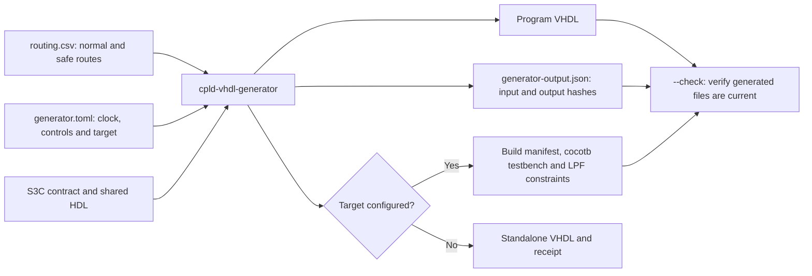

# CPLD VHDL generator

Generates VHDL-1993 slot programs from CSV routing and TOML configuration, independently of the build toolchain.
For a repository project, follow the [quickstart](../docs/quick-start.rst#generate-a-program-from-csv): create a starter with `make new name=my_slot template=generator`, edit its routing, then generate, simulate and build it.
The [generator reference](../docs/vhdl-generator.rst) documents configuration, custom S3C contracts, shared HDL and file ownership.

## Generation flow



## Standalone use

Run from the checkout, or install with `pip install .` to use `cpld-vhdl-generator`.
Requires Python 3.10 or later. Package installation includes the required TOML parser.
Create the following two files in a directory.

`routing.csv`:

```csv
output,normal_state,safe_state
d_00,fpga_00,0
d_01,fpga_01,fpga_01
fpga_02,d_02,Z
d_29,0,0
```

Each row declares an output and its normal/safe values: an input pin, `0`, `1` or uppercase `Z`.
Pins are named `d_00`–`d_29` and `fpga_00`–`fpga_29`.
Outputs must be unique and cannot also be inputs; multiple outputs may share an input.
All 60 data pins appear in the interface, with omitted pins declared as inputs.
Expressions and bidirectional ports are unsupported.

`generator.toml`:

```toml
schema_version = 3
name = "my_slot"
routing = "routing.csv"
contract = "s3c_power_on_debounce_v1"
clock = "machxo2"
pilot_policy = "unused"
```

Generate and check the files from that directory:

```sh
cpld-vhdl-generator generator.toml --output .
cpld-vhdl-generator generator.toml --output . --check
```

`python3 -m cpld_vhdl_generator` is equivalent to the installed command.
Generation prefixes program names with `cvg_` (without doubling an existing prefix) and writes `cvg_my_slot.vhdl` and `generator-output.json`.
Add `target = "uz_dslot_xo2"` to also generate the build manifest, cocotb testbench and D-slot board constraints for Diamond.
This mode requires `clock = "machxo2"`; without a target, `clock = "external"` provides `clk` and active-high `reset` ports.
Standalone generation does not update the repository catalog.

## Controls and shared HDL

The controller starts in `safe_state` and enters `normal_state` when synchronized S3C controls, the pilot policy and any `enable` input pattern permit operation.
The shared controller initializes its registers and holds safe state through the first three rising edges; normal operation is possible on the fourth edge.
Internal-clock programs tie the controller reset low and rely on synthesis preserving register initial values. External-clock programs expose a reset input that restarts the controller and its warmup when sampled high.
It returns to safe state when a condition fails and resumes automatically when all conditions hold.
The `s3c_power_on_debounce_v1` contract uses active-high ReqSafeState, ignores CarrierReady, asserts SlotOK only in normal state and keeps ReqOE high.
Use `contract = "s3c_heartbeat_v1"` to select the shared `heartbeat` architecture for `s3c_heartbeat`: normal routing requires a qualified CarrierReady heartbeat and a deasserted static ReqSafeState. The same CSV safe-state actions, pilot policy and enable inputs apply.
Set `pilot_policy = "required"` to require a high pilot input, or add an enable pattern such as `enable = {fpga_29 = 1}`.

Compile the shared `s3c_logic.vhdl` entity and contract-selected architecture into library `s3c`, then the generated top into library `work`.
Shared HDL belongs to the standalone [`xo2_library`](../xo2_library/README.md), also included in the Python distribution.
The default is `xo2_library/s3c`; `s3c_library` selects a relative directory instead.
`source_entries(load_config(config_path), output_directory)` returns the ordered paths and libraries for build tools.

Edit the CSV or TOML and regenerate to update outputs.
The receipt records input and output hashes; `--check` verifies freshness without writing files.
Changing shared HDL requires regeneration, and manually edited or unowned output files are protected from overwriting.

Generated internal control signals use `s3c_`, including `s3c_normal_state`, `s3c_card_enable`, and `s3c_clk`. Repository commands accept `release_cycle=NAME`; the standalone command uses the explicit configuration and output paths.
